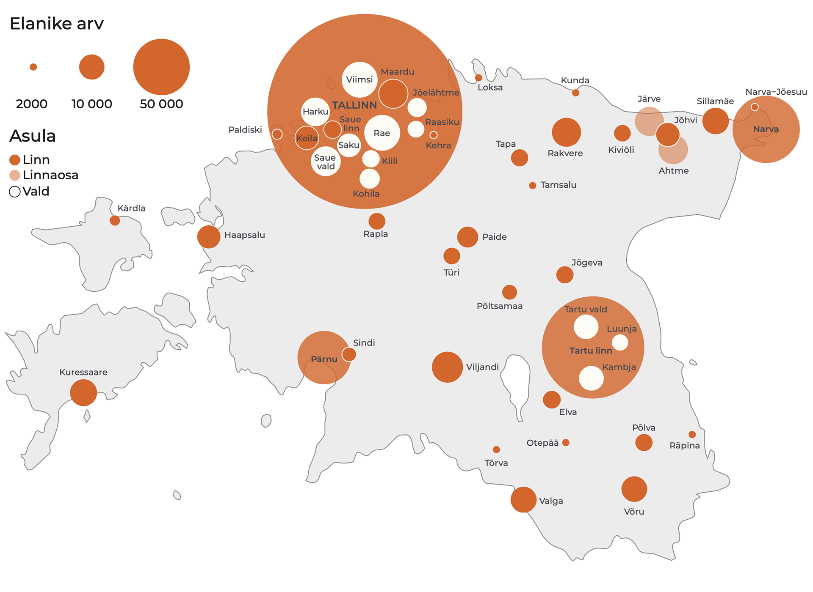

## Sissejuhatus {-.chapter_section .chapter0_section .intro_section}

<h1>Eesti ruumiline areng</h1>


```{block, type='authors'}
<div class="author-links">**[Helen Sooväli-Sepping](#helen-sooväli-sepping) ja [Antti Roose](#antti-roose)**</div>
<div><a class="print-btn" href="print/EIA-2019-0-Sissejuhatus.pdf"><i class="fa fa-file" aria-hidden="true"></i>Trükiversioon</a></div>
```

### Põhisõnumid {-.chapter0_section}

```{block, type='points'}
* Eesti on inimarengus edenenud maailma riikide hulgas 30. positsioonile, kuid jäänud sinna püsima.

Eesti elanike heaolu kasv on olnud võrrelduna teiste maailma riikidega tähelepanuväärne. Riigisiseselt süveneb piirkondlik sotsiaalne kihistumine.

* Eesti suurlinnastumist väljendab Suur-Tallinna jätkuv kasv: inimesed, majandus ja teenused koonduvad Tallinna linnapiirkonda ning ülejäänud Eesti kahaneb ja taandareneb.

Eestile kui tervikule tekitab suurlinnastumine tasakaalutust nii riikluses, halduses, majanduses, elu-, ruumi- ja keskkonnakvaliteedis. On aeg hakata tegema linnapoliitikat, luua riiklik raamistik ja sihtmeetmed, lähtudes linnapiirkondadest, mitte linnapiiridest.

* Eestlaste mitmepaiksus seob Tallinna maakondadega ning linnad küladega.

Inimeste igapäevaste tegevusruumide laienemine ja haldusreform on toonud kaasa ruumilise identiteedi lahjenemise. Autokasutusel põhinev elulaad, elu- ja tegevuskorraldus võimaldab tegutseda samaaegselt nii linnas kui ka maal. Mitmes kohas elamine, mis on tingitud töörändest, maakodudest, perevõrgustikest, sõpruskondadest, õppimisest ja vaba aja veetmisest, eeldab senisest paindlikumat ruumiplaneerimist ja halduskorraldust.

* Avalik arutelu loob parema elukeskkonna ja püüdleb ühismeelele.

Aruteluks vajalike oskuste arendamine on riiklik huvi. Osalusdemokraatia edendamiseks on vaja senisest enam toimivaid, läbipaistvaid ning tagasisidestamisel põhinevaid kodanikkonna kaasamisviise. Sellele aitavad kaasa nii digiplatvormid, analüütilisel argumentatsioonil põhinev meediaruum, asjatundlikud ametnikud kui ka usaldusväärsed eksperdid. See kõik tagab teadmiste vahetuse ning loob usaldust riigi ja tema kodanike vahel.

* Ehituspärand ja loodusalad kultuuri osana tugevdavad Eesti inimeste keskkonnasuhet ja kodutunnet.

Mitmekesise elukeskkonna eeldus on säästva arengu põhimõtetest lähtuv ehituspärandi kaitse koos investeeringukavaga, mis tagab riigile oluliste hoonete säilitamise, kasutuselevõtu ja haldamise. Eesti inimeste keskkonnateadlikkus on kiiretes ja järskudes muutustes, mis selgitab viimaste aastate ühiskondlikke vastasseise loodusalade kasutamisel. Loodusalade teadlik planeerimine ja parem külastuskorraldus aitab parandada linlaste tervist ning hoida sidet loodusega.
```

President Lennart Meri kuulutas Eesti Vabariigi 78. aastapäeva kõnes 24. veebruaril 1996:

*„Milles peitub Eesti tugevus? [---] Et Eesti asub täpselt seal, kus ta asub. Et Eesti on täpselt nii suur, nagu ta on.“*

Maismaad on Eestil katastris täpselt 43 465 km<sup>2</sup> (Maa-amet 2020). Eesti maa – nii maaressurss, geograafilised kohad, nende otstarve ja kasutus, linnad-külad kui ka loodus – on rahvuslik vara. Eesti on ja areneb siin sellel maal, võõrsõnaga „territooriumil“, teaduskeelselt „ruumis“. Eesti inimarengu aruande 2019/2020 põhiteema on Eesti ruumiline areng Eesti inimeste heaolu mõjutavates ja ühiskondlikes protsessides. Kuidas taasluua ja kasvatada Eesti ruumilist rikkust, kvaliteeti ja tasakaalu demokraatlikult ja kogu ühiskonna huvides, on selle aruande alusküsimus.

Läheneme ruumi mõistele (ingl *space*, *spatial*) viies peatükis võimalikult laialt, nii eri mõõtkavades kui ka eri tähendustes. Laiendame mõistet geograafiliselt kogu Eestile, võttes tähelepanu alla asustusstruktuuri, loodusalad, linnaruumi, sealhulgas linnadisaini ja meid ühendava aruteluruumi. Samuti kirjeldame Eesti demokraatia tervist ruumilises muutuses, säästva arengu ja ühiskonna sidususe vaatenurgast, rõhudes elukõlbliku, inimsõbraliku, inimmõõtmelise ruumi ühisloomele. Seega, ruum selle aruande katusterminina tähistab ühist ruumi, mis pälvib avalikku huvi ja pakub ühiskondlikku hüve.

Mitmes aruande artiklis kerkib üles küsimus demokraatlikest ruumisuhetest avalikus ruumis, kus avalik huvi vastandub isiklikule ja eraõiguslikule huvile. Kui avalik on avalik ruum (ingl *public space*), see küsimus on ühiskonnas viimastel aastatel teravalt kerkinud nii linnaruumi kui ka tootmisettevõtete, korterelamute, teede ja muude objektide planeerimisel, nii seoses looduses viibimisega kui ka metsade raadamisega. Tõepoolest, avalikku ruumi saab mõista avaliku ja era(statud) ruumi vastanduses. Ehkki 40% Eesti maaressursist on riigiomandis, 1% kuulub omavalitsustele, on ka selle ruumi n-ö avalikkus piiratud, näiteks riigikaitsemaa. Samuti võib avalik huvi puudutada ka seda 59% Eesti territooriumist, mis on eraomand.

```{block, type='blockquote-right'}
Ruum ise mõjutab inimeste olemist ja käitumist ning kujundab mõtteviisi nii kollektiivsel kui ka üksikisiku tasandil.
```

Ruumil on ühtlasi oluline roll ühiskondlike protsesside kujundamisel. Avaliku ruumi, sealhulgas eraõigusliku ruumi kasutamine ja kujundamine peegeldab seda, kuidas ühiskond on organiseeritud. Mida avatum ja demokraatlikum on ühiskond, seda paremad on kaasarääkimise võimalused ruumi kujundamisel ja läbipaistvamad ruumiotsused. Ruum ise mõjutab inimeste olemist ja käitumist ning kujundab mõtteviisi nii kollektiivsel kui ka üksikisiku tasandil. Lisaks on avaliku ruumi olemus viimastel kümnenditel tugevasti muutunud. Suhtlemine digiplatvormidel pakub avaraid võimalusi kohtumisteks nii tuttavate kui ka võõrastega. Nii võib digitaalne aruteluruum olla täiendus linnaväljakule või külaplatsile. Avalik digitaalne ja füüsiline ruum on omavahel tihedalt läbi põimunud, tekitades aja ja ruumi tihenemise efekti – digitaalselt saame olla samal ajal mitmes ruumis korraga.

### Eesti on inimarengus edenenud maailma riikide hulgas 30. positsioonile, kuid jäänud sinna püsima {-.chapter0_section}

Aastast 1990 ÜRO Arenguprogrammi poolt kasutusele võetud inimarengu indeksi kohaselt kuulub Eesti väga kõrge inimarengu tasemega riikide hulka. Eesti on 30. kohal indeksiga 0,882 ning püsinud samal positsioonil viimased kuus aastat ([tabel 0.1](#table01)). Indeks võtab arvesse oodatavat eluiga, keskmiselt koolis käidud aastaid ning võrreldavates hindades SKPd ühe elaniku kohta. Euroopa Liidu keskmise oodatava elueaga võrreldes elavad Eesti elanikud (78,6 aastat) keskmiselt 3 aastat vähem. Oodatav eluiga sõltub mitmest mõjutajast: keskkonnast, tervishoiuteenuste kättesaadavusest, inimeste elatustasemest ja terviseteadlikkusest. Eestis on oodatav eluiga pikem linnalistes piirkondades, eesti rahvusest ja kõrgemalt haritud elanikkonna hulgas ([Säästva arengu näitajad 2018](#Statistikaamet2018)). Haridus on jätkuvalt au sees ja väga oluline. Eestist käivad õpilased maailmas kauem koolis vaid Šveitsis, Ameerika Ühendriikides ja Kanadas.

Heaolu kasv on märkimisväärne ning toonud käibele loosungi „Eestil pole kunagi nii hästi läinud kui täna“. Mõõtmisest ja indeksisüsteemist olulisem on andmete kvaliteet ja nende sisusse süvenemine. Kett on täpselt nii tugev, kui on tema nõrgim lüli, ehk teisisõnu, elanikkond on nii jõukas, kui tema materiaalselt kõige nõrgemalt kindlustatud ühiskonnagrupid. Statistikaameti andmetel elas 2019. aastal suhtelises vaesuses 284 300 (21,7%) ja absoluutses vaesuses 31 400 (2,4%) Eesti inimest. Ligikaudu pool eakatest kogevad suhtelist vaesust. Kui vaesusriskis elavate elanike osatähtsus on viimastel aastatel aeglaselt, aga siiski vähenenud, ei ole elanikkonna rikkama ja vaesema viiendiku erinevus võrreldes 2017. aastaga muutunud. Eesti heaolu suurenemisest ei ole osa saanud kõik elanikkonna grupid, saati kõik piirkonnad. Erinevused keskmises elueas, haridustasemes ja sissetulekutes avalduvad piirkondlikult ning on seotud ühtlasi keskkonnaseisundiga ([Rahvastiku tervise arengukava 2020–2030](#RahvastikuterviseAK2030)).

Selle sajandi esimestel kümnenditel on maailmas haigusi, nälga ja vaesust tõrjudes saavutatud elustandardi kiire kasv. Kuid tänapäeval on maailm uue ebavõrdsuslaine võimuses ning 2019. aasta lõpus ilmunud globaalse inimarengu aruande keskne teema on ebavõrdsus kui inimeste heaolu kõige suurem takistaja. Aruannet raamistab tulevikku suunatud sõnum, et viimasel aastakümnel on lisandunud kaks uut üleilmset suundumust, mis mõjutavad inimeste heaolu kõikjal maailmas: tehnoloogia kättesaadavus ja kliimamuutus. Tehnoloogilised edulood nagu tehisintellekt ja masinõpe süvendavad lõhet nende elanikerühmade ja riikide vahel, kel ei ole võimalusi tehnoloogilise arenguga kaasa minna. Kliimakriis tabab juba praegu valusamini vaesemaid maailma piirkondi ja vähekindlustatud elanikerühmi. Hinnanguliselt põhjustab kliimamuutus maailmas aastatel 2030–2050 alatoitumise, malaaria, kõhulahtisuse ja kuumarabanduse tõttu 250 000 lisasurma aastas ([ÜRO 2019](#ÜRO2019)).

<p class="caption" id="table01"><span class="figure-number">Tabel 0.1</span> Inimarengu indeks ja selle alusnäitajad valitud riikides (2018)</p>

<div style="overflow-x:auto;">
<table class="table table-bordered table-hover table-condensed" id="table_01">
<thead><tr><th title="Field #1"" align="left !important">Järje- koht</th>
<th title="Field #2" class="table_01_country">Riik</th>
<th title="Field #3">Inimarengu indeksi väärtus</th>
<th title="Field #4">Oodatav eluiga sünnihetkel (a)</th>
<th title="Field #5">Eeldatav kooli- aastate arv</th>
<th title="Field #6">Keskmine kooli- aastate arv</th>
<th title="Field #7">SKP inimese kohta (2011 ostujõu pariteedi alusel, USD)</th>
</tr></thead>
<tbody><tr>
<td align="left" class="table_01_nr">1</td>
<td class="table_01_country">Norra</td>
<td>0,954</td>
<td>82,3</td>
<td>18,1</td>
<td>12,6</td>
<td>68 059</td>
</tr>
<tr>
<td align="left" class="table_01_nr">2</td>
<td class="table_01_country">Šveits</td>
<td>0,946</td>
<td>83,6</td>
<td>16,2</td>
<td>13,4</td>
<td>59 375</td>
</tr>
<tr>
<td align="left" class="table_01_nr">3</td>
<td class="table_01_country">Iirimaa</td>
<td>0,942</td>
<td>82,1</td>
<td>18,8</td>
<td>12,5</td>
<td>55 660</td>
</tr>
<tr>
<td align="left" class="table_01_nr">4</td>
<td class="table_01_country">Saksamaa</td>
<td>0,939</td>
<td>81,2</td>
<td>17,1</td>
<td>14,1</td>
<td>46 946</td>
</tr>
<tr>
<td align="left" class="table_01_nr">4</td>
<td class="table_01_country">Hongkong</td>
<td>0,939</td>
<td>84,7</td>
<td>16,5</td>
<td>12</td>
<td>60 221</td>
</tr>
<tr>
<td align="left" class="table_01_nr">6</td>
<td class="table_01_country">Austraalia</td>
<td>0,938</td>
<td>83,3</td>
<td>22,1</td>
<td>12,7</td>
<td>44 097</td>
</tr>
<tr>
<td align="left" class="table_01_nr">6</td>
<td class="table_01_country">Island</td>
<td>0,938</td>
<td>82,9</td>
<td>19,2</td>
<td>12,5</td>
<td>47 566</td>
</tr>
<tr>
<td align="left" class="table_01_nr">8</td>
<td class="table_01_country">Rootsi</td>
<td>0,937</td>
<td>82,7</td>
<td>18,8</td>
<td>12,4</td>
<td>47 955</td>
</tr>
<tr>
<td align="left" class="table_01_nr">9</td>
<td class="table_01_country">Singapur</td>
<td>0,935</td>
<td>83,5</td>
<td>16,3</td>
<td>11,5</td>
<td>83 793</td>
</tr>
<tr>
<td align="left" class="table_01_nr">10</td>
<td class="table_01_country">Holland</td>
<td>0,933</td>
<td>82,1</td>
<td>18</td>
<td>12,2</td>
<td>50 013</td>
</tr>
<tr>
<td align="left" class="table_01_nr">11</td>
<td class="table_01_country">Taani</td>
<td>0,93</td>
<td>80,8</td>
<td>19,1</td>
<td>12,6</td>
<td>48 836</td>
</tr>
<tr>
<td align="left" class="table_01_nr">12</td>
<td class="table_01_country">Soome</td>
<td>0,925</td>
<td>81,7</td>
<td>19,3</td>
<td>12,4</td>
<td>41 779</td>
</tr>
<tr>
<td align="left" class="table_01_nr">13</td>
<td class="table_01_country">Kanada</td>
<td>0,922</td>
<td>82,3</td>
<td>16,1</td>
<td>13,3</td>
<td>43 602</td>
</tr>
<tr>
<td align="left" class="table_01_nr">14</td>
<td class="table_01_country">Uus-Meremaa</td>
<td>0,921</td>
<td>82,1</td>
<td>18,8</td>
<td>12,7</td>
<td>35 108</td>
</tr>
<tr>
<td align="left" class="table_01_nr">15</td>
<td class="table_01_country">Suurbritannia</td>
<td>0,92</td>
<td>81,2</td>
<td>17,4</td>
<td>13</td>
<td>39 507</td>
</tr>
<tr>
<td align="left" class="table_01_nr">15</td>
<td class="table_01_country">USA</td>
<td>0,92</td>
<td>78,9</td>
<td>16,3</td>
<td>13,4</td>
<td>56 140</td>
</tr>
<tr>
<td align="left" class="table_01_nr">17</td>
<td class="table_01_country">Belgia</td>
<td>0,919</td>
<td>81,5</td>
<td>19,7</td>
<td>11,8</td>
<td>43 821</td>
</tr>
<tr>
<td align="left" class="table_01_nr">18</td>
<td class="table_01_country">Lichtenstein</td>
<td>0,917</td>
<td>80,5</td>
<td>14,7</td>
<td>12,5</td>
<td>99 732</td>
</tr>
<tr>
<td align="left" class="table_01_nr">19</td>
<td class="table_01_country">Jaapan</td>
<td>0,915</td>
<td>84,5</td>
<td>15,2</td>
<td>12,8</td>
<td>40 799</td>
</tr>
<tr>
<td align="left" class="table_01_nr">20</td>
<td class="table_01_country">Austria</td>
<td>0,914</td>
<td>81,4</td>
<td>16,3</td>
<td>12,6</td>
<td>46 231</td>
</tr>
<tr>
<td align="left" class="table_01_nr">21</td>
<td class="table_01_country">Luksemburg </td>
<td>0,909</td>
<td>82,1</td>
<td>14,2</td>
<td>12,2</td>
<td>65 543</td>
</tr>
<tr>
<td align="left" class="table_01_nr">22</td>
<td class="table_01_country">Iisreal</td>
<td>0,906</td>
<td>82,8</td>
<td>16</td>
<td>13</td>
<td>33 650</td>
</tr>
<tr>
<td align="left" class="table_01_nr">22</td>
<td class="table_01_country">Lõuna-Korea</td>
<td>0,906</td>
<td>82,8</td>
<td>16,4</td>
<td>12,2</td>
<td>36 757</td>
</tr>
<tr>
<td align="left" class="table_01_nr">24</td>
<td class="table_01_country">Sloveenia</td>
<td>0,902</td>
<td>81,2</td>
<td>17,4</td>
<td>12,3</td>
<td>32 143</td>
</tr>
<tr>
<td align="left" class="table_01_nr">25</td>
<td class="table_01_country">Hispaania</td>
<td>0,893</td>
<td>83,4</td>
<td>17,9</td>
<td>9,8</td>
<td>35 041</td>
</tr>
<tr>
<td align="left" class="table_01_nr">26</td>
<td class="table_01_country">Tšehhi</td>
<td>0,891</td>
<td>79,2</td>
<td>16,8</td>
<td>12,7</td>
<td>31 597</td>
</tr>
<tr>
<td align="left" class="table_01_nr">26</td>
<td class="table_01_country">Prantsusmaa</td>
<td>0,891</td>
<td>82,5</td>
<td>15,5</td>
<td>11,4</td>
<td>40 511</td>
</tr>
<tr>
<td align="left" class="table_01_nr">28</td>
<td class="table_01_country">Malta</td>
<td>0,885</td>
<td>82,4</td>
<td>15,9</td>
<td>11,3</td>
<td>34 795</td>
</tr>
<tr>
<td align="left" class="table_01_nr">29</td>
<td class="table_01_country">Itaalia</td>
<td>0,883</td>
<td>83,4</td>
<td>16,2</td>
<td>10,2</td>
<td>36 141</td>
</tr>
<tr>
<td align="left" class="table_01_nr">30</td>
<td class="table_01_est table_01_country">Eesti</td>
<td class="table_01_est">0,882</td>
<td class="table_01_est">78,6</td>
<td class="table_01_est">16,1</td>
<td class="table_01_est">13</td>
<td class="table_01_est">30 379</td>
</tr>
<tr>
<td align="left" class="table_01_nr"></td>
<td> </td>
<td> </td>
<td> </td>
<td> </td>
<td> </td>
<td> </td>
</tr>
<tr>
<td align="left" class="table_01_nr">34</td>
<td class="table_01_country">Leedu</td>
<td>0,869</td>
<td>75,7</td>
<td>16,5</td>
<td>13</td>
<td>29 775</td>
</tr>
<tr>
<td align="left" class="table_01_nr">39</td>
<td class="table_01_country">Läti</td>
<td>0,854</td>
<td>75,2</td>
<td>16</td>
<td>12,8</td>
<td>26 301</td>
</tr>
<tr>
<td align="left" class="table_01_nr">49</td>
<td class="table_01_country">Venemaa</td>
<td>0,824</td>
<td>72,4</td>
<td>15,5</td>
<td>12</td>
<td>25 036</td>
</tr>
</tbody></table>
</div>

``` {block, type='imgsource'}
<span class="imgsource-source">Allikas:</span> ÜRO 2019.
```

### Eesti suurlinnastumist väljendab Suur-Tallinna jätkuv kasv: inimesed, majandus ja teenused koonduvad Tallinna linnapiirkonda ning ülejäänud Eesti kahaneb ja taandareneb {-.chapter0_section}

Eesti kaart on lihtne. On suurlinn Tallinn, on ülikoolilinn Tartu, on suvituslinn Pärnu, on hilistööstuslik Kirde-Eesti, järjest enam puhke-, põllu- ja metsamajanduslik Lõuna-Eesti ja meretagused saared. Lihtsamalt saab Eesti jagada kaheks – on Tallinn ja (muu) Eesti: kaheksast viieni töiselt tegusad maakonnalinnad ning rahvuspargistuv ääremaa. Need ei ole sildid, vaid Eesti tegelik ruumistruktuur ja haldusjaotus ([joonis 0.1](#figure01)). Ruumilise arengu mõttes on sotsiaalteadlaste 2000. aastal osutatud „Kaks Eestit“ saanud nüüd reaalsuseks (vt [Lauristin 2001](#Lauristin2001); [Vetik 2002](#Vetik2002)).

Järjest enam arutleb teadlaskond planetaarse linnastumise teemadel, selgitades ja täpsustades linnastumisprotsesside üha tugevamat mõju üleilmastumisele, keskuskohtade ja linnaalade hägustumist ning hävitavat survet loodusele ([Schmidt 2018](#Schmidt2018)). Linnastumisprotsess põimib kokku turumajanduslikud globaalvõrgustikku ühendatud tegevused ning intensiivistab maakasutust. Maapiirkonnad muudetakse agrotööstuskompleksideks, loodust kaubastatakse näiteks turismi eesmärgil, rajatakse tööstusparke, samuti kaupade transportimiseks mõeldud logistika- ja transporditaristud.

<p class="caption" id="figure01"><span class="figure-number">Joonis 0.1</span> Eesti linnasüsteem (alates 2000 elanikust, 2019. aasta rahvaarvu alusel)</p>

```{r, figure01, out.width='100%', fig.align='center', echo=FALSE, message=FALSE}
library(sf)          # classes and functions for vector data
library(raster)      # classes and functions for raster data
library(tmap)
library(svglite)

fig_04_map_data <- st_read(dsn ="data/0_fig1_data/maakond_20200101.shp")
head(as.data.frame(fig_04_map_data))

fig_04_map_settlements <- st_read(dsn ="data/0_fig1_data/asustusyksus_20200301.shp")
head(as.data.frame(fig_04_map_settlements))

fig_04_map_counties <- st_read(dsn ="data/0_fig1_data/omavalitsus_20200301.shp")
head(as.data.frame(fig_04_map_counties))

fig_04_data_settlements <- read.csv("data/0_fig1_data/fig_04_data_settlements.csv", header=TRUE, sep=";", check.names=FALSE)
fig_04_data_counties <- read.csv("data/0_fig1_data/fig_04_data_counties.csv", header=TRUE, sep=";", check.names=FALSE)

fig_04_settlements <- merge(fig_04_map_settlements,fig_04_data_settlements, by="ANIMI")
fig_04_counties <- merge(x=fig_04_map_counties,y=fig_04_data_counties, by="ONIMI")


fig_04_settlements$Asula[fig_04_settlements$TYYP==c(4)]<- "Linn"
fig_04_settlements$Asula[fig_04_settlements$TYYP==c(5)]<- "Linn"
fig_04_settlements$Asula[fig_04_settlements$TYYP==c(6)]<- "Linnaosa"
fig_04_counties$Asula[fig_04_counties$TYYP==c(1)]<- "Vald"
fig_04_counties$Asula[fig_04_counties$TYYP==c(4)]<- "Linn"

fig_04_settlements <- fig_04_settlements[c(-2,-3,-4,-5,-6,-7,-9,-10)]
fig_04_counties <- fig_04_counties[c(-2,-3,-4,-5,-7,-8)]

colnames(fig_04_settlements)[1] <- "Nimi"
colnames(fig_04_counties)[1] <- "Nimi"

fig_04_data <- rbind(fig_04_settlements, fig_04_counties)

fig_04_map <- tm_shape(fig_04_map_data) + 
    tm_fill("#e6e3da") +
    tm_borders(col="white") +
    tm_layout (
      frame = FALSE
              )

fig_04_population <-  tm_shape(fig_04_data) +
      tm_bubbles(col = "Asula",alpha = 0.5, border.col= "white", size = "Elanike arv",scale= 10, xmod=0, sizes.legend=c(2000,10000,50000), title.size="Elanike arv", palette= c("#c54409","#79ac2c","#369b9e")) 
     # tm_text (col="#3a404a", text="Nimi",xmod=1, size=0.5, auto.placement=TRUE)
  
    tm_layout(
      outer.margins=0, inner.margins=c(.02, .1, .02, .02), asp=1920/1080,
      legend.text.size=1,
      legend.title.size=1,
      legend.outside = FALSE,
      legend.width=.25, legend.height = .7,
      legend.format=list(text.separator="kuni"),
      frame = FALSE)
  
#tmap_save(tm = fig_04_map + fig_04_population, filename = "fig_04_notext.pdf")

#svg(filename="figure.svg")
#pop_change + GDP
#dev.off()




```

``` {block, type='imgsource'}
<div><span class="imgsource-source">Allikas:</span> Statistikaamet.</div>
<div><a class="data-btn" href="data/0_fig1_data.zip"><i class="fa fa-download" aria-hidden="true"></i>Laadi andmed</a></div>
```


```{block, type='blockquote-right'}
Linnastumisprotsess põimib kokku turumajanduslikud globaalvõrgustikku ühendatud tegevused ning intensiivistab maakasutust.
```

Linna tähendust ja mõju ei saa mõõta üksnes linnavormi, tiheduse ja teiste ruumitunnustega. Tänapäeva linn määratleb end halduspiire ületava sotsiaalruumilise jõuna ([Brenner 2019](#Brenner2019)). Nii ei ole ka Eesti linn praegu enam traditsioonilise arusaama kohaselt ühe selgelt eristuva linnakeskusega tööstuslik tiheasula. Praegused 47 halduspiiridega linna moodustavad Eestis linnasüsteemi tinglikult, sest enam kui poolel neist napib 21. sajandi mõistes suurust ja linnalisi omadusi. Eestis väljendub linnastumine linnaalade laienemise ja linnarahvastiku kasvuna Tallinnas. Linnapiirkondlikud majandusteooriad seletavad praegust suurlinnastumist süveneva tasakaalutuse ja kasvu koondumisena ([Nijkamp ja Kourtit 2013](#Nijkamp2013)). Nende majandusmudelite õpikunäide on Eesti. Linnastumisel, iseäranis suurlinnastumisel on arvestatavad negatiivsed välismõjud eeskätt linnaruumi- ja keskkonnakasutuses, aga ka sotsiaalses plaanis, nagu näiteks ühiskonna kihistumises. Eesti linnastumist 2000. aastatel iseloomustasid kiired euroopalikud õigus-, haldus- ja sotsiaal-majanduslikud muutused ([Raagmaa jt 2014](#Raagmaa2014)) ([tabel 0.2](#table02)). 2010. aastatel toimus Euroopas majandustõusu uuel lainel suurlinnade kokkusulamine hiigelregioonideks (London-Manchester, Pariis-Brüssel-Amsterdam-Saksa linnastud; Rooma-Milano-Torino). Nõnda ei ole Tallinn teiste suurlinnade seas sugugi suur, Euroopa Liidus elanike arvu poolest alles 59. kohal.

<p class="caption" id="table02"><span class="figure-number">Tabel 0.2</span> Euroopa ja Eesti linnapoliitika võtmearengud</p>

<div style="overflow-x:auto;">
<table class="table table-bordered table-hover table-condensed" id="table_02">
<thead><tr><th title="Field #1">Aastakümnend</th>
<th title="Field #2">Euroopa areng</th>
<th title="Field #3">Euroopa võtmeprotsessid</th>
<th title="Field #4">Linnapoliitika võtmeteemad „vanas” Euroopas</th>
<th title="Field #5">Linnapoliitika võtmeteemad Eestis</th>
</tr></thead>
<tbody><tr>
<td class="table_02_red">1990</td>
<td>Ühisturu integratsioon ja üleeuroopalised taristud, sh transpordivõrk.</td>
<td>Demokratiseerimine ja riigireformid Kesk- ja Ida-Euroopas.</td>
<td>Kultuur ja turism. Konkurentsipoliitika.</td>
<td>Üleminekureformid, sh maa- ja omandireform ning linnahaldus. Erastamine ja kinnisvaraturu teke.</td>
</tr>
<tr>
<td class="table_02_red">2000</td>
<td>Euroopa Liidu itta laienemine. Terrorism.</td>
<td>Majandusbuum ja finantskriis.</td>
<td>Suurlinnastud. Elukvaliteet.</td>
<td>Linnaplaneerimine. Kinnisvarabuum, sh eeslinnastumislaine, uued keskused ja linnataristud ning ärilinnak.</td>
</tr>
<tr>
<td class="table_02_red">2010</td>
<td>Hiigelregioonid suurlinnastute võrgustikuna.</td>
<td>Majanduse taastumine. Kokkuhoiupoliitika.</td>
<td>Nutikas spetsialiseerumine. Tehnoloogiline areng ja innovatsioon.</td>
<td>Suurarendused ja suurtaristud. Keskklassistumine. Avaliku ruumi teema esilekerkimine. Kaasav linn ja kodanikuaktivismi teke.</td>
</tr>
<td class="table_02_red">2020 ja tulevik</td>
<td>Deglobaliseerumine. Euroopa geopoliitilise positsiooni hoidmine maailmas. Kliimaneutraalsus.</td>
<td>Majanduskriis. Brexit. Roheline lepe. Digitaalsus. Populism. Euroopa kultuuri kaitse.</td>
<td>Säästlik, tark hooliv linn. „Uus” demokraatia.</td>
<td>Rail Baltica. Talsinki. Kestlik kahanemine. Sotsiaalsüsteemid.</td>
</tr>
</tbody></table>
</div>

``` {block, type='imgsource'}
<span class="imgsource-source">Allikas:</span> Clark jt 2018; Mäntysalo jt 2019; Raagmaa jt 2014.
```

Linnaareng tervikuna põhineb Eestis linnamaa laienemisel, maavõtul. Aastatel 2000–2017 on asustusalade pindala Eestis suurenenud 138 km<sup>2</sup> võrra ([Oja, ptk 1](#maakasutuse-muutused-linna-ja-maa-tähenduse-moondumine)). Maakasutuse muutusena on Eestis neil aastatel tinglikult rajatud juurde üheksa Viljandi linna, aga tegelikkuses ega kaardil ühtegi uut linna pole. Samal ajal iseloomustab linnade kasvu killustatus ja hajumine. Akadeemik Mart Kalm on pannud diagnoosi Eesti ehitatud ruumile ([Kalm 2018](#Kalm2018)):

*„Võrreldes ülejäänud Euroopaga on piinlik tunnistada, kui vähe tähelepanu pöörame tänapäeval jätkusuutlikkusele. [---] Vaesus ja muutuvad olud on harva lasknud terviklikel keskkondadel tekkida, mistõttu modernset Eestit iseloomustab rohkem keskkonna katkendlikkus.“*

```{block, type='blockquote-left'}
21&#8291;. sajandi kahe esimese aastakümne suurlinnastumine on juba kujundanud Eesti arengulugu.
```
Praeguse seisuga elab linnakeskkonnas 920 000 inimest ehk 69% Eesti elanikest, kellest omakorda Suur-Tallinnas umbes 550 000 ehk 40% Eesti elanikest ([Roose, ptk 1](#planeerimisvabaduse-võidukäik-eeslinna-eestis)). 21. sajandi kahe esimese aastakümne suurlinnastumine on juba kujundanud Eesti arengulugu, kuid ei ole veel võrreldav massilise elamuehituse ja sisserändeajastuga 1970.–1980. aastatel. Suur-Tallinna kasv 2010. aastatel on tähendanud laialdasi ja veel suuremaid kinnisvaraarendusi ning liiklustaristut, linnaasumite segregatsiooni ([Tammaru jt 2020](#Tammaru2020)), uusasumite killustatud laienemist ([Roose, ptk 1](#planeerimisvabaduse-võidukäik-eeslinna-eestis)) ning vähenevat avalikku linnaruumi ([Paaver ja Kiivet, ptk 2](#avalik-ruum-kui-elukeskkonda-siduv-võrgustik)). Kiire autostumise kasvuga võtavad üha suurema osa linnade territooriumist enda alla sõiduteed ja parkimiskohad ([Grišakov, ptk 5](#eesti-elukeskkond-aastal-2050)). Ka taristuinvesteeringud on suunatud eelkõige sõiduteedesse, vähem kõnni- ja jalgrattateedesse, linnaväljakutesse ja parkidesse. Autostumisega kaasnev inimeste vähene füüsiline liikuvus ([Tuvikene jt, ptk 1](#ligipääsetavuse-muutused-autostunud-eestis)) võib omakorda mõjutada füüsilist ja vaimset tervist, mille näitajad tingituna ülekaalulisusest ja vaimsetest häiretest on terves Eestis viimastel kümnenditel languses ([Säästva arengu näitajad 2018](#Statistikaamet2018)). Sillutatud ja ehitatud linnamaaks ohverdatakse linnarohelus, mis on teravnevas kliimakriisis omandanud järjest olulisema tähenduse nii elurikkuse ja süsinikusalvena kui ka linna tehiskeskkonna ja inimeste tekitatud keskkonnamõjude puhastamisel ja puhverdamisel ([Poom ja Sepp, ptk 3](#loodusalade-kujundamine-avalikuks-kasutuseks); [Hansis jt 2015](#Hansis2015); [EEA 2019a](#EEA2019)). Tormakas linnakasvus põrkuvad sageli avalikud ja erahuvid (nt Viimsi valla arendustegevus, Tallinnas Kalamaja tihendamine jne; vt [Paaver ja Kiivet, ptk 2](#avalik-ruum-kui-elukeskkonda-siduv-võrgustik); [Kljavin jt, ptk 2](#aktivism-avaliku-ruumi-koosloomes); [Ventsel ja Madisson, ptk 4](#ühiskondlik-poliitiline-diskussioon-digitaalses-avalikus-ruumis)).

Tallinnale pakub arengupotentsiaali kaksiklinnastumine Helsingiga. Teadmusmajandust ja innovatsiooni arendav tulevikulinn Talsinki võiks liita Helsingi üleilmselt tunnustatud teadmus- ja elukvaliteedi Tallinna uuenduslikkuse ja kasvuhooga. Kui nii läheb, siis sünnib miljonilinn, maailmalinn ([Grišakov, ptk 5](#eesti-elukeskkond-aastal-2050)).

### Eesti inimeste mitmepaiksus seob Tallinna maakondadega ja linnad küladega {-.chapter0_section}

Kõik maakonnad peale Harjumaa on kahanemas. Aastatel 2000–2018 lisandus Harjumaale 10% rahvastikku, samal ajal kui Tartumaa rahvastik vähenes 4%, teistes maakondades jäi elanikke vähemaks kümnendiku kuni veerandi võrra. Kahanemine on suurlinnastumise pöördprotsess. Selle näiteks on ühe Tallinna uue eeslinnaasumi ja ühe maa-aleviku rahvastikupüramiid ([joonis 0.2](#figure02)). Tallinna eeslinnaasumis elavad noored lastega pered, maa-alevikus üle viiekümnesed. Kahanev on piirkond, mille elanikkond väheneb olulisel määral ühe põlvkonna jooksul. Maakonnad kaugenevad Tallinnast nii ruumiliselt, majanduslikult, sotsiaalselt, elutingimuste poolest kui ka kultuuriliselt ([Kährik ja Väiko, ptk 1](#nüüdisaegsed-elamistingimused-kelle-privileeg); [Plüschke-Altof jt, ptk 1](#keskuse-ja-ääremaa-lõhe-eestis)). Selle arengu keskmes on viimasel kümnendil vastuseid ootav küsimuste kimp: kas kahanevatel maakonnalinnadel on jõudu, et maakondi käima tõmmata; kas ettevõtluskeskkond on piisavalt elav ja mitmekesine ning kas tööjõubaas ja -areaal on küllaldane majanduse arenguks?

<p class="caption" id="figure02"><span class="figure-number">Joonis 0.2.</span> Tallinna eeslinna asumi vs maa-aleviku rahvastikupüramiid</p>

<div class="desktop-plot">
```{r, joonis02, fig.cap='', out.width='100%', fig.asp=.75, fig.align='center', echo=FALSE, message=FALSE}

library("tidyverse")
library("scales")
library("reshape")
library("showtext")
library("plotly")

showtext_auto()
font_add_google(name = "Montserrat", family = "Montserrat")

fig02_data <- read.csv ("data/0_fig2_data.csv", header=TRUE, fileEncoding="utf-8", sep=";", check.names=FALSE)
fig02_data <- melt(fig02_data, id=c("Vanus","Asukoht"))

names(fig02_data)[names(fig02_data) == "variable"] <- "Sugu"
names(fig02_data)[names(fig02_data) == "value"] <- "Protsent"

fig02_data$Vanus <- factor(fig02_data$Vanus, levels = c("0-4","5-9","10-14","15-19","20-24","25-29","30-34","35-39","40-44","45-49","50-54","55-59","60-64","65-69","70-74","75-79","80-84","85-89","90+"))

fig02_data$Asukoht <- factor(fig02_data$Asukoht, levels = c("Tallinna eeslinn","Maa-alevik"))

fig02_data$percent=percent((fig02_data$Protsent/100), 1)

fig02_data$Osakaal <- ifelse(test = fig02_data$Sugu == "Mehed", yes = -fig02_data$Protsent, no = fig02_data$Protsent)
                   
  fig02_plot <- ggplot(data = fig02_data,
       mapping = aes(x = Vanus, y = Osakaal,fill = Sugu)) +
      geom_col() +
      coord_flip() +
      scale_y_continuous(labels = abs, breaks=c(-15,-10,-5,0,5,10,15), limits = max(fig02_data$Protsent) * c(-1.2,1.2)) +
      scale_fill_manual(values=c("#369b9e","#c54409")) +
      labs(y = "%") +
      facet_wrap(~Asukoht, nrow=1, strip.position="top")

    fig_theme_general <- theme(
                     text = element_text(color = "#292b2c", size = 10, family=""),
                     panel.background = element_rect(fill = "white", colour = "white"),
                     panel.grid.major = element_line(colour="#eaeaea", size = (0.2)),
                     panel.grid.minor = element_line(size = (0.2), colour="#eaeaea"),

                     axis.line = element_line(size = 0.2, colour = "#eaeaea"),
                     axis.ticks = element_line(colour = "#eaeaea", size=(0.2)),
                     axis.text.x = element_text(margin = margin(t = 10, r = 0, b = 0, l = 0)),
                     axis.text.y = element_text(margin = margin(t = 0, r = 50, b = 0, l = 0)),
                    axis.title.y = element_text(margin = margin(t = 0, r = 20, b = 0, l = 0)),
                    axis.title.x = element_text(margin = margin(t = 15, r = 0, b = 0, l = 0)),
                    plot.margin = unit(c(0.5,0,0,0), "cm"),

                     legend.position="top",
                     legend.title=element_blank(),
                     legend.key = element_rect(fill="white"),
                      legend.background = element_rect(fill=NA),

                    strip.text = element_text( size = 10, color = "#292b2c"),
                    strip.background = element_rect(color="white", fill="white")
  )

  fig02_theme <- theme(
    text=element_text(family="Montserrat")
                 )
ggplotly(fig02_plot + fig_theme_general + fig02_theme, tooltip = c("Vanus", "Sugu")) %>% 
config(displayModeBar = F, collaborate = F)   %>% 
layout(legend = list(orientation = "h",y = 1.15)) %>% 
layout(xaxis = list(fixedrange = TRUE)) %>%
layout(yaxis = list(fixedrange = TRUE))
  

#ggsave(path="exported_figures/PDF/chapter0",filename="fig05.pdf", height=130, width=200, units="mm")
```

</div>
<div class="mobile-plot">
```{r, out.width='100%', fig.align='center', echo=FALSE, message=FALSE, warning=FALSE}
print(fig02_plot + fig_theme_general + fig02_theme)
```
</div>

``` {block, type='imgsource'}
<div><span class="imgsource-source">Allikas:</span> Rahvastikuregister.</div>
<div><a class="data-btn" href="data/0_fig2_data.csv"><i class="fa fa-download" aria-hidden="true"></i></i>Laadi andmed</a></div>
```

Kahanemisküsimus ei taandu pelgalt töörändele ja suurema sissetuleku otsingutele. Elamufondi ülejääk ja vananemine nii elutingimuste poolest kui ka ehitustehniliselt on muutnud paljud Eesti pered kinnismaisteks, kuivõrd nende kodu turuhind on madal. Samal ajal puudub maakondades noortel peredel võimalus alustada elu uuselamus, uues kodus. Ebavõrdsus elamistingimustes ja kinnisvarahindades, alaealist ja pensioniealist elanikkonda liikuvusvaesusesse lükkav harv ühistransport süvendab üldist regionaalset ebavõrdsust Eestis ([Kährik ja Väiko, ptk 1](#nüüdisaegsed-elamistingimused-kelle-privileeg); [Tuvikene jt, ptk 1](#ligipääsetavuse-muutused-autostunud-eestis)).

```{block, type='blockquote-right'}
Eestis ootab lahendamist kohapõhine targa kahanemise plaan kolmes valdkonnas: töökohad, elukohad, põhiteenused.
```
Maakonnatasandi ja maakonnalinnade nõrgenemine on kiirendanud suundumust kahe-keskuse-Eestiks, mis koosneb Tallinnast ja Tartust, kattes nende tagamaad tunniajase autosõidu raadiuses ([joonis 0.3](#figure03)). Töökoht liigub Tallinna ja Tartusse ees, elukoht ja teenused tulevad järele. Ülikooliõpingute järel ei naase paljud noored kodukohta, vaid jäävad elama Tallinna või Tartusse. Seda laadi protsessi leevendab eestlaste mitmepaiksus (ingl multilocality). Arvukalt elanikke omab kahte kodu, ühte linnas ja teist maapiirkonnas, kuhu sõidetakse nädalavahetuseti ja suvepuhkuseks. Nendele lisanduvad hargmaised pered, kes elavad piiri taga ja käivad Eestis puhkamas. Hargmaisus on toonud Tallinnale Helsingi ja Stockholmi lähemale näiteks Rakverest või Paidest, seda nii ajageograafiliselt elu- ja töökohtadena kui ka eluoluliselt. Sestap jäävad maakonnad, aga ka ülikoolilinn Tartu üleilmastumisprotsessides siseisolatsiooni ([Leetmaa, ptk 1](#sissejuhatus-1)). Ka koduläheduse mõiste on aja ja ruumi tihenemise ja kiirenemise ([Lauristin jt 2017](#Lauristin2017)) ja linliku elumudeli tõttu muutunud, laienenud ülelinnaliseks või isegi piirkondlikuks. See omakorda on lahjendanud ruumilist identiteeti, hägustanud kodulinna ja koduküla tähendust.

<p class="caption" id="figure03"><span class="figure-number">Joonis 0.3.</span> Geograaf Edgar Kandi ajalooline Eesti linnasüsteem kehtib põhimõtteliselt ka tänapäeval, sh kahekeskuseline Tallinna- ja Tartu-tõmbeline Eesti ning nende linnade tagamaad autosõiduraadiuses, nn ühe-tunni-Eesti</p>

```{r, figure03, out.width='100%', fig.align='center', echo=FALSE, message=FALSE}

knitr::include_graphics("figures/0-intro/fig03.png")

```

``` {block, type='imgsource'}
<span class="imgsource-source">Allikas:</span> Kant (1935).
```

Kestliku kahanemise võtit ei ole seni pakkunud ruumilised ümberkorraldused riigihalduses ega ka haldusreform. Üha hõredam asustus ühelt poolt sundis keskvalitsuse nõudmisel maavaldu liituma ja ühiselt maaelu korraldama, kuid teiselt poolt liiguvad teenused ja muud sotsiaalsed võrgustikud linna (ostu- ja vabaajakeskused, haridus- ja raviteenused jm). Ettevõtlust edendavad ja maapiirkondi elavdavad Euroopa Liidu programmid ja projektid on mõjunud tagasihoidlikult, sest on jõudnud suurel määral linnapiirkondadesse ([Eesti regionaalarengu strateegia 2014–2020 seireraport 2019](#Regionaalarengustrateegia2019); [Raagmaa jt 2014](#Raagmaa2014)). Konkurentsivõimele keskenduv regionaalpoliitika on toetanud turumajanduslikke arengusuundumusi ega ole ääremaastumisprotsessi vähendanud ([Plüschke-Altof jt, ptk 1](#keskuse-ja-ääremaa-lõhe-eestis)).

Eestis ootab lahendamist kohapõhine targa kahanemise plaan kolmes valdkonnas: töökohad, elukohad, põhiteenused. See eeldab Eesti piirkondade arengu kavandamist ja lahendamist kahes põhimõtteliselt erinevas võtmes: turumajanduslikel printsiipidel kasvu ja konkurentsi ning solidaarsuspõhimõttel kestliku kahanemise võtmes. Eesti vajab kaht haldusmudelit – üht suurlinnastumise, teist kahanemise puhuks.

### Avalik arutelu loob parema elukeskkonna ja püüdleb ühismeelele {-.chapter0_section}

Samavõrd kui avaliku füüsilise ruumi olemus on viimastel kümnenditel olulisel määral muutunud, on muutunud meie suhtluskeskkonnad. Suhtlemine ja sotsialiseerumine digiplatvormidel pakub avaraid võimalusi aruteludeks ja kohtumisteks tuttavate, aga ka täiesti võõraste inimestega. Virtuaalne ruum võtab üle füüsilise ruumi funktsioone ([Ibrus, ptk 4](#sissejuhatus-4)). Nii nagu elukeskkond ja füüsiline ruum, peab arutelukeskkond olema mitmekesine ja tasakaalustatud ([Kõuts-Klemm, ptk 4](#ajakirjanduse-kujundatav-arvamusruum)). Praegu on traditsiooniline paberväljaannetega ajakirjandus taandumas uute meediavormide ees ning seeläbi võimendamas digilõhet. Ühtlasi on see tähendanud mitmel pool Eestis kohaliku inforuumi ahenemist ([Kalmus ja Siibak, ptk 4](#eesti-noored-virtuaalses-arvamusruumis)). See viitab probleemile, et vanemaealised ei saa osa meediaruumist, sest nende digipädevus on ebapiisav ([Tambaum 2019](#Tambaum2019)).

Avalike teemade arutamisel võrgumeedias on toimunud liikumine argumentatsiooni ülelihtsustumise suunas. Suhtluses valdavad kiiresti mõistetavad ja tugeva emotsionaalse laenguga sõnumid ([Ventsel ja Madisson, ptk 4](#ühiskondlik-poliitiline-diskussioon-digitaalses-avalikus-ruumis)). Samal ajal on nii uue meedia kui ka sellest tulenevat kajakambrite mõju aruteluruumile üle hinnatud. Sotsiaalmeediast pärit emotsionaalne suhtlusviis on üle kandunud kogu meediaruumi, kus eksperdi ja tõenduspõhist argumentatsiooni võidakse ära kasutada eri positsioonide vastandamiseks ning argumentide tühistamiseks selle asemel, et leida väitluses ühisosa ([Olesk, ptk 4](#ekspertide-roll-ja-staatus-ühiskondlikes-meediaaruteludes)). Samal põhjusel ei soovi Eesti noored osaleda avalikus debatis ([Kalmus ja Siibak, ptk 4](eesti-noored-virtuaalses-arvamusruumis)). Suhtluskultuuri kuulub oskus järgida avaliku suhtlemise head tava.

```{block, type='blockquote-left'}
Suhtluskultuuri kuulub oskus järgida avaliku suhtlemise head tava.
```

Eesti kodanikuühiskonna eestkõnelejad on seisnud hea selle eest, et edendada nii arutelu- kui ka kaasamiskultuuri. Sellegipoolest on kodanikuaktiivsus Eestis vähene, olles näiteks Soomest ja Rootsist enam kui mitukümmend aastat maas ([Ainsaar ja Strenze 2019](#Ainsaar2019)). Iseseisvunud Eestis on ruumi planeerimise praktikad ja tavad muutunud avatumaks, demokraatlikumaks. See on kinnistamas inimestes arusaama, et kaasamine on osa kvaliteetse elukeskkonna loomisest ja kujundamisest. Ometi iseloomustavad valdava osa Eesti elanike suhtumist kaasamisse pigem passiivsus ja pessimism ([Vahtrus jt, ptk 3](#kaasarääkimise-võimalused-loodusalade-kasutamisel)). Põhjusena saab välja tuua vähese tagasisidestamise ja formaalse suhtumise, mis kahandab kaasamise tähendust ja usaldusväärsust ning tekitab kaasamisväsimust. Avaliku ruumi eest seisvad huvirühmad otsivad aktiivselt dialoogipartnereid avaliku sektori või erasektori hulgast ning tõukavad tagant kodanikuühiskonna ja demokraatlikuma kaasamiskultuuri arengut ([Kljavin jt, ptk 2](#aktivism-avaliku-ruumi-koosloomes)). Vaatamata sellele on avalik haldus muutunud kohmakalt bürokraatlikuks ja ühtlasi spetsiifiliselt tehnokraatlikuks. Konsensuse – eesti keeli ühismeele – leidmist raskendab erialakeele barjäär planeerijate, projekteerijate ja kodanike vahel. Avalikuks aruteluks interneti sügavustes esitatud tehniliselt detailirohked joonised ja kirjeldused ei jäta tavainimesele võimalust kaasa rääkida oma piirkonna arengus. See omakorda on toonud kaasa arendamise ja ruumilise muutuse eituse, mitte-minu-tagahoovis-suhtumise (ingl NIMBY).

Viimaste aastate konfliktid ruumi planeerimisel ning arutelud loodusalade kasutamisest annavad tunnistust keskkonna väärtuste mitmetimõistmisest.

```{block, type='blockquote-right'}
Viimaste aastate konfliktid ruumi planeerimisel ning arutelud loodusalade kasutamisest annavad tunnistust keskkonna väärtuste mitmetimõistmisest.
```
Arutelu kehv kvaliteet on infoajastu suurimaid probleeme. Parema ruumi loomiseks ja osapoolte arusaamade selgitamiseks on mitmesuguseid lahendusi. Tasakaalustatud, ühismeelele püüdlev aruteluruum on ühiskonna eri gruppide koostöö ja sidustamise eeldus. Aruteluks vajalike oskuste arendamine on riiklik huvi. Kodanikupädevust ja aruteluoskusi on tarvis parandada, et võimestada kodanikke ja edendada laiapõhjalist demokraatiat. Võimalusi selleks pakuvad arendamisel digiplatvormid, asjatundlikud ametnikud ja usaldusväärsed eksperdid.

### Ehituspärand ja loodusalad kultuuri osana tugevdavad Eesti inimeste keskkonnasuhet ja kodutunnet {-.chapter0_section}

Kultuuriruumi lahutamatu osa on materiaalne ja füüsiline ruum kui rahvuse enesekirjelduse viis, nii nagu on seda ajaloo- ja tekstinarratiivid. Elukeskkond oma tänaste ja ajalooliste hoonete, linna- ja külastruktuuri, asustusstruktuuri ning maakasutusega kannab endas eri ajalooetappide kihistusi. Seeläbi on maastik koos kujundamise ja kujutamisega üks olulisemaid kollektiivse mälu ja identiteedi loomise vahendeid samamoodi, nagu on seda eestikeelsed tüvitekstid, filmid, teatrietendused või laulu- ja tantsupeod. 2018. aasta kogumik „Eesti säästva arengu näitajad“ sedastab säästva arengu 11. eesmärgis, et kultuuripärandi olukord osutab eesti kultuuri kestlikkusele ja ühiskonna teadlikkusele kultuuripärandi väärtustest.

Riigi esmatähtsad kultuuri- ja mäluasutused Kumu ja ERM on valmis ehitatud. Käes on aeg senisest enam pühenduda olemasoleva arhitektuuri- ja maastikupärandi väärtustamisele. Uusehitiste rajamise kõrval võiks hoonestuses kavakindlamalt eelistada ehituspärandi uuskasutust. Sellest saab sotsiaal-majanduslikku kasu terve piirkond, mitte üksnes konkreetne eluala ([Historic England 2019](#HistoricEngland2019)). Kultuuripärandi kasutuselevõtt muudab väikelinnad ja maa-alevikud tervikuna atraktiivsemaks nii elanikkonnale kui ka piirkonna külastajatele ([Talk ja Raie, ptk 2](#ehituspärand-ja-ruumikvaliteet)). Seda laadi mõtteviisi juurutamise eeldus on põhjalikud sotsiaal-majanduslikud mõjuanalüüsid ja terviklik vaade nii ehituspärandile kui ka tervele piirkonnale, samuti võimalikult paljude osapoolte huvide ja võimalustega arvestamine ([Lankots, ptk 2](#sissejuhatus-2)). Samuti on kohane iga objekti puhul küsida, mis on ehituspärandi säilitamise eesmärk või milline on riigi või siis eraomaniku suutlikkus kaitsealustesse objektidesse investeerida. Mitmekesisema elukeskkonna seisukohast vajab Eesti ehituspärand kaitset koos sotsiaal-kultuurilise ning majandusliku mõjuhindamise, riikliku investeeringukava ja meetmetega, mis tagavad riigile prioriteetsete ajalooliste hoonete säilitamise, kasutuselevõtu ja haldamise.

Viimaste kümnendite linnastumisprotsess on avaldanud mõju kultuuriloomele. Eestis on rohkelt säilinud põlvest põlve suulise pärimuse teel edasi kantavaid kultuuripraktikaid, nagu näiteks seenel- ja marjulkäik ning aiasaaduste kasvatamine ja konserveerimine. Loodust kaitstakse ja keskkonnast hoolitakse. Selle tõestuseks on iga-aastane tuhandeid Eesti inimesi koondav „Teeme ära“ talgupäev. RMK puhkealad on linlaste seas ülipopulaarsed ning mitmel pool külastuskoormuse piiril. Sellegipoolest on Eesti elanikkonna kontakt loodusega vähenemas ja nii on paar viimast põlvkonda Eestis kaotamas looduse tundmist laiemalt, samuti esineb põhjendamatut looduskartust ([Sepp ja Lõhmus, ptk 3](#kuidas-inimesed-eesti-looduskeskkonda-kasutavad)). Üleeuroopaline ja Eesti elurikkuse ja looduspaikade kadu ([EEA 2019b](#EEA2019b); [Lõhmus, ptk 3](#sissejuhatus-3)) ning tehiskeskkonna laienemine annavad märku Eesti ühiskonna väärtussüsteemi katkestustest, mis selgitab viimaste aastate konflikte ruumi planeerimisel ja looduskasutuses ([Olesk, ptk 4](#ekspertide-roll-ja-staatus-ühiskondlikes-meediaaruteludes); [Vahtrus jt, ptk 3](#kaasarääkimise-võimalused-loodusalade-kasutamisel)). Selline kultuurikatkestus on otseses seoses keskkonnateadlikkuse ja -käitumisega. Meil ei ole võimalik suurendada inimeste ökoloogilist teadlikkust, kui loodusega kokkupuude piirdub telesaadete, ajakirjas avaldatud fotode või loodusmuuseumi külastusega ([Gandy 2018](#Gandy2018)). Kliimamuutuse ja bioloogilise mitmekesisuse küsimustesse hakatakse ühiskonnas tõsisemalt suhtuma siis, kui inimene kogeb, tajub ja tunnetab loodust vahetult. Terviklik, eesmärgipärane planeerimine Eesti linnapiirkondades peatab inimeste tervisele ja heaolule ülioluliste linnalähedaste ja linnasiseste rohealade täisehitamise.

### Tulevikuvaade {-.chapter0_section}

Linnad on võimsa sotsiaal-majandusliku mõjujõuga, kuid samal ajal haavatavad süsteemid. Inimarengu aruande autorid juhivad järjekindlalt tähelepanu, et Eesti suuremate linnade, kuid eriti Tallinna linnapiirkonna kasv tehiskeskkonna hoonestuse ja taristuna on rajatud tihtipeale inimeste vaimsele ja füüsilisele heaolule tähtsa avaliku ruumi ja roheluse arvelt. Samuti tuuakse välja kliimamuutuse ning kiire autostumise omavahelist seost. Süsinikuheite vähendamine sõltub kliimasõbralikumate liikuvusviiside eelistamisest ([Tuvikene jt, ptk 1](#ligipääsetavuse-muutused-autostunud-eestis)).

Näited arvukatest linnadest nii Läänemere piirkonnas kui ka Euroopas laiemalt rõhutavad linnade kasvavat rolli säästva arengu ning innovatsiooni veduritena. Linnade arengut suunab lähitulevikus ja pikemas vaates Euroopa Liidu kliimapoliitika. Mida kliimapoliitikast lähtuv valitsemine kaasa toob? Planeerimisotsuse peamiseks mõõdupuuks saab maakasutuse efektiivsus kliimamuutuse seisukohast. Euroopa kliimapoliitika fookus laieneb lähikümnendil energiakasutuselt maakasutusele, mida praeguses süsinikuheite arvestuses tähistab lühend LULUCF, tähtsustamaks maakasutuse muutuse ja metsanduse rolli süsinikuringes. Üha tähtsamaks saab ringmajandus. Linnakeskkonnas avaldub see linnapiirkondade uuendamises, mahajäetud maa-alade kasutuselevõtus ja vanade hoonete kasutuselevõtus uute hoonete ehitamise asemel.

Säästva arengu põhimõtteid järgivale ja head elukvaliteeti pakkuvale linnakeskkonnale on iseloomulik, et selles on hea olla nii 8- kui ka 80-aastasel inimesel. Uut linnaajastut Eestis edendab Tartu linn teel Euroopa kultuuripealinnaks, määratledes linnakultuuri linnaruumi ja elukeskkonnana. Lähiaastatel eelistab Tartu taristuinvesteeringutes jalakäijaid ja rattureid, vääristab südalinna, rajades lastele ja eakatele sobivaid linnaparke ning luues uut otstarbekohast arhitektuuri ja tänavakultuuri. Ka Pärnu on seadnud eesmärgiks parandada elanikkonna terviseseisundit linnakeskkonna kvaliteeti tõstes. Linnade koostöö ülikoolide ja terviseasutustega tervist toetava keskkonna loomisel võimaldab luua vundamendi rahvatervise parandamiseks ning seeläbi otseste tervisekulude vähendamiseks ([Grišakov, ptk 5](#eesti-elukeskkond-aastal-2050)).

```{block, type='blockquote-right'}
Eesti ei ole oma ääremaastumisega erand, kuid tulenevalt Eesti geopoliitilisest asendist võib see osutuda riikluse probleemiks.
```

Ei Põhjala ega ülejäänud Euroopa pole suutnud seni maapiirkondadele kahanemist pidurdavat poliitikat välja pakkuda. Mõningaid Eestile sobivaid häid näiteid pakuvad eeskujuks Põhjamaad ([Nordregio 2017](#Nordregio2017)). Eesti ei ole oma ääremaastumisega erand, kuid tulenevalt Eesti geopoliitilisest asendist võib see osutuda riikluse probleemiks. Järjest hõredam püsiasustus piirialadel loob ruumilise vaakumi, kus tegutsevad Eesti sõjaväelised ja jõustruktuurid. See on tihti ainus võimalus tagada riigi kohalolek. Piiriäärsete piirkondade teema eeldab tihedamat koostöös teiste Balti riikidega. Haldusreformi järel vajavad maapiirkondade inimesed kindlustunnet, et kvaliteetsed teenused on kättesaadavad kõigile elanikkonna eagruppidele. Teiste riikide kogemusele tuginedes (samas) võib elanikkonna piirkonda püsimajäämise ja noorte piirkonda meelitamise võti peituda kodanike aktiivses osalemises piirkonna arenguprotsessides ja nende suunamisel. Kohaliku omavalitsuse jõustav, koostööle kutsuv avatud valitsemine tagab usaldusväärse õhkkonna, et koha arengu kavandamine ja elluviimine muutub inimestele oluliseks ning kohalikel elanikel on võimalus ise piirkonna arengut suunata. Need on strateegilised pikaajalised kokkulepped, mis rajanevad usaldusel ja kestavad poliitikaüleselt.

Eesti kodanikuühiskonna lõimimisel valitsuse, ametiasutuste ja kohaliku tasandi otsustusprotsessidesse on kasutamata potentsiaal. Osalusdemokraatia edendamiseks vajame esiteks senisest enam toimivaid, läbipaistvaid ning tagasisidestamisel põhinevaid kodanikkonna kaasamisviise. Need tagavad teadmiste vahetuse ning loovad laiemat usaldust riigi ja tema kodanike vahel. Teine usalduse loomise mehhanism ühiskonnas on andmete kättesaadavus ja nende täpsus. Ühiskonna innovatsiooni veab tark linn, mis põhineb reaalajas jälgitavate avaandmete tõlgendamisel ning eraettevõtete, ülikoolide ja kodanikualgatuste lõimitud teadmussiirdel. Avaandmetel põhinev kodanikuteadus saab täiendavalt pakkuda sotsiaalse innovatsiooni lahendusi linna- ja maakogukondadele ning ühtlasi olla partner riigile ja kohalikele omavalitsustele spetsiifiliste probleemide lahendamisel. Seeläbi on kodanikuühiskond ühiskonna sidusust loov partner, kes kaasamise kaudu mõjutab valitsemise protsesse.

Seda aruannet lõpetades on tervet maailma haaranud tervishoiukriis. Eriti haavatavad on sellises olukorras suurlinnad, kus haigust ohjata on keeruline. Ajaloost tuntud suuremad haiguspuhangud on olulisel määral muutnud linnade ja ühiskondade olemust ja tegevusmustreid. Jääb vaid loota, et kahte praegust üleilmset suurprobleemi – tervise- ja kliimakriisi – lahendatakse korraga ja üheskoos.

### Viidatud allikad {-.subreferences}

<p id="Ainsaar2019">Ainsaar, M., Strenze, T. (toim.) 2019. Väärtused kui inimvara ja nende seos ühiskonna arenguga. Tallinn, Tartu: Arenguseire Keskus, Tartu Ülikool.</p>
<p id="Brenner2019">Brenner, N. 2019. New Urban Spaces: Urban Theory and the Scale Question. Oxford: Oxford University Press.</p>
<p id="Clark2019">Clark, G., Moonen, T., Nunley, J. 2019. The Story of Your City: Europe and its Urban Development 1970 to 2020. European Investment Bank.</p>
<p id="EEA2019">EEA – European Environmental Agency 2019a. Land and soil in Europe. EEA Signals 2019. Luxembourg: Publications Office of the European Union.</p>
<p id="EEA2019b">EEA – European Environmental Agency 2019b. The European environment – state and outlook 2020. Luxembourg: Publications Office of the European Union.</p>
<p id="Eestiinimvararaport2019">Eesti inimvara raport 2019. Tallinn: Arenguseire Keskus.</p>
<p id="Regionaalarengustrateegia2019">Eesti regionaalarengu strateegia 2014–2020 seireraport 2019. Tallinn: Rahandusministeerium.</p>
<p id="Gandy2018">Gandy, M. 2018. Cities in deep time. – Cities, 22 (1), 96–195.</p>
<p id="Hansis2015">Hansis, E., Davis, S. J., Pongratz, J. 2015. Relevance of methodological choices for accounting of land use change carbon fluxes. – Global Biogeochemical Cycles, 29 (8), 1230–1246.</p>
<p id="HistoricEngland2019">Historic England 2019. – Annual Report & Accounts 2018/2019.</p>
<p id="Kalm2018">Kalm, M. 2018. Eesti arhitektuuri 100 aastat. Talust tarbimismaastikuni. Tallinn: Postimehe Kirjastus.</p>
<p id="Kant1935">Kant, E. 1935. Bevölkerung und Lebensraum Estlands: ein anthropoökologischer Beitrag zur Kunde Baltoskandias. Tartu: Akadeemiline Kooperatiiv.</p>
<p id="Lauristin2001">Lauristin, M. 2001. Kas siirdeaeg on Eestis lõppenud? – Eesti Päevaleht, 25.04.2001.</p>
<p id="Lauristin2017">Lauristin, M., Kalmus, V., Keller, M., Kiisel, M., Massu, A., Opermann, S., Vihalemm, P., Vihalemm, T. 2017. Kokkuvõte. Eesti ühiskonda kujundavad protsessid ja tulevikuarengud. – Vihalemm, P., Lauristin, M., Kalmus, V., Vihalemm, T. (toim.) Eesti ühiskond kiirenevas ajas. Uuringu „Mina. Maailm. Meedia“ 2002–2014 tulemused. Tartu: Tartu Ülikooli Kirjastus, 669–723.</p>
<p id="Mäntysalo2019">Mäntysalo, R., Kanninen, V., Purkarthofer, E., Koste, O.-W. (toim.) 2019. Kaupunkiseudut: Ristiinvalotuksia ja rajanylityksiä. BEMINE-hankkeen loppuraportti. Aalto-yliopiston julkaisusarja CROSSOVER 3/2019.</p>
<p id="Nijkamp2013">Nijkamp, P., Kourtit, K. 2013. The “New Urban Europe”: Global Challenges and Local Responses in the Urban Century. – European Planning Studies, 21 (3), 291–315.</p>
<p id="Nordregio2017">Nordregio 2017. White paper on Nordic sustainable cities. Stockholm: Nordregio.</p>
<p id="Raagmaa2014">Raagmaa, G., Kalvet, T., Kasesalu, R. 2014. Europeanization and De-Europeanization of Estonian Regional Policy. – European Planning Studies, 22 (4), 775–795.</p>
<p id="RahvastikuterviseAK2030">Rahvastiku tervise arengukava 2020–2030. Tööversioon. Tallinn: Sotsiaalministeerium, 2020.</p>
<p id="Schmidt2018">Schmidt, C. 2018. Journeys through planetary urbanization: Decentering perspectives on the urban. – Environment and Planning D: Society and Space, 36 (3), 591–610.</p>
<p id="Statistikaamet2018">Säästva arengu näitajad 2018. Tallinn: Statistikaamet.
Tambaum, T. 2016. 55+ rahvastiku internetikasutus ja sotsiaalne aktiivsus. – Sakkeus, L., Leppik, L. (toim.). Pilk hallile alale. SHARE Eesti uuringu esimene ülevaade ja soovitused eakate poliitika kujundamiseks. Tallinn: Tallinna Ülikool, 182−205.</p>
<p id="Tambaum2019">Tambaum, T. 2019. Vanemas tööeas inimeste interneti kasutus ja sotsiaalne aktiivsus SHARE nelja laine andmetes. – Sakkeus, L., Tambaum, T. (toim.). Vananemine elukaare vaates. SHARE Eesti Uuringu teine ülevaade. Tallinn: Tallinna Ülikool, 71–84.</p>
<p id="Tammaru2020">Tammaru, T., Marcinczak, S., Aunap, R., van Ham, M., Janssen, H. 2020. Relationship between income inequality and residential segregation of socioeconomic groups. – Regional Studies, 54 (4), 450–461.</p>
<p id="Vetik2002">Vetik, R. (toim.) 2002. Kaks Eestit. Artiklite, ettekannete ja analüüside kogumik. Tallinn: Tallinna Pedagoogikaülikool.</p>
<p id="ÜRO2019">ÜRO – UNDP 2019. Human Development Report 2019. Beyond income, beyond averages, beyond today: Inequalities in human development in the 21st century. New York. http://hdr.undp.org/en/content/human-development-report-2019.</p>
