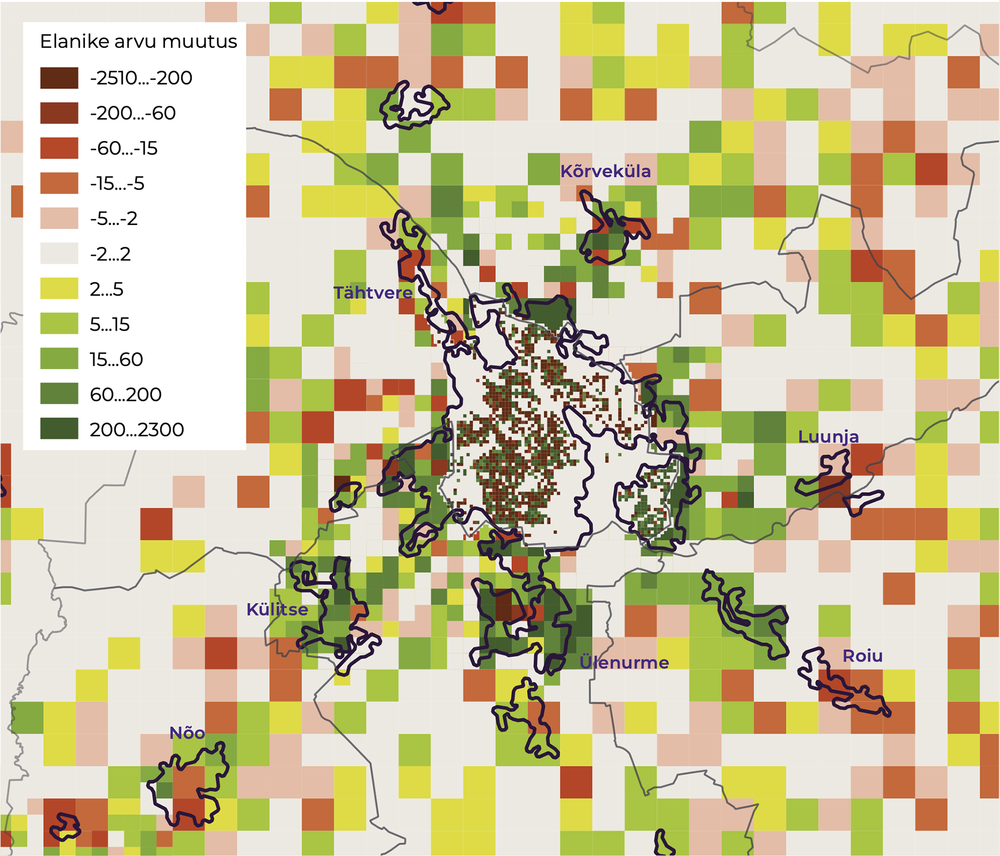

## Pikaajalised maakasutuse (ja avaliku ruumina tajutava maastiku) muutused linnas ja maal { .chapter_section .chapter1_section}

```{block, type='authors'}
**Tõnu Oja**
```

```{block, type='points'}
* Linnastumise ja ääremaastumise tulemusel maastikud polariseeruvad.
```

Maakasutus ja selle tulemusena kujunenud maastikud kajastavad seda, kuidas me oma territooriumi kasutame. Maastik – meid ümbritsev looduslik ja inimtekkeline keskkond nii, nagu me seda tajume – on muutumises, kuid osa muutusi on pöördumatud. Seetõttu peab muutusi vajaduse korral suunama. Ajalooliselt kujunenud maastik on Eesti kultuurile omane, maastiku mitmekesisus tagab elurikkuse ning ühtlasi pakub inimestele võimalust valida elukeskkondade seast endale sobivaim.

Eesti tavade järgi kuuluvad laias mõttes avalikku ruumi nii linnalised kui ka põllumajandus- ja metsamaastikud. Omanikul on küll õigus juurdepääsu piirata, ent suur osa ruumist on avalikult kasutatav – liigutav, nähtav, tajutav. Selles artiklis küsin, kuidas maastiku mitmekesisus Eestis pikaajaliselt muutub ning kas valikud, mis meil seni on olnud, jäävad alles ka tulevikus.

```{block, type='blockquote-right'}
Maastik – meid ümbritsev looduslik ja inimtekkeline keskkond nii, nagu me seda tajume.
```
Maakasutuse muutuste analüüsimiseks saame kasutada nii otseselt ruumiandmeid ([nt CORINE maakatte andmed](#CORINE)) kui ka ruumikasutusega kaudselt seotud andmeid (nt Statistikaameti avalikud andmestikud). CORINE on üleeuroopaline projekt, mille käigus kaardistati eri riikide maakate. Eestis on CORINE maakate kaardistatud 1990., 2000., 2006., 2012. ja 2018. aasta seisuga, need andmed on avalikud. Maakate on maapinna elutust või elusainest kate, ka tehislikud pinnakatted, põllumajandustaimed, metsad, (pool)looduslikud alad, märgalad ja veekogud. Maakate väljendab suurel määral maakasutuse mõju maa pinna väljanägemisele – maastikule. CORINE kaardistus on üldine ning väga detailseid maakatte muutusi jälgida ei luba. Ka erinevad Statistikaameti andmed võimaldavad saada pildi maakasutuse muutumisest, näiteks on ruumiliselt (ruutkilomeetri kaupa, linnades hektari kaupa) esitatud viimaste rahvaloenduste (2000, 2011) andmed. Teatud määral saab maakasutuse muutusi jälgida ka avaliku Eesti topograafilise andmekogu alusel, mida haldab Maa-amet. Kaitsealadega seotud maakasutuse muutusi peegeldavad Eesti looduse infosüsteemi (EELIS) andmed. Järgnevas ongi nimetatud andmeid analüüsitud ja mõtestatud.

### Rahvastiku vähenemine ja ränna linnalistele aladele mõjutab maastikke {-.chapter1_section}

Maakasutuse muutused muudavad maastikke. Maakasutus muutub inimtegevuse ja eluviisi muutustega. Esimene huvipakkuv tegur on Eesti elanike arvu vähenemine – 2017. aastal oli Statistikaameti andmetel Eestis peaaegu 57 000 elanikku vähem kui sajandivahetusel, vähenemine 4,1%. Teine tegur on inimeste riigisisene ümberasumine. Siserände mõjul on elanike arv suurenenud Tallinna, Tartu ja Pärnu lähiümbruses, üle Eesti on enamikus piirkondades ([joonis 1.1.1](#figure111)) elanike arv vähenenud.

<p class="caption" id="figure111"><span class="figure-number">Joonis 1.1.1.</span> Elanike arvu muutus 2000. ja 2011. aasta rahvaloenduste vahel  (km2)</p>

```{r, figure111, out.width='80%', fig.asp=.75, fig.align='center', echo=FALSE, message=FALSE}

knitr::include_graphics("figures/1-chapter/fig111.png")

```

``` {block, type='figure-comment'}
<span class="figure-comment-start">Märkus:</span> Sulgudes olev number legendis näitab vastavasse vahemikku kuuluvate ruutkilomeetrite arvu.
```

``` {block, type='imgsource'}
<span class="imgsource-source">Allikas:</span> Statistikaamet 2000; 2011.
```

### Ehitatud alade pindala suureneb peamiselt linnade ümbruses {-.chapter1_section}

Perioodil 2000–2006 lisandus Eestis 18,2 km2 hõredalt hoonestatud alasid ([CORINE](#CORINE)). Peamiselt tekkisid elamualad põllumajandusmaade asemele (12,2 km2). Siinkohal on oluline rõhutada, et CORINE maakatte andmestikus on hõredalt hoonestatud enamik elamualasid (sh Mustamäe, Lasnamäe ja Annelinn), kindlasti kõik uuselamurajoonid ning tootmis- ja kaubanduslike ehitistega alad. Lisades siia kõik muud ehitatud alad, saame täisehitatud alade lisandumiseks 23 km2 ([Oja 2009](#Oja2009); [2014](#Oja2014)). Perioodil 2006–2012 lisandus hõredalt hoonestatud alasid ning tööstus- või kaubandusterritooriume kumbagi veidi üle 11 km2. Sealjuures 7,5 km2 tekkis endise põllumajandusliku maa arvelt. Nii on sellel perioodil ehitatud alade lisandumine üsna sarnane eelmise kuueaastase vahemikuga.

```{block, type='blockquote-left'}
Ehitiste aluseks ja nende lähiümbruseks muudetud põllumaid ei ole võimalik enam endises kasutuses taastada.
```
Perioodil 2012–2018 on ehitatud alade lisandumine mõnevõrra aeglustunud. Elamualasid lisandus 3,65 km2 ning tööstus- ja kaubandusterritooriume 5,83 km2, sellest põllumajanduslike maade arvelt 2,51 km2 elamumaid ning 4,39 km2 tööstus- ja kaubandusterritooriume. Ehitusplatside kadumine ja lisandumine aastatel 2012–2018 on enam-vähem võrdne ja poole väiksem kui eelmisel perioodil, millest võime järeldada maa täisehitamise tempo jätkumist.

Täisehitatud maade osatähtsuse kasv alates sajandi algusest ei ole küll suur — umbes 1,3‰ maismaast – ent erinevalt mitmest teisest muutusest pole see protsess tagasipööratav. Ehitiste aluseks ja nende lähiümbruseks muudetud põllumaid ei ole võimalik enam endises kasutuses taastada. Regionaalselt on enamik uusehituse piirkondadest koondunud Harjumaale, Tartumaale ja Pärnumaale ([joonis 1.1.2](#figure112)). Sama näitavad Statistikaameti rahvastikuandmed ([vt joonis 1.1.1](#figure111)).

<p class="caption" id="figure112"><span class="figure-number">Joonis 1.1.2.</span> Uute elamualade lisandumine</p>

```{r, figure112, out.width='100%', fig.asp=.75, fig.align='center', echo=FALSE, message=FALSE, warning=FALSE, results=FALSE}

library(sf)          # classes and functions for vector data
library(raster)      # classes and functions for raster data
library(tmap)
library(svglite)

fig112_maakonnad <- st_read(dsn ="data/11_fig2_data/maakond_20200101.shp")
head(as.data.frame(fig112_maakonnad))


fig112_change <- st_read(dsn ="data/11_fig2_data/change112121.shp")
head(as.data.frame(fig112_change))
fig112_change$year <- "2000-2006"

fig112_2012 <- st_read(dsn ="data/11_fig2_data/lisand2012.shp")
head(as.data.frame(fig112_change))
fig112_2012$year <- "2006-2012"

fig112_2018 <- st_read(dsn ="data/11_fig2_data/lisand2018.shp")
head(as.data.frame(fig112_change))
fig112_2018$year <- "2012-2018"


fig_112_plot <- tm_shape(fig112_maakonnad) +
    tm_fill("#E6E3DA", palette = c("#E6E3DA", "#DAD4E6","#B6A8CD", "#917DB5","#482683")) +
    tm_borders(col="white") +

    tm_layout(
      outer.margins=0, inner.margins=c(.02, .1, .02, .02),asp=1920/1080,
      legend.outside = FALSE,
      legend.format=list(text.separator="kuni"),
      frame = FALSE) +

    tm_shape(fig112_change) + tm_fill("year", legend.fill.show = TRUE, title="", palette=c("#B6A8CD")) +
      tm_borders(col="white", alpha=0) +

      tm_shape(fig112_2012) + tm_fill("year", legend.fill.show = TRUE, title="", palette=c("#6D519C")) +
      tm_borders(col="white", alpha=0) +

      tm_shape(fig112_2018) + tm_fill("year", legend.fill.show = TRUE, title="", palette=c("#241342")) +
      tm_borders(col="white", alpha=0)

tmap_mode("view")
fig_112_plot

#tmap_save(tm = fig_153_plot, filename = "figure153.png")
#tmap_save(tm = fig_112_plot, filename = "fig112.pdf")

#svg(filename="figure.svg")
#fig_153_plot
#dev.off()

```

``` {block, type='imgsource'}
<span class="imgsource-source">Allikas:</span> CORINE 2000; 2006; 2012; 2018.
```


Statistikaameti andmed kliimaaruannetes kajastuva maismaa pindala kohta näitavad, et ajavahemikus 2000–2017 on asustusalade pindala suurenenud 138 km2 võrra – sajandivahetuse 3287 km2 asemel oli 2017. aastal 3425 km2 asustust. Kasv on 4,2%. See arv on enam kui kaks korda suurem, kui CORINE andmestik kajastab. CORINE miinimumkaardistusüksus on 5 hektarit, millest järeldub, et ka sellest väiksema pindalaga uusasustust on linnade ümbruses lisandunud palju.

```{block, type='blockquote-right'}
Suur osa karjääre metsastatakse pärast nende ammendumist, ent oluline maakasutuse muutus on see siiski, sest väärtusliku põllumaa taastamine ammendatud karjääride asemel enamasti ei õnnestu.
```
Lisaks kitsas tähenduses ehitatud alade suurenemisele on suurenenud ka muud tugeva inimmõjuga alad – kõigil perioodidel on teede, raudteede, lennuväljade ja teiste sarnaste rajatistega kaetud maa suurenenud 3–4 km2 perioodi kohta. Tugeva inimmõjuga alade hulka võime lugeda ka karjäärid. Perioodil 2006–2012 lisandus karjääre 26 km2 ning karjääride kogupindala kasvas 21 km2 võrra (osa karjääridest ammendati), vahemikus 2012–2018 suurenes karjääride kogupindala 13,5 km2 võrra. Enim on karjääre lisandunud Ida-Virumaal, aga ka Harjumaal. Suur osa karjääre metsastatakse pärast nende ammendumist, ent oluline maakasutuse muutus on see siiski, sest väärtusliku põllumaa taastamine ammendatud karjääride asemel enamasti ei õnnestu.

### Linnade laialivalgumisega ühtlustub linna ja tagamaa ruumikasutus {-.chapter1_section}

Nägime eespool, et elanike arv ja ehitatud alad on kasvanud ennekõike kolme Eesti linna – Tallinna, Tartu ja Pärnu – ümbruses. Vaatame näitena Tartut ja selle ümbrust ([Anni ja Oja 2016](#Anni2016); [Marksoo 2005](#Marksoo2005)). Tänaste suundumuste mõistmisele aitab kaasa ajalooline tagasivaade.

Muistne Tartu toimis kaua kompaktsena. Algne eikellegimaa linna ümber muutus mõisamaaks, mis 500 aasta eest hakkas piirama linna laienemist. Ometi tekkisid muistsed „eeslinnad“ – agulid – Tartu ümber juba 16.–17. sajandil. Linnasarase piirid määratleti esmakordselt 18. sajandil. Edaspidi lisandus linna arengut soodustavaid tegureid (ülikool, rahvakultuuri keskuseks kujunemine, raudtee ja selle mõjul tööstuse ning kaubanduse areng). Hakati tihendama kesklinna ning laiendama linna selle äärealadel. 20. sajandi alguses hakkas linn mõisatelt renditud maa arvelt laienema senistest piiridest välja. Tartu laienemisvajadusi lahendades suurt tähelepanu põllumajandusmaa väärtusele ei pööratud.

Uut hüppelist linna pindala suurenemist võimaldas mõisamaade natsionaliseerimine Eesti Vabariigi sünni järel. Aastatel 1922 ja 1923 suurenes Tartu pindala eelmiste piiridega võrreldes 150%. Pool linnast oli esialgu küll põllumajandusmaa, täisehitatud krundid moodustasid veerandi. See suhe hakkas aga kiiresti muutuma. Järgmine pindala suurenemine oli 1962. aastal (11%), seejärel 1977. aastal (63%) seoses Annelinna ehitamisega. Pärast seda (kuni 2017. aastani) on Tartu administratiivpiire siin-seal ainult veidi kohendatud. Nõukogude ajal takistas linnapiiride laienemist sõjaväelennuväli Raadil ning linna ümbritsevate majandite soov põllumaad kaitsta. Nii on Tartu kasvava linna kohta tavapäraselt oma arengus korduvalt administratiivpiiridest väljunud. Näha võib tsüklilist kordumist – märgatava suurenemise järel tiheneb ja ühtlustub linn oma piirides, nende kitsaks jäämise järel tekib võimaluse korral uus laienemine.

```{block, type='blockquote-left'}
Linna ümbritsevate omavalitsuste üldplaneeringud on soosinud valglinnastumist, nähes ette linnalise maakasutuse jätkumist linnapiiride taga.
```
Linna ümbritsevate omavalitsuste üldplaneeringud on soosinud valglinnastumist, nähes ette linnalise maakasutuse jätkumist linnapiiride taga. Endised põllumajandusmaad linna piiri lähedal on ehitatud täis elamuid, tootmishooneid jmt. Paljudes kohtades on äärelinna elamurajoonid kokku kasvanud Tartu linnaga. Koos inimestega on linna äärtesse kolinud ka teenused. Sama kinnitab Statistikaameti arvutatud linna administratiivpiiridest väljuv tiheasustusala piir ([joonis 1.1.2](#figure112)). Laialivalgumist peegeldab ka kahe viimase rahvaloenduse (2000, 2011) rahvastikutiheduse andmete võrdlemine. Rahvastikutiheduse kasv (mis peegeldab muutusi maakasutuses) on suurem Tartu linnapiiri taga kui linnas sees.

<p class="caption" id="figure113"><span class="figure-number">Joonis 1.1.3.</span> Rahvastikutiheduse muutus Tartus kahe rahvaloenduse (2000, 2011) vahel näitab ruumikasutuse intensiivsuse ühtlustumist linnas ja tagamaal</p>

```{r, figure113, out.width='80%', fig.asp=.75, fig.align='center', echo=FALSE, message=FALSE}



```

``` {block, type='imgsource'}
<span class="imgsource-source">Allikas:</span> Statistikaamet 2000; 2011.
```

Linnapiiride laienemist mõjutab ka uute ärikeskuste tekkimine linna äärealadele või vahetult linnapiiri taha, muu hulgas linnaümbruse transporditaristu, näiteks ringtee linnaruumi nihutava mõju tõttu. Tööstus- ja tootmisalade linnaruumist välja kolimine mõjutab taristu arengut, mis omakorda hakkab mõjutama uute tõmbekeskuste teket. Sarnaseid suundumusi on Euroopas kirjeldatud alates 19. sajandist ([Antrop 2004](#Antrop2004)). Ka need ehitatud alad lisanduvad põllumajandusmaade, harvem metsamaa asemele.

Tartus näeme varem tihedamate linnaosade sõrenemist ehk asustustiheduse vähenemist ([joonis 1.1.2](#figure112)), samal ajal linnasiseste tõmbekeskuste suhtes hea paiknemisega sõredad linnaosad tihenevad, avaldades survet sotsiaal- ja ühiskasutusega maa ning puhke- ja virgestusalade kadumiseks. Asustustihedus linnalise ala sees ühtlustub (toimub omalaadne difusiooniprotsess). Tartu linnas ja lähiümbruses on asustamata alade hulk vähenenud nii ruutkilomeetri kui ka hektari kohta, samal ajal kui tihedaima asustusega alad (nt Annelinn, Tähtvere) on hõrenenud. Keskmised asustustiheduse näitajad on kokkuvõttes siiski kasvanud. Vähenenud on suure ja väga väikese asustustihedusega ala ning suurenenud keskmise asustustihedusega ala.

Sarnased protsessid toimuvad ka teistes Eesti suuremates linnaregioonides. Linnamudelite seisukohalt on tegemist keskuspiirkondade füüsilise laienemisega. Kasutusintensiivsuse varieeruvus aga selle piirkonna eri osades (vana keskuslinna eriilmelistes linnaosades ja uusasumites linna äärealadel) väheneb. Valglinnastumine ei puuduta ainult linna äärealasid – maakatte ja asustustiheduse muutused näitavad, et kogu linnaline ala muutub kasutusintensiivsuselt ühtlasemaks.

### Põllumajandusmaastik väheneb ja tühjeneb inimestest {-.chapter1_section}

Põllumajandusliku maa kogupindala ei ole 21. sajandil oluliselt muutunud, kõikudes 8000–9000 km2 vahel (Statistikaamet). Sama võib täheldada ka põllumaa pindala kohta, mis üsna püsivalt moodustab ⅔ põllumajandusmaast. Arvestades 1990. aastate langust, on siiski oluline pööre väikesele tõusule aastail 2003–2007. Samal ajal vähenes põllumajanduslike majapidamiste arv aastail 2001–2007 üle kahe korra (Statistikaamet).

Majapidamiste arv jätkas kahanemist ka järgneval perioodil, 2016. aastal oli see ⅔ 2007. aasta omast. Seevastu kasutuses oleva maa pindala kasvas. Põllumajandusmaa osatähtsus majapidamiste omandis olevast maast aga suurenes 65%-lt 75%-le. Kasutamata põllumajandusmaa osatähtsus võrreldes kasutuses olevaga kahanes üle kahe korra. Need suundumused annavad tunnistust mõningasest põllumaa väärtuse tõusust viimastel aastatel.

Ka kliimaaruandluses kajastuva maismaa pindala andmed (Statistikaamet) ütlevad, et vähenenud on nii põllumaa kui ka rohumaa pindala. Aastal 2000 oli neid vastavalt 10 566 km2 ja 2983 km2, 2017. aastaks aga on põllumaad 10 316 km2 ja rohumaid 2744 km2. See näitab, et me oleme kaotanud 250 km2 põllumaad ja 239 km2 rohumaad. Osalt on selle põhjus valglinnastumine (täisehitamine), ent veelgi suurem muutus on toimunud ääremaadel põllumaade metsa kasvamise mõjul.

Ka CORINE andmestikus on põllumajandusliku kasutusega maade eri tüübid küll märgatavalt muutunud, ent suurel määral on tegemist ühe põllumajandusliku kasutusega ala muutumisega teiseks põllumajandusliku kasutusega alaks. Siiski on põllumajandusliku maa vähenemine maakatteandmestikus märgatav.

### Metsamaa pindala kasvab, kuid väheneb okasmetsa pindala ja metsad noorenevad {-.chapter1_section}

Ajavahemikul 2000–2006 jätkusid maakatte muutustes eelmise sajandi viimase kümnendiga sarnased trendid. Kõige enam lisandus maakatteklassi üleminekulised metsaalad ehk raiesmikud, mis osutab metsaraie määrale. Põldude võsastumise protsess võrreldes 1990. aastatega aeglustus. Samal ajal oli 1990. aastate raietegevuse jätkumõjuna osa üleminekulisi metsaalasid kadunud. Peamiselt on need muutunud heitlehisteks ja segametsadeks. Märkimisväärselt vähe võrreldes raiega on aga lisandunud okasmetsi ([CORINE](#CORINE)).

Muutused metsade struktuuris jätkuvad ka järgmistel perioodidel. Vahemikus 2006–2012 vähenes üleminekuliste alade (raiesmike) pindala 150 km2 võrra, sega- ja lehtmetsade kogupindala suurenes, aga okasmetsade pindala vähenes. Absoluutväärtustes väljendudes: raiuti 434 km2 metsi ja juurde tekkis 605 km2 metsi. Vahemikus 2012–2018 vähenes kõigi metsatüüpide kogupindala. Üleminekulisi alasid lisandus neli korda rohkem kui kadus, see tähendab raiesmike kogupindala suurenes 751 km2.

```{block, type='blockquote-right'}
Metsamaa pindala on peamiselt põllumaade metsastumise tõttu pikaajaliselt kasvanud ning muutumas on metsade struktuur.
```
Raieintensiivsuse muutusi peegeldavad ka statistilise metsainventuuri andmed (Statistikaamet). Kui näiteks 2001. aastal raiuti kokku 880 km2 metsa, siis 2008. aastal vaid 524 km2, ent 2013. aastal taas 881 km2. Kliimaaruannetes kajastuva maismaa pindala andmed (Statistikaamet) näitavad, et metsamaa pindala on suurenenud 1,8% võrra – 2000. aasta 23 961 km2 asemel 2017. aastal 24 384 km2. Kliimaaruannetes kasutatav metsamaa pindala on mõnevõrra suurem Eesti metsamaa mõiste alusel hinnatud metsamaa pindalast, sest sisaldab osaliselt ka põõsastikke, puittaimestikuga kaetud sooalasid ja looduslikke rohumaid.

Kokkuvõttes on metsamaa pindala peamiselt põllumaade metsastumise tõttu pikaajaliselt mõõdukalt kasvanud ning muutumas on metsade struktuur. Okasmetsi on vähem ja metsad noorenevad. Üldiselt ei ole need muutused nii pöördumatud kui näiteks põllumaade täisehitamine. Raiutud metsa asemele tekkinud raiesmikud metsastuvad taas. Raie on küll olnud intensiivsem kui juurdekasv, aga kuni metsamaad ei muudeta millekski muuks, muutub küll ajutiselt maakate (mets → raiesmik → mets), aga säilib maakasutus (metsanduslik tulundusmaa).

### Suund väärtuslike põllumaade säilitamisele pidurdab maastikumuutusi {-.chapter1_section}

Kõigis 2010. aastate keskel valminud maakonnaplaneeringutes on väärtusliku põllumaa kiht, nendel aladel piiratakse maakasutuse muutuste kavandamist. Näiteks sätestab Viljandi maakonnaplaneering omavalitsuste üldplaneeringute koostamise ja väärtuslike põllumajandusmaade kasutamise põhimõtteid. Eesmärk on tagada väärtusliku põllumajandusmaa sihtotstarbeline kasutamine. Tartumaa maakonnaplaneering nimetab väärtusliku põllumaa üldised kasutustingimused, sealhulgas tuleb see üldjuhul säilitada põllumajanduslikuks tegevuseks ning hoida harimiskõlblikuna. Väärtusliku põllumajandusmaa kasutuselevõtt mittepõllumajanduslikul otstarbel on lubatud vaid avalikes või kogukonna huvides, kui vastavaid tegevusi ei saa ellu viia muul viisil. Kuivõrd väärtuslike põllumaade kajastamine maakonnaplaneeringutes toimus Maaeluministeeriumi juhendi alusel, on põhimõtteline olukord kõigis maakonnaplaneeringutes sarnane.

Üldplaneeringute tasemel on juba ka näiteid maakonnaplaneeringu korrigeerimiseks. See on tavaline suurte keskuste ümbruses, kus surve elamuehituseks on suurem. Näiteks 2018. aasta Rae valla põhjapiirkonna põllumajandusmaade uuring leiab, et maakonnaplaneeringuga väärtuslikeks määratud põllumaad kattuvad märgatavalt valla varem kehtestatud üldplaneeringu kohaselt perspektiivseks elamualaks kavandatuga ning seetõttu on tehtud ettepanek osa väärtuslikest (tõsi, kõige vähem olulised neist) põllumaadest sellest kategooriast välja arvata.

```{block, type='blockquote-left'}
Põllumajandusmaastiku üksluiseks ja igavaks muutumist pidurdab Euroopa ühtsest põllumajanduspoliitikast tulenev ökoloogiliste elementide säilitamise nõue.
```
Menetlemisel on maaelu ja põllumajandusturu korraldamise seaduse muutmise seaduse eelnõu, millega piiratakse väärtuslike põllumaade muul otstarbel kasutamist. Väärtuslikku põllumajandusmaad, millele kavandatakse kehtestada kaitsemeetmed, on Eestis 700 000 hektarit ehk 63% kogu põllumajandusmaast. Kuuendikul Eesti maismaast peaks säilima põllumajandusmaastik. Maakonniti varieerub väärtusliku põllumaa osakaal kogupõllumaast 84% (Järvamaa) ja 48% (Ida-Virumaa) vahel.

Üldistatuna tähendavad kavandatud meetmed piiranguid maakasutuse muutmisele (nii täisehitamisele kui ka metsastamisele) ja põllumassiivide lõhkumisele. Kohustus põllumaa säilimise tagamiseks pannakse maaomanikele. Põllumajandusmaastiku üksluiseks ja igavaks muutumist pidurdab Euroopa ühtsest põllumajanduspoliitikast tulenev ökoloogiliste elementide säilitamise nõue (mis lisaks toetab ka elurikkust) ning selle toetusmeetmed. Kokkuvõttes põhjustavad kavandavad muutused regulatsioonides küll jätkuvaid vaidlusi, ent väga suure tõenäosusega on tegu linnade laialivalgumist pidurdavate meetmetega.

### Väärtuslike maastike kaitse ja kaitsealad toetavad maastike konservatiivsust {-.chapter1_section}

Väärtuslikud maastikud kaardistati maakonnaplaneeringute eraldi teemaplaneeringuna juba eelmises planeerimisringis käesoleva sajandi alguses. Üle kandusid need ka viimastesse praegu kehtivatesse maakonnaplaneeringutesse. Tüüpiliste piirangutena väärtuslike maastike maakasutuse säilitamisel võib tuua taas näite Viljandi maakonnaplaneeringust. Väärtuslikule maastikualale hoonestust planeerides on eesmärk säilitada võimalikult hästi olemasolev ajalooline asustus, arvestada ajaloolist teede- ja tänavavõrku ning ehitustraditsioone. Uute ehitiste kavandamisel tuleb arvestada piirkonnale iseloomuliku traditsioonilise ehituslaadiga. Soovitakse säilitada põllumajandusmaastiku avatust ja vaateid, traditsioonilisi maastikuelemente ja -struktuure. Välditakse vaateid häirivaid rajatisi.

Väärtuslike maastike planeeringukihil on ootuspäraselt märkimisväärne kattuvus ka väärtusliku põllumaa kihiga. Kokkuvõttes on aga maakonnaplaneeringud (rohelise võrgustiku, väärtuslike maastike ja väärtuslike põllumaade kiht) maakasutuse muutuste ning maastiku üldilme muutumist takistav meede.

Lisaks toetavad maastike säilimist kaitsealad. Kogu Eesti maismaast on kaitse all (NATURA loodus- ja linnualadena, looduskaitsealadena, kohalike kaitsealade ja nende piiranguvöönditena, vääriselupaikadena ning üksikobjektide kaitsetsoonidena) viiendik ([tabel 1.1.1](#table111)). Märkimisväärne osa Eesti territooriumist on aga kahe- või enamakordse kaitse all. Range kaitserežiimiga reservaatide osa sellest on siiski väike (alla 0,2%).

<p class="caption" id="table111"><span class="figure-number">Tabel 1.1.1.</span> Kaitsealade osatähtsus 2019. aastal maakonna territooriumist (%)</p>
**TABEL 1**

* koos Pandivere veekaitsealaga

``` {block, type='imgsource'}
<span class="imgsource-source">Allikas:</span> EELIS 2019; Maa-amet 2019.
```

Võrreldes kaitsealade ja sihtotstarbega kaitsealune maa maakatastriüksuste pindala, näeme enam kui neljakordset erinevust. Eesti looduse andmekogus EELIS kajastuvad kaitsealadena ka suure territooriumiga rahvuspargid, NATURA loodus- ja linnualad ja muu taoline, mille territooriumidest suurem osa on muu sihtotstarbega ala looduskaitseliste piirangutega. Need kätkevad sageli mitmeid piiranguid, nagu näiteks maakasutuse muutmise või alade täisehitamise piirangud. Kaitsealad on maastikumuutuste suhtes konservatiivne meede, näiteks on Otepää looduspargi kaitse-eesmärk „kaitsta, säilitada, taastada [---] iseloomulikke loodus- ja pärandmaastikke“. Maastikku muutvad tegevused on lubatud vaid kaitseala valitseja nõusolekul, ent tegelikkuses kaitse-eesmärke kahjustavat tegevust sageli siiski ei kooskõlastata.

### Kokkuvõte {-.chapter1_section}

Eestis on toimumas linnaliste alade suurenemine – ajavahemikus 2000–2017 on asustusalade pindala suurenenud 138 km2 võrra ehk 4,2%. Linnalise asustuse sees (linn ja sellega kokku kasvanud lähitagamaa) käib aga asutustiheduse ja ruumikasutuse intensiivsuse hajus ühtlustumine. Endised põllumajandusmaad ehitatakse täis elamuid ja tootmishooneid. Linnalise struktuuri laienemisega (teenused linnaservades, ringteed ja nende äärde tekkivad kaubanduskeskused) tekib lisasuundumus asendada põllumajandusmaad, harvem ka metsamaad ehitatud aladega.

Ühtlustumine toimub ka ääremaa põllumajandusmaastikul, kuid teisel moel. Rände- ja demograafiliste tegurite mõjul tühjeneb ääremaa inimestest. Põllumajanduslik tööhõive on vähenenud märkimisväärselt, põllumajanduslikke majapidamisi on vähem. Isegi kui haritava maa suurus ei ole pärast 1990. aastate põllumajanduse kokkuvarisemist enam vähenenud, on automatiseerimine viinud meid olukorda, kus maaharimisega ei kaasne suurt tööjõuvajadust. Kuigi metsamaastiku osa on viimastel kümnenditel kasvanud, on okasmetsade raie võrreldes koguraiega märkimisväärselt suurem. Eesti metsade vanuseline struktuur lähiajal pigem nooreneb.

Kokku oleme viimase kolme aastakümnega kaotanud 250 km2 põllumaid ja 239 km2 rohumaid. Osa sellest on täis ehitatud, veelgi suurem osa metsa kasvanud. Maastik ühtlustub asustussüsteemi eri osades – linnade lähialadel toimub kiire endiste põllualade (ja vähemal määral metsa) täisehitamine; Eesti äärealadel aga põllu- ja karjamaade võsastumine ning tasakaalustamata metsaraie tulemusena maastik vaesub.

Maastik muutub alati. Mõnda suundumust ei ole aga võimalik tagasi pöörata. Nii ei ole tänapäeval praktiliselt ja mõistliku kiirusega tagasipööratav põllumaa kadumine. Seevastu kodumaine toit läheb järjest rohkem hinda. Viimastel kümnenditel näeme ka, et alles jäänud põllumaa on muutunud järjest hinnalisemaks. Väärtusliku põllumaa püsimine on oluline nii Eesti julgeoleku kui ka meie traditsiooniliste tegevusalade ja kultuuri säilimise seisukohalt. Samuti vähendab metsade vanusstruktuuri muutus elurikkust meie looduses. Eesti asustussüsteemi üks väärtusi on seni olnud inimese võimalus valida erinevate linnaliste ja maaliste elukeskkondade vahel. Valglinnastumise ja ääremaastumisega kaasnev ühtlustumine maastikus kitsendab valikuvõimalusi.

Tulevikku vaadates väga pöördelisi muutusi maastikku muutvates trendides ilmselt ei teki. Siiski, elanike arvu vähenemine ääremaal vähendab siserännet, rändevoogude kahanemise märgid on juba näha. Mitmed vahendid, mille kaudu maastike üksluisemaks muutumist saaks ära hoida, on Eestis juba kasutusele võetud. Väärtuslike põllumaade süsteemne säilitamine nii linna tagamaal kui ka ääremaal pidurdab valglinnastumist ja maastiku metsastumist. Meetmed väärtuslikel maastikel ja kaitsealadel toetavad maastike säilimist ning ökoloogiliste elementide väärtustamine põllumaadel nende üksluiseks muutumist. Nende meetmete mõju ilmneb tõenäoliselt lähematel kümnenditel.

### Viidatud allikad {-.subreferences}

<p id="Anni2016">Anni, K., Oja, T. 2016. Laienevate linnade piirimuudatustest haldusreformi kontekstis. – Riigikogu Toimetised, 33, 125–140.</p>

<p id="Antrop2004">Antrop, M. 2004. Landscape change and the urbanization process in Europe. – Landscape and Urban Planning, 67 (1–4), 9–26.</p>

<p id="CORINE">CORINE Land Cover – COoRdination of INformation on the Environment. – European Union Earth Observation Programme Copernicus Land Monitoring Service Pan-European Component.</p>

<p id="Marksoo">Marksoo, A. 2005. Linnasiire. – Pullerits, H. (koost. ja toim.), Tõnisson, U., Liim, A., Andresen, A. (toim.). Tartu: ajalugu ja kultuurilugu. Tartu: Tartu Linnamuuseum ja Ilmamaa.</p>

<p id="Oja2009">Oja, T. 2009. Maakasutuse muutused (ptk 7.2). Valglinnastumine (ptk 7.3). – Kaukver, K. (toim.). Keskkonnaülevaade 2009. Tallinn: Keskkonnaministeeriumi Info- ja Tehnokeskus, 115–123.</p>

<p id="Oja2014">Oja, T. 2014. Maakasutuse muutused (ptk 6.1). – Kaukver, K. (toim.). Keskkonnaülevaade 2013. Tallinn: Keskkonnaagentuur, 131–137.
