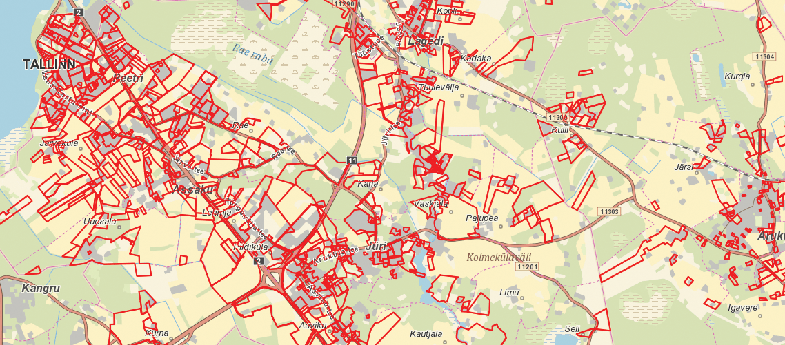

## Planeerimisvabaduse võidukäik eeslinna-Eestis {.chapter_section .chapter1_section}

```{block, type='authors'}
**[Antti Roose](#antti-roose)**
```

```{block, type='points'}
* Krundiviisiline arendustegevus Tallinna, Tartu ja Pärnu eeslinnavööndis loob hajusa, hõreda, killustatud ja keskuskohtadeta asustuse, milles  avaliku ruumina on kasutuses kergliiklusteed, mänguväljakud, parklad ja tühermaad.
```

Heaoluühiskond Eestis on edenenud käsikäes eeslinna-Eestiga. Tallinnas sai see alguse Tiskrest, siis katsid eramud ja madaltihedad kortermajad Viimsi poolsaare, seejärel suundus eeslinnastumine sügavamale Harjumaale. Tartus sai eeslinnastumine hoo sisse majandusbuumi ajal. On hakatud rääkima Suur-Tallinnast ja Suur-Tartust. Ajastutruult ja sümboolselt rajati isegi Eesti Rahva Muuseum eeslinna ‒ Raadile.

```{block, type='blockquote-left'}
Üks kinnitusi, et eeslinnastumine on uus, mitte-eestilik nähtus, on nii ametlik kui ka rahvakeelne ebalus eeslinnaasustuse tähistamisel, nimetamisel ja piiritlemisel.
```
Eeslinnas kohtub demokraatliku ja vaba ühiskonna arengumudel turumajandusliku kasvu- ja konkurentsiideega ning teostub kõige füüsilisemal kujul uusasumites ning eeslinnaelu sotsiaalses praktikas. Eeslinn kasvab tormakalt, hooti, masinlikult, vastandudes ajaloolise keskuslinna sammsammulisele kaalutud arengule. Artiklis käsitlen Tallinna, Tartu ja Pärnu lähiümbruse eeslinnastumise ulatust ja olemust viimastel kümnenditel ning toon välja eeslinnastumise põhjused ja tagajärjed, et vaagida avaliku ja erahuvi teostamist eeslinna planeerimisel, arendamisel ja linnakorralduses.

Üks kinnitusi, et eeslinnastumine on uus, mitte-eestilik nähtus, on nii ametlik kui ka rahvakeelne ebalus eeslinnaasustuse tähistamisel, nimetamisel ja piiritlemisel. Eeslinnastunud külasid on küll tõstetud aleviku staatusesse, näiteks Peetri ja Luige Tallinna külje all või Räni ja Vahi Tartu eeslinnas, aga asustusredelil pole linna nimetust seni välja teeninud isegi mitte Viimsi, Peetri ega Laagri.

### Kuidas määratleda eeslinna? {-.chapter1_section}

Asustuse arengut Eesti suuremate linnade tagamaal avavad kolm võtmemõistet: eeslinnastumine (ingl *suburbanisation*), valglinnastumine (ingl *urban sprawl*) ja äärelinnastumine (ingl *peri-urbanisation*). Lisaks tõi üleriigiline planeering <a href="https://www.rahandusministeerium.ee/et/ruumiline-planeerimine/uleriigiline-planeering">Eesti 2030+</a> kasutusele hajalinna mõiste, mis seob tervikuks kompaktsed linnad, eeslinnad ning ääremaa asustuse.

Põhimõistena, kõige laiemas tähenduses, on eeslinnastumine protsess, mida iseloomustab inimeste elama asumine linna tagamaale, linnu ümbritsevatel aladel kaob selle käigus selge maa ja linna vaheline piir ([Tammaru jt 2004](#Tammaru2004)). Et enne 2007. aasta majanduskriisi toimus eeslinnastumine eriti kaootiliselt, siis on hinnangulisema terminina läinud avalikku kõnepruuki valglinnastumine ([Leetmaa jt 2014](#Leetmaa2014); [Tammaru jt 2009](#Tammaru2009)). See osutab linna vähe kontrollitud laialivalgumisele, mis hõlmab lisaks eeslinnavööle ka laiemat tagamaad. Maakasutuse muutust väljendab valglinnastumisel ribakujulise, lapilise ja eraldatud hoonestuse teke, mis toob tihti kaasa raiskava maa-, energia- ja taristukulu, keskkonnareostuse, ummikud ja mitmed teised välismõjud. Valglinnastumist peetakse linnaplaneerimist käsitlevas kirjanduses üldiselt negatiivseks linnaarengu tüübiks ([van Dijk 2009](#van-Dijk2009)). Lääne- ja Kesk-Euroopas räägitakse ka äärelinnastumisest, viidates paremale lahendusele, mille puhul rangem planeerimispoliitika võimaldab linna laiendada keskuslinna perimeetril sidusas linnamustris ([Phelps 2017](#Phelps2017)). Ka Eestis on 2000. aastate hajus valglinnastumine praegu jätkumas äärelinnastumisena.
Järgnev Tallinna, Tartu ja Pärnu eeslinnastumise analüüs põhineb haldusüksustel, kus eeslinnastumise juhtindikaatoriks on elanike arv ning juhtkriteeriumiks kiire kasv alates 2001. aastast. Suur-Tallinn hõlmab Harku, Jõelähtme, Keila, Kiili, Rae, Saku, Saue ja Viimsi valda ning Saue linna. Suur-Tartu on laienenud Haaslava, Luunja, Tartu, Tähtvere ja Ülenurme valda. Pärnu eeslinnaks on saanud Audru, Paikuse, Sauga ja Tahkuranna vald. Seega jäävad käsitlusest välja Tallinna „vanad“ ees- ja satelliitlinnad Keila ja Maardu ning Pärnus Sindi. Teiseks kriteeriumiks on uue eeslinliku asustuse teke mõõdetuna uuselamute arvu ja asustustiheduse kasvuga eeslinlikuks. Ka siin on oluline ennekõike muutus ja kasv. Eeslinlikku asustustihedust saab hakata jälgima juba tagasihoidlikust 100 elanikust km<sup>2</sup> kohta. Statistikaamet on nimetanud üleminekulise eeslinnavöö osaliselt linnastunud alaks vähima asustustihedusega 200 inimest km<sup>2</sup>-l, kuid eeslinna asustusmustris osutub ka see piirarv liiga kõrgeks.

```{block, type='blockquote-right'}
Maakasutuse muutust väljendab valglinnastumisel ribakujulise, lapilise ja eraldatud hoonestuse teke, mis toob tihti kaasa raiskava maa-, energia- ja taristukulu, keskkonnareostuse, ummikud ja mitmed teised välismõjud.
```
Kui otsida ühist ja erinevat võrdluses Euroopa eeslinnadega, siis Madalmaades, Prantsusmaal, Saksamaal ja Põhjamaades sai eeslinnastumine kiire hoo sisse riiklike elamuprogrammide käivitamisel 1960. aastatel ning vältas läbi 1970.‒1980. aastate ([Bruegmann 2008](#Bruegmann2008)). Vahemere maades muutus keskuslinnade arengueeliste tõttu eeslinnastumine valitsevaks linnastumisprotsessiks paar kümnendit hiljem, 1980. aastatel. 1990. aastateks olid Lääne- ja Kesk-Euroopa jõudnud linnapiirkondade arengus eeslinnajärgsesse etappi (ingl *post-suburban*) ning asusid otsima uut arenguvõtit vanaldunud eeslinnadele ([Phelphs ja Wood 2011](#Phelps2011)). Eeslinnauuenduse uusurbanistlikul suunal rõhusid arhitektid ja projekteerijad linnaruumi tihendamisele ja esteetikale, jalakäija ja ühistranspordi eelistamisele autoliikluse ees ning ökoloogilistele, säästlikele lahendustele, mis ühtlasi rõhutasid maalist ([Randolph 2012](#Randolph2012)). Eeslinnajärgsed eeslinnaarendused, linnakujundus ja -korraldus on matkimas keskuslinna tunnuseid ja protsesse nii linnakeskkonna ja otstarvete mitmekesistamisel kui ka hoonestuse tihendamisel, kuid teevad seda jätkuvalt eeslinlikes mõõtmetes ja vormides. “Ühtlasi on seadusandjad pannud rangeid kvoote, et piirata rohealadele (ingl *greenfield*) ehitamist, toetades siiski linnalähialade teisest maakasutust pruunaladel (ingl *brownfield*).

```{block, type='blockquote-left'}
Sarnaselt Eestiga on Ida- ja Kesk-Euroopa eeslinnad kerkinud maakasutust killustades üheotstarbeliste elamualade ja äri-logistikaparkidena.
```
Kesk- ja Ida-Euroopa linnad jõudsid eeslinnastumiseni turujõudude küpsedes nii pakkumise kui ka nõudluse poolel alles 1990. aastate lõpus, misjärel on eeslinnastumise kasvumäär arenenud kooskõlas majanduskasvuga, väljendades heaoluühiskonna edenemist ([Phelphs 2017](#Phelps)). Sarnaselt Eestiga on Ida- ja Kesk-Euroopa eeslinnad kerkinud maakasutust killustades üheotstarbeliste elamualade ja äri-logistikaparkidena, lisaks mõned tarbimis- ja autoühiskonna vajadustest tingitud suured kaubanduskeskused ja Euroopa Liidu kaasrahastatud taristusõlmed ([Leetmaa jt 2014](#Leetmaa)). Eesti linnastumine on jätkuvalt modernistlikus etapis ega ole ka Suur-Tallinnas jõudnud hilismoderismi, rääkimata tagasilinnastumisest või tugevast linnapiirkonnastumisest.

### Eeslinnas elab kümnendik Eesti rahvast {-.chapter1_section}

Eeslinnastumine avaldub inimeste ja majandustegevuse liikumisena keskuslinnast eeslinna. Eeslinnas kasvab elanike ja töökohtade arv, tekib vilgas töö- ja õpiränne ning selle tulemusena kasvab liikuvus. Eeslinnastumise määra hindamiseks võrreldakse eeslinnanäitajaid keskuslinna omadega. Asjakohane on ka kolme eeslinnaala omavaheline võrdlus. Järgnev analüüs põhineb 2017. aasta haldusreformi eelsel haldusjaotusel.
Tallinna, Tartu ja Pärnu eeslinnavöös elab kokku 130 000 inimest. Tallinna eeslinnastumine algas juba 1990. aastatel, mida kinnitab 1989‒2001 rahvaloenduse vahelisel perioodil Tallinna ümbritsevate omavalitsuste rahvastiku kasv kümnendiku võrra. Perioodil 2001‒2018 on eeslinlaste arv Suur-Tallinnas kasvanud 37 000 (64%), Tartu eeslinnavaldades 5000 (27%) ning Pärnu eeslinnavaldades 3500 (28%) elaniku võrra ([joonis 1.3.1](#figure131)).

<p class="caption" id="figure131"><span class="figure-number">Joonis 1.3.1.</span> Eeslinlaste arv 2001‒2018 Tallinna, Tartu ja Pärnu lähiümbruses</p>

```{r, figure131, out.width='90%', fig.asp=.75, fig.align='center', echo=FALSE, message=FALSE, warnings=FALSE}

library("tidyverse")

 fig131_data <- read.csv ("data/13_fig1_data.csv", header=TRUE, fileEncoding="utf-8")


  fig131_plot <- ggplot(subset(fig131_data, area %in% c("Tallinna eeslinn", "Tartu eeslinn", "Pärnu eeslinn"))) +
    geom_line(mapping = aes(x=year, y = as.numeric(value), colour=area, group=area), size=1) +
    geom_text(mapping = aes(x=year, y=as.numeric(value), label=value), stat="identity", vjust=-1) +
    scale_colour_manual(values=c("#3A404A","#482683","#369B9E")) +
    scale_y_continuous(expand = c(0, 0), limits=c(0,100000)) +
    scale_x_continuous(breaks=c(2001,2006,2011,2015,2016,2017,2018),expand = c(0, 0), limits=c(2000,2018.5)) +
    labs(y="eeslinlaste arv", x="aasta")
    expand_limits (y=0)

   fig131_theme <- theme(
     panel.grid.minor.x = element_blank(),
  )

  print(fig131_plot + fig_theme_general + fig131_theme)

  ggsave(path="exported_figures/PDF/chapter1",filename="fig131.pdf", height=160, width=250, units="mm")
```

```{block, type='imgsource'}
<span class="imgsource-source">Allikas:</span> Statistikaamet.
```

Suur-Tallinnas eeslinnastuvad kõige intensiivsemalt Viimsi, Rae, Harku ja Kiili vald, vähemal määral Saue, Saku ja Jõelähtme vald. Omaette nähtus uus-Eesti asustuses on Viimsi, kus lisaks kahele alevikule ‒ Viimsi ja Haabneeme ‒ on jätkuvalt 14 küla, millest mitu (Randvere, Pärnamäe ja Püünsi) on väikelinna mõõtu. Tartus on jõuliselt vedanud eeslinnastumist Ülenurme ja Tartu vald, vähemal määral ka Luunja, Haaslava ja Tähtvere vald. Pärnu on valgunud Audru, Sauga ja Paikuse, aga ka Tahkuranna valda.

```{block, type='blockquote-right'}
Omaette nähtus uus-Eesti asustuses on Viimsi, kus lisaks kahele alevikule ‒ Viimsi ja Haabneeme ‒ on jätkuvalt 14 küla, millest mitu (Randvere, Pärnamäe ja Püünsi) on väikelinna mõõtu.
```
Ametlik statistika ei väljenda tegelikku eeslinlaste arvu. Uute eluruumide arv, 2011. aasta loendusandmed kõrvutatuna rahvastikuregistriga ning teised eeslinnauuringud kinnitavad oluliselt suuremat rännet eeslinna. Eluruumide statistika alusel võime uus-eeslinlaste arvu tõsta ametlikult 45 000-lt 70 000-le. Hinnanguliselt on Tallinna eeslinna kolinud sel sajandil 55 000 ja Tartu eeslinna 11 000 inimest. 2011. aasta rahvaloenduse ja rahvastikuregistri elanike arvu võrdluse kohaselt elas Tallinna eeslinnas 10‒18% ning Tartu eeslinnas 13‒25% sissekirjutatutest rohkem elanikke ([Roose jt 2015](#Roose)). Vormiline elukoha registreerimine keskuslinnas kindlustab eeslinna lastega peredele juurdepääsu linna sotsiaal- ja haridusteenustele. Eeslinna kolivadki põhiliselt pereealised inimesed (30‒49 aastat).

Lisaks elukohamuutustele on tõusvas joones kasvanud eeslinna pendelränne. Pendelränne on muutunud mõlemasuunaliseks, kuivõrd tööle ei käida vaid keskuslinna, vaid üha rohkem ka eeslinna, kuhu on tekkinud logistika- ja tööstuspargid. Aasta 2016 rahvastiku prooviloendus näitas päevarahvastiku suurenemist Tallinnas 57 000 inimese võrra ning Tartus 21 000 võrra. Tallinna eeslinnavaldadest käib linnakoolidesse kolmandik lastest.

<p class="caption" id="figure132"><span class="figure-number">Joonis 1.3.2.</span>  Uute eluruumide summaarne jaotus keskuslinnade, eeslinnade ja ülejäänud Eesti lõikes 1999‒2018</p>

```{r, figure132, out.width='90%', fig.asp=.75, fig.align='center', echo=FALSE, message=FALSE, warnings=FALSE}

library("tidyverse")

 fig132_data <- read.csv ("data/13_fig2_data.csv", header=TRUE, fileEncoding="utf-8")

fig132_data$area <- factor(fig132_data$area, levels = c("Tallinn","Tallinna eeslinn","Tartu","Tartu eeslinn","Pärnu","Pärnu eeslinn", "Mujal Eestis"))

  fig132_plot <- ggplot(data = fig132_data) +
    geom_col(mapping = aes(x=area, y=value, fill=area), width=0.7) +
    geom_text(aes(label = value, x=area, y=value), nudge_x = 0, nudge_y = 500, color="#777777") +
    labs(y="%", x="") +
    labs(y="", x="", fill="") +
    scale_fill_manual(values=c("#482683", "#482683", "#917db5","#917db5","#369B9E","#369B9E", "#abd9d6"))


   fig132_theme <- theme(
                  panel.grid.major.x = element_blank() ,
                  panel.grid.minor.x = element_blank(),
                  legend.position = 0,
  )

  print(fig132_plot + fig_theme_general + fig132_theme)


  #ggsave(path="exported_figures/PDF/chapter1",filename="fig132.pdf", height=160, width=250, units="mm")
```

```{block, type='imgsource'}
<span class="imgsource-source">Allikas:</span> Statistikaamet.
```

Eeslinna uuselamud (18 794 eluruumi) moodustavad 29% kogu Eesti elamuehitusest (1999‒2018). Tallinna eeslinnas on uusi kodusid 13 438, Tartu eeslinnas 4091 ning Pärnu eeslinnas 1265 ([joonis 1.3.2](#figure132)). Neile lisandub veel umbes veerandi jagu asustatud, ent vormiliselt jätkuvalt ehitamisel olevad uusi eluhooneid ([Roose jt 2015](#Roose2015)). Tallinna linnasiseste arenduste maht on alates 2013. aastast kasvanud eeslinnaarenduste mahust kiiremini, ületades eeslinnaarendusi juba kolmekordselt ([joonis 1.3.3](#figure133)). Elamutüübiti läks Tallinna eeslinnas ülekaal 2000. aastate keskel ühepereelamutelt paarismajadele ja ridaelamutele ning 2010. aastatel on olnud juhtpositsioonil uued korterid. Tartus on püsinud linnaarenduste maht eeslinna omaga enam-vähem tasakaalus, kuigi viimastel aastal on eeslinnastumine kiirenenud. Tartu eeslinnas on alates 2015. aastast valitsenud ridaelamud korterelamute kõrval. Pärnu eeslinnastumine on püsinud läbi kahe kümnendi keskmiselt 50 uue eluruumi tasemel aastas.

<p class="caption" id="figure133"><span class="figure-number">Joonis 1.3.3.</span> Uute eluruumide arv Tallinnas, Tartus ja Pärnus võrrelduna nende linnade eeslinnadega 2002‒2018</p>

```{r, figure133, out.width='90%', fig.asp=.75, fig.align='center', echo=FALSE, message=FALSE, warnings=FALSE}

library("tidyverse")
library("reshape")

 fig133_data <- read.csv ("data/13_fig3_data.csv", header=TRUE, fileEncoding="utf-8", sep=";", check.names=FALSE)

 fig133_data_clean <- melt (fig133_data, id=c("area"))
 colnames( fig133_data_clean) <- c("area", "year","value")

 fig133_data_clean$area <- factor (fig133_data_clean$area, levels = c("Tallinn","Tallinna eeslinn", "Tartu","Tartu eeslinn","Pärnu","Pärnu eeslinn"))

  fig133_plot <- ggplot(fig133_data_clean) +
    geom_line(mapping = aes(x=year, y = as.numeric(value), colour=area, group=area), size=1) +
    #scale_x_continuous(expand = c(0, 0), limits=c(2002,2018)) +
    scale_y_continuous (expand = c(0, 0), limits=c(0,3200)) +
    labs(y="uute eluruumide arv", x="aasta") +
    expand_limits (y=0) +
    scale_colour_manual(values=c("#482683", "#917db5","#369B9E", "#abd9d6","#03bdf2","#b1e0f9"))

   fig133_theme <- theme(
        axis.text.x = element_text(angle=45, margin = margin(t = 7, r = 0, b = 0, l = 0), hjust=1.1),
  )

  print(fig133_plot + fig_theme_general + fig133_theme)

  ggsave(path="exported_figures/PDF/chapter1",filename="fig133.pdf", height=120, width=200, units="mm")
```

```{block, type='imgsource'}
<span class="imgsource-source">Allikas:</span> Statistikaamet.
```

### Eeslinnaasumeid iseloomustab katkendlik asustusstruktuur {-.chapter1_section}

Kui linna on traditsiooniliselt peetud tihedaks, mitmekesiseks ja sidusaks, siis eeslinn vastandub keskuslinnale hajali ja hõreda üheotstarbelise asustusega. Suur-Tallinn on eeslinnastumisel laienenud 800 km<sup>2</sup>-le, millest halduslikult moodustab Tallinna linn 159 km<sup>2</sup>. Suur-Tartu on morfoloogiliselt laienenud 120 km<sup>2</sup>-le, millest Tartu linn hõlmab 39 km<sup>2</sup>. Pärnus on eeslinnapiiri keerukam tõmmata.

Eeslinnastumine algab vaba maa, enamasti põllumajandusmaa otstarbe muutmisest. Kahekümne aastaga on maanteeäärsed radiaalsed suunad Tallinnast ja Tartust üldiselt välja arendatud, samuti linnaserv, kus jätkub eeslinnaasustuse tihendamine. Mida kaugemale linnast liikuda, seda hajusamaks ja katkendlikumaks asustus muutub. Hajaküladesse, tüüpnäitena Vaskjala küla Rae vallas ja Laane küla Kambja vallas, on kerkinud sinna-tänna kuni mõneteistmajaline uushoonestus ega ole tekkinud tervikuna uusasumite koondumist ja keskkoha loogikat.

Linnavormiliselt eristuvad põhiliselt ühepereelamutega hoonestatud asumid (tihedusega 200 eluruumi/km<sup>2</sup> ehk 600 inimest/km<sup>2</sup>) ning rida- ja korterelamuhoonestus (asustustihedus 600‒800 eluruumi/km<sup>2</sup> ehk kuni 2000 inimest/km<sup>2</sup>) ([joonis 1.3.4](#figure134)). Hõredamas ja maalisema maastikumustriga eeslinnas langeb rahvastiku tihedus 50‒100 inimeseni/km<sup>2</sup>-l. Lisaks elamualadele laiuvad eeslinnas äri- ja logistikakeskused. Sotsiaalmaad pigem pole.

<p class="caption" id="figure134"><span class="figure-number">Joonis 1.3.4.</span> Eeslinnamorfoloogia Vahi alevikus Tartu vallas</p>

```{r, figure134, out.width='90%', fig.align='center', echo=FALSE, message=FALSE, warnings=FALSE}

knitr::include_graphics("figures/1-chapter/fig134.png")

```

```{block, type='imgsource'}
<span class="imgsource-source">Allikas:</span> Maa-amet.
```

### Eeslinnamuster sünnib detailplaneeringute summas {-.chapter1_section}

Maakonnaplaneeringud rõhutavad olemasolevat asustusstruktuuri ja taotlevad uushoonestuse paigutamist kompaktselt kas tiheasumite sisse või vahetusse naabrusse. Nii oleks võimalik luua ruumimudel tervikliku hoonestuse ja linnataristu arendamiseks ning eeldused tõhusaks linnahalduseks. Sama ruumipoliitikat ajavad üldplaneeringud. Tänapäeval on tavapärane, et eeslinnastunud ruumi loomise aluseks on üksikud detailplaneeringud, mis tühistavad suuresti omavalitsuste üldplaneeringute tervikliku ja sidusa asustuse arendamise plaani.
Maakonnaplaneeringute koostamisel tekkis kaks metoodilist võtit. Asustuste arengut Tallinna ümbruskonnas väljendati hägusate aladega, kuid Tartu laienemisel lähtuti tegelikust olukorrast, märkides juba planeeritud ja perspektiivsed eeslinnasumid maha kehtestatud detailplaneeringute, sidusa maakasutuse ja realistliku vajaduse alusel ([joonis 1.3.5](#figure135)).

<p class="caption" id="figure135"><span class="figure-number">Joonis 1.3.5.</span> Hägusate *vs.* rangete piiridega maakonnaplaneering ‒ Harjumaa *vs.* Tartumaa</p>

```{r, figure135, out.width='90%', fig.align='center', echo=FALSE, message=FALSE, warnings=FALSE}

knitr::include_graphics("figures/1-chapter/fig135.png")

```

```{block, type='imgsource'}
<span class="imgsource-source">Allikas:</span> Harjumaa maakonnaplaneering 2030+ (2018); Tartumaa maakonnaplaneering 2030+ (2019).
```

```{block, type='blockquote-right'}
Tänapäeval on tavapärane, et eeslinnastunud ruumi loomise aluseks on üksikud detailplaneeringud, mis tühistavad suuresti omavalitsuste üldplaneeringute tervikliku ja sidusa asustuse arendamise plaani.
```
Teiseks taotlevad maakonnaplaneeringud mitmekeskuselist linnaarengut. Teenusevõrgu areng toimub aga nii Tallinnas, Tartus kui ka Pärnus ikkagi keskuslinnapõhiselt. Tallinna linnapiirkonnas on keskuste rolli võtnud suured vabaajakeskused. Tabasalu, Keila, Saue, Saku, Kiili, Jüri, Loo, Maardu ning Viimsi moodustavad kohalike tõmbekeskuste ringi. Eeslinnaalevikud rahuldavad koduläheduse põhimõttel esmavajadusi. Nende areng keskustena on olnud ühekülgne, sest äriteenustest asutatakse sinna vaid toidukauplusi, kus on lisaks apteek, lemmikloomakauplus, pitsalett ja ilusalong. Tartu ja Pärnu mõõtu linnas pole ka oodata uute tugevate eeslinnakeskuste teket, sest piire seab mastaabiefekt ning võrdlemisi kiire liikuvus.

Tegelikult määratlevad eeslinnaasustuse arengut väikesepindalalised, killustatult ja juhuslikus ajalises järgnevuses koostatud ja kehtestatud detailplaneeringud, mida ilmestab Rae ja Raasiku valla planeeringukaart ([joonis 1.3.6](#figure136)).

<p class="caption" id="figure136"><span class="figure-number">Joonis 1.3.6.</span> Killustatud uus eeslinnaasustus: Rae ja Raasiku valla detailplaneeringu alad alates 1999. aastast</p>

```{r, figure136, out.width='90%', fig.asp=.75, fig.align='center', echo=FALSE, message=FALSE, warnings=FALSE}



```

```{block, type='imgsource'}
<span class="imgsource-source">Allikas:</span> Maa-ameti planeeringute rakendus 2018.
```

<div class="casebox">
<h3> Ridaelamute rida Veskimöldres – kiiresti ja lihtsalt!</h3>

Sirgjooneline eeslinna tihendamise näide on Veskimöldre uusasumi laiendus Koruservas. Arendaja taotles Saue vallavalitsuselt detailplaneeringu algatamist 12. augustil 2016, algatamise otsus tuli 3. jaanuaril 2017 ning volikogu kehtestas planeeringu juba 15. augustil 2017. Kaheksa hektari suurune maa-ala jagati viieks ridaelamukrundiks. Lisaks planeeriti reoveepumplale tehnorajatise krunt ning säilitati rohevõrgustiku koridor ([joonis 1.3.7](#figure137)). Arendus käib ning enamik kolme ridaeelamu boksidest olid 2019. aasta aprilliks müüdud.

<p class="caption" id="figure137"><span class="figure-number">Joonis 1.3.7.</span> Alliku küla Koruserva kinnistu detailplaneering – eeslinna tihendamise näide</p>

```{r, figure137, out.width='90%', fig.align='center', echo=FALSE, message=FALSE}

knitr::include_graphics("figures/1-chapter/fig137.png")

```

</div>
```{block, type='imgsource'}
<span class="imgsource-source">Allikas:</span> K-Projekt.
```

### Turujõud ja planeerimispoliitika väljenduvad kohaloomes {-.chapter1_section}

Eeslinnastumisprotsessi liikumapanevad jõud on aktiivne kinnisvaraturg ja liberaalne õigusruum ([van Dijk 2009](#van-Dijk2009)). Linnalähised maa-alad on arendaja ja planeerija unelm. 1990. aastate maareform lõi maakorralduses kirju jaotuse ja soosis likviidse kinnisvaraturu teket. 2000. aastate alguses käivitus linnalähialadel tinglikult teine maareform, milles hakati mõnehektarilisi talumaasiilusid kruntima elamumaaks. Eeslinnamaade arendamine on juriidilis-menetluslikult ning insener-tehniliselt lihtne, kulutõhus ja kiire. Linnalähised omavalitsused ei ole asustuse arengut piiranud ning planeeringulahendused sünnivad üldiselt arendaja-omavalitsuse mõlemapoolses huvis, heas tahtes ja lihtsakoelistes lahendustes. See aga muutub probleemiks ‒ arendatava-ehitamata maa ülepakkumine viib juhuslikes külgnevustes ja arendusjärjestuses ebaloogilise katkestustega maakasutusmustrini.

```{block, type='blockquote-left'}
Arendatava-ehitamata maa ülepakkumine viib juhuslikes külgnevustes ja arendusjärjestuses ebaloogilise katkestustega maakasutusmustrini.
```
Elamuturg käitub eeslinnas keskuslinnast erinevalt. Esimese majandusbuumi ajal kasvas elamuarendus Tallinna eeslinnas Tallinnast endast kiiremini, kuid ei suutnud ületada siiski  2007. aastal tipnenud 2000 uue eluruumi
taset aastas. Elamuarenduse langus pöördus tõusuks eeslinnas juba kolme aastaga, kuid Tallinnas langes uuselamumaht pikalt kuni 2013. aastani. Viimasel viiel aastal on eeslinnakasv olnud aeglasem kui Tallinna oma. Tartu elamuarendust iseloomustab seni linna ja eeslinna tasakaal, mis 2013. aastal alanud tõusulaines kaldus järjest rohkem eeslinna kasuks, kuid 2018. aastal läks linnaarenduste maht uuesti eeslinnast mööda. Elamuarendust Tartu eeslinnas ei halvanud oluliselt majanduskriis, asjaolu, mis kinnitab ülikoolilinna elamukinnisvaraturu stabiilsust ja likviidsust.

Konkurentsiolukorras on koduostjatel valida kas linnakodu või eeslinnakodu vahel. Vahetult linna piiril, parema juurdepääsu, taristu ja elukeskkonnaga uusasumitele tekib suurem nõudlus, turunduslikult luuakse mõjukas-rikas kuvand, mille tulemusena tõusevad kinnisvarahinnad. Kaugemas eeslinnavöös ja osaliselt arendatud asumites jäävad hinnad taskukohasemaks ([joonis 1.3.8](#figure138)).

<p class="caption" id="figure138"><span class="figure-number">Joonis 1.3.8.</span> Kohaturunduslik vaade Jüri alevikule Laam Kinnisvaralt</p>

*„Väljaku 5 kortermaja – mugav elukeskkond noortele ja tegusatele / Võimalusterohke lapsepõlv / Linnalähedane kodu Jüris / Aleviku elanike arvu kasvu taga on toimiv taristu, valla edusam- mud täisväärtusliku elukeskkonna tagamisel ning pidevas vabaaja veetmise ja tervisespordi harrastusvõimaluste täiendamises“*

```{r, figure138, out.width='90%',, fig.align='center', echo=FALSE, message=FALSE, warnings=FALSE}

knitr::include_graphics("figures/1-chapter/fig138.png")
```


```{block, type='imgsource'}
<span class="imgsource-source">Allikas:</span> Laam Kinnisvara.
```

Eeslinna arendamise lõppotsuses on ainuvõim kohalikul omavalitsusel kui üldplaneeringu ja detailplaneeringute kehtestajal. Üks pool on õiguslik mandaat, laiaulatuslik, avalik-õiguslike kitsendusteta aladel piiramatu kaalutlusõigus, teine pool kohaliku omavalitsuse sisuline haldussuutlikkus ja planeerimispraktika. Kuidas arendajale ära öelda? Et haldusmenetluse seadus esitab kaalutlusele siiski rea vastavustingimusi, mis eeldavad omavalitsustelt suutlikkust langetada planeeringuotsus, arvestades sisulisi, tehnilisi ja juriidilisi asjaolusid, viivad vastuolulised juhtumid õiguse otsimiseni kohtus. Planeerimisotsuste kohtulik kontroll ning ka riiklik järelevalve on omavalitsuse laiaulatusliku planeerimisautonoomia tõttu siiski piiratud ning enamik vaidlusi lahendatakse kohtuvälistelt omavalitsuse, arendaja ja kolmandate poolte vahel. Eeslinnaarenduses ei ole oluline ainult asukohategur, vaid ka ajaline mõõde. Kuni 2015. aastani oli näiteks Tartu eeslinnas detailplaneerimise keskmine kiirus 12 kuud ehk poole lühem planeeringu menetlemisest Tartu linnas.

```{block, type='blockquote-right'}
Kuni 2015. aastani oli näiteks Tartu eeslinnas detailplaneerimise keskmine kiirus 12 kuud ehk poole lühem planeeringu menetlemisest Tartu linnas.
```
Miks aga maakonnaplaneering ja üldplaneering ei suuda piisavalt korrastada eeslinna ruumilist arengut? Maakonnaplaneeringud lahendavad asustuse laienemist umbmääraselt, üldplaneeringud aga ebarealistlikus elamumaade tsoneerimises, kuhu saaks elama asuda tuhandeid ja tuhandeid uuselanikke. Kui üldplaneeringu koondkaardil on ärimaa paigutuses ja mahus juba tekkimas realistlik arusaam, kui palju ladusid ja väiketööstusi Tallinna, Tartu ja Pärnu turule mahub, siis elamumaid reserveeritakse eeslinnavööndisse endiselt väga lahkelt, *simcity*'likult videomängulise muretusega. Sisuliselt toimub ehitusõiguse kinnistamine võimaliku tulevikuhuvi puhuks, kuivõrd puuduvad maksu- ja muud hoovad ülepakkumise pidurdamiseks.

Üleplaneerimise riske näitlikustab Peetri aleviku ja ümbruskonna rahvaarvu kasvu prognoos. Aastaks 2025 prognoositakse baasstsenaariumi kohaselt kasvu 8100 inimeseni, aastal 2030 võib elanike arv ületada juba 14 000 piiri. Kehtiva üldplaneeringu kohaselt on elamumaid planeeritud Rae valda Tallinna külje alla 1400 hektarit, mis arvestuslikult peaks tähendama umbes 20 000 elanikku. Vallavalitsus on vallarahvale lubanud elamumaade pindala kärpida ja anda selle arvelt pinda juurde avalikus kasutuses taristule, näiteks rohealadele.

Kui pakkumise poolel on eeslinnastumise taga vaba turg, siis sama kordub nõudluse poolel. Küsimus pole mitte selles, kus inimesed tahavad elada, vaid kus inimesed jaksavad elada ehk milline on nende varanduslik seis, sissetulekud ja laenuvõime. Olenevalt asukohast võib eeslinnakodus sama raha eest saada kolmandiku, isegi poole rohkem elupinda kui linnas. Mõned elitaarsemad eeslinnaasumid on aga muutunud ka keskmise sissetulekuga peredele kalliks. Tihti ületähtsustatakse eeslinnastumise põhjuste analüüsis sotsiaalseid, unistusliku loomuga valikukriteeriume. Uue eeslinnakodu valikuid määrab peale hinna pendeldamise piirkaugus ja sellega koos kütusekulu. Eeslinnapere töö- ja koolilogistika on ajakriitiline. Puudulik ühistransport tähendab, et kellestki saab pere taksojuht. Lisaks tuleb eeslinnastujate puhul arvesse võtta pere suurenemist ja elulaadi valikuid, piltlikult öeldes, kui hipsterist saab pereisa. Eeslinnastumisele on praegu hoogu juurde andnud ka 1980. aastate lõpus sündinud suurte põlvkondade jõudmine kodurajamise ikka.

```{block, type='blockquote-left'}
Ameerikalikud sümbolväärtused, unistus uuest ja ilusast kodust eeslinnaroheluses, turvalisus, vaikus ja rahu, ei ole Eesti eeslinnastumise stereotüüp.
```
Ameerikalikud sümbolväärtused, unistus uuest ja ilusast kodust eeslinnaroheluses, turvalisus, vaikus ja rahu, ei ole Eesti eeslinnastumise stereotüüp. Elukvaliteet kesklinnas ja eeslinnas ei erine Tallinnas, Tartus ega Pärnus sellisel määral nagu suurlinnastunud ja kihistunud, mitmetes kasvulainetes metrourbaniseerunud Euroopa ja Ameerika suurlinnades. Eesti eeslinnas elab neljaliikmeline pere, isa-ema käivad tööl (ka kodukontoris), kui pole just vanemapuhkusel, lapsed kesklinna koolis. Hinnalisteks pereliikmeteks on auto ja tõukoer. Avalikus ruumis, kergliiklusteedel tehakse innukalt sporti. Sotsialiseerumine toimub pereringis, tagahoovis on mängumaja ja hüppevõrk, kasvuhoone ja väliköök. Meeleolu loovad muruniiduki mürin ning sõpruskondlikud sauna- ja grilliõhtud.

### Kodulähedasi avalikke teenuseid ja avalikku ruumi eeslinnas napib {-.chapter1_section}

Linnapoliitika programmiliseks elluviimiseks Euroopa Liidu linnapiirkondade jätkusuutliku arengu meetme raames koostati 2014. aastal Tallinna, Tartu ja Pärnu linnapiirkondadele strateegiad, milles seati eesmärgiks lasteaedade ja rattateede ehitamine, ühistranspordisüsteemi arendamine ning avaliku linnaruumi kujundamine. Ühtlasi taotleti sidusat (ees)linnakorraldust, mis ületab halduspiire. Kahtlemata on nimetatud teemad eeslinlaste esmased vajadused, mida riik ja omavalitsused peavad tuhandeid uuselanikke arvestavalt rahuldama. Kuidas üldiselt omavalitsus kasvava elanikkonnaga n-ö kaasa jookseb peale eespool käsitletud planeerimisprotsessi korraldamise? Omavalitsused tegelevad eeslinnakorraldusega, mis hõlmab järgmist: insneritaristu, lasteaia- ja koolikohtade arvu kasvatamine (nt paigutades lapsi õppima hiigelkoolidesse ja soojakutesse), liiklus- ja parkimiskorraldus, heakorra loomine uuselamute ja ehitusplatside vahel ja muu sarnane. Kindlasti on üks olulisi ülesandeid ka uuselanike informeerimine, n-ö kodustamine ja rahustamine seoses kõigi pikemate arengusuundumuste, aga ka pakiliste vajadustega. Omavalitsused korraldavad koosolekuid kas planeeringute või avalike teenuste teemal, kui on tekkinud rahulolematus seoses planeerimismenetluse läbipaistvuse või teenuse kättesaadavusega. Eeslinlased on ümbruskonna arenduste, eraõiguslike ja avalike otsuste suhtes kahekordselt tähelepanelikud, et eos maandada riske oma kinnisvarale või elukvaliteedile.

```{block, type='blockquote-left'}
Eeslinnaruum on täis järske katkestusi.
```

Võiks oletada, et eeslinnas, vabade maade külluses, parema elukeskkonna ja roheluse argumentidega planeeritakse avalikku ruumi kaalutletumalt, kui see on võimalik tihedas kesklinnas. Elamutevaheline tühjus võiks ju olla hästi organiseeritud sidus avalik ruum. Tegelikkuses piirdutakse esmavajalikuga, mis uuselamute ümber väljendub mõne puu, heki, parkla ja mänguväljakuna, ning esineb ka juhtumeid, kus esialgu ühiskasutusse planeeritu on ala- või väärkasutuse tõttu läinud hiljem piiratud erakasutusse. Eeslinnaruum on täis järske katkestusi, näiteks tupiktänav võib osutuda tupikuks ka kergliiklejale, kõnnitee või tänavavalgustus lõpeb vastu korterelamu krunti, bussipeatus on teisel pool põldu, mõni ehitusplats laiutab aastaid porimülkana keset uusasumit.

Avalik ruum on esindatud eeslinnas põhiliselt rohe- ja haljasalade, kergliiklus- ja kõnniteede, mänguväljakute ja spordiplatside, ühistranspordi peatuste, parklate, ostukeskuste ja tanklatena. Ehkki rohelust eeslinnas jagub, vähendab uushoonestus loodus- ja rohealasid, lõikab läbi rohevõrgustiku elemente või jätab elupaigad n-ö tupikusse. Maja maja haaval tehtud arendused ei suuda tekitada linnaruumis loogikat enne, kui asum pole täielikus vormis välja ehitatud.

```{block, type='blockquote-left'}
Eeslinna transporditaristu, laiad kiirteed, kogujateed, kahetasandilised ristmikud, müratõkked, tanklad loovad suurevormilise transpordimaastiku.
```
Klassikalist tänavat kohtab eeslinnas harva kui üldse. Kõnniteid saab linnastandardi survel kohustada arendajat ehitama vaid kortermajade ette. Kõnnitee on otsustav esmase tänavamiljöö tekitamisel, kuid üksi kõnniteeribast ei piisa. Nii on kõige populaarsemaks avalikuks ruumiks eeslinnas kergliiklusteed. Kergliiklusteid kasutavad aktiivselt noored emad-isad imikute ja väikelastega jalutamiseks, spordiharrastajad jooksmiseks, kepikõnniks, ratta- ja rulluiskudega sõiduks ning koerapidajad. Sihtliikumiseks tööle-kooli kasutatakse kõnniteid pigem harva ‒ eeslinlaste funktsionaalne liikuvus põhineb enamasti autol. Eeslinna transporditaristu, laiad kiirteed, kogujateed, kahetasandilised ristmikud, müratõkked, tanklad loovad suurevormilise transpordimaastiku.

```{block, type='blockquote-right'}
Nüüdisaegne tankla ei kauple ainult autokütusega, vaid täidab parema puudumisel laiaotstarbeliselt toidupoe, kohviku, kiirsöökla, puhkekoha ja isegi suitsunurga ülesandeid.
```
Lasterikkas eeslinnas on kasvav nõudlus mänguväljakute järele ([joonis 1.3.9](#figure139)). Arendajad ja omavalitsused on ka sellele uute korterelamute vaheliste alade kujundamisel väärilist tähelepanu osutanud, kuivõrd ühepereelamutes mängivad lapsed oma hoovimurul. Mänguväljakutele on lisatud ka palliplatse, et pakkuda hoovispordi võimalust noorukitele. Uuselamupiirkondadesse on ehitatud tennisekorte, mille kasutus on küll juba piiratud, klubiline. Avalikuks ruumiks võib kitsamas tähenduses pidada ka avalikke parklaid. Üldiselt on detailplaneeringutes avalikke ja kogukondlikke huvisid silmas peetud, iseküsimus on nende väljaehitamine, eriti juhul kui elamuala arendatakse etapiviisiliselt. Küll aga on eeslinna tihenevates liiklusvoogudes elu ja surma küsimuseks muutunud kergliiklejatele teeületused. Vaidlusi on tekitanud uusasumites ka bussipeatuste paigutamine, sest keegi ei soovi oma ukse ette täiendavat liiklusmüra ja inimeste kogunemist.

<p class="caption" id="figure139"><span class="figure-number">Joonis 1.3.9.</span> Mänguväljak nagu iga teine ‒ ronila, liurada, kiik</p>

```{r, figure139, out.width='90%', fig.align='center', echo=FALSE, message=FALSE, warnings=FALSE}
knitr::include_graphics("figures/1-chapter/fig139.png")
```

```{block, type='imgsource'}
<span class="imgsource-source">Allikas:</span> Autori foto.
```

Avalikku ruumi pakuvad eeslinnavööndis ohtralt kaubanduskeskused, kuid nende avalikku kasutust reguleerivad siiski omanikud, muu hulgas piirates lahtiolekut. Sama eraõigusliku avaliku ruumi alla liigituvad tanklad, mis kerkivad eeslinna sageli esimeste teenusobjektidena. Nüüdisaegne tankla ei kauple ainult autokütusega, vaid täidab parema puudumisel laiaotstarbeliselt toidupoe, kohviku, kiirsöökla, puhkekoha ja isegi suitsunurga ülesandeid. Üldiselt on mänguväljakute, bussipeatuste ja teiste avaliku ruumi objektide hilisemal lisamisel vaiksesse ja rahulikku eeslinna esinenud vaidlusi naabrussuhete üle omavalitsuse, arendaja ja naaberkruntide elanike vahel, mis halvemal juhul on tähendanud avaliku objekti nihutamist kaugemale või koguni sellest loobumist.

### Kokkuvõte {-.chapter1_section}

Pidades silmas Eesti eeslinnastumise eraomandilist ja vabaplaneeringulist olemust viimastel kümnenditel, tuleks eeslinna arendamist käsitleda pigem ameerikalikus linnakasvu ja selle juhtimise võtmes (ingl *urban growth*, *growth management*), mitte niivõrd normatiivse range euroopaliku linnaplaneerimisena (ingl *urban planning*). Tõsi, eeslinnastumine Eestis ongi ameerikalik, kuigi ka siin on põhimõttelisi linnageograafilisi erinevusi USA eeslinnadest – Eesti eeslinnad on väikesed, ei asu keskuslinnast kuigi kaugel ega ole ka massiarendustena ühetaolised. Erinevalt näiteks USA ja osalt ka Lääne-Euroopa linnastumisprotsessist ei ole eeslinnakasv Eestis otseselt keskuslinna taandarengu, allakäigu või negatiivsete asjaolude tagajärg.

Eeslinna kasvumasin töötab praegu täiskiirusel, lahutamatuna Eesti suurlinnastumisest ja linnaühiskonna arengust. Eeslinnastumine hõlmab Tallinna ümbrust kuni 20 km ning Tartu ja Pärnu linnalähivööndit 5 km raadiuses. Eeslinlik elulaad põhineb kodu- ja autokesksel lastega pere mudelil.

Tallinna, Tartu ja Pärnu lähivööndis on kujunenud täiesti uut tüüpi eeslinlik asustus. Eesti eeslinna iseloomustab hõre, enamasti 50–200 inimeseni km<sup>2</sup> kohta, eeslinnaalevikes 1000 inimeseni km<sup>2</sup> kohta küündiv rahvastikutihedus ning katkendliku vormiga autokeskne elu-, teenuste- ja liikumiskeskkond. Kokkuvõtvalt võib tõdeda, et uus-eeslinlaste arvu võib hinnata 70 000 inimesele, kes on teinud küll elukohavaliku üksikotsusena, kuid mõjutavad ühiselt kogu linnapiirkonna toimimist.

Eeslinnastumisel on oluline maastikuline ja keskkonnamõju, aga ka majanduslik ja ühikondlik tähendus. Eeslinnas hägustuvad linlik ja maaline nii ruumiliselt kui ka sotsiaalselt ja majanduslikult ([Bruegmann 2008](#Bruegmann2008)). Eeslinna arendamine, mis algselt on ratsionaalselt äriline ja standardselt tehniline protsess, muutub elanike sissekolimisel üha enam sotsiaalseks protsessiks, kus sõlmuvad erinevad huvid ja vajadused, vaated ja väärtushinnangud. Eeslinlane ise tegutseb kahel ruumilisel tasandil. Esmatähtis on kodutänav ja naabruskond, aga samavõrd ka keskuslinn, kuhu enamik rahvast iga päev pendeldab. Eeslinnakasvu ruumilised tagajärjed kuhjuvad erahuviliste toimijate ‒ olgu need siis kinnisvaraarendajad või noored pered koduostjatena ‒ tegutsemise juhustena ega ole raamistatud avalike huvidega. Sidusat linnapiirkonna tasandi planeerimist segab halduslik killustatus.

```{block, type='blockquote-right'}
Eeslinnakasvu ruumilised tagajärjed kuhjuvad erahuviliste toimijate ‒ olgu need siis kinnisvaraarendajad või noored pered koduostjatena ‒ tegutsemise juhustena ega ole raamistatud avalike huvidega.
```
Inimeste liikuvuse suurenedes keskuslinna-eeslinna teljel teisenevad igapäevased ruumimustrid, mida tuleb arvestada linnahalduses (fooritsüklid, bussiliinid, hariduskorraldus). Kiire ja kaootiline eeslinnastumine on näidanud, et vajalikud on omavalitsustevahelised linnapiirkonna planeerimisotsused, mis kaalutleksid mitte ainult maakasutuse funktsioone, vaid kõiki avalikke teenuseid ja hüvesid kuni keskkonna- ja sotsiaal-majanduslike mõjude arvestamiseni vähemalt kümnend ette. “Riiklike üldisemate planeeringute jõuetus on andnud eeslinna omavalitsustele nii de jure kui ka de facto (ees)linnaplaneerimise otsusemonopoli.” Eeslinna arendamist suunavad eraarendajate asukohavalikud maareformist killustatud jaotustes. Ehkki sellele on seadusandlikku reguleerimist otsitud aastaid, otsustas Riigikogu maaomanike suure vastuseisu tõttu 2019. aasta alguses loobuda väärtuslike põllumaade kaitse alla võtmisest. Demokraatlikes ühiskondades on eeslinnastumise ja valglinnastumise pidurdamine või seaduslik-administratiivne kontrollimine osutunud võimatuks – ja seda tõestab ja kinnitab ka eeslinna-Eesti. Eeltoodud asjaolusid arvestades vajab Eesti linnapoliitika realistlikku eeslinnakäsitlust, et seista kindlamalt keskuslinna hajumise vastu. Eesti asustusmustrit ja elanike liikuvust arvestades on linnapiirkond optimaalne funktsionaalne planeerimisala, et sidustada elamu-, töö-, teenuste ja vaba aja veetmise võrgustikke ning arendada sotsiaalseid, tehnilisi ja rohetaristuid. See peaks sisaldama linnapiirkonda kuuluvate omavalitsuste ühisotsuseid, ühist teenusegeograafiat ja selle korraldamist ühisasutustes (nt ühistranspordikeskus). Sidus linnaareng üle halduspiiride saab toimuda koosotsustamisel ja koostöövormides. Üks võimalus seda teha on luua linnapiirkondlikud vahe-haldustasandid ja otsustuskogud. Detailplaneerimist aitaks paremini kontrollida ka rangem asustuse arengualade määratlemine ja arendusetappide kehtestamine, samuti eluruumide arendamise ülemmäärad asustuse teemaplaneeringutes. Kuni selleni ei jõuta, ei ole eeslinnastumisel piire.

### Viidatud allikad {-.subreferences}

<p id=”Bruegmann2008”>Bruegmann, R. 2008. Sprawl: A Compact History. Chicago: University of Chicago Press.</p>

<p id=”Leetmaa2014”>Leetmaa, K., Kährik, A., Nuga, M., Tammaru, T. 2014. Suburbanization in the Tallinn metropolitan area. – Stanilov, K., Sykora, L. (eds.). Confronting Suburbanisation: Urban Decentralization in Post-Socialist Central and Eastern Europe. Oxford: Wiley-Blackwell, 192–224.</p>

<p id=”Phelps2017”>Phelps, N. A. (ed.) 2017. Old Europe, New Suburbanization? Governance, Land, and Infrastructure in European Suburbanization. Toronto: University of Toronto Press.</p>

<p id=”Phelps2011”>Phelps, N. A., Wood, A. M. 2011. The new post-suburban politics? – Urban Studies, 48 (12), 2591–2610.</p>

<p id=”Randolph2012”>Randolph, J. 2012. Environmental Land Use Planning and Management. Washington: Island Press.</p>

<p id=”Roose2015”>Roose, A., Noorkõiv, R., Gauk, M. 2015. Tartu eeslinnastumine. – Eesti Statistika Kvartalikiri, 1, 80−109.</p>

<p id=”Tammaru2004”>Tammaru, T., Kulu, H., Kask, I. 2004. Urbanization, suburbanization and counterurbanization in Estonia. – Eurasian Geography and Economics, 45 (3), 159–176.</p>

<p id=”Tammaru2009”>Tammaru, T., Leetmaa, K., Silm, S., Ahas, R. 2009. Temporal and spatial dynamics of the new residential areas around Tallinn. – European Planning Studies, 17 (3), 423−439.</p>

<p id=”van-Dijk2009”>van Dijk, T. 2009. Who is in charge of the urban fringe? Neoliberalism, open space preservation and growth control. – Planning Practice and Research, 24, 343–361.</p>
