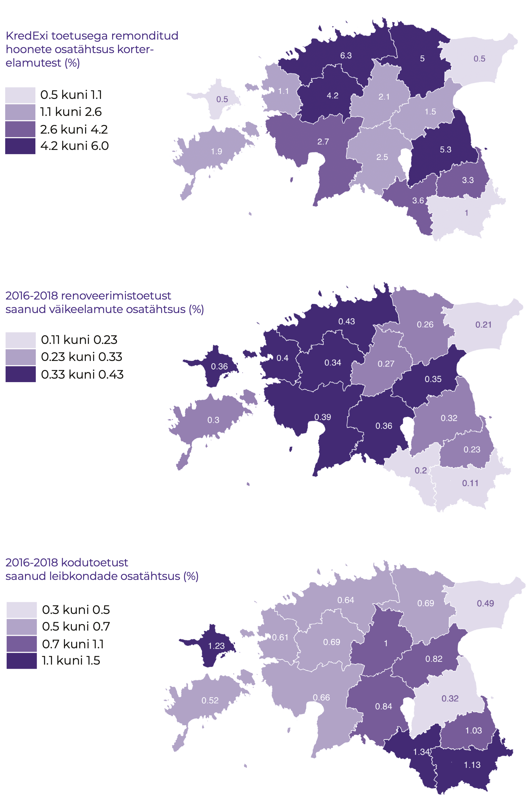

## Nüüdisaegsed elamistingimused – kelle privileeg? {.chapter_section .chapter1_section}

```{block, type='authors'}
**[Anneli Kährik](#anneli-kährik) ja [Annika Väiko](#annika-väiko)**
```

```{block, type='points'}
* Pool eestimaalastest on arvamusel, et nende elamistingimused vajavad parandamist, ning parem majanduslik elujärg annab võimaluse elada kvaliteetsemal elamispinnal.
```

1990\. aastatel Eesti ühiskonnas aset leidnud muutused mõjutasid oluliselt eluasemevaldkonna korraldust. Omandireformi käigus sai suurem osa elanikest omanikuks, kuid ka vastutus eluaseme korrashoiu eest jäi inimeste endi õlule. Toimus siire üürimajade ühiskonnast omanike ühiskonda – eluaseme omamine muutus „normiks“ ning üüriturule jäid need, kellel (veel) puudus võimalus oma eluaseme ostuks. Eluasemete jaotust hakkas kujundama turg.

```{block, type='blockquote-right'}
Elamistingimused ning nende kättesaadavus on elukvaliteedi ja ühiskondliku õigluse küsimus.
```
Siinses artiklis käsitleme elamistingimuste olukorda Eestis, piirkondlikke erinevusi, riigi rolli muutumist eluasemevaldkonna korraldamisel ja praeguse aja valikukohti. Küsime, kelle privileeg on tänases Eestis elada nüüdisaegsetes elamistingimustes. Arutame võimaluste üle, kuidas riigi, omavalitsuse, investorite ja elanike koostöös jõuda sihtrühmiti ning piirkondlikult ühtlasema tulemuseni elamistingimustes ja eluasemetega varustamisel. Inimese eluase on tüüpiliselt olnud erasfäär ja mitte avalik ruum. Avalik huvi ja kogu ühiskonda mõjutav valdkond on aga eluasemesektor kindlasti, sest see, millised on elamistingimused ning mil määral on ajakohased eluasemed kättesaadavad riigi eri paigus ja linna eri osades, on inimeste elukvaliteedi ja ühiskondliku õigluse küsimus. Just sellest vaatenurgast lähtuvalt käsitleme eluasemete teemat siin artiklis.


```{block, type='blockquote-right'}
Väljaspool suuremaid linnu ja eriti maapiirkondades on elamispindade ülejääk, asustamata on koguni iga viies eluruum.
```
Eesti riiklik eluasemepoliitika rõhutab peamiste sihtidena eluasemete kättesaadavuse parandamist ja eluasemefondi ajakohastamist (nt <a href="https://www.mkm.ee/sites/default/files/enmak_2030.pdf">energiamajanduse arengukava aastani 2030</a>). Elamistingimuste kvaliteeti nähakse ka rahvusvaheliselt ühe olulise osana elanike heaolust. Kehvad elamistingimused, näiteks mugavuste puudumine, rõsked seinad, pehkinud aknad ja põrandad, ülerahvastatus või ka eluasemete piiratud kättesaadavus liigkõrge hinna tõttu on ainelise ilmajäetuse näitajad üleeuroopalistes analüüsides (nt Eurostati klassifikatsioon). Eluaseme hinda mõjutab tüüpiliselt selle asukoht. Eestis on suurim hinnagalopp toimunud Tallinnas ja Tartus ning hind sõltub omakorda eluaseme linnasisesest asukohast. Hea asukoht linnakeskuse lähedal tagab hõlpsa ligipääsu teenustele, töökohtadele, haridusasutustele ja vaba aja veetmise võimalustele. Hea asukoht on aga suhteline mõiste. Head elamistingimused (nt uued eeslinnakodud) võivad olla ka asukohas, kus eluaset ümbritsev avalik ruum ja ligipääs teenustele jätab soovida, kuid olukord võib olla ka vastupidine (nt kehvas seisus üürikodu linnakeskuses).

Artiklis kasutatakse põhiliselt Eesti sotsiaaluuringu (2017) andmeid. See on osa üleeuroopalisest sissetulekute ja elamistingimuste uuringust EU-SILC (ingl *European Union Statistics on Income and Living Conditions*) ja Eestis korraldas selle Statistikaamet. Artikli teine osa käsitleb riiklikke eluasemepoliitika meetmeid ning nende regionaalset jaotumist, võttes aluseks KredExi andmed renoveerimistoetuste jaotumise kohta.

### Tüüpiline eestimaalane elab tüüpkorteris, eluasemefond uueneb kiiremini pealinnaregioonis {-.chapter1_section}

Kuna Eesti rahvaarv on võrreldes 1990. aastaga langenud, pole Eestis tervikuna eluasemete puudust – 2011. aastal oli Statistikaameti andmetel riigis kokku 650 000 tavaeluruumi 600 000 leibkonna kohta. Siiski pole eluasemete jaotus vastavuses leibkondade ruumilise jaotumise ja rändetrendidega. Väljaspool suuremaid linnu ja eriti maapiirkondades on elamispindade ülejääk, asustamata on koguni iga viies eluruum. Tallinnas ja Tartus on nõudlus eluasemete järele suurem kui pakkumine, kusjuures 7% eluruume on asustatud mitme leibkonna poolt. See ei näita veel eluasemete puuduse tegelikku ulatust, sest raskused eluasemeturule pääsemisel ei võimalda noortel leibkonnana iseseisvuda ja vanematekodust lahkuda.

Kuigi eramajades elavate leibkondade osakaal on veidi suurenenud, elab koguni 70% Eesti leibkondadest korterites. Korterite osakaalu poolest ületame märgatavalt Euroopa Liidu keskmist näitajat, mis on 41%. Korterelamute osatähtsus on ülekaalukalt suurim Tallinnas, eramajade osakaal aga keskustest väljaspool ja kaugemal pealinnaregioonist ([joonis 1.4.1](#figure141)).

<p class="caption" id="figure141"><span class="figure-number">Joonis 1.4.1.</span> Eluasemete jaotus eluasemetüübi alusel Tallinna linnas (vasakul) ja ääremaal (maakonnad ilma keskusteta, v.a Harjumaa) (paremal)</p>

```{r, figure141, out.width='85%', fig.align='center', echo=FALSE, message=FALSE}

library("tidyverse")
library("scales")


 fig141_data <- read.csv ("data/14_fig1_data.csv", header=TRUE, fileEncoding="utf-8")

fig141_data$percent=percent((fig141_data$value/100), 1)

  fig141_plot <- ggplot(data = fig141_data, aes(x = "", y = value, fill = variable)) +
  geom_bar(stat = "identity") +
  scale_fill_manual(values=c("#b1e0f9","#482683","#369B9E")) +
  geom_text(aes(label = percent), position = position_stack(vjust = 0.5), color="white") +
  coord_polar(theta = "y") +
  labs(x="", y="")+
  facet_grid(~area)

  fig141_theme <- theme(
                    panel.grid.major.x = element_blank() ,
                    panel.grid.major.y = element_blank(),
                    panel.grid.minor.x = element_blank() ,
                     panel.grid.minor.y = element_blank(),
                     axis.line = element_blank(),
                     axis.text.x = element_blank(),
                 )


  print(fig141_plot + fig_theme_general + fig141_theme)

ggsave(path="exported_figures/PDF/chapter1",filename="fig141.pdf", height=140, width=200, units="mm")

```

``` {block, type='imgsource'}
<span class="imgsource-source">Allikas:</span> Eesti sotsiaaluuring 2017 (Statistikaamet).
```


```{block, type='blockquote-right'}
Suurema osa eestimaalaste elamistingimuste paranemine on saanud toimuda vana eluaset renoveerides.
```
Suurem osa Eesti eluasemefondist pärineb nõukogude perioodist ([joonis 1.4.2](#figure142)). Tüüpprojektiga korterelamute ehitamise kõrgaeg oli aastatel 1960–1990, mil kogu Eestis lisandus igal aastal ligikaudu 13 000 uut eluaset. See periood langeb kokku tööstuse kiire kasvu ja uue tööjõu sissetoomisega. Suured kortermajad kerkisid eelkõige linnadesse, moodustusid terved uued linnajaod. Selline tööstuslik ja majanduslikult ökonoomne väikekorterite ehitus jõudis ka maapiirkondadesse. Viimastesse püstitati madalamaid, kahe- ja kolmekorruselisi elamuid. Kõigi mugavustega varustatud moodsad korterid olid nõukogude aja eluasemepuudust arvestades paljudele ihaldatud eluase. Eramute ehitus toimus sel ajal enamasti riikliku toetuseta, olles ainus võimalus elamistingimuste parandamiseks neile, kes ei saanud riigilt või töökoha kaudu korterit. Oli siiski ka neid, kellele iseehitamine oli eneseteostuse võimalus või kes soovisid elada ruumikamal pinnal ([Kõre jt 1996](#Kõre1996)). Nõukogude Eestis tehti riigistatud sõjaeelsete elamispindade korrashoiuks vähe investeeringuid. Ajaloolised elamurajoonid linnades muutusid aguliteks ning ka maapiirkondades eelistati üldjuhul uusi tüüpkortereid ([samas](#Kõre1996)).

Uuselamuehitus sai uue suurema tõuke pärast 2000. aastat, kui paranesid üldine elujärg ja laenuvõimalused. Tallinnas ja Harjumaal on ehitustegevus olnud hoogsam kui mujal Eestis ([joonis 1.4.2](#figure142)). Tallinnas elab iga viies pere pärast 1991. aastat ehitatud eluasemel, Harjumaal väljaspool Tallinna koguni iga kolmas. Mujal Eestis on elamute ehitusaktiivsus olnud oluliselt väiksem. Seega on suurema osa eestimaalaste elamistingimuste paranemine saanud toimuda vaid vana eluaset renoveerides.

<p class="caption" id="figure142"><span class="figure-number">Joonis 1.4.2.</span> Eluasemete ehitusaeg (regionaalsed keskused on maakonnakeskused)</p>

```{r, figure142, out.width='90%', fig.align='center', echo=FALSE, message=FALSE}

library("tidyverse")

 fig142_data <- read.csv ("data/14_fig2_data.csv", header=TRUE, fileEncoding="utf-8")

fig142_data$area <- factor(fig142_data$area, levels = c("Tallinn","Harjumaa (v.a Tallinn)","Regionaalsed keskused (v.a Tallinn)","Väikelinnad ja maa (v.a Harjumaa)"))


  fig142_plot <- ggplot(data = fig142_data) +
    geom_bar(mapping = aes(x=years, y=value, fill=area), size=1.2, stat = "identity", position="dodge") +
    scale_fill_manual(values=c("#482683", "#917db5","#369B9E","#b1e0f9")) +
    labs(y="% eluasemetest", x="") +
    guides(fill=guide_legend(nrow=2,byrow=TRUE))

  fig142_theme <- theme(
                  axis.text.x = element_text(hjust=0.5),
                  panel.grid.major.x = element_blank(),
                  panel.grid.minor.x = element_blank(),
                 )


  print(fig142_plot + fig_theme_general + fig142_theme)

  ggsave(path="exported_figures/PDF/chapter1",filename="fig142.pdf", height=140, width=200, units="mm")

```

``` {block, type='imgsource'}
<span class="imgsource-source">Allikas:</span> Eesti sotsiaaluuring 2017 (Statistikaamet).
```

Eluruumidega varustatus on aastatega paranenud ning ka ruumi inimese kohta on rohkem. Kui rahvaloenduse andmetel oli aastatuhande vahetuse ajal elaniku kohta 24,4 m<sup>2</sup> elamispinda ning 1,08 tuba, siis 2011. aastaks juba 31,4 m<sup>2</sup> ning 1,28 tuba. Selle näitaja alusel oleme Euroopa Liidu riikidega võrreldes suhteliselt kõrgel positsioonil.

### Eluasemefondi seisukord on paranemas, kuid viletsamas seisus on maapiirkondade eluruumid {-.chapter1_section}

```{block, type='blockquote-right'}
Eestis elab endiselt kõigi mugavusteta elamispindadel 13% leibkondadest. Selle näitajaga on Eesti Euroopa Liidu võrdluses viimaste hulgas.
```
Eesti elamufond on suhteliselt amortiseerunud ning vajab ajakohastamiseks suuri investeeringuid. Nõukogude ajal kerkinud eluhooned on praegu juba üsna vanad. Eestis elab endiselt kõigi mugavusteta elamispindadel tervelt 13% leibkondadest – nende eluruumis puudub kas eluaseme ainukasutuses olev veega tualettruum ja/või tänapäevased pesemistingimused (dušš või vann). Nihe paranemise suunas on toimunud, kui võrrelda olukorda 2000. aastaga, kuid Euroopa Liidu võrdluses oleme viimaste hulgas. Probleem on suurim väikelinnades ja maapiirkondades. Kehvade elamistingimuste (rõsked seinad, pehkinud aknad/põrandad) üle kurdab koguni iga viies ääremaa pere ([joonis 1.4.3](figure143)).

<p class="caption" id="figure143"><span class="figure-number">Joonis 1.4.3.</span> Eluasemeprobleemide esinemine ja mugavuste puudumine asustustüüpide lõikes (regionaalsed keskused on maakonnakeskused)</p>

```{r, figure143, fig.align='center', echo=FALSE, message=FALSE}

library("tidyverse")

 fig143_data <- read.csv ("data/14_fig3_data.csv", header=TRUE, fileEncoding="utf-8")


  fig143_plot <- ggplot(data = fig143_data) +
    geom_bar(mapping = aes(x=reorder(area, -value), y=value, fill=variable),position = "dodge", width=0.7, stat="identity") +
    coord_flip()+
    labs(y="%", x="") +
    scale_fill_manual(values=c("#482683","#917DB5"))

    fig143_theme <- theme(
                  panel.grid.major.y = element_blank() ,
                  panel.grid.minor.y = element_blank(),
                 )


  print(fig143_plot + fig_theme_general + fig143_theme)

  ggsave(path="exported_figures/PDF/chapter1",filename="fig143.pdf", height=140, width=200, units="mm")

```

``` {block, type='imgsource'}
<span class="imgsource-source">Allikas:</span> Eesti sotsiaaluuring 2017 (Statistikaamet).
```

Ligikaudu pool Eesti elanikest elab eluruumides, mis nende enda hinnangul vajavad ajakohastamist, olles kas väga viletsas seisundis või oluliste puudustega. Elamistingimustega rahulolu mõjutab eluhoone vanus ja ka tüüp – probleeme on rohkem vanemates elamutes asuvate eluasemetega, samuti väiksemate hoonetega (nii korterelamud kui ka eramajad) ([joonis 1.4.4](#figure144)). Suurte kortermajade (suhteliselt uuemad) elanikud hindavad eluasemete seisukorda veidi paremaks. Kehvem on väikelinnade ja maapiirkondade eluasemete olukord ning üürisektor tervikuna on mõnevõrra suuremate puudustega kui omanike poolt asustatud eluasemed.

<p class="caption" id="figure144"><span class="figure-number">Joonis 1.4.4.</span> Inimeste hinnang eluaseme seisukorrale eluhoone vanuse (üleval) ning tüübi (all) järgi</p>

```{r, figure144, out.width='80%', fig.asp=1.0, fig.align='center', echo=FALSE, message=FALSE}

library("tidyverse")
library(gridExtra)
library(grid)

fig144_data1 <- read.csv ("data/14_fig4_data1.csv", header=TRUE, fileEncoding="utf-8")
fig144_data2 <- read.csv ("data/14_fig4_data2.csv", header=TRUE, fileEncoding="utf-8")


  fig144_plot1 <- ggplot(data = fig144_data1) +
    geom_bar(mapping = aes(x=condition, y=value, fill=year), width=0.7, stat="identity") +
    coord_flip() +
    labs(y="%", x="") +
    scale_fill_manual(values=c("#DAD4E6","#B6A8CD","#b1e0f9","#6D519C","#369B9E","#361C62")) +
     guides(fill = guide_legend(reverse = TRUE)) +
      scale_x_discrete(labels = wrap_format(20))

  fig144_plot2 <- ggplot(data = fig144_data2) +
    geom_bar(mapping = aes(x=condition, y=value, fill=type_of_residence), width=0.7, stat="identity") +
    coord_flip() +
    labs(y="%", x="") +
    scale_fill_manual(values=c("#369B9E","#b1e0f9","#482683")) +
    guides(fill = guide_legend(reverse = TRUE)) +
    scale_x_discrete(labels = wrap_format(20))

    fig144_theme <- theme(
                    panel.grid.major.y = element_blank() ,
                     panel.grid.minor.y = element_blank(),
                 )

grid.arrange(fig144_plot1 + fig144_theme + fig_theme_general, fig144_plot2 + fig144_theme + fig_theme_general, ncol = 1)

ggsave(path="exported_figures/PDF/chapter1",fig144_plot1 + fig144_theme + fig_theme_general,filename="fig144a.pdf", height=100, width=170, units="mm")

ggsave(path="exported_figures/PDF/chapter1",fig144_plot2 + fig144_theme + fig_theme_general,filename="fig144b.pdf", height=100, width=170, units="mm")
```

``` {block, type='imgsource'}
<span class="imgsource-source">Allikas:</span> Eesti sotsiaaluuring 2017 (Statistikaamet).
```

<div class="casebox">
<h3>Eluasemeturu olukord väikelinnades ja pealinnas on erinev</h3>

Väikelinnade valikud ja võimalused taskukohast elamispinda pakkuda on teistsugused kui Tallinnas või Tartus. Viimastes toimub just siselinna vanemates elupiirkondades ajaloolise elamufondi uuendamine ([joonis 1.4.5](#figure145)). Seda kannustab turu nõudlus ja investorite huvi. Samad turuprotsessid ei toimi aga pealinnast kaugemal asuvates väikelinnades. Näite võib tuua Valga linnast ([joonis 1.4.6](#figure146)), kus jääb tühjaks just see osa elamufondist, mis suurlinnades keskklassistub. Omanikud ja pärijad on oma varast isegi loobunud, kuna kinnisvaral turuväärtus peaaegu puudub. Samuti pole samal põhjusel võimalik pangast hoone rekonstrueerimiseks laenu saada. Nii eelistatakse väikelinnades pigem korterit paneelmajas, kuna nende hoonete ja eluasemete seisund on parem.

<p class="caption" id="figure145"><span class="figure-number">Joonis 1.4.5.</span> Kalamaja elamud Tallinnas on kahe viimase aastakümne jooksul suures osas renoveeritud</p>
```{r, figure145, out.width='100%', fig.align='center', echo=FALSE, message=FALSE}

knitr::include_graphics("figures/1-chapter/fig145.png")

```
<p class="caption" id="figure146"><span class="figure-number">Joonis 1.4.6.</span> Valgas ei ole kesklinna puitmajadele nõudlust hoolimata sellest, et tegemist on väärtusliku miljööga</p>
```{r, figure146, out.width='100%', fig.align='center', echo=FALSE, message=FALSE}

knitr::include_graphics("figures/1-chapter/fig146.png")

```

</div>
```{block, type='imgsource'}
<span class="imgsource-source">Allikas:</span> Anneli Kährik (üleval) ja Valga vald (all).
```

### Majanduslik kindlustatus - võti elamistingimuste parandamiseks {-.chapter1_section}

Eluasemeprobleemid on suures osas majanduslikku laadi. Suurem sissetulek annab võimaluse elada renoveeritud või uuel pinnal ning väiksema sissetuleku tõttu ei saa inimesed endale lubada elamistingimuste parandamist ([joonis 1.4.7](#figure147)). Väikese sissetulekuga peredel moodustab eluaseme ülalpidamisele kuluv summa suure osa pere eelarvest, investeeringuteks raha ei jätku. Iga neljas väikese sissetulekuga leibkond leiab, et eluasemekulud (kommunaalmaksud, üür/eluasemelaen) koormavad nende pere eelarvet väga suurel määral, seevastu suurema tulu saajatest kurdab sama vaid 5% peredest. Ka lasterikkad pered elavad mõnevõrra kehvemates elamistingimustes võrreldes peredega, kus on üks-kaks last. Võrreldes Eesti lastega perede elamistingimusi teiste Euroopa Liidu riikide olukorraga, torkab Eesti puhul silma suurem rahulolematus (22% lastega peredest pole rahul oma eluaseme kvaliteediga, sama näitaja on Euroopa Liidus keskmiselt 12%).

<p class="caption" id="figure147"><span class="figure-number">Joonis 1.4.7.</span> Inimeste hinnang eluaseme seisukorrale sissetulekugruppide alusel (kõige väiksema sissetulekuga viiendik elanikkonnast – vasakul, kõige suurema sissetulekuga viiendik elanikkonnast – paremal)</p>

```{r, figure147, out.width='80%', fig.asp=.75, fig.align='center', echo=FALSE, message=FALSE}

library("tidyverse")

fig147_data <- read.csv ("data/14_fig7_data.csv", header=TRUE, fileEncoding="utf-8")

fig147_data$income_size <- factor(fig147_data$income_size, levels = c("Suur sissetulek","Väike sissetulek"))
fig147_data$condition <- factor(fig147_data$condition, levels = c("Esineb suuri puudusi","Esineb puudusi","Hea seisukord","Värskelt remonditud"))

 fig147_data$percent=percent((fig147_data$value/100), 1)

  fig147_plot <- ggplot(data = fig147_data,aes(x="", y=value, fill=condition)) +
    geom_bar(width=0.7, stat="identity") +
    scale_fill_manual(values=c("#b1e0f9","#369B9E","#482683","#361C62")) +

    geom_text(aes(label = percent), position = position_stack(vjust = 0.5), color="white") +
    coord_polar("y", start=0)+
    facet_wrap(~income_size, nrow=1)+
    labs (x="", y="")

    fig147_theme <- theme(
                    panel.grid.major.x = element_blank() ,
                    panel.grid.major.y = element_blank(),
                    panel.grid.minor.x = element_blank() ,
                    panel.grid.minor.y = element_blank(),
                    axis.line = element_blank(),
                    axis.text.x = element_blank(),
                 )

print(fig147_plot + fig_theme_general +   fig147_theme)

ggsave(path="exported_figures/PDF/chapter1",filename="fig147.pdf", height=140, width=200, units="mm")
```

``` {block, type='imgsource'}
<span class="imgsource-source">Allikas:</span> Eesti sotsiaaluuring 2017 (Statistikaamet).
```

```{block, type='blockquote-right'}
Väikese sissetulekuga peredel moodustab eluaseme ülalpidamisele kuluv summa suure osa pere eelarvest, investeeringuteks raha ei jätku.
```
Ootuspäraselt on Tallinnas ja Harjumaal paremal majanduslikul järjel olevaid leibkondi rohkem. Sellest tulenevalt on pealinna regiooni elanikel rohkem võimalusi oma eluaseme kvaliteeti parandada. Asulatüüpide erinevused jäävad aga kehtima ka siis, kui võrrelda sarnast tulu teenivate leibkondade elamistingimusi. Pealinna eluasemete seisukorda hinnatakse paremaks ka siis, kui leibkonna enda ressursid nii suured ei ole ([joonis 1.4.8](#figure148)). Keskmiselt 70% pealinlastest elab renoveeritud või heas seisukorras oleval eluasemel. Siin võib rolli mängida Tallinna elamufondi noorem keskmine vanus, kuid edutegur võib olla seotud ka suurema sotsiaalse mitmekesisusega pealinna kortermajades ja asumites – kui ühes eluhoones elab peale väiksema sissetulekuga elanike ka majanduslikult paremal järjel inimesi, avaldab see kokkuvõttes positiivset mõju kõigile.

<p class="caption" id="figure148"><span class="figure-number">Joonis 1.4.8.</span> Hinnangud oma eluasemete seisukorrale sissetuleku ja asustustüübi alusel (regionaalsed keskused on maakonnakeskused), vasakul: suurimat tulu saav viiendik, paremal: väikseimat tulu saav viiendik</p>

```{r, figure148, out.width='80%', fig.asp=.75, fig.align='center', echo=FALSE, message=FALSE}

library("tidyverse")

 fig148_data <- read.csv ("data/14_fig8_data.csv", header=TRUE, fileEncoding="utf-8")
 fig148_data$area <- factor(fig148_data$area, levels = c("Väikelinnad ja maa (v.a Harjumaa)","Regionaalsed keskused (v.a Tallinn)","Harjumaa (v.a Tallinn)","Tallinn"))

  fig148_plot <- ggplot(data = fig148_data) +
    geom_bar(mapping = aes(x=area, y=value, fill=condition), width=0.6, stat="identity") +
    scale_fill_manual(values=c("#369B9E","#482683")) +
    coord_flip() +
    labs(y="%", x="") +
    facet_wrap(~income, nrow=1) +
    scale_x_discrete(labels = wrap_format(23)) +
    guides(fill = guide_legend(reverse = TRUE))

  fig148_theme <- theme(
                    panel.grid.major.y = element_blank(),
                    panel.grid.minor.y = element_blank(),
                    panel.grid.minor.x = element_blank(),
                    axis.line = element_blank(),
                    axis.text.x = element_blank(),
                 )

print(fig148_plot + fig148_theme + fig_theme_general)
ggsave(path="exported_figures/PDF/chapter1",filename="fig148.pdf", height=140, width=200, units="mm")

```

``` {block, type='imgsource'}
<span class="imgsource-source">Allikas:</span> Eesti sotsiaaluuring 2017 (Statistikaamet).
```

### Taasiseseisvumise järel oli eluasemekorraldus täielikult suunatud turupõhisele eluasemefondile {-.chapter1_section}

Pärast 1991. aastat toimusid elamupoliitikas suured ümberkorraldused. Riigi prioriteediks sai elamufondi erastamine ning valitsuse eemaldumine eluasemete korrashoiu ja uuendamisega seotud küsimustest. Ajavahemikul 1994–2002 vähenes avalikule sektorile kuulunud elamufond 64%-lt (linnades 72%-lt) 4%-le. Avalikule võimule jäi vähe hoobasid, et toetada majanduslikult raskemas olukorras leibkondi eluaseme soetamisel või renoveerimisel. 1990. aastate reformide kolm tugisammast olid järgmised:

1) masserastamine – 98% nõukogude ajal ehitatud korterelamute eluruumidest erastati riigi väljastatud väärtpaberite (EVPde) abil;
2) eluasemete tagastamine õigusjärgsetele omanikele – nn sundüürnikele kompenseeriti neile tekitatud ebaõiglus kas rahaliselt või teise eluaseme kasutusse andmisega;
3) liberaalse eluasemeturu tekkeks vajalike tingimuste loomine riiklike üüripiirmäärade kaotamise kaudu.

Üüriturg arenes välja järk-järgult ja peamiselt erastatud korterite baasil, mille omanikud olid eri põhjustel vabaks jätnud. Arendajate initsiatiiv üürikortereid rajada on olnud tagasihoidlik. Aastaks 2011 moodustas eraüürisektor umbes 15% turuosast, omanikuasustus aga tervelt 83% ([joonis 1.4.9](#figure149)). Euroopa Liidu riikides moodustab viimane 69%, soodusüüriga eluasemete osakaal on enamasti Eesti omast suurem. Üürnike osakaal kokku on suurim pealinnas (ligikaudu 22%), kus on ka kõige enam avaliku sektori pakutavaid üürikortereid. Tüüpiline erasektori üürnik on noor üksi või paarisuhtes elav isik, suuremate leibkondade ning kesk- ja vanemaealiste hulgas on üürnikke vähe.

<p class="caption" id="figure149"><span class="figure-number">Joonis 1.4.9.</span> Jaotus omandisuhte alusel (vasakul kogu Eesti, paremal asustustüüpide lõikes) (regionaalsed keskused on maakonnakeskused)</p>

```{r, figure149, out.width='100%', fig.align='center', echo=FALSE, message=FALSE}

library("tidyverse")
library(gridExtra)
library(grid)
library("scales")

fig149_data1 <- read.csv ("data/14_fig9_data1.csv", header=TRUE, fileEncoding="utf-8")
fig149_data2 <- read.csv ("data/14_fig9_data2.csv", header=TRUE, fileEncoding="utf-8")

fig149_data1$group <- factor(fig149_data1$group, levels = c("Omanik","Üürnik (erasektor)","Üürnik (avalik sektor)"))
fig149_data2$variable <- factor(fig149_data2$variable, levels = c("Üürnik (avalik sektor)","Üürnik (erasektor)","Omanik"))

fig149_data2$area <- factor(fig149_data2$area, levels = c("Väikelinnad ja maa (v.a Harjumaa)","Regionaalsed keskused (v.a Tallinn)","Harjumaa (v.a Tallinn)","Tallinn"))

fig149_data1$percent=percent((fig149_data1$value/100), 1)


  fig149_plot1 <- ggplot(data = fig149_data1, aes(x="", y=value, fill=group)) +
    geom_bar( width=0.7, stat="identity") +
    geom_text(aes(x=1.15,label = percent), position = position_stack(vjust = 0.5), color="white") +
    scale_fill_manual(values=c("#482683","#369B9E","#b1e0f9")) +
    coord_polar("y")+
    labs(y="", x="") +
    guides(fill=guide_legend(nrow=3,byrow=TRUE))


  fig149_plot2 <- ggplot(data = fig149_data2) +
    geom_bar(mapping = aes(x=area, y=value, fill=variable), width=0.7, stat="identity") +
    scale_fill_manual(values=c("#b1e0f9","#369B9E","#482683")) +
    coord_flip() +
    labs(y="%", x="") +
    scale_x_discrete(labels = wrap_format(17)) +
    guides(fill=guide_legend(nrow=3,byrow=TRUE, reverse=TRUE))

      fig149_theme1 <- theme(
                    panel.grid.major.x = element_blank() ,
                    panel.grid.major.y = element_blank(),
                    panel.grid.minor.x = element_blank() ,
                     panel.grid.minor.y = element_blank(),
                     axis.line = element_blank(),
                     axis.text.x = element_blank(),
                 )

            fig149_theme2 <- theme(
                    panel.grid.major.y = element_blank() ,
                    panel.grid.minor.y = element_blank() ,
                    panel.grid.minor.x = element_blank(),
                    legend.position = "none"

                 )

grid.arrange(fig149_plot1 + fig_theme_general + fig149_theme1, fig149_plot2 + fig_theme_general + fig149_theme2 , ncol = 2)

ggsave(path="exported_figures/PDF/chapter1",filename="fig149a.pdf",fig149_plot1 + fig_theme_general + fig149_theme1, height=140, width=100, units="mm")
ggsave(path="exported_figures/PDF/chapter1",filename="fig149b.pdf",fig149_plot2 + fig_theme_general + fig149_theme2, height=140, width=100, units="mm")
```

``` {block, type='imgsource'}
<span class="imgsource-source">Allikas:</span> Eesti sotsiaaluuring 2017 (Statistikaamet).
```

Kuni 2000. aastateni oli riik eluasemepoliitikast peaaegu täielikult taandunud ning eluasemeturg toimis turumajanduslikel põhimõtetel. Siis aga selgus, et turg ja elanike oma algatus üksi ei taga eluasemete kättesaadavust, eluasemefondi kvaliteedi parandamist ja piisavat uuendamist, ning nii on 2000. aastatel lisandunud ka elamufondi kvaliteedi tõstmist ning ka üürielamufondi arendamist soodustavaid meetmeid.

### Avaliku sektori meetmeid on ajaga lisandunud{-.chapter1_section}

Riiklikult on kõige pikema praktikaga omanikuasustuse toetamine (Eesti elamumajanduse arengukava aastateks 2003–2008). Et toetada noori eluasemeturule sisenemisel, on KredEx neile pakkunud täiendavaid laenugarantiisid ([tabel 1.4.1](#table141)). Samuti on rakendatud maksusoodustust eluasemelaenu intressilt. Sotsiaaltoetusena on kasutusel olnud toimetulekutoetus, mis katab eluasemega seotud jooksvad kulutused (v.a laenu tagasimaksed) ulatuses, mis jätab toetuse saajale kätte toimetulekuks vajaliku raha. Kui 1990. aastate lõpus sai seda toetust koguni 14% Eesti leibkondadest, siis nüüdseks on saajate hulk alla 1%.

<p class="caption" id="table141"><span class="figure-number">Tabel 1.4.1.</span> Eluasemepoliitika kehtivad riiklikud meetmed ja nende sihtrühmad</p>

<div style="overflow-x:auto;">
<table id="table_141" style="width:100%">
  <tr>
    <th class="table141_main_header">TOETUSE TÜÜP</th>
    <th class="table141_main_header">SIHTRÜHM</th>
  </tr>

  <tr>
    <th colspan="2">Omanikuasustuse soodustamine</th>
  </tr>
  <tr>
    <td>Eluasemelaenu käendus (vähendab esma- se sissemakse kohustust, omafinantsee- ring minimaalselt 10% laenu tagatisvara väärtusest)</td>
    <td>Noored pered, noored spetsialistid jt sihtrühmad, kes soovivad võtta laenu eluaseme ostmiseks või olemasoleva renoveerimiseks</td>
  </tr>
    <tr>
    <td>Tulumaksusoodustus eluasemelaenu intressilt</td>
    <td>Eluasemelaenu võtnud isikud</td>
  </tr>

  <tr>
    <th colspan="2">Sotsiaaltoetused</th>
  </tr>
  <tr>
    <td>Toimetulekutoetus (riigi rahaline abi puuduses elavatele inimestele)</td>
    <td>Väikese sissetulekuga leibkonnad, kelle sissetulek eluasemekulude tasumise järel jääb alla toimetulekupiiri</td>
  </tr>

  <tr>
    <th colspan="2">Üürielamufondi rajamine</th>
  </tr>
  <tr>
    <td>Elamufondi arendamise investeeringu- toetus kohalikele omavalitsustele</td>
    <td>Liikuvad töötajad ja majanduslikult vähekindlustatud sihtrühmad (kohalik omavalitsus kehtestab reeglid)</td>
  </tr>

  <tr>
    <th colspan="2">Elamufondi kvaliteedi parandamine</th>
  </tr>
  <tr>
    <td>Korterelamute rekonstrueerimistoetus</td>
    <td>Enne 1993. aastat püstitatud korterela- mute omanikud, kelle eluhoone vajab rekonstrueerimist</td>
  </tr>

  <tr>
    <td>Väikeelamute rekonstrueerimistoetus</td>
    <td>Enne 1993. aastat püstitatud väikeelamute omanikud, kelle eluhoone vajab rekonst- rueerimist</td>
  </tr>

  <tr>
    <td>Korterelamute rekonstrueerimistoetus</td>
    <td>Väikese sissetulekuga kolme või enama lapsega pered, kelle eluase vajab remonti või kellel puudub vajadustele vastav eluase</td>
  </tr>

  <tr>
    <td>Puuetega inimeste eluruumide füüsilise kohandamise toetus</td>
    <td>Erivajadustega inimesed, kelle eluase vajab füüsilist kohandamist</td>
  </tr>

</table>
</div>

``` {block, type='imgsource'}
<span class="imgsource-source">Allikas:</span> KredEx; energiamajanduse arengukava aastani 2030; sotsiaalhoolekande seadus (autorite koostatud tabel).
```

Avaliku sektori üürielamufondi rajamise toetust – kuni 50% projekti abikõlblikest kuludest – on riik väljastanud kohalikele omavalitsustele perioodil 2003–2007 ning samalaadne toetus on taas süsteemsemalt olemas alates 2018. aastast. Esmatähtis eesmärk on nüüdisaegse eluasemefondi loomine piirkondades, kus esinevad „turutõrked“ (kuid toetust väljastatakse ka teistele omavalitsustele). Toetusmeetmega soovitakse tugevdada piirkondade konkurentsivõimet, uute eluasemete sihtrühmaks on liikuvad töötajad ning vähekindlustatud leibkonnad.

<div class="casebox">
<h3>Kõige aktiivsemalt on omavalitsustest uusi munitsipaalelamuid rajanud Tallinn</h3>

Tallinna munitsipaalelamuehitust toetavad programmid on osaliselt ellu viidud riigi toel (ligikaudu 25% projektide maksumusest). Uued elamud asuvad peamiselt Lasnamäel ([joonis 1.4.10](#figure1410)) ja Põhja-Tallinna linnaosas. Aastatel 2003–2012 lisandus uute programmidega umbes 3000 uut eluaset, mis moodustab ligi 2% Tallinna elamufondist. Eluasemed paiknevad 5–15-korruselistes elamutes. Eluasemed olid mõeldud tagastatud majade üürnikele ümberasumiseks ning teistele vajaduspõhistele sihtrühmadele, nagu noored pered, linnale vajalik tööjõud, sotsiaalhoolekande grupid. 40% rajatud uutest eluasemetest on kohaliku omavalitsuse omanduses, teised on rajatud aga erakapitaliga või avaliku ja erasektori koostööprojektidena (erasektori omanduses). Viimaste puhul seisnes linna osalus ehituseks maa pakkumises ning taristu väljaehitamises. Ka üksnes erasektori poolt arendatud korterites on üür subsideeritud – turuüüri ja nn sotsiaalüüri vahe maksab kinni Tallinn. Esialgse plaani kohaselt pidi üür katma ⅔ kulupõhisest üürist kohalikule omavalitsusele kuuluvais korterites (v.a ehituskulu) ning poole turuüürist erasektori korterites (Tallinna elamuehitusprogramm I ja II). Hiljem fikseeriti üüritase eraarendaja ellu viidud projektides 20 aastaks tasemega 9,09 eur/m2 kuus, millest 21% katab üürnik, ülejäänu aga kohalik omavalitsus.

<p class="caption" id="figure1410"><span class="figure-number">Joonis 1.4.10.</span> Munitsipaalehitusprogrammid Tallinnas (Raadiku asum)</p>

```{r, figure1410, out.width='90%', fig.align='center', echo=FALSE, message=FALSE}

knitr::include_graphics("figures/1-chapter/fig1410.png")

```

</div>
```{block, type='imgsource'}
<span class="imgsource-source">Allikas:</span> Anneli Kährik.
```

Riigi toetus on mõeldud elamufondi kvaliteedi parandamiseks. KredEx väljastab korterelamute rekonstrueerimistoetusi. Tegemist on otsetoetusega, mis katab osaliselt hoonete soojustamise ja küttesüsteemide uuendamise kulud. Põhieesmärk on energiakokkuhoiu saavutamine kodumajapidamistes ning hoonete seisukorra ja üldise elukeskkonna parandamine. Toetusi pakutakse ka väikeelamute kvaliteedi ja energiatõhususe parandamiseks (30% ulatuses abikõlblikest kuludest). Eraldiseisev eluasemete kvaliteeti mõjutav toetusmeede „Kodutoetus“ on sihitud väiksema sissetulekuga paljulapselistele peredele eluaseme ehituseks, ostuks või renoveerimiseks. Riiklikku toetust väljastatakse ka kohalikele omavalitsustele erivajadustega inimeste eluruumide füüsilise kohandamise toetamiseks.

### Rekonstrueerimistoetused aitavad elamistingimusi parandada, kuid regiooniti ebaühtlaselt {-.chapter1_section}

Eesti maakondades ja eri asustustüüpides paiknevate eluruumide omanikud on KredExi väljastatud rekonstrueerimistoetusi kasutanud eri aktiivsusega. Toetused on kõige suurema tõenäosusega jõudnud kolme maakonda – peale Harjumaa ja Tartu maakonna ka Lääne-Virumaale. Kõige harvem on aga toetusi väljastatud Ida-Virumaale, Võrumaale ning Hiiu- ja Läänemaale, teisisõnu kõige kaugematele ääremaa-aladele Eestis ([joonis 1.4.11](#figure1411)). Mida jõukam piirkond, seda rohkem toetusi kasutatakse, mahajäämusega kaasneb ka loium toetuste kasutamine ([vt ka Lihtmaa jt 2018](#Lihtmaajt2018). Väikeelamute rekonstrueerimistoetuste puhul on piirkonna majandusareng ja toetuste kasutamine veidi vähem seotud, kuid siingi on Ida-Virumaa ja Kagu-Eesti nõrgemas seisus. Võrreldes universaalsemat tüüpi toetustega näitab paljulapselistele peredele suunatud eluaseme renoveerimistoetuste jaotumine (nn kodutoetus) teist laadi tulemust. See toetus on jõudnud ka kaugematesse maakondadesse, kuid Ida-Virumaa leibkonnad kasutavad ka seda toetust vähem.

<p class="caption" id="figure1411"><span class="figure-number">Joonis 1.4.11.</span> KredExi meetmete piirkondlik jaotumine</p>

Andmed toetuste väljamaksmiste kohta kogu toetuste väljamaksmise perioodil. Korterelamute rekonstrueerimistoetus (1), väikeelamute rekonstrueerimistoetus (2) ning „Kodutoetus“ (3).

```{r, figure1411, out.width='100%', fig.asp=.75, fig.align='center', echo=FALSE, message=FALSE}



```

``` {block, type='imgsource'}
<span class="imgsource-source">Allikas:</span> KredEx.
```
Seega võib tõdeda, et mida vähem on piirkonnas majanduslikku ning ka sotsiaalset ja oskuskapitali, seda vähem riiklikke üldisi toetusmeetmeid kasutatakse. Mõju on akumuleeruv – kui ehitus- ja renoveerimistegevust ei toimu, siis ei kujune ümbruskonnas välja ka positiivseid rollimudeleid. Initsiatiiv renoveerimisel toob kasu ka majanduslikult kehvemal järjel olijatele samades eluhoonetes. Varasemad uuringud näitavad, et Tallinna linna sees rekonstrueerimistoetuse saamise aktiivsuse ja kortermajade elanikkonna keskmise jõukuse taseme vahel olulist seost leitud pole ([Hess jt 2019](#Hess2019)). See viitab asjaolule, et sotsiaalne mitmekesisus on korterelamute renoveerimise seisukohalt ressurss, millest saavad kasu kõik elanikud. Sissetulekupõhine toetuste iseloom aitab aga kaudselt ühtlustada ka regionaalset ebavõrdsust.

### Võtmeküsimus eluasemevaldkonnas – millised on sekkumise võimalused?  {-.chapter1_section}

Alates 2011. aastast on eluasemehinnad suuremates linnades pidevalt tõusnud. Hinnatõusuga ei ole aga jõudnud sammu pidada sissetulekute kasv ([Kährik 2019](#Kährik2019)). Suure nõudlusega linnades käivad nii üüri- kui ka ostuhinnad töökarjääri alustavale noorele või noorele perele üle jõu. Samuti pole neil püsiva töösuhte ja piisava sissetuleku puudumise korral lihtne pangast eluasemelaenu saada. Noorte ligipääs eluasemeturule on üha enam sõltuv vanemate rahakotist ja vanemate laenugarantiidest. Kõigil noortel ei ole võimalik aga sellele toetuda. Kas osta või üürida, see on ka valikute küsimus. Liikuvate noorte inimeste jaoks on sageli mõistlikum valik elada üüripinnal, koormamata end pikaajalise laenuga ja kinnistamata end kindla eluaseme külge ([MKM 2013](#MKM2013)). Väiksemate linnade arengutakistus on nüüdisaegsetele standarditele vastavate üürieluasemete nappus või puudumine. Peale noorte soovivad ka eakad, et nende eluasemevalikud oleksid mitmekülgsemad ([Toots ja Idnurm 2015](#Toots2015)). Riiklikult pelgalt omanikusektori toetamine muudab eluasemeturu haavatavaks majandustsüklitest. Seda iseloomustab kiire hindade kasv buumi perioodil ning kriisidega kaasnev hindade järsk langus. Suurema üürisektori osakaal võimaldab seevastu kinnisvaraturu ülekuumenemist vältida.  

```{block, type='blockquote-left'}
Mida jõukam piirkond, seda rohkem toetusi kasutatakse, mahajäämusega kaasneb ka loium toetuste kasutamine.
```
Praegu puudub Eestis tõsiseltvõetav alternatiiv eluaseme omamisele. Üüriturg on suhteliselt väike ja killustunud ega paku pikaajalist turvalisust ei üürnikule ega üürileandjale. Eraarendajatele pole üürimajade projektid seni olnud kasumlikud, kuigi huvi selliste arenduste vastu kasvab. Avalikul sektoril aga napib ressursse, et suuremahulisemat üüriturgu oma vahenditega arendada, mistõttu laiemaid rühmi, nagu noored pered, on sihtrühmadena harva käsitletud. See omakorda mõjutab munitsipaalpindade mainet.

Suuremahulisem, diferentseeritud hindadega ja kindlustunnet pakkuva regulatiivse raamistikuga üüriturg aitaks valikuid suurendada ning muuta eluasemeturgu stabiilsemaks. Oluline on arvestada regionaalsete eripärade, leibkondade vajaduste ja elukeskkondade mitmekesisusega uute üüriprogrammide rakendamisel. Kuna üüripinna vajajaid on mitut tüüpi, siis on vajadus eri üüri- ja kvaliteeditasemetega elamispindade järele alates nn toetatud elamise teenusest erivajadusega kliendile või eakale kuni lastega pere eluasemeni.

```{block, type='blockquote-right'}
Riiklikult pelgalt omanikusektori toetamine muudab eluasemeturu haavatavaks majandustsüklitest.
```
Mitmes riigis pakutakse subsideeritud üüritasemega eluasemeid koostöös erasektoriga. Selliseid projekte viiakse ellu avaliku sektori subsiidiumide ja motivatsioonipakettide toel, näiteks otsetoetused üüripindade ehituseks või maapoliitika meetmete rakendamine (taristu väljaehitamine, soodushinnaga maa pakkumine), riiklike laenugarantiide pakkumine ehituseks (nt Soomes) ning erinevad maksusoodustused. Avaliku sektori toel on võimalik üüritaset sihtrühmapõhiselt diferentseerida. Mitmes Euroopa riigis (nt Inglismaa, Holland, Soome) on levinud omandivormide poolest mitmekülgsete elamukvartalite rajamine – lisaks omanikuasustusele peavad uued elamualad sisaldama nii turu- kui ka soodusüüriga üürieluasemeid. Reeglit, mis näeb ette, kui suur osakaal peab rajatavates arendustes olema soodusüüriga eluasemetel, nimetatakse ka miinimumprotsendi seaduseks.

```{block, type='blockquote-left'}
Ebavõrdsus elamistingimustes süvendab üldist regionaalset ebavõrdsust Eestis.
```
Oluline probleemide ring seostub elamufondi kvaliteedi tõstmise vajadusega. Kuigi olemasolevad meetmed ning erainvesteeringud on toonud kaasa järkjärgulise elamistingimuste paranemise, on investeeringuvajadus endiselt suur ja käib eraomanikel üle jõu. Peale majanduslike võimaluste napib ka oskusi. Eluasemetüüpidest ning nende eri vanusest tulenevalt on ka renoveerimisvajadus erinev. Silma torkavad piirkondlikud erinevused elamistingimustes. Äärealad ja väikelinnad kaotavad tööealist nooremat rahvastikku ning majanduslikku võimekust. Kehvad elamistingimused vähendavad nende piirkondade atraktiivsust veelgi. Investeeringuid elamufondi takistab ka renoveerimise majandusliku kasumlikkuse vähesus ääremaal. Sageli jääb renoveerimine aga pigem teabe, oskuste ja eeskujude puudumise taha. Selleks et väikelinnades ja maapiirkondades renoveerimist ning elamufondi uuendamist ergutada, oleks vaja regionaalse suunitlusega toetusi, mis lisanduksid juba hästi toimivatele universaalsetele KredExi toetustele. Teavitustegevusi tuleks suunata rohkem keskustest väljapoole. Kuna peale regionaalse aspekti on perede majanduslik olukord põhiline takistav ja soodustav tegur investeeringute tegemisel, siis tõenäoliselt aitaks elamistingimuste ühtlustamisele kaasa ka laialdasem toetuste diferentseerimine leibkondade elatustaseme järgi.

Ebavõrdsus elamistingimustes süvendab üldist regionaalset ebavõrdsust Eestis. Seda ebavõrdsust aitaksid vähendada sihtrühmapõhised ja regionaalse suunitlusega toetused. Ka kohaliku omavalitsuse ja riigi läbimõeldumad piirkondliku suunitlusega meetmed ning koostöö eraarendajatega võimaldaks kasvava nõudlusega üürielamufondi laiendada ja mitmekesistada.

### Viidatud allikad {-.subreferences}

<p id="Hess2019">Hess, D. B., Väiko, A., Tammaru, T. 2019. Effects of New Construction and Renovation on Ethnic and Social Mixing in Apartment Buildings in Estonia. Centre for Migration and Urban Studies, Department of Geography, University of Tartu.</p>

<p id="Kõre1996">Kõre, J., Ainsaar, M., Hendrikson, M. 1996. Eluasemepoliitika Eestis 1918–1995. – Akadeemia 10, 2133–2163.</p>

<p id="Kährik2019">Kährik, A. 2019. Kuidas ohjata kasvavat ebavõrdsust eluasemeturul? – Müürileht, 14.04.2019, https://www.muurileht.ee/kuidas-ohjata-kasvavat-ebavordsust-eluasemeturul/.</p>

<p id="Lihtmaajt2018">Lihtmaa, L., Hess, D. B., Leetmaa, K. 2018. Intersection of the global climate agenda with regional development: Unequal distribution of energy efficiency-based renovation subsidies for apartment buildings. – Energy Policy, 119, 327–338.</p>

<p id="MKM2013">MKM – Majandus- ja Kommunikatsiooniministeerium 2013. Üürieluaseme kättesaadavus ja vajadus. Üliõpilaste hinnangute analüüs. Uuringuraport. Tallinn: Tallinna Tehnikaülikooli Linna- ja eluasemesotsioloogia uurimisgrupp.</p>

<p id="Toots2015">Toots, A., Idnurm, T. 2015. Üürielamufondi vajalikkus 50+ elanike hulgas. Uuringuraport. Tallinn: Tallinna Ülikooli Riigiteaduste Instituut.</p>
