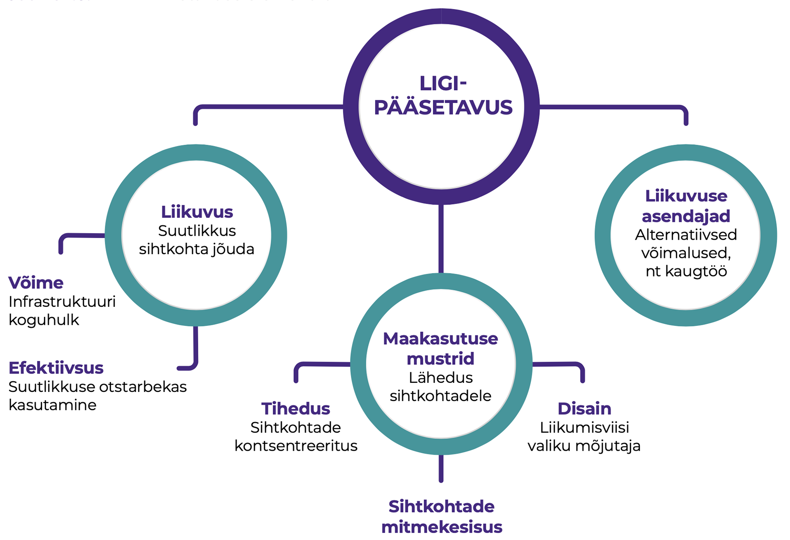
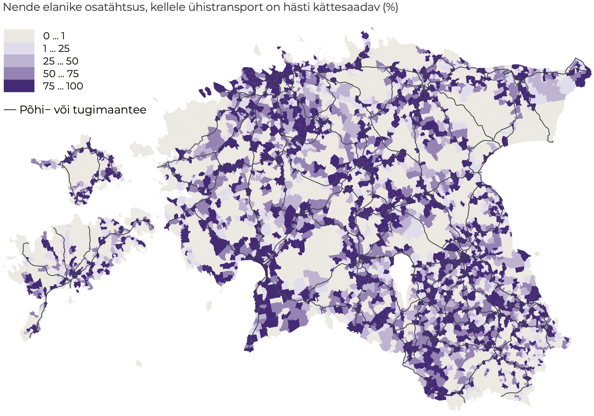

## Ligipääsetavuse muutused autostunud Eestis {.chapter_section .chapter1_section}

```{block, type='authors'}
**[Tauri Tuvikene](#tauri-tuvikene), [Merlin Rehema](#merlin-rehema), [Dago Antov](#dago-antov)**
```

```{block, type='points'}
* Kui Eesti suuremates linnaregioonides pärsib autostumine inimeste liikumisvõimalusi, siis ääremaal tagab isiklik sõiduauto teenuste kättesaadavuse.
```

```{block, type='blockquote-right'}
Autostumine tähendab nii sõidukite omamise ja kasutamise sagenemist kui ka autokultuuri levikut laiemalt.
```
Esimene auto sõitis Eesti teedel 1896. aastal, tänapäeval on Eestis autosid üle 740 000 ([Statistikaamet](#Statistikaamet2018)). Autost on saanud tarbeese, mis on olemas üle poolel Eesti elanikest. Ühelt poolt on autokasutus parandanud paljude inimeste liikumisvõimalusi ja oluliselt vähendanud tunnetatavaid kaugusi. Teiselt poolt aga on autode arvu jõuline kasv muutnud avalikku ruumi nii linnades kui ka mujal Eestis. Autostumine tähendab nii sõidukite omamise ja kasutamise sagenemist kui ka autokultuuri levikut laiemalt. Hõredalt asustatud ja puudulikult toimiva ühistranspordiga maapiirkondades on isiklikud sõiduautod muutunud asendamatuks. Eesti linnaregioonides võib täheldada aga järkjärgulist autode arvu kasvu peatumist ja suurenevat huvi erinevaid kasutajaid soosiva tänavaruumi planeerimise ideede vastu. Selles artiklis vaatleme autostumist kahes rollis: ligipääsu võimaldajana ja selle pärssijana. Artikli eesmärk on anda ülevaade, kuidas autostumine ja autopõhise liikuvuse suunamine mõjutavad Eesti elanike ligipääsu avalikele teenustele ja laiemalt avalikule ruumile. Samuti arutleme, millised on hajalinnastunud Eestis säästva liikuvuse strateegiad.

```{block, type='blockquote-left'}
Liikuvus tähendab võimet oma igapäevaste vajaduste rahuldamiseks ühest kohast teise liikuda, kasutades ühte või mitut transpordiliiki või -teenust.
```
Liikuvus tähendab võimet oma igapäevaste vajaduste rahuldamiseks ühest kohast teise liikuda, kasutades ühte või mitut transpordiliiki või -teenust. Erinevalt liikluse planeerimisest, mis tegeleb sõidukite liikumise ja ligipääsuga, on liikuvuse planeerimise keskmes inimeste ja kaupade liikumine, olenemata kasutatatavast transpordiviisist. Säästev liikuvus tähendab keskkonnahoidlikku ja jätkusuutlikku transpordi kujundamist inimeste liikumiste planeerimisel.

### 1990. aastate kiire autostumine on stabiliseerumas {-.chapter1_section}

Kiire autostumine Eestis on sarnane teiste idabloki riikide omaga. Autostumise tasemed mõõdetuna sõiduautode arvus 1000 elaniku kohta vahetult pärast Teist maailmasõda Ida- ja Lääne-Euroopas oluliselt ei erinenud. Juba kümmekond aastat hiljem oli aga autostumise tase väga erinev. 1990. aastate alguseks oli nii Euroopa Liidu riikides kui ka USAs autostumine ajaloolist tipptaset saavutamas või oluliselt aeglustunud, samal ajal kui idabloki riikides eelmistel kümnenditel välja kujundatud erinevuse kompenseerimine alles algas. Näiteks kui Lääne-Saksamaal saavutati praegune autostumise tase 1980. aastatel, siis Ida-Saksamaal jõudis see riigi ühendamise järel samale tasemele 2000. aastateks ([Pucher ja Buehler 2005](#Pucher2005)). Isiklike sõiduautode kättesaadavuse piiratus nõukogude perioodil asendus autoomamise entusiasmiga 1990. aastatel. Sellest ajast peale on Eesti oma autokasutuses järjepidevalt Lääne-Euroopa riikidele järele liikunud ja need lõpuks kinni püüdnud ([joonis 1.5.1](#figure151)). Kuigi autostumine jätkus ka Lääne-Euroopas, on piirkondade võrdluses sealne kasvutempo olnud aeglasem. Praegu jääb Eesti registreeritud autode arvu poolest 1000 elaniku kohta maha veel vaid Euroopa Liidu kõige autostunumatest maadest, nagu Itaalia, Luksemburg, Malta ja Soome, kuid on enamikust Euroopa Liidu n-ö läänepoolsetest riikidest möödunud.

<p class="caption" id="figure151"><span class="figure-number">Joonis 1.5.1.</span> Autostumise muutus Lääne-Euroopa (siin EL-15) ja Ida-Euroopa riikides (siin alates 2004. aastal ELi astunud riigid, v.a Küpros ja Malta)</p>

```{r, figure151, out.width='90%', fig.asp=.5625, fig.align='center', echo=FALSE, message=FALSE}

library("tidyverse")

 fig151_data <- read.csv ("data/15_fig1_data2.csv", header=TRUE, fileEncoding="utf-8")


  fig151_plot <- ggplot(data = fig151_data) +
    geom_line(mapping = aes(x=year, y=value, colour=area, group=area), size=1) +
    scale_x_continuous(breaks=c(1990,1992,1994,1996,1998,2000,2002,2004,2006,2008,2010,2012,2014,2016), expand = c(0, 0), limits=c(1990,2016.5)) +
    scale_y_continuous(expand = c(0, 0), limits=c(0,550)) +
    scale_colour_manual(values=c("#482683","#369B9E","#b1e0f9"), labels=c("Eesti","Ida-Euroopa","Lääne-Euroopa")) +
    labs(y="Autot 1000 elaniku kohta", x="") +
    expand_limits (y=0)

  fig151_theme <- theme (

  )

  print(fig151_plot + fig_theme_general)

  ggsave(path="exported_figures/PDF/chapter1",filename="fig151.pdf", height=120, width=200, units="mm",encoding = "ISOLatin9.enc")
```

``` {block, type='imgsource'}
<span class="imgsource-source">Allikas:</span> Eurostat 2019.
```

Seega saab 1990. aastate ja uue sajandi esimese kümnendi Ida-Euroopa, sealhulgas Eesti kiiret autostumist käsitleda ka kui poliitiliste süsteemide tekitatud erinevuse kompenseerimist. Kui aga vaadata senist auto kasutamise kogemust (nt USA), siis autostumise kasv varem või hiljem lõpeb. Põhjused on erinevad, aga oluline on, et enamik, kes autot on soovinud, on selle ka endale hankinud, ning samal ajal on autode arvu suur kasv tekitanud igale uuele kasutajale takistusi auto parkimisel ja ummikutes. Sel põhjusel ei saa tuleviku prognoosimisel aluseks võtta autostumise kiiret kasvu eelmistel perioodidel ning selle põhjal otsuseid teha, näiteks välja töötada tee-ehituskavu.

### Autostumisel on mõju keskkonnale, inimeste tervisele ja võimalusele liikuda ning teenuseid kasutada  {-.chapter1_section}

Autostumisel on keskkonnamõju, mis väljendub energia- ja maakasutuses, autostumine muudab sotsiaalelu ning ühiskondade majanduslikku toimimist. Rahvusvahelise Energiaagentuuri 2017. aasta andmetel läheb pool maailma toodetud naftast linna- ja maanteetranspordile ning transpordisektor annab üle veerandi maailma süsihappegaasi heitest. Autostumise keskkonnamõju avaldub lisaks kütuse tarbimisele ka autode tootmises, kasutamises, liiklusohtlikkuses, aga ka linnaruumi tarbimises. Kuna autoga sõites liigutavad inimesed end vähem, väljendub autostumise kahju inimeste ülekaalulisuses ning haigestumises südame-veresoonkonnahaigustesse ([Bassett jt 2008](#Bassett)). Lisaks mürale, vibratsioonile ja peenosakeste reostusele tiheda liiklusega tänavatel on probleem ka inimeste vähesemad võimalused sotsiaalseks suhtluseks. Autostumise tõttu muutuvad linnatänavad piltlikult öeldes liiklustorudeks, kus kõigi teiste liiklejate võimalused on ahenenud. Nii on halvenenud tänavate kvaliteet avaliku ruumina.

```{block, type='blockquote-right'}
Ligipääsetavus on inimeste võimalus saada osa oma ühiskonnas tavapärastest tegevustest.
```
Liiklustorudeks muutunud linnatänavate tõttu hakkab autostumine linnades takistama üldist ligipääsetavust. Ligipääsetavus on inimeste võimalus saada osa oma ühiskonnas tavapärastest tegevustest ([Farrington 2007](#Farrington)). Peale liikumisvabaduse hõlmab ligipääsetavus teenuste ja töökohtade toomist või planeerimist inimesele lähemale, et vähendada vajadust liikumiseks ([joonis 1.5.2](#figure152)). Näiteks võib tuua sotsiaalteenuste digitaliseerimise ning kaugtöökohtade loomise. Kuigi Eestis saab riiklikke teenuseid interneti kaudu üsna hõlpsalt kasutada ka kodust lahkumata, eeldab sotsiaalne elu, laste haridus, hobid ja meelelahutus ikkagi aeg-ajalt suurematesse asumitesse või linnakeskustesse minekut. Ligipääsetavuse taandamine autokasutaja vajadustele on ühekülgne, kuna see vähendab teiste liiklejarühmade, sealhulgas jalakäijate, ratturite, eakate, erivajadusega liiklejate liikumisvõimalusi ja -kvaliteeti. Mitmesuguseid asjaolusid arvestav transpordiplaneerimine eeldab arusaamist autode rollist ja kasutusest erinevates keskkondades: hajaasustuses, maapiirkondades, linnaregioonis ja asustusüksuse sees.

<p class="caption" id="figure152"><span class="figure-number">Joonis 1.5.2.</span> Ligipääsetavuse elemendid</p>

```{r, figure152, out.width='80%', fig.align='center', echo=FALSE, message=FALSE}



```

```{block, type='imgsource'}
<span class="imgsource-source">Allikas:</span> Discovering Urbanism 2010. Säästva linna liikuvuse arengukava.
```

```{block, type='casebox'}
<h3> Säästva liikuvuse arengukava</h3>

Säästva liikuvuse arengukava eesmärk on luua jätkusuutlik transpordisüsteem. See tähendab inimeste praeguste ja tulevaste liikuvusvajaduste rahuldamist liikumisviisidega, mis ei kahjusta elukeskkonda ([LiLiA 2017](#LiLiA2017)). Selline liikumiskorraldus eeldab mugavat ühistranspordivõrgustikku, liikumisviiside sujuvat ühildamist, aktiivsete liikumisviiside (nt jalgratas ja jalgsi liikumine) arendamist ning autokasutuse vajaduse vähendamist. Euroopa Komisjon kinnitas säästva linnalise liikuvuse arengukava 2009. aastal ning toetab selle rakendamist liikmesriikide kohalikel tasanditel koostöö- ja teadmusvõrgustike loomise, andmete kogumise ning finantsinvesteeringute kaudu ([Eltis 2019](#ELTIS2019)).  

<p class="caption" id="figure152"><span class="figure-number">Joonis 1.5.2.</span> Ligipääsetavuse elemendid</p>

```
```{block, type='imgsource'}
<span class="imgsource-source">Allikas:</span> Discovering Urbanism 2010. Säästva linna liikuvuse arengukava.
```


### Hajaasustuse elu on autokeskne {-.chapter1_section}

Maanteeameti tehtud ühistranspordiga rahulolu küsitlused näitavad, et elanike rahulolu ühistranspordi kvaliteedi ja kättesaadavusega on maakonnasiseste liinide puhul vähenenud. Eriti rahulolematud ollakse kohalejõudmise aegadega, marsruutidega ja ümberistumisvõimalustega. Isegi kui peatuse asukoht ja paar väljumist päevas teevad ühistranspordi suurele osale inimestele kättesaadavaks ([joonis 1.5.2](#figure152)), ei tähenda see, et ühistransport suudaks aja ja ühenduste arvu poolest tegelikult autoliiklusega võistelda. Saar Polli 2014. aasta uuringu „Elanike rahulolu kohalike avalike teenustega“ andmetel on rahuolu ühistranspordiga parem ning selle konkurentsivõime linnades suurem kui hõredamalt asustatud piirkondades, olgu need siis linna tagamaa või keskustest eemale jäävad ääremaad. Hajaasustuses, eriti väikese nõudlusega piirkondades, jäävad liikumisgraafikud harvaks, nende järgi on keeruline tegevusi ajastada eriti juhul, kui on vaja sõitusid kombineerida.

<p class="caption" id="figure153"><span class="figure-number">Joonis 1.5.3.</span> Ühistranspordi kättesaadavus Eestis (hinnatuna peatuste läheduse ja väljumiste sageduse kaudu)</p>

```{r, figure153, out.width='80%', fig.asp=.75, fig.align='center', echo=FALSE, message=FALSE}


```

```{block, type='imgsource'}
<span class="imgsource-source">Allikas:</span> Statistikaamet 2018, Nõmm 2018.
```

Tihenev autoliiklus vähendab ühistransporti kasutavate reisijate arvu ning see muudab hea teenuse pakkumise hajaasustuses kallimaks ja keerulisemaks. Ühistranspordi kvaliteedi langus ja tiheduse vähenemine soosib omakorda autostumist. Maanteeameti andmetel vähenes aastatel 2003–2016 sõitjate arv maakonnaliinidel peaaegu kaks korda, kusjuures vähenemine oli eriti kiire just perioodil 2003–2009 ([joonis 1.5.4](#figure154)). Need aastad olid kiire jõukuse kasvu periood, mil toimus ka kiire autostumine ja sellega seotud liikumisviiside nihe sõiduautode kasuks. Ühistranspordi kasutajate arvu langus on toimunud vaatamata sellele, et samal ajal ei ole ühissõidukite läbisõit vähenenud.

<p class="caption" id="figure154"><span class="figure-number">Joonis 1.5.4.</span> Reisijate arvu ja läbisõidu muutus maakonnaliinidel Eestis, 2003–2016</p>

```{r, figure154, out.width='90%', fig.asp=.5625, fig.align='center', echo=FALSE, message=FALSE}

library("tidyverse")

 fig154_data <- read.csv ("data/15_fig4_data.csv", header=TRUE, fileEncoding="utf-8", sep=";")


  fig154_plot <- ggplot(data = fig154_data) +
    geom_line(mapping = aes(x=year, y=value, colour=variable, group=variable), size=1) +
    scale_x_continuous(breaks=c(2003,2004,2006,2008,2010,2012,2014,2016), expand = c(0, 0), limits=c(2003,2016.5)) +
    scale_y_continuous(expand = c(0, 0), limits=c(0,40)) +
    scale_colour_manual(values=c("#482683","#369B9E"), labels=c("Läbisõit (mln km)","Sõitjate arv (mln)")) +
    labs(y="", x="aasta") +
    expand_limits (y=0)

  fig154_theme <- theme (

  )

  print(fig154_plot + fig_theme_general)

  ggsave(path="exported_figures/PDF/chapter1",filename="fig154.pdf", height=120, width=200, units="mm",encoding = "ISOLatin9.enc")
```

``` {block, type='imgsource'}
<span class="imgsource-source">Allikas:</span> Maanteeamet.
```

```{block, type='casebox'}
<h3>Liikuvusuuring Saaremaal nõudluspõhise transpordi korraldamiseks</h3>

Nõudluspõhisel transpordil on potentsiaali pakkuda hajaasustuses paindlikumat ja kulutõhusamat lahendust. Rakendusliku Antropoloogia Keskuse (RAK) pilootprojekti käigus uuriti 2018. aastal Saaremaal, kuidas inimesed tunnetavad oma liikumisvõimalusi ja millised liikuma saamise strateegiad hajaasustuses töötavad. Selgus, et hajaasustuses on liikumine raskem just väikeste lastega kodus olevatel lastevanematel, piiratud liikumisvõimega vanuritel, graafiku alusel teises külas või Kuressaares töötavatel inimestel ning linnas huviringides käivatel lastel ja noortel. Saaremaal suhtuti nõudluspõhisesse transporti mõnevõrra kahtlevalt. Praegu eelistatakse kojusõidul tuttava autot liinibussile, isegi kui sel teekonnal tehakse kõrvalepõikeid ja lisapeatusi. Kasutusel on inimeste endi loodud Facebooki sõidugrupid. Seega on nõudluspõhise transpordi ja sõidujagamise elemendid kohalike igapäevapraktikas juba olemas. Selle organiseeritumad ja professionaalsemad edasiarendused, mis hajaasustatud elukeskkonnas paremad liikumisvõimalused tagaksid, väärivad kindlasti tulevikus rohkem transpordiplaneerijate tähelepanu.
```

### Elu eeslinnas on linnaelust autokesksem {-.chapter1_section}

```{block, type='blockquote-right'}
Tihenev autoliiklus vähendab ühistransporti kasutavate reisijate arvu ning see muudab hea teenuse pakkumise hajaasustuses kallimaks ja keerulisemaks.
```
Eesti suuremates linnaregioonides on viimasel kahel kümnendil toimunud valglinnastumine: uusi elamu-, kaubandus-, teenuste- ja tootmisalasid on rajatud tiheasustusaladest välja, kuid loodud alad ei ole terviklikult planeeritud, mistõttu toimub elanike pendelliikumine keskuse ja linnaäärsete elurajoonide vahel, selleks sageli isiklikku sõiduautot kasutades. Elanike arv Tallinna lähiregioonis on viimase 20 aasta jooksul oluliselt kasvanud ([joonis 1.5.5](#figure155)), ent Harjumaa kaugemates omavalitsustes on toimunud mõõdukas langus 10–20%. Statistikaameti 2011. aasta rahvaloenduse pendelrände andmete järgi on Eestis kokku 28 üle 5000 elanikuga keskuslinna ümber koondunud toimepiirkonda. Kui paljud neist keskustest on väikesed, eriti just Lõuna-Eestis, siis üks – Tallinn – avaldab mõju inimeste liikumisele üle Eesti.

<p class="caption" id="figure155"><span class="figure-number">Joonis 1.5.5.</span> Autode arv leibkonnas Tallinnas (2016) ja Harjumaal (2017) ning elanike arvu juurdekasv Tallinna lähiregioonis viimase 20 aastal jooksul. 1998 aasta rahvaarv = 100%</p>


```{r, figure155, out.width='90%', fig.align='center', echo=FALSE, message=FALSE}

library("tidyverse")
library(gridExtra)
library(grid)

  fig155_data1 <- read.csv ("data/15_fig5_data1.csv", header=TRUE, fileEncoding="utf-8")

  fig155_data1$number_of_cars <- factor (  fig155_data1$number_of_cars, levels = c("Pole autot", "1 auto", "2 või enam autot"))

  fig155_data2 <- read.csv ("data/15_fig5_data2.csv", header=TRUE, fileEncoding="utf-8")

  fig155_line <- data.frame(x=c(0, 5),
                y=c(100, 100))


  fig155_plot1 <- ggplot(data = fig155_data1) +
    geom_bar(mapping = aes(x=area, y=value, fill=area), width=0.7, stat="identity", position = "dodge") +
    scale_fill_manual(values=c("#369B9E","#482683")) +
    facet_wrap(~number_of_cars, nrow=1) +
    labs(y="%", x="") +
    expand_limits (y=0)

    fig155_plot2 <- ggplot() +
    geom_bar(data = fig155_data2, mapping = aes(x=growth_of_population, y=value, fill=growth_of_population), width=0.7, stat="identity") +
      geom_line(data = fig155_line, mapping=aes(x=x, y=y), col="#482683") +
    scale_fill_manual(values=c("#B6A8CD","#b1e0f9","#369B9E","#482683")) +
    labs(y="%", x="") +
    expand_limits (y=0)

    fig155_theme1 <- theme(
          panel.grid.major.x = element_blank() ,
          panel.grid.minor.x = element_blank(),
          legend.position = "none",
          strip.text.x = element_text(size = 8),
          text = element_text(size = 9)
    )

        fig155_theme2 <- theme(
          panel.grid.major.x = element_blank() ,
          panel.grid.minor.x = element_blank(),
          legend.position = "none",
           text = element_text(size = 10)
      
    )

grid.arrange(fig155_plot1 + fig_theme_general + fig155_theme1, fig155_plot2  + fig_theme_general + fig155_theme2, ncol = 2)

ggsave(path="exported_figures/PDF/chapter1",filename="fig155a.pdf",fig155_plot1 +fig_theme_general + fig155_theme1, height=140, width=140, units="mm")
ggsave(path="exported_figures/PDF/chapter1",filename="fig155b.pdf",fig155_plot2 + fig_theme_general +  fig155_theme2, height=140, width=140, units="mm")
```

``` {block, type='imgsource'}
<span class="imgsource-source">Allikas:</span> Kantar Emor 2018; Statistikaamet, 1998; 2018.
```

Nagu ka hajaasustatud maapiirkondades, on linnade tagamaadel elu autota keeruline. Harjumaal väljaspool Tallinna on keskmiselt kaheksal perel kümnest isiklik sõiduauto, peaaegu pooltel leibkondadest on kaks või enam autot ([joonis 1.5.5](#figure155)). Maanteeameti tellimusel valminud Kantar Emori 2018. aasta Tallinna lähipiirkonna liikumisviiside uuringu alusel saab öelda, et peaaegu kolmest käigust kahel võtab Tallinnast väljas elav harjumaalane kasutusse auto, samal ajal kui Tallinna sees tehakse autoga vaid umbes pool käikudest. TNS Emori 2015. aasta andmetel kasutavad linnakeskuses elavad inimesed autot vähem kui inimesed, kes elavad linna serval. Ühistranspordi kasutuses on trend vastupidine. Tallinnas on ühistranspordi kasutajaid protsentuaalselt rohkem kui Tallinna tagamaal. Erinevused on ka tagamaa sees. Lääne-Harju vallas, mille koosseisu kuulub Keila linn ning kus on hea elektriraudtee ühendus Tallinnaga, teevad elanikud rongiga 16% oma käikudest. Seevastu Saku vallas, mida raudtee küll läbib, on rongiliiklus hõredam ja ühendus Tallinnaga on halvem – rongiga tehakse ainult 1% kõigist pealinna käikudest.

```{block, type='blockquote-left'}
Alates 1990. aastate lõpust on vähenenud jalgsi või ühistrans- pordiga tööl käimine, samal ajal on kahekordistunud sõiduautoga tööle liikumine.
```
Tööle liikumise trendid viimasel kümnendil näitavad sõiduauto kasutamise populaarsuse kasvu nii Tallinnas kui ka mujal Harjumaal ([joonis 1.5.6](#figure156)). Jalgsi tööle käimise osatähtsus tagamaal on oluliselt vähenenud, sest töökohad on järjest enam paiknenud Tallinna. Tallinnas on jalgsi tööl käijate osatähtsus jäänud samale tasemele. Ühistranspordi kasutamise osatähtsus on Tallinnas langenud 50%-lt 35%-le ning mujal Harjumaal 26%-lt 18%-le. Ka üle Eesti on suundumus sarnane: alates 1990. aastate lõpust on vähenenud jalgsi või ühistranspordiga tööl käimine, samal ajal on kahekordistunud sõiduautoga tööle liikumine ([joonis 1.5.7](#figure157)).


<p class="caption" id="figure156"><span class="figure-number">Joonis 1.5.6.</span> Tallinna ja muu Harjumaa elanike tööle liikumise viiside osatähtsus aastatel 2000–2017</p>

```{r, figure156, out.width='95%', fig.asp=.75, fig.align='center', echo=FALSE, message=FALSE}

library("tidyverse")

 fig156_data <- read.csv ("data/15_fig6_data.csv", header=TRUE, fileEncoding="utf-8")

 fig156_data$value=as.numeric(levels(fig156_data$value))[fig156_data$value]

  fig156_plot <- ggplot(subset(fig156_data, variable %in% c("Jalgsi", "Sõiduautoga", "Ühissõidukiga"))) +
    geom_line(mapping = aes(x=year, y=value, colour=variable, group=variable), size=1.2) +
    scale_x_continuous(breaks=c(2000,2002,2004,2006,2008,2010,2012,2014,2016), expand = c(0, 0), limits=c(2000,2017.5)) +
    scale_y_continuous(expand = c(0, 0), limits=c(0,71)) +
    scale_colour_manual(values=c("#1f9a9e","#482683","#83d0f5"))+
    facet_wrap(~area, nrow=1) +
    labs(y="Liikumisviisi osakaal (%)", x="") +
    expand_limits (y=0)

  fig156_theme <- theme (
           axis.text.x = element_text(angle=45, margin = margin(t = 0, r = 0, b = 0, l = 0), hjust=1.1),
  )

  print(fig156_plot + fig_theme_general + fig156_theme)

  ggsave(path="exported_figures/PDF/chapter1",filename="fig156.pdf",fig156_plot + fig156_theme +fig_theme_general, height=90, width=150, units="mm")
```

``` {block, type='imgsource'}
<span class="imgsource-source">Allikas:</span> Statistikaamet.
```

Võime öelda, et autostumine on olnud suundumus üle Eesti. Maanteeameti ([2017](#Maanteeamet2017)) andmetel on autode läbisõidu kilometraaž aastatel 2013–2017 kasvanud 16% võrra. Kui regioonikeskustes suudab ühistransport püsida konkurentsivõimelisena, siis linnade tagamaade ja kaugemate Eesti äärealade elanikkond on järjest enam sõltuv autost. Seega ei ole riigi ja omavalitsuste tasandil suudetud teha piisavaid edusamme autokasutuse vähendamiseks.

<p class="caption" id="figure157"><span class="figure-number">Joonis 1.5.7.</span> Kogu Eesti tööga hõivatute peamine tööle liikumise viis, selleks kuluv aeg ning töökoha kaugus, 1997–2017</p>

```{r, figure157, fig.align='center', echo=FALSE, message=FALSE, fig.asp=1.25}

library("tidyverse")
library("scales")

 fig157_data1 <- read.csv ("data/15_fig7_data1.csv", header=TRUE, fileEncoding="utf-8")

fig157_data1$variable <- factor (  fig157_data1$variable, levels = c("Töötab kodus, töötab ja ööbib samas kohas","Ühissõidukiga", "Ametiauto, töökoha sõidukiga","Isikliku autoga","Jalgratta, mopeedi, mootorrattaga","Jalgsi"))

 fig157_data2 <- read.csv ("data/15_fig7_data2.csv", header=TRUE, fileEncoding="utf-8")

  fig157_plot1 <- ggplot() +
    geom_bar(data = fig157_data1, mapping = aes(x=year, y=value, fill=variable), width=0.7, stat="identity") +
    scale_fill_manual(values=c("#2d6a6d","#b1e0f9","#4bb1ca","#6D519C","#369B9E","#241342")) +

    scale_x_continuous(breaks=c(1997, 1999,2001,2003,2005,2007,2009,2011,2013,2015,2017)) +
    scale_y_continuous(breaks=c(20, 40,60,80,100)) +
    guides(fill=guide_legend(nrow=6,byrow=TRUE)) +
    labs(y="Peamine tööle liikumise viis (%)", x="")


  fig157_plot2 <- ggplot() +
    geom_line(data = fig157_data2, mapping = aes(x=year, y=value, colour=variable), size=1) +
    scale_colour_manual(values=c("#369B9E","#482683")) +
    labs(y="", x="aasta") +
    scale_x_continuous(breaks=c(1997, 1999,2001,2003,2005,2007,2009,2011,2013,2015,2017), expand = c(0, 0), limits=c(1997,2017.5)) +
    scale_y_continuous(breaks=c(5, 10,15,20,25), expand = c(0, 0), limits=c(0,25)) +
    expand_limits (y=0)


    fig157_theme1 <- theme (
          panel.grid.major.x = element_blank() ,
          panel.grid.minor.x = element_blank(),
          axis.text.x = element_text(angle=45, margin = margin(t = 7, r = 0, b = 0, l = 0), hjust=1.1),
          legend.position = "right"

  )
    fig157_theme2 <- theme (
  )

  grid.arrange(fig157_plot1 + fig_theme_general + fig157_theme1, fig157_plot2 + fig_theme_general + fig157_theme2, ncol = 1)


  ggsave(path="exported_figures/PDF/chapter1",filename="fig157a.pdf",fig157_plot1  +fig_theme_general + fig157_theme1, height=120, width=210, units="mm")

    ggsave(path="exported_figures/PDF/chapter1",filename="fig157b.pdf",fig157_plot2  +fig_theme_general + fig157_theme2, height=100, width=210, units="mm")
```

``` {block, type='imgsource'}
<span class="imgsource-source">Allikas:</span> Statistikaamet.
```

Kõik liikumised ei ole seotud tööle või poodi sõitmisega. Ligi kümnendik kõigist liikumistest sõiduautoga on seotud laste viimisega kooli või lasteaeda. Iga päev tegeleb kellegi sõidutamisega 12% Tallinna tagamaa elanikest, kusjuures suurem roll on selles kuni 34-aastastel naistel ([Kantar Emor 2018](#Kantar2018)). Nii tuleb ka Tallinna linnaregioonis esile mujal maailmas kogetu, et elu linnast väljas tähendab aktiivset autokasutust, laste sõidutamist ja et selle rolli saavad ennekõike emad ([McCarthy jt 2017](#McCarthy2017)).

```{block, type='blockquote-right'}
Head ühistranspordiühendused ning kergliiklusvõrgustikud eeslinnades aitaksid luua mitmekülgsete kasutusvõimalustega keskkonda, kus iga tegevuse või teenuse pärast ei peaks sõitma linna.
```
Kuigi eeslinnade kasvu on üksjagu uuritud, ei ole veel piisavalt räägitud ees- või valglinnastumise mõjul toimuvast avaliku ruumi muutumisest. Osa mõjusid on ootuspärased. Näiteks autost sõltuvates keskkondades elavad pereliikmed, kes ise autot ei juhi – ennekõike alla 18-aastased – sõltuvad oma vanemate soovist, ajast ja võimalustest neid transportida. Samuti vähenevad kokkupuuted ühiskonna eri gruppide vahel. Elu eeslinnades ja liikumine autoga vähendab märkimisväärselt linnaelule omast suhtlemist tänavatel või kohtumisi võõrastega ühistranspordis. Kuigi ka eeslinnade kogukonnad võivad olla ühtehoidvad ja sisemiselt demokraatlikud, moodustavad sellises elukorralduses kogukonna sotsiaalselt ja majanduslikult sarnased inimesed, kohtumisi endast erinevatega on aga vähe. Lisaks on uuringud näidanud, et linnaelanike igapäevaliikumised tekitavad väiksemat keskkonnakoormust kui tagamaa- või maavaldade elanike liikumised ([Poom 2017](#Poom2017)). Aga just keskuslinnad on need, mis saavad enim tunda kasvanud autostumise mõjusid, nagu õhusaate, müra, ummikud ja avaliku ruumi kasutamine parkimisruumina.

Linnaregiooni planeerimisel on oluline ühendada kesklinna liikumiskorraldus eeslinna omaga. Head ühistranspordiühendused ning kergliiklusvõrgustikud eeslinnades aitaksid luua mitmekülgsete kasutusvõimalustega keskkonda, kus iga tegevuse või teenuse pärast ei peaks sõitma linna. Parem ligipääs teenustele eeslinnades parandaks nii eeslinnade kui ka linnakeskuste avaliku ruumi kvaliteeti. Linnaregioonides suurendaks parem ligipääsetavus kodanike osavõttu ühiskonnaelust ja looks sidusama ühiskonna.

### Linnakeskuste liikuvuse arendamine lähtub autodest {-.chapter1_section}

Valglinnastumine ja sellega seotud autostumine mõjutab linnakeskuste avaliku ruumi kvaliteeti inimestevahelise suhtluse ja kontaktide edendajana. Kui kesklinnast kaovad töökohad ja teenused, ei ole linna äärealadel elavatel elanikel sinna enam põhjust minna. See omakorda tähendab, et linnakeskuse poodidel ja kohvikutel pole enam piisavalt klientuuri. Linnakeskustesse rajatavad uued hooned – väikelinnades enamasti tüüpprojektiga toidupoed ja suuremates linnades kontorihooned – kipuvad olema mahult liiga suured hea avaliku ruumi loomiseks. Avaliku ruumi, sealhulgas tänavaruumi kvaliteet mõjutab oluliselt inimeste valmidust, soovi ja võimalust linnaruumis liikuda ja viibida. Avaliku ruumi kvaliteet jalakäijana ei ole lihtsalt mõõdetav ega numbriliselt hinnatav, kuid autodes ja ummikutes veedetav aeg vähendab paratamatult võimalusi kohtumisteks ja suhtlemiseks tänavaruumis.

```{block, type='blockquote-left'}
Avaliku ruumi, sealhulgas tänavaruumi kvaliteet mõjutab oluliselt inimeste valmidust, soovi ja võimalust linnaruumis liikuda ja viibida.
```
Eesti suuremates linnades on liikuvuse arendamine siiani lähtunud jätkuvast autostumise kasvu prognoosist. Suured Tallinna teeprojektid, nagu Reidi tee, Haabersti ringristmik ja planeeritav Rävala läbimurre, samuti Tartut läbiv riikliku maantee osaks olev Ringtee, illustreerivad poliitilist soovi parandada just autoliikumise kvaliteeti. Nende väga kulukate tee-ehitusprojektide kõrval jäävad vajaliku tähelepanuta võimalused soodustada teisi liikumisviise, mis oleksid võrdselt kasutatavad nii väiksema kui ka suurema sissetulekuga inimestele. Tee-ehituse suurvormid lõhuvad jalakäijale sobivat inimmõõtmelist ruumi ja soodustavad autosõitu seetõttu veelgi. Planeeringutes on reeglina parkimiskohtade arv määratud normide järgi, arvestamata planeeringu asukohta või ühistranspordi lähedust. Meetmed, nagu asustuse planeerimine ühistranspordi lähedusse või jalgrattateede rajamine ja korrastamine, aitaksid soosida mitmekesist liikumisviiside valikut. Ning seega vähendada vajadust omada ja kasutada isiklikku autot. Täna räägitakse nii linna, eeslinna kui ka maapiirkonna planeeringutes jalgratturitest ja jalakäijatest pigem ohutuse vaatepunktist. Kergliiklustaristu strateegiline eelisarendamine alternatiiviks autoga liiklemisele ei ole üheski omavalitsuses prioriteetne.

Autosõiduks mõeldud tänavate kõrval pole loodud piisavalt konkurentsivõimelisi ja atraktiivseid alternatiive jalgsi ja rattaga liikumiseks, kuigi tipptundidel ning alla 3-kilomeetristel distantsidel on jalgratas üks kiiremaid liikumisviise ([joonis 1.5.8](#figure158)). Tallinna linna andmetel (vt statistikakogumik „Tallinn arvudes 2018“) oli 2017. aasta seisuga 273 km jalg- ja jalgrattateid, millest peaaegu 90% olid jalakäijatega jagatud kergliiklusteed.

<p class="caption" id="figure158"><span class="figure-number">Joonis 1.5.8.</span> Liikumisviiside ajalise konkurentsivõime võrdlus</p>

```{r, figure158, fig.align='center', out.width='80%', echo=FALSE, message=FALSE}

library("tidyverse")

 fig158_data <- read.csv ("data/15_fig8_data.csv", header=TRUE, fileEncoding="utf-8", sep = ";")

  fig158_line <- data.frame(x=c(0,1,1,1,0,3,3,3),
                y=c(14,14,14,0,17,17,17,0), line=c(1,1,2,2,3,3,4,4))

  fig158_plot <- ggplot() +
    geom_line(fig158_line, mapping = aes(x=x, y=y, group=line), colour="#3A404A",size=0.5, show.legend = NA, linetype = "dashed") +

    geom_line(data = fig158_data, mapping = aes(x=distance, y=time, colour=liikumisviis, group=liikumisviis), size=1) +
    scale_x_continuous(breaks=c(0,1,2,3,4,5),expand = c(0, 0), limits=c(0,5.1)) +
    scale_y_continuous(expand = c(0, 0), limits=c(0,70)) +
    expand_limits (y=0) +
    scale_colour_manual(values=c("#482683","#369B9E","#b1e0f9")) +
    labs(y="Kulunud aeg (min)", x="Vahemaa (km)")


    fig158_theme <- theme (
  )

  print(fig158_plot + fig_theme_general + fig158_theme)

  ggsave(path="exported_figures/PDF/chapter1",filename="fig158.pdf",fig158_plot  +fig_theme_general + fig158_theme, height=90, width=100, units="mm")
```

``` {block, type='imgsource'}
<span class="imgsource-source">Allikas:</span> Tallinna rattastrateegia 2018–2027.
```

Jalgrattateede tiheduselt jääb Tallinn naaberriikide pealinnadele (Helsingi, Stockholm) üle kahe korra alla ([Otsus 2016](#Otsus2016)). Rattateede võrgustik on näiteks Tallinna kesklinna piirkonnas killustunud üksikuteks teejuppideks ja on puudulikult ühendatud rongi- ja bussijaamaga. Meie kliimavöötmes saaks jalgratast aasta lõikes kasutada oluliselt enam: 2017. aastal käis Statistikaameti andmete järgi vaid 1,6% tallinlastest tööl rattaga, samal ajal kui meie kliimaga võrreldavates lähilinnades Helsingis ja Stockholmis tehti vastavalt 11% ja 9% kõikidest liikumistest jalgrattaga ([ECF 2013](#EFC2013)). Seda selgitab Eesti üldine liikumisvõimaluste kujundamise praktika, mis siiani jalgratastele ruumi loomist ei väärtusta.

Väiksemates linnades on autoliiklus hõredam ning pigem valmistab probleeme kõnniteede ja üldse tänapäevase avaliku ruumi puudumine. Eriti ilmne on see suuremate maanteede poolt läbilõigatud asulates (nt Rõngu, Adavere). Siiski on ka mitmed väiksemad kohad mõistnud inimsõbraliku ruumi ja hea ligipääsetavuse olulisust eriti nooremale elanikkonnale, rajades kergliiklusteid ja rattaparklaid ning arendades keskväljakuid. Olukorras, kus kohalik ühistransport on vähene või puudub täielikult, kuid vahemaad on lühikesed, on neis asulates suur potentsiaal mugavaks kergliikluseks.

### Tulevikutrendid: erinevate liikumisviiside õigetes mahtudes võimaldamine tagab vähema autokasutuse {-.chapter1_section}

Mitme Lääne-Euroopa riigi, näiteks Suurbritannia noored on hakanud järjest enam loobuma autode omamisest. Trendi põhjusteks on ametisõitude riikliku subsideerimise vähendamine, isikliku auto omamise kallinemine ja paranenud ühistransport ([Le Vine ja Jones 2012](#Le-Vine2012)). Ka Eestis on aimata muutusi, mis tingivad autokasutuse vähenemist. Näiteks on arendatud mitmeid mobiilseid rakendusi linnaregioonis, nagu rendi- ja sõidujagamisteenused, mis vähendavad vajadust ülal pidada isiklikku sõiduautot. Lisaks mõjutavad liikumisviiside muutumist kauba või toidu kojuveo teenuste arenemine ning posti teel kaupade tellimine. Sellised trendid muudavad auto mitteomamise lihtsamaks, pakkudes mugavust teiste lahendustega.

```{block, type='blockquote-right'}
Täna räägitakse nii linna, eeslinna-
kui ka maapiirkonna planeeringutes jalgratturitest ja jalakäijatest pigem ohutuse vaatepunktist.
```
Säästva liikuvuse planeerimine eeldab inimkeskset, elukvaliteedile ja ligipääsetavusele suunatud planeerimist. Sellest lähtuvalt valitakse meetmed, mis ühendavad maakasutuse suunamist, autokasutajatele mugavate alternatiivide pakkumist, selleks vajaliku taristu loomist ning teadlikkuse ja hoiakute kujundamist. Eri piirkondades on ka veidi erinevad vajadused ja väljakutsed. Maapiirkondades elavatele peredele tähendab ühiskonnas tavapärastest tegevustest osasaamine praegu pidevat autosõitu. Samal ajal pakuvad tellimusveod ja kogukondlikud sõidujagamisteenused uudseid alternatiive nii isikliku sõiduki omamisele kui ka puudulikule ühistranspordile. Näiteks Saaremaa vallas on kavandamisel juba pilootprojektina nõude- ja sotsiaaltranspordi lahendused, kus inimesed saavad eelnevalt märkida üles liikumise kellaajad ja kuupäevad ning vastavalt sellele koostatakse sõidugraafikud. Lühiajalisi katsetusi selliste mudelitega on tehtud varem ka Lääne-Virumaal ja Setomaal. Ka säästev liikuvuse planeerimine eeldab multimodaalsust: auto jääb osa asjaajamiste puhul vajalikuks, kuid oluline on, et leidub piisavalt võimalusi teha vajalikke käike ka ilma mootorsõidukita. Võimalused peituvad ka uudsetes kasutusmudelites, mis isikliku auto omamise kulu asemel pakuvad kuumaksega pakette, mis ühe või teise liikumisvahendi kasutamist võimaldavad. Sellised liikuvusteenused (ingl *Mobility-as-a-Service*) on juba leidmas laialdasemat kasutust mitmes riigis, kusjuures Soome on valdkonna üks juhtriike.

```{block, type='blockquote-left'}
Säästva liikuvuse planeerimine eeldab inimkeskset, elukvaliteedile ja ligipääsetavusele suunatud planeerimist.
```
Hästi ligipääsetavate linnaregioonide toimimine eeldab mitmeotstarbelise maakasutuse eelistamist. Sellises korralduses on elu-, töö- ja vaba aja veetmise kohad lähestikku ning linnade laienemisel suunatakse arengut hea ühistranspordiühendusega aladele. Isikliku sõiduautoga ei peagi alati kõige kiiremini kohale saama ja „mõistlik ummik“ või „mõistlik transpordile kuluv“ aeg on parem transpordi planeerimise ühik kui minutite kärpimine autosõidult ([Banister 2008](#Banister2008)). Liikumisviiside kombineerimine linnakeskustes ning eeslinnades lubaks ühendada omavahel hajaasustuses elamise eelise, kuid soosida ühtlasi ühistransporti auto asemel. Näiteks ehitades peale autoparklate ka jalgrattaparklaid rongijaamadesse ja bussipeatustesse, on võimalik ühendada ühistransport rattateede võrgustikega. Juba praegu on Tallinna tagamaal kohati rohkem rattasõitjaid kui tihedalt asustatud Tallinnas. Säästlike ja liikuvust soosivate lahendusteni jõudmist aitab erinevate arengukavade, -strateegiate ja liikuvuskavade ühendamine selliselt, et asustuse arengut ja liikuvust käsitletakse ühtse tervikuna. Vaatamata mõnele positiivsele näitele, nagu näiteks praegu koostatav Tallinna linnaregiooni liikuvuskava, on omavalitsuste vahelisi ühistegevusi seni vähe.

```{block, type='blockquote-left'}
Liikumisviiside kombineerimine linnakeskustes ning eeslinnades lubaks ühendada omavahel hajaasustuses elamise eelise, kuid soosida ühtlasi ühistransporti auto asemel.
```
Säästev planeerimine linnalises keskkonnas eeldab tähelepanu pööramist ka autokasutusvõimaluseta ühiskonnaliikmetele. Vananeva rahvastikuga ühiskonnas on oluline, et kõigil ühiskonnagruppidel oleks võimalus saada osa heast avalikust ruumist ning pääseda teenusteni. Linnakeskus saab vastu seista valglinnastumise mõjudele, kui see on planeeritud jalgsi liikuvale inimesele, nii et olemas on mugavad kõnniteed, piisavalt turvalised ja mugavad teeületusvõimalused, meeldiv ja sotsiaalseid tegevusi soosiv tänavafront. Linna füüsilist ruumi kaasavaks kujundades soosime kokkuvõttes kõiki ühiskonnagruppe.

On tõsi, et auto on liikuvuse võimaldaja teatud olukordades, kindlasti osa eakate ja liikumisraskustega inimeste puhul. Samuti on autostumine aidanud Eesti eri piirkondi ühendada, mis teeb võimalikuks elamise ka riigi äärealadel. Ometi on liigne autopõhisus ühiskonna toimimisele kahjulik. See teeb ligipääsetavuse privileegiks vaid osale ühiskonnast ning vähendab ka sotsiaalset suhtlemist. Ligipääsetavuse ja hea avaliku ruumi tagamine üle Eesti eeldab nii konkreetset sekkumist linnade avaliku ruumi disaini kui ka loovate lahenduste pakkumist hajaasustatud piirkondades.

### Viidatud allikad {-.subreferences}

<p id="Banister2008">Banister, D. 2008. The sustainable mobility paradigm. – Transport Policy, 15 (2), 73–80.</p>

<p id="Bassett2008">Bassett, D. R., Pucher, J., Buehler, R., Thompson, D. L., Crouter., S. E. 2008. Walking, cycling, and obesity rates in Europe, North America, and Australia. – Journal of Physical Activity and Health, 5 (6), 795–814.</p>

<p id="Discovering2010">Discovering Urbanism 2010. From a mobility to an accessibility orientation. http://discoveringurbanism.blogspot.com/2010/02/from-mobility-to-accessibility.html.</p>

<p id="ECF2013">ECF – European Cyclist Federations 2013. The benefits of cycling: unlocking their potential for Europe. https://ecf.com/resources/cycling-facts-and-figures.</p>

<p id="ELTIS2019">Eltis – The Urban Mobility Observatory 2019. The Sustainable Urban Mobility Plan concept and guidelines. https://www.eltis.org/mobility-plans/sump-concept.</p>

<p id="Farrington2007">Farrington, J. H. 2007. The new narrative of accessibility: its potential contribution to discourses in (transport) geography. – Journal of Transport Geography, 15 (5), 319–30.</p>

<p id="Jüssi2017">Jüssi, M., Kalvo, R., Rannala, M., Savi, T. 2017. Tallinna rattastrateegia 2018–2027. Tallinn: Tallinna Kommunaalamet.</p>

<p id="Kantar2018">Kantar Emor 2018. Tallinna lähipiirkonna – Harjumaa (v.a Tallinna linn) ning Kohila ja Rapla valdade elanike liikumisviiside uuring. Tallinn: Maanteeamet.</p>

<p id="Le-Vine2012">Le Vine, S., Jones, P. 2012. On the Move: Making Sense of Car and Train Travel Trends in Britain. London: The Royal Automobile Club Foundation for Motoring Ltd.</p>

<p id="LiLiA2017">LiLiA – Tallinna piirkonna säästva linnaliikuvuse arengukava 2017. Tallinna LiLia 2035. Kontseptsioon. https://www.mnt.ee/sites/default/files/content-editors/Failid/Yldine/talilia_kontseptsioon_juuni2017.pdf.</p>

<p id="Maanteeamet-2017">Maanteeamet 2017. Autopargi läbisõit 2017. https://www.mnt.ee/sites/default/files/survey/labisoit_2017.pdf.</p>

<p id="McCarthy2017">McCarthy, L., Delbosc, A., Currie, G., Molloy, A. 2017. Factors influencing travel mode choice among families with young children (aged 0–4): a review of the literature. – Transport Reviews, 37 (6), 767–781.</p>

<p id="Nõmm2018">Nõmm, T. 2018. Kolmel inimesel neljast on ühistransport hästi kättesaadav nii linnas kui ka maal. https://blog.stat.ee/tag/uhistransport.</p>

<p id="Otsus2016">Otsus, E. 2016. Tallinna jalgrattateede sidusus. Bakalaureusetöö. Tartu Ülikool.</p>

<p id="Poom2017">Poom, A. 2017. Spatial Aspects of the Environmental Load of Consumption and Mobility. PhD thesis. Tartu: University of Tartu Press.</p>

<p id="Pucher2005">Pucher, J., Buehler, R. 2005. Transport policies in Central and Eastern Europe. – Button, K. J., Hensher, D. A. (eds.). Transport Strategy, Policy, and Institutions. Oxford: Elsevier Press, 725–744.</p>

<p id="Rakendusliku2018">Rakendusliku antropoloogia keskus 2018. Liikuvusuuring Saaremaal nõudluspõhise transpordi korraldamiseks.. http://www.antropoloogia.ee/uuringud.</p>


<p id="TNS2015">TNS Emor 2015. Liikumisviiside uuring elektrisõidukite lühirendi ja säästva transpordi kasutamise arendamiseks Tallinnas. Tallinn: Majandus- ja Kommunikatsiooniministeerium, KredEx.</p>
