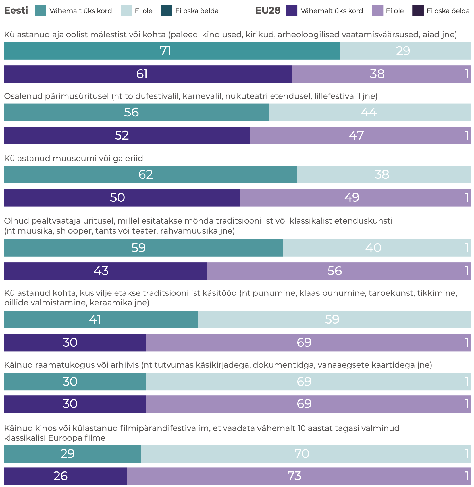

## Ehituspärand ja ruumikvaliteet {.chapter_section .chapter2_section}

```{block, type='authors'}
<div class="author-links">**[Triin Talk](#triin-talk) ja [Siim Raie](#siim-raie)**</div>
<div><a class="print-btn" href="print/EIA-2019-2.2.pdf"><i class="fa fa-file" aria-hidden="true"></i>Trükiversioon</a></div>
```

```{block, type='points'}
* Veerand kaitsealustest ehitismälestistest Eestis on halvas seisus ja kasutuseta, riigi panus nende korrastamisse ei ole piisav.
```

Olemasolevad ehitised ja ruumilised struktuurid moodustavad tänapäevase ruumiloome raamistiku. Ajalooline ehitis võib olla paiga sümbol, kogukonnakeskus ja turismimagnet, mille ümber luuakse selle vaatlemist ja külastamist soosivat ruumi. See võib olla ka piirkonna häbiplekk ja tüliõun, kui see riivab oma halva seisukorraga silma või ohustab avalikus ruumis liikujaid. Sõltuvalt seisukorrast võib ehituspärand peegeldada asula jätkusuutlikku püsimist läbi ajastute või luua lohutu mulje paremate aegade möödumisest, mõjutades oluliselt piirkonna kuvandit.

Nii Eestis kui ka mujal kasvas ehitatud keskkonnas pärandikaitse roll käsikäes sõjajärgse modernismi võidukäiguga 1960.–1970. aastatel. Nõukogude võimuga oli loodud soodsad võimalused ruumi pöördeliseks ümberkujundamiseks – kogu maa kuulus riigile, mis võimaldas seada utoopilisi ehitusplaane. Pärandikaitse esiletõusu on võimalik tõlgendada kriitilise vastureaktsioonina modernistlikule linnauuenduspoliitikale, millega Eestis kaasnes ühtlasi vastuseis toonasele režiimile. Eluruumide puuduse lahendamiseks olid masstoodetud korterelamud asendamatud, kuid peagi tõdeti, et asendamatu on ka ruumi piirkondlik omapära ja kultuuriväärtus.

Vastandlikud tungid ehitatud keskkonda uuendada ja säilitada kujundavad ka tänapäeval meie avalikku ruumi, kuid vastuolud ei tundu olevat enam nii teravad. Tänapäevases linnaplaneerimises arvestatakse palju rohkem olemasolevate struktuuridega, ka maaomandi killustumine ja ühiskonna demokratiseerumine ei võimalda enam kergekäeliselt terveid kvartaleid lammutavateks määrata. Mõõdukas vaesus, mille tõttu suur osa pärandist on tänaseni säilinud, on samal ajal jõudsalt taandumas. Kuigi pikemas vaates kasulik, ei ole pärandi korrastamine lühiperspektiivis omanikule kõige kasumlikum valik, mistõttu on kultuuripärandi seadusega kaitsmine endiselt vajalik. Kuidas seda tänapäeval ja tulevikus kõige mõistlikumalt teha, on olnud keskne küsimus viimase kuue aasta jooksul toimunud uue muinsuskaitseseaduse väljatöötamisel. Niisamuti on see probleemistik esil käesolevas artiklis, milles vaatleme Eesti ehituspärandi rolli avaliku ruumi kujundaja ja väärindajana. Teema käsitlemiseks püstitame kolm küsimust:

1) milline on ehituspärandi mõju ruumile ja selle kasutajatele,
2) kuidas on võimalik käsitleda ajaloolist hoonestust kestliku ruumiloome osana,
3) mis on riigi roll ehituspärandi kaitsmisel.

Artiklis vaatleme kogu ehituspärandi mõju avalikus ruumis, mitte ainult riikliku kaitse all olevaid mälestisi – muinsuskaitse mõistet on kasutatud laiemas tähenduses, see tähendab minevikupärandi kaitsmise ja säilitamisena.

### Ehituspärand aitab luua mitmekesist ruumi {-.chapter2_section}


Muinsuskaitse pole kaitse muutuste eest, vaid muutuste juhtimine selliselt, et olemasolevad väärtused säiliksid ja jääksid ruumis hoomatavaks. See on üldjuhul lihtsaim viis luua kvaliteetset ruumi – mõista juba eksisteerivate asjade väärtust, tõsta need esile ja lisada kõik uus sidusalt nende ümber, selmet ruum tühjaks lammutada ja nullist alustada. Hea näide on Rotermanni kvartal Tallinnas, kus kaitsealuste tööstushoonete ja uusarhitektuuri koosmõjus on loodud väga kõrgelt hinnatud ja mitmekesine ruum. Kui kogu kvartal oleks maha lammutatud otsetee rajamiseks Viru hotellist Linnahallini, nagu veel mõnikümmend aastat tagasi planeeriti, ei oleks kindlasti nii mitmekihilist ja omapärast keskkonda kujunenud.

```{block, type='blockquote-right'}
Muinsuskaitse pole kaitse muutuste eest, vaid muutuste juhtimine selliselt, et olemasolevad väärtused säiliksid ja jääksid ruumis hoomatavaks.
```
Arhitekt Rem Koolhaas on öelnud, et muinsuskaitse kaitseb meid tänapäeval vohava keskpärasuse eest ([Koolhaas 2014](#Koolhaas2014)). Kui globaalsetel trendidel põhinev uuslooming on tihti üheülbaline, on muinsuskaitse peamine roll säilitada ehitatud keskkonna mitmekesisust ja piirkondlikke omapärasid. Hea uus arhitektuur kipubki koonduma eelkõige kohtadesse, kus vanad väärtused on juba olemas: näiteks 2018. aasta Eesti arhitektuuripreemiatest olid kaks kolmandikku seotud muinsuskaitsealuste või nende kaitsevööndites paiknevate hoonetega.

Eestlaste huvi kultuuripärandi vastu on suhteliselt suur: vastavalt Eurobaromeetri 2017. aasta uuringule oli 71% küsitletud eestlastest külastanud aasta jooksul mõnda ajaloolist mälestist või kohta, Euroopa Liidu riikide keskmine näitaja oli 61% ([joonis 2.2.1](#figure221)).

<p class="caption" id="figure221"><span class="figure-number">Joonis 2.2.1.</span> Eestlased külastavad ajaloolisi mälestisi ja kohti rohkem kui eurooplased keskmiselt.</p>


```{r, figure221, out.width='90%',fig.align='center', echo=FALSE, message=FALSE, warning=FALSE}

library("tidyverse")
library("scales")
library("dplyr")
library("grid")
library("gridExtra")


 fig221_data <- read.csv ("data/22_fig1_data.csv", header=TRUE, fileEncoding="utf-8", sep=";")

  fig221_data$answer <- factor(fig221_data$answer, levels = c("Ei oska öelda","Ei ole","Vähemalt üks kord"))

  fig221_data$label <- fig221_data$value
  fig221_data$label[which(fig221_data$label == 0)] <- NA

  fig221_plot1 <- ggplot(subset(fig221_data, pop %in% c("EE"))) +
    geom_bar(mapping = aes(x=question, y=value, fill=answer), width=0.5, stat="identity") +
    geom_text(mapping = aes(x=question, y=value, label=round(label, digits=0)), stat="identity", color="white", position = position_stack(vjust = .5)) +
     scale_fill_manual(values=c("#A8ACA6","#afd7d8","#369b9e")) +
    coord_flip()+
    labs(y="", x="") +
    scale_x_discrete(labels = wrap_format(50)) +
    ggtitle("EE")


      fig221_theme1 <- theme(
      text = element_text(color = "#292b2c", size = 8,family=""),
      axis.text.y = element_text(size=10),
      axis.text.x = element_blank(),
      panel.grid.major.y = element_blank(),
      plot.title = element_text(size=14)
  )


    fig221_plot2 <- ggplot(subset(fig221_data, pop %in% c("EL28"))) +
    geom_bar(mapping = aes(x=question, y=value, fill=answer), width=0.5, stat="identity") +
    geom_text(mapping = aes(x=question, y=value, label=round(label, digits=0)), stat="identity", color="white", position = position_stack(vjust = .5)) +
     scale_fill_manual(values=c("#A8ACA6","#afd7d8","#369b9e")) +
    coord_flip()+
    labs(y="%", x="") +
    scale_x_discrete(labels = wrap_format(50)) +
    ggtitle("EL28")


    fig221_theme2 <- theme(
      text = element_text(color = "#292b2c", size = 8, family=""),
      axis.text.y = element_text(size=10),
      panel.grid.major.y = element_blank(),
      legend.position = "none",
      plot.title = element_text(size=14)
  )


#grid.arrange(fig221_plot1 + fig_theme_general + fig221_theme1, fig221_plot2 + fig_theme_general + fig221_theme2, ncol = 1)

#g <- arrangeGrob(fig221_plot1 + fig_theme_general + fig221_theme1, fig221_plot2 + fig_theme_general + fig221_theme2, ncol = 1)

#ggsave(path="exported_figures/PDF/chapter2",filename="fig221.pdf",g, height=280, width=180, units="mm")



```

``` {block, type='imgsource'}
<span class="imgsource-source">Allikas:</span> Eurobaromeeter 2017.
```

Ehituspärandi mõju on siiski laiem. Külastuspaikade tekke kõrval on sel oluline roll piirkondade elujõu ja elukeskkonna kvaliteedi kujundajana. Pärandi potentsiaali uurimisele keskendunud Euroopa Liidu koostööprojekti Cultural Heritage Counts for Europe 2015. aasta raportis on sõnastatud pärandist tulenevad ühiskonnakasud ([joonis 2.2.2](#figure222)).

<p class="caption" id="figure222"><span class="figure-number">Joonis 2.2.2.</span> Kultuuripärandi ühiskonnakasud</p>

```{r, figure222, out.width='90%',fig.align='center', echo=FALSE, message=FALSE, warning=FALSE}


```
``` {block, type='imgsource'}
<span class="imgsource-source">Allikas:</span> Cultural Heritage Counts for Europe 2015.
```

Arhitektuuripärandi kaitse ei ole seadnud eesmärgiks ehitatud keskkonna stiiliühtsust või kindla ajalooperioodi ruumiilme taastamist, vaid erinevate kihistuste austamist ja esiletoomist, täiendades neid kvaliteetsete nüüdisaegsete lisandustega. Ent ka ajalooliste ehitiste koopiad ei ole välistatud – needki on vahel omal kohal, kui piirkonna ajaloos väga oluline ehitis on õnnetult hävinud, nagu näiteks Nõmme turuhoone Tallinnas. Lausalist ammuhävinud ehitiste koopiana ülesehitamist ei peeta tänapäeva muinsuskaitses aga eetiliseks eelkõige kahel põhjusel: esiteks oleks see ajaloo võltsimine ning teiseks võtaks see ressursse ja tähelepanu päris kultuuripärandilt selle väärtust ühtlasi vähendades – kui ajaloolise ehitise saab alati vanade piltide järgi üles ehitada, siis milleks seda praegu hoida.

### Olemasolevate ehitiste säilitamine on kestliku ruumilise arengu alus {-.chapter2_section}

Olemasoleva hoonestuse suuremas mahus säilitamine ja jätkuv kasutamine on üha aktuaalsem ka energiatõhususe ja kliimamuutuste kontekstis. Hoone elukaare energiabilansist kulub küttele umbes 20%, ülejäänud 80% neelab materjalide tootmine ja ehitus. Olemasolevad hooned on seega ressurss, mille jätkuv ja taaskasutamine on igati säästlik, sest kui hoone ehitamisse on juba kord paigutatud ehitusmaterjali, on selle renoveerimine ja edasi kasutamine üldjuhul väiksema ökoloogilise jalajäljega kui uue maja ehitamine, isegi kui uus on energiasäästlikum. „Kõige rohelisem on ehitis [---] mis on juba ehitatud“ ([Elefante 2007](#Elefante2007)) on teadmine, milleni on jõutud, arvestades peale küttekulude ka ehitistesse kuluvate materjalide olelusringi. 500 aastat sama maja kasutada, seda remontida ja ajakohastada on kokkuvõttes säästlikum kui iga 50 aasta järel lammutada ja uuesti ehitada.

Eestis on riikliku kaitse all 12 muinsuskaitseala ning üle 5000 ehitismälestise (need on peamiselt ajaloolised hooned, aga võivad olla ka rajatised, nagu teed ja sillad, pargid ja militaarrajatised). Ehitismälestise arv moodustab 0,7% ehitisregistris olevatest ehitistest, isegi koos muinsuskaitsealade hoonestusega moodustab riiklikult kaitstav ehituspärand umbes ühe protsendi ehitistest. Riikliku kaitse all olevate ehitiste hulga võrdlemine teiste riikide omaga on keerukas ja arvude võrdlemisel tuleb arvestada, et Eesti mälestiste nimekiri on 1990. aastate tehniliste võimaluste ning maade tükeldamise nägu: kompleksid, mis paljudes riikides loetakse üheks mälestiseks, on Eestis loetletud mitmekümne üksikmälestisena. Kaitse all olemise sisuline tähendus võib samuti olla väga erinev. USAs on näiteks üle 100 000 mälestise ning igal aastal lisatakse nimekirja veel tuhatkond objekti. Samal ajal ei tähenda riiklikku mälestiste nimekirja lisamine isegi keeldu ehitist lammutada, ehitusregulatsioone saavad kohaldada ainult kohalikud omavalitsused ([Page 2016](#Page2016)). Suurbritannias on kaitse all üle 9800 muinsuskaitseala ja 375 588 ajaloolist hoonet, lisaks veel ajaloolised pargid ja aiad, mis Eestis on arvatud ehitismälestiste hulka. Lätis on kultuurimälestisi 8584, sealhulgas riikliku tähtsusega 5183, kohaliku tähtsusega 3401, arhitektuurimälestised on neist 40%. Soomes on ehitismälestiste arv väga väike – 280 ehitist või ehitiste rühma – kuid neile lisaks on automaatselt kaitse all kõik enne 1917. aastat ehitatud kirikud, ligikaudu 800 riigile kuulunud ajaloolist ehitist ja 1258 riiklikult olulist kultuurikeskkonda. Kuna Soomes on juba 1980. aastatest võimalik pärandi kaitse planeeringute kaudu, on mälestiseks tunnistamise asemel suurem osa pärandist kaitstud planeeringutega: nende hulk on hinnanguliselt 15–20 000 ehitist või ehitiste rühma.

<div class="casebox">
<h3>Tööstuspärand</h3>

Kasutuseta ehitismälestiste seas on palju suuri tööstushooneid, mis on ehitatud hiiglasliku Vene Keisririigi vajadusi silmas pidades ning mida juba ammu sellises mahus tarvis ei lähe. Tallinnas on õnnestunud mitmed tööstuspiirkonnad taaselustada elu- ja ärikvartalitena (nt Rotermanni, Noblessneri, Lutheri, Tselluloosi ja Dvigateli kvartalid), väiksemates linnades on sellistele ehitistele raskem uut kasutust leida.
Kreenholmi manufaktuur Narvas oli 19. sajandi teisel poolel Vene Keisririigi kõige kaasaegsem tööstusettevõte ja mitu aastakümmet suurim tekstiilivabrik kogu Euroopas. Kõrgaegadel töötas selles üle kümne tuhande töötaja, väiksemas mahus tootmine kestis kuni 2010. aastani. Ambitsioonika detailplaneeringu järgi on Kreenholmi alale kavandatud atraktiivne keskus koos elumajade, meelelahutus- ja kultuuriasutuste, konverentsikeskuse, teaduspargi, hotellide ja kaubandusettevõtetega. Seni pole arendustegevuseni jõutud, kuid vähemalt on omanik mälestistele uued katused peale pannud ning saanud Narva Muuseumiga kokkuleppele, et alale võib korraldada ekskursioone.

<p class="caption" id="figure223"><span class="figure-number">Joonis 2.2.3.</span> Kreenholmi manufaktuur</p>

```{r, figure223, out.width='100%', fig.align='center', echo=FALSE, message=FALSE}

knitr::include_graphics("figures/2-chapter/fig223.png")

```

</div>
```{block, type='imgsource'}
<span class="imgsource-source">Allikas:</span> Annika Haas.
```

Eestiski on riikliku muinsuskaitse kõrval hakanud toimima ehituspärandi kaitsmine planeeringute kaudu. Alates 2003. aastast on kohalikel omavalitsustel võimalik kehtestada miljööväärtuslikke alasid ning 2015. aastast väärtuslikke üksikobjekte. Planeeringute kasutamine ehituspärandi kaitsmiseks on uus ning alles arenev praktika, ning eeldus, et kõike, mis pole riigi kaitse all, võib lammutada, on visa taanduma.

Miljööalade ja väärtuslike üksikobjektide kaudu on pärandihoid muutunud mitmekülgsemaks ja kogukondi kaasavamaks. Planeeringu avalikustamisel saab teoreetiliselt igaüks kaasa rääkida, milliseid väärtusi peaks planeeringualal säilitama, kuid arvamuste tegelik mõju ruumiotsustele võib olla tagasihoidlik. Riiklike mälestiste nimekirjad on koostatud ajal, kui seadused tänapäevasel viisil kaasamist ei nõudnud, ning üksikute uute kaitse alla võtmiste puhul suhtleb Muinsuskaitseamet eelkõige objekti omanike ja kohaliku omavalitsusega. Riikliku kaitse alla võtmise ettepanekuid saab teha iga kodanik, kuid kaitse alla võtmise otsustavad valdkonna spetsialistid. Miljööalade ja väärtuslike üksikobjektide määramine on täielikult kohalike omavalitsuste pädevuses. Kogukondade aktiivse osalemise korral võiks sellest saada tõeliselt demokraatlik muinsuskaitse, mille puhul ei olegi oluline, kas ehitis on riiklikus vaates esinduslik ja eriline, vaid kas seda kohapeal väärtustatakse ja soovitakse jätkuvalt avalikus ruumis näha.

Pärandihoiu kahetasandiliseks muutumine aitab väärtustada ehituspärandit laiemalt ja paindlikumalt, kui seda võimaldab riiklik kaitse. Siiski tekitab uus olukord mitmeid küsimusi. Näiteks: kas kõik ehitised, mis on 1990. aastatel alternatiivide puudumise tõttu võetud riikliku kaitse alla, peavad alatiseks kaitse alla jääma? Kas miljööalal võivad nõuded olla rangemad kui muinsuskaitsealal? Vanadesse ehitistesse kui keskkonnaressurssi suhtudes on põhjust väärtustada mitte ainult 1% ajalooliselt ja arhitektuuriliselt kõige väärtuslikumaid ehitisi, mis on riikliku kaitse all, vaid seista palju laiemalt olemasolevate ehitiste eluea pikendamise eest, mida kaasav kaitse planeeringute kaudu samuti võimaldab.

Probleemiks on paljud vanad detailplaneeringud, mis kehtivad tähtajatult ja lubavad väärtuslike hoonete lammutamist, mis tänapäeval avalikkuse ootustega enam sugugi kooskõlas ei ole. Näiteks kui 2019. aastal asuti lammutama Tallinnas Kadaka tee 141 asuvat juugendlikku 1920. aastatest pärit puumaja, tõusis sellest pahameeletorm nii kohalike elanike kui ka laiemalt pärandit väärtustavate tallinlaste seas. Hoone oli vahepeal saanud populaarseks restoraniks ja selle kaitseks koguti ligi 4000 allkirja, kirjutati mitmeid pöördumisi ja artikleid. Ka linnaosavanem ütles ajakirjanduses, et tema sellist maja lammutada ei lubaks. Et aga hoone lammutamine oli lubatud 2008. aastal kehtestatud detailplaneeringuga, mis jätkuvalt ja lõputult kehtib, ei õnnestunud lammutamist peatada. Analoogseid tänapäeva kontekstis üllatava sisuga planeeringuid tuleb välja kõikjalt, ning kuigi avalikkus ja ametkonnad on saanud neis kaasa rääkida viimati 10 või isegi 20 aastat tagasi, pole vana planeeringu teostamiseks uued kaasamisringid vajalikud. Kohaliku tasandi pärandihoid peaks hõlmama uute pärandisõbralike planeeringute koostamise kõrval ka vanade detailplaneeringute ülevaatamist ja põhjendatud juhul tühistamist, mida seni ei ole teadaolevalt kohalikes omavalitsustes tehtud.

### Üksikutel ruumiotsustel on suur mõju nii kultuuripärandile kui ka regionaalarengul {-.chapter2_section}

Ehituspärandi seisukorra ja mõju avalikus ruumis määrab peamiselt selle kasutuses või kasutuseta olemine. Väheneva rahvastikuga piirkondades (ehk suures osas Eestist) tähendab hoone tühjaksjätmine tihti seda, et see jääb kasutuseta väga pikaks ajaks. Tühjad hooned muudavad asula või linnapildi trööstituks, vähendavad elanike uhkustunnet oma kodulinna üle ning nende soovi linna arengusse panustada. Mahajäetud majad tekitavad inimestes soovi ära kolida, paljud ettevõtlikumad lahkuvad ja alles jäävad põhiliselt need, kellel valikut ei ole.

```{block, type='blockquote-left'}
Toetusmeetmest rohkem ruumilist arengut arenguid riigi eri „silotornides“ sündivad üksikotsused: kuhu rajada kool, kus sulgeda haigla, millised asutused liita ja kuhu need paigutada.
```

Linnaruumi atraktiivsuses ja turvalisuses on oluline roll hoonestuse seisukorral – kinnilöödud akendega lagunevad „tondilossid“ peletavad eemale. Ajaloolise linnaruumi ja hoonestuse korrastamine ei ole ainult pärandihoiu ja jätkusuutlikkuse küsimus, vaid lähtub ka regionaalarengu eesmärkidest. Andes kultuuripärandi toel väikelinnadele uut hingamist, suureneb nende potentsiaal elukeskkonnana. Nii on näiteks Eesti Arhitektide Liidu projekt „Hea avalik ruum“ tõmmanud tähelepanu mitme ajaloolise linna keskväljaku või peatänava uuendamisele ja aidanud kaasata investeeringuid. Uutest linnaväljakutest elukeskkonna parendamiseks siiski ei piisa, kui disainvalgustite ja moodsa sillutise tausta moodustab kehvenevas seisus pooltühi hoonestus. Mõningat abi muinsuskaitsealade majade korrastamiseks saab lähiaastatel Kultuuriministeeriumi kavandatud muinsuskaitsealade programmist, kuid toetusmeetmest rohkem ruumilist arengut arenguid riigi eri „silotornides“ sündivad üksikotsused: kuhu rajada kool, kus sulgeda haigla, millised asutused liita ja kuhu need paigutada.

Aastatel 2017–2018 Eesti ruumilise arengu protsesse analüüsinud ruumiloome ekspertrühma lõpparuandes on välja toodud, et ruumiloome kvaliteedi määravad sageli otsused, mis langetatakse enne ruumilise planeerimise või projekteerimisprotsessi algust ning millesse ruumipädevusega spetsialistid kaasatud ei ole. Samamoodi sünnivad üldjuhul pärandispetsialistide osaluseta ka ajalooliste hoonete tühjaks jätmise ning asutuste vanalinnadest väljakolimise otsused. Kavandatava riikliku ruumiloome meeskonna ülesannete seas on linnaliste asulate kompaktsuse tagamine ja ajalooliste hoonete kasutuselevõtu soodustamine, mis annab lootust, et tulevikus tehakse neid otsuseid oluliselt rohkem ruumimõjudest lähtudes.

Ruumipoliitika eesmärkide tagamisel peaks kaalukate ruumiotsuste tegemisel hindama ka pikaajalisi sotsiaal-majanduslikke mõjusid, sealhulgas arvestama ehitiste kogu elukaarega – ehitamise, kasutamise, korrashoiu ja lammutamisega; väärtuste juurde loomise ja säilitamisega ning asukohast tulenevate mõjudega (vt ruumiloome ekspertrühma lõpparuanne, 2018). Nii näiteks tuleks uue, energiasäästliku ja soodsa ruutmeetrihinnaga koolimaja ehitamisel arvestada, milliste kuludega ning mis funktsiooni jaoks saab kohandada selle otsuse tõttu tühjaks jääva vana koolimaja. Energiatõhususe arvutamisel on vaja mõelda mitte ainult uue maja energiaklassile, vaid ka kulutatavate ehitusmaterjalide energiakulule ja olelusringi pikkusele, samuti kuludele seoses tühjaks jääva hoonega.

```{block, type='blockquote-right'}
Vanad ehitised on keskkonnaressurss ja nende eluea pikendamise eest tuleb seista.
```

Otsused, millisest hoonest oma asutus välja kolitakse ja mille arendamiseks suured toetussummad antakse, tehakse väljaspool muinsuskaitset. Pärandi säilimise seisukohalt on need otsused aga keskse tähtsusega ning seetõttu on oluline panustada sellesse, et sarnaselt teise põhiseadusliku ülesandega – julgeoleku tagamisega – oleks kultuuripärandi hoidmine lõimitud kõikidesse valitsemisaladesse ja toetusprogrammidesse. Eriti puudutab see riiklikke mälestisi, mille säilitamise tulevastele põlvedele on riik enda eesmärgiks seadnud.

### Mälestised on ühine hüve ja jagatud vastutus {-.chapter2_section}

Kultuuripärandi väärtust ühiskonnas käsitlev Euroopa Nõukogu poliitikadokument Faro konventsioon, millega liitumine on Eestis ettevalmistamisel, käsitleb kultuuripärandit kui universaalset inimõigust. See tähendab, et igaühel on õigus kultuuripärandist osa saada, osaleda selle loomisel ja mõtestamisel enda poolt valitud viisil ja seetõttu on pärandil oluline roll demokraatliku ühiskonna ülesehitamisel ja selle sidususe kandmisel. Elukeskkonna väärtuste hoidmine on praegugi oluline osa Eesti  asumiseltside tegevusest. Kohalikku ehituspärandit väärtustatakse eriti siis, kui seda ohustab lammutamine. Muinsuskaitseamet saab igal aastal kümneid ettepanekuid ehitiste kaitse alla võtmiseks ja enamasti on need seotud elanikkonnale vastumeelsete uusarendustega ja neile ette jääva ajaloolise hoonestuse lammutusohuga. Riikliku kaitse rakendamist ei saa siiski otsustada näiteks rahvahääletuse teel, sest sellisel juhul koosneks mälestiste nimekiri peamiselt ehitistest, mida kunagi on soovitud lammutada.  Mälestiseks tunnistamisega võtab riik kohustuse aidata kaasa nende ehitiste säilimisele. Selle pikaaegse kohustuse võtmiseks on oluline ekspertide hinnang ja lõpuks haldusotsus, et asi vastab riikliku kaitse eeldustele, s. t kuulub kultuuripärandi väärtuslikumasse ossa. Seega on oluline Faro konventsioonis sõnastatud põhimõte eristada kogukondlikku pärandiloomet ja avalikes huvides reguleeritud riiklikku pärandikaitset. Esimene on laiem mõiste – see on kollektiivne ja avatud praktika, mis ei ole tingimata seotud riiklike regulatsioonidega. Kultuurimälestiseks tunnistamine kui üks võimalikke pärandiloome akte on enamat kui arvamusküsitlus – enamik kodanike ettepanekuid saab üldjuhul eitava vastuse ning uued mälestised kinnitatakse ekspertide koostatud alusuuringute tulemuste põhjal. Siiski ei ole põhjust ekspertidepõhist riiklikku pärandikaitse protsessi ebademokraatlikuna käsitleda, kuivõrd iga kultuurimälestiseks tunnistamise ettepanekut ning sellega kaasnevaid eri seisukohti kaalutakse menetlusprotsessi raames põhjalikult. Kodanike pidev huvi objektide kaitse alla võtmise vastu on aga oluline märk sellest, et ehituspärandi kaitse on avalikes huvides, ning aitab mõista, mida inimesed oma pärandina käsitlevad.

Riiklikult kaitstud ehituspärand on meie kõikide ühine hüve jalutada vanalinna jõuluturul või pidada pulmi uhkes mõisasaalis, aga samal ajal väheste vastutus. Vastutus mälestiste säilimise ja korrashoiu ees on eelkõige nende omanikel, valdavalt eraisikutel ([joonis 2.2.4](#figure224)). Ligikaudu veerand ehitismälestistest on halvas või avariilises seisus ja umbes veerand on kasutuseta. Hoone kasutamine tagab üldjuhul selle korrashoiu ja kasutusest väljalangemine tähendab tavaliselt lagunemist. Parem on mälestiste olukord suuremates linnades, halvem maapiirkondades ja väikelinnades, kus rahvastiku vähenemine toob endaga kaasa hoonestuse tühjenemise.

<p class="caption" id="figure224"><span class="figure-number">Joonis 2.2.4.</span> Ehitismälestiste omanikud</p>

```{r, figure224, fig.asp=.75, fig.align='center', echo=FALSE, message=FALSE, warning=FALSE}

library("tidyverse")
library("scales")

 fig224_data <- read.csv ("data/22_fig4_data.csv", header=TRUE, fileEncoding="utf-8")

fig224_data$percent=percent((fig224_data$value/100), 1)

  fig224_plot <- ggplot(data = fig224_data, aes(x = "", y = value, fill = owners)) +
  geom_bar(stat = "identity") +
  scale_fill_manual(values=c("#dbd8d7","#a18bbb","#297477")) +
  geom_text(aes(label = percent), position = position_stack(vjust = 0.5), color="white") +
  coord_polar(theta = "y") +
  labs(x="", y="")

  fig224_theme <- theme(
                    panel.grid.major.x = element_blank() ,
                    panel.grid.major.y = element_blank(),
                    panel.grid.minor.x = element_blank() ,
                     panel.grid.minor.y = element_blank(),
                     axis.line = element_blank(),
                     axis.text.x = element_blank(),
                 )


  print(fig224_plot + fig_theme_general + fig224_theme)

  ggsave(path="exported_figures/PDF/chapter2",filename="fig224.pdf", height=120, width=200, units="mm")

```

``` {block, type='imgsource'}
<span class="imgsource-source">Allikas:</span> Muinsuskaitseseaduse eelnõu seletuskiri.
```

Mälestiste ja muinsuskaitsealade hoonete remonti ja restaureerimist toetab Muinsuskaitseamet iga-aastase eelarve võimaluste piires. Probleemiks on olnud toetussumma vähesus: see oli enne majandussurutist suurusjärgus 1,1–1,3 miljonit eurot aastas, alates 2009. aastast on restaureerimistoetused jäänud vahemikku 0,5–0,7 miljonit eurot. Keskmine toetussumma on umbes 5000 eurot, suurim osa toetustest kulub avariiliste katuste parandamisele ([joonis 2.2.5](#figure225)).

<p class="caption" id="figure225"><span class="figure-number">Joonis 2.2.5.</span> Aasta 2018 restaureerimistoetuste ülevaade (€)</p>
```{r, figure225, out.width='80%', fig.align='center', echo=FALSE, message=FALSE, warning=FALSE}

library("tidyverse")

 fig225_data <- read.csv ("data/22_fig5_data.csv", header=TRUE, fileEncoding="utf-8")

  fig225_plot <- ggplot() +
    geom_bar(data = fig225_data, mapping = aes(x=type, y=sum, fill=type), width=0.4, stat="identity") +
    scale_fill_manual(values=c("#369b9e","#a18bbb")) +
    labs(y="", x="")+
    scale_y_continuous(labels = number)

  fig225_theme <- theme(
    legend.position=0,
    text = element_text(size = 12),
    panel.grid.major.x = element_blank() ,
    panel.grid.minor.x = element_blank(),
  )

  print(fig225_plot + fig_theme_general + fig225_theme)

  ggsave(path="exported_figures/PDF/chapter2",filename="fig225.pdf", height=120, width=200, units="mm",encoding = "ISOLatin9.enc")
```

``` {block, type='imgsource'}
<span class="imgsource-source">Allikas:</span> Muinsuskaitseamet.
```

Lisaks üldisele kinnismälestiste restaureerimistoetusele on riik toetanud eraldi toetusmeetmest aastatel 2004–2018 sakraalehitiste korrastamist (nn pühakodade programm) ning aastatel 2001–2016 mõisakoole (Norra EEA toetuse abil rahastatud mõisakoolide programm). Nii mõisakoolide kui ka pühakodade programmi kogumaht oli üle 12 miljoni euro. Kirikud ja mõisad on enamasti asulate kõige suuremad ja avalikus ruumis kõige tähelepanuväärsemad ehitised, millega on seotud suur osa kohalikust kogukonnast ning mida külastatakse kaugemaltki.
Mõisakoolide programmi abil on suuremal või vähemal määral restaureeritud enamikku Eesti mõisakoolidest. Pühakodade programmist on toetusi saanud üle 200 kiriku, kabeli ja tsässona ([joonis 2.2.6](#figure226)).

<p class="caption" id="figure226"><span class="figure-number">Joonis 2.2.6.</span> Pühakodade programm (PÜP, €)</p>

```{r, figure226, fig.asp=.75, fig.align='center', echo=FALSE, message=FALSE, warning=FALSE}

library("tidyverse")
library("scales")

 fig226_data <- read.csv ("data/22_fig6_data.csv", header=TRUE, fileEncoding="utf-8")


  fig226_plot <- ggplot(data = fig226_data) +
    geom_line(mapping = aes(x=year, y = value, colour=type, group=type), size=1) +
    scale_colour_manual(values=c("#a18bbb","#369b9e"))+
    labs(y="", x="") +
    scale_x_continuous(breaks = c(2004,2006,2008,2010,2012,2014,2016,2018), expand = c(0, 0), limits=c(2004,2018.5))+
    scale_y_continuous(breaks = c(0,1000000,2000000,3000000,4000000,5000000), labels = number, expand = c(0, 0), limits=c(0,5500000))+
    expand_limits (y=0)

   fig226_theme <- theme(
     panel.grid.minor.x = element_blank()
  )

  print(fig226_plot + fig_theme_general + fig226_theme)

  ggsave(path="exported_figures/PDF/chapter2",filename="fig226.pdf", height=90, width=160, units="mm",encoding = "ISOLatin9.enc")
```

``` {block, type='imgsource'}
<span class="imgsource-source">Allikas:</span> Muinsuskaitseamet.
```

Alates 2019. aastast on senine pühakodade programmi eelarve lisatud Muinsuskaitseameti restaureerimistoetuste eelarvesse, nii et kuigi toetussumma justkui suurenes ligikaudu poole võrra, on eraomanike toetamisvõimalused jäänud samaks. Eraomanike olukorra parandamiseks on 2019. aastast loodud taluarhitektuuri toetamise meede, mille eelarve on esialgu vaid 100 000 eurot. Väljatöötamisel on ka vanalinnade programm, mis peaks lähiaastatel andma hoogu väikelinnade muinsuskaitsealade hoonestuse restaureerimisele.
Riigi toetus riikliku kaitse all olevale ehituspärandile ei ole kaugeltki piisav: restaureerimistoetuste taotluste maht on mitu korda suurem kui toetamisvõimalused ([joonis 2.2.7](#figure227)). Majandussurutise ajal tehtud kärbe vähendas toetuste eelarvet ligi poole võrra ja kuigi pärast kriisiaastate lõppu on riigieelarve paisunud kolm korda, on riigi toetus mälestistele jäänud sisuliselt kriisiaegsele tasemele ([joonis 2.2.7](#figure227)). Erinevalt mitmest teisest riigist ei ole Eestis mälestiste omanikele ka maksusoodustusi.

<p class="caption" id="figure227"><span class="figure-number">Joonis 2.2.7.</span> Restaureerimistoetuse võrdlus riigieelarvega.</p>

```{r, figure227, fig.asp=.75, fig.align='center', echo=FALSE, message=FALSE, warning=FALSE}

library("tidyverse")

 fig227_data <- read.csv ("data/22_fig7_data.csv", header=TRUE, fileEncoding="utf-8")


  fig227_plot <- ggplot(data = fig227_data) +
    geom_line(mapping = aes(x=year, y = value, colour=type, group=type), size=1) +
    scale_colour_manual(values=c("#a18bbb","#369b9e"))+
    labs(y="", x="aasta") +
    scale_x_continuous(breaks = c(2006,2008,2010,2012,2014,2016,2018), expand = c(0, 0), limits=c(2005,2018.5))+
    scale_y_continuous(breaks = c(0,2000000,4000000,6000000,8000000,10000000),labels = number, expand = c(0, 0), limits=c(0,11500000)) +
    expand_limits (y=0)

   fig227_theme <- theme(
     panel.grid.minor.x = element_blank()
  )

  print(fig227_plot + fig_theme_general + fig227_theme)

  ggsave(path="exported_figures/PDF/chapter2",filename="fig227.pdf", height=90, width=160, units="mm")
```

``` {block, type='imgsource'}
<span class="imgsource-source">Allikas:</span> Muinsuskaitseamet ning Statistikaamet.
```

Uuringus „Eraomandis oleva kinnismälestise hoidmine“ ([Tafel-Viia jt 2014](#Tafel2014)) on toodud mälestiste eraomanikke puudutava probleemi ühe tuumana asjaolu, et mälestisele seatud piirangud ja riigi poolt pakutavad toetused ei ole tasakaalus. Kolmveerand eestlastest arvab, et riigiasutused peaksid eraldama kultuuripärandile rohkem vahendeid ([joonis 2.2.8](#figure228)).

<p class="caption" id="figure227"><span class="figure-number">Joonis 2.2.8.</span> Vahendid kultuuripärandile.</p>

Riigiasutused peaksid eraldama Euroopa kultuuripärandi jaoks rohkem vahendeid (%).

```{r, figure228, fig.asp=.75, fig.align='center', echo=FALSE, message=FALSE, warning=FALSE}

library("tidyverse")
library("scales")

fig228_data <- read.csv ("data/22_fig8_data.csv", header=TRUE, fileEncoding="utf-8")

fig228_data$answer <- factor(fig228_data$answer, levels = c("Nõustun","Ei nõustu","Ei oska öelda"))

fig228_data$percent=percent((fig228_data$value/100), 1)

  fig228_plot <- ggplot() +
  geom_rect(data= subset(fig228_data, pop %in% c("EE")), aes(fill=answer, ymax=ymax, ymin=ymin, xmax=2.9, xmin=0)) +
  geom_rect(data= subset(fig228_data, pop %in% c("EL28")), aes(fill=answer, ymax=ymax, ymin=ymin, xmax=3, xmin=4)) +
  geom_text(data=fig228_data, aes(label = percent, x=x, y=value), position = position_stack(vjust = 0.5), color="white") +
  xlim(c(0, 4)) +
  coord_polar(theta = "y") +


  scale_fill_manual(values=c("#369b9e","#dbd8d7","#a18bbb")) +
  labs(x="", y="")

  fig228_theme <- theme(
                    aspect.ratio=1,
                    panel.grid.major.x = element_blank() ,
                    panel.grid.major.y = element_blank(),
                    panel.grid.minor.x = element_blank() ,
                    panel.grid.minor.y = element_blank() ,
                    axis.line = element_blank(),
                    axis.text.x = element_blank(),
                    axis.text.y = element_blank(),
                 )

  print(fig228_plot + fig_theme_general + fig228_theme)

  ggsave(path="exported_figures/PDF/chapter2",filename="fig228.pdf", height=120, width=200, units="mm")

```
Välimine ring **Euroopa Liidu keskmine**<br>
Sisemine ring **Eesti**
``` {block, type='imgsource'}
<span class="imgsource-source">Allikas:</span> Eurobaromeeter 2017.
```

Riigi panust kultuuripärandisse näitab restaureerimistoetuste kõrval ka riigile kuuluva ehituspärandi haldamine. Ligi 60% mälestiste eraomanikest tajub, et riik ja kohalikud omavalitsused ei näita mälestiste haldamisel head eeskuju, kuna eelistavad tihti restaureerimisele uue maja ehitamist ([Tafel-Viia jt 2014](#Tafel2014)).
Aastal 2016 läbiviidud uuringus „Riigi omanduses olevate kultuuriväärtuslike ehitiste haldamine“ ([Mändel jt 2016](#Mändel2016)) järeldati, et vajalik on riigi kinnisvarapoliitika, mis seaks laiemad eesmärgid kui võimalikult soodne majandamine. Nii nagu Riigimetsa Majandamise Keskuse (RMK) eesmärk on tulu teenimise kõrval ka metsa väärtustamine, rajades mittekasumlikke avalikke matkateid ja metsaonne, peaks ka Riigi Kinnisvara ASi põhikirjaliste eesmärkide seas olema kultuuripärandi korrastamine ja tutvustamine. Ainult äriloogikale ja üksikutele poliitilistele otsustele tuginemine ei tuleks riigi loodusvarade haldamisel tänapäeval kõne allagi, ehituspärandi puhul on see aga tavapärane.

<div class="casebox">
<h3>Liberty suvemõisa juhtum</h3>

Liberty suvemõisasse presidendi residentsi kavandamisele on kulunud üle 350 000 euro, põhiliselt projekteerimiskulude katmiseks. See on umbes pool riiklikest restaureerimis- toetustest aastas.
Hooned võeti Eesti Vabaõhumuuseumilt üle 2014. aastal, ehitusprojekt koostati 2015. aastal. 2017. aastal otsustas president Kersti Kaljulaid presidendi residentsi siiski mitte rajada ning 2019. aasta alguse seisuga pole otsustatud, mida edasi teha. Muuseumile, mis sooviks hooned kasutusse võtta, neid tagasi ei ole antud. Mõisakompleks on avalikkusele suletud ja selle seisukord halveneb.
Riigi Kinnisvara AS (RKAS) ootab poliitilist otsust, mida mõisakompleksiga edasi teha – rohkemaks tal põhi- kirja järgi voli ei ole. Kui kultuurpärandi hoidmine ja tutvustamine oleks RKASi põhikirjaline eesmärk, oleks Liberty suvemõisa ja mõne teisegi riigile kuuluva mälestise seisukord tõenäoliselt parem.

<p class="caption" id="figure229"><span class="figure-number">Joonis 2.2.9.</span> Liberty suvemõisa Egon Kochi suvila</p>

```{r, figure229, out.width='100%', fig.align='center', echo=FALSE, message=FALSE}

knitr::include_graphics("figures/2-chapter/fig229.png")

```

</div>
```{block, type='imgsource'}
<span class="imgsource-source">Allikas:</span> Kultuurimälestiste riiklik register, Timo Aava 2015.
```

### Kokkuvõte {-.chapter2_section}

Avaliku ruumi kui võrgustiku üks läbivaid lõimi on ehituspärand: see on pea igal pool mingil kujul olemas ning moodustab alusmustri, mida tänapäevaste lahendustega täiendades saab luua mitmekihilist, eripärast ja kvaliteetset ruumi. Muinsuskaitse eesmärk ei ole taastada kunagist ruumiilmet ega luua koopiaarhitektuuri, vaid säilitada olemasolevaid väärtusi, et need uue loomise käigus mõtlematult ei häviks.

Riikliku kaitse all on Eestis vaid murdosa ehitistest, kohalikus ruumilises kontekstis säilitamisväärseid ehitisi on mitu korda rohkem. Planeeringute kaudu on nüüd igal kogukonnal võimalik kaasa rääkida, millised asumid ja ehitised väärivad säilitamist miljööalade ja väärtuslike üksikobjektidena. Olemasolevate ehitiste jätkuva ja taaskasutamise juures on järjest olulisem ka keskkonnasäästlik aspekt.

Veerand ehitismälestistest on halvas seisus ja kasutuseta, riigi toetus nende korrastamiseks on jäänud majandussurutiseaegsele tasemele ja see ei ole kaugeltki piisav. Eraomanikele ei jää märkamata ka avaliku sektori ebajärjekindel suhtumine kultuuripärandisse – mitme riigile või kohalikele omavalitsustele kuuluva mälestise halb seisukord ja suletus avalikkusele.
Ajalooliste ehitiste, sealhulgas mälestiste ja muinsuskaitsealade kasutuse ja seisukorra määravad üldjuhul muinsuskaitsevälised otsused: asutuste välja- ja kokkukolimine, suurte eurotoetuste määramine ja muu sarnane. Asulate keskustes ehitiste tühjaks jätmine muudab asulad elukeskkonnana ebameeldivaks ning kiirendab negatiivseid rahvastikuprotsesse. Kestliku regionaalarengu ja pärandihoiu toetamiseks on vajalik üksikute ruumiotsuste parem läbimõtlemine ning avaliku sektori investeeringute ja toetuste suunamine ajalooliste keskuste elavdamisse.

### Viidatud allikad {-.subreferences}

<p id="Cultural2015">Cultural Heritage Counts for Europe 2015. Full Report. http://blogs.encatc.org/culturalheritagecountsforeurope//wp-content/uploads/2015/06/CHCfE_FULL-REPORT_v2.pdf.</p>
<p id="Elefante2007">Elefante, C. 2007. The greenest building is ... one that is already built. – Forum Journal, 21 (4), 26–38.</p>
<p id="Eurobarometer2017">Eurobarometer 2017. Special Eurobarometer 466. Cultural Heritage. European Commission Directorate-General for Communication.</p>
<p id="Koolhaas2014">Koolhaas, R. 2014. Preservation is Overtaking Us. https://www.arch.columbia.edu/books/reader/6-preservation-is-overtaking-us.</p>
<p id="Mändel2016">Mändel, M., Tafel-Viia, K., Randla, A., Lassur, S., Välja, L., Terk, E., Ingerpuu, L., Viia, A., Valge, C., Hansar, L., Orro, O. 2016. Riigi omanduses olevate kultuuriväärtuslike ehitiste haldamine. Uuringu lõpparuanne. Tallinn: Eesti Kunstiakadeemia muinsuskaitse ja konserveerimise osakond, Tallinna Ülikooli Ühiskonnateaduste Instituut.</p>
<p id="Page2016">Page, M. 2016. Why Preservation Matters. New Haven, London: Yale University Press.</p>
<p id="Tafel2014">Tafel-Viia, K., Lassur, S., Viia, A., Terk, E., Randla, A., Mändel, M., Orro, O., Naris, M., Hansar, L. 2014. Eraomandis oleva kinnismälestise hoidmine. Uuringu lõpparuanne. Tallinn: Tallinna Ülikooli Eesti Tuleviku-uuringute Instituut, Eesti Kunstiakadeemia muinsuskaitse ja konserveerimise osakond.</p>
