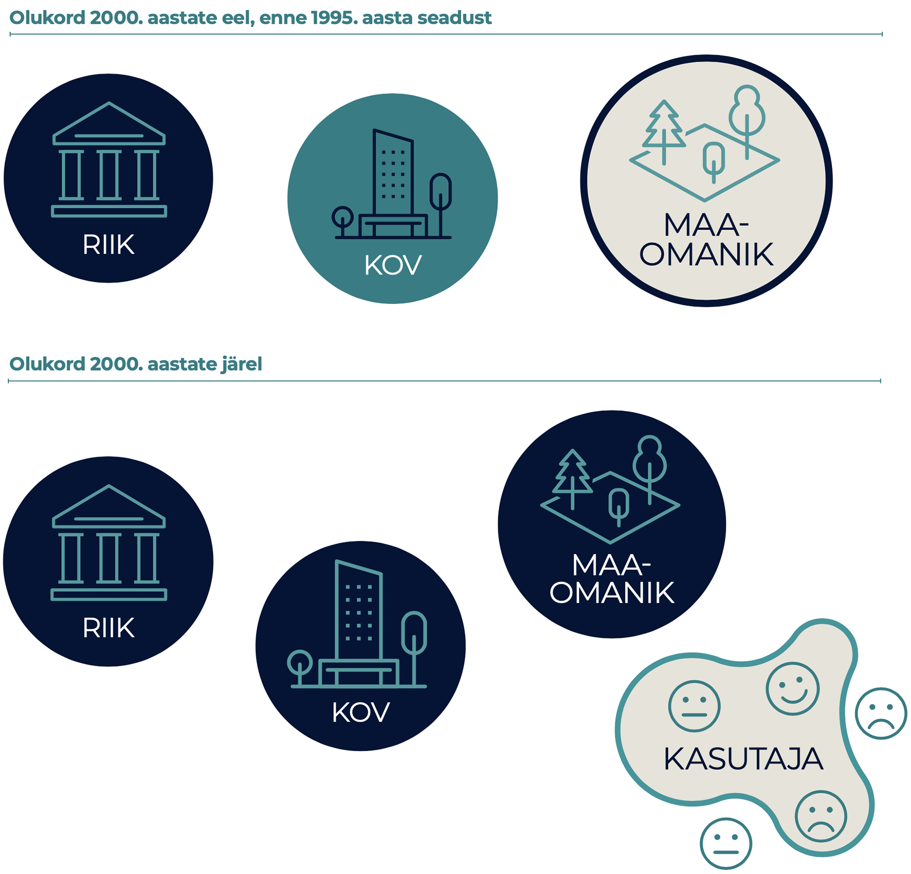

## Aktivism avaliku ruumi koosloomes {.chapter_section .chapter2_section}

```{block, type='authors'}
**Keiti Kljavin, Johanna Pirrus, Kaija-Luisa Kurik ja Ingmar Pastak**
```

```{block, type='points'}
* Eesti on jõudnud kodanikuühiskonna arengus punkti, kus inimesed soovivad üha enam elukeskkonna arengus kaasa rääkida, oma hoiakuid väljendada ning oskusi ja teadmisi rakendada.
```

Ruumi planeerimine ja ruumist mõtlemine ehk ruumi praktiline ja tähendusloome on Eestis viimase 30 aasta jooksul muutunud. Modernistlikust planeerimispraktikast neoliberaalsesse ruumikorraldusse üle kantud tellija-teostaja kahekõnesse on sekkunud kasutaja, kellel on vahetul ruumikogemusel põhinev vaatenurk ([Burby 2003](#Burby2003); [Leetmaa ja Hess 2019](#Leetmaa2019)).

Aktivism ruumiloomes ehk ruumiaktivism osutab kasutaja huvile teada saada ja kaasa rääkida, kuidas ja millistel põhimõtetel ruumi korraldatakse ja luuakse. Aktivism ühekorraga nii suunab ruumiloomet kui ka sõltub sellest, mistõttu pole selle pikk areng olnud probleemivaba. Tänapäevalgi on elujõuline planeerimistava (vt <a href="https://planeerimine.ee/">Ruumilise planeerimise kodulehte</a>), kus osapooled kaasatakse üldjuhul alles avalikustamise etapis, kui põhimõttelised otsused on juba langetatud. Vaatamata sellele, et avaliku ruumi aruteludes on sisulised küsimused, näiteks kellele ja millist ruumi luuakse, endiselt sageli tagaplaanil, on Eesti üldisesse ruumidebatti jõudnud idee koosloomest ruumi planeerimisel.

Disainmõtlemisest pärit termin koosloome tähistab siinkohal osapoolte kogemusi arvestavat koostööd ruumiotsuste kujundamisel ja elluviimisel. Koosloome on suunatud kokkuleppelise tulemuse saavutamisele. Eestis ei ole ruumi koosloome vormid veel välja kujunenud. Välisriikide koosloomemudelite laenamine ja kohandamine on ositi problemaatiline, kuivõrd need on pärit sageli raskesti võrreldavatest tingimustest. Erinevad on nii ühiskondlik ruumikorraldus, planeerimisõigus, ruumivaldkonna ametkondade tegevuse kooskõlastamine, toetussüsteemide koostöö ja muu sarnane. Näiteks ei toimi Lääne-Euroopa või Põhjamaade tavade ülevõtmine olukorras, kus aktivismiga ei kaasne loodetud ühiskondlik sidusus või eesmärgiks seatud koosloome tegelikult kohalikku kogukonda ei kaasa. Ruumiaktivism ei otsi alati lahendust, vaid võib ruumiloomes osaleda ka vastuseisuna, mille eesmärk on elukeskkonna pidev ümbermõtestamine ja eri huvide avalik arutelu. Koosloome on vaid üks ruumiaktivismi väljundeid, mis aitab meil ühiskonnana osapoolte mõttevahetuses saavutada paremat ja läbimõeldumat elukeskkonda.

```{block, type='blockquote-right'}
Koosloome on suunatud kokkuleppelise tulemuse saavutamisele. Eestis ei ole ruumi koosloome vormid veel välja kujunenud.
```
Ruumiaktivism eeldab üldjuhul osaleja isiklikku motiivi, olgu see seotud konkreetse ruumilise keskkonna või üha sagedamini maailmavaateliste küsimustega. Iseseisvuse taastanud Eestis on ruumilise planeerimise tavad muutunud üha avatumaks ja demokraatlikumaks ning seetõttu on ühiskonnas tekkinud ootus, et ulatuslik kodanike ja huvigruppide kaasamine on kvaliteetse ruumi loomise eelduseks. See tähendab muu hulgas teadvustamist, et praegused kaasamistavad ei vii ruumiloomes parema avaliku ruumini.

Artiklis vaatleme ruumiaktivismi eri vorme, nende toimimist ja seda, kuidas on muutunud ruumiloome osapoolte vahekord taasiseseisvunud Eestis. Vaatleme, kuidas aktivism linnalise elukeskkonna loomesse sekkub ning otsime vastuseid järgmistele küsimustele:

1) kuidas mõjutab aktivism ruumiotsuseid,
2) milline on olnud ruumiaktivismi roll laiemalt kodanikuühiskonna arengus ja
3) millised on ruumiaktivismi peamised väljakutsed ning sisemised vastuolud Eestis.

### Ruumiaktivism on ajas muutuv ja eesmärkidest sõltuv ruumipoliitiline tegevus {-.chapter2_section}

```{block, type='blockquote-right'}
Artiklis nimetame eri aktivismivorme liikumisteks, näiteks linnalised liikumised.
```

Nii nagu on muutuv avaliku ruumi tähendus, on üheselt määratlematu ka ruumiaktivisti roll. Aktivism on sotsiaalsete, poliitiliste või muude muutuste esilekutsumine ja alternatiivsete seisukohtade esitamine – ruumiloomes esindab ruumiaktivist eelkõige isiklikke ja/või kogukonna huvidest lähtuvaid seisukohti. Mõistetega (ruumi)aktivist ja (ruumi)aktivism viidatakse Eestis nii asumiseltside eestvedajatele, konkreetse ehitise või planeeringulahenduse rajamise vastu koondunud liikumistele, aga ka ruumiloomes osalevatele erialaliitudele ning kodanikuühiskonna ühendustele ja organisatsioonidele. Ruumiaktivism võib olla nii reaktiivne kui ka proaktiivne tegevus. Reaktiivsus tähistab enamasti konkreetsele arendusprojektile või arengusuunale vastuseisu, proaktiivsus osutab pigem laiemale huvide eest seismisele ning soovile mõjutada ruumiloome protsessi kaudu nii kohalikku arengut kui ka protsessi ennast. Reaktiivsusel ja proaktiivsusel on ühisosa ning kumbki ei ole liikumiste ja aktivistide kaupa kategoriseeritav – algselt reaktiivsed liikumised on kujunenud aja jooksul proaktiivseteks. See aga ei tähenda, et praegu proaktiivsed liikumised ei võiks tulevikus olla taas reaktiivses rollis.

```{block, type='casebox'}
**Kogukondade tegutsemisvormid**

Aastal 2014 Linnalabori ja liikumise Kodukant tehtud kogukonnauuringust selgus, et kohalik aktiivsus ei väljendu ainult registreeritud MTÜde kaudu, vaid võib võtta muidki organisatsioonilisi vorme. Liikumine Kodukant on 2013. aastal kokku lugenud 1316 külavanemat, 1188 külades tegutsevat seltsi ning 51 koostööühendust (vallaülest katusorganisatsiooni ja ümarlauda), mis liidavad kohalikku aktiivsust arendavaid MTÜsid, seltsinguid ja külavanemaid. Registreerimata seltsinguid, mis tegelevad kohaliku arenguga, loendati 2006. aastal 45 027. Linnaseltse tegutses Linnalabori andmetel 2014. aastal Eestis aastal kuus ning neile lisandus veel kümmekond ökokogukonda. Seega on ametlikult organiseerunud kogukondi 2014. aastal tehtud kogukonnauuringu andmetel Eestis 3500 ringis. Vastanud kogukondadest on 75% registreeritud MTÜna, 9% kogunevad spontaanselt ametlikult organiseerumata, 6% kogukondadest kogunevad külavanema eestvedamisel ja 6% tegutsevad seltsingulepingu alusel. Puudulik statistika raskendab kogukondade tegutsemisvormide kohta järelduste tegemist.

```
```{block, type='imgsource'}
<span class="imgsource-source">Allikas:</span> Lippus ja Vihma 2014.
```


```{block, type='blockquote-right'}
Aktivism on sotsiaalsete, poliitiliste või muude muutuste esilekutsumine ja alternatiivsete seisukohtade esitamine.
```
Ennekõike on ruumiaktivist olenemata ametist või haridusest ruumi vahetu kasutaja. Tal on isiklik kogemus ja seosed teatud koha või piirkonnaga ning ta tajub tuleviku arenguvõimalusi ja ohtusid. Ruumiaktivist otsib oma teadmise väljendamiseks dialoogipartnerit avalikus sektoris või kohta ja kaaslasi avaliku sektori ja arendaja vahelises arutelus. Selleks et avaliku ruumi muutustes kaasa rääkida, loovad ruumiaktivistid sageli juriidilise kehami. Mittetulunduslik või vabakondlik vorm võimaldab otsida oma tegevusele kergemini rahastusallikaid. Organiseerumist on tagant tõuganud ja sisuliselt suunanud ka mitmesuguste fondide, näiteks Euroopa Liidu tõukefondide rahaline toetus, mida on kodanikuühiskonna arendamiseks võimalik taotleda vaid juriidilisel isikul ([Kljavin 2014](#Kljavin2014)). Jätkuvalt on tajutav lõhe üksikisiku hääle ja ametlike organisatsioonide vahel. Ruumiaktivistide loodud liikumiste eesmärk ja tegevused võivad muutuda vastavalt vajadusele, tekkida ruumimuutuse vastu- ja järelmõjuna või murrangut ennetades.

### Ruumiaktivism rakendab olemasolevaid ja leiutab uusi osalusdemokraatia mudeleid  {-.chapter2_section}

```{block, type='blockquote-right'}
Ruumiaktivistide loodud liikumiste eesmärk ja tegevused võivad muutuda vastavalt vajadusele, tekkida ruumimuutuse vastu- ja järelmõjuna või murrangut ennetades.
```
Aktivismi tekkelugu paigutub Eesti kodanikuühiskonna üldise arengu ajajoonele. 1990. aastatel kujundasid ühiskonda pöördelised reformid avalikus sektoris ja üleüldine reguleerimatus nii erasektori püüdluste ohjeldamisel kui ka osapoolte kaasamisel. Ehitusbuumiaegne kinnisvaraturu ülekuumenemine ja omavalitsuste suutmatus seda reguleerida soosisid arendajate suuremahulist ja sageli läbimõtlemata tegevust nii eluasemeturul kui ka avaliku ruumi kujundamisel veel taasiseseisvumisele järgnenud teise kümnendi lõpus ([Tuvikene ja Pehk 2011](#Tuvikene2011)). Alles viimase majandussurutise (2008–2011) ajal hakkas ruumiloomes osapoolte vahekord muutuma. Selgelt eristus senisest valdavalt kahesuunalisest avaliku sektori ja maaomaniku suhtest kolmas osapool – oma elukeskkonna heast arengust huvituv kodanik või aktiviste koondav kodanikuühendus ([joonis 2.3.1](#figure231)).

<p class="caption" id="figure231"><span class="figure-number">Joonis 2.3.1.</span> Ruumiloome osapoolte suhete kujunemislugu</p>

2000. aastate eel oli ruumiloome osapoolte suhtluses maaomanike huvid ebaselged ning kasutaja vaade defineerimata. Sealhulgas ei olnud kohalik omavalitsus ja riik enne 1995. aasta planeerimis- ja ehitusseaduse vastuvõtmist ruumikorralduslikes ülesannetes kokku leppinud. Kasutaja vaatenurga lisandumisega muutusid riigi, kohaliku omavalitsuse ja maaomaniku rollid selgemaks, kuid kasutaja ise on endiselt määratlemata staatuses.

```{r, figure231, fig.align='center', out.width='80%', echo=FALSE, message=FALSE, warning=FALSE}



```

```{block, type='imgsource'}
<span class="imgsource-source">Allikas:</span> autorite joonis.
```

Vabatahtlikku ja ettevaatavat rolli avaliku ruumi planeerimises hakkasid linnades täitma asumiseltsid, mille liikmed mõtestasid oma tegevust eelkõige kogukonnast lähtuvalt. Uus huvigrupp linnas sündis sageli vastureaktsioonina majandussurutiseaegsele ja -järgsele kinnisvaraarendajate omavolile.
Kasutaja paremat esindatust ilmestab Eestis viimasel kümnendil toimunud valitsemistavade muutumine: eri sektorite piirid pehmenevad ja nii tekivad käsuliinide asemel pigem pidevas arengus valitsemisvõrgustikud ([Holvandus ja Leetmaa 2016](#Holvandus2016)). Võrgustike sees on aktivistidel paremad võimalused survestada ruumiloome praktikat muutuma osapooltele avatumaks ja läbipaistvamaks. Kasutajate vastuvõtlikkus ja valdkonnaülene haritus loob ka paremad eeldused igale ruumikasutajale suurendada oma teadmisi sellest, kuidas ruumi luuakse. Eesti kodanikuühiskond on jõudnud punkti, kus inimesed tahavad enam ühiskonnaelus ja ruumiloomes osaleda, oma arvamusi ja hoiakuid väljendada ning oskusi ja teadmisi rakendada.

### Ruumiaktivism kannustab kodanikuühiskonna arengut  {-.chapter2_section}

Avaliku ruumiga tegelevad huvirühmad ja organisatsioonid on tagant tõuganud üldist kodanikuühiskonna ja demokraatlikuma kaasamiskultuuri arengut. Nende tegevus on tõestanud vajadust kodanike sekkumise järele kohaliku omavalitsuse või eraomandi sfääri ja aidanud täita eesmärki saavutada parem avalik ruum, näiteks Soo tänav või Balti jaama turg Tallinnas ([Kljavin ja Kurik 2017](#Kljavin2017)).

```{block, type='blockquote-left'}
Aktivism on sotsiaalsete, poliitiliste või muude muutuste esilekutsumine ja alternatiivsete seisukohtade esitamine.
```
Ruumiaktivismi eesmärgid teisenevad vastavalt organisatsiooni sisemisele arengule, liidrite vahetumisele ja liikmete lisandumisele. Linnalised liikumised tegelevad küpsedes järjest enam otseselt linnaplaneerimises osalemisega ([Kljavin 2014](#Kljavin2014)). Seda on soodustanud ka avaliku, era- ja mittetulundussektori tihedam partnerlus laiemate ruumilist arengut mõjutavate teenuste osutamisel ([Leetmaa jt 2014](#Leetmaa2014); [Lippus ja Vihma 2014](#Lippus2014)). Mittetulundussektoril on sellistes projektides alltöövõtja ja koostööpartneri roll, näiteks kogukondliku siseturvalisuse projektid või korrakaitseorganisatsioonidega koostatud piirkondlikud turvalisuse kaardistused, ent ajutise ja projektipõhise sekkumise kaudu võidakse osaleda ka linnakuvandi loomisel.

Kui valdavalt jõuavad asukohapõhised liikumised tegeleda konkreetsete piirkondlike teemadega, siis järjest enam on ruumiaktiviste ja nende ühendusi koondavad või nõustavad katusorganisatsioonid üle võtnud arutelude vedaja ja osapoolte vahendaja ülesanded (nt Tallinna Asumiseltside Liit, ekspertide rühmitus Merelinna Kaitseks). Vahendaja ise võib olla samal ajal mõne ekspertorganisatsiooni või erialaliidu liige, asumiseltsi eestvedaja või sama omavalitsuse endine ametnik. Selle käigus hägustub paratamatult nii ruumiaktivisti kui ka eksperdi roll ([joonis 2.3.2](#figure232)).

<p class="caption" id="figure232"><span class="figure-number">Joonis 2.3.2.</span> Ruumiaktivisti rollid</p>
```{r, figure232, fig.asp=.75, fig.align='center', echo=FALSE, message=FALSE, warning=FALSE}

```
```{block, type='imgsource'}
<span class="imgsource-source">Allikas:</span> autorite joonis.
```

Osapoolte kokkutoomine, sobiliku suhtlusvormi otsimine, ühiste huvide väljaselgitamine ja lahenduste üle arutlemine on osa koosloome reeglite kujunemisest. Seda tegevust mingil viisil sildistades – näiteks kasutades ingliskeelset akronüümi NIMBY (ingl *not in my back yard*, eesti keeles mitte-minu-naabrusse-sündroom) või selle variatsioone NIABY, LULU, NAMBY, BANANA – piirab avalik sektor, kinnisvara arendaja või ka meedia avalikku arutelu.

### Ruumiloomes osalevate liikumiste ja üksikisikute mõju väljendub uutes osaluskultuuri vormides {-.chapter2_section}

Ruumiaktivistide osalemist avaliku ruumi loomes takistavad peamiselt nende ebaselge legitiimsus, ühenduste ja avaliku võimu sisulise koostöövõime ebakindlus ning koosloome aja- ja ressursikulukus. Liikumiste osalemist otsustusprotsessis pärsivad nii avaliku kui ka erasektori seatud küsimused: keda ühendus esindab ja kuidas kujuneb nende legitiimsus? On selge, et liikumised ei esinda põhimõtteliselt kõiki kohalikke elanikke ega anna seetõttu selle eestvedajatele õigust kõigi elanike huvisid esindada. Siiski ei ole saavutatav ka olukord, kus asumi elanikud moodustaksid tervikliku ning ühtse kogukonna või kus naabruskonna ruumilise (ümber)kujundamisega oleks võimalik luua terviklik ning ühtne kogukond ([Holvandus ja Leetmaa 2016](#Holvandus2016); [Lippus ja Vihma 2014](#Holvandus2016)).

```{block, type='blockquote-right'}
Osapoolte kokkutoomine, sobiliku suhtlusvormi otsimine, ühiste huvide väljaselgitamine ja lahenduste üle arutlemine on osa koosloome reeglite kujunemisest.
```
Ruumiaktivismi legitiimsuse kujunemine algab aktivistide sekkumisega avalikku ruumi. Juhul kui sekkumised tegelikkuses midagi muudavad, võib see viia tegevuste tunnustamiseni ja legitiimsuse suurenemiseni. Üks näiteid on Tallinna kogukondlik linnaaiandus, mida 2000. aastate alguses määratleti pigem ajutise, kasutusloata kogukondliku liikumisena (nt Polymeri kultuuritehase katuseaed). Nüüd on kogukonnaaianduse edendamise tarbeks loodud linnavalitsuses eraldi töökoht. Samal ajal ootavad omavalitsused, et kodanikud tõendaksid oma legitiimsust allkirjade kogumise (nt 1000 allkirja) või kohaliku huvi organiseeritud vahendamisega ([Pastak 2014](#Pastak2014)). Ühenduste legitiimsus ja jätkusuutlikkus sõltub inimressursist ja teadmistepagasist, laiemast kontekstist ja jagatud väärtustest – teisisõnu, ühenduse legitiimsus suureneb ajas.

Ruumiloomes osalevate ühenduste ja üksikisikute laiemat mõju kaasamispraktika arengule saab hinnata osaluskultuuri uute vormide tekkimise kaudu. Senisest planeerimispraktikast sündinud meetodid, mille abil osalust soodustatakse, esindavad tavaliselt näilist kaasamist. Näiteks on olukordi, kus arvutis kujundatud ilupiltidega tullakse justkui vastu kodaniku ebapiisavale visuaalsele lugemisoskusele, mis ei võimalda tal aru saada keerulistest planeerimisjoonistest. Seegi toimub pahatihti viimastes etappides, kui sisulised ruumi muutvad otsused on juba langetatud. Teine lõks peitub optimistlikus usus parema kaasatuse ja kogukonnaarengu egiidi all arendavatesse uutesse tehnoloogiatesse, mida kasutades jääb ebaselgeks, kuidas kogutud arvamuste ja andmetega edasi tegutsetakse ja millist süsteemset muutust need digitaalsed kaasarääkimise platvormid loovad.

```{block, type='blockquote-left'}
Ruumiloomes osalevate ühenduste ja üksikisikute laiemat mõju kaasamispraktika arengule saab hinnata osaluskultuuri uute vormide tekkimise kaudu.
```
Eesti planeerimistavades võib kohata nii kohaliku omavalitsuse esindajate kui ka konsultatsiooniettevõtete arvamust, et kaasamine on kulukas ja aeganõudev. Juhindudes vähempakkumise loogikast hangete teostaja valimisel ning avaliku sektori kokkuhoiupõhimõtetest, on tihti juba eelarvesse sisse kirjutatud võimalikult vähene kaasamine. See teeb peaaegu võimatuks veelgi aja- ja ressursikulukama koosloome rakendamise. Nii ollakse olukorras, kus avalik sektor kaasamise asemel pigem teavitab, aga ruumiaktivist ootab võimalust koostööks.

### Aktivismi väljakutsed ruumiloomes {-.chapter2_section}

```{block, type='blockquote-right'}
Üha olulisemaks kujuneb küsimus, kes on pädev kaasamist juhtima (omavalitsus, ruumiloome ekspertrühm, konsultatsiooniettevõte jne) ja kuidas jaotuvad osapoolte õigused ja ülesanded.
```
Ruumiaktivismi üks suurimaid väljakutseid on selle vastuoluline olemus – ühtaegu alternatiivseid seisukohti esitades ja muutusi esile kutsudes võib see takistada koosloome rakendamist planeerimisprotsessis. Vähemalt seni, kuni Eesti planeerimistava käsitleb ruumiaktiviste kui oponente, on koosloome ebatõenäoline. Lisaks on muret tekitav ühiskondliku arutelu liikumine reguleeritud juriidilisse sfääri, kus koosloomel mingit rolli ei ole. Näiteks on avaliku ruumi ligipääsetavus keskne küsimus mitme taristuobjekti (teede, tänavate) projekteerimise puhul, aktivistide legaalsel ähvardamisel, et takistada avalikkuse kaasamist (lühendina LÄTAK), ning suurte keskkonnamõjude kaalumisele taanduvates keerulistes kohtuvaidlustes. Sellistel juhtudel taanduvad katsed koosloomet saavutada endiselt vaid miinimumnõuet täites planeerimisseaduses sätestatule. Ühtlasi on kohtumenetluste kaudu lahendatavad konfliktid aktiivsust üles näidanud kodanikule väsitavad ja kulukad.

```{block, type='blockquote-left'}
LÄTAK – legaalne ähvardamine takistamaks avalikkuse kaasamist.
```
Väljakutseid ruumiaktivismile on lisaks eelpool kirjeldatuile teisigi. Näiteks üha olulisemaks kujuneb küsimus, kes on pädev kaasamist juhtima (omavalitsus, ruumiloome ekspertrühm, konsultatsiooniettevõte jne) ja kuidas jaotuvad osapoolte õigused ja ülesanded. Lisaküsimusi tekitab nii-öelda mitmel toolil istumine – üks ja sama isik võib olla kord aktivist, siis ametnik, siis nõunik – ning sellega kaasnev teadmiste monopoli, mõjuvõimu ja ebavõrdsuse probleem ruumiloomes. Võib küsida, et kui ametnikul on paremad teadmised ja parem ligipääs informatsioonile, kas see suurendab omakorda tema mõjuvõimu ruumiotsustes. Samavõrd oluline on küsimus, kuidas muuta ruumiloome kõigile avatud ja mitmekesiseks protsessiks. Kaasamine eeldab planeerimisprotsessis n-ö laua taha jõudmiseks sageli ametlikku (juriidilist) kehamit nagu asumiseltsid, mittetulundusühingud, mõttekojad, korteriühistud ja külaseltsid.

```{block, type='casebox'}
<h3>Reidi tee juhtum</h3>

Reidi tee on viimase viie aasta üks suuremahulisemaid Tallinna avalikku ruumi kujundavaid projekte, mis on mõeldud mitmerealise tänavakoridorina ühendama Tallinna sadamaala Pirita teega. Selle kavandamisel on osalenud erahuve esindav Tallinna Sadam (vahendajana tee projekteerija K-Projekt), linna kasvu huve esindav linnavalitsus (vahendajana Tallinna Linnaplaneerimise Amet), avalikke huve esindavad kodanikuühendused (mitmed erialaliidud ja konkreetselt Reidi tee praeguse projekti vastu võitlevad ühendused, nt Merelinna Kaitseks ja MTÜ Eesti Roheline Liikumine).

Reidi tee on avaliku ruumi kujundamise juhtum, mis juhib tähelepanu avaliku ruumi kavandamise puudujääkidele ja koosloome puudumisele. Konflikti peamised põhjused on avalikkuse, sealhulgas aktivistide ja ruumiekspertide kõrvalejäämine lähteülesannete ja tee projekteerimise eri etappidest ning üldplaneeringu piiratusest tingitud kõiki osapooli mitterahuldav tulevikuvisioon mereääre arenguks. Eri kodanikualgatused ja erialaliidud on tee ehitusprojektile muudatusettepanekute, korraldatud aktsioonide ja meediakajastuste kaudu juhtinud tähelepanu, et Reidi tee esialgse projektilahenduse aluseks oli autoliiklust kvaliteetse mereäärse avaliku ruumi arvelt eelistav transpordikoridor.

Reidi tee juhtumis leidsid kodanikuühendused ühise keele projekti tehtud konkreetsete muudatuste kujul, näiteks piirati sõiduridasid ja tee laiust, sõidukiirust ning lisati linnamööblit (Reidi tee ehitusprojekti parandamise kokkulepe 2018; [Teppart 2017](#Teppart2017)). Samuti kujunes ka ühine vaade Linnaplaneerimise Ametiga. 2019. aasta kevadel taganes Tallinna Linnavalitsus kokkuleppest. Reidi tee juhtum iseloomustab avaliku ruumi kujundamise arutelu liikumist juriidilisse sfääri, kus osapoolte vaidlust juhivad paragrahvid, ebavõrdne pädevus ja kaasuse lahendamiseks mõjusamad argumendid, mitte sisuline küsimus avalikust huvist ruumiloomes.

<p class="caption" id="figure233"><span class="figure-number">Joonis 2.3.3.</span> Vasakul K-Projekti projekteeritud tänavakoridor, paremal ruumiekspertide ettepanek</p>

```
```{block, type='imgsource'}
<span class="imgsource-source">Allikas:</span> joonise autor Juho Kalberg.
```

### Kokkuvõte {-.chapter2_section}

Koosloomest sündiva avalikku ruumi mõjutavate otsuste kujundamise ja elluviimise suunas liikumiseks vajame kõikide ruumis osalevate osapoolte avatud arutelu. Aktivismil on sellises ruumiloomes oluline roll pakkuda institutsioonidevälist vaadet ja esindada ruumikasutaja huve. Arutelus osalemine eeldab aktivistilt kriitilist mõtlemist ja sageli kiiret reaktsiooni, ühtlasi on oluline säilitada aktivismi sõltumatus. See aga ei välista uute koosloome vormide loomise vajalikkust. Edasiminek saab siiski toimuda vaid olukorras, kus avalike institutsioonide usaldava ja toetava keskkonna oluline osa on valdavalt vabatahtlikkuse alusel tehtava töö hindamine. Üksikisikute ja mitteformaalsete huvigruppide (kuidas n-ö juriidilise kehata saaks osaleda ruumiloomes sisulisemalt kui planeerimisseadus ette näeb) ulatuslikum kaasamine ning küsimused, kuidas võimestada eri huvigruppe ruumiloomes osalema, on jätkuvalt mõttekoht avalikule sektorile. Aktivismi roll, käekäik ja tegevused võivad olla avaliku ruumi eri juhtumite puhul kordumatud ning üks kaasamismudel ei pruugi toimida kõikide ruumiotsuse puhul. Uued tehnoloogiad, näiteks veebipõhised rakendused, avaandmete platvormid, planeeringute veebiväravad on vahendid, mille abil kogutud vastused ei võrdu automaatselt hea avaliku ruumi loomega. Samal ajal ei tohiks avaliku ruumi vormilist ja kunstilist tulemust juhtida ka ainult huvikogukondade lobi ja kasutajagruppide eelistus. Osapoolte ja eri mudelite tasakaalustajaks saab olla omavalitsus, kes on kokku leppinud avaliku ruumi pikaaegsetes arengusuundades ja kus on tööl ruumiküsimustes pädevad spetsialistid. Kokkuvõttes on aktivism vaid üks eeldus paremate ruumiotsuste tegemiseks.

### Viidatud allikad {-.subreferences}

<p id="Burby2003">Burby, R. J. 2003. Making plans that matter: citizen involvement and government action. − Journal of the American Planning Association, 69 (1), 33–49.</p>
<p id="Holvandus2016">Holvandus, J., Leetmaa, K. 2016. The views of neighbourhood associations on collaborative urban governance in Tallinn, Estonia. plaNext – Next Generation Planning, 3, 49−66.</p>
<p id="Kljavin2014">Kljavin, K. 2014. The Uses of Nostalgia. Neighbourhood Associations in Post-Socialist Estonia. Magistritöö. Eesti Kunstiakadeemia.</p>
<p id="Kljavin2017">Kljavin, K., Kurik, K.-L. 2017. Balti urbanismi eripärad – ad hoc planeerimisest pehme urbanismini. – Urbanistide väljaanne U, Deep Baltic, 19.</p>
<p id="Leetmaa2019">Leetmaa, K., Hess, D. B. 2019. Incomplete service networks in enduring socialist housing estates: retrospective evidence from local centres in Estonia. – Hess, D. B., Tammaru, T. (eds.). Housing Estates in the Baltic Countries: The Legacy of Central Planning in Estonia, Latvia and Lithuania. Cham: Springer, 273–299.</p>
<p id="Leetmaa2014">Leetmaa, K., Tammaru, T., Holvandus, J., Pastak, I., Kamenik, K., Kährik, A. 2014. Governance Arrangements and Initiatives in Tallinn, Estonia. – DIVERCITIES – Governing Urban Diversity: Creating Social Cohesion, Social Mobility and Economic Performance in Today’s Hyper-diversified Cities. Uuringuraport. Tartu: University of Tartu.</p>
<p id="Lippus2014">Lippus, M., Vihma, P. 2014. Eesti kogukondade hetkeseis. Uuringuraport. Tallinn: Linnalabor ja Eesti Külaliikumine Kodukant.</p>
<p id="Pastak2014">Pastak, I. 2014. Tööstusalade ümberkujundamine ja selle roll linnaosa arengus Põhja-Tallinna näitel. Magistritöö. Tartu Ülikool.</p>
<p id="Teppart2017">Teppart, J. 2017. The conflict surrounding Reidi Road Project and its significance to the urban planning of Tallinn. Magistritöö. Eesti Kunstiakadeemia.</p>
<p id="Tuvikene2011">Tuvikene, T., Pehk, T. 2011. Kodanikualgatuse peadtõstev roll Tallinna ruumilises planeerimises. – Uustal, M. (toim.). Inimmõju Tallinna keskkonnale VI. Konverentsi artiklid. Tallinn: SA Säästva Eesti Instituut ja Tallinna Botaanikaaed, 8–12.</p>
