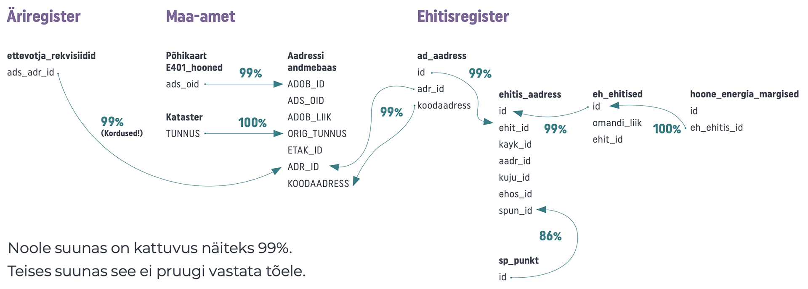
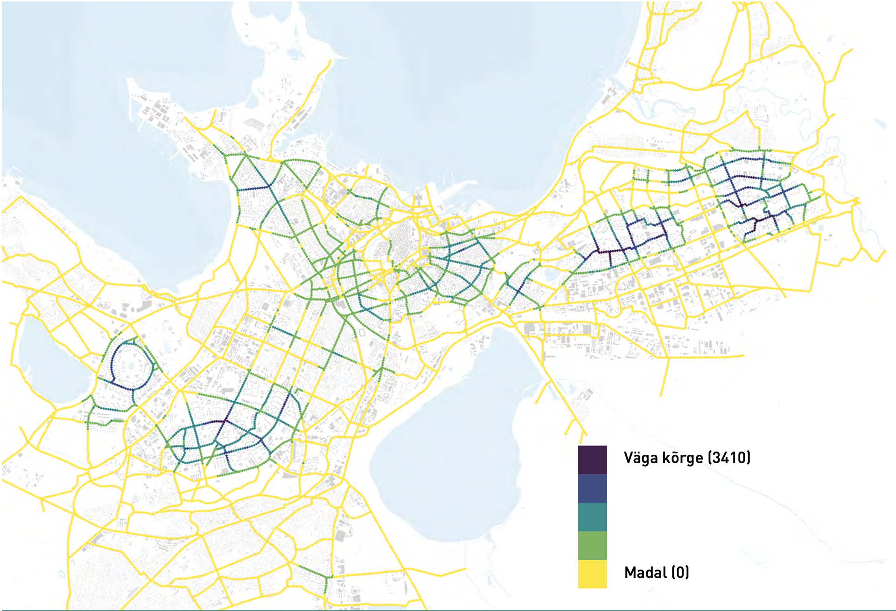
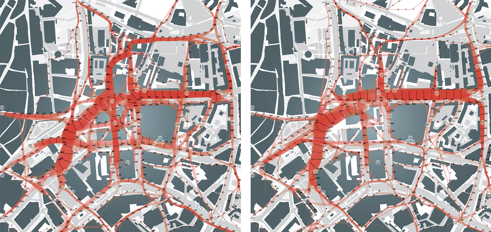

## Andmepõhine ruumiloome {.chapter_section .chapter2_section}

```{block, type='authors authors_ee'}
<div class="author-links">**[Renee Puusepp](#renee-puusepp) ja [Raul Kalvo](#raul-kalvo)**</div>
<div><a class="print-btn EE-btn" href="en/data-driven-spatial-planning.html">EN</a></div>
<div><a class="print-btn" href="print/EIA-2019-2.4.pdf"><i class="fa fa-file" aria-hidden="true"></i>Trükiversioon</a></div>
```

```{block, type='points'}
* Häid ruumiloomeotsuseid on võimalik teha paikapidavate ja ajakohaste ruumiandmete alusel.
```

Õigust osaleda avaliku ruumi loomes on peetud üheks väärtuslikumaks inimõiguseks, mis aga on liiga sageli hooletusse jäetud ([Harvey 2008](#Harvey2008)). Igasugune ruumi ja eriti avaliku ruumi kavandamine peaks rajanema demokraatlikel alustel, olles läbinähtav ja kõiki huvigruppe kaasav protsess. Läbinähtavust tagada ja võimalikult laia avalikkust kaasata aitaks see, kui ruumiloomeotsuste tegemisel kasutatud alusandmed on avalikud ning andmete ja otsuste seosed selgelt väljendatud.

Ruumiandmeid käsitleme ruumiandmete seaduse (kehtiv alates 2011) tähenduses andmetena, mis otseselt või kaudselt osutavad konkreetsele asukohale või geograafilisele alale, sealhulgas andmed, mis kirjeldavad ruumiobjektide asukohta, omadusi ja kuju geograafilises ruumis. Andmepõhine ruumiloome annab võimaluse muuta avaliku ruumi organiseerimist puudutavate otsuste tegemise põhjendatumaks ning suurendada selle läbipaistvust. Alternatiivsete ruumi kujundamise stsenaariumide võrdlemine, andmete järjepidev kogumine, seire ja muud andmepõhised ruumiloomemeetodid on avatud ja kaasava ruumi planeerimise loomulikud osad.

```{block, type='blockquote-right'}
Andmepõhine ruumiloome annab võimaluse muuta avaliku ruumi organiseerimist puudutavate otsuste tegemise põhjendatumaks ning suurendada selle läbipaistvust.
```
Käesoleva artikli eesmärk on osutada andmepõhise ruumiloome võimalustele ja tähtsusele Eesti tiheasumite hoonestuse ja avaliku linnaruumi kujundamisel. Järgnevaga anname lühiülevaate andmepõhise planeerimise hetkeseisust ja osutame peamistele puudujääkidele Eesti planeerimissüsteemis. Lisaks pakume välja, kuidas täiendada ruumiloomeprotsesse andmepõhiste meetoditega. Artikkel käsitleb teemat nii linnaruumi ja hoonestuse planeerimise aspektist kui ka valdade ja linnade üldplaneeringute ja madalama astme planeeringute tasemel.

### Avalikest ruumiandmetest on ühiskonnal ainult võita {-.chapter2_section}

Igaühel on õigus osaleda avaliku ruumi loomisel ja avalikul sektoril on selle õiguse teostamiseks kohustus tagada juurdepääs kõigile ruumiandmetele. Sarnaselt muude avaandmetega täidavad avatud ruumiandmed kolme põhieesmärki: parem ruumiloome otsuste mõistmine, rahva kaasatus otsustusprotsessi ning laiema kandepinna saavutamine ja uute teadmise loomine avaliku dialoogi kaudu ([Hansson ja Ekenberg 2015](#Hansson2015)). Avaandmed (sh ruumiandmed) peaksid olema avatud nii tehniliselt kui ka juriidiliselt – st vabalt allalaetavad, avatud igasuguseks kasutuseks ning varustatud kasutusloaga ([Kučera 2017](#Kučera2017)).

Eestis annavad aluse andmepõhiseks ruumiloomeks mitmed avaliku sektori tellimusel koostatud dokumendid. Rahandusministeeriumi „Nõuanded üldplaneeringute koostamiseks“ (<a href="https://planeerimine.ee/static/sites/2/uldplaneeringu_juhis_final.pdf">2018</a>) rõhutavad, et elukeskkonda saab paremaks muuta, kui kaasata planeerimisprotsessi ruumi kasutajad – elanikud-omanikud, ettevõtjad-arendajad ja puhkajad-külastajad. Riigikantselei juures tegutsenud ruumiloome ekspertrühma lõpparuanne tõdeb, et elukeskkonna parandamine peaks olema teadvustatud ja teadmistest juhitud tegevus. Selleks vajalike teadmiste tekkimine ja teadvustatud tegevus ruumis saab rajaneda ainult paikapidavatel ja ajakohastel andmetel. Neid kahte elukeskkonna parendamist käsitlevat dokumenti täiendab „Avaliku teabe masinloetava avalikustamise roheline raamat“ (2014), mis sätestab, et avaandmed peavad olema piiranguteta ja masinloetavas formaadis kättesaadavad kõigile soovijatele. Ruumiandmed peavad olema avaandmed, kui need ei lähe otseselt vastuollu eraelu puutumatuse ja julgeolekuga.

Peale riiklike andmekogude, nagu näiteks ehitisregister (EHR) ja maakataster, kus hoitakse ametlikke andmeid, luuakse ruumiandmed pidevalt juurde. Neid toodavad inimesed oma igapäevaste toimingute käigus, kasutades kohapõhiseid nutirakendusi, makstes poes pangakaardiga, viibutades Tallinna ühistranspordis „rohelist kaarti“, sõlmides kinnisvaratehinguid, taotledes ehitus- ja raieluba või lihtsalt kaubanduskeskuse ukseloenduri vaatevälja jalutades. Nende andmete süvaanalüüsi abil on võimalik ruumiprotsessidest paremini aru saada ja neile reagreerida. Protsesside mõistmine on omakorda alus läbikaalutletud ruumiloomele. Näiteks saab Tallinna ühistranspordi sõidukaardi ehk ühiskaardi andmete alusel tuvastada ühistranspordi võrgustiku kasutust ning vajadust uusi liine planeerida ja peatusi rajada.

World Economic Forumi 2017. aasta raporti kohaselt jagatakse ruumiandmed kogumise eesmärkide ja viisi poolest järgnevalt:

1) otsese eesmärgita või mõnel teisel eesmärgil kogutud andmed (nt mobiilioperaatorite kogutud kasutajate kõnetoimingute asukohad, mida agregeeritud kujul on võimalik kasutada elanikkonna liikuvuse analüüsiks);
2) eesmärgipäraselt kogutud andmed (nt liiklusloendused, mille käigus kogutud andmeid kasutatakse uute teede ruumilisel kavandamisel);
3) kasutaja genereeritud andmed (nt asukohapõhised postitused sotsiaalmeedias).

Kuigi andmete kogumisel on suundumus minna kergema vastupanu teed ja koguda neid otsese eesmärgita, peaks seda tegema siiski eesmärgipäraselt. Eriti teravalt tõuseb see vajadus esile suurte andmehulkade puhul, sest mittetarvilike andmete töötlemine, hoidmine ja haldamine võib osutuda kulukaks. Tehnoloogia eksponentsiaalse arengu üks kaasnähtudest on suurandmete tekkimine. Paljud nendest andmetest on otseselt või kaudselt seotud ruumiga. Sellised ruumiandmed on varieeruva mahu, kvaliteedi, kättesaadavuse ja ajalise piiratusega. Suurandmete ühine tunnusjoon on nende ajutisus ([Batty 2016](#Batty2016)). See tähendab, et suurandmestikku ei ole võimalik täies ulatuses talletada ning andmete kasutamine on seetõttu keerulisem kui eesmärgipäraselt kogutud tavaandmete kasutamine. Piltlikult öeldes ei mahu suurandmed Exceli tabelisse ning neid ei ole seega otstarbekas eesmärgipäratult koguda.

```{block, type='blockquote-right'}
Suurandmestikku ei ole võimalik täies ulatuses talletada ning andmete kasutamine on seetõttu keerulisem kui eesmärgipäraselt kogutud tavaandmete kasutamine.
```
Ruumilisi suurandmeid on võimalik kasutada näiteks ühistranspordi ja liikluse organiseerimiseks ja seireks, tulekahjude ja epideemiate ohjamiseks, prügimajanduse, lumekoristuse, teeparanduse ja muu sarnase korraldamiseks. Sedasorti andmepõhise ruumiplaneerimise seos füüsilise ruumi loomega on kaudne. Hoonestuse kavandamisel on suurandmete kasutamine oluliselt keerulisem, sest neid on tarvis ruumiloomeliste otsuste tegemisel töödelda. Suurandmeid saab aga kasutada ruumiliste lahenduste toimimise hindamiseks, et tuvastada, kas peale ruumiliste otsuste elluviimist on muutused tuvastatavad ka andmestikus.

```{block, type='blockquote-left'}
Ruumiandmed peavad olema avaandmed, kui need ei lähe otseselt vastuollu eraelu puutumatuse ja julgeolekuga.
```
Maailmapraktikas on tänapäeval kasutuses nii reaalajas linnade juhtimise rakendusi kui ka andmete kasutamist linnade juhtimiseks ja ruumiloomeotsuste toetamiseks. Näiteks on Melbourne Austraalias teinud maakasutuse ja jalakäijate liikumise ruumiandmed avalikult kättesaadavaks nii linnakodanikele kui ka ettevõtjatele ([World Economic Forum 2017](#World2017)). Sarnane planeeringuliste andmete avalikustamine Ameerika Ühendriikides on viinud Zonari-nimelise rakenduse loomiseni, mis koondab infot kehtivate planeeringute kohta, GIS-andmeid ja kinnisvarainfot ning pakub võimalust nii kohalikele omavalitsustele kui ka kinnisvaraarendajatele nende baasil genereerida ja analüüsida võimalikke hoonemahte. Mitu head näidet on seotud transpordiliikide, liikumise ja ligipääsetavuse parema korraldamisega. Eestile kõige lähem näide on Helsingi Mapple-nimeline interaktiivne veebipõhine rakendus, mis annab kinnisvaraarendajatele, linnaplaneerijatele, linnaosavalitsustele ja linnas paiknevatele ettevõtetele võimaluse teha paremaid otsuseid ligipääsetavuse osas. Kopenhaageni linnavalitsus on aastaid loendanud jalgrattureid ning võtab andmete alusel vastu uute jalgrattateede rajamise otsuseid ([Gehl Institute 2018](#Gehl2018)). Ameerika Ühendriikide linnades on kasutusel StreetLight Data platvorm jalakäijate, ratturite ja mootorsõidukite andmete kogumiseks ja analüüsiks, et lahendada ummikuid ja planeerida transpordivõrgustikke.

Andmepõhiste ruumiloomeotsuste tegemise peamine väljakutse seisneb andmete tõlgendamises – otsuseid ei tohi teha pimesi, vaid tuletada põhjalikust analüüsist. Keerulisemaid ja mitmetahulisi avalikku ruumi ja linnaplaneerimist puudutavaid otsuseid ei ole seega praktiline rajada mitte üksnes andmetele, vaid kombineeritud metoodikale. Ajaloost on näiteks teada juhtum, kus arvutimudeli abil optimeeritud tuletõrjekomandode paiknemine tõi hoopis kaasa tulekahjuohvrite arvu kasvu ([Flood 2010](#Flood2010)).

### Andmepõhine ruumiloome Eestis on lapsekingades {-.chapter2_section}

Euroopa Andmeportaali aruande ([Carrara jt 2017](#Carrara2017)) kohaselt kuulub Eesti avaandmete kogumises ja kasutamises järgijate gruppi – Eesti on 28 Euroopa Liidu riigi võrdluses viimaste hulgas. Üpriski kehva olukorra põhjus on asjaolu, et Eestis pole loodud ühtseid põhimõtteid eri portaalides leiduvate andmete ühildamiseks ja ristkasutamiseks. Siinkohal tuleb mainida, et raport ei arvesta X-tee andmevahetuskihiga, sest tehniliselt pole tegemist avaandmetega ning seetõttu on Eesti koht ehk ka teenimatult madal. Aruande järgi on Eesti peamised probleemid vähene poliitiline tahe, segane juriidiline raamistik, vähene teadlikkus avaandmete kasutusest, andmete vähene kättesaadavus, standardite puudumine ja andmete halb kvaliteet. 2018. aasta Euroopa Andmeportaali aruande ([Cecconi ja Radu 2018](#Cecconi2018)) järgi olid probleemsed veel avaandmete kogumise liiga vähene automatiseeritus, andmete halb masinloetavus ja üldiselt pikemaajalise strateegia puudumine. Muu Euroopaga võrreldes on avaandmete mõju meil väga väike, teisisõnu avaandmete kasutamine protsesse ja otsuseid peaaegu ei mõjuta. Mainitud mõju hinnatakse viies kategoorias:

1) strateegiline teadlikkus, mis peaks tagama jätkuva avaandmete kasutuse kasvu,
2) poliitiline mõju (sh otsustusprotsesside läbipaistvus),
3) sotsiaalne mõju (sh vähemusgruppide kaasamine otsustusprotsessidesse),
4) keskkonnamõju,
5) majanduslik mõju.

```{block, type='blockquote-right'}
Avaandmetel põhinev ruumiloome Eestis on pea olematu.
```
Ruumiandmete kättesaadavus on Eestis ebaühtlane, andmete kvaliteet kõikuv ning registrites järgitakse erinevat loogikat ([joonis 2.4.1](#figure241)). Kuigi üksikud registrid pakuvad masinloetavaid ehk automaatselt masinliidese kaudu tehtavaid päringuid, siis need lahendused on pahatihti aegunud (nt EHR) ning puudub kasutajasõbralik liides. Üks praktiline viis andmete tulemuslikuks töötlemiseks on need alla laadida, see aga teeb andmete töötlemise kohmakaks.

<p class="caption" id="figure241"><span class="figure-number">Joonis 2.4.1.</span> Eesti põhilised ruumiloomega seotud ruumiandmekogud ja nende kirjete seotus</p>

```{r, figure241, out.width='100%', fig.align='center', echo=FALSE, message=FALSE, warning=FALSE}


```
```{block, type='imgsource'}
<span class="imgsource-source">Allikas:</span> Autorite joonis.
```

Registrite ristkasutuseks on välja töötatud Maa-ameti haldusalas olev aadressiandmete süsteem ehk ADS, kuid ka sellel on omad puudujäägid. Kui näiteks püüda äriregistri andmekogust leitud ettevõte paigutada ruumiliselt õigesse asukohta, siis ADSist võib päringule saada kuni 100 vastet. Või teine näide: kui ehitisregistrist (EHR) võtta hoone energiaklass ning viia see kokku Maa-ameti põhikaardi hoonete kihil olevate ehitiste andmetega, tuleb EHRis teha kolm päringut ning kasutada kahte Maa-ameti poolt pakutavat andmestikku. Sealjuures on EHRi hoonete andmestikule lisatud „energia klassi“ andmeväli, mis on praktiliselt täitmata. Selgusetuks jääb, miks neid andmeid üldse väljastatakse. Identifitseerimiskoodid, mis peaksid kajastama hoone unikaalset tunnust, on sama registri eri andmestikes erinevad. Kõik sellised kõrvalekalded vähendavad usaldust registrite vastu. Üks kasutajasõbralikumaid registreid on Maa-ameti andmestikud, kuid paraku ei paku need palju võimalusi masinloetavateks operatsioonideks. Olgugi et paljud ruumiotsused võiksid lähtuda inimestest ja nende elukohtadest, rahvastikuregister ruumiandmeid ei avalda.

Kuna andmestike ristkasutus on problemaatiline, siis näiteks linnade ja valdade üldplaneeringute puhul ei ole pahatihti arvestatud elanikkonna ja töökohtade tegeliku paiknemisega. Juhul kui ettevõtte on registreeritud fiktiivsele aadressile, siis ei saa seda kasutada töökohtade paiknemise analüüsis. Inimeste elukoha registreerimise aadress või rahvaloendus annab parema pildi sellest, kus inimesed paiknevad. Veelgi parema pildi võiks saada mobiilpositsioneerimisest ja seda on ruumiandmete kogumisel, kaardistamisel, analüüsil ja visualiseerimisel Eestis kasutatud juba vähemalt üle 15 aasta ([Ahas jt 2004](#Ahas2004)).

### Koostatud ruumianalüüside ja tehtud otsuste vahelised seosed on harva tuvastatavad {-.chapter2_section}

Eestis on häid näiteid selle kohta, kuidas mitmesuguste ruumiandmete põhjal on tehtud ulatuslikke analüüse. Otseselt ruumilise planeerimisega on seotud analüüs, mille Siseministeerium tellis Statistikaametilt lähteülesandega analüüsida rahvastiku pendelrännet ning määrata selle käigus toimepiirkonnad, mille piires inimesed liiguvad ([Tõnurist jt 2014](#Tõnuristjt2014)). On ka mõned teadlaste koostatud uuringud, nagu Tartu Ülikooli ökoloogia ja maateaduste instituudi uuring eluasemete paiknemise mõjust keskkonnale ([Poom ja Ahas 2016](#Poom2016)) ja Tartu Ülikooli geograafia osakonna uuring asustusmustrite muutumise kohta ([Reimets jt 2013](#Reimets2013)).

```{block, type='blockquote-left'}
Positiivne näide Eesti andmepõhisest otsustamisest on Majandus- ja Kommunikatsiooniministeeriumi ning Statistikaameti koostöölepe andmepõhiste otsustusmehhanismide kasutuselevõtuks avalikus sektoris.
```
Ruumiandmeid on Eestis kasutatud mitmete kavade (nt liikumiskavad, veemajanduskavad, üleujutusriskide maandamiskavad, müra vähendamise kavad) ja juhendite loomisel ning keskkonnamõjude hindamisel. Otseseid seoseid ruumiloomeotsuste ja alusandmete, -uuringute ning ruumiandmete analüüsi vahel artikli autoritel aga tuvastada ei ole õnnestunud. Isegi olulised linnaplaneerimisotsused, mis mõjutavad olulisel määral tekkivat avalikku ruumi, kipuvad toetuma intuitiivsetele kaalutlustele või on seosed andmetega peidetud või väljendamata. Avaliku ruumi kavandamisel ei viidata andmetel põhinevatele ruumilistele otsustele. Näiteks Tallinna Sadama tellitud Tallinna Vanasadama struktuurplaan ([Zaha Hadid Architects 2018](#Zaha2018)) räägib maailmatasemel avalikust ruumist ja pakub välja konkreetse ruumilise visiooni, kuid ei anna peaaegu ühtegi vihjet alusandmetele ega loo seost visioonis seatud ruumiliste eesmärkide ja ruumikasutuse andmete vahel. Selline lähenemine on sümptomaatiline Eesti ruumilise planeerimise kultuurile üldisemalt.

Põhiline probleem on ruumiloomeotsuste läbinähtamatus – otsuste tegijad ei näita otseselt, kuidas loodav ruum aitab saavutada kvantitatiivseid eesmärke, mille abil selgelt väljendada soovitud tulemust ja selle saavutamist hiljem üheselt kontrollida.

### Aeg andmepõhise ruumiloome juurutamiseks on küps {-.chapter2_section}

Järgmiste aastate jooksul ootab Eestit ees olulise tähtsusega muudatus ruumiandmete kogumisel ja kontrollimisel. Siiani on olnud üleriigiline rahvaloendus üks mehhanisme, mis aitab kontrollida registrite õigsust. Aastast 2021 läheb Eesti üle registripõhisele andmekogumisele, mis annab registritele palju suurema kaalu. Sellel muutusel on kaks poolt: esiteks kaob ära kontrollimehhanism ning teiseks kasvab registrite usaldusväärsus, sest registripidaja saab suurema vastutuse.

Positiivne muutus andmepõhiste juhtimisotsuste tegemise suunas on Eestis siiski üldiselt tuntav. Selle üks näiteid on hiljutine Majandus- ja Kommunikatsiooniministeeriumi ning Statistikaameti koostöölepe andmepõhiste otsustusmehhanismide kasutuselevõtuks avalikus sektoris ([MKM 2018](#Majandus2018)). Üsna ambitsioonika eesmärgi kohaselt peaks saama juhtimisotsuseid teha reaalajas. Lisaks on Majandus- ja Kommunikatsiooniministeerium võtnud ametisse andmejuhi (ingl *chief data officer*), kelle ülesanne on ühtse andmestrateegia paikaseadmine. Muutustele vihjab ka Tallinna ideekorje platvormi AvaLinn käivitamine, mis töötati välja Baltic Urban Labi projekti raames. Hea näide on ka Tartu ühistranspordi analüüs ja uue liinivõrgu andmepõhine modelleerimine (vt Tartu linna koduleht 2018). Samuti on Maanteeamet teinud andmepõhiseid otsuseid liiklusohtlike teelõikude ja ristmike muutmiseks liiklusõnnetuste statistika alusel ning planeerinud müratõkkeid arvutusliku mürakaardi andmete alusel.

<p class="caption" id="figure242"><span class="figure-number">Joonis 2.4.2.</span> Tallinna rattateede põhivõrgu potensiaal elukohtadest lähtuvalt.</p>
```{r, figure242, out.width='100%', fig.align='center', echo=FALSE, message=FALSE, warning=FALSE}



```
```{block, type='imgsource'}
<span class="imgsource-source">Allikas:</span> Tallinna rattastrateegia 2018-2027.
```

Tallinna rattastrateegias 2018–2027 võrreldi rattateede võimalikku paiknemist. Üks kasutatud meetodeid oli potentsiaalsete 500 m raadiuses olevate kasutajate arvutuslik võrdlus. Eesmärk oli leida jalgrattateede põhivõrgule asukoht, mis oleks võimalikult lähedal suuremale hulgale elanikele. [Joonis 2.4.2](#figure242) on võrgustiku ühe stsenaariumi andmepõhine visualiseering, kus rattateede värvus näitab potentsiaalsete kasutajate lähedust.

### Sabassörkijast on võimalik tõusta eestvedajaks {-.chapter2_section}

Andmepõhise ruumiloome laiemaks levikuks ja ruumiplaneerimise tavapraktikasse jõudmiseks on vaja teha kõik ruumiloomega seotud andmed (st ruumiandmed) avalikuks ning koondada need andmete kasutaja jaoks ühte kohta. Praegu haldavad ministeeriumid ja muud riigiasutused oma andmekogusid, mida omavahel suuresti ei kooskõlastata. Andmete kogumisel ja haldamisel tuleks püüelda olukorra poole, kus Eestis on üks institutsioon, kes vahendaks kõiki avaandmeid.

Andmete sünkroniseerimine nõuab tehnilisi toiminguid. Näiteks tuleks eri ruumiandmete registrites kriitilise pilguga üle vaadata metaandmed ehk andmed kogutud andmete kohta ning võimaluse korral lisada kvaliteedi või usaldatavuse parameetrid. Lisaks tuleks välja jätta veerud, milles tegelikult andmeid ei ole, ning tagada juurdepääs andmetele masinliidese kaudu.

Eelkõige aga oleks vaja selgust andmete täpsuse kohta. Näiteks kui mõne asutuse kohta ei ole teada, millises hoones see asub, siis on ehk teada asukoht linna täpsusega. EHRi andmestikus on hoonete ehitusaastad kahtlust äratavalt korrapäraste vahemikega. Kui täpne vanus ei ole teada, siis oleks hea juurde lisada täpsusklass. Need oleksid kontrollparameetrid, mis aitaksid suurendada andmestike töökindlust ja usaldusväärsust. Andmete kasutamisel saaks sellega arvestada.

Ruumiandmete abil on võimalik luua arvutuslikke mudeleid, mille abil planeeritud muutusi ruumis hinnata. Erinevaid ruumilisi visioone saab selliste mudelite abil võrrelda – tegemist on võrdleva planeerimisega. Järjepideval ruumikasutuse seirel ning süsteemsel ruumiandmete kogumisel ja analüüsil on võimalik püüelda avalikule ruumile seatud kvantitatiivsete eesmärkide täitmise poole ning neid ka reaalselt saavutada. Näiteks Kopenhaagen on saavutanud avaliku ruumi 20% kasutamise tõusu pideva seire abil ([Gehl Institute 2018](#Gehl2018)) – sellist lähenemist võib pidada seirava planeerimise musternäiteks. Eestiski võiks sarnaselt Kopenhaageniga analüüsida avaliku ruumi kasutust.

Isegi pelk ruumiandmete visualiseerimine aitab volitatud isikutel ja asutustel teha ruumiloomeotsuseid märksa informeeritumalt ja läbipaistvamalt. Käesoleva aruande kirjutamise ajal on Tallinna Linnaplaneerimise Ameti tellimusel valmimas ruumiandmete visualiseerimise projekt, kuid seni ei küüni Eestis kehtivad linnade ja valdade üldplaneeringud kõige lihtsamale andmete visualiseerimise tasemele. Kui andmeid planeeringuotsuste tegemisel isegi kasutatakse, siis esitatakse need üldjuhul vaid üldplaneeringuotsustest eraldatud kaardimaterjali või lisadena. Planeeringuotsuste ja alusandmete omavahelised seosed jäävad läbipaistmatuks. Praegu ei saa rääkida planeeringuversioonide omavahelisest võrdlemisest ega ka pikaajalisest strateegilisest ruumikasutuse seirest.

```{block, type='blockquote-right'}
Jõulisem edasiminek avaandmete laiema kasutuse, läbipaistva ruumiloome ja demokraatliku planeerimise suunas eeldab ühtlustatud ruumiandmete jagamise strateegiat.
```
Riigi ja kohalike omavalitsuste ülesanne peaks olema võimaluste ja raamistiku loomine avaandmete kasutamiseks, mitte uue vahekihi loomine, mis takistab andmete vaba kasutust. Ise arendades ja rakendusi luues võtavad riigiasutused endale ülesande, mida saavad edukalt täita eraettevõtted, kodanikuaktivistid ning teadus- ja arendusasutused. Kui võimalikult palju ruumiandmeid oleks avalikult kättesaadavad, ajakohased ja täpsed, võiks suureneda ka valitsemise ja otsustusprotsesside üldine efektiivsus.

Jõulisem edasiminek avaandmete laiema kasutuse, läbipaistva ruumiloome ja demokraatliku planeerimise suunas eeldab ühtlustatud ruumiandmete jagamise strateegiat. Praegu on puudu juhised, kuidas andmeid koguda, säilitada ja taasesitada, asutused jagavad oma andmeid eri viisil ning andmete kokkuviimine on keeruline.

<div class="casebox">

### Jalgsikäijavoogude arvutamine

Jalakäijate liikumisuuring ([Puusepp jt 2017](#Puusepp2017)) Tallinna kesklinnas on näide andmepõhisest planeerimisest. Uuringu käigus vaadeldi avaliku ruumi kvaliteedi mõju jalgsikäijavoogudele Tallinna peatänava planeeringu kontekstis. Võrdluses vasakpoolse pildiga illustreerib parempoolne pilt olukorda, kus välisruumi on muudetud jalgsi liikujatele atraktiivsemaks. Võrdluseks kasutati arvutisimulatsiooni, mis rajanes andmepõhisele jalakäijate liikumisuuringule antud piirkonnas.

<p class="caption" id="figure243"><span class="figure-number">Joonis 2.4.3.</span> Arvutuslikud jalakäijate liikumisrajad Tallinna kesklinnas.</p>
```{r, figure243, out.width='100%', fig.align='center', echo=FALSE, message=FALSE, warning=FALSE}

```
</div>
```{block, type='imgsource'}
<span class="imgsource-source">Allikas:</span> Tallinna rattastrateegia 2018-2027.
```

### Kokkuvõte  {-.chapter2_section #kokkuvõte-24}

Õigus osaleda avalikus ruumiloomes on iga kodaniku ja ruumikasutaja põhiõigus. Nii nagu me saame otsustada oma kodu kujundamise üle, peame saama kaasa rääkida ka avaliku ruumi organiseerimise otsustes. Kaasamise võimendamiseks, ruumiloomeliste lahenduste kaalumiseks ning otsuste põhjendamiseks peavad lähteandmed olema kõigile lihtsasti kättesaadavad. Ruumiandmed, mis ei ole otseselt seotud privaatsete isikuandmete ja riikliku julgeolekuga, oleksid soovitatavalt avaandmed – vaba juurdepääsuga ning masinloetavad. Näiteks võiks Statistikaameti haldusalasse tekkida keskne registrite avaandmete keskkond, mis vahendaks eri institutsioonide registreid avalikkusele.

Kuna avalik ruum puudutab paljusid huvitatud osapooli, siis oleks otstarbekas kokku leppida riiklikud või piirkondlikud üldpõhimõtted ning sätestada väärtused ja eesmärgid, mida ruumiloome abil saavutada. Need eesmärgid võiksid olla vähemalt osaliselt kvantitatiivselt määratletud, et saaks objektiivselt hinnata loodud lahenduste mõju. Ruumiliste lahenduste mõju hindamine võib olla ennustav või seirav. Ennustava hindamise puhul saab kasutada arvutuslikke mudeleid, mis võimaldavad hinnata mitut võimalikku ruumilist lahendust korraga ning valida neist sobilik. Avatud peaksid olema ka arvutuslikud mudelid, et tagada ülekantavus ja korratavus ning seeläbi ka läbipaistvus ja objektiivsus. Seirav hindamine on strateegilise tähtsusega ning nõuab järjekindlat tegutsemist andmete kogumisel ja salvestamisel. Selliseid andmeid ei tohiks koguda oportunistlikult. Strateegiline ruumikasutuse seire peaks olema seotud konkreetsete avaliku ruumi kasutamise eesmärkidega.

```{block, type='blockquote-right'}
Avaliku sektori peamine ülesanne avalike ruumiandmete kasutamisel on nende kogumine ja korrastamine ja terviklikkuse tagamine. Oluline on võimaldada eri andmekogude ristkasutust.
```


Avaliku sektori peamine ülesanne avalike ruumiandmete kasutamisel on kogumine ja korrastamine ja terviklikkuse tagamine. Oluline on võimaldada eri andmekogude ristkasutust. Era- ja kolmas sektor loob piisava vajaduse korral ise rakendused, mis neid andmeid kasutavad. Andmed ja tehnoloogia ei loo ega lahenda probleeme, kuid annavad inimestele ja organisatsioonidele võimaluse nendega paremini tegeleda ([Bettencourt 2014](#Bettencourt2014)). Avalikel aruteludel, uuringuaruannete koostamisel ja eelkõige ruumiloomealaste otsuste tegemisel peaksid riik ja omavalitsused alati nõudma viitamist algandmetele. Andmetes ei peitu absoluutset tõde ega ka otseseid lahendusi, aga need on alus demokraatlikule ja läbipaistvale ruumiloomele.

### Viidatud allikad {-.subreferences #viidatud-allikad-24}
<p id="Ahas2004">Ahas, R., Aunap, R., Aasa, A. 2004. Sotsiaalse positsioneerimise meetod inimeste tegevusruumide uurimisel. – Mander, Ü., Kurs, O. (toim.). Geograafilisi uurimusi aastatuhande vahetusel. Üllitatud Tartu Ülikooli Geograafia Instituudi 85. aastapäevaks. Publicationes Instituti Geographici Universitatis Tartuensis, 89. Tartu: Tartu Ülikooli Kirjastus, 63–73.</p>
<p id="Batty2016">Batty, M. 2016. Big data and the city. – Built Environment, 42 (3), 321–337.</p>
<p id="Bettencourt2014">Bettencourt, L. M. A. 2014. The Uses of Big Data in Cities. – Big Data, 2 (1), 12–22.</p>
<p id="Carrara2017">Carrara, W., Radu, C., Vollers, H. 2017. Open Data Maturity in Europe 2017: Open Data for a European Data economy. European Data Portal. European Commission Directorate General for Communications Networks, Content and Technology.</p>
<p id="Cecconi2018">Cecconi, G., Radu, C. 2018. Open Data Maturity in Europe. Report 2018. European Data Portal. European Commission: Directorate General for Communications Networks, Content and Technology.</p>
<p id="Flood2010">Flood, J. 2010. The Fires: How a Computer Formula, Big Ideas, and the Best of Intentions Burned Down New York City – and Determined the Future of Cities. New York: Riverhead Books.</p>
<p id="Gehl2018">Gehl Institute 2018. Copenhagen Counts Everything. https://gehlinstitute.org/story/copenhagen-counts-everything.</p>
<p id="Hansson2015">Hansson, K., Ekenberg, L. 2015. Open government and democracy: a research review. – Social Science Computer Review, 33 (5), 540–555.</p>
<p id="Harvey2008">Harvey, D. 2008. The Right to the City. – New Left Review, 53, 1–16.</p>
<p id="Jüssi2018">Jüssi, M., Kalvo, R., Rannala, M., Savi, T. 2017. Tallinna Rattastrateegia 2018–2027. Tallinn: Tallinna Kommunaalamet.</p>
<p id="Kučera2017">Kučera, J. 2017. Analysis of barriers to publishing and re-use of open government data. – P. Doucek, G. Chroust, V. Oškrdal (eds.). IDIMT 2017: Digitalization in Management, Society and Economy – 25th Interdisciplinary Information Management Talks, 305–314.</p>
<p id="Majandus2018">MKM – Majandus- ja Kommunikatsiooniministeerium 2018. Tammist: lähme riigis üle andmepõhistele juhtimisotsustele.</p>
<p id="Poom2016">Poom, A., Ahas, R. 2016. How does the environmental load of household consumption depend on residential location? – Sustainability, 8 (9), 799.</p>
<p id="Puusepp2017">Puusepp, R., Lõoke, T., Cerrone, D., Männigo, K. 2017. Simulating pedestrian movement. – De Rycke, K., Gengnagel, C., Baverel, O., Burry, J., Mueller, C., Nguyen, M. M., Rahm, P., Thomsen, M. R. (eds.). Humanizing Digital Reality. Versailles: Springer, 547–557.</p>
<p id="Reimets2013">Reimets, R., Uuemaa, E., Oja, T., Sisas, E., Mander, Ü. 2013. Urbanisation-related landscape change in space and time along spatial gradients near roads: a case study from Estonia. – Landscape Research, 40 (2), 192–2017.</p>
<p id="Zaha2018">Zaha Hadid Architects 2018. Vanasadama arendusplaan 2030.</p>
<p id="Tõnuristjt2014">Tõnurist, A., Servinski, M., Valgma, Ü. 2014. Toimepiirkondade määramine. Tallinn: Statistikaamet/Siseministeerium.</p>
<p id="World2017">World Economic Forum. 2017. Data Driven Cities: 20 Stories of Innovation. Global Agenda. Prepared by the Global Future Council on Cities and Urbanization.</p>
