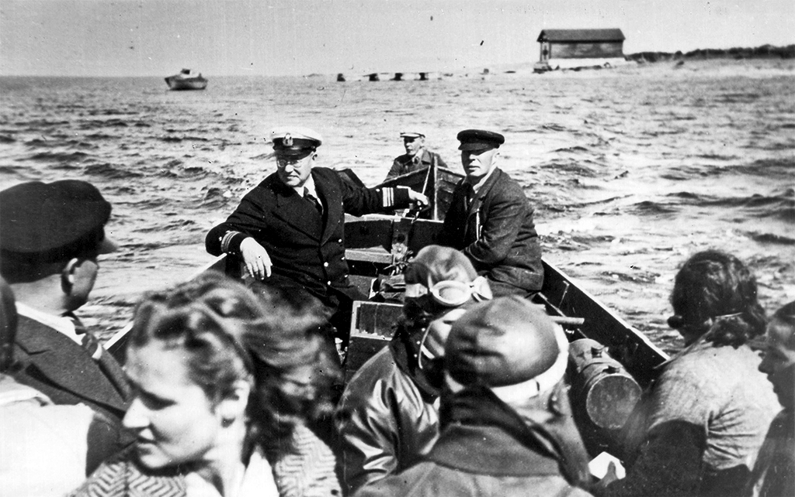
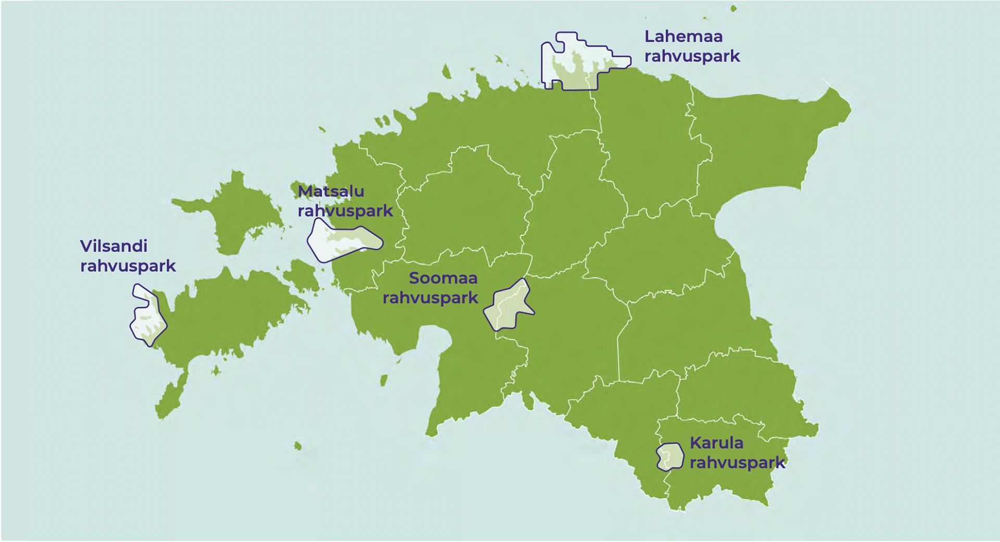

## Kuidas inimesed Eesti looduskeskkonda kasutavad? {.chapter_section .chapter3_section}

```{block, type='authors'}
**[Kalev Sepp](#kalev-sepp) ja [Asko Lõhmus](#asko-lõhmus)**
```

```{block, type='points'}
* Eesti looduses käivad igaüheõiguse alusel aktiivselt ja eri eesmärkidel nii siinsed elanikud kui ka välisturistid, kuid arendada tuleb noorte võimalusi looduses viibida, terviklike turismiklastrite loomist ja turundamist.
```

Enamik inimesi töötab tänapäeval tehiskeskkonnas ning töist viibimist looduses asendab üha rohkem ja mitmekesisemalt sihipärane puhkamine. Looduses viibimise viisid olenevad paljudest asjaoludest, nagu vanus ja tervis, tööst vaba ja lastega veedetav aeg, maastike muutused ja juurdepääs loodusaladele. Neid asjaolusid peab arvestama loodusalade ja asjakohase ettevõtluse planeerimisel.

Juba 1960. aastatel viibis Eesti täiskasvanu keskmiselt kaheksa päeva aastas väljasõitudel loodusesse ([Margus 1974](#Margus1974)). Ligi pool neist tehti loodusandide kogumiseks: enamasti seenel ja marjul käimiseks (30%), harvem kalastamise või jahi eesmärgil (10%). Puhkealadele tehti umbes 45% sõitudest, sealhulgas 25% suplemiseks ja päevitamiseks, 15% väljasõidu ja rahvapidustustest osavõtuna, 10% loodusretkedena. Pool sajandit hiljem, 2008. aastal, pidas 54% Eesti täiskasvanutest end vähemalt hooajati regulaarseks metsas käijaks ja ainult viiendik ei käinud seal üldse, kusjuures populaarseim tegevus oli endiselt korilus või jalutamine, sealhulgas koeraga ([Kaldaru 2008](#Kaldaru2008)). Ootuspäraselt viibisid metsas sagedamini seda omavad või sellega teenistuslikult seotud inimesed. Aastal 2018 polnud 12 kuu jooksul looduses käinud üksnes 15% (2016. aastal 8%) täiskasvanutest, enamik oli käinud korduvalt ([Turu-uuringute AS 2018](#Turu-uuringute2018)). Eeltoodud arvud ei ole küsitlusmetoodika erinevuste tõttu otse võrreldavad, kuid on ilmne, et Eestis püsib looduse sagedase külastamise tava ja vajadus. Eripäraks Põhja- ja Lääne-Euroopa riikidega võrreldes ([Bell jt 2007](#Bell2007), [vrd Kaldaru 2008](#Kaldaru2008)) paistab olevat pingutust nõudvate tegevuste (sportimine, maastikusõit, looduse uurimine) väiksem tähtsus Eesti looduskülastustel.

Artiklis vaatleme, millised on olnud Eesti looduskeskkonna kasutusviisid viimastel aastakümnetel, kuidas tajutakse loodusalade muutusi ning millised on ootused looduskülastustele ja tulevikuperspektiivid.

### Eesti looduskeskkonna avaliku kasutamise alus on igaüheõigus {-.chapter3_section}

Igaüheõigus lubab liikuda loodus- ja kultuurmaastikul olenemata sellest, kellele maa kuulub. Tava pärineb Põhjamaadest ja toetas seal esmalt inimesi, kellel puudus maaomand. Neil võimaldati ühest kohast teise liikuda ja end loodussaadustest elatada, kui see ei häirinud ega kahjustanud kohalikke. Kuigi igaüheõigust on Põhjamaades tunnustatud juba alates keskajast, võeti see mõistena kasutusele 20. sajandil turismi korraldamiseks. Eestis ei ole nii traditsioonilist igaüheõigust ilmselt olnud, sest elanikud olid valdavalt seotud talukohtadega ja paiksed. Siiski leidub igaüheõiguse soovitustes ja normides sarnasusi eestlaste arhailiste eetiliste tõekspidamistega. Igaüheõiguse norme hakati meil kirja panema 1970. aastatel Soome eeskujul ja Keskkonnaministeeriumi töötaja Veljo Ranniku eestvõttel. Aastal 1996 üllitas Keskkonnaministeerium brošüüri „Igaüheõigus“, et ennetada looduses liikujate ja värskete maaomanike vahelisi arusaamatusi. Juhend kirjeldas looduses liikuja õigusi ja kohustusi, rutates ette ja tõlgendades üsna vabalt senist lünklikku õiguslikku korraldust. See avaldati tava loomise lootuses: kui inimesed soovitusi piisavalt kaua teadvustavad, kujuneb neist tavaõigus. Nii on see kaks aastakümmet hiljem ka läinud, kusjuures võõral maal viibimise põhisätted sisalduvad nüüd keskkonnaseadustiku üldosa seaduses.

```{block, type='blockquote-left'}
Eestis püsib looduse sagedase külastamise tava ja vajadus.
```
Seega leiab Eestis üksnes osa avalikust looduskasutusest aset tavatähenduses avalikuks ruumiks peetavatel rohealadel. Ehkki linnainimesele on pargid kõige ligipääsetavamad loodusalad, võivad parkmetsad ja linnalähedased metsad pakkuda hoopis laialdasemaid tegevusvõimalusi. Neid alasid on puhkamiseks mõeldud looduskeskkonnana Eestis ka kõige kauem kujundatud.

Kodukoha looduskasutust täiendab  loodusturism. Selle keskmes on looduselamusi pakkuvad looduskülastused, mis võiksid vastata kohapealsetele ja jätkusuutliku arenguga seotud normidele ([Fredman jt 2012](#Fredman2012)). Looduselamusi võivad pakkuda nii ettevalmistatud alad kui ka avastamine omal käel, aktiivsed tegevused matkamisest kuni looduskaitsetöödeni ning looduses sportimine, osavõtt ühisretkedest ja seikluslaagritest. Loodusturismi teenuseid pakub Eestis ligi 200 ettevõtet ([Consumetric 2008](#Consumetric2008)). Loodusturismile lähedased on ka maa- ja ökoturism.

<div class="casebox">
<h3>Vilsandi – teerajaja loodusturismi sidumisel loodushoiuga</h3>

Aastal 1910 loodi Vilsandi saare majakavahi Artur Toomi eestvedamisel Vaika linnukaitseala, mille külastamine muutus prestiižikaks 1920. aastail. Tegu oli ju noore Eesti Vabariigi kõige läänepoolsema saarega. 1921. aasta juulis otsustasid oma puhkuse Saaremaal veeta riigivanem Konstantin Päts ja poliitik Julius Seljamaa. Artur Toomi enda sõnul: „See riigivanem Pätsi 1921. a külaskäik sai Vilsandi linnukodule õnnistuseks. Sest ajast hakkas kogu asi kiiremalt arenema ja külastajate arv tõusma“ ([Toom 1937, lk 66](#Toom1937)).

Aastal 1927 avati saarel muuseum. Kümme aastat hiljem valmis tuletorni juurde ehitatud 24-kohaline köögi ja muude abiruumidega turistide kodu. Turistide arv nii Eestist kui ka välismaalt jõudis vahetult enne Teist maailmasõda Vilsandil 3000–5000 külastajani aastas.

Loodushoiu ja turismi ühisele arengule aitas kaasa 1938. aastal loodud Loodushoiu- ja Turismi-instituut Sotsiaalministeeriumi haldusalas. Asutusele seati ülesanded korraldada looduskaitset ja järelevalvet avalike parkide üle, valitseda riigiparke, toetada suvituskohtade väljaarendamist, suunata sise- ja välisturismi.

<p class="caption" id="figure311"><span class="figure-number">Joonis 3.1.1.</span> Vilsandi ümbruskonnas on alati käinud palju turiste. Aastal 1939 oli neid vedava paadi roolis kaitseala eestvedaja Artur Toom</p>

```{r, figure311, fig.align='center', out.width='100%', echo=FALSE, message=FALSE, warning=FALSE}



```

</div>
```{block, type='imgsource'}
<span class="imgsource-source">Allikas:</span> Saaremaa muuseum.
```

### Eesti loodus- ja matkarajad pakuvad häid puhkevõimalusi {-.chapter3_section}

Loodus- ja matkaradade eesmärk on võimaldada puhkamist ja loodusega omal käel tutvumist selleks ettevalmistatud kohtades. Osana kaitsealade haldamisest reguleeritakse ühtlasi niimoodi loodusele avalduvat külastuskoormust (häirimist, tallamist, prahistamist). Hästi valitud ja korrapäraselt hooldatavad liikumisteed, ööbimis- ja lõkkekohad ning prügikastid võimaldavad looduspuhkust ka tundlikel aladel, lastele, vanuritele ja erivajadustega inimestele. Esmase taristu rajamine loob majutus-, toitlustus- ja teisi külastusteenuseid pakkuvatele kohalikele kogukondadele tuluvõimalusi, mis mujal maailmas tehtud uuringute kohaselt ületavad investeeringuid pikas perspektiivis vähemalt kümnekordselt.
Looduse õpperadade planeerimise esmaideed ulatuvad Eestis 1930. aastatesse, kuid tegudeni jõuti alles tänu Tartu üliõpilaste looduskaitseringi ja Jaan Eilarti tegevusele. Tartu Ülikooli geograafiadiplomand Kai Kaare kavandas õpperaja Tilleorus (1962) ja Jaan Eilart Neerutis (1964). Esimene rahvusvahelistele nõuetele vastav matkarada avati Keila-Joal 1996. aastal.

Praegu korraldab ja jälgib riigimaal loodus- ja matkaradade kasutamist Riigimetsa Majandamise Keskus (RMK). Aastaks 2017 oli külastustaristuna rajatud 309 kattega lõkkekohta, 223 looduses liikumise rada (kokku 2562 km), 214 matkarada, 59 telkimisala (kokku 425 telkimisvõimalusega objekti), 27 vabalt kasutatavat metsaonni, 20 tasulist ööbimist võimaldavat metsamaja ja kolm maastikusõiduala. Külastuskorraldusega seotud tegevusteks kulutas RMK 2017. aastal kokku 5,3 miljonit eurot (sellest 0,7 miljonit puhkemajandusega teenitud tulust ja Euroopa Liidu sihtfinantseerimisest). RMK veebileht võimaldab külastusvõimalusi eri moel kuvada, sealhulgas näidata eraldi näiteks liikumispuuetega inimestele ligipääsetavaid objekte. Viimaste hulgas on peale lõkke- ja telkimiskohtade üle 20 õppe- ja matkaraja. Siiski on leitud, et loodusturismi piirab Eestis spetsiifilise taristu amortiseerumine (nt 2017. aastal üle poole linnuvaatlustornidest; [Jõks 2017](#Jõks2017)) või turismiklastritega ebapiisavalt seostatud info loodusobjektide kohta.

```{block, type='blockquote-left'}
Eesti keskkonnavaldkondadest oldi 2018. aastal kõige rohkem rahul just loodus- ja matkaradadega.
```
Eesti täiskasvanud elanikkonnast 55% oli 2018. aasta küsitluse kohaselt 12 kuu jooksul külastanud loodus- või matkaradu, sealhulgas 31% vastanutest korduvalt ([Turu-uuringute AS 2018](#Turu-uuringute2018)). Võrreldes 2014. aastaga oli külastajaid 9% võrra ja korduskülastajaid 8% võrra rohkem. Seejuures oldi keskkonnavaldkondadest kõige rohkem rahul just loodus- ja matkaradadega (86% vastajaist pidas olukorda heaks). Sama küsitluse kohaselt on üldse looduses korduvalt käinute hulk siiski palju suurem (73% vastanuist; üldse looduses käinuid 83%). Järelikult on enamiku Eesti inimeste jaoks ettevalmistatud rajad endiselt ainult üks looduses käimise võimalustest.

### Kaitsealade külastajaskond suureneb ja mitmekesistub {-.chapter3_section}

Kõigil RMK majandatavatel ja külastustaristuga varustatud puhke- ja kaitsealadel ning rahvusparkides jälgitakse külastusmahtu, kasutades kohapeal kalibreeritud loendureid. Lisaks teeb RMK iga viie aasta tagant küsitluspõhiselt külastajaprofiili uuringuid. Loendurid näitavad, et külastuste hulk on kümne jälgimisaasta jooksul suurenenud, ulatudes 2017. aastal 2,4 miljoni külastuseni ([RMK 2018](#RMK2018)). See ületab kehtiva looduskaitse arengukavaga aastaks 2020 planeeritud saavutustaset ning on kõrge ka rahvusvahelises võrdluses ([Bell jt 2007](#Bell2007)). Kõige rohkem käiakse Tallinna ümbruse puhkealal, Nõva puhkealal ja Lahemaa rahvuspargis. Seejuures olid varasematel aastatel külastuste sihiks pigem telkimisalad ja lõkkekohad, kuid viimastel aastatel on märgatavalt suurenenud loodus- ja matkaradade külastatavus. Vastavalt suureneb külastuste arv ka enamikus rahvusparkides ([joonis 3.1.2](#figure132)).

RMK viimased külastajauuringud näitavad, et nii 2010. kui ka 2015. aastal käidi looduses kõige rohkem oma pereliikmete või sõpradega ning levinuim tegevus oli looduse vaatlemine. Mõlema uuringu põhjal tuli enim külastajaid Tallinnast, Tartust ja Pärnust, kuid välismaalaste – kõige sagedamini Saksamaalt, Soomest ja Lätist – osakaal on kahekordistunud (2010. aastal 6%; 2015. aastal 13%). Loodusalade külastajate vanuselises jaotuses valdavad noored ja varases keskeas täiskasvanud, suhteliselt kõige vähem on pensioniealisi. Teismeliste arv on samuti väike ja 2015. aastaks pigem veelgi vähenenud (joonis 3.1.3). Aastal 2015 küsitletud külastajatest 85% tundsid, et looduses käies suurenes nende sotsiaalne, vaimne ja füüsiline heaolu, kusjuures enim suurenes vaimne heaolu ([RMK 2018](#RMK2018)). Loodusalade külastajasõbralikkuse teadmispõhiseks kujundamiseks on oluline tervise- ja teisi heaolunäitajaid tulevikus veelgi täpsemalt mõõta ([ten Brink jt 2016](#ten2016)).

### Linnades on palju rohealasid, kuid nende kvaliteet vajab tähelepanu {-.chapter3_section}

2017&#8291;. aasta analüüsi põhjal oli Eestis „väga hea ligipääs“ (kuni 200 m) avalikule rohealale 790 900 inimesel ehk ligikaudu 90%-l tiheasustusaladel elavatest inimestest, mis on võrreldav Rootsi 92%-ga ([Säästva arengu näitajad 2018](#saastva-arengu-naitajad2018)). Rohealade kvaliteeti käsitles põgusalt 2009. aasta inimarengu aruanne, kus toodi mõõdikuna välja elanike rahulolu ning probleemina rohealade killustumine suuremates linnades ja hävimine valglinnastumise tagajärjel linnade ümber ([Peterson 2010](#Peterson2010)). Tallinnas näitab 2009. aasta andmete võrdlus 2017. aasta linnavalitsuse tellitud rahuloluküsitlusega elanike stabiilset (u 80%) rahulolu parkide ja haljasalade piisavuse ja seisukorraga. Sarnane üldhinnang saadi Tartus, kus sedastati isegi rahulolu kasvu aastatel 2006–2016. Tartu andmete täpsem analüüs tõi aga välja, et oma elukoha ümbruses pidas parkide ja haljasalade piisavust ja seisundit väga suureks probleemiks 7% ja (teatavaks) probleemiks veel 30% linnaelanikest (eeskätt annelinlased; elanikegruppidest sagedamini eestlased ja naised). Selline lokaalse probleemina tajumine ei olnud 10 aastaga vähenenud. Ka Tallinnas on lähikonna rohealadega just piirkondlikku rahulolematust, näiteks kesklinnas, Kristiines ja Lasnamäel ([Tuhkanen jt 2018](#Tuhkanen2018)). Siit nähtub, et rahulolu kogu linna tasemel ei ole Eestis rohealade hindamiseks piisav mõõdik.

<p class="caption" id="figure312"><span class="figure-number">Joonis 3.1.2.</span> Riigimetsa Majandamise Keskuse hallatavate loodusobjektide külastus- kordade koguarv ning rahvusparkide külastuskordade arv loenduritel põhineva seire andmetel, 2010–2017</p>

```{r, figure312, out.width='80%', fig.align='center', echo=FALSE, message=FALSE}

library("tidyverse")
library("reshape")

fig312_data1 <- read.csv ("data/31_fig2_data1.csv", header=TRUE, fileEncoding="utf-8", check.names=FALSE)
fig312_data2 <- read.csv ("data/31_fig2_data2.csv", header=TRUE, fileEncoding="utf-8", check.names=FALSE, sep=";")

fig312_data2 <- melt (fig312_data2, id=c("park"))
names(fig312_data2) <- c("park","year","visitors")

fig312_data2$park <- factor(fig312_data2$park, levels = c("Lahemaa rahvuspark","Soomaa rahvuspark","Matsalu rahvuspark","Karula rahvuspark","Vilsandi rahvuspark"))

fig312_data2$year <- factor(fig312_data2$year, levels = c("2010","2011","2012","2013","2014","2015","2016","2017"))

fig312_plot2_labels <- c("Lahemaa\nrahvuspark","Soomaa\nrahvuspark", "Matsalu\nrahvuspark", "Karula\nrahvuspark","Vilsandi\nrahvuspark")

fig312_plot_palette <- c("#b8ddea","#44a1b1","#388085","#8d76ad","#79AC2C","#5B8121","#482683","#2E4111")

  fig312_plot1 <- ggplot(data = fig312_data1) +
    geom_bar(mapping = aes(x=year, y=visitors), fill=fig312_plot_palette, width=0.7, stat="identity", position="dodge") +
    scale_x_continuous(breaks=c(2010,2011,2012,2013,2014,2015,2016,2017))+
    labs(y="Külastuskordade arv (mln)", x="")

  fig312_plot2 <- ggplot(data = fig312_data2) +
    geom_bar(mapping = aes(x=park, y=visitors, fill=year), width=0.7, stat="identity", position="dodge") +
    scale_fill_manual(values=fig312_plot_palette) +
    labs(y="Külastuskordade arv", x="") +
    scale_x_discrete(labels=fig312_plot2_labels)

  fig312_theme <- theme(
      text = element_text(color = "#292b2c"),
      panel.grid.major.x = element_blank() ,
      panel.grid.minor.x = element_blank(),
                 )


print(fig312_plot2 + fig_theme_general + fig312_theme)
print(fig312_plot1 + fig_theme_general + fig312_theme)

#ggsave(path="exported_figures/PDF/chapter3",filename="fig312a.pdf",fig312_plot1 + fig_theme_general + fig312_theme, height=120, width=200, units="mm")

#ggsave(path="exported_figures/PDF/chapter3",filename="fig312b.pdf",fig312_plot2 + fig_theme_general + fig312_theme, height=120, width=200, units="mm")
```

``` {block, type='figure-comment'}
<span class="figure-comment-start">Märkus:</span> Külastuskordade arv sisaldab puhke- ja kaitsealadel nii maastikul paiknevate objektide kui ka külastuskeskustes teavet saanud külastajate arvu (ei sisalda programmides osalejaid) ning Elistvere loomapargi külastusi. Külastuskordade arv ei ole sama mis külastajate arv, kuivõrd üks külastaja võib ala külastada korduvalt.
```

``` {block, type='imgsource'}
<span class="imgsource-source">Allikas:</span> Riigimetsa Majandamise Keskus 2018.
```


```{block, type='blockquote-left'}
Noortele ja vanuritele on linna rohealad peamine looduse kogemise koht.
```
Linna rohealade kasutus on Eestis hooajaline – suvel sagedasem kui talvel. Seejuures on mõne elanikegrupi jaoks, nagu noorukid ja vanurid, linna rohealad üldse peamine looduse kogemise koht ([joonis 3.1.3](#figure313)). Tallinna elanikud peavad veebiküsitluse andmetel ([Tuhkanen jt 2018](#Tuhkanen2018)) peamisteks rohealade väärtusteks puhkeväärtust, elu säilitavat väärtust, teraapilist ja esteetilist väärtust. Kohalike haljasalade kasutamise peamisteks ajenditeks olid teiste inimestega või lemmikloomadega aja veetmine ning oma füüsilise vormi parandamine, millele vastavad oma elukoha lähedusse soovitud rohealade tüübid ([joonis 3.1.4](#figure314)). Rohealade ökosüsteemiteenustest tähtsustati aga kõige rohkem võimalust hingata värsket õhku (94%), rahus ja vaikuses olla (91%) ning looduses jalutada (90%). Asjaolu, et üldiselt hinnatud looduskülastuse aspekte (marjad-seened, kalastamine) ei peeta linnas eriti oluliseks, näitab, kuidas tänapäeva inimene loob tervikliku elukeskkonna eri tüüpi loodusalade kombineerimisel.

*Märkus: „Looduspuhkus 2010“ (N=6231) ja „looduspuhkus 2015“ (N=5489) tähistavad kodumaiseid looduskülastajaid Riigimetsa Majandamise Keskuse 2010. ja 2015. aasta külastajauuringutes; „välisturistid 2015“ (N=764) viimati mainitud uuringus küsitletud välismaalasi ([RMK 2018](#RMK2018)). Marjuliste-seeneliste (N=518) andmed pärinevad 2011. aasta suvel ja sügisel vähemalt ühel korral sel eesmärgil looduses käinute valimist ([Kaldaru 2011](#Kaldaru2011)). Jahimeeste andmed kajastavad 2018. aasta novembri seisuga kõiki Eesti jahimehi (N=15 499, sh 381 naist; Eesti Jahimeeste Selts). Tallinna rohealade külastajate vanuseline profiil koostati 2006. aasta augustis 25-l Tallinnale iseloomulikul ja olulisel rohealal (N=542; graafikul on arvestamata lapsed – 4% üldvalimist; [Järv jt 2006](#Järv2006)).*

<p class="caption" id="figure313"><span class="figure-number">Joonis 3.1.3.</span> Eri tüüpi looduskülastajate vanuseline jaotus Eestis</p>

```{r, figure313, out.width='80%',fig.asp=1.25, fig.align='center', echo=FALSE, message=FALSE}

library("tidyverse")
library("reshape")

 fig313_data <- read.csv ("data/31_fig3_data.csv", header=TRUE, fileEncoding="utf-8", check.names=FALSE)

 fig313_data_melt <- melt (fig313_data, id=c("vanus"))

fig313_data_melt$vanus <- factor(fig313_data_melt$vanus, levels = c("75+","60-74","50-59","40-49","30-39","20-29","15-19"))
fig313_data_melt$variable <- factor(fig313_data_melt$variable, levels = c("Tallinna pargikülastajad","Jahimehed","Marjulised-seenelised","Välisturistid 2015","Looduspuhkus 2015","Looduspuhkus 2010"))

  fig313_plot <- ggplot(data = fig313_data_melt) +
    geom_bar(mapping = aes(x=vanus, y=value, fill=variable), width=0.7, stat="identity", position="dodge") +
    labs(y="%", x="Vanuserühm") +
    coord_flip()  +
    scale_fill_manual(values=c("#b8ddea","#44a1b1","#79AC2C","#5B8121","#8d76ad","#482683")) +
      guides(fill = guide_legend(reverse = TRUE))

  fig313_theme <- theme(
      text = element_text(color = "#292b2c"),
      panel.grid.major.y = element_blank() ,
      panel.grid.minor.y = element_blank(),
                 )

print(fig313_plot + fig_theme_general + fig313_theme)

#ggsave(path="exported_figures/PDF/chapter3",filename="fig313.pdf",fig313_plot + fig_theme_general + fig313_theme, height=200, width=200, units="mm")
```

``` {block, type='imgsource'}
<span class="imgsource-source">Allikas:</span> Autori joonis.
```

<p class="caption" id="figure314"><span class="figure-number">Joonis 3.1.4.</span> Tallinna elanike hinnang eri tüüpi rohealade tähtsusele elukohas</p>

```{r, figure314, fig.asp=.75, fig.align='center', echo=FALSE, message=FALSE, warning=FALSE}

library("tidyverse")
library("scales")


 fig314_data <- read.csv ("data/31_fig4_data.csv", header=TRUE, fileEncoding="utf-8", sep=";",check.names=FALSE)

fig314_data <- melt (fig314_data, id=c("Space"))


fig314_data$Space <- factor( fig314_data$Space, levels = c("Ala, kus ma saan aiatööd teha","Ala väheste puude/põõsastega","Mets","Veekoguäärne roheala","Mänguväljak/tervisespordi ala","Park"))

fig314_data$variable <- factor(fig314_data$variable, levels = c("Ei ole üldse tähtis","Mitte eriti tähtis","Keskmiselt tähtis","Tähtis","Väga tähtis"))

fig314_data$text_position <- fig314_data$value

fig314_data$text_position[which(fig314_data$text_position == 0)] <- NA

fig314_plot <- ggplot(data = fig314_data) +
    geom_bar(mapping = aes(x=Space, y=value, fill=variable), width=0.6, stat="identity") +
    geom_text(mapping = aes(x=Space, y=text_position, label=round(text_position, digits=0)), stat="identity", color="white", position = position_stack(vjust = .5)) +
    coord_flip() +
    scale_fill_manual(values=c("#2b164e","#a28cbc","#5B8121","#79AC2C","#482683")) +
    labs(y="%", x="") +
    scale_x_discrete(labels = wrap_format(20)) +
    guides(fill = guide_legend(reverse = TRUE,nrow=2,byrow=TRUE))

  fig314_theme <- theme(
                    panel.grid.major.y = element_blank() ,
                     panel.grid.minor.y = element_blank(),
                 )

print(fig314_plot + fig_theme_general+ fig314_theme)

ggsave(path="exported_figures/PDF/chapter3",filename="fig314.pdf", height=120, width=200, units="mm")

```

``` {block, type='imgsource'}
<span class="imgsource-source">Allikas:</span> Tuhkanen jt 2018.
```

### Teave inimeste looduskasutuse kohta on lünklik {-.chapter3_section}

Looduskeskkonna avaliku kasutamise korraldamiseks on vaja teada, kuidas inimesed looduses puhkavad: kes kus käivad ja miks, kui kaua nad seal aega veedavad ja nii edasi. Traditsioonilistele tegevustele (marjul- ja seenelkäik, kalapüük) lisandub üha uusi, võimalusi laiendavad temaatilised seikluspargid, ratsa- ja kelgukoerte retked, loodusrajad. Ülevaade neist tegevustest on Eestis piiratud taristuobjektide külastustega ([RMK 2018](#RMK2018)), jahinduse ja kalastamise statistika ning üldise turismistatistikaga, mis ei erista turismiliike. Statistikaameti väliskülastajate uuringus registreeritakse „rohealade külastamist linnades“ (13 tegevuse seas kolmandal kohal), „linnast väljas looduses viibimist omal käel“ ja „linnast väljas looduses viibimist giidi juhtimisel“. Muus osas põhineb teave looduskasutuse kohta üksikuuringutel ja tervikpilt Eestis puudub.

Samal ajal on andmete kogumiseks palju tänapäevaseid võimalusi alates otsestest mõõtmistest (automaatsed loendurid, nt soojus- või liikumisanduritega; sõidukite loendurid; külastajate või piletimüügi registreerimisandmed) kuni kaudse hindamiseni matemaatiliste mudelite abil (nt lähtudes piirkonda puudutavast küsitlusest). Eestis on viimastel aastatel üha laiemalt kasutatud näiteks inimeste ruumilise liikumise hindamiseks passiivse mobiilpositsioneerimise andmeid, mida saab siduda päringutega paljudest teistest andmebaasidest ja sedakaudu uurida looduskülastuste seoseid ilmastiku- ja maastikuoludega. Eri meetodeid kasutatakse tavaliselt kombineerituna.

### Pool elanikkonnast käib marjul või seenel {-.chapter3_section}

Metsadest saadavaid füüsilisi hüvesid seostavad Eesti elanikud kõige sagedamini seente ja marjadega ([Turu-uuringute AS 2018](#Turu-uuringute2018)). Viimane sellekohane esinduslik uuring pärineb 2011. aastast, mil küsitleti tuhandet 15–74-aastast Eesti elanikku. Küsitletuist 52% olid samal suvel ja sügisel metsaande korjanud, seda arvu kogu Eestile üldistades tähendab see vähemalt poolt miljonit inimest ([Kaldaru 2011](#Kaldaru2011)). Neile lisanduvad koos perega metsas käivad lapsed. Kuigi pooled korjajad piirdusid 1–3 käiguga, oli 12% inimesi käinud üle kümne korra ning sagedamini korjati tarbe kui lõbu pärast. Kõige harvem korjasid metsaande noored (33% 15–19-aastastest, 39% 20–29-aastastest), suuremates linnades või Ida-Virumaal elavad ja suurema sissetulekuga inimesed. Suurimas mahus korjati Lõuna-Eestis, maaelanike, pensionäride ja väikese sissetulekuga inimeste poolt. Kogusaak oli hinnanguliselt 5 miljonit liitrit marju ja 8 miljonit liitrit seeni.

```{block, type='blockquote-left'}
Suurimas mahus korjati metsaande Lõuna-Eestis, maaelanike, pensionäride ja väikese sissetulekuga inimeste poolt. Kogusaak (2011) oli hinnanguliselt 5 miljonit liitrit marju ja 8 miljonit liitrit seeni.
```

Elujõuline tava korjata loodusande pole lihtne maarahva pärand, vaid sellel on mitmekesine kujunemislugu. Aja jooksul on kadunud varasemad oskused kasutada söödavaid taimi ikaldusaastate üleelamiseks, hääbumas on arstiabita oludes kujunenud harjumus koguda looduslikke ravimtaimi. Eestis on dokumenteeritud umbes 540 ravimtaimeliigi kasutamine, aga see valik on alates 19. sajandi lõpust üha kitsenenud kodutanumal kasvavatele või kultuuristatud taimedele ([Sõukand ja Kalle 2011](#Sõukand2011)). Aastal 2018 nimetas metsadest saadavate hüvede seas ravimtaimi veel ainult 1% Eesti elanikest ([Turu-uuringute AS 2018](#Turu-uuringute2018)).

Seene- ja marjakorjamise perspektiiv on 20. sajandi jooksul säilitus- ja korjamisvõimaluste paranedes avardunud. Varem polnud maarahval enamiku marjade hoidistamiseks vajalikku suhkrut võtta ning põllutööde kõrvalt jõudsid metsaande korjama eeskätt karjused ja lapsed. Esmalt retseptiraamatud, nüüdisajal ka toidublogid on muutnud kunagise väheolulise leivakõrvase linnastuva ja lugemishimulise rahva jaoks huvitavaks ning pakuvad sellele üha uusi kasutusvõimalusi. Kui iseseisvuse taastamise järel püüti vabaneda nõukogude perioodi mõtteviisist oma tarbeks toitu varuda, siis selle tasakaaluks on ilmunud loodusliku, kohaliku ja tervisliku toidu väärtusvalikud ([Bardone 2016](#Bardone2016)). Pikaajalise linnastumise võõrandavale mõjule viitab siiski see, et Tallinna elanikud käivad seenel ja marjul tunduvalt vähem tarbe pärast kui ülejäänud elanikkond ([Kaldaru 2011](#Kaldaru)).

### Loodusandide korjamist toetavad loodusharidus, liikuvus ja maastiku planeerimine {-.chapter3_section}

```{block, type='blockquote-right'}
Uuringud näitavad selget seost seenel ja marjul käimise ning inimeste liikuvuse vahel.
```

Marjul ja seenel käimise eeldus on vähemalt söödavate, mittesöödavate ja mürgiste liikide eristamine. Eesti looduses leidub hinnanguliselt umbes 400 liiki söödavaid suurseeni, nende kõrval aga ka vähemalt 200 liiki mürgiseid seeni. Seega on laialdase marjul ja seenel käimise traditsiooni hoidmiseks vaja igaühele arusaadavaid määramisjuhiseid. Esmalt anti niisuguseid juhiseid edasi traditsiooniliste oskustena, seejärel üha parema kvaliteediga trükiste kaudu. Hiljuti on tekkinud laialdased võimalused määrata loodusobjekte ka digitaalseid suhtluskanaleid kasutades, mille kriitiline eeldus on usaldusväärsus. Eestis on väga populaarne näiteks 2014. aastal loodud Facebooki leht „Eestimaa seened“, kus on üle 10 000 liikme. Sinna saab postitada nii määramist vajavate seente pilte kui ka (eraldi kataloogi) oma kindla määranguga seenepilte teistele kasutamiseks.

```{block, type='blockquote-left'}
Marja- ja seenekohtade hoidmiseks ja kujundamiseks on vaja selle tegevuse eripära arvestavat maastikuplaneerimist.
```
Uuringud näitavad selget seost seenel ja marjul käimise ning inimeste liikuvuse vahel. Autoomanikud käivad metsas sagedamini ([Kaldaru 2011](#Kaldaru2011)) ning kaugemate marjakohtade kasutuselevõttu 1960. aastatel on seostatud ühistranspordi edenemise ja eraautode suurenenud arvuga ([Bardone 2016](#Bardone2016)). Siiski on kõigi liiklusvahendite kasutamisel tüüpilised (otstarbekana näivad) liikumisraadiused. Näiteks mustikakorjajate puhul on need jalgsi või jalgrattaga kuni 5 km, autoga aga enamasti kuni 30 km ([Remm jt 2018](#Remm2018)).
Marja- ja seenekohtade hoidmiseks ja kujundamiseks on vaja selle tegevuse eripära arvestavat maastikuplaneerimist. Seni on sihipäraselt käsitletud üksnes riiklikult olulisi jõhvikasoid, mida ohustavad turbakaevandamine ja kuivendus. Aastatel 1966–1972 tehti üleriigiline jõhvikasoode inventuur ([Ruus 1975](#Ruus1975)), mille tulemusi kasutati parimate jõhvikasoode kaitse korraldamisel. Sarnast planeerimist teiste metsamarjade ja söögiseente puhul Eestis tehtud ei ole.

### Jahipidamine ühendab loodusharrastuse ja ühiskondliku ootuse {-.chapter3_section}

Jahipidamine on Eestis looduse rekreatiivsetest kasutusviisidest kõige rangemini reglementeeritud. Selleks on vaja jahitunnistust, jahimaad ja jahiluba, jahiviisist olenevalt veel ka suurulukite küttimise või jahikoeraga seotud lube. Rangest korrast hoolimata on jahipidamine olnud laialdane harrastus, mis püsib traditsioonilise ja prestiižsena tänapäevani. Oluliselt on aga muutunud jahinduse roll: selles on järjest olulisemal kohal potentsiaalseid metsa-, põllu- või aiakahjustusi põhjustavate ulukite arvukuse reguleerimine, mida võib käsitleda jahiseltsidele seatud ühiskondliku ülesandena. Selle ülesande täitmine eeldab piirkonniti piisavat jahimeeste arvu, motivatsiooni ja organiseerumist.

Eestis on 15 500 jahimeest, kuid neist 48% on vähemalt 50-aastased ([joonis 3.1.3](#figure313)) ja ainult 2,5% naised. Eesti Jahimeeste Seltsi hinnangul peaks küttimiskohustuste täitmiseks jahimeeste arv just noorte lisandumise kaudu vähemalt kahekordistuma. See kohustus avaldab kaudset survet harrastuslikule jahipidamisele, mille kaudu noored on traditsiooniliselt jahindusse tulnud. Praegu on harrastuseks jäänud peamiselt vaid väikeulukijaht koos koeraga ja harrastaja ei pruugi olla huvitatud jahiseltsi liikmesusest. Soovimatus organiseeruda võib omakorda viia raskusteni jahimaa leidmise ja jahiloa saamisega – niisuguste „maata jahimeeste“ arv on Eestis umbes 3000. Noortele jahihuvilistele väärika väljundi leidmine on Eesti jahinduse tuleviku seisukohalt oluline küsimus.

### Harrastuskalastajate arv on Eestis püsiv {-.chapter3_section}

Kalale lähevad Eesti inimesed esimest korda tavaliselt juba lapsena koos vanematega. Lisaks üldistele looduses viibimise hüvedele pakub harrastuslik kalapüük põnevust, sportlikku hasarti ja muidugi ka toidulisa. Majanduslik aspekt pole seejuures sugugi tähtsusetu: näiteks 2012. aastal püüdsid harrastajad hinnanguliselt kokku 6000 tonni kala ja tegid selleks 77 miljonit eurot kulutusi. Keskkonnaministeeriumi tellitud 2016. aasta küsitluse põhjal oli harrastuspüügi korraldusega pigem rahul 60% ning väga rahul 14% kalastajatest, rahulolematuid oli alla viiendiku.

Keskkonnaministeeriumi tellitud juhuvalimitel põhinenud uuringud (2010 ja 2012) näitasid, et Eesti vähemalt 15-aastaste elanike seas puutub aastas harrastuskalapüügiga kokku (kalastab ise või abistab näiteks paadi juhtimisel või püügivahendi käsitsemisel) iga neljas ning ainult 30% elanikest ei ole üldse kunagi kalastamisega tegelenud. Keskmisest suurem (vähemalt 30%) oli harrastuskalastajate osakaal Lõuna-Eestis ja Virumaal, selgelt väiksem aga Tallinnas (21%). Harrastuskalastajad on enamasti mehed, kusjuures suhteliselt palju on noori (alla 35-aastaseid). Aktiivsed kalastajad (vähemalt 10 püügikorda aastas) on aga sagedamini vähemalt 50-aastased ning mitte-eestlased. Harrastuskalastajate eripära näitab seegi, et üle 20% neist peab kalastamist enda kõige olulisemaks hobiks. Kalastajate meelispaikadeks on väiksemad järved ja jõed (külastanud ligi pooled küsitletuist), veerand kalastajatest on kaardistatud vahenditega käinud Peipsi järvel, 15% Suurel Emajõel. Merel kalastanuid on 18% kõigist harrastuskalastajatest, seejuures populaarseim püügipiirkond on Soome laht (8%).

Harrastuskalastajate arvu muutusi saab jälgida püügilubade statistika põhjal. Eestis peab ka õngpüüniste kasutamiseks olema tasutud püügiõiguse tasu, välja arvatud ühe lihtkäsiõnge puhul. Näiteks 2014. aastal kehtis 95 273 ja 2015. aastal 95 871 püügiluba, kuid 2016. aastal üksnes 90 348 – seda vähenemist võib seletada tol aastal talipüügiks ebasoodsate jääoludega. Et lühemaajalisi lube on ühel isikul võimalik osta aastas mitu, siis ei näita kehtivate püügiõiguste arv otse harrastuskalastajate hulka. Isikukoodide alusel sorteeritud andmete põhjal oli Eestis 2016. aastal 47 865 erinevat tasu eest kala püüdvat isikut, sealhulgas 5361 välismaalast. Arvestades eri tüüpi lube ning liites juurde hinnangu tasuta püügiõiguse omanike kohta võib sedastada, et lube vajaval moel tegeles Eestis harrastusliku kalapüügiga aastatel 2012–2016 umbes 60 000–65 000 inimest.

<p class="caption" id="figure315"><span class="figure-number">Joonis 3.1.5.</span> Harrastuskalamehed Otepääl Vahejärvel 1945. aastal</p>

```{r, figure315, fig.align='center', out.width='100%', echo=FALSE, message=FALSE, warning=FALSE}

knitr::include_graphics("figures/3-chapter/fig315.png")

```

```{block, type='imgsource'}
<span class="imgsource-source">Allikas:</span> Erakogu.
```

<div class="casebox">
<h3>Marjulisel on „oma mets“, mida majandavad teised</h3>

Marjuliste ruumikäitumist uuriti 2017. aastal, küsitledes mustikakorjajaid, kelle seas oli enim Lõuna-Eestis nii oma tarbeks kui ka müügiks korjajad ([Remm jt 2018](#Remm2018)). Uuringust ilmnes kolm asjaolu, mis näitavad, et suhtlusest kohaliku kogukonnaga ei piisa marjametsi säästvate planeeringute tegemiseks.

* Marjulistel on avalikult kasutatavas looduskeskkonnas oma püsivad korjealad, keskmise suurusega 25 hektarit, mille nad kõige sagedamini on ise leidnud või saanud vihje lähimast suhtlusringist (sõpradelt või sugulastelt).
* Koha marjarohkusest ei piisa: eelistatud on hõlpsasti läbitavad riigimetsad teede läheduses. Teadlikumatel korjajatel on mitu erinevat kohta, millest on kasu aastatel, kui mõnes kohas saak ebasoodsa ilmastiku tõttu hävib.
* Marjulised ei eelista kaitstavaid metsi majandusmetsadele, kuigi ⅔ küsitletutest on majandusmetsades pidanud viimase 10 aasta jooksul oma korjekoha raie tõttu hülgama. Vähesed korjajad on sama aja jooksul märganud uute mustikakohtade teket.

Seega on marja- ja seenekohad Eestis kultuuriliselt olulised ja püsivad ning neid tajutakse privaatsetena. See põhjustas näiteks 1990. aastatel probleeme setude jaoks, kelle korjekohad jäid teisele poole riigipiiri ([Runnel 2002](#Runnel2002)). Peamine probleem mustikakorjajate jaoks on korjekohtade raie, mida ei kompenseeri kaitsealad ega uute marjakohtade võimalik tekkimine maastikel. Probleemi lahendamiseks tuleks marjametsade kaitset planeerida moel, mis ei eelda inimestelt oma korjekohtade avalikustamist või kiiret vahetamist.

<p class="caption" id="figure316"><span class="figure-number">Joonis 3.1.6.</span> Mustikate korjamine</p>
```{r, figure316, fig.align='center', out.width='100%', echo=FALSE, message=FALSE, warning=FALSE}

knitr::include_graphics("figures/3-chapter/fig316.png")

```
</div>
```{block, type='imgsource'}
<span class="imgsource-source">Allikas:</span> Joonas Remm.
```

### Kokkuvõte {-.chapter3_section}

Eesti inimeste looduskülastused erinevad nii vanusegrupiti kui ka meeste ja naiste vahel. Tulevikuvaates on tähenduslik alla 20-aastaste noorte sage viibimine rohealadel ning suhteliselt vähene (ja pigem veelgi vähenev) liikumine looduses. Vanuselised erinevused ([joonis 3.1.3](#figure313)) osutavad, et looduse aineliste hüvede kasutamine võib tulevikus väheneda, erandiks on maast madalast algav kalapüügiharrastus. Noorte järelkasvu puudumist jahinduses peavad probleemiks jahindusorganisatsioonid, kes kannavad ühiskondlikku ulukite arvukuse reguleerimise ülesannet. Aastakümnetega võib väheneda ka marjul ja seenel käimine, kuigi see on Eestis varemgi elujõulisena ümber korraldunud ning praegu populaarne ka nooremas ja vanemas keskeas inimeste seas. Eakamate seas eelistavad pensionärid selgelt seenel ja marjul käimist muudele looduskülastustele, kuid liikumisvõime vähenedes jäävad nende peamiseks loodusega kokkupuutekohaks kodukoha rohealad. Eestis üldiselt väga heal järjel olevate loodus- ja matkaradade kasutamine eakate poolt on tagasihoidlik ja nende puhul on looduskülastustest saadavad hüved seotud eeskätt rohealade ning marja- ja seenekohtade kvaliteediga.

Kuigi rohealasid on Eesti linnaruumis palju, jätab soovida nende ühendatus just noortele ja eakatele atraktiivsete keskustega, omavaheline seotus ja pakutavad looduselamused. Oluline oleks lisada rohealadele komponente, mida seni on pakkunud ainult linnavälised loodusalad, ning viimaste puhul omakorda parandada juurdepääsu-, peatumis- ja liikumisvõimalusi. Haljasalade ja parkide mõjulepääsuks ning looduslike elementide sulandamiseks igapäevasesse elukeskkonda tuleks rohelist võrgustikku võimalikult tihendada, ühendades välisruumid omavahel ja asustusaladega, sealhulgas jalg- ja rattateede kaudu. Linna rohealade planeerimisel tuleb silmas pidada elanike peamisi soove – olla seal vaikuses, hingata värsket õhku ja jalutada looduses.

Asjaolu, et loodusobjektid ei ole nende külastajatele tihtipeale põhieesmärk, viitab vajadusele arendada ja turundada terviklikke turismiklastreid, milles loodusturism moodustaks ühe püsikomponendi. Looduskülastuste planeerimisel ja turundamisel tuleb enam eristada sihtgruppe, kes soovivad looduses viibida erineval moel. Välja võiks arendada digitaalsed teenusplatvormid, mis looksid kohalikule kogukonnale ettevõtlusvõimalusi paindlikke toitlustus- ja majutusvõimalusi pakkudes. Riik ja omavalitsused saaksid soodustada selliste teenusklastrite ja -platvormide loomist ja asjakohast haridust.

```{block, type='blockquote-left'}
Looduse aineliste hüvede kasutamine võib tulevikus väheneda.
```
Looduse avaliku kasutuse kohta saadaval olevad andmestikud näitavad sedagi, et statistika inimeste liikumise kohta looduses väljaspool RMK hallatavaid alasid on Eestis lünklik. Näiteks loodusturismi statistika peaks peegeldama loodusturismi olulise eesmärgina inimese ja looduse suhte kvaliteeti, mitte üksnes külastajaarve ja majanduslikku käivet. Looduskasutuse paindlikuks jälgimiseks on olemas tänapäevased meetodid (nt mobiilpositsioneerimine) või digitaalsed võimalused (nt lihtsad loodusvaatluste esitamise platvormid). Marjuliste uuring ([Remm jt 2018](#Remm2018)) näitas seda laadi uuringute võimalusi muu hulgas paremaks maastikuplaneerimiseks, sest kultuurilistel põhjustel inimesed oma liikumisi ise meelsasti ei avalikusta. Kaaluda võiks senisest palju lihtsamaid ja motiveerivad digitaalseid rakendusi, mis ühtlasi aitaksid kaardistada ka inimeste liikumist.

### Viidatud allikad {-.subreferences}

<p id="Bardone2016">Bardone, E. 2016. Meenutusi metsamarjadest. Tähtsusetust toidulisast magusa nostalgiani. – Eesti Rahva Muuseumi aastaraamat, 59, 16–41.</p>

<p id="Bell2007">Bell, S., Tyrväinen, L., Sievänen, T., Pröbstl, U., Simpson, M. 2007. Outdoor recreation and nature tourism: A European perspective. – Living Reviews in Landscape Research, 1 (2), 1–46.</p>

<p id="Consumetric2008">Consumetric 2008. Eesti loodusturismi pakkumise uuring. https://d3otexg1kysjv4.cloudfront.net/docs/2883437_eesti-loodusturismi-pakkumise-uuring.pdf.</p>

<p id="Fredman2012">Fredman, P., Boman, M., Lundmark, L., Mattsson, L. 2012. Research note: economic values in the Swedish nature-based recreation sector – a synthesis. – Tourism Economics, 18 (4), 903–910.</p>

<p id="Jõks2017">Jõks, K. 2017. Eesti vaatetornid, nende seisund ning potentsiaalsed uute vaatetornide asukohad. Bakalaureusetöö. Eesti Maaülikool.</p>

<p id="Järv2006">Järv, O., Silm, S., Ahas, R. 2006. Tallinna rohealade külastatavus ja külastajate hinnangud. Teemaplaneeringu „Tallinna rohealad“ taustauuring. Tartu: Tartu Ülikooli bioloogia-geograafiateaduskond, Geograafia Instituut.</p>

<p id="Kaldaru2008">Kaldaru, H. 2008. Metsa mitmekülgne kasutamine. Elanikkonna, erametsaomanike ja väikeettevõtjate küsitlus. Tallinn: Turu-uuringute AS.</p>

<p id="Kaldaru2011">Kaldaru, H. 2011. Marjade ja seente korjamine elanikkonnas. Tallinn: Turu-uuringute AS.</p>

<p id="Margus1974">Margus, M. (koost.) 1974. Eesti NSV puhkealad. Tallinn: Valgus.</p>

<p id="Peterson2010">Peterson, K. 2010. Elukvaliteedist ja keskkonnast. Keskkond ja avalik huvi. Rohealade väärtus linnakeskkonnas. – Lauristin, M. (toim.). Eesti inimarengu aruanne 2009. Tallinn: Eesti Koostöö kogu, 26–34.</p>

<p id="Remm2018">Remm, L., Rünkla, M., Lõhmus, A. 2018. How bilberry pickers use Estonian forests: implications for sustaining a non-timber value. – Baltic Forestry, 24 (2), 287–295.</p>

<p id="RMK2018">RMK – Riigimetsa Majandamise Keskus 2018. Külastajaseire RMK-s. RMK majandatavate puhke- ja kaitsealad külastatavus, külastaja ja külastus. RMK külastuskorraldusosakond.</p>

<p id="Runnel2002">Runnel, P. 2002. Traditsiooniline kultuur setude enesemääratluses 1990ndatel aastatel. Doktoritöö. Studia Ethnologica Tartuensia 7. Tartu Ülikool. Tartu: Ilmamaa, OÜ Greif.</p>

<p id="Ruus1975">Ruus, E. 1975. Eesti NSV jõhvikasoode inventeerimine. – Reitalu, M. (koost.). Eesti NSV riiklike looduskaitsealade teaduslikud tööd II. Tallinn: Valgus, 120–137.</p>

<p id="Sõukand2011">Sõukand, R., Kalle, R. 2011. Change in medical plant use in Estonian ethnomedicine: a historical comparison between 1888 and 1994. – Journal of Ethnopharmacology, 135 (2), 251–260.</p>

<p id="saastva-arengu-naitajad2018">Säästva arengu näitajad 2018. Tallinn: Statistikaamet.</p>

<p id="ten2016">ten Brink, P., Mutafoglu, K., Schweitzer, J.-P., Kettunen, M., Twigger-Ross, C., Baker, J., Kuipers, Y., Emonts, M., Tyrväinen, L., Hujala, T., Ojala, A. 2016. The health and social benefits of nature and biodiversity protection. A report for the European Commission (ENV.B.3/ETU/2014/0039). London, Brussels: Institute for European Environmental Policy.</p>

<p id="Toom1937">Toom, A. 1937. Kolmkümmend aastat linnukaitset Eestis. – Vilbaste, G. (toim.). Looduskaitse I. Tallinn: Riigiparkide Valitsuse Kirjastus, 63–69.</p>

<p id="Tuhkanen2018">Tuhkanen, H., Kuldna, P., Uustal, M. 2018. Linna ökosüsteemiteenused Tallinna näitel. Tallinn: NATTOURS.</p>

<p id="Turu-uuringute2018">Turu-uuringute AS 2018. Eesti elanike keskkonnateadlikkuse uuring.</p>
