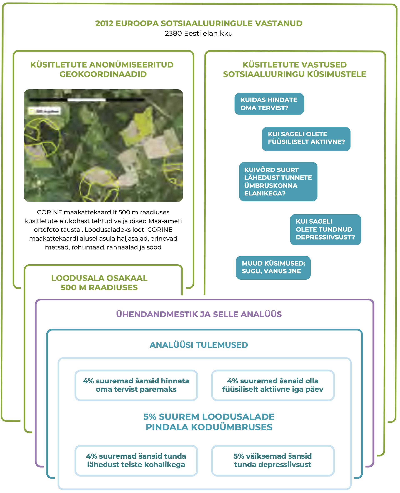
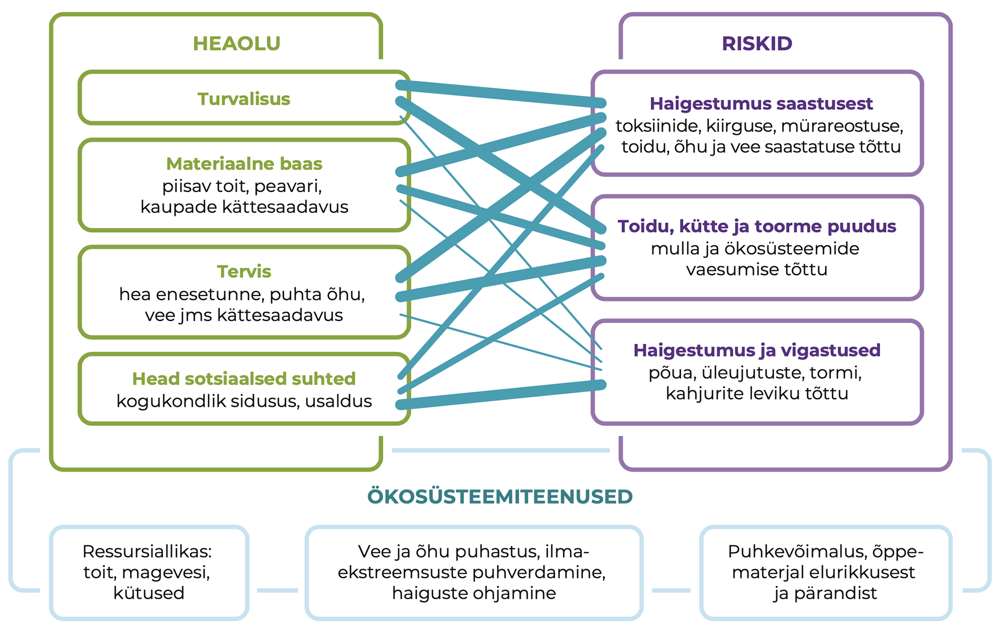
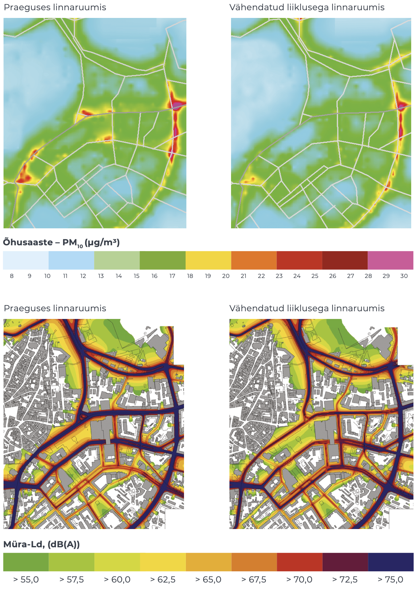

## Loodusalade mõju inimeste heaolule {.chapter_section .chapter3_section}

```{block, type='authors'}
**[Kati Orru](#kati-orru), [Mait Lang](mait-lang) ja [Hans Orru](#hans-orru)**
```

```{block, type='points'}
* Koduümbruse rohealad parandavad Eesti inimeste elukvaliteeti, kuid avaliku ruumi kujundamisel nende tervise- ja sotsiaalset mõju sihipäraselt ei arvestata.
```

Loodusalad pakuvad inimestele võimalust olla füüsiliselt aktiivne, ammutada positiivseid elamusi ja teadmisi, lõõgastuda ja vaimselt taastuda. Maastikel ja nende avalikult kasutatavatel osadel on oluline osa kultuuri, identiteedi ja ühtekuuluvustunde kujundamisel. Need hüved ei pruugi olla linnastunud inimestele enam lihtsasti kättesaadavad. Lisaks saastunud elukeskkonna otsestele tervisemõjudele vähenevad linnastuvas ühiskonnas näiteks kogemused loodusjõududega toimetulemiseks.

```{block, type='blockquote-right'}
Hoolimata kasust heaolule ja tervisele, teadvustatakse loodusala tervistatavat mõju Eestis vähe.
```
Käesolevas peatükis selgitame, milline on Eestis kodulähedase looduse seos inimese vaimse ja füüsilise tervisega, kuidas seda arvestatakse loodusalade kujundamisel ning kuidas arendada inimeste võimet looduse ootamatustega toime tulla. Keskkonnaõigluse ühe aspektina võib lähilooduse tervistav mõju olla suhteliselt olulisem just vähem kindlustatutele ([Chiabai jt 2018](#Chiabai2018)), see tähendab, avalikult kasutatavad elukohalähedased loodusalad võivad vähendada lõhet erineva sissetulekuga inimeste tervisenäitajates. Hoolimata selgest kasust heaolule ja tervisele, teadvustatakse loodusala tervistavat mõju Eestis vähe. Näiteks 2018. aasta Eesti elanike keskkonnateadlikkuse uuringu alusel teadvustas metsade tervistavat mõju vaid 7% Eesti elanikkonnast ([Turu-uuringute AS 2018](#Turu-uuringute2018)).

Elukoha tervisemõju varasemad uuringud Euroopas, sealhulgas Eestis, kinnitavad, et näiteks õhusaaste halvendab inimeste tervist ja vähendab oodatavat eluiga nii maal kui ka linnas ([Orru jt 2016b](#Orru2016)). Inimese sotsiaalset tausta ja terviseseisundit arvesse võttes vähendab isegi vähene õhu saastatus oluliselt hinnanguid heaolule. Teistes riikides on selgitatud, et loodusalade lähedal elavatel inimestel on vähem hingamisteede ja südame-veresoonkonnahaigusi ja vaimse tervise häireid ning neil on tugevam immuunsüsteem ([WHO 2017](#WHO2017)). Neis uuringutes on paremaid tervisenäitajaid seletatud muu hulgas sellega, et loodusalade lähedus soosib inimeste füüsilist aktiivsust ja loob suhtluskeskkonna. Näiteks Hollandis veedavad lapsed, kelle kodust 500 m raadiuses on ühe elamu kohta vähemalt 75 m2 roheala, 15% rohkem aega õues mängides, keskmiselt 1,5 tundi nädalas (<a href="https://home.kpmg/nl/nl/home.html">www.kpmg.nl</a>).


### Loodusalade pindala seos Eesti täiskasvanute tervisehinnangutega {-.chapter3_section}

Eesti asulates on üldiselt hea ligipääs rohealadele. Aastal 2013 elas 57% väiksema ja keskmise suurusega linnaliste piirkondade elanikest rohealadest jalutuskäigu kauguses (400 m) ([Roose jt 2013](#Roose2013)). Käesoleva artikli autorid uurisid, kuidas mõjutab loodusalade pindala kodust 500 m raadiuses inimeste hinnanguid oma tervisele, depressiivsusele, füüsilisele aktiivsusele ja lähedusele kohalikega. Kasutasime Euroopa sotsiaaluuringu 2012. aasta esinduslikku valimit 2380 Eesti täiskasvanu sotsiaalsetest ja terviseteguritest. Nende koduümbruse kirjeldamiseks kasutasime elukoha koordinaate ja Euroopa Keskkonnaagentuuri hallatava projekti CORINE (https://land.copernicus.eu/pan-european/corine-land-cover) käigus loodud 2000. aasta maakattekaarti, mida on ka teistes teadusuuringutes kasutatud inimese tegevusruumi ja loodusega kokkupuute kirjeldamiseks. Selgus ([joonis 3.2.1](#figure321)), et loodusalade suurenedes ainuüksi 5% võrra tõusid keskmiselt 4% võrra ka šansid pidada oma tervist heaks (šansside suhe 95% usaldusnivool 1,01–1,07), tunda lähedust ümbruskonna elanikega (1,01–1,06) ja olla füüsiliselt aktiivne (1,01–1,06). Viimane võib kaasa aidata südame-veresoonkonnahaiguste kontrolli all hoidmisele. Šanss tunda depressiivsust aga vähenes 5% võrra (0,94–0,98), mis kinnitab mujal maailmas saadud uurimistulemusi loodusalade võimalikust stressi leevendavast mõjust.

Kontrollisime seoseid ka eraldi

1) Tallinnas ja Tartus, kus rohealade osakaal linna üldpindalast oli keskmiselt 8,5%, ning
2) väiksemates linnades, eeslinnades ja maapiirkondades, kus loodusalasid on rohkem (keskmiselt 17,7%).

Rohealade pindala seos kõigi heaolu- ja tervisenäitajatega kehtis üksnes väiksemates linnades ja maal. Ka Tallinnas ja Tartus hindasid rohealade läheduses elavad inimesed oma tervist paremaks ja tundsid sagedamini lähedust ümbruskonna elanikega, kuid selget seost ei olnud füüsilise aktiivsuse ja depressiivsuse kujunemise või ärahoidmisega. Seost rohealade läheduse ning inimese füüsilise aktiivsuse ja depressiivsusega kinnitavad siiski uuringud teistes maailma linnades ([Barton jt 2016](#Barton2016); [2017](#Barton2017)). Eesti analüüsis ilmnenud nõrk seos võib olla tingitud andmete enesehinnangulisest olemusest, mis ei pruugi täiel määral kattuda inimese objektiivsete liikumisharrastuste või psühholoogilise tervise näitajatega. Edasised uuringud peaksid neid seoseid ja piirkondlikke erisusi selgitama ning täpsustama loodusalade pindalaga seotud põhjuslikke seoseid. Näiteks võivad alternatiivsed treeninguvõimalused või võimalus käia maakodus või looduskeskkonnas vähendada rohealade tähtsust suuremate linnade elanike liikumisharjumustes. Ilmselt olenevad liikumisvõimalused ka sellest, kui hea planeeringuga (müravaba) ja heakorrastatud on park või roheala.

<p class="caption" id="figure321"><span class="figure-number">Joonis 3.2.1.</span> Koduümbruse loodusalade pindala ning heaolu- ja tervisenäitajate analüüs ning tulemused</p>

``` {block, type='figure-comment'}
<span class="figure-comment-start">Märkus:</span> Šansid on arvutatud logistilise regressiooni mudelites, mis võtsid arvesse soo, vanuse, haridusaastad ja tunnetatud toimetuleku praeguse sissetuleku juures. Oma tervist hinnati 5 palliskaalal, teisendades „heaks“ väärtused 4–5. Füüsilist aktiivsust vähemalt 20 minutit viimase 7 päeva jooksul hinnati 8 palli skaalal (8 = iga päev). Väidet, et tunnen lähedust ümbruskonna elanikega, hinnati 5 palli skaalal, kus 1 on „täiesti nõus“ ja 5 „ei ole üldse nõus“ (teisendus „nõus“ on väärtused 1-2). Depressiivsuse tundmist viimase nädala jooksul mõõdeti 4 palli skaalal, millest uuriti väärtust 1 („mitte kunagi“).
```

```{r, figure321, fig.align='center', out.width='90%', echo=FALSE, message=FALSE, warning=FALSE}



```

``` {block, type='imgsource'}
<span class="imgsource-source">Allikas:</span> CORINE 2000; Euroopa sotsiaaluuring 2012.
```

### Loodusaladest saadavat tervisekasu ei arvestata planeerimisel piisavalt {-.chapter3_section}

```{block, type='blockquote-left'}
Loodusaladest saadavat kasu mõõdetakse ärahoitud enneaegsete surmadega, haigestumuse ja haiglaraviga ning haigekassa tegemata kulutustega.
```

Loodusaladest saadavat kasu mõõdetakse ärahoitud enneaegsete surmadega, haigestumuse ja haiglaraviga ning haigekassa tegemata kulutustega. Neid tagajärgi kujundavad loodusala funktsioonid, mis avalduvad inimesele ökosüsteemiteenuste või hüvedena: näiteks tulvavee adsorbeerimine ja puhastamine, asulasisene liikumiskoridor või võimalus kohaliku loodusega tutvuda ([joonis 3.2.2](#figure322)). Loodusala funktsioone määravad omakorda ökosüsteemi omadused. Näiteks asulate kuumasaare probleemi leevendamisel on eriti väärtuslikud lehtpuudega rohealad, kuid õhusaastet püüavad paremini okaspuud, komplekssema lehestikuga puud või mitmekesised roheseinad ([Chiabai jt 2018](#Chiabai2018)).

<p class="caption" id="figure322"><span class="figure-number">Joonis 3.2.2.</span> Ökosüsteemiteenused kujundavad avalikult kasutatava loodusala toimimist inimeste heaolu ja riski allikana</p>

```{r, figure322, fig.align='center', out.width='90%', echo=FALSE, message=FALSE, warning=FALSE}



```

``` {block, type='imgsource'}
<span class="imgsource-source">Allikas:</span> Autorite joonis.
```

Ökosüsteemi funktsioonide tagamine on kõige keerulisem tiheasustusala ruumikonkurentsis. Maailma eri linnades on püütud leida multifunktsionaalseid looduspõhiseid ruumilahendusi, et vähendada saastet ja müra kesklinnas ning võimaldada aktiivset liikumist. Tuntud näiteks on Cheonggyecheon Soulis, kus kuivendatud ja automagistraaliks muudetud jõesäng pöörati 2005. aastal tagasi rohe- ja puhkealaks. Ka Eestis on häid näiteid elukeskkonna ja aktiivse liikumise võimaluste loomisest: rannapromenaadid Pärnus (2006) ja Haapsalus (2010), Raadi mõisaalade ühendamine Tartu kesklinnaga (2016).

Ruumilise planeeringu tervisekasu hindamiseks kasutatakse metoodikat, kus tervisemõju muutust prognoositakse lähtuvalt praegusest ja tulevasest keskkonnateguritega kokkupuute ja tervisemõju seosest (doos-vastus-seos) ning kokkupuute või füüsilise aktiivsuse muutusest. Selleks mõõdetakse või modelleeritakse õhusaaste, müra või muu taolise keskkonnateguri tasemed (olemasolev olukord) ning seejärel luuakse erinevate tulevikustsenaariumide mudelid. Seejärel võetakse aluseks praeguse haigestumuse või suremuse tase ning doos-vastus-seose kaudu (nt kui palju muutub suremus iga mikrogrammi saasteaine ühiku kohta) prognoositakse elanikkonna haigestumuse või suremuse muutus tulevikus.
Seda metoodikat on Eestis rakendatud näiteks Tallinna Peatänava 2016. aasta arhitektuurikonkursi parima lahenduse analüüsil, kus uuriti, mil määral roheala suurendamine ja liikluse piiramine Tallinna südalinnas vähendaks müra ja parandaks õhukvaliteeti ([joonis 3.2.3](#figure323)). Praegu põhjustab sealne õhu saastatus ja müra aastas hinnanguliselt 30 enneaegset surma. Kui Pärnu ja Narva maantee algusse jääks vaid üks sõidurida kummaski suunas ning ühissõidukite rida, väheneks enneaegsete surmade arv Tallinna südalinnas umbes 4% võrra aastas valdavalt heitgaaside, aga ka teetolmu ja müra vähenemise tõttu ([Orru jt 2016a](#Orru2016)). Müra ja saaste vähenedes suureneb ka inimeste tahe tänaval viibida ja sedakaudu elanikkonna füüsiline aktiivsus. Jalakäijate loendus ning Google Street View vaadete tõlgendamine näitas, et Peatänaval liikus päevas umbes 6000 jalakäijat, kelle füüsiliselt aktiivseks ajaks hinnati keskmiselt 15 minutit. Selline aktiivsus hoiab ära keskmiselt kolm enneaegset surma aastas.

Niimoodi mõõdetud tervisekasu või -kahju on võimalik ümber arvestada ka rahasse. Näiteks on välja arvutatud, et Londoni kesklinna rohealad vähendavad tervisekahju ja kulutusi Suurbritannia haigekassale hinnanguliselt 1,82 miljoni naela väärtuses (<a href="https://www.gov.uk/government/organisations/natural-england">Natural England</a>). Hollandi loodusalade suurendamine praeguselt 13,9%-lt territooriumist 10% võrra aitaks aastas ära hoida ligikaudu 84 000 perearsti poole pöördumist ja säästa 65 miljonit eurot haigekassa kulutustelt (<a href="https://home.kpmg/nl/nl/home.html">www.kpmg.nl</a>).

<p class="caption" id="figure323"><span class="figure-number">Joonis 3.2.3.</span> Tallinna kesklinna peenosakeste (PM10) aasta keskmine sisaldus (μg/m3) ja müratase (dB(A)) päeval (Ld 7.00–23.00)</p>

```{r, figure323, fig.align='center', out.width='90%', echo=FALSE, message=FALSE, warning=FALSE}



```

``` {block, type='imgsource'}
<span class="imgsource-source">Allikas:</span> Orru jt 2016a.
```

### Inimesed seisavad silmitsi loodusalade nõrgenenud puhverdusvõimega {-.chapter3_section}

Rohealad puhverdavad kliimamuutustest inimeste heaolule tingitud ohtusid, mida Eestis ennustatakse metsatulekahjude, paduvihmade ja tormikahjustuste tõttu suurenevat. Muu hulgas püüavad rohealad kinni liigse sadevee, vähendavad tormituulte laastavat mõju ning leevendavad kuumasaare efekti ([Demuzere jt 2014](#Demuzere2014)). Ka kuumapäevadel, mil ööpäeva keskmine temperatuur ei lange alla 21 kraadi, suurenevad terviseriskid. Aastatel 1980–2015 suurenes kuumaga seotud enneaegsete surmade arv Eestis 2,4 korda, eriti märgatavalt krooniliste haigustega inimestel, eakatel ning Ida- ja Kesk-Eestis ([Orru jt 2018](#Orru2018)). Nende ohtude vähendamiseks on asulates olulised nii (puudega) rohealad kui ka veekogud, kuid suure arendushuvi ja lünkliku planeerimisvõttestiku tõttu on surve selliste alade vähenemiseks Eestis tugev ([Poom ja Sepp, käesolev kogumik](#chapter33)).

```{block, type='blockquote-right'}
Muu hulgas püüavad rohealad kinni liigse sadevee, vähendavad tormituulte laastavat mõju ning leevendavad kuumasaare efekti.
```
Keskkonnamuutuste ja äärmuslike ilmaoludega toimetulekul on lisaks loodusala ligipääsetavusele tähtis ka looduskogemustest saadud stabiilsuse ja turvalisuse tunne ([Clayton jt 2017](#Clayton2017)). Keskkonnaprobleemide keerukaid seoseid heaolu ja tervisega on kergem mõista inimestel, kes sellega elukoha või töö kaudu otse kokku puutuvad. Euroopa riikide võrdluses on keskkonnahoiu väärtustamine paranenud seal, kus inimesed on juba kogenud kuumalaineid linnades või maastikupõlenguid ([Orru ja Lilleoja 2015](#Orru2015)). Eesti nende riikide hulka ei kuulu ja keskkonnahoiu väärtustamine on meil pigem vähenenud. Kantar Emori küsitlusuuring Eesti inimeste seas näitas, et ⅔ peavad tõenäoliseks erakordsetest ilmaoludest tekitatud ning 40% ulatusliku metsa- ja maastikutulekahju tekitatud hädaolukordasid, ent nendega toimetuleku oskustes on kindlad vastavalt 51% ja 25% elanikest ([Kantar Emor 2017](#Kantar2017)).

Looduses toimetuleku oskusteta ja geograafiliselt piiratud toetusvõrgustikuga ühiskonnagrupid muretsevad rohkem oma keskkonnamuutustest tingitud haavatavuse pärast, Eestis on need tüüpiliselt linnainimesed ja venekeelne elanikkond ([Orru jt 2018](#Orru2018)). Maapiirkondades ollakse loodusjõudude tekitatud ebamugavustega (nt elektrikatkestus) rohkem harjunud ning paremini valmis mõnda aega oma toidu ja kütte varal toime tulema. Sarnase valmisoleku hoidmiseks linnades on oluline, et avalik ruum võimaldaks inimestel ka seal loodust kogeda.

### Loodusalade potentsiaal avaneb hariduse kaudu {-.chapter3_section}

Looduskogemuse vähenedes kitseneb mugavustsoon, eriti noorte puhul. Kuigi noortel võivad olla head teoreetilised loodusteadmised (OECD haridusstatistika PISA 2017 alusel on Eesti õpilaste loodusteaduslike teadmiste tase maailma riikide seas 3. kohal), siis praktilised looduskogemused vähenevad. Noorte kokkupuude virtuaalse keskkonnaga ületab mitmekordselt looduses viibimise aja ja nad eelistavad keskkondi, mida saavad kontrollida ([Davis 2014](#Davis2014)). Ometi on uudishimust ja avastamisrõõmust juhitud mäng looduses oluline laste normaalse riskitaju kujunemisele, suurendab loovust ja otsustusvõimet ning parandab kohanemist ootamatute olukordadega ([Clayton jt 2017](#Clayton2017)). Eestiski populaarsust koguvad kogukonnaaiad on üks näide inimeste püüdest hoida sidet loodusega ka linnakeskkonnas. Neis aedades peetakse näpud-mullas-lõõgastumist, kogukondade ja ka põlvkondade vahelist suhtlemist ning taimekasvatuse kogemuste vahetamist aiasaadustest olulisemakski hüveks ([Kangur 2018](#Kangur2018)).

```{block, type='blockquote-left'}
75% noortest hindab kõrgelt võimalusi viibida looduskeskkonnas. Pool vastanutest tunnevad hirmu – eelkõige metsas äraeksimise ees, aga ka vastikustunnet putukate ja teiste elusolendite vastu.
```
Eesti noorte nn Y-põlvkonna looduskasutusega seotud emotsioone uuriti veebiküsitluse kaudu ([Saar 2015](#Saar2015)). Selgus, et 75% noortest hindab kõrgelt võimalusi viibida looduskeskkonnas. Küsitletud noored väärtustavad lõõgastust, mida pakub looduses üksi või kaaslastega olemine või füüsiline pingutus. Ent pool vastanutest, eriti alaealised, tunnevad hirmu – eelkõige metsas äraeksimise ees, aga ka vastikustunnet putukate ja teiste elusolendite vastu. Need negatiivsed emotsioonid seostuvad linnastumisega (võõrandumisega) ning vähenevad vanuse, kogemuse ja kontrollivõime kasvades.

### Kokkuvõte {-.chapter3_section}

Ligipääs mitmekesistele loodusaladele oma kodu ümbruses pakub Eesti inimestele paremaid võimalusi lõõgastumiseks ja tervise tugevdamiseks. See aitab vähendada tervisenäitajate ebavõrdsust, mis tuleneb sotsiaalsest kuuluvusest või majanduslikest võimalustest. Lisaks soodustab rohelus ka ühiskondlikku läbikäimist ning vähendab seega potentsiaalselt inimgruppide segregatsiooni, mis on kriitiline Eesti tiheasustusaladel ja eeslinnades. Tulenevalt suurenevast survest kasutada loodusalasid teede ja muu taristu rajamiseks on asulate planeerimisel senisest süstemaatilisemalt ja terviklikumalt vaja hinnata loodusalade heaolufunktsioone. Praegu ei ole piisavalt kasutatud võimalusi teha tervise ja heaolu mõju uuringuid Eesti avaliku ruumi ja loodusalade planeerimisel. Loodusalade kättesaadavuse ja kvaliteedi eesmärgid vajavad selget sõnastamist nii riiklikes arengukavades, nagu transpordi ja liikuvuse arengukava aastateks 2021–2030, ning kohalike omavalitsuste arengukavades, nagu Tallinna arengukava 2021+.

Kuigi seoses linnastumisega vähenevad inimeste kokkupuuted looduskeskkonnaga, nõuab muutlik loodus tähelepanu. Arvestades, et Eestis prognoositakse äärmuslike ilmastikunähtuste sagenemist, aitaks parem ligipääs rohealadele vähendada tulvade, tormide ja kuumusega seotud riske inimeste heaolule ja tervisele. Loodushariduse kaudu inimese ja looduse vahelise seose taastamine on üks olulisi viise, et näha loodusalade pakutavate hüvede mõju oma tervisele ja heaolule ning vajadust aidata kaasa sellele, et need hüved säiliksid. Seejuures ei saa loota vaid struktureeritud looduskülastustele, mida pakuvad loodushariduskeskused ja matkarajad – füüsilise ja vaimse tervise hoidmiseks on inimestel vaja vaba juurdepääsu loodusaladele ka linnas. Ühe olulisema tegevussuunana Eestis tuleks loodusalad hõlpsasti kättesaadavaks teha ka linnalastele.

### Viidatud allikad {-.chapter3_section}

<p id="Barton2016">Barton, J., Bragg, R., Wood, C., Pretty, J. 2016. Green Exercise: Linking Nature, Health and Well-Being. London: Routledge.</p>

<p id="Barton2017">Barton, J., Rogerson, M. 2017. The importance of greenspace for mental  health. – The British Journal of Psychiatry, 14 (4), 79–81.</p>

<p id="Chiabai2018">Chiabai, A., Quigora, S., Martinez-Juarez, P., Higgins, S., Taylor, T. 2018. The nexus between climate change, ecosystem services and human health: towards a conceptual framework. – Science of the Total Environment, 635, 1191−1204.</p>

<p id="Clayton2017">Clayton, S., Manning, C. M., Krygsman, K., Speiser, M. 2017. Mental Health and Our Changing Climate: Impacts, Implications, and Guidance. Washington: American Psychological Association, ecoAmerica.</p>

<p id="Davis2014”>Davis, J. (ed.) 2014. Young Children and the Environment: Early Education for Sustainability. Cambridge: Cambridge University Press.</p>

<p id="Demuzere2014">Demuzere, M., Orru, K., Heidrich, O., Olazabal, E., Geneletti, D., Orru, H., Bhave, A. G., Mittal, N., Feliu, E., Faehnle, M. 2014. Mitigating and adapting to climate change: multi-functional and multi-scale assessment of green urban infrastructure. – Journal of Environmental Management, 146, 107–115.</p>

<p id="Euroopa2012">Euroopa sotsiaaluuring – The European Social Survey (ESS) Round 6 2012.europeansocialsurvey.org/data/download.html?r=6.</p>

<p id="Kangur2018">Kangur, L. 2018. Linnaaiandus kui sotsiaalne praktika: Tartu noorte näitel. Magistritöö. Eesti Maaülikool.</p>

<p id="Kantar2017">Kantar Emor 2017. Elanikkonna hädaolukorraks valmisoleku alase teadlikkuse indeksuuring 2017.</p>

<p id="Orru2016">Orru, H., Kaasik, M., Pindus, M., Tamm, T., Kärbla, V. 2016a. Tallinna kesklinna ja Vanasadama vahelise liikumisruumi õhusaaste ja müra muutuste modelleerimine Tallinna uue peatänava rajamisel ning sellest tulenevate tervisemõjude vähenemise hindamine. Tartu Ülikool: Peremeditsiini ja Rahvatervishoiu Instituut.</p>

<p id="Orru2015">Orru, K., Lilleoja, L. 2015. Contextual drivers of environmental values cross-culturally: evidence from Europe between 2004 and 2012. – Studies of Transition States and Societies, 7 (3), 38−51.</p>

<p id="Orru2016b">Orru, K., Orru, H., Maasikmets, M., Hendrikson, R., Ainsaar, M. 2016b. Well-being and environmental quality: does pollution affect life satisfaction? – Quality of Life Research, 25 (3), 699−705.</p>

<p id="Orru2018">Orru, K., Tillmann, M., Ebi, K. L., Orru, H. 2018. Making administrative systems adaptive to emerging climate change-related health effects: case of Estonia. – Atmosphere, 9 (6), 221−240.</p>

<p id="Roose2013">Roose, A., Kull, A., Gauk, M., Tali, T. 2013. Land use policy shocks in the post-communist urban fringe: a case study of Estonia. – Land Use Policy, 30 (1), 76–83.</p>

<p id="Saar2015">Saar, T. 2015. Loodus on hirmutav ja ebamugav: Y-generatsiooni kogemused looduses. Magistritöö. Eesti Maaülikool.</p>

<p id="Turu-uuringute2018">Turu-uuringute AS 2018. Eesti elanike keskkonnateadlikkuse uuring.</p>

<p id="WHO2017">WHO – World Health Organization 2017. Urban Green Space Interventions and Health. A Review of Impacts and Effectiveness. Copenhagen: WHO Regional Office for Europe.</p>
