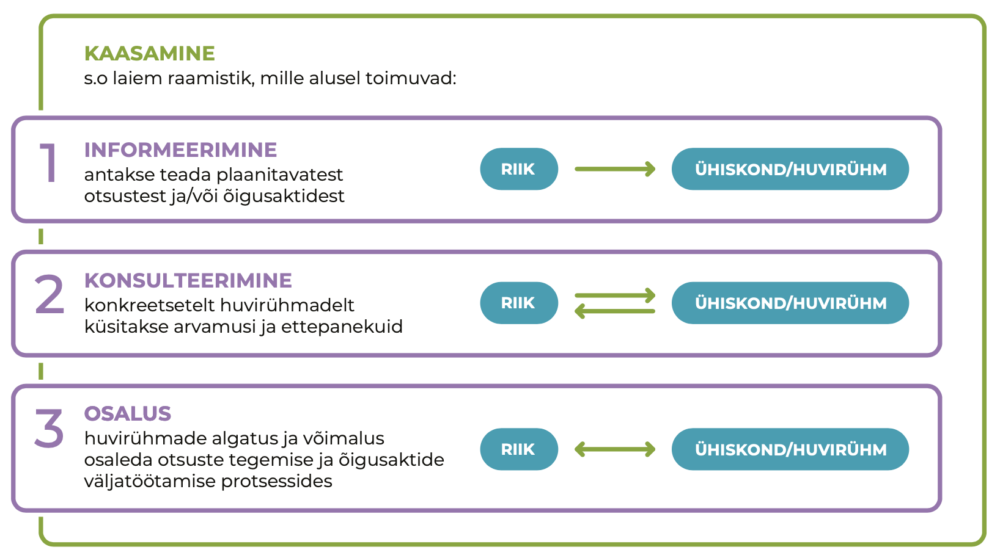
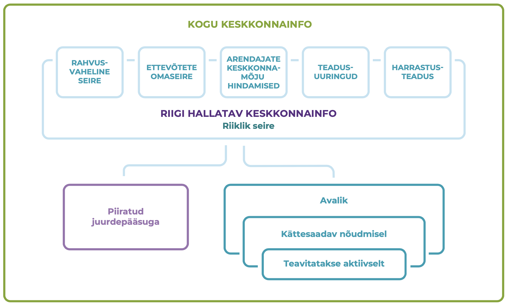
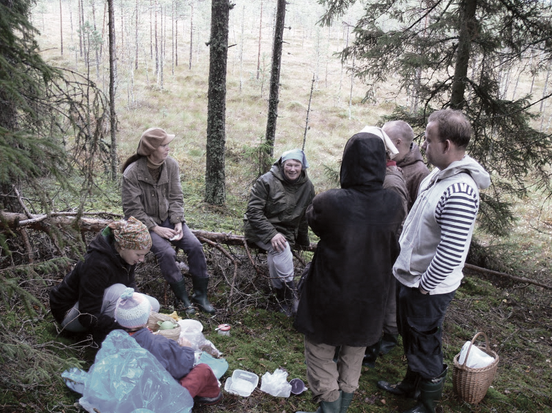

## Kaasarääkimise võimalused loodusalade kasutamisel {.chapter_section .chapter3_section}

```{block, type='authors'}
<div class="author-links">**[Siim Vahtrus](#siim-vahtrus), [Liina Remm](#liina-remm), [Kärt Vaarmari](#kärt-vaarmari)**</div>
<div><a class="print-btn" href="print/EIA-2019-3.3.pdf"><i class="fa fa-file" aria-hidden="true"></i>Trükiversioon</a></div>
```

```{block, type='points'}
* Keskkonnademokraatiat soosib Eestis hea õigusraamistik ning põhjalik keskkonnaandmestik, kuid pärsib elanike pessimism ning teabe ja andmete keerukas esitusviis.
```

Eestis on suur osa looduskeskkonnast vähemalt mingil määral avalikult kasutatav või igaühele ligipääsetav. Keskkonnaotsused mõjutavad seega ka loodusalade avalikku kasutust. Näiteks võib otsus rajada riigimetsa uus kruusakarjäär või lubada soos turba kaevandamist jätta ümbruskonna inimesed ilma harjumuspärasest marjul käimise kohast. Looduslike paikade, sealhulgas looduslike pühapaikade või külakogukondade puhkemetsade kasutust võib piirata ka uue tee või raudtee rajamise otsus. Luba rajada jõe äärde uus tehas, hüdroelektrijaam või muud taolist võib vähendada kalastamise ja suplemise võimalusi või jätta inimesed ilma looduslikest vaatamisväärsustest. Isegi kui keskkonnaotsuse objektiks olevat tegevust kavandatakse üksnes eramaale või avalikust kasutusest väljas olevasse kohta – näiteks uue põlevkivikaevanduse rajamise puhul –, ulatuvad selle mõjud sageli kaugemale näiteks müra, õhusaaste, veereostuse ja liikluskoormuse suurenemise näol.

```{block, type='blockquote-right'}
Isegi kui keskkonnaotsuse objektiks olevat tegevust kavandatakse üksnes eramaale või avalikust kasutusest väljas olevasse kohta, ulatuvad selle mõjud sageli kaugemale näiteks müra, õhusaaste, veereostuse ja liikluskoormuse suurenemise näol.
```

Anname ülevaate, mil määral saavad inimesed keskkonnaotsuste tegemises kaasa rääkida, keskendudes kahele teemale: milline on keskkonnaotsustes osalemise korraldus (võimalus) ja kuivõrd on inimesed harjunud avalikult arvamust avaldama (ühiskondlik aktiivsus). Need aspektid omakorda olenevad sellest, millist teavet inimesed oma keskkonna kohta saavad ja kuidas seda kasutavad.

### 1980. aastate sündmused tingisid Nõukogude Eestis avaliku keskkonnaarutelu {-.chapter3_section}

Nõukogude Liidu perioodil otsustati keskkonnaküsimusi Eestis avaliku dialoogita ja teave keskkonnaohtude kohta oli salastatud ([Kiisel 2005](#Kiisel2005)). Näiteks oli rangelt salastatud aastatel 1946–1991 Sillamäel töötanud strateegilise tähtsusega uraanitehase tegevusega seonduv. Teadmiste puudumine takistas inimestel ka oma elukeskkonnaga seotud keskkonnaprobleemide lahendamisest osavõttu. Lisaks peeti keskkonnakaitset nii üldsuse teadvuses kui ka ekspertide seas teadlaste ja looduskaitseorganisatsioonide kitsalt spetsialiseeritud tegevusalaks, elanikkonda aga pigem looduse reostajaks kui kaitsjaks. Samal ajal oli avalikkus Eesti looduse ohustatuse pärast murelik, mõistis ja hindas teaduslikku kriitilist lähenemist keskkonnaprobleemidele ega usaldanud ametkondlikku optimismi ([Lauristin 1988](#Lauristin1988)).
1987.–1988. aasta rahvuslik protestiliikumine Virumaale kavandatud fosforiidikaevanduste vastu muutis pilti oluliselt. Paari aasta jooksul muutusid avalikkuse osalemisvormid arutelus ja otsustamises ning kujunes välja avalik arvamus, mis oli fosforiidi kaevandamise suhtes negatiivne. Avalikkus tekitas ise oma osalemise võimalused ja poliitilise surve otsustusprotsessile ning saavutaski tulemuse, et kavandatud suuremahuline fosforiidikaevandus jäi rajamata.

Samal ajal hakkasid inimesed nõudma ka keskkonnainfo avalikustamist. Nõukogude Liidus tervikuna hakati keskkonnaohtudest ja -probleemidest avalikumalt rääkima pärast 1986. aasta Tšornobõli tuumaelektrijaama õnnetust. Siseriikliku ja rahvusvahelise surve tulemusena lubas toonane Nõukogude Liidu Kommunistliku Partei keskkomitee peasekretär Mihhail Gorbatšov teha õnnetuse kohta käiva teabe avalikuks. Sellele järgnenud perioodil tunnistasid mitmed riigid keskkonnainfo saamise ja keskkonnaküsimustes avalikkuse kaasamise olulisust. Samal ajal (1984–1987) töötas ÜRO keskkonnakomisjon säästva arengu kontseptsiooni kallal, kirjutades töö lõppraportisse (nn Brundtlandi raport; 1987) esmakordselt sisse vajaduse kaasata ühiskonna eri osapooled keskkonnaotsuste tegemisse. Raport oli hiljem aluseks Rio deklaratsioonile (1992), mis ütleb juba otsesõnu, et „riiklikul tasandil peab igaühel olema asjakohane juurdepääs ametiasutuste käsutuses olevale keskkonnainfole“. Euroopa Liit võttis 1990. aastal vastu direktiivi 90/313/EMÜ keskkonnainfole juurdepääsu vabaduse kohta. Aastal 1998 aastal võeti vastu Aarhusi konventsioon, mis näeb ette igaühe õiguse saada keskkonnainfot ja osaleda keskkonnaasjade otsustamises ning annab neis asjus juurdepääsu õigusemõistmisele.

<div class="casebox">
<h3>Eesti keskkonnademokraatia sünd nn fosforiidisõjas</h3>

Fosforiidikaevanduste planeerimine Virumaale algas Nõukogude Liidu ametkondades juba 1970. aastatel, ent info selle kohta oli avalikkuse eest salastatud. Plaani sisuks oli rohkem kui 10 000 töötajaga hiigelkaevanduse rajamine, mis tähendanuks suurt ohtu põhjaveele ning massiivset võõrtööliste sisserännet. Eesti NSV Teaduste Akadeemias käsitleti plaani 1970. aastate teises pooles, ent laiem avalikkus sai kaevanduse kavandamisest teada 1987. aasta alguses.

1987&#8291;. aasta kevadel korraldasid Tartu tudengid rahumeelseid protestiaktsioone, teemat kajastati teravalt ajakirjanduses. Sellele järgnes 1988. aastal Eesti Rohelise Liikumise sünd ning esimese suure keskkonnateemalise massiaktsioonina roheliste rattaretk „Kuidas elad, Virumaa?“. Rahvakoosolekud toimusid Tallinnas ja Tartus, töö- ja õppekollektiivides korraldati avalikke pressikonverentse ning kohtumisi teadlastega, toimetused ja valitsusorganid hakkasid saama hulgaliselt kollektiivseid kirju, noorte seas levisid spontaansed väljendusvormid levilauludest loosungite ja särkideni. 29. mail 1987 võttis ENSV Ülemnõukogu vastu otsuse, millega pani valitsusele kohustuseks arvestada edasiste uuringute tegemisel praeguse ja tulevaste põlvkondade huvidega maa, maapõue ja veeressursside kaitseks ning teaduslikult põhjendatud ratsionaalseks kasutamiseks.

Protsessi käigus arenesid erinevad avalikkuse osalemise ja demokraatia vormid – teabe avalikustamisele massiteabevahendites ning isikutevahelistele aruteludele lisandusid kohtumised, üldsuse väljaastumised, kollektiivsed kirjad, seejärel hääletamised, küsitlused, arutelud valitavas organis ning lõpuks otsuse vastuvõtmine nõukogude võimu ja avaliku kontrolli organite poolt ([Lauristin 1988](#Lauristin1988)).

<p class="caption" id="figure341"><span class="figure-number">Joonis 3.4.1.</span> Meeleavaldus 19. mail 1987. aastal</p>
```{r, figure341, fig.align='center', out.width='100%', echo=FALSE, message=FALSE, warning=FALSE}

knitr::include_graphics("figures/3-chapter/fig341.png")

```

</div>
```{block, type='imgsource'}
<span class="imgsource-source">Allikas:</span> Postimehe arhiiv, Scanpix Baltics.
```

### Eesti praegune osalemis- ja keskkonnainfo avalikustamise normistik on hea {-.chapter3_section}

Pärast iseseisvuse taastamist vähenes avalik huvi keskkonnaküsimuste vastu märgatavalt. Samal ajal liikus Eesti keskkonnaõigus jõudsalt Euroopa Liidu õigusruumi suunas: 2001. aastal ühines Eesti Aarhusi konventsiooniga ning 2004. aastal sai Euroopa Liidu liikmeks, mis tähendas ka Euroopa Liidu õigusnormide ülevõtmist. Nende normidega tekkis tugev alus keskkonnainfo kättesaadavuse ja osalemisõiguse tagamiseks. Aarhusi konventsiooni nõuded on viidud peamiselt keskkonnaseadustiku üldosa seadusse (KeÜS), mille alusel on igaühel üldjuhul juurdepääs keskkonnainfole ning õigus osaleda olulise keskkonnamõjuga otsuste tegemises.

```{block, type='blockquote-left'}
OECD 2017. aasta Eesti keskkonnatoime ülevaate kohaselt on Eestis keskkonnademokraatia arenenud ja keskkonnainfo kättesaadav.
```
Võrdleva uuringu „Environmental Democracy Index“ kohaselt oli Eesti 2015. aastal maailma riikide pingereas osalemisõigust ja info kättesaadavust käsitlevate nõuete ülevõtmise ja täitmise poolest 70 riigi hulgas 14. kohal ([World Resources Institute 2015](#World2015)). OECD 2017. aasta Eesti keskkonnatoime ülevaate kohaselt on Eestis keskkonnademokraatia arenenud ja keskkonnainfo kättesaadav. Kaks kolmandikku elanikest peab end keskkonnaasjades hästi informeerituks, kuigi info täielikkus ja kvaliteet võiksid olla paremad. Ka keskkonnaasjades osalemise võimalus on OECD ülevaate kohaselt üldiselt tagatud, ehkki juurdepääs õigusemõistmisele (võimalus keskkonnaotsuseid vaidlustada) vajaks veelgi laiendamist. Ühe peamise puudusena tuuakse välja vaidemenetluse (otsuse õiguspärasuse kontroll haldusorganite poolt) vähest tõhusust, mis tuleb sellest, et vaideid lahendavad sageli samad asutused, kes tegid ka vaidlustatud otsuse.

### Avaliku ruumi kujundamisel on avalikkusel üldjuhul õigus kaasa rääkida {-.chapter3_section}

Osalusdemokraatia ja keskkonnaotsuste alused (sh ÜRO 1992. aasta Rio deklaratsioon, Aarhusi konventsioon) lähtuvad põhimõttest, et avalikkusele info jagamisest kaasamiseks ei piisa. Üksikisikutel ja nende ühendustel peab olema võimalus elu- ja looduskeskkonda mõjutavate olulise keskkonnamõjuga otsuste tegemisel kaasa rääkida (KeÜS § 28), see tähendab kasutada riigi poolt kättesaadavaks tehtud infot otsuste aktiivseks kujundamiseks. Otsustusprotsessides osaledes saavad kodanikud omalt poolt riigile ka infot anda. „Olulise keskkonnamõju“ määratleb keskkonnamõju hindamise ja keskkonnajuhtimissüsteemi seadus, näiteks loetakse selle hulka metsamaa raadamist (raiet maakasutuse muutmise eesmärgil) enam kui 100 hektari suurusel alal või pealmaakaevandamist enam kui 25 hektari suurusel alal. Väiksema mõjuga tegevuste puhul ei ole igaühel võimalik otsustamisel osaleda, ent otseselt puudutatud isikutele tuleb anda võimalus arvamust avaldada.
Osalemisvõimaluste andmine sõltub ka otsustamise tasandist ([tabel 3.4.1](#table341)). Õigusnormide kohaselt on avaliku ruumi kujundamises kaasa rääkimise võimalused Eestis üldiselt head. Järgnevalt toome välja need valdkonnad, kus ühiskonna kaasarääkimisvõimalused on vähesed, kuigi huvigruppide soov kaasa rääkida on suur.

```{block, type='blockquote-right'}
Keskkonna otsuste vaided ei ole tõhusad, kuna vaideid lahendavad sageli samad asutused, kes tegid vaidlustatud otsuse.
```
Kohaliku tasandi üksikobjektide planeerimisel on kaasarääkimisvõimalus puudulik maavarade kaevandamise ja metsaraie puhul. Lageraie järel võib metsa taastumine aega võtta terve inimese eluaja, kaevandamisega piiratakse aga juurdepääsu ning kujundatakse loodusala ilme täiesti ümber. Hoolimata olulisest ja pikaajalisest mõjust, ei toimu kummagi tegevuse puhul ruumilist planeerimist ja sellega seotud avalikku arutelu asukohavalikute üle. Seega puudub, erinevalt näiteks linnakeskkonnas uute hoonete planeerimisest, nendes valdkondades nii planeerimise sidusus kui ka kumulatiivse keskkonnamõju analüüs.

Kaevandusalade ja raiete kaasav planeerimine oleks mõistlik. Näiteks Austrias ja Taanis kasutusel olevat maavarade ruumilist planeerimist peetakse ekspertide arvates heaks võimaluseks kaevandusettevõtete ja kohalike inimeste vaheliste konfliktide lahendamisel ([MinPol 2017](#MinPol2017)). Eestis võiks maavarade ruumiline planeerimine anda rahuldava vastuse ka küsimusele, millisest maardlast kaevandades on võimalik mõjud keskkonnale ja inimestele hoida kõige väiksematena. Praegu on uute maardlate kasutuselevõtul juhtiv roll kaevandusettevõtjatel. Metsaraie puhul puuduvad võimalused kaasa rääkida isegi naaberkinnistute omanikel – raie otsustavad vaid Keskkonnaamet ning maaomanik. Riigimetsa Majandamise Keskus (RMK) on alates 2017. aastast kaasanud kõrgendatud avaliku huviga aladel raiete planeerimisse kohalikke elanikke ([Poom ja Sepp, käesolev kogumik](#loodusalade-kujundamine-avalikuks-kasutuseks)). Tegu on aga värske muudatusega ja on praktikat on liiga vähe, et teha järeldusi selle vabatahtliku meetme mõju kohta. 2018. aasta keskkonnateadlikkuse uuring kinnitab ühiskondlikku ootust, et metsaraieid kaalutaks senisest enam ning maaomanike õigused ei oleks sedavõrd ulatuslikud ([Turu-uuringute AS 2018](#4Turu-uuringute2018)).

```{block, type='blockquote-left'}
Kohaliku tasandi üksikobjektide planeerimisel on kaasarääkimis- võimalus puudulik maavarade kaevandamise ja metsaraie puhul.
```
Ka loodusalasid mõjutava poliitika kujundamises on kodanike võimalused kaasa rääkida piiratud, kuigi mõju loodusalade avalikule kasutusele on sageli otsene, eriti transporditaristut, aga ka metsandust ja maavarade valdkonda kavandades. Arengukavade ja teiste strateegiliste otsuste eelnõud koostatakse sageli töörühmades, kuhu kutsutakse vaid valitud huvirühmade (ettevõtjate, teadlaste, keskkonnaühenduste) esindajad. Kui arengukava raames viiakse läbi keskkonnamõju strateegiline hindamine, saavad kodanikud küll osaleda, ent alles pärast strateegiliste valikute langetamist. Kodanike vahetult kaasamata jätmist arengukavade koostamisse on aidanud mõnevõrra tasakaalustada see, et enamasti kaasatakse keskkonnaühendusi, kes esindavad ka kodanikkonna huve.


```{block, type='blockquote-right'}
Loodusalasid mõjutavate projektide puhul on probleem avalikkuse kaasamine alles peale põhimõtteliste otsuste langetamist.
```
Strateegiliste ja riiklike huvidega seotud, loodusalasid mõjutavate projektide puhul on probleem  avalikkuse kaasamine pärast põhimõtteliste otsuste langetamist. Kui strateegilised valikud on juba tehtud, kahaneb kodanike võimalus otsuste sisu mõjutada peamiselt detailide arutamiseks. Seetõttu nõuabki Aarhusi konventsioon, et avalikkust tuleb kaasata varases etapis, kus kõik otsused on lahtised. Näiteks 2017–2018 avalikkuse tähelepanu köitnud Est-Fori tselluloositehase planeerimisel otsustati enne avalikku diskussiooni, et eriplaneeringuga otsitakse tehasele asukohta vaid Emajõe vesikonnas ([Kõnnussaar ja Lõhmus 2018](#Konnusaar2018)). Riigikohus rõhutas asjas 3-17-2132 tehtud määruses küll, et planeeringuga uuritava ala kitsendamine protsessi alguses ei tähenda, et hiljem ei saaks põhimõtteliselt kaaluda tehase rajamist mujale. Planeeringumenetluse enneaegse lõpetamise tõttu ei ole aga teada, kas riik oleks ka praktikas selleks valmis olnud.

<p class="caption" id="table341"><span class="figure-number">Joonis 3.4.1.</span> Eesti keskkonnaotsuste jaotus otsustustasandi ja laadi alusel ning kodanike võimalused neis olukordades kaasa rääkida</p>

<div style="overflow-x:auto;">
<table id="table_341" style="width:100%">

  <tr>
    <th colspan="5" class="table_341_blank">OTSUSE LIIK</th>
  </tr>

  <tr>
    <th class="table_341_blank"></th>
    <th class="table_341_blank"></th>
    <th class="table341_green">Üksikobjekti kavandamine</th>
    <th class="table341_green">Ruumiline planeering</th>
    <th class="table341_green">Poliitika/ strateegia</th>
  </tr>

  <tr>
  <th rowspan="3" class="table_341_blank table_341_vertical">RUUMILINE ULATUS</th>
    <th class="table341_dark_green">KOHALIK</th>
    <td class="table341_purple">Erinevad load, nt:<br>
• vee erikasutuseks<br>
• kaevandamiseks<br>
• metsaraieks<br>
• hoonete rajamiseks
Detailplaneeringud</td>

  <td>Üldplaneeringud</td>
  <td>Arengukavad, nt:<br>
• kohaliku omavalit- suse arengukava<br>
• jäätmehooldus- kava<br>
• ühisveevärgi arendamise kava</td>
</tr>

  <tr>
    <th class="table341_dark_green">REGIONAALNE</th>
    <td>Erinevad regionaalse tähtsusega taristuobjektid, nt:<br>
• elektriliinid<br>
• maanteed<br>
• raudteed<br>
• jäätmekeskused</td>

  <td>Maakonnaplaneering</td>
  <td>Piirkondlikud kavad, nt piirkondlikud arengukavad, arengustra- teegiad</td>
</tr>

  <tr>
    <th class="table341_dark_green">RIIKLIK</th>
    <td class="table341_purple">Üleriigilise tähtsusega objektid, nt:<br>
• suursadamad<br>
• põhimaanteed<br>
• kaitseväe harjutus- väljakud<br>
• suurtehased</td>

  <td>Üleriigiline planeering</td>
  <td class="table341_purple">Riiklikud arengukavad ja strateegiad, nt:<br>
•&nbsp;maapõuepoliitika põhialused<br>
• looduskaitse arengukava<br>
• metsanduse arengukava</td>
</tr>

</table>
</div>

``` {block, type='figure-comment'}
<span class="figure-comment-start">Märkus:</span> Lillaga märgitud otsuse liigid, milles osalemise võimalused on (teatud otsuste puhul) piiratud.
```

```{block, type='imgsource'}
<span class="imgsource-source">Allikas:</span> Autorite joonis.
```

### Hoolimata õigusest osaleda on Eesti elanikud passiivsed ja pessimistlikud {-.chapter3_section}

Kaasarääkimise õigus ei taga kvaliteetset ja eesmärgipärast osalemist keskkonnaotsuste tegemisel. Eesti elanike suhtumist keskkonnaotsustes osalemisse iseloomustavad pigem passiivsus ja pessimism. 2018. aasta keskkonnateadlikkuse uuringus ([Turu-uuringute AS 2018](#4Turu-uuringute2018)) pidas peaaegu pool (46%) vastajatest kaasarääkimise võimalust ebaoluliseks. Seda võimalust hindasid rohkem kõrgharidusega inimesed, samuti suurema sissetulekuga inimesed.

Veelgi passiivsem on osalemine praktikas. Kohaliku omavalitsuse tasandil pidas oma võimalusi kaasarääkimiseks heaks alla 10% vastanutest, riigi tasandil alla 5%. Kõige väiksemaks peavad oma osalusvõimalusi Kirde-Eesti elanikud. Peamiste takistustena tuuakse välja vähest usku oma osaluse mõjukusse (21% vastanutest) ja ajapuudust (19%) ([samas](#4Turu-uuringute2018)). Need tulemused ühtivad üldjoontes Keskkonnaõiguse Keskuse uuringuga Eesti elanike keskkonnaõigusealase teadlikkuse kohta ([Uuringukeskus Klaster 2013](#Uuringukeskus2013)).

Uuringud ([Suškevič 2014](#Suškevičs2014); [Uuringukeskus Klaster 2013](#Uuringukeskus2013)) toovad välja pessimistliku suhtumise olulisemad põhjused.

1. Probleemid info levitamise kanalite laadi ja sisuga. Ühepoolsed suhtluskanalid, mida enamasti kasutatakse (ametlikud teadaanded, ajalehed, internetileheküljed jne) ei ole osalejate seisukohast parimad, eelistatavad on kahepoolsed suhtluskanalid (nt näost näkku kohtumised). Otsustusprotsesside kohta levitatav info on sageli tavakodanikele raskesti arusaadav nii väljendusviisi kui ka kodanike väheste eelteadmiste tõttu.

2. Avalikkust kaasavate ametnike suhtumine. Paljud ametnikud ei mõistnud 2014. aastal kaasamise olulisust ja kasu. Eestis kui tüüpilises Kesk- ja Ida-Euroopa siirdeühiskonnas on passiivsed nii kodanikud kui ka ametnikud. Viimased peavad oluliseks tehnilist ja loodusteaduslikku sisendit ning riigisektori huvi. Kuna kaasamisest kardetakse sageli pigem ebameeldivusi ja ajakulu, eelistatakse täita „miinimumprogramm“.

3. Ametlike otsustusprotsesside keerukus. Seejuures ei ole ametlikud menetlused kodanike endi hinnangul sugugi ainsad ega isegi eelistatud viisid otsusetegemises osaleda.

### Sihtrühmad ootavad tõhusamate kaasamismeetodite kasutuselevõttu {-.chapter3_section}

Kaasamise tõhusus sõltub suuresti meetoditest. Kaasamise põhikomponendid on huvirühmade informeerimine, nendega konsulteerimine ja nende osalemine otsusetegemise protsessis ([joonis 3.4.2](#figure342)). Keskkonnaotsuste õigusraamistik näeb neist peamistena ette informeerimise ja konsulteerimise. Nii planeeringute kui ka keskkonnalubade menetluses on miinimumnõudeks plaanitava otsuse eelnõu väljapanek, mille raames on võimalik materjalidega tutvuda ja kirjalikke seisukohti esitada, ning avalik arutelu, kus arvamust saab avaldada suuliselt.
Kaasamise kolmanda komponendi (osaluse) elemente leiab mingil määral ruumilise planeerimise nõuetest. Planeerimisseadus sätestab näiteks huvitatud isikute ja keskkonnaorganisatsioonidega koostöö tegemise nõude, üldplaneeringu puhul tuleb koostööd teha ka planeeringuala elanikke esindavate ühendustega. Keskkonnalubade andmisel (nt kaevandamisluba, metsateatis) tuleneb seadusest nõue üksnes avalikkuse informeerimiseks ja konsulteerimiseks.

Tänapäevaste meetoditena on üha rohkem juttu osalusplaneerimisest ja kommunikatiivsest planeerimisest. Osalusplaneerimine tähendab aktiivsel kahesuunalisel suhtlusel põhinevat protsessi, kus koostööd teevad otsustajad-poliitikud, planeerijad ja kohalik kogukond. Praktikas on planeeringute koostamisel kasutatavad kaasamise võtted hoolimata haldusreformi ja koolitustega suutlikkuse suurendamisest siiski veel ühekülgsed ning muutust ei ole kaasa toonud ka info- ja kommunikatsioonitehnoloogia areng ([Roose 2013](#2Roose2013)).

Kaasamine ning huvirühmadega suhtlemine ei peaks piirduma ka rangelt ametlike suhtlusviisidega. Näiteks maaomanike kaasamisel on selgunud, et avalikustamiskampaaniad nende infovajadust ei rahulda, tõhusamad on vahetud ja konkreetset sisulist infot pakkuvad suhtlusvormid, näiteks telefonivestlus looduskaitseametnikuga ([Suškevičs 2014](#Suškevičs2014)).


<p class="caption" id="figure342"><span class="figure-number">Joonis 3.4.2.</span> Kaasamise raamistik</p>

```{r, figure342, fig.align='center', out.width='90%', echo=FALSE, message=FALSE, warning=FALSE}



```

``` {block, type='imgsource'}
<span class="imgsource-source">Allikas:</span> Lepa jt 2004 järgi.
```

### Sisuka kaasarääkimise eelduseks on keskkonnainfo olemasolu ja kättesaadavus {-.chapter3_section}

Loodusalade kasutust mõjutavates otsustes kaasarääkimise võimalused ja aktiivsus sõltuvad ka sellest, kui palju on inimestel nende alade ja kavandatava tegevuse kohta teavet. Avalik keskkonnainfo suurendab usaldust otsustajate vastu, võimaldab keskkonnateadlikke valikuid, stimuleerib majandust keskkonnasäästule ja keskkonnakaitseasutusi hoolikale tegutsemisele ning võimaldab elanikel informeeritult keskkonnaotsustes osaleda ([Rowan-Robinson jt 1996](#Rowan1996)). Erilise mõjuga neis protsessides on ühine infoloome, sealhulgas kodanike kogutud info.
Aarhusi konventsiooni alusel peab keskkonnainfo olema üldjuhul kättesaadav ([joonis 3.4.3](#figure343)). Avalikustamine peab toimuma arusaadaval ja ligipääsetaval viisil, näiteks tuleb koostada avalikke andmekogusid ja ametnikel abistada teabe otsijaid. Keskkonnainfo määratlus on seejuures väga avar – see hõlmab esiteks igasugust kirjalikus, nähtavas või mis tahes muus materiaalses vormis olevat teavet, mis käsitleb keskkonnaelementide (nt õhk, vesi, pinnas, looduslik mitmekesisus jm) seisundit ja vastastiktoimet. Samuti puudutab keskkonnainfo keskkonda mõjutavaid tegureid (nt energia, müra, valgus). Lisaks hõlmab keskkonnainfo ka kavandatavate tegevuste ja meetmete kirjeldusi ning aruandeid, analüüse ja muid materjale keskkonna kohta.

Loodusalade planeerimine ei puuduta ainult kohalikku elanikkonda. Eesti inimesed tajuvad endaga tihedalt seotuna vähemalt kogu Eesti keskkonda. Üleriigilistes küsitlustes (2010–2018) pidasid oma kodukoha ja Eestiga seonduvat infot oluliseks enam kui 90% ja väga oluliseks pool elanikest ([Turu-uuringute AS 2018](#4Turu-uuringute2018)). Samale tulemusele jõudis 2016. aastal tartlaste seas tehtud küsitlus ([Eesti Uuringukeskus 2016](#Eesti2016)). Kasvavat paistab nende hulk, kes hoolivad laiemalt maailma keskkonnaseisundist või tunnetavad selle seost oma kodumaaga: 2018. aastal pidas Euroopa ja maailma keskkonna kohta käivat teavet endale väga oluliseks üle kolmandiku, varem keskmiselt 22% elanikkonnast ([Turu-uuringute AS 2018](#4Turu-uuringute2018)).

Seejuures ei ole üldsus kursis algupärase keskkonnateabega (ainult 3% elanikest kasutab asjakohaseid andmebaase), vaid jälgib peamiselt meediat (televisioon, uudisteportaalid, ajalehed ja raadio). Olulist rolli keskkonnateabe vahendamisel mängivad sõbrad ja tuttavad, sealhulgas sotsiaalmeedia (samas). Keskkonnateabe tõhusamaks levitamiseks saab esmaselt kasutada eelkõige neid kanaleid, kuigi kohalike lehtede puhul võib probleemiks osutuda omavalitsuste kontroll väljaande sisu üle ([Vaikmaa 2010](#Vaikmaa2010)).
Neil, kes kasutavad keskkonnateabe andmebaase, on rikkalikud valikud. Eesti on üleilmse keskkonnademokraatia uuringus keskkonnateabe kättesaadavuse pingereas väga kõrgel 14. kohal, kuigi ette heidetakse andmete killustatust ([World Resources Institute 2015](#World2015)). Eesti loodusalasid käsitlevaid põhjalikke ruumiandmeid haldavad mitu asutust. Maa-amet pakub alusandmeid, nagu põhikaart ja ortofotod. Looduse seisundit kajastavad näiteks Põllumajanduse Registrite ja Informatsiooni Amet poollooduslike koosluste kaardikihil, Keskkonnaagentuur metsaregistris ja loodusvaatluste andmebaasis, Eesti Märgalade Ühing soode kaardirakendusel.

<p class="caption" id="figure343"><span class="figure-number">Joonis 3.4.3.</span> Keskkonnainfo allikad ja ligipääs</p>

```{r, figure343, fig.align='center', out.width='90%', echo=FALSE, message=FALSE, warning=FALSE}



```

``` {block, type='figure-comment'}
<span class="figure-comment-start">Märkus:</span> Eri osaliste kogutud keskkonnainfo jaguneb riigi haldusse jõudnult erineval määral kättesaadavaks. Piiratud juurdepääsuga teave on näiteks Kaitseväe laskemoonavarude asukohad, aktiivselt tuleb teavitada terviseriskiga õhureostusest, nõudmise korral kättesaadavad on haruldaste liikide elupaigad, avalik on metsastatistika.
```

``` {block, type='imgsource'}
<span class="imgsource-source">Allikas:</span> Autorite joonis.
```

```{block, type='blockquote-left'}
Eesti on üleilmse keskkonna- demokraatia uuringus keskkonnateabe kättesaadavuse pingereas väga kõrgel 14. kohal.
```

Keskkonnaregistri kasutajate küsitlus näitab, et ametlikele teabepäringutele eelistatakse ise avalikest veebirakendustest info otsimise võimalust ([Keskkonnaagentuur 2017](#Keskkonnaagentuur2017)). Ise talitamine soosib süvamõtlemist ja vähendab avaliku sektori halduskoormust. Praegu pärsib tõhusaid otsinguid siiski andmete ebapiisav omavaheline seostatus ja ühise veebivärava puudumine. Kasutajad soovivad pärida kaardilt kogu huvipakkuvasse alasse jäävat andmestikku. Maa-ameti kaardirakendus annab küll mitmekülgse pildi kaitsealuste loodusobjektide ja muude maakasutuse kitsenduste kohta, kuid näiteks loodusvaatluste andmebaasi kirjed, metsateatised, seireinfo, õhusaasteallikad ja keskkonnaload on omaette andmebaasides, neist vaid kaks esimest koos kaardirakendusega.

### Loodust jälgiv elanikkond edendab kodanikuühiskonda {-.chapter3_section}

Keskkonnademokraatias on mitmekülgsed võimalused harrastusvaatlejatel ja -vaatlustel. Vaatlemine võimaldab inimestel õppida loodust tundma, pakkuda andmeid teadusele ja keskkonnaseirele. Ühtlasi muutuvad vaatlejad keskkonnateadlikumaks, mis edendab argumenteeritud ja ratsionaalset arutelu avalikku ruumi kujundavate otsuste juures. Riigi keskkonnainfo võib harrastusvaatluste lisamisel muutuda põhjalikumaks, aga ka usaldusväärsemaks, eriti haruldaste liikide või sündmuste või vastuoluliste olukordade kajastamisel.

Eesti inimestel on mitmesuguseid võimalusi oma loodusvaatlusi edastada; need on kõige paremini välja arendatud elustikuliikide vaatlemise puhul. Riigi ülalpeetavast loodusvaatluste andmebaasist jõuavad kaitsealuste liikide vaatlused pärast vahekontrolli otse keskkonnaregistrisse, saades ametlikult kasutatavaks. Ka Tartu Ülikooli hallatava PlutoFi andmebaasiga on loodud andmete ülekandmise võimalus, mida aga seni täielikult ei kasutata. Nende kahe peamise rahvalikke liigivaatlusi koondava andmebaasi vaatluste hulk tõusis 2010. aastate algul hüppeliselt, peegeldades e-lahenduste mugavaks ja kättesaadavaks muutumist. Tõusu jätkumine viitab aga ka kasvanud huvile ([joonis 3.4.4](#figure344)).

Harrastusvaatlejate kogutud andmete kasutamine avaliku ruumi haldamisel on Eestis seni vähene ja selle põhjused lasuvad tõenäoliselt nii andmete kõikuvas kvaliteedis kui ka laialipillatuses (sh vähene kooskõla professionaalsete uuringu- ja seireprogrammidega). Suur osa on juhuvaatlused ning osa andmetest ei jõua erialaühingutelt koondandmebaasidesse. See viitab vajadusele parandada harrastusvaatluste kasutamist professionaalide koordineeritud programmides. Enam kasutust leiavad kaitsealuste ja võõrliikide vaatlused, näiteks looduskaitses, keskkonnamõjude hindamisel ja keskkonnaseisundi ülevaadetes ([Raadom 2018](#Raadom2018)). Loodusvaatluste andmebaasist jõudis aastatel 2014–2018  keskkonnaregistrisse siiski ainult 11% kaitsealuste ja mitte ühtki võõrliigi soontaimevaatlust ([Härm 2019](#Harm2019)).

Arenenud harrastusteadusega riikides, nagu Suurbritannia, on kodanikud kutsutud näiteks linnaõhu kvaliteeti mõõtma ja valitud ökosüsteemide taastamist seirama. Siiski on kõikjal vaja paremini ühendada harrastusvaatlused otsustamise ja keskkonnategevustega ([Liu ja Kobernus 2017](#Liu2017)). Eesti harrastusteaduse seis peegeldab üldisemat arengujärku keskkonnademokraatias, kus kodanike kaasamine loodusalade haldamisse oleneb riigi usaldusest, kodanikuaktiivsusest ning tehnilistest suhtlus- ja andmehaldusvahenditest.

<p class="caption" id="figure344"><span class="figure-number">Joonis 3.4.4.</span> Riikliku loodusvaatluste andmebaasi üleüldine kasutamine (A1, A2) ja Tartu Ülikooli loodusmuuseumi PlutoF andmebaasi kasutmine linnuvaatlejate poolt (B1, B2) 9 aasta jooksul</p>

```{r, figure344, fig.asp=1.5, message=FALSE, echo=FALSE, warning=FALSE}

library("tidyverse")
library("reshape")
library("gridExtra")


fig344_data12 <- read.csv ("data/34_fig4_data1.csv", header=TRUE, fileEncoding="utf-8",check.names=FALSE)
fig344_data34 <- read.csv ("data/34_fig4_data2.csv", header=TRUE, fileEncoding="utf-8",check.names=FALSE)

fig344_data12 <- melt (fig344_data12, id=c("variable"))
names(fig344_data12) [2] <- "year"
fig344_data12$year <- as.numeric(as.character(fig344_data12$year))

fig344_data34 <- melt (fig344_data34, id=c("year"))
fig344_data34$year <- as.numeric(as.character(fig344_data34$year))

fig344_data <- bind_rows(fig344_data12,fig344_data34)
fig344_data <- fig344_data[order(fig344_data$year),]

fig344_data$variable <- factor(fig344_data$variable, levels = c("Isikuid","Vaatusi","Linnuvaatlejate arv","Linnuvaatluste arv"))


  fig344_plot <- ggplot() +
    geom_line(data = fig344_data, mapping = aes(x=year, y=as.numeric(value), group=variable, colour=variable), size=1.2) +
    labs(y="", x="") +
    expand_limits (y=0) +
    scale_x_continuous(expand = c(0, 0), limits=c(2008,2017.5), breaks=c(2009,2011,2013,2015,2017)) +
    facet_wrap(~variable, nrow=4, strip.position="left", scales = "free_y") +
    scale_colour_manual(values=c("#79ac2c", "#5b8121", "#79ac2c", "#5b8121"),guide = guide_legend(reverse = TRUE))

  fig344_theme <- theme (
    legend.position="none",
    panel.spacing = unit(2, "lines"),
    strip.text.y = element_text(size = 10),
    strip.placement = "outside",
  )

  print(fig344_plot + fig_theme_general + fig344_theme)

ggsave(path="exported_figures/PDF/chapter3",filename="fig344.pdf",fig344_plot + fig_theme_general+    fig344_theme, height=217, width=142, units="mm")

```

``` {block, type='imgsource'}
<div><span class="imgsource-source">Allikas:</span> Loodusvaatluste andmebaasi koduleht. PlutoF andmebaas, koostanud Veljo Runnel.</div>
<div><a class="data-btn" href="data/34_fig4_data.zip"><i class="fa fa-download" aria-hidden="true"></i>Laadi andmed</a></div>
```


<div class="casebox">
<h3>Harrastusvaatlejad lahendasid Ess-soo kasutusdilemmat</h3>

Ess-soo on olnud kohalikele oluline marjakoht ja endise Urvaste valla ainuke raba. Kui Võrumaa keskkonnateenistus andis 2002. aastal arendajale nõusoleku oluliselt laiendada sealset turbakaevandust, organiseerus kohalik kogukond ja seisis plaanile järjekindlalt vastu. Teiste seas käisid 2004. aastal sood väisamas loodushuvilised, kes leidsid kaitsealuseid linde ja taimi. Põhjalikum inventuur eriteadlaste poolt kinnitas, et ala on olulise looduskaitselise väärtusega.

Pärast mitmeid kohtuvaidlusi, teaduslikke analüüse, retki sohu ja kogukondlikku ühistegevust moodustati Urvaste vallavalitsuse otsusega 2010. aastal kohalik kaitseala – Ess-soo maastikukaitseala. Aastal 2019 ja 2020 tegeleb RMK kraavide sulgemise ja kujundusraietega soo äärealadel ja endisel turbakaevandusalal, et soo terviklikkust taastada. Kohalikud elanikud jälgivad huviga nii soo taastamise käiku kui ka seal tehtavaid teadusuuringuid.

<p class="caption" id="figure345"><span class="figure-number">Joonis 3.4.5.</span> Ess-soo kogukonna seeneretk</p>
```{r, figure345, fig.align='center', out.width='100%', echo=FALSE, message=FALSE, warning=FALSE}



```
</div>
```{block, type='imgsource'}
<span class="imgsource-source">Allikas:</span> Airi Hallik-Konnula.
```

### Kokkuvõte {-.chapter3_section}

Eesti avaliku ruumi kujundamisel on kaasarääkimise võimalused õigusnormides küll juba ulatuslikult reguleeritud, ent laiendada tuleks osalusvõimalusi seal, kus õigusraamistik ei ole piisav – ennekõike maavarade planeerimise ning metsaraiete küsimuses. Oluline on jätkuvalt panustada ka kaasamispraktika arendamisse. Sisukaks kaasamiseks on kaasajatel vaja uusi oskusi, paindlikku lähenemist ning lähenemisviise, mis sobivad eri sihtrühmadele.

Keskkonnateabe puhul on vaja olemasolevad andmekogud koondada viisil, mis aitaks kasutajasõbralikult algandmeid ühest allikast leida. Harrastusteaduse potentsiaali täielikuks ärakasutamiseks on vaja lisaks kodanikuaktiivsuse kasvatamisele suurendada riigi usaldust harrastusvaatlejate suhtes, samuti võib olla vaja luua täiendavaid tehnilisi suhtlus- ja andmehaldusvahendeid ning sidumist otsustusprotsessidega.

### Viidatud allikad {-.subreferences}

<p id="Eesti2016">Eesti Uuringukeskus 2016. Tartlane ja keskkond 2016. Uuringuraport.</p>

<p id="Harm2019">Härm, B. 2019. Keskkonnaregistri täiendamise analüüs Eesti Loodusvaatluste andmebaasi (LVA) näitel. Bakalaureusetöö. Eesti Maaülikool.</p>

<p id="Keskkonnaagentuur2017">Keskkonnaagentuur 2017. Keskkonnaregistri avaliku teenuse kasutajauuring. Kokkuvõte ja analüüs.</p>

<p id="Kiisel2005">Kiisel, M. 2005. Keskkonnateadvuse kujunemine Eestis 1980ndatest 2005ni. Magistritöö. Tartu Ülikool.</p>

<p id="Konnusaar2018">Kõnnussaar, T., Lõhmus, A. 2018. Tselluloositehase eriplaneeringu juhtum: mida on Eesti ühiskonnal sellest õppida? –  Mõõt või meelevald.. Eesti Rooma Klubi Aastaraamat. Tallinn: Eesti Rooma Klubi, 215–223.</p>

<p id="Lauristin1988">Lauristin, M. 1988. Fosforiidisündroom ja avalikkuse areng. – Eesti Loodus, 7–8, 424–430, 494–498.</p>

<p id="Lepa2004">Lepa, R., Illing, E., Kasemets, A., Lepp, Ü., Kallaste, E. 2004. Kaasamine otsustetegemise protsessi. Tallinn: Poliitikauuringute keskus PRAXIS.</p>

<p id="Liu2017">Liu, H.-Y., Kobernus, M. 2017. Citizen science and its role in sustainable development: status, trends, issues, and opportunities. – Ceccaroni, L., Piera, J. (eds.). Analyzing the Role of Citizen Science in Modern Research. Advances in Knowledge Acquisition, Transfer, and Management.. Hershey (Penn.): IGI Global, 147–167.</p>

<p id="MinPol2017">MinPol 2017. Study – Legal framework for mineral extraction and permitting procedures for exploration and exploitation in the EU (MINLEX). Final Report. European Commission Directorate-General for Internal Market, Industry, Entrepreneurship and SMEs. Luxembourg: Publications Office of the European Union.</p>

<p id="OECD2017">OECD 2017. OECD Environmental Performance Reviews: Estonia 2017. Paris: OECD Publishing.</p>

<p id="Raadom2018">Raadom, T. 2018. Elurikkuse teemalise harrastusteaduse andmete kasutus Eestis: võimalused ja problemaatika. Magistritöö. Eesti Maaülikool.</p>

<p id="2Roose2013">Roose, A. (toim.) 2013. Peatükke planeerimisest: protsesse, meetodeid ja näiteid. Tartu: Tartu Ülikool.</p>

<p id="Rowan1996">Rowan-Robinson, J., Ross, A., Walton, W., Rothnie, J. 1996. Public access to environmental information: a means to what end? – Journal of Environmental Law, 8 (1), 19–42.</p>

<p id="Suškevičs2014">Suškevičs, M. 2014. Knowledge, Learning and Legitimacy in Participatory Multi-level Ecological Network Governance. PhD thesis. Tartu: Estonian University of Life Sciences.</p>

<p id="4Turu-uuringute2018">Turu-uuringute AS 2018. Eesti elanike keskkonnateadlikkuse uuring.</p>

<p id="Uuringukeskus2013">Uuringukeskus Klaster 2013. Eesti elanike keskkonnaõiguse-alase teadlikkuse uuring.</p>

<p id="Vaikmaa2010">Vaikmaa, M. 2010. Ajaleht Pealinn 2009–2010. Bakalaureusetöö. Tartu: Tartu Ülikool.</p>

<p id="World2015">World Resources Institute 2015. The Environmental Democracy Index.</p>
