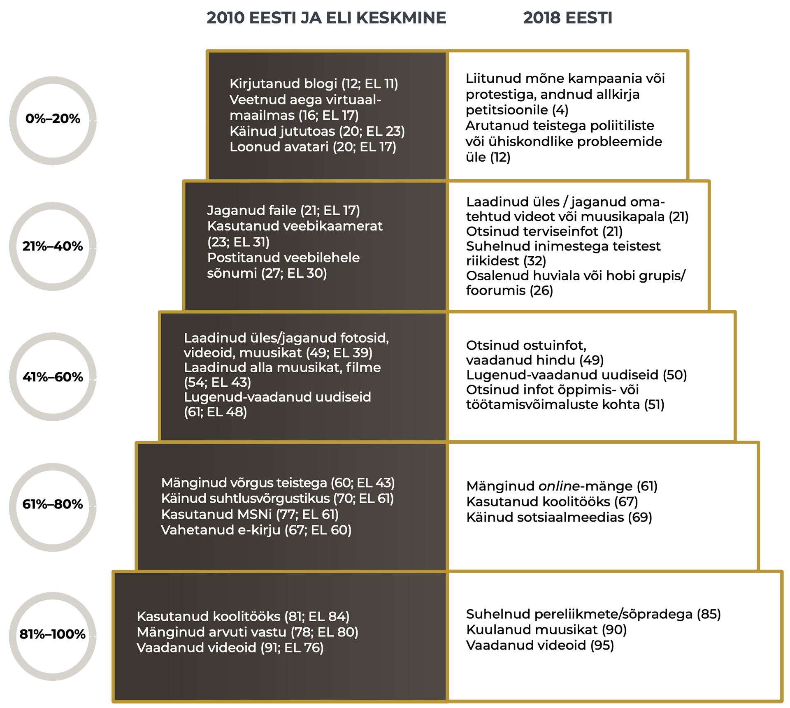
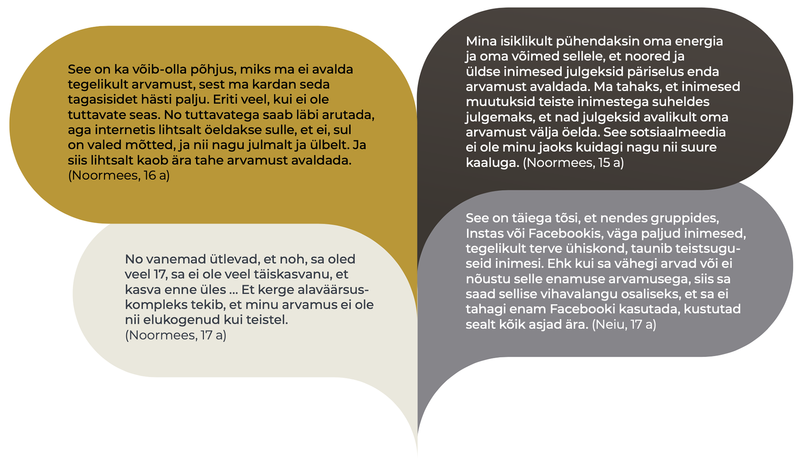

## Eesti noored virtuaalses arvamusruumis {.chapter_section .chapter4_section}

```{block, type='authors'}
**Veronika Kalmus ja Andra Siibak**
```

```{block, type='points'}
* Eesti noored on aktiivsed internetikasutajad: nende seas ei esine märkimisväärset digikihistumist, nende netitegevused on mitmekülgsed ning hinnangud oma digioskustele head. Ometi osalevad Eesti noored interneti ja sotsiaalmeedia vahendusel ühiskonnaelus ja poliitikas tagasihoidlikult. Enamgi veel, kohati on noored virtuaalse arvamusruumi suhtes kriitilised. Demokraatlik ja poliitiline osalus selle kitsas ja traditsioonilises mõttes noori ei paelu, seda ei muuda ligitõmbavamaks ka virtuaalne arvamusruum. Pigem on nad valmis panustama ja kaasa lööma neile endale südamelähedastes valdkondades, näiteks vabatahtlikuna.
```

```{block, type='blockquote-right'}
Digiosalus – interneti ja sotsiaalmeedia vahendusel kodanikuühiskonnas ja poliitikas osalemine.
```
Poliitilist ja kodanikuosalust peetakse elujõulise demokraatia ja hästi toimiva avaliku ruumi alustalaks. Ajal, mil peaaegu kõikides demokraatlikes riikides võib täheldada eriti nooremate põlvkondade süvenevat võõrandumist institutsioonide (sealhulgas parteide) kaudu aetavast poliitikast, pannakse suuri lootusi digiosaluse kasvule ja virtuaalsete arvamusruumide arengule. Peatükis vaatleme, kuivõrd aktiivselt kasutavad Eesti lapsed ja noored digiosaluse võimalusi ning mis on virtuaalse arvamusruumi edasise arengu eeldused ja takistused. Aastatel 2010–2018 kogutud küsitlusandmed võimaldavad meil analüüsida Eesti noore põlvkonna internetikasutuse ja digiosaluse arengutrende ning paigutada need rahvusvahelisse võrdluskonteksti. Lisaks pakuvad kvalitatiivsed uuringud võimalust mõista digiosalusega seotud probleeme noorte vaatevinklist ning heita pilku tulevikku.

### Eesti lapsed kasutavad internetti iga päev {-.chapter4_section}
Virtuaalses arvamusruumis osalemine eeldab, et digikeskkondi peetakse enesestmõistetavaks ja need on kõigile ligipääsetavad. Laste teadlikumat ja turvalisemat internetikasutust eesmärgiks seadev, 33 riigi teadlasi ühendav võrgustik EU Kids Online on enam kui 10 aasta jooksul uurinud peamisi suundumusi Euroopa, sealhulgas Eesti laste netikasutuses. EU Kids Online’i projekti raames küsitles Turu-uuringute AS 2010. ja 2018. aastal Eesti kõiki piirkondi hõlmava esindusliku valimi alusel kodudes 1000 internetikasutajast last vanuses 9–16 (2018. aastal 9–17) eluaastat.

Internet on muutunud Eesti laste igapäevaelu lahutamatuks osaks – kui 2010. aastal külastas internetti iga päev või peaaegu iga päev 82% Eesti 9–16-aastastest lastest, siis 2018. aastal kasutas internetti vähemalt ühest seadmest iga päev koguni 97% 9–17-aastastest ([Sukk ja Soo 2018](#Sukk-Soo2018)).

```{block, type='blockquote-left'}
Digikihistumine – ebavõrdsus soo, rahvuse, vanuse või elukoha alusel.
```
Kasutussageduse suurenemist seletab kahtlemata mobiilsete seadmete oluliselt parem kättesaadavus. Aastal 2010 käis telefoni kaudu internetis 31% Eesti lastest, 2018. aastaks oli see näitaja aga kolmekordistunud: 93% vastanutest kasutas mobiil- või nutitelefoni abil internetti vähemalt kord kuus ning 86% tegi seda peaaegu iga päev või sagedamini. Teisi seadmeid kasutasid lapsed harvem: laua- või sülearvuti on peaaegu igapäevane tööriist 43% ning tahvelarvuti üksnes 15% Eesti 9–17-aastaste jaoks. Internetile ligipääsus ja nutiseadmete kättesaadavuses ei esine laste seas märkimisväärset digikihistumist.

```{block, type='blockquote-right'}
Internetile ligipääsus ja nutiseadmete kättesaadavuses ei esine laste seas märkimisväärset digikihistumist.
```
Eesti lapsed veedavad internetis märkimisväärselt suure osa oma ärkvelolekuajast. Tavalisel koolipäeval on suurem osa 9–17-aastastest (41%) internetis ligikaudu 2–3 tundi, 26% aga 4–5 tundi või rohkemgi ([Sukk jt 2018](#Sukk2018)). Koolivabadel päevadel kasvab netiavarustes veedetav aeg märgatavalt: nädalavahetustel ja koolivaheaegadel sisustab peaaegu pool lastest 4–5 tundi või rohkem oma päevast netitegevustega ([joonis 4.2.1](#figure421)). Sedavõrd ulatuslik netikasutus iseloomustab enamikku poistest, vene kodukeelega lastest ning 13–17-aastastest.

<p class="caption" id="figure421"><span class="figure-number">Joonis 4.2.1.</span> Internetis veedetud aeg koolivabadel päevadel 2018 (%)</p>

Küsimus ankeedis: Umbes kui kaua veedad sa aega internetis vabadel päevadel, kui kooli ei ole (nt nädalavahetused, koolivaheajad)?
Alus: kõik lapsed (N = 1020).

```{r, figure421, fig.asp=.75, fig.align='center', echo=FALSE, message=FALSE, warning=FALSE}

library("tidyverse")
library("scales")


 fig421_data <- read.csv ("data/42_fig1_data.csv", header=TRUE, fileEncoding="utf-8")

 fig421_data$group <- factor(fig421_data$group, levels = c("Vene","Eesti","15-17 a","13-14 a","11-12 a","9-10 a","Tüdrukud","Poisid","Kõik lapsed"))
  fig421_data$answer <- factor(fig421_data$answer, levels = c("Ei taha öelda","Ei oska öelda","Umbes 6 tundi või rohkem","Umbes 4-5 tundi","Umbes 2-3 tundi","Umbes 1 tund või vähem"))

    fig421_data$text_position <- fig421_data$value

    fig421_data$text_position[which(fig421_data$text_position == 0)] <- NA

  fig421_plot <- ggplot(data = fig421_data) +
    geom_bar(mapping = aes(x=group, y=value, fill=answer), width=0.6, stat="identity") +
    geom_text(mapping = aes(x=group, y=text_position, label=round(text_position, digits=0)), stat="identity", color="white", position = position_stack(vjust = .5)) +
    coord_flip() +
     scale_fill_manual(values=c("#86858A","#A8ACA6","#5E4A0C","#8D6F11","#BC9417","#C9A945")) +
    labs(y="%", x="") +
      scale_x_discrete(labels = wrap_format(30)) +
    guides(fill = guide_legend(reverse = TRUE))

  fig421_theme <- theme(
                    panel.grid.major.y = element_blank() ,
                     panel.grid.minor.y = element_blank(),
                 )

print(fig421_plot + fig_theme_general+ fig421_theme)

#ggsave(path="exported_figures/PDF/chapter4",filename="fig421.pdf", height=200, width=200, units="mm")

```

``` {block, type='imgsource'}
<span class="imgsource-source">Allikas:</span> EU Kids Online Eesti uuring 2018; Sukk ja Soo 2018.
```

Igapäevane netikasutus on virtuaalses arvamusruumis osalemise eeltingimus, tõeliselt aktiivset kaasarääkimist soodustab aga digitaalse kaasatuse kõrge tase ehk võimalikult paljude noorte osasaamine digivõimaluste koguulatusest, mis tähendab jõudmist internetivõimaluste redeli kõrgematele ehk edasijõudnute astmetele. Kui redeli alumistel astmetel on netitegevused seotud infootsingu, suhtluse ning meelelahutusega ega nõua spetsiifilisi digioskusi, siis kõrgematel astmetel tegutsemine nõuab nii täiendavat pädevust kui ka motivatsiooni ([Livingstone ja Helsper 2007](#Livingstone2007); [Pruulmann-Vengerfeldt ja Runnel 2012](#Pruulmann-Vengerfeldt2012)) ning nendele jõuab väike osa lastest (alla 50%). [Joonis 4.2.2](#figure422) näitab, et kõrgematele ehk edasijõudnute astmetele paigutuvad nii loomingulised (nt blogi või kodulehe pidamine) kui ka digiosalusega seotud tegevused (nt petitsioonide allkirjastamine).

<div class="casebox">
<p class="caption" id="figure422"><span class="figure-number">Joonis 4.2.2.</span> Internetivõimaluste redel</p>

Küsimus ankeedis: Kui sageli sa oled viimase kuu (30 päeva) jooksul teinud internetis järgmisi asju? Alus: kõik lapsed (N=1020). Selgitus: tegevus paikneb redeli astmel vasta- valt harrastajate osakaalule vaadeldaval aastal.
```{r, figure422, out.width='90%',, fig.align='center', echo=FALSE, message=FALSE}



```
</div>
``` {block, type='imgsource'}
<span class="imgsource-source">Allikas:</span> EU Kids Online uuring 2010; 2018.
```

EU Kids Online’i 2010. aasta küsitluse andmetel paistsid Eesti lapsed Euroopa taustal silma suhteliselt suure internetivõimaluste kasutamise aktiivsusega. Näiteks uudiste jälgimise puhul ületasid Eesti lapsed Euroopa keskmist taset, olles samal ajal loominguliste ja osalustegevuste (nt blogipidamine, veebilehele sõnumi postitamine) poolest ELi keskmised ([joonis 4.2.2](#figure422)). Eesti kuulus koos Tšehhi, Rootsi, Hollandi ja Küprosega väheste maade rühma, kus väga väike osa lapsi (kuni 5%) harrastas internetis üksnes kuni kahte eri tegevust ([Pruulmann-Vengerfeldt ja Runnel 2012](#Pruulmann-Vengerfeldt2012)).

2018\. aasta andmetel on laste hulgas kasvanud meelelahutuse ja suhtlemisega seotud tegevuste harrastajate osatähtsus ([joonis 4.2.2](#figure422)). Seevastu interneti kasutamine koolitööks ning uudiste jälgimiseks on võrreldes kaheksa aasta taguse ajaga muutunud Eesti laste seas vähem levinud tegevuseks. Loomingulised ja osalustegevused on jätkuvalt pigem ebatüüpilised, edasijõudnute tasemele vastavad – näiteks arutles internetis poliitiliste või ühiskondlike probleemide üle küsitlusele eelnenud kuu jooksul vaid 12% Eesti lastest.

### Laste digitaalne kirjaoskus paraneb {-.chapter1_section}

```{block, type='blockquote-right'}
Loomingulised ja osalustegevused on jätkuvalt pigem ebatüüpilised, edasijõudnute tasemele vastavad – näiteks arutles internetis poliitiliste või ühiskondlike probleemide üle küsitlusele eelnenud kuu jooksul vaid 12% Eesti lastest.
```
Noored saavad tehnoloogia pakutavatest võimalustest maksimaalselt osa vaid siis, kui neil on vastav pädevus – digitaalne kirjaoskus – et tehnoloogiat võimalikult mitmekülgselt kasutada ning võimalike riskidega eos toime tulla.

EU Kids Online’i 2010. aasta uuringu andmetel väitsid Eesti lapsed end hakkama saavat keskmiselt viie digitaalset kirjaoskust näitava tegevusega (uuritud kaheksast), olles selle tulemusega Soome, Sloveenia ja Hollandi laste järel Euroopas neljandal kohal ([Livingstone jt 2011](#Livingstone2011)).
```{block, type='blockquote-left'}
Eesti noored hindavad oma digitaalset kirjaoskust väga heaks ning tunnevad end eri veebitegevustes üldjuhul enesekindlalt.
```
Praegu oskavad Eesti lapsed internetis veelgi oskuslikumalt tegutseda: EU Kids Online’i Eesti 2018. aasta küsitlustulemustest nähtub ([Joonis 4.2.3](#figure423); vt ka [Sukk ja Soo 2018](#Sukk-Soo2018)), et enamik uuringus osalenud 13–17-aastastest oskab veebilehitsejas avada uut vahelehte (93%), leida uuesti veebilehti, mida on hiljuti külastanud (92%), avada allalaaditud faile (92%) või kasutada privaatsussätteid, seades piiranguid sellele, kes internetis nende jagatavat sisu näeb (90%). Märgatavalt ebakindlamalt tunnevad noored end autoriõiguste ja kasutuspiirangute teemadel (pädevaks peab end 78%); ka veebilehe usaldusväärsuse hindamine ei ole päris kõigile jõukohane (74%). Kõige suuremaid raskusi valmistavad noortele sisuloomega seotud tegevused – 36% uuringus osalenud 13–17-aastastest väitis end hakkama saavat kodulehe loomisega ning 19% oskas kasutada programmeerimiskeeli.

### Digiosalus ei paelu Eesti noori {-.chapter4_section}

Varasemate uuringute kohaselt on internet Eesti noortele peamine uudiste allikas ([Allaste jt 2018](#Allaste2018)). EU Kids Online’i Eesti 2018. aasta küsitluse andmetest nähtub, et mis tahes kanali vahendusel jälgib uudiseid iga päev ligikaudu veerand 13–17-aastastest (harvemini teeb seda 65%). Noored kalduvad enamikku uudistest pigem usaldama; uudiste usaldusväärsuses kahtlejaid on alla viiendiku.

```{block, type='blockquote-left'}
Noored osalevad ka ise uudisvoos uudiseid jagades, hinnates või kommenteerides, kuid kõikide osalusviiside harrastajaid on alla poole.
```
Võrreldes sotsiaalmeediaga aitavad traditsioonilised uudiskanalid noori vale- ehk väljamõeldud, ebatõeste uudiste väljasõelumisel rohkem: ligikaudu pool 13–17-aastastest leiab, et ajalehed, raadio ja telekanalid aitavad neil fakte väljamõeldisest eristada, sotsiaalmeediat usaldab selles osas veidi alla kolmandiku. Sotsiaalmeedia kanalitest eelistavad noored uudiste jälgimiseks ja jagamiseks YouTube’i – nädala jooksul kasutas just seda kanalit 78% 13–17-aastastest – järgnesid Facebook (70%), Facebook Messenger (57%), Instagram (56%) ja Snapchat (49%).

Noored osalevad ka ise uudisvoos uudiseid jagades, hinnates või kommenteerides, kuid kõikide osalusviiside harrastajaid on alla poole. Tavapärasem on mõnest uudisest sõprade ja koolikaaslastega silmast silma rääkimine (tavalisel nädalal teeb seda 45% 13–17-aastastest); mõne veebikanali vahendusel räägitakse uudistest sõpradega harvem (38%). Küllaltki levinud on sotsiaalmeedias uudise laikimine või hindamine, mida harrastab 43%, ning uudise jagamine Messengeris (32%). Uudiste kommenteerimine sotsiaalmeedias on iganädalane tegevus vaid iga viienda noore puhul, uudisteportaali lisab kommentaare aga üksnes 5%.

Kvalitatiivsed uuringud noorte digiosaluse teemadel annavad aimu, mis on suhteliselt madalate osalusnäitajate taga. Näiteks fookusgrupiintervjuudest 15–18-aastaste noortega ilmnes, et liiga aktiivne arvamuse avaldamine (nt sotsiaalmeedias) pigem devalveerib veebiauditooriumi silmis postituse teemat ja näitab seetõttu ka postituse tegijat halvas valguses ([Sukk 2018](#Sukk2018)).

<p class="caption" id="figure423"><span class="figure-number">Joonis 4.2.3.</span> Digioskused Eesti 13–17-aastaste noorte seas 2018 (%)</p>

Küsimus ankeedis: Kuivõrd vastavad järgmised väited sinu puhul tõele?
Alus: kõik 13–17-aastased lapsed (n = 528).

```{r, figure423, out.width='100%', fig.asp=1.25, fig.align='center', echo=FALSE, message=FALSE}

library("tidyverse")
library("scales")
library("dplyr")


 fig423_data <- read.csv ("data/42_fig3_data.csv", header=TRUE, fileEncoding="utf-8")

    fig423_data$cumsum <- ave(fig423_data$value, fig423_data$question, FUN=cumsum)

    fig423_data$text_position_temp <-(fig423_data$value - 0.5*fig423_data$value)
    fig423_data$text_position <- 100 - fig423_data$cumsum +  fig423_data$text_position_temp
    fig423_data$text_position[which(fig423_data$text_position == 0)] <- NA


 fig423_data$question <- factor(fig423_data$question, levels = c("Mõnikord leian end veebilehtedelt teadmata, kuidas ma sinna sattusin","Ma oskan kasutada programmeerimiskeeli (nt Python, C++)","Ma oskan luua kodulehte","Ma oskan luua internetist leitud videotest või muusikast midagi uut","Minu jaoks on lihtne teha kindlaks, kas veebilehte saab usaldada","Ma tean, millised erinevad kasutuspiirangud ja autoriõigused kehtivad internetis leiduvatele materjalidele ","Ma tean, millises olukorras ma peaksin jagama infot internetis ja millises mitte","Ma oskan internetis käituda olukorrale vastavalt","Ma oskan kasutada klahvikombinatsioone (nt Ctrl + C kopeerimiseks)","Ma oskan avada allalaaditud faile","Ma tean, kuidas seada piiranguid, kes internetis minu infot näevad (nt sõbrad, sõprade sõbrad või kõik kasutajad)","Minu jaoks on lihtne leida veebilehte, mida olen hiljuti külastanud","Ma oskan avada uut vahelehte internetibrauseris"))

  fig423_data$answer <- factor(fig423_data$answer, levels = c("Ei oska öelda","Vastab täielikult tõele","Pigem vastab tõele","Ei üks ega teine","Pigem ei vasta tõele","Ei vasta üldse tõele"))


  fig423_plot <- ggplot(data = fig423_data) +
    geom_bar(mapping = aes(x=question, y=value, fill=answer), width=0.5, stat="identity") +
    geom_text(mapping = aes(x=question, y=text_position, label=round(value, digits=0)), stat="identity", color="white") +
     scale_fill_manual(values=c("#A8ACA6","#E4D4A2","#C9A945","#BC9417","#8D6F11","#5E4A0C","#2F2506")) +
    coord_flip() +
    labs(y="%", x="") +
    scale_x_discrete(labels = wrap_format(28)) +
     guides(fill = guide_legend(reverse = TRUE))

    fig423_theme <- theme(
      text = element_text(color = "#292b2c", size = 10),
      axis.text.y = element_text(size=8),
      panel.grid.major.y = element_blank() ,
      panel.grid.minor.y = element_blank(),
  )

print(fig423_plot + fig_theme_general + fig423_theme)

#ggsave(path="exported_figures/PDF/chapter4",filename="fig423.pdf", height=230, width=170, units="mm")

```

``` {block, type='imgsource'}
<span class="imgsource-source">Allikas:</span> EU Kids Online Eesti uuring 2018; Sukk ja Soo 2018.
```

Samal ajal pidasid fookusgruppides osalenud noored oluliseks tõika, et digitehnoloogiate tekkega on avanenud hulgaliselt võimalusi maailma muutmiseks. Sotsiaalmeediast alguse saanud kampaaniad (nt #minaka, milles seksuaalselt ahistatud või rünnatud inimesed postitasid oma kogemustest ajendatud lugusid) võivad julgustada oma kogemusest teada andma ning häält kuuldavaks tegema. Noored leidsid, et üksikisiku tasandil võivad sellised kampaaniad luua võimalusi mõttekaaslaste leidmiseks ja positiivsete emotsioonide tekkeks; ühiskondlikus plaanis aitavad need aga murda vananenud tabusid ja suurendada teadlikkust ([Sukk 2018](#Sukk2018)).

### Eesti noorte osalustüübid {-.chapter4_section}

```{block, type='blockquote-left'}
Üks levinumaid digiosaluse vorme Eesti noorte seas on ühiskondliku või poliitilise sisuga uudiste, muusika või videote jagamine sotsiaalvõrgustikes. Seda tegevust on vähemalt mõnikord harrastanud üle kolmandiku Eesti noortest.
```
Digiosalust vaadeldakse tavapäraselt koos üldise poliitilise ja kodanikuaktiivsusega. ELi Horisont 2020 programmist rahastatud rahvusvahelise teadusprojekti CATCH-EyoU (2015–2018) raames uuriti noorte ühiskondlikku aktiivsust kaheksas Euroopa riigis, sealhulgas Eestis. Analüüs näitas, et Eesti noored osalevad ühiskonnaelus mõõdukalt. Enamikku uuritud 18 osalustegevusest oli harrastanud alla poole 2016. aastal küsitletud Eesti 15–30-aastastest noortest (N=1002); 18 tegevuse seas oli aga üks levinumaid ühiskondliku või poliitilise sisuga uudiste, muusika või videote jagamine sotsiaalvõrgustikes. Seda tegevust on vähemalt mõnikord harrastanud üle kolmandiku noortest ([Kalmus ja Beilmann 2017](#Kalmus2017)). Noorte rühmitamisel eristus selgelt kaks osalusvormi ja nendega seotud aktivisti tüüpi – heategevuslik panustamine ja digiaktivism. Neisse tüüpidesse kuulumist soodustab rohkem võimalusi pakkuv sotsiaalne keskkond – põhirahvusesse kuulumine, elukoht suurlinnas või selle lähiümbruses, demokraatlikum pere ja haritumad emad. Paljusid eri osalustegevusi harrastavaid, poliitiliselt meelestatud aktiviste on väga vähe, passiivseid noori aga palju


```{block, type='casebox'}
**Eesti noorte osalustüübid**

Poliitiliselt meelestatud aktivistid (5,5%) harrastavad keskmisest enam kõiki poliitilisi tegevusi, veebiosalust ja vabatahtlikku tööd. Nad on pigem gümnaasiumiealised, rohkem on noormehi, eesti ja vene noori on võrdselt, nad on pärit pigem maakohast või väikelinnast, nende emad on sagedamini keskhariduseta. Võrreldes teiste tüüpidega usaldavad nad professionaalset ajakirjandust vähem, kuid alternatiivset võrgumeediat rohkem.

Vabatahtlikud-heategijad (30%) paistavad silma vabatahtliku töö ja heategevusega. Nad on pigem kahekümnendates aastates, rohkem on neide. Valdavalt on nad eestlased, pärit suurlinnast või selle ümbrusest, nende emad on pigem kesk- või kõrgharidusega. Nad usaldavad professionaalset ajakirjandust teistest tüüpidest rohkem, alternatiivset võrgumeediat aga vähem.

Digiaktivistid (27,6%) ilmutavad enim võrgu- ja tarbijaaktiivsust. Nad on pigem kahekümnendates aastates, veidi rohkem on noormehi, valdavalt on nad eestlased ja pärit suurlinnast või selle ümbrusest, nende emad on sagedamini kõrgharidusega. Digiaktivistid usaldavad alternatiivset võrgumeediat teistest tüüpidest vähem.

Passiivsed noored (36,8%) on kõikides osalusvormides keskmisest tagasihoidlikumad. Nad on pigem gümnaasiumiealised, noormehi-neidusid on üpris võrdselt, palju on vene noori. Nad on pärit pigem maakohast või väikelinnast, nende emadel on enamasti keskharidus või alla selle. Ka nende pere ja sõprade ühiskondlik aktiivsus on vähene.

```

``` {block, type='imgsource'}
<span class="imgsource-source">Allikas:</span> Kalmus ja Beilmann 2017.
```

### Noorte digiosalust takistavad tegurid {-.chapter4_section}

```{block, type='blockquote-right'}
Digiosaluse vähene tajutud ühiskondlik mõjukus ning viisaka ja argumenteeritud suhtluskultuuri puudumine pärsib tugevalt noorte motivatsiooni veebiaruteludes osaleda.
```
Kvalitatiivsetest uuringutest ([Sukk 2018](#Sukk2018)) nähtub samuti, et noored käituvad eri veebigruppides ja foorumites peamiselt passiivsete jälgijatena ning ise teemasid tõstatama või oma arvamust avaldama ei kipu. Õigupoolest ilmnes Euroopa Soolise Võrdõiguslikkuse Instituudi tellimusel 2018. aasta kevadel tehtud fookusgrupiintervjuudest 15–18-aastaste noortega (n=20), et paljud uuringus osalejad peavad digivahendeid osaluse kontekstis pigem ebavajalikeks ja kohati osalust sootuks takistavateks vahenditeks. Noorte keskmisest tagasihoidlikuma digiosaluse põhjustena nimetati nii platvormist tulenevaid probleeme (nt anonüümsus, privaatsusriskid, kehakeele puudumine ja piiratud võimalused tunnete väljendamiseks) kui ka isiklikke takistusi ([Sukk 2018](#Sukk2018)). Näiteks tunnistasid mitmed fookusgruppides osalenud noored, et hoiduvad internetis arvamuse avaldamisest, sest tunnevad end ebakindlalt ning pelgavad teiste, peamiselt vanemate kasutajate negatiivseid reaktsioone ja hukkamõistu. Paljud uuringus osalenud noored tunnistasid, et on loobunud internetis eri teemadel kaasa rääkimast seetõttu, et ei näe, et internetis arvamuse avaldamine või veebikampaaniates osalemine ühiskonnas päriselt loodetud muutust kaasa tooks. Noorte sõnul tunnevad nad internetikeskkondades suheldes puudust viisakast ja argumenteeritud suhtluskultuurist, mistõttu nende endi soov aruteludes aktiivselt kaasa lüüa on tugevalt pärsitud.

```{r, figure424, out.width='100%', fig.align='center', echo=FALSE, message=FALSE}




```

``` {block, type='imgsource'}
<span class="imgsource-source">Allikas:</span> Sukk 2018.
```

### Noored tajuvad virtuaalse arvamusruumi kitsaskohti {-.chapter4_section}

EU Kids Online’i andmed võimaldavad hinnata, kuivõrd on noorte hirm kaaslaste hukkamõistu ja negatiivsete netikogemuste ees põhjendatud ning missugune on netiosalusega seotud riskide laiem taust ja kujunemislugu.

2010\. aasta andmeil paistsid Eesti lapsed Euroopa eakaaslaste seas negatiivses mõttes silma väga kõrge kiusamise ja küberkiusu kogemise tasemega: kiusamise all oli kannatanud 43%, küberkiusu all aga 14% Eesti 9–16-aastastest lastest. Mõlemad näitajad olid 25 riigi seas absoluutses tipus, ületades Euroopa keskmist taset enam kui kahekordselt ([Livingstone jt 2011](#Livingstone2011)). Kõige sagedamini leidis küberkiusamine tollal aset sotsiaalvõrgustikes või kiirsuhtlusprogrammides (nt Messengeris), harvemini meilitsi või jututubades. Küberkiusamist esines rohkem neis maades, kus ka silmast silma kiusamine oli levinum ([Livingstone jt 2011](#Livingstone2011)) – seega võisime järeldada, et küberkiusamises väljenduvad sügavamad sotsiaalsed probleemid ning tegemist ei ole uuest tehnoloogiast tingitud muutusega laste käitumises. Lisaks oli Eestis võrreldes teiste riikidega 2010. aastal kõige rohkem neid lapsi, kes olid kogenud mõnd netiriski (üle 60%); internetis end millestki häirituna tundnud ehk netikahju kogenud laste osakaalu poolest (25%) oli Eesti 2. kohal Taani järel ([Kalmus 2013](#Kalmus2013)).

Kaheksa aastaga on Eesti laste negatiivsete kogemuste pagas jäänud mõne näitaja puhul samale tasemele, mõnes aspektis aga vähenenud. Netikahju kogemine pole oluliselt langenud: 22% EU Kids Online’i Eesti 2018. aasta küsitluses osalenud 9–17-aastastest väitis, et viimase 12 kuu jooksul on miski neid internetis häirinud või muretsema pannud. Üldise kiusamise all kannatamine on vähenenud märkimisväärselt: 2018. aasta andmeil oli kiusamist viimase 12 kuu jooksul kogenud vähem kui neljandik lastest (23%). Küberkiusamise kogemine ei ole aga langenud: vähemalt mõnel korral aastas oli seda juhtunud 15% lastega.
Ühtlasi tunnistas rohkem kui iga kümnes (13%) 2018. aasta küsitluses osalenud Eesti lastest, et nad on viimase 12 kuu jooksul ise kedagi kiusanud; 5% möönis, et on seda teinud internetis või telefonis. Küberkiusamise muret tekitavalt laiast levikust kõneleb ka selle pealtnägemise sagedus: 2018. aasta andmeil on küberkiusu tunnistajaks olnud 40% Eesti 11–17-aastastest.

```{block, type='blockquote-left'}
Küberkiusamise muret tekitavalt laiast levikust kõneleb selle pealtnägemise sagedus: 2018. aasta andmeil on küberkiusu tunnistajaks olnud 40% Eesti 11–17-aastastest.
```

Valdavalt seisneb küberkiusamine vastikute või solvavate sõnumite saatmises – seda on kogenud 58% internetis või telefonis kiusatud lastest. Just see netikiusamise vorm koos grupist või tegevusest väljajätmisega (mille all on kannatanud 28% küberkiusatutest) võib mõjuda negatiivselt noorte soovile ja tajutud võimalustele digiruumis kaasa rääkida. Lisaks võib noorte digiosalust pärssida negatiivse veebisisuga kokkupuutumine. Näiteks on 2018. aasta andmeil 35% Eesti 9–17-aastastest kohanud digiruumis vihasõnumeid, mis ründavad teatud isikuid või rühmi.

Kindlasti mängib digitaalse arvamusruumi kujunemises rolli see, kuivõrd turvalise ja usaldusväärsena noored internetti tajuvad. EU Kids Online’i 2018. aasta küsitlus näitab, et veidi rohkem kui kolmveerand lastest (77%) tunnevad end internetis alati või sageli turvaliselt, samal ajal on 5% lapsi, kes ei tunne end mitte kunagi turvaliselt. Enamik vastanutest usub siiski, et nad teavad, mida teha, kui keegi käitub internetis viisil, mis neile ei meeldi, ning veidi üle poole lastest leiavad, et inimesed on digiruumis pigem lahked ja abivalmid.

### Kokkuvõte {-.chapter4_section}

Eesti laste ja noorte internetikasutamise sageduses on kaheksa aastaga toimunud märgatav kasv: enamik noori kasutab internetti iga päev, veetes netiavarustes tunde ([Sukk ja Soo 2018](#Sukk2018)). Nutitelefonid ja mobiilne internet on pea kõigile lastele kättesaadavad. Paljuski just nutitelefonide levikust tingitud interneti kasutussageduse suurenemine ei ole aga viinud oodatud tõusuni digiosaluses; andmed ei viita ka selle eeldatavale kasvule lähitulevikus. Eesti noorte digiosalust ei piira geograafiline ruum, vaid asjaolu, et nutitelefone kasutatakse teist laadi tegevusteks. Noored keskenduvad internetis peamiselt meelelahutusele, suhtlusele ja infootsingule, olles jäänud internetivõimaluste redeli kahele alumisele astmele ehk tegevuste juurde, mis ei nõua palju teadmisi ega digioskusi. Internetivõimaluste redeli kõrgematele ehk edasijõudnute astmetele jõudmine, see on aktiivseks digikodanikuks saamine, ei jää siiski noorte puudulike digioskuste taha – üldiselt hindavad Eesti noored oma digipädevust kõrgelt. Nad eelistavad aga kasutada digiruumi omavahelise suhtlusruumi ja meelelahutusplatvormina, mitte niivõrd ühiskondlike arutelude areenina.

Kvalitatiivsetest uuringutest nähtub, et noorte mõõduka digiosaluse põhjuseks on vähene motivatsioon ja huvi veebis ühiskondlikel teemadel kaasa rääkida. Osaliselt pärsib noorte tahet viisaka ja argumenteeritud suhtluskultuuri puudumine ning digiosaluse vähene ühiskondlik mõjukus, samal ajal hindavad noored sageli enam kaasalöömist päriselu kodanikualgatustes, näiteks osalemist vabatahtlikuna ettevõtmistes, mis just neile korda lähevad. Uuringud ([nt CATCH-EyoU – Kalmus ja Beilmann 2017](#Kalmus2017)) näitavad siiski, et valdavalt osalevad noored enamikus kodaniku- ja poliitilistes tegevustes tagasihoidlikul määral. Paljuski seetõttu eelistavad noored jääda ka virtuaalses arvamusruumis pigem mõõdukalt aktiivseks pealtvaatajaks ega kipu kasutama digiruumi kõiki võimalusi või seda uueks looma.

Virtuaalse arvamusruumi arengut võiksid soodustada järjestikused päriselt tulemusi toovad veebipõhised kodaniku- või poliitilised algatused – mõned edulooks ja legendiks kujunevad kampaaniad võimalikult paljudele südamelähedasel teemal (kujundlikult öeldes: virtuaalne fosforiidisõda või Facebooki Balti kett). Kahtlemata tuleks kasuks ka küberkiusu leviku senisest palju tõhusam ohjamine ning üldise suhtluskultuuri paranemine. Lühiajalistest kampaaniatest selleks ei piisa – oluline on jätkata teadlikkuse suurendamisega, kasvatada noortes täisleppimatust küberkiusu suhtes ning arendada säilenõtkust ja toimimisoskusi nii küberkiusamise kogemisel kui ka selle pealtnägemisel. Täiskasvanud digikodanike eeskuju arvamuskultuuri viljelemisel ning vähemalt elementaarne viisakus noorte digikodanike panusega arvestamisel on samuti määrava tähtsusega.

### Tänusõnad {-.chapter4_section}
Aastatel 2006–2014 rahastas EU Kids Online’i projekti Euroopa Komisjon turvalisema interneti programmist. EU Kids Online’i Eesti 2018. aasta küsitlust rahastasid Eesti Interneti SA, Haridus- ja Teadusministeerium (Euroopa Sotsiaalfondist), Justiitsministeerium, Sotsiaalministeerium ning uurimisprojektid PUT 44 (Eesti Teadusagentuur) ja IUT 20-38 (Haridus- ja Teadusministeerium).

### Viidatud allikad {-.subreferences}
<p id="Allaste2019">Allaste, A.-A., Beilmann, M., Tiidenberg, K. 2018. Digitaalne osalus. – Noorteseire aastaraamat 2017–2018. Noored ja osalus. Tallinn: Eesti Noorsootöö Keskus, Tallinna Ülikool, 119–139.</p>

<p id="Kalmus2013">Kalmus, V. 2013. Laste turvalisus uues meediakeskkonnas. – Heidmets, M. (toim.). Eesti Inimarengu Aruanne 2012/2013. Eesti maailmas. Tallinn: Eesti Koostöö Kogu, 83–85.</p>

<p id="Kalmus2017">Kalmus, V., Beilmann, M. 2017. Mis tüüpi kodanikud on Eesti noored? – Mihus, 21, 13−14.</p>

<p id="Livingstone2011">Livingstone, S., Haddon, L., Görzig, A., Ólafsson. K. 2011. Risks and Safety on the Internet: The Perspective of European Children. EU Kids Online Full Findings. London: The London School of Economics and Political Science.</p>

<p id="Livingstone2007">Livingstone, S., Helsper, E. 2007. Gradations in digital inclusion: children, young people and the digital divide. – New Media & Society, 9 (4), 671–696.</p>

<p id="Pruulmann-Vengerfeldt2012">Pruulmann-Vengerfeldt, P., Runnel, P. 2012. Online opportunities. – Livingstone, S., Haddon, L., Görzig, A. (eds.). Children, Risk and Safety on the Internet: Research and Policy Challenges in Comparative Perspective. Bristol: Policy Press, 73–85.</p>

<p id="Sukk2018">Sukk, M. 2018. Online-osalus ja mitte-osalus: Eesti noorte arvamused ja kogemused. Magistritöö. Tartu Ülikool.</p>

<p id="Sukk-Soo2018">Sukk, M., Soo, K. 2018. EU Kids Online’i Eesti 2018. aasta uuringu esialgsed tulemused. – Kalmus, V., Kurvits, R., Siibak, A. (toim.).  Tartu: Tartu Ülikooli ühiskonnateaduste instituut.</p>
