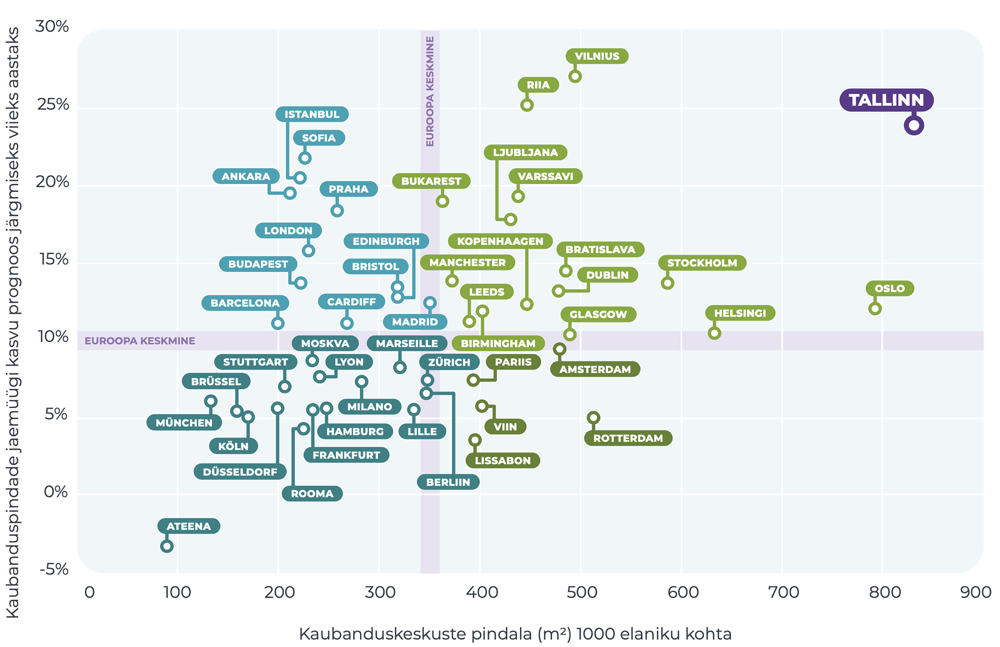

# Eesti elukeskkond aastal 2050 {.chapter5 .chapter5_section}
 <script>
  window.location = "sissejuhatus-5.html";
  </script>
## Sissejuhatus {-.chapter_section .chapter5_section .intro_section #sissejuhatus-5}
<h1>Eesti elukeskkond aastal 2050</h1>

```{block, type='authors authors_ee'}
<div class="author-links">**[Kristi Grišakov](#kristi-grišakov)**</div>
<div><a class="print-btn EE-btn" href="en/introduction-5.html">EN</a></div>
<div><a class="print-btn" href="print/EIA-2019-5.0-Tulevik.pdf"><i class="fa fa-file" aria-hidden="true"></i>Trükiversioon</a></div>
```

### Põhisõnumid {-.chapter5_section}

```{block, type='points'}
* Tulevikumuutused mõjutavad füüsilist ruumi – loodus- ja tehiskeskkonda – ning jagavad selle uute kasutusviiside põhjal ümber.

Muutused elukeskkonnas on seotud muutustega maailmas ja meie võimega muutustega kohaneda. Meie elukeskkonna arengut mõjutab nii kliimamuutus kui ka rahvusvahelised ettevõtted ja poliitika, uued tehnoloogiad ja teenused, samuti rahvastiku vananemine ja linnastumine. Oma elukeskkonna ümberkujundamisel peame arvestama, et juba tehtut ei ole võimalik tagasi pöörata, see võtab aastakümneid aega ning on kallis ja keeruline. Seetõttu on oluline elukeskkonda puudutavate valikute tegemisel mõista muutuste pikemaajalist mõju elukeskkonna kvaliteedile.

* Eesti ees on ruumiline valik: kas arendada edasi liberaalset elukeskkonda, mis pakub mugavusi vaid heal majanduslikul järjel ja kohustustest vabadele inimestele, või kaasavamat elukeskkonda, mis keskendub kõigi heaolu parandamisele.

Ruumilise valiku tegemist toetavad käesolevas peatükis esitatud neli stsenaariumi, mis näitlikustavad maailmas ja Eestis toimuvaid muutusi ning nende tagajärgi. Stsenaariumid on jutustused, mis aitavad tulevikku ette kujutada ja rääkida sellest ühistel alustel. Nende abil kutsume lugejat kaasa mõtlema, millises elukeskkonnas me soovime tulevikus elada ja milliseid tulevikke vältida.
```

Aruande eelmistes peatükkides on selgitatud, kuidas on viimase 30 aasta jooksul muutunud meie suhtlus-, liikumis- ja elamisviisid, elukohaeelistused ning suhe looduskeskkonda. Milliseks muutub meie elukeskkond järgmise 30 aasta jooksul? Käesoleva peatüki eesmärk on kirjeldada Eesti elukeskkonna võimalikke tulevikke lähtuvalt ülemaailmsetest, regionaalsetest ja kohalikest suundumustest ja poliitikavalikutest ning koostada nende tegurite põhjal neli tulevikustsenaariumi. Stsenaariumid ise on mõtlemise abivahendid, mis näitlikustavad maailmas ja Eestis toimuvaid muutusi ning nende tagajärgi.

<div class='casebox'>
#### Mõtteharjutus: päevakajalised teemad 30 aastat tagasi (1987–1988)
* Päevakorrale tõuseb fosforiit, täpsemalt kavatsus rajada Rakvere rajooni suuremahuline loodust reostav fosforiidikaevandus.
* Eesti Roheline Liikumine loodi kahe rohelise foorumiga 28. aprillil ja 23. mail 1988 Tallinnas.
* Tallinnas asutatakse 12. detsembril aastal 1987 Eesti Muinsuskaitse Selts, esimeheks Trivimi Velliste.
* 6. detsembril 1987 sünnib 500 000. tallinlane.
* Esimene arvutiviirus, WordWideWebi kontseptsiooni esmane arutamine.
</div>

Stsenaariumide abil kutsume lugejat kaasa mõtlema, millises tulevikumaailmas soovime elada ja milliseid tulevikke vältida. Kuidas oleme võimelised kohanema nii globaalse arengu kui ka Eesti-siseste tulevikuväljakutsetega? Peatükk koosneb kolmest osast. Esmalt anname ülevaade stsenaariumiplaneerimise meetodist ja peamistest põhimõtetest. Seejärel kirjeldame peamisi suundumusi, mis mõjutavad Eesti elukeskkonda. Peatüki lõpus kirjeldame Eesti tuleviku elukeskkonda nelja stsenaariumina.

### Mis on stsenaariumiplaneerimine? {-.chapter5_section}

Stsenaariumiplaneerimine on üks planeerimise meetodeid, mille eesmärk on mõista olevikus toimuvate muutuste ja otsuste mõju tulevikumaailma kujunemisel. Stsenaarium on strateegilise mõtlemise tööriist, mida kasutatakse olukordades, kus hoolimata teadmatusest peab tulevikuks valmistuma ja otsuseid vastu võtma. Siin koostatud stsenaariumid põhinevad klassikalise intuitiivse loogika meetodil, mis kasutab olemasolevaid prognoose ja andmeid ning loob nende põhjal erinevate muutuste tagajärgi illustreerivad tulevikulood ([Wright jt 2013](#Wright2013)).

Elukeskkond on stsenaariumiplaneerimises eriline valdkond, sest erinevalt uutest tehnoloogiatest ja teenustest muutub see aeglaselt. Kiired muutused elukeskkonnas nõuavad suuri investeeringuid, milleks on vaja raha ja poliitilisi kokkuleppeid. Elukeskkonda võidakse hoolikalt planeerida, kuid plaanide tegemise ja nende teostamise vaheline aeg on üldjuhul pikk ning tegelike muutuste ilmnemine võtab aega.

```{block, type='blockquote-right'}
21&#8291;. sajandi elukeskkonna arengut mõjutab nii kliimamuutus, rahvusvahelised ettevõtted ja poliitika kui ka uued tehnoloogiad ja teenused.
```

Elukeskkonda mõjutavate tegurite rolli ja mõju tuleviku kujundamisel on keeruline prognoosida. Kvantitatiivselt mõõdetakse valdkondlikke muutusi, mis ei anna ülevaadet elukeskkonna kui terviku muutumisest. Muutused elukeskkonnas on seotud muutustega maailmas ja meie võimega muutustega kohaneda. 21. sajandi elukeskkonna arengut mõjutab nii kliimamuutus, rahvusvahelised ettevõtted ja poliitika kui ka uued tehnoloogiad ja teenused. Sageli on keeruline hoomata, millised nendest mõjudest on kõige suurema kaaluga või toovad kaasa ootamatuid ja üllatavaid tagajärgi. Tulevikku kujundavaid tegureid kirjeldatakse seetõttu kahel tasandil – prognoosid ja vaevu tajutavad märgid (ingl weak signals). Erinevaid valdkondlikke prognoose (nt rahvastikuprognoosid) koostatakse olemasolevaid mineviku- ja olevikutrende tulevikku pikendades. Sellised prognoosid annavad meile aimu võimalikust tulevikust senise olukorra jätkudes, aga mitte teguritest, mis trendide suunda võivad muuta, või valdkondlike trendide ootamatust koosmõjust tulevikumaailma kujundamisel ([Thomas 1994](#Thomas1994)).

Tuleviku-uuringutes kasutatakse seetõttu mõistet vaevu tajutavad märgid, mis tähendab keskendumist prognooside kõrval ka väiksematele muutustele, millel on potentsiaali tulevikutrajektoore nihestada. Vaevu tajutavad märgid võivad avalduda näiteks noorema põlvkonna väärtustes: noored oma praeguste tarbimis- ja liikumiseelistusega panevad paika tuleviku käitumismustreid. Kuigi nende laiemat mõju ei ole veel võimalik tõestada, on vaevu tajutavate märkide vaatlemine oluline, sest need aitavad arutleda tulevikumuutuste üle, mille tegelik mõju võib ilmneda kümneid aastat hiljem. Käesolevas peatükis kasutame mõlemat tüüpi tegureid, nii suurema tõenäosusega prognoose kui ka vaevu tajutavaid märke, millel võib elukeskkonnale olla oluline mõju, kuid mille kohta meil ei ole veel tõenduspõhist materjali.

Stsenaariumide koostamine koosnes lihtsustatult kolmest etapist: valdkondlike muutuste koondamine, kõige tõenäolisemate või suurimat mõju omavate muutuste kindlaksmääramine ning muutuste tagajärgede illustreerimine tulevikustsenaariumide abil. Valdkondlike muutuste kindlaksmääramisel kasutasime prognoose, raporteid ja stsenaariume Eestist ja välismaalt. Kasutasime ka mõningaid globaalse haardega stsenaariume ja prognoose, kuid enamik peatükis kirjeldatud muutusi lähtusid siiski Euroopa kontekstist ja väärtustest. Teise lähtekohana kasutasime käesoleva aruande peatükkides käsitletud muutusi aruteluruumi, elukeskkonna ja looduskeskkona toimimises ja kasutamises viimase 30 aasta jooksul ning käesoleva aruande artiklite autorite pakutud võimalikke valdkondlikke tulevikuväljavaateid. Kõige tõenäolisemate ja suurimat mõju omavate tegurite väljaselgitamiseks toimusid töötoad peatükkide toimetajate ja kutsutud valdkonnaekspertide osalusel. Töötubades valisime välja kaks kõige olulisemat tulevikulugude põhisuunda ning koostasime igale stsenaariumile esialgse sisu, mis keskendus elanike igapäevaelule ja omavahelisele suhtlusele. Töötubade järel täpsustasime suurima mõjuga muutuste kirjeldusi ja kirjutasime stsenaariumi illustreerivad tulevikulood. Kirjeldatud tulevikumuutuste valikul võtsime arvesse kaht ruumilist tasandit: esiteks laiemat ruumiskaalat, mille puhul muutused mõjutavad elukeskkondade paiknemist ja omavahelisi ühendusi kogu Eesti territooriumil, ning teiseks kitsamat ruumiskaalat, mis hõlmab muutusi elukeskkondade sees. Oluliste muutuste kindlaksmääramisel jätsime välja sellised äärmuslikud muutused nagu Euroopa Liidu lagunemine või looduskatastroofid. Samuti eeldasime vaba Eesti riigi püsimist ka aastal 2050. Nende sisendite põhjal koondasime peamised suundumused, millel on oluline mõju ruumilise elukeskkonna (ümber)kujunemisele järgmise 30 aasta perspektiivis.

### Peamised suundumused {-.chapter5_section}

<span class="bullet-heading">**Rahvastiku kahanemise ja vananemise ajastu on nii Eestis kui ka rahvusvaheliselt uus olukord, mis süvendab veelgi regioonide ebavõrdsust.**</span>

ÜRO prognoosi kohaselt saavutab Euroopa rahvaarv tipptaseme (748 miljont) aastaks 2021 ja hakkab pärast seda langema. Kuigi viimase 70 aasta jooksul on elanikkond vähenenud ainult kuues maailma riigis, siis ajavahemikul 2020–2100 väheneb rahvastik 90 riigis, sealhulgas ⅔ kõigist Euroopa riikidest ([Cilluffo ja Ruiz 2019](#Cilluffo2019); [ÜRO 2019](#ÜRO2019b)). Statistikaameti põhiprognoosi (2019) kohaselt väheneb Eesti rahvaarv 2040. aastaks ligikaudu 1,3 miljonini ning 2060. aastal 1,2 miljonini ([joonis 5.1](#figure51)). Eesti ühiskonda iseloomustab eakate inimeste osatähtsuse suur kasv – 2040. aastaks prognoositakse, et iga neljas inimene (25%) Eestis on vanem kui 65 eluaastat ning 2060. aastal jõuab eakate osatähtsus 30%-ni. Tuleviku eakas on praegu vanuses 25+ ning inimeste väärtused ja elukohavalik määravad ära selle, millised nad on eakatena 2060. aastal. Prognoos maalib tuleviku Eestist Harjumaa ja Tartumaa keskse pildi – vähemalt 65% rahvastikust elab 2040. aastaks kahes suuremas linnaregioonis. Nendes kahes regioonis on seetõttu ka kõige suurem tööealise elanikkonna osatähtsus ja kõige vähem eakaid (osatähtsus 20–21%). Teised maakonnad on kõik kahaneva elanikkonnaga: Ida-Virumaal, Järva, Valga ja Jõgeva maakonnas väheneb rahvaarv vähemalt 1/3 võrra ja elanikkond on riigi keskmisest vanem (Ida-Virumaal ja Lääne maakonnas on osatähtsus kõige suurem, kuni 40%).

<p class="caption" id="figure51"><span class="figure-number">Joonis 5.1.</span> Eesti rahvaarvu muutus 2019–2080</p>

```{r, figure51, fig.asp=.75, fig.align='center', echo=FALSE, message=FALSE, warning=FALSE}

library("tidyverse")
library("scales")
library("reshape")

fig51_data <- read.csv ("data/5_fig1_data.csv", header=TRUE, fileEncoding="utf-8", sep=";", check.names=FALSE, stringsAsFactors=FALSE)
fig51_data <- melt(fig51_data, id=c("Rahvaarv"))

names(fig51_data)[names(fig51_data) == "Rahvaarv"] <- "scenario"
names(fig51_data)[names(fig51_data) == "variable"] <- "year"

fig51_data$year <- as.numeric(as.character(fig51_data$year))

  fig51_plot <- ggplot(data = fig51_data) +
    geom_line(mapping = aes(x=year, y = value, colour=scenario, group=scenario), size=1) +
    scale_colour_manual(values=c("#500e0c", "#a01b17", "#a4d0cd", "#ec6823"))+
    labs(y="Rahvaarv", x="aasta") +
    scale_x_continuous(breaks=c(2019,2030,2040,2050,2060,2070,2080), expand = c(0, 0), limits=c(2019,2082))+
    scale_y_continuous(breaks=c(200000,400000,600000,800000,1000000,1200000,1400000), labels = number, expand = c(0, 0), limits=c(0,1400000))+
    expand_limits (y=0)+
      guides(colour=guide_legend(nrow=4,byrow=TRUE))

   fig51_theme <- theme(
        text = element_text(family="Montserrat"),
  )

  print(fig51_plot + fig_theme_general + fig51_theme)

  #ggsave(path="exported_figures/PDF/chapter5",filename="fig51.pdf", height=120, width=200, units="mm",encoding = "ISOLatin9.enc")
```

``` {block, type='imgsource'}
<div><span class="imgsource-source">Allikas:</span> Statistikaamet.</div>
<div><a class="data-btn" href="data/5_fig1_data.csv"><i class="fa fa-download" aria-hidden="true"></i>Laadi andmed</a></div>
```

<span class="bullet-heading">**Elanike koondumist suurtesse linnadesse ja ülejäänud Eesti jätkuvat kahanemist soosib linnaliste asulate kiirenev majanduskasv**</span>

Eelmise sajandi teisel poolel kahanesid majanduslanguse ja tööstuse ümberorganiseerimise tõttu kiiresti suured tööstuslinnad, näiteks Detroit ja Saint Louis, mis kaotasid üle poole elanikkonnast, aga ka paljud Euroopa linnad, nagu Manchester ja Leipzig ([Rumpel ja Slach 2014](#Rumpel2014)). Käesoleval sajandil on mitme suurlinna nagu Pariisi või New Yorgi puhul näha suundumust, kus linnakeskused on hakanud kahanema linnaregiooni kasvu arvelt, samal ajal kui teistele linnadele nagu Stockholm, Oslo ja London prognoositakse elanike arvu stabiilset kasvu ([Evans 2019](#Evans2019); [ÜRO 2018](#ÜRO2018)). Ameerika Ühendriikides süvendab regionaalset ebavõrdsust innovatsioonisektori (IT-sektori ja kõrgtehnoloogiliste ettevõtete) kasvu ja töökohtade koondumine vaid viide linnaregiooni (Boston, San Francisco, San Jose, Seattle ja San Diego), kus toimub 90% sektori kasvust ja asub ligi veerand töökohtadest ([Atkinson jt 2019](#Atkinson2019)). Kasvutempo Tallinna ja Tartu linnapiirkonnas on pikaajaliselt ületanud teiste Eesti regioonide kasvukiirust ning regioonide sotsiaal-majandusliku taseme erinevus on üha suurenenud. Kui 1997. aastal moodustas Harjumaa SKP 55,2% kogu Eesti SKPst, siis 2007. aastal oli see 59,6% ning 2017. aastal juba 63,7% ([Arenguseire Keskus 2019](#AreguseireKeskus2019)). Kuigi pealinnaregiooni ennakkasvu teiste piirkondadega võrreldes võib pidada tavapäraseks nähtuseks, on piirkondade arengu erinevused Eestis Euroopa suurimate seas (samas). Linnade nn konkurentsieelise ([Rosenthal ja Strange 2004](#Rosenthal2004)) empiirilisel mõõtmisel on täheldatud, et linna rahvaarvu kahekordistumine suurendab linna tootlikkust 3–8% ja linna tiheduse kahekordistumine 5%. Linna mõjupiirkonna kahekordistamine lisab veel 4,5%. Ettevõtted koonduvad sinna, kus on tööjõud, ja elanikud kolivad sinna, kus on võimalus tööd leida. Sama valdkonna ettevõtetele on kasulik koonduda ühte piirkonda ([Laakso ja Loikkainen 2018](#Laakso2018)).

```{block, type='blockquote-right'}
Kasvutempo Tallinna ja Tartu linnapiirkonnas on pikaajaliselt ületanud teiste Eesti regioonide kasvukiirust ning regioonide sotsiaal-majandusliku taseme erinevus on üha suurenenud.
```

Üldjuhul on teenuste (sh uued platvormid) toimimise ning muude investeeringute aluseks tasuvusanalüüs, mis lähtub piisavast rahvaarvust ja asustustihedusest. Turumajanduse loogika järgi ei ole perspektiivne neid teenuseid hajaasustuses pakkuda, nagu ka hajaasustuses ja ääremaal on keerulisem saada laenu elamispinna soetamiseks või renoveerimiseks ([McAfee ja Brynjolfsson 2017](#McAfee2017)). Uusi liikuvusteenuseid, mis kombineerivad omavahel autorenti, rattaringlust ja ühistransporti, pole perspektiivne pakkuda isegi alla miljoni elanikuga linnaregioonides ([Sassiad 2019](#Sassiad2019)). Seetõttu on tõenäoline, et elanikkonna edasine kasv ja innovatsioon teenusmajanduses jõuavad vaid kasvavatesse linnaregioonidesse, süvendades veelgi kahanevate või väiksemate regioonide mahajäetust. Rööbiti toimub liikumine kasvavate linnaregioonide sees ja vahel. Elanikud eelistavad kolida väiksematesse, hõredamalt asustatud ja madalamate eluasemehindadega linnadesse ja asulatesse ([Thompson 2019](#Thompson2019)). Eestis on see suundumus selgemalt nähtav Harju regioonis, kus Tallinn pakub töökohti ja teenuseid, kuid suurimad võitjad on Tallinna ümbritsevad väikelinnad, mis suudavad pakkuda paremat elukeskkonda ning ühtaegu mugavat ja kiiret ühendust pealinnaga (Keila, Saue). Juba praegu on elanike keskmise sissetuleku poolest Tallinna ümbritsev regioon pealinnast jõukam ([joonis 5.2](#figure52)), ning kihistumine keskuslinna ja ümbritseva piirkonna (aga ka eri linnaosade) elanike vahel võib veelgi süveneda. Pered, kuhu sünnivad lapsed, elavad pigem linnast väljas ja valivad elukohaks suurema linna ümbruses asuva uuselurajooni ([Raid ja Tammur 2018](#Raid2018)). Sama statistika alusel võib vaevu tajutavate märkidena täheldada ka noorte perede liikumist maale, samuti eakate liikumist suurematest keskustest tagasi kunagisse kodukanti.

<p class="caption" id="figure52"><span class="figure-number">Joonis 5.2.</span> Kuu keskmine brutotulu Tallinna regioonis</p>

```{r, figure52, out.width='100%', fig.align='center', echo=FALSE, message=FALSE, warning=FALSE}

library(sf)          # classes and functions for vector data
library(raster)      # classes and functions for raster data
library(tmap)
library(svglite)

Brutotulu <- st_read(dsn ="data/5_fig2_data/EKSPORT_3301-r2JoQJvv97bKfi7L-t7.shp")
head(as.data.frame(Brutotulu))

Brutotulu$VAARTUS <- as.numeric(as.factor(Brutotulu$VAARTUS)) -1
Brutotulu <- Brutotulu[order(Brutotulu$NIMI),]

fig52_data <- read.csv("data/5_fig2_data/fig52_data.csv", header=TRUE, sep=";")
fig52_data <- fig52_data[order(fig52_data$Üksus),]

Brutotulu$palk <- fig52_data$Väärtus

names(Brutotulu)[names(Brutotulu) == "palk"] <- "Keskmine Brutotulu (€)"

fig_52_plot <- tm_shape(Brutotulu) + 
    tm_fill("Keskmine Brutotulu (€)",title="Keskmine brutotulu (eurot)", palette = c("#E6E3DA","#d7bf74","#a01b17"), breaks=c(925,1043,1075,1107,1144,1209,1349,1711), popup.vars="Keskmine Brutotulu (€)", id="NIMI") +
  
  tm_borders(col="white") +
  
  tm_text (col="black", text="NIMI",xmod=0) +
  
    tm_layout(
      outer.margins=0, inner.margins=c(.02, .1, .02, .02),asp=1920/1080,
      legend.outside = FALSE,
      legend.format=list(text.separator="..."),
      frame = FALSE) +

      tm_view (
        set.zoom.limits = c(9, 12),
        set.bounds = c(23.6397953631, 58.9745283067, 26.1316992531,59.8110903998),
        view.legend.position = c("right","bottom"),
      )
   
tmap_mode("view")
fig_52_plot

#tmap_save(tm = fig52_plot, filename = "fig52.pdf")

#svg(filename="figure.svg")
#fig_153_plot
#dev.off()

```

``` {block, type='imgsource'}
<div><span class="imgsource-source">Allikas:</span> Statistikaamet 2019.</div>
<div><a class="data-btn" href="data/5_fig2_data.zip"><i class="fa fa-download" aria-hidden="true"></i>Laadi andmed</a></div>
```

<span class="bullet-heading">**Taristuinvesteeringud, eelkõige kiired rongiühendused, võimaldavad toetada kestlikku ruumiplaneerimist.**</span>

```{block, type='blockquote-left'}
Taristu arendamine lähtub Euroopa Liidu strateegiast muuta aastaks 2050 transpordisektor süsinikuvabaks.
```

Taristu mõju võib olla ka vastupidine, kui see võimaldab kiireid ühendusi vaid suurte keskuste vahel ning võimendab sellega regionaalset tasakaalustamatust ja ääremaastumist. Taristu arendamine lähtub Euroopa Liidu strateegiast muuta aastaks 2050 transpordisektor süsinikuvabaks ([Euroopa Komisjon 2018](#EuroopaKomisjon2018)). Peale Euroopa Liidu investeerivad transporti ka teised riigid, näiteks on Hiina teinud transpordiinvesteeringuid nii Euroopas, Aasias kui ka Aafrikas ning on peainvestor ka FinEst Bay Area projektis, mis soovib erainvestorite toel rajada Helsingi ja Tallinna vahelise raudteetunneli ja tehissaared. Soome linnastsenaariumid 2039 ([Demos Helsinki 2018](#DemosHelsinki2018)) pakuvad ühe stsenaariumina välja „Ühe tunni Soome“, kus mugavate uute ühendustega on kõik peamised keskused tunni kaugusel. Eestis realiseerub üks osa sellest stsenaariumist, kui valmib Rail Baltica trass, mis toob Pärnu vähem kui tunniajase rongisõidu kaugusele ja ka Riia senisest oluliselt lähemale. See võib aidata tasakaalustada muidu väga Harju ja Tartu regiooni keskset tulevikuprognoosi veel ühe keskusega. Rahvusvahelised ühendused, nagu Rail Baltica, on olulised üleeuroopalise ühtekuuluvuse tagamiseks, kuid ilma riigisisese kiire rongiliikluse samaaegse arenguta lisavad need vaid hoogu juurde kolme suurema linnaregiooni edasisele kasvule ja süvendavad sellega trassist eemale jääva Eesti edasist kahanemist.

<span class="bullet-heading">**Kahanevad piirkonnad on võimalus uustulnukatele.**</span>

Maailmas on praegu 258 miljonit sisserändajat, kümnest sisserändajast kuus asuvad elama Aasiasse või Euroopasse ([ÜRO 2017](#ÜRO2017)). Seejuures on ⅔ sisserändajatest pärit samuti Aasiast või Euroopast. Alates 2000. aastast on rahvusvaheline ränne hoogustunud ning 50% võrra suurenenud (kokku 85 miljonit inimest), kusjuures vaid 10% rändajatest on pagulased. Soome linnastsenaariumid 2039 ([Demos Helsinki 2018](#DemosHelsinki2018)) toovad olulise suundumusena välja sisserändajate liikumise eelkõige väiksematesse linnadesse, mitte suurtesse linnaregioonidesse. Sisserände olulisusele rõhub ka FinEst Bay Area projekti toetav stsenaarium ([Demos Helsinki 2019](#DemosHelsinki2019)), mille kohaselt võiks tunneli avamise ja Aasia lennuühenduste arvu jätkuva kasvu korral olla rände hulk Helsingi-Tallinna regiooni ligi 30 000 inimest aastas. Kuna erinevalt Helsingist on Tallinna eluasemeturg soodsam ja samal ajal vähem reguleeritud (puudub ulatuslik linnaüürikorterite programm ja selged mehhanismid elanike kihistumise vältimiseks), siis võib tunneli avamine kaasa tuua kinnisvarahindade tõusu nii Tallinnas kui ka kogu Harju regioonis. See muutus võib omakorda tõugata inimesed eelistama soodsamaid võimalusi teistes Eesti piirkondades või Eestist lahkuma.

<span class="bullet-heading">**Kliimamuutus kujundab ümber elanike elukoha- ja eluviisieelistusi, ehitatud keskkonna ja avaliku ruumi toimemehhanisme ja väljanägemist.**</span>

Kliimamuutuse mõju avaldub kogu maailmas. Kliimamuutusest kõige enam mõjutatud on vaesemad arengumaad, mis sõltuvad kõige rohkem oma looduskeskkonnast ja millel ei ole vahendeid kliimamuutusega toimetulekuks. Kliimamuutus mõjutab Euroopa eri piirkondi erinevalt. Lõuna- ja Kesk-Euroopas muutuvad sagedamaks kuumalained, metsapõlengud ja põuaperioodid. Põhja-Euroopa muutub oluliselt niiskemaks ja talvised üleujutused võivad saada tavapäraseks. Ajavahemikul 1980–2011 kannatas Euroopas üleujutuste tõttu rohkem kui 5,5 miljonit inimest ja otsene majanduslik kahju oli üle 90 miljardi euro ([Euroopa Komisjon 2019](#EuroopaKomisjon2019)).

```{block, type='blockquote-left'}
Kohanemisvõime tähendab regiooni majanduslikku, sotsiaal-kultuurilist, institutsioonilist ja tehnoloogilist võimekust kliimamuutusest tingitud ohtude vältimisel, aga ka uute võimaluste kasutamisel.
```

Kliimamuutuse mõju võrreldes Lõuna-Euroopa piirkondadega on Eesti territooriumil mõõdukas, kuid Eesti kohanemisvõimet kliimamuutusega hinnatakse keskmisest nõrgemaks ([ESPON 2012](#EPSON2012)). 2100. aastani koostatud Eesti kliimastsenaariumide ([Luhamaa jt 2014](#Luhamaa2014)) kohaselt sagenevad ka Eestis üleujutused ja põuaperioodid, suureneb kaldaerosioon ja satuvad ohtu kaldarajatised, lisaks peab olema valmis suuremateks tormikahjustusteks. Samuti on kliimamuutusest mõjutatud jää- ja lumikatte kestus, metsapõlengute sagenemine ja võõrliikide migratsioon Eesti territooriumile. Rannikulähedased madalamad piirkonnad, sealhulgas suuremates Eesti linnades, võivad muutuda elamiskõlbmatuks, sealse kinnisvara väärtus langeb. Suured asfaltpinnad linnades muudavad keeruliseks sademevee dreenimise suurte vihmavalingute puhul ning tekitavad kuumasaari suvistel kõrge temperatuuriga perioodidel.

Peale kliimamuutuse kujundab elukeskkonda kliimaneutraalsust taotlevate eesmärkide täitmine, näiteks Euroopa Liidu pikaajaline strateegia 2050 ([Euroopa Komisjon 2018](#EuroopaKomisjon2018)), mis toob muu hulgas kaasa näiteks hoonete, eelkõige kortermajade ulatusliku renoveerimise ning transpordis sisepõlemismootoriga autode vahetamise teiste tehnoloogiate vastu, ühistranspordi ja teiste säästvate liikumisviiside eelisarendamise.

<span class="bullet-heading">**Üha enam pööratakse tähelepanu elukeskkonna rollile terviseriskide vähendamisel ning tervislike eluviiside toetamisel ([Sotsiaalministeerium 2019](#Sotsiaalministeerium2019)).**</span>

Elanike tervisekäitumise kujundamisel ja terviseriskide maandamisel on suur, kuid sageli vähe tähtsustatud roll hästi planeeritud elukeskkonnal. Näiteks Helsingi linna koostatud jalgrattasõidu tasuvusuuringu kohaselt toetab rattataristusse investeerimine nii elanike tervist kui ka ligipääsetavust ([Helsingin kaupunkisuunnitteluvirasto 2014](#Helsinginkaupunkisuunnitteluvirasto2014)). Kulude-tulude suhe iga-aastase 20 miljoni suuruse investeeringu kohta on 8, mis tähendab, et iga investeeritud euro toob tagasi 8 eurot. Helsingi linnas oli rattasõitude osatähtsus kõigist transpordiviisidest 2013. aastal 11%, 2020. aasta eesmärk on 15%. Võrdluseks: Tallinnas on rattasõitude osatähtsus kõigist transpordiviisidest vaid 1% ([Eesti Uuringukeskus 2018](#EestiUuringukeskus2018)). Peaaegu kolmandik ehk 30,7% eestimaalastest liigub vähem kui 15 minutit päevas jalgsi või jalgrattaga tööle või töölt koju, kuus aastat varem oli see näitaja vaid 21,9% ([Reile jt 2019](#Reile2018)). Keskmisest vähem liiguvad Kesk-Eesti, Põhja-Eesti ja Lõuna-Eesti elanikud; neis piirkondades asuvad ühtlasi ka suurimad linnaregioonid. Eriti oluline on liikumisharjumuste mõju tervisele laste puhul, kes võrreldes varasemaga käivad vähem õues ning keda viiakse kooli/lasteaeda üha enam autoga. Veerand esimese klassi lastest on ülekaalus või rasvunud ([Metsoja jt 2018](#Metsoja2015)). Elukeskkonna kvaliteet (ligipääsu puudumine rohealadele, müra ja valgussaaste) mõjutab ka vaimset tervist ja stressitaset.

```{block, type='blockquote-right'}
Peaaegu kolmandik ehk 30,7% eestimaalastest liigub vähem kui 15 minutit päevas jalgsi või jalgrattaga tööle või töölt koju.
Eesti inimarengu aruanne 2019/2020.
```

Euroopa Tervise Foorumi stsenaariumide ([EHFG 2017](#EHFG2017)) kohaselt muutub elanike tervisekäitumise jälgimine ja tervislike eluviiside toetamine vananevat ühiskonda ja suurenevaid tervishoiukulusid arvesse võttes üha olulisemaks. Euroopa Tervise Foorumi 2037 stsenaariumid kirjeldavad kolme võimalust, kuidas on tulevikus jaotunud elanike ja ühiskonna vastutus inimeste tervise eest. Esimene võimalus on tervise jälgimine siduda heaoluühiskonna riigiga, mis paralleelselt jagab ka kodanikupalka. Teise võimaluse kohaselt jälgib oma tervist tulevikus iga kodanik ise, kes vastutab sel juhul ka ainuisikuliselt, kui ta ülesandega hakkama ei saa. Kolmanda võimaluse puhul antakse tervisevalvuri roll tehnoloogiale, mis selgitab võimalikud terviseprobleemid välja nii geenianalüüside kui ka kodanike igapäevaelu jälgivate sensorite abil.

<span class="bullet-heading">**Liikumisvajadus ja distants elukeskkonna osade vahel (kodu, töö, puhkus) suurenevad. Uued liikuvusteenused kujundavad ümber inimeste liikumisharjumusi.**</span>

Rahvusvaheline lennuliikluse assotsiatsioon ([IATA 2019](IATA2019)) prognoosib, et aastaks 2036 lennureisijate arv mitmekordistub, jõudes 7,8 miljardini aastas. Elanike autoga läbitud kilomeetrite arv suureneb 2030. aastaks keskmiselt 23% (5,88 triljoni kilomeetrini). Veelgi suuremaks paisub läbitud kilomeetrite arv Ameerika Ühendriikides (24%) ja Hiinas (183%) ([PwC 2018](PWC2018)). Näiteks Soomes liigub viiendik lastega perekondi iga nädal mitme kodu vahel ([Demos Helsinki 2018](DemosHelsinki2018)). Eestis on elukoha kaugus töökohast aastate jooksul pikenenud. Kui 1998. aastal oli keskmine töökoha kaugus elukohast 7,3 kilomeetrit, siis 2017. aastal 11 kilomeetrit ([Statistikaamet 2018b](#Statistikaamet2018b)). Üha suureneva liikumisvajadusega tegelemine on üks keskseid küsimusi ÜRO säästva arengu tegevuskava eesmärkide täitmisel 2030. aastaks. Peamise transpordivahendina kasutatakse Eestis sisepõlemismootoriga isiklikke sõiduautosid ([Tuvikene jt, käesolev kogumik](#ligipääsetavuse-muutused-autostunud-eestis)), kuid Euroopa Liidu pikaajalise strateegia kohaselt peaks kogu transpordisektor olema 2050. aastaks süsinikuvaba ([Euroopa Komisjon 2018](#EuroopaKomisjon2018)).

```{block, type='blockquote-left'}
Tallinna kesklinnas on parkimiskohtade all brutopinnana hõivatud sama palju maad kui eluhoonete all ja rohkem maad kui büroohoonete all.
```

Suurenev liikumisvajadus, pikad vahemaad ja teenuse mugavus tõukavad tagant uute individuaalsete liikuvusteenuste arengut (nt sõidujagamine, autode ja tõukerataste lühirent). Sellistest uutest liikuvusteenustest nagu sõidujagamine on eelkõige tänu selle suuremale kasutusmugavusele kujunemas ühistranspordi konkurent. Sõidujagamine teenusena ei ole oluliselt erinev taksoteenusest, kuid selle platvormipõhine ja algoritmide poolt juhitud majandamine tähendab lühemaid ooteaegu ja sageli soodsamat hinda. Sõidujagamise teenuse kasutamine kasvab kiiresti, kahe aastaga 4% võrra (19%-lt 23%-ni) ([Gartner Research 2017](#GartnerResearch2017)). Sama uuringu kohaselt on 50% küsitletuid valmis loobuma oma isiklikust sõiduautost juhul, kui nad säästavad vähemalt 50% isikliku sõiduauto omamisega seotud kuludelt ning auto saabub vähem kui kümne minuti jooksul. Tallinnas oli 2015. aastal keskmine kulu sõiduautole 259 eurot kuus ([TNS Emor, 2015](#TNSEmor2015)) ning Tallinna parkimisuuringust ([Cerrone jt 2019](#Cerrone2019)) nähtub, et Bolti sõidujagamisteenust kasutatakse samades kesklinna piirkondades, kus on väga head ühistranspordiühendused. Soomes tegutseb liikuvusteenus Whim, mis ühendab eri liikumisvõimalused (linnaratas, ühistransport, sõiduki lühirent) üheks kuupaketiks, mis on ühtlasi odavam kui isikliku auto kulud. Üks osa on parkimiskulu: mida kõrgemaks tõusevad Tallinna linna ja eelkõige linnakeskuse kinnisvarahinnad ([Maa-amet 2015](#Maa-amet2015); [Noorkõiv 2015](#Noorkõiv2015)), seda kasumlikum on väärtuslikku maad, millest oluline osa on praegu kasutuses parklatena, kasutada sihtotstarbeliselt – see tähendab hoonestada. Tallinna kesklinnas on parkimiskohtade all brutopinnana hõivatud sama palju maad kui eluhoonete all ja rohkem maad kui büroohoonete all ([Cerrone jt 2019](#Cerrone2019)). Parkimiskohtade all oleva maa väärtus, milleks on võetud avatud parkimisplatside parkimiskohtade arvu (allikas: Europark) ja maa viimase ostutehingu väärtuse suhe (allikas: Maaamet maakataster), on asumiti erinev – keskmiselt 128 eurot koha kohta Mustamäel kuni 10 789 eurot koha kohta südalinnas. Seetõttu väheneb parkimiskohtade arv ja parkimistasud tõusevad. Parkimine kui mugavusteenus muutub eelkõige linnakeskuses üha kulukamaks ning suunab inimesi eelistama linnakeskusesse jõudmiseks pigem ühistransporti ja liikuvusteenuseid. Esimesed isejuhtivad autod on tõenäoliselt suunatud sõidujagamisteenuste pakkumisele, kuna seda nähakse nende peamise rakendusena. Prognoositakse, et nende sõidukitega liikumine võib moodustada aastal 2030 juba 40% erasõitude aastasest läbisõidust Euroopas ([PwC 2018](#PWC2018)). Isejuhtivate autode kasutamine sõidujagamisteenuse pakkumiseks võimaldab hoida kokku tööjõukuludelt ning langetada veelgi teenuse hinda. See tähendab, et ühistranspordil on veelgi keerulisem kasutusmugavuse poolest autodega (sh sõidujagamisega) konkureerida. Samuti muudab isejuhtivatele sõidukite tulek ruumikasutust, näiteks ehitatakse ümber parkimismajad, hoonestatakse endised parkimisplatsid või leitakse neile uus funktsioon avaliku ruumina.

<span class="bullet-heading">**Töösuhted teisenevad, kaugtöö on üks oluline tulevikus töötamise viis, mis ühtlasi pakub võimalust elada hajaasustuses ([Arenguseire Keskus 2019](#AreguseireKeskus2019)).**</span>

```{block, type='blockquote-right'}
Tallinn konkureerib elu- ja töökeskkonna atraktiivsuse poolest Stockholmi, Helsingi ja Riiaga.
```

Euroopa Liidus teeb tööealisest elanikkonnast korrapäraselt kaugtööd 5%. Hollandis (13,7%) ja Soomes (12,7%) on kaugtöötajate osatähtsus üle kahe korra suurem kui Eestis (6%). Taanis ja Rootsis saab üle poole töötajatest kasutada paindlikku tööaega ([Arenguseire Keskus 2018](#AreguseireKeskus2018)). 2015. aastal oli teinud Eestis kaugtööd 20% töötajatest ning suurenes töötajate hulk (34%), kellel oli soov kaugtööd teha ([Sotsiaalministeerium 2017](#Sotsiaalministeerium2017)). Paindliku tööaja ja töötaja autonoomia poolest (30%) on Eesti Euroopa Liidus üheksandal kohal. Kaugtöö osatähtsuse suurenemisel on mõju elanike liikuvusele ja ruumikasutusele. Elukohta ei pea valima seega töökoha lähedusele, kuna kohal ei pea käima korrapäraselt. Seetõttu võib jätkuvalt pikeneda vahemaa kodust töökohale. Uued tehnoloogiad võivad veelgi vähendada töökohal olemise vajadust ning ruumikasutus töökohtades muutub koos kaugtööga paindlikumaks ja efektiivsemaks. Töötamine – nii tööajad, töötamise viisid kui ka töötingimused – muutuvad inimeste individuaalsetele vajadustele vastavamaks ([Demos Helsinki 2018](#DemosHelsinki2018)). Majanduslike ja tehnoloogiliste eelduste tõttu on osaajaga kaugtöö eelkõige jõukamate ühiskondade ja regioonide keskklassi võimalus ([Arenguseire Keskus 2019](#AreguseireKeskus2019)). Töökohad liiguvad üha rohkem sinna, kus on talendid – nii elavatesse linnakeskustesse kui ka rahulikesse looduskaunistesse kohtadesse ([Demos Helsinki 2018](#DemosHelsinki2018)). 64% liikuvatest globaalsetest teadmustöötajatest valib oma töökoha just asukoha, mitte aga organisatsiooni või ettevõtte järgi ([Pärna 2016](#Pärna2016)). Tööelu liikuvusest annavad aimu sellised uued Eesti juurtega ettevõtted nagu Jobbatical, mis tegeleb töörände hõlbustamisega, või Teleport, mille abil saab elamiseks ja töötamiseks sobilikke linnu omavahel võrrelda. Tallinn konkureerib elu- ja töökeskkonna atraktiivsuse poolest Stockholmi, Helsingi ja Riiaga (samas). Kaugtöövõimalused ja töökohtade järgnemine talentidele võib suurte keskuste ees anda arengueelise Eesti hajaasustusega ääremaapiirkondadele, kuid konkreetsete asulate ja regioonide kasu sõltub elukeskkonna kvaliteedist, mida töötajatele suudetakse pakkuda ([Arenguseire Keskus 2019](#AreguseireKeskus2019)).

<span class="bullet-heading">**Meie liikumist ruumis jälgib ja suunab üha rohkem tehnoloogia.**</span>

Digitaalsed platvormid on edukad eelkõige seetõttu, et nad suudavad koguda, säilitada ning analüüsida suuri andmehulki ning luua nendest uut väärtust. Mobiilse interneti ja nutitelefoni tulek ei muutnud võimalikuks mitte ainult andmete kogumise arvutis tehtud toimingute, vaid ka inimeste liikumiste kohta. Platvormid nagu Facebook ja Google sõltuvad suuresti reklaamitulust. Reklaam moodustab Twitteri ja Google’i sissetulekutest üle 80%, Facebookil ja Snapchatil ligi 100% ([ÜRO 2019](#ÜRO2019a)). Seetõttu on nendel platvormidel oluline stiimul isiklike andmete kogumiseks ja analüüsimiseks, kuna selle põhjal saab kasutajatele reklaami sihipäraselt suunata. Eesti 16–74-aastaste internetikasutajate seas kasutas 90% internetti e-kirjade saatmiseks või lugemiseks ning info otsimiseks toodete ja teenuste kohta. Viimase 12 kuu jooksul broneeris eraisikult veebilehe või mobiiliäpi kaudu sõiduteenust (nt Taxify, Uber) iga neljas ning majutusteenust (nt Airbnb) iga viies internetikasutaja ([Statistikaamet 2018a](#Statistikaamet2018a)). Mida rohkem saavad (suur)ettevõtted koguda tarbimistegevuse andmeid eri toodete ja teenuste lõikes, seda tulemuslikumalt saab tarbijad profileerida, neile tooteid suunata ja nende valikuid juhtida ([Ibrus 2019](#Ibrus2019b)). Seetõttu korraldavad kodanike valikuid (sh liikumist) nii digitaalses kui ka füüsilises ruumis üha enam algoritmid. Sihtkoha valikul mängivad suuremat rolli eri rakenduste soovitused – näha on valikuid, mis sobivad kasutaja profiiliga või mis meeldivad tema sõpradele. Sihtkohtadesse liikumine toimub samuti rakenduse soovitataval trajektooril. Algoritmide soovitusi pidevalt järgides tekivad passiivsed tarbijad, kes valivad vaid ettekirjutatud valikute vahel ([de Waal 2014](#Waal2014); [Mällo 2019](#Mällo2019)).

Ruumiandmetel on tulevikus oluline roll kasutajakogemuse mõistmisel ja kvaliteetsema ruumi planeerimisel ([Puusepp ja Kalvo, käesolev kogumik](#andmepõhine-ruumiloome)) ainult juhul, kui omavalitsusel või riigil on nendele andmetele ligipääs. Suurettevõtete kogutud andmete puhul on kodanikel vähe kontrolli selle üle, mis eesmärgil neid andmeid kasutatakse ja kellele edasi müüakse.

<span class="bullet-heading">**Nooremate põlvkondade orienteeritus liikuvusele ja kogemustele kujundab ümber elamise ja vaba aja veetmise viise.**</span>

Uuest põlvkonnast ¾ (eelkõige nn millenniaalid, vanus 18–34 aastat) soovib oma raha kulutada asjade asemel kogemustele ([Eventbrite 2017](#Eventbrite2017)). ⅘ sellest vanusegrupist osaleb korrapäraselt eri üritustel, kuna neile on tähtis kohtuda inimestega oma kogukonnast ja maailmast. ⅔ lapsevanematest (keda on millenniaalide seas üle 53%) käivad oma lastega üha rohkem peredele sobivatel üritustel, niisiis ei lõpe üritustel osalemine pereelu algusega. Kogemustele kulutavad oma sissetulekut ka Eesti noored (vanus 16–24). Viimase 12 kuu jooksul on internetis eraisikult majutuse broneerinud veerand noortest ([Ait 2017](#Ait2017)) ja sõiduteenust tellinud 41%. Noorte kõige ostetumad tooted ja teenused olid transporditeenused (64%) ja ürituste piletid (63%). Kogemusteenusena saab käsitleda ka looduskülastuste populaarsust. Noorte loodukasutuse uuringu raames selgus ([Orru jt, käesolev kogumik](#loodusalade-mõju-inimeste-heaolule)), et ¾ noortest hindab kõrgelt võimalusi viibida looduses. Noored väärtustavad lõõgastust, mida pakub üksi või kaaslastega looduses olemine või füüsiline pingutus. Selline kogemustele ja ühistegevustele suunatud suundumus muudab avaliku ruumi sündmusterohkeks kohaks, kus toimuvad kontserdid, spordiüritused (nt maratonid) ja muud tegevused ([Demos Helsinki 2018](#DemosHelsinki2018)). Ühtlasi iseloomustab kogemusele suunatud põlvkonda ka paindlikkus ja liikuvus tööelu ja elustiili valikul. PwC uuringu ([2012](#PWC2012)) järgi soovib 72% millenniaalidest karjääri jooksul välismaal töötada. Enamasti piirdub välismaa vaid lääneriikidega, vaid 9% on nõus töötama Indias või Hiinas. Millenniaalidele järgnev Z-põlvkond vahetab elu jooksul tõenäoliselt keskmiselt 17 korda töökohta, 5 korda karjääri ja 15 korda kodu ([McCrindle 2018](#McCrindle2018)).

<span class="bullet-heading">**Eesti elukeskkonda kujundab liberaalne ruumikäsitlus, mille kohaselt on avaliku ruumi peamine roll olla individuaalsetele hüvedele allutatud tarbimis- ja sõitmisruum.**</span>

```{block, type='blockquote-left'}
Hästi toimivate asulate pinnast peaks 50% olema kasutuses avaliku ruumina, kuid selle eesmärgi täidavad vähesed asulad.
```

Aasta 2016 seisuga on kaubanduskeskuste renditav pind ühe elaniku kohta USAs 2,2 m2, Kanadas 1,5 m2 ja Austraalias 1,0 m2 ([Rapp ja Helimer 2016](#Rapp2016)). Tallinnas on kaubanduskeskuste pinda ligi kaks korda rohkem kui teiste Balti riikide pealinnades: Tallinnas 0,8 m2, Vilniuses 0,5 m2 ja Riias 0,4 m2 elaniku kohta ([joonis 5.3](#figure53); [Cushman & Wakefield 2015](#Cushman2015)). Üldist kaubanduspinda on Tallinnas veelgi enam, 2019. aasta lõpu seisuga 1,64 m2 inimese kohta. Tallinna parkimisuuringu ([Cerrone jt 2019](#Cerrone2019)) raames arvutati välja, kui palju brutopinda hõivavad Tallinna linnaosades parkimiskohad, sõiduteed ja jalakäijatele mõeldud ruum (sh kõnniteed). Parkimise ja sõiduteede brutopind on üle kahe korra suurem jalakäijatele mõeldud brutopinnast. Lisaks on parkimiseks ja sõiduteedeks mõeldud brutopind enamikus linnaosades kaks korda suurem ka eluhoonete brutopinnast ([joonis 5.4](#figure54)). Kiirelt kasvanud eeslinnades on krundivälist avalikku ruumi planeeritud veelgi vähem ([Leetmaa, käesolev kogumik](#sissejuhatus-1)). Hästi toimivate asulate pinnast peaks 50% olema kasutuses avaliku ruumina, kuid selle eesmärgi täidavad vähesed asulad ([UN-Habitat 2015](#UN-Habitat2015)).

<p class="caption" id="figure53"><span class="figure-number">Joonis 5.3.</span> Kaubanduskeskuste pindala Tallinnas võrrelduna teiste Euroopa linnadega</p>

```{r, figure53, out.width='100%', fig.align='center', echo=FALSE, message=FALSE}



```

``` {block, type='imgsource'}
<span class="imgsource-source">Allikas:</span> Cushman & Wakefield 2015.
```

```{block, type='blockquote-right'}
Tark linn on kontseptsioon, mis lähtub info- ja kommunikatsioonitehnoloogiatel põhinevate teenuste ja taristu arendamisest linnakeskkonnas, näiteks energiasäästlikud hooned ja elamud, nõudluspõhine transpordisüsteem. Tark linn põhineb elanike kaasamisel ja nende keskkonnateadlikkuse suurendamisel.
```

Tuues paralleeli sotsiaalmeediaga, võib avalikku ruumi kirjeldada kui hiiglaslikku platvormi (nt Facebook). Avaliku ruumi traditsiooniline ühiskondlik roll on olnud kokku tuua huvigruppe ja võimaldada kohtumist ka nendega, kes on meist erinevad ([de Waal 2014](#Waal2014)). Samamoodi nagu on probleem võrgumeedia killustatus, kui eri grupid ei soovi osaleda ühiskondlikus dialoogis ([Ibrus, käesolev kogumik](#sissejuhatus-4)), on füüsilise ruumi demokraatliku toimimisega probleem, kui puudub avalik ruum, kus oleks võimalik kokku puutuda enda omast erineva tausta ja vaadetega inimestega. Seetõttu on üha olulisemaks muutumas avaliku ruumi kvaliteet, võime pakkuda tegevusi eri vanuserühmadele ning tuua inimesi kokku ühisteks rituaalideks ([Demos Helsinki 2018](#DemosHelsinki2018)).

<p class="caption" id="figure54"><span class="figure-number">Joonis 5.4.</span> Ruumikasutus Tallinnas</p>

```{r, figure54, fig.asp=1.5, fig.align='center', echo=FALSE, message=FALSE, warning=FALSE}

library("tidyverse")
library("scales")
library("reshape2")
library("plotly")

fig54_data <- read.csv ("data/5_fig4_data2.csv", header=TRUE, fileEncoding="utf-8", sep=";", check.names=FALSE)
fig54_data <- melt(fig54_data, id=c("Linnaosa"))

#fig54_data$variable <- factor(fig54_data$variable, levels = c("Parkimiskohtade pindala (20m²/pk)","Parkimiskohtade pindala (25m²/pk)","Parkimiskohtade pindala (30m²/pk)","Parkimiskohtade pindala (40m²/pk)","Tänavavõrgu pindala (m²)","Jalakäija ruumi pindala (m²)","Eluruumide pindala (m²)","Bürooruumide pindala (m²)","Kaubandus- ja teeninduruumide pindala (m²)","Meelelahutus-, haridus- tervishoiu- ja muude avalike ruumide pindala (m²)","Tööstus- ja laoruumide pindala (m²)"))

fig54_data$variable <- factor(fig54_data$variable, levels = c("Parkimiskohad (25m²/pk)","Tänavavõrk","Jalakäijate ruum","Eluruumid","Bürooruumid","Kaubandus- ja teenindusruumid","Meelelahutus-, haridus-, tervishoiu- ja muud avalikud ruumid","Tööstus- ja laoruumid"))

  fig54_plot <- ggplot(data = fig54_data) +
    geom_col(mapping = aes(x=variable, y = as.numeric(as.character(value)), fill=variable), size=0.7) +
    facet_wrap(~Linnaosa, nrow=8, strip.position="right") +
    coord_flip() +
    labs(y="m²", x="") +
    scale_y_continuous(labels=function(x) format(x, big.mark = " ", scientific = FALSE), limits=c(0,3000000), breaks=c(0, 1250000,2500000)) +
    scale_fill_manual(values=c("#500e0c", "#a01b17", "#ce2e26", "#da702d","#3c2754","#664a92", "#548ea4", "#bfd3d8"),guide = guide_legend(reverse = TRUE)) +
      guides(fill=guide_legend(nrow=4,byrow=TRUE))

   fig54_theme <- theme(
    #axis.text.y = element_blank(),
    legend.position="none",
    strip.text.y = element_text(size = 10),
    panel.grid.major.y = element_blank() ,
    panel.grid.minor.y = element_blank(),
    axis.line.y = element_blank(),
    axis.ticks.y = element_blank(),
    text = element_text(family="Montserrat"),
  )

  print(fig54_plot + fig_theme_general + fig54_theme)
     
  #ggsave(path="exported_figures/PDF/chapter5",filename="fig54.pdf", height=260, width=195, units="mm",encoding = "ISOLatin9.enc")
```


``` {block, type='imgsource'}
<div><span class="imgsource-source">Allikas:</span> Cerrone jt 2019.</div>
<div><a class="data-btn" href="data/5_fig4_data2.csv"><i class="fa fa-download" aria-hidden="true"></i>Laadi andmed</a></div>
```

```{block, type='blockquote-left'}
Avalik ruum on koht, kus jagatud identiteeti võimendada ja erinevate ühisrituaalide abil taasluua.
```

Ruumi (sh avaliku ruumi) tulevikku kujundavaid tegureid saab lihtsustatult jagada kaheks – kogukondlikeks ja liberaalseteks. Kaubandus-, parkla- ja sõiduteepinna ülekaalu loetakse loetakse (avaliku) ruumi planeerimisel liberaalse ruumikäsitluse domineerimise üheks sümptomiks ([de Waal 2014](#Waal2014)). Liberaalset ruumikäsitlust iseloomustab kodanike suur vabadus valikute tegemisel, kuid kodanike nähakse eelkõige erinevate teenuste tarbijana. Selle ruumikäsitluse kohaselt on ühiskondlikult aksepteeritav, et kodanik liigubki ainult privaatsfääris (st autos, mitte ühistranspordis) või isoleerib end kõrgete aedade taha. Samuti seostatakse tuleviku targa linna kontseptsiooni peamiselt liberaalse ruumikäsitlusega, kus kodanikud „kauplevad“ oma andmetega, saades vastutasuks võimaluse ruumi või teenust kasutada ([Rogan 2019](#Rogan2019)). Liberaalsele ruumikäsitlusele vastanduva kogukondliku avaliku ruumi sümboliteks võib pidada lauluväljakut, aga ka linnade keskväljakuid ja asumifestivale. Kogukondliku ruumikäsitluse kohaselt on oluline kodanike ühine jagatud identiteet, mitte individuaalsed eripärad. Avalik ruum on koht, kus jagatud identiteeti võimendada ja erinevate ühisrituaalide abil taasluua. Kogukondlikku ruumikäsitlust toetavad näiteks EV100 programm „Hea avalik ruum“, mille raames uuendatakse linnade keskväljakud ja peatänavad, ning talgukultuur, nt „Teeme ära“ talgupäevad, avalik matkaradade võrgustik, kogukonnaaiad, aga ka omavalitsuste kaasav eelarve, mille kaudu on viidud ellu mitmeid avaliku ruumi projekte. Avaliku ruumi tulevik oleneb sellest, kas ja kuidas leitakse tasakaal nende kahe ideaali vahel – piisavalt vabadust ja individuaalsust ning ühtlasi sidet oma kogukonna ja kultuuriga.

### *Tänusõnad* {-.chapter5_section #acknowledgements50}

*Tänan kõiki, kes osalesid tuleviku stsenaariumide töötubades. Aitäh, Helen Sooväli-Sepping, Indrek Ibrus, Asko Lõhmus, Kadri Leetmaa, Epp Lankots, Triin Vihalemm, Andres Sevtšuk, Lily Song, Margit Keller, Kaja Peterson, Alar Kilp, Teele Pehk, Gerrit Mäesalu, Anni Müüripeal, Martin Noorkõiv, Mihkel Laan, Mihkel Kaevats, Toomas Tammis, Jan Kaus ja Kaisa Schmidt-Thomé!*

### Kasutatud prognoosid ja stsenaariumid {-.subreferences}

<p id="AreguseireKeskus2018">Arenguseire Keskus 2018. Tööturg 2035. Tööturu tulevikusuunad ja -stsenaariumid.</p>

<p id="AreguseireKeskus2019">Arenguseire Keskus 2019. Eesti regionaalse majanduse stsenaariumid 2035.</p>

<p id="DemosHelsinki2018">Demos Helsinki 2018. Kaupungistumisen käännekohdat: skenaarioita Suomen kaupungistumisen tulevaisuudesta 2039.</p>

<p id="DemosHelsinki2019">Demos Helsinki 2019. The Zone of Open Optimism: A Scenario of the Tallinn–Helsinki Metropolitan Area in the 2030s.</p>

<p id="EHFG2017">EHFG – European Health Forum Gastein 2017. The EHFG Health Futures Project: Scenarios for Health in 2037.</p>

<p id="Luhamaa2014">Luhamaa, A., Kallis, A., Mändla, K., Männik, A., Pedusaar, T., Rosin, K. 2014. Eesti tuleviku kliimastsenaariumid aastani 2100. Tallinn: Keskkonnaagentuur.</p>

<p id="Statistikaamet2019">Statistikaamet 2019. Rahvastikuprognoos aastani 2080.</p>

<p id="ÜRO2019a">ÜRO – United Nations 2019a. Revision of World Population Prospects.</p>

### Viidatud allikad {-.subreferences}

<p id="Ait2017">Ait, J. 2017. Noored IT-seadmete ja interneti maailmas. https://blog.stat.ee/2017/10/26/noored-it-seadmete-ja-interneti-maailmas.</p>

<p id="Atkinson2019">Atkinson, R. D., Muro, M., Whiton, J. 2019. The case for growth centers: how to spread tech innovation across America. Washington: Brookings.</p>

<p id="Börjeson2006">Börjeson, L., Höjer, M., Dreborg, K.-H., Ekvall, T., Finnveden, G. 2006. Scenario types and techniques: towards a user’s guide. – Futures, 38 (7), 723–739.</p>

<p id="Cerrone2019">Cerrone, D, Grišakov, K., Lehtovuori, P., Männigo, K. 2019. meta PARK. Tallinn: SPIN Unit.</p>

<p id="Cilluffo2019">Cilluffo, A., Ruiz, N. G. 2019. World’s population is projected to nearly stop growing by the end of the century. Pew Research Center, Fact-tank – News in the Numbers.</p>

<p id="Cushman2015">Cushman & Wakefield 2015. European Shopping Centre Development Report.</p>

<p id="Waal2014">de Waal, M. 2014. The City as Interface. How New Media Are Changing the City. Rotterdam: nai010 publishers.</p>

<p id="EestiUuringukeskus2018">Eesti Uuringukeskus 2018. Tallinnlaste rahuloluküsitlus 2018-3.</p>

<p id="EPSON2012">ESPON – European Spatial Planning Observation Network 2012. Climate Change and Europe’s Regions. https://www.espon.eu/climate-2012.</p>

<p id="EuroopaKomisjon2018">Euroopa Komisjon 2018. Puhas planeet kõigi jaoks. Euroopa pikaajaline strateegiline visioon, et jõuda jõuka, nüüdisaegse, konkurentsivõimelise ja kliimaneutraalse majanduseni. https://eur-lex.europa.eu/legal-content/ET/TXT/HTML/?uri=CELEX:52018DC0773&from=ET.</p>

<p id="EuroopaKomisjon2019">Euroopa Komisjon 2019. Kliimamuutuste tagajärjed. https://ec.europa.eu/clima/change/consequences_et.</p>

<p id="Evans2019">Evans, J. 2019. Global cities begin to shrink as inner areas empty out. – Financial Times, 25 August.</p>

<p id="Eventbrite2017">Eventbrite 2017. The Experience Movement. How Millennials Are Bridging Cultural and Political Divides Offline.</p>

<p id="GartnerResearch2017">Gartner Research 2017. For Mobility as a Service to Work, CIOs Must Help Deliver Convenience to Customers or End Users Over Cost Reductions.</p>

<p id="Helliwell2019">Helliwell, J. F., Layard, R., Sachs, J. D. 2019. World Happiness Report.</p>

<p id="Helsinginkaupunkisuunnitteluvirasto2014">Helsingin kaupunkisuunnitteluvirasto 2014. Pyöräilyn edistämisohjelma.</p>

<p id="IATA2019">IATA 2019. 20 Year Passenger Forecast.</p>

<p id="Ibrus2019b">Ibrus, I. 2019. Ostes pileteid eesti eludesse. – ERR Arvamus, 17.10.2019.</p>

<p id="Laakso2018">Laakso, S., Loikkainen H. A. 2018. Kaupungistuminen – viimeaikainen ilmiö vai pitkään jatkunut kehityskulku? – Kvartti, 11.05.2018.</p>

<p id="Maa-amet2015">Maa-amet 2015. Elamumaa turuülevaade.</p>

<p id="McAfee2017">McAfee, A., Brynjolfsson, E. 2017. Machine, Platform, Crowd: Harnessing Our Digital Future. New York: W. W. Norton & Company.</p>

<p id="McCrindle2018">McCrindle, M. 2018. Generation next: meet Gen Z and the Alphas. https://mccrindle.com.au/insights/blog/generation-nextmeet-gen-z-alphas.</p>

<p id="Metsoja2015">Metsoja, A., Nelis, L., Nurk, E. 2018. Euroopa laste rasvumise seire. Eesti 2015/16. õa uuringu raport. Tallinn: Tervise Arengu Instituut.</p>

<p id="Mällo2019">Mällo, T. 2019. Pärast kino läheme õhtust sööma. Kes seda tegelikult otsustab? – Eesti Päevaleht, 26.11.2019.</p>

<p id="Noorkõiv2015">Noorkõiv, R. 2015. Korteriturg regionaalarengu taseme mõõdikuna. – Servinski, M., Kivilaid, M., Tischler, G. (koost.). Eesti piirkondlik areng 2015. Tallinn: Statistikaamet, 170–176, 177–181.</p>

<p id="Pärna2016">Pärna, O. (koost.) 2016. Töö ja oskused 2025. Tööjõuvajaduse seire- ja prognoosisüsteem OSKA – OSKuste Arendamise koordinatsioonisüsteemi loomine. Ülevaade olulisematest trendidest ja nende mõjust Eesti tööturule kümne aasta vaates. Tallinn: Sihtasutus Kutsekoda.</p>

<p id="PWC2012">PwC – PricewaterhouseCoopers 2012. Millennials at Work – Reshaping the Workplace in Financial Services.</p>

<p id="PWC2018">PwC – PricewaterhouseCoopers 2018. Five Trends Transforming the Automotive Industry.</p>

<p id="Raid2018">Raid, K., Tammur, A. 2018. Millisesse perre sünnivad lapsed? – Eesti Statistika Kvartalikiri, 4, 9–17.</p>

<p id="Rapp2016">Rapp, N., Heimer, M. 2016. These 4 charts show why shopping malls are in trouble. – Fortune, 2.12.2016.</p>

<p id="Reile2018">Reile, R., Tekkel, M., Veideman, T. 2019. Eesti täiskasvanud rahvastiku tervisekäitumise uuring 2018. Tallinn: Tervise Arengu Instituut.</p>

<p id="Rogan2019">Rogan, K. 2019. The 3 pictures that explain everything about smart cities. https://www.citylab.com/design/2019/06/smart-city-photos-technology-marketing-branding-jibberjabber/592123/?fbclid=IwAR0wxR1RB5n9HicYYEuZfse_rjmm-0s37czDBnM-uMLGdv-qpCEIwvi1bRds.</p>

<p id="Rosenthal2004">Rosenthal, S. S., Strange, W. C. 2004. Evidence on the nature and sources of agglomeration economies. – Henderson, J. V., Thisse, J. F. (eds.). Handbook of Regional and Urban Economics, Volume 4, Cities and Geography. Amsterdam: Elsevier, 2119–2171.</p>

<p id="Rumpel2014">Rumpel, R., Slach, O. 2014. Shrinking cities in central Europe. – Tasilo, H., Petr, D., Pavel, R., Koutsky, J. (eds.). Transitions in Regional Science – Regions in Transition: Regional Research in Central Europe. Prague: Wolters Kluwer, 142–155.</p>

<p id="Sassiad2019">Sassiad, M. 2019. Liikuvus kui teenus. Tartu Planeerimiskonverentsi 2019 ettekanne.</p>

<p id="Schwartz1991">Schwartz, P. 1991. The Art of the Long View: Paths to Strategic Insight for Yourself and Your Company. New York: Currency Doubleday.</p>

<p id="Sotsiaalministeerium2017">Sotsiaalministeerium 2017. Eesti tööelu-uuring 2015. – Sotsiaalministeeriumi toimetised nr 1/2017.</p>

<p id="Sotsiaalministeerium2019">Sotsiaalministeerium 2019. Rahvastiku tervise arengukava 2020–2030. https://www.sm.ee/et/rahvastiku-tervise-arengukava-2020-2030.</p>

<p id="Statistikaamet2018a">Statistikaamet 2018a. Jagamismajandusteenuse kasutajate osatähtsus suureneb. Pressiteade 100.</p>

<p id="Statistikaamet2018b">Statistikaamet 2018b. TT232: Põhitöökoha keskmine kaugus elukohast soo ja töölkäimise viisi järgi. Andmebaas.</p>

<p id="Thomas1994">Thomas, C. W. 1994. Learning from imagining the years ahead. – Planning Review, 22 (3), 6–10.</p>

<p id="Thompson2019">Thompson, D. 2019. Why are America’s three biggest metros shrinking? https://www.citylab.com/life/2019/09/why-are-americas-three-biggest-metros-shrinking/597682.</p>

<p id="TNSEmor2015">TNS Emor 2015. Tallinna elanike liikumisviiside uuring elektrisõidukite lühirendi ja säästva transpordi kasutamise arendamiseks.</p>

<p id="UN-Habitat2015">UN-Habitat 2015. United Nations Human Settlements Programme (UN-Habitat). Global Public Space Toolkit: From Global Principles to Local Policies and Practice.</p>

<p id="Wright2013">Wright, G., Cairns, G., Bradfield, R. 2013. Scenario methodology: new developments in theory and practice. Introduction to the Special Issue. – Technological Forecasting and Social Change, 80 (4), 561–565.</p>

<p id="ÜRO2017">ÜRO – United Nations Population Division 2017. Population Facts 2017.</p>

<p id="ÜRO2018">ÜRO – United Nations Population Division 2018. The World’s Cities in 2018. Data Booklet.</p>

<p id="ÜRO2019b">ÜRO – United Nations 2019b. Digital Economy Report 2019: Value Creation and Capture: Implications for Developing Countries.</p>
