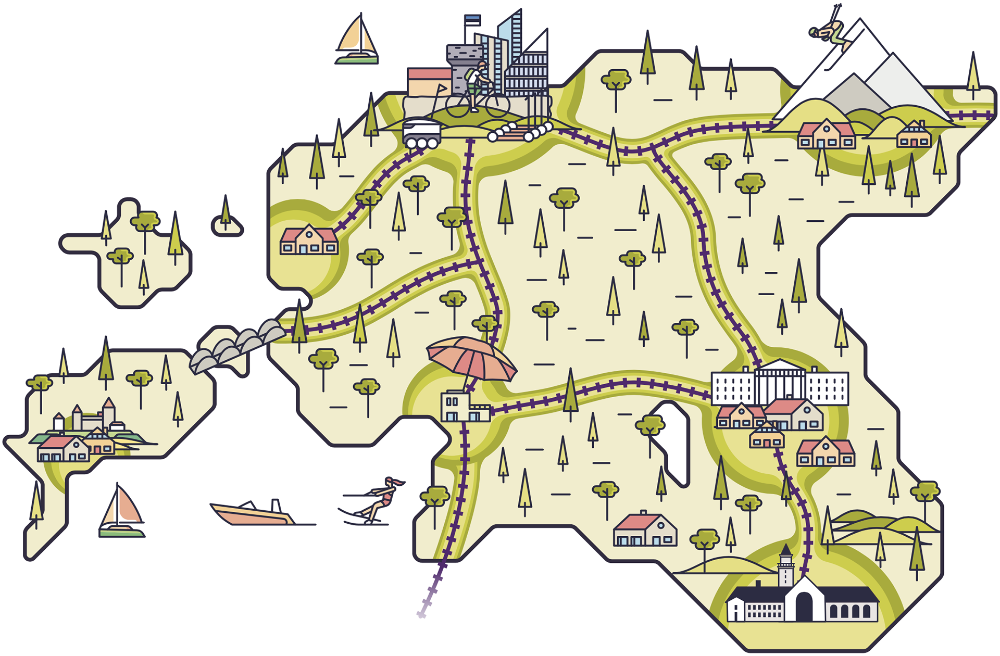
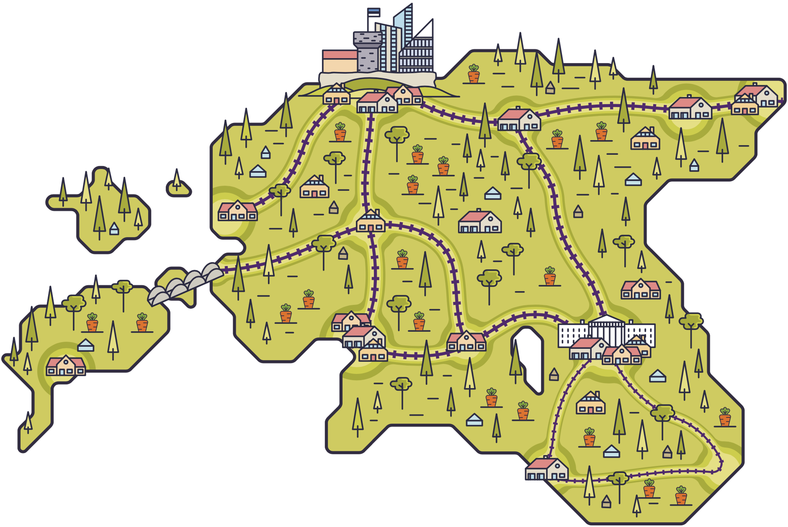

## Isemajandav Eesti {-.chapter_section .chapter5_section .future_section}

<div><a class="print-btn" href="print/EIA-2019-5.1-Isemajandav.pdf"><i class="fa fa-file" aria-hidden="true"></i>Trükiversioon</a></div>

```{r, out.width='100%', fig.align='center', echo=FALSE, message=FALSE}



```

<table class="future-table">
<tbody>

<tr>
<td align="left" class="future-table-black">Rahvastik linnades:</td>
<td align="right" class="future-table-red">60%</td>
</tr>

<tr>
<td align="left" class="future-table-black">Varanduslik kihistumine:</td>
<td align="right" class="future-table-red">väike, aga ühiskond pole kuigi rikas</td>
</tr>

<tr>
<td align="left" class="future-table-black">Ruumiline ebavõrdsus:</td>
<td align="right" class="future-table-red">esineb paikkonniti</td>
</tr>

<tr>
<td align="left" class="future-table-black">Hea avalik ruum:</td>
<td align="right" class="future-table-red">võimas rohevõrgustik, aga vähem linnalist keskkonda</td>
</tr>

<tr>
<td align="left" class="future-table-black">Andmed:</td>
<td align="right" class="future-table-red">igaühe omad, tugevad küberkogukonnad</td>
</tr>

<tr>
<td align="left" class="future-table-black">Ühiskonna kulutused baastaristule:</td>
<td align="right" class="future-table-red">suured, aga võrdsemalt jagatud</td>
</tr>

<tr>
<td align="left" class="future-table-black">Sotsiaal-majanduslik efektiivsus:</td>
<td align="right" class="future-table-red">keskmisest väiksem, aga võrdselt jagatud</td>
</tr>

<tr>
<td align="left" class="future-table-black">Säästva arengu eesmärgid:</td>
<td align="right" class="future-table-red">oleme teistest veidi ees</td>
</tr>
</tbody></table>

```{r, out.width='100%', fig.align='center', echo=FALSE, message=FALSE}



```

Kliimakatastroofi, kaugtöövõimaluste ja uuskogukondliku majanduse tulemusena on suur osa eestlasi kolinud maale, mõne väiksema tõmbekeskuse lähedale. Vajadusi teenuste järele rahuldavad nii digitaalsed lahendused kui ka korralik talgukultuur ja naturaalmajandus – inimesed aitavad üksteist pidevalt, kuigi ka pisut sunnitult, sest väike riik ei suuda nii hajali elavatele inimestele kõike vajalikku tagada. Omajagu sõltub toimetulek ja teenuste kvaliteet ka kogukonna võimekusest: kus on häid eestvedajaid, seal elu edeneb, kuid kahjuks esineb ka vastupidist. Peale järelelonkijate on ka teisitimõtlejaid, kes peavad muud rahvast väärituks. Uussisserändajaid on kõikjal, eriti kogukondades, kes on uute tulijate kasulikkusest aru saanud. Neist peetakse väga lugu, sest nad panevad õla alla seal, kus meil omal jõudu napib. Sotsiaal-majanduslikult on suur rõhk omakasvatatud toidul, oma 3D-prinditud asjadel ja ühistulisel energiatootmisel. Just nagu kunagistes taludes, tehakse päris palju ära ise ja pereringis. Terve Eesti on ühendatud raudteevõrguga, mis on üsna hästi seotud ka mitmesuguste „viimase kilomeetri“ lahendustega, mille seast saab valida sobiva ja taskukohase liikumisviisi. Avalik ruum on pigem looduslik keskkond ja looduses aktiivselt liikumisest on saanud eestluse lahutamatu osa. Eesti on Euroopas kuulus oma elujõuliste metsade ja puhaste randade poolest. Õnneindeksis on Eesti tubli, tõusis hiljuti mitu kohta, aga nüüd paistab, et klaaslagi on ees. Tühja neist indeksitest, elu on ju mõnus, mõtlevad eestimaalased omakeskis, ning panevad suitsusauna küdema.

<div class="future-illustration">
```{r, out.width='100%', fig.align='center', echo=FALSE, message=FALSE}


```
</div>