# Autorid ja toimetajad {.chapter6 .chapter6_section .chapter_section}

### Peatoimetaja {-.chapter6_section}

<div class="author-container">

<div>
```{r, out.width='50%', fig.align='left'}
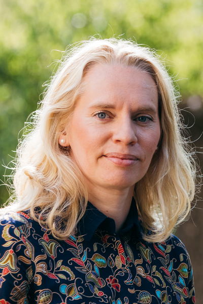
```
</div>

<div>
#### Helen Sooväli-Sepping {-.head-editor-name}
on Tallinna Ülikooli jätkusuutliku arengu prorektor, keskkonnakorralduse professor ja kultuurigeograafia vanemteadur. Ta vastutab TLÜs keskkonnakorralduse ja linnakorralduse magistriõppekava eest. Tema põhilised uurimisteemad käsitlevad ruumi- ja maastikuplaneerimist. Praegu huvitavad teda kõige enam kultuuri ja kogukondlikkuse aspektid, samuti säästva arengu ja säilenõtkuse teemad nii linna- kui ka maapiirkonnas, keskkonnapoliitika ning kodanikuteadus.

</div>
</div>

### Peatükkide toimetajad {-.chapter6_section}

<div class="author-container">

<div>
```{r, out.width='50%', fig.align='left'}
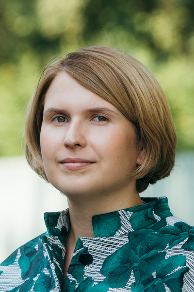
```
</div>

<div>
#### Kristi Grišakov {-.editor-name}
on Tallinna Tehnikaülikooli arhitektuuri ja urbanistika akadeemia lektor ja maastikuarhitektuuri õppekavade programmijuht. Tema uurimistöö keskendub prognooside ja stsenaariumide kasutusvõimalustele ruumianalüüsis ja tulevikuvisioonide koostamisel. Süvitsi on ta uurinud piiriüleste linnade (Tallinn-Helsingi) temaatikat, Euroopa Liidu ruumipoliitikat, sealhulgas suurte taristuprojektide mõju kohalikule keskkonnale ja uute tehnoloogiate mõju linnakeskkonnale.

</div>
</div>


<div class="author-container">
<div>
```{r, out.width='50%', fig.align='left'}
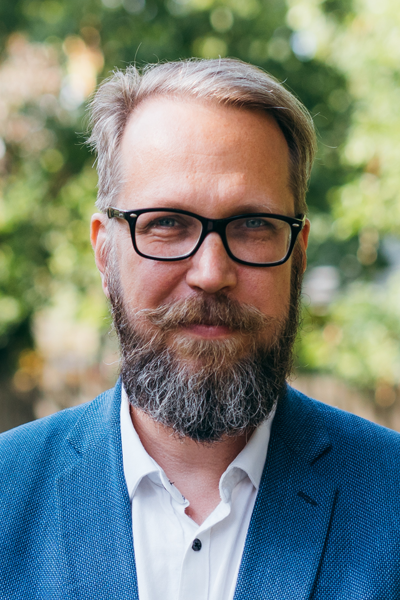
```
</div>

<div>
#### Indrek Ibrus {-.editor-name}
on Tallinna Ülikooli Balti filmi, meedia, kunstide ja kommunikatsiooni instituudi (BFM) meediainnovatsiooni professor ning TLÜ meediainnovatsiooni ja digikultuuri tippkeskuse juhataja. Ta juhib TLÜs ka audiovisuaalkunstide ja meediauuringute doktoriõppekava. Tema peamised uurimisteemad on meedia innovatsioon ja digikultuur seotuna majandusteaduslike innovatsiooniuuringute ning mitmesuguste kultuuri uurimise meetodite ja lähenemistega.

</div>
</div>


<div class="author-container">
<div>
```{r, out.width='50%', fig.align='left'}
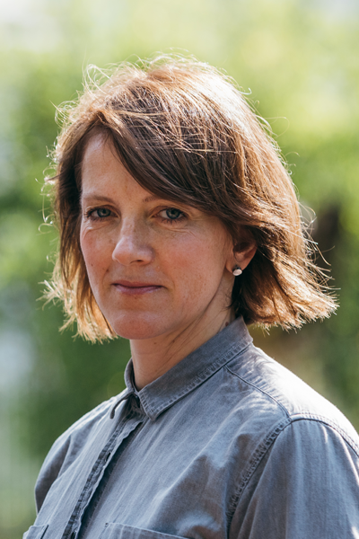
```
</div>

<div>
#### Epp Lankots {-.editor-name}
on Eesti Kunstiakadeemia teadusprorektor ning kunstiteaduse ja visuaalkultuuri instituudi vanemteadur. Tema uurimisteemad on 20. sajandi arhitektuur ja elukeskkond, Nõukogude uuringud, ruumi- ja materiaalse kultuuri teooriad, 20. sajandi arhitektuurihistoriograafia ja kunstiajalookirjutus. 2015. aastal sai ta Eesti Kultuurkapitali arhitektuuri sihtkapitali tegevuspreemia arhitektuurialase teadustöö eest.

</div>
</div>


<div class="author-container">
<div>
```{r, out.width='50%', fig.align='left'}
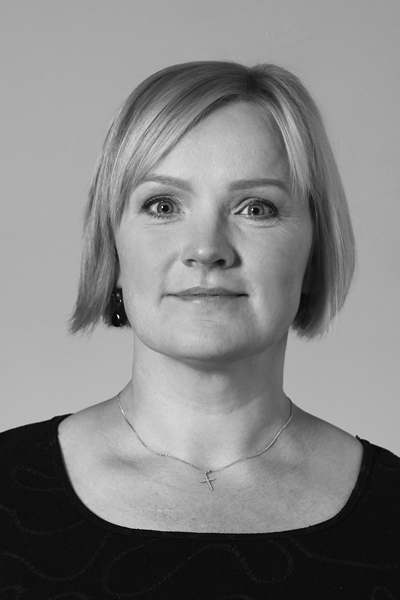
```
</div>

<div>
#### Kadri Leetmaa {-.editor-name}
on Tartu Ülikooli ökoloogia ja maateaduste instituudi inimgeograafia vanemteadur ning TÜ rände- ja linnauuringute keskuse juhataja. Tema uurimisteemad on ränne ja ebavõrdsus ruumis, inimeste elukohaeelistused linnades, rahvustevahelised kontaktid ühiskonnas ja ruumis, linna- ja regionaalplaneerimine. Alates 2017. aastast on ta Euroopa Liidu koostööprogrammi URBACT Eesti esindaja.

</div>
</div>


<div class="author-container">
<div>
```{r, out.width='50%', fig.align='left'}
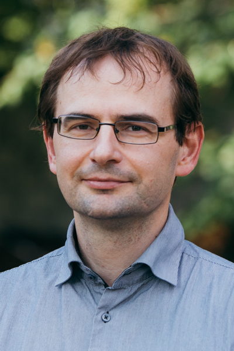
```
</div>

<div>
#### Asko Lõhmus {-.editor-name}
on loomaökoloog, Tartu Ülikooli juhtivteadur ja loodusressursside õppetooli juhataja. Tema teadustöö on aastakümnetega laienenud elurikkuse säilitamise ja säästva arengu laiale teemavaldkonnale, eriti looduslike ökosüsteemide säästlikule majandamisele. Ta on osalenud eksperdina paljudes riiklikes planeerimisprotsessides ning tema huvialade hulka kuulub ka säästva arengu juhtimine, muu hulgas kodanikuühiskonna kaudu.

</div>
</div>

### Autorid {-.chapter6_section}

<div class="author-container">
<div>
```{r, out.width='50%', fig.align='left'}
knitr::include_graphics('figures/6-authors/DagoAntov.png')
```
</div>

<div>
#### Dago Antov {-.author-name}
on Tallinna Tehnikaülikooli transpordiplaneerimise professor ning transpordi ja logistika teaduskeskuse juht. Tema peamised uurimisteemad on liikuvus, liikumisviiside lõimivus, liiklusvõrkude analüüs ja liikluse mõjud, eelkõige liiklemise ohutus. Ta on avaldanud enam kui 40 teadusartiklit ja juhendanud ligi 50 doktori- ja magistritööd. Ta on õpetanud liikuvusega seonduvaid kursusi TTÜs, Eesti Kunstiakadeemias, Sisekaitseakadeemias, Tartu Ülikoolis ja mujal.

</div>
</div>

<div class="author-container">
<div>
```{r, out.width='50%', fig.align='left'}
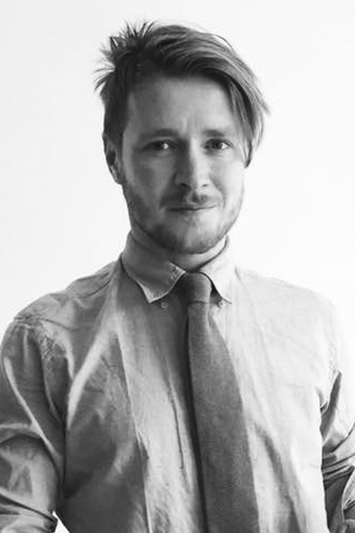
```
</div>

<div>
#### Mihkel Kaevats {-.author-name}
on luuletaja, kriitik, TLÜ doktorant ja kodanikuaktivist, kes on praegu Tallinn 2021+ strateegia üks koostajatest. Ta oli üks Prussakovi nimelise rattaühingu (1997–2009) ja Uue Maailma Seltsi (2006–2013) eestvedajatest. Kirgliku jalgratturi ja jalutajana jälgib ta pidevalt ruumi ning seda kasutavaid inimesi. Tema osalusel valmiva Tallinna strateegia keskmes on hea avalik ruum ja arenguhüpe liikuvuses.

</div>
</div>

<div class="author-container">
<div>
```{r, out.width='50%', fig.align='left'}
knitr::include_graphics('figures/6-authors/VeronikaKalmus.png')
```
</div>

<div>
#### Veronika Kalmus {-.author-name}
on Tartu Ülikooli sotsioloogia professor. Tema uurimishuvid on seotud põlvkondade, sotsialiseerumise, hariduse, väärtuste, noorte kodanikuosaluse, meedia- ja ajakasutuse ning ühiskondlike muutuste, sealhulgas sotsiaalse aja kiirenemisega. Rahvusvahelise teadlasvõrgustiku EU Kids Online aktiivse liikmena ja Eesti töörühma juhina keskendub ta laste ja noorte internetikasutusele ning selle sotsiaalsele vahendamisele. 2008. aastal pälvis ta Vabariigi Presidendi Kultuurirahastu noore teadlase preemia.

</div>
</div>

<div class="author-container">
<div>
```{r, out.width='50%', fig.align='left'}
knitr::include_graphics('figures/6-authors/RaulKalvo.png')
```
</div>

<div>
#### Raul Kalvo {-.author-name}
on arhitekt, ettevõtte Inphysica Technology asutaja, Eesti Kunstiakadeemia digitaalse geomeetria õppejõud. Tema peamine huvi on ruumiliste andmetega seotud otsuste tegemine ning sellest lähtuv tarkvaraarendus. Levinuim neist on Urban Network Analysis toolbox for Rhino. Ta on seotud mitme liikuvusuuringu ja strateegiaprojektiga Eestis ning keskkonna tervisemõjude hindamisega Soomes. Lisaks teadustööle tegeleb ta projektidega sisearhitektuurist linnaehituseni.

</div>
</div>

<div class="author-container">
<div>
```{r, out.width='50%', fig.align='left'}
knitr::include_graphics('figures/6-authors/EloKiivet.png')
```
</div>

<div>
#### Elo Kiivet {-.author-name}
on arhitekt ja urbanist, Linnalabori juhatuse liige, Paide linnaarhitekt ning neljandat aastat arvamusfestivali välialade ja linnaruumi kujunduse kuraator. Tema peamised huvid on avalik ruum, kohaloome ja ruumiharidus. Õpetanud Tallinna Tehnikakõrgkoolis, Tallinna Ülikoolis ja Eesti Kunstiakadeemias ning Arhitektuurikoolis ja Tallinna Kunstigümnaasiumis.

</div>
</div>

<div class="author-container">
<div>
```{r, out.width='50%', fig.align='left'}
knitr::include_graphics('figures/6-authors/KeitiKljavin.png')
```
</div>

<div>
#### Keiti Kljavin {-.author-name}
on urbanist, Linnalabori juhatuse liige ja urbanistide väljaande U toimetaja. Praegu juhendab ta Eesti Kunstiakadeemia arhitektuuri ja linnaplaneerimise osakonnas urbanistika ja sisearhitektuuri magistrante nende lõputöödes ja erialastuudiotes.

</div>
</div>

<div class="author-container">
<div>
```{r, out.width='50%', fig.align='left'}
knitr::include_graphics('figures/6-authors/Kaija-LuisaKurik.png')
```
</div>

<div>
#### Kaija-Luisa Kurik {-.author-name}
on Manchesteri arhitektuuriülikooli doktorant ning Heritage Action Zone’i regeneratsiooniprojekti projektijuht Rochdale’is. Tema peamised uurimisteemad on linnade regeneratsioon, postsotsialistlik linnaruum ning planeerimispraktika muutused.

</div>
</div>

<div class="author-container">
<div>
```{r, out.width='50%', fig.align='left'}
knitr::include_graphics('figures/6-authors/RagneKouts-Klemm.png')
```
</div>

<div>
#### Ragne Kõuts-Klemm {-.author-name}
on Tartu Ülikooli ajakirjandussotsioloogia dotsent ja ühiskonnateaduste instituudi asejuhataja. Tema teadustöö valdkonnad on keskendunud meediakasutusele ja ühiskonna muutumisele, laiemalt on teda huvitanud meedia roll ühiskondliku sidususe tekkes. Praeguseks on tema teemade hulka lisandunud ka ajakirjanduses toimunud muutuste analüüs ja tõlgendamine.

</div>
</div>

<div class="author-container">
<div>
```{r, out.width='50%', fig.align='left'}
knitr::include_graphics('figures/6-authors/AnneliKahrik.png')
```
</div>

<div>
#### Anneli Kährik {-.author-name}
on Tartu Ülikooli linnageograafia vanemteadur. Tema peamised uurimisteemad on ränne, segregatsioon, linna- ja eluasemepoliitika. Praegu keskendub tema uurimistöö peamiselt segregatsiooni ja lõimumise seostele eri eluvaldkondades (pere, elukoht, kool, töö), mida ta uurib Eesti ja Soome suurte riigiandmete (loendused, registrid) alusel. 2013–2016 töötas ta teadurina Uppsala ülikoolis, uurides segregatsiooni Rootsis. Ta on avaldanud artikleid kõrgetasemelistes erialaajakirjades.

</div>
</div>

<div class="author-container">
<div>
```{r, out.width='50%', fig.align='left'}
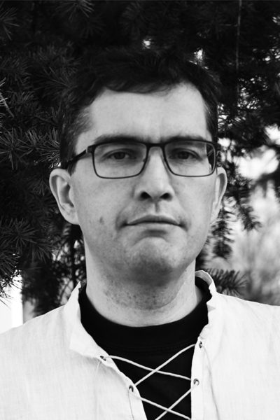
```
</div>

<div>
#### Mait Lang {-.author-name}
on Tartu Ülikooli Tartu Observatooriumi vanemteadur ja Eesti Maaülikooli metsandus- ja maaehitusinstituudi dotsent. Tema peamised uurimisteemad on seotud looduse kaugseirega ning ruumi- ja kaugseireandmete töötlemisega.

</div>
</div>

<div class="author-container">
<div>
```{r, out.width='50%', fig.align='left'}
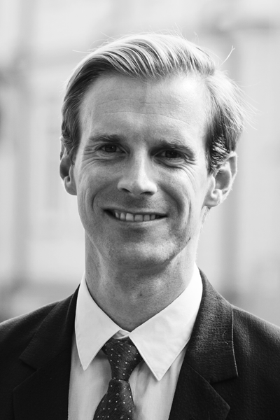
```
</div>

<div>
#### Bradley Loewen {-.author-name}
on kaitsnud doktorikraadi Tartu Ülikooli majandusteaduskonnas ning oli Marie Curie innovaatilise koolituse võrgustiku RegPol 2 karjääri alustav teadlane Tšehhis, Ungaris ja Eestis. Ta on Norra teadus- ja tehnikaülikooli NTNU säästva ehituse teadur ning töötanud Briti Columbia ja Toronto ülikoolis. Tema uurimisteemad hõlmavad Euroopa linna- ja regionaalplaneerimist ning poliitikat, institutsioone, valitsemist ja innovatsiooni.

</div>
</div>

<div class="author-container">
<div>
```{r, out.width='50%', fig.align='left'}
knitr::include_graphics('figures/6-authors/Mari-LiisMadisson.png')
```
</div>

<div>
#### Mari-Liis Madisson {-.author-name}
on Tartu Ülikooli semiootika teadur, kelle peamised uurimisteemad on identiteediloome, strateegilised narratiivid ja veebikeskkondades leviv desinformatsioon. Ta on teinud koostööd Kaitseväe Ühendatud Õppeasutustega ning osalenud sõjalist kommunikatiivset pettetegevust käsitlevates uurimisprojektides. 2019 alustas ta Belfasti Queen’si ülikoolis järeldoktorantuuri, mis on pühendatud strateegiliste vandenõunarratiivide semiootilisele uurimisele.

</div>
</div>

<div class="author-container">
<div>
```{r, out.width='50%', fig.align='left'}
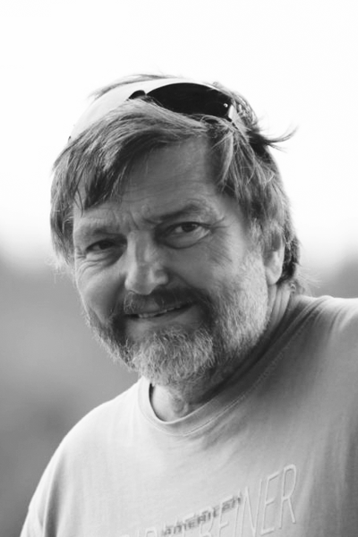
```
</div>

<div>
#### Tõnu Oja {-.author-name}
on Tartu Ülikooli geoinformaatika ja kartograafia õppetooli juhataja ning professor. Tema peamised uurimisvaldkonnad on maastikuökoloogia ja säästlik areng.

</div>
</div>

<div class="author-container">
<div>
```{r, out.width='50%', fig.align='left'}
knitr::include_graphics('figures/6-authors/ArkoOlesk.png')
```
</div>

<div>
#### Arko Olesk {-.author-name}
on teadusajakirjanik ja Tallinna Ülikooli Balti filmi, meedia, kunstide ja kommunikatsiooni instituudi teaduskommunikatsiooni lektor. Tema keskne uurimisteema on teadlaste suhtlus ajakirjandusega, samuti tunneb ta huvi innovatsiooni- ja keskkonnakommunikatsiooni vastu. Ta juhib Raadio 2s populaarteaduslikku saadet „Puust ja punaseks“.

</div>
</div>

<div class="author-container">
<div>
```{r, out.width='50%', fig.align='left'}
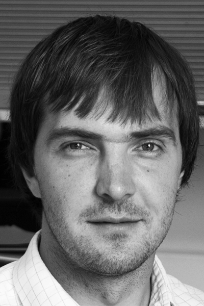
```
</div>

<div>
#### Hans Orru {-.author-name}
on Tartu Ülikooli keskkonnatervishoiu dotsent ning Umea ülikooli külalisteadur. Tema peamised uurimisvaldkonnad on väliskeskkonna mõju inimeste tervisele. Selle raames on ta keskendunud õhusaastele ja kliimamuutustele, kuid viimasel ajal ka põlevkivisektorile, siseõhusaastele ja müra tervisemõjudele. Viimase 15 aasta jooksul on ta osalenud enam kui 30 teadus- või rakendusuuringus, millel on olnud oluline mõju keskkonna tervisemõjude teadvustamisele ühiskonnas.

</div>
</div>

<div class="author-container">
<div>
```{r, out.width='50%', fig.align='left'}
knitr::include_graphics('figures/6-authors/KatiOrru.png')
```
</div>

<div>
#### Kati Orru {-.author-name}
on kestlikkuse sotsioloogia vanemteadur Tartu Ülikooli ühiskonnateaduste instituudis ja külalisteadur King’s College Londonis. Tema uurimisvaldkonnad on sotsiaalne ja piirkondlik ebavõrdsus transpordi- ja energiatarbimises ning selle keskkonnamõjud, planeeringute sotsiaalsete mõjude hindamise metoodika, sotsiotehniliste süsteemide jätkusuutlik areng. Ta juhib tööpakki H2020 BuildERS projektis kogukondade kerksusest hädaolukordades. Ta on olnud järeldoktorantuuris Umea ülikooli keskkonna- ja tervisepsühholoogia uurimisrühmas.

</div>
</div>

<div class="author-container">
<div>
```{r, out.width='50%', fig.align='left'}
knitr::include_graphics('figures/6-authors/ToomasPaaver.png')
```
</div>

<div>
#### Toomas Paaver {-.author-name}
on Eesti Kunstiakadeemia arhitektuuri ja linnaplaneerimise eriala doktorant. Tema peamine uurimisteema on arhitekti töö ühiskondlik roll. Tema mitmekesine praktika ruumiloome valdkonnas hõlmab töid linna- ja riigiametnikuna, asumiseltsi aktivistina, arhitektina ja õpetajana. Tema töö on olnud seotud planeeringutega, tänavate ja hoonete ehitusprojektidega, lähteülesannetega, õigusloomega ning seoste loomisega ruumiloomeprotsessides.

</div>
</div>

<div class="author-container">
<div>
```{r, out.width='50%', fig.align='left'}
knitr::include_graphics('figures/6-authors/IngmarPastak.png')
```
</div>

<div>
#### Ingmar Pastak {-.author-name}
on omandamas doktorikraadi geograafias ja töötab Tartu Ülikooli inimgeograafia nooremteadurina. Tema peamised uurimisteemad on sotsiaalruumiline ebavõrdsus, gentrifikatsioon nii rahvastikuprotsessi kui ka ettevõtluskeskkonna muutusena ning laiemalt linnaplaneerimine targa linna innovatsioonidest kaasamispraktikateni. Ta õpetab TÜ linnageograafia ja –planeerimisega seonduvaid kursusi.

</div>
</div>

<div class="author-container">
<div>
```{r, out.width='50%', fig.align='left'}
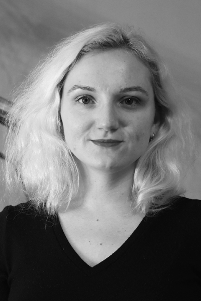
```
</div>

<div>
#### Johanna Pirrus {-.author-name}
on Tartu Ülikooli geograafia osakonna inimgeograafia doktorant. Tema peamine uurimisteema on kaasav linnaplaneerimine ja –valitsemine. Tema praegune uurimistöö keskendub eelkõige paneelelamupiirkondade avaliku ja sotsiaalse ruumi küsimustele ning headele tavadele. Lisaks teadustööle tegeleb ta geograafia osakonnas õpetamise ja lõputööde juhendamisega.

</div>
</div>

<div class="author-container">
<div>
```{r, out.width='50%', fig.align='left'}
knitr::include_graphics('figures/6-authors/BiankaPluschke-Altof.png')
```
</div>

<div>
#### Bianka Plüschke-Altof {-.author-name}
on Tallinna Ülikooli keskkonnasotsioloogia teadur. Ta on õppinud ja töötanud Berliini Humboldti ülikoolis, Varssavi ülikoolis, Slovakkia tehnikaülikoolis ja Tartu Ülikoolis. Tema uurimistöö keskendub sotsiaal-ruumilisele ebavõrdsusele ning ruumi loomise praktikatele ja diskursustele. Doktoritöös uuris ta territoriaalse häbimärgistamise teemat Eesti maakohtade näitel. Lisaks uurib ta linnakeskkonna küsimusi TLÜ uurimisrühmas „Inimese ja looduse vastastikmõju linnastuvas maailmas“.

</div>
</div>

<div class="author-container">
<div>
```{r, out.width='50%', fig.align='left'}
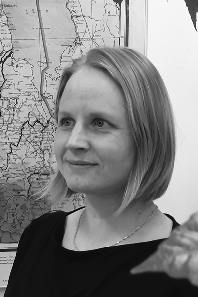
```
</div>

<div>
#### Age Poom {-.author-name}
on Helsingi Ülikooli järeldoktorantuuri teadur ja Tartu Ülikooli keskkonnakaitse lektor. Ta tegeleb inimeste liikuvuse, tegevusruumi ja keskkonna vastastikusteseoste uurimisega, sealhulgas analüüsides rohealadega kokkupuudet ja keskkonnariskidele avatust. Talle pakub huvi säästva liikumise ja tarbimise ning targa ja jätkusuutliku linna temaatika. TÜ mobiilsuslabori liikmena tegeleb ta mobiilipõhiste ruumikasutusuuringute andmetaristu arendamise ja väliskoostööprojektidega.

</div>
</div>

<div class="author-container">
<div>
```{r, out.width='50%', fig.align='left'}
knitr::include_graphics('figures/6-authors/ReneePuusepp.png')
```
</div>

<div>
#### Renee Puusepp {-.author-name}
on arhitekt, ettevõtte Creatomus Solutions asutaja ja tegevjuht, Eesti Kunstiakadeemia vanemteadur. EKA arhitektuuriteaduskonnas täidab ta teadustöö juhi kohustusi. Oma varasemas uurimistöös keskendus ta eelkõige dünaamiliste simulatsioonide loomisele ja sidumisele arhitektuuri ja planeerimise vahendite ja meetoditega. Praegu juhib ta masskohandatavate tehasemajade uurimis- ja tootearendussuunda.

</div>
</div>

<div class="author-container">
<div>
```{r, out.width='50%', fig.align='left'}
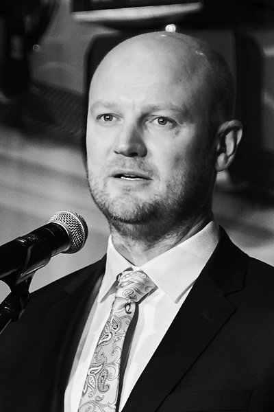
```
</div>

<div>
#### Siim Raie {-.author-name}
on Muinsuskaitseameti peadirektor. Õppinud ärijuhtimist Estonian Business Schoolis ning muinsuskaitse ja konserveerimise eriala Eesti Kunstiakadeemias, kus jätkuvad ka doktoriõpingud. Tema uurimistöö teema on mälestise omanikud, nende identiteet ja motivatsioon. Varem on ta töötanud Vabariigi Presidendi Kantselei direktori ja Eesti Kaubandus-Tööstuskoja peadirektorina.

</div>
</div>

<div class="author-container">
<div>
```{r, out.width='50%', fig.align='left'}
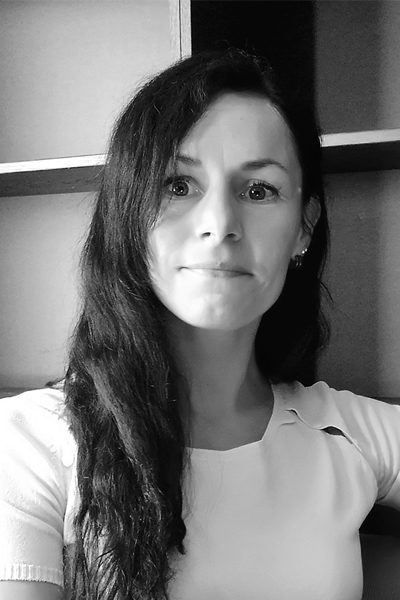
```
</div>

<div>
#### Merlin Rehema {-.author-name}
on Tallinna Ülikooli humanitaarteaduste instituudi kultuurigeograafia suuna doktorant ning Hendrikson &amp; Ko liikuvusspetsialist. Oma doktoritöös uurib ta jalgsi liikumist mõjutavaid füüsilisi ja ühiskondlikke tegureid ning nende võimalikke mõjutusmehhanisme. Peamised uurimishuvid ja töövaldkonnad on eri tasandite liikuvusuuringud ning säästva transpordi planeerimine liikuvuskavade ja linnaruumi muutuste kaudu.

</div>
</div>

<div class="author-container">
<div>
```{r, out.width='50%', fig.align='left'}
knitr::include_graphics('figures/6-authors/LiinaRemm.png')
```
</div>

<div>
#### Liina Remm {-.author-name}
on Tartu Ülikooli looduskaitsebioloogia teadur. Oma uurimistöödes tegeleb ta elurikkuse hoidmise ja looduslikkuse taastamise võtetega. Teemavaldkonnad on varieerunud säästvast metsamajandamisest ja soode taastamisest looduse hüvede ehk ökosüsteemiteenuste kaardistamiseni. Ta on osalenud rohkem kui 15 teadusartikli ja paljude populaarteaduslike artiklite kirjutamisel. Loodusharidust jagab ta üliõpilaste juhendaja, õppejõu ja Eestimaa Looduse Fondi talgujuhina.

</div>
</div>

<div class="author-container">
<div>
```{r, out.width='50%', fig.align='left'}
knitr::include_graphics('figures/6-authors/AnttiRoose.png')
```
</div>

<div>
#### Antti Roose {-.author-name}
on Tartu Regiooni Energiaagentuuri kliima- ja energiaprojektide juht. Tema linnastumisuuringud on keskendunud eeslinnadele, energiakasutusele, planeerimisele ning kliimamuutustega kohanemisele. Toimetas õpikut „Peatükke planeerimisest“ (2013). On koostanud ruumilise arengu dokumente nii Euroopa Liidu kui ka väikevaldade tasemel. Euroopa territoriaalse koostöö ekspert.

</div>
</div>

<div class="author-container">
<div>
```{r, out.width='50%', fig.align='left'}
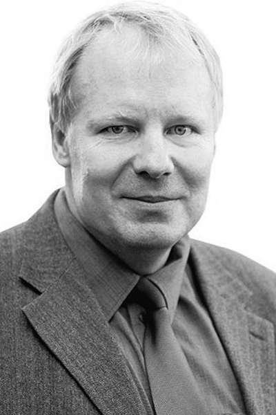
```
</div>

<div>
#### Kalev Sepp {-.author-name}
on Eesti Maaülikooli keskkonnakaitse ja maastikukorralduse professor ning samanimelise õppetooli juhataja. Tema lai uurimisvaldkond hõlmab maakasutuse muutusi ja selle mõju elurikkusele, maastiku planeerimist, kaitsealade jätkusuutlikust, loodushoiu mõju regionaalsele arengule, loodusehüvede hindamist ja kaardistamist, kaugseire rakendamist maastikuseires. Ta on osalenud eksperdina paljude riiklike metoodikate ja strateegiadokumentide koostamisel. Rahvusvahelise Looduskaitseliidu ekspert.

</div>
</div>

<div class="author-container">
<div>
```{r, out.width='50%', fig.align='left'}
knitr::include_graphics('figures/6-authors/AndraSiibak.png')
```
</div>

<div>
#### Andra Siibak {-.author-name}
on Tartu Ülikooli ühiskonnateaduste instituudi meediauuringute professor ning meedia ja kommunikatsiooni doktoriõppekava juht. Tema peamised uurimishuvid on seotud laste ja noorte internetikasutuse, internetikasutuse vahendamise, uue meedia auditooriumide ning privaatsuse teemadega. 2015 pälvis Vabariigi Presidendi Kultuurirahastu noore teadlase preemia, 2017. aastast programmi „Silmapaistev noor eestlane“ (TOYP) laureaat.

</div>
</div>

<div class="author-container">
<div>
```{r, out.width='50%', fig.align='left'}
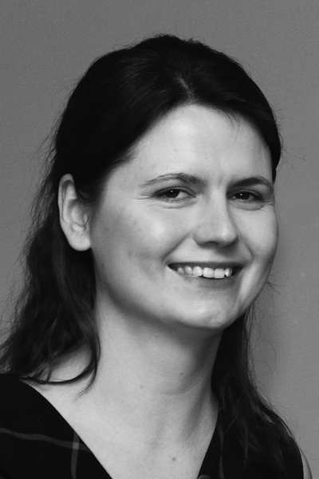
```
</div>

<div>
#### Triin Talk {-.author-name}
on restauraator ja muinsuskaitsja, kes on töötanud Tallinna Kultuuriväärtuste Ametis miljööalade spetsialistina ning Muinsuskaitseametis ehitismälestiste peainspektorina.

</div>
</div>

<div class="author-container">
<div>
```{r, out.width='50%', fig.align='left'}
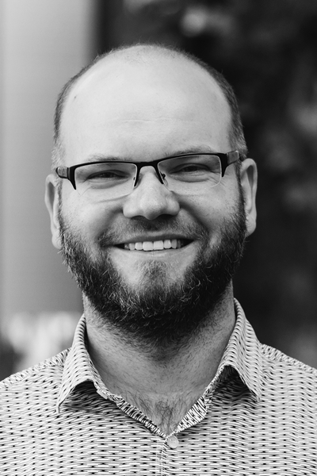
```
</div>

<div>
#### Tauri Tuvikene {-.author-name}
on linnageograaf, kes töötab Tallinna Ülikooli humanitaarteaduste instituudi maastiku ja kultuuri keskuses vanemteadurina. Tema uurimisvaldkond on liikuvuskultuurid ja postsotsialistlikud linnauuringud. Neil teemadel on ta avaldanud teadusartikleid tunnustatud ajakirjades Current Sociology, IJURR jt. Ta on raamatu „Post-Socialist Urban Infrastructures“ (Routledge, 2019) toimetaja. Alates 2019 juhib humanitaarteaduste võrgustiku HERA rahvusvahelist projekti ühistranspordist kui avalikust ruumist.

</div>
</div>

<div class="author-container">
<div>
```{r, out.width='50%', fig.align='left'}
knitr::include_graphics('figures/6-authors/KartVaarmari.png')
```
</div>

<div>
#### Kärt Vaarmari {-.author-name}
on Eestimaa Looduse Fondi arendusjuht ja juhatuse liige. Varem tegutsenud keskkonnajuristina, olles muu hulgas üks Keskkonnaõiguse Keskuse asutajatest. Keskkonnaõiguse valdkonnas on tema uurimisteemad olnud keskkonnaalased õigused, avalikkuse kaasamine keskkonnaotsuste tegemisse ning valitsusväliste vabaühenduste roll avaliku keskkonnahuvi esindamisel. Ta on olnud keskkonnaseadustiku üldosa seaduse kommenteeritud väljaande (2015) toimetaja ja kaasautor ning avaldanud artikleid ajakirjades nagu Journal for European Environmental and Planning Law, Juridica jt.

</div>
</div>

<div class="author-container">
<div>
```{r, out.width='50%', fig.align='left'}
knitr::include_graphics('figures/6-authors/SiimVahtrus.png')
```
</div>

<div>
#### Siim Vahtrus {-.author-name}
töötab Keskkonnaõiguse Keskuses. Ta on koostanud juhendeid keskkonnamõju hindamise, avalikkuse kaasamise ning ruumilise planeerimise teemal. Ta on keskkonnaseadustiku üldosa seaduse kommenteeritud väljaande (2015) ning „Keskkonnamõju strateegilise hindamise käsiraamatu“ (2017) kaasautor. Ta on avaldanud artikleid rahvusvahelistes teadusajakirjades nagu Juridica International, European Energy and Environmental Law Review ja Impact Assessment and Project Appraisal.

</div>
</div>

<div class="author-container">
<div>
```{r, out.width='50%', fig.align='left'}
knitr::include_graphics('figures/6-authors/AndreasVentsel.png')
```
</div>

<div>
#### Andreas Ventsel {-.author-name}
on Tartu Ülikooli semiootika vanemteadur. Tema peamised uurimisteemad on poliitiline semiootika, visuaalsemiootika, strateegilised narratiivid infosõja kontekstis ja mõjutustegevus veebikeskkonnas. Ta on osalenud rohkem kui tosinas teadusprojektis. Ta on teinud koostööd Kaitseväe Ühendatud Õppeasutustega ning juhib praegu sõjalisele kommunikatiivsele pettetegevusele pühendatud uurimisprojekti.

</div>
</div>

<div class="author-container">
<div>
```{r, out.width='50%', fig.align='left'}
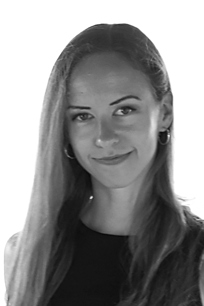
```
</div>

<div>
#### Annika Väiko {-.author-name}
on alates 2014. aastast Tartu Ülikooli rände- ja linnauuringute keskuse teadustöö assistent. Tal on magistrikraad inimgeograafia ja regionaalplaneerimise erialal. Tema peamised uurimisteemad on ränne, segregatsioon linnades ja elukohaliikuvus.

</div>
</div>
