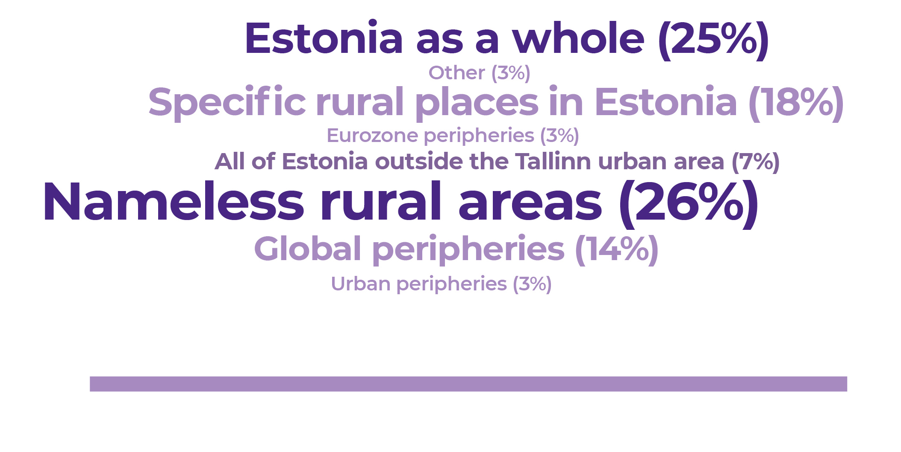

## Increasing regional polarisation in Estonia {.chapter_section .chapter1_section}

```{block, type='authors authors_eng'}
<div class="author-links">**[Bianka Plüschke-Altof](#bianka-plüschke-altof), [Bradley Loewen](#bradley-loewen) ja [Kadri Leetmaa](#kadri-leetmaa)**</div>
<div><a class="print-btn" href="../keskuse-ja-ääremaa-lõhe-eestis.html">EE</a></div>
```

```{block, type='points'}
* Peripheralisation is a process whereby economic, social, political and image-related factors cause inequality in socio-spatial development, creating a divide between cores and peripheries. These factors result in the emergence of a global, regional and local core-periphery hierarchy, which manifests itself in the loss of population, jobs and services in the peripheral areas and their concentration in core areas.
```


```{block, type='blockquote-right'}
The focus on regional competitiveness, an approach shared by Estonian and EU regional policy, has not helped to reverse peripheralisation.
```

In recent decades, growing social and spatial inequality has been prevalent in Central and Eastern European countries ([Lang and Görmar 2019](#Lang2019)). In Estonia, too, regional inequalities have increased, and large parts of the settlement system – once economically and socially viable small towns and rural areas – have become peripheral within the country. As most jobs are in major urban centres, rural exodus has become commonplace, especially among the younger generation. It has thus become increasingly difficult to ensure equal availability of vital services throughout the country, as the need for services decreases due to the parallel processes of demographic decline and ageing in Estonian peripheries. While acknowledging the established understanding of peripheralisation in Estonia, defined as a process of out-migration and loss of jobs and services in remote areas away from urban centres ([Säästva arengu komisjon 2010](#Säästva-arengu-komisjon2010)), this article argues that these objective processes are intertwined with the subjective stigmatisation of peripheral areas. We also discuss the extent to which the regional policy of Estonia and the European Union (EU) has helped to reduce the core-periphery divide. The article draws on demographic and economic data of Statistics Estonia (current population statistics, the 2011 census and the data on regional gross domestic product (GDP)) to describe regional polarization processes. For regional policy trends, we rely on the results of Bradley Loewen’s doctoral thesis defended at the University of Tartu in 2018 ([Loewen 2018](#Loewen2018); [Loewen and Schulz 2019](#Loewen2019)). The thesis analyses the development of regional policy in Estonia and other Central and Eastern European countries, as well as their relations with the EU cohesion policy. The description of subjective peripheralisation processes is based on Bianka Plüschke-Altof’s doctoral thesis ([Plüschke-Altof 2017](#Plüschke-Altof2017); [Plüschke-Altof and Grootens 2019](#Plüschke-Altof2019)), defended at the University of Tartu in 2017, and analysing the (re)production of peripheral images in rural Estonia and the local initiatives to counter it.

### Peripheralisation is self-reproducing {-.chapter1_section}

Increasing regional inequalities are manifested most clearly in the ongoing concentration of human and economic capital in Estonia’s major urban areas. This mostly happens at the expense of rural communities and small towns, where these resources disappear and remain absent from regional development. With the exception of the Tallinn urban area (Harjumaa county), all other Estonian counties have suffered from population loss between 1995 and 2017. The population of Harjumaa increased by 5% during this period. Tartu County was relatively stable with a population loss of 5% within this period, whereas other counties saw a remarkable population decline of between 12 and 27% ([Figure 1.2.1](#figure121)). Besides out-migration from peripheral areas to the major cities, migration abroad, enabled by Estonia joining the Schengen area in 2004, also plays a significant role. According to Statistics Estonia, the positive migration rate in recent years, including the return migration of people who previously left Estonia, also favours the capital region. For example, in 2018, 57% of those who settled in Estonia did so in Harjumaa. Moreover, many who are officially registered as Estonian residents regularly commute abroad. The 2011 census showed that between 3% (Harjumaa) and 8% (Pärnumaa) of registered residents in Estonian counties had actually worked abroad and could therefore be absent for a significant period of time.

<p class="caption" id="figure121"><span class="figure-number">Figure 1.2.1.</span> Regional polarisation in Estonia: population change and distribution of national GDP by county in 1995 and 2017</p>

```{r, figure121, out.width='100%', fig.asp=.75, fig.align='center', echo=FALSE, message=FALSE}

library(sf)          # classes and functions for vector data
library(raster)      # classes and functions for raster data
library(tmap)
library(svglite)

Maakonnad <- st_read(dsn ="../data/12_fig1_data/maakond_20200101.shp")
head(as.data.frame(Maakonnad))
Maakonnad <- Maakonnad[order(Maakonnad$MNIMI),]
Maakonnad$MNIMI <- c("Harju county", "Hiiu county", "Ida-Viru county", "Järva county", "Jõgeva county", "Lääne county", "Lääne-Viru county", "Pärnu county", "Põlva county", "Rapla county", "Saare county", "Tartu county", "Valga county", "Viljandi county", "Võru county")

fig_data <- read.csv("../data/12_fig1_data/fig_121_data.csv", header=TRUE, sep=";")
fig_data <- fig_data[order(fig_data$county_est),]

Maakonnad$Rahvaarvu_muutus <- fig_data$pop_change
Maakonnad$SKP1995 <- fig_data$GDP95
Maakonnad$SKP2016 <- fig_data$GDP16

names(Maakonnad)[names(Maakonnad) == "Rahvaarvu_muutus"] <- "Population change (%)"
names(Maakonnad)[names(Maakonnad) == "SKP1995"] <- "Share of national GDP in 1995 (%)"
names(Maakonnad)[names(Maakonnad) == "SKP2016"] <- "Share of national GDP in 2016 (%)"

fig_121_plot <- tm_shape(Maakonnad) +
    tm_fill("Population change (%)", title="Population change (percentage) 1995–2016",
    breaks = c(-30,-20, -10,0,10), palette = c("#B6A8CD","#6D519C","#361C62","#96CBD2"), popup.vars=c("Population change (%)","Share of national GDP in 1995 (%)","Share of national GDP in 2016 (%)")) +
    tm_borders(col="white") +

  tm_layout(
    legend.format=list(text.separator="...")) +

  tm_shape(Maakonnad) +
      tm_bubbles(col = "#dbe9da",alpha = 0.6, size = "Share of national GDP in 1995 (%)", scale = 541/640 * 8*1.7, border.col=NULL,xmod=-5, title.size="Share of national GDP in 1995 (%)", popup.vars=c("Population change (%)","Share of national GDP in 1995 (%)","Share of national GDP in 2016 (%)") ) +
      tm_text (col="white", text="Share of national GDP in 1995 (%)",xmod=-5) +

    tm_shape(Maakonnad) +
    tm_bubbles(col = "#369B9E",alpha = 0.6, size = "Share of national GDP in 2016 (%)", scale = 8*1.7, border.col=NULL,xmod=2, title.size="Share of national GDP in 2016 (%)",popup.vars=c("Population change (%)","Share of national GDP in 1995 (%)","Share of national GDP in 2016 (%)")) +
      tm_text (col="white", text="Share of national GDP in 2016 (%)", xmod=2) +

      tm_view (
        set.zoom.limits = c(7, 16),
        view.legend.position = c("left","bottom"),
        set.bounds = c(21.6397953631, 57.4745283067, 28.1316992531,59.8110903998),
      )

tmap_mode("view")
fig_121_plot

#tmap_save(tm = Rahvastiku_muutus + SKP, filename = "figure2.pdf")

#svg(filename="figure.svg")
#pop_change + GDP
#dev.off()

```

``` {block, type='figure-comment'}
<span class="figure-comment-start">Note:</span> Up to 1995, return migration to the former Soviet Union was a key factor in population change. During the observed period, GDP per capita increased in all the counties, but proportionally the greatest increase was concentrated in Harjumaa and Tartumaa.
```

``` {block, type='imgsource'}
<div><span class="imgsource-source">Source:</span> Statistics Estonia 2000; 2011.</div>
<div><a class="data-btn" href="../data/12_fig1_data.zip"><i class="fa fa-download" aria-hidden="true"></i>Download data</a></div>
```

In line with the concentration of human capital between 1995 and 2017, economic growth also favoured Harjumaa, which increased its contribution to the national GDP from 54 to 64%. Tartumaa increased its share of national GDP as well, while that of the other counties decreased, with the sharpest decline occurring in the industrial northeast of Estonia. There are also fewer and fewer jobs outside the urban centres. Commuting from the country to the cities has therefore become more commonplace. While there is no recent reliable data on commuting, a survey conducted in 2007–2009 ([Ahas et al. 2011](#Ahas2011)) showed that 28% of the population (380,000 people) were commuters in Estonia.

```{block, type='blockquote-left'}
The settlement system is increasingly biased towards major urban regions, or even exclusively towards the capital region.
```
These general trends confirm that regional inequalities have objectively deepened in Estonia ([Annist 2017](#Annist2017); [Noorkõiv 2009](#Noorkõiv2009)), and are directly linked to population decline and dwindling economic activity in the peripheral areas. As jobs and services concentrate in larger centres, this results in a loss of employment opportunities and other necessities for people living in rural areas and small towns.The settlement system is increasingly biased towards major urban regions, or even exclusively towards the capital region. Growing regional inequalities and an inevitable decline of non-core regions have also been well documented in other Central and Eastern European countries and elsewhere in Europe ([Lang and Görmar 2019](#Lang2019)). In fact, Estonian small towns and rural areas are located in a so-called double-periphery – far from the main centres within Estonia but also on the extreme periphery in relation to the European core. This makes it even more difficult to reverse peripheralisation, understood as a multifaceted, multi-level process that produces social and spatial inequalities.

As in other European nations, the global trends of de-industrialisation, increasing automation and a declining agricultural sector also affect Estonia ([Raagmaa and Noorkõiv 2013](#Raagmaa2013)). NThe collapse of the Soviet economy launched a very compressed economic shock in the 1990s; the restructuring that occurred over decades in other countries was experienced in Estonia over only a couple of years ([Annist 2017](#Annist2017)). Jobs disappeared in both the urban industrial and rural agricultural sectors, heavily affecting the industrial northeast, small mono-functional industrial towns throughout the country and agricultural regions in the south – the counties of Viljandimaa, Valgamaa, Võrumaa and Põlvamaa among others. As the previously strong agricultural sector had also supported the service economy (personal and related producer and administrative services), the economic reorganisation hit the agricultural regions particularly severely. In the southern Estonian counties listed above, the share of workforce in the primary sector (mainly agriculture) dropped from 37% in 1990 to only 9% by 2017. The total number of employed people decreased from 91,400 in 1990 to 61,400 in 2017 and from 33,600 to 5,600 in the primary sector. Only the industrial Ida-Virumaa county faced a faster employment decline in the same period (more than 50%). New jobs have been created in the service sector, especially in rural tourism ([Raagmaa and Noorkõiv 2013](#Raagmaa2013)), which benefits from the tendency of seasonal living in rural areas during the summer (estimated at 5% of Estonian residents – [Ahas et al. 2011](#Ahas2011)). However, the structural loss of employment in agriculture has far out-weighed these new income opportunities.

```{block, type='blockquote-right'}
The economic restructuring and new residential and commuting patterns support a vicious cycle of population decline that also leads to the disappearance of essential public services, such as schools, further fuelling shrinkage.
```
Even though the main changes in agricultural employment occurred already in the 1990s, the shrinkage has not stopped since. The total number of employed persons in the four counties in southern Estonia has remained stable since the early 2000s (63,000 employed in 2001), but there are fewer jobs available close to the place of residence, thus requiring more long-distance commuting ([Figure 1.2.2](#figure122)). ). In 2000, most of the employed residents of the counties of southern Estonia worked in their home county; by 2011, 23% worked outside their home county and 7% outside Estonia. In the case of transnational migrants, who commute for work but remain tied to their place of residence, the most important destination for Estonians is Finland ([Annist 2017](#Annist2017); [Anniste et al. 2017](#Anniste2017)). This means that many commuters are only in their home regions on weekends or even less often, which may also cause the out-migration of their families over the long term. The economic restructuring and new residential and commuting patterns support a vicious cycle of population decline that also leads to the disappearance of essential public services, such as schools, further fuelling shrinkage.

<p class="caption" id="figure122"><span class="figure-number">Figure 1.2.2.</span> Workplace location – in county of residence, elsewhere in Estonia or outside Estonia – among the residents of the counties of Viljandimaa, Valgamaa, Võrumaa and Põlvamaa in 2000 and 2011</p>

```{r, figure122, out.width='80%', fig.asp=.75, fig.align='center', echo=FALSE, message=FALSE}

library("tidyverse")
library("svglite")

  fig122_data <- read.csv ("../data/12_fig2_data.csv", header=TRUE, fileEncoding="utf-8")

  fig122_plot <- ggplot(data = fig122_data) +
  geom_col(mapping = aes(x=county, y=value, fill=location_est), width=0.7) +
  facet_wrap(~year, nrow=1) +
  labs(y="Number of jobs", x="", fill="Location of jobs") +
  scale_fill_manual(values=c("#482683", "#917db5", "#369B9E"), labels = c("In county of residence", "Elsewhere in Estonia", "Outside Estonia"))

 fig122_theme <- theme(
          panel.grid.major.x = element_blank() ,
          panel.grid.minor.x = element_blank(),
          text=element_text(family="Montserrat")
                 )

  print(fig122_plot + fig_theme_general + fig122_theme)

#ggsave(path="exported_figures/PDF/chapter1",filename="fig122.pdf", height=140, width=200, units="mm")
```
``` {block, type='imgsource'}
<div><span class="imgsource-source">Source:</span> Statistics Estonia 2000; 2011.</div>
<div><a class="data-btn" href="../data/12_fig2_data.csv"><i class="fa fa-download" aria-hidden="true"></i></i>Download data</a></div>
```

### The stigmatisation of rural areas and small towns exacerbates peripheralisation {-.chapter1_section}

Alongside the objective indicators related to the loss of human capital, peripheralisation also has a subjective dimension. The downward spiral of post-socialist shrinkage in Estonian rural areas and small towns is shown in impaired rural images, which were historically very positive due to the peasant roots of Estonian identity ([Nugin 2014](#Nugin2014)).However, the meaning of rurality is changing alongside the growing regional inequalities, reinforced by a declining agricultural sector and rapidly growing urban areas. Today, rural areas and small towns are less associated with agriculture and more with recreation and tourist consumption ([Raagmaa and Noorkõiv 2013](#Raagmaa2013)). While local decision-makers and marketers promote idyllic images of rural life and nature to attract tourists or second-home owners, there is a tendency in the media to attach negative ascriptions of peripherality to rural areas and small towns.

As peripherality does not have a neutral meaning in public debates, but is mostly associated with disadvantages and problems, the peripheral image is potentially stigmatising for Estonian rural areas ([Plüschke-Altof 2017](#Plüschke-Altof2017)). This affects people’s decisions to visit, invest or settle there, thus aggravating objective peripheralisation. It is therefore important to understand how spatial images are produced. There are many different platforms for the public discussion of critical social issues, from politics and marketing to scientific and popular literature. However, the media, including influential national newspapers such as Postimees, Eesti Päevaleht and Maaleht, plays a crucial role in reaching wider audiences. An analysis of the opinion pieces published in these newspapers between 2011 and 2015 investigated in more detail who generates the peripheral image of rural areas in the Estonian print media and how this is done. In addition, 12 in-depth interviews were conducted with influential opinion leaders and editors ([ibid.](#Plüschke-Altof2017)).


```{block, type='blockquote-left'}
By expressing views on the nature of rural areas and rural life, peripheralisation or Estonian regional policy, opinion leaders create an image that spreads more widely in Estonian society.
```
The question of who has a voice and is heard in the Estonian print media as part of the public discourse space is important in a democratic society. Even if the image is generated by all of us, opinion leaders play an important role in creating the image of rurality. For Estonians, the image of rural life has notably been shaped by opinion leaders such as the writer A. H. Tammsaare and President Lennart Meri. By expressing views on the nature of rural areas and rural life, peripheralisation or Estonian regional policy, opinion leaders create an image that spreads more widely in Estonian society. Studies ([Plüschke-Altof 2017](#Plüschke-Altof2017)) show that opinion articles are mainly written by journalists, academics, politicians, and culture and art workers, who represent urban-based institutions such as media outlets, state administration, universities or cultural institutions (about 86% of the authors – [Figure 1.2.3](#figure123)). Although representing urban-based institutions does not necessarily mean living in a city (especially considering the seasonal rural population), the analysis nevertheless confirms that rural entrepreneurs, local readers and interest representatives are the least likely to speak up in opinion articles (about 10% of the authors). This means that the residents of rural areas and small towns in particular seem to be less involved in the debate on rural peripherality.

<p class="caption" id="figure123"><span class="figure-number">Figure 1.2.3.</span> Who shapes the image of rural areas in Estonian print media?</p>

```{r, joonis123, fig.cap='', out.width='80%', fig.asp=.75, fig.align='center', echo=FALSE, message=FALSE}

library("tidyverse")
library("scales")

 fig123_data <- read.csv ("../data/12_fig3_data.csv", header=TRUE, fileEncoding="utf-8")

 fig123_data$percent=percent((fig123_data$proportion/100), 1)

  fig123_plot <- ggplot(data = fig123_data) +
    geom_col(mapping = aes(x=reorder(body_eng, proportion), y=proportion), fill="#482683", width=0.7, show.legend = NA) +
    geom_text(aes(label = percent, x=body_eng, y=proportion), nudge_x = 0, nudge_y = 3, color="#777777") +
    labs(y="%", x="") +
    coord_flip ()

  fig123_theme <- theme(
                  panel.grid.major.y = element_blank() ,
                  panel.grid.minor.y = element_blank(),
                  text=element_text(family="Montserrat")
                 )

  print(fig123_plot + fig_theme_general + fig123_theme)

  #ggsave(path="exported_figures/PDF/chapter1",filename="fig123.pdf", height=140, width=200, units="mm")
```

``` {block, type='figure-comment'}
<span class="figure-comment-start">Note:</span> The calculations are based on 296 opinion articles published in Postimees, Eesti Päevaleht and Maaleht from 2011 to 2015. The authors and co-authors of the articles, responsible journalists and editors were considered opinion leaders in this analysis.
```

``` {block, type='imgsource'}
<div><span class="imgsource-source">Source:</span> Plüschke-Altof 2017.</div>
<div><a class="data-btn" href="../data/12_fig3_data.csv"><i class="fa fa-download" aria-hidden="true"></i></i>Download data</a></div>
```

As to how the image of peripherality is created, the analysis ([Figure 1.2.4](#figure124)), shows that opinion articles mostly associate the word ‘peripheral’ with rural areas (in 52% of cases), referring either to specific areas or ‘nameless’ places in the countryside (e.g. ‘a remote forest village’). In some cases (7.3%), all of Estonia outside Tallinn and its immediate surroundings is described as a periphery, which again reflects regional concentration. Less frequently than rural peripheries, the articles (42%) discuss peripheries in a global or EU context (e.g. Estonia’s poor flight connection, economic dependence on the EU, Estonia’s political role in the world), and by far least (3%) in an urban context (e.g. problematic city districts or outskirts). The equating of rural with peripheral is a potential stigma for rural areas because peripheries are not described neutrally, but instead as places that are economically lagging behind, geographically remote, politically dependent, institutionally thin and socially problematic. In some cases, this image of rural – or rather ‘non-urban’ – peripherality is enhanced by a narrative emphasising the responsibility of peripheral communities for local development (and by extension also deficits) or portraying them as examples of a self-induced failure. For example, newspaper opinion articles refer to a local ‘kolkhoz mentality’ or irrational resistance to ‘modern’ development. This means that the debate does not only link rural areas to peripherality in a negative sense but also holds them accountable, creating the impression that ‘there is nothing good in the country’. Through repetition, this link becomes self-evident for the readership and society more broadly.

<p class="caption" id="figure124"><span class="figure-number">Figure 1.2.4.</span> Which places does the Estonian print media describe as peripheries?</p>

```{r, figure124, out.width='100%', fig.asp=.75, fig.align='center', echo=FALSE, message=FALSE, warning=FALSE}

library(ggwordcloud)
library(wordcloud)
library(dplyr)

library(showtext)

showtext_auto()

fig124_data <- read.csv ("../data/12_fig4_data.csv", header=TRUE)
fig124_data <- sample_frac(fig124_data, 1L) ##randomizing order of data frame to keep the words shuffled

set.seed(27)
#fig124_plot <- ggplot(fig124_data, aes(label = location_est, size=freq, color=freq)) +
#  geom_text_wordcloud_area(eccentricity = 0.27, area_corr = F) +
#  scale_size_area(max_size = 10) +
#  theme_minimal() +
#  scale_color_gradient(low = "#B6A8CD", high = "#482683")

#  fig123_theme <- theme(
#  text = element_text(color = "#292b2c", size = 12, family="Montserrat")
 # )

#fig124_plot <- wordcloud(words=fig124_data$location_est,freq=fig124_data$freq,scale=c(3,0.5),min.freq=3,max.words=Inf,
#	random.order=TRUE, random.color=FALSE, rot.per=0, colors=c("#917DB5","#917DB5","#917DB5","#6D519C","#6D519C","#482683"),ordered.colors=FALSE,use.r.layout=FALSE,fixed.asp=TRUE,family = "",font = 2)

#print(fig124_plot + fig_theme_general + fig123_theme)

#ggsave(path="exported_figures/PDF/chapter1",filename="fig124.pdf", height=120, width=200, units="mm")

```

``` {block, type='figure-comment'}
<span class="figure-comment-start">Note:</span> The calculations are based on 296 opinion articles published in Postimees, Eesti Päevaleht and Maaleht between 2011 and 2015.
```

``` {block, type='imgsource'}
<div><span class="imgsource-source">Allikas:</span> Plüschke-Altof 2017.</div>
<div><a class="data-btn" href="../data/12_fig4_data.csv"><i class="fa fa-download" aria-hidden="true"></i>Download data</a></div>
```

Although the analysis of opinion articles shows that the media debate is dominated by negative images of rural peripherality, there is also a contrasting way of thinking, expressed by representatives of rural areas (entrepreneurs, local politicians, members of interest groups, etc.). This draws on existing positive ascriptions to rural life as shown by opinion articles that describe Estonian rural areas as the ‘cradle’ of the nation, home to heritage culture and pure nature, or focus on rural development potential in areas such as tourism or organic food production. The authors of such articles respond to images of self-induced failure with examples of best practices for actively coping or emphasise the limits of responsibility at the local level, including the limited revenue base of local governments and the specific problems faced by rural entrepreneurs. They point out that local development depends on processes taking place at higher levels of government and that peripheral areas receive too little attention as a result of Estonia’s neoliberal regional policy. However, this opposing line of reasoning was primarily covered in the Maaleht newspaper, which focuses on rural issues. In general, it remained under-represented in comparison to an image of rural communities as self-induced failures.

### Competitiveness-based regional policy has not reduced peripheralisation {-.chapter1_section}

In what follows, we will focus on whether and to what extent regional policy and local strategies have succeeded in reversing or mitigating the interwoven objective and subjective processes of peripheralisation. An analysis ([Loewen 2018](#Loewen2018)) Eof EU regional policy making, based on 19 expert interviews and relevant policy documents to the early 1990s, shows that, compared to the implementation of EU regional policy in other Central and Eastern European countries, Estonia has applied a spatially blind approach to regional policy and mainly focused on competitiveness, which, while successful in supporting Estonia’s overall economic growth, has not reduced regional inequalities within Estonia.

```{block, type='blockquote-left'}
Spatial blindness in regional policy means that overarching policy objectives and principles are applied across the territory, without regard to differences in regional or local conditions, resources and potentials, even while regional inequalities affect localities’ ability to implement the policy based on human resources, political power and administrative capacity, amongst multiple factors.
```

In the 2000s, the EU cohesion policy shifted from a welfare-distributive approach to a policy based on competitiveness and innovation. This transition coincided with institution building and designing new policies in the new member states, including Estonia. While the first principles of Estonian regional policy were already laid down in 1994 with a regional policy concept document, followed in 1996 by the definition of programmes and target areas (peripheral districts, rural community building, island border areas, monofunctional settlements, Ida-Virumaa county, Setomaa and southeast Estonia), the state lacked sufficient funds to implement these at the time. 2By the 2000s, when joining the EU was on the agenda, an expectation had developed that the addition of EU funds would enable additional investments to support the economic development of the whole country and help the less developed regions to catch up. While EU support has made unprecedented external funds available for policy measures in Estonia, their use has not led to a reduction of regional inequalities within the country. This was even more so because the cohesion aims were rather implemented centrally and in a spatially blind way after Estonia’s accession to the EU in 2004.

KContrary to its stance towards the larger 2004 accession countries, the European Commission treated Estonia as a single unit for implementing regional policy, similarly to the other Baltic States, but not, for example, Slovenia, where regional differences are some of the smallest in Europe. The approach allowed for a centralised regional policy aimed at economic growth on a national scale ([Loewen 2018](#Loewen2018)),something at which Estonia has been successful compared to other EU member states and, particularly, other post-socialist countries ([European Commission 2017](#European-Commission2017)). This success story, however, masks the reality of significant regional inequalities. Cohesion policy continues to focus on regional competitiveness and innovation in the last financing period (2014–2020), which mainly benefits strong urban regions ([Loewen and Schulz 2019](#Loewen2019)). In Estonia, these are above all the capital region and, to a lesser extent, the city of Tartu and the surrounding area. Current cohesion policy thus actually challenges traditional notions of cohesion and instead of closing the core-periphery divide may in fact widen it.

After 15 years of experience with EU cohesion policy in Estonia, we should question the desirability of continuing with a spatially blind approach. The situation is somewhat ironic, because, thanks to the success of the country in achieving economic growth during previous financing periods, Estonia may be promoted from a less developed to a more developed region in the EU classification for the next period (2021–2027). This status is likely to reduce EU support in the next period. With a decline in investment, it will be increasingly important for policy objectives to be systematically rethought, including in the context of reducing regional inequalities.

### The peripheral status and image of a place sets limits to its competitiveness {-.chapter1_section}

Against the backdrop of objective and subjective peripheralisation processes, which the implementation of EU regional policy has not significantly reduced in Estonia, many rural areas and small towns have themselves started to actively look for ways to promote local development. Their methods include image-building used by places as a counter-strategy to the development of a negative peripheral image. Since the early 2000s, one measure supported by EU funding schemes (e.g. the LEADER programme) has been the diversification of the rural economy, including image-building strategies. In their development plans, most rural municipalities in Estonia (83% in 2018) have set image-building as one of their development strategies, including organising image-building events, monitoring the image of the municipality and engaging in active place-marketing or purposefully building their spatial image. In addition to well-known media programmes (such as Maatund on Kuku Radio, Maahommik on national television (ETV) or the Vikerraadio news broadcasts in local dialects), several initiatives aimed at the broader public in Estonia, including ‘Maale elama’ (‘Living in the country’) and ‘Tule maale’ (‘Come to the country’), highlighting the positive aspects of rural life, have originated from peripheral areas.

<div class="casebox">

<h3> Promoting rural life to fight peripheralisation: rural image initiatives</h3>

The ‘Living in the country’ and ‘Come to the country’ initiatives both started in 2012, from a conviction that it was time to start thinking systematically about rural images. Although neither of the movement leaders, Ivika Nõgel (‘Living in the country’) and Tiit Niilo (‘Come to the country’) knew of the other’s similar initiative beforehand, both were motivated by the same idea: rural life has to be promoted if the loss of population and services is to be stopped. The initiatives’ activities are twofold: (1) help people interested in moving to rural areas and (2) promote and market rural places to the wider public for example by organising fairs.

<p class="caption" id="figure125"><span class="figure-number">Figure 1.2.5.</span> The logos of ‘Living in the country’ and ‘Come to the country’</p>

```{r, figure125, out.width='100%', fig.asp=.75, fig.align='center', echo=FALSE, message=FALSE}

knitr::include_graphics("../figures/1-chapter/fig125.png")

```
</div>

```{block, type='imgsource'}
<span class="imgsource-source">Source:</span> ‘Living in the country’ website 2019; ‘Come to the country’ website 2019.
```

Such attempts to enhance regional competitiveness through image-building, however, are limited by the very same peripheral status and image that rural areas are trying to overcome, as research conducted in peripheral areas on Kihnu Island, Järvamaa, Mulgimaa and Setomaa indicates ([Grootens 2018](#Grootens2018); [Plüschke-Altof 2017](#Plüschke-Altof2017); [Plüschke-Altof and Grootens 2019](#Plüschke-Altof2019)). Based on 66 in-depth interviews with local decision-makers and residents, three main ways of image-building used in Estonian peripheral regions were identified:

1) image reversal,
2) (strategic) self-peripheralisation,
3) striving for visibility.

These do not always arise as conscious strategies, as images are created by various parties both intentionally and unconsciously. Nevertheless, these different ways of image-building have an effect on how the region is perceived from inside and outside and thereby also affect decision-making on migration and investment.

```{block, type='blockquote-left'}
Image reversal uses peripherality as a ‘trump card’, so that local decision-makers from Kihnu Island or Setomaa, for instance, argue it is exactly because of the peripheral status that they have been able to preserve their rural idyll and cultural heritage.
```
Image reversal uses peripherality as a ‘trump card’ ([Grootens 2018](#Grootens2018)), so that local decision-makers from Kihnu Island or Setomaa, for instance, argue it is exactly because of the peripheral status that they have been able to preserve their rural idyll and cultural heritage. TThe familiar urban–rural hierarchy is turned on its head by emphasising positive notions of rurality and negative aspects of urban life such as ‘crime, drug addiction, traffic and crap like that’ (from an interview with a local decision-maker in Setomaa). Proponents of image reversal are often highly aware of the importance of spatial images: ‘It is not so much a question of geographical location, but about where we are in peoples’ minds’ (from an interview with a local decision-maker in Mulgimaa). Strategic self-peripheralisation does not try to reverse the peripheral image but uses it to emphasise the limited possibilities for dealing with peripheralisation locally and works on the assumption that peripheries should receive support. Hence, it critically questions how local municipalities are supposed to enhance regional competitiveness with the very limited local resources that require ‘living from hand to mouth’ (from an interview with a local resident of Mulgimaa). Finally, when peripherality is experienced as invisibility or being a blank spot on the map ([Grootens 2018](#Grootens2018)), the main aim is to ‘be in the big picture, on the big plan’ (from an interview with a local decision-maker in Järvamaa).

Despite these efforts, peripheralisation itself sets limits to enhancing regional competitiveness through image-building. While the objectives of image-reversal and striving for visibility are essentially aligned with the idea of place-marketing for increased competitiveness, their successful implementation requires cultural, political, economic and human resources that are often not available in peripheral areas. Limits are set by objective factors resulting from the peripheral status of a place, such as the lack of funding, people or networks with influential journalists or national-level decision-makers. Furthermore, municipalities risk downplaying and washing over persistent local problems or creating a hollow image that does not build on local realities; it may also happen that image-building focuses on overly general qualities that fail to distinguish rural areas from all others ([Grootens 2018](#Grootens2018); [Plüschke-Altof 2017](#Plüschke-Altof2017)). This consequently leaves many rural areas and small towns with no other option than to resort to self-peripheralisation. Despite offering the option of openly addressing local problems and calling for a more redistributive regional policy, this approach to image-making might once again become a burden to local development because of its stigmatising effect.

### Summary {-.chapter1_section}

KWhile the flourishing of agriculture at the end of the Soviet era favoured rural communities, the opposite trend has prevailed in the three decades since. Although peripheral regions were hit hard by the collapse of the socialist-era economy, the opportunities for the periphery are currently being redefined throughout Europe ([Lang and Görmar 2019](#Lang2019)). No support measure can reverse the economic situation of the current peripheral areas in Estonia to take it back to where it was in the late 1980s. However, we can talk about decelerating peripheralisation to find a new balance between economic and demographic development in rural areas and small towns, and creating opportunities for communities that are currently active.

In Estonia, shrinkage is affecting county towns and even stronger regional centres. Objective peripheralisation, which deprives outlying regions of the benefits of national economic growth, can be said to be a problem that concerns almost all of Estonia. The analyses of spatial images cited in this article vividly illustrate the fact that, in the minds of the Estonian people, peripheries are being created from the top down – from the capital to the periphery and the elite to ordinary citizens. The negative image of peripheral areas can only be mitigated if the people living in these areas are more involved in spatial image-building and discussions about the development of rural areas and small towns outside the capital region.

The competitiveness-based approach in European and Estonian regional policy has not helped to stop the unequal development of Estonian regions. Due to more limited resources, it is difficult for the peripheral regions to compete with the core regions of the national economy also in terms of competing for EU support. To date, Estonia’s treatment as a single unit for the use of EU funding has scarcely permitted such funding to be used to purposefully support the less developed regions of the country. Estonia’s status in the EU’s cohesion policy is likely to change quite soon: it may no longer be classified as a less developed region in Europe, the rate of co-financing for projects may become higher and the total volume of European support may be expected to decrease. This situation creates the opportunity and impetus to discuss what resources should be used for future interventions against peripheralisation, how potentially diminishing EU funds could be allocated to the peripheries more purposefully, and whether the country’s future financing model for regional policy can be more spatially differentiated.

### *Acknowledgements* {-.chapter1_section}

*The research leading to the results presented in this article was conducted within the framework of the RegPol2 project ‘Socio-economic and Political Responses to Regional Polarization in Central and Eastern Europe’, coordinated by the Leibniz Institute for Regional Geography in Leipzig, Germany. The project received funding from the People Programme (Marie Curie Actions) of the European Union’s Seventh Framework Programme FP7/2007-2013/ under REA grant agreement No 607022.*

### References {-.subreferences}

<p id="Ahas2011">Ahas, R., Silm, S., Aasa, A., Leetmaa, K., Saluveer, E., Tiru, M. 2011. Pendelrändest Eestis. Mobiilpositsioneerimise andmestikul põhinev analüüs – Narusk, E. (ed.), Eesti piirkondlik areng. Tallinn: Statistikaamet, 185–196..</p>

<p id="Annist2017">Annist, A. 2017. Maaelu muutuv tähendus ja väljaränne – Tammaru, T. (ed.), Eesti inimarengu aruanne 2016/2017. Eesti rändeajastul. Tallinn: Eesti Koostöö Kogu, 247–254.</p>

<p id="Anniste2017">Anniste, K., Pukkonen, L., Paas, T. 2017. Towards incomplete migration: Estonian migration to Finland – Trames, 21 (71/66), 97–114.</p>

<p id="European-Commission2017">European Commission 2017. My region, My Europe, Our future: The seventh report on economic, social and territorial cohesion. Brussels: Publications Office of the European Union.</p>

<p id="Grootens2018">Grootens, M. 2018. Leading places on the map. Opening up leadership practices in two Estonian peripheral places – Halduskultuur – Administrative Culture, 18 (2), 203–221.</p>

<p id="Lang2019">Lang, T., Görmar, F. (eds.) 2019. Regional and Local Development in Times of Polarisation. Singapore: Palgrave Macmillan.</p>

<p id="Loewen2018">Loewen, B. 2018. Towards Territorial Cohesion? Path Dependence and Path Innovation of Regional Policy in Central and Eastern Europe. PhD thesis. Tartu: University of Tartu Press.</p>

<p id="Loewen2019">Loewen, B., Schulz, S. 2019. Questioning the Convergence of Cohesion and Innovation Policies in Central and Eastern Europe – Lang, T., Görmar, F. (eds.), Regional and Local Development in Times of Polarisation. Singapore: Palgrave Macmillan, 121–148.</p>

<p id="Noorkõiv2009">Noorkõiv, R. (ed.) 2009. Regionaalne areng ja elukeskkond – Lauristin, M. (ed.). Eesti inimarengu aruanne 2009. Tallinn: Eesti Koostöö Kogu, 49–72.</p>

<p id="Nugin2014">Nugin, R. 2014. ‘I think that they should go. Let them see something’. The context of rural youth’s out-migration in post-socialist Estonia – Journal of Rural Studies, 34, 51–64.</p>

<p id="Plüschke-Altof2017">Plüschke-Altof, B. 2017. Images of the Periphery Impeding Rural Development? Discursive Peripheralization of Rural Areas in Post-Socialist Estonia. PhD thesis. Tartu: University of Tartu Press.</p>

<p id="Plüschke-Altof2019">Plüschke-Altof, B., Grootens, M. 2018. Leading through image making? On the limits of emphasising agency in structurally disadvantaged rural places – Lang, T., Görmar, F. (eds.), Regional Policy in Times of Social and Spatial Polarisation. Basingstoke: Palgrave Macmillan, 319–341.</p>

<p id="Raagmaa2013">Raagmaa, G., Noorkõiv, R. 2013. Globaliseeruv Eesti küla. Avaneva maailma arenguvõimalused ja ohud. Tallinn: Eesti Külaliikumine Kodukant.</p>

<p id="Säästva-arengu-komisjon2010">Säästva arengu komisjon 2010. Eesti inimvara raport 2010: Võtmeprobleemid ja lahendused. Tallinn: Eesti Koostöö Kogu.</p>
