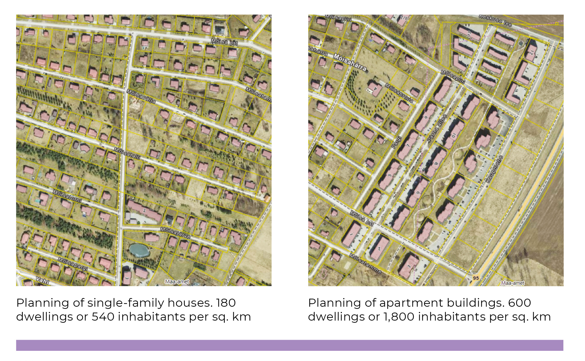

## The triumph of planning freedom in suburban Estonia {.chapter_section .chapter1_section}

```{block, type='authors authors_eng'}
<div class="author-links">**[Antti Roose](#antti-roose)**</div>
<div><a class="print-btn" href="../planeerimisvabaduse-võidukäik-eeslinna-eestis.html">EE</a></div>
```

```{block, type='points'}
* The plot-by-plot suburban developments on the outskirts of Tallinn, Tartu and Pärnu result in diffuse, sparse, fragmented settlements without focal points, where the only public space is bicycle and pedestrian paths, playgrounds, car parks and the surrounding wasteland.
```

The Estonian welfare state has developed hand in hand with suburban Estonia. In Tallinn, it began with Tiskre, followed by single-family homes and low-rise, high-density apartment buildings covering the Viimsi peninsula, after which suburbanisation moved deeper into Harjumaa county. The suburbanisation of Tartu gained momentum during the economic boom. People have begun to speak about Greater Tallinn and Greater Tartu. Symbolically and in keeping with the times, even the Estonian National Museum was built on the outskirts of Tartu – in Raadi.

```{block, type='blockquote-left'}
Suburbanisation is a new and unfamiliar phenomenon in Estonia, which is confirmed by the hesitation in naming and defining settlements as suburban in both official and vernacular language.
```
In the suburbs, the development model of a democratic and free society meets the market economy’s idea of growth and competition, materialising in the most physical way in new neighbourhoods and the social practices of suburban life. Suburbs on the outskirts grow rapidly, intermittently, mechanically, in contrast to the gradual, considered development of the historic urban centre. In this article, I will address the extent and nature of the suburbanisation of areas surrounding Tallinn, Tartu and Pärnu over the past few decades, highlighting the causes and consequences of suburbanisation, with the aim of considering how public and private interests are fulfilled in suburban planning, development and urban governance..

Suburbanisation is a new and unfamiliar phenomenon in Estonia, which is confirmed by the hesitation in naming and defining settlements as suburban in both official and vernacular language. While some suburbanised villages have been elevated to the status of a small town (alevik) – for example, Peetri and Luige outside Tallinn, or Räni and Vahi outside Tartu – none has so far managed to earn the status of city (linn) in the settlement hierarchy.

### How to define a suburb? {-.chapter1_section}

The development of the settlements in the hinterlands of Estonia’s biggest cities is characterised by three key concepts: suburbanisation, urban sprawl and peri-urbanisation. In addition, the <a href="https://www.rahandusministeerium.ee/et/ruumiline-planeerimine/uleriigiline-planeering">Estonia 2030+</a> national spatial plan introduced the concept of a scattered city (or ‘low-density urbanised space’), which combines compact cities, suburbs and peripheral settlements into a single entity.

The key concept of suburbanisation, in its broadest sense, describes the process of people settling in the hinterland of a city, whereby a clear boundary between the country and the city disappears ([Tammaru et al. 2004](#Tammaru2004)). Because of the particularly chaotic way that suburbanisation was happening prior to the economic crisis of 2007, the more evaluative term ‘urban sprawl’ has entered public parlance ([Leetmaa et al. 2014](#Leetmaa2014); [Tammaru et al. 2009](#Tammaru2009)). It refers to the relatively uncontrolled spread of a city that also reaches into the hinterland beyond the suburban zone. The change in land use in urban sprawl manifests in the appearance of strips of patchy, separated housing that often leads to a wasteful use of land resources, energy and infrastructure, environmental pollution, congestion and many other external impacts. In literature pertaining to urban planning, urban sprawl is generally considered to be a negative type of city development ([van Dijk 2009](#van-Dijk2009)). In Western and Central Europe, there is also the concept of peri-urbanisation, referring to a better solution in which a stricter planning policy enables the expansion of a city in a coherent pattern on the perimeter of the urban centre ([Phelps 2017](#Phelps2017)). The urban sprawl of the early 2000s in Estonia is now similarly continuing as peri-urbanisation.

The following analysis of the suburbanisation of Tallinn, Tartu and Pärnu is based on administrative units where the main indicator is the number of inhabitants and the main criterion is rapid growth since 2001. Greater Tallinn includes the rural municipalities of Harku, Jõelähtme, Keila, Kiili, Rae, Saku, Saue and Viimsi, and the city of Saue. Greater Tartu has expanded into the rural municipalities of Haaslava, Luunja, Tartu, Tähtvere and Ülenurme. The suburbs of Pärnu are formed by the rural municipalities of Audru, Paikuse, Sauga and Tahkuranna. Therefore, this approach excludes Tallinn’s ‘old’ suburbs and satellite towns Keila and Maardu, and Sindi in Pärnu. The second criterion is the formation of new suburban settlements that are measurably suburban by the number of new housing units and population density. Change and growth are important above all also here. Suburban population density can be observed from a modest 100 inhabitants per square kilometre. Statistics Estonia has defined the transitional suburban zone as a semi-urban area with a minimum population density of 200 inhabitants per square kilometre, but even this quota is too high for the settlement pattern on the outskirts.

```{block, type='blockquote-right'}
The change in land use in urban sprawl manifests in the appearance of strips of patchy, separated housing that often leads to a wasteful use of land resources, energy and infrastructure, environmental pollution, congestion and many other external impacts.
```

Regarding similarities and differences with European suburbs, suburbanisation in the Netherlands, France, Germany and the Nordic countries accelerated with the launch of national housing programmes in the 1960s and continued throughout the 1970s and 1980s ([Bruegmann 2008](#Bruegmann2008)). In Mediterranean countries, suburbanisation became the dominant urbanisation process a few decades later, in the 1980s, as a result of the developmental advantages provided by urban centres. By the 1990s, the development of urban areas in Western and Central Europe had reached the post-suburban stage that prompted a search for a new key solution for the development of stagnated suburbs ([Phelphs ja Wood 2011](#Phelps2011)). Architects and designers following the trend of new suburbanisation emphasised the importance of aesthetics and the densification of urban space, prioritising pedestrians and public transport over car traffic, as well as ecological, sustainable solutions that also accentuated rurality ([Randolph 2012](#Randolph2012)). Post-suburban developments, urban design and urban organisation all mimic the characteristics and processes of an urban centre, both in the diversification of the urban environment and its uses, and in the densification of housing, but they continue to do so in dimensions and forms that are suburban. In addition, the legislature has established strict quotas that limit construction on greenfield sites, while supporting secondary land use on brownfield sites in areas outside cities and towns.

```{block, type='blockquote-left'}
As in Estonia, the suburbs elsewhere in Eastern and Central Europe have emerged, through the fragmentation of land use, as single-purpose residential areas and commercial logistics parks.
```
Suburbanisation – both its supply and demand – reached the cities of Central and Eastern Europe only by the late 1990s, with the maturation of market forces, after which the rate of suburbanisation has developed in line with economic growth, being an expression of the development of the welfare state ([Phelphs 2017](#Phelps2017)). As in Estonia, the suburbs elsewhere in Eastern and Central Europe have emerged, through the fragmentation of land use, as single-purpose residential areas and commercial logistics parks, along with some large shopping centres and European Union co-financed infrastructure projects to meet the needs of the car-centric consumer society ([Leetmaa et al. 2014](#Leetmaa2014)). The urbanisation of Estonia continues in the modernist stage and even Greater Tallinn has not yet reached late modernism, not to mention reurbanisation or polycentric urban regionalisation.

### One-tenth of Estonians live in the suburbs {-.chapter1_section}

Suburbanisation manifests itself as a movement of people and economic activity from the urban centre to the suburbs. As the number of inhabitants and jobs in the suburbs grows, it creates active travel patterns for work and school, which in turn increases mobility. The rate of suburbanisation is measured by comparing suburban indicators with those of the urban centre. Comparing the three suburban areas with each other is also relevant. The following analysis is based on the administrative division in effect prior to the 2017 administrative reform. A total of 130,000 people live in the suburban zones of Tallinn, Tartu and Pärnu. The suburbanisation of Tallinn began as early as the 1990s, demonstrated by the fact that the population in the municipalities surrounding Tallinn grew by a tenth in the period between the censuses of 1989 and 2001. In the period between 2001 and 2018, the number of suburban residents grew by 37,000 (64%) in Greater Tallinn, by 5,000 (27%) in the suburban municipalities of Tartu and by 3,500 (28%) in the suburban municipalities of Pärnu ([Figure 1.3.1](#figure131)).

<p class="caption" id="figure131"><span class="figure-number">Figure 1.3.1.</span> Number of suburban residents in the surrounding areas of Tallinn, Tartu and Pärnu, 2001–2018</p>
<div class="desktop-plot">
```{r, figure131, out.width='100%', fig.asp=.75, fig.align='center', echo=FALSE, message=FALSE, warnings=FALSE}

library("tidyverse")
library("plotly")

 fig131_data <- read.csv ("../data/13_fig1_data.csv", header=TRUE, fileEncoding="utf-8")


  fig131_plot <- ggplot(subset(fig131_data, area_eng %in% c("Tallinn suburbs", "Tartu suburbs", "Pärnu suburbs"))) +
    geom_line(mapping = aes(colour=area_eng, x=year, y = value, group = area_eng, text = paste("", value,
                         "<br>", area_eng,
                         "<br>", year)), size=1) +
    #geom_text(mapping = aes(x=year, y=as.numeric(value), label=value), stat="identity", vjust=-1, size=2) +
    scale_colour_manual(values=c("#3A404A","#482683","#369B9E")) +
    scale_y_continuous(expand = c(0, 0), limits=c(0,100000)) +
    scale_x_continuous(breaks=c(2001,2006,2011,2015,2016,2017,2018),expand = c(0, 0), limits=c(2000,2018.5)) +
    labs(y="Number of suburban residents", x="")
    expand_limits (y=0)

   fig131_theme <- theme(
     panel.grid.minor.x = element_blank(),
     text=element_text(family="Montserrat")
  )

ggplotly(fig131_plot + fig_theme_general + fig131_theme, tooltip = c("text") ) %>%
config(displayModeBar = F, collaborate = F)   %>% 
layout(legend = list(orientation = "h",y = 1.15)) %>% 
layout(xaxis = list(fixedrange = TRUE)) %>%
layout(yaxis = list(fixedrange = TRUE))

#ggsave(path="exported_figures/PDF/chapter1",filename="fig131.pdf", height=160, width=250, units="mm")
```
</div>

<div class="mobile-plot">
```{r, out.width='100%', fig.asp=.75, fig.align='center', echo=FALSE, message=FALSE, warnings=FALSE}

print(fig131_plot + fig_theme_general + fig131_theme)

```
</div>
```{block, type='imgsource'}
<div><span class="imgsource-source">Source:</span> Statistics Estonia.</div>
<div><a class="data-btn" href="../data/13_fig1_data.csv"><i class="fa fa-download" aria-hidden="true"></i></i>Download data</a></div>
```

In Greater Tallinn, suburbanisation has been most intense in the rural municipalities of Viimsi, Rae, Harku and Kiili, but to a lesser extent also in Saue, Saku and Jõelähtme. Unique among the new settlements of Estonia is the area of Viimsi, which, in addition to two towns – Viimsi and Haabneeme – still has 14 villages, several of which are the size of towns (Randvere, Pärnamäe and Püünsi). The suburbanisation of Tartu has been led by the rural municipalities of Ülenurme and Tartu, and to a lesser extent, Luunja, Haaslava and Tähtvere. Pärnu has spread into the rural municipalities of Audru, Sauga and Paikuse, as well as Tahkuranna.

```{block, type='blockquote-right'}
Unique among the new settlements of Estonia is the area of Viimsi, which, in addition to two towns – Viimsi and Haabneeme – still has 14 villages, several of which are the size of towns (Randvere, Pärnamäe and Püünsi).
```
Official statistics do not reflect the real number of suburban residents. Looking at the number of new dwellings, data from the 2011 census compared to the population register, as well as other studies of suburbs all confirm that migration to the suburbs is significantly greater. Based on housing statistics, we can formally increase the number of new suburban residents from 45,000 to 70,000. In this century, an estimated 55,000 people have moved to the suburbs of Tallinn and 11,000 people to the suburbs of Tartu. According to a comparison of 2011 census data with the number of inhabitants on the population register, there were 10–18% more inhabitants than registered in the suburbs of Tallinn and 13–25% more inhabitants than registered in the suburbs Tartu ([Roose et al. 2015](#Roose2015)). Registering a formal residence in the urban centre guarantees suburban families with children access to the city’s social and educational services. Indeed, it is primarily people in the age group for having families (aged 30–49) that move to the suburbs.

In addition to changes in places of residence, suburban commuting has also been on the rise. Commuting has been happening in both directions, as places of work are not only in the urban centre, but increasingly also in the suburbs, which have seen a rise in logistics and industrial parks. The 2016 pilot census showed that Tallinn’s daytime population increased by 57,000, while in Tartu the figure was 21,000. A third of all children in the municipalities on the outskirts of Tallinn go to school in the city.

<p class="caption" id="figure132"><span class="figure-number">Figure 1.3.2.</span> Distribution of new dwellings across urban centres, suburbs and the rest of Estonia, 1999‒2018</p>

```{r, figure132, out.width='90%', fig.asp=.75, fig.align='center', echo=FALSE, message=FALSE, warnings=FALSE}

library("tidyverse")

 fig132_data <- read.csv ("../data/13_fig2_data.csv", header=TRUE, fileEncoding="utf-8")

fig132_data$area_eng <- factor(fig132_data$area_eng, levels = c("Tallinn","Tallinn suburbs","Tartu","Tartu suburbs","Pärnu","Pärnu suburbs", "Rest of Estonia"))

  fig132_plot <- ggplot(data = fig132_data) +
    geom_col(mapping = aes(x=area_eng, y=value, fill=area_eng), width=0.7) +
    geom_text(aes(label = value, x=area_eng, y=value), nudge_x = 0, nudge_y = 2500, color="#777777") +
    labs(y="%", x="") +
    labs(y="", x="", fill="") +
    scale_fill_manual(values=c("#482683", "#482683", "#917db5","#917db5","#369B9E","#369B9E", "#abd9d6"))


   fig132_theme <- theme(
                  panel.grid.major.x = element_blank() ,
                  panel.grid.minor.x = element_blank(),
                  legend.position = 0,
                  text=element_text(family="Montserrat")
  )

  print(fig132_plot + fig_theme_general + fig132_theme)


  #ggsave(path="exported_figures/PDF/chapter1",filename="fig132.pdf", height=160, width=250, units="mm")
```

```{block, type='imgsource'}
<div><span class="imgsource-source">Source:</span> Statistics Estonia.</div>
<div><a class="data-btn" href="../data/13_fig2_data.csv"><i class="fa fa-download" aria-hidden="true"></i></i>Download data</a></div>
```

New suburban housing (18,794 dwellings) makes up 29% of all new housing construction in Estonia (1999–2018). There are 13,438 new homes in the suburbs of Tallinn, 4,091 in the suburbs of Tartu and 1,265 in the suburbs of Pärnu ([Figure 1.3.2](#figure132)). In addition to this, there are new housing units that are inhabited but are formally still under construction, which would increase the above figures by about a quarter ([Roose et al. 2015](#Roose2015)). Since 2013, the volume of intra-urban developments in Tallinn has grown faster than the volume of suburban developments, now exceeding it three times over ([Figure 1.3.3](#figure133)). Regarding housing types, the previous majority held by detached houses in the suburbs of Tallinn gave way to semi-detached and terraced houses in the mid-2000s, while the 2010s have seen new apartments become the most popular. In Tartu, the volume of intra-urban development has remained more or less equal to suburban development, although suburbanisation has accelerated in recent years. From 2015, the suburbs of Tartu have been dominated by terraced houses and apartment buildings. The suburbanisation of Pärnu has remained steadily at an average of 50 new dwellings per year over two decades.

<p class="caption" id="figure133"><span class="figure-number">Figure 1.3.3.</span> Number of new dwellings in Tallinn, Tartu and Pärnu compared to their respective suburbs, 2002–2018</p>
<div class="desktop-plot">
```{r, figure133, out.width='90%', fig.asp=.75, fig.align='center', echo=FALSE, message=FALSE, warnings=FALSE}

library("tidyverse")
library("reshape")

 fig133_data <- read.csv ("../data/13_fig3_data.csv", header=TRUE, fileEncoding="utf-8", sep=";", check.names=FALSE)

 fig133_data_clean <- melt (fig133_data, id=c("area"))
 colnames( fig133_data_clean) <- c("area", "year","value")

fig133_data_clean$area_eng[grepl("Tallinn",fig133_data_clean$area)]<-"Tallinn"
fig133_data_clean$area_eng[grepl("Tartu",fig133_data_clean$area)]<-"Tartu"
fig133_data_clean$area_eng[grepl("Pärnu",fig133_data_clean$area)]<-"Pärnu"
fig133_data_clean$area_eng[grepl("Tallinna eeslinn",fig133_data_clean$area)]<-"Tallinn suburbs"
fig133_data_clean$area_eng[grepl("Tartu eeslinn",fig133_data_clean$area)]<-"Tartu suburbs"
fig133_data_clean$area_eng[grepl("Pärnu eeslinn",fig133_data_clean$area)]<-"Pärnu suburbs"

fig133_data_clean$area_eng <- factor (fig133_data_clean$area_eng, levels = c("Tallinn","Tallinn suburbs", "Tartu","Tartu suburbs","Pärnu","Pärnu suburbs"))


  fig133_plot <- ggplot(fig133_data_clean) +
    geom_line(mapping = aes(x=year, y = as.numeric(value), colour=area_eng, group=area_eng, text = paste("", area_eng,
                         "<br>", year,
                         "<br>", value)), size=1) +
    #scale_x_continuous(expand = c(0, 0), limits=c(2002,2018)) +
    scale_y_continuous (expand = c(0, 0), limits=c(0,3200)) +
    labs(y="Number of new dwellings", x="") +
    expand_limits (y=0) +
    scale_colour_manual(values=c("#482683", "#917db5","#369B9E", "#abd9d6","#03bdf2","#b1e0f9"), labels=c("Tallinn","Tallinn suburbs", "Tartu","Tartu suburbs","Pärnu","Pärnu suburbs"))

   fig133_theme <- theme(
        axis.text.x = element_text(angle=45, margin = margin(t = 7, r = 0, b = 0, l = 0), hjust=1.1),
        text=element_text(family="Montserrat")
  )

  ggplotly(fig133_plot + fig_theme_general + fig133_theme, tooltip = "text" ) %>%
config(displayModeBar = F, collaborate = F)   %>% 
layout(legend = list(orientation = "h",y = 1.15)) %>% 
layout(xaxis = list(fixedrange = TRUE)) %>%
layout(yaxis = list(fixedrange = TRUE))

  #ggsave(path="exported_figures/PDF/chapter1",filename="fig133.pdf", height=120, width=200, units="mm")
```

</div>
<div class="mobile-plot">
```{r, out.width='100%', fig.asp=.75, fig.align='center', echo=FALSE, message=FALSE, warnings=FALSE}

print(fig133_plot + fig_theme_general + fig133_theme)

```
</div>

```{block, type='imgsource'}
<div><span class="imgsource-source">Source:</span> Statistics Estonia.</div>
<div><a class="data-btn" href="../data/13_fig3_data.csv"><i class="fa fa-download" aria-hidden="true"></i></i>Download data</a></div>
```
### Suburban neighbourhoods are characterised by a fragmented settlement structure {-.chapter1_section}

While cities have traditionally been considered dense, diverse and coherent, new suburbs contrast with urban centres in terms of the former being scattered and sparse single-purpose settlements. Suburbanisation has expanded Greater Tallinn to 800 sq. km, of which 159 sq. km forms the administrative area of the city of Tallinn. Greater Tartu has grown morphologically to 120 sq. km, of which 39 sq. km is taken up by the city of Tartu. The urban boundaries are less easily defined in Pärnu.

Suburbanisation begins with the conversion of open land, usually agricultural land. In twenty years, the land alongside the roads leading out of Tallinn and Tartu has mostly been developed, along with the areas around the edges of these cities, where the densification of suburban settlements continues. The further from the city a settlement is, the sparser and more fragmented it becomes. New housing of up to a dozen or so buildings has been constructed here and there in dispersed settlement type villages, such as Vaskjala village in the Rae rural municipality or Laane village in the Kambja rural municipality, without there being any concentration of new residential areas nor a central logic.

In terms of urban form, neighbourhoods made up of mainly detached houses (with a density of 200 dwellings per sq. km or 600 inhabitants per sq. km) are generally distinct from those dominated by terraced houses and apartment buildings (with a population density of 600–800 dwellings per sq. km or approximately 2,000 inhabitants per sq. km) ([Figure 1.3.4](#figure134)). Population density in the suburbs that are sparser and have a more scenic landscape pattern falls to 50–100 inhabitants per sq. km. Alongside residential areas, business and logistics parks also take up space in the suburbs. There is generally no public land.

<p class="caption" id="figure134"><span class="figure-number">Figure 1.3.4.</span> Suburban morphology in the town of Vahi in the municipality of Tartu</p>

```{r, figure134, out.width='90%', fig.align='center', echo=FALSE, message=FALSE, warnings=FALSE}



```

```{block, type='imgsource'}
<span class="imgsource-source">Source:</span> Land Board.
```

### The pattern of a new suburb emerges as the sum of detailed spatial plans {-.chapter1_section}

County spatial plans accentuate existing settlement structures and seek to place new housing either tightly within high-density neighbourhoods or in their immediate vicinity. This would make it possible to create a spatial model for the development of integrated housing and urban infrastructure, as well as the preconditions for efficient urban management. Comprehensive plans follow the same spatial policy. Currently, it is common for suburbanised space to be created on the basis of individual detailed spatial plans that largely disrupt the strategy of developing an integrated and cohesive settlement through local government comprehensive plans. Two methodological approaches have developed during the preparation of county spatial plans. For Tallinn, the development of the settlements in the vicinity of the city was conveyed in the form of vague areas, while in the case of Tartu, it was the actual situation that formed the basis for the county plan, with both planned and potential suburban neighbourhoods noted down, based on adopted detailed plans, coherent land use and realistic needs ([Figure 1.3.5](#figure135)).

<p class="caption" id="figure135"><span class="figure-number">Figure 1.3.5.</span> County spatial plan with vague vs strict boundaries – Harjumaa vs Tartumaa.</p>

```{r, figure135, out.width='100%', fig.align='center', echo=FALSE, message=FALSE, warnings=FALSE}

knitr::include_graphics("../figures/1-chapter/fig135.png")

```

```{block, type='imgsource'}
<span class="imgsource-source">Soure:</span> 2030+ Harjumaa county spatial plan (2018); 2030+ Tartumaa county spatial plan (2019).
```

```{block, type='blockquote-right'}
Currently, it is common for suburbanised space to be created on the basis of individual detailed spatial plans that largely disrupt the strategy of developing an integrated and cohesive settlement through local government comprehensive plans.
```
Secondly, county spatial plans seek polycentric urban development. However, the development of the service network in Tallinn, Tartu and Pärnu is still based around the urban centre. In the Tallinn urban area, large leisure centres have assumed the role of central hubs. Tabasalu, Keila, Saue, Saku, Kiili, Jüri, Loo, Maardu and Viimsi form a circle of local commuting centres. Small towns on the outskirts of cities meet primary needs on the principle of proximity to home. Their development as central hubs has been limited, as the only commercial service provided is in the form of grocery stores, which also include a pharmacy, pet shop, pizza counter and beauty salon. No strong suburban centres are expected to appear in cities the size of Tartu and Pärnu either, due to limitations set by the scale effect and relatively fast mobility.

In reality, the development of suburban settlements is determined by fragmented, small-scale detailed spatial plans prepared and adopted separately and in random chronological order, as illustrated by the spatial planning map of the rural municipalities of Rae and Raasiku ([Figure 1.3.6](#figure136)).

<p class="caption" id="figure136"><span class="figure-number">Figure 1.3.6.</span> Fragmented new suburban settlement: the detailed planning areas of the rural municipalities of Rae and Raasiku from 1999.</p>

```{r, figure136, out.width='100%', fig.asp=.75, fig.align='center', echo=FALSE, message=FALSE, warnings=FALSE}

knitr::include_graphics("../figures/1-chapter/fig136.png")

```

```{block, type='imgsource'}
<span class="imgsource-source">Source:</span> Land Board spatial planning application 2018.
```

<div class="casebox">
<h3> A row of terraced houses in Veskimöldre – quick and easy!</h3>

A straightforward example of suburban densification is the expansion of the new neighbourhood of Veskimöldre in Koruserva. The developer requested the initiation of the detailed spatial plan from the Saue rural municipality government on 12 August 2016, which was followed by the initiation decision on 3 January 2017, with the municipal council adopting the plan on 15 August 2017. Eight hectares of land was divided into five plots for terraced houses. In addition, the plan included a technical facility for a sewage pumping station and the preservation of a green network corridor  ([Figure 1.3.7](#figure137)). Development is ongoing and most of the units of the three terraced houses were sold by April 2019.

<p class="caption" id="figure137"><span class="figure-number">Figure 1.3.7.</span> Detailed spatial plan of the Koruserva registered immovable in Alliku village – an example of suburban densification</p>

```{r, figure137, out.width='100%', fig.align='center', echo=FALSE, message=FALSE}

knitr::include_graphics("../figures/1-chapter/fig137.png")

```
</div>
```{block, type='imgsource'}
<span class="imgsource-source">Source:</span> K-Projekt.
```

### Place-making as an expression of market forces and planning policy {-.chapter1_section}

An active real estate market and a liberal legal system are the forces that drive the suburbanisation process ([van Dijk 2009](#van-Dijk2009)). Areas surrounding cities are the dream of developers and planners alike. The land reform of the 1990s created a varied division of land use and favoured the formation of a liquid real estate market. In the early 2000s, a second land reform began in areas outside cities, in which wedges of farm land were divided into residential plots. Developing suburban lands is legally, procedurally and operationally simple, cost-efficient and fast. Local governments of suburban areas have not limited the growth of their settlements, with planning solutions being generally uncomplicated and based on the mutual interest and goodwill of both developer and local government. This, however, becomes a problem – an oversupply of undeveloped land leads to an illogical and fragmented land use pattern of randomly arranged plots at different stages of development.

```{block, type='blockquote-left'}
An oversupply of undeveloped land leads to an illogical and fragmented land use pattern of randomly arranged plots at different stages of development.
```
Compared to the urban centre, the housing market behaves differently in the suburbs. Residential development grew faster in Tallinn’s suburbs than in Tallinn itself during the first economic boom, but was still unable to exceed the level of 2,000 new dwellings per year (2007). The decline in residential development turned around in the suburbs in just three years, while the volume of new housing in Tallinn kept declining until 2013. However, growth in the suburbs has been slower than in Tallinn during the last five years. The residential development of Tartu is so far characterised by a balance between the city and the suburbs, and began tipping in favour of the suburbs during the growth that began in 2013, but was then followed by growth in the volume of urban centre developments that overtook the suburbs in 2018. The economic crisis had a limited effect on residential development in the suburbs of Tartu, which confirms the stability and liquidity of the university city’s housing market.

In a competitive situation, home buyers can choose between a home in the city or in the suburbs. Greater demand exists for housing in new neighbourhoods just outside the city limits with better access, infrastructure and quality of living environment, and this leads to the creation of a marketing image projecting wealth and influence, resulting in higher real estate prices. Prices remain more affordable in more distant suburbs and in partially developed neighbourhoods ([Figure 1.3.8](#figure138)).

<p class="caption" id="figure138"><span class="figure-number">Figure 1.3.8.</span> A place-marketing perspective on the small town of Jüri by the real estate company Laam Kinnisvara</p>

*‘Apartments at Väljaku 5 – a comfortable living environment for the young and active / A childhood full of opportunities / A home near the city in Jüri / The population of the town is growing thanks to a functioning infrastructure system, the rural municipality’s successful efforts in providing a healthy living environment, as well as constantly improving opportunities for leisure and recreation’*

```{r, figure138, out.width='100%',, fig.align='center', echo=FALSE, message=FALSE, warnings=FALSE}

knitr::include_graphics("../figures/1-chapter/fig138.png")
```

```{block, type='imgsource'}
<span class="imgsource-source">Soure:</span> Laam Kinnisvara.
```

Local governments, as the bodies adopting comprehensive and detailed spatial plans, have undivided authority in the final decisions regarding suburban development. On the one hand, there is a legal mandate granting the extensive, limitless discretion regarding areas without restrictions in public law, and on the other hand, there is the practical administrative capacity and planning practices of the local government. How can we turn down a developer? As the right of discretion is still subject to a compliance regime set out in the Administrative Procedure Act, which requires local governments to have the capacity to make planning decisions based on substantive, technical and legal circumstances, controversial cases lead to matters being taken to court. Still, judicial review and state supervision of planning decisions are limited due to the high level of planning authority among local governments, with most disputes being settled out of court between the local government, the developer and third parties. In suburban development, the temporal dimension is as important as location. For example, until 2015, detailed spatial plans for projects in the suburbs outside Tartu took an average of 12 months to process, while a detailed plan for a project within the city took twice that time.

```{block, type='blockquote-right'}
Until 2015, detailed spatial plans for projects in the suburbs outside Tartu took an average of 12 months to process, while a detailed plan for a project within the city took twice that time.
```
Why are county spatial plans and comprehensive plans failing to sufficiently organise the spatial development of new suburbs? When it comes to providing solutions to the expansion of settlements, county spatial plans have an approach that is vague, while comprehensive plans aim for the unrealistic zoning of residential lands with the expectation that these could house thousands upon thousands of new residents. While the summary maps of comprehensive plans demonstrate a nascent understanding of a realistic number of warehouses and small industries that the markets of Tallinn, Tartu and Pärnu can support, residential lands continue to be generously reserved in the suburban zones, with a carefree manner one would expect from someone playing SimCity. What is happening, in essence, is the registration of building rights in the case of any future interest, as there are no taxes or other tools to manage oversupply.

The risks of overplanning are exemplified by the projected population growth of the small town of Peetri and its surrounding areas. The baseline scenario includes a projected population of 8,100 by 2025, while the number of inhabitants may potentially exceed 14,000 by the year 2030. Based on the current comprehensive plan, there are 1,400 hectares of residential land planned in the rural municipality of Rae, next to Tallinn, which should amount to about 20,000 inhabitants. The rural municipal government has promised its people that it will reduce the surface area of residential lands and reallocate it to public infrastructure, such as green spaces.

If the supply side of suburbanisation is driven by a free market, the same is true for demand. The question is not about where people want to live, but where people can afford to live. In other words, what matters is their economic situation, income and credit standing. Depending on the location, it is possible to get a living space in the suburbs that is larger by a third, or even more, than a property with the same value in the city. However, some of the more elitist suburban neighbourhoods have also become expensive for families with an average income. Analyses of the causes of suburbanisation often overestimate social and aspirational selection criteria. Apart from house prices, the choice of a new suburban home is often determined by commuting distance and, consequently, the cost of fuel. The logistics of getting to and from work and school are a time-sensitive matter for suburban households. Poor public transport means that someone will become the family taxi driver. An increased family size and lifestyle choices are other factors to consider when looking at new suburban residents. In other words, looking at what happens when a hipster becomes a family man. Suburbanisation is currently also gaining momentum due to the big generations born in the late 1980s starting to settle down.

```{block, type='blockquote-left'}
American-style values – the dream of a new and beautiful home among the suburban greenery that provides safety, peace and quiet – are not stereotypical of suburbanisation in Estonia.
```
American-style values – the dream of a new and beautiful home among the suburban greenery that provides safety, peace and quiet – are not stereotypical of suburbanisation in Estonia. The difference between the quality of life in the urban centre and the suburbs is not as great in Tallinn, Tartu and Pärnu as it is in the metropolises of Europe and America that have become metro-urbanised, with high inequality, through multiple waves of growth. The Estonian suburbs are generally home to a four-person family in which the mother and father go to work or work from home – unless on parental leave – and the children go to school in the city centre. A car and a pure-breed dog are considered valued members of the family. They exercise enthusiastically in public spaces, on bicycle and pedestrian paths. Socialising takes place among the family. The backyard is equipped with a playhouse and trampoline, a greenhouse and an outdoor kitchen. The tone is set by the hum of a lawnmower, sauna evenings and barbecues among friends.

### Easily accessible public services and spaces are limited in the suburbs {-.chapter1_section}

As part of the programmatic implementation of urban policy within the framework of the action for the sustainable development of European Union urban areas, strategies were developed in 2014 for the urban areas of Tallinn, Tartu and Pärnu, the objectives of which included the construction of kindergartens and bicycle paths, the development of the public transportation system and the design of public urban space. There was also a call for coherent (sub)urban governance that would transcend administrative borders. These topics undoubtedly concern the primary needs of suburban residents, and the state and local governments must meet these needs in a satisfactory way, while taking into account thousands of new residents. Apart from organising planning processes, as described above, how do local governments usually keep up with a growing population? Local governments engage in suburban planning, which includes the following: engineering infrastructure, increasing the number of spaces in kindergartens and schools (e.g. by placing children in mega-schools and temporary buildings), traffic and parking management, establishing the upkeep of areas between new residential areas and building sites, etc. Another important task is providing information to new residents – reassuring them in relation to all long-term development trends, as well as urgent needs. Local governments organise meetings on spatial planning or public services when grievances have developed in relation to the transparency of planning processes or the accessibility of services. Suburban residents are doubly attentive to local developments and private or public decisions, so as to be able to mitigate risks to their real estate or quality of life as early as possible.

```{block, type='blockquote-left'}
The suburban space is full of sudden interruptions.
```

One would think that the planning of public space would be more carefully thought through in respect to new suburbs that have plenty of open space on the basis of the argument in favour of a better living environment and greenery, than what would be possible in densely populated city centres. The areas between houses could, in theory, become well-organised and coherent public spaces. In practice, however, only the bare minimum is done, which around new housing often amounts to a few trees, a hedge, a car park and a playground. In some cases, areas originally planned for communal use have later become limited to private use, due to underutilisation or misuse. The suburban space is full of sudden interruptions, such as dead ends that are impassable even to pedestrians and cyclists, footpaths or street lighting that end just as they reach the plot of an apartment building, bus stops that are on the other side of a field, or building sites in the centre of new neighbourhoods that remain muddy pools for years.

Public space in suburban districts usually takes the form of green areas, bicycle and pedestrian paths, footpaths, playgrounds and sports fields, public transport stops, car parks, shopping centres and petrol stations. Although new suburbs have plenty of greenery, new housing still decreases natural and green areas, cuts through elements of the green network or leaves habitats isolated. Developments constructed one house at a time cannot create a logic to the urban space until the neighbourhood has been completely built.

```{block, type='blockquote-left'}
Suburban transport infrastructure, wide motorways, frontage roads, multilevel junctions, noise barriers and petrol stations create a large-scale transport landscape.
```
The classic street is rarely, if ever, seen in new suburbs. Urban design standards force developers to construct footpaths, but only in front of apartment buildings. The presence of a footpath is integral to creating basic street ambiance, but it is not enough on its own. This is why bicycle and pedestrian paths are the most popular public spaces in new suburbs. Bicycle and pedestrian paths are actively used by young parents for walking with their infants and toddlers, by sports enthusiasts for running, Nordic walking, cycling and roller skating, as well as by dog owners. Footpaths are rarely used for travelling to work or school – functional mobility for suburban residents is mainly based on cars. Suburban transport infrastructure, wide motorways, frontage roads, multilevel junctions, noise barriers and petrol stations create a large-scale transport landscape.

```{block, type='blockquote-right'}
The modern petrol station not only offers fuel but, in the absence of a better alternative, also performs the general functions of a grocery store, café, fast food place, rest stop and even a smoking area.
```
There is a growing demand for playgrounds ([Figure 1.3.9](#figure139)) in new suburbs. Developers and local governments have taken note and focused more on playgrounds when designing the areas between new apartment buildings, whereas children from families living in detached houses play in their own yards. Ball courts have also been added to playgrounds, with the intention of offering young people the opportunity to play court games. New residential areas have also seen tennis courts built; however, the use of these is limited and club-based. Public car parks can also be considered public spaces, in the strict sense of the word. Detailed spatial plans generally take public and communal interests into consideration, but acting on these during construction is another question, particularly when residential areas are being developed in stages. However, one issue that has become a matter of life and death are pedestrian and cycle crossings in the context of increasingly heavy suburban traffic flows. The placement of bus stops in new neighbourhoods has also become a contentious issue, since nobody wants additional traffic noise and people gathering on their doorstep.

<p class="caption" id="figure139"><span class="figure-number">Figure 1.3.9.</span> A playground like any other – a jungle gym, a slide and a swing.</p>

```{r, figure139, out.width='90%', fig.align='center', echo=FALSE, message=FALSE, warnings=FALSE}
knitr::include_graphics("../figures/1-chapter/fig139.png")
```

```{block, type='imgsource'}
<span class="imgsource-source">Source:</span> Photo by the author.
```

Shopping centres provide plenty of public space in suburban zones, but their public use is still regulated by their owners, which also means limited opening times. Petrol stations, which are often the first service sites to appear in new suburbs, are part of the same private-public space. The modern petrol station not only offers fuel but, in the absence of a better alternative, also performs the general functions of a grocery store, café, fast food place, rest stop and even a smoking area. In general, adding playgrounds, bus stops and other public sites to an existing, quiet and peaceful new suburb has given rise to disputes between the local government, the developer and residents of neighbouring plots, which, at worst, have resulted in the public site in question being moved further or abandoned altogether.

### Summary {-.chapter1_section #summary-13}

In light of the nature of Estonia’s suburbanisation in recent decades, characterised by private ownership and planning freedom, suburban development should be viewed from the American perspective of urban growth and growth management, and not as the normatively strict European-style of urban planning. While the type of suburbanisation happening in Estonia is indeed American, there are some basic urban differences compared to new suburbs in the USA – new suburbs in Estonia are small, not too far from the urban centre and they are not uniform as a result of mass development. Unlike the urbanisation process in the USA and partly also in Western Europe, suburban growth in Estonia has not been the direct consequence of the degeneration, decline or negative circumstances of the urban centre.

The suburban growth machine is currently running at full speed, inseparable from the metropolitanisation and urban social development of Estonia. Suburbanisation affects an area up to 20 kilometres wide around Tallinn and areas within a 5-kilometre radius of Tartu and Pärnu. The suburban lifestyle is based on the model of a nuclear family with a house and a car.

A completely new type of suburban settlement has developed in the immediate zone around Tallinn, Tartu and Pärnu. The new suburbs in Estonia are characterised by a low population density, usually 50–200 inhabitants per square kilometre, reaching up to 1,000 inhabitants per square kilometre in small towns on the outskirts, and a fragmented and car-centric environment for leisure, services and mobility. In conclusion, we can estimate there to be 70,000 new suburban residents who, while having made the choice of the location for their homes individually, collectively affect the functioning of the entire urban area.

Suburbanisation has a considerable impact on the landscape and the environment, as well as an economic and social significance. In new suburbs, the line between the urban and the rural becomes blurred spatially as well as socially and economically ([Bruegmann 2008](#Bruegmann2008)). As residents move in, the development of new suburbs, which at first is a rationally commercial and standard, technical operation, increasingly becomes a social process, where different interests and needs, viewpoints and values converge. The suburban residents themselves operate on two spatial levels. Essential to them is their street and neighbourhood, but of equal importance is the urban centre to where most of them commute on a daily basis. The spatial consequences of suburban growth accumulate as a result of the uncoordinated actions of private interest actors – be it real estate developers or young families buying a house – and are not framed by public interests. Coherent urban planning at the level of local neighbourhoods is hindered by administrative fragmentation.

```{block, type='blockquote-right'}
The spatial consequences of suburban growth accumulate as a result of the uncoordinated actions of private interest actors – be it real estate developers or young families buying a house – and are not framed by public interests.
```
As people’s mobility between the urban centre and the suburbs increase, everyday spatial patterns become modified, which in turn must be taken into account in urban management (traffic signal cycles, bus routes, educational administration). Rapid and chaotic suburbanisation has shown the need for neighbourhood-level urban planning decisions between local governments that would take into account not only land use functions, but also all public services and goods, up to and including considering environmental and socio-economic impacts at least a decade in advance. The powerlessness of the broader national spatial plans has given the local governments of the suburbs a de jure and de facto monopoly in making (sub)urban planning decisions. Suburban development is driven by site selections made by private developers in administrative divisions fragmented by land reform. In early 2019, due to significant opposition by landowners, the Riigikogu (Estonian Parliament) decided to abandon an initiative to protect valuable farmland, despite it being an issue for which legislative regulation has been sought for years. In democratic societies, restraining or legally and administratively managing suburbanisation and urban sprawl has proved to be impossible, which is something also demonstrated and confirmed in suburban Estonia. In light of the circumstances detailed above, Estonian urban policy needs to adopt a pragmatic approach to new suburbs in order to stand more firmly against the dispersal of the urban centre. In view of Estonia’s settlement pattern and the mobility of its inhabitants, the urban area is the optimal functional planning area to link residential, work, service and recreational networks and to develop social, technical and green infrastructures. This should include joint decisions by local governments belonging to the urban region, a common geography of services and its management in joint bodies (such as public transport centres). Coherent urban development across administrative boundaries is possible through joint decision-making and collaboration. One way to do this is by creating intermediate administrative levels and decision-making bodies for urban regions. Better management of detailed spatial planning could be achieved by using thematic settlement plans to more strictly define areas for development and outline development stages along with upper limits for the development of dwellings. Until this is achieved, there will be no limit to suburbanisation.

### References {-.subreferences #references-13}

<p id="Bruegmann2008">Bruegmann, R. 2008. Sprawl: A Compact History. Chicago: University of Chicago Press.</p>

<p id="Leetmaa2014">Leetmaa, K., Kährik, A., Nuga, M., Tammaru, T. 2014. Suburbanization in the Tallinn metropolitan area – Stanilov, K., Sýkora, L. (eds.), Confronting Suburbanization: Urban Decentralization in Postsocialist Central and Eastern Europe. Oxford: Wiley-Blackwell, 192–224.</p>

<p id="Phelps2017">Phelps, N. A. (ed.) 2017. Old Europe, New Suburbanization? Governance, Land, and Infrastructure in European Suburbanization. Toronto: University of Toronto Press.</p>

<p id="Phelps2011">Phelps, N. A., Wood, A. M. 2011. The new post-suburban politics? – Urban Studies, 48 (12), 2591–2610.</p>

<p id="Randolph2012">Randolph, J. 2012. Environmental Land Use Planning and Management. Washington: Island Press.</p>

<p id="Roose2015">Roose, A., Noorkõiv, R., Gauk, M. 2015. Tartu eeslinnastumine – Eesti Statistika Kvartalikiri, 1, 80−109.</p>

<p id="Tammaru2004">Tammaru, T., Kulu, H., Kask, I. 2004. Urbanization, Suburbanization, and Counterurbanization in Estonia – Eurasian Geography and Economics, 45 (3), 159–176.</p>

<p id="Tammaru2009">Tammaru, T., Leetmaa, K., Silm, S., Ahas, R. 2009. Temporal and Spatial Dynamics of the New Residential Areas around Tallinn – European Planning Studies, 17 (3), 423−439.</p>

<p id="van-Dijk2009">van Dijk, T. 2009. Who is in charge of the urban fringe? Neoliberalism, open space preservation and growth control – Planning Practice and Research, 24, 343–361.</p>
