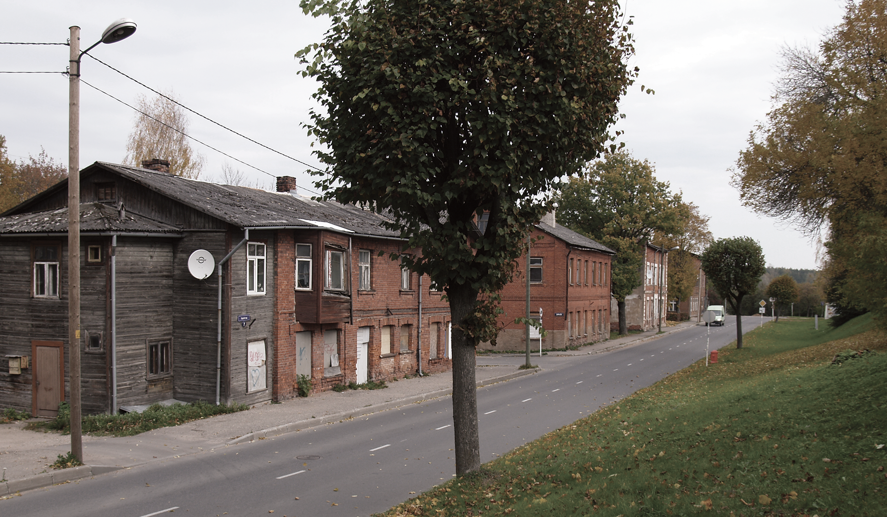
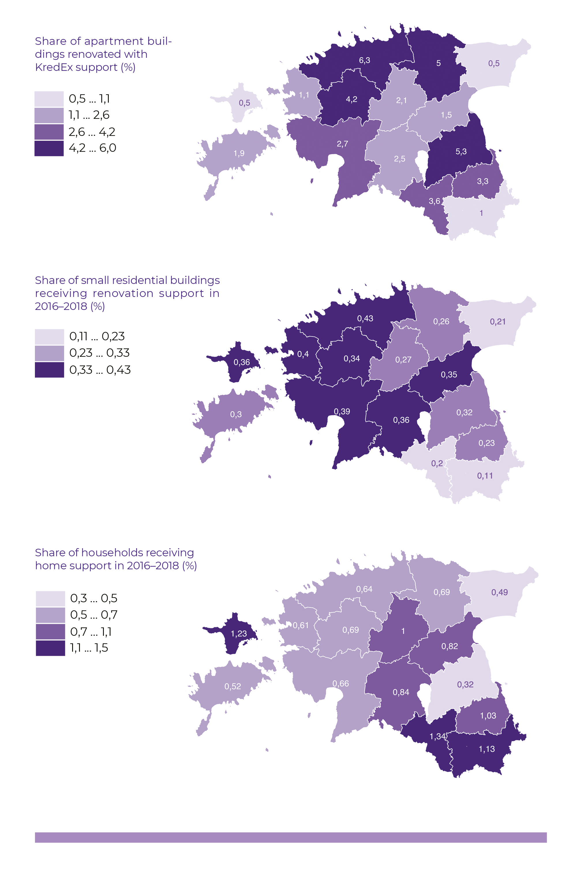

## Modern living conditions – whose privilege? {.chapter_section .chapter1_section}

```{block, type='authors authors_eng'}
<div class="author-links">**[Anneli Kährik](#anneli-kährik) ja [Annika Väiko](#annika-väiko)**</div>
<div><a class="print-btn" href="../nüüdisaegsed-elamistingimused-kelle-privileeg.html">EE</a></div>
```

```{block, type='points'}
* Half of the Estonian population believe that their living conditions need to be improved; those in a better financial situation can afford to live in better-quality housing.
```

Changes in Estonian society in the 1990s significantly affected the organisation of the housing sector. As a result of the ownership reform, the majority of the population became property owners, but they also took on the responsibility for the maintenance of the housing. There was a transition from rental housing to a society of ownership: home ownership became the ‘norm’ and only those who (as yet) lacked the opportunity to buy their own home remained in the rental market. The market began to shape the distribution of housing.

```{block, type='blockquote-right'}
Living conditions and their accessibility are issues that concern the quality of life and social justice.
```
In this article, we will discuss the living conditions in Estonia, regional differences, changes in the state’s role in the organisation of the housing sector and the choices currently faced. We ask who in Estonia today has the privilege of living in modern housing. We will discuss how the state, local governments, investors and residents could work together to reach a better-balanced outcome in terms of living conditions and availability of housing for specific target groups and regions. A dwelling is typically considered a private rather than public space. However, the housing sector is certainly an area of public interest and affects society as a whole, because the quality of living conditions and access to modern housing in different parts of the country or city are issues that concern social justice and people’s quality of life. It is from this perspective that we will address the issue of housing in this article.

```{block, type='blockquote-right'}
Outside the major cities, and especially in rural areas, there is a surplus of housing, with up to one in five dwellings being uninhabited.
```
The main objectives of Estonia’s national housing policy are to improve the access to housing and to modernise the housing stock (<a href="https://www.mkm.ee/sites/default/files/enmak_2030.pdf">National Development Plan of the Energy Sector until 2030</a>). The quality of living conditions is also seen internationally as an important part of the well-being of the population. Poor living conditions, such as a lack of amenities, damp walls, windows and floors in bad repair, overcrowding or even limited access to housing due to high prices, are all used as indicators of material deprivation in pan-European analyses (e.g. Eurostat classifications). Housing prices are typically affected by location. In Estonia, the biggest price hike has taken place in Tallinn and Tartu, with housing prices further depending on their location within the city. A good location near the city centre guarantees easy access to services, jobs, educational institutions and leisure activities. However, a good location is a relative concept. Good living conditions (e.g. new suburban developments) may well be found in a location lacking public space and access to services, but the opposite can also be true (e.g. rental housing in poor condition in the city centre).

The article mainly uses data from the Estonian Social Survey (2017), which is a part of the European Union Statistics on Income and Living Conditions (EU-SILC), and was conducted by Statistics Estonia. The second part of the article deals with national housing policy measures and their regional distribution, relying on KredEx data on the distribution of renovation grants.

### A typical person in Estonia lives in a Soviet-era mass housing apartment; the housing stock is renewed faster in the capital region {-.chapter1_section}

As the population of Estonia has decreased compared to 1990, there is no overall housing shortage in Estonia: according to Statistics Estonia, there were 650,000 dwellings per 600,000 households in Estonia in 2011. However, the distribution of housing does not correspond to the spatial distribution of households and migration trends. Outside the major cities, and especially in rural areas, there is a surplus of housing, with up to one in five dwellings being uninhabited. In Tallinn and Tartu, the demand for housing is higher than the supply, with 7% of the dwellings occupied by several households. That alone does not reflect the real extent of housing shortages, as difficulties in gaining access to the housing market prevent young people from becoming independent and leaving their parents’ homes.

Although the percentage of households occupying private houses has increased slightly, as much as 70% of the households in Estonia live in apartments. The percentage of apartments in Estonia is significantly above the EU average (41%). The relative importance of apartment buildings is by far the highest in Tallinn, while there is a higher percentage of single-family homes outside of settlement centres and further away from the capital region ([Figure 1.4.1](#figure141)).

<p class="caption" id="figure141"><span class="figure-number">Figure 1.4.1.</span> Distribution of housing based on dwelling type in Tallinn (on the left) and in the periphery (counties, excluding county towns and Harjumaa) (on the right)</p>

```{r, figure141, out.width='85%', fig.align='center', echo=FALSE, message=FALSE}

library("tidyverse")
library("scales")


 fig141_data <- read.csv ("../data/14_fig1_data.csv", header=TRUE, fileEncoding="utf-8")
  
fig141_data$area_eng[grepl("Tallinn",fig141_data$area)]<-"Tallinn"
fig141_data$area_eng[grepl("Maapiirkonnad",fig141_data$area)]<-"Rural areas (excl. Harjumaa)"

fig141_data$percent=percent((fig141_data$value/100), 1)

  fig141_plot <- ggplot(data = fig141_data, aes(x = "", y = value, fill = variable)) +
  geom_bar(stat = "identity") +
  scale_fill_manual(values=c("#b1e0f9","#482683","#369B9E"), labels=c("Single-family house","Apartment in a large building","Apartment in a small building")) +
  geom_text(aes(label = percent), position = position_stack(vjust = 0.5), color="white") +
  coord_polar(theta = "y") +
  labs(x="", y="")+
  facet_grid(~area_eng)

  fig141_theme <- theme(
                    panel.grid.major.x = element_blank() ,
                    panel.grid.major.y = element_blank(),
                    panel.grid.minor.x = element_blank() ,
                     panel.grid.minor.y = element_blank(),
                     axis.line = element_blank(),
                     axis.text.x = element_blank(),
                    text=element_text(family="Montserrat")
                 )


  print(fig141_plot + fig_theme_general + fig141_theme)

#ggsave(path="exported_figures/PDF/chapter1",filename="fig141.pdf", height=140, width=200, units="mm")

```

``` {block, type='imgsource'}
<div><span class="imgsource-source">Source:</span> Estonian Social Survey 2017 (Statistics Estonia).</div>
<div><a class="data-btn" href="d../ata/14_fig1_data.csv"><i class="fa fa-download" aria-hidden="true"></i></i>Download data</a></div>
```


```{block, type='blockquote-right'}
The living conditions for the majority of the Estonian population have been improved by renovating their current housing.
```
The majority of the Estonian housing stock dates back to the Soviet period ([Figure 1.4.2](#figure142)). The construction of the mass produced apartment buildings peaked between 1960 and 1990, when approximately 13,000 new dwellings were built in Estonia every year. This period coincides with the rapid growth of the industrial sector and the introduction of a foreign workforce. Large apartment buildings were mainly erected in cities, where whole new districts were formed. Such industrial and economically efficient construction of small apartments also reached rural areas. Smaller, two- and three-storey buildings were erected there. Modern apartments with all conveniences were a desired dwelling for many, considering the lack of housing in the Soviet period. At that time, private houses were usually built without any government funding, and it was the only way of improving living conditions for anyone who did not get an apartment from the government or through their job. However, for some people building their own house was an opportunity for self-realisation, or a way to live in a more spacious home ([Kõre et al. 1996](#Kõre1996)). In Soviet Estonia, few investments were made towards the maintenance of nationalised pre-war dwellings. Historical residential areas in cities turned into slums, and new standard apartments were generally preferred even in rural areas ([ibid.](#Kõre1996)).

The construction of new housing gained major impetus after 2000, as the overall living standards and credit opportunities improved. In Tallinn and Harjumaa county, construction activity has been faster than elsewhere in Estonia ([Figure 1.4.2](#figure142)). In Tallinn, one in five families live in housing built after 1991, and outside of Tallinn, as many as one in three families live in such housing in Harjumaa. Elsewhere in Estonia, residential construction activity has been significantly lower. In general, the improvement of the living conditions for the majority of the people in Estonia has only been possible by renovating their old homes.

<p class="caption" id="figure142"><span class="figure-number">Figure 1.4.2.</span> Time of construction for housing (‘regional centres’ means county towns)</p>
<div class="desktop-plot">
```{r, figure142, out.width='90%', fig.align='center', echo=FALSE, message=FALSE}

library("tidyverse")

 fig142_data <- read.csv ("../data/14_fig2_data.csv", header=TRUE, fileEncoding="utf-8")

fig142_data$area_eng[grepl("Tallinn",fig142_data$area)]<-"Tallinn"
fig142_data$area_eng[grepl("Harjumaa",fig142_data$area)]<-"Harjumaa (excl. Tallinn)"
fig142_data$area_eng[grepl("Regionaalsed",fig142_data$area)]<-"Regional centres (excl. Tallinn)"
fig142_data$area_eng[grepl("Väikelinnad",fig142_data$area)]<-"Small towns and rural areas (excl. Harjumaa)"

fig142_data$area_eng <- factor(fig142_data$area_eng, levels = c("Tallinn","Harjumaa (excl. Tallinn)","Regional centres (excl. Tallinn)","Small towns and rural areas (excl. Harjumaa)"))

  fig142_plot <- ggplot(data = fig142_data) +
    geom_bar(mapping = aes(x=years, y=value, fill=area_eng, text = paste("", area_eng,
                         "<br>", years,
                         "<br>", value, "%")), size=1.2, stat = "identity", position="dodge") +
    scale_fill_manual(values=c("#482683", "#917db5","#369B9E","#b1e0f9")) +
    labs(y="% of dwellings", x="") +
    guides(fill=guide_legend(nrow=2,byrow=TRUE))

  fig142_theme <- theme(
                  axis.text.x = element_text(hjust=0.5),
                  panel.grid.major.x = element_blank(),
                  panel.grid.minor.x = element_blank(),
                  text=element_text(family="Montserrat")
                 )


ggplotly(fig142_plot + fig_theme_general + fig142_theme, tooltip = "text" ) %>%
config(displayModeBar = F, collaborate = F)   %>% 
layout(legend = list(orientation = "h",y = 1.15)) %>% 
layout(xaxis = list(fixedrange = TRUE)) %>%
layout(yaxis = list(fixedrange = TRUE))

  #ggsave(path="../exported_figures/PDF/chapter1",filename="fig142.pdf", height=140, width=200, units="mm")

```

</div>
<div class="mobile-plot">
```{r, out.width='100%', fig.asp=.75, fig.align='center', echo=FALSE, message=FALSE, warnings=FALSE}

print(fig142_plot + fig_theme_general + fig142_theme)

```
</div>
``` {block, type='imgsource'}
<div><span class="imgsource-source">Source:</span> Estonian Social Survey 2017 (Statistics Estonia).</div>
<div><a class="data-btn" href="../data/14_fig2_data.csv"><i class="fa fa-download" aria-hidden="true"></i></i>Download data</a></div>
```

Over the years, access to housing has improved and there is also more space per person. According to the census data, at the turn of the millennium there was 24.4 square metres of floor area and 1.08 rooms per capita, but by 2011, the corresponding figures were already 31.4 square metres and 1.28 rooms. Based on this indicator, we are in a relatively high position compared to other EU countries.

### The condition of the housing stock is improving, but rural housing is in worse condition {-.chapter1_section}

```{block, type='blockquote-right'}
13% of households still live in housing without all modern amenities. That indicator places Estonia among the lowest among EU countries.
```
The housing stock in Estonia is relatively outdated and needs major investments in modernisation. Soviet-era residential buildings have become rather outdated. As many as 13% of households in Estonia still live in housing without all modern conveniences – they either lack a flush toilet not shared with other households and/or up-to-date washing facilities (a shower or bath). The situation has become better compared to 2000 when we were among the last on the list of EU countries. The problem is most severe in small towns and rural areas. As many as one in five families living in the periphery complain of poor living conditions (damp walls, decayed windows/floors) ([Figure 1.4.3](#figure143)).

<p class="caption" id="figure143"><span class="figure-number">Figure 1.4.3.</span> Housing issues and lack of amenities by type of settlement (‘regional centres’ means county towns)</p>

```{r, figure143, fig.align='center', echo=FALSE, message=FALSE}

library("tidyverse")

 fig143_data <- read.csv ("../data/14_fig3_data.csv", header=TRUE, fileEncoding="utf-8")

fig143_data$area_eng[grepl("Tallinn",fig143_data$area)]<-"Tallinn"
fig143_data$area_eng[grepl("Harjumaa",fig143_data$area)]<-"Harjumaa (excl. Tallinn)"
fig143_data$area_eng[grepl("Regionaalsed",fig143_data$area)]<-"Regional centres (excl. Tallinn)"
fig143_data$area_eng[grepl("Väikelinnad",fig143_data$area)]<-"Small towns and rural areas (excl. Harjumaa)"

  fig143_plot <- ggplot(data = fig143_data) +
    geom_bar(mapping = aes(x=reorder(area_eng, -value), y=value, fill=variable),position = "dodge", width=0.7, stat="identity") +
    coord_flip()+
    labs(y="%", x="") +
    scale_fill_manual(values=c("#482683","#917DB5"), labels=c("Decayed or damp","Lacking a toilet or shower/bath"))

    fig143_theme <- theme(
                  panel.grid.major.y = element_blank() ,
                  panel.grid.minor.y = element_blank(),
                  text=element_text(family="Montserrat")
                 )


  print(fig143_plot + fig_theme_general + fig143_theme)

  #ggsave(path="../exported_figures/PDF/chapter1",filename="fig143.pdf", height=140, width=200, units="mm")

```

``` {block, type='imgsource'}
<div><span class="imgsource-source">Source:</span> Estonian Social Survey 2017 (Statistics Estonia).</div>
<div><a class="data-btn" href="../data/14_fig3_data.csv"><i class="fa fa-download" aria-hidden="true"></i></i>Download data</a></div>
```

Approximately half of the Estonian population lives in dwellings which, in their opinion, require modernisation due to being in very poor condition or with significant deficiencies. Satisfaction with living conditions is influenced by the age and type of residential building: there are more problems with dwellings in older buildings, as well as with smaller buildings (both apartment buildings and single-family homes) ([Figure 1.4.4](#figure144)). Residents of large (relatively new) apartment buildings rate the housing condition slightly better. The situation is worse for housing in small towns and rural areas, and the rental sector as a whole has somewhat more shortcomings compared to owner-occupied housing.

<p class="caption" id="figure144"><span class="figure-number">Figure 1.4.4.</span> People’s assessment of the condition of housing based on the age (above) and type (below) of residential building</p>
<div class="desktop-plot">
```{r, figure144, out.width='80%', fig.asp=1.0, fig.align='center', echo=FALSE, message=FALSE}

library("tidyverse")
library(gridExtra)
library(grid)

fig144_data1 <- read.csv ("../data/14_fig4_data1.csv", header=TRUE, fileEncoding="utf-8")
fig144_data2 <- read.csv ("../data/14_fig4_data2.csv", header=TRUE, fileEncoding="utf-8")


fig144_data1$condition_eng[grepl("Värskelt",fig144_data1$condition)]<-"Newly renovated"
fig144_data1$condition_eng[grepl("Hea seisukord",fig144_data1$condition)]<-"Good condition"
fig144_data1$condition_eng[grepl("Esinevad suured puudused",fig144_data1$condition)]<-"Major defects"
fig144_data1$condition_eng[grepl("Esineb puudusi",fig144_data1$condition)]<-"Some defects"

fig144_data2$condition_eng[grepl("Värskelt",fig144_data2$condition)]<-"Newly renovated"
fig144_data2$condition_eng[grepl("Hea seisukord",fig144_data2$condition)]<-"Good condition"
fig144_data2$condition_eng[grepl("Esinevad suured puudused",fig144_data2$condition)]<-"Major defects"
fig144_data2$condition_eng[grepl("Esineb puudusi",fig144_data2$condition)]<-"Some defects"

fig144_data2$type_of_residence_eng[grepl("Väike korterelamu",fig144_data2$type_of_residence)]<-"Small apartment building"
fig144_data2$type_of_residence_eng[grepl("Suur korterelamu",fig144_data2$type_of_residence)]<-"Large apartment building"
fig144_data2$type_of_residence_eng[grepl("Eramaja",fig144_data2$type_of_residence)]<-"Single-family home"

  fig144_plot1 <- ggplot(data = fig144_data1) +
    geom_bar(mapping = aes(x=condition_eng, y=value, fill=year, text = paste("", condition_eng,
                         "<br>", year,
                         "<br>", value,"%")), width=0.7, stat="identity") +
    coord_flip() +
    labs(y="%", x="") +
    scale_fill_manual(values=c("#DAD4E6","#B6A8CD","#b1e0f9","#6D519C","#369B9E","#361C62")) +
     guides(fill = guide_legend(reverse = TRUE)) +
      scale_x_discrete(labels = wrap_format(20))

  fig144_plot2 <- ggplot(data = fig144_data2) +
    geom_bar(mapping = aes(x=condition_eng, y=value, fill=type_of_residence_eng, text = paste("", condition_eng,
                         "<br>", type_of_residence_eng,
                         "<br>", value,"%")), width=0.7, stat="identity") +
    coord_flip() +
    labs(y="%", x="") +
    scale_fill_manual(values=c("#369B9E","#b1e0f9","#482683")) +
    guides(fill = guide_legend(reverse = TRUE)) +
    scale_x_discrete(labels = wrap_format(20))

    fig144_theme <- theme(
                    panel.grid.major.y = element_blank() ,
                     panel.grid.minor.y = element_blank(),
                      text=element_text(family="Montserrat")
                 )

  ggplotly(fig144_plot1 + fig144_theme + fig_theme_general, tooltip = "text" ) %>%
config(displayModeBar = F, collaborate = F)   %>% 
layout(legend = list(orientation = "h",y = 1.25)) %>% 
layout(xaxis = list(fixedrange = TRUE)) %>%
layout(yaxis = list(fixedrange = TRUE))
  
ggplotly(fig144_plot2 + fig144_theme + fig_theme_general, tooltip = "text" ) %>%
config(displayModeBar = F, collaborate = F)   %>% 
layout(legend = list(orientation = "h",y = 1.15)) %>% 
layout(xaxis = list(fixedrange = TRUE)) %>%
layout(yaxis = list(fixedrange = TRUE))

#ggsave(path="exported_figures/PDF/chapter1",fig144_plot1 + fig144_theme + fig_theme_general,filename="fig144a.pdf", height=100, width=170, units="mm")

#ggsave(path="exported_figures/PDF/chapter1",fig144_plot2 + fig144_theme + fig_theme_general,filename="fig144b.pdf", height=100, width=170, units="mm")
```

</div>
<div class="mobile-plot">
```{r, out.width='100%', fig.asp=1.0, fig.align='center', echo=FALSE, message=FALSE, warnings=FALSE}

grid.arrange(fig144_plot1 + fig144_theme + fig_theme_general, fig144_plot2 + fig144_theme + fig_theme_general, ncol = 1)

```
</div>

``` {block, type='imgsource'}
<div><span class="imgsource-source">Source:</span> Estonian Social Survey 2017 (Statistics Estonia).</div>
<div><a class="data-btn" href="../data/14_fig4_data.zip"><i class="fa fa-download" aria-hidden="true"></i></i>Download data</a></div>
```

<div class="casebox">
<h3>The state of the housing market differs between small towns and the capital</h3>

The choices and opportunities for affordable housing in small towns differ from those in Tallinn or Tartu. In the latter two, historic housing stock is being renovated, particularly in the older residential areas of the city centre ([Figure 1.4.5](#figure145)). This is driven by market demand and investor interest. However, the same market processes do not work in small towns further away from the capital. An example of this is the town of Valga ([Figure 1.4.6](#figure146)), where the type of housing stock that is gentrified in the big cities is standing empty. Indeed, some owners and heirs have given up their property as the real estate has almost no market value. For the same reason, it is not possible to get a bank loan for the reconstruction of the building. Therefore, people in small towns prefer to live in an apartment in a prefabricated apartment building, as these buildings and dwellings are in better condition.

<p class="caption" id="figure145"><span class="figure-number">Figure 1.4.5.</span> The residential buildings in Kalamaja, Tallinn, have largely been renovated during the past two decades</p>
```{r, figure145, out.width='100%', fig.align='center', echo=FALSE, message=FALSE}

knitr::include_graphics("../figures/1-chapter/fig145.png")

```
<p class="caption" id="figure146"><span class="figure-number">Figure 1.4.6.</span> In Valga, there is no demand for the historical wooden houses in the city centre, although it is an area of cultural and environmental value</p>
```{r, figure146, out.width='100%', fig.align='center', echo=FALSE, message=FALSE}



```

</div>
```{block, type='imgsource'}
<span class="imgsource-source">Source:</span> Anneli Kährik and Valga rural municipality.
```

### Financial security: key to improved living conditions {-.chapter1_section}

Housing problems are largely economic in nature. A higher income makes it possible to live in renovated or new housing, and a lower income restricts people from improving their living conditions ([Figure 1.4.7](#figure147)). For low-income families, the amount spent on housing constitutes a large part of the family budget, and there is not enough money to invest. According to every fourth low-income household, housing costs (utilities, rent/mortgage) are a huge burden on their family’s budget, while only 5% of higher-income families have a similar complaint. Families with many children also live in somewhat poorer conditions than families with one or two children. Comparing the living conditions of Estonian families with children to the situation in other EU countries, Estonia’s level of dissatisfaction stands out (22% of families with children are dissatisfied with the quality of their housing, while the EU average is 12%).

<p class="caption" id="figure147"><span class="figure-number">Figure 1.4.7.</span> People’s assessment of the condition of housing by income group (20% of the population with the lowest income – on the right; 20% of the population with the highest income – on the left)</p>

```{r, figure147, out.width='80%', fig.asp=.75, fig.align='center', echo=FALSE, message=FALSE}

library("tidyverse")

fig147_data <- read.csv ("../data/14_fig7_data.csv", header=TRUE, fileEncoding="utf-8")

fig147_data$income_size <- factor(fig147_data$income_size, levels = c("Suur sissetulek","Väike sissetulek"))
fig147_data$condition <- factor(fig147_data$condition, levels = c("Esineb suuri puudusi","Esineb puudusi","Hea seisukord","Värskelt remonditud"))

fig147_data$income_size_eng[grepl("Suur sissetulek",fig147_data$income_size)]<-"High income"
fig147_data$income_size_eng[grepl("Väike sissetulek",fig147_data$income_size)]<-"Low income"

 fig147_data$percent=percent((fig147_data$value/100), 1)

  fig147_plot <- ggplot(data = fig147_data,aes(x="", y=value, fill=condition)) +
    geom_bar(width=0.7, stat="identity") +
    scale_fill_manual(values=c("#b1e0f9","#369B9E","#482683","#361C62"), labels=c("Major defects","Some defects","Good condition","Newly renovated")) +

    geom_text(aes(label = percent), position = position_stack(vjust = 0.5), color="white") +
    coord_polar("y", start=0)+
    facet_wrap(~income_size_eng, nrow=1)+
    labs (x="", y="")

    fig147_theme <- theme(
                    panel.grid.major.x = element_blank() ,
                    panel.grid.major.y = element_blank(),
                    panel.grid.minor.x = element_blank() ,
                    panel.grid.minor.y = element_blank(),
                    axis.line = element_blank(),
                    axis.text.x = element_blank(),
                    text=element_text(family="Montserrat")
                 )

print(fig147_plot + fig_theme_general +   fig147_theme)

#ggsave(path="exported_figures/PDF/chapter1",filename="fig147.pdf", height=140, width=200, units="mm")
```

``` {block, type='imgsource'}
<div><span class="imgsource-source">Source:</span> Estonian Social Survey 2017 (Statistics Estonia)..</div>
<div><a class="data-btn" href="../data/14_fig7_data.csv"><i class="fa fa-download" aria-hidden="true"></i></i>Download data</a></div>
```

```{block, type='blockquote-right'}
For low-income families, the amount spent on housing constitutes a large part of the family budget, and there is not enough money to invest.
```
As expected, there are more households in Tallinn and Harjumaa county that are better off. Consequently, the residents of the capital region have more opportunities for improving the quality of their housing. However, the differences between the settlement types remain valid even when comparing the living conditions of similar-income households. People assess the condition of the dwellings in the capital to be better even when the household’s own resources are not particularly extensive ([Figure 1.4.8](#figure148)). On average, 70% of the people in the capital city live in renovated or well-maintained housing. Here, the younger average age of the Tallinn housing stock may play a role, but the success factor might also be related to greater social diversity in the capital’s apartment buildings and districts: if a residential building houses low-income inhabitants as well as those who are financially better off, the overall effect is positive for everyone.

<p class="caption" id="figure148"><span class="figure-number">Figure 1.4.8.</span> People’s assessment of the condition of their dwellings by income and settlement type (‘regional centres’ means county towns); on the left: 20% of the people with the lowest income; on the right: 20% of the people with the highest income</p>
<div class="desktop-plot">
```{r, figure148, out.width='80%', fig.asp=.75, fig.align='center', echo=FALSE, message=FALSE}

library("tidyverse")

 fig148_data <- read.csv ("../data/14_fig8_data.csv", header=TRUE, fileEncoding="utf-8")

fig148_data$area_eng[grepl("Tallinn",fig148_data$area)]<-"Tallinn"
fig148_data$area_eng[grepl("Harjumaa",fig148_data$area)]<-"Harjumaa (excl. Tallinn)"
fig148_data$area_eng[grepl("Regionaalsed",fig148_data$area)]<-"Regional centres (excl. Tallinn)"
fig148_data$area_eng[grepl("Väikelinnad",fig148_data$area)]<-"Small towns and rural areas (excl. Harjumaa)"
fig148_data$condition_eng[grepl("Värskelt remonditud",fig148_data$condition)]<-"Newly renovated or in good condition"
fig148_data$condition_eng[grepl("Remonti vajav",fig148_data$condition)]<-"In need of repair"
fig148_data$income_eng[grepl("Suur sissetulek",fig148_data$income)]<-"High income"
fig148_data$income_eng[grepl("Väike sissetulek",fig148_data$income)]<-"Low income"

fig148_data$area_eng <- factor(fig148_data$area_eng, levels = c("Small towns and rural areas (excl. Harjumaa)","Regional centres (excl. Tallinn)","Harjumaa (excl. Tallinn)","Tallinn"))
 
  fig148_plot <- ggplot(data = fig148_data) +
    geom_bar(mapping = aes(x=area_eng, y=value, fill=condition_eng ,text = paste("", condition_eng,
                         "<br>", area_eng,
                         "<br>", value, "%")), width=0.6, stat="identity") +
    scale_fill_manual(values=c("#369B9E","#482683")) +
    coord_flip() +
    labs(y="%", x="") +
    facet_wrap(~income_eng, nrow=1) +
    scale_x_discrete(labels = wrap_format(23)) +
    guides(fill = guide_legend(reverse = TRUE))

  fig148_theme <- theme(
                    panel.grid.major.y = element_blank(),
                    panel.grid.minor.y = element_blank(),
                    panel.grid.minor.x = element_blank(),
                    axis.line = element_blank(),
                    axis.text.x = element_blank(),
                    text=element_text(family="Montserrat")
                 )

ggplotly(fig148_plot + fig148_theme + fig_theme_general, tooltip = "text" ) %>%
config(displayModeBar = F, collaborate = F)   %>% 
layout(legend = list(orientation = "h",y = 1.25)) %>% 
layout(xaxis = list(fixedrange = TRUE)) %>%
layout(yaxis = list(fixedrange = TRUE))
#ggsave(path="../exported_figures/PDF/chapter1",filename="fig148.pdf", height=140, width=200, units="mm")

```
</div>
<div class="mobile-plot">
```{r, out.width='100%', fig.asp=.75, fig.align='center', echo=FALSE, message=FALSE, warnings=FALSE}

print(fig148_plot + fig148_theme + fig_theme_general)

```
</div>

``` {block, type='imgsource'}
<div><span class="imgsource-source">Source:</span> Estonian Social Survey 2017 (Statistics Estonia).</div>
<div><a class="data-btn" href="../data/14_fig8_data.csv"><i class="fa fa-download" aria-hidden="true"></i></i>Download data</a></div>
```

### The housing sector was fully geared towards market-based housing after independence was restored {-.chapter1_section}

After 1991, the housing policy underwent major restructuring. The privatisation of the housing stock became a national priority, as did the government’s withdrawal from housing maintenance and renovation issues. Between 1994 and 2002, the amount of publicly-owned housing stock fell from 64% (72% in cities) to 4%. There were few tools left for the authorities to support households experiencing financial difficulties in purchasing or renovating their homes. The three pillars of the 1990s reforms were:

1) mass privatisation – 98% of the dwellings in Soviet-era apartment buildings were privatised via privatisation vouchers (erastamisväärtpaber, EVP);
2) returning dwellings to their rightful owners – the so-called involuntary tenants were compensated for the injustice inflicted on them, either financially or by providing them with another dwelling;
3) creating the necessary conditions for the emergence of a liberal housing market by abolishing national rent restrictions.

The rental market developed gradually, mainly on the basis of privatised apartments which the owners had left vacant for various reasons. The initiative of real estate developers to build rental apartments was modest. By 2011, the private rental sector accounted for about 15% of the market, while the owner-occupied sector amounted to as much as 83% ([Figure 1.4.9](#figure149)). In EU countries, the latter accounts for 69%, the proportion of dwellings with preferential rent rates is mostly higher than in Estonia. The total share of tenants is the highest in the capital (approximately 22%), which also has the highest number of rental apartments offered by the public sector. A typical private-sector tenant is a young person living alone or as a couple; there are few larger households and middle-aged or older people who rent.

<p class="caption" id="figure149"><span class="figure-number">Figure 1.4.9.</span> Overview by ownership relations (on the left: entire Estonia; on the right: by settlement type), ‘regional centres’ means county towns</p>

```{r, figure149, out.width='100%', fig.align='center', echo=FALSE, message=FALSE}

library("tidyverse")
library(gridExtra)
library(grid)
library("scales")

fig149_data1 <- read.csv ("../data/14_fig9_data1.csv", header=TRUE, fileEncoding="utf-8")
fig149_data2 <- read.csv ("../data/14_fig9_data2.csv", header=TRUE, fileEncoding="utf-8")


fig149_data1$group_eng[grepl("Omanik",fig149_data1$group)]<-"Owners"
fig149_data1$group_eng[grepl("erasektor",fig149_data1$group)]<-"Tenants (private sector)"
fig149_data1$group_eng[grepl("avalik sektor",fig149_data1$group)]<-"Tenants (public sector)"

fig149_data2$area_eng[grepl("Tallinn",fig149_data2$area)]<-"Tallinn"
fig149_data2$area_eng[grepl("Harjumaa",fig149_data2$area)]<-"Harjumaa (excl. Tallinn)"
fig149_data2$area_eng[grepl("Regionaalsed",fig149_data2$area)]<-"Regional centres (excl. Tallinn)"
fig149_data2$area_eng[grepl("Väikelinnad",fig149_data2$area)]<-"Small towns and rural areas (excl. Harjumaa)"


fig149_data1$group <- factor(fig149_data1$group, levels = c("Omanik","Üürnik (erasektor)","Üürnik (avalik sektor)"))
fig149_data2$variable <- factor(fig149_data2$variable, levels = c("Üürnik (avalik sektor)","Üürnik (erasektor)","Omanik"))

fig149_data2$area_eng <- factor(fig149_data2$area_eng, levels = c("Small towns and rural areas (excl. Harjumaa)","Regional centres (excl. Tallinn)","Harjumaa (excl. Tallinn)","Tallinn"))

fig149_data1$percent=percent((fig149_data1$value/100), 1)


  fig149_plot1 <- ggplot(data = fig149_data1, aes(x="", y=value, fill=group_eng)) +
    geom_bar( width=0.7, stat="identity") +
    geom_text(aes(x=1.15,label = percent), position = position_stack(vjust = 0.5), color="white") +
    scale_fill_manual(values=c("#482683","#369B9E","#b1e0f9")) +
    coord_polar("y")+
    labs(y="", x="") +
    guides(fill=guide_legend(nrow=3,byrow=TRUE))


  fig149_plot2 <- ggplot(data = fig149_data2) +
    geom_bar(mapping = aes(x=area_eng, y=value, fill=variable), width=0.7, stat="identity") +
    scale_fill_manual(values=c("#b1e0f9","#369B9E","#482683")) +
    coord_flip() +
    labs(y="%", x="") +
    scale_x_discrete(labels = wrap_format(17)) +
    guides(fill=guide_legend(nrow=3,byrow=TRUE, reverse=TRUE))

      fig149_theme1 <- theme(
                    panel.grid.major.x = element_blank() ,
                    panel.grid.major.y = element_blank(),
                    panel.grid.minor.x = element_blank() ,
                     panel.grid.minor.y = element_blank(),
                     axis.line = element_blank(),
                     axis.text.x = element_blank(),
                 )

            fig149_theme2 <- theme(
                    panel.grid.major.y = element_blank() ,
                    panel.grid.minor.y = element_blank() ,
                    panel.grid.minor.x = element_blank(),
                    legend.position = "none"

                 )

grid.arrange(fig149_plot1 + fig_theme_general + fig149_theme1, fig149_plot2 + fig_theme_general + fig149_theme2 , ncol = 2)

#ggsave(path="exported_figures/PDF/chapter1",filename="fig149a.pdf",fig149_plot1 + fig_theme_general + fig149_theme1, height=140, width=100, units="mm")
#ggsave(path="exported_figures/PDF/chapter1",filename="fig149b.pdf",fig149_plot2 + fig_theme_general + fig149_theme2, height=140, width=100, units="mm")
```

``` {block, type='imgsource'}
<div><span class="imgsource-source">Source:</span> EEstonian Social Survey 2017 (Statistics Estonia).</div>
<div><a class="data-btn" href="../data/14_fig9_data.zip"><i class="fa fa-download" aria-hidden="true"></i></i>Download data</a></div>
```

By the 2000s, the state had almost completely withdrawn from housing policy, and the housing market was operating on the principles of a market economy. However, it then became evident that the market and private initiative alone do not guarantee access to housing or improve the quality of the housing stock by updating it sufficiently, and therefore in the 2000s, measures to promote the improvement of the housing stock and the development of rental housing stock have also been introduced.

### New public-sector measures have been introduced over time{-.chapter1_section}

Nationally, the longest implemented measure has been support for owner-occupancy (Estonian National Housing Development Plan 2003–2008). In order to support young people entering the housing market, KredEx has offered them additional loan guarantees ([Table 1.4.1](#table141)). There is also a tax incentive applied to interest paid on the housing loan. As a social benefit, a subsistence benefit has been used to cover the running costs of the dwelling (excluding loan repayments) to the extent that it leaves the recipient with enough funds for subsistence. While as many as 14% of Estonian households received this benefit in the late 1990s, the number of recipients is now below 1%.

<p class="caption" id="table141"><span class="figure-number">Table 1.4.1.</span> Existing national housing policy measures and their target groups</p>

<div style="overflow-x:auto;">
<table id="table_141" style="width:100%">
  <tr>
    <th class="table141_main_header">GRANT TYPE</th>
    <th class="table141_main_header">TARGET GROUP</th>
  </tr>

  <tr>
    <th colspan="2">Promoting owner-occupancy</th>
  </tr>
  <tr>
    <td>Home loan guarantee (down-payment obligation reduced, 10% of the collateral value of the loan must be self-financed as a minimum)</td>
    <td>Young families, young professionals and other target groups wanting to get a loan to purchase or renovate a home.</td>
  </tr>
    <tr>
    <td>Income tax incentive on home loan interest</td>
    <td>Persons who have taken out a home loan</td>
  </tr>

  <tr>
    <th colspan="2">Social benefits</th>
  </tr>
  <tr>
    <td>Subsistence benefit (state financial aid for people in need)</td>
    <td>Low-income households whose income after paying housing costs is below the subsistence level</td>
  </tr>

  <tr>
    <th colspan="2">Establishing rental housing stock</th>
  </tr>
  <tr>
    <td>Investment grants to local governments for developing housing stock</td>
    <td>Mobile workers and economically disadvantaged target groups (rules set by the local government)</td>
  </tr>

  <tr>
    <th colspan="2">Improving the quality of the housing stock</th>
  </tr>
  <tr>
    <td>Reconstruction grants for apartment buildings</td>
    <td>Owners of apartment buildings erected before 1993 whose residential building needs reconstruction</td>
  </tr>

  <tr>
    <td>Reconstruction grants for small residential buildings</td>
    <td>Owners of small residential buildings erected before 1993 whose residential building needs reconstruction</td>
  </tr>

  <tr>
    <td>Home support for large families</td>
    <td>Low-income families with three or more children whose home needs to be renovated or who do not have adequate housing</td>
  </tr>

  <tr>
    <td>Aid for modifying the housing for people with disabilities</td>
    <td>People with special needs whose housing requires modification</td>
  </tr>

</table>
</div>

``` {block, type='imgsource'}
<span class="imgsource-source">Source:</span> KredEx; Energy Development Plan until 2030; Social Welfare Act (table by the authors).
```

Grant for establishing public-sector rental housing stock (up to 50% of the eligible costs of the project) was granted by the state to local governments during the period 2003–2007, and a similar grant has been provided more systematically again since 2018. The primary objective is to create modern housing stock in areas with ‘market failures’ (the grant is also awarded to other local governments). This support measure seeks to strengthen the competitiveness of regions, with new housing targeted at mobile workers and low-income households

<div class="casebox">
<h3>Tallinn has been the most active local government with regard to the construction of new municipal buildings</h3>

Programmes supporting the construction of municipal buildings in Tallinn have partially been implemented with state funding (approx. 25% of the cost of the projects). The new residential buildings can mainly be found in Lasnamäe ([Figure 1.4.10](#figure1410)) and in Põhja-Tallinn. Between 2003 and 2012, some 3,000 new dwellings were added thanks to the new programmes, accounting for nearly 2% of the housing stock in Tallinn. The dwellings are located in 5–15-storey residential buildings. These dwellings were intended for resettling tenants from reclaimed housing and other needs-based target groups, such as young families, workforce needed by the city, and social welfare groups. 40% of the new housing is municipally owned, while others are privately owned or public-private partnership projects (privately owned). In the case of the latter, the city’s involvement consisted of providing land for the construction and building the infrastructure. Even in apartments developed exclusively by the private sector, the rent is subsidised – the difference between the market rent and the so-called social rent is paid by Tallinn. According to the original plan, the rent was to cover two-thirds of the cost-based rent for the municipal apartments (excl. construction costs), and half of the market rent in private sector apartments (Tallinn Housing Construction Programme I and II). Later, the level of rent was fixed for projects implemented by a private developer at 9.09 euros per square metre per month for 20 years, of which 21% is covered by the tenant and the rest by the local government.

<p class="caption" id="figure1410"><span class="figure-number">Figure 1.4.10.</span> Municipal construction programmes in Tallinn (Raadiku district)</p>

```{r, figure1410, out.width='90%', fig.align='center', echo=FALSE, message=FALSE}

knitr::include_graphics("../figures/1-chapter/fig1410.png")

```

</div>
```{block, type='imgsource'}
<span class="imgsource-source">Source:</span> Anneli Kährik.
```

State funding is intended to improve the quality of the housing stock. KredEx issues reconstruction grants for apartment buildings. This is a direct grant which partially covers the cost of the insulation of the buildings and the renovation of the heating systems. The main objective is to achieve energy savings in households and to improve the condition of the buildings and the general living environment. Grants are also provided to improve the quality and energy efficiency of small residential buildings (30% of eligible costs). A separate measure in support of housing quality, ‘Home support’, is aimed at large lower-income families for the construction, purchase or renovation of housing. State benefits are also provided to local governments to support the modification of dwellings for people with special needs.

### Reconstruction grants help to improve living conditions, but unevenly across regions {-.chapter1_section}

The owners of dwellings located in Estonian counties and in different types of settlements have used the reconstruction grants issued by KredEx to a greater or lesser degree. Grants are most likely to have reached three counties: in addition to Harjumaa and Tartumaa, also Lääne-Virumaa. However, such grants have rarely been awarded to Ida-Virumaa, Võrumaa, Hiiumaa and Läänemaa counties; or in other words, the most remote peripheral areas in Estonia ([Figure 1.4.11](#figure1411)). The more prosperous the region, the more grants are used; regions that are lagging behind do not use grants as actively ([see also Lihtmaa et al. 2018](#Lihtmaajt2018)). With regard to reconstruction grants for small residential buildings, the economic development of the region and the use of the grants are slightly less interconnected, but here too, Ida-Virumaa and southeast Estonia have a weaker position. Compared to more universal types of grants, the outcomes from the distribution of housing renovation grants (‘Home support’) aimed at large families varies. This grant has also reached the more remote counties, but households in Ida-Virumaa county also use this grant less.

<p class="caption" id="figure1411"><span class="figure-number">Figure 1.4.11.</span> Regional distribution of KredEx measures</p>

Note: Details of the disbursement of support throughout the disbursement period.

```{r, figure1411, out.width='100%', fig.asp=.75, fig.align='center', echo=FALSE, message=FALSE}



```

``` {block, type='imgsource'}
<div><span class="imgsource-source">Source:</span> KredEx.</div>
<div><a class="data-btn" href="../data/14_fig11_data.zip"><i class="fa fa-download" aria-hidden="true"></i>Download data</a></div>
```
Consequently, it can be said that in those regions where less economic, social and knowledge capital exists, fewer government grants have been used. This impact is cumulative: without construction and renovation activities, positive role models will not develop in the neighbourhood. Renovation initiatives will also benefit those who are less well-off financially and living in the same residential buildings. Previous studies show that there is no significant correlation between the active receipt of reconstruction grants and the average prosperity of the inhabitants of apartment buildings ([Hess et al. 2019](#Hess2019)). This indicates that social diversity is a resource for the renovation of apartment buildings that benefits all residents. However, the income-based nature of grants indirectly helps to equalise regional disparities.

### The key question in the housing sector is – what are the options for intervention? {-.chapter1_section}

Since 2011, housing prices have been rising steadily in larger cities. However, income growth has not kept pace with the rising prices ([Kährik 2019](#Kährik2019)). In cities with a high demand, rental and purchase prices are not affordable for young people starting their careers or for young families. Similarly, it is not easy for them to get a home loan from a bank without a stable employment relationship and sufficient income. Young people’s access to the housing market is increasingly more dependent on their parents’ wallets and their parents’ loan guarantees. However, not all young people can rely on that. Whether to buy or to rent is also a matter what is available. For young people on the move, it is often more reasonable to live in rental accommodation, without the burden of a long-term loan or being tied to a particular property ([Ministry of Economic Affairs and Communications 2013](#MKM2013)). For smaller towns, the main development obstacle is the lack of rental housing that meets modern standards. In addition to young people, the elderly also wish to have more varied housing options ([Toots and Idnurm 2015](#Toots2015)). Supporting only the owner-occupant sector at the national level makes the housing market vulnerable to economic cycles. Such cycles are characterised by rapid price increases during an economic boom, and sharp falls in prices during times of crisis. By contrast, a larger rental sector makes it possible to prevent the real estate market from overheating.

```{block, type='blockquote-left'}
The more prosperous the region, the more grants are used; regions that are lagging behind do not use grants as actively.
```
There is currently no credible alternative to owning a home in Estonia. The rental market is relatively small and fragmented, and does not provide long-term security either for the tenant or the landlord. So far, rental housing projects have not been profitable for private developers, although interest in such developments is growing. However, the public sector lacks the resources to develop a larger rental market with its own means, which is why broader groups such as young families have rarely been considered target groups. This in turn affects the reputation of municipal dwellings.

A larger rental market with differentiated prices and a regulatory framework that provides a sense of security would provide more options and help stabilise the housing market. It is important to take into consideration regional characteristics, household needs and the diversity of living environments when implementing new rental programmes. As there are many types of people who need rental properties, there is a need for different types of rental housing at different price and quality levels, for people ranging from those with special needs who require assisted living services, to the elderly, and families with children.

```{block, type='blockquote-right'}
Supporting only the owner-occupant sector at the national level makes the housing market vulnerable to economic cycles
```
In several countries, subsidised rental housing is made available in partnership with the private sector. Such projects are implemented with the support of public subsidies and incentive packages, such as direct subsidies for the construction of rental housing, or the implementation of land policy measures (infrastructure development, preferential land supply), the provision of public loan guarantees for construction (e.g. in Finland) and various tax benefits. With the support of the public sector, it is possible to differentiate rent levels by target group. In many European countries (e.g. the United Kingdom, the Netherlands and Finland), housing estates are often established with diverse forms of ownership: in addition to owner-occupied housing, new residential areas must also include rental dwellings available at market and discount rates. The rule stipulating the percentage of discount rental accommodation in new housing developments is also known as the ‘minimum percentage law’.

```{block, type='blockquote-left'}
The inequality of living conditions exacerbates overall regional inequality in Estonia.
```
A significant set of problems is related to the need to improve the quality of the housing stock. Although existing measures and private investments have led to a gradual improvement in living conditions, the need for investment remains high and overwhelming for private owners. In addition to few economic opportunities, skills are also scarce. The renovation requirements vary depending on the type and age of the dwelling. Regional differences in living conditions are striking. Peripheral regions and small towns are losing their younger working-age population and economic capacity. Poor living conditions further reduce the attractiveness of these areas. Investments in housing stock are also hindered by the fact that renovations in the periphery are not profitable. Often, however, renovations are stalled by a lack of information, skills and role models. In order to stimulate renovation and housing stock updates in small towns and rural areas, region-specific grants would be necessary, supplementing the well-functioning universal KredEx subsidies. More outreach activities should be aimed outside the main centres. As the financial situation for families is the main obstacle and incentive for making investments, besides the regional aspect, a wider differentiation of grants according to the living standard of the households would also help to equalise living conditions.

The inequality of living conditions exacerbates overall regional inequality in Estonia. Targeted and region-specific grants could help to reduce this inequality. Better-planned region-specific measures from local governments and the state, and cooperation with private developers would also make it possible to expand and diversify the rental housing stock, for which there is increasing demand.

### References {-.subreferences #references-14}

<p id="Hess2019">Hess, D. B., Väiko, A., Tammaru, T. 2019. Effects of New Construction and Renovation on Ethnic and Social Mixing in Apartment Buildings in Estonia. Centre for Migration and Urban Studies, Department of Geography, University of Tartu.</p>

<p id="Kährik2019">Kährik, A. 2019. Kuidas ohjata kasvavat ebavõrdsust eluasemeturul? – Müürileht, 14 April, https://www.muurileht.ee/kuidas-ohjata-kasvavat-ebavordsust-eluasemeturul/.</p>

<p id="Kõre1996">Kõre, J., Ainsaar, M., Hendrikson, M. 1996. Eluasemepoliitika Eestis 1918–1995 – Akadeemia, 10, 2133–2163.</p>

<p id="Lihtmaajt2018">Lihtmaa, L., Hess, D. B., Leetmaa, K. 2018. Intersection of the global climate agenda with regional development: Unequal distribution of energy efficiency-based renovation subsidies for apartment buildings – Energy Policy, 119, 327–338.</p>

<p id="MKM2013">Ministry of Economic Affairs and Communications 2013. Üürieluaseme kättesaadavus ja vajadus. Üliõpilaste hinnangute analüüs. Uuringuraport. Tallinn: Tallinna Tehnikaülikooli linna- ja eluasemesotsioloogia uurimisgrupp.</p>

<p id="Toots2015">Toots, A., Idnurm, T. 2015. Üürielamufondi vajalikkus 50+ elanike hulgas. Uuringuraport. Tallinn: Tallinna Ülikooli Riigiteaduste Instituut.</p>
