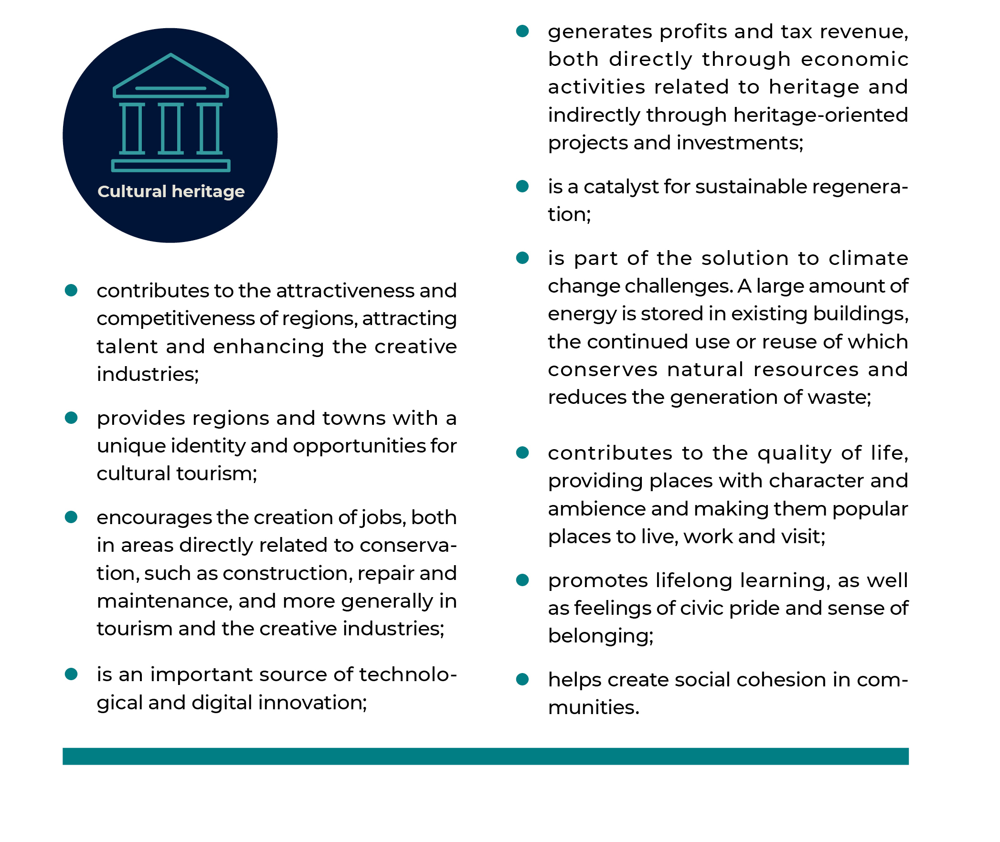

## Built heritage and spatial quality {.chapter_section .chapter2_section}

```{block, type='authors authors_eng'}
<div class="author-links">**[Triin Talk](#triin-talk) and [Siim Raie](#siim-raie)**</div>
<div><a class="print-btn" href="../ehituspärand-ja-ruumikvaliteet.html">EE</a></div>
```

```{block, type='points'}
* A quarter of the architectural monuments in Estonia are in poor condition and lie in disuse; the state’s contribution to their maintenance is insufficient.
```

Existing buildings and spatial structures form a framework for contemporary spatial design. A historic building can be a local symbol, community centre and tourist attraction, and the space surrounding it can be designed to facilitate viewing and visiting it. It can also be a source of shame and discord if its poor condition causes it to be considered an eyesore or a threat to people moving in the public space. Built heritage has significant influence on the image of a region – its condition can either reflect the resilience of the settlement through the ages or act as a bleak reminder of better times lost.

In Estonia and elsewhere, the growing role of built heritage conservation went hand in hand with the triumph of post-war modernism in the 1960s and 1970s. The Soviet authorities had created favourable conditions for the revolutionary transformation of space – all land was owned by the state, making it possible to introduce utopian building plans. The rise of heritage conservation can be viewed as a critical response to modernist urban renewal policies, which in the case of Estonia was also accompanied by opposition to the ruling regime. Mass-produced apartment buildings were indispensable in solving housing shortages, but it was soon recognised that the regional identity and cultural value of space were also indispensable.

The conflicting initiatives to renew and preserve the built environment continue to shape our public space today, but the disagreements no longer seem so acute. Contemporary urban planning takes much greater account of existing structures; the fragmentation of land ownership and democratisation of society also make it more difficult to demolish entire city blocks. At the same time, moderate poverty, which has helped to preserve much of the heritage to this day, is declining. Although beneficial in the long run, heritage restoration is not the most profitable option for owners in the short term, and that makes the protection of cultural heritage by law still necessary. How best to carry it out today and in the future has been the central question in the development of a new Heritage Conservation Act over the past six years. The issue is also highlighted in this article, as we look at the role of built heritage in shaping and enhancing the value of public space in Estonia. To address this issue, we pose three questions:

1) What is the impact of built heritage on space and its users?
2) How can historical buildings be regarded as part of sustainable spatial design?
3) What is the role of the state in protecting built heritage?

In the article, we look at the impact of all built heritage in the public space, not just listed buildings, and discuss heritage conservation in a broader sense covering the protection and preservation of heritage.

### Built heritage helps to create diverse space {-.chapter2_section}

Heritage conservation is not about resisting change; it is an effort to manage change so that existing values are preserved and remain discernible in space. This is usually the easiest way to create good-quality space – to understand the value of things that already exist, to highlight them and add new things around them in a coherent way, instead of disassembling the space and starting from scratch. A good example is the Rotermann Quarter in Tallinn, where a combination of protected industrial buildings and new architecture has created a highly valued and diverse space. If the plans from a few decades ago had been realised and the entire quarter had been demolished to create a shortcut between Viru Hotel and Linnahall, an environment as multifaceted and distinctive as exists today would certainly not have emerged.

```{block, type='blockquote-right'}
Heritage conservation is not about resisting change; it is an effort to manage change so that existing values are preserved and remain discernible in space.
```
Architect Rem Koolhaas ([2014](#Koolhaas2014)) has said that heritage conservation protects us from today’s proliferation of mediocrity. While new architecture that follows global trends often lacks variety, the key role of heritage conservation is to preserve the diversity and regional characteristics of the built environment. Good new architecture tends to be concentrated in places where old values already exist: for example, two thirds of the Estonian Architecture Awards in 2018 were given for protected buildings or buildings located in protected zones.

Estonians have a relatively high interest in cultural heritage: according to a Eurobarometer survey (2017), 71% of Estonians had visited a historical monument or site within the past year, while the European Union average was 61% ([Figure 2.2.1](#figure221)).

<p class="caption" id="figure221"><span class="figure-number">Figure 2.2.1.</span> Estonians visit historical monuments and sites more often than the average European</p>


```{r, figure221, out.width='90%',fig.align='center', echo=FALSE, message=FALSE, warning=FALSE}

library("tidyverse")
library("scales")
library("dplyr")
library("grid")
library("gridExtra")


 fig221_data <- read.csv ("../data/22_fig1_data.csv", header=TRUE, fileEncoding="utf-8", sep=";")

  fig221_data$answer <- factor(fig221_data$answer, levels = c("Ei oska öelda","Ei ole","Vähemalt üks kord"))

  fig221_data$label <- fig221_data$value
  fig221_data$label[which(fig221_data$label == 0)] <- NA

  fig221_plot1 <- ggplot(subset(fig221_data, pop %in% c("EE"))) +
    geom_bar(mapping = aes(x=question, y=value, fill=answer), width=0.5, stat="identity") +
    geom_text(mapping = aes(x=question, y=value, label=round(label, digits=0)), stat="identity", color="white", position = position_stack(vjust = .5)) +
     scale_fill_manual(values=c("#A8ACA6","#afd7d8","#369b9e")) +
    coord_flip()+
    labs(y="", x="") +
    scale_x_discrete(labels = wrap_format(50)) +
    ggtitle("EE")


      fig221_theme1 <- theme(
      text = element_text(color = "#292b2c", size = 8,family=""),
      axis.text.y = element_text(size=10),
      axis.text.x = element_blank(),
      panel.grid.major.y = element_blank(),
      plot.title = element_text(size=14)
  )


    fig221_plot2 <- ggplot(subset(fig221_data, pop %in% c("EL28"))) +
    geom_bar(mapping = aes(x=question, y=value, fill=answer), width=0.5, stat="identity") +
    geom_text(mapping = aes(x=question, y=value, label=round(label, digits=0)), stat="identity", color="white", position = position_stack(vjust = .5)) +
     scale_fill_manual(values=c("#A8ACA6","#afd7d8","#369b9e")) +
    coord_flip()+
    labs(y="%", x="") +
    scale_x_discrete(labels = wrap_format(50)) +
    ggtitle("EL28")


    fig221_theme2 <- theme(
      text = element_text(color = "#292b2c", size = 8, family=""),
      axis.text.y = element_text(size=10),
      panel.grid.major.y = element_blank(),
      legend.position = "none",
      plot.title = element_text(size=14)
  )


#grid.arrange(fig221_plot1 + fig_theme_general + fig221_theme1, fig221_plot2 + fig_theme_general + fig221_theme2, ncol = 1)

#g <- arrangeGrob(fig221_plot1 + fig_theme_general + fig221_theme1, fig221_plot2 + fig_theme_general + fig221_theme2, ncol = 1)

#ggsave(path="exported_figures/PDF/chapter2",filename="fig221.pdf",g, height=280, width=180, units="mm")


```

``` {block, type='imgsource'}
<div><span class="imgsource-source">Source:</span> Eurobarometer 2017.</div>
<div><a class="data-btn" href="../data/22_fig1_data.csv"><i class="fa fa-download" aria-hidden="true"></i></i>Download data</a></div>
```

The impact of built heritage is wider still. Aside from offering sites worth visiting, it plays an important role in shaping the vitality of regions and contributing to the quality of their living environment. The report ‘Cultural Heritage Counts for Europe’ (2015), a European Union collaborative project dedicated to researching the potential of heritage, articulates its societal benefits ([Figure 2.2.2](#figure222)).

<p class="caption" id="figure222"><span class="figure-number">Figure 2.2.2.</span> Societal benefits of cultural heritage</p>

```{r, figure222, out.width='90%',fig.align='center', echo=FALSE, message=FALSE, warning=FALSE}



```
``` {block, type='imgsource'}
<span class="imgsource-source">Source:</span> Cultural Heritage Counts for Europe 2015.
```

The conservation of architectural heritage is not aimed at maintaining unity of style in the built environment, or at reconstructing the appearance of a specific period of history, but at honouring and highlighting the various layers of the built environment while complementing them with high-quality contemporary additions. Replicas of historical buildings are also not excluded – they can be appropriate if buildings central to the region’s history have been destroyed, as in the case of the Nõmme market building in Tallinn. However, reconstructing copies of long-lost buildings is no longer considered ethical in heritage conservation today, and for two reasons: first, it would be a manipulation of history, and second, it would divert resources and attention away from real cultural heritage while reducing its value – if historic buildings can always be rebuilt using old pictures, why try to conserve them now?

### The conservation of existing buildings is the basis for sustainable spatial development {-.chapter2_section}

Advances in the maintenance and continued use of existing buildings are also increasingly relevant in the context of energy efficiency and climate change. Around 20% of the energy balance of a building’s life cycle is spent on heating, with the remaining 80% consumed by the production and construction of materials. Existing buildings are therefore a resource, the continued use and reuse of which is fully sustainable – once building materials have been placed into a building, the renovation and continued use of that building generally has a lower environmental footprint than erecting a new house, even if the new house is more energy-efficient. ‘The greenest building is … one that is already built’ ([Elefante 2007](#Elefante2007)) is a recognition that also considers the life cycle of the materials used in the construction of buildings, and not just the cost of heating. Using, repairing and upgrading the same building for 500 years is more sustainable than demolishing and rebuilding every 50 years.

There are 12 heritage conservation areas and over 5,000 listed structures in Estonia (the latter are mainly historic buildings, but may also include structures such as roads and bridges, parks and military facilities). Listed buildings account for about 0.7% of the buildings in the Register of Buildings, and even with the inclusion of the buildings located in the heritage conservation areas, built heritage under state protection only accounts for about one percent of all buildings. Comparing the number of buildings under state protection with those of other countries is difficult and must be done while recognising that the list of Estonian heritage sites mirrors the technical possibilities and land fragmentation of the 1990s: complexes considered as single heritage sites in many countries have been listed as dozens of separate buildings in Estonia. The meaning of state protection can also vary greatly. In the US, for example, there are over 100,000 monuments and a thousand more are added to the list each year. Yet designation as a monument under state protection does not even involve a ban on demolition – building regulations can only be implemented by local authorities ([Page 2016](#Page2016)). In the UK, there are over 9,800 heritage protection areas and 375,588 listed buildings, excluding historic parks and gardens, which in Estonia are included among listed places. In Latvia, there are 8,584 cultural monuments, 5,183 of which are of national importance and 3,401 of local importance – 40% of them are architectural monuments. Finland has a very small number of monuments – 280 buildings or groups of buildings – but additionally, all churches built before 1917 are automatically granted protection, and the same goes for approximately 800 historic buildings once owned by the state and 1,258 nationally significant cultural environments. Heritage conservation through planning has been used in Finland since the 1980s; instead of being listed as monuments, most of built heritage is protected by planning documents – an estimated 15–20,000 buildings or groups of buildings.

<div class="casebox">
<h3>Industrial heritage</h3>

Our disused built heritage includes many large industrial facilities first constructed for the needs of the great Russian Empire and long since proved unnecessary on such a scale. In Tallinn, several industrial areas have been successfully revitalised as residential and business districts (e.g. the Rotermann, Noblessner, Luther, Tselluloos and Dvigatel quarters); in smaller towns, new uses for such buildings have been more difficult to find. The Kreenholm Manufacturing Company in Narva, for several decades Europe’s largest textile producer, was the most modern industrial enterprise of the Russian Empire in the second half of the 19th century. At its peak, it employed more than ten thousand people; on a smaller scale, production continued until 2010. According to an ambitious proposal, approved as a detailed spatial plan, the Kreenholm area will be converted into an attractive hub with residential houses, entertainment and cultural institutions, a conference centre, a science park, hotels and commerce. Although the development is yet to commence, the owner has fitted the buildings – architectural monuments – with new roofs and reached an agreement with Narva Museum allowing guided tours on the premises.

<p class="caption" id="figure223"><span class="figure-number">Figure 2.2.3.</span> The Kreenholm Manufacturing Company building</p>

```{r, figure223, out.width='100%', fig.align='center', echo=FALSE, message=FALSE}

knitr::include_graphics("../figures/2-chapter/fig223.png")

```

</div>
```{block, type='imgsource'}
<span class="imgsource-source">Source:</span> Annika Haas.
```

Estonia has also started to implement heritage conservation through municipal spatial plans alongside state-level heritage protection. Since 2003, local government authorities have been able to establish milieu protection areas, and, since 2015, individual sites of cultural value. The use of planning documents for the purposes of conservation of built heritage is still a new and emerging practice, and the assumption that anything that is not under state protection can be demolished is slow to recede.

Through the milieu protection areas and individual sites of cultural value, heritage conservation has become more comprehensive and inclusive of local communities. In theory, when a plan is made public, anyone can express their opinion on what values should be preserved in the planning area, but the actual impact of those comments on spatial design decisions can be modest. The lists of national monuments were compiled at a time when public participation was not required by law in the same way as it is today, and in the few instances where protection has been granted to new sites, the National Heritage Board has mostly been in contact only with local authorities and the property owners. Proposals to take sites under state protection can be made by any citizen, but whether protection is granted is for specialists to decide. Designating milieu protection areas and individual sites of cultural value is entirely up to local governments. With the active participation of communities, this could become a truly democratic form of heritage conservation, one that does not prioritise how representable and distinctive a building is in a country-wide comparison, but whether it is valued locally and people still wish to see it in the public space.

A two-tiered heritage conservation system helps to value built heritage more broadly and flexibly than is possible with only state protection. Even so, the new situation raises many questions. For example, should permanent state-level protection be granted to all buildings that were listed in the 1990s due to a lack of alternatives? Can requirements be stricter for milieu protection areas than they are for heritage conservation areas? When considering old buildings as an environmental resource, protecting only 1% of the historically and architecturally most valued buildings that are under state protection is not enough – more should be done to extend the lifetime of other existing buildings, and inclusive conservation through planning allows this.

The problem lies with many old detailed plans, the validity of which continues indefinitely and permits the demolition of valuable buildings, even though they are today no longer in line with public expectations. For example, when the demolition of a 1920s wooden art nouveau building at 141 Kadaka Road was commenced in Tallinn in 2019, it created an outcry among locals who value cultural heritage. The building had become a popular restaurant and nearly 4,000 signatures were gathered in an effort to save it, on top of which several appeals and articles were written. The city district elder also told the press he would not agree to the demolition of the building. However, because the demolition was authorised by a detailed plan established in 2008, the validity of which had no termination date, efforts to halt it were unsuccessful. Similar planning documents – with content that comes across as surprising in today’s context – are springing up everywhere, and while 10 or even 20 years have passed since the public and government agencies last had their say over them, old plans can be implemented without first consulting the stakeholders once again. In addition to drafting new heritage-friendly plans, local heritage conservation should include the review and, where appropriate, revoking of old detailed plans, which, as far as is known, local government authorities have not yet done.

### Individual spatial decisions have a major impact on cultural heritage and regional development {-.chapter2_section}

The condition and impact of built heritage in the public space are mainly determined by its use or disuse. A building left empty in an area where population is in decline (that is, in most areas of Estonia) will often remain unused for a very long time. Empty buildings make a settlement look abandoned, decrease the sense of pride locals feel for their home town and their willingness to contribute to its development. Neglected buildings make people want to move away, many enterprising people leave and those that remain mostly have no choice but to stay.

```{block, type='blockquote-left'}
Spatial development is less influenced by funding measures and more by the individual decisions made in the different silos of government authorities – decisions on where to open a school, where to close a hospital, which institutions to join together and where to place them.
```

The state of its buildings plays a great role in the attractiveness and security of a town – ramshackle houses with boarded up windows have a dispiriting effect. Upkeep of the historic urban space and buildings is not only a matter of heritage conservation and sustainability, it also follows regional development goals. Cultural heritage can be a way to provide small towns with a breath of fresh air, increasing their potential as a living environment. For example, the Union of Estonian Architects has drawn attention to the renovation of several town centres with the project ‘Good Public Space’, helping to attract investors. Constructing new town squares is, however, not enough to improve the urban living environment if the designer lights and cutting-edge pavement are surrounded by half-empty buildings in a state of dilapidation. In the coming years, the heritage conservation programme planned by the Ministry of Culture will provide some help in renovating buildings located in heritage conservation areas, but spatial development is less influenced by funding measures and more by the individual decisions made in the different silos of government authorities – decisions on where to open a school, where to close a hospital, which institutions to join together and where to place them.

In its final report, the Spatial Design Expert Group, which in 2017 and 2018 analysed spatial development processes in Estonia, concluded that the quality of spatial design is often determined by decisions made prior to the spatial planning or design process, and without the involvement of spatial experts. Similarly, the decisions to abandon old buildings and move institutions out of historic districts are usually made without the involvement of heritage specialists. Among other tasks, the proposed Spatial Design Expert Group is to ensure the compactness of urban settlements and encourage the utilisation of historic buildings. This offers hope that in the future, these decisions will be significantly more influenced by spatial expertise.

To ensure that spatial policy objectives are attained, substantial spatial decisions should also consider long-term socio-economic impacts, including the entire life cycle of buildings – construction, use, maintenance and demolition – the creation and preservation of values, and the aspect of location (2018 final report of the Spatial Design Expert Group). For example, when constructing a new energy-efficient schoolhouse at an affordable square-metre price, attention should be paid to finding a new function for the old schoolhouse, including working out the cost of necessary modifications. When calculating energy efficiency, it is necessary to consider not only the energy class of the new building, but also the energy consumption and life cycle of the construction materials used, as well as costs related to the vacated building.

```{block, type='blockquote-right'}
Old buildings are an environmental resource and it is worth extending their life.
```

Decisions to move offices out of particular buildings and allocate large grants to particular developments are made outside of heritage conservation. Yet, these decisions are central to the preservation of heritage, and it is therefore important to integrate cultural heritage conservation into all areas of governance and support programmes, as with the other constitutional tasks, such as ensuring national security. This applies to listed buildings in particular, as the state has set itself the task of preserving them for future generations.

### Monuments are a common good and a shared responsibility {-.chapter2_section}

The Council of Europe policy document on the value of cultural heritage for society, the Faro Convention, which Estonia is preparing to join, regards cultural heritage as a universal human right. This means that everyone has the right to engage with cultural heritage, to participate in its creation and interpretation in the way they choose, and that therefore, heritage plays an important role in building and sustaining a democratic society. Protecting the assets of the living environment is already a considerable part of the activities of Estonian neighbourhood associations. Local built heritage is valued even more if it is threatened by demolition. Each year, the National Heritage Board receives dozens of proposals from the public to place buildings under protection; most of the proposals are aimed against the demolition threat to historic buildings getting in the way of new developments. Still, state protection could not be tied to a referendum because then the list of monuments would mainly consist of buildings that were intended to be demolished at some point in the past. By designating a building as a monument, the state commits itself to contributing to its preservation. Prior to taking on this long-term commitment, expert assessment is needed, and, subsequently an administrative decision ensuring that the case meets the requirements for state protection, that is to say, belongs to the more valuable part of the cultural heritage. It is therefore important to distinguish between the community’s right to cultural heritage and the national policies to protect cultural heritage in the public interest as formulated in the Faro Convention. The first concept is broader, referring to a collective and open practice that is not necessarily linked to any national regulations. As a possible instrument of heritage construction, designating a site as a monument requires more than just an opinion poll – most proposals made by citizens receive a negative response, and new monuments are confirmed on the basis of expert research. There is no reason to consider the expert-based national heritage conservation process undemocratic, however, as each proposal for the designation of a monument, as well as the different viewpoints surrounding it, are thoroughly considered. Yet the continued interest citizens show in bringing new sites under state protection demonstrates that the conservation of the built heritage is indeed in the public interest, and also helps us understand what people regard as their heritage.

State-protected built heritage is a common good, offering us all the opportunity to stroll around the Old Town Christmas Market or get married in a splendid manor house, but at the same time, it is the responsibility of a few. The responsibility for the preservation and maintenance of monuments lies primarily with their owners, mostly private individuals ([Figure 2.2.4](#figure224)). About a quarter of all listed buildings are in poor or critical condition and around another quarter are in disuse. Use of a building generally ensures its maintenance, and falling out of use usually hastens decay. The condition of monuments is better in larger towns and worse in rural areas and small towns, where population decline results in the emptying of buildings.

<p class="caption" id="figure224"><span class="figure-number">Figure 2.2.4.</span> Ownership of architectural monuments</p>

```{r, figure224, fig.asp=.75, fig.align='center', echo=FALSE, message=FALSE, warning=FALSE}

library("tidyverse")
library("scales")

fig224_data <- read.csv ("../data/22_fig4_data.csv", header=TRUE, fileEncoding="utf-8")

fig224_data$owners_eng[grepl("Eraomanik", fig224_data$owners)]<-"Private owner"
fig224_data$owners_eng[grepl("Omavalitsus", fig224_data$owners)]<-"Municipality"
fig224_data$owners_eng[grepl("Riik", fig224_data$owners)]<-"State"

fig224_data$owners_eng <- factor (fig224_data$owners_eng, levels = c("Private owner","Municipality", "State"))

fig224_data$percent=percent((fig224_data$value/100), 1)

  fig224_plot <- ggplot(data = fig224_data, aes(x = "", y = value, fill = owners_eng)) +
  geom_bar(stat = "identity") +
  scale_fill_manual(values=c("#dbd8d7","#a18bbb","#297477")) +
  geom_text(aes(label = percent), position = position_stack(vjust = 0.5), color="white") +
  coord_polar(theta = "y") +
  labs(x="", y="")

  fig224_theme <- theme(
                    panel.grid.major.x = element_blank() ,
                    panel.grid.major.y = element_blank(),
                    panel.grid.minor.x = element_blank() ,
                     panel.grid.minor.y = element_blank(),
                     axis.line = element_blank(),
                     axis.text.x = element_blank(),
                         text=element_text(family="Montserrat")
                 )


  print(fig224_plot + fig_theme_general + fig224_theme)

#ggsave(path="../exported_figures/PDF/chapter2",filename="fig224.pdf", height=120, width=200, units="mm")

```

``` {block, type='imgsource'}
<div><span class="imgsource-source">Source:</span> Explanatory memorandum of the draft Heritage Conservation Act.</div>
<div><a class="data-btn" href="../data/22_fig4_data.csv"><i class="fa fa-download" aria-hidden="true"></i></i>Download data</a></div>
```

Repair and restoration of monuments and buildings in heritage conservation areas is supported by the National Heritage Board to the extent possible given its annual budget. One problem has been the lack of funding: before the recession, annual grants ranged from 1.1 to 1.3 million euros, but since 2009, restoration grants have varied between 0.5 and 0.7 million euros. The average grant is around 5,000 euros, with most of the grant funds used for emergency roof repairs ([Figure 2.2.5](#figure225)).

<p class="caption" id="figure225"><span class="figure-number">Figure 2.2.5.</span> Restoration grants in 2018 (€)</p>
```{r, figure225, out.width='80%', fig.align='center', echo=FALSE, message=FALSE, warning=FALSE}

library("tidyverse")

 fig225_data <- read.csv ("../data/22_fig5_data.csv", header=TRUE, fileEncoding="utf-8")

 fig225_data$type_eng[grepl("Taotluste maht", fig225_data$type)]<-"Applied for"
  fig225_data$type_eng[grepl("Toetused", fig225_data$type)]<-"Granted"


  fig225_plot <- ggplot() +
    geom_bar(data = fig225_data, mapping = aes(x=type_eng, y=sum, fill=type), width=0.4, stat="identity") +
    scale_fill_manual(values=c("#369b9e","#a18bbb")) +
    labs(y="", x="")+
    scale_y_continuous(labels = number)

  fig225_theme <- theme(
    legend.position=0,
    text = element_text(size = 12, family="Montserrat"),
    panel.grid.major.x = element_blank() ,
    panel.grid.minor.x = element_blank(),
  )

  print(fig225_plot + fig_theme_general + fig225_theme)

  ggsave(path="../exported_figures/PDF/chapter2",filename="fig225.pdf", height=120, width=200, units="mm",encoding = "ISOLatin9.enc")
```

``` {block, type='imgsource'}
<div><span class="imgsource-source">Source:</span> National Heritage Board..</div>
<div><a class="data-btn" href="../data/22_fig5_data.csv"><i class="fa fa-download" aria-hidden="true"></i></i>Download data</a></div>
```

In addition to general grants for the restoration of immovable monuments, the state has used specific support measures to fund the renovation of sacral buildings between 2004 and 2018 as part of the ‘places of worship programme’, and the renovation of manor schools between 2001 and 2016 under a programme funded by the Norwegian EEA. Both programmes had a total value of over 12 million euros. In most cases, churches and manors are the largest and most prominent buildings in the settlements, with significance for a large part of the community and even attracting visitors from other areas.
With the help of the manor schools programme, most Estonian manor schools have been restored to some degree. The places of worship programme has given grants to more than 200 churches and chapels ([Figure 2.2.6](#figure226)).

<p class="caption" id="figure226"><span class="figure-number">Figure 2.2.6.</span> The places of worship programme (€)</p>
<div class="desktop-plot">
```{r, figure226, fig.asp=.75, fig.align='center', echo=FALSE, message=FALSE, warning=FALSE}

library("tidyverse")
library("scales")

 fig226_data <- read.csv ("../data/22_fig6_data.csv", header=TRUE, fileEncoding="utf-8")

 fig226_data$type_eng[grepl("Taotluste kogusumma", fig226_data$type)]<-"Total applications"
fig226_data$type_eng[grepl("PÜPi eelarve kogusumma", fig226_data$type)]<-"Total programme budget"

fig226_data$type_eng <- factor (fig226_data$type_eng, levels = c("Total applications","Total programme budget"))

  fig226_plot <- ggplot(data = fig226_data) +
    geom_line(mapping = aes(x=year, y = value, colour=type_eng, group=type_eng, text = paste("", type_eng,
                         "<br>", year,
                         "<br>", value,"€")), size=0.75) +
    scale_colour_manual(values=c("#a18bbb","#369b9e"))+
    labs(y="", x="") +
    scale_x_continuous(breaks = c(2004,2006,2008,2010,2012,2014,2016,2018), expand = c(0, 0), limits=c(2004,2018.5))+
    scale_y_continuous(breaks = c(0,1000000,2000000,3000000,4000000,5000000), labels = number, expand = c(0, 0), limits=c(0,5500000))+
    expand_limits (y=0)

   fig226_theme <- theme(
     panel.grid.minor.x = element_blank(),
      text = element_text(size = 12, family="Montserrat"),

  )

ggplotly(fig226_plot + fig_theme_general + fig226_theme, tooltip = "text" ) %>%
config(displayModeBar = F, collaborate = F)   %>%
layout(legend = list(orientation = "h",y = 1.15)) %>%
layout(xaxis = list(fixedrange = TRUE)) %>%
layout(yaxis = list(fixedrange = TRUE))

  ggsave(path="../exported_figures/PDF/chapter2",filename="fig226.pdf", height=90, width=160, units="mm",encoding = "ISOLatin9.enc")
```
</div>

<div class="mobile-plot">
```{r, out.width='100%', fig.asp=.75, fig.align='center', echo=FALSE, message=FALSE, warnings=FALSE}

  print(fig226_plot + fig_theme_general + fig226_theme)

```
</div>

``` {block, type='imgsource'}
<div><span class="imgsource-source">Source:</span> National Heritage Board.</div>
<div><a class="data-btn" href="../data/22_fig6_data.csv"><i class="fa fa-download" aria-hidden="true"></i></i>Download data</a></div>
```

As of 2019, the places of worship programme was incorporated into the National Heritage Board’s restoration grant budget; even though the budget increased by nearly half as a result, the capacity for funding private owners has remained unchanged. To improve the situation for private owners, a measure to support traditional rural architecture was created in 2019, with an initial budget of only 100,000 euros. A programme of grants for old towns is also being developed, and is expected to encourage the restoration of small-town heritage protection areas in the coming years.

The state’s support for built heritage under its protection is far from sufficient: the volume of applications for restoration grants is several times greater than the funding capacity ([Figure 2.2.7](#figure227)). A cut made during the economic crisis reduced the budget for grants almost by half, and although the state budget has tripled since the end of the crisis, state support for monuments has essentially remained at the crisis level ([Figure 2.2.7](#figure227)). Unlike many other countries, Estonia offers no tax incentives for monument owners.

<p class="caption" id="figure227"><span class="figure-number">Figure 2.2.7.</span> Comparison of the restoration grant and the state budget</p>

<div class="desktop-plot">
```{r, figure227, fig.asp=.75, fig.align='center', echo=FALSE, message=FALSE, warning=FALSE}

library("tidyverse")

 fig227_data <- read.csv ("../data/22_fig7_data.csv", header=TRUE, fileEncoding="utf-8")

 fig227_data$type_eng[grepl("Restaureerimistoetus", fig227_data$type)]<-"Restoration grants (€)"
fig227_data$type_eng[grepl("Riigieelarve kulud", fig227_data$type)]<-"State budget expenditure (€)"

  fig227_plot <- ggplot(data = fig227_data) +
    geom_line(mapping = aes(x=year, y = value, colour=type_eng, group=type_eng, text = paste("", type_eng,
                         "<br>", year,
                         "<br>", value)), size=0.75) +
    scale_colour_manual(values=c("#a18bbb","#369b9e"))+
    labs(y="", x="aasta") +
    scale_x_continuous(breaks = c(2006,2008,2010,2012,2014,2016,2018), expand = c(0, 0), limits=c(2005,2018.5))+
    scale_y_continuous(breaks = c(0,2000000,4000000,6000000,8000000,10000000),labels = number, expand = c(0, 0), limits=c(0,11500000)) +
    expand_limits (y=0)

   fig227_theme <- theme(
     panel.grid.minor.x = element_blank(),
    text = element_text(size = 12, family="Montserrat"),
  )

  ggplotly(fig227_plot + fig_theme_general + fig227_theme, tooltip = "text" ) %>%
config(displayModeBar = F, collaborate = F)   %>%
layout(legend = list(orientation = "h",y = 1.15)) %>%
layout(xaxis = list(fixedrange = TRUE)) %>%
layout(yaxis = list(fixedrange = TRUE))

  #ggsave(path="../exported_figures/PDF/chapter2",filename="fig227.pdf", height=90, width=160, units="mm")
```

</div>
<div class="mobile-plot">
```{r, out.width='100%', fig.asp=.75, fig.align='center', echo=FALSE, message=FALSE, warnings=FALSE}

  print(fig227_plot + fig_theme_general + fig227_theme)

```
</div>

``` {block, type='imgsource'}
<div><span class="imgsource-source">Source:</span> National Heritage Board, Statistics Estonia.</div>
<div><a class="data-btn" href="../data/22_fig7_data.csv"><i class="fa fa-download" aria-hidden="true"></i></i>Download data</a></div>
```

The research project ‘Protection of privately owned cultural heritage’ ([Tafel-Viia et al. 2014](#Tafel2014)) has identified the lack of a balance between restrictions concerning monuments and state financial support as one of the core issues facing private owners. Three-quarters of Estonians believe that state authorities should allocate more resources for cultural heritage ([Figure 2.2.8](#figure228)).

<p class="caption" id="figure228"><span class="figure-number">Figure 2.2.8.</span> Resources for cultural heritage</p>

State authorities should allocate more resources for cultural heritage (%).

```{r, figure228, fig.asp=.75, fig.align='center', echo=FALSE, message=FALSE, warning=FALSE}

library("tidyverse")
library("scales")

fig228_data <- read.csv ("../data/22_fig8_data.csv", header=TRUE, fileEncoding="utf-8")

fig228_data$answer_eng[grepl("Nõustun", fig228_data$answer)]<-"Agree"
fig228_data$answer_eng[grepl("Ei nõustu", fig228_data$answer)]<-"Disagree"
fig228_data$answer_eng[grepl("Ei oska öelda", fig228_data$answer)]<-"Don't know"

fig228_data$answer <- factor(fig228_data$answer, levels = c("Agree","Disagree","Don't know"))

fig228_data$percent=percent((fig228_data$value/100), 1)

  fig228_plot <- ggplot() +
  geom_rect(data= subset(fig228_data, pop %in% c("EE")), aes(fill=answer_eng, ymax=ymax, ymin=ymin, xmax=2.9, xmin=0)) +
  geom_rect(data= subset(fig228_data, pop %in% c("EL28")), aes(fill=answer_eng, ymax=ymax, ymin=ymin, xmax=3, xmin=4)) +
  geom_text(data=fig228_data, aes(label = percent, x=x, y=value), position = position_stack(vjust = 0.5), color="white") +
  xlim(c(0, 4)) +
  coord_polar(theta = "y") +


  scale_fill_manual(values=c("#369b9e","#dbd8d7","#a18bbb")) +
  labs(x="", y="")

  fig228_theme <- theme(
                    aspect.ratio=1,
                    panel.grid.major.x = element_blank() ,
                    panel.grid.major.y = element_blank(),
                    panel.grid.minor.x = element_blank() ,
                    panel.grid.minor.y = element_blank() ,
                    axis.line = element_blank(),
                    axis.text.x = element_blank(),
                    axis.text.y = element_blank(),
                    text = element_text(size = 12, family="Montserrat"),
                 )

  print(fig228_plot + fig_theme_general + fig228_theme)

  #ggsave(path="../exported_figures/PDF/chapter2",filename="fig228.pdf", height=120, width=200, units="mm")

```
Outside **EU average**<br>
Inside **Estonia**
``` {block, type='imgsource'}
<div><span class="imgsource-source">Source:</span> Eurobarometer 2017.</div>
<div><a class="data-btn" href="../data/22_fig8_data.csv"><i class="fa fa-download" aria-hidden="true"></i></i>Download data</a></div>
```

In addition to restoration grants, the state’s contribution to cultural heritage is reflected in the management of state-owned built heritage. Nearly 60% of the private owners of monuments feel that the state and local governments are not setting a good example with their management of the monuments, as they often prefer constructing a new building to restoring an old one ([Tafel-Viia et al. 2014](#Tafel2014)).

A recent study on the management of state-owned built cultural heritage ([Mändel et al. 2016](#Mändel2016)) concluded that the state’s property policy needs broader goals than keeping management costs as low as possible. Like the State Forest Management Centre (RMK) aims to increase the appreciation of the forest by building hiking trails and cabins for free public use alongside its profit-orientated activities, the articles of association of Riigi Kinnisvara AS (the manager of state-owned property) should also include objectives relating to the management and displaying of cultural heritage. Today, relying solely on business logic and individual political decisions would be unthinkable in the management of the state’s natural resources, yet it is still common in the case of its built heritage.

<div class="casebox">
<h3>The case of Liberty Manor</h3>

More than 350,000 euros have been used on the planning of a presidential residence at Liberty Manor, most of it to cover design costs. This would be about half of the annual restoration grants from the state budget.
The buildings were acquired from the Estonian Open Air Museum in 2014, the construction documents were completed in 2015. In 2017, however, President Kersti Kaljulaid decided against establishing the residence, and as of early 2019, no decision has been made on what to do next. The museum would like to use the buildings, yet these have not been returned. The manor complex is closed to the public and its condition is deteriorating.
Riigi Kinnisvara AS is awaiting a political decision on what to do with the complex – according to its articles of association, the company has no further authority on the matter. If its articles of association would include the objective of preserving and displaying cultural heritage, Liberty Manor and several other state-owned monuments would probably be in better condition.

<p class="caption" id="figure229"><span class="figure-number">Figure 2.2.9.</span> Koch family summer house at Liberty Manor</p>

```{r, figure229, out.width='100%', fig.align='center', echo=FALSE, message=FALSE}

knitr::include_graphics("../figures/2-chapter/fig229.png")

```
</div>

```{block, type='imgsource'}
<span class="imgsource-source">Source:</span> National Register of Cultural Monuments, Timo Aava 2015.
```

### Summary {-.chapter2_section #summary-22}

Built heritage is a thread connecting the entire network of public space: in one form or another, it is found almost everywhere, constituting a foundational pattern that can be complemented with contemporary solutions to create a multi-layered, unique and high-quality public space. The purpose of heritage conservation is not to restore the spatial appearance of earlier times or to create architectural copies, but to preserve existing values so that they are not thoughtlessly destroyed as new elements are created.

Only a fraction of the buildings in Estonia are under state protection, while many times more are worth preserving in the local spatial context. Municipal spatial planning practices now allow each community to have a say on which locations and buildings deserve to be preserved as milieu protection areas or individual sites of cultural value. Another increasingly important aspect in the continued use and reuse of existing buildings is the environmental.

A quarter of architectural monuments are in poor condition and in disuse, while state support for their restoration has remained at recession levels and is far from sufficient. Private owners are also aware of the public sector’s inconsistent stance towards cultural heritage – the poor condition of many state or local government-owned monuments and how they are closed to the public.

The use and condition of historic buildings, including monuments and heritage areas, is generally determined by decisions made outside heritage conservation, including the relocation and joining together of institutions, and allocations of large EU grants. Leaving buildings empty in settlement centres impairs the living environment and speeds up negative population processes. In order to support sustainable regional development and heritage conservation, better reflection on individual spatial decisions is needed, along with directing public investment and grants into the revitalisation of historic centres.

### References {-.subreferences #references-22}

<p id="Cultural2015">Cultural Heritage Counts for Europe 2015. Full Report. http://blogs.encatc.org/culturalheritagecountsforeurope//wp-content/uploads/2015/06/CHCfE_FULL-REPORT_v2.pdf.</p>
<p id="Elefante2007">Elefante, C. 2007. The greenest building is ... one that is already built. – Forum Journal, 21 (4), 26–38.</p>
<p id="Eurobarometer2017">Eurobarometer 2017. Special Eurobarometer 466. Cultural Heritage. European Commission Directorate-General for Communication.</p>
<p id="Koolhaas2014">Koolhaas, R. 2014. Preservation is Overtaking Us. https://www.arch.columbia.edu/books/reader/6-preservation-is-overtaking-us.</p>
<p id="Mändel2016">Mändel, M., Tafel-Viia, K., Randla, A., Lassur, S., Välja, L., Terk, E., Ingerpuu, L., Viia, A., Valge, C., Hansar, L., Orro, O. 2016. Riigi omanduses olevate kultuuriväärtuslike ehitiste haldamine. Uuringu lõpparuanne. Tallinn: Eesti Kunstiakadeemia muinsuskaitse ja konserveerimise osakond, Tallinna Ülikooli Ühiskonnateaduste Instituut.</p>
<p id="Page2016">Page, M. 2016. Why Preservation Matters. New Haven, London: Yale University Press.</p>
<p id="Tafel2014">Tafel-Viia, K., Lassur, S., Viia, A., Terk, E., Randla, A., Mändel, M., Orro, O., Naris, M., Hansar, L. 2014. Eraomandis oleva kinnismälestise hoidmine. Uuringu lõpparuanne. Tallinn: Tallinna Ülikooli Eesti Tuleviku-uuringute Instituut, Eesti Kunstiakadeemia muinsuskaitse ja konserveerimise osakond.</p>
