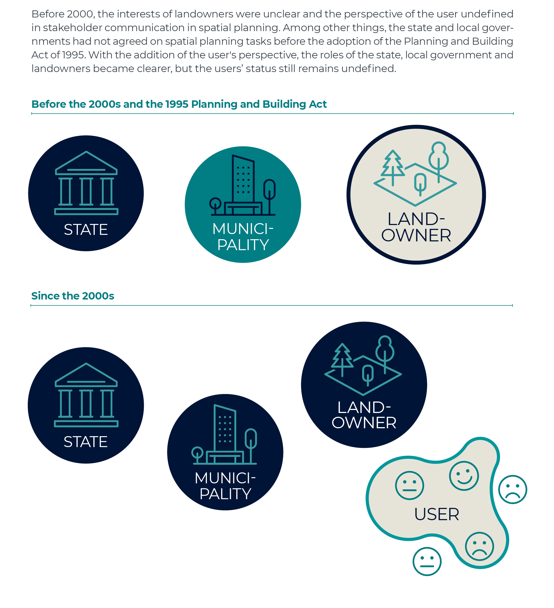
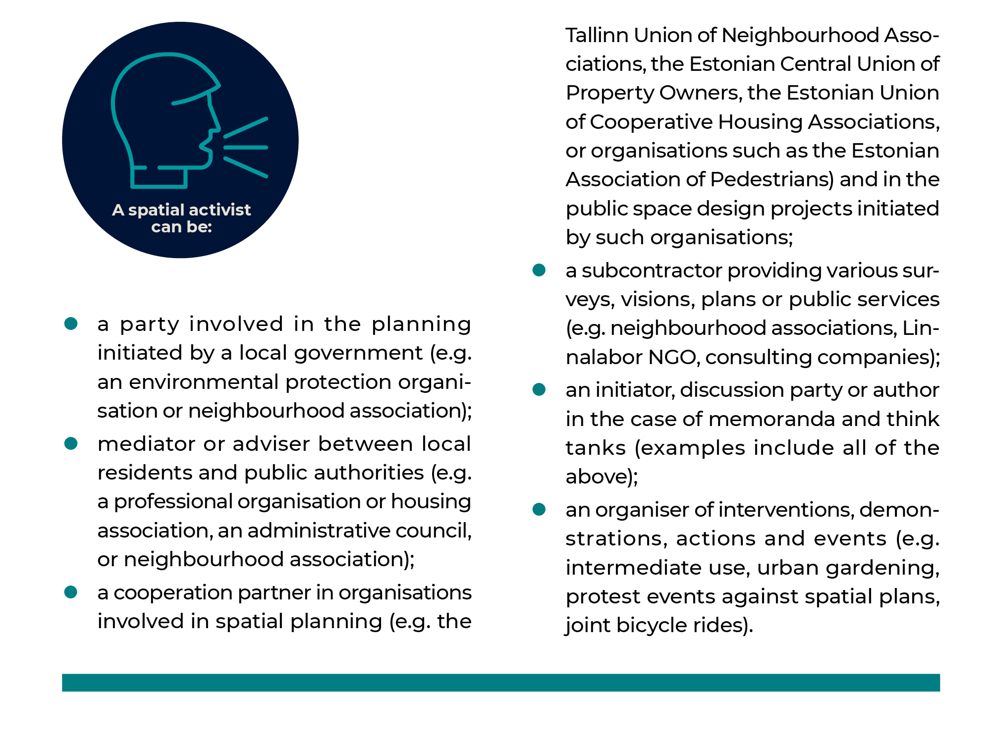

## Urban activism in the co-creation of public space {.chapter_section .chapter2_section}

```{block, type='authors authors_eng'}
<div class="author-links">**[Keiti Kljavin](#keiti-kljavin), [Johanna Pirrus](#johanna-pirrus), [Kaija-Luisa Kurik](#kaija-luisa-kurik) ja [Ingmar Pastak](#ingmar-pastak)**</div>
<div><a class="print-btn" href="../aktivism-avaliku-ruumi-koosloomes.html">EE</a></div>
```

```{block, type='points'}
* Estonian civil society has reached a point where people increasingly want to have a say in the development of the urban environment, express their views, and apply their skills and knowledge.
```

Planning and architectural practice – that is, the creation and theoretical discussion of the built environment – have changed in Estonia over the past 30 years. The two-way discussion between the client and the contractor characteristic to modernist planning practices and adopted by neoliberal governance now involves a third stakeholder – the user with a perspective based on individual experience has entered the conversation  ([Burby 2003](#Burby2003); [Holvandus and Leetmaa 2016](#Holvandus2016)).

Urban activism, or civic activism in architecture and urban planning, indicates the user’s interest in knowing and having a say in how and on what principles the built environment is governed and created. Activism both directs design and depends on it, which is why its long development has not been without problems. Even today, there is a viable planning practice whereby stakeholders are usually only invited to participate after decisions have already been made in principle and are about to be put into practice. Although substantive issues in discussions about space, such as what kind of public space is created and for whom, are still often left in the background, the general debate about spatial decisions in Estonia now also includes the idea of co-creation in planning.

Borrowed from design theory, the term ‘co-creation’ refers to cooperation in the design and implementation of spatial decisions that takes into account the experience of a broad range of stakeholders. Co-creation is aimed at achieving a consensus-based result. However, forms of meaningful co-creation have not yet fully developed in Estonia. Directly adapting co-creation models from other countries is problematic, as they often emerge from contexts that are difficult to compare. There are differences in urban governance and legislation – that is, planning law, coordination of the activities of the agencies involved, cooperation of support systems and so on. For example, adopting practices from Western Europe or the Nordic countries does not work in a situation where civic activism does not lead to the expected social cohesion or where co-creation does not actually involve the local community. Urban activism does not always need to look for a solution but can also participate in design as opposition that is constantly re-defining what constitutes a good environment for living and encouraging discussions about different interests publicly. Co-creation as a method is only one of the outputs of activism; it helps us as a society to achieve a better and more carefully planned living environment through the exchange of ideas between stakeholders.

```{block, type='blockquote-right'}
Co-creation is aimed at achieving a consensus-based result. However, forms of meaningful co-creation have not yet fully developed in Estonia.
```
Urban activism generally implies a personal motive on the part of the participant, which may be related to a specific environment or increasingly to questions of worldview. Planning practices have become more open and democratic in Estonia since the 1990s, and therefore society expects citizen and stakeholder participation as a prerequisite for creating good public space. Among other things, this has led to recognising that current practices of public participation are not producing better public space.

In this article, we look at different forms of urban activism and how the relationship between the stakeholders in spatial design has changed in Estonia since the 1990s. We look at how activism gets involved in the creation of the urban living environment and look for answers to the following questions:

1) How does activism influence spatial decisions?
2) What role has urban activism played in the development of civil society in general?
3) What are the main challenges and internal contradictions of urban activism in Estonia?

### Urban activism as a political activity changes in time and its form varies according to the aims pursued {-.chapter2_section}

```{block, type='blockquote-right'}
Artiklis nimetame eri aktivismivorme liikumisteks, näiteks linnalised liikumised.
```
Just as the meaning of public space, the role of the activist also changes. Activism is the instigation of social, political or other changes and the presentation of alternative views – an urban activist primarily represents personal and/or community interests regarding planning and design. In Estonia, the terms ‘(urban) activist’ and ‘(urban) activism’ refer to the leaders of neighbourhood associations, movements against the construction of a specific building or planning decision, as well as professional and civil society associations and organisations involved in planning and design. Urban activism can be both reactive and proactive. The reactive aspect usually refers to opposition to a specific development project or development direction, while the proactive aspect refers to a broader advocacy and desire to influence both local development and the planning process itself through design. Reactivity and proactivity share common ground, and neither can be characterised in terms of specific movements or activists – movements that were initially reactive have often become proactive over time. Proactive movements, on the other hand, may return to a reactive role in the future.

```{block, type='casebox'}
<h3>Forms of community actiond</h3>

 <a href="https://www.kysk.ee/failid/Upload/files/Uuringud/Kogukonnauuring.pdf">A community survey</a> conducted in 2014 by the Estonian Urban Lab (Linnalabor) and the Estonian village movement Kodukant revealed that registered NGOs are not the only organisational form used for local activism. In 2013, Kodukant counted 1,316 village elders, 1,188 associations operating in villages and 51 cooperation associations (cross-municipal umbrella organisations and round tables that unite NGOs, associations and village elders developing local activity). A total of 45,027 unregistered associations engaged in local development were counted in 2006. According to Linnalabor, there were 6 urban associations in Estonia in 2014, and about a dozen eco-communities. Thus, according to the 2014 survey, there are about 3,500 officially organised communities in Estonia. Of the communities responding to the survey, 75% were registered as NGOs, 9% gathered spontaneously without being officially organised, 6% gathered under the leadership of the village elder and 6% operated on the basis of partnership agreements. Insufficient statistics make it difficult to draw conclusions about the forms of action of these communities.

```
```{block, type='imgsource'}
<span class="imgsource-source">Source:</span> Lippus ja Vihma 2014.
```


```{block, type='blockquote-right'}
Aktivism on sotsiaalsete, poliitiliste või muude muutuste esilekutsumine ja alternatiivsete seisukohtade esitamine.
```
Regardless of their occupation and education, activists are first and foremost direct users of space. They have personal experience with and connections to a certain place or region, and they perceive the opportunities and threats of future developments. The activist seeks a dialogue partner in the public sector or a place and companions in the discussion between the public sector and the developer. In order to have a say in changes in public space, activists often form a legal entity. The non-profit or NGO form makes it easier to raise funds for community activities. Such organisation has been driven and essentially directed by the financial support offered by various funds, such as the European Union Structural Funds, which are only available to legal entities engaged in the development of civil society ([Kljavin 2014](#Kljavin2014)). There is still a perceptible gap between the voice of the individual and officially registered organisations. The purpose and activities of movements started by community activists may change according to needs, emerge in counteraction to a spatial change or in anticipation of a breakthrough.

### Urban activism implements existing models and invents new models of participatory democracy {-.chapter2_section}

```{block, type='blockquote-right'}
The purpose and activities of movements started by community activists may change according to needs, emerge in counteraction to a spatial change or in anticipation of a breakthrough.
```
Activism has emerged as part of the broader development of Estonian civil society. In the 1990s, society was shaped by revolutionary reforms in the public sector and widespread lack of regulation regarding both curbing private sector aspirations and organising stakeholder participation. The overheating of the property market during the construction boom and the inability of local governments to regulate this favoured large-scale and often ill-considered activities by developers both in the housing market and in shaping the public space at the end of the second decade of Estonia’s renewed independence ([Tuvikene and Pehk 2011](#Tuvikene2011)). It was only during the last economic downturn (2008–2011) that the relationship between the stakeholders in spatial design began to change. A third party emerged that clearly changed the previous two-way relationship between the public sector and the landowner; interested in the good development of their living environment, citizens and civic associations bringing together activists entered the stage ([Figure 2.3.1](#figure231)).

<p class="caption" id="figure231"><span class="figure-number">Figure 2.3.1.</span> Developing relationships between stakeholders</p>

Note: Before 2000, the interests of landowners were unclear and the perspective of the user undefined in stakeholder communication in spatial planning. Among other things, the state and local governments had not agreed on spatial planning tasks before the adoption of the Planning and Building Act of 1995. With the addition of the user’s perspective, the roles of the state, local government and landowners became clearer, but the users’ status still remains undefined.

```{r, figure231, fig.align='center', out.width='100%', echo=FALSE, message=FALSE, warning=FALSE}



```

```{block, type='imgsource'}
<span class="imgsource-source">Source:</span> Figure by the authors.
```

In cities, neighbourhood associations defining their activities primarily through community interests began to play a voluntary, forward-looking role in the planning of public space. New interest groups were often born in counteraction to the arbitrary activity of property developers during and after the recession.

Changes in governance practices in Estonia over the past decade have resulted in a better representation of users: as the boundaries between different sectors are softening, constantly developing governance networks are replacing chains of command ([Holvandus and Leetmaa 2016](#Holvandus2016)). Within these networks, activists are better able to put pressure on spatial design practices so they become more open and transparent to all stakeholders. User receptivity and cross-sectoral expertise also create better conditions for each user of public space to increase their knowledge of how the space is developed. Estonian civil society has reached a point where people want to participate more in public affairs and spatial design, express their opinions and attitudes, and apply their skills and knowledge.

### Urban activism spurs the development of civil society {-.chapter2_section}

Interest groups and organisations dealing with public space have contributed to the development of civil society and a more democratic culture of participation. Their activities have proved the need for citizens to intervene in the sphere of local government or private property and have helped to achieve the goal of developing better public space, such as in the cases of Soo Street or the Baltic Station Market in Tallinn  ([Kljavin and Kurik 2017](#Kljavin2017)).

```{block, type='blockquote-left'}
Activism is the instigation of social, political or other changes and the presentation of alternative views.
```
The goals of activism are transformed as an organisation develops, leaders change and membership grows. As they mature, urban movements are more and more directly involved in urban planning ([Kljavin 2014](#Kljavin2014)). This has been facilitated by closer partnerships between the public, private and non-profit sectors in the provision of wider services affecting spatial development ([Leetmaa et al. 2014](#Leetmaajt2014); [Lippus and Vihma 2014](#Lippus2014)). The non-profit sector has the role of subcontractor and partner in such projects (e.g. projects focusing on community safety or regional security mappings in collaboration with law enforcement organisations), but temporary and project-based interventions also allow the sector to contribute to urban image-building.

While local movements tend to address specific local issues, umbrella organisations bringing together or advising activists and their associations have increasingly taken over the role of facilitating discussions and mediating between stakeholders (e.g. Tallinn Union of Neighbourhood Associations, the activist group ‘In Defence of the Maritime City’). The mediator may at the same time be a member of an expert organisation or a professional association, a leader of a neighbourhood association or a former official of the same local government. In the process, the roles of the activist and the expert inevitably blur ([Figure 2.3.2](#figure232)).

<p class="caption" id="figure232"><span class="figure-number">Figure 2.3.2.</span> Roles of a spatial activist</p>
```{r, figure232, fig.align='center', out.width='100%', echo=FALSE, message=FALSE, warning=FALSE}



```

```{block, type='imgsource'}
<span class="imgsource-source">Source:</span> Figure by the authors.
```

Bringing stakeholders together, finding a suitable form of communication, identifying common interests and discussing solutions are all part of developing rules for co-creation. By labelling this activity – for example, using the acronym NIMBY (‘not in my back yard’) or its variations NIABY, LULU, NAMBY, BANANA – the public sector, the property developer or the media will restrict access to public discussions.

### The impact of movements and individuals involved in spatial design is expressed in new forms of participatory culture {-.chapter2_section}

The main obstacles to the participation of activists in the creation of public space are their lack of legitimacy, the unreliable cooperative relationship between civic associations and public authorities, and the time and resource -intensive nature of co-creation. The participation of movements in the decision-making process is impeded by questions raised by both the public and the private sector: Who does the association represent and how does its legitimacy develop? It is clear that movements cannot represent the interests of all local people, and therefore their leaders do not have the right to speak for all residents. Neither is it possible to achieve a situation where the inhabitants of a neighbourhood would form a uniform and integrated community or where it would be possible to create a uniform and integrated community through re designing the neighbourhood ([Holvandus and Leetmaa 2016](#Holvandus2016); [Lippus and Vihma 2014](#Lippus2014)).

```{block, type='blockquote-right'}
Bringing stakeholders together, finding a suitable form of communication, identifying common interests and discussing solutions are all part of developing rules for co-creation.
```
The development of the legitimacy of activism begins with activist-led interventions in the public space. If these interventions achieve a real spatial change, this can lead to the recognition of the activists’ action and increased legitimacy. One example is Tallinn’s community-led urban gardening, which in the early 2000s used to be seen as a temporary, unauthorised community movement (e.g. the roof garden at the Polymer Culture Factory). A project manager role has now been created in Tallinn city government to promote community gardening. At the same time, local governments expect citizens to prove their legitimacy through petitions (e.g. submitting a minimum of 1,000 signatures) or mediating local interests in an organised manner ([Pastak 2014](#Pastak2014)). The legitimacy and sustainability of associations depends on human resources and knowledge, the wider context and shared values – in other words, the legitimacy of an association increases over time.

The wider impact of associations and individuals involved in the development of public participation practices can be evaluated in terms of the emergence of new forms of participatory culture. Methods that have emerged from past planning practice to encourage participation usually represent merely ostensible involvement. For example, attractive computer-generated images are used to seemingly compensate for the citizens’ insufficient visual literacy, which does not enable them to understand complex planning drawings. Even this often occurs only in the final stages of planning, when the important spatial decisions have already been made. Another pitfall lies in the optimistic belief in new technologies developed in the name of better public participation and community building; however, these technologies leave it unclear how the opinions and data collected will be used and what systemic change digital participation platforms will bring.

```{block, type='blockquote-left'}
The wider impact of associations and individuals involved in the development of public participation practices can be evaluated in terms of the emergence of new forms of participatory culture.
```
In Estonian planning practice, both local government representatives and consultancies have expressed that public participation is costly and time-consuming. With public procurement based on the logic of underbidding and public-sector frugality, minimal public participation is often already written into budgetary policy. This makes it almost impossible to implement co-creation, which is even more time and resource-intensive. This leads to a situation where the public sector informs rather than involves the public, while the activist expects an opportunity to cooperate.

### Challenges to activism in urban design {-.chapter2_section}

```{block, type='blockquote-right'}
The questions of who is competent to manage participation (the municipality, spatial design expert group, consultancies, etc.) and how the rights and tasks of those involved should be distributed are becoming increasingly important.
```
One of the biggest challenges for activism is a conflict at its very core – while presenting alternative views and bringing about change, it can hinder co-creation in the planning process. At least as long as Estonian planning practice continues to treat activists as opponents, co-creation remains unlikely. In addition, there is a worrying shift in the public discussions towards a strictly regulated legal debate, where co-creation has no role to play. Let us take the accessibility of public space as an example. It is a key issue when considering the design of various types of infrastructure (roads, streets) when activists are intimidated with strategic lawsuits against public participation (SLAPP), or when complex court disputes are reduced to the consideration of only the major environmental impacts. In such cases, attempts to achieve co-creation continue to be limited to meeting the minimum requirements of the Planning Act. Furthermore, conflict resolution through court proceedings has proven exhausting and costly for the activist.

```{block, type='blockquote-left'}
SLAPP – strategic lawsuit against public participation.
```
There are also other challenges to activism. For example, the questions of who is competent to manage participation (the municipality, spatial design expert group, consultancies, etc.) and how the rights and tasks of those involved should be distributed are becoming increasingly important. Additional questions arise from stakeholders taking multiple roles – the same person can be an activist, then a city government officer, then an adviser – and the accompanying problems of knowledge monopoly, influence and inequality in spatial design. One may ask whether better knowledge and access to information increases public servants’ authority in making decisions about urban space. Equally important is the question of how to make design an inclusive process open to all. Participation in the planning process often require having a legal entity, such as a registered neighbourhood association, non-profit organisation, think tank, housing association or village association.

<div class="casebox">
<h3>The case of Reidi Road</h3>

Reidi Road (Reidi tee), which is intended to connect the Tallinn port area with Pirita Road as a multi-lane corridor, is one of the largest projects shaping Tallinn’s public space in the last five years. Its planning has involved the Port of Tallinn representing private interests (mediated by the road designer K-Projekt), the city government representing the city’s growth interests (mediated by the Tallinn Urban Planning Department), civic associations representing public interests (several professional associations and associations fighting specifically against the current Reidi Road project, such as the activist group ‘In Defence of the Maritime City’ and the Estonian Green Movement).

Reidi Road is a case of designing public space that draws attention to shortcomings in spatial planning and the lack of co-creation. The main reasons for the conflict are the exclusion of the public, including activists and spatial design experts, from the various stages of the initial tasks and road design, and a future vision of the waterfront development that fails to satisfy all the stakeholders due to the limitations of the comprehensive plan. Various civic initiatives and professional associations proposed design modifications, organised actions and media coverage to point out that the initial solution for Reidi Road focused on a transport corridor that favoured car traffic at the expense of seaside public space.

In the case of Reidi Road, civic associations found common ground in the form of specific changes made to the design, such as reducing the number of lanes, road width and speed, and adding street furniture (Reidi Road Construction Project Improvement Agreement 2018; [Teppart 2017](#Teppart2017)). A common perspective was achieved in collaboration with the urban planning department of the Tallinn city government. In the spring of 2019, the Tallinn city government withdrew from the agreement. The case of Reidi Road illustrates how the discussion of public space turns into a legal dispute characterised by stakeholders’ varying levels of competence and extensive use of legal references, rather than exploring the substantive issue of public interest in spatial design.

<p class="caption" id="figure233"><span class="figure-number">Figure 2.3.3.</span> The street designed by K-Projekt on the left, the proposal by spatial design experts on the right</p>

```{r, figure233, fig.align='center', out.width='100%', echo=FALSE, message=FALSE, warning=FALSE}

knitr::include_graphics("../figures/2-chapter/fig233.png")

```

</div>
```{block, type='imgsource'}
<span class="imgsource-source">Source:</span> Juho Kalberg.
```

### Summary {-.chapter2_section}

To move towards co-creation in the design and implementation of public space, we need open discussion between all the parties involved in the process. Activism plays an important role in such urban design, providing an external, non-institutional view and representing the interests of the user of the city space. Participating in the debate requires the activist to think critically and often react quickly, and it is important to maintain the independence of activism. However, this does not preclude the need to create new forms of co-creation. Progress can only occur if appreciation for largely volunteer work is an integral part of a trusting and supportive atmosphere in public institutions. The questions of how to achieve the participation of individuals and informal interest groups (i.e. those without a legal entity) more meaningfully than just filling the minimum requirements defined in the Planning Act, and how to empower different stakeholders in spatial design continue to be a challenge for the public sector. The role, evolution and methods of activism may be unique to different instances of public space, and one model of participation may not work for making all spatial decisions. Public engagement carried out using new technologies, such as web-based applications, open-data platforms and spatial planning portals, does not automatically translate into good design of public space. At the same time, the formal and aesthetic outcomes of urban design should not be driven solely by the lobbying of interest groups and the preferences of user groups. The balance between different stakeholders and models can be achieved if local governments agree on long-term development goals for public space and employ competent urban design expert s. Activism is only one prerequisite for making better spatial decisions.

### Viidatud allikad {-.subreferences}

<p id="Burby2003">Burby, R. J. 2003. Making plans that matter: citizen involvement and government action. − Journal of the American Planning Association, 69 (1), 33–49.</p>
<p id="Holvandus2016">Holvandus, J., Leetmaa, K. 2016. The views of neighbourhood associations on collaborative urban governance in Tallinn, Estonia. plaNext – Next Generation Planning, 3, 49−66.</p>
<p id="Kljavin2014">Kljavin, K. 2014. The Uses of Nostalgia. Neighbourhood Associations in Post-Socialist Estonia. MA thesis. Estonian Academy of Arts.</p>
<p id="Kljavin2017">Kljavin, K., Kurik, K.-L. 2017. Balti urbanismi eripärad – ad hoc planeerimisest pehme urbanismini. – Urbanistide väljaanne U, Deep Baltic, 19.</p>
<p id="Leetmaa2019">Leetmaa, K., Hess, D. B. 2019. Incomplete service networks in enduring socialist housing estates: retrospective evidence from local centres in Estonia. – Hess, D. B., Tammaru, T. (eds.). Housing Estates in the Baltic Countries: The Legacy of Central Planning in Estonia, Latvia and Lithuania. Cham: Springer, 273–299.</p>
<p id="Leetmaajt2014">Leetmaa, K., Tammaru, T., Holvandus, J., Pastak, I., Kamenik, K., Kährik, A. 2014. Governance Arrangements and Initiatives in Tallinn, Estonia. – DIVERCITIES – Governing Urban Diversity: Creating Social Cohesion, Social Mobility and Economic Performance in Today’s Hyper-diversified Cities. Report. Tartu: University of Tartu.</p>
<p id="Lippus2014">Lippus, M., Vihma, P. 2014. Eesti kogukondade hetkeseis. Uuringuraport. Tallinn: Linnalabor ja Eesti Külaliikumine Kodukant. https://www.kysk.ee/failid/Upload/files/Uuringud/Kogukonnauuring.pdf.</p>
<p id="Pastak2014">Pastak, I. 2014. Tööstusalade ümberkujundamine ja selle roll linnaosa arengus Põhja-Tallinna näitel. MA thesis. University of Tartu.</p>
<p id="Teppart2017">Teppart, J. 2017. The conflict surrounding Reidi Road Project and its significance to the urban planning of Tallinn. MA thesis. Estonian Academy of Arts.</p>
<p id="Tuvikene2011">Tuvikene, T., Pehk, T. 2011. Kodanikualgatuse peadtõstev roll Tallinna ruumilises planeerimises – Uustal, M. (ed.). Inimmõju Tallinna keskkonnale VI. Conference articles. Tallinn: SA Säästva Eesti Instituut, Tallinna Botaanikaaed, 8–12.</p>
