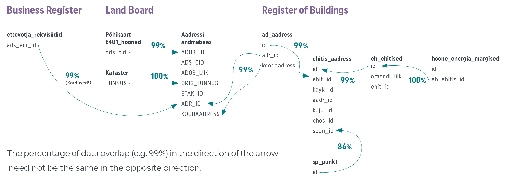
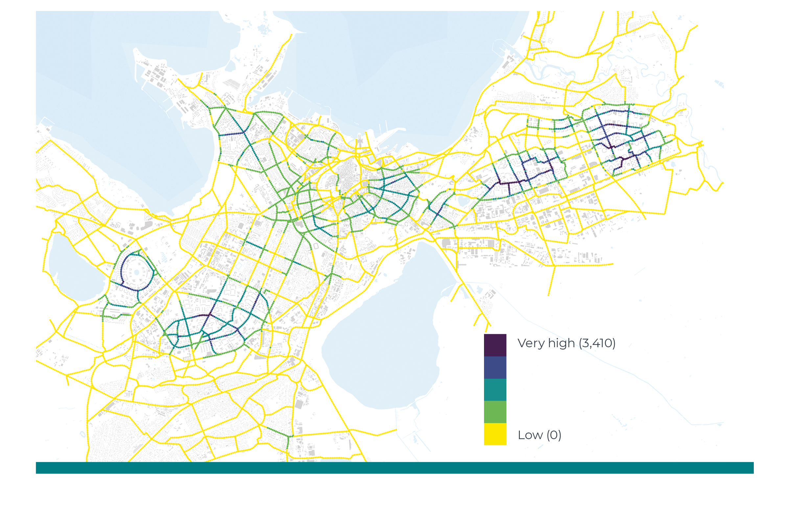

## Data-driven spatial planning {.chapter_section .chapter2_section}

```{block, type='authors authors_eng'}
<div class="author-links">**[Renee Puusepp](#renee-puusepp) ja [Raul Kalvo](#raul-kalvo)**</div>
<div><a class="print-btn" href="../andmepõhine-ruumiloome.html">EE</a></div>
```

```{block, type='points'}
* Good spatial planning decisions can only be made on the basis of accurate and up-to-date spatial data.
```

The right to participate in the creation of public space has been considered one of the most valuable human rights, one too often neglected ([Harvey 2008](#Harvey2008)). Any kind of spatial planning, especially if it involves public space, should be carried out according to democratic principles, being transparent and inclusive of all stakeholders. It helps to ensure transparency and include as wide a public as possible if the data used as the basis for spatial planning decisions are made public and links between the data and decisions clearly explained.

The Spatial Data Act (in force since 2011) defines spatial data as any data with a direct or indirect reference to a specific location or geographic area, including data that describes the location, characteristics and shape of spatial objects in geographic space. Data-driven spatial planning provides an opportunity to improve the rationale and transparency of decisions concerning the organisation of public space. The comparison of alternative spatial scenarios, consistent data collection and monitoring, as well as other data-driven spatial planning methods are natural tools for creating open and inclusive spaces.

```{block, type='blockquote-right'}
Data-driven spatial planning provides an opportunity to improve the rationale and transparency of decisions concerning the organisation of public space.
```
The aim of this article is to point out opportunities for data-driven planning and its importance in shaping high-density built-up areas and urban public space in Estonia. In what follows, we will give a short overview of the present state of data-driven planning and outline the main deficiencies in the Estonian planning system. We will also propose how data-driven methods could complement the current spatial planning processes. The article will treat the topic from the perspective of urban spatial planning and construction planning on the one hand, and at the level of comprehensive plans and lower-level municipal plans on the other.

### Open-access spatial data can only benefit society {-.chapter2_section}

Everybody has the right to participate in the creation of public space, and the public sector should ensure access to all spatial data in order to enable the execution of this right. Just as any other type of open data, open-access spatial data serves three main objectives: better understanding of spatial planning decisions, public involvement in the decision-making process, and establishing a wider platform and creating new knowledge through public dialogue ([Hansson and Ekenberg 2015](#Hansson2015)). Open data, including spatial data, should be open from both a technical and a legal perspective – this means being available for downloading, open for all uses and accompanied by a licence for use ([Kučera 2017](#Kučera2017)).

In Estonia, several public-sector documents provide a basis for data-driven spatial planning. The Ministry of Finance ‘Guidelines for the compilation of comprehensive plans’ (<a href="https://planeerimine.ee/static/sites/2/uldplaneeringu_juhis_final.pdf">2018</a>) emphasise that the living environment can be improved through involving the users of the space – residents/owners, businesses/developers and recreational users/visitors – in the planning process. The 2018 final report of the Spatial Design Expert Group under the aegis of the Government Office notes that the improvement of the living environment should be a deliberate knowledge-based effort. Knowledge generation and deliberate action in space can only be based on accurate and current data. The two documents dealing with the improvement of the living environment are complemented by the Green Paper on the Machine-Readable Publication of Public Information (2014), which stipulates that open data must be available to all without any limitation and in machine-readable format. Spatial data must be considered open data, unless it would endanger individual privacy or public security.

Alongside public databases like the National Register of Buildings and Land Cadastre, which hold official data, new spatial data is constantly being created. This takes place during the everyday activities of people, as they use location-based smart solutions, pay by bankcard, validate their transport cards on Tallinn’s public transport, conclude property transactions, apply for construction

The World Economic Forum report (2017, p. 6) classifies spatial data as follows based on collection method and objectives:

1)	‘opportunistic data’ collected for one purpose and then used for another (e.g. data collected by mobile phone companies on call locations that, in an aggregated format, can be used to analyse population mobility);
2)	‘purposely-sensed data’ (e.g. traffic counts used for spatial planning of new roads);
3)	‘user-generated data’ (e.g. location-tagged posts on social media).

Although the general trend in data capture is tending towards the easier option – collecting data opportunistically, without a specific purpose – the process should still be objective-focused. This is especially important in the case of large data volumes, as the processing, storage and management of unnecessary data may prove expensive. One of the side-effects of exponential technological growth is the emergence of big data. A large part of this data is directly or indirectly related to space. Such spatial data varies in terms of volume, quality, accessibility and temporal constraints. The main characteristic of big data is its temporality ([Batty 2016](#Batty2016)). This means that big data cannot be stored in its entirety and is therefore more complicated to use than purposely collected ordinary data. Essentially, big data does not fit in an Excel spreadsheet, and therefore it is not sensible to capture it without setting clear objectives.

```{block, type='blockquote-right'}
Big data cannot be stored in its entirety and is therefore more complicated to use than purposely collected ordinary data.
```
Big data related to space can be used, for example, to organise and monitor public transport and traffic, to contain fires and pandemics, or to organise waste collection, snow removal, road maintenance and other similar tasks. The link between such data-driven spatial planning and the actual creation of physical space is indirect. Using big data in construction planning is significantly more complicated, as the data needs to be processed in order to be useful in decision-making spatial design. Big data can, however, also be used to assess the outcome of spatial solutions by way of determining whether any changes in the data can be detected after the solutions are applied.

```{block, type='blockquote-left'}
Spatial data must be considered open data, unless it would endanger individual privacy or public security.
```
Current international practice includes real-time software applications for the management of cities, as well as other data use for supporting spatial planning decisions and managing cities. For example, the Australian city of Melbourne has made spatial data concerning land use and pedestrian mobility publicly available for both citizens and businesses ([World Economic Forum 2017](#World2017)). Similar opening-up of planning data in the United States has led to the creation of the Zonar application, which collects information concerning valid spatial plans, GIS data and property information, providing local authorities and property developers an opportunity to generate and analyse possible building volumes. Several examples of good practice can be found in relation to the better organisation of transport modes, mobility, and accessibility. The closest to Estonia is the interactive web-based solution Mapple in Helsinki, which helps property developers, planning officials, district governments and local businesses to make better decisions concerning accessibility. Copenhagen city government has, for years, counted cyclists and used this information to decide on building new bicycle paths ([Gehl Institute 2018](#Gehl2018)). In US cities, the StreetLight Data platform is used to capture and analyse data concerning pedestrians, cyclists and motor vehicles to resolve congestion and plan transport networks.

The biggest challenge related to data-driven spatial planning decisions is the interpretation of the data – decisions must not be made in a rush but based on comprehensive analysis. Therefore, it is not practicable to base complex and multifaceted decisions about the public space and urban planning solely on data but rather on a combined methodology. Historically, we can for example find a case where the placement of rescue commandos optimised by a computer simulation brought about an increase in the number of fatalities during fires ([Flood 2010](#Flood2010)).

### First steps in data-driven spatial planning in Estonia {-.chapter2_section}

According to a European Data Portal report ([Carrara et al. 2017](#Carrara2017)), Estonia belongs to the ‘Followers’ cluster in open data capture and use – we are among the last in the EU28. The reason for the relatively poor performance lies in the lack of common principles for harmonisation and cross-use of data in different portals. In this, we have to note that the report does not account for the X-Road data exchange layer, as technically the data involved is not open data. According to the report, Estonia’s main problems are a low level of political will, confusing legal framework, poor awareness of the use of open data, limited access to data, lack of standards and low data quality. According to the 2018 European Data Portal report ([Cecconi and Radu 2018](#Cecconi2018)), the low level of automation in open data capture, data that is insufficiently machine readable, and more generally, the lack of a long-term strategy are still problematic. Compared to the rest of Europe, the impact of open data in Estonia is very low, in other words, use of open data has practically no bearing on processes and decisions. The impact in question is estimated across five categories:

1)	strategic awareness that should guarantee the continued growth of open data usage,
2)	political impact (e.g. transparency of decision-making processes),
3)	social impact (e.g. inclusion of minorities in decision-making),
4)	environmental impact,
5)	economic impact.

Therefore, we may conclude based on the European Data Portal reports that open-data-driven spatial planning is practically non-existent in Estonia.

```{block, type='blockquote-right'}
Open-data-driven spatial planning is practically non-existent in Estonia.
```
The accessibility of spatial data in Estonia is uneven, data quality fluctuates and the logical basis of the different registers varies ([Figure 2.4.1](#figure241)). Although a few of the registers allow for machine-readable queries (automatically executable through a machine interface), the solutions tend to be outdated (e.g. the Register of Buildings) and lack user-friendly interfaces. It is sometimes practical to download the data, which, however, makes processing clumsy.

<p class="caption" id="figure241"><span class="figure-number">Figure 2.4.1.</span> Main spatial planning databases and the links between them</p>

```{r, figure241, out.width='100%', fig.align='center', echo=FALSE, message=FALSE, warning=FALSE}


```
```{block, type='imgsource'}
<span class="imgsource-source">Source:</span> Figure by the authors.
```

An address data system, or ADS, has been created under the administration of the Land Board for the cross-use of registers. However, the solution has its deficiencies. For example, if you tried to connect a company identified in the business register database to its correct geospatial location, the ADS might generate up to 100 matches. Or another example: if we want to extract the energy class of a building from the Register of Buildings and combine it with the data on the buildings layer of the main cadastral map of the Land Board, it will require three queries in the register and the use of two different datasets provided by the Land Board. At the same time, the buildings dataset in the Register of Buildings does include the field ‘Energy class’, which has been left empty in most cases. It is unclear why such data has been made available at all. The codes that should serve as unique building identifiers differ between datasets within the same register. Such abnormalities reduce trust in public registers. Land Board datasets are among the most user-friendly available, but unfortunately do not provide a lot of opportunities for machine-readable operations. Although many spatial decisions should be based on residents and their homes, the Population Register does not make spatial data available.

Due to the problems with the cross-use of datasets, comprehensive plans of cities and rural municipalities often do not take into account the real location of the homes and workplaces of the residents. If a company is registered with a letterbox address, it is of no use in workplace location analysis. A better understanding of the actual locations of residents can be gained through the use of registered residency data for individuals or the national census data. An even better picture could be compiled on the basis of mobile positioning, which has been used for the capture, mapping, analysis and visualisation of spatial data in Estonia for more than 15 years ([Ahas et al. 2004](#Ahas2004)).

### Clear connections between spatial analyses and subsequent decisions are rare {-.chapter2_section}

Estonia has a number of good examples of extensive spatial analyses conducted using various types of spatial data. An analysis with a direct spatial planning aspect was commissioned by the Ministry of the Interior from Statistics Estonia with the task of analysing commuting and determining the daily activity spaces within which people move ([Tõnurist et al. 2014](#Tõnuristjt2014)). A few scientific reports also exist; for example, the study conducted by the Institute of Ecology and Earth Sciences at the University of Tartu on the environmental load of residential locations ([Poom and Ahas 2016](#Poom2016)) and the survey of the Department of Geography at the University of Tartu on changing settlement patterns ([Reimets et al. 2013](#Reimets2013)).

Spatial data has been used in Estonia in the preparation of a number of programmes (movement programmes, river basin management plans, noise containment plans) and guidelines, as well as in environmental impact assessments. However, we have not been able to establish any direct links between spatial planning decisions on the one hand and the relevant source data, research or spatial data analysis on the other. Even key urban planning decisions with a significant impact on public space tend to be intuitive or relate to the underlying data in a way that is neither explicit nor explained. Data-driven spatial decisions are hardly ever referenced in the process of planning public space. For example, the Tallinn Old City Harbour masterplan ([Zaha Hadid Architects 2018](#Zaha2018)), commissioned by the Port of Tallinn, mentions world-class public space and proposes a specific spatial vision, but lacks almost any reference to the underlying data and does not draw a connection between the envisioned spatial objectives and data on the use of space. This approach is symptomatic of Estonian spatial planning culture in general.

The biggest problem is that spatial planning decisions lack transparency – decision-makers fail to show how the created space would help to fulfil quantitative objectives, which could be used to clearly describe the desired outcome and later unequivocally verify its achievement.

### High time to introduce data-driven spatial planning {-.chapter2_section}

In the coming years, Estonia will be undergoing an important change in the capture and verification of spatial data. So far, the national census has been one of the mechanisms for verifying the content of national registers. In 2021, Estonia will switch to register-based data collection, which will hugely increase the role of registers. The change will have two important aspects: first, the verification mechanism will disappear; second, the reliability of registers will increase hand in hand with the registrar’s responsibilities.

Nevertheless, a positive shift towards more data-driven management decisions is already visible in Estonia. A recent example is the cooperation agreement between the Ministry of Economic Affairs and Communications and Statistics Estonia on the adoption of data-driven decision-making mechanisms in the public sector ([Ministry of Economic Affairs and Communications 2018](#Economic2018)). It sets the ambitious target of introducing real-time management decisions. In addition, the ministry has appointed a chief data officer (CDO) with the task of establishing a uniform national data strategy. Change is also visible in the launch of the Tallinn public platform for gathering ideas (AvaLinn), created in the course of the Baltic Urban Lab project. The analysis of the existing public transport network in Tartu and the data-driven modelling of the new transport network (website of Tartu City 2018) is also a good example. The Road Administration has also taken data-driven decisions on changes to dangerous roads and junctions based of accident statistics and made plans to install noise barriers based on a computational noise map.

<p class="caption" id="figure242"><span class="figure-number">Figure 2.4.2.</span> The potential of the Tallinn bicycle path network based on residential locations.</p>
```{r, figure242, out.width='100%', fig.align='center', echo=FALSE, message=FALSE, warning=FALSE}



```
```{block, type='imgsource'}
<span class="imgsource-source">Source:</span> Tallinn Bicycle Strategy 2018–2027.
```

Tallinn Bicycle Strategy 2018–2027 (Jüssi et al. 2017) compared the potential locations for bicycle path. One of the methods used was the comparison of the calculated number of potential users within a 500-metre radius. The objective of the exercise was to determine a location for the core network, as close as possible to the largest number of residents. [Figure 2.4.2](#figure242) is a data-based visualisation of one of the scenarios with the colour of the tracks indicating the proximity to potential users.

### From follower to leader {-.chapter2_section}

To foster data-driven spatial planning until it becomes common practice, we need to make all the relevant data public, including spatial data, and bring it together in a single location for the convenience of the user. Currently, ministries and other state authorities maintain their own databases in a largely uncoordinated manner. When collecting and managing data, we should strive towards a situation with a single national institution mediating all open data.

Data synchronisation requires technical steps. For example, the metadata (describing the existing data) in all the registers containing spatial data should be critically reviewed, adding quality or reliability parameters if possible. Columns with no data content should be deleted and machine-readability ensured.

However, the most important task is achieving clarity about data accuracy. For example, if the location of an organisation is not available at building level, the city where it is located might still be available. When looking at the Register of Buildings dataset concerning the year of construction, the distribution of results is suspiciously regular. If the exact construction year is not known, it would be useful to see a reference to the accuracy of the data. This kind of control parameter would enhance the reliability of datasets. They could be taken into account when using the data.

Spatial data can be used to create computational models for evaluating the planned outcome of spatial changes. Such models make it possible to compare different spatial visions; in other words, comparative planning. Constant monitoring of spatial usage and systemic capture and analysis of spatial data make it possible to strive towards achieving quantitative objectives set for public space and realistically achieve them. For example, Copenhagen has used continuous monitoring to achieve a 20% increase in the use of public spaces ([Gehl Institute 2018](#Gehl2018)) – an approach that may be considered best practice in the field on monitoring-based planning. As in Copenhagen, the use of public space could also be analysed in Estonia.

Even the simple visualisation of spatial data would help authorised persons and organisations to make spatial planning decisions in a much more informed and transparent fashion. During the compilation of this report, a spatial data visualisation project commissioned by the Tallinn Urban Planning Department is ongoing; however, so far, comprehensive plans of Estonian cities and rural municipalities fall short of even the most elementary standards of data visualisation. Even when data is used in planning decisions, it is, as a rule, presented as maps or annexes separately from the decisions themselves. The logical connections between planning decisions and the underlying data remain obscure. Currently, the comparison of different versions of plans or long-term strategic monitoring of the use of space is not general practice.

```{block, type='blockquote-right'}
Better progress towards the wider use of open data, transparent spatial design and democratic planning processes requires a unified strategy for sharing spatial data.
```
It should be the task of the state and local authorities to create opportunities and frameworks for the use of open data, rather than building another intermediary layer, hindering the free use of data. By choosing to develop and create software applications, state authorities are taking on tasks that could easily be fulfilled by the private sector, active citizens or research and development institutions. If as much up-to-date, accurate spatial data as possible were made openly available, we could also witness an increase in the efficiency of governance and decision-making in general.

Better progress towards the wider use of open data, transparent spatial design and democratic planning processes requires a unified strategy for sharing spatial data. Currently, no guidelines have been adopted on the collection, storage and reproduction of data; authorities use different methods to share their data and it is difficult to combine data from different sources.

<div class="casebox">

### Simulating pedestrian flows

A recent study of pedestrian mobility in central Tallinn ([Puusepp et al. 2017](#Puusepp2017)) is an example of comparative data-driven planning. The study compared the existing situation (left) with new versions of the main street of Tallinn (right). The comparison was based on a computer simulation created using the data-driven pedestrian mobility study of the area. The image is a visualisation of simulated pedestrian flows for two different spatial scenarios.

<p class="caption" id="figure243"><span class="figure-number">Figure 2.4.3.</span> Computer-simulated pedestrian routes in central Tallinn.</p>
```{r, figure243, out.width='100%', fig.align='center', echo=FALSE, message=FALSE, warning=FALSE}
knitr::include_graphics("../figures/2-chapter/fig243.png")
```
</div>
```{block, type='imgsource'}
<span class="imgsource-source">Source:</span> Puusepp et al. 2017.
```

### Summary  {-.chapter2_section #summary-24}

Participation in the planning of public space is a fundamental right of every citizen and user of the space. Just as we can choose the decoration of our own home, we should also have a say in the decisions concerning the organisation of public space. To improve public participation, weigh spatial design solutions and explain decisions, the source data must be easily accessible. Spatial data with no direct bearing on privacy or national security should be open data – freely accessible and machine-readable. One option would be to create a centralised open-data environment administered by Statistics Estonia, mediating access to the registers of different institutions.

As public space concerns so many stakeholders, it would be appropriate to agree on general national or regional principles, as well as values and objectives for spatial planning. The objectives should at least be partly quantifiable, so as to gain the opportunity to objectively assess the impact of the proposed solutions. The impact of spatial solutions can be assessed by either forecasting or monitoring. In the case of forecasting, computational models can be used to assess a number of potential spatial solutions in parallel, so as to select the appropriate one. The models should also be openly accessible to ensure transferability, reproducibility and, through this, also transparency and objectivity.

```{block, type='blockquote-right'}
The public sector’s main tasks in the use of open-access spatial data include collecting, organising and ensuring the integrity of the data. It is important to enable the cross-use of different databases.
```

The public sector’s main tasks in the use of open-access spatial data include collecting, organising and ensuring the integrity of the data. It is important to enable the cross-use of different databases. If sufficient need arises, the private and third sector will create the software that makes use of the data. Data and technology do not create or solve problems but give individuals and organisations an opportunity to resolve them more successfully ([Bettencourt 2014](#Bettencourt2014)). The state and local governments should always require that the source data used be referenced in public discussions, survey reports and, most importantly, spatial decision-making. Data never carries absolute truth and neither does it propose spatial solutions; however, it does serve as a good foundation for democratic and transparent spatial planning.

### References {-.subreferences #references-24}

<p id="Ahas2004">Ahas, R., Aunap, R., Aasa, A. 2004. Sotsiaalse positsioneerimise meetod inimeste tegevusruumide uurimisel – Mander, Ü., Kurs, O. (eds.). Geograafilisi uurimusi aastatuhande vahetusel. Üllitatud Tartu Ülikooli Geograafia Instituudi 85. aastapäevaks. Publicationes Instituti Geographici Universitatis Tartuensis, 89. Tartu: Tartu Ülikooli Kirjastus, 63–73.</p>
<p id="Batty2016">Batty, M. 2016. Big data and the city. – Built Environment, 42 (3), 321–337.</p>
<p id="Bettencourt2014">Bettencourt, L. M. A. 2014. The Uses of Big Data in Cities. – Big Data, 2 (1), 12–22.</p>
<p id="Carrara2017">Carrara, W., Radu, C., Vollers, H. 2017. Open Data Maturity in Europe 2017: Open Data for a European Data economy. European Data Portal. European Commission Directorate General for Communications Networks, Content and Technology.</p>
<p id="Cecconi2018">Cecconi, G., Radu, C. 2018. Open Data Maturity in Europe. Report 2018. European Data Portal. European Commission: Directorate General for Communications Networks, Content and Technology.</p>
<p id="Flood2010">Flood, J. 2010. The Fires: How a Computer Formula, Big Ideas, and the Best of Intentions Burned Down New York City – and Determined the Future of Cities. New York: Riverhead Books.</p>
<p id="Gehl2018">Gehl Institute 2018. Copenhagen Counts Everything. https://gehlinstitute.org/story/copenhagen-counts-everything.</p>
<p id="Hansson2015">Hansson, K., Ekenberg, L. 2015. Open government and democracy: a research review. – Social Science Computer Review, 33 (5), 540–555.</p>
<p id="Harvey2008">Harvey, D. 2008. The Right to the City. – New Left Review, 53, 1–16.</p>
<p id="Jüssi2018">Jüssi, M., Kalvo, R., Rannala, M., Savi, T. 2017. Tallinna Rattastrateegia 2018–2027. Tallinn: Tallinna Kommunaalamet.</p>
<p id="Kučera2017">Kučera, J. 2017. Analysis of barriers to publishing and re-use of open government data. – P. Doucek, G. Chroust, V. Oškrdal (eds.). IDIMT 2017: Digitalization in Management, Society and Economy – 25th Interdisciplinary Information Management Talks, 305–314.</p>
<p id="Economic2018">Ministry of Economic Affairs and Communications 2018. Tammist: lähme riigis üle andmepõhistele juhtimisotsustele.</p>
<p id="Poom2016">Poom, A., Ahas, R. 2016. How does the environmental load of household consumption depend on residential location? – Sustainability, 8 (9), 799.</p>
<p id="Puusepp2017">Puusepp, R., Lõoke, T., Cerrone, D., Männigo, K. 2017. Simulating pedestrian movement. – De Rycke, K., Gengnagel, C., Baverel, O., Burry, J., Mueller, C., Nguyen, M. M., Rahm, P., Thomsen, M. R. (eds.). Humanizing Digital Reality. Versailles: Springer, 547–557.</p>
<p id="Reimets2013">Reimets, R., Uuemaa, E., Oja, T., Sisas, E., Mander, Ü. 2013. Urbanisation-related landscape change in space and time along spatial gradients near roads: a case study from Estonia. – Landscape Research, 40 (2), 192–2017.</p>
<p id="Tõnuristjt2014">Tõnurist, A., Servinski, M., Valgma, Ü. 2014. Toimepiirkondade määramine. Tallinn: Statistikaamet/Siseministeerium.</p>
<p id="World2017">World Economic Forum. 2017. Data Driven Cities: 20 Stories of Innovation. Global Agenda. Prepared by the Global Future Council on Cities and Urbanization.</p>
<p id="Zaha2018">Zaha Hadid Architects 2018. Vanasadama arendusplaan 2030.</p>
