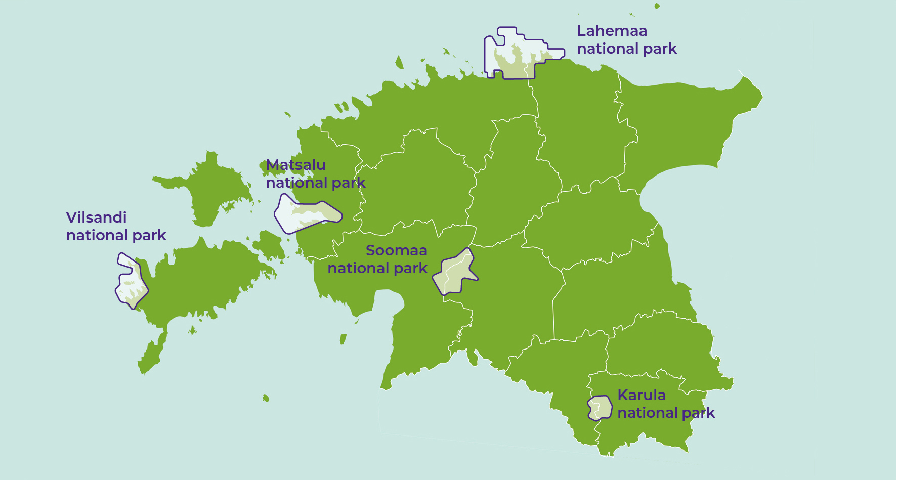

## How do people use the natural environment in Estonia? {.chapter_section .chapter3_section}

```{block, type='authors authors_eng'}
<div class="author-links">**[Kalev Sepp](#kalev-sepp) and [Asko Lõhmus](#asko-lõhmus)**</div>
<div><a class="print-btn" href="../kuidas-inimesed-eesti-looduskeskkonda-kasutavad.html">EE</a></div>
```

```{block, type='points'}
* The natural environment in Estonia is visited by locals and foreign tourists alike, who actively take advantage of everyman’s right in a variety of ways. However, opportunities for young people to spend time in nature need to be improved, and comprehensive tourism clusters established and marketed.
```

Most people nowadays work in an artificial environment, so that instead of spending time in nature for occupational reasons, more and more do it specifically for recreation, in an increasing variety of ways. The way people spend time in nature depends on many factors, such as age and health, amount of time off work to spend with their children, changes in the landscape and access to natural areas. These factors must be taken into account in the planning of natural sites and associated businesses.

Already in the 1960s, Estonian adults spent an average of eight days in nature each year ([Margus 1974](#Margus1974)). Nearly half of these were spent foraging: mostly mushroom and berry picking (30%), less often fishing or hunting (10%). About 45% of the trips were made to recreation areas, 25% of these for the purpose of bathing and sunbathing, 15% as part of company outings and community festivals and 10% as nature trips. Half a century later, in 2008, 54% of Estonian adults said they visited forests regularly, at least seasonally, and only one fifth did not do so at all; the most popular activities were still foraging and walking, as well as dog walking ([Kaldaru 2008](#2Kaldaru2008)). As expected, forest owners and people vocationally tied to the forest spent more time there. In 2018, only 15% of adults (8% in 2016) had not spent time in nature during the past 12 months; most had done so repeatedly ([Turu-uuringute AS 2018](#2Turu-uuringute2018)). The figures above are not directly comparable due to differences in the survey methodologies, but it is evident that the practice and need for frequent nature visits persists in Estonia. Compared to Northern and Western European countries ([Bell et al. 2007](#Bell2007); [cf. Kaldaru 2008](#2Kaldaru2008)) outings in nature in Estonia seem to be less to do with specific applied activities (sports, off-roading, studying nature).

In this article, we look at the ways in which the Estonian natural environment has been used in recent decades, perceived changes in natural areas, and expectations and future perspectives for engaging with nature.

### The public use of the Estonian natural environment is based on everyman’s right {-.chapter3_section}

Everyman’s right, or the freedom to roam, allows the general public to access natural and cultural landscapes, regardless of who owns the land. The custom originated in the Nordic countries and was initially in place to support people who had no land of their own. They were allowed to move between places and forage for food, as long as they did so without disturbing or harming the locals. Although everyman’s right has been recognised in the Nordic countries since the Middle Ages, the term was only introduced in the 20th century in the context of tourism management. Everyman’s right probably has less of a tradition in Estonia, as the population was mostly stationary and tied to farmsteads. Yet the recommendations and norms of everyman’s right bear similarities with the archaic ethical beliefs of Estonians. Following the example of Finland, such norms were first established in the 1970s under the initiative of Veljo Rannik from the Ministry of the Environment. In 1996, the ministry published a brochure entitled ‘Everyman’s right’ (‘Igaüheõigus’) to prevent misunderstandings between new landowners and people moving in natural areas. The guide introduced the rights and obligations of those moving in the wild, freely interpreting the patchwork of existing legal arrangements. It was published in the hope of establishing a custom: if people are aware of the recommendations for long enough, these will become common law. This is indeed the case two decades later, while the General Part of the Environmental Code Act now contains the main provisions on being on private land.

```{block, type='blockquote-left'}
The practice and need for frequent nature visits persists in Estonia.
```
Therefore, only a part of the public use of natural areas in Estonia occurs in green areas that qualify as public space in the ordinary sense. Although parks are the most accessible natural areas for people living in cities, forest parks and peri-urban forests can offer additional opportunities for activities. In Estonia, these natural areas are those that have for the longest time been shaped as recreational environments.

The local use of natural areas is complemented by nature tourism. At its core are opportunities offering the chance to experience nature while meeting local and sustainable development standards ([Fredman et al. 2012](#Fredman2012)). Experiencing nature can mean visiting prepared sites or exploring a place independently, engaging in activities that range from hiking for pleasure to conservation work, as well as outdoor sports, participation in field trips and adventure camps. Around 200 companies offer nature tourism services in Estonia ([Consumetric 2008](#Consumetric2008)). Nature tourism is closely related to rural tourism and ecotourism.

<div class="casebox">
<h3>Vilsandi – a pioneer in linking nature tourism with conservation</h3>

Vaika Bird Sanctuary was established in 1910 on the initiative of Vilsandi lighthouse keeper Artur Toom and became a celebrated tourist destination in the 1920s. It was, after all, the westernmost island in the young Republic of Estonia. In July 1921, State Elder Konstantin Päts and politician Julius Seljamaa decided to spend their holiday in Saaremaa. In the words of Artur Toom: ‘This visit by State Elder Päts in 1921 was a blessing to the Vilsandi bird home. After that, things started to progress faster and the number of visitors increased.’ ([Toom 1937](#Toom1937), p. 66])

A museum was opened on the island in 1927. Ten years later, tourist accommodation with 24 beds, a kitchen and other ancillary rooms was completed near the lighthouse. Just before World War II, the number of Estonian and foreign tourists visiting Vilsandi reached 3,000–5,000 per year.

The joint advancement of nature conservation and tourism was facilitated by the Institute for Nature and Tourism established under the Ministry of Social Affairs in 1938. The institute was assigned the tasks of organising nature conservation, supervising public parks, managing state parks, supporting the development of summer resorts and directing domestic and foreign tourism.

<p class="caption" id="figure311"><span class="figure-number">Figure 3.1.1.</span> Vilsandi has always attracted many tourists. In 1939, Artur Toom, the leader of the conservation area, steered a boat carrying them</p>

```{r, figure311, fig.align='center', out.width='100%', echo=FALSE, message=FALSE, warning=FALSE}

knitr::include_graphics("../figures/3-chapter/fig311.png")

```

</div>
```{block, type='imgsource'}
<span class="imgsource-source">Source:</span> Saaremaa Museum.
```

### Estonian educational and hiking trails offer good recreational opportunities {-.chapter3_section}

The purpose of educational and hiking trails is to provide opportunities to rest and explore natural areas prepared for this purpose. The management of conservation areas also includes the regulation of the burden of visitation (disturbance, trampling, littering). Well-chosen and regularly maintained trails, overnight camping and campfire sites, and garbage bins allow for nature visits even in fragile areas, and for children, the elderly and people with disabilities. Establishing a primary infrastructure creates revenue opportunities for local communities that provide accommodation, food and other services for visitors, which, according to research done elsewhere in the world, will in the long run exceed the investment at least ten-fold.

The idea of planning educational trails in Estonia first emerged in the 1930s, but it was not until the founding of the Tartu Students Nature Conservation Circle by Jaan Eilart that action was finally taken. Kai Kaare, a geography graduate of the University of Tartu, designed an educational trail at Tilleoru (1962) and Jaan Eilart planned one at Neeruti (1964). The first hiking trail meeting international requirements was opened at Keila-Joa in 1996.

Currently, the State Forest Management Centre (RMK) manages and monitors the use of educational and hiking trails on state-owned land. As things stood in 2017, the visitor infrastructure included 309 covered campfire sites, 223 nature trails (2,562 km in total), 214 hiking trails, 59 camping sites (425 sites in total where camping is possible), 27 free-of-charge forest huts, 20 rental huts and three off-road areas. In 2017, RMK spent a total of 5.3 million euros on activities related to tourism management (of which 0.7 million was revenue from recreational services and grants from the European Union). RMK’s website provides different filters for displaying destinations, including a separate display of sites accessible to people with reduced mobility. This includes more than 20 educational trails and hiking trails, as well as campfire and camping sites. Nevertheless, it has been found that nature tourism in Estonia is restricted by the dilapidation of specific infrastructure (e.g. more than half of the birdwatching towers; [Jõks 2017](#Jõks2017)) and the insufficient linking of natural sites to tourism clusters in information materials.

```{block, type='blockquote-left'}
Educational and hiking trails had the highest satisfaction rating in Estonian environmental matters in 2018.
```
According to a 2018 survey, 55% of the Estonian adult population had visited educational or hiking trails within the previous 12 months, while 31% of them had done so more than once ([Turu-uuringute AS 2018](#2Turu-uuringute2018)). Compared to 2014, the number of visitors had grown by 9% and that of recurrent visitors by 8%. Educational and hiking trails also had the highest satisfaction rating in matters regarding the environment (86% of respondents considered the situation to be good). Yet the number of people visiting natural areas repeatedly was higher still – 73% of respondents, while the amount of those who had visited a natural area at least once was 83%, according to the same survey. For most people in Estonia, therefore, following prepared trails is still only one of the options for spending time in nature.

### The number of visitors to conservation areas is increasing and the visitor profiles are diversifying {-.chapter3_section}

Using on-site calibrated counters, visitor numbers are monitored in all RMK-managed recreational and conservation areas and national parks with visitor infrastructure. In addition, RMK conducts visitor profile surveys once every five years. The counters show that the number of visits has increased over the ten years of observation, reaching 2.4 million visits in 2017 ([RMK 2018](#RMK2018)). This exceeds the goal set for 2020 by the current Nature Conservation Development Plan and is also high in international comparisons ([Bell et al. 2007](#Bell2007)). The Surroundings of Tallinn Recreation Area, Nõva Recreation Area and Lahemaa National Park are the most visited areas. While in earlier years, visits were mostly to camping sites and campfire sites, in recent years the popularity of educational and hiking trails as destinations has increased significantly. Accordingly, the number of visits to most national parks is also increasing ([Figure 3.1.2](#figure312)).

Recent visitor surveys by RMK indicate that, in 2010 and 2015, most people visited natural areas with family or friends and that observing nature was the most common activity. According to both surveys, the largest number of visitors came from Tallinn, Tartu and Pärnu, but the share of foreigners – most often from Germany, Finland and Latvia – has doubled (6% in 2010 and 13% in 2015). Young people and early-middle-aged adults dominate in the age distribution of visitors, while people of retirement age are least represented. The number of teenagers is also small, having decreased even further by 2015 ([Figure 3.1.3](#figure313)). In 2015, 85% of respondents felt that spending time in nature increased their social, mental and physical well-being, with the highest increase being that of mental well-being ([RMK 2018](#RMK2018)). Health and other well-being benefits need to be measured even more specifically in the future in order to improve the visitor friendliness of natural areas in a knowledge-based way ([ten Brink et al. 2016](#2ten2016)).

### Towns and cities have many green spaces, but their quality requires attention {-.chapter3_section}

According to a 2017 analysis, 790,900 people, or approximately 90% of people living in densely populated areas in Estonia, had ‘very good access’ (up to 200 m from the place of residence) to a public green space, which is comparable to the corresponding figure of 92% in Sweden ([Sustainable Development Indicators 2018](#2indicators2018)). The quality of green spaces was briefly addressed in the 2009 Estonian Human Development Report, which used population satisfaction as an indicator and highlighted the problem of the fragmentation of green areas in larger cities and the destruction of peri-urban green areas as a result of urban sprawl ([Peterson 2010](#Peterson2010)). A comparison of 2009 data with the satisfaction survey commissioned by Tallinn City Government in 2017 shows that residents are satisfied (about 80%) with the amount and condition of parks and green spaces in Tallinn. The overall assessment was similar in Tartu, and even an increase in satisfaction was established between 2006 and 2016. However, a more detailed analysis of the Tartu data revealed that 7% of urban residents considered the amount and condition of parks and green spaces around their place of residence to be highly problematic and another 30% (mainly residents of Annelinn; most commonly ethnic Estonians and women) considered it to be problematic. Perception of this problem on a local level had not decreased in 10 years. There is regional dissatisfaction with the nearby green spaces in Tallinn as well; for example, in the city centre, Kristiine and Lasnamäe ([Tuhkanen et al. 2018](#Tuhkanen2018)). This shows that satisfaction with the city or town as a whole is not a sufficient indicator for assessing green spaces in Estonia.

<p class="caption" id="figure312"><span class="figure-number">Figure 3.1.2.</span> Total number of visits to natural sites managed by the State Forest Management Centre and number of visits to national parks, according to monitoring data from counters, 2010–2017</p>

<div class="desktop-plot">
```{r, figure312, out.width='80%', fig.align='center', echo=FALSE, message=FALSE}

library("tidyverse")
library("reshape")
library("plotly")

fig312_data1 <- read.csv ("../data/31_fig2_data1.csv", header=TRUE, fileEncoding="utf-8", check.names=FALSE)
fig312_data2 <- read.csv ("../data/31_fig2_data2.csv", header=TRUE, fileEncoding="utf-8", check.names=FALSE, sep=";")

fig312_data2 <- melt (fig312_data2, id=c("park"))
names(fig312_data2) <- c("park","year","visitors")

fig312_data2$park_eng[grepl("Vilsandi rahvuspark", fig312_data2$park)]<-"Vilsandi National Park"
fig312_data2$park_eng[grepl("Matsalu rahvuspark", fig312_data2$park)]<-"Matsalu National Park"
fig312_data2$park_eng[grepl("Soomaa rahvuspark", fig312_data2$park)]<-"Soomaa National Park"
fig312_data2$park_eng[grepl("Lahemaa rahvuspark", fig312_data2$park)]<-"Lahemaa National Park"
fig312_data2$park_eng[grepl("Karula rahvuspark", fig312_data2$park)]<-"Karula National Park"

fig312_data2$park_eng <- factor(fig312_data2$park_eng, levels = c("Lahemaa National Park","Soomaa National Park","Matsalu National Park","Karula National Park","Vilsandi National Park"))

fig312_data2$year <- factor(fig312_data2$year, levels = c("2010","2011","2012","2013","2014","2015","2016","2017"))

fig312_plot2_labels <- c("Lahemaa\nNational Park","Soomaa\nNational Park", "Matsalu\nNational Park", "Karula\nNational Park","Vilsandi\nNational Park")

fig312_plot_palette <- c("#b8ddea","#44a1b1","#388085","#8d76ad","#79AC2C","#5B8121","#482683","#2E4111")

  fig312_plot1 <- ggplot(data = fig312_data1) +
    geom_bar(mapping = aes(x=year, y=visitors, text = paste("", year,
                         "<br>", visitors)), fill=fig312_plot_palette, width=0.7, stat="identity", position="dodge") +
    scale_x_continuous(breaks=c(2010,2011,2012,2013,2014,2015,2016,2017))+
    labs(y="Number of visits (million)", x="")

  fig312_plot2 <- ggplot(data = fig312_data2) +
    geom_bar(mapping = aes(x=park_eng, y=visitors, fill=year, text = paste("", park_eng,
                         "<br>", year,
                         "<br>", scales::comma(visitors))), width=0.7, stat="identity", position="dodge") +
    scale_fill_manual(values=fig312_plot_palette) +
    labs(y="Number of visits", x="") +
    scale_x_discrete(labels=fig312_plot2_labels) +
    scale_y_continuous(labels=comma) 

  fig312_theme <- theme(
      text = element_text(color = "#292b2c", family="Montserrat"),
      panel.grid.major.x = element_blank() ,
      panel.grid.minor.x = element_blank(),
                 )



ggplotly(fig312_plot2 + fig_theme_general + fig312_theme, tooltip = "text" ) %>%
config(displayModeBar = F, collaborate = F)   %>%
layout(legend = list(orientation = "h",y = 1.15)) %>%
layout(xaxis = list(fixedrange = TRUE)) %>%
layout(yaxis = list(fixedrange = TRUE))

ggplotly(fig312_plot1 + fig_theme_general + fig312_theme, tooltip = "text" ) %>%
config(displayModeBar = F, collaborate = F)   %>%
layout(legend = list(orientation = "h",y = 1.15)) %>%
layout(xaxis = list(fixedrange = TRUE)) %>%
layout(yaxis = list(fixedrange = TRUE))

#ggsave(path="exported_figures/PDF/chapter3",filename="fig312a.pdf",fig312_plot1 + fig_theme_general + fig312_theme, height=120, width=200, units="mm")

#ggsave(path="exported_figures/PDF/chapter3",filename="fig312b.pdf",fig312_plot2 + fig_theme_general + fig312_theme, height=120, width=200, units="mm")
```

</div>

<div class="mobile-plot">
```{r, out.width='100%', fig.asp=.75, fig.align='center', echo=FALSE, message=FALSE, warnings=FALSE}


print(fig312_plot2 + fig_theme_general + fig312_theme)
print(fig312_plot1 + fig_theme_general + fig312_theme)

```
</div>

``` {block, type='figure-comment'}
<span class="figure-comment-start">Note:</span> The number of visits includes the number of visitors to both natural sites and visitor centres (excluding programme participants) in recreational and conservation areas, as well as visits to Elistvere Animal Park. The number of visits does not accurately indicate the number of visitors, as one visitor may visit an area more than once.
```

``` {block, type='imgsource'}
<div><span class="imgsource-source">Source:</span> State Forest Management Centre 2018.</div>
<div><a class="data-btn" href="../data/31_fig2_data.zip"><i class="fa fa-download" aria-hidden="true"></i>Download data</a></div>
```

```{block, type='blockquote-left'}
For adolescents and the elderly, urban green spaces are the most common place they come into contact with nature.
```
The use of urban green spaces is seasonal in Estonia – more frequent in summer than in winter. For some population groups, such as adolescents and the elderly, urban green spaces are generally the most common place they come into contact with nature ([Figure 3.1.3](#figure313)). According to an online survey ([Tuhkanen et al. 2018](#Tuhkanen2018)), the residents of Tallinn most value the recreational value, life preserving value, therapeutic and aesthetic value of green spaces. The main motives for using nearby green spaces were spending time with other people or pets and improving physical fitness, which corresponded to the types of green space the respondents wanted to have near their place of residence ([Figure 3.1.4](#figure314)). The chance to breathe fresh air (94%), enjoy peace and quiet (91%) and walk in nature (90%) were regarded as the most valuable aspects of ecosystem services in green spaces. The fact that the generally appreciated aspects of visiting nature (foraging, fishing) are not considered important in the city indicates that people today combine different types of natural areas to create a holistic living environment.

<p class="caption" id="figure313"><span class="figure-number">Figure 3.1.3.</span> Age distribution of different types of nature visitors in Estonia</p>

<div class=desktop-plot>
```{r, figure313, out.width='80%',fig.asp=1.25, fig.align='center', echo=FALSE, message=FALSE}

library("tidyverse")
library("reshape")

 fig313_data <- read.csv ("../data/31_fig3_data.csv", header=TRUE, fileEncoding="utf-8", check.names=FALSE)

 fig313_data_melt <- melt (fig313_data, id=c("vanus"))

fig313_data_melt$vanus <- factor(fig313_data_melt$vanus, levels = c("75+","60–74","50–59","40–49","30–39","20–29","15–19"))

fig313_data_melt$variable_eng[grepl("Looduspuhkus 2010", fig313_data_melt$variable)]<-"Nature visits 2010"
fig313_data_melt$variable_eng[grepl("Looduspuhkus 2015", fig313_data_melt$variable)]<-"Nature visits 2015"
fig313_data_melt$variable_eng[grepl("Välisturistid 2015", fig313_data_melt$variable)]<-"Foreign tourists 2015"
fig313_data_melt$variable_eng[grepl("Marjulised-seenelised", fig313_data_melt$variable)]<-"Berry and mushroom pickers"
fig313_data_melt$variable_eng[grepl("Jahimehed", fig313_data_melt$variable)]<-"Hunters"
fig313_data_melt$variable_eng[grepl("Tallinna pargikülastajad", fig313_data_melt$variable)]<-"Visitors to Tallinn green areas"


fig313_data_melt$variable_eng <- factor(fig313_data_melt$variable_eng, levels = c("Visitors to Tallinn green areas","Hunters","Berry and mushroom pickers","Foreign tourists 2015","Nature visits 2015","Nature visits 2010"))

  fig313_plot <- ggplot(data = fig313_data_melt) +
    geom_bar(mapping = aes(x=vanus, y=value, fill=variable_eng, text = paste("", vanus,
                         "<br>", variable_eng,
                         "<br>", value, "%")), width=0.7, stat="identity", position="dodge") +
    labs(y="%", x="Age group") +
    coord_flip()  +
    scale_fill_manual(values=c("#b8ddea","#44a1b1","#79AC2C","#5B8121","#8d76ad","#482683")) +
      guides(fill = guide_legend(reverse = TRUE))

  fig313_theme <- theme(
      text = element_text(color = "#292b2c", family="Montserrat"),
      panel.grid.major.y = element_blank() ,
      panel.grid.minor.y = element_blank(),
                 )

ggplotly(fig313_plot + fig_theme_general + fig313_theme, tooltip = "text" ) %>%
config(displayModeBar = F, collaborate = F)   %>%
layout(legend = list(orientation = "h",y = 1.15)) %>%
layout(xaxis = list(fixedrange = TRUE)) %>%
layout(yaxis = list(fixedrange = TRUE))

#ggsave(path="exported_figures/PDF/chapter3",filename="fig313.pdf",fig313_plot + fig_theme_general + fig313_theme, height=200, width=200, units="mm")
```

</div>

<div class="mobile-plot">
```{r, out.width='100%', fig.asp=.75, fig.align='center', echo=FALSE, message=FALSE, warnings=FALSE}

print(fig313_plot + fig_theme_general + fig313_theme)

```
</div>

``` {block, type='figure-comment'}
<span class="figure-comment-start">Note:</span> ‘Nature visits 2010’ (N=6,231) and ‘Nature visits 2015’ (N=5,489) represent domestic nature visitors in the 2010 and 2015 visitor surveys conducted by RMK; ‘Foreign tourists 2015’ (N=764) represents foreign respondents to the survey ([RMK 2018](#RMK2018)). The berry and mushroom picker data (N=518) is derived from a sample of those having gone foraging for wild berries and mushrooms at least once during the summer and autumn of 2011 ([Kaldaru 2011](#Kaldaru2011)). The data on hunters covers all Estonian hunters (N=15,499, including 381 women; Estonian Hunters Society) in November 2018. The age profile of visitors to Tallinn green spaces was drawn up in August 2006 for 25 key green spaces characteristic to Tallinn (N=542; the graph excludes children – 4% of the general sample; [Järv et al. 2006](#Järv2006)).
```

``` {block, type='imgsource'}
<div><span class="imgsource-source">Source:</span> Figure by the authors.</div>
<div><a class="data-btn" href="../data/31_fig3_data.csv"><i class="fa fa-download" aria-hidden="true"></i>Download data</a></div>

```

<p class="caption" id="figure314"><span class="figure-number">Figure 3.1.4.</span> Evaluation by Tallinn residents of the importance of different types of green space in their area</p>

```{r, figure314, fig.asp=.75, fig.align='center', echo=FALSE, message=FALSE, warning=FALSE}

library("tidyverse")
library("scales")


 fig314_data <- read.csv ("../data/31_fig4_data.csv", header=TRUE, fileEncoding="utf-8", sep=";",check.names=FALSE)

fig314_data <- melt (fig314_data, id=c("Space"))

fig314_data$Space_eng[grepl("Park", fig314_data$Space)]<-"Park"
fig314_data$Space_eng[grepl("Mänguväljak", fig314_data$Space)]<-"Playground / fitness area"
fig314_data$Space_eng[grepl("Veekoguäärne roheala", fig314_data$Space)]<-"Waterfront green space"
fig314_data$Space_eng[grepl("Mets", fig314_data$Space)]<-"Forest"
fig314_data$Space_eng[grepl("Ala väheste puude/põõsastega", fig314_data$Space)]<-"Area with a few trees/bushes"
fig314_data$Space_eng[grepl("Ala, kus ma saan aiatööd teha", fig314_data$Space)]<-"Area where I can do gardening"


fig314_data$Space_eng <- factor( fig314_data$Space_eng, levels = c("Area where I can do gardening","Area with a few trees/bushes","Forest","Waterfront green space","Playground / fitness area","Park"))

fig314_data$variable <- factor(fig314_data$variable, levels = c("Ei ole üldse tähtis","Mitte eriti tähtis","Keskmiselt tähtis","Tähtis","Väga tähtis"))

fig314_data$text_position <- fig314_data$value

fig314_data$text_position[which(fig314_data$text_position == 0)] <- NA

fig314_plot <- ggplot(data = fig314_data) +
    geom_bar(mapping = aes(x=Space_eng, y=value, fill=variable), width=0.6, stat="identity") +
    geom_text(mapping = aes(x=Space_eng, y=text_position, label=round(text_position, digits=0)), stat="identity", color="white", position = position_stack(vjust = .5)) +
    coord_flip() +
    scale_fill_manual(values=c("#2b164e","#a28cbc","#5B8121","#79AC2C","#482683"), labels=c("Not at all important","Not particularly important","Moderately important","Important","Extremely important")) +
    labs(y="%", x="") +
    scale_x_discrete(labels = wrap_format(20)) +
    guides(fill = guide_legend(reverse = TRUE,nrow=2,byrow=TRUE))

  fig314_theme <- theme(
                    panel.grid.major.y = element_blank() ,
                     panel.grid.minor.y = element_blank(),
                    text = element_text(family="Montserrat"),
                 )

print(fig314_plot + fig_theme_general+ fig314_theme)

#ggsave(path="exported_figures/PDF/chapter3",filename="fig314.pdf", height=120, width=200, units="mm")

```

``` {block, type='imgsource'}
<div><span class="imgsource-source">Source:</span> Tuhkanen et al. 2018.</div>
<div><a class="data-btn" href="../data/31_fig4_data.csv"><i class="fa fa-download" aria-hidden="true"></i>Download data</a></div>
```


### Information on the use of natural areas is fragmentary {-.chapter3_section}

In order to manage the public use of the natural environment, information is needed on the recreational use of natural areas: where people go and why, how long they spend time there and so on. An increasing amount of new options are emerging in addition to traditional activities like berry and mushroom picking and fishing – adventure and theme parks, nature trails, horseback riding and dog sledding trips. An overview of these activities in Estonia is limited to visits to infrastructure objects ([RMK visitor monitoring](#RMK2018)), hunting and fishing statistics and general tourism statistics which do not differentiate between types of tourism. The foreign visitor survey conducted by Statistics Estonia records ‘visits to green spaces in cities’ (third most popular out of 13 activities), ‘independent visits to natural areas outside of cities’ and ‘guided tours to natural areas outside of cities’. Other than that, information on the use of natural areas is based on individual studies and there is no comprehensive overview of the situation in Estonia.

At the same time, there are many options for data collection available today, including direct measurements (automatic counters, e.g. with heat or motion sensors; vehicle counters; visitor or ticket registration data) and indirect estimations using mathematical models (e.g. drawing on a survey of the region). For example, in recent years, passive mobile positioning data has been increasingly used in Estonia to evaluate the spatial movement of people; the data can be linked to queries from many other databases, making it possible to examine the links between nature visits, and weather and landscape conditions. Different methods are usually used in combination.

### Half of the population go berry or mushroom picking {-.chapter3_section}

Regarding forests, the Estonian population most often associates the material benefits with mushrooms and berries ([Turu-uuringute AS 2018](#2Turu-uuringute2018)). The latest representative survey dates back to 2011, when one thousand Estonian residents aged 15–74 were interviewed: 52% of the respondents had foraged for wild produce in the same summer and autumn, which, when extrapolated to the entire population, accounts for at least half a million people ([Kaldaru 2011](#Kaldaru2011)). This does not include children who visit the forest along with their parents. Although half of the pickers limited their visits to 1 to 3 times, 12% went on more than a dozen visits, while foraging for consumption was more common than foraging for fun. Young people (33% of people aged 15–19 and 39% of people aged 20–29), people living in bigger cities or in Ida-Virumaa, and those with higher income were the least frequent to forage. The largest volumes of natural produce were picked in southern Estonia and by rural residents, retired people and people on a low income. The estimated total harvest volume was 5 million litres of berries and 8 million litres of mushrooms.

```{block, type='blockquote-left'}
The largest volumes of wild produce were picked in southern Estonia and by rural residents, retired people and people on a low income. The estimated total harvest volume in 2011 was 5 million litres of berries and 8 million litres of mushrooms.
```

The viable practice of foraging for wild produce is not simply the heritage of country folk but has a diverse history. Over time, earlier skills of using edible plants to survive years of crop failure have disappeared, and the habit of collecting natural medicinal plants in the absence of medical care is fading away. The use of about 540 different medicinal plants has been documented in Estonia, but since the late 19th century, this range has steadily narrowed to backyard plants and cultivars ([Sõukand and Kalle 2011](#Sõukand2011)). In 2018, only 1% of Estonians mentioned medicinal plants as one of the benefits obtained from the forest ([Turu-uuringute AS 2018](#2Turu-uuringute2018)).

In contrast, the potential of mushroom and berry picking has increased over the 20th century as opportunities for picking and storing have improved. In the past, country folk did not have enough sugar to store most of the berries, and because of demanding farm work, it was mainly shepherds and children who were sent to forage. Initially recipe books, and nowadays food blogs, have made the once marginal side dish attractive to an urbanised population and continue to offer new applications. After the restoration of independence, attempts were made to break free from the Soviet-era mindset of food self-sufficiency, but this has been balanced by increasing value being placed on natural, local and healthy food ([Bardone 2016](#Bardone2016)). However, the disillusioning effect of long-term urbanisation is illustrated by the fact that residents of Tallinn do not go mushroom and berry picking for consumption nearly as much as the rest of the population ([Kaldaru 2011](#Kaldaru2011)).

### Nature education, mobility and landscape planning contribute to foraging for wild produce {-.chapter3_section}

```{block, type='blockquote-right'}
Studies show a clear link between mushroom and berry picking and mobility.
```

The ability to distinguish between edible, non-edible and poisonous species is the minimum requirement for foraging. It is estimated that about 400 species of edible mushroom are found naturally in Estonia, along with at least 200 species of poisonous mushrooms. If the tradition of wild berry and mushroom picking is to continue, clear and comprehensible guidelines for identifying species are needed. Such instructions used to be passed on as traditional skills, and later through publications of increasing quality. In recent years, extensive opportunities have emerged for identifying species using media platforms, for which reliability is a critical requirement. One of the most popular examples is the Facebook group ‘Eestimaa seened’ (‘Estonian mushrooms’), which was created in 2014 and has over 10,000 members. Photos of mushrooms that need species identification can be posted to the group, as well as photos of mushrooms that have already been identified for others to browse (in a separate album).

```{block, type='blockquote-left'}
In order to maintain and shape mushroom and berry picking spots, landscape planning needs to consider the specifics of these activities.
```
Studies show a clear link between mushroom and berry picking and mobility. Car owners visit forests more often ([Kaldaru 2011](#Kaldaru2011)), and the adoption of remote berry picking spots in the 1960s has been linked to the advancement of public transport and the increasing number of private cars ([Bardone 2016](#Bardone2016)). Each means of transportation is characterised by a different travel radius. The travel radius for blueberry pickers, for example, is up to 5 km on foot or by bicycle, and up to 30 km by car ([Remm et al. 2018](#Remm2018)).
In order to maintain and shape mushroom and berry picking spots, landscape planning needs to consider the specifics of these activities. So far, only nationally important cranberry bogs threatened by peat extraction and drainage have been targeted. A nationwide inventory of cranberry bogs was compiled between 1966 and 1972 ([Ruus 1975](#Ruus1975)), the results of which were used to organise the protection of the best cranberry bogs. Similar planning has not been implemented for other wild berries and edible mushrooms in Estonia.

### Hunting combines outdoorsmanship with meeting societal expectations {-.chapter3_section}

Hunting is the most strictly regulated outdoors recreational activity in Estonia. It requires a hunting certificate, hunting grounds and a hunting permit, as well as separate permits for hunting large game and for hunting with dogs. Despite strict procedures, hunting has been a widespread pursuit that remains traditional and reputable to this day. The role of hunting has changed dramatically, however, with increasing importance being placed on regulating the numbers of wildlife causing potential damage to forests, fields or gardens – this can be regarded as the societal task placed on hunting associations. To fulfil this task, a sufficient number of hunters in each region, as well as adequate motivation and organisation are necessary.

There are 15,500 hunters in Estonia, but 48% of them are 50 years old or older ([Figure 3.1.3](#figure313)) and only 2.5% are women. According to the Estonian Hunters Society, the number of hunters should be at least doubled through the addition of young people in order to fulfil hunting obligations. This obligation exerts indirect pressure on recreational hunting, through which young people have traditionally been introduced to hunting. Hunting for small game with dogs is now the last remaining form of recreational hunting, and hunters are not necessarily interested in joining a hunting association. The unwillingness to accede may in turn lead to difficulties in finding hunting grounds and obtaining a hunting permit – there are about 3,000 ‘landless hunters’ like this in Estonia. Finding a reputable outlet for young hunting enthusiasts is an important issue for the future of hunting in Estonia.

### The number of recreational fishermen in Estonia is stable {-.chapter3_section}

The first time Estonian people go fishing is usually with their parents during childhood. In addition to the general benefits of being outdoors, recreational fishing offers excitement, athletic thrill and, of course, additional food. The economic aspect is in no way insignificant either: it was estimated that in 2012, for example, recreational fishermen caught a total of 6,000 tonnes of fish, for which they spent 77 million euros. According to a 2016 survey commissioned by the Ministry of the Environment, 60% of fishermen were rather satisfied and 14% very satisfied with the management of recreational fishing, with less than one-fifth being dissatisfied.

Random sample studies commissioned by the Ministry of the Environment (2010 and 2012) showed that one in four people in Estonia of at least 15 years of age are involved in recreational fishing at least once a year (either by fishing themselves or assisting with the boat or gear) and only 30% have never engaged in fishing. The share of recreational fishermen was higher than average (at least 30%) in southern Estonia and Virumaa county and clearly smaller in Tallinn (21%). Recreational fishermen are mostly men, and a relatively high proportion are young people under the age of 35. However, active fishermen – those who go fishing at least 10 times per year – are mostly 50 years old or older and non-ethnic Estonians. Recreational fishing is also distinctive in that over 20% of practitioners consider fishing to be their most important hobby. Smaller lakes and rivers are the most popular locations for fishing (nearly half of the respondents have visited these); a quarter of all fishermen have visited Lake Peipus, 15% the Emajõgi River. Eighteen per cent of recreational fishermen fish at sea, with the Gulf of Finland being the most popular area (8%).

Changes in the number of recreational fishermen can be assessed based on fishing permit statistics. In Estonia, a fishing fee must also be paid for line fishing, except when using one simple hand line. For example, 95,273 fishing permits were in force in 2014 and 95,871 in 2015, but only 90,348 in 2016 – this decrease can be explained by the unfavourable conditions for ice fishing that year. As one person can purchase several shorter-term permits in the course of one year, the number of valid fishing permits does not correspond to the actual number of recreational fishermen. According to data sorted using personal identification codes, there were 47,865 persons fishing for a fee in Estonia in 2016, including 5,361 foreigners. Taking into account the different types of permits and adding an estimate of those holding the right to fish without a permit, it can be stated that in the period between 2012 and 2016, approximately 60,000–65,000 people were engaged in recreational fishing in Estonia.

<p class="caption" id="figure315"><span class="figure-number">Figure 3.1.5.</span> Recreational fishermen at Vahejärve Lake, Otepää, 1945</p>

```{r, figure315, fig.align='center', out.width='100%', echo=FALSE, message=FALSE, warning=FALSE}

knitr::include_graphics("../figures/3-chapter/fig315.png")

```

```{block, type='imgsource'}
<span class="imgsource-source">Source:</span> Private collection.
```

<div class="casebox">
<h3>Berry pickers have their own picking spots in forests managed by others</h3>

In order to study the spatial behaviour of berry pickers, interviews were conducted with commercial and non-commercial blueberry pickers in southern Estonia in 2017 ([Remm et al. 2018](#Remm2018)). The study revealed three factors, which indicate that coordination with the local community is not enough for the sustainable planning of berry picking forests.

* Berry pickers have permanent picking spots in publicly used natural areas averaging 25 hectares in area, which they have usually either discovered by themselves or found with the help of friends and relatives.
* The abundance of berries is not the only requisite: pickers prefer easy-to-access state forests near roads. More knowledgeable pickers have a number of different locations that can be useful in years of crop failure in some areas due to bad weather.
* Berry pickers do not prefer protected forests to commercial forests, although two-thirds of those surveyed have lost picking spots in the last 10 years due to logging. Few pickers have noticed the emergence of new blueberry spots during the same period.

In conclusion, berry and mushroom picking spots in Estonia are culturally important, permanent and perceived as private. In the 1990s, this caused problems for the Seto people, whose picking spots were now behind the state border ([Runnel 2002](#Runnel2002)). The main problem for blueberry pickers is the logging of picking sites, which is not compensated for by the existence of protected areas or the possible emergence of new berry picking spots. To address this problem, the protection of berry forests should be planned in a way that does not require people to disclose or quickly change their picking spots.

<p class="caption" id="figure316"><span class="figure-number">Figure 3.1.6.</span> Blueberry picking</p>
```{r, figure316, fig.align='center', out.width='100%', echo=FALSE, message=FALSE, warning=FALSE}

knitr::include_graphics("../figures/3-chapter/fig316.png")

```
</div>
```{block, type='imgsource'}
<span class="imgsource-source">Source:</span> Joonas Remm.
```

### Summary {-.chapter3_section #summary-31}

The visits made by Estonian people to the natural environment vary between different age groups as well as between men and women. Looking to the future, the fact that young people under the age of 20 frequently spend time in urban green spaces, but less and less often in natural areas, is significant. Disparities between age groups ([Figure 3.1.3](#figure313)) indicate that the use of nature’s material benefits may decline in the future, with the exception of recreational fishing, which already starts when children are young. The lack of young hunters is seen as a problem by hunting organisations carrying out the societal task of regulating game numbers. Berry and mushroom picking may also decline in future decades, although it has returned in Estonia in the past and is still popular with younger and older middle-aged people today. Retired people clearly prefer mushroom and berry picking to other activities in nature, but as their mobility decreases, the natural environments they come into contact with are limited mostly to green spaces close to their home. The use of well-maintained educational and hiking trails by elderly people is modest in Estonia, and the benefits of visiting nature in their case mainly relate to the quality of green spaces as well as berry and mushroom picking locations.

Although there are many green areas in Estonian urban space, they tend to be poorly connected to centres attractive to young people and the elderly, and their interconnectedness as well as the outdoor experiences they provide leave room for improvement. It is important to supplement green spaces with some components that have so far only been provided by natural areas outside urban centres and, in the latter case, to improve their accessibility and options for staying and moving around. In order to enhance the benefits of green spaces and parks and integrate natural elements into the everyday living environment, green networks should be densified by connecting outdoor spaces with each other and with residential areas by adding pedestrian and bicycle paths. The main interests of residents – to enjoy the quiet, breathe fresh air and walk in nature – must be taken into account when planning urban green spaces.

The fact that natural sites are often not the main destination for visitors suggests the need to develop and market integrated tourism clusters in which nature tourism is a permanent component. It is necessary to distinguish between target groups when planning and marketing visits to natural areas, as the way they spend time in nature differs. Digital service platforms could be developed to create business opportunities for the local community by providing flexible dining and accommodation options. The state and local governments could promote the creation of such service clusters and platforms and provide appropriate education.

```{block, type='blockquote-left'}
The use of nature’s material benefits may decline in the future.
```
Available data on the public use of the natural environment also shows that there is a lack of statistics regarding the movement of people in natural areas outside those managed by RMK. Statistics on nature tourism, for example, should reflect the quality of the relationship between people and nature as an important goal of nature tourism, rather than just visitor numbers and economic turnover. There are modern methods (e.g. mobile positioning) and digital applications (e.g. easy-to-use platforms for uploading nature observations) available for the flexible monitoring of the use of natural areas. Among other things, the survey of berry pickers ([Remm et al. 2018](#Remm2018)) showed that culturally Estonians value their privacy highly and are reluctant to disclose their movements. Simpler and more motivating digital applications should be considered, which would also help map people’s movements.

### References {-.subreferences #references-31}

<p id="Bardone2016">Bardone, E. 2016. Meenutusi metsamarjadest. Tähtsusetust toidulisast magusa nostalgiani. – Eesti Rahva Muuseumi aastaraamat, 59, 16–41.</p>

<p id="Bell2007">Bell, S., Tyrväinen, L., Sievänen, T., Pröbstl, U., Simpson, M. 2007. Outdoor recreation and nature tourism: A European perspective. – Living Reviews in Landscape Research, 1 (2), 1–46.</p>

<p id="Consumetric2008">Consumetric 2008. Eesti loodusturismi pakkumise uuring. https://d3otexg1kysjv4.cloudfront.net/docs/2883437_eesti-loodusturismi-pakkumise-uuring.pdf.</p>

<p id="Fredman2012">Fredman, P., Boman, M., Lundmark, L., Mattsson, L. 2012. Research note: economic values in the Swedish nature-based recreation sector – a synthesis. – Tourism Economics, 18 (4), 903–910.</p>

<p id="Järv2006">Järv, O., Silm, S., Ahas, R. 2006. Tallinna rohealade külastatavus ja külastajate hinnangud. Teemaplaneeringu „Tallinna rohealad“ taustauuring. Tartu: Tartu Ülikooli bioloogia-geograafiateaduskond, Geograafia Instituut.</p>

<p id="Jõks2017">Jõks, K. 2017. Eesti vaatetornid, nende seisund ning potentsiaalsed uute vaatetornide asukohad. BA thesis. Estonian University of Life Sciences.</p>

<p id="2Kaldaru2008">Kaldaru, H. 2008. Metsa mitmekülgne kasutamine. Survey of residents, private forest owners and small enterprises. Tallinn: Turu-uuringute AS.</p>

<p id="Kaldaru2011">Kaldaru, H. 2011. Marjade ja seente korjamine elanikkonnas. Tallinn: Turu-uuringute AS.</p>

<p id="Margus1974">Margus, M. (ed.) 1974. Eesti NSV puhkealad. Tallinn: Valgus.</p>

<p id="2indicators2018">Sustainable Development Indicators – Säästva arengu näitajad 2018. Tallinn: Statistics Estonia.</p>

<p id="Peterson2010">Peterson, K. 2010. Elukvaliteedist ja keskkonnast. Keskkond ja avalik huvi. Rohealade väärtus linnakeskkonnas. – Lauristin, M. (ed.). Eesti inimarengu aruanne 2009. Tallinn: Eesti Koostöö kogu, 26–34.</p>

<p id="Remm2018">Remm, L., Rünkla, M., Lõhmus, A. 2018. How bilberry pickers use Estonian forests: implications for sustaining a non-timber value. – Baltic Forestry, 24 (2), 287–295.</p>


<p id="Runnel2002">Runnel, P. 2002. Traditsiooniline kultuur setude enesemääratluses 1990ndatel aastatel. Doktoritöö. Studia Ethnologica Tartuensia 7. Tartu Ülikool. Tartu: Ilmamaa, OÜ Greif.</p>

<p id="Ruus1975">Ruus, E. 1975. Eesti NSV jõhvikasoode inventeerimine. – Reitalu, M. (ed.). Eesti NSV riiklike looduskaitsealade teaduslikud tööd II. Tallinn: Valgus, 120–137.</p>

<p id="Sõukand2011">Sõukand, R., Kalle, R. 2011. Change in medical plant use in Estonian ethnomedicine: a historical comparison between 1888 and 1994. – Journal of Ethnopharmacology, 135 (2), 251–260.</p>

<p id="RMK2018">RMK – State Forest Management Centre 2018. Külastajaseire RMK-s. RMK majandatavate puhke- ja kaitsealad külastatavus, külastaja ja külastus. RMK külastuskorraldusosakond.</p>

<p id="2ten2016">ten Brink, P., Mutafoglu, K., Schweitzer, J.-P., Kettunen, M., Twigger-Ross, C., Baker, J., Kuipers, Y., Emonts, M., Tyrväinen, L., Hujala, T., Ojala, A. 2016. The health and social benefits of nature and biodiversity protection. A report for the European Commission (ENV.B.3/ETU/2014/0039). London, Brussels: Institute for European Environmental Policy.</p>

<p id="Toom1937">Toom, A. 1937. Kolmkümmend aastat linnukaitset Eestis. – Vilbaste, G. (ed.). Looduskaitse I. Tallinn: Riigiparkide Valitsuse Kirjastus, 63–69.</p>

<p id="Tuhkanen2018">Tuhkanen, H., Kuldna, P., Uustal, M. 2018. Linna ökosüsteemiteenused Tallinna näitel. Tallinn: NATTOURS.</p>

<p id="2Turu-uuringute2018">Turu-uuringute AS 2018. Eesti elanike keskkonnateadlikkuse uuring.</p>
