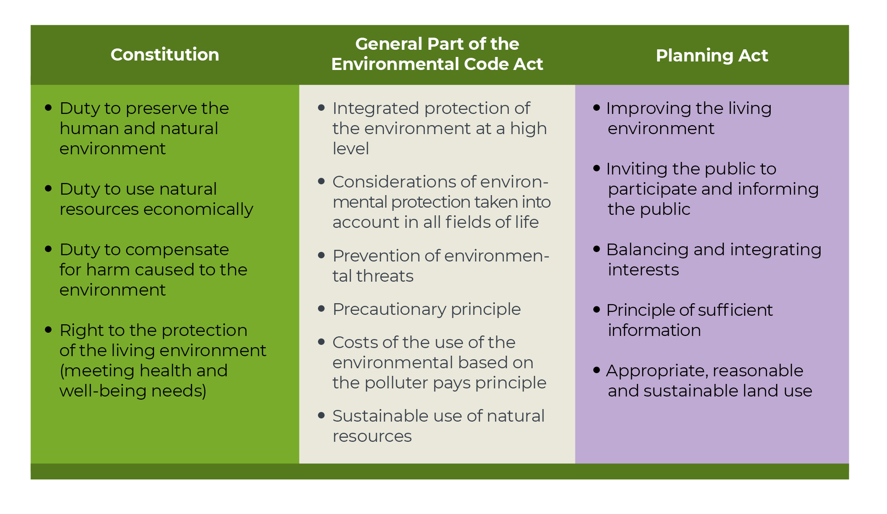
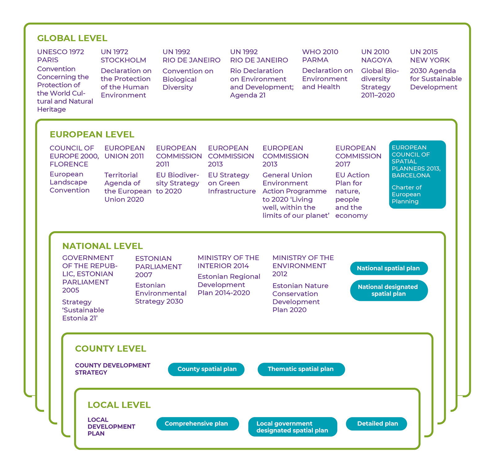
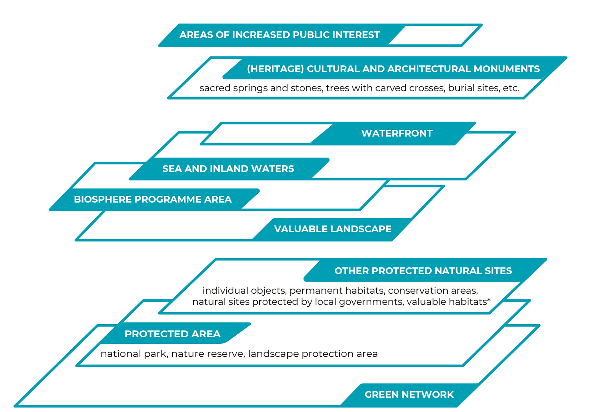
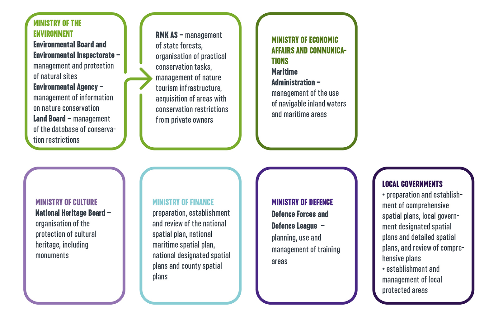
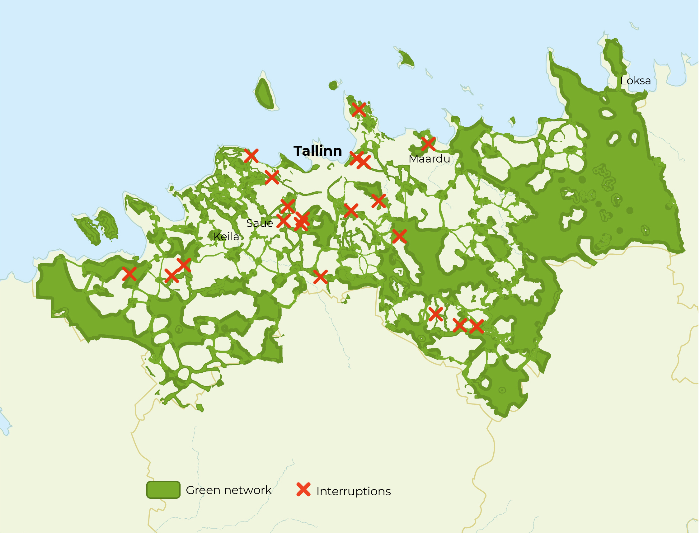

## Shaping natural areas for public use {.chapter_section .chapter3_section}

```{block, type='authors'}
<div class="author-links">**[Age Poom](#age-poom) ja [Kalev Sepp](#kalev-sepp)**</div>
<div><a class="print-btn" href="print/EIA-2019-3.3.pdf"><i class="fa fa-file" aria-hidden="true"></i>Trükiversioon</a></div>
```

```{block, type='points'}
* The green network is under great development pressure especially in the municipalities surrounding cities; this inhibits the coherent and comprehensive functioning of the network as well as the possibilities for its public use.
```

```{block, type='blockquote-right'}
Nature conservation management and spatial planning facilitate the preservation and use of natural areas.
```
In this article, we provide an overview of the legal framework for the spatial planning and management of natural areas, which is used to shape the preservation of natural areas, the value of nature and access to natural areas. We explain the underlying principles and administrative methods for the protection and use of natural areas and the hierarchical and horizontal links between strategic and spatial planning in the context of preserving the value of nature.

The integral functioning of and access to natural areas are managed in Estonia by means of nature conservation and spatial planning. The purpose of nature conservation arrangements is to ensure biodiversity, functioning ecosystems and the preservation of a natural environment of cultural and aesthetic value. The definition of the task of spatial planning is more general: to plan land use in a manner that integrates and balances the various areas and interests of social life. The Planning Act emphasises the role of spatial planning in ensuring ‘democratic, long-term, balanced’ and ‘environmentally sound and economically, culturally and socially sustainable development’. The elements of democracy in the planning process include defining the interests and categories related to land use and creating a deliberative space in society in order to agree during the planning process on the principles and solutions for the use of space. In the case of discretionary decisions, it can thus be clarified whether, for example, the preservation of region-specific landscapes or the green network is more important than development based on private interests or mining and quarrying.

Planning concerning the entire natural environment is regulated in Estonia by the General Part of the Environmental Code Act, which has been the main legal instrument since 2014 that elaborates on the constitutional provisions on the protection of the environment. Appropriate principles for planning in the natural environment ([Figure 3.3.1](#figure331)) require the integration of fields of life, the balancing of interests, prevention of environmental damage and comprehensive regard for environmental considerations in organising social life.

<p class="caption" id="figure331"><span class="figure-number">Figure 3.3.1.</span> The principles, fundamental rights and obligations concerning the protection of the environment and spatial planning based on the Estonian Constitution, the General Part of the Environmental Code Act and the Planning Act</p>

```{r, figure331, fig.align='center', out.width='90%', echo=FALSE, message=FALSE, warning=FALSE}



```

``` {block, type='imgsource'}
<span class="imgsource-source">Source:</span> Figure by the authors.
```

### The planning of natural areas is based on the principle of subsidiarity {-.chapter3_section}

Spatial planning grew out of urban and regional planning; the term was first used by the ministers in charge of European regional planning in 1983 in the European Regional/Spatial Planning Charter, also known as the Torremolinos Charter. The charter was driven by the desire to ensure a healthy environment for Europeans and a high quality of life. The charter was the first document to formulate the principles of spatial planning, which are also reflected in the Estonian Planning Act. In 2013, the European Council of Spatial Planners, of which the Estonian Association of Spatial Planners is a member, approved the Charter of European Planning ([ECTP-CEU 2013](#ECTP-CEU2013)). This European spatial vision highlights the need to ensure ecological functioning, access to cultural and natural heritage for all, and the role of landscapes and urban green spaces as elements of the quality of life when planning the artificial environment.

The spatial planning charter is a value-based agreement pointing the way forward. It sees planning as a means of cooperation and coordination between spatial decision-making levels. Every level – from international cooperation for attaining sustainable development to local development and land use plans – should take into account the goals and activities of at least the levels immediately above and below it. The European Union lacks common planning law: the system of spatial planning is hierarchical and the legal framework is established by each member state itself. In Estonia, hierarchy is primarily one-way: the strategic documents of a larger spatial unit direct the content of lower -level spatial plans ([Irbis Konsultatsioonid et al. 2017](#Irbis2017)).

```{block, type='blockquote-left'}
In Estonia, hierarchy is primarily one-way: the strategic documents of a larger spatial unit direct the content of lower -level spatial plans.
```
However, spatial planning is based on the key principle of subsidiarity: development decisions concerning local affairs are, as a rule, made as close to the inhabitants as possible; that is, at the lowest feasible level of the administration. The value of spatial plans in shaping the future, living environment and public space of a region and their agreement with the community’s interests depend on the ability of the processor to use the knowledge of residents and involve them in preparing and implementing the plan ([Levald 2018](#Levald2018); [Nuga et al. 2015](#Nuga2015); [Vahtrus et al., this report](#public-participation-in-decisions-on-the-use-of-natural-areas)). The Estonian administrative reform of 2017 that reduced the number of municipalities nearly three-fold aimed at increasing that very capacity in the region. Furthermore, planning quality has been improved through the participation of Estonian officials and experts in continuing professional education programmes and international networks such as Vision and Strategies Around the Baltic Sea (VASAB) and the European Spatial Planning Observation Network (ESPON)  ([Adams et al. 2014](#Adams2014)).

Spatial planning as a public procedure was introduced in Estonia with the Planning and Building Act of 1995. The Spatial Planning Department of the Ministry of Finance has been responsible for spatial planning since 2015. Spatial development at the national level is guided by the national spatial plan and county spatial plans and elaborated through thematic plans. Local decisions on spatial development and land use are made by the local government when preparing comprehensive spatial plans and detailed spatial plans. National designated spatial plans and local government designated spatial plans are two new types of plans defined in the 2015 Planning Act that stand out against the hierarchical system; under these plans, objects of significant spatial impact can be established outside the usual planning procedure. The practice of designated spatial plans is only evolving in Estonia and their impact on natural areas is not clear.

From the viewpoint of shaping public space, county spatial plans and comprehensive plans are the most important planning levels. They take into account the national strategic guidelines while being sufficiently context-sensitive and engaging the local community. The thematic spatial plan ‘Environmental conditions guiding settlement and land use’, which was nationally initiated in all counties in 1999, is regarded as the spatial plan that has had the greatest impact on Estonia’s settlement structure; it provides for green spaces and regulates the expansion of housing construction ([Irbis Konsultatsioonid et al. 2017](#Irbis2017)). A comprehensive plan defines land use on the territory of a municipality in line with the principles of the county-level plan. A comprehensive plan formulates the conditions of use that ensure the preservation of recreational areas, public waterbodies and green networks, valuable landscapes and biological communities.

### International development objectives and national policies influence the status of natural areas  {-.chapter3_section}

```{block, type='blockquote-right'}
Estonia has joined international treaties supporting the preservation of a coherent and functioning green network and public access to natural areas.
```
Spatial and strategic planning related to nature conservation and sustainable development is guided by international treaties ([Figure 3.3.2](#figure332)). Of the earlier international agreements emphasising the public benefits of natural areas, the most important are the 1972 Convention Concerning the Protection of the World Cultural and Natural Heritage and the 1972 Declaration of the United Nations Conference on the Human Environment. In 1992, after regaining independence, Estonia signed agreements on the protection of biodiversity and sustainable development, including the Convention on Biological Diversity and the UN Agenda 21 action plan. The importance of green spaces in the living environment is highlighted by the WHO Declaration on Environment and Health (2010). Urban green spaces in particular, as well as the protection of the condition of the environment, its biodiversity and well-being in general are covered by the 2030 Agenda for Sustainable Development adopted by the UN in 2015. A number of conventions, strategies and action plans for the protection of natural areas, landscapes, cultural heritage and the living environment have been adopted at the European level, including the EU Strategy on Green Infrastructure (2013). The Man and the Biosphere Programme under UNESCO, within which a biosphere programme area was designated for the western Estonian islands in 1989, deserves mention as an example of the integration of values in regional management.

<p class="caption" id="figure332"><span class="figure-number">Figure 3.3.2.</span> A selection of international and Estonian strategic development documents framing the appreciation for natural areas in Estonia</p>

```{r, figure332, fig.align='center', out.width='100%', echo=FALSE, message=FALSE, warning=FALSE}



```

``` {block, type='figure-comment'}
<span class="figure-comment-start">Note:</span> Types of spatial plans are highlighted that, among other things, pertain to the protection of natural areas and their use for designated purposes. The Figure does not cover EU directives, Estonian laws or strategic development documents of other sectors, which can also impact the public use of natural areas.
```

``` {block, type='imgsource'}
<span class="imgsource-source">Source:</span> Figure by the authors.
```

International agreements value the fundamental and multi-layered role of natural areas in human health as well as social and economic affairs. The UN Global Biodiversity Strategy (2010) prepared under the Convention on Biological Diversity presumes that in order to preserve biodiversity and thereby the value of natural areas, countries will have integrated biodiversity values into their national and local strategies, development plans and spatial plans by 2020 at the latest. In Estonia, these principles require developing in order for policy to value natural areas as more than merely heritage or economic resources. For example, the Estonian Regional Development Strategy, which guides long-term regional development, acknowledges the problem of the loss of natural areas due to urban sprawl, but as a solution, it highlights the use of the region-specific natural resources in local enterprise and community activities. The Regional Development Strategy does not set guidelines on how to alleviate development pressure on natural areas to ensure their ecological functioning, their role in maintaining the quality of life, and public access to them. Estonia declares it is achieving the goals of the UN Global Biodiversity Strategy by creating a national system to map and assess ecosystem services and integrate them into strategic and spatial planning by 2023 at the latest ([Linder and Kakuver 2017](#Linder2017)).

In addition to documents directly pertaining to natural areas, these areas are also affected by the strategic development documents of other policy areas, especially the basic policy documents expressing the nation’s strategic interests and sectoral development targets, as well as development plans and programmes for specific policy and governance areas. Areas directly related to the use of space include energy, the use of mineral resources, industry, agriculture, forestry, nature conservation, water management, transport, telecommunications, national defence, tourism and the development of residential areas. The 2014–2020 Regional Development Strategy calls for working towards substantive and spatial harmony between policy areas and spatial planning, considering that physical space is limited. This means that sectoral development documents should indicate how development targets contribute to the achievement of a high-quality living environment and public space, including through the good condition of and access to natural areas.

According to the spatial design expert group set up at the Government Office, Estonia lacks a spatial policy with an integrated approach to the natural and built environment and that coherently implements the various fields of spatial planning to serve as the basis for activities at all levels of decision-making and all policy areas. According to applicable law, sectoral strategic development documents are not required to consider spatial plans, spatial impact, or the combined spatial impact of the various documents ([Ministry of Finance 2019](#Ministry2019)). The consistency of development documents with the national spatial plan is sometimes specified, but only in a declarative manner. The spatial impact of development documents protecting sectoral interests has intensified over time, while the use of discretion in planning has decreased. This has led to the poor representation of county and local interests in strategic documents ([Irbis Konsultatsioonid et al. 2017](#Irbis2017)), where the regulations of sectoral development plans that have spatial impacts cannot be changed through spatial planning ([Ministry of Finance 2019](#Ministry2019)). Some European countries (Ireland, Lithuania) have taken steps to provide a single basis for preparing spatial development guidelines, strategic development documents and national investment plans (ibid.).

### Natural areas have different access options and restrictions on use {-.chapter3_section}

The bases for planning natural areas in Estonia and the related legal and administrative arrangements are complex (Figures [3.3.3](#figure333) ja [3.3.4](#figure334)). An area may be subject to multiple protection procedures or restrictions on use; for example, if an area is part of a limited management zone in a landscape protection area, a waterfront protection zone, and a core area of the green network. Restrictions also concern the public use of natural areas, including staying in these areas.

<p class="caption" id="figure333"><span class="figure-number">Figure 3.3.3.</span> Estonian natural areas may be subject to multiple protection procedures depending on the natural value of the area</p>

```{r, figure333, fig.align='center', out.width='100%', echo=FALSE, message=FALSE, warning=FALSE}



```
``` {block, type='figure-comment'}
<span class="figure-comment-start">*</span> An area in a forest with a high probability of the presence of narrowly adapted, threatened, vulnerable or rare species.
```

``` {block, type='imgsource'}
<span class="imgsource-source">Source:</span> Figure by the authors.
```
Natural areas are generally publicly accessible in Estonia and visited by various groups ([Sepp and Lõhmus, this report](#how-do-people-use-the-natural-environment-in-Estonia)), but the physical public space is not defined by the law. The Charter of European Planning cites streets, squares, footpaths and green links as examples of the ‘public realm’ (<a href="https://planeerimine.ee/static/sites/2/euroopa_planeerimise_harta.pdf">ECTP-CEU 2013</a>). The General Part of the Environmental Code Act sets out the principle of general access: while entering a plot of land requires the permission of the owner, permission is assumed unless the owner has clearly indicated otherwise. In addition to the owner, the local government may restrict access to a natural area in a comprehensive plan if this is required by overriding public interest or private interest or if a lawful structure is located on a waterfront path.

Public access and nature conservation are most clearly defined for sites protected under the Nature Conservation Act (18.5% of Estonia’s land area; [Linder and Kakuver 2017](#Linder2017)). Protected areas have protection zones of varying strictness, the most stringent of which are nature reserves (1% of the land area of protected areas; [ibid.](#Linder2017)). Land in special management zones (60%) and limited management zones (39%) may be visited according to the procedure set out in the protection rules; in all cases, it is prohibited to camp, build fires and organise events in places not specifically prepared and designated for these purposes. Roads and paths in protected areas or leading to protected natural sites are open to the public from sunrise to sunset. Protected zones along shores and banks (limited management zone, building exclusion zone and water protection zone) are also relevant in respect to public use: permanent access must be provided to waterbodies that are in public use; a waterfront path must allow access at the border of the waterbody, and conditions for recreation must be maintained in protected zones.

```{block, type='blockquote-right'}
The unauthorised closure of a waterfront path or the obstruction of access to such a path is a common example of conflict between private and public interests in Estonia.
```
The National Audit Office has pointed out in an audit that the unauthorised closure of a waterfront path or obstruction of access to such a path is a common example of conflict between private and public interests in Estonia ([National Audit Office 2015](#1Audit2015)). There are many private owners that, according to the National Audit Office, lack the will to allow the roads and suitable parking spots on their land to be used by the public. Another possible problem is the difficulty of finding and the poor signage of access roads to waterbodies, or even a complete lack of access, as well as failure to mark an alternative route where a waterfront path is disrupted. The National Audit Office has emphasised the importance of decisiveness on the part of the local government during the preparation of comprehensive plans and recommended that cooperation with the Environmental Inspectorate be intensified to ensure the usability of waterfront paths.

```{block, type='blockquote-left'}
Areas of increased public interest include 3.5% of the forest lands administered by the RMK, which border recreational forest areas, densely populated areas or private residential buildings, or are important in terms of cultural heritage.
```

A large part of the administration of natural areas owned by the Estonian state has been delegated to the State Forest Management Centre (RMK), which is a legal entity in private law. To balance private and public, national and local interests in forest land management, the RMK has defined areas of increased public interest and the methods for their management since 2017. Such areas include forest lands administered by the RMK that are adjacent to recreational forest areas, densely populated areas or private residential buildings or that are important in terms of cultural heritage. To manage these areas, stricter principles that have more regard for the local context have been agreed with the community. The participation of stakeholders and consideration of the landscape are important aspects in managing these areas, but they are not excluded from being managed. According to the RMK, a total of 51,134 hectares of forest land was defined as areas of increased public interest by early 2019, which constitutes 3.5% of the total forest land administered by the RMK.

The Heritage Conservation Act helps preserve natural areas on which cultural monuments are located. The national register of cultural monuments includes, for example, ancient burial sites and burial mounds, hill forts and settlement sites, natural sacred sites, such as sacred springs, sacrificial stones and trees with carved crosses, as well as observation posts and defence lines (in total over 2,500 objects located in natural areas). Estonia is acceding to the Framework Convention on the Value of Cultural Heritage for Society (Faro Convention, 2005), which defines benefiting from cultural heritage and contributing to its enrichment as a human right. To preserve and acknowledge historical natural sacred sites and the possibility to visit them, the National Heritage Board is gathering information on the location and physical status of natural sacred sites and on the related folklore. According to the National Heritage Board, information on the natural sacred sites of nearly 60 parishes had been collected by 2019 or were being collected.

<p class="caption" id="figure334"><span class="figure-number">Figure 3.3.4.</span> Distribution of work between public bodies in the planning and management of the land use and protection of natural areas</p>

```{r, figure334, fig.align='center', out.width='100%', echo=FALSE, message=FALSE, warning=FALSE}



```

``` {block, type='imgsource'}
<span class="imgsource-source">Source:</span> Figure by the authors.
```

In settlements, the inhabitants are provided with primary contact with natural areas in terms of forests, urban woodlands, parks and cemeteries. Urban woodlands and forested parks have been managed in Estonia since at least the mid-19th century, as the recreational value of forests was already highly appreciated then. An important indicator of the use of recreational areas within and near urban areas is their proximity to people’s homes ([Sepp ja Lõhmus, this report](#how-do-people-use-the-natural-environment-in-Estonia);[Orru et al., this report](#The-impact-of-natural-areas-on-people’s-well-being)).

The sea constitutes a special natural area in terms of public access and usability. Historical uses of maritime areas, such as for fishing or travelling, are being supplemented by new uses such as recreation and energy production. The recreational value of maritime areas is also reflected in sea views, while new uses may compete with the preservation of sea views. A spatial plan covering Estonia’s entire maritime area (36,500 sq. km including the shore area) is being prepared, in the course of which interests and areas suitable for various uses are being identified, the combined impact of the uses is assessed and a long-term agreement on the use of the sea made between the parties to the plan. Spatial planning for maritime areas is a new practice for the entire European Union (the obligation of maritime spatial planning was only established in 2014). Before the Estonian maritime spatial plan was initiated, county spatial plans for the maritime areas of Hiiumaa and Pärnumaa were adopted in 2016 and 2017, respectively.

Protection of natural values on inland waterbodies and regulating their public use is effected through regional river basin management plans and spatial planning, having regard for the requirements of the conservation of nature and the protection of health. Public beaches are defined in comprehensive plans. Travelling on navigable waterbodies is administered by the Maritime Administration. Local governments may set temporary restrictions on the use of public waterbodies.

### The green network connects natural areas, but its function as a whole is not guaranteed {-.chapter3_section}

```{block, type='blockquote-right'}
The most extensive protection against land-use changes in natural areas relates to the green network, which covers 55% of Estonia’s land area
```

The most extensive protection against land-use changes in natural areas relates to the green network, which covers 55% of Estonia’s land area. Its purpose is to coherently link various types of natural or semi-natural land and water areas to ensure their ecological functioning and the preservation of landscapes. The green network consists of core areas of various levels of importance (at national, county and local levels) and the green corridors connecting them. Of the total land area of protected zones in Estonia, 88% is covered by the green network and this constitutes about one-third of the total size of the green network. Protected zones and the green network overlap most in Läänemaa and least in Põlvamaa (with 51% and 18% of the green network protected in these counties, respectively). The protected areas not covered by the green network are largest in Hiiumaa (29%), Valgamaa (28%) and Saaremaa (27%) ([Figure 3.3.5](#figure335)).

<p class="caption" id="figure335"><span class="figure-number">Figure 3.3.5.</span> The green network and protected natural sites (protected areas, places where protected species have been found, species protection sites, Natura 2000 sites) as a percentage of the total area of the county</p>

<div class=desktop-plot>
```{r, figure335, out.width='90%', fig.align='center', echo=FALSE, message=FALSE}

library("tidyverse")

fig335_data <- read.csv ("../data/33_fig5_data.csv", header=TRUE, fileEncoding="utf-8")

fig335_data$objects_eng[grepl("RV ala väljaspool kaitsealasid", fig335_data$objects)]<-"Green network area outside protected areas"
fig335_data$objects_eng[grepl("Kaitstavad loodusobjektid RV alal", fig335_data$objects)]<-"Protected natural sites inside green network area"
fig335_data$objects_eng[grepl("Kaitstavad loodusobjektid väljaspool RV ala", fig335_data$objects)]<-"Protected natural sites outside green network area"


fig335_data$objects_eng <- factor(fig335_data$objects_eng, levels = c("Green network area outside protected areas","Protected natural sites outside green network area","Protected natural sites inside green network area"))


  fig335_plot <- ggplot() +
    geom_bar(data = fig335_data, mapping = aes(x=reorder(county,-value), y=value, fill=objects_eng, text = paste("", county,
                         "<br>", objects_eng,
                         "<br>", value, "%")), width=0.6, stat="identity") +
    scale_fill_manual(values=c("#79AC2C","#482683","#5B8121"), labels=c("Green network area outside protected areas","Protected natural sites outside green network area","Protected natural sites inside green network area")) +
    labs(y="%", x="") +
    guides(fill=guide_legend(nrow=3,byrow=TRUE)) +
      scale_y_continuous(expand = c(0, 0), limits=c(0,100)) +
    expand_limits (y=0)

      fig335_theme <- theme(
                    panel.grid.major.x = element_blank() ,
                    panel.grid.minor.x = element_blank(),
                    axis.line = element_line(size = 0.2, colour = "#cccccc"),
                    axis.text.x = element_text(angle=45, margin = margin(t = 7, r = 0, b = 0, l = 0), hjust=1.1),
                    text = element_text(family="Montserrat"),
                 )

ggplotly(fig335_plot + fig335_theme + fig_theme_general, tooltip = "text" ) %>%
config(displayModeBar = F, collaborate = F)   %>% 
layout(legend = list(orientation = "h",y = 1.15)) %>% 
layout(xaxis = list(fixedrange = TRUE)) %>%
layout(yaxis = list(fixedrange = TRUE))

#ggsave(path="exported_figures/PDF/chapter3",filename="fig335.pdf", height=140, width=210, units="mm")

```

</div>

</div>
<div class="mobile-plot">
```{r, out.width='100%', fig.asp=.75, fig.align='center', echo=FALSE, message=FALSE, warnings=FALSE}

print(fig335_plot + fig335_theme + fig_theme_general)

```

``` {block, type='imgsource'}
<div><span class="imgsource-source">Sourve:</span> Kutsar et al. 2018.</div>
<div><a class="data-btn" href="data/33_fig5_data.csv"><i class="fa fa-download" aria-hidden="true"></i>Laadi andmed</a></div>
```

The need for a green network is set out at the international level in the EU Strategy on Green Infrastructure and at the national level in the Estonian Nature Conservation Development Plan. The areas covered by the green network are defined in county spatial plans and comprehensive plans. The green network was planned with the help of the green network planning guide ([Kutsar et al. 2018](#Kutsar2018)) and the <a href="https://planeerimine.ee/static/sites/2/uldplaneeringu_juhis_final.pdf">Ministry of Finance 2018 guidelines for comprehensive plans</a>. The idea of a green network in Estonia goes back to the 1960s when Jaan Eilart and Vaike Parker first attempted to plan recreational landscapes and green corridors around Tartu, while Heino Luik and Veljo Ranniku were engaged in the functional zoning of oil-shale production areas in Ida-Virumaa. In the early 1980s, attempts were made to research and develop an innovative approach to ecological networks as landscape areas ecologically compensating for human impact ([Mander et al. 2018](#Mander2018)). Maps of ecological networks of various levels of precision were prepared until the late 1980s; the most precise of them were prepared for Tallinn, northeastern Estonia and Hiiumaa. The term ‘green network’ was introduced in the national spatial plan Estonia 2010+, adopted in 2000. The current Planning Act covers green networks along with valuable landscapes, agricultural areas and built-up areas of cultural and environmental value, referring among other things to the interconnectedness of these areas and the cultural importance of the green network.

```{block, type='blockquote-right'}
There is no consensus or clear case law in Estonia on whether or not a development plan’s conflict with a spatial plan constitutes grounds for refusal to issue an operating licence.
```
The preservation of and access to natural areas covered by the green network but not by protected areas are ensured through the requirement not to alter the main purpose of land use in such areas (e.g. replacement of natural by artificial areas, such as mineral deposits or residential areas, which also preclude public use) set out in county spatial plans and comprehensive plans. Restrictions are also set during the process of managing land use and issuing operating licences, including granting building rights. However, areas of natural value that are under development pressure or include mineral deposits can be excluded from the network by amending the spatial plan, unless such areas are part of protected areas. There has been remarkable development pressure on the green network over the past decade in the ring-shaped rural municipalities around the largest local commuting centres (Tallinn and Tartu).

Where development plans endanger the functioning of the green network, the extent of the impact and the permissibility of the activity are analysed in the course of environmental impact assessment, but development-based assessment includes only a limited approach to cumulative and diffuse spatial impacts. While county spatial plans and comprehensive plans have been prepared with a broad strategic view, there is no consensus or clear case law in Estonia on whether or not a development plan’s conflict with a spatial plan constitutes grounds for refusal to issue an operating licence ([Kask et al. 2015](#2Kask2015)). Therefore, even though the planning procedure is an important aspect of protecting a public space with natural value, it is not always sufficient, and stricter protective measures should be considered for key areas.

```{block, type='casebox'}
<h3>Analysis of the green network shows shortcomings in planning and legislation</h3>

Within the framework of the Estonian Nature Conservation Development Plan, an analysis was conducted of the functioning of the green network as defined in Estonian county spatial plans and comprehensive plans for 2003–2017 ([Kutsar et al. 2018](#Kutsar2018)). Responses were received in due course from 14 county governments out of 15 and 133 local governments out of 213. Spatial data (vector files) suitable for analysis were received on 15 county spatial plans and 74 comprehensive plans.

In more than half of the plans, major deviations from the methodology for defining the green network were found. Typically, no distinction was made between core areas and green corridors (in 11 county spatial plans and 43 comprehensive plans), and between core areas of importance at the national, county and local levels. As a result, elements of the network are not distinguishable in most of the plans, and the conditions of use set in the explanatory statement do not unambiguously match the areas on the map. Therefore, management decisions cannot be weighed on the basis of each area and the reason for setting different conditions for core areas and green corridors is lost.

Changes in the green network at the level of CORINE 2006, 2012 and 2018 land cover classes were analysed for Harjumaa. Between 2006 and 2012, the land cover changed on a total of 12,010 hectares in the Harjumaa green network, of which most were shifts from one natural land cover class to another. On about 300 hectares, areas with a natural land cover were turned into artificial areas, mostly for residential development and quarries. There were 25 interruptions to green corridors (turning part of the natural land cover of the corridor into an artificial area) in the surroundings of Tallinn and near major highways ([Figure 3.3.6](#figure336)). Between 2012 and 2018, land cover changes occurred on a total of 10,509 hectares of green network land, of which 224 hectares of natural land cover were turned into artificial areas. By virtue of these changes, former green network areas were removed from public use and lost their designated function as natural areas.

It was concluded from the analysis that the Estonian legal framework will be sufficient to ensure the protection of the green network once laws and regulations are applied with the aim of preserving the green network. Development pressure results in fragmentation of the green network. The quality and accessibility of the network is maintained in areas where the population decreases and development pressure is lower. Improving the technical level of planning procedures, including the definition of target levels for the green network, using digital standards for spatial information and linking the planning solution to databases would help guarantee the preservation and all-round functioning of green networks.

```

<p class="caption" id="figure336"><span class="figure-number">Figure 3.3.6.</span> Interruptions in the green network of Harjumaa in 2012 compared to 2006</p>

```{r, figure336, fig.align='center', out.width='100%', echo=FALSE, message=FALSE, warning=FALSE}



```

```{block, type='imgsource'}
<span class="imgsource-source">Source:</span> Kutsar et al. 2018.
```

### Summary {-.chapter3_section}

```{block, type='blockquote-right'}
Development pressure results in fragmentation of the green network. The quality and accessibility of the network is maintained in areas where the population decreases and development pressure is lower.
```
Spatial planning and nature conservation requirements are in place in Estonia which support the preservation of natural areas, their condition and public accessibility. Over half of Estonia’s land area is covered by the green network agreed upon during the spatial planning process. At the same time, the proportion of protected areas is smaller in Estonia than elsewhere in Europe – 20% and 26%, respectively ([EEA 2019](#European2019)). The current spatial planning and nature conservation measures are not enough to guarantee good living environment, open space and the preservation of the benefits of natural areas. The reasons for this are the lack of a carefully designed cross-sectoral spatial policy and the legal possibility of not complying with the conditions agreed upon in the preparation of strategic development documents and when processing development plans, as well as with the analysis of combined spatial impacts. Alongside resolving these issues, it is important for the implementation of a coherent spatial policy to improve the technical level of plans and ensure the accessibility of information in line with the standards of the digital age.

### References {-.subreferences}

<p id="Adams2014">Adams, N., Cotella, G., Nunes, R. 2014. The engagement of territorial knowledge communities with European spatial planning and the territorial cohesion debate: a Baltic perspective – European Planning Studies, 22 (4), 712–734.</p>

<p id="ECTP-CEU2013">ECTP-CEU 2013. The Charter of European Planning: The Vision for Cities and Regions – Territories of Europe in the 21st Century. Barcelona: The European Council of Spatial Planners.</p>

<p id="European2019">EEA – European Environmental Agency 2019. Share of country designated as terrestrial protected area and the overlap between Natura 2000 or Emerald sites and national designations. https://www.eea.europa.eu/ds_resolveuid/13e289d0367a4cf2b-4ddfb7aac31efee.</p>

<p id="Irbis2017">Irbis Konsultatsioonid OÜ, Tartu Ülikooli Sotsiaalteaduslike rakendusuuringute keskus, Hendrikson & Ko OÜ 2017. Arengu ruumiline ja strateegiline kavandamine, sh regionaaltasandi funktsioonid ruumilise arengu suunamisel. Report for the Ministry of Finance. https://planeerimine.ee/static/sites/2/arengu-ruumiline-ja-strateegiline-kavandamine-1.pdf.</p>

<p id="2Kask2015">Kask, O., Lopman, E., Relve, K., Kuusk, P., Triipan, M., Vaarmari, K., Vahtrus, S., Veinla, H. 2015. Keskkonnaseadustiku üldosa seaduse kommentaarid. Tartu: Keskkonnaõiguse Keskus.</p>

<p id="Kutsar2018">Kutsar, R., Metspalu, P., Eschbaum, K., Vahtrus, S., Sepp, K. 2018. Rohevõrgustiku planeerimisjuhend. Tallinn, Tartu: Keskkonnaagentuur, Hendrikson & Ko OÜ.</p>

<p id="Levald2018">Levald, A. 2018. Kohandav planeerimine ja ruumiloome kahaneva rahvastikuga piirkondades. Presentation at an Estonian Parliament study committee meeting, Toompea, 3 December 2018. Tallinn: Ministry of Finance.</p>

<p id="Linder2017">Linder, M., Kakuver, K. (eds.) 2017. Looduskaitse. Eesti looduse kaitse aastal 2015. Eesti looduse mitmekesisus 5. Tallinn: Keskkonnaagentuur.</p>

<p id="Mander2018">Mander, Ü., Kull, A., Uuemaa, E., Mõisja, K., Külvik, M., Kikas, T., Raet, J., Tournebize, J., Sepp, K. 2018. Green and brown infrastructures support a landscape-level implementation of ecological engineering – Ecological Engineering, 120, 23–35.</p>

<p id="Rahandusministeerium2019">Ministry of Finance 2019. Ruumilise planeerimise rohelise raamatu eelnõu 26.07.2019. https://planeerimine.ee/prr.</p>

<p id="1Riigikontroll2015">National Audit Office of Estonia 2015. Kallasradade kasutamine. Kas omavalitsused ja Keskkonnainspektsioon on teinud kõik endast sõltuva, et inimene pääseks randa ja saaks kallasrajal liikuda? Report for the Estonian Parliament. Tallinn, 8 December 2015.</p>

<p id="Nuga2015">Nuga, M., Metspalu, P., Org, A., Leetmaa, K. 2015. Planning post-summurbia: from spontaneous pragmatism to collaborative planning? – Moravian Geographical Reports, 23 (4), 36−46.</p>
