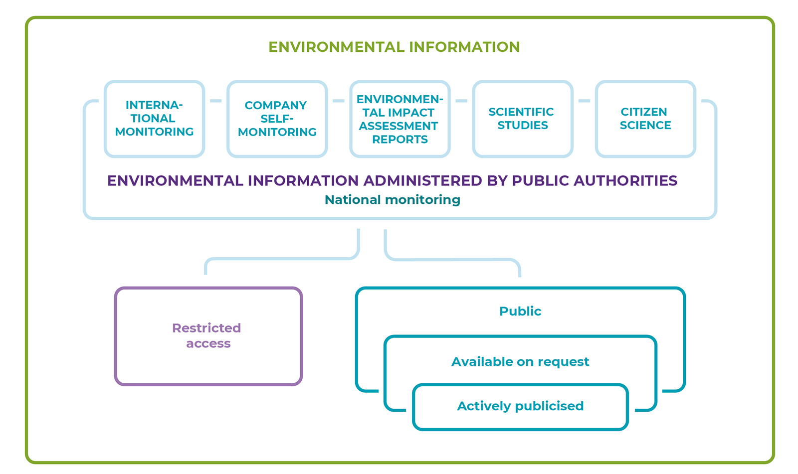

## Public participation in decisions on the use of natural areas {.chapter_section .chapter3_section}

```{block, type='authors authors_eng'}
<div class="author-links">**[Siim Vahtrus](#siim-vahtrus), [Liina Remm](#liina-remm), [Kärt Vaarmari](#kärt-vaarmari)**</div>
<div><a class="print-btn" href="../kaasarääkimise-võimalused-loodusalade-kasutamisel.html">EE</a></div>
```

```{block, type='points'}
* Environmental democracy in Estonia is supported by a good legal framework and comprehensive environmental data; on the other hand, it is hampered by pessimistic citizens and the complicated presentation of information.
```

A large part of Estonia’s natural environment is at least to some extent open to public use or accessible to everyone. Environmental decision-making therefore impacts the public use of natural areas. A decision to allow a new gravel quarry in a state-owned forest or to permit the extraction of peat in a mire, for example, may result in a local community losing its traditional berry-picking area. The use of natural areas, including sacred natural sites or recreational forest areas in local communities, may also be limited by the decision to build a new road or railway. Permitting a new factory, hydropower plant or similar development on a river may reduce opportunities to engage in fishing or swimming or deprive people of natural sights. Even if the activity subject to environmental permits is being planned on private land or some distance from places in public use (e.g. establishing a new oil shale mine), its impact (e.g. noise, air or water pollution, increased traffic) often has a wide geographical range.

```{block, type='blockquote-right'}
Even if the activity subject to environmental permits is being planned on private land or some distance from places in public use, its impact (e.g. noise, air or water pollution, increased traffic) often has a wide geographical range.
```

The article provides an overview of how people can participate in environmental decision-making, focusing on two issues: the system for participating in environmental decision-making (opportunities), and the extent to which people are used to expressing their opinions publicly (level of civic activism). These two aspects are in turn dependent on the information given to people about their environment and the use of this information.

### Public debate on the environment was induced by events in the 1980s in Soviet Estonia {-.chapter3_section}

During the Soviet era, environmental matters in Estonia were decided without public dialogue and information on environmental risks was classified ([Kiisel 2005](#Kiisel2005)). For example, everything related to the strategically important uranium plant in Sillamäe, which functioned between 1946 and 1991, was highly classified. Lack of information also hampered public participation in solving environmental problems related to the living environment. Furthermore, environmental protection was viewed both by the general public as well as experts as a highly specialist field, at the same time, viewing the general population as rather the polluters than the protectors of the environment. Alongside these attitudes, in addition to their concern about the risks to Estonia’s natural environment, the general public also understood and valued a critical scientific approach to environmental problems and mistrusted the optimism of the authorities ([Lauristin 1988](#Lauristin1988)).

The national protest movement of 1987–1988 against the phosphorite mining planned in Virumaa changed the situation significantly. In just a few years, the ways in which the public took part in discussions and decision-making changed and a negative public opinion towards mining phosphorite developed. The public created its own opportunities for participating and exerting political pressure on the decision-making process, and the result was that the large-scale mining operation was never initiated.

At the same time, people started to demand access to environmental information. Across the Soviet Union, public discussion of environmental risks and problems began after the 1986 accident in Chernobyl nuclear power plant. As a result of domestic and international pressure, the Secretary General of the Central Committee of the Communist Party of the Soviet Union at the time, Mikhail Gorbachev, promised to publish information on the accident. Following these events, many countries recognised the importance of access to environmental information and public participation in environmental matters. Around the same time (1984–1987), the UN Commission on the Environment was working on the concept of sustainable development, including in its final report (the Brundtland report 1987) the need to include different stakeholders in environmental decision-making for the first time. The report fed into the Rio Declaration (1992), which already expressly provides that ‘[a]t the national level, each individual shall have appropriate access to information concerning the environment that is held by public authorities’. In 1990, the European Union adopted Directive 90/313/EEC on the freedom of access to information on the environment. In 1998, the Aarhus Convention was adopted, which provides everyone the right to environmental information and public participation in environmental decision-making as well as access to justice in these matters.

<div class="casebox">
<h3>Environmental democracy is born in Estonia in the ‘phosphorite war’</h3>

Planning for a phosphorite mining operation in Virumaa was already initiated by the Soviet authorities in the 1970s; information on it was classified. The plan foresaw an enormous mine with more than 10,000 employees, posing a risk to the ground water and bringing with it a massive migration of workers from other regions of the Soviet Union. The Academy of Sciences of the Estonian SSR discussed the plan in the second half of the 1970s, but the public only learnt of the plans at the start of 1987.

In spring 1987, the students of Tartu University organised peaceful protests, and the plan was critically discussed in the newspapers. This was followed by the birth of the Estonian Green Movement in 1988 and as the first mass event on the environment, a bicycle tour ‘How are you doing, Virumaa?’ was organised by the Greens. Public meetings were held in Tallinn and Tartu; press conferences as well as meetings with scientists were organised by different organisations; newspapers and state authorities received numerous collective letters; and among the youth, spontaneous expressions flourished, including pop songs, slogans and t-shirts. On 29 May 1987, the Supreme Council of the ESSR adopted a decision, by which it required the government authorities to take the interests of current and future generations in protecting the soil, earth and water as well the interest in the scientifically reasonable and rational use of these resources into account in future studies.

Different forms of public participation and democracy developed in the course of this process. In addition to publishing information in the mass media, and private discussions and meetings, public protests, collective letters, voting, polls, discussions in elected bodies and finally a decision by the Soviet public authorities were used and developed ([Lauristin 1988](#Lauristin1988)).

<p class="caption" id="figure341"><span class="figure-number">Figure 3.4.1.</span> Protest meeting on 19 May 1987</p>
```{r, figure341, fig.align='center', out.width='100%', echo=FALSE, message=FALSE, warning=FALSE}

knitr::include_graphics("../figures/3-chapter/fig341.png")

```

</div>
```{block, type='imgsource'}
<span class="imgsource-source">Source:</span> Archive of Postimees, Scanpix Baltics.
```

### The current legal framework on public participation and environmental information in Estonia is sound {-.chapter3_section}

After the restoration of independence, the public’s interest in environmental matters declined significantly. At the same time, Estonian environmental legislation was decisively harmonised with that of the European Union. In 2001, Estonia ratified the Aarhus Convention and in 2004 it joined the European Union, which meant that EU law had to be transposed. With these legal provisions, a strong foundation for access to environmental information and public participation was created. The requirements arising from the Aarhus Convention are mostly established in the General Part of the Environmental Code Act, according to which anyone is, as a rule, entitled to access to environmental information and has the right to participate in the making of decisions with significant environmental impact.

```{block, type='blockquote-left'}
According to the OECD Environmental Performance Review of Estonia from 2017, environmental democracy in Estonia is developed and environmental information accessible.
```

According to the comparative study ‘Environmental Democracy Index’, in 2015, Estonia ranked 14 out of the 70 countries studied regarding rules and the practice of public participation and access to information ([World Resources Institute 2015](#World2015)). According to the OECD Environmental Performance Review of Estonia from 2017, environmental democracy in Estonia is developed and environmental information accessible. Two thirds of the population consider themselves to be well informed of environmental matters, although the completeness and quality of information could be improved. Public participation opportunities in environmental matters are generally good according to the OECD review, although access to justice in environmental matters should be broadened. As a major challenge, the low effectiveness of administrative review (checking the legality of decisions by administrative bodies) was highlighted; this is because the same authority in charge of making the decision under review is often also in charge of the review process.

### The public can mostly participate in the management of public space {-.chapter3_section}

Participatory democracy and the legal basis for environmental decision-making (i.e. 1992 UN Rio Declaration, Aarhus Convention) are based on the principle that merely informing the public is not enough. Individuals and civil society groups must also have the chance to have a say in decision-making related to decisions with significant environmental impact on their living and natural environment (General Part of the Environmental Code Act, Article 28); in other words, use the information made publicly available by the authorities to actively shape the decisions that are being made. By participating in decision-making, citizens can in turn also give information to the authorities. Activities with ‘significant environmental impact’ are defined in the Environmental Impact Assessment and Environmental Management System Act and includes deforestation (conversion of forest land) of an area of more than 100 hectares and open-cast mining with a surface area of more than 25 hectares. If the decision does not involve a significant environmental impact, the right to participate is not available to everyone, although people directly affected must be provided with a chance to have their say in the matter.

Participation rights also depend on the level of decision-making ([Table 3.4.1](#table341)). Estonian legislation generally provides a good opportunity to be involved in the management of public space. In the following paragraphs, we will focus on the areas where the public participation opportunities are lacking, although stakeholders have a strong desire to have their say.

```{block, type='blockquote-right'}
The reviewing of environmental decisions is ineffective, as the authority in charge of making the original decision is often also in charge of the review process.
```
Regarding project-level decision-making at the local level, participation opportunities are lacking for mining and forestry activities. After clear-felling, a forest may take an entire lifetime to be restored to its former state; mining limits access to natural areas and as a result completely changes the landscape. Despite substantial and long-lasting impacts from these decisions, spatial planning, and therefore public debate over the optimal location for mines and clear-felled areas is missing in the legal framework and practice. Thus, unlike, for example, the planning of new buildings in the urban environment, there is no coherence in the planning or analysis of the cumulative environmental impact in these areas.

Participatory planning for mining and clear-felling of forested areas would be reasonable. In Austria and Denmark, for example, spatial planning is applied to the use of mineral resources, and according to experts, this is a good way to resolve conflicts between mining companies and local communities ([MinPol 2017](#MinPol2017)). In Estonia, spatial planning could provide a satisfactory answer to the question of which deposits should be exploited as a priority to minimise the impact on the environment and people – at the moment, mining companies have a decisive role in choosing which deposits are mined and in which order. Regarding forest management, at the moment even the owners of neighbouring plots of land do not have a say in deciding over clear felling and other activities – only the landowner and the Environmental Board are involved in the decision-making. Starting from 2017, the State Forest Management Centre (RMK) has involved communities in planning forestry operations in areas with high public interest ([see Poom and Sepp, this report](#shaping-natural-areas-for-public-use)); however, there is relatively little practice, and therefore no conclusions about the impact of this voluntary measure can be made. A 2018 environmental awareness study ([Turu-uuringute AS 2018](#4Turu-uuringute2018)) confirms society’s expectations of greater scrutiny on forestry activities and limitations on landowners’ rights.

```{block, type='blockquote-left'}
Regarding project-level decision-making at the local level, participation opportunities are lacking for mining and forestry activities.
```
The opportunities for individuals to be involved in policy-making affecting natural areas is also limited, although its impact on the public use of natural areas is often direct, especially in the case of policy-making and planning of transport infrastructure, forestry and mineral resources. Drafts of development plans and other strategic decisions are often written with the involvement of working groups, where only representatives of certain stakeholders (companies, scientists, environmental NGOs) are included. When a strategic environmental impact assessment is carried out as part of the decision-making process, individuals may participate, but can only do so after strategic choices have already been made. The lack of the direct participation of individuals has been somewhat compensated by the fact that in most cases environmental NGOs, who also represent the interests of citizens, have been included.


```{block, type='blockquote-right'}
The main problem with strategic projects that affect national interests, but also impact natural areas, is that public participation is offered only after strategic decisions have already been made.
```
The main problem with strategic projects that affect national interests, but also impact natural areas, is that public participation is offered only after strategic decisions have already been made. Once strategic choices have been made, the public’s influence on the project is mainly reduced to arguing over technical details. This is why the Aarhus Convention requires that the public must be offered participation opportunities at an early stage, before making any decisions. In the planning procedures for the Est-For wood processing plant, which caught the attention of the public in 2017–2018, for example, it was decided that a national designated spatial plan would be prepared to find a location for the plant within the basin of the Emajõgi River before public discussions even began ([Kõnnussaar and Lõhmus 2018](#Konnusaar2018)). The Supreme Court ruled (in Case No 3-17-2132) that narrowing the geographical scope of a national designated spatial plan at the start of the procedures does not necessarily preclude considering alternative locations outside the original boundaries at later stages. Due to the early termination of the planning procedures, however, we do not know whether the authorities would have been prepared to follow this ruling in practice.

<p class="caption" id="table341"><span class="figure-number">Figure 3.4.1.</span> The system of environmental decision-making in Estonia based on the level and nature of decision-making as well as individuals’ rights to participate</p>

<div style="overflow-x:auto;">
<table id="table_341" style="width:100%">

  <tr>
    <th colspan="5" class="table_341_blank">TYPE OF DECISION</th>
  </tr>

  <tr>
    <th class="table_341_blank"></th>
    <th class="table_341_blank"></th>
    <th class="table341_green">Specific project</th>
    <th class="table341_green">Spatial plan</th>
    <th class="table341_green">Policy/strategy</th>
  </tr>

  <tr>
  <th rowspan="3" class="table_341_blank table_341_vertical">GEOGRAPHIC SCOPE</th>
    <th class="table341_dark_green">LOCAL</th>
    <td class="table341_purple">Permits, e.g.:<br>
• for special use of water<br>
• for mining<br>
• for forestry activities<br>
• for construction of buildings
Detailed spatial plans</td>

  <td>Comprehensive plans</td>
  <td>Development plans, e.g.:<br>
• municipal development plans<br>
• waste management plans<br>
• development plans for public water supply and waste water systems</td>
</tr>

  <tr>
    <th class="table341_dark_green">REGIONAL</th>
    <td>Regional infrastructure objects, e.g.:<br>
• power lines<br>
• roads<br>
• railways<br>
• waste treatment centres</td>

  <td>County spatial plan</td>
  <td>Regional plans, e.g. regional development plans, development strategies</td>
</tr>

  <tr>
    <th class="table341_dark_green">NATIONAL</th>
    <td class="table341_purple">Facilities of national importance, e.g.:<br>
• major harbours<br>
• national main roads<br>
• practice grounds for the defence forces<br>
• large industrial installations</td>

  <td>National spatial plan</td>
  <td class="table341_purple">National development plans and strategies, e.g.:<br>
•&nbsp;framework strategy for mineral resources<br>
• development plan for nature conservation<br>
• development plan for forestry</td>
</tr>

</table>
</div>

``` {block, type='figure-comment'}
<span class="figure-comment-start">Note:</span> cells with violet highlighting refer to types of decisions where (in some cases) public participation opportunities are limited.
```

```{block, type='imgsource'}
<span class="imgsource-source">Source:</span> Figure by the authors.
```

### Despite the right to participate, Estonians are passive and pessimistic {-.chapter3_section}

The existence of a right to participate does not automatically guarantee high-quality and appropriate participation in environmental decision-making. The attitudes of Estonian society towards participation in environmental decision-making are rather characterised by passivity and pessimism. In the 2018 environmental awareness study ([Turu-uuringute AS 2018](#4Turu-uuringute2018)), almost half of the respondents (46%) considered their participation rights irrelevant. The rights were more highly valued by respondents with higher education and higher income levels.

Participation in practice is even less active. Less than 10% of the respondents considered their participation opportunities to be good at the local level; at the national level, only 5% of respondents considered the opportunities to be good. The lowest level of confidence was expressed by respondents from north-east Estonia. The main obstacles reported were a low level of confidence in the impact that participation would have (21% of respondents) and lack of time (19%) ([ibid.](#4Turu-uuringute2018)). These results are in broad terms similar to the results of a study of the awareness of environmental law among Estonians and their rights commissioned by the Estonian Environmental Law Centre ([Klaster 2013](#Klaster2013)).

The main reasons for this pessimistic attitude have been addressed in several studies ([Suškevič 2014](#Suškevičs2014); [Klaster 2013](#Klaster2013)):

1. Issues with the character and content of channels used for the dissemination of information. The one-way communication channels that are mostly used (official notices, newspapers, websites) are not ideal for participants who prefer two-way channels of communication (e.g. personal meetings). The information given on decision-making procedures is often hard to understand for regular citizens both because of the wording as well as the low level of previous knowledge of the procedures and vocabulary used among citizens.

2. The attitudes of public servants in charge of public participation. Many public servants in 2014 did not understand the benefits and importance of public participation. As is typical for Central and Eastern European transition societies, both the public as well as public servants are passive in Estonia. The latter prioritise technical and scientific input and the interests of the public sector. As public participation is seen as a source of unpleasant exchanges and loss of time, a ‘minimal effort’ approach is preferred.

3. Complexity of official decision-making procedures. In reality, the public does not see official procedures as the only, nor the preferred way to participate in decision-making.

### Stakeholders expect more effective methods of participation {-.chapter3_section}

The effectiveness and efficiency of public participation is largely determined by the methods applied. The main components of public participation are informing stakeholders, consulting them, and including them in the decision-making process ([see Figure 3.4.2](#figure342)). The legal framework provides mostly for the first two components – informing and consulting. Both in the case of spatial plans and environmental permits, the basic requirements include the public display of the planned decision (which includes the opportunity to review the materials and make written statements) and public hearings, where statements can be made orally.

Elements of the third component (inclusion) can be, to a certain degree, found in the requirements of spatial planning. The Planning Act, for example, includes a requirement to cooperate with people interested in the spatial plan as well as environmental NGOs; in the case of a comprehensive plan, cooperation with local citizens’ groups is also required. Procedural rules for environmental permits (e.g. mining permits, felling notices) only require informing and consulting the public.

Contemporary methods, such as participatory planning and communicative planning, are gaining ever more attention. Participatory planning is a process based on active two-way communication, where the decision is made in cooperation with decision makers and politicians, planning experts and communities. In practice, however, the methods of public participation used for spatial planning procedures are still lacking diversity, despite administrative reforms, training for capacity building, and even the development of information and communication technology ([Roose 2013](#2Roose2013)).

Public participation and communication with the stakeholders should also not be strictly limited to formal communication methods. Studies have shown that when seeking the participation of landowners in the management of nature conservation areas, for example, public campaigns are not enough to satisfy their information needs; more direct forms of communication which provide specific substantive information, such as a phone call with a national nature conservation officer, are more efficient ([Suškevičs 2014](#Suškevičs2014)).


<p class="caption" id="figure342"><span class="figure-number">Figure 3.4.2.</span> Public participation framework</p>

```{r, figure342, fig.align='center', out.width='90%', echo=FALSE, message=FALSE, warning=FALSE}

knitr::include_graphics("../figures/3-chapter/fig342_eng.jpg")

```

``` {block, type='imgsource'}
<span class="imgsource-source">Source:</span> Based on Lepa et al. 2004.
```

### Access to environmental information is a requirement for substantive public participation {-.chapter3_section}

The opportunities for and practice of public participation in decision-making related to natural areas are also dependent on the level of information the public has about these areas and planned activities. Publicly available environmental information increases public trust in decision-makers, enables environmentally-friendly decision-making, stimulates the economy to be environmentally responsible and exposes environmental authorities to a high level of scrutiny as well as making informed participation in decision-making possible ([Rowan-Robinson et al. 1996](#Rowan1996)). Compiling information, including information gathered by the public itself, plays a special role in these procedures.

According to the Aarhus Convention, environmental information must, as a rule, be made available ([Figure 3.4.3](#figure343)). Information must be made available in an understandable and accessible way; for example, public databases must be created and public servants must assist citizens looking for information. ‘Environmental information’ is broadly defined – it includes any information that is in written, visible or in any other material form and concerns the state of elements of the environment (such as air, water, soil, biodiversity, etc.) and the interactions among these elements. It also includes information on factors affecting the environment such as energy, noise and light. Environmental information also includes the descriptions of planned activities and measures, reports, analyses and other materials on the environment.

Planning the use of natural areas does not only affect local communities. The Estonian people feel closely related to the natural environment of the entire country. State-wide surveys (2010–2018) have shown that more than 90% of respondents considered information related to their surroundings as well as the rest of Estonia to be important; more than half of the respondents considered it ‘very important’ ([Turu-uuringute AS 2018](#4Turu-uuringute2018)). A survey on the attitudes of the residents of Tartu reached a similar conclusion ([Estonian Research Centre ](#Estonia2016)). The share of Estonians who are concerned with the state of the world’s environment or recognise its relationship with the situation in Estonia seems to be on the rise: in 2018, more than a third of respondents found that information on the environment in Europe and the whole world is ‘very important’, previously 22% of respondents took this view, on average ([Turu-uuringute AS 2018](#4Turu-uuringute2018)).

At the same time, the public is not well aware of original or ‘raw’ environmental information (only 3% of the respondents use the relevant databases), but rather follows these issues via the media (television, online news media, newspapers and radio). Friends and acquaintances, including via social media, play an important role in the dissemination of environmental information (ibid.). In order to disseminate environmental information more effectively, these could be used as the primary channels, although in the case of local newspapers, local government control over the content of the publication can be a problem ([Vaikmaa 2010](#Vaikmaa2010)).

For those using databases on environmental information, there is a wide choice of sources. Estonia ranks high (14th) on the accessibility of environmental information in a global environmental democracy study, although the fragmentation of data is identified as a challenge ([World Resources Institute 2015](#World2015)). Large volumes of spatial data on natural areas in Estonia are managed by several authorities. The Land Board offers basic data such as the Estonian Basic Map and orthophotographs. The state of the environment is reflected in several electronic geoinformation data sets; for example, the semi-natural communities dataset managed by the Agricultural Registers and Information Board, the forest registry and nature observations database managed by the Environmental Agency, and the wetlands dataset managed by the Estonian Wetlands Society.

<p class="caption" id="figure343"><span class="figure-number">Figure 3.4.3.</span> Sources and access to environmental information</p>

```{r, figure343, fig.align='center', out.width='90%', echo=FALSE, message=FALSE, warning=FALSE}



```

``` {block, type='figure-comment'}
<span class="figure-comment-start">Note:</span> Environmental information gathered by different actors is not made equally accessible by the authorities. For example, access to information on the location of the ammunition storage facilities belonging to the Defence Forces is limited; information on air pollution that is hazardous to human health must be proactively disseminated; the location of habitats of rare species are only accessible based on requests for information, whereas forestry statistics are publicly available.
```

``` {block, type='imgsource'}
<span class="imgsource-source">Source:</span> Figure by the authors.
```

```{block, type='blockquote-left'}
Estonia ranks high (14th) on the accessibility of environmental information in a global environmental democracy study
```

A survey among the users of the environmental registry demonstrated that searching for information from publicly accessible web applications is preferred to official requests for information ([Environmental Agency 2017](#Environmentalagency2017)). The independent use of data sources encourages deeper thinking and reduces the administrative burden of the public sector. At the moment, however, efficient queries in databases are hampered by a lack of connectivity between databases and the lack of a common web portal. Users would like to have access to all data related to an area on an online map. The geoinformation application presented by the Land Board does give a thorough overview of protected natural sites as well as other restrictions on land use, but at the same time, the entries to the nature observation database, felling notices, monitoring data, air pollution sources and environmental permits are found in separate databases, with only the first two in this list linked to a map application.

### Citizens that follow the natural environment promote civil society {-.chapter3_section}

In environmental democracy, there are diverse opportunities for interested parties. Observations enable citizens to learn about nature and offer data for professional scientific research and environmental monitoring. At the same time, interested parties become more environmentally aware, which promotes reasoned and rational public discussion in decision-making on the future of the public space. Use of input from citizens could make environmental information held by public authorities more extensive, but also more reliable, especially concerning rare species or events or controversial issues.

There are several ways Estonians can provide input about their environment; these are most developed for input about fauna and flora. Observations on protected species that are uploaded to the nature observation database (which is managed by the state) are added to the environmental registry after a manual quality check, so they can ultimately contribute to official decision-making procedures. A similar data transfer system has been set up for the PlutoF database managed by the University of Tartu, although this is still not used to the full extent. The use of these two largest databases for citizen observations of species increased significantly at the start of the 2010s, reflecting the improved user-friendliness and accessibility of electronic means. The continuing rise in the use of such databases seems to suggest an increased interest on the part of the public ([Figure 3.4.4](#figure344)).

The use of data gathered by citizens for the management of the public space in Estonia is still limited. This is most probably caused by both the uneven quality of the data as well as its fragmentation (including its limited coherence with professional research and monitoring programmes). A large share of the data is made up of random observations and some of the data is not transferred from NGOs to public databases. This situation reflects the need to improve the use of citizen observations in programmes that are coordinated by professionals. Observations of protected and alien species are those that are most used; for example, in nature conservation, environmental impact assessments and environmental reports ([Raadom 2018](#Raadom2018)).

In countries with advanced citizen science, such as the United Kingdom, citizens have been invited, for example, to monitor air quality in cities and monitor the restoration of heath ecosystems. Better use of citizen observations in decision-making and the management of the environment is still a challenge everywhere ([Liu and Kobernus 2017](#Liu2017)). The state of citizen science in Estonia reflects the broader state of environmental democracy in which the inclusion of citizens in the management of natural areas depends on trust on the part of the public authorities, the level of activism among citizens and the technical means for communication and data management.

<p class="caption" id="figure344"><span class="figure-number">Figure 3.4.4.</span> The number of observers (A1) and observations (A2) inserted in the Estonian Nature Observations Database and the use of the University of Tartu Natural History Museum’s PlutoF database by birdwatchers (B1, B2) over a period of nine years</p>

<div class="desktop-plot">
```{r, figure344, fig.asp=1.5, message=FALSE, echo=FALSE, warning=FALSE}

library("tidyverse")
library("reshape")
library("gridExtra")


fig344_data12 <- read.csv ("../data/34_fig4_data1.csv", header=TRUE, fileEncoding="utf-8",check.names=FALSE)
fig344_data34 <- read.csv ("../data/34_fig4_data2.csv", header=TRUE, fileEncoding="utf-8",check.names=FALSE)

fig344_data12 <- melt (fig344_data12, id=c("variable"))
names(fig344_data12) [2] <- "year"
fig344_data12$year <- as.numeric(as.character(fig344_data12$year))

fig344_data34 <- melt (fig344_data34, id=c("year"))
fig344_data34$year <- as.numeric(as.character(fig344_data34$year))

fig344_data <- bind_rows(fig344_data12,fig344_data34)
fig344_data <- fig344_data[order(fig344_data$year),]

fig344_data$variable_eng[grepl("Isikuid", fig344_data$variable)]<-"Number of users"
fig344_data$variable_eng[grepl("Vaatusi", fig344_data$variable)]<-"Number of observations"
fig344_data$variable_eng[grepl("Linnuvaatlejate arv", fig344_data$variable)]<-"Number of birdwatchers"
fig344_data$variable_eng[grepl("Linnuvaatluste arv", fig344_data$variable)]<-"Number of bird observations"

fig344_data$variable_eng <- factor(fig344_data$variable_eng, levels = c("Number of users","Number of observations","Number of birdwatchers","Number of bird observations"))


  fig344_plot <- ggplot() +
    geom_line(data = fig344_data, mapping = aes(x=year, y=as.numeric(value), group=variable_eng, colour=variable_eng, text = paste("", year,
                         "<br>", value)), size=0.75) +
    labs(y="", x="") +
    expand_limits (y=0) +
    scale_x_continuous(expand = c(0, 0), limits=c(2008,2017.5), breaks=c(2009,2011,2013,2015,2017)) +
    facet_wrap(~variable_eng, nrow=4, strip.position="left", scales = "free_y") +
    scale_colour_manual(values=c("#79ac2c", "#5b8121", "#79ac2c", "#5b8121"),guide = guide_legend(reverse = TRUE))

  fig344_theme <- theme (
    legend.position="none",
    panel.spacing = unit(2, "lines"),
    strip.text.y = element_text(size = 10),
    strip.placement = "outside",
    text = element_text(family="Montserrat"),
  )

ggplotly(fig344_plot + fig_theme_general + fig344_theme, tooltip = "text" ) %>%
config(displayModeBar = F, collaborate = F)   %>% 
layout(legend = list(orientation = "h",y = 1.15)) %>% 
layout(xaxis = list(fixedrange = TRUE)) %>%
layout(yaxis = list(fixedrange = TRUE))

#ggsave(path="../exported_figures/PDF/chapter3",filename="fig344.pdf",fig344_plot + fig_theme_general+    fig344_theme, height=217, width=142, units="mm")

```

</div>

<div class="mobile-plot">
```{r, out.width='100%', fig.asp=1.5, fig.align='center', echo=FALSE, message=FALSE, warnings=FALSE}

print(fig344_plot + fig_theme_general + fig344_theme)

```
</div>


``` {block, type='imgsource'}
<div><span class="imgsource-source">Source:</span> Estonian Nature Observations Database website; PlutoF database. Compiled by Veljo Runnel.</div>
<div><a class="data-btn" href="../data/34_fig4_data.zip"><i class="fa fa-download" aria-hidden="true"></i>Download data</a></div>
```


<div class="casebox">
<h3>Citizen scientists helped to solve the dilemma on the use of Ess-soo</h3>

Ess-soo has been an important source for wild berries for the locals and the only raised bog in the former Urvaste municipality. After a permit was issued to a mining company by Võrumaa county environmental service to significantly extend the peat extraction operation in the bog in 2002, the local community organised and persistently resisted the plan. Among other activities, nature enthusiasts visited the bog and found protected bird and plant species in 2004. A thorough inventory by scientists confirmed that the area has significant nature conservation value.

After several court cases, scientific analyses, field trips to the bog and communal cooperation, the Urvaste municipal government established a local nature conservation area – the Ess-soo landscape protection area – in 2010. In 2019–2020, the State Forest Management Centre is filling drainage ditches and carrying out formative cutting at the edges of the bog as well as an area of past peat extraction in order to restore the integrity of the bog. Locals will keep a keen eye on both the restoration of the bog as well as the scientific studies carried out there.

<p class="caption" id="figure345"><span class="figure-number">Figure 3.4.5.</span> Ess-soo community gathering mushrooms</p>
```{r, figure345, fig.align='center', out.width='100%', echo=FALSE, message=FALSE, warning=FALSE}

knitr::include_graphics("../figures/3-chapter/fig345.png")

```
</div>
```{block, type='imgsource'}
<span class="imgsource-source">Source:</span> Airi Hallik-Konnula.
```

### Summary {-.chapter3_section #summary-34}

The legal requirements facilitating public participation in the management and development of the public space are already extensive; however, participation opportunities should be improved where the legal framework is not sufficient yet – especially for spatial planning in regard to mining and forestry. Continued efforts to develop the practices of public participation are also important. For the substantive and effective inclusion of the public, the civil servants in charge will have to acquire new skills, apply flexible approaches and use methods that are tailored to different stakeholders.

Existing databases for environmental information need to be brought together so that data could be found from a single source in a user-friendly manner. To use the full potential of citizen science, trust on the part of public authorities in citizen observations needs to be increased in addition to fostering civic activism. Additional technical means of communication and data management as well as linking the gathered data via official decision-making procedures may also be needed.

### References {-.subreferences #references-34}

<p id="Estonia2016">Estonian Research Centre – Eesti Uuringukeskus 2016. Tartlane ja keskkond 2016. Survey report.</p>

<p id="Harm2019">Härm, B. 2019. Keskkonnaregistri täiendamise analüüs Eesti Loodusvaatluste andmebaasi (LVA) näitel. BA thesis. Estonian University of Life Sciences..</p>

<p id="Environmentalagency2017">Environmental Agency (Keskkonnaagentuur) 2017. Keskkonnaregistri avaliku teenuse kasutajauuring. Kokkuvõte ja analüüs.</p>

<p id="Kiisel2005">Kiisel, M. 2005. Keskkonnateadvuse kujunemine Eestis 1980ndatest 2005ni. MA thesis. University of Tartu..</p>

<p id="Konnusaar2018">Kõnnussaar, T., Lõhmus, A. 2018. Tselluloositehase eriplaneeringu juhtum: mida on Eesti ühiskonnal sellest õppida? –  Mõõt või meelevald.. Eesti Rooma Klubi Aastaraamat. Tallinn: Eesti Rooma Klubi, 215–223.</p>

<p id="Lauristin1988">Lauristin, M. 1988. Fosforiidisündroom ja avalikkuse areng. – Eesti Loodus, 7–8, 424–430, 494–498.</p>

<p id="Lepa2004">Lepa, R., Illing, E., Kasemets, A., Lepp, Ü., Kallaste, E. 2004. Kaasamine otsustetegemise protsessi. Tallinn: Poliitikauuringute keskus PRAXIS.</p>

<p id="Liu2017">Liu, H.-Y., Kobernus, M. 2017. Citizen science and its role in sustainable development: status, trends, issues, and opportunities. – Ceccaroni, L., Piera, J. (eds.). Analyzing the Role of Citizen Science in Modern Research. Advances in Knowledge Acquisition, Transfer, and Management. Hershey (Penn.): IGI Global, 147–167.</p>

<p id="MinPol2017">MinPol 2017. Study – Legal framework for mineral extraction and permitting procedures for exploration and exploitation in the EU (MINLEX). Final Report. European Commission Directorate-General for Internal Market, Industry, Entrepreneurship and SMEs. Luxembourg: Publications Office of the European Union.</p>

<p id="OECD2017">OECD 2017. OECD Environmental Performance Reviews: Estonia 2017. Paris: OECD Publishing.</p>

<p id="Raadom2018">Raadom, T. 2018. Elurikkuse teemalise harrastusteaduse andmete kasutus Eestis: võimalused ja problemaatika. MA thesis. Estonian University of Life Sciences.</p>

<p id="2Roose2013">Roose, A. (ed.) 2013. Peatükke planeerimisest: protsesse, meetodeid ja näiteid. Tartu: Tartu Ülikool.</p>

<p id="Rowan1996">Rowan-Robinson, J., Ross, A., Walton, W., Rothnie, J. 1996. Public access to environmental information: a means to what end? – Journal of Environmental Law, 8 (1), 19–42.</p>

<p id="Suškevičs2014">Suškevičs, M. 2014. Knowledge, Learning and Legitimacy in Participatory Multi-level Ecological Network Governance. PhD thesis. Tartu: Estonian University of Life Sciences.</p>

<p id="4Turu-uuringute2018">Turu-uuringute AS 2018. Eesti elanike keskkonnateadlikkuse uuring.</p>

<p id="Klaster2013">Klaster 2013. Eesti elanike keskkonnaõiguse-alase teadlikkuse uuring.</p>

<p id="Vaikmaa2010">Vaikmaa, M. 2010. Ajaleht Pealinn 2009–2010. BA thesis. Tartu: Tartu Ülikool.</p>

<p id="World2015">World Resources Institute 2015. The Environmental Democracy Index.</p>
