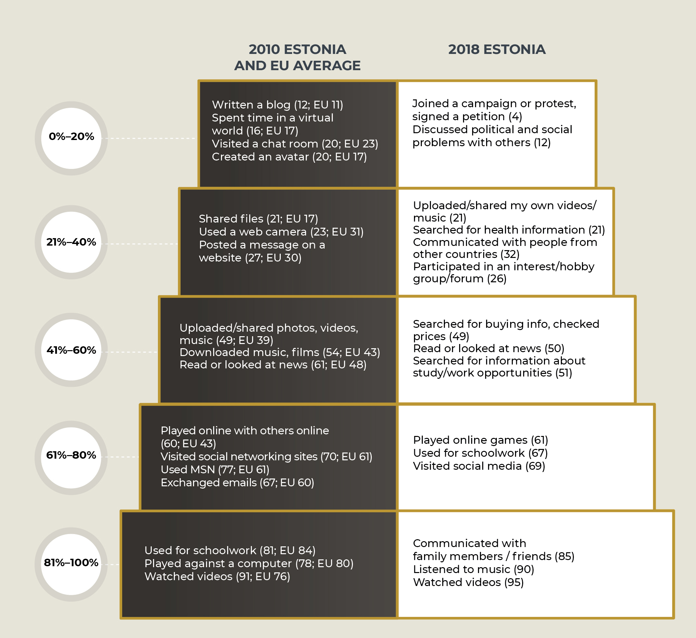
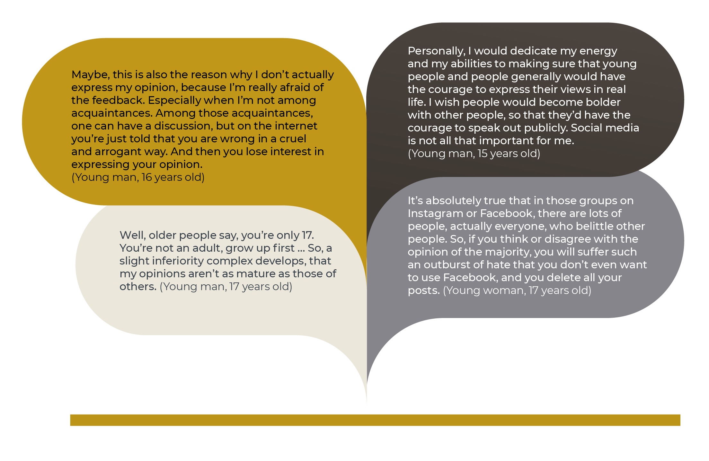

## Estonian youth in the virtual opinion space {.chapter_section .chapter4_section}

```{block, type='authors'}
<div class="author-links">**[Veronika Kalmus](#veronika-kalmus) ja [Andra Siibak](#andra-siibak)**</div>
<div><a class="print-btn" href="print/EIA-2019-4.2.pdf"><i class="fa fa-file" aria-hidden="true"></i>Trükiversioon</a></div>
```

```{block, type='points'}
* Estonian youth are active users of the internet: there is no significant digital stratification among them, their online activities are diverse, and the assessment of their digital skills is good. And yet, the participation of Estonian youth in community life and politics online or through social media is modest. Moreover, at times, young people are critical of the virtual opinion space. Democratic and political participation, in its narrow and traditional sense, does not attract young people and this is not made any more attractive by the virtual opinion space. Instead, they are willing to contribute and participate in areas of activity close to their hearts, for example, as volunteers.
```

```{block, type='blockquote-right'}
Digital participation – participation in civil society and politics through the internet and social media.
```
Political and civic participation is seen as the foundation of a viable democracy and a well-functioning public space. At a time when almost all democratic countries are experiencing deepening alienation in regard to politics conducted by institutions (including political parties), especially among the younger generation, great hope is being placed on the growth of digital participation and the development of virtual opinion spaces. In this chapter, we will take a look at how actively Estonian children and youth take advantage of the opportunities of digital participation and what the preconditions and obstacles are for the further development of the virtual opinion space. Survey data collected in 2010–2018 enable us to analyse trends in the development of internet use and digital content among the younger Estonian generation and place them in an international reference context. In addition, qualitative studies provide an opportunity to understand the problems of digital participation from a youth perspective and to look at the future.

### Estonian children use the internet daily {-.chapter4_section}

Participation in the virtual opinion space requires that digital environments are taken as a given and accessible to everyone. Aiming for a more informed and safer use of the internet by children, EU Kids Online, a network of academics from 33 countries, has been researching the main trends in the internet use of European children, including those in Estonia, for the last 10 years. In 2010 and 2018, within the framework of the EU Kids Online project, Turu-uuringute AS Eesti interviewed 1,000 internet users aged 9 to 16 (9 to 17 in 2018) at home, based on a representative sample of all Estonian regions.

The internet has become an integral part of the daily lives of Estonian children – while in 2010, 82% of Estonian children aged 9 to 16 visited the internet daily or almost daily, in 2018, as many as 97% of 9- to 17-year-olds accessed the internet on at least one device every day ([Sukk and Soo 2018](#Sukk-Soo2018)).

```{block, type='blockquote-left'}
Digital stratification – inequality based on gender, ethnicity, age or place of residence.
```
The increase in the usage rate is undoubtedly explained by the significantly better availability of mobile devices. In 2010, 31% of Estonian children accessed the internet by phone. By 2018, this number had tripled: 93% of respondents accessed the internet via mobile or smart phone at least once a month, and 86% did so almost daily or more often. Other devices were used less frequently by children: of Estonian 9- to 17-year-olds, a desktop or laptop computer is almost a daily tool for 43%, and a tablet for only 15%.

```{block, type='blockquote-right'}
There is no significant digital stratification among children in accessing the internet and accessing smart devices.
```
Estonian children spend a significant number of their waking hours on the internet. On ordinary school days, a large number of 9- to 17-year-olds (41%) spend about 2 to 3 hours on the internet, while 26% spend 4 to 5 hours or more ([Sukk et al. 2018](#Sukk2018)). On non-school days, the time spent on the web increased considerably: on weekends and during school holidays, almost half the children spend 4 to 5 hours or more a day on online activities ([Figure 4.2.1](#figure421)). This extensive internet usage is typical of most boys, children who speak Russian at home, and 13- to 17-year-olds.

<p class="caption" id="figure421"><span class="figure-number">Figure 4.2.1.</span> Time spent on the internet during non-school days, 2018 (%)</p>

Survey question: About how much time do you spend on the internet during the days when you don’t go to school (e.g. weekends, school holidays)? Base: all children (N=1,020).

```{r, figure421, fig.asp=.75, fig.align='center', echo=FALSE, message=FALSE, warning=FALSE}

library("tidyverse")
library("scales")


 fig421_data <- read.csv ("../data/42_fig1_data.csv", header=TRUE, fileEncoding="utf-8")

fig421_data$group_eng[grepl("Kõik lapsed",  fig421_data$group)]<-"All children"
fig421_data$group_eng[grepl("Poisid",  fig421_data$group)]<-"Boys"
fig421_data$group_eng[grepl("Tüdrukud",  fig421_data$group)]<-"Girls"
fig421_data$group_eng[grepl("9-10 a",  fig421_data$group)]<-"9 to 10 yrs"
fig421_data$group_eng[grepl("11-12 a",  fig421_data$group)]<-"11 to 12 yrs"
fig421_data$group_eng[grepl("13-14 a",  fig421_data$group)]<-"13 to 14 yrs"
fig421_data$group_eng[grepl("15-17 a",  fig421_data$group)]<-"15 to 17 yrs"
fig421_data$group_eng[grepl("Eesti",  fig421_data$group)]<-"Estonian"
fig421_data$group_eng[grepl("Vene",  fig421_data$group)]<-"Russian"
 
 fig421_data$group_eng <- factor(fig421_data$group_eng, levels = c("Russian","Estonian","15 to 17 yrs","13 to 14 yrs","11 to 12 yrs","9 to 10 yrs","Girls","Boys","All children"))
 
 
  fig421_data$answer <- factor(fig421_data$answer, levels = c("Ei taha öelda","Ei oska öelda","Umbes 6 tundi või rohkem","Umbes 4-5 tundi","Umbes 2-3 tundi","Umbes 1 tund või vähem"))

    fig421_data$text_position <- fig421_data$value

    fig421_data$text_position[which(fig421_data$text_position == 0)] <- NA

  fig421_plot <- ggplot(data = fig421_data) +
    geom_bar(mapping = aes(x=group_eng, y=value, fill=answer), width=0.6, stat="identity") +
    geom_text(mapping = aes(x=group_eng, y=text_position, label=round(text_position, digits=0)), stat="identity", color="white", position = position_stack(vjust = .5)) +
    coord_flip() +
     scale_fill_manual(values=c("#86858A","#A8ACA6","#5E4A0C","#8D6F11","#BC9417","#C9A945"), labels=c("Don’t want to say","Don’t know","6 hours or more","4 to 5 hours","2 to 3 hours","Up to 1 hour")) +
    labs(y="%", x="") +
      scale_x_discrete(labels = wrap_format(30)) +
    guides(fill = guide_legend(reverse = TRUE))

  fig421_theme <- theme(
                    panel.grid.major.y = element_blank() ,
                     panel.grid.minor.y = element_blank(),
                    text = element_text(family="Montserrat"),
                 )

print(fig421_plot + fig_theme_general+ fig421_theme)

#ggsave(path="exported_figures/PDF/chapter4",filename="fig421.pdf", height=200, width=200, units="mm")

```

``` {block, type='imgsource'}
<div><span class="imgsource-source">Source:</span> EU Kids Online Estonian survey 2018; Sukk and Soo 2018.</div>
<div><a class="data-btn" href="../data/42_fig1_data.csv"><i class="fa fa-download" aria-hidden="true"></i>Download data</a></div>
```

Daily internet use is a precondition for participating in a virtual opinion space. However, truly active participation is facilitated by a high level of digital inclusion; that is, the largest possible number of young people being able to avail themselves of the entire range of digital opportunities, which means reaching the higher, or more advanced, steps on the ladder of internet opportunities. If on the lower steps of the ladder, the online activities are related to information searches, communication and entertainment, and do not require any special digital skills, then operating at higher levels requires both additional competence and motivation ([Livingstone and Helsper 2007](#Livingstone2007); [Pruulmann-Vengerfeldt and Runnel 2012](#Pruulmann-Vengerfeldt2012)) and only a small portion of the children (less than 50%) reach these levels. [Figure 4.2.2](#figure422) shows that both creative activities (e.g. maintaining a blog or website) as well as those involving digital participation (e.g. signing petitions) are located at the higher, or more advanced, levels.

<div class="casebox">
<p class="caption" id="figure422"><span class="figure-number">Figure 4.2.2.</span> Steps on the ladder of children’s digital inclusion, 2010 and 2018 (% of children engaged in online activities)</p>

Survey question: How often did you do the following on the internet during the last month (30 days)? Base: all children (N=1,020). Explanation: the activity is assigned to a step on the ladder based on the percentage of users in the given year.
```{r, figure422, out.width='90%',, fig.align='center', echo=FALSE, message=FALSE}



```
</div>
``` {block, type='imgsource'}
<span class="imgsource-source">Source:</span> EU Kids Online survey 2010; 2018.
```

Based on the data from the EU Kids Online survey for 2010, Estonian children were distinguished by a relatively high level of using online opportunities compared to Europe generally. For example, Estonian children exceeded the European average when it came to reading the news. However, at the same time, in regard to creative and participatory activities (e.g. keeping a blog, posting messages on a website), they were close to the EU average ([Figure 4.2.2](#figure422)). Estonia, along with the Czech Republic, Sweden, the Netherlands and Cyprus, is one of the few countries where a small number of children (up to 5%) only used the internet for two or less activities ([Pruulmann-Vengerfeldt and Runnel 2012](#Pruulmann-Vengerfeldt2012)).

Based on 2018 data, the proportion of children engaged in entertainment and communication activities has increased ([Figure 4.2.2](#figure422)). On the other hand, using the internet for school work and news monitoring is less common among Estonian children than it was eight years ago. Creative and participatory activities continue to be atypical. And, in the month prior to the survey, only 12% of Estonian children corresponded to the advanced level; that is, discussed political or social problems on the internet.

### Children’s digital literacy is improving {-.chapter1_section}

```{block, type='blockquote-right'}
Creative and participatory activities continue to be atypical. For example, in the month prior to the survey, only 12% of Estonian children corresponded to the advanced level; that is, discussed political or social problems on the internet.
```
Young people can make the most of the opportunities provided by technology only if they have the corresponding competence (i.e. digital literacy) to use the technology in the most versatile way possible and manage the potential risks.

According to the EU Kids Online 2010 survey, Estonian children claimed they could cope with an average of five digital literacy activities (of the eight under examination). This result puts them in fourth place after children in Finland, Slovenia and the Netherlands ([Livingstone et al. 2011](#Livingstone2011)).

```{block, type='blockquote-left'}
Eesti noored hindavad oma digitaalset kirjaoskust väga heaks ning tunnevad end eri veebitegevustes üldjuhul enesekindlalt.
```
Today, Estonian children can use the internet even more skilfully: the 2018 results for Estonia in the EU Kids Online survey show ([Figure 4.2.3](#figure423); also see [Sukk and Soo 2018](#Sukk-Soo2018)), that the majority of the 13- to 17-year-olds who participated in the study know how to open a new tab in their web browser (93%), find the websites they have recently visited again (92%), open downloaded files (92%) and use privacy settings in order to restrict who can see the content they share on the internet (90%). Young people are much more uncertain about topics related to copyright and restrictions on use (78% consider themselves to be competent); and not everyone feels they are able to assess the reliability of websites (74%). Activities related to content creation cause the greatest difficulties for young people – 36% of the 13- to 17-year-olds who participated claimed they are able to create websites, and 19% were able to use programming languages.

### Digital participation does not appeal to Estonian youth {-.chapter4_section}

According to earlier studies, the internet is the main news source for Estonian young people ([Allaste et al. 2018](#Allaste2018)). The data from the EU Kids Online Estonia 2018 survey shows that about a quarter of 13- to 17-year-olds follow the news every day on some channel (65% do so less often). Young people tend to trust most news; less than 20% have doubts about the reliability of news.

```{block, type='blockquote-left'}
Young people also participate in the news feed by sharing, rating and commenting, but only half of them do so.
```
Compared to social media, traditional news channels are of more help for young people in screening out what is false or fictional, and fake news: approximately half the 13- to 17-year-olds find that newspapers, radio and TV help them separate fact from fiction, while slightly less than a third trust social media in this regard. Of the social media channels, young people prefer YouTube for reading and sharing news – 78% of 13- to 17-year-olds used this channel during one week. This was followed by Facebook (70%), Facebook Messenger (57%), Instagram (56%) and Snapchat (49%).

Young people also participate in the news feed by sharing, rating and commenting, but only half of them do so. More typically, they talk about some news item with friends and schoolmates face-to-face (this is usually done weekly by 45% of 13- to 17-year-olds); some online channels are used less often to talk about the news (38%). Liking and rating news on social media is quite popular, and is done by 43%, as is sharing news on Messenger (32%). Only 20% of the youth comment on the news on social media every week, and only 5% add comments on news portals.

Qualitative studies on the digital participation of young people give us an idea of what is behind the relatively low participation rates. For example, focus group interviews with 15- to 18-year-olds revealed that being too active (e.g. on social media) tends to devalue the topic of the post for the online audience, and therefore the person posting is also presented in a bad light ([Sukk 2018](#Sukk2018)).

<p class="caption" id="figure423"><span class="figure-number">Figure 4.2.3.</span>  Digital skills among Estonian 13- to 17-year-olds 2018 (%)</p>

Survey question: To what extent do the following statements apply to you?
Base: all 13- to 17-year olds (N=528).

```{r, figure423, out.width='100%', fig.asp=1.25, fig.align='center', echo=FALSE, message=FALSE}

library("tidyverse")
library("scales")
library("dplyr")


 fig423_data <- read.csv ("../data/42_fig3_data.csv", header=TRUE, fileEncoding="utf-8")

    fig423_data$cumsum <- ave(fig423_data$value, fig423_data$question, FUN=cumsum)

    fig423_data$text_position_temp <-(fig423_data$value - 0.5*fig423_data$value)
    fig423_data$text_position <- 100 - fig423_data$cumsum +  fig423_data$text_position_temp
    fig423_data$text_position[which(fig423_data$text_position == 0)] <- NA

    fig423_data$question_eng[grepl("Mõnikord leian end veebilehtedelt teadmata, kuidas ma sinna sattusin",  fig423_data$question)]<-"Sometimes I find myself on websites without knowing how I got there"
    fig423_data$question_eng[grepl("Ma oskan kasutada programmeerimiskeeli",  fig423_data$question)]<-"I know how to use programming languages (e.g. Python, C++)"
    fig423_data$question_eng[grepl("Ma oskan luua kodulehte",  fig423_data$question)]<-"I know how to create a website"
    fig423_data$question_eng[grepl("Ma oskan luua internetist leitud videotest või muusikast midagi uut",  fig423_data$question)]<-"I know how to create something new from videos or music found online"
    fig423_data$question_eng[grepl("Minu jaoks on lihtne teha kindlaks, kas veebilehte saab usaldada",  fig423_data$question)]<-"I find it easy to determine whether a website can be trusted"
    fig423_data$question_eng[grepl("Ma tean, millised erinevad kasutuspiirangud ja autoriõigused kehtivad internetis leiduvatele materjalidele",  fig423_data$question)]<-"I know what restrictions on use and copyrights apply to online material"
    fig423_data$question_eng[grepl("Ma tean, millises olukorras ma peaksin jagama infot internetis ja millises mitte",  fig423_data$question)]<-"I know when I should and should not share information online"
      fig423_data$question_eng[grepl("Ma oskan internetis käituda olukorrale vastavalt",  fig423_data$question)]<-"I know how to behave appropriately online"
      fig423_data$question_eng[grepl("Ma oskan kasutada klahvikombinatsioone",  fig423_data$question)]<-"I know how to use keyboard shortcuts (e.g. Ctrl + C to copy)"
      fig423_data$question_eng[grepl("Ma oskan avada allalaaditud faile",  fig423_data$question)]<-"I know how to download and open files"
      fig423_data$question_eng[grepl("Ma tean, kuidas seada piiranguid, kes internetis minu infot näevad",  fig423_data$question)]<-"I know how to set restrictions on who can see my online information (e.g. friends, friends of friends or all users)"
      fig423_data$question_eng[grepl("Minu jaoks on lihtne leida veebilehte, mida olen hiljuti külastanud",  fig423_data$question)]<-"It is easy for me to find a website I have visited recently"
      fig423_data$question_eng[grepl("Ma oskan avada uut vahelehte internetibrauseris",  fig423_data$question)]<-"I know how to open a new tab in my internet browser"
      

 fig423_data$question_eng <- factor(fig423_data$question_eng, levels = c("Sometimes I find myself on websites without knowing how I got there","I know how to use programming languages (e.g. Python, C++)","I know how to create a website","I know how to create something new from videos or music found online","I find it easy to determine whether a website can be trusted","I know what restrictions on use and copyrights apply to online material","I know when I should and should not share information online","I know how to behave appropriately online","I know how to use keyboard shortcuts (e.g. Ctrl + C to copy)","I know how to download and open files","I know how to set restrictions on who can see my online information (e.g. friends, friends of friends or all users)","It is easy for me to find a website I have visited recently","I know how to open a new tab in my internet browser"))

  fig423_data$answer <- factor(fig423_data$answer, levels = c("Ei oska öelda","Vastab täielikult tõele","Pigem vastab tõele","Ei üks ega teine","Pigem ei vasta tõele","Ei vasta üldse tõele"))


  fig423_plot <- ggplot(data = fig423_data) +
    geom_bar(mapping = aes(x=question_eng, y=value, fill=answer), width=0.5, stat="identity") +
    geom_text(mapping = aes(x=question_eng, y=text_position, label=round(value, digits=0)), stat="identity", color="white") +
     scale_fill_manual(values=c("#A8ACA6","#E4D4A2","#C9A945","#BC9417","#8D6F11","#5E4A0C","#2F2506"), labels=c("Don’t know","Completely true","Rather true","Neither","Rather not true","Not true at all")) +
    coord_flip() +
    labs(y="%", x="") +
    scale_x_discrete(labels = wrap_format(28)) +
     guides(fill = guide_legend(reverse = TRUE))

    fig423_theme <- theme(
      text = element_text(color = "#292b2c", size = 10, family="Montserrat"),
      axis.text.y = element_text(size=8),
      panel.grid.major.y = element_blank() ,
      panel.grid.minor.y = element_blank(),
  )

print(fig423_plot + fig_theme_general + fig423_theme)

#ggsave(path="exported_figures/PDF/chapter4",filename="fig423.pdf", height=230, width=170, units="mm")

```

``` {block, type='imgsource'}
<div><span class="imgsource-source">Source:</span> EU Kids Online Estonian survey 2018; Sukk and Soo 2018.</div>
<div><a class="data-btn" href="../data/42_fig3_data.csv"><i class="fa fa-download" aria-hidden="true"></i>Download data</a></div>
```

At the same time, the young people who participated in the focus groups considered it important that the development of digital technologies has opened up many opportunities for making changes in the world. Campaigns that have been started on social media (e.g. #MeToo, where sexually abused or assaulted people posted stories based on their experiences) encourage people to communicate their experiences and make their voices heard. At the individual level, young people found that such campaigns can create opportunities to find like-minded people and generate positive emotions. And in the social context, they can help break obsolete taboos and raise awareness ([Sukk 2018](#Sukk2018)).

### Types of civic participation among Estonian youth {-.chapter4_section}

```{block, type='blockquote-left'}
One of the most popular forms of digital participation among Estonian youth is sharing political news, music and videos on social networks. More than a third of Estonian young people at least sometimes participated in this activity.
```
Digital participation is traditionally viewed as being part of general political and civic engagement. Within the framework of the international research project called CATCH-EyoU (2015–2018), financed by EU Horizon 2020, the social activity of young people was studied in eight European countries, including Estonia. The analysis showed that young people in Estonia participate moderately in community life. Less than half of the 15- to 30-year-old Estonian respondents surveyed in 2016 (N = 1002) had participated in most of the 18 political and civic activities that were studied. However, among the 18 activities, one of the most popular was sharing political news, music or videos on social networks. More than a third of the young people had at least sometimes participated in this activity ([Kalmus and Beilmann 2017](#Kalmus2017)). Two forms of participation were distinguished when clustering the young people – voluntary benefactors and digital activists. Belonging to these types is facilitated by a more empowering social environment – being a member of the ethnic majority, living in a large city or its surroundings, belonging to a more democratic family, and having a more educated mother. There are very few politically minded activists involved in many participatory activities, and many young people are passive.


```{block, type='casebox'}
<h3> Civic participation among Estonian youth</h3>

**Politically minded activists (5.5%) engage more than average in political activities, online participation and volunteer work. They tend to be secondary school students. More are young men, while Estonian and Russian youths are equally involved. They tend to come from the country or small towns, and their mothers more often than not do not have a secondary education. Compared to the other types, they have less trust in professional journalism, and more in alternative online media.

**Voluntary benefactors (30%) stand out due to their volunteer and charity work. They tend to be in their 20s, and there are more young women than men. The majority are Estonian, come from large cities or their surroundings, and their mothers tend to have a secondary or higher education. They have more trust in professional journalism than the other types, and less trust in alternative online media.

**Digital activists (27.6%) engage in the most online and consumer activities. They tend to be in their 20s, and there are slightly more young men. Most of them are Estonian and come from large cities and their surroundings. Their mothers more often have a higher education. Digital activists place less trust in online media than the other types.

**Passive young people (36.8%) are less active than the average in all forms of participation. They tend to be secondary school students, and almost an equal number of males and females. They tend to come from the country or small towns. Most of their mothers have a secondary education or less. Their families and friends are not very socially active.

```

``` {block, type='imgsource'}
<span class="imgsource-source">Source:</span> Kalmus and Beilmann 2017.
```

### Factors hindering the digital participation of young people {-.chapter4_section}

```{block, type='blockquote-right'}
The lack of any perceived societal impact of digital participation and the lack of a reasoned communication culture strongly inhibits the motivation of young people to participate in online discussions.
```

Qualitative studies ([Sukk 2018](#Sukk2018)) also show that young people act mostly as passive observers in online groups and forums, and do not tend to raise topics or express their opinions. In fact, in the focus group interviews with 15- to 18-year-olds (n=20) conducted in spring 2018 for the European Institute for Gender Equality, it became evident that many of the participants in the study consider digital tools to be unnecessary in the context of participation, and at times, even a barrier to such participation. The reasons for a lower than average rate of digital participation among young people included issues related to the platform (such as anonymity, privacy risks, lack of body language, and limited ability to express emotions) as well as personal barriers ([Sukk 2018](#Sukk2018)). For example, many of the young people who participated in the focus groups admitted they avoid expressing opinions online because they feel insecure and afraid of negative reactions and condemnation by other, mainly older, users. Many of the young people participating in the study admitted that they have refrained from speaking out on various topics online because they do not believe that expressing their opinions online or participating in online campaigns will actually bring about the expected real change. According to young people, when interacting in online environments, they discern the lack of a polite and reasoned communication culture, and therefore their own wish to be actively involved in the debate is severely inhibited.

<p class="caption" id="figure424"><span class="figure-number">Figure 4.2.4.</span> Factors inhibiting digital participation: youth perspective</p>

```{r, figure424, out.width='100%', fig.align='center', echo=FALSE, message=FALSE}




```

``` {block, type='imgsource'}
<span class="imgsource-source">Source:</span> Sukk 2018.
```

### Young people perceive the weaknesses of the virtual opinion space {-.chapter4_section}

The EU Kids Online data enables an assessment to be made of the following: how justified the fear of condemnation and negative online experiences is for young people; and what the broader background and history is of the risks associated with online participation.

Based on the 2010 data, Estonian children stood out among their European peers in the negative sense for the very high level of bullying and cyberbullying: among Estonian 9- to 16-year-olds, 43% had suffered from bullying, and 14% from cyberbullying. Both indicators were at the absolute top among the 25 countries, and more than twice the European average ([Livingstone et al. 2011](#Livingstone2011)). At that time, cyberbullying occurred most often in social networks or instant messaging programs (like Messenger), and less often by email or in chat rooms. Cyberbullying occurred more often in countries where face-to-face bullying was more common ([Livingstone et al. 2011](#Livingstone2011)) therefore, we could conclude that cyberbullying expresses deeper social problems and not changes in children’s behaviour that were caused by new technology. In addition, in 2010, compared to other countries, Estonia was in second place after Denmark when it came to children who had experienced some online risk (more than 60%); and the proportion of children who had been disturbed by something on the internet, or been harmed online (25%) ([Kalmus 2013](#Kalmus2013)).

During the last eight years, the number of negative online experiences among Estonian children has remained at the same level for some indicators, but has decreased in some respects. The percentage of those who have been harmed online has not significantly declined: 22% of the 9- to 17-year-olds who participated in the EU Kids Online Estonia survey in 2018 claimed they had been disturbed by or worried about something they experienced online during the past 12 months. The suffering from general bullying has decreased significantly: according to the 2018 data, less than one-quarter (23%) of the children had experienced bullying in the last 12 months. However, the incidence of cyberbullying has not declined: 15% of the children had experienced it at least a few times during the year.

In addition, more than one-tenth (13%) of the Estonian children who participated in the 2018 survey admitted that they themselves had bullied someone during the last 12 months; 5% admitted they had done so online or by phone. The widespread proliferation of cyberbullying is also reflected in the large number of eyewitnesses: according to the data from 2018, 40% of Estonian 11- to 17-year-olds have witnessed cyberbullying.

```{block, type='blockquote-left'}
The widespread proliferation of cyberbullying is also reflected in the large number of eyewitnesses: according to the data from 2018, 40% of Estonian 11- to 17-year-olds have witnessed cyberbullying.
```

Cyberbullying mainly consists of sending nasty or offensive messages – these have been received by 58% of the children who have been bullied online or by phone. It is this form of cyberbullying, along with exclusion from a group or activity (which 28% of cyberbullying victims have suffered), that can negatively impact on young people’s desire and perceived ability to have a say in the digital space. In addition, young people’s digital participation can be inhibited by exposure to negative online content. For example, according to 2018 data, 35% of Estonian 9- to 17-year-olds had encountered angry messages in the digital space that attack certain individuals or groups.

A role in shaping the digital opinion space is definitely played by how safe and trustworthy the young people feel the internet is. The EU Kids Online 2018 survey shows that slightly more than three-quarters of the children (77%) always, or often, feel safe online, while 5% of children never feel safe. However, most respondents believe they know what to do if someone behaves inappropriately online, and slightly more than half of the children find that people in the digital space tend to be kind and helpful.

### Summary {-.chapter4_section}

During the last eight years, there has been a significant increase in the frequency of internet use by Estonian children and young people: the majority of young people use the internet daily, and spend hours in the vast expanses of the internet ([Sukk and Soo 2018](#Sukk-Soo2018)). Smartphones and mobile internet are available to almost all children. However, in many ways, the increase in internet usage due to the spread of smart phones has not led to the expected increase in digital participation; the data also do not indicate any expected growth in the near future. The digital participation of Estonian youth is not limited by geographic space, but rather by the fact that smart phones are used for other kinds of activities. On the internet, young people focus mainly on entertainment, communication and information searches, and remain on the two lowest levels (i.e. activities) of the ladder of internet opportunities – those that do not require much knowledge or digital skill. However, the lack of digital skills on the part of young people is not the reason for not having reached the top or advanced levels of the internet ladder; that is, becoming active digital citizens. Generally, Estonian youth assess their digital competence as being good, but they prefer to use the digital space for interaction and entertainment rather than as an arena for social debate.

Qualitative studies show that the reasons for young people’s modest digital participation include a lack of motivation and limited interest in weighing in on social issues online. Young people’s activity is partially inhibited by the lack of a polite and reasoned communication culture and the limited societal impact of digital participation. At the same time, young people often feel that it is more important to be involved in real-life citizens’ initiatives; for instance, participating in volunteer actions that address their interests. However, studies ([e.g. CATCH-EyoU – Kalmus and Beilmann 2017](#Kalmus2017)) show that young people are mostly involved in civic and political activities to a limited extent. Therefore, in many ways, young people prefer to remain moderately active bystanders in the virtual opinion space and do not tend to take full advantage of the digital space or contribute to improving it.

The development of a virtual opinion space could be facilitated by successive civic or political initiatives that could produce real results; for example, success stories and legendary campaigns related to the topics that are close to the hearts of as many people as possible (figuratively speaking: a virtual phosphorite war or Baltic Chain on Facebook). Undoubtedly, a much more effective management of cyberbullying and an improvement in the overall communication culture would also be beneficial. However, short-term campaigns will not be sufficient – it is important to continue raising awareness, developing zero tolerance for cyberbullying among young people, and develop resilience and coping skills when experiencing or witnessing cyberbullying. The role played by adult digital citizens in developing a culture of opinion, and at the very least, elementary courtesy regarding the contributions of young digital citizens is also crucial.

### *Acknowledgements* {-.chapter4_section}
*Between 2006 and 2014, the EU Kids Online project was funded by the European Commission through the Safer Internet Programme. The EU Kids Online 2018 Estonian survey was funded by Estonian Internet Foundation, Ministry of Education and Research (from the European Social Fund), Ministry of Justice, Ministry of Social Affairs, and research projects PUT 44 (Estonian Research Council) and IUT 20-38 (Ministry of Education and Research).*

### References {-.subreferences}
<p id="Allaste2018">Allaste, A.-A., Beilmann, M., Tiidenberg, K. 2018. Digitaalne osalus – Noorteseire aastaraamat 2017–2018. Noored ja osalus. Tallinn: Eesti Noorsootöö Keskus, Tallinna Ülikool, 119–139.</p>

<p id="Kalmus2013">Kalmus, V. 2013. Laste turvalisus uues meediakeskkonnas – Heidmets, M. (ed.). Eesti inimarengu aruanne 2012/2013. Eesti maailmas. Tallinn: Eesti Koostöö Kogu, 83–85.</p>

<p id="Kalmus2017">Kalmus, V., Beilmann, M. 2017. Mis tüüpi kodanikud on Eesti noored? – Mihus, 21, 13−14.</p>

<p id="Livingstone2011">Livingstone, S., Haddon, L., Görzig, A., Ólafsson, K. 2011. Risks and safety on the internet: the perspective of European children: full findings from the EU Kids Online survey. London: London School of Economics and Political Science.</p>

<p id="Livingstone2007">Livingstone, S., Helsper, E. 2007. Gradations in digital inclusion: children, young people and the digital divide – New Media & Society, 9 (4), 671–696.</p>

<p id="Pruulmann-Vengerfeldt2012">Pruulmann-Vengerfeldt, P., Runnel, P. 2012. Online opportunities – Livingstone, S., Haddon, L., Görzig, A. (eds.). Children, risk and safety on the internet: research and policy challenges in comparative perspective. Bristol: Policy Press, 73–85.</p>

<p id="Sukk2018">Sukk, M. 2018. Online-osalus ja mitte-osalus: Eesti noorte arvamused ja kogemused. MA thesis. University of Tartu.</p>

<p id="Sukk-Soo2018">Sukk, M., Soo, K. 2018. EU Kids Online’i Eesti 2018. aasta uuringu esialgsed tulemused – Kalmus, V., Kurvits, R., Siibak, A. (eds.). Tartu: Tartu Ülikooli Ühiskonnateaduste Instituut.</p>
