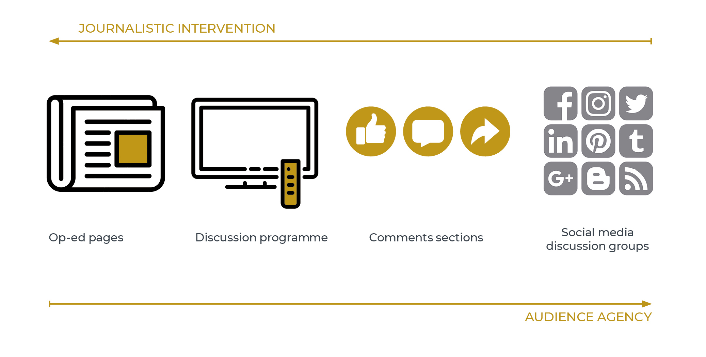
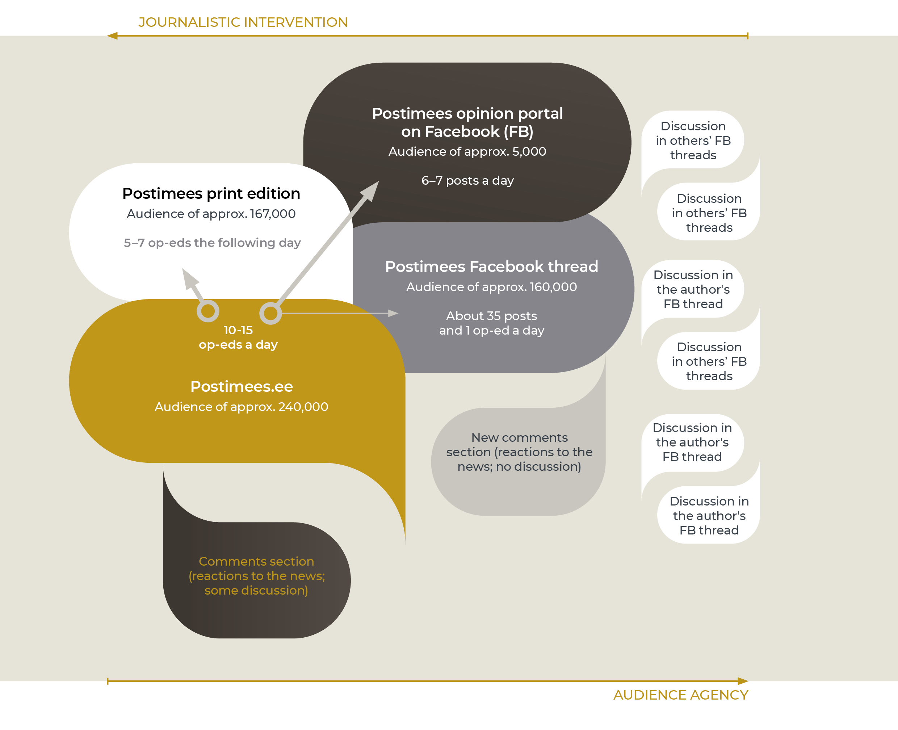

## The deliberative space shaped by the press {.chapter_section .chapter4_section}

```{block, type='authors authors_eng'}
<div class="author-links">**[Ragne Kõuts-Klemm](#ragne-kõuts-klemm)**</div>
<div><a class="print-btn" href="../ajakirjanduse-kujundatav-arvamusruum.html">EE</a></div>
```

```{block, type='points'}
* The possibilities for the press to shape the public sphere have been reduced and the role and responsibility of other actors – the audience, specific interest groups and global platforms – have increased.
```

The relationship between the press and the deliberative space in the 21st century is more complicated than ever before. The opportunities for the press to shape the public sphere have changed; the development of a common information space has become more complicated, as has supporting a unifying self-image among the population and supporting deliberative communication. The public deliberative space itself is also more diverse, and includes totally public, semi-public and closed spaces for the general public. Actors whose opinions had yet to reach the public can now participate in deliberative spaces that have been amplified by the internet. Assessing whether these changes are positive or negative is complicated. However, based on international assessments of the freedom of the press and opinion, it seems that the situation in Estonia is worsening – we have dropped into the teens in the rankings regarding the freedom of the press ([Figure 4.3.1](#figure431)). This situation can be explained by a reduction in the resources available for the press and its ability to act without economic or political interference ([Vihalemm 2013](#Vihalemm2013)), in order to provide truthful, comprehensive, and honest information about what is going on in society, as formulated as its task in the Estonian Code of Ethics for the Press. The index indicates that the situation is worsening for the press, as there are both verbal and actual attacks on journalists, media organisations, and the freedom of expression or advocates in the country. Estonian journalists have also reported threats to their lives and well-being in recent years. The decrease in editorial autonomy in one of the largest media groups in Estonia and the reduced job security of journalists due to unexpected layoffs have also led to a decrease in press freedom.

<p class="caption" id="figure431"><span class="figure-number">Figure 4.3.1.</span> The change in Estonia’s position in assessments of the freedom of the press over 15 years compared to Finland and Latvia</p>
<div class="desktop-plot">
```{r, figure431, out.width='90%', fig.asp=.75, fig.align='center', echo=FALSE, message=FALSE}

library("tidyverse")

 fig431_data <- read.csv ("../data/43_fig1_data.csv", header=TRUE, fileEncoding="utf-8")

 fig431_data$position_eng[grepl("3. koht",   fig431_data$position)]<-"3rd place"
 fig431_data$position_eng[grepl("12. koht",   fig431_data$position)]<-"12th place"
 fig431_data$position_eng[grepl("14. koht",   fig431_data$position)]<-"14th place"
 fig431_data$position_eng[grepl("24. koht",   fig431_data$position)]<-"24th place"
 fig431_data$position_eng[grepl("50. koht",   fig431_data$position)]<-"50th place"
 
 fig431_data$country_eng[grepl("Eesti",   fig431_data$country)]<-"Estonia"
 fig431_data$country_eng[grepl("Läti",   fig431_data$country)]<-"Latvia"
 fig431_data$country_eng[grepl("Soome",   fig431_data$country)]<-"Finland"
 
fig431_data$country_eng <- factor(fig431_data$country_eng, levels = c("Finland","Estonia","Latvia"))


 fig431_plot <- ggplot(data = fig431_data) +
    geom_text(mapping = aes(x=year, y=as.numeric(value), label=position_eng), stat="identity", vjust=-0.3) +
    geom_line(mapping = aes(x=year, y = as.numeric(value), colour=country_eng, group=country_eng, text = paste("", country_eng,
                         "<br>", value)), size=0.75) +
    scale_colour_manual(values=c("#3A404A","#BC9417","#A8ACA6")) +
    scale_y_reverse(breaks=c(0,5,10,15,20,25,30,35,40,45,50,55)) +
    scale_x_continuous(breaks=c(2004,2006,2008,2010,2012,2014,2016,2018)) +
    labs(y="", x="")

   fig431_theme <- theme(
        text = element_text(family="Montserrat"),
  )

ggplotly(fig431_plot + fig_theme_general + fig431_theme, tooltip = "text") %>%
config(displayModeBar = F, collaborate = F)   %>% 
layout(legend = list(orientation = "h",y = 1.15)) %>% 
layout(xaxis = list(fixedrange = TRUE)) %>%
layout(yaxis = list(fixedrange = TRUE))

  #ggsave(path="exported_figures/PDF/chapter4",filename="fig431.pdf", height=140, width=210, units="mm")
```
</div>

<div class="mobile-plot">
```{r, out.width='100%', fig.asp=.75, fig.align='center', echo=FALSE, message=FALSE, warnings=FALSE}

  print(fig431_plot + fig_theme_general + fig431_theme)

```
</div>
```{block, type='imgsource'}
<div><span class="imgsource-source">Source:</span> Reporters without Borders 2018.</div>
<div><a class="data-btn" href="../data/43_fig1_data.csv"><i class="fa fa-download" aria-hidden="true"></i>Download data</a></div>
```

Diverse, inclusive and reasoned debate is a prerequisite for a democratic society and a guarantee of its continuation – the basic principles and rules of our common life and the best way of reacting to the challenges of a changing world are debated in our public deliberative space.

```{block, type='blockquote-left'}
Diverse, inclusive and reasoned debate is a prerequisite for a democratic society and a guarantee of its continuation
```

The primary position of this article is that the opportunities for the press to shape the public sphere have declined and the role and responsibility of other actors (e.g. the audience, specific interest groups and technology controlled by large global corporations) has increased. Studies of the content of the Estonian-language press, its editorial processes and media reception over the past decade indicate these changes. In this article, I have synthesised the results of smaller qualitative and quantitative studies conducted at the University of Tartu, and also included observations from international studies regarding the situation in Estonia and Europe. I answer the following questions in the article:


1) What is the debate like in the deliberative space controlled by the press – in newspapers and news portals?

2) How do online news comments sections impact the deliberative space shaped by the press?

3) What opportunities and problems has social media introduced into the deliberative space shaped by the press?

Viewed from the position of the press, the public deliberative space includes various areas with control potential; for example, the editor is the one who chooses the op-ed articles for a daily newspaper. However, the discussion in the Riigikogu is virtually beyond the media’s control. And yet, it cannot be denied that the press may have an indirect impact. In those parts of the opinion space that are outside the scope of press intervention, it is agency – the willingness, involvement and debating skills of individuals and interest groups – that shapes the opinion space. In the case of the internet, the technological possibilities and restrictions of various environments are also significant.

```{block, type='blockquote-left'}
Agency is the ability to act in specific socio-political contexts.
```

The development of the internet has been accompanied by an empowerment of the audience – this means that members of the audience, alone and with others, can be more visible on internet platforms and can realise their communication goals independently. It is social media, as a predominantly online discussion environment, that was expected to democratise the discussion culture. However, the expansion of the deliberative space has resulted in many unwanted phenomena, such as online hostility, increased manipulation of the audience, and the polarisation of public attitudes. Media researchers have been particularly surprised by the emergence of net aggression in uncontrolled editorial environments, where many hostile, defamatory and insulting statements about various individuals accumulate. The press has not had enough money, knowledge or skills to counter these processes.

If we view the power of the media and audience to act – or their agency – in the public opinion space as in a field of tensions, an inverse relationship appears: as the ability of the audience to act without interference increases, the capability of the press to exert control and operational capability decreases ([Figure 4.3.2](#figure432)).

<p class="caption" id="figure432"><span class="figure-number">Figure 4.3.2.</span> The opportunities for the press and the audience to control the opinion space on various media platforms</p>

```{r, figure432, out.width='100%', fig.align='center', echo=FALSE, message=FALSE}


```

``` {block, type='imgsource'}
<span class="imgsource-source">Source:</span> Figure by the author.
```

### Media control of the opinion space in traditional media channels {-.chapter4_section}

Based on professional agreements and roles, the assignment of professional journalism is to shape the deliberative space in a way that important events and processes affecting the country, culture, economy and society are reported on and different views are included.
The editorial staff of newspapers intervene vigorously in shaping the public opinion climate, for example, through editorials. In Estonia, editorials in the major daily newspapers usually deal with the most important topic that is covered in each issue ([Kald 2006](#Kald2006)). The editorials need not be collective creations, but generally represent the consensus of the majority of the editorial board or the steering group. In addition, the editors commission op-eds on significant topics, choose the most important and best op-eds for publication from among those that have been submitted, and keep the topic on the agenda by commissioning follow-up opinions. Ideally, editors should observe the conditions necessary for the formation of a deliberative communication as defined by German philosopher Jürgen Habermas – that the various parties get their say and the debate is diverse and balanced.

However, the circle of opinion-makers who are published on op-ed pages has tended to be rather limited. Preference is given to those who have adopted op-ed conventions or are of sufficient importance as decision-makers to have their views published. One study of Estonian-language cultural publications ([Kõuts-Klemm 2015](#Kõuts-Klemm2015)), which covered the content of various media channels over three months, showed that the following people had the most say in cultural opinion pieces and discussion programmes: experts and academics (41%), journalists and editors (34%) and intellectuals (17%). A similar pattern appears more generally in op-ed articles. The analysis of two national newspapers conducted in 2018 showed that the op-ed editors of these publications often publish academic and expert opinions. The frequent appearance of journalists themselves as opinion-makers is telling. However, in general, the views of ordinary citizens, officials and cultural figures are hardly visible ([Figure 4.3.3](#figure433)).

<p class="caption" id="figure433"><span class="figure-number">Figure 4.3.3.</span> The authors of op-eds in national Estonian-language newspapers (%)</p>
(N=485, articles that appeared on workdays during 12 randomly selected weeks in 2018).

<div class="desktop-plot">
```{r, figure433, fig.asp=.75, fig.align='center', echo=FALSE, message=FALSE}

library("tidyverse")

 fig433_data <- read.csv ("../data/43_fig3_data1.csv", header=TRUE, fileEncoding="utf-8")

  fig433_data$variable_eng[grepl("ettevõtja", fig433_data$variable)]<-"Entrepreneurs"
  fig433_data$variable_eng[grepl("ametnik", fig433_data$variable)]<-"Public servants"
  fig433_data$variable_eng[grepl("kultuuritegelane", fig433_data$variable)]<-"Cultural figures"
  fig433_data$variable_eng[grepl("kodanik", fig433_data$variable)]<-"Citizens"
  fig433_data$variable_eng[grepl("poliitik", fig433_data$variable)]<-"Politicians"
  fig433_data$variable_eng[grepl("ajakirjanik", fig433_data$variable)]<-"Journalists"
  fig433_data$variable_eng[grepl("teadlane, ekspert", fig433_data$variable)]<-"Scientists, experts"
  
  fig433_data$group_eng[grepl("Postimees", fig433_data$group)]<-"Postimees"
  fig433_data$group_eng[grepl("Eesti Päevaleht", fig433_data$group)]<-"Eesti Päevaleht"
  fig433_data$group_eng[grepl("Kokku", fig433_data$group)]<-"All"
  
  
fig433_data$group_eng <- factor(fig433_data$group_eng, levels = c("Postimees","Eesti Päevaleht","All"))
fig433_data$variable_eng <- factor(fig433_data$variable_eng, levels = c("Entrepreneurs", "Public servants","Cultural figures","Citizens","Politicians","Journalists","Scientists, experts"))

  fig433_plot <- ggplot() +
    geom_bar(data = fig433_data, mapping = aes(x=group_eng, y=value, fill=variable_eng, text = paste("", variable_eng,
                         "<br>", value,"%")), width=0.4, stat="identity") +
    scale_fill_manual(values=c("#E6E3DA","#F2EAD1","#E4D4A2","#C9A945","#BC9417","#8D6F11","#5E4A0C")) +
    scale_y_continuous(expand = c(0, 0), limits=c(0,105)) +
    expand_limits (y=0) +
    labs(y="%", x="")

  fig433_theme <- theme(
    legend.position="right",
    text = element_text(size = 12, family="Montserrat"),
    panel.grid.major.x = element_blank() ,
    panel.grid.minor.x = element_blank(),
  )

ggplotly(fig433_plot + fig_theme_general + fig433_theme, tooltip = "text") %>%
config(displayModeBar = F, collaborate = F)   %>% 
layout(legend = list(orientation = "h",y = 1.15)) %>% 
layout(xaxis = list(fixedrange = TRUE)) %>%
layout(yaxis = list(fixedrange = TRUE))

  #ggsave(path="../exported_figures/PDF/chapter4",filename="fig433.pdf", height=120, width=200, units="mm")
```
</div>

<div class="mobile-plot">
```{r, out.width='100%', fig.asp=.75, fig.align='center', echo=FALSE, message=FALSE, warnings=FALSE}

print(fig433_plot + fig_theme_general + fig433_theme)

```
</div>
``` {block, type='imgsource'}
<div><span class="imgsource-source">Source:</span> Figure by the author.</div>
<div><a class="data-btn" href="../data/43_fig3_data1.csv"><i class="fa fa-download" aria-hidden="true"></i>Download data</a></div>
```

The access of politicians to opinion media is particularly closely monitored by the editors during the election period – the editors agree upon the topics that the politicians will be asked to comment on, and the messages of all the institutionalised political forces are communicated to the public.

Ideally, the choices made by op-ed editors on how to shape discussions are based on the basic principles of professional journalism (balance, impartiality). However, the world views of the editors are also reflected in the choices. For instance, when Estonia joined the European Union, the press created a supportive background for the accession decision by presenting, in most op-ed articles, the accession as a step for which there was no alternative ([Järvet 2007](#Järvet2007)). In the case of complex topics, which have many stakeholders and a variety of interests that are both visible and hidden (e.g. the building of the Nord Stream gas pipeline ([Laev 2010](#Laev2010)), the press may fall short because it is unable to sufficiently analyse the interests and messages of the parties, and is therefore unable to make adequate decisions when communicating the reasoning. In order to delve into topics, journalists need both time and information in order to develop knowledgeable opinions.

```{block, type='casebox'}
<h3>Connecting opinion leaders</h3>

The Äripäev media company has created an image as an opinion leader by organising elite conferences aimed at decision-makers and the business community, and has also provided a deliberative space via the Äripäev radio talk shows that has been broadcast since September of 2017.

Since 2000, the Postimees newspaper has organised discussion seminars called the Opinion Leaders’ Lunch, which is attended by academics, experts and politicians, and where an annual opinion leader award is presented. In addition, Postimees publishes a weekly insert called ‘Arvamus. Kultuur’ (Opinion. Culture).

```

As internet technology has developed, it has been easier for those who have been excluded from the controlled opinion space of the press to develop their own discussion platforms. The creators of alternative media channels (e.g. Telegram, Uued Uudised, Objektiiv) see diversifying the opinion space to be their main assignment ([Saavik 2017](#Saavik2017)). Such channels are called opinionated media because they promote a certain world view (e.g. the Objektiiv portal represents a national conservative view). Alternative media have developed in order to fill the gaps not filled by the media directed at a broader audience. And therefore, some alternative media channels may be characterised by extreme reactions to what is occurring in society. Recent studies show that the audience for alternative media presenting extreme views is comprised of people who are disappointed in society and their fellow human beings, and who have less interest in topics related to politics, economics, and social life and are generally opposed to the news ([Rämmer 2018](#Rämmer2018)).

```{block, type='blockquote-right'}
Opinionated media presents only one narrow world view and does not reflect a diversity of world views.
```

These observations indicate that the opinion space shaped by the Estonian press does not differ from those in other democratic countries. Elsewhere, the media targeted at the general audience primarily provides a platform for the social elite, a large number of the journalists’ own opinions are published, and so the assignment of diversifying the opinion space is fulfilled primarily by alternative media channels.

### Inclusive architecture and the functioning of online journalism {-.chapter4_section}

In 1999, Estonian press publications opened the door to the involvement of readers by creating online publications. Toepfl and Litvinenko ([2018](#Toepfl2018)), who compared the online publications of the former Soviet republics, found that compared to other news portals, the Estonian portals are an example of an open and inclusive online architecture. The comments section is an anticipated feature of online publications, which enables the audience to express its opinions, direct the discussion and raise new issues. On the other hand, another study commissioned by the Open Estonia Foundation (2013) found that the use of the comments section to participate in discussions was rather modest – only 13% of Estonian adults had written any comments, and only 3% commented regularly. Comments can be made regarding news items and op-ed articles, although in most cases, there are relatively few comments about op-ed articles. Usually, the opinions that prompt more lively reactions contain some irritating moment for the audience, deal with topics that give rise to conflicting opinions, are written by someone with a polarising image, or concern the fundamental values that people consider to be important. The connection between the tone of the article and the attitude of the comments – for example, the analysis of the pre-election coverage of Portugal in 2015 – showed that a very negative attitude towards one’s political opponents also leads to many more negative comments ([Conçalves 2018](#Conçalves2018)). Comments sections are also used to deliberately manipulate the audience for political purposes, to divide society, create emotional strain and intensify conflicts.

Today, when an abundance of information exists, and the online editorial boards of larger publications produce and distribute up to 500 text units per day in Estonia; different texts have different meanings for different editorial boards. And the opinion genre is more valued by online editors than the news genre. Interviews with opinion editors revealed that, if they try to spread the news out equally time-wise, then op-ed articles are usually posted during the peak reading time ([Klaassen 2018](#Klaassen2018)).

```{block, type='blockquote-right'}
By posting comments sections, the online editorial boards have accepted the responsibility of ensuring that good communication practices are followed.
```

Without editorial intervention, the comments section can become a place where online hate escalates and uncivilised and impolite comments start to predominate. Currently, all the online publications with open comment sections moderate the comments with the help of algorithms, as well as human moderators and the readers themselves. Also, in the case of some topics (e.g. catastrophes, immigration topics), a conscious decision is made by the editorial board not to open the topic for comment.

Having an online opinion environment that is open to everyone empowers the audience – gives it voice and visibility. Although, in the early years, the online comments section was meant to create a place for self-regulatory debate, this was clearly an overly optimistic wish. In order to avoid the proliferation of slander and hate speech, online journalism has been forced to limit audience agency. By posting comments sections, the online editorial boards have accepted the responsibility of ensuring that good communication practices are followed – the indispensability of this principle was confirmed by the judgement of the European Court of Human Rights in the Delfi case (see the summary of the case, [Ministry of Foreign Affair 2015](#Välisministeerium2015)).

### The contradictory potential of social media {-.chapter4_section}

The views expressed in online publications can also be amplified through social media channels. Almost all Estonian press had their own Facebook page or even several by 2013. There is a greater likelihood that an opinion will go viral in social media – many likes and shares will occur, thus leading to a debate on important issues that require common decision-making. A news publication can share its web content on its Facebook page or YouTube channel, and create additional channels on social media for specific programmes or titles. And it can also hope that the audience wants to share stories directly from the news portal, and therefore, the stories include links to several social media channels.

A two-month analysis of the Postimees platforms (September to October 2018) show that op-ed articles published on the internet follow various trajectories. In particular, it is difficult in social media to track the movement patterns because the spread of posts is also influenced by social media algorithms that are not controlled by the users or online editors. To some extent, the visibility of a story depends on the opinion editor’s activity in sharing the story; however, the topic of the story and its author can be even more important. For example, journalists’ op-ed articles in social media usually have a much greater impact that those of academics or experts. As a rule, the opinions of the latter do not cause as much controversy or fierce reactions from social media users. Academics and experts have discussions about their op-ed articles in their own semi-public or closed social media spaces. On the other hand, journalists elicit more reactions because of their constant public appearances. The opinions of the third largest group of actors – the politicians – also tend to elicit greater reactions when amplified by social media, and the discussions often continue in their personal Facebook communities or on the external discussion threads among the citizens.

Of the Postimees platforms, the largest number of op-ed articles appear on the Postimees.ee news portal, where, depending on the day, 10 to 15 op-ed articles are published. Of these, up to half (5 to 7 articles) are printed in the next day’s newspaper. Postimees does not usually share its op-ed articles on its Facebook thread, although some stories with very high discussion potential do end up there. The Postimees Facebook page is devoted to news, which receives reactions (likes, shares, recommendations), but meaningful and reasoned discussions usually do not develop there. The Postimees posts its op-ed articles on a separate Facebook opinion page, where it spreads the stories from a specific day over a longer period (including weekends). However, there is little discernible response to the stories distributed in this way. This is to be expected considering the number of followers the page has – as of October 2018, the Postimees Facebook opinion page had over 5,000 followers, while the main Postimees page had over 160,000 followers ([Figure 4.3.4](#figure434)).

<p class="caption" id="figure434"><span class="figure-number">Figure 4.3.4.</span> Journalistic and audience agency based on the example of Postimees</p>

<div class="casebox">
```{r, figure434, out.width='90%', fig.asp=.75, fig.align='center', echo=FALSE, message=FALSE}


```
</div>
``` {block, type='imgsource'}
<span class="imgsource-source">Source:</span> Figure by the author.
```

Postimees.ee readers can initiate a discussion within their own circle of friends when sharing a story link on their own social media channel, but usually, the discussion dies down on that same ‘wall’. The stories circulated by opinion authors in this way also die down in social media sub-environments.

However, social media is not the best environment for stimulating public debate because there are many psychological barriers that restrict participation. Being a platform with a low barrier of access, people can join the discussion who do not adhere to the basic rules of courtesy when participating in discussions, and therefore any attempt to discuss something in social media may result in an unpleasant communication experience. For this reason, a large percentage of social media users are not actively involved in the development of their opinion space, but represent a noteworthy circle who just follow the debate ([Kõuts-Klemm et al. 2017, p. 296](#Kõuts-Klemm2017)). Social media activity can, for fear of social isolation, be reduced to merely liking some postings – this is the maximum reaction elicited from a large number of social media users ([Hermida et al. 2012](#Hermida2012)). Another problem is that authors can easily lose control of their messages on social media – once it is posted the message starts to live a life of its own because its subsequent trajectory is determined by technological factors, such as social media algorithms. And yet, despite these drawbacks, social media is currently one of the most convenient ways for the audience to participate in the public opinion space.

### Summary {-.chapter4_section #summary-43}

The ability of the press to purposefully design the public deliberative space, and thereby the private deliberative spaces, has become more complex. Problems with the freedom of expression and the opinion culture in Estonia have also emerged from international assessments of the freedom of the press. The public sphere itself is more multifaceted. And viewed from the perspective of the press, involves zones with various degrees of potential for control. When examining the ability of the press to shape the deliberative space in the categories of agency and control, we see that the participants in the deliberative space are not equal. In the case of traditional journalism, the relationship between the press and the audience is clearly unequal – the agency of the journalists dominates the agency of the audience. On social media platforms journalists and audiences are equally empowered, but both quickly lose control over their messages. This is caused by algorithmic intervention as well as the structure of social media networks.

Therefore, the quality of the public deliberative space is dependent on both technological factors, as well as the willingness and ability of the parties to participate in the discussion. In the case of the audience, it certainly also involves a readiness to adhere to good public communication practices. The technological factors are controlled by large corporations, who have been reluctant to take responsibility for what happens on social media. In addition, informing and training should be pursued to make the audience aware of its responsibilities. The press is certainly more aware of its responsibilities, but under current economic conditions, editorial staff may lack the resources to fulfil this responsibility. In order for online journalism to function as an opinion space, the media must invest far more resources than it has to date to hire moderators, invest in the development of moderation algorithms capable of machine learning, and educate the audience. The online editors in other European countries are doing the same. Professional journalism is facing the difficult task of countering the increasing fragmentation of the opinion space, as well as maintaining the transparency of society and supporting the democracy of public debate.

### References {-.subreferences #references-43}

<p id="Conçalves2018">Conçalves, J. 2018. ‘My opponent is a …’. Determinants of incivility and relevance in news comments to election coverage. Paper presented at the 7th European Communication Conference ‘Centres and Peripheries: Communication, Research, Tradition’, 31 October – 3 November 2018, Lugano, Switzerland.</p>

<p id="Hermida2012">Hermida, A., Fletcher, F., Korell, D., Logan, D. 2012. Share, like, recommend. Decoding the social media news consumer – Journalism Studies, 13 (5–6), 815–824.</p>

<p id="Järvet2007">Järvet, A. 2007. Euroopa Liidu käsitlemine Postimehes aastatel 2000–2004 ja avalik avamus Euroopa Liiduga liitumise suhtes. BA thesis. University of Tartu.</p>

<p id="Kald2006">Kald, I. 2006. Juhtkirja valimine päevalehes (Eesti Päevalehe, Postimehe ja Äripäeva näitel). BA thesis. University of Tartu.</p>

<p id="Klaassen2018">Klaassen, M. 2018. Vale- ja võltsuudiste avaldamine peavoolumeedias: Eesti meediaväljaannete peatoimetajate selgitused tekkepõhjustele. BA thesis. University of Tartu.</p>

<p id="Kõuts-Klemm2015">Kõuts-Klemm, R. (ed.) 2015. Kultuuriajakirjanduse sisu ja vormi statistiline monitooring. Lepingulise uurimistöö „Meediasotsioloogiline uuring „Kultuuriajakirjanduse sisu ja kasutajaskond““ vahearuande I osa.</p>

<p id="Kõuts-Klemm2017">Kõuts-Klemm, R., Pruulmann-Vengerfeldt, P., Siibak, A., Lauristin, M. 2017. Internetikasutus ja sotsiaalmeedia kasutus – Vihalemm, P., Lauristin, M., Kalmus, V., Vihalemm, T. (eds.). Eesti ühiskond kiirenevas ajas. Uuringu „Mina. Maailm. Meedia“ 2002–2014 tulemused. Tartu: Tartu Ülikooli Kirjastus, 279–298.</p>

<p id="Laev2010">Laev, S. 2010. Keerulise teema kajastus päevalehtede arvamuskülgedel Nord Streami gaasijuhtme näitel. MA thesis. University of Tartu.</p>

<p id="Välisministeerium2015">Ministry of Foreign Affairs 2015. Inimõiguste kohus kuulutas välja Delfi vs Eesti otsuse ja leidis, et Eesti ei ole rikkunud konventsiooni artiklit 10, st sõnavabadust – Ministry of Foreign Affairs website, 16 June.</p>

<p id="Avatud-Eesti-Fond2013">Open Estonia Foundation 2013. Uuring: online-kommentaaride mõjusfääris elab pool miljonit Eesti inimest – Open Estonia Foundation website, 12 September.</p>

<p id="Reporters-without-Borders2018">Reporters without Borders 2018. Press Freedom Index 2018. https://rsf.org/en/ranking.</p>

<p id="Rämmer2018">Rämmer, A. 2018. Alternatiivmeediat usaldavad rohkem need, kes on ühiskonnaelust võõrdunud – ERR Novaator Ühiskond, 18 July.</p>

<p id="Saavik2017">Saavik, S. 2017. Eesti alternatiivmeedia kanalite Nihilist, Vanglaplaneet ja Uued uudised toimimine ning funktsioonid. BA thesis. University of Tartu.</p>

<p id="Talvari2009">Talvari, M. 2009. Avalik-õigusliku telekanali (Eesti Televisioon) roll avaliku diskussiooni foorumina saate „Vabariigi kodanikud“ näitel. BA thesis. University of Tartu.</p>

<p id="Toepfl2018">Toepfl, F., Litvinenko, A. 2018. Transferring control from the backend to the frontend: a comparison of the discourse architectures of comment sections on news websites across the post-Soviet world – New Media & Society, 20 (8), 2844–2861.</p>

<p id="Vihalemm2013">Vihalemm, P. 2013. Infokeskkond ja meediavabadus – Heidmets, M. (ed.). Eesti inimarengu aruanne 2012/2013. Eesti maailmas. Tallinn: Eesti Koostöö Kogu, 70–74.</p>
