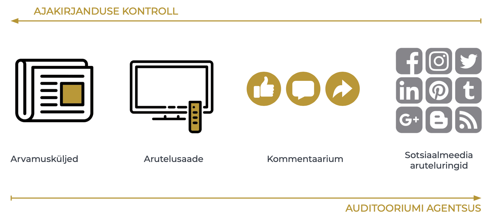
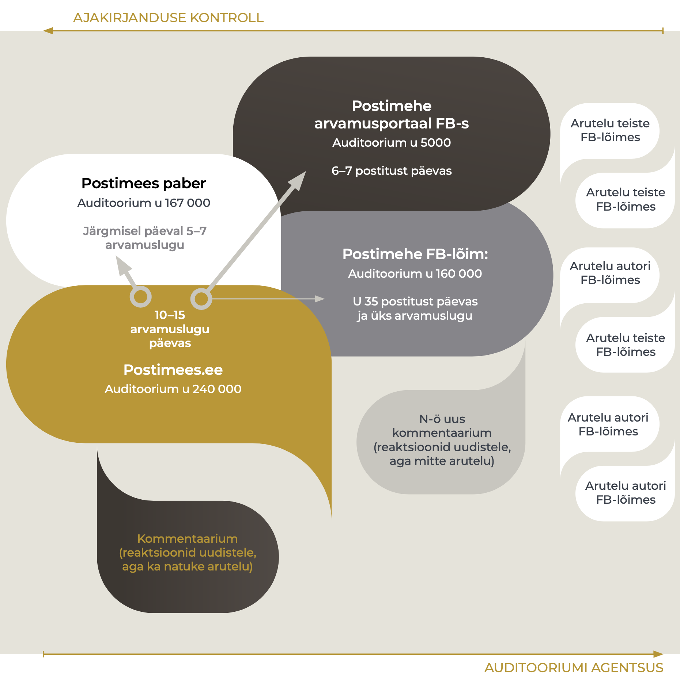

## The deliberative space shaped by the press {.chapter_section .chapter4_section}

```{block, type='authors'}
<div class="author-links">**[Ragne Kõuts-Klemm](#ragne-kõuts-klemm)**</div>
<div><a class="print-btn" href="../print/EIA-2019-4.3.pdf"><i class="fa fa-file" aria-hidden="true"></i>Trükiversioon</a></div>
```

```{block, type='points'}
* Ajakirjanduse võimalused avaliku arvamusruumi kujundamisel on vähenenud ning kasvanud on teiste toimijate – auditooriumi, konkreetsete huvigruppide ja ülemaailmsete platvormide roll ja vastutus.
```

Ajakirjanduse ja aruteluruumi omavaheline suhe on 21. sajandil keerukam kui kunagi varem. Ajakirjanduse võimalused avalikku aruteluruumi kujundada on teisenenud, keerulisemaks on muutunud ühise inforuumi tekke, elanikkonda ühendava enesetaju ning kaasavate ja avatud vestlussituatsioonide toetamine. Ka avalik aruteluruum ise on mitmekesisem, sisaldades täiesti avalikke, poolavalikke ja laiemale avalikkusele suletud ruume. Internetis võimenduse saanud aruteluruumis saavad nüüd osaleda toimijad, kelle arvamused ei ole seni avalikkuse ette jõudnud. Muutuste hindamine positiivse või negatiivsena on keeruline, kuid rahvusvahelisi pressi- ja arvamusvabaduse hinnanguid aluseks võttes paistab, et Eestis olukord halveneb – oleme langenud pressivabaduse hinnangutes tagasi teise kümnesse ([joonis 4.3.1](#figure431)). Selle olukorra taga võib näha ajakirjanduse vähenenud ressursse ja võimalusi majanduslikust ja poliitilisest mõjust sekkumata toimida ([Vihalemm 2013](#Vihalemm2013)), et anda tõest, igakülgset ja ausat teavet ühiskonnas toimuva kohta, nagu see on sõnastatud ajakirjanduse ülesandena Eesti ajakirjanduseetika koodeksis. Ajakirjanduse olukorra halvenemist märgib indeks juhul, kui riigis esineb nii sõna kui ka teoga rünnakuid ajakirjanike, meediaorganisatsioonide, sõnavabaduse või nende eest seisjate vastu. Ka Eesti ajakirjanikud on viimastel aastatel teada andnud ähvardustest oma elule ja tervisele. Samuti on pressivabaduse vähenemise taga avalikkusesse jõudnud teated toimetuse autonoomia kahanemisest Eesti ühes suurimas meediakontsernis ja ajakirjanike vähenenud töökohakindlus ootamatute vallandamiste tõttu.

<p class="caption" id="figure431"><span class="figure-number">Joonis 4.3.1.</span> Eesti positsiooni muutumine pressivabaduse hinnangutes 15 aasta jooksul Soome ja Lätiga võrreldes</p>
<div class="desktop-plot">
```{r, figure431, out.width='90%', fig.asp=.75, fig.align='center', echo=FALSE, message=FALSE}

library("tidyverse")

 fig431_data <- read.csv ("../data/43_fig1_data.csv", header=TRUE, fileEncoding="utf-8")

 fig431_data$position_eng[grepl("3. koht",   fig431_data$position)]<-"3rd place"
 fig431_data$position_eng[grepl("12. koht",   fig431_data$position)]<-"12th place"
 fig431_data$position_eng[grepl("14. koht",   fig431_data$position)]<-"14th place"
 fig431_data$position_eng[grepl("24. koht",   fig431_data$position)]<-"24th place"
 fig431_data$position_eng[grepl("50. koht",   fig431_data$position)]<-"50th place"
 
 fig431_data$country_eng[grepl("Eesti",   fig431_data$country)]<-"Estonia"
 fig431_data$country_eng[grepl("Läti",   fig431_data$country)]<-"Latvia"
 fig431_data$country_eng[grepl("Soome",   fig431_data$country)]<-"Finland"
 
fig431_data$country_eng <- factor(fig431_data$country_eng, levels = c("Finland","Estonia","Latvia"))


 fig431_plot <- ggplot(data = fig431_data) +
    geom_text(mapping = aes(x=year, y=as.numeric(value), label=position_eng), stat="identity", vjust=-0.3) +
    geom_line(mapping = aes(x=year, y = as.numeric(value), colour=country_eng, group=country_eng, text = paste("", country,
                         "<br>", value)), size=0.75) +
    scale_colour_manual(values=c("#3A404A","#BC9417","#A8ACA6")) +
    scale_y_reverse(breaks=c(0,5,10,15,20,25,30,35,40,45,50,55)) +
    scale_x_continuous(breaks=c(2004,2006,2008,2010,2012,2014,2016,2018)) +
    labs(y="", x="")

   fig431_theme <- theme(
        text = element_text(family="Montserrat"),
  )

ggplotly(fig431_plot + fig_theme_general + fig431_theme, tooltip = "text") %>%
config(displayModeBar = F, collaborate = F)   %>% 
layout(legend = list(orientation = "h",y = 1.15)) %>% 
layout(xaxis = list(fixedrange = TRUE)) %>%
layout(yaxis = list(fixedrange = TRUE))

  #ggsave(path="exported_figures/PDF/chapter4",filename="fig431.pdf", height=140, width=210, units="mm")
```
</div>

<div class="mobile-plot">
```{r, out.width='100%', fig.asp=.75, fig.align='center', echo=FALSE, message=FALSE, warnings=FALSE}

  print(fig431_plot + fig_theme_general + fig431_theme)

```
```{block, type='imgsource'}
<div><span class="imgsource-source">Allikas:</span> Reporters without Borders 2018.</div>
<div><a class="data-btn" href="../data/43_fig1_data.csv"><i class="fa fa-download" aria-hidden="true"></i>Laadi andmed</a></div>
```

Mitmekülgne, eri hääli kaasav ja argumenteeritud arutelu on demokraatliku ühiskonnakorralduse eeltingimus ja jätkumise tagatis – avalikus aruteluruumis räägitakse läbi meie ühiselu aluspõhimõtted ja reeglid ning lepitakse kokku parimad viisid, kuidas reageerida muutuva maailma väljakutsetele.

```{block, type='blockquote-left'}
Mitmekülgne, eri hääli kaasav ja argumenteeritud arutelu on demokraatliku ühiskonnakorralduse eeltingimus ja jätkumise tagatis.
```

Artikli põhiseisukoht on, et ajakirjanduse võimalused avaliku arvamusruumi kujundamisel on vähenenud ning kasvanud on teiste toimijate, näiteks auditooriumi, konkreetsete huvigruppide ja ülemaailmsete suurkorporatsioonide kontrolli all oleva tehnoloogia roll ja vastutus. Muutust näitavad viimase kümmekonna aasta eestikeelse ajakirjanduse sisu, toimetuste tööprotsesside ning meedia retseptsiooni uuringud. Käesolevas artiklis sünteesin Tartu Ülikoolis tehtud väiksemate, nii kvalitatiivsete kui ka kvantitatiivsete uuringute tulemusi ning kasutan ka rahvusvaheliste uuringute tähelepanekuid olukorra kohta Eestis ja Euroopas. Artiklis vastan järgmistele küsimustele:


1) milline on arutelu ajakirjanduse enda kontrollitud aruteluruumis, s.t ajalehtedes ja uudisportaalides;

2) kuidas mõjutavad veebiajakirjanduse kommentaariumid ajakirjanduse kujundatavat aruteluruumi ning

3) milliseid võimalusi ja probleeme on ajakirjanduse kujundatavale aruteluruumile toonud kaasa sotsiaalmeedia.

Ajakirjanduse seisukohalt vaadatuna hõlmab avalik aruteluruum erineva kontrollipotentsiaaliga alasid – näiteks päevalehe arvamusartiklite valiku teeb toimetaja, Riigikogu saali arutelu on aga ajakirjanduse kontrolli alt põhimõtteliselt väljas, kuigi ei saa eitada, et ajakirjandusel võib olla sellele kaudne mõju. Nendes arvamusruumi osades, mis jäävad ajakirjandusliku sekkumise ulatusest välja, kujundavad arvamusruumi üksikisikute ja huvigruppide osalemissoov, aktiivsus ja aruteluoskused – agentsus. Interneti puhul on olulised ka eri keskkondade tehnoloogilised võimalused ja piirangud.

```{block, type='blockquote-left'}
Agentsus on toimimisvõimekus konkreetsetes ühiskondlik-poliitilistes oludes.
```

Interneti arenguga on kaasas käinud auditooriumi võimestamine – see tähendab, et internetiplatvormidel saavad auditooriumi liikmed olla nii üksinda kui ka koos teistega nähtavamad ning oma suhtluseesmärke iseseisvalt realiseerida. Just sotsiaalmeedialt kui peamiselt internetiarutelu keskkonnalt on oodatud arutelukultuuri demokratiseerimist. Aruteluruumi laienemine on aga toonud kaasa ka mitmed soovimatud nähtused, näiteks netiagressioon, auditooriumiga manipuleerimise võimaluste suurenemine ja avalikkuse hoiakute polariseerumine. Meediauurijaid on üllatanud just netiagressiooni teke toimetuse kontrollita keskkonnas, kuhu koguneb suur hulk vaenulikke, laimavaid ja solvavaid väiteid eri isikute kohta. Ajakirjandusel ei ole olnud piisavalt raha, teadmisi ega oskusi, et nendele protsessidele vastu seista.

Kui vaadata avalikku arvamusruumi ajakirjanduse ja auditooriumide toimevõime ehk agentsuse pingeväljana, ilmneb pöördvõrdeline seos: platvormidel, millel kasvab auditooriumi võimalus sekkumata tegutseda, on selle võrra väiksem ajakirjanduse kontrollipotentsiaal ja toimimisvõime ([joonis 4.3.2](#figure432)).

<p class="caption" id="figure432"><span class="figure-number">Joonis 4.3.2.</span> Ajakirjanduse ja auditooriumi võimalused arvamusruumi kontrollida eri meediaplatvormidel</p>

```{r, figure432, out.width='100%', fig.align='center', echo=FALSE, message=FALSE}


```

``` {block, type='imgsource'}
<span class="imgsource-source">Allikas:</span> Autori joonis.
```

### Ajakirjanduse kontroll arvamusruumi üle traditsioonilistes meediakanalites {-.chapter4_section}

Ametialastest kokkulepetest ja rollist lähtuvalt on professionaalse ajakirjanduse ülesanne kujundada aruteluruumi nii, et riiki, kultuuri, majandust ja ühiskonda puudutavad olulised sündmused ja protsessid oleksid kajastatud ning erinevad vaated kaasatud.
Ajalehe toimetus sekkub ühiskonna arvamuskliima kujundamisse jõuliselt näiteks juhtkirjade kaudu. Eestis kirjutatakse juhtkiri suuremates päevalehtedes enamasti konkreetse lehenumbri kõige olulisemal teemal ([Kald 2006](#Kald2006)). Juhtkiri ei pruugi olla kollektiivne looming, kuid esindab üldjuhul toimetuse enamuse või juhtgrupi konsensuslikku seisukohta. Lisaks tellivad toimetajad olulistel teemadel arvamusartikleid, valivad toimetusse jõudnute hulgast avaldamiseks tähtsamad ja paremad arvamuslood ning hoiavad teemat päevakorral jätkuarvamusi hankides. Ideaalis jälgivad toimetajad seejuures Saksa filosoofi Jürgen Habermasi poolt määratletud vestlussituatsiooni kujunemiseks vajalikke tingimusi: et eri osapooled saaksid sõna ning et arutelu oleks mitmekesine ja tasakaalustatud.

Ajalehtede arvamuskülgedel arvajate ring on olnud siiski pigem kitsas. Arvajatena eelistatakse isikuid, kes on omandanud arvamusžanri konventsioonid, kelle arvamusi peetakse huvitavaks või kellel on otsustajana piisav tähtsus, et tema arvamusi kajastada. Eestikeelse kultuuriajakirjanduse uuringust ([Kõuts-Klemm 2015](#Kõuts-Klemm2015)), mis hõlmas eri meediakanalite kolme kuu sisu, selgus, et kultuuriteemalistes arvamusartiklites ja arutelusaadetes said kõige rohkem sõna eksperdid ja teadlased (41%), ajakirjanikud ja toimetajad (34%) ning loomeinimesed (17%). Sarnane muster ilmneb arvamusrubriikide puhul ka üldisemalt. Aastal 2018 tehtud kahe üleriigilise päevalehe sisu analüüs näitab, et nende väljaannete arvamustoimetused avaldavad sageli teaduslikke ja eksperdiarvamusi. Kõnekas on ajakirjanike enda nii sage esinemine arvajatena, kuid üldpildis on vähe nähtavad tavakodanike, ametnike ja kultuuritegelaste arvamused ([joonis 4.3.3](#figure433)).

<p class="caption" id="figure433"><span class="figure-number">Joonis 4.3.3.</span> Arvamuslugude autorid eestikeelsetes ülerigiilistes päevalehtedes (%)</p>
(N = 485, 2018.a. 12 juhuslikult valitud nädalat, argipäevadel ilmunud artiklid).

<div class="desktop-plot">
```{r, figure433, fig.asp=.75, fig.align='center', echo=FALSE, message=FALSE}

library("tidyverse")

 fig433_data <- read.csv ("../data/43_fig3_data1.csv", header=TRUE, fileEncoding="utf-8")

  fig433_data$variable_eng[grepl("ettevõtja", fig433_data$variable)]<-"Entrepreneurs"
  fig433_data$variable_eng[grepl("ametnik", fig433_data$variable)]<-"Public servants"
  fig433_data$variable_eng[grepl("kultuuritegelane", fig433_data$variable)]<-"Cultural figures"
  fig433_data$variable_eng[grepl("kodanik", fig433_data$variable)]<-"Citizens"
  fig433_data$variable_eng[grepl("poliitik", fig433_data$variable)]<-"Politicians"
  fig433_data$variable_eng[grepl("ajakirjanik", fig433_data$variable)]<-"Journalists"
  fig433_data$variable_eng[grepl("teadlane, ekspert", fig433_data$variable)]<-"Scientists, experts"
  
  fig433_data$group_eng[grepl("Postimees", fig433_data$group)]<-"Postimees"
  fig433_data$group_eng[grepl("Eesti Päevaleht", fig433_data$group)]<-"Eesti Päevaleht"
  fig433_data$group_eng[grepl("Kokku", fig433_data$group)]<-"All"
  
  
fig433_data$group_eng <- factor(fig433_data$group_eng, levels = c("Postimees","Eesti Päevaleht","All"))
fig433_data$variable_eng <- factor(fig433_data$variable_eng, levels = c("Entrepreneurs", "Public servants","Cultural figures","Citizens","Politicians","Journalists","Scientists, experts"))

  fig433_plot <- ggplot() +
    geom_bar(data = fig433_data, mapping = aes(x=group_eng, y=value, fill=variable_eng, text = paste("", variable_eng,
                         "<br>", value,"%")), width=0.4, stat="identity") +
    scale_fill_manual(values=c("#E6E3DA","#F2EAD1","#E4D4A2","#C9A945","#BC9417","#8D6F11","#5E4A0C")) +
    scale_y_continuous(expand = c(0, 0), limits=c(0,105)) +
    expand_limits (y=0) +
    labs(y="%", x="")

  fig433_theme <- theme(
    legend.position="right",
    text = element_text(size = 12, family="Montserrat"),
    panel.grid.major.x = element_blank() ,
    panel.grid.minor.x = element_blank(),
  )

ggplotly(fig433_plot + fig_theme_general + fig433_theme, tooltip = "text") %>%
config(displayModeBar = F, collaborate = F)   %>% 
layout(legend = list(orientation = "h",y = 1.15)) %>% 
layout(xaxis = list(fixedrange = TRUE)) %>%
layout(yaxis = list(fixedrange = TRUE))

  #ggsave(path="../exported_figures/PDF/chapter4",filename="fig433.pdf", height=120, width=200, units="mm")
```
</div>

<div class="mobile-plot">
```{r, out.width='100%', fig.asp=.75, fig.align='center', echo=FALSE, message=FALSE, warnings=FALSE}

print(fig433_plot + fig_theme_general + fig433_theme)

```
</div>
``` {block, type='imgsource'}
<div><span class="imgsource-source">Allikas:</span> Autori joonis.</div>
<div><a class="data-btn" href="../data/43_fig3_data1.csv"><i class="fa fa-download" aria-hidden="true"></i>Laadi andmed</a></div>
```

Poliitikute ligipääsu arvamusmeediale kontrollivad toimetajad eriti tähelepanelikult just valimiseelsel perioodil – toimetuses lepitakse kokku teemad, mille kohta poliitikutelt arvamust küsitakse, ning publikule vahendatakse kõigi institutsionaliseerunud poliitiliste jõudude sõnumid.

Arvamustoimetajate valikud, kuidas arutelusid kujundada, tuginevad ideaalis professionaalse ajakirjanduse aluspõhimõtetele (tasakaalustatus, erapooletus), kuid oma osa mängib valikute tegemisel ka toimetajate maailmavaade. Näiteks Eesti liitumisel Euroopa Liiduga lõi ajakirjandus toetavat fooni liitumisotsusele, esitades suuremas osas arvamuslugudes liitumist sammuna, millele ei ole alternatiivi ([Järvet 2007](#Järvet2007)). Keeruliste teemade puhul, milles on palju osapooli ja mitmesuguseid nii nähtavaid kui ka varjatud huve, näiteks Nord Streami gaasijuhtme ehitamisega seonduv ([Laev 2010](#Laev2010)), võib ajakirjandus jääda teemale alla, sest ei suuda ise piisavalt analüüsida osapoolte huve ja sõnumeid ning seetõttu teha adekvaatseid valikuid kõnejärje edasiandmisel. Süvenemiseks on ajakirjanikel vaja nii aega kui ka teadmisi asjatundliku arvamuse kujundamiseks.

```{block, type='casebox'}
<h3>Ajakirjandus toetab arutelu teket</h3>

Arvamusrubriigid on eri toimetustes erinevalt väärtustatud ning mitmed toimetused soovivad oma brändi olulise osana näha avaliku kõneaine kujundaja rolli.

Meediaettevõte Äripäev on loonud enda kui arvamusliidri kuvandit otsustajatele ja ärieliidile suunatud elitaarsete konverentside kaudu ning aruteluruumi pakuvad ka alates 2017. aasta septembrist tegutseva Äripäeva raadio jutusaated.

Ajaleht Postimees korraldab 2000. aastast aruteluseminari „Arvamusliidrite lõuna“, millel osalevad teadlased, eksperdid ja poliitikud ning millel antakse välja aasta arvamusliidri auhind. Samuti ilmub igal laupäeval Postimehe lisaleht „Arvamus. Kultuur“.
```

Ajakirjanduse kontrollitud arvamusruumist kõrvale jäetutel on olnud internetitehnoloogia arenemisel lihtsam luua oma aruteluplatvorme. Alternatiivmeedia kanalite (nt Telegram, Uued Uudised, Objektiiv) loojad näevad oma peamise ülesandena arvamusruumi mitmekesistamist ([Saavik 2017](#Saavik2017)). Selliseid kanaleid nimetatakse meelsusmeediaks, sest selles levitatakse teatud kindlat maailmavaadet – näiteks portaal Objektiiv esindab oma toimetuse sõnul rahvuskonservatiivset vaadet. Alternatiivmeedia on tekkinud täitma tühimikke, mida üldauditooriumile suunatud meedia ei täida. Sageli võib sel põhjusel olla mõnele alternatiivmeedia kanalile iseloomulik äärmuslik hoiak ühiskonnas toimuva suhtes. Viimased uuringud näitavad, et äärmuslikke vaateid esitava alternatiivmeedia jälgijaskonna moodustavad inimesed, kes on ühiskonnas ja kaasinimestes pettunud ja kes tunnevad vähem huvi poliitika, majanduse, ühiskonnaelu teemade ning üldse uudiste vastu ([Rämmer 2018](#Rämmer2018)).

```{block, type='blockquote-right'}
Meelsusmeediaks nimetatakse sellist meediat, mis edastab ainult ühte kitsast maailmavaadet, mille sisus ei ole maailmavaatelist paljusust.
```

Nimetatud tähelepanekud osutavad, et Eesti ajakirjanduse kujundatav arvamusruum ei erine teiste demokraatlike riikide omast. Ka mujal antakse üldauditooriumile suunatud meedias sõna eelkõige ühiskondlikule eliidile, avaldatakse suur hulk ajakirjanike enda arvamusi ning arvamusruumi mitmekesistumise ülesannet täidavad eelkõige alternatiivmeedia kanalid.

### Veebiajakirjanduse kaasav arhitektuur ja toimimine {-.chapter4_section}

Eesti ajakirjandusväljaanded avasid 1999. aastal veebiväljaannete loomisel ukse lugejate kaasamisele. Toepfl ja Litvinenko, kes võrdlesid endiste Nõukogude liiduvabariikide veebiväljaandeid, leidsid, et teistega võrreldes on Eesti uudisteportaalid näide avatud ja kaasavast veebiarhitektuurist ([Toepfl ja Litvinenko 2018](#Toepfl2018)). Kommentaarium on veebiväljaannete enesestmõistetav osa, mis võimaldab auditooriumil oma vaateid väljendada, arutelu suunata ja ka uusi teemasid tõstatada. Seevastu teine, Avatud Eesti Fondi 2013. aastal tellitud uuring tõi välja, et kommentaariumi kasutamine arutelus osalemiseks on siiski pigem tagasihoidlik – kommentaare olid kirjutanud üldse 13% ja regulaarselt kommenteerisid vaid 3% Eesti täisealistest elanikest. Kommenteerimiseks on avatud nii uudisnupud kui ka arvamuslood, kuigi enamasti jääb just arvamuslugude kommentaaride arv väikeseks. Arvamustes, millele elavamalt reageeritakse, peab sisalduma auditooriumi mingil viisil ärritav moment – kommenteerijate aktiivsus on suurem lugude puhul, mis käsitlevad vastakaid arvamusi tekitavat teemat, on kirjutatud polariseeriva kuvandiga isiku poolt või puudutavad inimeste alusväärtusi, mille väljendamist peavad inimesed oluliseks. Välja on toodud seos artiklite tonaalsuse ja kommentaariumi häälestuse vahel – näiteks Portugali 2015. aasta valimiste eelse kajastuse analüüs osutas, et väga negatiivne suhtumine poliitilistesse vastastesse toob kaasa ka märksa negatiivsemad kommentaarid ([Conçalves 2018](#Conçalves2018)). Samuti kasutatakse kommentaariumi teadlikult auditooriumiga manipuleerimiseks poliitilistel eesmärkidel, et ühiskonda lõhestada, tekitada emotsionaalset laetust ja võimendada konflikte.

Tänapäeva infokülluse olukorras, kus suuremad veebitoimetused toodavad ja paiskavad Eestis arvamusruumi päevas kuni 500 tekstiühikut, on eri tekstidel toimetuse silmis erinev tähtsus. Arvamusžanri väärtustatakse veebitoimetuses rohkem kui uudisžanri. Intervjuud arvamustoimetajatega tõid välja, et kui uudisinfot püütakse veebiväljaandes pihustada igale ajahetkele võrdselt, siis arvamuslugude avaldamiseks valitakse pigem lugemise tippaeg ([Klaassen 2018](#Klaassen2018)).

```{block, type='blockquote-right'}
Veebitoimetused on võtnud kommentaariumi avades vastutuse tagada selles heade suhtlustavade järgimine.
```

Toimetajate sekkumiseta võib kommentaariumist saada netivaenu eskaleerumise koht, kus valdavad mittetsiviliseeritud ja ebaviisakad kommentaarid. Praegu modereerivad kõik avatud kommentaariumidega veebiväljaanded kommentaare nii algoritmide kui ka inimmoderaatorite ja lugejate enda abiga. Samuti tehakse mõne teema puhul toimetuses teadlik valik teemat kommenteerimiseks mitte avada (nt suurkatastroofid, sisserände teemad).

Igaühele avatud arvamuskeskkonna olemasolu veebis võimestab auditooriumi – annab sellele hääle ja nähtavuse. Kuigi veebiajakirjanduse kommentaariumist taheti loomise algaegadel kujundada isereguleeruva arutelu koht, oli see ilmselgelt liiga optimistlik soov. Veebiajakirjandus on olnud sunnitud auditooriumi agentsust piirama, et vältida laimu ja vihakõne vohamist. Veebitoimetused on võtnud kommentaariumi avades vastutuse tagada selles heade suhtlustavade järgimine – selle põhimõtte möödapääsmatusele osutas Euroopa Inimõiguste Kohtu otsus Delfi kaasuses (vt juhtumi kokkuvõtet [Välisministeerium 2015](#Välisministeerium2015)).

### Sotsiaalmeedia vastuolulised võimalused {-.chapter4_section}

Veebiväljaannetes avaldatud arvamusi on võimalik võimendada ka sotsiaalmeedia kanalite kaudu. Juba 2013. aastal oli peaaegu kõigil Eesti ajakirjandusväljaannetel oma Facebooki lehekülg või isegi mitu. Sotsiaalmeedias on veelgi suurem tõenäosus, et arvamus muutub viraalseks – leiab palju viitamist ja edasisuunamist, tekitades niimoodi arutelu oluliste ühist otsustamist vajavate küsimuste üle. Ajakirjandusväljaanne võib jagada oma veebisisu ise oma Facebooki lehel või Youtube’i kanalis, võib teatavatele saadetele või rubriikidele luua sotsiaalmeedias lisakanaleid, aga võib loota ka auditooriumi soovile jagada lugusid uudisteportaalist otse, sest portaalis on iga loo juures lingid mitmele sotsiaalmeedia kanalile.

Postimehe platvormide analüüs kahe kuu jooksul (september kuni oktoober 2018) näitas, et internetis avaldatud arvamusartiklid liiguvad eri trajektoore pidi. Just sotsiaalmeedias on liikumismustrite tuvastamine keeruline, sest postituste levimist mõjutavad ka sotsiaalmeedia algoritmid, mille üle ei ole kontrolli kasutajatel ega ka veebitoimetajatel. Mõnevõrra sõltub loo nähtavus arvamustoimetaja aktiivsusest loo jagamisel, kuid enamgi veel loo teemast ja selle autorist. Näiteks saavad ajakirjanike arvamuslood sotsiaalmeedias enamasti mitu korda suurema kõlapinna kui teadlaste-ekspertide omad. Viimaste arvamused ei põhjusta üldjuhul suuri vaidlusi ja seeläbi ka sotsiaalmeedia kasutajate ägedaid reaktsioone. Teadlased ja eksperdid arutlevad oma arvamusartiklite üle sotsiaalmeedias omaenda poolavalikes või suletud kodades. Tänu pidevale avalikkuse ees esinemisele kutsuvad ajakirjanikud seevastu esile rohkem reaktsioone. Kolmanda suurema arvajate rühma – poliitikute – arvamused saavad sotsiaalmeedia võimenduses samuti pigem rohkem reaktsioone ning tihti jätkatakse diskussiooni ka nende isiklikes Facebooki kogukondades või neist välja jäävate kodanike arutelulõimedes.

Postimehe platvormidest ilmub kõige rohkem arvamuslugusid uudisteportaalis postimees.ee, kus sõltuvalt päevast ilmub 10–15 arvamuslugu. Nendest kuni pooled (5–7 lugu) trükitakse ära ka järgmise päeva paberlehes. Postimees oma Facebooki lõimes arvamuslugusid enamasti ei levita, kuigi mõni üksik väga suure arutelupotentsiaaliga lugu jõuab ka sinna. Postimehe Facebooki lehekülg on uudiste päralt ning seal levitatu saab jälgijatelt reaktsioone (laike, jagamisi, soovitamisi), kuid enamasti seal sisukat ja argumenteeritud diskussiooni ei teki. Postimees levitab arvamuslugusid eraldi loodud Facebooki arvamuslehel, pihustades konkreetse päeva lood pikemale perioodile (sh nädalavahetused). Selliselt levitatud lugude jälgitav resonants on siiski enamasti vähene. Arvestades lehtede jälgijate arve, on vähene vastukaja ootuspärane – 2018. aasta oktoobri seisuga oli Postimehe Facebooki arvamuslehel natuke üle 5000 jälgija, Postimehe Facebooki põhilehel aga samal ajal üle 160 000 jälgija ([joonis 4.3.4](#figure434)).

<p class="caption" id="figure434"><span class="figure-number">Joonis 4.3.4.</span> Ajakirjanduse ja auditooriumi agentsus Postimehe näitel</p>

<div class="casebox">
```{r, figure434, out.width='90%', fig.asp=.75, fig.align='center', echo=FALSE, message=FALSE}


```
</div>
``` {block, type='imgsource'}
<span class="imgsource-source">Allikas:</span> Autori joonis.
```

Postimees.ee lugeja saab algatada ise arutelu oma sõpruskonnas, kui jagab loo linki oma sotsiaalmeedia kanalis, kuid siis sumbub arutelu enamasti ühe päevaga selsamal „seinal“. Samuti sumbuvad sotsiaalmeedia allkeskkondades ka arvamuslugude autorite sel viisil levitatud lood.

Sotsiaalmeedia ei ole aga üldise avaliku arutelu ärgitamiseks parim keskkond, sest selles osalemist piiravad mitmed psühholoogilised tõkked. Olles platvormina madala ligipääsubarjääriga, saavad aruteludega liituda ka inimesed, kes ei pea aruteludes osaledes kinni põhilistest viisakusreeglitest ning nii võib sotsiaalmeedias arutlemise püüe päädida ebameeldiva suhtluskogemusega. Sel põhjusel ei osale suur osa sotsiaalmeedia kasutajatest aktiivselt arvamusruumi kujundamises, kuid kujutavad endast märkimisväärset arutelude jälgijate seltskonda ([Kõuts-Klemm jt 2017, lk 296](#Kõuts-Klemm2017)). Sotsiaalmeedia aktiivsus võib sotsiaalse isolatsiooni hirmus taanduda pelgalt postituste laikimisele – see on maksimaalseks oma meelsuse näitamise viisiks, mida suur osa sotsiaalmeedia kasutajatest endale lubavad ([Hermida jt 2012](#Hermida2012)). Samuti on probleem see, et autor kaotab oma sõnumite üle sotsiaalmeedias hõlpsasti kontrolli – kord postitatuna hakkab postitus elama oma elu, sest selle edasist trajektoori määravad tehnoloogilised tegurid, näiteks sotsiaalmeedia algoritmid. Siiski on sotsiaalmeedia praegu oma puudustest hoolimata üks käepärasemaid võimalusi auditooriumi osalemiseks avalikus arvamusruumis.

### Kokkuvõte {-.chapter4_section}

Ajakirjanduse võimalused kujundada eesmärgipäraselt avalikku aruteluruumi ja sealtkaudu privaatseid aruteluruume on muutunud keerulisemaks. Probleemid sõnavabaduse ja arvamuskultuuriga Eestis tulevad esile ka ajakirjandusvabaduse rahvusvahelistest hinnangutest. Avalik aruteluruum ise on mitmetahulisem, hõlmates ajakirjanduse poolelt vaadatuna mitmesuguse kontrollipotentsiaaliga tsoone. Vaadates ajakirjanduse võimalusi aruteluruumi kujundada agentsuse ja kontrolli kategooriates, näeme, et aruteluruumis osalejad ei ole võrdsed. Tavaajakirjanduse puhul on suhe ajakirjanduse ja auditooriumi vahel selgelt ebavõrdne – ajakirjanike agentsus domineerib auditooriumi agentsuse üle. Sotsiaalmeedia platvormidel on nii ajakirjanikud kui ka auditoorium võrdselt võimestatud, kuid mõlemad kaotavad oma sõnumite üle kiiresti kontrolli. Seda põhjustavad nii algoritmiline sekkumine kui ka sotsiaalmeedia võrgustikstruktuur.

Seega sõltub avaliku aruteluruumi kvaliteet nii tehnoloogilistest teguritest kui ka osapoolte valmisolekust ja võimekusest aruteluruumis osaleda. Auditooriumi puhul kindlasti ka valmisolekust pidada kinni avaliku suhtlemise headest tavadest. Tehnoloogilised tegurid on suurkorporatsioonide kontrolli all, kes on olnud tõrksad võtma vastutust sotsiaalmeedias toimuva eest. Samuti tuleks tegeleda teavituse ja koolitamisega, et auditoorium saaks teadlikuks oma vastutusest. Ajakirjandus on oma vastutusest kindlasti rohkem teadlik, kuid praegustes majandustingimustes võib toimetustel olla puudu ressursist, et seda vastutust realiseerida. Veebiajakirjanduse toimimiseks arvamusruumina peab ajakirjandus panustama märksa rohkem vahendeid kui seni – palkama moderaatoreid, investeerima masinõppeks võimeliste modereerimisalgoritmide arendusse, koolitama auditooriumi. Sama teevad teiste Euroopa riikide veebitoimetused. Professionaalse ajakirjanduse ees on keeruline ülesanne seista vastu arvamusruumi üha suuremale killustumisele ning hoida ühiskonda läbipaistvana ja avalikku arutelu demokraatiat toetavana.

### Viidatud allikad {-.subreferences}

<p id="Avatud-Eesti-Fond2013">Avatud Eesti Fond 2013. Uuring: online-kommentaaride mõjusfääris elab pool miljonit Eesti inimest. – Avatud Eesti Fondi veebisait, 12.09.2013.</p>

<p id="Conçalves2018">Conçalves, J. 2018. „My opponent is a …“. Determinants of incivility and relevance in news comments to election coverage. Paper presented at the 7th European Communication Conference „Centres and Peripheries: Communication, Research, Tradition“, 31 October – 3 November 2018, Lugano, Switzerland.</p>

<p id="Hermida2012">Hermida, A., Fletcher, F., Korell, D., Logan, D. 2012. Share, like, recommend. Decoding the social media news consumer. – Journalism Studies, 13 (5–6), 815–824.</p>

<p id="Järvet2007">Järvet, A. 2007. Euroopa Liidu käsitlemine Postimehes aastatel 2000–2004 ja avalik avamus Euroopa Liiduga liitumise suhtes. Bakalaureusetöö. Tartu Ülikool.</p>

<p id="Kald2006">Kald, I. 2006. Juhtkirja valimine päevalehes (Eesti Päevalehe, Postimehe ja Äripäeva näitel). Bakalaureusetöö. Tartu Ülikool.</p>

<p id="Klaassen2018">Klaassen, M. 2018. Vale- ja võltsuudiste avaldamine peavoolumeedias: Eesti meediaväljaannete peatoimetajate selgitused tekkepõhjustele. Bakalaureusetöö. Tartu Ülikool.</p>

<p id="Kõuts-Klemm2015">Kõuts-Klemm, R. (koost.) 2015. Kultuuriajakirjanduse sisu ja vormi statistiline monitooring 2015. Lepingulise uurimistöö „Meediasotsioloogiline uuring „Kultuuriajakirjanduse sisu ja kasutajaskond““ vahearuande I osa.</p>

<p id="Kõuts-Klemm2017">Kõuts-Klemm, R., Pruulmann-Vengerfeldt, P., Siibak, A., Lauristin, M. 2017. Internetikasutus ja sotsiaalmeedia kasutus. – Vihalemm, P., Lauristin, M., Kalmus, V., Vihalemm, T. (toim.). Eesti ühiskond kiirenevas ajas. Uuringu „Mina. Maailm. Meedia“ 2002–2014 tulemused. Tartu: Tartu Ülikooli Kirjastus, 279–298.</p>

<p id="Laev2010">Laev, S. 2010. Keerulise teema kajastus päevalehtede arvamuskülgedel Nord Streami gaasijuhtme näitel. Magistritöö. Tartu Ülikool.</p>

<p id="Reporters-without-Borders2018">Reporters without Borders 2018. Press Freedom Index 2018. https://rsf.org/en/ranking.</p>

<p id="Rämmer2018">Rämmer, A. 2018. Alternatiivmeediat usaldavad rohkem need, kes on ühiskonnaelust võõrdunud. – ERR Novaator Ühiskond, 18.07.2018.</p>

<p id="Saavik2017">Saavik, S. 2017. Eesti alternatiivmeedia kanalite Nihilist, Vanglaplaneet ja Uued uudised toimimine ning funktsioonid. Bakalaureusetöö. Tartu Ülikool.</p>

<p id="Talvari2009">Talvari, M. 2009. Avalik-õigusliku telekanali (Eesti Televisioon) roll avaliku diskussiooni foorumina saate „Vabariigi kodanikud“ näitel. Bakalaureusetöö. Tartu Ülikool.</p>

<p id="Toepfl2018">Toepfl, F., Litvinenko, A. 2018. Transferring control from the backend to the frontend: a comparison of the discourse architectures of comment sections on news websites across the post-Soviet world. – New Media & Society, 20 (8), 2844–2861.</p>

<p id="Vihalemm2013">Vihalemm, P. 2013. Infokeskkond ja meediavabadus. – Heidmets, M. (toim.). Eesti inimarengu aruanne 2012/2013. Eesti maailmas. Tallinn: Eesti Koostöö Kogu, 70–74.</p>

<p id="Välisministeerium2015">Välisministeerium 2015. Inimõiguste kohus kuulutas välja Delfi vs Eesti otsuse ja leidis, et Eesti ei ole rikkunud konventsiooni artiklit 10, st sõnavabadust. – Välisministeeriumi veebisait, 16.06.2015.</p>
