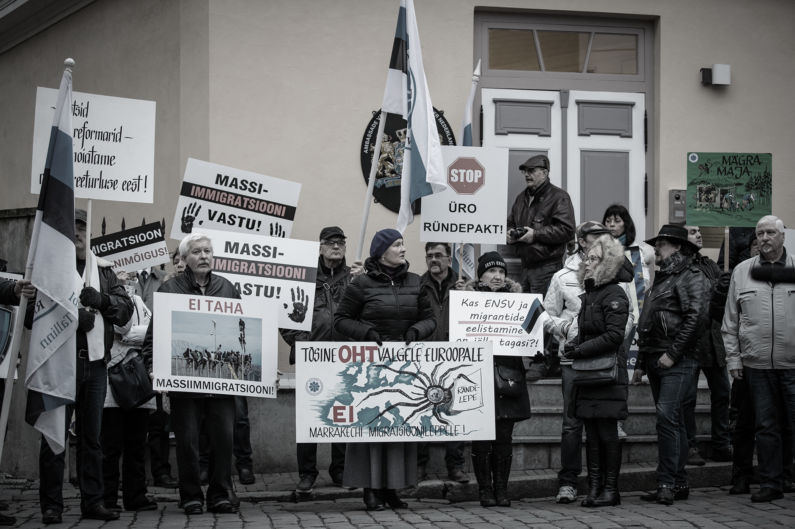
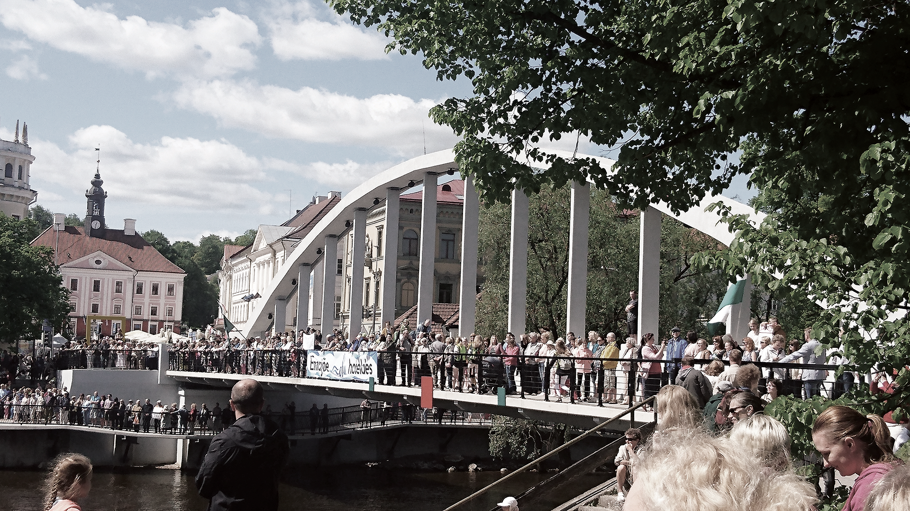

## The role and status of experts in societal media discussions {.chapter_section .chapter4_section}

```{block, type='authors'}
<div class="author-links">**[Arko Olesk](#arko-olesk)**</div>
<div><a class="print-btn" href="../print/EIA-2019-4.4.pdf"><i class="fa fa-file" aria-hidden="true"></i>Trükiversioon</a></div>
```

```{block, type='points'}
* In Estonia, experts and scientists are able to launch major societal debates and enrich them with research findings. However, this does not mean that these discussions are always perceived by the public as knowledge-based.
```

In late 2018, one of the central issues in the daily politics of Estonia was the question of Estonia’s accession to the UN’s Global Compact for Migration. The government could not reach a consensus in this regard, and for several days, there was the possibility that the coalition government might collapse. In his public appearances, Minister of Justice Urmas Reinsalu, who opposed the compact, argued that based on the assessments of international law experts, the countries that acceded to the compact were thereby accepting extensive obligations related to the treatment of migrants. On the other hand, Minister of Foreign Affairs Sven Mikser emphasised the Chancellor of Justice’s assessment that the migration compact is not legally binding and will not result in any new obligations.

Alongside the substantive discussion, the following op-eds appeared in the Estonian press: ‘Püha ekspert eksitab’ (<a href="https://majandus24.postimees.ee/6457147/harry-tuul-puha-ekspert-eksitab">Holy expert misleads, Harry Tuul, Postimees, 20 November 2018</a>), ‘Pooltoonideta Eesti viib ühiskonda, kus ekspert vaikib’ (<a href="https://arvamus.postimees.ee/6455198/allar-joks-pooltoonideta-eesti-viib-uhiskonda-kus-ekspert-vaikib.">An Estonia without ‘shades of grey’ leads to a society where experts are silent, Allar Jõks, Postimees, 16 November 2018</a>)and ‘Ränderaamistiku poleemikas on vastutus nii poliitikutel kui ka teadlastel’ (<a href="https://novaator.err.ee/878140/oigusteadlane-randeraamistiku-poleemikas-on-vastutus-nii-poliitikutel-kui-ka-teadlastel">Both politicians and scientists responsible for migration compact controversy, Birgit Aasa, Estonian Public Broadcasting, 19 November 2018</a>). Therefore, the debate was not limited to the legal consequences of the UN document, but also who is competent to speak and how the public should deal with the expert opinions. The authors of the op-eds, most of whom were experts in their field, criticised the media for oversimplifying a complex subject. As Carri Ginter, Associate Professor of European Law at the University of Tartu, said (<a href="https://www.err.ee/878530/ginter-uksteise-pihta-loobitud-oigusarvamused-randeraamistikust-erinevad-vahe">Estonian Public Broadcasting, 21 November 2018</a>), there was little difference in the substance of the legal opinions on the migration compact, ‘but society polarised around them and started throwing their opinions at each other trying to make things more black-and-white’.

However, the articles also revealed the authors’ view that some of the people who participated in the debate under the banner of being an expert did so not on an objective and factual basis, but in order to promote their own or someone else’s interests or to support their ideological position. In the course of the public discussion on the topic, it was perceived that a variety of threats existed even to having a knowledge-based debate. For instance, the following observation was made by <a href="https://novaator.err.ee/878140/oigusteadlane-randeraamistiku-poleemikas-on-vastutus-nii-poliitikutel-kui-ka-teadlastel">Birgit Aasa (Estonian Public Broadcasting, 19 November 2018)</a>: ‘If scientists can no longer be expected to be impartial, thorough and balanced in their expertise, the credibility of all science suffers as does the authority of any one scientist.’

How complex the role of experts in public debate can be was vividly demonstrated by the example of the migration compact. In addition to the main topic, the parties and the public also had to deal with the issue of whom to trust as experts and why, as well as whether and how to take research-based information into account when making societally important decisions.

<div class="casebox">
<h3>The UN’s compact for migration</h3>

The UN’s Global Compact for Migration is a joint declaration negotiated by the member states of the United Nations, which focuses on legal movement (e.g. labour and study migration) and provides an opportunity to improve international migration-based cooperation, including the prevention of illegal migration and combating human trafficking and smuggling. The text was finalised by the UN member states in July 2018. On 10 December 2018, the document was approved at an intergovernmental conference in Marrakech, Morocco and endorsed by the UN General Assembly on 19 December. The Estonian government did not achieve a consensus of support for the compact and sent the topic to the parliament, which adopted a statement in support of the compact. Based thereon, Estonia voted to support the compact in the UN General Assembly.

<p class="caption" id="figure441"><span class="figure-number">Figure 4.4.1.</span> Demonstration against the UN Global Compact</p>
```{r, figure441, out.width='100%', fig.align='center', echo=FALSE, message=FALSE}


```
</div>

```{block, type='imgsource'}
<span class="imgsource-source">Allikas:</span> Ekspress Meedia, Madis Veltman.
```

These questions are not new. Upon closer examination, many of the noteworthy social disputes and contradictions of the developed world in recent decades have been reduced to the question of whether experts or facts could be trusted. There have been situations where science has failed in preventing disasters (e.g. the Chernobyl and Fukushima nuclear accidents, mad cow disease, avian and swine flu), where the negative effects of new or existing scientific applications are feared (e.g. vaccines, genetically modified crops) or where societies have faced unexpected challenges and ‘wicked problems’ (e.g. climate change, migration crisis). Therefore, questions related to the status of experts and facts is increasingly on the agenda globally, as has been proven by the Brexit campaign, Donald Trump’s ‘alternative facts’ and the information operations in social media associated with Russia.

```{block, type='blockquote-right'}
Theoretical approaches to science communication also emphasise that the provision of scientific knowledge in plain and clear language not only serves to popularise scientific results but is also an essential component of a democratically functioning society.
```

Tõnis Saarts (<a href="https://sirp.ee/s1-artiklid/c9-sotsiaalia/huvasti-postkommunistlik-eesti/">2018</a>) recognises that the central issues facing Estonian politics and society are increasingly resembling the mainstream problems of the post-industrial Western world, focusing, for example, on the effects of globalisation, the values of self-expression (e.g. with regard to minority rights and environmental protection) and issues related to participatory democracy. These are also areas that provide most of the aforementioned examples of significant expert input in societal discussions. Therefore, it is pertinent to ask what the situation is in regard to similar debates in Estonia.

In this chapter, I will look at the participation of experts in Estonian public debates, based primarily on environment-related examples, and will analyse the extent to which scientists and other experts are visible in the current debate and what role they play in shaping the debate. I will focus on media debates because the media is one of society’s most public arenas. What happens in the media has the ability to reach the majority of the population, and to shape their knowledge, attitudes and shared understanding.

So far, no systematic studies have been conducted regarding the participation of experts in discussions in Estonia. Illustrative extracts from the press, along with some general statistics from the media monitoring by station.ee, have been helpful in conducting this analysis. Links to the media articles used can be found in the online version of the chapter.

### The role of scientists in societal debates {-.chapter4_section}

Based on the ideal of deliberative democracy (and the principles of open government, <a href="https://www.opengovpartnership.org/process/joining-ogp/open-government-declaration/">see the Open Government Declaration 2011</a>) decisions in society are born as a result of discussions that involve all the relevant parties and focus on reasoning and justification. The participation of experts ensures that those involved in discussions have the best available knowledge to help them reach an informed decision. Therefore, theoretical approaches to science communication also emphasise that the provision of scientific knowledge in plain and clear language not only serves to popularise scientific results but is also an essential component of a democratically functioning society.

In recent decades, many research institutions have made great efforts to engage researchers in public debate. In 1977, Sweden introduced a legal provision according to which the third task of universities, in addition to research and teaching, is to provide scientific information to the public ([Kasperowski and Nolin 2003](#Kasperowski2003)). The Royal Society’s influential 1985 report (<a href="https://royalsociety.org/~/media/Royal_Society_Content/policy/publications/1985/10700.pdf">‘The Public Understanding of Science’</a>) stated that communication with the public is the responsibility of every scientist. In Estonia, both the <a href="https://www.ut.ee/sites/default/files/www_ut/hea_teadustava_est.pdf">Hea teadustava (Code of Conduct for Research Integrity, 2017)</a> issued by the Centre for Ethics of the University of Tartu and the <a href="http://www.akadeemia.ee/_repository/File/ALUSDOKUD/Eetikakoodeks2002.pdf">Eesti teadlaste eetikakoodeks (Estonian Code of Conduct for Research Integrity, 2002)</a> highlight the task of academics to ‘popularise’ or ‘promote’ research results, and the code of ethics also adds the need to confront pseudoscience.

In Estonia, however, political documents pay less attention to this topic. The development strategy <a href="https://www.riigikantselei.ee/sites/default/files/content-editors/Failid/saastev_eesti_21.pdf">Sustainable Estonia 21 (2005)</a>, prepared by the Ministry of the Environment, indeed specifies knowledge-based development as the only path that can ensure sustainability, not only in the economy, but also in state governance and society more broadly. The strategy ‘<a href="https://www.hm.ee/sites/default/files/59705_teadmistepohine_eesti_est.pdf">Knowledge-based Estonia</a>’ (2014), drawn up by the Ministry of Education and Research, deals with academia’s contribution to society, but almost exclusively in relation to the economy.

```{block, type='blockquote-left'}
When an academic expert participates in public debates, it is an expression of civic activism rather than an activity that is professionally expected or supported.
```
Historically, Estonian scientists have played a visible role in society. According to the Eurobarometer survey for 2010, Estonians would rather hear about scientific topics from scientists, and compared to the European Union average, less from other societal actors. There is strong support for science, and also high expectations of its positive impact. However, in this same survey, 40% of Estonians admitted that they are not as up to date on developments in science and technology as they would like to be (Eurobarometer 2010), which suggests that their support for science is based more on expectations than knowledge.

Therefore, it could be said that, on the one hand, our society is expecting information from scientists. Over the last decade, better support has also developed to facilitate communication: support structures have been established at universities; reporting of science has increased in the media (e.g. the Rakett 69 TV show and the Novaator portal produced by Estonian Public Broadcasting); prizes are awarded for the popularisation of science; and EU structural funds have been used to create national science communication programmes (TeaMe and TeaMe+).

```{block, type='blockquote-right'}
Expert – a specialist providing knowledge-based information about his or her field.
```
On the other hand, the demand is related either to the popularisation of science (i.e. explaining the work of academics or general scientific principles), or the fact that academia is primarily expected to make a practical contribution to the economy. In both cases, there is no explicit democratic dimension that results from participation in public debates. Nor have Estonian universities yet developed ways to reward the contributions made by academics to society, including participating in public discussions and policymaking, as well as science communication more broadly. This is also not promoted by the research and university financing models. Consequently, one could say that when an academic expert participates in public debates, it is an expression of civic activism rather than an activity that is professionally expected or supported. The same can be assumed of the specialists that provide knowledge-based information about their fields. For these reasons, the continued active participation of experts in public debates cannot be taken for granted.

### A plan for a wood processing plant encouraged academics to lead the public debate {-.chapter4_section}

In January 2017, a group of Estonian entrepreneurs announced it was considering ‘the construction of a modern and environmentally-friendly wood processing plant in Estonia’ (<a href="http://biorefinery.ee/eestisse-kavandatakse-1-miljardi-euro-suurust-toostusinvesteeringut.">Biorefinery.ee, 10 January 2017</a>). A few weeks later, Est-For Invest, the company established to develop the plan, added that ‘according to preliminary analyses, it would be most practical to build the plant in the Emajõgi River basin in Tartumaa or Viljandimaa county. In order to select the site, and prepare the environmental impact assessment, the project developers are applying for a national designated spatial plan’ (<a href="http://biorefinery.ee/planeeritav-tehas-voiks-asuda-suur-emajoe-jogikonnas">Biorefinery.ee, 27 January 2017</a>).

In May 2017, the government initiated a designated planning procedure to find the most suitable site for the plant and strategically assess its impact. At the same time, three major concerns can be discerned in the assessments that had begun to appear in the press: the potential impact of the plant on Estonia’s forests (related to a broader ongoing debate on a forestry development plan), concerns about the condition of the Emajõgi River and Lake Peipsi, and the impact on the people’s living environment (primarily due to possible odour from the plant). There was also the fear that the local people and local governments would be ignored in the decision-making process under such a national designated spatial plan.

As the debate progressed, confrontations intensified. Around mid-summer 2018, the government announced it was starting the process to cancel the designated plan, and it was officially cancelled in November of that year. Thereafter, the developers announced that they were abandoning the plan to construct the plant. According to media monitoring ([Figure 4.4.2](#figure442))), the events that were most widely reported between the decisions to initiate and halt the plan included the following: an agreement between three university rectors to consolidate their positions on matters such as building the wood processing plant (December 2017); the collection of signatures in Tartu (January 2018); a contract with RMK (State Forest Management Centre) that became public (January 2018); an appeal by the citizenry formulated under the Tartu Appeal Working Group; and the discussion of the impact of building the plant in Tartu City Council – which decided to apply for the cancellation of the national designated planning procedure (March 2018); as well as a human chain along Emajõgi River organised to protest the construction of the plant and public protests at the other possible location in Tabivere (May 2018).

<p class="caption" id="figure442"><span class="figure-number">Joonis 4.4.2.</span> Frequency of mentions related to the wood processing plant between 1 January 2017 and 20 December 2018</p>
```{r, figure442, out.width='100%', fig.asp=.5625, fig.align='center', echo=FALSE, message=FALSE}

library("tidyverse")

 fig442_data <- read.csv ("../data/44_fig2_data.csv", header=TRUE, fileEncoding="utf-8")

fig442_data_cleaned <- as.data.frame(table(fig442_data$date))
fig442_data_cleaned$date <- as.Date(fig442_data_cleaned$Var1)

names(fig442_data_cleaned)[names(fig442_data_cleaned) == "Freq"] <- "Frequency"

  fig442_plot <- ggplot(data = fig442_data_cleaned) +
    geom_line(mapping = aes(x=date, y=Frequency),group="date", size=.75, colour="#BC9417") +
    scale_x_date(date_breaks="2 months",date_labels =  "%d.%m.%y") +
    labs(y="Frequency", x="")

    fig442_theme <- theme(
                     axis.line = element_line(size = 0.2, colour = "#cccccc"),
                     axis.text.x = element_text(angle=45, margin = margin(t = 7, r = 0, b = 0, l = 0), hjust=1.1),
                    axis.title.x = element_text(margin = margin(t = 15, r = 0, b = 0, l = 0)),
                      text = element_text(family="Montserrat"),
                 )

ggplotly(fig442_plot + fig_theme_general + fig442_theme, tooltip = "Frequency") %>%
config(displayModeBar = F, collaborate = F)   %>% 
layout(legend = list(orientation = "h",y = 1.15)) %>% 
layout(xaxis = list(fixedrange = TRUE)) %>%
layout(yaxis = list(fixedrange = TRUE))

  #ggsave(path="exported_figures/PNG",filename="fig442.png",height=150, width=300, units="mm")
  #ggsave(path="exported_figures/PDF",filename="fig442.pdf", height=120, width=200, units="mm")
```
</div>

<div class="mobile-plot">
```{r, out.width='100%', fig.asp=.75, fig.align='center', echo=FALSE, message=FALSE, warnings=FALSE}

  print(fig442_plot + fig_theme_general + fig442_theme)
```
</div>
```{block, type='imgsource'}
<div><span class="imgsource-source">Source:</span> Station.ee media monitoring, search words ‘wood processing plant’ and ‘cellulose plant’.</div>
<div><a class="data-btn" href="../data/44_fig2_data.csv"><i class="fa fa-download" aria-hidden="true"></i>Laadi andmed</a></div>
```

In 2017 and 2018, the keywords ‘wood processing plant’ or ‘cellulose plant’ were mentioned in the media in nearly 4,000 articles and broadcasts. The government’s June decision to initiate the cancellation of the designated planning received the most attention. Another peak was caused by the discussion in Tartu City Council in March. Forty-one per cent (41%) of media reports also mentioned universities, researchers or science in general, thereby providing an approximate measure of the extent to which the discussions were based on or referred to science. The mention of these keywords was more frequent in March 2018 and significantly less frequent in June, when the discussion of the topic reached its overall peak.

<div class="casebox">
<h3>Plans for a wood processing plant</h3>

Estonian entrepreneurs initiated the construction of a new wood processing plant in January 2017 and suggested that it could be located near the Emajõgi River. In May 2017, the government initiated a designated planning procedure to find the most suitable site for the plant and strategically assess its impact. In Tartu, academics and civic activists critical of the plan to construct the factory organised the Tartu Appeal Working Group, which presented appeals aimed at cancelling the national designated plan. In March 2018, the Tartu City Council also decided to apply for the same. In June of the same year, a human chain with several thousand participants was formed along the Emajõgi River to support the demands. Just before mid-summer 2018, the government announced that it would start the process to cancel the designated plan, and it was officially cancelled in November of the same year; the entrepreneurs discontinued the development of the plant.

<p class="caption" id="figure443"><span class="figure-number">Figure 4.4.3.</span> Protest against the new wood processing plant</p>

```{r, figure443, out.width='100%', fig.align='center', echo=FALSE, message=FALSE}


```
</div>
```{block, type='imgsource'}
<span class="imgsource-source">Source:</span> Photo by Oop.
```

By reviewing the most prominent articles on the subject, it is possible to further analyse the involvement and role of researchers and other experts. Based on the articles, it can be said that the concept of being knowledge-based was an important factor in the debate and was stressed by those promoting the construction of the plant (<a href="http://biorefinery.ee/aadu-polli-puidurafineerimistehas-kui-argumenteeritud-debati-proovikivi">Biorefinery.ee, 7 March 2018</a>), the critics of the process – the Tartu Appeal Working Group (<a href="https://www.err.ee/837131/tartu-apelli-tooruhm-6-levinud-eksivaidet-tselluloositehasest-ja-eriplaneeringust">Estonian Public Broadcasting, 5 June 2018</a>), – as well as the scholars who wrote op-ed articles as independent experts (<a href="http://maaleht.delfi.ee/news/keskkond/uudised/keemik-tselluloositehasest-valefaktide-kasutamine-ja-emotsioonidest-laetud-arutelud-ei-aita-kaasa-ratsionaalse-ja-argumenteeritud-otsuse-tegemisele?id=81471789">Indrek Aarna, Maaleht, 19 March 2018; <a href="https://ekspress.delfi.ee/kuum/analuus-mida-me-teame-ja-mida-ei-tea-tartu-tselluloositehase-mojust-emajoele?id=82174131">Enn Loigu, Eesti Ekspress, 23 May 2018</a>). However, there was no consensus on what knowledge was important. The greatest controversy was related to whether or not the decision to build a factory on the Emajõgi River required further research.

An environmental impact assessment would have been part of the national designated spatial plan, but the project never progressed that far. The opponents of building a plant on the Emajõgi River (e.g.mayor of Tartu Urmas Klaas) sometimes expressed the view that no further research was needed (<a href="http://www.delfi.ee/news/paevauudised/eesti/urmas-klaas-astub-kaja-kallasele-vastu-mingeid-uuringuid-tselluloositehase-kohta-pole-vaja?id=81391205">Indrek Tark, Delfi, 9 March 2018</a>). This position was repeatedly criticised during the debate as evidence of an emotional, non-evidence-based approach; this reproach was voiced, for example, by Tarmo Soomere, President of the Estonian Academy of Sciences (<a href="https://www.err.ee/875846/soomere-eriplaneeringu-lopetamisest-uks-arenguvoimalus-lasti-lorri-minna.">Tõnu Karjatse, Toomas Pott, Estonian Public Broadcasting, 9 November 2018</a>).

The claim that no research was needed was also presented as being science-based. For example, Kristjan Zobel wrote the following (<a href="https://arvamus.postimees.ee/4473813/kristjan-zobel-innukas-ja-enesekindel-harimatus">Postimees, 20 April 2018</a>): ‘The Võrtsjärv-Emajõgi-Peipsi river basin is undoubtedly one of the most researched inland water ecosystems in the world. [...] As an ecologist, I really cannot say what it is that we do not know about this aquatic ecosystem.’ According to Erik Puura (<a href="https://tartu.postimees.ee/4435723/erik-puura-kusimus-pole-selles-kas-tehas-muudab-keskkonna-seisundi-halvemaks-vaid-selles-kui-palju-ta-seda-teeb">Postimees, 11 March 2018</a>), ‘the focus of the research will not be whether the environment would remain as clean after the start-up of the plant, but how much worse the laws and regulations would allow the environmental status of Tartu, the Emajõgi River and Lake Peipsi to become.’

KSince, based on this argument, the state of the Emajõgi River and Lake Peipsi is already bad and must not worsen, it ruled out adding another source of pollution to the river basin. In response, other scientists (<a href="https://ekspress.delfi.ee/kuum/analuus-mida-me-teame-ja-mida-ei-tea-tartu-tselluloositehase-mojust-emajoele?id=82174131">Enn Loigu, Eesti Ekspress, 23 May 2018/a>) emphasised the significant improvements recently achieved in the condition of these bodies of water and various other aspects (<a href="http://maaleht.delfi.ee/news/keskkond/uudised/keemik-tselluloositehasest-valefaktide-kasutamine-ja-emotsioonidest-laetud-arutelud-ei-aita-kaasa-ratsionaalse-ja-argumenteeritud-otsuse-tegemisele?id=81471789">Indrek Aarna, Maaleht, 19 March 2018</a>; <a href="https://www.postimees.ee/5904523/emajoe-teadlased-tselluloositehase-moju-pidanuks-uurima">Tiina Kaukvere, Postimees, 23 July 2018</a>) that would not be determined without research if we wished to prevent the construction of the plant for knowledge-based reasons.

The various views and interpretations of the scientists regarding, for example, the permitted levels of phosphorus, led to mutual accusations of misleading the public (<a href="https://ekspress.delfi.ee/kuum/analuus-mida-me-teame-ja-mida-ei-tea-tartu-tselluloositehase-mojust-emajoele?id=82174131">Enn Loigu, Eesti Ekspress, 23 May 2018</a>; <a href="https://www.err.ee/823117/tartu-apelli-tooruhm-professori-vaited-ringvaates-olid-eksitavad">Tartu Appeal Working Group 2018</a>) or use of false information (<a href="http://maaleht.delfi.ee/news/keskkond/uudised/keemik-tselluloositehasest-valefaktide-kasutamine-ja-emotsioonidest-laetud-arutelud-ei-aita-kaasa-ratsionaalse-ja-argumenteeritud-otsuse-tegemisele?id=81471789">Indrek Aarna, Maaleht, 19 March 2018</a>), while sometimes the expertise of another scientist was publicly questioned (<a href="https://epl.delfi.ee/arvamus/ulo-mander-protesteerib-tselluloositehase-osas-marandi-artikkel-naitab-piiratud-teadmisi-veesusteemide-okoloogiast?id=82700929">e.g. Ülo Mander, Eesti Päevaleht, 19 June 2018</a>; <a href="https://www.err.ee/823117/tartu-apelli-tooruhm-professori-vaited-ringvaates-olid-eksitavad">Tartu Appeal Working Group, Estonian Public Broadcasting, 19 April 2018</a>). These differences in approaches and understandings were addressed by the media to some extent, either by ridiculing them, saying that the ‘arguments were overshadowed by emotions’ (<a href="https://www.err.ee/689935/teadlaste-vaitluses-tselluloositehase-ule-varjutasid-argumente-emotsioonid">Madis Hindre, Estonian Public Broadcasting, 16 March 2018</a>), or by presenting them in a balanced manner (<a href="https://www.postimees.ee/5904523/emajoe-teadlased-tselluloositehase-moju-pidanuks-uurima">Tiina Kaukvere, Postimees, 23 July 2018</a>). The latter only after the government had decided to initiate the cancellation of the designated planning.

However, the cited references, as well as the positions of several other academics (e.g. Ülo Mander, Jaan Kers, Tõnu Kurissoo and Andres Marandi) show that a significant number of academic experts contributed to the debate with scientific knowledge and reasoned claims. The Tartu Appeal Working Group, which formulated the citizens’ appeal and collected signatures, was comprised primarily of scientists from academic institutions in Tartu. Several of the scholarly positions that appeared in the media proved to be compelling and were repeatedly referenced throughout the discussion.

However, the entire societal discussion around the plan to set up a wood processing plant has been assessed in the media to have been primarily, or even purely, irrational and driven by emotions (e.g <a href="https://www.aripaev.ee/uudised/2018/12/28/vare-eesti-tulistab-endale-ise-jalga">Raivo Vare, Äripäev, 28 December 2018</a>, <a href="https://arvamus.postimees.ee/6498915/argo-rosin-eestis-kuulatakse-liiga-vahe-inseneride-arvamust.">Argo Rosin, Postimees, 14 January 2019</a>, <a href="https://www.err.ee/888574/alar-karis-eestlased-on-vaga-osavad-millegi-vastu-olema">Alar Karis, Estonian Public Broadcasting, 31 December 2018</a>). On the one hand, this may be due to the fact that the scientific issues remained unresolved because the government cancelled the designated planning, citing local opposition as the main reason (<a href="https://www.aripaev.ee/uudised/2018/06/21/valitsus-lopetab-est-fori-tselluloositehase-planeeringu">Äripäev, 21 June 2018</a>) . On their website, the leaders of the <a href="https://tartuapell.voog.com/meedias-ilmunud-artiklid">Tartu Appeal</a> regarded this as more of a victory for civil society than for their own scientific arguments. There was also no unity among the academic community, which made it easy to fit their debates into a confrontational framework (Tartu vs Tallinn, businessmen vs conservationists).

```{block, type='blockquote-right'}
The entire societal discussion around the plan to set up a wood processing plant has been assessed in the media to have been primarily, or even purely, irrational and driven by emotions
```
In reference to the wood processing plant and other major developments, Mihkel Kangur raised an even broader issue (<a href="https://meieeesti.postimees.ee/6449150/miks-ei-saa-usaldada-uuringuid?_ga=2.222894303.59909593.1542142137-1958740714.1541782303&fbclid=IwAR3xVUnUB_MdoQKbFYEG7iXtmSPi36Ij9Q9HuqJINIlBGEt3g10f7aDM9sU.">Postimees, 9 November 2018</a>) – does the current way in which studies are commissioned ensure their objectivity and quality? An agreement between the rectors of three universities concluded at the end of 2017, which states that, in the case of ‘major issues’, the universities will ‘designate spokespersons to present their views’, also motivated academics to enter the public debate (<a href="https://heureka.postimees.ee/4337427/rektorite-kokkulepe-tekitab-tartu-teadlastes-suukorvistamise-hirmu">Kaur Maran, Postimees, 8 December 2017</a>). Even the academics who were not directly involved in the debate over the processing plant, interpreted this statement as a desire to limit critical voices and began explaining the nature and importance of academic freedom to the public.

```{block, type='blockquote-left'}
Where some saw argumentation and scientific statements, others perceived misrepresentation and emotion.
```
There have probably been few other topics in re-independent Estonia that have motivated local academics to participate in public debate as much as the plan to construct the wood processing plant. While the main media outlets allowed the various parties to express their views, making an adequate number of scientific arguments available to the public (although many non-subscribers could not access the longer and more detailed articles due to ‘paywalls’), the discussion as a whole was not perceived as being knowledge-based. The debate between the experts was about scientific claims, but there was also a contradiction in how the whole process was interpreted: where some saw argumentation and scientific statements, others perceived misrepresentation and emotion.

In many respects, the debate about the wood processing plant was the first of its kind and exceptional for Estonia, but the nature of the dispute resembles many of the confrontations that have taken place in Western Europe since the 1970s that fall under the acronym NIMBY (‘not in my backyard’). In such cases, the confrontation caused by a major development project is seen as being emotional and irrational by one side and as an adequate expression of the citizens’ perception of risk by the opposing side (see e.g. [Kraft and Clary 1991](#Kraft1991)). The fact that, in Estonia, the role of locals was assumed by people who are usually recognised as experts did not seem to alter this pattern.

### Public debate on forestry did not bring experts any closer together {-.chapter4_section}

If according to the general view, emotions rather than arguments became the determining factor in the debate over the wood processing plant, has there been any debate conducted recently in Estonia in which the role of experts contributed to knowledge-based decision-making?

At the same time as the discussion regarding the wood processing plant, a similar debate about Estonian forestry was also under way. The two debates were interlinked and mutually amplified each other. In the forestry debate, we can also say that academic experts made their voices heard: among the initiators of the public debate was an op-ed article in the Postimees daily newspaper by scientists Raul Rosenvald, Asko Lõhmus and Kaie Kriiska (<a href="https://arvamus.postimees.ee/3946035/tartu-teadlased-keskkonnaministeerium-varjab-mittesaastlikku-metsaraiet">14.12.2016</a>), which drew attention to the problems perceived by scientists in the Ministry of the Environment’s forest regrowth calculations. At the same time, a popular movement called Eesti Metsa Abiks (Estonian Forest Aid) was started in response to the planned changes to the Forest Act, which brought the issue of clear-cutting to the public’s attention. Protests from environmental organisations resulted in some adjustments being made to the planned Forest Act and a promise that stakeholders would be more involved in the future (<a href="https://www.postimees.ee/3949625/ministeerium-otsustas-parast-keskkonnauhendustega-kohtumist-metsaseadusega-edasi-minna">Liis Velsker, Postimees, 16 December 2016</a>). The topic has remained relevant in connection with the preparation of the Forestry Development Plan that was started in 2018.

```{block, type='casebox'}
<h3>Concern for Estonian forests</h3>

In 2016, the Ministry of the Environment initiated an amendment to the Forest Act, which reduced the age when spruce trees could be felled. According to Estonian Forest Aid, a civic movement created to protest against this change, logging activity in Estonia is out of control. At the same time, ecologists claimed that the calculations on forest growth used by the Ministry of the Environment to justify the amendment to the Forest Act were misleading the public. As a result of these contradictions, the ongoing process for preparing the Forestry Development Plan has become more inclusive, but tensions still persist.
```

In this case, the experts were again visible in the media and conducted rather technical discussions with each other. The two groups, which can be generally divided into ‘ecologists’ and ‘forest managers’ (the latter also included representatives of the Ministry of the Environment), debated the interpretation of various concepts, forest growth measurement methodologies and other statistics. There were several similarities between the two public debates: here, too, many experts felt the need to emphasise that the discussion so far has been too emotional and full of misinformation, and that decision-making should rely on experts (<a href="https://www.sirp.ee/s1-artiklid/c21-teadus/veel-metsadest-ja-metsandusest/">Veiko Uri, 24 March 2017)</a>), and avoid myths, emotions and preconceptions.

```{block, type='blockquote-right'}
At the same time as the expert debate, there were public actions that could be labelled as being based on emotions. This allowed the opponents to expand these assessments to cover the entire debate, including the input of experts.
```
At the same time as the expert debate, there were public actions that could be labelled as being based on emotions – in the case of the wood processing plant, this involved gathering signatures and a human chain along the Emajõgi River (<a href="https://www.err.ee/832746/tartus-kogunes-emajoe-aarde-mitu-tuhat-tselluloositehase-vastast">Estonian Public Broadcasting, 19 May 2018</a>) and, in the case of the forestry issue, a protest against the felling of the Haabersti White Willow (<a href="https://www.postimees.ee/4158863/galerii-videod-ja-blogi-haabersti-hoberemmelgas-voeti-politsei-jouga-maha">Liis Velsker, Hanneli Rudi, Postimees, 27 June 20177</a>). This allowed the opponents to expand these assessments to cover the entire debate, including the input of experts. In the forestry debate, there were also opinions expressed by the ‘forest managers’ (without referring to specific individuals or actions) that an ‘incomprehensible panic’ has broken out(<a href="https://www.emu.ee/ylikoolist/uudised/pressiteated/uudis/2017/03/30/henn-korjus-uue-metsaseadusega-kaasnev-paanika-on-valdkonnaga-seotud-inimestele-moistetamatu">Henn Korjus, Estonian University of Life Sciences press release, 30 March 2017</a>), ‘attention is being sought by spreading half-truths’ (<a href="https://maaleht.delfi.ee/news/maaleht/uudised/andres-talijarv-alati-ei-ole-must-nii-must-kui-seda-naidata-puutakse?id=83060249">Andres Talijärv’s interview in Maaleht, 19 July 2018</a>), or even references to flat-earthers (<a href="https://www.pollumajandus.ee/uudised/2017/04/20/marko-pomerants-must-valge-debatt-rohelisel-taustal">Marko Pomerants, Põllumajandus.ee, 20 April 2017</a>).

There were also claims that clearly targeted the experts: their criticism is not knowledge-based (<a href="https://heureka.postimees.ee/4388981/ministeeriumi-vastulause-teaduste-akadeemia-metsamajanduse-kriitika-ei-ole-teaduspohine">Riina Martverk, Postimees, 26 January 2018</a>) ) or it is the result of a limited view that contrasts with the skill of forestry professionals to determine the life cycle of the forest (Andres Talijärv: ‘The biologists have learned the biological side. [...] The foresters are richer in education’ in <a href="https://maaelu.postimees.ee/5790475/andres-talijarv-arusaam-metsa-eluringist-on-justkui-kadunud.">Viio Aitsam, Postimees, 19 July 2018</a>). Emphasis is placed on the science-based nature of the decisions made (<a href="https://arvamus.postimees.ee/3947059/keskkonnaministeeriumi-vastulause-metsa-juurdekasv-on-suurem-kui-seni-arvatud">Riina Martverk, Postimees, 15 December 2016</a>). The ‘ecologist’ camp, in turn, complained that the ‘forest managers’ were denying ecological problems and deliberately misinterpreting statistics to benefit the forestry industry (<a href="https://www.sirp.ee/s1-artiklid/c21-teadus/mida-on-naidanud-aasta-metsapoleemikat/">Asko Lõhmus, Sirp, 1 September 2017 </a> and <a href="https://www.sirp.ee/s1-artiklid/c21-teadus/metsapoleemika-teine-aasta-ragastiku-voim/">14 September 2018</a>)); they were characterised as having a limited mindset that was dealing only with the economic value of the forest (<a href="https://arvamus.postimees.ee/3969739/indrek-talpsep-metsade-majandamine-peab-olema-uhiskonnale-vastuvoetav">Indrek Talpsep, Postimees, 5 January 2017</a>). The independence of the experts and public officials was called into question: the state’s forestry policy seemed to be designed for the ‘ears of large industrialists’, and the expert opinions supporting it were seen as being subordinated to economic interests and the needs of the forest industry (<a href="https://arvamus.postimees.ee/4137775/kaul-nurm-kuusikute-raievanuse-langetamise-tagant-paistavad-suurtoosturite-korvad">Kaul Nurm, Postimees, 6 June 2017</a>; <a href="https://www.sirp.ee/s1-artiklid/c21-teadus/metsapoleemika-teine-aasta-ragastiku-voim/">Asko Lõhmus, Sirp, 14 September 2018</a>).

There was little indication that the positions of the opposing parties moved closer to one another in the course of the debate, and each side remained firm in their understanding. Asko Lõhmus (<a href="https://www.sirp.ee/s1-artiklid/c21-teadus/metsapoleemika-teine-aasta-ragastiku-voim/">Sirp, 14 September 2018</a>), one of the initiators of the debate, summarised this by calling it a conflict of values that is stuck in the narrow-minded attitudes of the forest managers and difficult to resolve using argument alone.

However, the critics of the forestry policy received more public recognition as experts; for example, the Postimees daily newspaper named Asko Lõhmus 2017 Person of the Year for his participation in the forestry debate.

### Summary {-.chapter4_section}

How do experts feel in the Estonian deliberative space? The three examples described in this article (the migration compact, wood processing plant, forestry policy) indicate how complicated the situation can be for experts that want to participate in a public debate that deals with a controversial topic. The main difficulties are related to how the facts and arguments presented by the experts are addressed by the other participants in the discussion.

```{block, type='blockquote-left'}
Tumeekspertiis on teadlaste ja ekspertide teadmine, mis ei ole jõudnud ülejäänud ühiskonnani, kuigi see aitaks lahendada või käsitleda olulisi probleeme.
```

Initially, however, it is encouraging that in each case, the experts were well represented in the media. Ragne Kõuts-Klemm’s  [article ](#ajakirjanduse-kujundatav-arvamusruum) in this chapter also refers to this. Several experts were given the floor, and they presented various points of view, and if necessary, involving considerable depth. This shows that the media has the fundamental will to support a knowledge-based debate. The successful examples of popularisation (Geenivaramu, ESTCube) also prove that experts can sometimes feel accommodated by the media and achieve good visibility and societal impact. However, there are also topics and experts who have been unwilling or, for various reasons, unable to cross the media threshold. We have knowledge that has become available to the public thanks to the participation of experts in public discussions, but we also know that our experts possess knowledge that is not available (outside of academic circles) and which society may not even know exists.

It is in the interests of society that the necessary knowledge is not left out of the debates on important issues simply because it is so difficult to disseminate this knowledge to the public.


```{block, type='blockquote-right'}
It is in the interests of society that the necessary knowledge is not left out of the debates on important issues simply because it is so difficult to disseminate this knowledge to the public.
```
When dealing with controversial topics, experts must expect that the facts, opinions and interpretations they present will meet with resistance. In the case of the above examples, the challengers were often other experts, and the credibility of the experts or their positions became just as important as the scientific aspects of the issue. These aspects of the debate can result in a better discussion, but if used ideologically, can instead shut down the discussion.

Therefore, participating in a debate can be a frustrating experience for experts. Rarely does taking a public position have a visible impact on decisions or even alter the course of the debate. Requests to stop playing on emotions and to start a reasoned discussion are apparently not going to be heard. In the worst case, someone will selectively quote some of the expert’s statements, give them an ideological interpretation and make use of it to their own advantage. If we also consider that in most cases the expert has no other reason to be involved in the debate than a perceived civic duty, we can see many reasons why the media, audiences and the experts themselves should work harder to maintain and develop environments that support reasoned debate in Estonia. All the more because, among other things, the complexity of social problems is expected to worsen.

The examples presented here show that academic experts have played different roles in various types of public debate in Estonia: an academic can be an activist working towards a certain goal, a populariser, a mediator of global knowledge, as well as a critical thinker or poser of questions. The examples provided here prove that, despite the complexity of the issues, experts in Estonia are capable of engaging in important social debates and enriching them with knowledge-based information.

Presenting the best expert knowledge and facilitating its use is a constant challenge that is also faced by the human development report. The reader should be aware that, in the case of the 2013 and 2015 reports, half the media response was concentrated in the few weeks after the publication of the report, while the impact of the 2017 report lasted longer: two-thirds of the reporting appeared later than immediately after the publication of the report (station.ee media monitoring data).

### References {-.subreferences}

<p id="Eesti2002">Eesti teadlaste eetikakoodeks – The Estonian Code of Conduct for Research Integrity. Tallinn: Eesti Teaduste Akadeemia, 2002.</p>

<p id="Eurobarometer2010">Eurobarometer 2010. Special Eurobarometer 304. Science and Technology. European Commission Research Directorate-General.</p>

<p id="Hea2017">Hea teadustava – Code of Conduct for Research Integrity. Tartu: Tartu Ülikooli eetikakeskus, 2017.</p>

<p id="Kasperowski2003">Kasperowski, D., Nolin, J. 2003. Initiatives on public understanding of science in Sweden – Optimising public understanding of Science and Technology. Brussels: European Commission, 562–588.</p>

<p id="Kraft1991">Kraft, M. E., Clary, B. B. 1991. Citizen participation and the NIMBY syndrome: public response to radioactive waste disposal – The Western Political Quarterly, 44 (2), 299–328.</p>

<p id="Open2011">Open Government Declaration 2011. https://www.opengovpartnership.org/process/joining-ogp/open-government-declaration/.</p>

<p id="Saarts2018">Saarts, T. 2018. Hüvasti, postikommunistlik Eesti! – Sirp, 14 December.</p>

<p id="Saastev2005">Sustainable Estonia 21 – Säästev Eesti 21. Tallinn: Ministry of the Environment, 2005.</p>

<p id="Teadmistepohine2014">Knowledge-based Estonia – Teadmistepõhine Eesti. Tartu: Ministry of Education and Research, 2014.</p>

<p id="TheRoyal1985">The Royal Society 1985. The public understanding of science. https://royalsociety.org/~/media/Royal_Society_Content/policy/publications/1985/10700.pdf</p>
