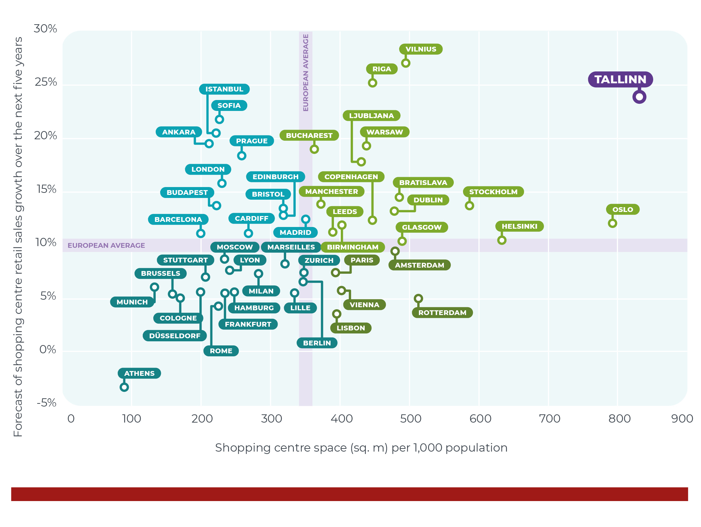

# Estonian living environment in 2050 {.chapter5 .chapter5_section}
 <script>
  window.location = "introduction-5.html";
  </script>
## Introduction {-.chapter_section .chapter5_section .intro_section #introduction-5}
<h1>Estonian living environment in 2050</h1>

```{block, type='authors'}
<div class="author-links">**[Kristi Grišakov](#kristi-grišakov)**</div>
<div><a class="print-btn" href="../print/EIA-2019-5.0-Tulevik.pdf"><i class="fa fa-file" aria-hidden="true"></i>Trükiversioon</a></div>
```

```{block, type='points'}
* Future changes will affect the physical space – both the natural and built environment – and redistribute it based on new uses.

Changes in the living environment are related to changes in the world and our ability to adapt to them. Factors influencing the development of our living environment include climate change, international corporations and politics, new technologies and services, as well as the ageing population and urbanisation. In reshaping our living environment, we must bear in mind that we cannot reverse what is already done as this would take decades, be costly and complicated. Therefore, choices affecting the living environment must rest on an understanding of the long-term impact on the quality of the living environment.

* Estonia faces a spatial choice: either to continue developing a liberal living environment with amenities only for those who are financially unburdened, or a more inclusive living environment that focuses on improving well-being for all.

To aid in this choice, four scenarios are presented in this chapter that illustrate the changes taking place in the world and in Estonia, along with their consequences. The scenarios are narratives that help us envision the future and provide a common basis for discussing it. With the help of these scenarios, we invite the reader to think about the kind of living environment we wish to inhabit in the future, and the kinds of futures we want to avoid.
```

The previous chapters of this report have described changes that have occurred over the past 30 years in the ways we communicate, travel and live, in our location preferences and our relationship to the natural environment. What will our living environment look like over the next 30 years? This chapter aims to outline the potential futures of the Estonian living environment based on global, regional and local trends and policy choices, and to use these factors to draft four future scenarios. The scenarios themselves are tools for thinking that illustrate the changes taking place in Estonia and the world, along with their consequences.

<div class='casebox'>
#### A thought exercise: current topics 30 years ago (1987–1988)
* Phosphorite rises on the agenda, specifically the plan to open a large-scale phosphorite mine in the Rakvere district, which would pollute the environment.
* The Estonian Green Movement is founded in the course of two green forums in Tallinn on 28 April and 23 May 1988.
* The Estonian Heritage Society is founded in Tallinn on 12 December 1987, with Trivimi Velliste as chairman.
* On 6 December 1987, the 500,000th citizen of Tallinn is born.
* The first computer virus appears and there is initial discussion of the concept of the World Wide Web.
</div>

With the help of these scenarios, we invite the reader to think about the kind of world we wish to inhabit in the future, and the kinds of future we want to avoid. How are we able to adapt to global developments as well as future challenges inside Estonia? The chapter consists of three parts. First, we provide an overview of the method and main principles of scenario planning. Then, we describe the main trends affecting the Estonian living environment. At the end of the chapter, we outline four future scenarios for the Estonian living environment.

### What is scenario planning? {-.chapter5_section}

Scenario planning is a planning method that aims to understand the impact of current changes and decisions on shaping the future. A scenario is a tool for strategic thinking that is used in situations where preparing for the future and making decisions is necessary despite uncertainty. The scenarios outlined here are based on the method of intuitive logics, which uses existing predictions and data to create narratives about the future that illustrate the consequences of various developments ([Wright et al. 2013](#Wright2013)).

The living environment is a distinctive field in scenario planning, because unlike technologies and services, it is slow to change. Rapid changes in the living environment involve large investments, which require money and political agreements. The living environment may be carefully planned, but the time it takes to implement these plans is generally long and real changes are slow to appear.

```{block, type='blockquote-right'}
Factors influencing the development of the 21st-century living environment are climate change, international corporations and politics, new technologies and services, as well as the ageing population and urbanisation.
```

It is difficult to predict the role and impact that factors influencing the living environment have in shaping the future. Quantitative methods are used for measuring changes in various sectors, which do not provide an overview of how the living environment is changing as a whole. Changes in the living environment are related to changes in the world and our ability to adapt. Factors influencing the development of the 21st-century living environment are climate change, international corporations and politics, new technologies and services, as well as the ageing population and urbanisation. It is often difficult to grasp which of these carry the most weight or lead to unexpected and surprising consequences. For this reason, factors shaping the future are described on two levels – as forecasts and as weak signals. Various sectoral forecasts (e.g. population forecasts) are prepared by extending past and present trends into the future. Such predictions give us an idea of the potential future if the current situation continues, but ignore factors that may shift trends and the unexpected combined impact of sectoral trends in shaping the future ([Thomas 1994](#Thomas1994)).

For this reason, the concept of weak signals has been adopted in future studies, which means that in addition to forecasts, smaller changes that have the potential to shift future trajectories are also considered. Weak signals can be seen, for example, in the values of the younger generation: young people, with their current preferences in consumption and mobility, set the patterns of behaviour for the future. Although their wider impact cannot yet be demonstrated, weak signals are important indicators to examine, as they help discuss future changes, the actual impact of which may only become apparent decades later. In this chapter, we use both types of factor – forecasts, which are more likely to prove true, and weak signals, which may have a significant impact on the living environment, but cannot currently be backed with existing evidence.

The scenarios were prepared in three stages: aggregating sectoral changes, identifying the most likely or influential changes, and using future scenarios to illustrate the consequences of these changes. Sectoral changes were determined using forecasts, reports and scenarios from Estonia and elsewhere. Some global scenarios and forecasts were included, but most of the developments described in the chapter are based on the European context and values. As a second starting point, we used the changes discussed in the chapters of this report concerning the functioning and use of the deliberative space, the living environment and the natural environment over the past 30 years, along with potential future perspectives for these fields proposed by the authors of the articles. In order to identify the most likely and significant factors, workshops with chapter editors and sectoral experts were held. In these workshops, we selected two key directions for the future narratives and produced initial content for each scenario, focusing on the daily life of residents and their relations with one another. Following the workshops, we refined the descriptions of the changes with the greatest impact and wrote up future narratives to illustrate the scenarios. Two spatial levels were considered in the selection of the described future changes: first, a larger spatial scale on which changes affect the location of living environments and their interconnections throughout Estonia, and second, a smaller spatial scale that covers changes within the living environments. In identifying significant changes, we excluded extreme shifts such as the collapse of the European Union or natural disasters. We also expected Estonia to have retained its independence in 2050. Based on these inputs, we compiled the main trends that will have significant impact on (re)shaping the spatial living environment over the next 30 years.

### Main trends {-.chapter5_section}

<span class="bullet-heading">**The era of the ageing population and population decline in Estonia and elsewhere brings on a new situation that further deepens regional inequalities.**</span>

The UN has projected that Europe’s population will peak at 748 million by 2021 and start declining after that. Although population decline has occurred in only six world countries over the past 70 years, it is estimated that 90 countries, including two-thirds of all European countries, will face depopulation between 2020 and 2100 ([Cilluffo and Ruiz 2019](#Cilluffo2019); [United Nations 2019](#ÜRO2019b)). According to Statistics Estonia’s baseline projection (2019), Estonia’s population will decrease to approximately 1.3 million by 2040 and to 1.2 million by 2060 ([Figure 5.1](#figure51)). Estonian society is characterised by a large increase in the share of the elderly – it is projected that by 2040, every fourth person (25%) in Estonia will be more than 65 years of age, and in 2060 the share of the elderly will reach 30%. The elderly of the future are currently aged 25+ and their values and choice of location determine what they will be like in old age in 2060. According to the projection, the future picture of Estonia is centred on Harju and Tartu counties – by 2040, a minimum of 65% of the population will live in these two major urban areas. These two areas therefore also have the highest share of the working age population and the lowest share of the elderly (20–21%). The populations of all the other counties are declining: in Ida-Virumaa, Järvamaa, Valgamaa and Jõgevamaa counties, the population has decreased by at least a third and is older than the national average (Ida-Virumaa and Läänemaa counties have the largest share of the elderly: up to 40%).

<p class="caption" id="figure51"><span class="figure-number">Figure 5.1.</span> Changes in the Estonian population, 2019–2080</p>

```{r, figure51, fig.asp=.75, fig.align='center', echo=FALSE, message=FALSE, warning=FALSE}

library("tidyverse")
library("scales")
library("reshape")

fig51_data <- read.csv ("../data/5_fig1_data.csv", header=TRUE, fileEncoding="utf-8", sep=";", check.names=FALSE, stringsAsFactors=FALSE)
fig51_data <- melt(fig51_data, id=c("Rahvaarv"))

names(fig51_data)[names(fig51_data) == "Rahvaarv"] <- "scenario"
names(fig51_data)[names(fig51_data) == "variable"] <- "year"

fig51_data$year <- as.numeric(as.character(fig51_data$year))

fig51_data$scenario_eng[grepl("Stsenaarium 1", fig51_data$scenario)]<-"Scenario 1 (baseline)"
fig51_data$scenario_eng[grepl("Stsenaarium 2 ", fig51_data$scenario)]<-"Scenario 2 (high birth rate and migration rate)"
fig51_data$scenario_eng[grepl("Stsenaarium 3", fig51_data$scenario)]<-"Scenario 3 (low birth rate, low mortality, balanced migration)"
fig51_data$scenario_eng[grepl("Stsenaarium 4", fig51_data$scenario)]<-"Scenario 4 (birth rate at replacement level)"

  fig51_plot <- ggplot(data = fig51_data) +
    geom_line(mapping = aes(x=year, y = value, colour=scenario_eng, group=scenario_eng), size=1) +
    scale_colour_manual(values=c("#500e0c", "#a01b17", "#a4d0cd", "#ec6823"))+
    labs(y="Population", x="") +
    scale_x_continuous(breaks=c(2019,2030,2040,2050,2060,2070,2080), expand = c(0, 0), limits=c(2019,2082))+
    scale_y_continuous(breaks=c(200000,400000,600000,800000,1000000,1200000,1400000), labels = number, expand = c(0, 0), limits=c(0,1400000))+
    expand_limits (y=0)+
      guides(colour=guide_legend(nrow=4,byrow=TRUE))

   fig51_theme <- theme(
        text = element_text(family="Montserrat"),
  )

  print(fig51_plot + fig_theme_general + fig51_theme)

  #ggsave(path="exported_figures/PDF/chapter5",filename="fig51.pdf", height=120, width=200, units="mm",encoding = "ISOLatin9.enc")
```

``` {block, type='imgsource'}
<div><span class="imgsource-source">Source:</span> Statistics Estonia 2019.</div>
<div><a class="data-btn" href="../data/5_fig1_data.csv"><i class="fa fa-download" aria-hidden="true"></i>Download data</a></div>
```

<span class="bullet-heading">**The concentration of population in large cities and the continuous emptying of the rest of Estonia is driven by accelerating economic growth occurring in urban settlements.**</span>

In the second half of the last century, recession and industrial restructuring caused the rapid decline of great industrial cities, such as Detroit and Saint Louis, which lost more than half of their population, but also of many European cities, such as Manchester and Leipzig ([Rumpel and Slach 2014](#Rumpel2014)). This century has seen a trend in several major cities, like Paris or New York, whereby urban areas have begun to grow at the expense of shrinking city centres, while other cities, such as Stockholm, Oslo and London, are projected to face steady population growth ([Evans 2019](#Evans2019); [United Nations 2018](#ÜRO2018)). In the United States, regional disparities are exacerbated by the concentration of the innovation sector (IT and high-tech companies) into only five urban regions (Boston, San Francisco, San Jose, Seattle and San Diego), which account for 90% of sectoral growth and nearly a quarter of jobs ([Atkinson et al. 2019](#Atkinson2019)). The growth rate in the urban areas of Tallinn and Tartu has for a long time exceeded that of other Estonian regions, and differences between socio-economic levels at the regional level have continuously increased. If in 1997 the GDP of Harjumaa county accounted for 55.2% of the total GDP in Estonia, then in 2007 it had reached 59.6% and in 2017 already 63.7%  ([Foresight Centre 2019](#AreguseireKeskus2019)). ). Although the advanced growth of the capital region can be considered a common phenomenon, the differences in the development of various regions in Estonia are among the largest in Europe ([ibid.](#ArenguseireKeskus2019)]). Empirical measurements of the competitive advantage of cities ([Rosenthal and Strange 2004](#Rosenthal2004)) have shown that doubling the city’s population increases the productivity of the city by 3–8% and doubling the population density increases it by 5%. Doubling the city’s sphere of influence will add another 4.5%. Businesses follow the workforce and residents relocate to where there are opportunities to find work. It is useful for businesses in the same field to concentrate in one region ([Laakso and Loikkainen 2018](#Laakso2018)).

```{block, type='blockquote-right'}
The growth rate in the urban areas of Tallinn and Tartu has for a long time exceeded that of other Estonian regions, and differences between socio-economic levels at the regional level have continuously increased.
```

As a rule, services (including new platforms) are provided and other investments made based on a cost-benefit analysis, which factors in a sufficient population size and density. From a market economy perspective, it is not viable to provide services in low-density areas, just as it is more difficult to obtain a loan for the acquisition or renovation of a dwelling in low-density and peripheral areas ([McAfee and Brynjolfsson 2017](#McAfee2017)). It has even been estimated that new mobility-as-a-service (MaaS) solutions that combine car rental, bicycle-sharing and public transport are not cost effective in urban regions with less than one million inhabitants ([Sassiad 2019](#Sassiad2019)). Therefore, it is likely that population growth and innovation in the service economy will only reach growing urban areas, further aggravating the underdevelopment of declining or smaller regions. There is concurrent movement inside and between growing urban areas. Residents prefer to relocate to smaller, lower-density cities and settlements with lower housing prices ([Thompson 2019](#Thompson2019)). In Estonia, this trend is most visible in the Harju region where Tallinn offers jobs and services, but the biggest gain is made by small surrounding towns that can offer a better living environment as well as convenient and fast connections to the capital (Keila, Saue). The average income is already higher in the area around Tallinn than it is in the capital ([Figure 5.2](#figure52)), and the social stratification between the population of the city centre and the surrounding areas (as well as between various city districts) may increase further in the future. Families with children are more likely to live outside the city and choose to locate to a new housing estate in the city outskirts ([Raid and Tammur 2018](#Raid2018)). From these statistics, the movement of young families to the countryside, as well as the movement of the elderly from larger centres back to their former neighbourhoods, can also be detected as weak signals.

<p class="caption" id="figure52"><span class="figure-number">Figure 5.2.</span> Average monthly gross income in the Tallinn area</p>

```{r, figure52, out.width='100%', fig.align='center', echo=FALSE, message=FALSE, warning=FALSE}

library(sf)          # classes and functions for vector data
library(raster)      # classes and functions for raster data
library(tmap)
library(svglite)

Brutotulu <- st_read(dsn ="../data/5_fig2_data/EKSPORT_3301-r2JoQJvv97bKfi7L-t7.shp")
head(as.data.frame(Brutotulu))

Brutotulu$VAARTUS <- as.numeric(as.factor(Brutotulu$VAARTUS)) -1
Brutotulu <- Brutotulu[order(Brutotulu$NIMI),]

fig52_data <- read.csv("../data/5_fig2_data/fig52_data.csv", header=TRUE, sep=";")
fig52_data <- fig52_data[order(fig52_data$Üksus),]

Brutotulu$palk <- fig52_data$Väärtus

names(Brutotulu)[names(Brutotulu) == "palk"] <- "Average gross income (euros)"

fig_52_plot <- tm_shape(Brutotulu) + 
    tm_fill("Average gross income (euros)",title="Average gross income (euros)", palette = c("#E6E3DA","#d7bf74","#a01b17"), breaks=c(925,1043,1075,1107,1144,1209,1349,1711), popup.vars="Average gross income (euros)", id="NIMI") +
  
  tm_borders(col="white") +
  
  tm_text (col="black", text="NIMI",xmod=0) +
  
    tm_layout(
      outer.margins=0, inner.margins=c(.02, .1, .02, .02),asp=1920/1080,
      legend.outside = FALSE,
      legend.format=list(text.separator="..."),
      frame = FALSE) +

      tm_view (
        set.zoom.limits = c(9, 12),
        set.bounds = c(23.6397953631, 58.9745283067, 26.1316992531,59.8110903998),
        view.legend.position = c("right","bottom"),
      )
   
tmap_mode("view")
fig_52_plot

#tmap_save(tm = fig52_plot, filename = "fig52.pdf")

#svg(filename="figure.svg")
#fig_153_plot
#dev.off()

```

``` {block, type='imgsource'}
<div><span class="imgsource-source">Source:</span> Statistics Estonia 2018.</div>
<div><a class="data-btn" href="../data/5_fig2_data.zip"><i class="fa fa-download" aria-hidden="true"></i>Download data</a></div>
```

<span class="bullet-heading">**Infrastructure investments and high-speed train connections in particular encourage sustainable spatial planning.**</span>

```{block, type='blockquote-left'}
Taristu arendamine lähtub Euroopa Liidu strateegiast muuta aastaks 2050 transpordisektor süsinikuvabaks.
```

The impact of infrastructure may also be reversed – if high-speed connections are provided only between large centres, regional imbalances and peripheralisation will be exacerbated. The advancement of infrastructure is guided by the European Union strategy to decarbonise the transport sector by 2050 ([European Commission 2018](#EuroopaKomisjon2018)). In addition to the European Union, other countries also invest in transport – China, for example, has made transport investments in Europe, Asia and Africa and is a major investor in the FinEst Bay Area project, which aims to build a rail tunnel and artificial islands between Helsinki and Tallinn with funding from private investors. The 2039 scenarios of urbanisation in Finland ([Demos Helsinki 2018](#DemosHelsinki2018)) include the scenario of ‘One-hour Finland’, where convenient new connections make it possible to reach all major centres in one hour. In Estonia, this scenario will partly be realised with the completion of the Rail Baltica route, which will bring Pärnu less than an hour away from Tallinn and Riga considerably closer than it currently is. This can help balance future projections that are rather focused on the Tallinn and Tartu regions by adding another centre. International connections, such as Rail Baltica, are important for ensuring pan-European cohesion, but without the simultaneous development of domestic high-speed train traffic, they will only boost the continued growth of the three largest urban areas and thereby aggravate demographic decline in the parts of Estonia left off-route.

<span class="bullet-heading">**Declining areas are an opportunity for newcomers.**</span>

According to the United Nations ([2017](#ÜRO2017)). there are 258 million immigrants in the world, with six out of ten immigrants settling in Asia or Europe. Two-thirds of all immigrants also originate from Asia or Europe. International migration has intensified since 2000, increasing by 50% (85 million people in total), while only 10% of migrants are refugees. The 2039 scenarios of urbanisation in Finland ([Demos Helsinki 2018](#DemosHelsinki2018)) highlight the movement of immigrants to smaller towns rather than large urban areas as an important trend. The importance of immigration is also emphasised in the scenario supporting the FinEst Bay Area project ([Demos Helsinki 2019](#DemosHelsinki2019)), which estimates that opening the rail tunnel and continuing to increase the number of air routes to Asia could attract nearly 30,000 foreign inhabitants per year to the Helsinki-Tallinn area. As the housing market in Tallinn is more affordable and less regulated than the one in Helsinki (no extensive city rental housing programme exists in Tallinn nor any definite mechanisms to prevent social stratification), the opening of the tunnel may lead to an increase in real estate prices in Tallinn and the entire Harjumaa county. This change may in turn prompt people to select more affordable options in other areas of Estonia or to leave the country altogether.

<span class="bullet-heading">**Climate change is reshaping people’s location and lifestyle preferences as well as the functioning and appearance of the built environment and public space.**</span>

The effects of climate change will be felt around the world. Poor developing countries are most affected by climate change, as they are most dependent on their natural environment and lack the resources to cope with the changing climate. Climate change affects different parts of Europe in different ways. In southern and central Europe, heat waves, forest fires and droughts are becoming more frequent. Northern Europe is becoming significantly rainier and winter floods may become commonplace. Between 1980 and 2011, floods affected more than 5.5 million people in Europe and the direct economic damage amounted to more than 90 billion euros ([European Commission 2019](#EuroopaKomisjon2019)).

```{block, type='blockquote-left'}
Adaptability means the economic, socio-cultural, institutional and technological capacity of a region to avoid the threats posed by climate change, but also to seize new opportunities.
```

The impact of climate change in Estonia is moderate compared to southern European regions, yet Estonia’s ability to adapt to climate change is assessed as weaker than average ([ESPON 2012](#EPSON2012)). According to Estonian climate scenarios until the year 2100 ([Luhamaa et al. 2014](#Luhamaa2014)), floods and droughts will become more frequent in Estonia as well, coastal erosion will increase, coastal constructions will be exposed and greater storm damage will occur. Climate change will also affect the duration of ice and snow cover, lead to increased forest fires and cause the migration of alien species to Estonia. Lower coastal areas, including those situated in larger Estonian cities, may become uninhabitable, and the value of real estate there will decrease. Large asphalt surfaces in cities make it difficult to drain storm water during heavy rainfall and create heat islands during periods of high summer temperatures.

In addition to climate change, the living environment will also be shaped by climate-neutrality targets, such as the European Union’s 2050 long-term strategy ([European Commission 2018](#EuroopaKomisjon2018)), which includes major renovations of buildings, specifically apartment buildings, as well as the replacement of internal combustion engine cars with other technologies, and the prioritisation of public transport and other sustainable modes of mobility.

<span class="bullet-heading">**There is growing awareness of the role of the living environment in reducing health risks and supporting healthy lifestyles ([Ministry of Social Affairs 2019](#Sotsiaalministeerium2019)).**</span>

A well-planned living environment plays a major but often overlooked role in shaping the population’s health-related behaviour and mitigating health risks. For example, a cycling feasibility study conducted by the City of Helsinki ([Helsingin kaupunkisuunnitteluvirasto 2014](#Helsinginkaupunkisuunnitteluvirasto2014)) found that investing in bicycle infrastructure promotes the health of the population as well as accessibility. The cost-benefit ratio for an annual investment of 20 million is 8, which means that for every euro invested, there is a return of 8 euros. In Helsinki, the share of cycling in all modes of transport was 11% in 2013, while the target for 2020 is 15%. By comparison: in Tallinn, the share of cycling is only 1% of all modes of transport ([Estonian Research Centre 2018](#EestiUuringukeskus2018)). Almost a third or 30.7% of Estonians walk or cycle between home and work for up to 15 minutes a day, while six years earlier this figure was only 21.9% ([Reile et al. 2019](#Reile2018)). Residents of central, northern and southern Estonia are less mobile than average; these areas are also home to the largest urban areas. The effect of mobility habits on the health of children is particularly important, as they are spending less time outdoors and are increasingly given rides to school or kindergarten. A quarter of first-graders are overweight or obese ([Metsoja et al. 2018](#Metsoja2015)). The poor quality of the living environment (lack of access to green spaces, noise and light pollution) also affects mental health and stress levels.

```{block, type='blockquote-right'}
Almost a third or 30.7% of Estonians walk or cycle between home and work for up to 15 minutes a day.
```

According to scenarios by the European Health Forum ([EHFG 2017](#EHFG2017)), monitoring the health-related behaviour of the population and promoting healthy lifestyles is becoming increasingly important in the context of an ageing society and rising healthcare costs. The European Health Forum’s scenarios for 2037 outline three possible options for how the responsibility for human health will be distributed between citizens and society. The first option is to link health monitoring to a welfare state that also provides basic income. The second option is that, in the future, each citizen will monitor their own health, bearing sole responsibility if they should fail. The third option is that monitoring health will be entrusted to technology, using genetic analysis as well as sensors that monitor citizens’ daily lives to identify potential health problems.

<span class="bullet-heading">**Mobility needs and the distances between parts of the living environment (home, work, leisure) are increasing. New mobility-as-a-service solutions are reshaping people’s mobility habits.**</span>

The International Air Transport Association ([IATA 2019](IATA2019)) predicts that by 2036, the number of air passengers will multiply, reaching 7.8 billion a year. The distance travelled by car will increase by an average of 23% by 2030 (to 5.88 trillion kilometres). The distance travelled will increase even more in the United States (24%) and China (183%) ([PwC 2018](PWC2018)). In Finland, for example, one-fifth of families with children move between several dwellings each week ([Demos Helsinki 2018](DemosHelsinki2018)). In Estonia, the distance between the workplace and the place of residence has increased year by year. The average distance to work increased from 7.3 kilometres in 1998 to11 kilometres in 2017 ([Statistics Estonia 2018b](#Statistikaamet2018b)). Addressing the growing need for mobility is one of the key issues in meeting the UN’s 2030 Agenda for Sustainable Development goals. The main means of transport in Estonia are private cars with internal combustion engines ([Tuvikene et al., this repot](#accessibility-changes-in-motorised-Estonia)), but according to the European Union’s long-term strategy, the entire transport sector should be carbon-free by 2050 ([European Commission 2018](#EuroopaKomisjon2018)).

```{block, type='blockquote-left'}
In Tallinn city centre, the total land area taken up by parking spaces is equal to that taken up by residential buildings and larger than that taken up by office buildings.
```

An increasing need for mobility, long distances and the convenience of services are driving the development of new MaaS solutions (e.g. car sharing, short-term car and scooter rental). New MaaS solutions such as car sharing are starting to compete with public transport, mainly due to their greater ease of use. Ride-sharing as a service is not significantly different from a taxi service, but its platform-based and algorithm-driven management means shorter waiting times and often also lower prices. The use of ride-sharing services is growing rapidly: by 4% in two years (from 19% to 23%), according to a recent survey ([Gartner Research 2017](#GartnerResearch2017)).The same survey states that 50% of respondents are willing to give up their private car if they save at least 50% on the cost of owning a car and the ride-sharing car arrives in less than ten minutes. In 2015, the average cost of a private car in Tallinn was 259 euros a month ([TNS Emor, 2015](#TNSEmor2015)) and the Tallinn parking survey ([Cerrone et al. 2019](#Cerrone2019)) shows that Bolt’s ride-sharing service is used in those areas of the city centre with very good public transport connections. The MaaS solution Whim, which operates in Finland, combines different travel options (city bike, public transport, short-term car rental) within one monthly package that is cheaper than the cost of a private car. Part of the issue is the cost of parking: the higher the real estate prices in Tallinn, and especially the city centre ([Land Board 2015](#Maa-amet2015); [Noorkõiv 2015](#Noorkõiv2015)), the more profitable it is to use valuable land – a significant part of which is currently used as car parks – purposefully; that is, for the development of housing. In Tallinn city centre, the total land area taken up by parking spaces is equal to that taken up by residential buildings and larger than that taken up by office buildings ([Cerrone jt 2019](#Cerrone2019)). The value of the land covered by parking spaces, estimated as the ratio of the number of open air parking spaces (source: Europark) to the value of the last purchase of the land (source: Land Board), varies from an average of 128 euros per parking space in Mustamäe up to 10,789 euros per parking space in the city centre (ibid.). Due to this, the number of parking spaces will decrease and parking fees will rise. Parking as an amenity service will become more and more expensive, especially in the city centre, and lead people to opt for public transport and MaaS solutions to get to the city centre. The first self-driving cars are likely to be geared towards car-sharing services, as this is seen as their main application. It is projected that by 2030, these vehicles could already account for 40% of the annual private use mileage in Europe ([PwC 2018](#PWC2018)). The use of self-driving cars in car-sharing services helps save on labour costs and lower the price of the service even further. This means that public transport services will struggle even more to compete with cars (including car sharing) in terms of ease of use. The advent of self-driving vehicles will also change the use of space; for example, multi-storey car parks will be repurposed and former outdoor car parks developed as housing or converted into public space.

<span class="bullet-heading">**Employment relationships will change and remote work will become an important way of working, offering the opportunity to live in a low-density area ([Foresight Centre 2019](#AreguseireKeskus2019)).**</span>

```{block, type='blockquote-right'}
Tallinn competes with Stockholm, Helsinki and Riga in terms of the attractiveness of the living and working environment
```

In the European Union, 5% of the working-age population regularly works remotely. The share of remote workers in the Netherlands (13.7%) and Finland (12.7%) is more than twice as high as in Estonia (6%). In Denmark and Sweden, more than half of the employees can use flexible working hours ([Foresight Centre  2018](#AreguseireKeskus2018)). In 2015, 20% of employees in Estonia had worked remotely and the number of those who wished to work remotely increased to 34% ([Ministry of Social Affairs 2017](#Sotsiaalministeerium2017)). In terms of flexible working hours and employee autonomy (30%), Estonia ranks ninth in the European Union. The increasing share of remote work has an impact on the mobility of the population and the use of space. It is therefore not necessary to reside in the vicinity of the workplace, as regular attendance is not expected. The distance between home and work may thus continue to increase. New technologies can further reduce the need to be present at the workplace and remote work will allow for a more flexible and efficient use of office spaces. Working – in terms of working hours, ways of working and working conditions – is becoming more in line with people’s individual needs ([Demos Helsinki 2018](#DemosHelsinki2018)). Due to economic and technological preconditions, the opportunity for part-time remote work is available primarily to the middle class in more affluent societies and regions ([Foresight Centre 2019](#AreguseireKeskus2019)). Jobs are increasingly following the talent – both to vibrant city centres and peaceful, scenic areas ([Demos Helsinki 2018](#DemosHelsinki2018)). Sixty-four per cent of global knowledge economy workers choose their workplace based on location, rather than on organisation ([Pärna 2016](#Pärna2016)). Jobbatical, which facilitates labour migration, and Teleport, which can be used to compare cities suitable for living and working, are new companies with Estonian beginnings that provide an idea of the mobility of working life. Tallinn competes with Stockholm, Helsinki and Riga in terms of the attractiveness of the living and working environment ([ibid.](#Pärna2016)). Remote work opportunities and the following of talent may give Estonia’s low-density remote areas a development advantage over large centres, but gains for specific settlements and regions depend on the quality of the living environment they are able to provide ([Foresight Centre 2019](#AreguseireKeskus2019)).

<span class="bullet-heading">**Our mobility is increasingly being monitored and guided by technology.**</span>

Digital platforms are successful primarily because they can collect, store, analyse and create new value from large amounts of data. The advent of the mobile internet and the smartphone made it possible not only to collect data on computer operations but also on the movement of people. Platforms such as Facebook and Google rely heavily on advertising revenue. Advertising accounts for over 80% of the revenue of Twitter and Google and almost 100% of the revenue of Facebook and Snapchat ([United Nations 2019](#ÜRO2019a)). Therefore, these platforms have a strong incentive to collect and analyse personal data, as it can be used to target advertising to users. Among Estonian internet users in the 16–74 age bracket, 90% used the internet to send or read emails and search for information about products and services. In the past 12 months, travel services (e.g. Taxify, Uber) and accommodation (e.g. Airbnb) were booked via a website or mobile app by every fourth and fifth internet user, respectively ([Statistics Estonia 2018a](#Statistikaamet2018a)). The more (large) companies can collect consumer data for various products and services, the more effectively they can profile consumers, target products to them and guide their choices ([Ibrus 2019](#Ibrus2019b)). Therefore, people’s choices (including mobility) in both the digital and physical space are increasingly organised by algorithms. Suggestions from different applications play a bigger role in choosing a destination – users can see options that match their profile or are liked by their friends. Navigating to destinations also follows the route recommended by the application. By constantly following the recommendations of the algorithms, passive consumers emerge who choose only between the prescribed options ([de Waal 2014](#Waal2014); [Mällo 2019](#Mällo2019)).

In the future, spatial data will play an important role in understanding the user experience and planning better-quality space ([Puusepp and Kalvo, this report](#data-driven-spatial-planning)) but only if the local government or the state has access to this data. In the case of data collected by large companies, citizens have little control over what the data is used for and to whom it is sold.

<span class="bullet-heading">**The younger generations’ orientation towards mobility and experience is reshaping the way we live and spend our free time.**</span>

Three-quarters of the new generation (especially millennials, aged 18–34) want to spend their money on gaining experiences rather than possessions ([Eventbrite 2017](#Eventbrite2017)). Fourth-fifths of the people in this age group participate regularly in various events, as it is important for them to meet people from their community and the world. Two-thirds of parents increasingly attend family-friendly events with their children and more than 53% of millennials are parents; so participation in events does not end with starting a family. Young people (aged 16–24) in Estonia also spend their income on experiences. Over the past 12 months, 25% of young people have booked accommodation from a private individual ([Ait 2017](#Ait2017)) and 41% have ordered a travel service online. The most frequently purchased products and services for young people were transport (64%) and events (63%). The popularity of nature visits can also be considered experience-based. A study of young people’s use of natural areas ([Orru et al., this report](#the-impact-of-natural-areas-on-people’s-well-being)) revealed that 75% of young people highly value opportunities to be in nature. Young people appreciate the sense of relaxation that comes with spending time in nature, either alone or with others, or from physical exertion. This trend towards experience and collective activities makes the public space an eventful arena for concerts, sports (e.g. marathons) and other activities ([Demos Helsinki 2018](#DemosHelsinki2018)). The experience-oriented generation is also characterised by flexibility and mobility in their choice of work and lifestyle. According to a PricewaterhouseCoopers survey, 72% of millennials want to work abroad during their careers ([PwC 2012](#PWC2012)). In most cases, ‘abroad’ is limited to Western countries, while only 9% are willing to work in India or China. The Z generation following the millennials is likely to change jobs an average of 17 times, careers 5 times and homes 15 times during their lives ([McCrindle 2018](#McCrindle2018)).

<span class="bullet-heading">**The Estonian living environment is shaped by a liberal approach to space, according to which the primary role of public space is to be an arena for consumption and private motorised travel, governed by individual benefits.**</span>

```{block, type='blockquote-left'}
Fifty per cent of the area of well-functioning settlements should be used as public space, but few settlements meet this target.
```

As of 2016, the leasable floorspace per capita of shopping centres was 2.2 sq. m in the USA, 1.5 sq. m in Canada and 1.0 sq. m in Australia ([Rapp and Helimer 2016](#Rapp2016)). ). Tallinn has nearly twice as much shopping centre floorspace per capita as the capital cities of the other Baltic countries: 0.8sq. m in Tallinn, 0.5 sq. m in Vilnius and 0.4sq. m in Riga ([Figure 5.3](#figure53); [Cushman & Wakefield 2015](#Cushman2015)). As of the end of 2019, the total commercial floorspace in Tallinn was 1.64 sq. m per capita. In a recent survey of parking in Tallinn ([Cerrone et al. 2019](#Cerrone2019)), the total area occupied by parking spaces, roads and pedestrian space (including footpaths) in various districts of the city was calculated. The total area designated for parking and car traffic is more than twice that reserved for pedestrians. Furthermore, the total area of parking spaces and roads is twice that occupied by residential buildings in most city districts ([Figure 5.4](#figure54)).In the rapidly growing suburbs, even less public space has been planned to be available outside the residential plots ([Leetmaa, this report](#sissejuhatus-1)).). According to a UN-Habitat study ([2015](#UN-Habitat2015)), 50% of the area of well-functioning settlements should be public space, but few settlements meet this target.

<p class="caption" id="figure53"><span class="figure-number">Figure 5.3.</span> Floorspace of shopping centres in Tallinn compared to other European cities</p>

```{r, figure53, out.width='100%', fig.align='center', echo=FALSE, message=FALSE}



```

``` {block, type='imgsource'}
<span class="imgsource-source">Source:</span> Cushman & Wakefield 2015.
```

Drawing a parallel with social media, public space can be described as a giant platform (e.g. like  Facebook). The traditional societal role of public space has been to bring together stakeholders and allow us to meet those who are different from us ([de Waal 2014](#Waal2014)). SJust as the fragmentation of online media is a problem when different groups do not want to engage in social dialogue ([Ibrus, this report](#sissejuhatus-4)), there is a problem with the democratic functioning of physical space when there is no public space where we can interact with people from different backgrounds and with different views. Therefore, the quality of public space, the ability to offer activities for different age groups and bring people together for common rituals are becoming increasingly important ([Demos Helsinki 2018](#DemosHelsinki2018)).

<p class="caption" id="figure54"><span class="figure-number">Figure 5.4.</span> Use of space in Tallinn</p>

```{r, figure54, fig.asp=1.5, fig.align='center', echo=FALSE, message=FALSE, warning=FALSE}

library("tidyverse")
library("scales")
library("reshape2")

fig54_data <- read.csv ("../data/5_fig4_data2.csv", header=TRUE, fileEncoding="utf-8", sep=";", check.names=FALSE)
fig54_data <- melt(fig54_data, id=c("Linnaosa"))

#fig54_data$variable <- factor(fig54_data$variable, levels = c("Parkimiskohtade pindala (20m²/pk)","Parkimiskohtade pindala (25m²/pk)","Parkimiskohtade pindala (30m²/pk)","Parkimiskohtade pindala (40m²/pk)","Tänavavõrgu pindala (m²)","Jalakäija ruumi pindala (m²)","Eluruumide pindala (m²)","Bürooruumide pindala (m²)","Kaubandus- ja teeninduruumide pindala (m²)","Meelelahutus-, haridus- tervishoiu- ja muude avalike ruumide pindala (m²)","Tööstus- ja laoruumide pindala (m²)"))

fig54_data$variable_eng[grepl("Parkimiskohad", fig54_data$variable)]<-"Parking spaces (25m²/pk)"
fig54_data$variable_eng[grepl("Tööstus- ja laoruumid", fig54_data$variable)]<-"Industrial and storage facilities"
fig54_data$variable_eng[grepl("Meelelahutus-, haridus-, tervishoiu- ja muud avalikud ruumid", fig54_data$variable)]<-"Public spaces (entertainment, education, health, etc.)"
fig54_data$variable_eng[grepl("Kaubandus- ja teenindusruumid", fig54_data$variable)]<-"Commercial and service spaces"
fig54_data$variable_eng[grepl("Bürooruumid", fig54_data$variable)]<-"Office spaces"
fig54_data$variable_eng[grepl("Eluruumid", fig54_data$variable)]<-"Dwellings"
fig54_data$variable_eng[grepl("Jalakäijate ruum", fig54_data$variable)]<-"Pedestrian space"
fig54_data$variable_eng[grepl("Tänavavõrk", fig54_data$variable)]<-"Street network"

fig54_data$variable_eng <- factor(fig54_data$variable_eng, levels = c("Parking spaces (25m²/pk)","Street network","Pedestrian space","Dwellings","Office spaces","Commercial and service spaces","Public spaces (entertainment, education, health, etc.)","Industrial and storage facilities"))

  fig54_plot <- ggplot(data = fig54_data) +
    geom_col(mapping = aes(x=variable_eng, y = as.numeric(as.character(value)), fill=variable_eng), size=0.7) +
    facet_wrap(~Linnaosa, nrow=8, strip.position="right") +
    coord_flip() +
    labs(y="m²", x="") +
    scale_y_continuous(labels=function(x) format(x, big.mark = " ", scientific = FALSE), limits=c(0,3000000), breaks=c(0, 1250000,2500000)) +
    scale_fill_manual(values=c("#500e0c", "#a01b17", "#ce2e26", "#da702d","#3c2754","#664a92", "#548ea4", "#bfd3d8"),guide = guide_legend(reverse = TRUE)) +
      guides(fill=guide_legend(nrow=4,byrow=TRUE))

   fig54_theme <- theme(
    #axis.text.y = element_blank(),
    legend.position="none",
    strip.text.y = element_text(size = 10),
    panel.grid.major.y = element_blank() ,
    panel.grid.minor.y = element_blank(),
    axis.line.y = element_blank(),
    axis.ticks.y = element_blank(),
    text = element_text(family="Montserrat"),
  )

  print(fig54_plot + fig_theme_general + fig54_theme)

  #ggsave(path="exported_figures/PDF/chapter5",filename="fig54.pdf", height=260, width=195, units="mm",encoding = "ISOLatin9.enc")
```

``` {block, type='imgsource'}
<div><span class="imgsource-source">Source:</span> Cerrone et al. 2019.</div>
<div><a class="data-btn" href="../data/5_fig4_data2.csv"><i class="fa fa-download" aria-hidden="true"></i>Download data</a></div>
```

```{block, type='blockquote-left'}
Public space is a place where a shared identity can be amplified and recreated through various shared rituals
```

The factors shaping the future of space (including public space) can be divided into two general categories – communal and liberal. The predominance of commercial areas, parking and roads is considered to be one of the symptoms of the dominance of liberal spatial planning  ([de Waal 2014](#Waal2014)). The liberal approach to space is characterised by a high degree of freedom of choice for citizens, while citizens are seen primarily as consumers of various services. According to this approach to space, it is socially acceptable for a citizen to move only in the private sphere (i.e. in a car, not on public transport) or to isolate themselves behind tall fences. The concept of the smart city of the future is also associated mainly with a liberal approach to space, where citizens ‘trade’ their data in return for the opportunity to use space or services ([Rogan 2019](#Rogan2019)). In contrast to the liberal approach to space, community public space can be defined through symbols such as the Song Festival Grounds, as well as the central squares of cities and neighbourhood festivals. The communal approach to space emphasises the shared identity of citizens, not their individual characteristics. Public space is a place where a shared identity can be amplified and recreated through various shared rituals. A communal approach to space is supported, for example, by the Republic of Estonia 100 Good Public Space programme for the renovation of town squares and main streets, and campaign culture, such as the Let’s Do It campaign days, the public hiking trail network, community gardens, as well as municipal participatory budgeting, through which various public space projects have been carried out. The future of public space depends on whether and how a balance is struck between these two ideals – enough freedom and individuality on the one hand and connection to one’s community and culture on the other.

### *Acknowledgements* {-.chapter5_section #acknowledgements50}

*We would like to thank everyone who participated in the future scenario workshops. Thank you, Helen Sooväli-Sepping, Indrek Ibrus, Asko Lõhmus, Kadri Leetmaa, Epp Lankots, Triin Vihalemm, Margit Keller, Kaja Peterson, Alar Kilp, Teele Pehk, Gerrit Mäesalu, Anni Müüripeal, Martin Noorkõiv, Mihkel Laan, Mihkel Kaevats, Toomas Tammis, Jan Kaus and Kaisa Schmidt-Thomé!*

### Forecasts and scenarios used {-.subreferences}

<p id="AreguseireKeskus2018">Foresight Centre – Arenguseire Keskus 2018. Tööturg 2035. Tööturu tulevikusuunad ja -stsenaariumid.</p>

<p id="AreguseireKeskus2019">Foresight Centre – Arenguseire Keskus 2019. Eesti regionaalse majanduse stsenaariumid 2035.</p>

<p id="DemosHelsinki2018">Demos Helsinki 2018. Kaupungistumisen käännekohdat: skenaarioita Suomen kaupungistumisen tulevaisuudesta 2039.</p>

<p id="DemosHelsinki2019">Demos Helsinki 2019. The Zone of Open Optimism: A Scenario of the Tallinn–Helsinki Metropolitan Area in the 2030s.</p>

<p id="EHFG2017">EHFG – European Health Forum Gastein 2017. The EHFG Health Futures Project: Scenarios for Health in 2037.</p>

<p id="Luhamaa2014">Luhamaa, A., Kallis, A., Mändla, K., Männik, A., Pedusaar, T., Rosin, K. 2014. Eesti tuleviku kliimastsenaariumid aastani 2100. Tallinn: Keskkonnaagentuur.</p>

<p id="Statistikaamet2019">Statistics Estonia 2019. Rahvastikuprognoos aastani 2080..</p>

<p id="ÜRO2019a">UN – United Nations 2019a. Revision of World Population Prospects.</p>

### References {-.subreferences}

<p id="Ait2017">Ait, J. 2017. Noored IT-seadmete ja interneti maailmas. https://blog.stat.ee/2017/10/26/noored-it-seadmete-ja-interneti-maailmas.</p>

<p id="Atkinson2019">Atkinson, R. D., Muro, M., Whiton, J. 2019. The case for growth centers: how to spread tech innovation across America. Washington: Brookings.</p>

<p id="Börjeson2006">Börjeson, L., Höjer, M., Dreborg, K.-H., Ekvall, T., Finnveden, G. 2006. Scenario types and techniques: towards a user’s guide – Futures, 38 (7), 723–739.</p>

<p id="Cerrone2019">Cerrone, D, Grišakov, K., Lehtovuori, P., Männigo, K. 2019. meta PARK. Tallinn: SPIN Unit.</p>

<p id="Cilluffo2019">Cilluffo, A., Ruiz, N. G. 2019. World’s population is projected to nearly stop growing by the end of the century. Pew Research Center, Fact-tank – News in the Numbers.</p>

<p id="Cushman2015">Cushman & Wakefield 2015. European Shopping Centre Development Report.</p>

<p id="Waal2014">de Waal, M. 2014. The City as Interface. How New Media Are Changing the City. Rotterdam: nai010 publishers.</p>

<p id="EestiUuringukeskus2018">Estonian Research Centre – Eesti Uuringukeskus 2018. Tallinnlaste rahuloluküsitlus 2018-3.</p>

<p id="EPSON2012">ESPON – European Spatial Planning Observation Network 2012. Climate Change and Europe’s Regions. https://www.espon.eu/climate-2012.</p>

<p id="EuroopaKomisjon2018">European Commission 2018. A Clean Planet for all: A European strategic long-term vision for a prosperous, modern, competitive and climate neutral economy. https://eur-lex.europa.eu/legal-content/EN/TXT/HTML/?uri=CELEX:52018DC0773&from=EN.</p>

<p id="EuroopaKomisjon2019">European Commission 2019. Climate change consequences. https://ec.europa.eu/clima/change/consequences_en.</p>

<p id="Evans2019">Evans, J. 2019. Global cities begin to shrink as inner areas empty out. – Financial Times, 25 August.</p>

<p id="Eventbrite2017">Eventbrite 2017. The Experience Movement. How Millennials Are Bridging Cultural and Political Divides Offline.</p>

<p id="GartnerResearch2017">Gartner Research 2017. For Mobility as a Service to Work, CIOs Must Help Deliver Convenience to Customers or End Users Over Cost Reductions.</p>

<p id="Helliwell2019">Helliwell, J. F., Layard, R., Sachs, J. D. 2019. World Happiness Report.</p>

<p id="Helsinginkaupunkisuunnitteluvirasto2014">Helsingin kaupunkisuunnitteluvirasto 2014. Pyöräilyn edistämisohjelma.</p>

<p id="IATA2019">IATA 2019. 20 Year Passenger Forecast.</p>

<p id="Ibrus2019b">Ibrus, I. 2019. Ostes pileteid eesti eludesse – ERR Arvamus, 17 October.</p>

<p id="Laakso2018">Laakso, S., Loikkainen H. A. 2018. Kaupungistuminen – viimeaikainen ilmiö vai pitkään jatkunut kehityskulku? – Kvartti, 11 May.</p>

<p id="Maa-amet2015">Land Board 2015. Elamumaa turuülevaade.</p>

<p id="McAfee2017">McAfee, A., Brynjolfsson, E. 2017. Machine, Platform, Crowd: Harnessing Our Digital Future. New York: W. W. Norton & Company.</p>

<p id="McCrindle2018">McCrindle, M. 2018. Generation next: meet Gen Z and the Alphas. https://mccrindle.com.au/insights/blog/generation-nextmeet-gen-z-alphas.</p>

<p id="Metsoja2015">Metsoja, A., Nelis, L., Nurk, E. 2018. Euroopa laste rasvumise seire. Eesti 2015/16. õa uuringu raport. Tallinn: Tervise Arengu Instituut.</p>

<p id="Sotsiaalministeerium2017">Ministry of Social Affairs 2017. Eesti tööelu-uuring 2015. 1.</p>

<p id="Sotsiaalministeerium2019">Ministry of Social Affairs 2019. Rahvastiku tervise arengukava 2020–2030. https://www.sm.ee/et/rahvastiku-tervise-arengukava-2020-2030.</p>

<p id="Mällo2019">Mällo, T. 2019. Pärast kino läheme õhtust sööma. Kes seda tegelikult otsustab? – Eesti Päevaleht, 26 November.</p>

<p id="Noorkõiv2015">Noorkõiv, R. 2015. Korteriturg regionaalarengu taseme mõõdikuna – Servinski, M., Kivilaid, M., Tischler, G. (eds.). Eesti piirkondlik areng 2015. Tallinn: Statistikaamet, 170–176, 177–181.</p>

<p id="Pärna2016">Pärna, O. (ed.) 2016. Töö ja oskused 2025. Tööjõuvajaduse seire- ja prognoosisüsteem OSKA – OSKuste Arendamise koordinatsioonisüsteemi loomine. Ülevaade olulisematest trendidest ja nende mõjust Eesti tööturule kümne aasta vaates. Tallinn: Sihtasutus Kutsekoda.</p>

<p id="PWC2012">PwC – PricewaterhouseCoopers 2012. Millennials at Work – Reshaping the Workplace in Financial Services.</p>

<p id="PWC2018">PwC – PricewaterhouseCoopers 2018. Five Trends Transforming the Automotive Industry.</p>

<p id="Raid2018">Raid, K., Tammur, A. 2018. Millisesse perre sünnivad lapsed? – Eesti Statistika Kvartalikiri, 4, 9–17.</p>

<p id="Rapp2016">Rapp, N., Heimer, M. 2016. These 4 charts show why shopping malls are in trouble. – Fortune, 2 December.</p>

<p id="Reile2018">Reile, R., Tekkel, M., Veideman, T. 2019. Eesti täiskasvanud rahvastiku tervisekäitumise uuring 2018. Tallinn: Tervise Arengu Instituut.</p>

<p id="Rogan2019">Rogan, K. 2019. The 3 pictures that explain everything about smart cities. https://www.citylab.com/design/2019/06/smart-city-photos-technology-marketing-branding-jibberjabber/592123/?fbclid=IwAR0wxR1RB5n9HicYYEuZfse_rjmm-0s37czDBnM-uMLGdv-qpCEIwvi1bRds.</p>

<p id="Rosenthal2004">Rosenthal, S. S., Strange, W. C. 2004. Evidence on the nature and sources of agglomeration economies. – Henderson, J. V., Thisse, J. F. (eds.). Handbook of Regional and Urban Economics, Volume 4, Cities and Geography. Amsterdam: Elsevier, 2119–2171.</p>

<p id="Rumpel2014">Rumpel, R., Slach, O. 2014. Shrinking cities in central Europe. – Tasilo, H., Petr, D., Pavel, R., Koutsky, J. (eds.). Transitions in Regional Science – Regions in Transition: Regional Research in Central Europe. Prague: Wolters Kluwer, 142–155.</p>

<p id="Sassiad2019">Sassiad, M. 2019. Liikuvus kui teenus. Tartu Planeerimiskonverentsi 2019 ettekanne.</p>

<p id="Schwartz1991">Schwartz, P. 1991. The Art of the Long View: Paths to Strategic Insight for Yourself and Your Company. New York: Currency Doubleday.</p>

<p id="Statistikaamet2018a">Statistics Estonia 2018a. Jagamismajandusteenuse kasutajate osatähtsus suureneb. Press release 100.</p>

<p id="Statistikaamet2018b">Statistics Estonia 2018b. TT232: Põhitöökoha keskmine kaugus elukohast soo ja töölkäimise viisi järgi. Database.</p>

<p id="Thomas1994">Thomas, C. W. 1994. Learning from imagining the years ahead. – Planning Review, 22 (3), 6–10.</p>

<p id="Thompson2019">Thompson, D. 2019. Why are America’s three biggest metros shrinking? https://www.citylab.com/life/2019/09/why-are-americas-three-biggest-metros-shrinking/597682.</p>

<p id="TNSEmor2015">TNS Emor 2015. Tallinna elanike liikumisviiside uuring elektrisõidukite lühirendi ja säästva transpordi kasutamise arendamiseks.</p>

<p id="ÜRO2017">UN – United Nations Population Division 2017. Population Facts 2017.</p>

<p id="ÜRO2018">United Nations Population Division 2018. The World’s Cities in 2018. Data Booklet.</p>

<p id="ÜRO2019b">UN – United Nations 2019b. Digital Economy Report 2019. Value Creation and Capture: Implications for Developing Countries.</p>
<p id="UN-Habitat2015">UN-Habitat 2015. United Nations Human Settlements Programme (UN-Habitat). Global Public Space Toolkit: From Global Principles to Local Policies and Practice.</p>

<p id="Wright2013">Wright, G., Cairns, G., Bradfield, R. 2013. Scenario methodology: new developments in theory and practice. Introduction to the Special Issue. – Technological Forecasting and Social Change, 80 (4), 561–565.</p>
