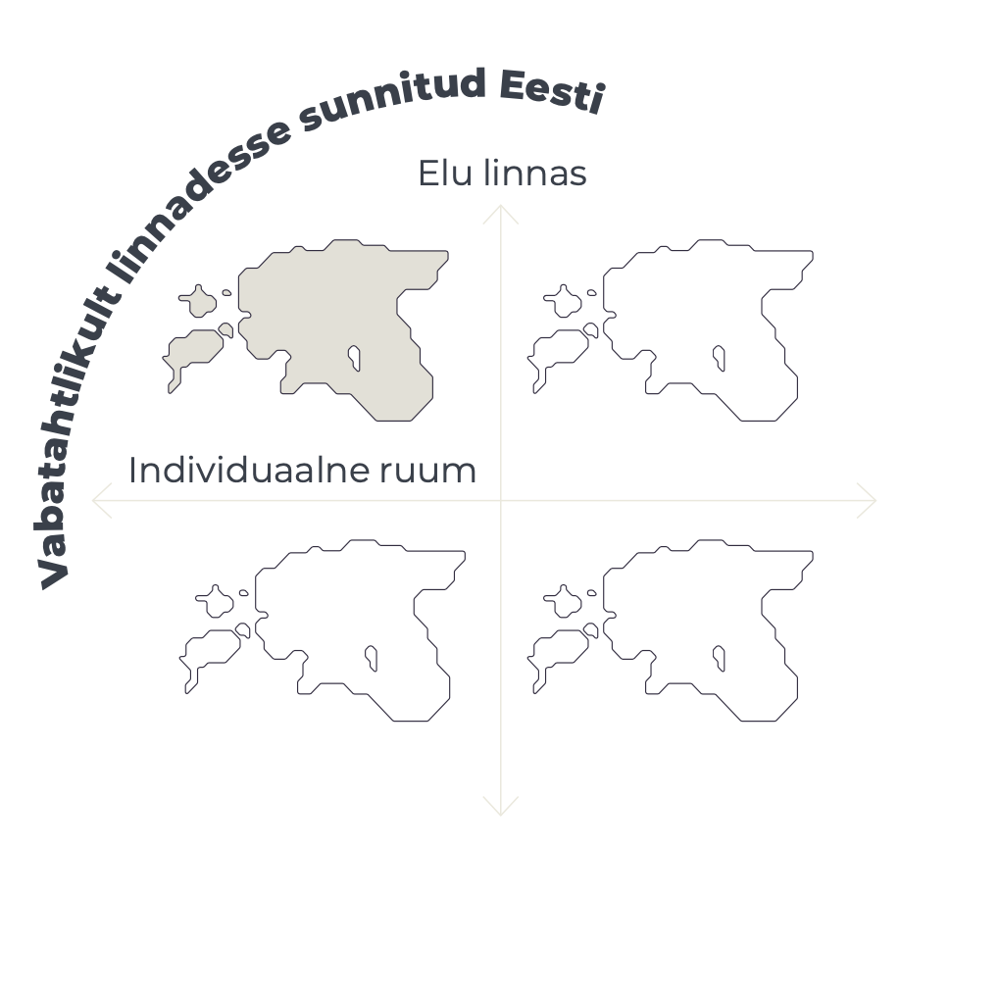
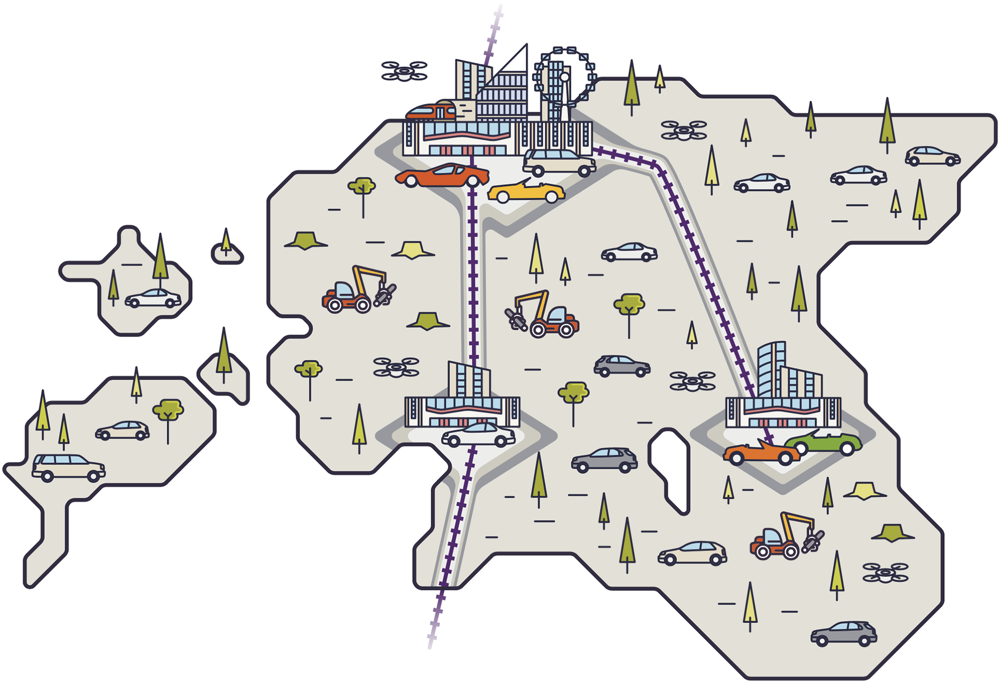

## Vabatahtlikult linnadesse sunnitud Eesti {-.chapter_section .chapter5_section .future_section}

<div class="map-icon">
```{r, out.width='100%', fig.align='center', echo=FALSE, message=FALSE}

```
</div>


<div><a class="print-btn" href="print/EIA-2019-5.1-Vabatahtlikult-linnadesse.pdf"><i class="fa fa-file" aria-hidden="true"></i>Trükiversioon</a></div>

```{r, out.width='100%', fig.align='center', echo=FALSE, message=FALSE}



```

<table class="future-table">
<tbody>

<tr>
<td align="left" class="future-table-black">Rahvastik linnades:</td>
<td align="right" class="future-table-red">80%</td>
</tr>

<tr>
<td align="left" class="future-table-black">Varanduslik kihistumine:</td>
<td align="right" class="future-table-red">suur</td>
</tr>

<tr>
<td align="left" class="future-table-black">Ruumiline ebavõrdsus:</td>
<td align="right" class="future-table-red">suur</td>
</tr>

<tr>
<td align="left" class="future-table-black">Hea avalik ruum:</td>
<td align="right" class="future-table-red">privilegeeritutele</td>
</tr>

<tr>
<td align="left" class="future-table-black">Andmed:</td>
<td align="right" class="future-table-red">suurettevõtetel „kõikenägev silm“, õigused ebavõrdselt jaotunud</td>
</tr>

<tr>
<td align="left" class="future-table-black">Ühiskonna kulutused baastaristule:</td>
<td align="right" class="future-table-red">suured ja kasvavad</td>
</tr>

<tr>
<td align="left" class="future-table-black">Sotsiaal-majanduslik efektiivsus:</td>
<td align="right" class="future-table-red">vähene</td>
</tr>

<tr>
<td align="left" class="future-table-black">Säästva arengu eesmärgid:</td>
<td align="right" class="future-table-red">ei ole saavutatud, kuigi mõni valdkond on teistest tugevam</td>
</tr>
</tbody></table>


„Nähtamatu käe“ juhtimisel on eestlased ja ka üsna paljud uuseestlased kogunenud Tallinna, Tartu ja Pärnu linnaregiooni – hoogne elamuarendus on haaranud linnalähedased põllud, kuid ajaloolised linnad ise ei ole samas tempos kasvanud. Puuduvate kesklinnade asemel saadakse kokku kauba- ja meelelahutuskeskustes. Linnaväljakute asemel vajatakse parklaid ja laiu teid, sest tavaline eestlane ei taha näha vaeseid ja võõraid. Pealegi on tänaval ohtlik. Regioonid on tugevalt kihistunud: jõukam rahvas elab heade koolide, tenniseklubide ja kaunite rohealade piirkonnas, mille ümber on aed ja valvurid. Linnad ise on rõhuvas osas vaeste ja uussisserändajate elukorterite päralt, äärelinnades on kehvad koolid, kehvad ühendused ja ohtlik õhtuti väljas käia. Tallinn ja Pärnu on hästi maailmaga ühendatud – Helsingi tunnel ja Rail Baltica loovad hea ühenduse neile, kes selle eest maksta jaksavad. Ent Tartussegi saab kiirelt rongiga või isikliku droonikapsliga. Inimestel ei ole märkimisväärset ühistunnet, pigem õigustatakse rikkust tubliduse ja vaesust laiskusega. Nende n-ö laisemate andmed on igaühele müügiks, peenem rahvas maksab teatava privaatsuse eest suurettevõtetele lunaraha. Ühiskonda vaevavad elustiilihaigused ja kuivõrd puudub toetav küünarnukitunne, siis tunneb suurem osa eestimaalasi end üksikuna. SKP asemel ühiskonna edukuse peamiseks mõõdupuuks saanud õnneindeksis on Eestis mitu aastat järjest kukkunud ning langemist ei pidurda ka suuremat ühtsust taotlevad kampaaniad.

<div class="future-illustration">
```{r, out.width='100%', fig.align='center', echo=FALSE, message=FALSE}


```
</div>