--- 
title: "Estonian Human Development Report 2019/2020"
cover-image: "https://inimareng.ee/cover.png"
description: "Linnastunud ühiskonna ruumilised valikud"
site: bookdown::bookdown_site
biblatexoptions: [refsegment=chapter]
link-citations: yes
css: "../eia.css"
lang: en
---

# Eesti inimarengu aruanne 2019/2020 {-.cover-page}

<div class="cover-container">
<div id="cover-hero">
<h1>Eesti inimarengu aruanne 2019/2020</h1>
<h2>Linnastunud ühiskonna ruumilised valikud</h2>


```{block, type='poem1'}
Sest agulist, mis ääristas<br>
me linna, vilets mulje saadi,<br>
kesklinna see-eest vääristas<br>
kuus-seitse gooti kelpfassaadi.<br>
Siin – sulgund õued, müürid, kivid.<br>
Toas plüüš ja koid ja papagoid.<br>
Seal – kapsamaad, tuul, hütirivid,<br>
Paar lahjat veist – ja lapsi, noid<br>
kriim, kilav kari... Tehkem mööndus:<br>
see polnud kõik. Seal vahel vööndus<br>
veel hooneid asfaltteede veeris<br>
ja villakesi pargipeidus,<br>
kust võõrad käskiv silt pareeris...

<p id="jaankross"> Jaan Kross </p>
```
</div>
</div>

<div id="cover-body">
<div class="cover-container">
Eesti inimarengu aruanne on iga kahe aasta tagant ilmuv artiklite kogumik, mis peegeldab ja mõtestab Eesti ühiskonna sotsiaalmajanduslikku olukorda ja võimalikke arengusuundi.

Tunnustatud teadlaste koostööna valmiv põhjalik aruanne panustab teadmuspõhise poliitika kujundamisse ning sellest kantud mõtteviiside ja teaduse populariseerimisse.

Eesti inimarengu aruanne lähtub ÜRO väljaantavast rahvusvahelisest inimarengu indeksist ja raportist.

Eestis on inimarengu aruanne ilmunud 1995. aastast. 2006. aastast annab kogumikku välja <a href="https://www.kogu.ee">SA Eesti Koostöö Kogu</a>. Aruande digiversioon on avatud lähtekoodiga ja avatud andmetega.
</div>
</div>

<div id="cover-footer">
<div class="cover-container">
```{block, type='poem2'}
**ÜKSMEEL**<br>
Eks ole pahemgi käsi parema käe vend<br>
Ehkki nad teevad erinevaid tegusid,<br>
Kuigi nad teineteist ei teretagi.<br>
Ühte hoiavad nad ometi,<br>
Sind armastades,<br>
Oi!<br>

<p id="handorunnel">Hando Runnel</p>
```
</div>
</div>

<!--chapter:end:index.Rmd-->

## Eessõna {-.chapter_section .foreword_section}

```{block, type='authors'}
<div class="author-links">**Kersti Kaljulaid**</div>
<div><a class="print-btn" href="../print/EIA-2019-0-Eessona.pdf"><i class="fa fa-file" aria-hidden="true"></i>Trükiversioon</a></div>
```

Kallis lugeja!

Kirjutan neid ridu kroonviirushaiguse puhangu esimese laine viimastel nädalatel. See aruanne on valminud valdavalt enne pandeemiat, erandiks vaid sissejuhatus ja käesolev eessõna.

Võib-olla loed Sina seda aruannet uues isolatsioonis, võib-olla oodates juba leitud vaktsiini Eestisse jõudmist või elades koos kroonviirushaiguse riskiga, teades, et vähemalt mõned antiviraalsed ravimid on meil kättesaadavad ja evivad piisavat raviefekti, et saaksime end veidi kindlamini tunda.

Kuidas ka ei oleks, selle aruande põhiteemad – linnastumine ja sellest valikust tingitud halvem elukeskkond; inimesest lähtuv linnaplaneerimine; hajaasustus ja sellest tulenevate probleemide maandamine; inimeste omavastutus ja vabatahtlik panustamine demokraatliku ühiskonna arengusse ja püsimisse; kliima muutumisega kaasnevad probleemid ning vajadus neid juhtida ja ületada – saavad kroonviiruse põhjustatud kriisi valguses läbi katsutud ja leitud olulised olevat.

Midagi ei ole muutunud, kuigi justkui kõik on muutunud. Eelkõige on kadunud meie kindlustunne, et inimkond tervikuna või vähemalt selle jõukam, s.t toidu, vee, hariduse ja tervishoiuga varustatud osa, tuleb toime kõigega, mida loodus või selle vastus meie toimetamisele tema kallal suudavad pakkuda. Veel pool aastat tagasi tundus paljude jaoks olevat ainuke kindlustundest puudu olev osa see, kuidas me saaksime ennast kaitsta nende eest, kellele saatus on kätte mänginud halvemad kaardid, olgu nad siis sõja-, kliima- või majanduspõgenikud. Niisiis – elame uues maailmas, aga probleemid, millega selles maailmas toime tulema peame, on seejuures ikka üsna samad.

Kuidas teha meie suurest pealinnast roheline, jalakäijale ja ratturile turvaline linn, kus oleks ikkagi võimalik kiiresti jõuda ka ühest linna äärest teise? Kuidas teha nii, et seesama suur linn ei oleks avalike teenuste kõrb, mis puudutab märkamist ja aitamist? Kas suudame ära kasutada juba enne kroonviiruse kriisi olemas olnud suundumust, kus eestlased liikusid osaliselt maale ja ilmutasid vastumeelsust sealt jälle linna tööle tulemise suhtes? Kuidas võiks hõreasustatud Eestit aidata kriisis ootamatult selgunud asjaolu, et meie tolerants kaugtöö suhtes paistab palju suurem, kui seni on arvatud? Kas meie iduettevõtete ja IKT-sektor ning nende sektorite pakutavad teenused teistes majandusvaldkondades võiksid seda suundumust veelgi tugevdada?

Kas ja kuidas suudame sooritada aktiivse kliimapöörde ja toetada sedakaudu ka oma majandusarengut, selmet muutuda passiivselt kliimaneutraalseks, tarbides teiste riikide toodetud rohelist energiat? Mis roll on kliimapöördel meie enda tarbimisvalikutes, muu hulgas transpordiga seotud valikutes, ja millist rolli kannab energia tootmise muutmine puhtaks ja hajusaks? Kas tark Tartu ja suvitajatele orienteeritud Pärnu ning teised väiksemad linnad näitavad, mida suudab üks linn, kes ei pea suuruse tõttu tegema kompromisse liikuvuse ja keskkonna, ka linnakeskkonna vahel?

Kallis lugeja – Sa ei leia neile küsimustele siit aruandest vastuseid. Aga Sa saad teada, kuidas meie Eesti elab ja hingab. Eesti, kes on maailma inimarengu indeksis kõrgel 30. kohal – paigas, mis võimaldab suurelt unistada, kiirelt otsustada ja kogu ühiskonnale üheldasa kasu toovaid lahendusi leida.

<div class=president-grid-container>
<div president-title-container>
<p id="head-lugemist">Head lugemist!</p>

**Kersti Kaljulaid**<br>
Eesti Vabariigi President

Kadriorus, 11. mail 2020
</div>

<div class="president-photo-container">
```{r, out.width='50%', fig.align='left'}
knitr::include_graphics('../figures/0-intro/Kersti_Kaljulaid_ametlik_2019.jpg')
```
</div>
</div>

<!--chapter:end:00.1-intro_by_president.Rmd-->

## Sissejuhatus {-.chapter_section .chapter0_section .intro_section}

<h1>Eesti ruumiline areng</h1>


```{block, type='authors'}
<div class="author-links">**[Helen Sooväli-Sepping](#helen-sooväli-sepping) ja [Antti Roose](#antti-roose)**</div>
<div><a class="print-btn" href="../print/EIA-2019-0-Sissejuhatus.pdf"><i class="fa fa-file" aria-hidden="true"></i>Trükiversioon</a></div>
```

### Põhisõnumid {-.chapter0_section}

```{block, type='points'}
* Eesti on inimarengus edenenud maailma riikide hulgas 30. positsioonile, kuid jäänud sinna püsima.

Eesti elanike heaolu kasv on olnud võrrelduna teiste maailma riikidega tähelepanuväärne. Riigisiseselt süveneb piirkondlik sotsiaalne kihistumine.

* Eesti suurlinnastumist väljendab Suur-Tallinna jätkuv kasv: inimesed, majandus ja teenused koonduvad Tallinna linnapiirkonda ning ülejäänud Eesti kahaneb ja taandareneb.

Eestile kui tervikule tekitab suurlinnastumine tasakaalutust nii riikluses, halduses, majanduses, elu-, ruumi- ja keskkonnakvaliteedis. On aeg hakata tegema linnapoliitikat, luua riiklik raamistik ja sihtmeetmed, lähtudes linnapiirkondadest, mitte linnapiiridest.

* Eestlaste mitmepaiksus seob Tallinna maakondadega ning linnad küladega.

Inimeste igapäevaste tegevusruumide laienemine ja haldusreform on toonud kaasa ruumilise identiteedi lahjenemise. Autokasutusel põhinev elulaad, elu- ja tegevuskorraldus võimaldab tegutseda samaaegselt nii linnas kui ka maal. Mitmes kohas elamine, mis on tingitud töörändest, maakodudest, perevõrgustikest, sõpruskondadest, õppimisest ja vaba aja veetmisest, eeldab senisest paindlikumat ruumiplaneerimist ja halduskorraldust.

* Avalik arutelu loob parema elukeskkonna ja püüdleb ühismeelele.

Aruteluks vajalike oskuste arendamine on riiklik huvi. Osalusdemokraatia edendamiseks on vaja senisest enam toimivaid, läbipaistvaid ning tagasisidestamisel põhinevaid kodanikkonna kaasamisviise. Sellele aitavad kaasa nii digiplatvormid, analüütilisel argumentatsioonil põhinev meediaruum, asjatundlikud ametnikud kui ka usaldusväärsed eksperdid. See kõik tagab teadmiste vahetuse ning loob usaldust riigi ja tema kodanike vahel.

* Ehituspärand ja loodusalad kultuuri osana tugevdavad Eesti inimeste keskkonnasuhet ja kodutunnet.

Mitmekesise elukeskkonna eeldus on säästva arengu põhimõtetest lähtuv ehituspärandi kaitse koos investeeringukavaga, mis tagab riigile oluliste hoonete säilitamise, kasutuselevõtu ja haldamise. Eesti inimeste keskkonnateadlikkus on kiiretes ja järskudes muutustes, mis selgitab viimaste aastate ühiskondlikke vastasseise loodusalade kasutamisel. Loodusalade teadlik planeerimine ja parem külastuskorraldus aitab parandada linlaste tervist ning hoida sidet loodusega.
```

President Lennart Meri kuulutas Eesti Vabariigi 78. aastapäeva kõnes 24. veebruaril 1996:

*„Milles peitub Eesti tugevus? [---] Et Eesti asub täpselt seal, kus ta asub. Et Eesti on täpselt nii suur, nagu ta on.“*

Maismaad on Eestil katastris täpselt 43 465 km<sup>2</sup> (Maa-amet 2020). Eesti maa – nii maaressurss, geograafilised kohad, nende otstarve ja kasutus, linnad-külad kui ka loodus – on rahvuslik vara. Eesti on ja areneb siin sellel maal, võõrsõnaga „territooriumil“, teaduskeelselt „ruumis“. Eesti inimarengu aruande 2019/2020 põhiteema on Eesti ruumiline areng Eesti inimeste heaolu mõjutavates ja ühiskondlikes protsessides. Kuidas taasluua ja kasvatada Eesti ruumilist rikkust, kvaliteeti ja tasakaalu demokraatlikult ja kogu ühiskonna huvides, on selle aruande alusküsimus.

Läheneme ruumi mõistele (ingl *space*, *spatial*) viies peatükis võimalikult laialt, nii eri mõõtkavades kui ka eri tähendustes. Laiendame mõistet geograafiliselt kogu Eestile, võttes tähelepanu alla asustusstruktuuri, loodusalad, linnaruumi, sealhulgas linnadisaini ja meid ühendava aruteluruumi. Samuti kirjeldame Eesti demokraatia tervist ruumilises muutuses, säästva arengu ja ühiskonna sidususe vaatenurgast, rõhudes elukõlbliku, inimsõbraliku, inimmõõtmelise ruumi ühisloomele. Seega, ruum selle aruande katusterminina tähistab ühist ruumi, mis pälvib avalikku huvi ja pakub ühiskondlikku hüve.

Mitmes aruande artiklis kerkib üles küsimus demokraatlikest ruumisuhetest avalikus ruumis, kus avalik huvi vastandub isiklikule ja eraõiguslikule huvile. Kui avalik on avalik ruum (ingl *public space*), see küsimus on ühiskonnas viimastel aastatel teravalt kerkinud nii linnaruumi kui ka tootmisettevõtete, korterelamute, teede ja muude objektide planeerimisel, nii seoses looduses viibimisega kui ka metsade raadamisega. Tõepoolest, avalikku ruumi saab mõista avaliku ja era(statud) ruumi vastanduses. Ehkki 40% Eesti maaressursist on riigiomandis, 1% kuulub omavalitsustele, on ka selle ruumi n-ö avalikkus piiratud, näiteks riigikaitsemaa. Samuti võib avalik huvi puudutada ka seda 59% Eesti territooriumist, mis on eraomand.

```{block, type='blockquote-right'}
Ruum ise mõjutab inimeste olemist ja käitumist ning kujundab mõtteviisi nii kollektiivsel kui ka üksikisiku tasandil.
```

Ruumil on ühtlasi oluline roll ühiskondlike protsesside kujundamisel. Avaliku ruumi, sealhulgas eraõigusliku ruumi kasutamine ja kujundamine peegeldab seda, kuidas ühiskond on organiseeritud. Mida avatum ja demokraatlikum on ühiskond, seda paremad on kaasarääkimise võimalused ruumi kujundamisel ja läbipaistvamad ruumiotsused. Ruum ise mõjutab inimeste olemist ja käitumist ning kujundab mõtteviisi nii kollektiivsel kui ka üksikisiku tasandil. Lisaks on avaliku ruumi olemus viimastel kümnenditel tugevasti muutunud. Suhtlemine digiplatvormidel pakub avaraid võimalusi kohtumisteks nii tuttavate kui ka võõrastega. Nii võib digitaalne aruteluruum olla täiendus linnaväljakule või külaplatsile. Avalik digitaalne ja füüsiline ruum on omavahel tihedalt läbi põimunud, tekitades aja ja ruumi tihenemise efekti – digitaalselt saame olla samal ajal mitmes ruumis korraga.

### Eesti on inimarengus edenenud maailma riikide hulgas 30. positsioonile, kuid jäänud sinna püsima {-.chapter0_section}

Aastast 1990 ÜRO Arenguprogrammi poolt kasutusele võetud inimarengu indeksi kohaselt kuulub Eesti väga kõrge inimarengu tasemega riikide hulka. Eesti on 30. kohal indeksiga 0,882 ning püsinud samal positsioonil viimased kuus aastat ([tabel 0.1](#table01)). Indeks võtab arvesse oodatavat eluiga, keskmiselt koolis käidud aastaid ning võrreldavates hindades SKPd ühe elaniku kohta. Euroopa Liidu keskmise oodatava elueaga võrreldes elavad Eesti elanikud (78,6 aastat) keskmiselt 3 aastat vähem. Oodatav eluiga sõltub mitmest mõjutajast: keskkonnast, tervishoiuteenuste kättesaadavusest, inimeste elatustasemest ja terviseteadlikkusest. Eestis on oodatav eluiga pikem linnalistes piirkondades, eesti rahvusest ja kõrgemalt haritud elanikkonna hulgas ([Säästva arengu näitajad 2018](#Statistikaamet2018)). Haridus on jätkuvalt au sees ja väga oluline. Eestist käivad õpilased maailmas kauem koolis vaid Šveitsis, Ameerika Ühendriikides ja Kanadas.

Heaolu kasv on märkimisväärne ning toonud käibele loosungi „Eestil pole kunagi nii hästi läinud kui täna“. Mõõtmisest ja indeksisüsteemist olulisem on andmete kvaliteet ja nende sisusse süvenemine. Kett on täpselt nii tugev, kui on tema nõrgim lüli, ehk teisisõnu, elanikkond on nii jõukas, kui tema materiaalselt kõige nõrgemalt kindlustatud ühiskonnagrupid. Statistikaameti andmetel elas 2019. aastal suhtelises vaesuses 284 300 (21,7%) ja absoluutses vaesuses 31 400 (2,4%) Eesti inimest. Ligikaudu pool eakatest kogevad suhtelist vaesust. Kui vaesusriskis elavate elanike osatähtsus on viimastel aastatel aeglaselt, aga siiski vähenenud, ei ole elanikkonna rikkama ja vaesema viiendiku erinevus võrreldes 2017. aastaga muutunud. Eesti heaolu suurenemisest ei ole osa saanud kõik elanikkonna grupid, saati kõik piirkonnad. Erinevused keskmises elueas, haridustasemes ja sissetulekutes avalduvad piirkondlikult ning on seotud ühtlasi keskkonnaseisundiga ([Rahvastiku tervise arengukava 2020–2030](#RahvastikuterviseAK2030)).

Selle sajandi esimestel kümnenditel on maailmas haigusi, nälga ja vaesust tõrjudes saavutatud elustandardi kiire kasv. Kuid tänapäeval on maailm uue ebavõrdsuslaine võimuses ning 2019. aasta lõpus ilmunud globaalse inimarengu aruande keskne teema on ebavõrdsus kui inimeste heaolu kõige suurem takistaja. Aruannet raamistab tulevikku suunatud sõnum, et viimasel aastakümnel on lisandunud kaks uut üleilmset suundumust, mis mõjutavad inimeste heaolu kõikjal maailmas: tehnoloogia kättesaadavus ja kliimamuutus. Tehnoloogilised edulood nagu tehisintellekt ja masinõpe süvendavad lõhet nende elanikerühmade ja riikide vahel, kel ei ole võimalusi tehnoloogilise arenguga kaasa minna. Kliimakriis tabab juba praegu valusamini vaesemaid maailma piirkondi ja vähekindlustatud elanikerühmi. Hinnanguliselt põhjustab kliimamuutus maailmas aastatel 2030–2050 alatoitumise, malaaria, kõhulahtisuse ja kuumarabanduse tõttu 250 000 lisasurma aastas ([ÜRO 2019](#ÜRO2019)).

<p class="caption" id="table01"><span class="figure-number">Tabel 0.1</span> Inimarengu indeks ja selle alusnäitajad valitud riikides (2018)</p>

<div style="overflow-x:auto;">
<table class="table table-bordered table-hover table-condensed" id="table_01">
<thead><tr><th title="Field #1"" align="left !important">Järje- koht</th>
<th title="Field #2" class="table_01_country">Riik</th>
<th title="Field #3">Inimarengu indeksi väärtus</th>
<th title="Field #4">Oodatav eluiga sünnihetkel (a)</th>
<th title="Field #5">Eeldatav kooli- aastate arv</th>
<th title="Field #6">Keskmine kooli- aastate arv</th>
<th title="Field #7">SKP inimese kohta (2011 ostujõu pariteedi alusel, USD)</th>
</tr></thead>
<tbody><tr>
<td align="left" class="table_01_nr">1</td>
<td class="table_01_country">Norra</td>
<td>0,954</td>
<td>82,3</td>
<td>18,1</td>
<td>12,6</td>
<td>68 059</td>
</tr>
<tr>
<td align="left" class="table_01_nr">2</td>
<td class="table_01_country">Šveits</td>
<td>0,946</td>
<td>83,6</td>
<td>16,2</td>
<td>13,4</td>
<td>59 375</td>
</tr>
<tr>
<td align="left" class="table_01_nr">3</td>
<td class="table_01_country">Iirimaa</td>
<td>0,942</td>
<td>82,1</td>
<td>18,8</td>
<td>12,5</td>
<td>55 660</td>
</tr>
<tr>
<td align="left" class="table_01_nr">4</td>
<td class="table_01_country">Saksamaa</td>
<td>0,939</td>
<td>81,2</td>
<td>17,1</td>
<td>14,1</td>
<td>46 946</td>
</tr>
<tr>
<td align="left" class="table_01_nr">4</td>
<td class="table_01_country">Hongkong</td>
<td>0,939</td>
<td>84,7</td>
<td>16,5</td>
<td>12</td>
<td>60 221</td>
</tr>
<tr>
<td align="left" class="table_01_nr">6</td>
<td class="table_01_country">Austraalia</td>
<td>0,938</td>
<td>83,3</td>
<td>22,1</td>
<td>12,7</td>
<td>44 097</td>
</tr>
<tr>
<td align="left" class="table_01_nr">6</td>
<td class="table_01_country">Island</td>
<td>0,938</td>
<td>82,9</td>
<td>19,2</td>
<td>12,5</td>
<td>47 566</td>
</tr>
<tr>
<td align="left" class="table_01_nr">8</td>
<td class="table_01_country">Rootsi</td>
<td>0,937</td>
<td>82,7</td>
<td>18,8</td>
<td>12,4</td>
<td>47 955</td>
</tr>
<tr>
<td align="left" class="table_01_nr">9</td>
<td class="table_01_country">Singapur</td>
<td>0,935</td>
<td>83,5</td>
<td>16,3</td>
<td>11,5</td>
<td>83 793</td>
</tr>
<tr>
<td align="left" class="table_01_nr">10</td>
<td class="table_01_country">Holland</td>
<td>0,933</td>
<td>82,1</td>
<td>18</td>
<td>12,2</td>
<td>50 013</td>
</tr>
<tr>
<td align="left" class="table_01_nr">11</td>
<td class="table_01_country">Taani</td>
<td>0,93</td>
<td>80,8</td>
<td>19,1</td>
<td>12,6</td>
<td>48 836</td>
</tr>
<tr>
<td align="left" class="table_01_nr">12</td>
<td class="table_01_country">Soome</td>
<td>0,925</td>
<td>81,7</td>
<td>19,3</td>
<td>12,4</td>
<td>41 779</td>
</tr>
<tr>
<td align="left" class="table_01_nr">13</td>
<td class="table_01_country">Kanada</td>
<td>0,922</td>
<td>82,3</td>
<td>16,1</td>
<td>13,3</td>
<td>43 602</td>
</tr>
<tr>
<td align="left" class="table_01_nr">14</td>
<td class="table_01_country">Uus-Meremaa</td>
<td>0,921</td>
<td>82,1</td>
<td>18,8</td>
<td>12,7</td>
<td>35 108</td>
</tr>
<tr>
<td align="left" class="table_01_nr">15</td>
<td class="table_01_country">Suurbritannia</td>
<td>0,92</td>
<td>81,2</td>
<td>17,4</td>
<td>13</td>
<td>39 507</td>
</tr>
<tr>
<td align="left" class="table_01_nr">15</td>
<td class="table_01_country">USA</td>
<td>0,92</td>
<td>78,9</td>
<td>16,3</td>
<td>13,4</td>
<td>56 140</td>
</tr>
<tr>
<td align="left" class="table_01_nr">17</td>
<td class="table_01_country">Belgia</td>
<td>0,919</td>
<td>81,5</td>
<td>19,7</td>
<td>11,8</td>
<td>43 821</td>
</tr>
<tr>
<td align="left" class="table_01_nr">18</td>
<td class="table_01_country">Lichtenstein</td>
<td>0,917</td>
<td>80,5</td>
<td>14,7</td>
<td>12,5</td>
<td>99 732</td>
</tr>
<tr>
<td align="left" class="table_01_nr">19</td>
<td class="table_01_country">Jaapan</td>
<td>0,915</td>
<td>84,5</td>
<td>15,2</td>
<td>12,8</td>
<td>40 799</td>
</tr>
<tr>
<td align="left" class="table_01_nr">20</td>
<td class="table_01_country">Austria</td>
<td>0,914</td>
<td>81,4</td>
<td>16,3</td>
<td>12,6</td>
<td>46 231</td>
</tr>
<tr>
<td align="left" class="table_01_nr">21</td>
<td class="table_01_country">Luksemburg </td>
<td>0,909</td>
<td>82,1</td>
<td>14,2</td>
<td>12,2</td>
<td>65 543</td>
</tr>
<tr>
<td align="left" class="table_01_nr">22</td>
<td class="table_01_country">Iisreal</td>
<td>0,906</td>
<td>82,8</td>
<td>16</td>
<td>13</td>
<td>33 650</td>
</tr>
<tr>
<td align="left" class="table_01_nr">22</td>
<td class="table_01_country">Lõuna-Korea</td>
<td>0,906</td>
<td>82,8</td>
<td>16,4</td>
<td>12,2</td>
<td>36 757</td>
</tr>
<tr>
<td align="left" class="table_01_nr">24</td>
<td class="table_01_country">Sloveenia</td>
<td>0,902</td>
<td>81,2</td>
<td>17,4</td>
<td>12,3</td>
<td>32 143</td>
</tr>
<tr>
<td align="left" class="table_01_nr">25</td>
<td class="table_01_country">Hispaania</td>
<td>0,893</td>
<td>83,4</td>
<td>17,9</td>
<td>9,8</td>
<td>35 041</td>
</tr>
<tr>
<td align="left" class="table_01_nr">26</td>
<td class="table_01_country">Tšehhi</td>
<td>0,891</td>
<td>79,2</td>
<td>16,8</td>
<td>12,7</td>
<td>31 597</td>
</tr>
<tr>
<td align="left" class="table_01_nr">26</td>
<td class="table_01_country">Prantsusmaa</td>
<td>0,891</td>
<td>82,5</td>
<td>15,5</td>
<td>11,4</td>
<td>40 511</td>
</tr>
<tr>
<td align="left" class="table_01_nr">28</td>
<td class="table_01_country">Malta</td>
<td>0,885</td>
<td>82,4</td>
<td>15,9</td>
<td>11,3</td>
<td>34 795</td>
</tr>
<tr>
<td align="left" class="table_01_nr">29</td>
<td class="table_01_country">Itaalia</td>
<td>0,883</td>
<td>83,4</td>
<td>16,2</td>
<td>10,2</td>
<td>36 141</td>
</tr>
<tr>
<td align="left" class="table_01_nr">30</td>
<td class="table_01_est table_01_country">Eesti</td>
<td class="table_01_est">0,882</td>
<td class="table_01_est">78,6</td>
<td class="table_01_est">16,1</td>
<td class="table_01_est">13</td>
<td class="table_01_est">30 379</td>
</tr>
<tr>
<td align="left" class="table_01_nr"></td>
<td> </td>
<td> </td>
<td> </td>
<td> </td>
<td> </td>
<td> </td>
</tr>
<tr>
<td align="left" class="table_01_nr">34</td>
<td class="table_01_country">Leedu</td>
<td>0,869</td>
<td>75,7</td>
<td>16,5</td>
<td>13</td>
<td>29 775</td>
</tr>
<tr>
<td align="left" class="table_01_nr">39</td>
<td class="table_01_country">Läti</td>
<td>0,854</td>
<td>75,2</td>
<td>16</td>
<td>12,8</td>
<td>26 301</td>
</tr>
<tr>
<td align="left" class="table_01_nr">49</td>
<td class="table_01_country">Venemaa</td>
<td>0,824</td>
<td>72,4</td>
<td>15,5</td>
<td>12</td>
<td>25 036</td>
</tr>
</tbody></table>
</div>

``` {block, type='imgsource'}
<span class="imgsource-source">Allikas:</span> ÜRO 2019.
```

### Eesti suurlinnastumist väljendab Suur-Tallinna jätkuv kasv: inimesed, majandus ja teenused koonduvad Tallinna linnapiirkonda ning ülejäänud Eesti kahaneb ja taandareneb {-.chapter0_section}

Eesti kaart on lihtne. On suurlinn Tallinn, on ülikoolilinn Tartu, on suvituslinn Pärnu, on hilistööstuslik Kirde-Eesti, järjest enam puhke-, põllu- ja metsamajanduslik Lõuna-Eesti ja meretagused saared. Lihtsamalt saab Eesti jagada kaheks – on Tallinn ja (muu) Eesti: kaheksast viieni töiselt tegusad maakonnalinnad ning rahvuspargistuv ääremaa. Need ei ole sildid, vaid Eesti tegelik ruumistruktuur ja haldusjaotus ([joonis 0.1](#figure01)). Ruumilise arengu mõttes on sotsiaalteadlaste 2000. aastal osutatud „Kaks Eestit“ saanud nüüd reaalsuseks (vt [Lauristin 2001](#Lauristin2001); [Vetik 2002](#Vetik2002)).

Järjest enam arutleb teadlaskond planetaarse linnastumise teemadel, selgitades ja täpsustades linnastumisprotsesside üha tugevamat mõju üleilmastumisele, keskuskohtade ja linnaalade hägustumist ning hävitavat survet loodusele ([Schmidt 2018](#Schmidt2018)). Linnastumisprotsess põimib kokku turumajanduslikud globaalvõrgustikku ühendatud tegevused ning intensiivistab maakasutust. Maapiirkonnad muudetakse agrotööstuskompleksideks, loodust kaubastatakse näiteks turismi eesmärgil, rajatakse tööstusparke, samuti kaupade transportimiseks mõeldud logistika- ja transporditaristud.

<p class="caption" id="figure01"><span class="figure-number">Joonis 0.1</span> Eesti linnasüsteem (alates 2000 elanikust, 2019. aasta rahvaarvu alusel)</p>

```{r, figure01, out.width='100%', fig.align='center', echo=FALSE, message=FALSE}
library(sf)          # classes and functions for vector data
library(raster)      # classes and functions for raster data
library(tmap)
library(svglite)

fig_04_map_data <- st_read(dsn ="../data/0_fig1_data/maakond_20200101.shp")
head(as.data.frame(fig_04_map_data))

fig_04_map_settlements <- st_read(dsn ="../data/0_fig1_data/asustusyksus_20200301.shp")
head(as.data.frame(fig_04_map_settlements))

fig_04_map_counties <- st_read(dsn ="../data/0_fig1_data/omavalitsus_20200301.shp")
head(as.data.frame(fig_04_map_counties))

fig_04_data_settlements <- read.csv("../data/0_fig1_data/fig_04_data_settlements.csv", header=TRUE, sep=";", check.names=FALSE)
fig_04_data_counties <- read.csv("../data/0_fig1_data/fig_04_data_counties.csv", header=TRUE, sep=";", check.names=FALSE)

fig_04_settlements <- merge(fig_04_map_settlements,fig_04_data_settlements, by="ANIMI")
fig_04_counties <- merge(x=fig_04_map_counties,y=fig_04_data_counties, by="ONIMI")


fig_04_settlements$Asula[fig_04_settlements$TYYP==c(4)]<- "Linn"
fig_04_settlements$Asula[fig_04_settlements$TYYP==c(5)]<- "Linn"
fig_04_settlements$Asula[fig_04_settlements$TYYP==c(6)]<- "Linnaosa"
fig_04_counties$Asula[fig_04_counties$TYYP==c(1)]<- "Vald"
fig_04_counties$Asula[fig_04_counties$TYYP==c(4)]<- "Linn"

fig_04_settlements <- fig_04_settlements[c(-2,-3,-4,-5,-6,-7,-9,-10)]
fig_04_counties <- fig_04_counties[c(-2,-3,-4,-5,-7,-8)]

colnames(fig_04_settlements)[1] <- "Nimi"
colnames(fig_04_counties)[1] <- "Nimi"

fig_04_data <- rbind(fig_04_settlements, fig_04_counties)

fig_04_map <- tm_shape(fig_04_map_data) + 
    tm_fill("#e6e3da") +
    tm_borders(col="white") +
    tm_layout (
      frame = FALSE
              )

fig_04_population <-  tm_shape(fig_04_data) +
      tm_bubbles(col = "Asula",alpha = 0.5, border.col= "white", size = "Elanike arv",scale= 10, xmod=0, sizes.legend=c(2000,10000,50000), title.size="Elanike arv", palette= c("#c54409","#79ac2c","#369b9e")) 
     # tm_text (col="#3a404a", text="Nimi",xmod=1, size=0.5, auto.placement=TRUE)
  
    tm_layout(
      outer.margins=0, inner.margins=c(.02, .1, .02, .02), asp=1920/1080,
      legend.text.size=1,
      legend.title.size=1,
      legend.outside = FALSE,
      legend.width=.25, legend.height = .7,
      legend.format=list(text.separator="kuni"),
      frame = FALSE)
  
#tmap_save(tm = fig_04_map + fig_04_population, filename = "fig_04_notext.pdf")

#svg(filename="figure.svg")
#pop_change + GDP
#dev.off()


knitr::include_graphics("../figures/0-intro/fig01.png")

```

``` {block, type='imgsource'}
<div><span class="imgsource-source">Allikas:</span> Statistikaamet.</div>
<div><a class="data-btn" href="data/0_fig1_data.zip"><i class="fa fa-download" aria-hidden="true"></i>Laadi andmed</a></div>
```


```{block, type='blockquote-right'}
Linnastumisprotsess põimib kokku turumajanduslikud globaalvõrgustikku ühendatud tegevused ning intensiivistab maakasutust.
```

Linna tähendust ja mõju ei saa mõõta üksnes linnavormi, tiheduse ja teiste ruumitunnustega. Tänapäeva linn määratleb end halduspiire ületava sotsiaalruumilise jõuna ([Brenner 2019](#Brenner2019)). Nii ei ole ka Eesti linn praegu enam traditsioonilise arusaama kohaselt ühe selgelt eristuva linnakeskusega tööstuslik tiheasula. Praegused 47 halduspiiridega linna moodustavad Eestis linnasüsteemi tinglikult, sest enam kui poolel neist napib 21. sajandi mõistes suurust ja linnalisi omadusi. Eestis väljendub linnastumine linnaalade laienemise ja linnarahvastiku kasvuna Tallinnas. Linnapiirkondlikud majandusteooriad seletavad praegust suurlinnastumist süveneva tasakaalutuse ja kasvu koondumisena ([Nijkamp ja Kourtit 2013](#Nijkamp2013)). Nende majandusmudelite õpikunäide on Eesti. Linnastumisel, iseäranis suurlinnastumisel on arvestatavad negatiivsed välismõjud eeskätt linnaruumi- ja keskkonnakasutuses, aga ka sotsiaalses plaanis, nagu näiteks ühiskonna kihistumises. Eesti linnastumist 2000. aastatel iseloomustasid kiired euroopalikud õigus-, haldus- ja sotsiaal-majanduslikud muutused ([Raagmaa jt 2014](#Raagmaa2014)) ([tabel 0.2](#table02)). 2010. aastatel toimus Euroopas majandustõusu uuel lainel suurlinnade kokkusulamine hiigelregioonideks (London-Manchester, Pariis-Brüssel-Amsterdam-Saksa linnastud; Rooma-Milano-Torino). Nõnda ei ole Tallinn teiste suurlinnade seas sugugi suur, Euroopa Liidus elanike arvu poolest alles 59. kohal.

<p class="caption" id="table02"><span class="figure-number">Tabel 0.2</span> Euroopa ja Eesti linnapoliitika võtmearengud</p>

<div style="overflow-x:auto;">
<table class="table table-bordered table-hover table-condensed" id="table_02">
<thead><tr><th title="Field #1">Aastakümnend</th>
<th title="Field #2">Euroopa areng</th>
<th title="Field #3">Euroopa võtmeprotsessid</th>
<th title="Field #4">Linnapoliitika võtmeteemad „vanas” Euroopas</th>
<th title="Field #5">Linnapoliitika võtmeteemad Eestis</th>
</tr></thead>
<tbody><tr>
<td class="table_02_red">1990</td>
<td>Ühisturu integratsioon ja üleeuroopalised taristud, sh transpordivõrk.</td>
<td>Demokratiseerimine ja riigireformid Kesk- ja Ida-Euroopas.</td>
<td>Kultuur ja turism. Konkurentsipoliitika.</td>
<td>Üleminekureformid, sh maa- ja omandireform ning linnahaldus. Erastamine ja kinnisvaraturu teke.</td>
</tr>
<tr>
<td class="table_02_red">2000</td>
<td>Euroopa Liidu itta laienemine. Terrorism.</td>
<td>Majandusbuum ja finantskriis.</td>
<td>Suurlinnastud. Elukvaliteet.</td>
<td>Linnaplaneerimine. Kinnisvarabuum, sh eeslinnastumislaine, uued keskused ja linnataristud ning ärilinnak.</td>
</tr>
<tr>
<td class="table_02_red">2010</td>
<td>Hiigelregioonid suurlinnastute võrgustikuna.</td>
<td>Majanduse taastumine. Kokkuhoiupoliitika.</td>
<td>Nutikas spetsialiseerumine. Tehnoloogiline areng ja innovatsioon.</td>
<td>Suurarendused ja suurtaristud. Keskklassistumine. Avaliku ruumi teema esilekerkimine. Kaasav linn ja kodanikuaktivismi teke.</td>
</tr>
<td class="table_02_red">2020 ja tulevik</td>
<td>Deglobaliseerumine. Euroopa geopoliitilise positsiooni hoidmine maailmas. Kliimaneutraalsus.</td>
<td>Majanduskriis. Brexit. Roheline lepe. Digitaalsus. Populism. Euroopa kultuuri kaitse.</td>
<td>Säästlik, tark hooliv linn. „Uus” demokraatia.</td>
<td>Rail Baltica. Talsinki. Kestlik kahanemine. Sotsiaalsüsteemid.</td>
</tr>
</tbody></table>
</div>

``` {block, type='imgsource'}
<span class="imgsource-source">Allikas:</span> Clark jt 2018; Mäntysalo jt 2019; Raagmaa jt 2014.
```

Linnaareng tervikuna põhineb Eestis linnamaa laienemisel, maavõtul. Aastatel 2000–2017 on asustusalade pindala Eestis suurenenud 138 km<sup>2</sup> võrra ([Oja, ptk 1](#maakasutuse-muutused-linna-ja-maa-tähenduse-moondumine)). Maakasutuse muutusena on Eestis neil aastatel tinglikult rajatud juurde üheksa Viljandi linna, aga tegelikkuses ega kaardil ühtegi uut linna pole. Samal ajal iseloomustab linnade kasvu killustatus ja hajumine. Akadeemik Mart Kalm on pannud diagnoosi Eesti ehitatud ruumile ([Kalm 2018](#Kalm2018)):

*„Võrreldes ülejäänud Euroopaga on piinlik tunnistada, kui vähe tähelepanu pöörame tänapäeval jätkusuutlikkusele. [---] Vaesus ja muutuvad olud on harva lasknud terviklikel keskkondadel tekkida, mistõttu modernset Eestit iseloomustab rohkem keskkonna katkendlikkus.“*

```{block, type='blockquote-left'}
21&#8291;. sajandi kahe esimese aastakümne suurlinnastumine on juba kujundanud Eesti arengulugu.
```
Praeguse seisuga elab linnakeskkonnas 920 000 inimest ehk 69% Eesti elanikest, kellest omakorda Suur-Tallinnas umbes 550 000 ehk 40% Eesti elanikest ([Roose, ptk 1](#planeerimisvabaduse-võidukäik-eeslinna-eestis)). 21. sajandi kahe esimese aastakümne suurlinnastumine on juba kujundanud Eesti arengulugu, kuid ei ole veel võrreldav massilise elamuehituse ja sisserändeajastuga 1970.–1980. aastatel. Suur-Tallinna kasv 2010. aastatel on tähendanud laialdasi ja veel suuremaid kinnisvaraarendusi ning liiklustaristut, linnaasumite segregatsiooni ([Tammaru jt 2020](#Tammaru2020)), uusasumite killustatud laienemist ([Roose, ptk 1](#planeerimisvabaduse-võidukäik-eeslinna-eestis)) ning vähenevat avalikku linnaruumi ([Paaver ja Kiivet, ptk 2](#avalik-ruum-kui-elukeskkonda-siduv-võrgustik)). Kiire autostumise kasvuga võtavad üha suurema osa linnade territooriumist enda alla sõiduteed ja parkimiskohad ([Grišakov, ptk 5](#eesti-elukeskkond-aastal-2050)). Ka taristuinvesteeringud on suunatud eelkõige sõiduteedesse, vähem kõnni- ja jalgrattateedesse, linnaväljakutesse ja parkidesse. Autostumisega kaasnev inimeste vähene füüsiline liikuvus ([Tuvikene jt, ptk 1](#ligipääsetavuse-muutused-autostunud-eestis)) võib omakorda mõjutada füüsilist ja vaimset tervist, mille näitajad tingituna ülekaalulisusest ja vaimsetest häiretest on terves Eestis viimastel kümnenditel languses ([Säästva arengu näitajad 2018](#Statistikaamet2018)). Sillutatud ja ehitatud linnamaaks ohverdatakse linnarohelus, mis on teravnevas kliimakriisis omandanud järjest olulisema tähenduse nii elurikkuse ja süsinikusalvena kui ka linna tehiskeskkonna ja inimeste tekitatud keskkonnamõjude puhastamisel ja puhverdamisel ([Poom ja Sepp, ptk 3](#loodusalade-kujundamine-avalikuks-kasutuseks); [Hansis jt 2015](#Hansis2015); [EEA 2019a](#EEA2019)). Tormakas linnakasvus põrkuvad sageli avalikud ja erahuvid (nt Viimsi valla arendustegevus, Tallinnas Kalamaja tihendamine jne; vt [Paaver ja Kiivet, ptk 2](#avalik-ruum-kui-elukeskkonda-siduv-võrgustik); [Kljavin jt, ptk 2](#aktivism-avaliku-ruumi-koosloomes); [Ventsel ja Madisson, ptk 4](#ühiskondlik-poliitiline-diskussioon-digitaalses-avalikus-ruumis)).

Tallinnale pakub arengupotentsiaali kaksiklinnastumine Helsingiga. Teadmusmajandust ja innovatsiooni arendav tulevikulinn Talsinki võiks liita Helsingi üleilmselt tunnustatud teadmus- ja elukvaliteedi Tallinna uuenduslikkuse ja kasvuhooga. Kui nii läheb, siis sünnib miljonilinn, maailmalinn ([Grišakov, ptk 5](#eesti-elukeskkond-aastal-2050)).

### Eesti inimeste mitmepaiksus seob Tallinna maakondadega ja linnad küladega {-.chapter0_section}

Kõik maakonnad peale Harjumaa on kahanemas. Aastatel 2000–2018 lisandus Harjumaale 10% rahvastikku, samal ajal kui Tartumaa rahvastik vähenes 4%, teistes maakondades jäi elanikke vähemaks kümnendiku kuni veerandi võrra. Kahanemine on suurlinnastumise pöördprotsess. Selle näiteks on ühe Tallinna uue eeslinnaasumi ja ühe maa-aleviku rahvastikupüramiid ([joonis 0.2](#figure02)). Tallinna eeslinnaasumis elavad noored lastega pered, maa-alevikus üle viiekümnesed. Kahanev on piirkond, mille elanikkond väheneb olulisel määral ühe põlvkonna jooksul. Maakonnad kaugenevad Tallinnast nii ruumiliselt, majanduslikult, sotsiaalselt, elutingimuste poolest kui ka kultuuriliselt ([Kährik ja Väiko, ptk 1](#nüüdisaegsed-elamistingimused-kelle-privileeg); [Plüschke-Altof jt, ptk 1](#keskuse-ja-ääremaa-lõhe-eestis)). Selle arengu keskmes on viimasel kümnendil vastuseid ootav küsimuste kimp: kas kahanevatel maakonnalinnadel on jõudu, et maakondi käima tõmmata; kas ettevõtluskeskkond on piisavalt elav ja mitmekesine ning kas tööjõubaas ja -areaal on küllaldane majanduse arenguks?

<p class="caption" id="figure02"><span class="figure-number">Joonis 0.2.</span> Tallinna eeslinna asumi vs maa-aleviku rahvastikupüramiid</p>

<div class="desktop-plot">
```{r, joonis02, fig.cap='', out.width='100%', fig.asp=.75, fig.align='center', echo=FALSE, message=FALSE}

library("tidyverse")
library("scales")
library("reshape")
library("showtext")
library("plotly")

showtext_auto()
font_add_google(name = "Montserrat", family = "Montserrat")

fig02_data <- read.csv ("../data/0_fig2_data.csv", header=TRUE, fileEncoding="utf-8", sep=";", check.names=FALSE)
fig02_data <- melt(fig02_data, id=c("Vanus","Asukoht"))

names(fig02_data)[names(fig02_data) == "variable"] <- "Sugu"
names(fig02_data)[names(fig02_data) == "value"] <- "Protsent"

fig02_data$Vanus <- factor(fig02_data$Vanus, levels = c("0-4","5-9","10-14","15-19","20-24","25-29","30-34","35-39","40-44","45-49","50-54","55-59","60-64","65-69","70-74","75-79","80-84","85-89","90+"))

fig02_data$Asukoht <- factor(fig02_data$Asukoht, levels = c("Tallinna eeslinn","Maa-alevik"))

fig02_data$percent=percent((fig02_data$Protsent/100), 1)

fig02_data$Osakaal <- ifelse(test = fig02_data$Sugu == "Mehed", yes = -fig02_data$Protsent, no = fig02_data$Protsent)
                   
  fig02_plot <- ggplot(data = fig02_data,
       mapping = aes(x = Vanus, y = Osakaal,fill = Sugu)) +
      geom_col() +
      coord_flip() +
      scale_y_continuous(labels = abs, breaks=c(-15,-10,-5,0,5,10,15), limits = max(fig02_data$Protsent) * c(-1.2,1.2)) +
      scale_fill_manual(values=c("#369b9e","#c54409")) +
      labs(y = "%") +
      facet_wrap(~Asukoht, nrow=1, strip.position="top")

    fig_theme_general <- theme(
                     text = element_text(color = "#292b2c", size = 10, family=""),
                     panel.background = element_rect(fill = "white", colour = "white"),
                     panel.grid.major = element_line(colour="#eaeaea", size = (0.2)),
                     panel.grid.minor = element_line(size = (0.2), colour="#eaeaea"),

                     axis.line = element_line(size = 0.2, colour = "#eaeaea"),
                     axis.ticks = element_line(colour = "#eaeaea", size=(0.2)),
                     axis.text.x = element_text(margin = margin(t = 10, r = 0, b = 0, l = 0)),
                     axis.text.y = element_text(margin = margin(t = 0, r = 10, b = 0, l = 0)),
                    axis.title.y = element_text(margin = margin(t = 0, r = 20, b = 0, l = 0)),
                    axis.title.x = element_text(margin = margin(t = 15, r = 0, b = 0, l = 0)),
                    plot.margin = unit(c(0.5,0,0,0), "cm"),

                     legend.position="top",
                     legend.title=element_blank(),
                     legend.key = element_rect(fill="white"),
                      legend.background = element_rect(fill=NA),

                    strip.text = element_text( size = 10, color = "#292b2c"),
                    strip.background = element_rect(color="white", fill="white")
  )

  fig02_theme <- theme(
    text=element_text(family="Montserrat")
                 )
ggplotly(fig02_plot + fig_theme_general + fig02_theme, tooltip = c("Vanus", "Sugu")) %>% 
config(displayModeBar = F) %>% 
layout(legend = list(orientation = "h",y = 1.15, x=0))
  

#ggsave(path="exported_figures/PDF/chapter0",filename="fig05.pdf", height=130, width=200, units="mm")
```

</div>
<div class="mobile-plot">
```{r, out.width='100%', fig.align='center', echo=FALSE, message=FALSE, warning=FALSE}
print(fig02_plot + fig_theme_general + fig02_theme)
```
</div>

``` {block, type='imgsource'}
<div><span class="imgsource-source">Allikas:</span> Rahvastikuregister.</div>
<div><a class="data-btn" href="data/0_fig2_data.csv"><i class="fa fa-download" aria-hidden="true"></i></i>Laadi andmed</a></div>
```

Kahanemisküsimus ei taandu pelgalt töörändele ja suurema sissetuleku otsingutele. Elamufondi ülejääk ja vananemine nii elutingimuste poolest kui ka ehitustehniliselt on muutnud paljud Eesti pered kinnismaisteks, kuivõrd nende kodu turuhind on madal. Samal ajal puudub maakondades noortel peredel võimalus alustada elu uuselamus, uues kodus. Ebavõrdsus elamistingimustes ja kinnisvarahindades, alaealist ja pensioniealist elanikkonda liikuvusvaesusesse lükkav harv ühistransport süvendab üldist regionaalset ebavõrdsust Eestis ([Kährik ja Väiko, ptk 1](#nüüdisaegsed-elamistingimused-kelle-privileeg); [Tuvikene jt, ptk 1](#ligipääsetavuse-muutused-autostunud-eestis)).

```{block, type='blockquote-right'}
Eestis ootab lahendamist kohapõhine targa kahanemise plaan kolmes valdkonnas: töökohad, elukohad, põhiteenused.
```
Maakonnatasandi ja maakonnalinnade nõrgenemine on kiirendanud suundumust kahe-keskuse-Eestiks, mis koosneb Tallinnast ja Tartust, kattes nende tagamaad tunniajase autosõidu raadiuses ([joonis 0.3](#figure03)). Töökoht liigub Tallinna ja Tartusse ees, elukoht ja teenused tulevad järele. Ülikooliõpingute järel ei naase paljud noored kodukohta, vaid jäävad elama Tallinna või Tartusse. Seda laadi protsessi leevendab eestlaste mitmepaiksus (ingl multilocality). Arvukalt elanikke omab kahte kodu, ühte linnas ja teist maapiirkonnas, kuhu sõidetakse nädalavahetuseti ja suvepuhkuseks. Nendele lisanduvad hargmaised pered, kes elavad piiri taga ja käivad Eestis puhkamas. Hargmaisus on toonud Tallinnale Helsingi ja Stockholmi lähemale näiteks Rakverest või Paidest, seda nii ajageograafiliselt elu- ja töökohtadena kui ka eluoluliselt. Sestap jäävad maakonnad, aga ka ülikoolilinn Tartu üleilmastumisprotsessides siseisolatsiooni ([Leetmaa, ptk 1](#sissejuhatus-1)). Ka koduläheduse mõiste on aja ja ruumi tihenemise ja kiirenemise ([Lauristin jt 2017](#Lauristin2017)) ja linliku elumudeli tõttu muutunud, laienenud ülelinnaliseks või isegi piirkondlikuks. See omakorda on lahjendanud ruumilist identiteeti, hägustanud kodulinna ja koduküla tähendust.

<p class="caption" id="figure03"><span class="figure-number">Joonis 0.3.</span> Geograaf Edgar Kandi ajalooline Eesti linnasüsteem kehtib põhimõtteliselt ka tänapäeval, sh kahekeskuseline Tallinna- ja Tartu-tõmbeline Eesti ning nende linnade tagamaad autosõiduraadiuses, nn ühe-tunni-Eesti</p>

```{r, figure03, out.width='100%', fig.align='center', echo=FALSE, message=FALSE}

knitr::include_graphics("../figures/0-intro/fig03.png")

```

``` {block, type='imgsource'}
<span class="imgsource-source">Allikas:</span> Kant (1935).
```

Kestliku kahanemise võtit ei ole seni pakkunud ruumilised ümberkorraldused riigihalduses ega ka haldusreform. Üha hõredam asustus ühelt poolt sundis keskvalitsuse nõudmisel maavaldu liituma ja ühiselt maaelu korraldama, kuid teiselt poolt liiguvad teenused ja muud sotsiaalsed võrgustikud linna (ostu- ja vabaajakeskused, haridus- ja raviteenused jm). Ettevõtlust edendavad ja maapiirkondi elavdavad Euroopa Liidu programmid ja projektid on mõjunud tagasihoidlikult, sest on jõudnud suurel määral linnapiirkondadesse ([Eesti regionaalarengu strateegia 2014–2020 seireraport 2019](#Regionaalarengustrateegia2019); [Raagmaa jt 2014](#Raagmaa2014)). Konkurentsivõimele keskenduv regionaalpoliitika on toetanud turumajanduslikke arengusuundumusi ega ole ääremaastumisprotsessi vähendanud ([Plüschke-Altof jt, ptk 1](#keskuse-ja-ääremaa-lõhe-eestis)).

Eestis ootab lahendamist kohapõhine targa kahanemise plaan kolmes valdkonnas: töökohad, elukohad, põhiteenused. See eeldab Eesti piirkondade arengu kavandamist ja lahendamist kahes põhimõtteliselt erinevas võtmes: turumajanduslikel printsiipidel kasvu ja konkurentsi ning solidaarsuspõhimõttel kestliku kahanemise võtmes. Eesti vajab kaht haldusmudelit – üht suurlinnastumise, teist kahanemise puhuks.

### Avalik arutelu loob parema elukeskkonna ja püüdleb ühismeelele {-.chapter0_section}

Samavõrd kui avaliku füüsilise ruumi olemus on viimastel kümnenditel olulisel määral muutunud, on muutunud meie suhtluskeskkonnad. Suhtlemine ja sotsialiseerumine digiplatvormidel pakub avaraid võimalusi aruteludeks ja kohtumisteks tuttavate, aga ka täiesti võõraste inimestega. Virtuaalne ruum võtab üle füüsilise ruumi funktsioone ([Ibrus, ptk 4](#sissejuhatus-4)). Nii nagu elukeskkond ja füüsiline ruum, peab arutelukeskkond olema mitmekesine ja tasakaalustatud ([Kõuts-Klemm, ptk 4](#ajakirjanduse-kujundatav-arvamusruum)). Praegu on traditsiooniline paberväljaannetega ajakirjandus taandumas uute meediavormide ees ning seeläbi võimendamas digilõhet. Ühtlasi on see tähendanud mitmel pool Eestis kohaliku inforuumi ahenemist ([Kalmus ja Siibak, ptk 4](#eesti-noored-virtuaalses-arvamusruumis)). See viitab probleemile, et vanemaealised ei saa osa meediaruumist, sest nende digipädevus on ebapiisav ([Tambaum 2019](#Tambaum2019)).

Avalike teemade arutamisel võrgumeedias on toimunud liikumine argumentatsiooni ülelihtsustumise suunas. Suhtluses valdavad kiiresti mõistetavad ja tugeva emotsionaalse laenguga sõnumid ([Ventsel ja Madisson, ptk 4](#ühiskondlik-poliitiline-diskussioon-digitaalses-avalikus-ruumis)). Samal ajal on nii uue meedia kui ka sellest tulenevat kajakambrite mõju aruteluruumile üle hinnatud. Sotsiaalmeediast pärit emotsionaalne suhtlusviis on üle kandunud kogu meediaruumi, kus eksperdi ja tõenduspõhist argumentatsiooni võidakse ära kasutada eri positsioonide vastandamiseks ning argumentide tühistamiseks selle asemel, et leida väitluses ühisosa ([Olesk, ptk 4](#ekspertide-roll-ja-staatus-ühiskondlikes-meediaaruteludes)). Samal põhjusel ei soovi Eesti noored osaleda avalikus debatis ([Kalmus ja Siibak, ptk 4](eesti-noored-virtuaalses-arvamusruumis)). Suhtluskultuuri kuulub oskus järgida avaliku suhtlemise head tava.

```{block, type='blockquote-left'}
Suhtluskultuuri kuulub oskus järgida avaliku suhtlemise head tava.
```

Eesti kodanikuühiskonna eestkõnelejad on seisnud hea selle eest, et edendada nii arutelu- kui ka kaasamiskultuuri. Sellegipoolest on kodanikuaktiivsus Eestis vähene, olles näiteks Soomest ja Rootsist enam kui mitukümmend aastat maas ([Ainsaar ja Strenze 2019](#Ainsaar2019)). Iseseisvunud Eestis on ruumi planeerimise praktikad ja tavad muutunud avatumaks, demokraatlikumaks. See on kinnistamas inimestes arusaama, et kaasamine on osa kvaliteetse elukeskkonna loomisest ja kujundamisest. Ometi iseloomustavad valdava osa Eesti elanike suhtumist kaasamisse pigem passiivsus ja pessimism ([Vahtrus jt, ptk 3](#kaasarääkimise-võimalused-loodusalade-kasutamisel)). Põhjusena saab välja tuua vähese tagasisidestamise ja formaalse suhtumise, mis kahandab kaasamise tähendust ja usaldusväärsust ning tekitab kaasamisväsimust. Avaliku ruumi eest seisvad huvirühmad otsivad aktiivselt dialoogipartnereid avaliku sektori või erasektori hulgast ning tõukavad tagant kodanikuühiskonna ja demokraatlikuma kaasamiskultuuri arengut ([Kljavin jt, ptk 2](#aktivism-avaliku-ruumi-koosloomes)). Vaatamata sellele on avalik haldus muutunud kohmakalt bürokraatlikuks ja ühtlasi spetsiifiliselt tehnokraatlikuks. Konsensuse – eesti keeli ühismeele – leidmist raskendab erialakeele barjäär planeerijate, projekteerijate ja kodanike vahel. Avalikuks aruteluks interneti sügavustes esitatud tehniliselt detailirohked joonised ja kirjeldused ei jäta tavainimesele võimalust kaasa rääkida oma piirkonna arengus. See omakorda on toonud kaasa arendamise ja ruumilise muutuse eituse, mitte-minu-tagahoovis-suhtumise (ingl NIMBY).

Viimaste aastate konfliktid ruumi planeerimisel ning arutelud loodusalade kasutamisest annavad tunnistust keskkonna väärtuste mitmetimõistmisest.

```{block, type='blockquote-right'}
Viimaste aastate konfliktid ruumi planeerimisel ning arutelud loodusalade kasutamisest annavad tunnistust keskkonna väärtuste mitmetimõistmisest.
```
Arutelu kehv kvaliteet on infoajastu suurimaid probleeme. Parema ruumi loomiseks ja osapoolte arusaamade selgitamiseks on mitmesuguseid lahendusi. Tasakaalustatud, ühismeelele püüdlev aruteluruum on ühiskonna eri gruppide koostöö ja sidustamise eeldus. Aruteluks vajalike oskuste arendamine on riiklik huvi. Kodanikupädevust ja aruteluoskusi on tarvis parandada, et võimestada kodanikke ja edendada laiapõhjalist demokraatiat. Võimalusi selleks pakuvad arendamisel digiplatvormid, asjatundlikud ametnikud ja usaldusväärsed eksperdid.

### Ehituspärand ja loodusalad kultuuri osana tugevdavad Eesti inimeste keskkonnasuhet ja kodutunnet {-.chapter0_section}

Kultuuriruumi lahutamatu osa on materiaalne ja füüsiline ruum kui rahvuse enesekirjelduse viis, nii nagu on seda ajaloo- ja tekstinarratiivid. Elukeskkond oma tänaste ja ajalooliste hoonete, linna- ja külastruktuuri, asustusstruktuuri ning maakasutusega kannab endas eri ajalooetappide kihistusi. Seeläbi on maastik koos kujundamise ja kujutamisega üks olulisemaid kollektiivse mälu ja identiteedi loomise vahendeid samamoodi, nagu on seda eestikeelsed tüvitekstid, filmid, teatrietendused või laulu- ja tantsupeod. 2018. aasta kogumik „Eesti säästva arengu näitajad“ sedastab säästva arengu 11. eesmärgis, et kultuuripärandi olukord osutab eesti kultuuri kestlikkusele ja ühiskonna teadlikkusele kultuuripärandi väärtustest.

Riigi esmatähtsad kultuuri- ja mäluasutused Kumu ja ERM on valmis ehitatud. Käes on aeg senisest enam pühenduda olemasoleva arhitektuuri- ja maastikupärandi väärtustamisele. Uusehitiste rajamise kõrval võiks hoonestuses kavakindlamalt eelistada ehituspärandi uuskasutust. Sellest saab sotsiaal-majanduslikku kasu terve piirkond, mitte üksnes konkreetne eluala ([Historic England 2019](#HistoricEngland2019)). Kultuuripärandi kasutuselevõtt muudab väikelinnad ja maa-alevikud tervikuna atraktiivsemaks nii elanikkonnale kui ka piirkonna külastajatele ([Talk ja Raie, ptk 2](#ehituspärand-ja-ruumikvaliteet)). Seda laadi mõtteviisi juurutamise eeldus on põhjalikud sotsiaal-majanduslikud mõjuanalüüsid ja terviklik vaade nii ehituspärandile kui ka tervele piirkonnale, samuti võimalikult paljude osapoolte huvide ja võimalustega arvestamine ([Lankots, ptk 2](#sissejuhatus-2)). Samuti on kohane iga objekti puhul küsida, mis on ehituspärandi säilitamise eesmärk või milline on riigi või siis eraomaniku suutlikkus kaitsealustesse objektidesse investeerida. Mitmekesisema elukeskkonna seisukohast vajab Eesti ehituspärand kaitset koos sotsiaal-kultuurilise ning majandusliku mõjuhindamise, riikliku investeeringukava ja meetmetega, mis tagavad riigile prioriteetsete ajalooliste hoonete säilitamise, kasutuselevõtu ja haldamise.

Viimaste kümnendite linnastumisprotsess on avaldanud mõju kultuuriloomele. Eestis on rohkelt säilinud põlvest põlve suulise pärimuse teel edasi kantavaid kultuuripraktikaid, nagu näiteks seenel- ja marjulkäik ning aiasaaduste kasvatamine ja konserveerimine. Loodust kaitstakse ja keskkonnast hoolitakse. Selle tõestuseks on iga-aastane tuhandeid Eesti inimesi koondav „Teeme ära“ talgupäev. RMK puhkealad on linlaste seas ülipopulaarsed ning mitmel pool külastuskoormuse piiril. Sellegipoolest on Eesti elanikkonna kontakt loodusega vähenemas ja nii on paar viimast põlvkonda Eestis kaotamas looduse tundmist laiemalt, samuti esineb põhjendamatut looduskartust ([Sepp ja Lõhmus, ptk 3](#kuidas-inimesed-eesti-looduskeskkonda-kasutavad)). Üleeuroopaline ja Eesti elurikkuse ja looduspaikade kadu ([EEA 2019b](#EEA2019b); [Lõhmus, ptk 3](#sissejuhatus-3)) ning tehiskeskkonna laienemine annavad märku Eesti ühiskonna väärtussüsteemi katkestustest, mis selgitab viimaste aastate konflikte ruumi planeerimisel ja looduskasutuses ([Olesk, ptk 4](#ekspertide-roll-ja-staatus-ühiskondlikes-meediaaruteludes); [Vahtrus jt, ptk 3](#kaasarääkimise-võimalused-loodusalade-kasutamisel)). Selline kultuurikatkestus on otseses seoses keskkonnateadlikkuse ja -käitumisega. Meil ei ole võimalik suurendada inimeste ökoloogilist teadlikkust, kui loodusega kokkupuude piirdub telesaadete, ajakirjas avaldatud fotode või loodusmuuseumi külastusega ([Gandy 2018](#Gandy2018)). Kliimamuutuse ja bioloogilise mitmekesisuse küsimustesse hakatakse ühiskonnas tõsisemalt suhtuma siis, kui inimene kogeb, tajub ja tunnetab loodust vahetult. Terviklik, eesmärgipärane planeerimine Eesti linnapiirkondades peatab inimeste tervisele ja heaolule ülioluliste linnalähedaste ja linnasiseste rohealade täisehitamise.

### Tulevikuvaade {-.chapter0_section}

Linnad on võimsa sotsiaal-majandusliku mõjujõuga, kuid samal ajal haavatavad süsteemid. Inimarengu aruande autorid juhivad järjekindlalt tähelepanu, et Eesti suuremate linnade, kuid eriti Tallinna linnapiirkonna kasv tehiskeskkonna hoonestuse ja taristuna on rajatud tihtipeale inimeste vaimsele ja füüsilisele heaolule tähtsa avaliku ruumi ja roheluse arvelt. Samuti tuuakse välja kliimamuutuse ning kiire autostumise omavahelist seost. Süsinikuheite vähendamine sõltub kliimasõbralikumate liikuvusviiside eelistamisest ([Tuvikene jt, ptk 1](#ligipääsetavuse-muutused-autostunud-eestis)).

Näited arvukatest linnadest nii Läänemere piirkonnas kui ka Euroopas laiemalt rõhutavad linnade kasvavat rolli säästva arengu ning innovatsiooni veduritena. Linnade arengut suunab lähitulevikus ja pikemas vaates Euroopa Liidu kliimapoliitika. Mida kliimapoliitikast lähtuv valitsemine kaasa toob? Planeerimisotsuse peamiseks mõõdupuuks saab maakasutuse efektiivsus kliimamuutuse seisukohast. Euroopa kliimapoliitika fookus laieneb lähikümnendil energiakasutuselt maakasutusele, mida praeguses süsinikuheite arvestuses tähistab lühend LULUCF, tähtsustamaks maakasutuse muutuse ja metsanduse rolli süsinikuringes. Üha tähtsamaks saab ringmajandus. Linnakeskkonnas avaldub see linnapiirkondade uuendamises, mahajäetud maa-alade kasutuselevõtus ja vanade hoonete kasutuselevõtus uute hoonete ehitamise asemel.

Säästva arengu põhimõtteid järgivale ja head elukvaliteeti pakkuvale linnakeskkonnale on iseloomulik, et selles on hea olla nii 8- kui ka 80-aastasel inimesel. Uut linnaajastut Eestis edendab Tartu linn teel Euroopa kultuuripealinnaks, määratledes linnakultuuri linnaruumi ja elukeskkonnana. Lähiaastatel eelistab Tartu taristuinvesteeringutes jalakäijaid ja rattureid, vääristab südalinna, rajades lastele ja eakatele sobivaid linnaparke ning luues uut otstarbekohast arhitektuuri ja tänavakultuuri. Ka Pärnu on seadnud eesmärgiks parandada elanikkonna terviseseisundit linnakeskkonna kvaliteeti tõstes. Linnade koostöö ülikoolide ja terviseasutustega tervist toetava keskkonna loomisel võimaldab luua vundamendi rahvatervise parandamiseks ning seeläbi otseste tervisekulude vähendamiseks ([Grišakov, ptk 5](#eesti-elukeskkond-aastal-2050)).

```{block, type='blockquote-right'}
Eesti ei ole oma ääremaastumisega erand, kuid tulenevalt Eesti geopoliitilisest asendist võib see osutuda riikluse probleemiks.
```

Ei Põhjala ega ülejäänud Euroopa pole suutnud seni maapiirkondadele kahanemist pidurdavat poliitikat välja pakkuda. Mõningaid Eestile sobivaid häid näiteid pakuvad eeskujuks Põhjamaad ([Nordregio 2017](#Nordregio2017)). Eesti ei ole oma ääremaastumisega erand, kuid tulenevalt Eesti geopoliitilisest asendist võib see osutuda riikluse probleemiks. Järjest hõredam püsiasustus piirialadel loob ruumilise vaakumi, kus tegutsevad Eesti sõjaväelised ja jõustruktuurid. See on tihti ainus võimalus tagada riigi kohalolek. Piiriäärsete piirkondade teema eeldab tihedamat koostöös teiste Balti riikidega. Haldusreformi järel vajavad maapiirkondade inimesed kindlustunnet, et kvaliteetsed teenused on kättesaadavad kõigile elanikkonna eagruppidele. Teiste riikide kogemusele tuginedes (samas) võib elanikkonna piirkonda püsimajäämise ja noorte piirkonda meelitamise võti peituda kodanike aktiivses osalemises piirkonna arenguprotsessides ja nende suunamisel. Kohaliku omavalitsuse jõustav, koostööle kutsuv avatud valitsemine tagab usaldusväärse õhkkonna, et koha arengu kavandamine ja elluviimine muutub inimestele oluliseks ning kohalikel elanikel on võimalus ise piirkonna arengut suunata. Need on strateegilised pikaajalised kokkulepped, mis rajanevad usaldusel ja kestavad poliitikaüleselt.

Eesti kodanikuühiskonna lõimimisel valitsuse, ametiasutuste ja kohaliku tasandi otsustusprotsessidesse on kasutamata potentsiaal. Osalusdemokraatia edendamiseks vajame esiteks senisest enam toimivaid, läbipaistvaid ning tagasisidestamisel põhinevaid kodanikkonna kaasamisviise. Need tagavad teadmiste vahetuse ning loovad laiemat usaldust riigi ja tema kodanike vahel. Teine usalduse loomise mehhanism ühiskonnas on andmete kättesaadavus ja nende täpsus. Ühiskonna innovatsiooni veab tark linn, mis põhineb reaalajas jälgitavate avaandmete tõlgendamisel ning eraettevõtete, ülikoolide ja kodanikualgatuste lõimitud teadmussiirdel. Avaandmetel põhinev kodanikuteadus saab täiendavalt pakkuda sotsiaalse innovatsiooni lahendusi linna- ja maakogukondadele ning ühtlasi olla partner riigile ja kohalikele omavalitsustele spetsiifiliste probleemide lahendamisel. Seeläbi on kodanikuühiskond ühiskonna sidusust loov partner, kes kaasamise kaudu mõjutab valitsemise protsesse.

Seda aruannet lõpetades on tervet maailma haaranud tervishoiukriis. Eriti haavatavad on sellises olukorras suurlinnad, kus haigust ohjata on keeruline. Ajaloost tuntud suuremad haiguspuhangud on olulisel määral muutnud linnade ja ühiskondade olemust ja tegevusmustreid. Jääb vaid loota, et kahte praegust üleilmset suurprobleemi – tervise- ja kliimakriisi – lahendatakse korraga ja üheskoos.

### Viidatud allikad {-.subreferences}

<p id="Ainsaar2019">Ainsaar, M., Strenze, T. (toim.) 2019. Väärtused kui inimvara ja nende seos ühiskonna arenguga. Tallinn, Tartu: Arenguseire Keskus, Tartu Ülikool.</p>
<p id="Brenner2019">Brenner, N. 2019. New Urban Spaces: Urban Theory and the Scale Question. Oxford: Oxford University Press.</p>
<p id="Clark2019">Clark, G., Moonen, T., Nunley, J. 2019. The Story of Your City: Europe and its Urban Development 1970 to 2020. European Investment Bank.</p>
<p id="EEA2019">EEA – European Environmental Agency 2019a. Land and soil in Europe. EEA Signals 2019. Luxembourg: Publications Office of the European Union.</p>
<p id="EEA2019b">EEA – European Environmental Agency 2019b. The European environment – state and outlook 2020. Luxembourg: Publications Office of the European Union.</p>
<p id="Eestiinimvararaport2019">Eesti inimvara raport 2019. Tallinn: Arenguseire Keskus.</p>
<p id="Regionaalarengustrateegia2019">Eesti regionaalarengu strateegia 2014–2020 seireraport 2019. Tallinn: Rahandusministeerium.</p>
<p id="Gandy2018">Gandy, M. 2018. Cities in deep time. – Cities, 22 (1), 96–195.</p>
<p id="Hansis2015">Hansis, E., Davis, S. J., Pongratz, J. 2015. Relevance of methodological choices for accounting of land use change carbon fluxes. – Global Biogeochemical Cycles, 29 (8), 1230–1246.</p>
<p id="HistoricEngland2019">Historic England 2019. – Annual Report & Accounts 2018/2019.</p>
<p id="Kalm2018">Kalm, M. 2018. Eesti arhitektuuri 100 aastat. Talust tarbimismaastikuni. Tallinn: Postimehe Kirjastus.</p>
<p id="Kant1935">Kant, E. 1935. Bevölkerung und Lebensraum Estlands: ein anthropoökologischer Beitrag zur Kunde Baltoskandias. Tartu: Akadeemiline Kooperatiiv.</p>
<p id="Lauristin2001">Lauristin, M. 2001. Kas siirdeaeg on Eestis lõppenud? – Eesti Päevaleht, 25.04.2001.</p>
<p id="Lauristin2017">Lauristin, M., Kalmus, V., Keller, M., Kiisel, M., Massu, A., Opermann, S., Vihalemm, P., Vihalemm, T. 2017. Kokkuvõte. Eesti ühiskonda kujundavad protsessid ja tulevikuarengud. – Vihalemm, P., Lauristin, M., Kalmus, V., Vihalemm, T. (toim.) Eesti ühiskond kiirenevas ajas. Uuringu „Mina. Maailm. Meedia“ 2002–2014 tulemused. Tartu: Tartu Ülikooli Kirjastus, 669–723.</p>
<p id="Mäntysalo2019">Mäntysalo, R., Kanninen, V., Purkarthofer, E., Koste, O.-W. (toim.) 2019. Kaupunkiseudut: Ristiinvalotuksia ja rajanylityksiä. BEMINE-hankkeen loppuraportti. Aalto-yliopiston julkaisusarja CROSSOVER 3/2019.</p>
<p id="Nijkamp2013">Nijkamp, P., Kourtit, K. 2013. The “New Urban Europe”: Global Challenges and Local Responses in the Urban Century. – European Planning Studies, 21 (3), 291–315.</p>
<p id="Nordregio2017">Nordregio 2017. White paper on Nordic sustainable cities. Stockholm: Nordregio.</p>
<p id="Raagmaa2014">Raagmaa, G., Kalvet, T., Kasesalu, R. 2014. Europeanization and De-Europeanization of Estonian Regional Policy. – European Planning Studies, 22 (4), 775–795.</p>
<p id="RahvastikuterviseAK2030">Rahvastiku tervise arengukava 2020–2030. Tööversioon. Tallinn: Sotsiaalministeerium, 2020.</p>
<p id="Schmidt2018">Schmidt, C. 2018. Journeys through planetary urbanization: Decentering perspectives on the urban. – Environment and Planning D: Society and Space, 36 (3), 591–610.</p>
<p id="Statistikaamet2018">Säästva arengu näitajad 2018. Tallinn: Statistikaamet.
Tambaum, T. 2016. 55+ rahvastiku internetikasutus ja sotsiaalne aktiivsus. – Sakkeus, L., Leppik, L. (toim.). Pilk hallile alale. SHARE Eesti uuringu esimene ülevaade ja soovitused eakate poliitika kujundamiseks. Tallinn: Tallinna Ülikool, 182−205.</p>
<p id="Tambaum2019">Tambaum, T. 2019. Vanemas tööeas inimeste interneti kasutus ja sotsiaalne aktiivsus SHARE nelja laine andmetes. – Sakkeus, L., Tambaum, T. (toim.). Vananemine elukaare vaates. SHARE Eesti Uuringu teine ülevaade. Tallinn: Tallinna Ülikool, 71–84.</p>
<p id="Tammaru2020">Tammaru, T., Marcinczak, S., Aunap, R., van Ham, M., Janssen, H. 2020. Relationship between income inequality and residential segregation of socioeconomic groups. – Regional Studies, 54 (4), 450–461.</p>
<p id="Vetik2002">Vetik, R. (toim.) 2002. Kaks Eestit. Artiklite, ettekannete ja analüüside kogumik. Tallinn: Tallinna Pedagoogikaülikool.</p>
<p id="ÜRO2019">ÜRO – UNDP 2019. Human Development Report 2019. Beyond income, beyond averages, beyond today: Inequalities in human development in the 21st century. New York. http://hdr.undp.org/en/content/human-development-report-2019.</p>

<!--chapter:end:00.2-chapter.Rmd-->

# Eesti elukeskkondade mitmekesisus {.chapter1 .chapter1_section}
 <script>
  window.location = "sissejuhatus-1.html";
  </script>
  
## Sissejuhatus {-.chapter1_section .intro_section}

<h1>Eesti elukeskkondade mitmekesisus</h1>

```{block, type='authors'}
<div class="author-links">**[Kadri Leetmaa](#kadri-leetmaa)**</div>
<div><a class="print-btn" href="../print/EIA-2019-1.0.pdf"><i class="fa fa-file" aria-hidden="true"></i>Trükiversioon</a></div>
```

### Põhisõnumid {-.chapter1_section}

```{block, type='points'}
* Säiliva keskustevõrgu kokkuleppimine ja hoidmine võimaldaksid elada üle kogu riigi, ka ääremaal.

Kui enamik Eesti keskustest jätkuvalt kahanevad, ei ole tulevikus võimalik elada kõigis Eesti piirkondades. Ääremaastumine ei ohusta ainult maakohti, põhiteenused on kadumas maakonnalinnadest, kahanevad ka regioonikeskused. Ääremaastumist võimendab maapiirkondade ja väikelinnade häbimärgistamine.

* Eesti kaugemad linnad ja regioonid on kahekordses ääremaa positsioonis; sellest aitaks välja tulla seesmiselt ja rahvusvaheliselt hästi ühendatud asustussüsteem.

Eesti äärealad asuvad kaugel nii Eesti suurematest linnadest kui ka Euroopa keskustest. Riigi suured rahvusvahelised taristuprojektid on olulised, kuid kasu neist on vaid siis, kui sellest võidab kogu riik. Autopõhisest liikumisest üksi ei piisa, auto teeb ühe osa inimesi liikuvateks, kuid isoleerib teised (nt eakad, noored ja lapsed).

* Eeslinnaline ja maaline elulaad vajab (ümber)mõtestamist, praegune planeerimata eeslinnastumine ja ääremaa kahanemine üheülbastab elukeskkonda.

 Praegune eeslinn lõhub avaliku ruumi linnas ning ignoreerib avaliku ruumi vajadust eeslinnas. Samuti käiakse eeslinnaaladel loodus- ja kultuurmaastikega ümber pillavalt. Kahanevas maakeskkonnas on järjest vähem maaliselt elavaid inimesi, kelle elulaad seostuks otseselt traditsioonilise loodus- ja kultuurmaastiku kujundamisega.
```

### Lähtekohad {-.chapter1_section}

Selles peatükis laiendame avaliku ruumi mõistet kogu Eesti asustussüsteemile. Räägime Eesti inimeste elukeskkonna kvaliteedist asustussüsteemi eri osades. Üks peatüki märksõnu on elukeskkondade mitmekesisus. Suhteliselt väikese rahvaarvu ja territooriumi kohta on elukeskkondade valik Eestis lai ja see on omaette väärtus. Rääkides asustussüsteemist kui avalikust ruumist, peame siin peatükis silmas õigust ruumile – kõigi inimeste võimalust teha oma valik paljude elukohtade vahel nii, et peamised elamist võimaldavad teenused ja hüved oleksid kättesaadavad. Avame avaliku ruumi mõiste demokraatlikku ühiskonda iseloomustava kahe teineteist täiendava teema kaudu, milleks on ligipääsetavus ja koha kättesaadavus.

```{block, type='blockquote-right'}
Suhteliselt väikese rahvaarvu ja territooriumi kohta on elukeskkondade valik Eestis lai ja see on omaette väärtus.
```
Eestis on ühtlustumas nii elukeskkonnad kui ka elulaadid. Loodus- ja kultuurmaastikke on viimase kolme kümnendi jooksul vaesestanud põllualade täisehitamine, põldude metsastumine ja intensiivistuv metsaraie. Muutunud on maalise ja linnalise elukeskkonna tähendus. Inimeste soov elada väljaspool tihedat linna on toonud maastikupilti eeslinnaasumid kui linna-maa hübriidvormi. Kogu asustussüsteemis on tööealine elanikkond valdavalt rännanud suuremate linnaregioonide suunas, kus asuvad koolid ja töökohad. Maal on põllumajandushõive vähenenud ja järjest vähem inimesi tegelevad nende „maaliste“ tegevusaladega, mis on ajalooliselt maamaastikke kujundanud.

Autostumine ja hea maanteevõrk on teinud inimesed liikuvamaks, tuues kohad üksteisele tunnetuslikult lähemale. Sellest võidavad need inimesed, kellele autoga liiklemine on enesestmõistetav, teiste (nt eakad, lapsed, noored) ühistranspordist sõltuvate elanikerühmade jaoks on üksnes autopõhine liikuvusmudel ebasoodne suundumus. Muutused majanduses ja keskustevõrgus on suurendanud liikumisvajadust. Võimalusi elukeskkondade vahel valida piirab see, kuivõrd on töö ja eluks vajalikud teenused elukoha läheduses olemas. Veel kolm kümnendit tagasi oli enamik maapiirkonna töökohti majandikeskustes, mis toimisid ka esmaste teenuskeskustena. Praegu tähendab suurematest linnadest eemal elamine pendelrännet tihti suure vahemaa taha, sest isegi maakonnalinnadest on paljud funktsioonid (head koolid, arstiabi ja teised igapäevaseks toimimiseks vajalikud teenused) kadunud.

```{block, type='blockquote-left'}
Autostumine ja hea maanteevõrk on teinud inimesed liikuvamaks, tuues kohad üksteisele tunnetuslikult lähemale. Samas on aga ebasoodne suundumus peamiselt ühistranspordist sõltuvatele elanikerühmadele, näiteks eakatele ja noortele.
```
Maapiirkondade kahanemine on üleeuroopaline suundumus ([ESPON 2017](#ESPON2017); [Hörnström ja Perjo 2015](#Hörnström2015); [Leick ja Lang 2018](#Leick2018)). Tegemist on nõiaringiga, mida on keeruline katkestada: töökohtade kadumisel lahkuvad piirkonnast inimesed, siis pole enam kriitilist tarbijate hulka teenustele, kaovad teenustöökohad ja tekib surve eluliselt vajalike teenuste pakkumine lõpetada. Nii on olnud ka Eestis. Nõukogude aja lõpp, põllumajanduse õitsenguaeg, oli maapiirkondade ja ääremaa väikelinnade kuldajastu ([Marksoo 1985](#Marksoo1985)). Pärast seda on ääremaal üles kasvanud noored asunud õppima ja tööle linna ([Leetmaa ja Väiko 2015](#Leetmaa2015)) või väljapoole Eestit ([Tiit 2015](#Tiit2015)), kodukohta tagasi tulekuks põhjusi aga napib. Eriti kiiresti on kahanemine ääremaal toimunud Kesk- ja Ida-Euroopa riikides. Kui 2004. aasta laienemisringi eelses 15s Euroopa Liidu liikmesriigis kahanes perioodil 2001–2011 rahvastik veidi enam kui 35% maaomavalitsustes, siis uutes Euroopa Liidu riikides oli kahanevate maaomavalitsuste osa keskmiselt 60%, Baltimaades koguni üle 80% ([ESPON 2017](#ESPON2017)).

Kahanemine ääremaal ei jää ainult kaugete maakohtade mureks, järgmisena haarab see ääremaal asuvad keskused ja terved regioonid ([ESPON 2017](#ESPON2017)). Ka Eestis on jälgitav asustussüsteemi alumiste astmete järkjärguline tühjenemine. Praegu on Eestis vaid kaks kasvavat linna, Tallinn ja selle satelliitlinn Saue. Kõik maakonna- ja regioonikeskused kaotavad rahvastikku ([joonis 1.0.1](#figure101)).

<p class="caption" id="figure101"><span class="figure-number">Joonis 1.0.1.</span> Elanike arvu muutus Eesti maakonnakeskustes, 2000–2017, rahvaarv 1. jaanuari seisuga 2000 = 100%</p>

<div class="desktop-plot">
```{r, figure101, fig.align='center', out.width='100%', echo=FALSE, message=FALSE, warning=FALSE}

library("tidyverse")
library("plotly")


fig101_data <- read.csv ("../data/10_fig1_data.csv", header=TRUE, fileEncoding="utf-8")

fig101_palette <- c("#482683","#482683","#482683","#482683","#482683","#482683","#482683","#482683","#482683","#482683","#482683","#482683","#482683","#482683","#482683","#482683","#482683","#b6a8cd")

fig101_line <- data.frame(x=c(0, 19),
                y=c(100, 100))


names(fig101_data)[names(fig101_data) == "county"] <- "Maakond"
names(fig101_data)[names(fig101_data) == "change"] <- "Osakaal"

  fig101_plot <- ggplot() +
    geom_col(data = fig101_data, mapping = aes(x=reorder(Maakond, Osakaal), y=Osakaal), fill=fig101_palette, width=0.6, show.legend = NA) +
    geom_line(data = fig101_line, mapping=aes(x=x, y=y), col="#482683") +
    scale_y_continuous(breaks=c(0, 20,40, 60, 80, 100)) +
    labs(y="%", x="")

    fig101_theme <- theme(
                    panel.grid.major.x = element_blank() ,
                    panel.grid.minor.x = element_blank(),
                    axis.line = element_line(size = 0.2, colour = "#cccccc"),
                    axis.text.x = element_text(angle=45, margin = margin(t = 7, r = 0, b = 0, l = 0), hjust=1.1),
                    text=element_text(family="Montserrat")
                 )
  
  ggplotly((fig101_plot + fig_theme_general + fig101_theme), tooltip = c("Osakaal")) %>%
    config(displayModeBar = F) %>% 
    layout(legend = list(orientation = "h",y = 1.15)) %>% 
    layout(xaxis = list(fixedrange = TRUE)) %>%
    layout(yaxis = list(fixedrange = TRUE))

#ggsave(path="exported_figures/PDF/chapter1",filename="fig101.pdf", height=140, width=210, units="mm")

```
</div>
<div class="mobile-plot">
```{r, out.width='100%', fig.align='center', echo=FALSE, message=FALSE, warning=FALSE}
print(fig101_plot + fig_theme_general + fig101_theme)
```
</div>
``` {block, type='figure-comment'}
<span class="figure-comment-start">Märkus:</span> Ida-Virumaal on kaasatud kõik suuremad linnad. Kärdla, Rapla, Põlva, Jõhvi puhul on andmed esitatud vallasisese linna kohta.
```

``` {block, type='imgsource'}
<div><span class="imgsource-source">Allikas:</span> Statistikaamet 2000; 2018.</div>
<div><a class="data-btn" href="../data/10_fig1_data.csv"><i class="fa fa-download" aria-hidden="true"></i></i>Laadi andmed</a></div>
```

Taanduv keskustevõrk piirab ääremaal elamise võimalusi. Keskustevõrk toimib hierarhilisena: lähikeskuses peaksid olema esmatasandi teenused, kaugemates keskustes need teenused, mida vajatakse harvem. Kui igapäevatoimetused saab ümbruskonnas aetud, puudub vajadus kodukohast ära kolida. Oma olemuselt ongi pendelränne väljarännet asendav nähtus – ehkki aja- ja rahakulukas ning loodusressursse raiskav, takistab see ääremaa tühjenemist. Põhimõtet, et keskused on end ümbritsevate piirkondade teenindamiseks vajalikud, on püütud järgida Eesti maakonnaplaneeringutes (nt juhend toimepiirkondade käsitlemiseks maakonnaplaneeringutes, 2013). Statistikaamet on koostöös Siseministeeriumiga ([Tõnurist jt 2014](#Tõnurist2014)) välja töötanud kogu Eestit katva toimepiirkondade ja keskuste süsteemi – keskustevõrgu, mille hoidmine võiks olla toimiv mudel ääremaa tühjenemise vältimiseks.

```{block, type='blockquote-left'}
Pendelränne asendab väljarännet, takistades ääremaa tühjenemist.
```
Aastal 2000 pakkus Rein Ahas kaasautoritega ([Ahas jt 2000](#Ahas2000)) välja Eesti hajalinna idee. Hajalinnastunud Eesti visioon on põhjalikult lahti seletatud ka praegu kehtivas Eesti üleriigilises planeeringus <a href="https://www.rahandusministeerium.ee/et/ruumiline-planeerimine/uleriigiline-planeering">Eesti 2030+</a> (kehtib alates 30.08.2012, tegevuskava uuendatud 9.10.2014). Selle visiooni järgi võiksid kõik Eesti eriilmelised kohad olla omavahel hästi ühendatud ja välismaailmaga seotud, nii saaksid inimesed elada „Eesti igas asustatud paigas“ (<a href="https://www.rahandusministeerium.ee/et/ruumiline-planeerimine/uleriigiline-planeering">Eesti 2030+</a>, visioon, punkt 3). Ka üleriigiline planeering rõhutab toimepiirkondade süsteemi kui ruumimudelit, eeldades, et toimepiirkonnad pakuvad „elanikele heatasemelisi teenuseid, suurt lisandväärtust loovaid töökohti ja konkurentsivõimelist haridust“ (<a href="https://www.rahandusministeerium.ee/et/ruumiline-planeerimine/uleriigiline-planeering">Eesti 2030+</a>, visioon, punkt 8). Ebaselgem on üleriigilise planeeringu seisukoht linnalise ja maalise elustiili erinevuste puhul. Öeldakse, et „linlik elustiil on ülekaalus ka maal“, ent samal ajal ei ole välja pakutud lahendust, kuidas linlik elu maal võimaldaks maaliste ruumiväärtuste säilimist pikas ajaperspektiivis.

```{block, type='blockquote-right'}
Hajalinn on asustussüsteemi mudel, milles kõik Eesti eriilmelised kohad oleksid omavahel hästi ühendatud ja välismaailmaga seotud.
```
Rahvastikuandmed näitavad, et hajaarengu ehk suurtest linnaregioonidest ääremaale elama asumise asemel on seni toimunud elanike koondumine ääremaalt suurtesse linnaregioonidesse. Hajumine on toimunud vaid linnaregioonide sees, linnast eeslinna. Näiteks rahvaloenduste vahel, aastatel 1989–2000, asus mujalt Eestist pealinnaregiooni elama ligikaudu 34 700 inimest, järgneval kümnendil, 2000–2011, juba ligikaudu 51 000; vastupidises suunas, Tallinna regioonist mujale Eestisse liikus 1990. aastatel ligikaudu 23 000 ja 2000. aastatel 20 000 inimest; Tallinnast tagamaale elama asunute arv aga kahekordistus 2000. aastatel (u 34 000) võrreldes 1990. aastatega (u 17 000) ([Leetmaa ja Väiko 2015](#Leetmaa2015)). Hilisem rändestatistika näitab trendi jätkumist: Harjumaalt mujale Eestisse lahkus 2018. aastal 5259 inimest ning mujalt Eestist saabus Harjumaale 7899 inimest; Tallinnast on viimastel aastatel lahkunud mujale Harjumaale aastas ligikaudu 4500–5000 inimest, vastupidises suunas on liikunud ligikaudu 3000 (Statistikaamet 2015; 2016).

### Artiklite teemad {-.chapter1_section}

Võtan järgnevalt kokku peatüki artiklite teemad ja põhisõnumid. Esimene teema, mille üle autorid arutlevad, on regionaalne polariseerumine, ääremaa piirkondade eemalejäämine riigi viimase paarikümne aasta majandusedust. Bianka Plüschke-Altof, Bradley Loewen ja Kadri Leetmaa ning Tõnu Oja näitavad oma artiklites, et viimastel aastakümnetel on elanikkond kasvanud ainult pealinnaregioonis. Plüschke-Altof ja teised toovad välja, et seda on kaudselt võimendanud Euroopa Liidu toetusrahad, mille jagamisel ei ole ääremaa eelistatud. Anneli Kährik ja Annika Väiko näitavad, et ka KredExi elamute renoveerimise toetused on pikka aega jaotunud regionaalselt ebaühtlaselt jõukamate piirkondade kasuks ([vt ka Lihtmaa jt 2018](#Lihtmaa2018)).

Kähriku ja Väiko analüüsist ilmneb, et enamik Eesti inimesi elab ajakohastamist vajavatel elamispindadel. Suur osa elamufondist pärineb nõukogude ajast. Jõukamates linnaregioonides on inimesed suutnud elamistingimusi sagedamini parandada, kuid vaba eluasemeturu tingimustes on nii keskusregioonides kui ka ääremaal palju keerulises majanduslikus seisus inimesi, kes ei suuda eluasemesse investeerida. Kõrgete kinnisvarahindadega pealinnaregioonis on isegi noorel keskmise sissetulekuga leibkonnal raske eluasemeturule siseneda. Samal ajal on ääremaa linnades eluasemeid arvuliselt üle, kuid nüüdisaegsed elamispinnad (nt üürikorterid) peaaegu puuduvad. Tähelepanuväärne on Kähriku ja Väiko ning Antti Roose artiklist tulenev teadmine, et head elamistingimused tänapäevase eluaseme mõttes ei kattu alati elukohaümbruse hea avaliku ruumi, looduskeskkonna ja ligipääsetavusega.

```{block, type='blockquote-left'}
Head elamistingimused, ehk kaasaegsed eluasemed, ei kattu alati elukohaümbruse hea avaliku ruumi, looduskeskkonna ja ligipääsetavusega.
```
Ääremaal elamise puhul on ühendused keskustega elulise tähtsusega. Tauri Tuvikene, Merlin Rehema ja Dago Antov kirjutavad muude teemade hulgas ka hajaasustuse transpordiprobleemidest. Teenused ja töökohad kaovad lähikeskustest, samal ajal ei võimalda liinivõrk ja sõidugraafikud maal ainult ühistranspordist sõltuda ning ääremaa elanike liikuvuses mängib seetõttu suurt rolli auto (nagu ka hõreda asustusega Põhjamaades – [Velaga jt 2012](#Velaga2012)). Elanike arvu kahanemine ja kasvav autokasutus takistavad omakorda regulaarse ühistranspordi käigushoidmist. Piirkonna sõltumine autotranspordist isoleerib inimesi, kes ise autoga ei sõida, näiteks eakaid.

Plüschke-Altof ja teised arutlevad, et ääremaastumine on nii objektiivne majanduse ja rahvastiku keskuspiirkondadesse koondumise ja ääremaa kahanemise protsess kui ka subjektiivselt elanike, arvamusliidrite ja otsustajate mõttemallides toimuv protsess. Kui Eesti inimarengu aruanne 2016/2017 rõhutas eesti- ja venekeelse elanikkonna paralleelmaailmu, siis lõhe pealinna ja ääremaa vahel pole väiksem. Plüschke-Altof ja teised selgitavad, et maapiirkonnad on sageli kas laiale üldsusele „nähtamatud“ või on neil „mahajäänud piirkonna“ maine. Negatiivseid lugusid ääremaast loob eliit, kellel endal ei pruugi olla otsest seost ja kogemust nende piirkondadega. Häbimärgistamine hakkab objektiivset ääremaastumist võimendama, mõjutades piirkonda elama asumise ja investeerimise otsuseid ([Miggelbrink ja Meyer 2015](#Miggelbrink2015)).

Teine suur teema, mida artiklid lahti mõtestavad, on eeslinnastumisega seotud planeerimisprobleemid. Roose hindab eeslinnaelanikkonna suuruseks Tallinna, Tartu ja Pärnu ümbruses 130 000 inimest (kümnendik Eesti elanikkonnast). Oja näitab maakatte andmete alusel, et alates sajandi algusest (kiire eeslinnastumise aeg) on täisehitatud maa osatähtsus Eestis kasvanud umbes 1,3‰. See ehitusalune maa ei ole tagasi pööratav endiseks (nt põllumajanduslikuks) maakasutuseks. Et ka eeslinnaalade vaba maa täisehitamine kulgeb Eestis elamuturu nõudluse, mitte aga teadliku rohealade, maastike ja põllumaade planeerimise rütmis, siis loob praegune peamiselt erahuvidest lähtuv ehitustegevus linnade ümbruses katkestustega maakasutusmustrit.

Tuvikene ja teised rõhutavad, et Eesti eeslinnastumine on äärmiselt autokeskne. Nagu ääremaagi puhul, eraldab autosõltuvus siin elanikud liikuvateks ja vähem liikuvateks. Näiteks eeslinnaperede lapsed sõltuvad vanemate võimalusest neid transportida. Autokesksus liikuvusmudelina ei ole sobilik lahendus ka eakatele, kelle osatähtsus on eeslinnaasumites samuti märkimisväärne (nt endised suvilapiirkonnad). Tuvikene ja teised arutlevad, et eeslinnaasumite autosõltuvus oleks hea linna- ja eeslinna planeerimise kombinatsiooni korral välditav: linnakeskused ei peaks avalikku linnaruumi planeerima eeslinnaelanike vajadusi (nt parkimist) arvestades.

Roose artikkel avab eeslinna avaliku ruumi teema. Krundiväliseid sotsiaalse lävimise kohti on eeslinnaasumites vähe. Kui omavalitsus avaliku ruumi loomist planeerimisel sihiks ei võta, siis seda eraarendajate ja omanike algatusel tavaliselt ei teki. Eurorahad on küll võimaldanud rajada linna ümbrusse uusi kergliiklusteid, kuid uute või laienenud eeslinnaasumite ruumikorraldus (nt teedevõrgustik, rohevõrgustik, avalik ruum, autota ligipääs eeslinnakeskusele) ei seostu loogiliselt varasemate eeslinnakeskustega. Nõukogude aja lõpus hakati Eestis majandite keskasulate arhitektuurile ja avaliku ruumi kvaliteedile rohkem tähelepanu pöörama. Taasiseseisvumise aja kolme kümnendi jooksul pole eeslinnakeskuste üldplaneerimise ja arhitektuurse kujundamiseni veel jõutud.

```{block, type='blockquote-left'}
Mitmekesine elukeskkond tähendab linna ja maa erinevuste ning eriilmeliste loodus- ja kultuurmaastike säilimist.
```

Kolmanda teemana kerkib peatükis esile elukeskkonna mitmekesisuse – linna ja maa erinevuste ning eriilmeliste loodus- ja kultuurmaastike – püsimine. Oja analüüs osundab maastike ühtlustumisele. 1990. aastaid iseloomustas põllumaade kiire võsastumine, hiljem on protsess aeglustunud. Metsade raiemahtude üle on avalikkus aktiivselt arutlenud. Maakatte andmete alusel on metsad noorenemas ja okasmetsade osatähtsus vähenemas. Silmale nähtav on maakasutuse muutus linnade ümbruses, kus laienevad ehitatud alad. Arenduste killustatust arvestades ([Roose, käesolev kogumik](#planeerimisvabaduse-võidukäik-eeslinna-eestis)) toimub siin loodus- ja kultuurmaastikega pillav ümberkäimine. Oja analüüsib ka meetmeid, mis peaksid elukeskkonna mitmekesisust hoidma nii ääremaal kui ka eeslinnas: looduskaitsealade kaitsekorraldus, rohevõrgustiku, väärtuslike põllumaade ja väärtuslike maastike planeeringud.

Kokkuvõttes kutsuvad kõik artiklid järele mõtlema Eesti elukeskkonna mitmekesisuse kui väärtuse üle. Kõik elukohad ei peagi olema ühetaolised, kuid suured erinevused elamistingimustes, põhiteenuste kättesaadavuses ja liikuvuses võiksid olla probleemid, mille lahendamisse riik süsteemselt sekkub. Ka inimese ja looduse koosmõjus tekkinud maastikud on paratamatult muutumises. Muutusi saab aga ka juhtida, seda on eriti oluline teha raskesti tagasipööratavate ja pikaajaliste protsesside puhul, nagu näiteks põllumaa, väärtuslike maastike või liigirikkuse kadumine. Need on väärtused, mis on seni seostunud maakeskkonnaga.

### Eesti maailmas {-.chapter1_section}

Euroopa ja maailma võrdluses on Eesti hõreda asustusega perifeerne riik. Meie äärealad on geograafiliselt kahekordselt ääremaa positsioonis – kaugel Eesti suurematest linnadest ning halvasti ühendatud Euroopa keskustega. Võrdluseks võib tuua mõne kahaneva asula Hollandis, kus pooletunnise rongisõidu kaugusel paikneb miljoneid töökohti. Baltimaade ja Skandinaavia riikide asustus on hõre ja keskused on ajaliselt üksteisest kaugel, see seab oma piirangud majanduse arengule. Üleeuroopalise tähtsusega taristuprojektid (Rail Baltica, meretunnel, lennuühendused) annaksid potentsiaalselt suurema töö- ja ärivõimalustega Läänemere regiooni.

Võrreldes tihedate linnastunud piirkondadega Kesk-Euroopas, Kirde-Ameerikas ja mujal, on Eesti siiski roheriik. Võtame loodusaladele ligipääsu võimalust enesestmõistetavana, see on meile harjumuspärane ja väärtuslik. See on ka üks põhjusi, miks ollakse põhjendatult tähelepanelik ja tundlik planeeritavate suurte taristuprojektide keskkonnamõjude suhtes. Eesti ruumiarengus on olulised need mõlemad – loodusväärtuste säilimine ning ühendatus Euroopa ja maailma keskustega. Ääremaastumise ohjamise seisukohalt on aga suurte taristuprojektide planeerimisel oluline, et ei suureneks regionaalne ebavõrdsus. Kasu ühendustest peaks saama kogu Eesti, ka ääremaa. Riigisisesed ühendused transpordisõlmedega peaksid paranema koos suurprojektide väljaehitamisega. Teisisõnu, riigi ressursse ei ole mõistlik suurprojektidesse paigutada, kui nende investeeringute järel napib vahendeid, et teha uued ühendused kättesaadavaks ääremaale ja teelt eemale jäävatele keskustele, liiatigi kui ääremaa peab lõivu maksma loodusmaastike kadumisega. Üleriigilise planeeringu sisemiselt hästi ühendatud hajalinna kontseptsiooni teostumist toetaks see, kui ka väiksemad linnad saaksid olla mitmekesise rahvusvaheliselt võrgustunud majandusega, mitte hääbuvad kohalikke teenuseid pakkuvad halduskeskused.

```{block, type='blockquote-right'}
Meie äärealad on geograafiliselt kahekordselt ääremaa positsioonis – kaugel Eesti suurematest linnadest ning halvasti ühendatud Euroopa keskustega.
```
Maailma ja Euroopa võrdluses sisaldavad palju looduslikku ka meie linnad. Isegi paneellinnaosad on hõredalt hoonestatud ([Oja, käesolev kogumik](#maakasutuse-muutused-linna-ja-maa-tähenduse-moondumine)), neis on eluhoonete vahel rohkelt vaba ruumi. Puitlinnaosad Tallinnas ja Tartus on erakasutuses olevat maad ja rohelust silmas pidades isegi maalise või väikelinnalise iseloomuga ([Kährik jt 2016](#Kährik2016)). Hoogu koguvad linnaaianduse ja linnalooduse liikumised. Siit järeldub, et väikse kasutusintensiivsusega ja loodusega põimunud linnaruumi peetakse Eestis normaalsuseks. Kuna enamikus Eesti linnades rahvastik kahaneb, on aja küsimus, millal paljudes riikides normaalseks muutunud kahaneva linna planeerimise põhimõtted ([Hörnström ja Perjo 2015](#Hörnström2015); [Pallagst jt 2017](#Pallagst2017)) jõuavad meie väikelinnade, aga ka maakonna- ja regioonikeskuste planeerimisse. Seni on Eestis vaid Valga linn julgenud loobuda kasvuretoorikast ning võtta sihi tegelikkusega kooskõlas olevale kahaneva linna planeerimisele ([Tintera 2019](#Tintera2019)).

Ehkki Eesti suuremad linnad on maailma võrdluses pigem hõredad ja rohelised, on eeslinnastumine ka meil tavaline. Oluline eeslinnastumist soodustav tegur on Eesti linnade suhteliselt kehvad elamistingimused ([Kährik ja Väiko, käesolev kogumik](#nüüdisaegsed-elamistingimused-kelle-privileeg)), mistõttu nüüdisaegseid eluasemeid rajatakse ja ostetakse nii linnas kui ka linnapiiri taga. Eeslinnaaladel linnapiiri taga on tagaplaanile jäänud nii ühistransport kui ka avalik ruum. Euroopa linnades on uued eeslinnaarendused valdavalt suunatud ühistranspordi liinide lähedusse. Meil on omanikukesksus olnud omalaadne vaikiv ühiskondlik kokkulepe, see on kandunud ka ruumiplaneerimisse. Meie eeslinna arendamises on seni osalenud koduomanikud ise ja väikearendajad, kellega hea koostöötahte korral on võimalik häid kohalikke ruumilahendusi välja töötada. Paljudes maailma linnades on eluasemeturul suur roll rahvusvahelistel arendajatel ja ka omavalitsuste jaoks partnerina anonüümseks jäävatel finantsinvestoritel ([Bernt jt 2017](#Bernt2017); [Watt ja Minton 2016](#Watt2016)). Selleks globaalseks suundumuseks eluasemeturul peaksid tulevikus valmis olema ka meie linnaplaneerijad.

```{block, type='blockquote-left'}
Eeslinnaaladel linnapiiri taga on tagaplaanile jäänud nii ühistransport kui ka avalik ruum. Euroopa linnades on uued eeslinnaarendused valdavalt suunatud ühistranspordi liinide lähedusse.
```
Üleriigilise planeeringu <a href="https://www.rahandusministeerium.ee/et/ruumiline-planeerimine/uleriigiline-planeering">Eesti 2030+</a> hajalinna ruumimudel on rahvusvahelises võrdluses pigem Eesti oma tee. Enamasti vastandatakse kirjanduses hajaarengut kompaktsele linnale, viimast peetakse ressursisäästlikumaks ([Owen ja Herlin 2009](#Owen2009)). Põhjamaades, kus hajaasustus on samuti tavaline, on tegeldud vastavate teenusmudelitega. Leitakse näiteks, et vananev elanikkond ääremaal vajab kohandatud teenuseid, mis suure eakate osatähtsusega kohtades ei saa jääda üksnes nende omavalitsuste õlule, milles vaid eakad elavadki ([Hörnström ja Perjo 2015](#Hörnström2015)).

Seni aga puuduvad meil seirenäitajad, millega üleriigilises planeeringus sihiks seatud hajalinna edenemist ja selle eri elemente mõõta. Rahvastikustatistika järgi toimub linnastumise (keskusregioonidesse suunduva rände) kõrval väiksema suundumusena ka vastulinnastumine (ränne suurtest linnaregioonidest väiksematesse), näiteks 2018. aastal lahkus Harjumaalt muudesse Eesti maakondadesse 5259 inimest. Suurem tõenäosus sellisteks elukohavahetusteks on küll vanemas tööeas inimestel ja eakatel, kes sageli naasevad oma kodukohta või asuvad elama suvekodusse, kuid väiksemas ulatuses (taas)avastavad maakohti ja väikelinnu ka nooremad inimesed ([Leetmaa ja Väiko 2015](#Leetmaa2015)). Paljudel juhtudel kombineeritakse linna- ja maakodu hüvesid. Juba 2000. aastate lõpus vahetas ligikaudu 5% Eesti elanikest sesoonselt oma elukohta ([Silm ja Ahas 2010](#Silm2010)). Et juba mitu aastakümmet on toimunud maalt väljaränne, siis on maal kohti, kuhu alaliselt või sesoonselt minna. Sageli naastakse kohtadesse, millega on varasem side. Samuti määrab maalise sihtkoha valiku koha nähtavus ja kuvand, populaarsemad on saared, rannikualad, kultuuriliselt põnevad kohad. Ehkki hajalinna ruumimudel on üleriigilise planeeringu keskmes, ei ole Eesti ühiskonnas seni selgeks räägitud, kuidas peaksid maalised väärtused, elulaad ja maastikud püsima, kui maal saaks valdavaks linnaline eluviis. Praegu puuduvad andmed, kuivõrd minnakse ääremaale üksnes sealset maalist miljööd tarbima ning kes ja kuidas (taas)loob praegu maalist elukeskkonda.

### Kuidas edasi? {-.chapter1_section}

Üleriigilise planeeringu visioon panna Eesti elukeskkondade mitmekesisus tööle hajalinnana pole seni praktilises elus teostunud. Seni on Eesti asustussüsteemis toimunud linnastumine (koondumine suurematesse linnaregioonidesse). Maakohtade õitsenguajast ehk 1980. aastatest alates on asustussüsteemi alumised astmed tühjenenud. Neid suundumusi täielikult ümber pöörata saaks teoreetiliselt ainult väliste tegurite mõjul põllumajanduse või mõne muu maalise tegevusvaldkonna oluliseks tõusmine näiteks olukorras, kus kliimamuutus parasvöötme põllumaa hinnaliseks muudab. Seni aga on Eesti ääremaapiirkondadel ja keskustel tarvis leida oma realistlik elanikkonda ja majandustegevust stabiliseeriv nišš.

```{block, type='blockquote-right'}
Üleriigilise planeeringu visioon panna Eesti elukeskkondade mitmekesisus tööle hajalinnana pole seni praktilises elus teostunud.
```
Alternatiiv on jätkuv kahanemine ka järgmistel aastakümnetel. See aga seaks kahtluse alla meie õigusruumis sügavalt juurdunud seisukoha, et inimene peab saama elada kõigis Eesti piirkondades. Eesti põhiseaduse § 34 ütleb: „Igaühel, kes viibib seaduslikult Eestis, on õigus vabalt liikuda ja elukohta valida.“ Üleriigilises planeeringus Eesti 2030+ on arengueesmärk „tagada elamisvõimalused Eesti igas asustatud paigas“. Omavalitsustel on kohustus võimaldada laste koolitransport kõikidest kodudest. Elu kadumist ääremaalt peetakse poliitilises retoorikas riigi julgeolekuohuks. Kui ruumilise arengu suundumused töötavad veel mõne aastakümne vastupidises suunas ning keskustevõrk, millele ääremaal elamine toetub, taandub, tuleb varem või hiljem riigil endalt küsida, kas suudetakse endal hoida ülesannet tagada ühendatus ja baasteenused igas kauges külas.

Suurkeskustest kaugel asuvate piirkondade stabiilsuse saab tagada ainult keskustevõrgu hoidmise abil. Kõige olulisemateks põhiteenusteks ääremaal ja kahanevates piirkondades on haridus ja tervishoid ([Boncinelli jt 2015](#Boncinelli2015)). Kõigis Eesti toimepiirkondades ([Tõnurist jt 2014](#Tõnurist2014)) minimaalsete teenustasemete kokkuleppimiseni on tarvis jõuda harupoliitikaüleselt, et keskuseid ei nõrgendaks ühe või teise poliitikavaldkonna ülemäärane ja piirkondlikke erinevusi mittearvestav ratsionaliseerimine. Tõhusat regionaalpoliitikat ei saa ümberjagamise komponendita teha. Lähiaastatel, mil Euroopa Liidu uus 2021–2027 rahastusperiood algab, võiks senise Euroopa Liidu toetusraha regionaalselt ühetaolise jagamise kriitiliselt üle vaadata. Hea näide on KredExi eluhoonete renoveerimise toetused, mis pikka aega konkurentsipõhiselt jagatuna toetasid pigem Tallinna ja Tartu linnaregioone, kuid millega on nüüd teadlikult asutud soodustama vähem arenenud piirkondi. Lähituleviku regionaalpoliitika sihtide kujundamisel võiks arutellu tagasi tuua Euroopa Liidu eelsed Eesti regionaalpoliitika programmid ja sihtalad (vt Eesti regionaalpoliitika kontseptsioon 1994 ja Eesti regionaalarengu strateegia 1998), milles oli selgem suund vähem arenenud piirkondade toetamisele. 2000. aastate alguses oli muu hulgas lühikest aega regionaalpoliitika programmina töös ka keskustevõrgu programm.

```{block, type='blockquote-left'}
Tõhusat regionaalpoliitikat ei saa ümberjagamise komponendita teha.
```
Kõige olulisem regionaalse mõjuga harupoliitika valdkond on transpordi- ja muud ühendused eri piirkondade vahel. Ei piisa üksnes Eesti suurkeskuste sidumisest Euroopaga, tarvis on ka head riigisisest ühendust suuremate rahvusvaheliste transpordisõlmedega. Internet on Eestis olnud enam kui veerandsada aastat, järgmise veerandsajandiga võiksid ühenduskiirused ja digilahendused võimaldada kaugtöö ja kohalolu kombineerimist piiranguteta. Ühendatud hajalinn pakuks võimaluse osa tööst teha rongis, bussis, miks mitte ka isesõitvas autos. Tuleviku Eesti hajalinn võiks pakkuda ka valikuvõimaluse, millal olla maailmaga ühenduses ja kõigile kättesaadav ning millal end üleilmsetest võrgustikest välja lülitada.

```{block, type='blockquote-right'}
Pärast „Eesti 100 – hea avaliku ruumi“ konkursi linnaväljakute lõpetamist võiks algatada võistluse „Hea avalik ruum eeslinnas“.
```
Võib-olla muutub aja jooksul ka täieliku omanikuühiskonna eeldus eluaseme- ja planeerimisvaldkonnas. Haridus- ja töövõimalusi üle Eesti ja üle maailma on palju, omanikuasustus aga kinnistab inimesed ruumis. Täisturumajandus on Euroopa riikide eluasemeturul pigem erand ning see on ka Eestis suurendanud elamistingimuste ebavõrdsust nii linnas kui ka piirkondlikult. Vajadus on rohkematele sihtgruppidele suunatud keskuse ja ääremaa eripärasid arvestava eluasemepoliitika järele. Pärast "<a href="https://www.ev100.ee/et/ev100-arhitektuuriprogramm">Eesti 100 – hea avaliku ruumi</a>" konkursi linnaväljakute lõpetamist võiks algatada võistluse „Hea avalik ruum eeslinnas“. Paljud uued eeslinnaasulad on rahvaarvult juba väikelinna suurused. Hea eeslinn oleks keskuslinna linnaruumi loomulik jätk, kus liikumine ühistranspordiga, rattaga ja jalgsi on mugav, ühine väliruum hästi kujundatud ning linnalähedased loodus- ja kultuurmaastikud annavad elukohale lisaväärtuse.

### Viidatud allikad {-.subreferences}

<p id="Ahas2000">Ahas R., Mark, Ü., Albre, N. 2000. Hajalinn Eesti. – Luup, 13, 122.</p>

<p id="Bernt2017">Bernt, M., Colini, L., Förste, D. 2017. Privatization, Financialization and State Restructuring in Eastern Germany: The case of Am südpark. – International Journal of Urban and Regional Research, 41 (4), 555–571.</p>

<p id="Boncinelli2015">Boncinelli, F., Pagnotta, G., Riccioli, F., Casini, L. 2015. The determinants of quality of life in rural areas from a geographic perspective: the case of Tuscany. – Review of Urban & Regional Development Studies, 27 (2), 104–117.</p>

<p id="ESPON2017">ESPON – European Spatial Planning Observation Network 2017. Policy Brief: Shrinking Rural Regions in Europe. Towards smart and innovative approaches to regional development challenges in depopulating rural regions. </p>

<p id="Hörnström2015">Hörnström, L., Perjo, L. 2015. Nordic ways of dealing with depopulation and ageing in rural and peripheral areas. Stockholm: Nordregio.</p>

<p id="Kährik2016">Kährik, A., Temelová, J., Kadarik, K., Kubeš, J. 2016. What attracts people to inner city areas? The cases of two post-socialist cities in Estonia and the Czech Republic. – Urban Studies, 53 (2), 355–372.</p>

<p id="Leetmaa2015">Leetmaa, K., Väiko, A. 2015. Siseränne asustussüsteemi kujundajana perioodil 1989–2011. –Tammur, A. (toim.). Rahvastiku areng. Tallinn: Statistikaamet, 76–113.</p>

<p id="Leick2018">Leick, B., Lang, T. 2018. Re-thinking non-core regions: planning strategies and practices beyond growth. – European Planning Studies, 26 (2), 213–228.</p>

<p id="Lihtmaa2018">Lihtmaa, L., Hess, D. B., Leetmaa, K. 2018. Intersection of the Global Climate Agenda with regional development: unequal distribution of energy efficiency-based renovaton subsidies for apartment buildings. – Energy Policy, 119 (8), 327–338.</p>

<p id="Marksoo1985">Marksoo, A. 1985. Rahvastiku rändest. – Raig, I. (toim.). Maaelu. Maa sotsiaalse arengu probleeme Eestis. Tallinn: Valgus, 28–34.</p>

<p id="Miggelbrink2015">Miggelbrink, J., Meyer, F. 2015. Lost in complexity? Researching the role of socio-spatial ascriptions in the process of peripheraliztion. – Lang, T., Henn, S., Ehrlich, K., Sgibnev, W. (eds.). Understanding Geographies of Polarization and Peripheralization: Perspectives from Eastern and Central Europe and Beyond. London: Palgrave Macmillan, 62–79.</p>

<p id="Owen2009">Owen, S., Herlin, I. S. 2009. A sustainable development framework for a landscape of dispersed historic settlement. – Landscape Research, 34 (1), 33–54.</p>

<p id="Pallagst2017">Pallagst, K., Fleschurz, R., Said, S. 2017. What drives planning in a shrinking city? Tales from two German and two American cases. – Town Planning Review, 88 (1), 15–28.</p>

<p id="Silm2010">Silm, S., Ahas, R. 2010. The seasonal variability of population in Estonian municipalities. – Environment and Planning A: Economy and Space, 42 (10), 2527−2546.</p>

<p id="Tiit2015">Tiit, E.-M. 2015. Eesti viimase veerandsajandi välisränne. Statistiline hinnang. – Tammur, A. (toim.). Rahvastiku areng. Tallinn: Statistikaamet, 56–75.</p>

<p id="Tintera2019">Tintera, J. 2019. Kahanev elanikkond vajab väiksemat linnaruumi. – Postimees, 23.05.2019. https://arvamus.postimees.ee/6695087/jiri-tintera-kahanev-elanikkond-vajab-vaiksemat-linnaruumi.</p>

<p id="Tõnurist2014">Tõnurist, A., Servinski, M., Valgma, Ü. 2014. Toimepiirkondade määramine. Tallinn: Siseministeerium ja Statistikaamet.</p>

<p id="Velaga2012">Velaga, N. R., Beecroft, M., Nelson, J. D., Corsar, D., Edwards, P. 2012. Transport poverty meets the digital divide: accessibility and connectivity in rural communities. – Journal of Transport Geography, 21 (3), 102–112.</p>

<p id="Watt2016">Watt, P., Minton, A. 2016. London’s housing crisis and its activisms. – City, 20 (2), 204–221.</p>

<!--chapter:end:01.0-chapter.Rmd-->

## Maakasutuse muutused – linna ja maa tähenduse moondumine { .chapter_section .chapter1_section}

```{block, type='authors'}
<div class="author-links">**[Tõnu Oja](#tõnu-oja)**</div>
<div><a class="print-btn" href="../print/EIA-2019-1.1.pdf"><i class="fa fa-file" aria-hidden="true"></i>Trükiversioon</a></div>
```

```{block, type='points'}
* Linnastumise ja ääremaastumise tulemusel maastikud polariseeruvad.
```

Maakasutus ja selle tulemusena kujunenud maastikud kajastavad seda, mida me oma territooriumil teeme. Maastik – meid ümbritsev looduslik ja inimtekkeline keskkond nii, nagu me seda tajume – on muutumises, kuid osa muutusi on pöördumatud. Seetõttu peab muutusi vajaduse korral suunama. Ajalooliselt kujunenud maastik on Eesti kultuurile omane, maastiku mitmekesisus tagab elurikkuse ning ühtlasi pakub inimestele võimalust valida elukeskkondade seast endale sobivaim.

Eesti tavade järgi kuuluvad laias mõttes avalikku ruumi nii linnalised kui ka põllumajandus- ja metsamaastikud. Omanikul on küll õigus juurdepääsu piirata, ent suur osa ruumist on avalikult kasutatav – liigutav, nähtav, tajutav. Selles artiklis küsin, kuidas maastiku mitmekesisus Eestis pikaajaliselt muutub ning kas valikud, mis meil seni on olnud, jäävad alles ka tulevikus.

```{block, type='blockquote-right'}
Maastik – meid ümbritsev looduslik ja inimtekkeline keskkond nii, nagu me seda tajume.
```
Maakasutuse muutuste analüüsimiseks saame kasutada nii otseselt ruumiandmeid ([nt CORINE maakatte andmed](#CORINE)) kui ka ruumikasutusega kaudselt seotud andmeid (nt Statistikaameti avalikud andmestikud). CORINE on üleeuroopaline projekt, mille käigus kaardistati eri riikide maakate. Eestis on CORINE maakate kaardistatud 1990., 2000., 2006., 2012. ja 2018. aasta seisuga, need andmed on avalikud. Maakate on maapinna elutust või elusainest kate, ka tehislikud pinnakatted, põllumajandustaimed, metsad, (pool)looduslikud alad, märgalad ja veekogud. Maakate väljendab suurel määral maakasutuse mõju maa pinna väljanägemisele – maastikule. CORINE kaardistus on üldine ning väga detailseid maakatte muutusi jälgida ei luba. Ka erinevad Statistikaameti andmed võimaldavad saada pildi maakasutuse muutumisest, näiteks on ruumiliselt (ruutkilomeetri kaupa, linnades hektari kaupa) esitatud viimaste rahvaloenduste (2000, 2011) andmed. Teatud määral saab maakasutuse muutusi jälgida ka avaliku Eesti topograafilise andmekogu alusel, mida haldab Maa-amet. Kaitsealadega seotud maakasutuse muutusi peegeldavad Eesti looduse infosüsteemi (EELIS) andmed. Järgnevas ongi nimetatud andmeid analüüsitud ja mõtestatud.

### Rahvastiku vähenemine ja ränne linnaregioonidesse mõjutab maastikke {-.chapter1_section}

Maakasutuse muutused muudavad maastikke. Maakasutus muutub inimtegevuse ja eluviisi muutustega. Esimene huvipakkuv tegur on Eesti elanike arvu vähenemine – 2017. aastal oli Statistikaameti andmetel Eestis peaaegu 57 000 elanikku vähem kui sajandivahetusel, vähenemine 4,1%. Teine tegur on inimeste riigisisene ümberasumine. Siserände mõjul on elanike arv suurenenud Tallinna, Tartu ja Pärnu lähiümbruses, üle Eesti on enamikus piirkondades ([joonis 1.1.1](#figure111)) elanike arv vähenenud.

<p class="caption" id="figure111"><span class="figure-number">Joonis 1.1.1.</span> Elanike arvu muutus 2000. ja 2011. aasta rahvaloenduste vahel  (km<sup>2</sup>)</p>

```{r, figure111, out.width='100%', fig.asp=.75, fig.align='center', echo=FALSE, message=FALSE}

knitr::include_graphics("../figures/1-chapter/fig111.png")

```

``` {block, type='imgsource'}
<div><span class="imgsource-source">Allikas:</span> Statistikaamet 2000; 2011.</div>
<div><a class="data-btn" href="../data/11_fig1_data.zip"><i class="fa fa-download" aria-hidden="true"></i>Laadi andmed</a></div>
```

### Ehitatud alade pindala suureneb peamiselt linnade ümbruses {-.chapter1_section}

Perioodil 2000–2006 lisandus Eestis 18,2 km<sup>2</sup> hõredalt hoonestatud alasid ([CORINE](#CORINE)). Peamiselt tekkisid elamualad põllumajandusmaade asemele (12,2 km<sup>2</sup>). Siinkohal on oluline rõhutada, et CORINE maakatte andmestikus on hõredalt hoonestatud enamik elamualasid (sh Mustamäe, Lasnamäe ja Annelinn), kindlasti kõik uuselamurajoonid ning tootmis- ja kaubanduslike ehitistega alad. Lisades siia kõik muud ehitatud alad, saame täisehitatud alade lisandumiseks 23 km<sup>2</sup> ([Oja 2009](#Oja2009); [2014](#Oja2014)). Perioodil 2006–2012 lisandus hõredalt hoonestatud alasid ning tööstus- või kaubandusterritooriume kumbagi veidi üle 11 km<sup>2</sup>. Sealjuures 7,5 km<sup>2</sup> tekkis endise põllumajandusliku maa arvelt. Nii on sellel perioodil ehitatud alade lisandumine üsna sarnane eelmise kuueaastase vahemikuga.

```{block, type='blockquote-left'}
Ehitiste aluseks ja nende lähiümbruseks muudetud põllumaid ei ole võimalik enam endises kasutuses taastada.
```
Perioodil 2012–2018 on ehitatud alade lisandumine mõnevõrra aeglustunud. Elamualasid lisandus 3,65 km<sup>2</sup> ning tööstus- ja kaubandusterritooriume 5,83 km<sup>2</sup>, sellest põllumajanduslike maade arvelt 2,51 km<sup>2</sup> elamumaid ning 4,39 km<sup>2</sup> tööstus- ja kaubandusterritooriume. Ehitusplatside kadumine ja lisandumine aastatel 2012–2018 on enam-vähem võrdne ja poole väiksem kui eelmisel perioodil, millest võime järeldada maa täisehitamise tempo jätkumist.

Täisehitatud maade osatähtsuse kasv alates sajandi algusest ei ole küll suur — umbes 1,3‰ maismaast – ent erinevalt mitmest teisest muutusest pole see protsess tagasipööratav. Ehitiste aluseks ja nende lähiümbruseks muudetud põllumaid ei ole võimalik enam endises kasutuses taastada. Regionaalselt on enamik uusehituse piirkondadest koondunud Harjumaale, Tartumaale ja Pärnumaale ([joonis 1.1.2](#figure112)). Sama näitavad Statistikaameti rahvastikuandmed ([vt joonis 1.1.1](#figure111)).

<p class="caption" id="figure112"><span class="figure-number">Joonis 1.1.2.</span> Uute elamualade lisandumine</p>

Täpsemalt nägemiseks liigu kaardil.

```{r, figure112, out.width='100%', fig.asp=.75, fig.align='center', echo=FALSE, message=FALSE, warning=FALSE}

library(sf)          # classes and functions for vector data
library(raster)      # classes and functions for raster data
library(tmap)
library(svglite)

fig112_maakonnad <- st_read(dsn ="../data/11_fig2_data/maakond_20200101.shp")
head(as.data.frame(fig112_maakonnad))


Muutus_2002...2006 <- st_read(dsn ="../data/11_fig2_data/change112121.shp")
head(as.data.frame(Muutus_2002...2006))
Muutus_2002...2006$year <- "2000-2006"

Muutus_2006...2012 <- st_read(dsn ="../data/11_fig2_data/lisand2012.shp")
head(as.data.frame(Muutus_2006...2012))
Muutus_2006...2012$year <- "2006-2012"

Muutus_2012...2018 <- st_read(dsn ="../data/11_fig2_data/lisand2018.shp")
head(as.data.frame(Muutus_2012...2018))
Muutus_2012...2018$year <- "2012-2018"


fig_112_plot <- #tm_shape(fig112_maakonnad) +
    #tm_fill("#E6E3DA", palette = c("#E6E3DA", "#DAD4E6","#B6A8CD", "#917DB5","#482683")) +
    #tm_borders(col="white") +

    #tm_layout(
     # outer.margins=0, inner.margins=c(.02, .1, .02, .02),asp=1920/1080,
    #  legend.outside = FALSE,
    #  legend.format=list(text.separator="kuni"),
    #  frame = FALSE) +

    tm_shape(Muutus_2002...2006) + tm_fill("year", legend.fill.show = TRUE, title="", palette=c("#B6A8CD"), popup.vars=FALSE) +
      tm_borders(col="white", alpha=0) +

      tm_shape(Muutus_2006...2012) + tm_fill("year", legend.fill.show = TRUE, title="", palette=c("#6D519C"),popup.vars=FALSE) +
      tm_borders(col="white", alpha=0) +

      tm_shape(Muutus_2012...2018) + tm_fill("year", legend.fill.show = TRUE, title="", palette=c("#241342"),popup.vars=FALSE) +
      tm_borders(col="white", alpha=0) +
  
      tm_view (
        set.zoom.limits = c(7, 16),
        set.bounds = c(21.6397953631, 57.4745283067, 28.1316992531,59.8110903998)
      )
   
tmap_mode("view")
#fig_112_plot

#tmap_save(tm = fig_153_plot, filename = "figure153.png")
#tmap_save(tm = fig_112_plot, filename = "fig112.pdf")

#svg(filename="figure.svg")
#fig_153_plot
#dev.off()
```

``` {block, type='imgsource'}
<div><span class="imgsource-source">Allikas:</span> CORINE 2000; 2006; 2012; 2018.</div>
<div><a class="data-btn" href="../data/11_fig2_data.zip"><i class="fa fa-download" aria-hidden="true"></i>Laadi andmed</a></div>
```

Statistikaameti andmed kliimaaruannetes kajastuva maismaa pindala kohta näitavad, et ajavahemikus 2000–2017 on asustusalade pindala suurenenud 138 km<sup>2</sup> võrra – sajandivahetuse 3287 km<sup>2</sup> asemel oli 2017. aastal 3425 km<sup>2</sup> asustust. Kasv on 4,2%. See arv on enam kui kaks korda suurem, kui CORINE andmestik kajastab. CORINE miinimumkaardistusüksus on 5 hektarit, millest järeldub, et ka sellest väiksema pindalaga uusasustust on linnade ümbruses lisandunud palju.

```{block, type='blockquote-right'}
Suur osa karjääre metsastatakse pärast nende ammendumist, ent oluline maakasutuse muutus on see siiski, sest väärtusliku põllumaa taastamine ammendatud karjääride asemele enamasti ei õnnestu.
```
Lisaks kitsas tähenduses ehitatud alade suurenemisele on suurenenud ka muud tugeva inimmõjuga alad – kõigil perioodidel on teede, raudteede, lennuväljade ja teiste sarnaste rajatistega kaetud maa suurenenud 3–4 km<sup>2</sup> perioodi kohta. Tugeva inimmõjuga alade hulka võime lugeda ka karjäärid. Perioodil 2006–2012 lisandus karjääre 26 km<sup>2</sup> ning karjääride kogupindala kasvas 21 km<sup>2</sup> võrra (osa karjääridest ammendati), vahemikus 2012–2018 suurenes karjääride kogupindala 13,5 km<sup>2</sup> võrra. Enim on karjääre lisandunud Ida-Virumaal, aga ka Harjumaal. Suur osa karjääre metsastatakse pärast nende ammendumist, ent oluline maakasutuse muutus on see siiski, sest väärtusliku põllumaa taastamine ammendatud karjääride asemele enamasti ei õnnestu.

### Linnade laialivalgumisega ühtlustub linna ja tagamaa ruumikasutus {-.chapter1_section}

Nägime eespool, et elanike arv ja ehitatud alad on kasvanud ennekõike kolme Eesti linna – Tallinna, Tartu ja Pärnu – ümbruses. Vaatame näitena Tartut ja selle ümbrust ([Anni ja Oja 2016](#Anni2016); [Marksoo 2005](#Marksoo2005)). Praeguste suundumuste mõistmisele aitab kaasa ajalooline tagasivaade.

Muistne Tartu toimis kaua kompaktsena. Algne eikellegimaa linna ümber muutus mõisamaaks, mis 500 aasta eest hakkas piirama linna laienemist. Ometi tekkisid muistsed „eeslinnad“ – agulid – Tartu ümber juba 16.–17. sajandil. Linnasarase piirid määratleti esmakordselt 18. sajandil. Edaspidi lisandus linna arengut soodustavaid tegureid (ülikool, rahvakultuuri keskuseks kujunemine, raudtee ja selle mõjul tööstuse ning kaubanduse areng). Hakati tihendama kesklinna ning laiendama linna selle äärealadel. 20. sajandi alguses hakkas linn mõisatelt renditud maa arvelt laienema senistest piiridest välja. Tartu laienemisvajadusi lahendades suurt tähelepanu põllumajandusmaa väärtusele ei pööratud.

Uut hüppelist linna pindala suurenemist võimaldas mõisamaade natsionaliseerimine Eesti Vabariigi sünni järel. Aastatel 1922 ja 1923 suurenes Tartu pindala eelmiste piiridega võrreldes 150%. Pool linnast oli esialgu küll põllumajandusmaa, täisehitatud krundid moodustasid veerandi. See suhe hakkas aga kiiresti muutuma. Järgmine pindala suurenemine oli 1962. aastal (11%), seejärel 1977. aastal (63%) seoses Annelinna ehitamisega. Pärast seda (kuni 2017. aastani) on Tartu administratiivpiire siin-seal ainult veidi kohendatud. Nõukogude ajal takistas linnapiiride laienemist sõjaväelennuväli Raadil ning linna ümbritsevate majandite soov põllumaad kaitsta. Nii on Tartu kasvava linna kohta tavapäraselt oma arengus korduvalt administratiivpiiridest väljunud. Näha võib tsüklilist kordumist – märgatava suurenemise järel tiheneb ja ühtlustub linn oma piirides, nende kitsaks jäämise järel tekib võimaluse korral uus laienemine.

```{block, type='blockquote-left'}
Linna ümbritsevate omavalitsuste üldplaneeringud on soosinud valglinnastumist, nähes ette linnalise maakasutuse jätkumist linnapiiride taga.
```
Linna ümbritsevate omavalitsuste üldplaneeringud on soosinud valglinnastumist, nähes ette linnalise maakasutuse jätkumist linnapiiride taga. Endised põllumajandusmaad linna piiri lähedal on ehitatud täis elamuid, tootmishooneid jmt. Paljudes kohtades on äärelinna elamurajoonid kokku kasvanud Tartu linnaga. Koos inimestega on linna äärtesse kolinud ka teenused. Sama kinnitab Statistikaameti arvutatud linna administratiivpiiridest väljuv tiheasustusala piir ([joonis 1.1.3](#figure113)). Laialivalgumist peegeldab ka kahe viimase rahvaloenduse (2000, 2011) rahvastikutiheduse andmete võrdlemine. Rahvastikutiheduse kasv (mis peegeldab muutusi maakasutuses) on suurem Tartu linnapiiri taga kui linnas sees.

<p class="caption" id="figure113"><span class="figure-number">Joonis 1.1.3.</span> Rahvastikutiheduse muutus Tartus kahe rahvaloenduse (2000, 2011) vahel näitab ruumikasutuse intensiivsuse ühtlustumist linnas ja tagamaal</p>

```{r, figure113, out.width='80%', fig.asp=.75, fig.align='center', echo=FALSE, message=FALSE}

knitr::include_graphics("../figures/1-chapter/fig113.png")

```

``` {block, type='imgsource'}
<div><span class="imgsource-source">Allikas:</span> Statistikaamet 2000; 2011.</div>
<div><a class="data-btn" href="../data/11_fig3_data.zip"><i class="fa fa-download" aria-hidden="true"></i>Laadi andmed</a></div>
```

Linnapiiride laienemist mõjutab ka uute ärikeskuste tekkimine linna äärealadele või vahetult linnapiiri taha, muu hulgas linnaümbruse transporditaristu, näiteks ringtee linnaruumi nihutava mõju tõttu. Tööstus- ja tootmisalade linnaruumist välja kolimine mõjutab taristu arengut, mis omakorda hakkab mõjutama uute tõmbekeskuste teket. Sarnaseid suundumusi on Euroopas kirjeldatud alates 19. sajandist ([Antrop 2004](#Antrop2004)). Ka need ehitatud alad lisanduvad põllumajandusmaade, harvem metsamaa asemele.

Tartus näeme varem tihedamate linnaosade sõrenemist ehk asustustiheduse vähenemist ([joonis 1.1.3](#figure113)), samal ajal linnasiseste tõmbekeskuste suhtes hea paiknemisega sõredad linnaosad tihenevad, avaldades survet sotsiaal- ja ühiskasutusega maa ning puhke- ja virgestusalade kadumiseks. Asustustihedus linnalise ala sees ühtlustub (toimub omalaadne difusiooniprotsess). Tartu linnas ja lähiümbruses on asustamata alade hulk vähenenud nii ruutkilomeetri kui ka hektari kohta, samal ajal kui tihedaima asustusega alad (nt Annelinn, Tähtvere) on hõrenenud. Keskmised asustustiheduse näitajad on kokkuvõttes siiski kasvanud. Vähenenud on suure ja väga väikese asustustihedusega ala ning suurenenud keskmise asustustihedusega ala.

Sarnased protsessid toimuvad ka teistes Eesti suuremates linnaregioonides. Linnamudelite seisukohalt on tegemist keskuspiirkondade füüsilise laienemisega. Kasutusintensiivsuse varieeruvus aga selle piirkonna eri osades (vana keskuslinna eriilmelistes linnaosades ja uusasumites linna äärealadel) väheneb. Valglinnastumine ei puuduta ainult linna äärealasid – maakatte ja asustustiheduse muutused näitavad, et kogu linnaline ala muutub kasutusintensiivsuselt ühtlasemaks.

### Põllumajandusmaastik väheneb ja tühjeneb inimestest {-.chapter1_section}

Põllumajandusliku maa kogupindala ei ole 21. sajandil oluliselt muutunud, kõikudes 8000–9000 km<sup>2</sup> vahel (Statistikaamet). Sama võib täheldada ka põllumaa pindala kohta, mis üsna püsivalt moodustab ⅔ põllumajandusmaast. Arvestades 1990. aastate langust, on siiski oluline pööre väikesele tõusule aastail 2003–2007. Samal ajal vähenes põllumajanduslike majapidamiste arv aastail 2001–2007 üle kahe korra (Statistikaamet).

Majapidamiste arv jätkas kahanemist ka järgneval perioodil, 2016. aastal oli see ⅔ 2007. aasta omast. Seevastu kasutuses oleva maa pindala kasvas. Põllumajandusmaa osatähtsus majapidamiste omandis olevast maast aga suurenes 65%-lt 75%-le. Kasutamata põllumajandusmaa osatähtsus võrreldes kasutuses olevaga kahanes üle kahe korra. Need suundumused annavad tunnistust mõningasest põllumaa väärtuse tõusust viimastel aastatel.

Ka kliimaaruandluses kajastuva maismaa pindala andmed (Statistikaamet) ütlevad, et vähenenud on nii põllumaa kui ka rohumaa pindala. Aastal 2000 oli neid vastavalt 10 566 km<sup>2</sup> ja 2983 km<sup>2</sup>, 2017. aastaks aga on põllumaad 10 316 km<sup>2</sup> ja rohumaid 2744 km<sup>2</sup>. See näitab, et me oleme kaotanud 250 km<sup>2</sup> põllumaad ja 239 km<sup>2</sup> rohumaad. Osalt on selle põhjus valglinnastumine (täisehitamine), ent veelgi suurem muutus on toimunud ääremaadel põllumaade metsa kasvamise mõjul.

Ka CORINE andmestikus on põllumajandusliku kasutusega maade eri tüübid küll märgatavalt muutunud, ent suurel määral on tegemist ühe põllumajandusliku kasutusega ala muutumisega teiseks põllumajandusliku kasutusega alaks. Siiski on põllumajandusliku maa vähenemine maakatteandmestikus märgatav.

### Metsamaa pindala kasvab, kuid okasmetsi on vähem ja metsad noorenevad {-.chapter1_section}

Ajavahemikul 2000–2006 jätkusid maakatte muutustes eelmise sajandi viimase kümnendiga sarnased trendid. Kõige enam lisandus maakatteklassi üleminekulised metsaalad ehk raiesmikud, mis osutab metsaraie määrale. Põldude võsastumise protsess võrreldes 1990. aastatega aeglustus. Samal ajal oli 1990. aastate raietegevuse jätkumõjuna osa üleminekulisi metsaalasid kadunud. Peamiselt on need muutunud heitlehisteks ja segametsadeks. Märkimisväärselt vähe võrreldes raiega on aga lisandunud okasmetsi ([CORINE](#CORINE)).

Muutused metsade struktuuris jätkuvad ka järgmistel perioodidel. Vahemikus 2006–2012 vähenes üleminekuliste alade (raiesmike) pindala 150 km<sup>2</sup> võrra, sega- ja lehtmetsade kogupindala suurenes, aga okasmetsade pindala vähenes. Absoluutväärtustes väljendudes: raiuti 434 km<sup>2</sup> metsi ja juurde tekkis 605 km<sup>2</sup> metsi. Vahemikus 2012–2018 vähenes kõigi metsatüüpide kogupindala. Üleminekulisi alasid lisandus neli korda rohkem kui kadus, see tähendab raiesmike kogupindala suurenes 751 km<sup>2</sup>.

```{block, type='blockquote-right'}
Metsamaa pindala on peamiselt põllumaade metsastumise tõttu pikaajaliselt kasvanud ning muutumas on metsade struktuur.
```
Raieintensiivsuse muutusi peegeldavad ka statistilise metsainventuuri andmed (Statistikaamet). Kui näiteks 2001. aastal raiuti kokku 880 km<sup>2</sup> metsa, siis 2008. aastal vaid 524 km<sup>2</sup>, ent 2013. aastal taas 881 km<sup>2</sup>. Kliimaaruannetes kajastuva maismaa pindala andmed (Statistikaamet) näitavad, et metsamaa pindala on suurenenud 1,8% võrra – 2000. aasta 23 961 km<sup>2</sup> asemel 2017. aastal 24 384 km<sup>2</sup>. Kliimaaruannetes kasutatav metsamaa pindala on mõnevõrra suurem Eesti metsamaa mõiste alusel hinnatud metsamaa pindalast, sest sisaldab osaliselt ka põõsastikke, puittaimestikuga kaetud sooalasid ja looduslikke rohumaid.

Kokkuvõttes on metsamaa pindala peamiselt põllumaade metsastumise tõttu pikaajaliselt mõõdukalt kasvanud ning muutumas on metsade struktuur. Okasmetsi on vähem ja metsad noorenevad. Üldiselt ei ole need muutused nii pöördumatud kui näiteks põllumaade täisehitamine. Raiutud metsa asemele tekkinud raiesmikud metsastuvad taas. Raie on küll olnud intensiivsem kui juurdekasv, aga kuni metsamaad ei muudeta millekski muuks, muutub küll ajutiselt maakate (mets → raiesmik → mets), aga säilib maakasutus (metsanduslik tulundusmaa).

### Suund väärtuslike põllumaade säilitamisele pidurdab maastikumuutusi {-.chapter1_section}

Kõigis 2010. aastate keskel valminud maakonnaplaneeringutes on väärtusliku põllumaa kiht, nendel aladel piiratakse maakasutuse muutuste kavandamist. Näiteks sätestab Viljandi maakonnaplaneering omavalitsuste üldplaneeringute koostamise ja väärtuslike põllumajandusmaade kasutamise põhimõtteid. Eesmärk on tagada väärtusliku põllumajandusmaa sihtotstarbeline kasutamine. Tartumaa maakonnaplaneering nimetab väärtusliku põllumaa üldised kasutustingimused, sealhulgas tuleb see üldjuhul säilitada põllumajanduslikuks tegevuseks ning hoida harimiskõlblikuna. Väärtusliku põllumajandusmaa kasutuselevõtt mittepõllumajanduslikul otstarbel on lubatud vaid avalikes või kogukonna huvides, kui soovitud tegevus ei saa toimuda muul viisil. Kuivõrd väärtuslike põllumaade kajastamine maakonnaplaneeringutes toimus Maaeluministeeriumi juhendi alusel, on põhimõtteline olukord kõigis maakonnaplaneeringutes sarnane.

Üldplaneeringute tasemel on juba ka näiteid maakonnaplaneeringu korrigeerimiseks. See on tavaline suurte keskuste ümbruses, kus surve elamuehituseks on suurem. Näiteks 2018. aasta Rae valla põhjapiirkonna põllumajandusmaade uuring leiab, et maakonnaplaneeringuga väärtuslikeks määratud põllumaad kattuvad märgatavalt valla varem kehtestatud üldplaneeringu kohaselt perspektiivseks elamualaks kavandatuga ning seetõttu on tehtud ettepanek osa väärtuslikest (tõsi, kõige vähem olulised neist) põllumaadest sellest kategooriast välja arvata.

```{block, type='blockquote-left'}
Põllumajandusmaastiku üksluiseks ja igavaks muutumist pidurdab Euroopa ühtsest põllumajanduspoliitikast tulenev ökoloogiliste elementide säilitamise nõue.
```
Menetlemisel on maaelu ja põllumajandusturu korraldamise seaduse muutmise seaduse eelnõu, millega piiratakse väärtuslike põllumaade muul otstarbel kasutamist. Väärtuslikku põllumajandusmaad, millele kavandatakse kehtestada kaitsemeetmed, on Eestis 700 000 hektarit ehk 63% kogu põllumajandusmaast. Kuuendikul Eesti maismaast peaks säilima põllumajandusmaastik. Maakonniti varieerub väärtusliku põllumaa osakaal kogupõllumaast 84% (Järvamaa) ja 48% (Ida-Virumaa) vahel.

Üldistatuna tähendavad kavandatud meetmed piiranguid maakasutuse muutmisele (nii täisehitamisele kui ka metsastamisele) ja põllumassiivide lõhkumisele. Kohustus põllumaa säilimise tagamiseks pannakse maaomanikele. Põllumajandusmaastiku üksluiseks ja igavaks muutumist pidurdab Euroopa ühtsest põllumajanduspoliitikast tulenev ökoloogiliste elementide säilitamise nõue (mis lisaks toetab ka elurikkust) ning selle toetusmeetmed. Kokkuvõttes põhjustavad kavandavad muutused regulatsioonides küll jätkuvaid vaidlusi, ent väga suure tõenäosusega on tegu linnade laialivalgumist pidurdavate meetmetega.

### Väärtuslikud maastikud ja kaitsealad toetavad maastike üldilme säilimist {-.chapter1_section}

Väärtuslikud maastikud kaardistati maakonnaplaneeringute eraldi teemaplaneeringuna juba eelmises planeerimisringis käesoleva sajandi alguses. Üle kandusid need ka viimastesse praegu kehtivatesse maakonnaplaneeringutesse. Tüüpiliste piirangutena väärtuslike maastike maakasutuse säilitamisel võib tuua taas näite Viljandi maakonnaplaneeringust. Väärtuslikule maastikualale hoonestust planeerides on eesmärk säilitada võimalikult hästi olemasolev ajalooline asustus, arvestada ajaloolist teede- ja tänavavõrku ning ehitustraditsioone. Uute ehitiste kavandamisel tuleb arvestada piirkonnale iseloomuliku traditsioonilise ehituslaadiga. Soovitakse säilitada põllumajandusmaastiku avatust ja vaateid, traditsioonilisi maastikuelemente ja -struktuure. Välditakse vaateid häirivaid rajatisi.

Väärtuslike maastike planeeringukihil on ootuspäraselt märkimisväärne kattuvus ka väärtusliku põllumaa kihiga. Kokkuvõttes on aga maakonnaplaneeringud (rohelise võrgustiku, väärtuslike maastike ja väärtuslike põllumaade kiht) maakasutuse muutuste ning maastiku üldilme muutumist takistav meede.

Lisaks toetavad maastike säilimist kaitsealad. Kogu Eesti maismaast on kaitse all (NATURA loodus- ja linnualadena, looduskaitsealadena, kohalike kaitsealade ja nende piiranguvöönditena, vääriselupaikadena ning üksikobjektide kaitsetsoonidena) viiendik ([tabel 1.1.1](#table111)). Märkimisväärne osa Eesti territooriumist on aga kahe- või enamakordse kaitse all. Range kaitserežiimiga reservaatide osa sellest on siiski väike (alla 0,2%).

<p class="caption" id="table111"><span class="figure-number">Tabel 1.1.1.</span> Kaitsealade osatähtsus 2019. aastal maakonna territooriumist (%)</p>

<div style="overflow-x:auto;">
<table id="table_111" style="width:100%">

  <tr>
    <th>Põlva</th>
    <th>Jõgeva</th>
    <th>Järva</th>
    <th>Lääne-Viru</th>
    <th>Võru</th>
    <th>Viljandi</th>
    <th>Tartu</th>
    <th>Rapla</th>
    <th id="table111_header_main">EESTI</th>
    <th>Harju</th>
    <th>Ida-Viru</th>
    <th>Valga</th>
    <th>Hiiu</th>
    <th>Saare</th>
    <th>Pärnu</th>
    <th>Lääne</th>
  </tr>

  <tr>
    <td>8,8</td>
    <td>11,1</td>
    <td>14,1 (45,5*)</td>
    <td>14.9 (53.2*)</td>
    <td>15.7</td>
    <td>16.1</td>
    <td>19.2</td>
    <td>19.3</td>
    <td>19.6 (24.8)</td>
    <td>20.1</td>
    <td>20.4</td>
    <td>20.9</td>
    <td>24.3</td>
    <td>24.8</td>
    <td>28</td>
    <td>33.7</td>
  </tr>

</table>
</div>

\*Koos Pandivere veekaitsealaga.

``` {block, type='imgsource'}
<span class="imgsource-source">Allikas:</span> EELIS 2019; Maa-amet 2019.
```

Võrreldes kaitsealade ja sihtotstarbega kaitsealune maa maakatastriüksuste pindala, näeme enam kui neljakordset erinevust. Eesti looduse andmekogus EELIS kajastuvad kaitsealadena ka suure territooriumiga rahvuspargid, NATURA loodus- ja linnualad ja muu taoline, mille territooriumidest suurem osa on muu sihtotstarbega ala looduskaitseliste piirangutega. Need kätkevad sageli mitmeid piiranguid, nagu näiteks maakasutuse muutmise või alade täisehitamise piirangud. Kaitsealad on maastikumuutuste suhtes konservatiivne meede, näiteks on Otepää looduspargi kaitse-eesmärk „kaitsta, säilitada, taastada [---] iseloomulikke loodus- ja pärandmaastikke“. Maastikku muutvad tegevused on lubatud vaid kaitseala valitseja nõusolekul, ent tegelikkuses kaitse-eesmärke kahjustavat tegevust sageli siiski ei kooskõlastata.

### Kokkuvõte {-.chapter1_section}

Eestis on toimumas linnaliste alade suurenemine – ajavahemikus 2000–2017 on asustusalade pindala suurenenud 138 km<sup>2</sup> võrra ehk 4,2%. Linnalise asustuse sees (linn ja sellega kokku kasvanud lähitagamaa) käib aga asutustiheduse ja ruumikasutuse intensiivsuse hajus ühtlustumine. Endised põllumajandusmaad ehitatakse täis elamuid ja tootmishooneid. Linnalise struktuuri laienemisega (teenused linnaservades, ringteed ja nende äärde tekkivad kaubanduskeskused) tekib lisasuundumus asendada põllumajandusmaad, harvem ka metsamaad ehitatud aladega.

Ühtlustumine toimub ka ääremaa põllumajandusmaastikul, kuid teisel moel. Rände- ja demograafiliste tegurite mõjul tühjeneb ääremaa inimestest. Põllumajanduslik tööhõive on vähenenud märkimisväärselt, põllumajanduslikke majapidamisi on vähem. Isegi kui haritava maa suurus ei ole pärast 1990. aastate põllumajanduse kokkuvarisemist enam vähenenud, on automatiseerimine viinud meid olukorda, kus maaharimisega ei kaasne suurt tööjõuvajadust. Kuigi metsamaastiku osa on viimastel kümnenditel kasvanud, on okasmetsade raie võrreldes koguraiega märkimisväärselt suurem. Eesti metsade vanuseline struktuur lähiajal pigem nooreneb.

Kokku oleme viimase kolme aastakümnega kaotanud 250 km<sup>2</sup> põllumaid ja 239 km<sup>2</sup> rohumaid. Osa sellest on täis ehitatud, veelgi suurem osa metsa kasvanud. Maastik ühtlustub asustussüsteemi eri osades – linnade lähialadel toimub kiire endiste põllualade (ja vähemal määral metsa) täisehitamine; Eesti äärealadel aga põllu- ja karjamaade võsastumine ning tasakaalustamata metsaraie tulemusena maastik vaesub.

```{block, type='blockquote-right'}
Väärtusliku põllumaa püsimine on oluline nii Eesti julgeoleku kui ka meie traditsiooniliste tegevusalade ja kultuuri säilimise seisukohalt. Samuti vähendab metsade vanusstruktuuri muutus elurikkust meie looduses.
```

Maastik muutub alati. Mõnda suundumust ei ole aga võimalik tagasi pöörata. Nii ei ole tänapäeval praktiliselt ja mõistliku kiirusega tagasipööratav põllumaa kadumine. Seevastu kodumaine toit läheb järjest rohkem hinda. Viimastel kümnenditel näeme ka, et alles jäänud põllumaa on muutunud järjest hinnalisemaks. Väärtusliku põllumaa püsimine on oluline nii Eesti julgeoleku kui ka meie traditsiooniliste tegevusalade ja kultuuri säilimise seisukohalt. Samuti vähendab metsade vanusstruktuuri muutus elurikkust meie looduses. Eesti asustussüsteemi üks väärtusi on seni olnud inimese võimalus valida erinevate linnaliste ja maaliste elukeskkondade vahel. Valglinnastumise ja ääremaastumisega kaasnev ühtlustumine maastikus kitsendab valikuvõimalusi.

Tulevikku vaadates väga pöördelisi muutusi maastikku muutvates trendides ilmselt ei teki. Siiski, elanike arvu vähenemine ääremaal vähendab siserännet, rändevoogude kahanemise märgid on juba näha. Mitmed vahendid, mille kaudu maastike üksluisemaks muutumist saaks ära hoida, on Eestis juba kasutusele võetud. Väärtuslike põllumaade süsteemne säilitamine nii linna tagamaal kui ka ääremaal pidurdab valglinnastumist ja maastiku metsastumist. Meetmed väärtuslikel maastikel ja kaitsealadel toetavad maastike säilimist ning ökoloogiliste elementide väärtustamine põllumaadel nende üksluiseks muutumist. Nende meetmete mõju ilmneb tõenäoliselt lähematel kümnenditel.

### Viidatud allikad {-.subreferences}

<p id="Anni2016">Anni, K., Oja, T. 2016. Laienevate linnade piirimuudatustest haldusreformi kontekstis. – Riigikogu Toimetised, 33, 125–140.</p>

<p id="Antrop2004">Antrop, M. 2004. Landscape change and the urbanization process in Europe. – Landscape and Urban Planning, 67 (1–4), 9–26.</p>

<p id="CORINE">CORINE Land Cover – COoRdination of INformation on the Environment. European Union Earth Observation Programme Copernicus Land Monitoring Service Pan-European Component.</p>

<p id="Marksoo2005">Marksoo, A. 2005. Linnasiire. – Pullerits, H. (koost. ja toim.), Tõnisson, U., Liim, A., Andresen, A. (toim.). Tartu. Ajalugu ja kultuurilugu. Tartu: Tartu Linnamuuseum, Ilmamaa.</p>

<p id="Oja2009">Oja, T. 2009. Maakasutuse muutused (ptk 7.2). Valglinnastumine (ptk 7.3). – Kaukver, K. (toim.). Keskkonnaülevaade 2009. Tallinn: Keskkonnaministeeriumi Info- ja Tehnokeskus, 115–123.</p>

<p id="Oja2014">Oja, T. 2014. Maakasutuse muutused (ptk 6.1). – Kaukver, K. (toim.). Keskkonnaülevaade 2013. Tallinn: Keskkonnaagentuur, 131–137.

<!--chapter:end:01.1-chapter.Rmd-->

## Keskuse ja ääremaa lõhe Eestis {.chapter_section .chapter1_section}

```{block, type='authors'}
<div class="author-links">**[Bianka Plüschke-Altof](#bianka-plüschke-altof), [Bradley Loewen](#bradley-loewen) ja [Kadri Leetmaa](#kadri-leetmaa)**</div>
<div><a class="print-btn" href="../print/EIA-2019-1.2.pdf"><i class="fa fa-file" aria-hidden="true"></i>Trükiversioon</a></div>
```

```{block, type='points'}
* Ääremaastumine on protsess, mille käigus majanduslikud, ühiskondlikud, poliitilised ja kuvandiga seotud tegurid mõjutavad ebavõrdselt sotsiaal-ruumilist arengut, tekitades ääremaid. Nende tegurite mõju tulemusena tekib nii ülemaailmne, regionaalne kui ka kohalik keskuse-ääremaa hierarhia, mis avaldub elanike, töökohtade ja teenuste kaos ääremaades ja koondumises keskustesse.
```


```{block, type='blockquote-right'}
Piirkondade konkurentsivõimele keskenduv regionaalpoliitika Eestis ja Euroopa Liidus ei ole aidanud ääremaastumist ümber pöörata.
```

Viimastel kümnenditel on enamikus Kesk- ja Ida-Euroopa riikides süvenenud ühiskondlik ja ruumiline ebavõrdsus ([Lang ja Görmar 2019](#Lang2019)). Ka Eestis on piirkondlik ebavõrdsus kasvanud, mille tõttu suur osa Eesti asustussüsteemist – varem majanduslikult ja sotsiaalselt elujõulised väikelinnad ja maapiirkonnad – on muutunud riigisiseseks ääremaaks. Kuna enamik töökohti asub suuremates linnades, on maalt lahkumine eriti noorema põlvkonna puhul muutunud tavaliseks. Üha raskem on tagada elutähtsate teenuste võrdset kättesaadavust kogu riigis, sest ääremaade rahvastik väheneb ja vananeb ning endises mahus teenuseid paljudes kohtades enam ei vajata. Selles artiklis lähtume Eestis juurdunud käsitusest, mille kohaselt ääremaastumine tähendab väljarännet ning töökohtade ja teenuste kadu keskustest eemal olevatest piirkondadest ([Eesti inimvara raport 2010](#Eesti-inimvara-raport2010)), kuid rõhutame, et need objektiivsed protsessid on läbi põimunud ääremaa subjektiivse häbimärgistamisega. Lisaks arutleme, kuivõrd on Eesti ja Euroopa Liidu regionaalpoliitika aidanud keskuse-ääremaa lõhet vähendada. Kahanemisprotsesside kirjeldamiseks tugineb artikkel Statistikaameti rahvastiku- ja majandusstatistika andmetele (jooksev rahvastikustatistika, 2011. aasta rahvaloendus, regionaalse sisemajanduse koguprodukti (SKP) andmed). Regionaalpoliitika suundumuste osas toetume 2018. aastal Tartu Ülikoolis kaitstud Bradley Loeweni doktoritöö tulemustele ([Loewen 2018](#Loewen2018); [Loewen ja Schulz 2019](#Loewen2019)). Doktoritöö analüüsib Eesti ning teiste Kesk- ja Ida-Euroopa riikide regionaalpoliitika arengut ning riikide regionaalpoliitika seoseid Euroopa Liidu ühtekuuluvuspoliitikaga. Subjektiivsete ääremaastumise protsesside kirjeldus tugineb 2017. aastal Tartu Ülikoolis kaitstud Bianka Plüschke-Altofi doktoritöö tulemustele ([Plüschke-Altof 2017](#Plüschke-Altof2017); [Plüschke-Altof ja Grootens 2019](#Plüschke-Altof2019)), et analüüsida Eesti maakohtade ääremaalise kuvandi teket ja sellega vastanduvaid kohalikke algatusi.

### Ääremaastumine on iseennast taastootev nõiaring {-.chapter1_section}

Süveneva piirkondliku ebavõrdsuse kõige selgem ilming on majandusliku ja inimkapitali koondumine Eesti suurematesse linnapiirkondadesse. See toimub enamasti maakohtade ja väikelinnade arvelt, kust need ressursid lahkuvad ja seejärel piirkondlikus arengus puuduvad. Kui Tallinna linnaregioon (Harjumaa) välja arvata, seisid kõik teised Eesti maakonnad aastatel 1995–2017 silmitsi rahvastikukaoga. Sel ajavahemikul kasvas Harjumaa elanikkond 5%. Tartumaa olukord oli suhteliselt stabiilne (rahvastikukadu 5%), samal ajal kui ülejäänud maakondades vähenes rahvaarv märkimisväärselt: 12–27% ([joonis 1.2.1](#figure121)). Peale suurematesse linnadesse elama asumise on oluline roll ka ääremaalt teistesse riikidesse suunduval väljarändel, mida lihtsustas Eesti liitumine Schengeni alaga 2004. aastal. Ka viimaste aastate Eesti positiivne välisrändesaldo, sealhulgas siit varem lahkunud inimeste tagasiränne, soosib Statistikaameti andmetel pealinnaregiooni, näiteks 2018. aastal asus 57% Eestisse asunutest elama Harjumaale. Lisaks sellele viibivad ka ametlikult Eestisse registreeritud elanikud sageli suure osa ajast välismaal. 2011. aasta rahvaloenduse andmetel töötas välismaal 3% (Harjumaa) kuni 8% (Pärnumaa) Eesti maakondade elanikest, kelle registreeritud elukoht asus Eestis.

<p class="caption" id="figure121"><span class="figure-number">Joonis 1.2.1.</span> Eesti regionaalne polariseerumine: rahvastikumuutus ja sisemajanduse koguprodukti jaotumine maakonniti 1995. ja 2017. aastal</p>

Täpsemate andmete nägemiseks kliki maakondadel.

```{r, figure121, out.width='100%', fig.asp=.75, fig.align='center', echo=FALSE, message=FALSE}

library(sf)          # classes and functions for vector data
library(raster)      # classes and functions for raster data
library(tmap)
library(svglite)

Maakonnad <- st_read(dsn ="../data/12_fig1_data/maakond_20200101.shp")
head(as.data.frame(Maakonnad))
Maakonnad <- Maakonnad[order(Maakonnad$MNIMI),]

fig_data <- read.csv("../data/12_fig1_data/fig_121_data.csv", header=TRUE, sep=";")
fig_data <- fig_data[order(fig_data$county_est),]

Maakonnad$Rahvaarvu_muutus <- fig_data$pop_change
Maakonnad$SKP1995 <- fig_data$GDP95
Maakonnad$SKP2016 <- fig_data$GDP16

names(Maakonnad)[names(Maakonnad) == "Rahvaarvu_muutus"] <- "Rahvaarvu muutus (%)"
names(Maakonnad)[names(Maakonnad) == "SKP1995"] <- "SKP osamaht 1995 (%)"
names(Maakonnad)[names(Maakonnad) == "SKP2016"] <- "SKP osamaht 2016 (%)"

fig_121_plot <- tm_shape(Maakonnad) + 
    tm_fill("Rahvaarvu muutus (%)", title="Rahvaarvu muutus (protsentides), 1995-2016",
    breaks = c(-30,-20, -10,0,10), palette = c("#B6A8CD","#6D519C","#361C62","#96CBD2"), popup.vars=c("Rahvaarvu muutus (%)","SKP osamaht 1995 (%)","SKP osamaht 2016 (%)")) +
    tm_borders(col="white") +
    
  tm_layout(
    legend.format=list(text.separator="...")) +

  tm_shape(Maakonnad) +
      tm_bubbles(col = "#dbe9da",alpha = 0.6, size = "SKP osamaht 1995 (%)", scale = 541/640 * 8*1.7, border.col=NULL,xmod=-5, title.size="SKP osamaht 1995 (%)", popup.vars=c("Rahvaarvu muutus (%)","SKP osamaht 1995 (%)","SKP osamaht 2016 (%)") ) +
      tm_text (col="white", text="SKP osamaht 1995 (%)",xmod=-5) +
      
    tm_shape(Maakonnad) +
    tm_bubbles(col = "#369B9E",alpha = 0.6, size = "SKP osamaht 2016 (%)", scale = 8*1.7, border.col=NULL,xmod=2, title.size="SKP osamaht 2016 (%)",popup.vars=c("Rahvaarvu muutus (%)","SKP osamaht 1995 (%)","SKP osamaht 2016 (%)")) +
      tm_text (col="white", text="SKP osamaht 2016 (%)", xmod=2) +

      tm_view (
        set.zoom.limits = c(7, 16),
        view.legend.position = c("left","bottom"),
        set.bounds = c(21.6397953631, 57.4745283067, 28.1316992531,59.8110903998),
      )

tmap_mode("view")
#fig_121_plot 
  
#tmap_save(tm = Rahvastiku_muutus + SKP, filename = "figure2.pdf")

#svg(filename="figure.svg")
#pop_change + GDP
#dev.off()

```

``` {block, type='figure-comment'}
<span class="figure-comment-start">Märkus:</span> Enne 1995. aastat kujundas rahvastikumuutust oluliselt tagasipöördumine endisesse Nõukogude Liitu. Vaadeldaval ajavahemikul suurenes SKP elaniku kohta kõigis maakondades, kuid proportsionaalselt koondus kasv suhteliselt enam Harju- ja Tartumaale.
```

``` {block, type='imgsource'}
<div><span class="imgsource-source">Allikas:</span> Statistikaamet 2000; 2011.</div>
<div><a class="data-btn" href="../data/12_fig1_data.zip"><i class="fa fa-download" aria-hidden="true"></i>Laadi andmed</a></div>
```

Rööpselt rahvastiku koondumisega aastatel 1995–2017 soosis majanduskasv Harjumaad, mille panus SKPsse suurenes 54%-lt 64%-le. Ka Tartumaa panus SKPsse suurenes, muude maakondade oma aga vähenes ning suurim oli langus Kirde-Eesti tööstuspiirkondades. Keskustest väljaspool on töökohti üha vähem. Tavaline on maalt linna tööl käimine. Hiljutised kvaliteetsed pendelrände andmed puuduvad, kuid juba 2007–2009 tehtud uuringu ([Ahas jt 2011](#Ahas2011)) andmetel oli Eestis pendelrändajaid 28% elanikkonnast (380 000 inimest).

```{block, type='blockquote-left'}
Asustussüsteem on üha enam kaldu suuremate linnaregioonide või koguni üksnes pealinnapiirkonna suunas.
```
Need üldised suundumused kinnitavad, et piirkondlik ebavõrdsus on Eestis objektiivselt kasvanud ([Annist 2017](#Annist2017); [Noorkõiv 2009](#Noorkõiv2009)). Piirkondliku ebavõrdsuse teke on otseselt seotud rahvastiku kahanemisega ja majandustegevuse kokkukuivamisega ääremaal. Kui töökohad ja teenused koonduvad üksnes suurematesse keskustesse, siis maakohtade ja väikelinnade elanikele tähendab see töö ja muu eluks vajaliku kadumist nende elukoha lähedusest. Asustussüsteem on üha enam kaldu suuremate linnaregioonide või koguni üksnes pealinnapiirkonna suunas. Piirkondliku ebavõrdsuse suurenemine ja väljaspool keskusi asuvate piirkondade kahanemine on üldine arengusuund ka teistes Kesk- ja Ida-Euroopa maades ning mujalgi Euroopas ([Lang ja Görmar 2019](#Lang2019)). Eesti väikelinnad ja maapiirkonnad on ääremaad lausa kahel geograafilisel tasandil – nad asuvad kaugel Eesti peamistest keskustest ja ühtlasi väga kaugel Euroopa tuumikpiirkondadest. Seetõttu on ääremaastumise kui ühiskondlikku ja ruumilist ebavõrdsust tootva mitmekülgse ja mitmetasandilise protsessi ümberpööramine veelgi raskem.

Sarnaselt teiste Euroopa riikidega on Eestit mõjutanud sellised üleilmsed trendid nagu deindustrialiseerumine, automatiseerimine ja põllumajandussektori kahanemine ([Raagmaa ja Noorkõiv 2013](#Raagmaa2013)). Nõukogude Liidu kokkuvarisemisega kaasnes 1990. aastatel väga lühikesele ajale koondunud majanduslik vapustus. Mujal maailmas kümnendite jooksul toimunud ümberkorraldused leidsid Eestis aset vaid paari aastaga ([Annist 2017](#Annist2017)). Töökohtade kadumine tööstus- ja põllumajandussektoris mõjutas tugevasti Kirde-Eesti tööstuspiirkondi, väikeseid monofunktsionaalseid tööstuslinnu üle Eesti ning Lõuna-Eesti põllumajanduspiirkondi (sh Viljandi-, Valga-, Võru- ja Põlvamaa, mida vaatleme allpool lähemalt). Kuna varasem tugev põllumajandus toetas ka teenusmajandust (isikuteenused, tootmisteenused, avalik haldus), tabas majanduse ümberkorraldamine põllumajanduspiirkondi eriti rängalt. Arvudes vähenes primaarsektori (peamiselt põllumajanduse) tööjõu osakaal nimetatud Lõuna-Eesti maakondades 37%-lt 1990. aastal vaid 9%-le 2017. aastal. Hõivatute koguarv vähenes 91 400-lt 1990. aastal 61 400-le 2017. aastal, primaarsektoris 33 600-lt 5600-le. Samal ajavahemikul vähenes tööhõive veel rohkem ainult Ida-Virumaal (üle 50%). Uusi töökohti on loodud teenindussektoris, eeskätt maaturismi valdkonnas ([Raagmaa ja Noorkõiv 2013](#Raagmaa2013)), mida toetab suvehooajal maal elamise tendents (hinnanguliselt 5% Eesti elanikest – [Ahas jt 2011](#Ahas2011)). Seni ei ole aga uued töökohad korvanud põllumajandushõive vähenemist.

```{block, type='blockquote-right'}
Majanduse ümberkorraldamine ning uued elukorralduslikud ja pendelrände mustrid toetavad rahvastiku vähenemise nõiaringi, viies oluliste avalike teenuste (nt koolide) kadumiseni, mis omakorda süvendab kahanemist.
```
Ehkki põllumajanduses toimusid peamised hõivemuutused juba 1990. aastatel, ei ole hõive vähenemine siiani peatunud. Lõuna-Eesti nelja maakonna koguhõive on püsinud stabiilsena alates 2000. aastate algusest (63 000 töötajat 2001. aastal), kuid elukoha lähedal on vähem töökohti, mistõttu on kasvanud tööalane pendelränne ([joonis 1.2.2](#figure122)). Kui 2000. aastal töötas enamik Lõuna-Eesti maakondade töötavast elanikkonnast oma kodumaakonnas ja mujal töötati harva, siis 2011. aastaks töötas nende maakondade elanikest 23% väljaspool maakonda ja 7% väljaspool Eestit. Hargmaise rände puhul, mil aeg-ajalt viibitakse kodunt eemal tööl, kuid seos elukohaga jääb alles, on eestimaalastele kõige olulisem sihtpunkt Soome ([Annist 2017](#Annist2017); [Anniste jt 2017](#Anniste2017)). See tähendab, et paljud pendelrändajad viibivad kodupiirkonnas ainult nädalavahetustel või veelgi harvem, mistõttu pikemas perspektiivis võivad ka nende pered sealt lahkuda. Majanduse ümberkorraldamine ning uued elukorralduslikud ja pendelrände mustrid toetavad rahvastiku vähenemise nõiaringi, viies oluliste avalike teenuste (nt koolide) kadumiseni, mis omakorda süvendab kahanemist.

<p class="caption" id="figure122"><span class="figure-number">Joonis 1.2.2.</span> Viljandi-, Valga-, Võru- ja Põlvamaa elanike töökohtade paiknemine elukohamaakonnas, mujal Eestis või väljaspool Eestit 2000. ja 2011. aastal</p>

```{r, figure122, out.width='80%', fig.asp=.75, fig.align='center', echo=FALSE, message=FALSE}

library("tidyverse")
library("svglite")

  fig122_data <- read.csv ("../data/12_fig2_data.csv", header=TRUE, fileEncoding="utf-8")
  fig122_plot <- ggplot(data = fig122_data) +
  geom_col(mapping = aes(x=county, y=value, fill=location_est), width=0.7) +
  facet_wrap(~year, nrow=1) +
  labs(y="Töökohtade arv", x="", fill="Töökoha paiknemine") +
  scale_fill_manual(values=c("#482683", "#917db5", "#369B9E"))

 fig122_theme <- theme(
          panel.grid.major.x = element_blank() ,
          panel.grid.minor.x = element_blank(),
          text=element_text(family="Montserrat")
                 )

  print(fig122_plot + fig_theme_general + fig122_theme)

#ggsave(path="exported_figures/PDF/chapter1",filename="fig122.pdf", height=140, width=200, units="mm")
```
``` {block, type='imgsource'}
<div><span class="imgsource-source">Allikas:</span> Statistikaamet, rahvaloendused 2008 ja 2011.</div>
<div><a class="data-btn" href="../data/12_fig2_data.csv"><i class="fa fa-download" aria-hidden="true"></i></i>Laadi andmed</a></div>
```

### Maapiirkondade ja väikelinnade häbimärgistamine süvendab ääremaastumist {-.chapter1_section}

Inimkapitali kaoga seotud objektiivsete näitajate kõrval lisandub ääremaastumisele subjektiivne mõõde. Eesti maapiirkondade ja väikelinnade sotsialismiajajärgse rahvastikukaoga käsikäes halvenes maapiirkondade kuvand, mis on Eestis ajalooliselt olnud väga positiivne, olles näiteks seotud talumaastiku ja maaelu kui rahvusliku identiteedi osaga ([Nugin 2014](#Nugin2014)). Koos piirkondliku ebavõrdsuse süvenemise, põllumajanduse kahanemise ja linnapiirkondade kiire kasvuga muutub ka maaelu tähendus. Praegu seostuvad maapiirkonnad ja väikelinnad vähem põllumajandusega ning enam puhkemajanduse ja turismiga ([Raagmaa ja Noorkõiv 2013](#Raagmaa2013)). Kuigi turistide ja maakodu ostjate ligimeelitamiseks tõstavad kohalikud otsustajad ja turundajad idüllilise maaelu ja looduse positiivset kuvandit esile, valitseb avalikus aruteluruumis tendents samastada maapiirkondi ja väikelinnu negatiivse ääremaaks olemisega.

Kuna ääremaa mõiste ei ole avalikus aruteluruumis neutraalse tähendusega, vaid seostub enamasti puuduste ja probleemidega, on ääremaakuvand Eesti maapiirkondadele potentsiaalselt häbimärgistav, mõjutades inimeste otsust neid paiku külastada, sinna investeerida või elama asuda, seeläbi ühtlasi süvendades ka objektiivset ääremaastumist ([Plüschke-Altof 2017](#Plüschke-Altof2017)). Seepärast on oluline mõista, kuidas tekivad kohakuvandid või -hinnangud. Kriitiliste ühiskonnateemade aruteluplatvorme on palju, alates poliitikast ja turundusest kuni teadus- ja aimekirjanduseni. Oluline roll avaliku arutelu laiema publiku ette viimisel on aga meediakanalitel, sealhulgas ka mõjukatel Eesti ajalehtedel, näiteks Postimehel, Eesti Päevalehel ja Maalehel. Nendes ajalehtedes 2011–2015 avaldatud arvamusartiklite põhjal tehtud meediaanalüüsis uuriti täpsemalt, kes ja kuidas Eesti trükimeedias maakohtade ääremaalist kuvandit loob. Lisaks viidi läbi 12 süvaintervjuud mõjukate arvamusliidrite ja toimetajatega ([samas](#Plüschke-Altof2017)).


```{block, type='blockquote-left'}
Väljendades oma arusaama maakohtade ja -elu iseloomust, ääremaastumise protsessist või Eesti regionaalpoliitikast, loovad arvamusliidrid kuvandi, mis levib Eesti ühiskonnas laiemalt.
```
Küsimus, kellel on Eesti trükimeedias kui ühes osas avalikust aruteluruumist sõnaõigus ja keda kuulatakse, on demokraatlikus riigis tähtis. Isegi kui kuvand on loodud meie kõikide poolt, on ühiskonna arvamuseliidil oluline roll maakuvandi tekkimisel. Eestlastele tuntud maaelukuvandi kujundajateks võib näiteks nimetada kirjanik A. H. Tammsaaret või Eesti Vabariigi presidenti Lennart Merd. Väljendades oma arusaama maakohtade ja -elu iseloomust, ääremaastumise protsessist või Eesti regionaalpoliitikast, loovad arvamusliidrid kuvandi, mis levib Eesti ühiskonnas laiemalt. Uuringud ([Plüschke-Altof 2017](#Plüschke-Altof2017)) selgitavad, et arvamusartiklite autorid on peamiselt ajakirjanikud, teadlased, poliitikud ja kultuuriinimesed, kes esindavad linlikke institutsioone, nagu meediaväljaanded, riigiasutused, ülikoolid või kultuuriasutused (86% arvamusartiklite autoritest – [joonis 1.2.3](#figure123)). Kuigi linlike institutsioonide esindamine ei tähenda ilmtingimata linnas elamist (eriti arvestades ka hooajaliste maaelanikega), kinnitab analüüs siiski, et kõige vähem võtavad arvamusartiklites sõna just maapiirkondade ettevõtjad, kohalikud lugejad ja huviühingute esindajad (u 10% arvamusartiklite autoritest). See tähendab, et just maapiirkondade ja väikelinnade esindajad paistavad olevat vähem kaasatud arutellu mahajäänud ääremaade üle.

<p class="caption" id="figure123"><span class="figure-number">Joonis 1.2.3.</span> Kes kujundavad maapiirkondade kuvandit Eesti trükimeedias?</p>

```{r, joonis123, fig.cap='', out.width='80%', fig.asp=.75, fig.align='center', echo=FALSE, message=FALSE}

library("tidyverse")
library("scales")

 fig123_data <- read.csv ("../data/12_fig3_data.csv", header=TRUE, fileEncoding="utf-8")

 fig123_data$percent=percent((fig123_data$proportion/100), 1)

  fig123_plot <- ggplot(data = fig123_data) +
    geom_col(mapping = aes(x=reorder(body_est, proportion), y=proportion), fill="#482683", width=0.7, show.legend = NA) +
    geom_text(aes(label = percent, x=body_est, y=proportion), nudge_x = 0, nudge_y = 3, color="#777777") +
    labs(y="%", x="") +
    coord_flip ()

  fig123_theme <- theme(
                  panel.grid.major.y = element_blank() ,
                  panel.grid.minor.y = element_blank(),
                  text=element_text(family="Montserrat")
                 )

  print(fig123_plot + fig_theme_general + fig123_theme)

  #ggsave(path="exported_figures/PDF/chapter1",filename="fig123.pdf", height=140, width=200, units="mm")
```

``` {block, type='figure-comment'}
<span class="figure-comment-start">Märkus:</span> Arvutused põhinevad 296 arvamusartiklil, mis avaldati ajalehtedes Postimees, Eesti Päevaleht ja Maaleht perioodil 2011–2015. Arvamusliidriks selles analüüsis loeti artikli autorid ja kaasautorid, vastutavad ajakirjanikud ja toimetajad.
```

``` {block, type='imgsource'}
<div><span class="imgsource-source">Allikas:</span> Plüschke-Altof 2017.</div>
<div><a class="data-btn" href="../data/12_fig3_data.csv"><i class="fa fa-download" aria-hidden="true"></i></i>Laadi andmed</a></div>
```

Küsimuses, kuidas ääremaalist kuvandit luuakse, näitab analüüs ([joonis 1.2.4](#figure124)), et arvamusartiklites seostatakse sõna „ääremaa“ enamasti just maapiirkondadega (52% juhtudest), viidates konkreetsetele maakohtadele või -piirkondadele üldiselt, jättes konkreetsed kohad nimetamata (nt „kauge metsaküla“). Osati (7,3%) kirjeldatakse ääremaana ka kogu Eestit väljaspool Tallinna ja selle ümbrust, mis peegeldab taas piirkondlikku koondumist. Harvem kui maakohtade kontekstis (42%) käsitletakse ääremaad ülemaailmses või Euroopa Liidu kontekstis (nt Eesti puudulik lennuühendus, majanduslik sõltuvus EList, Eesti poliitiline roll maailmas). Üksikutel juhtudel kõneldakse ka linnalisest ääremaast (nt probleemsed linnaosad või linna äärealad, 3%). Maapiirkondade samastamine ääremaaga võib olla nendele häbimärk seetõttu, et ääremaad ei kirjeldata neutraalselt, vaid majanduslikult mahajäänu, geograafiliselt kauge, poliitiliselt sõltuva, institutsiooniliselt nõrga ja tuntavate sotsiaalsete probleemidega kohana. Mõnel juhul võimendab maapiirkondade – või õieti mittelinnaliste piirkondade – ääremaakuvandit ka narratiiv, mis rõhutab ääremaa kogukondade enda vastutust kohaliku arengu (ja ühtlasi mahajäämuse) eest või kujutab neid omal süül läbikukkumise näidetena. Ajalehtede arvamusartiklites viidatakse näiteks kohalikule „kolhoosimentaliteedile“ või ebamõistlikule vastuseisule „tänapäevase“ arengu suhtes. Seega maapiirkondi mitte ainult ei seostata negatiivse ääremaisusega, vaid pannakse neile ka vastutus, jättes mulje, et „maal pole midagi head“. Kordamise kaudu muutub seos lugejaskonna ja laiema üldsuse silmis iseenesestmõistetavaks.

<p class="caption" id="figure124"><span class="figure-number">Joonis 1.2.4.</span> Mis kohti kirjeldatakse Eesti trükimeedias kui ääremaad?</p>

```{r, figure124, out.width='100%', fig.asp=.75, fig.align='center', echo=FALSE, message=FALSE, warning=FALSE}

library(ggwordcloud)
library(wordcloud)
library(dplyr)

library(showtext)

showtext_auto()

fig124_data <- read.csv ("../data/12_fig4_data.csv", header=TRUE)
fig124_data <- sample_frac(fig124_data, 1L) ##randomizing order of data frame to keep the words shuffled

set.seed(27)
#fig124_plot <- ggplot(fig124_data, aes(label = location_est, size=freq, color=freq)) +
#  geom_text_wordcloud_area(eccentricity = 0.27, area_corr = F) +
#  scale_size_area(max_size = 10) +
#  theme_minimal() +
#  scale_color_gradient(low = "#B6A8CD", high = "#482683")

#  fig123_theme <- theme(
#  text = element_text(color = "#292b2c", size = 12, family="Montserrat")
 # )

#fig124_plot <- wordcloud(words=fig124_data$location_est,freq=fig124_data$freq,scale=c(3,0.5),min.freq=3,max.words=Inf,
#	random.order=TRUE, random.color=FALSE, rot.per=0, colors=c("#917DB5","#917DB5","#917DB5","#6D519C","#6D519C","#482683"),ordered.colors=FALSE,use.r.layout=FALSE,fixed.asp=TRUE,family = "",font = 2)

#print(fig124_plot + fig_theme_general + fig123_theme)
knitr::include_graphics("figures/1-chapter/fig124.png")
#ggsave(path="exported_figures/PDF/chapter1",filename="fig124.pdf", height=120, width=200, units="mm")

```

``` {block, type='figure-comment'}
<span class="figure-comment-start">Märkus:</span> Arvutused põhinevad 296 arvamusartiklil, mis avaldati ajalehtedes Postimees, Eesti Päevaleht ja Maaleht perioodil 2011–2015.
```

``` {block, type='imgsource'}
<div><span class="imgsource-source">Allikas:</span> Plüschke-Altof 2017.</div>
<div><a class="data-btn" href="../data/12_fig4_data.csv"><i class="fa fa-download" aria-hidden="true"></i>Laadi andmed</a></div>
```

Olgugi et arvamusartiklite meediaanalüüsis domineerib maapiirkondade negatiivne ääremaakuvand, on olemas ka vastupidine mõttemall, mida väljendavad eelkõige maapiirkondade esindajad (ettevõtjad, kohalikud poliitikud, huviühingute esindajad jt) ja mis toetub maaelu positiivsetele tähendustele. Seda mõttemustrit peegeldavad arvamusartiklid, mis kirjeldavad maapiirkondi Eesti rahva hällina ühes pärandkultuuri ja puhta loodusega või keskenduvad maaelu arengueeldustele näiteks turismi või mahepõllumajandusliku toidutootmise vallas. Selliste artiklite autorid esitavad omasüülise läbikukkumise kuvandile vastukaaluks aktiivse toimetuleku parimaid näiteid või rõhutavad vastutuse piire kohalikul tasandil (nt omavalitsuste piiratud tulubaas, maakohtade ettevõtjate lisaprobleemid). Tuuakse välja, et kohalik areng sõltub kõrgemal võimutasandil toimuvast ning ääremaale pööratakse praeguses Eesti neoliberaalses regionaalpoliitikas liialt vähe tähelepanu. See vastupidine mõttekäik on maapiirkondade kui omasüüliste ebaõnnestujate kujundiga võrreldes siiski tagaplaanil ja oli vaadeldud perioodil ennekõike esindatud Maalehes.

### Konkurentsivõimele keskenduv regionaalpoliitika ei ole ääremaastumist vähendanud {-.chapter1_section}

Järgnevalt keskendume küsimusele, kas ja kuivõrd on õnnestunud omavahel põimunud objektiivseid ja subjektiivseid ääremaastumise protsesse ümber pöörata või leevendada regionaalpoliitika abil või kohaliku tasandi strateegiatega. Analüüs ([Loewen 2018](#Loewen2018)) Euroopa Liidu regionaalpoliitika kujundamise kohta, mis põhineb 19 ekspertintervjuul ja poliitikadokumentide analüüsil, näitab, et võrreldes Euroopa Liidu regionaalpoliitika rakendamisega teistes Kesk- ja Ida-Euroopa riikides, on Eestis rakendatud ruumilise ebavõrdsuse suhtes „pimedat“ (nn kohaneutraalset) ja peamiselt kohtade konkurentsivõimele keskenduvat regionaalpoliitikat, mis on olnud küll edukas Eesti üldise majanduskasvu toetamiseks, aga ei ole vähendanud Eesti-sisest piirkondlikku ebavõrdsust.

```{block, type='blockquote-left'}
Kohaneutraalsus (ingl *spatial blindness* – kohapimedus) regionaalpoliitika kujundamisel tähendab, et sarnaste eesmärkide ja põhimõtetega regionaalpoliitikat rakendatakse kõigi piirkondade puhul, isegi kui piirkondlik ebavõrdsus ise mõjutab seda, kuidas kohad suudavad seda poliitikat rakendada.
```

Euroopa Liidu ühtekuuluvuspoliitikas nihkus 2000. aastatel rõhk heaolu jaotavalt lähenemisviisilt konkurentsivõimel ja innovatsioonil põhinevale poliitikale. See muutus langes ajaliselt kokku uutes liikmesriikides, sh Eestis, institutsioonide ülesehitamise ja uute poliitikapõhimõtete kujundamisega. Kuigi esimesed regionaalpoliitika põhimõtted pandi Eestis paika juba 1994. aastal regionaalpoliitika kontseptsiooniga ning 1996. aastal määratleti programmid ja sihtalad (ääremaade, külaliikumise, saarte piirialade, monofunktsionaalsete asulate, Ida-Virumaa, Setomaa ja Kagu-Eesti programm), ei olnud nende rakendamiseks tookord riigil piisavalt raha. 2000. aastateks, kui päevakorral oli Euroopa Liiduga liitumine, oli kujunenud ootus, et Euroopa Liidu vahendite lisandumisega on lõpuks olemas võimalused teha lisainvesteeringuid kogu riigi majandusarengu toetamiseks ja regioonide järeleaitamiseks. Euroopa Liidu toetuste osalusel ongi välisrahastus Eesti eri valdkondade poliitikameetmete rakendamisel olnud enneolematult suur, kuid ometi pole see olnud piisav, et riigisisest piirkondlikku ebavõrdsust leevendada. Ligikaudu samal ajal, kui Eestist sai 2004. aastal Euroopa Liidu liige, asuti kogu Euroopas ühtekuuluvuspoliitika eesmärke rakendama pigem tsentraalselt ja kohaneutraalselt. Selline regionaalpoliitika kaldub olema ülalt-alla lähenemine, mis Eesti puhul tähendab keskvalitsuse suurt rolli.

Kohatundliku lähenemise (vastand kohaneutraalsusele) asemel, mis võtaks regionaalpoliitika kujundamisel ja rakendamisel arvesse Eesti-siseseid piirkondlikke erinevusi, käsitles Euroopa Komisjon Eestit alates 2004. aastast tervikregioonina, pööramata tähelepanu Eesti piirkondade arengu iseärasustele. Sama riigi sihtregioonideks jagamise põhimõtet kasutati teistes Balti riikides, aga mitte näiteks Sloveenias, kus piirkondlikud erinevused on ühed väiksemad Euroopas. Selline lähenemine võimaldas ajada riigi kui terviku majanduskasvule suunatud tsentraalset regionaalpoliitikat ([Loewen 2018](#Loewen2018)), milles Eesti on võrreldes teiste Euroopa Liidu liikmesriikide ja eriti sotsialismijärgsete riikidega olnud edukas ([Euroopa Komisjon 2017](#Euroopa-Komisjon2017)). Riigi kui terviku eduloo taga peitub aga märkimisväärne ebavõrdsus piirkondade vahel. Ühtekuuluvuspoliitika keskendub ka praegusel finantsperioodil piirkondlikule konkurentsivõimele ja innovatsioonile, see aga on soodne olukord tugevatele linnaregioonidele ([Loewen ja Schulz 2019](#Loewen2019)). Eestis tähendab see ennekõike pealinnaregiooni, vähemal määral ka Tartu piirkonda. Nii on praegune ühtekuuluvuspoliitika mõningases vastuolus traditsioonilise ühtekuuluvuse käsitusega ning võib keskuse-ääremaa lõhe leevendamise asemel seda hoopis süvendada.

Pärast 15 aasta pikkust kogemust Euroopa Liidu ühtekuuluvuspoliitikaga Eestis tuleks küsida, kas kohaneutraalse lähenemisega tasub jätkata. Olukord on mõnevõrra irooniline, sest just tänu riigi kui terviku edule senistel rahastusperioodidel võib Eesti järgmiseks perioodiks (2021–2027) muutuda Euroopa Liidu klassifikatsioonis vähem arenenud piirkonnast enam arenenud piirkonnaks. See staatus vähendab suure tõenäosusega järgmisel perioodil saadavat Euroopa Liidu toetust. Vähenenud investeeringute korral muutub üha olulisemaks, et eri poliitikavaldkondade sihid oleksid süsteemselt läbi mõeldud ka piirkondliku ebavõrdsuse vähendamise kontekstis.

### Ääremaastaatus ja -kuvand piiravad koha konkurentsivõime kasvu {-.chapter1_section}

Ääremaastumise objektiivsete ja subjektiivsete protsesside taustal, mida Euroopa Liidu regionaalpoliitika rakendamine Eestis pole oluliselt vähendanud, on paljud Eesti maapiirkonnad ja väikelinnad olnud ise aktiivsed ja püüdnud leida uusi võimalusi kohaliku arengu edendamiseks. Sealhulgas on kasutatud koha mainekujundust kui vastustrateegiat negatiivse ääremaalise kuvandi tekkele. Alates 2000. aastate algusest on Euroopa Liidu rahastamiskavadest (nt LEADERi programm) muude meetmete seas toetatud maapiirkondade majanduse mitmekesistamist, millest üks osa on ka mainekujunduse strateegiaid. Kohalikes arengukavades peab enamik Eesti valdasid (2018. aastal 83%) mainekujundust üheks oma arengustrateegiaks, sealhulgas mainekujundusürituste korraldamist, omavalitsuse kuvandi jälgimist ja aktiivset kohaturundust ehk sihipärast kohakuvandi kujundamist. Lisaks tuntud meediaprogrammidele (nt Kuku raadio „Maatund“, ETV „Maahommik“, Vikerraadio murdekeelsed uudised) on ääremaa piirkondadest välja pakutud ka mitmeid maaelu positiivseid külgi esile tõstvaid ja laiemale Eesti avalikkusele suunatud algatusi, teiste seas näiteks „Maale elama“ ja „Tule maale“.

<div class="casebox">

<h3> Maaelu edendamine ääremaastumise ohjamiseks: maapiirkondade mainekujunduse algatused</h3>

„Maale elama“ ja „Tule maale“ algatused sündisid 2012. aastal veendumusest, et on aeg hakata süstemaatiliselt mõtlema maapiirkondade kuvandile. Ehkki liikumiste eestvedajad Ivika Nõgel („Maale elama“) ja Tiit Niilo („Tule maale“) ei teadnud enne tegutsema asumist otseselt teineteise ideest, ajendas mõlemat sama mõte: maapiirkondade elu tuleb edendada, et peatada elanikkonna ja teenuste kadumine. Algatused tegutsevad kahel suunal: esiteks aidatakse maale elama asumisest huvitatuid, teiseks reklaamitakse ja turundatakse maakohti laiemale Eesti avalikkusele, näiteks korraldades laatasid.

<p class="caption" id="figure125"><span class="figure-number">Joonis 1.2.5.</span> „Maale elama“ ja „Tule maale“ logod</p>

```{r, figure125, out.width='100%', fig.asp=.75, fig.align='center', echo=FALSE, message=FALSE}

knitr::include_graphics("../figures/1-chapter/fig125.png")

```
</div>

```{block, type='imgsource'}
<span class="imgsource-source">Allikas:</span> „Maale elama“ koduleht 2019; „Tule maale“ koduleht 2019.
```


Katseid parandada piirkondade konkurentsivõimet mainekujunduse abil pärsib aga seesama ääremaastaatus ja -kuvand, millest maapiirkonnad püüavad vabaneda, nagu viitavad Kihnu saarel, Järvamaal, Mulgimaal ja Setomaal tehtud uuringud ([Grootens 2018](#Grootens2018); [Plüschke-Altof 2017](#Plüschke-Altof2017); [Plüschke-Altof ja Grootens 2019](#Plüschke-Altof2019)). Kohalike otsustajate ja elanikega läbi viidud uuringus eristati 66 süvaintervjuu alusel kolme peamist mainekujunduse võtet, mida kasutatakse Eesti ääremaadel:

1) kuvandi ümberpööramine,
2) enese (strateegiline) ääremaastamine,
3) nähtavusele püüdlemine.

Need ei ole alati teadlikud strateegiad, sest kuvandeid loovad nii sihilikult kui ka alateadlikult paljud osapooled. Sellegipoolest mõjutavad nimetatud mainekujunduse võtted piirkonna tajumist nii seest- kui ka väljastpoolt ning seeläbi ka tehtavaid rände- ja investeerimisotsuseid.

```{block, type='blockquote-left'}
Kuvandi ümberpööramisel kasutatakse ääremaisust „trumpkaardina“. Nii väidavad kohalikud otsustajad näiteks Kihnus ja Setomaal, et just ääremaastaatus on võimaldanud neil maaelu idülli ja kultuurilist pärandit säilitada.
```
Kuvandi ümberpööramisel kasutatakse ääremaisust „trumpkaardina“ ([Grootens 2018](#Grootens2018)). Nii väidavad kohalikud otsustajad näiteks Kihnus ja Setomaal, et just ääremaastaatus on võimaldanud neil maaelu idülli ja kultuurilist pärandit säilitada. Tavapärane linn-maa-hierarhia pööratakse pea peale, rõhutades maaelu positiivseid ja linnaelu negatiivseid külgi, näiteks iseloomustades linnaelu sõnadega „kuritegevus, narkomaania, liiklus ja muu selline jama” (intervjueeritud võtmeisik Setomaal). Kuvandi ümberpööramise pooldajad on tihti väga teadlikud kohakuvandi tähtsusest: „Asi ei ole niivõrd geograafilises asukohas, vaid selles, kus me inimeste mõtlemises paikneme“ (intervjueeritud võtmeisik Mulgimaal). Enese strateegilise ääremaastamise puhul ei püüta ääremaakuvandit vältida, vastupidi, seda kasutatakse ära, sealjuures rõhutades kohalike võimaluste piiratust ääremaastumise ohjamisel ning eeldades, et ääremaad tulebki toetada. Küsitakse kriitiliselt, kuidas peaks omavalitsus suurendama piirkonna konkurentsivõimet väga piiratud kohalike ressurssidega olukorras, kus „elatakse peost suhu“ (intervjueeritud kohalik elanik Mulgimaal). Kui aga ääremaaks olemist kogetakse, nagu koht oleks n-ö valge laik kaardil ([Grootens 2018](#Grootens2018)), on peamine eesmärk saada nähtavamaks ehk „olla suurel pildil ja suures plaanis“ (intervjueeritud võtmeisik Järvamaal).

Hoolimata neist püüdlustest pärsib ääremaastumine ise maapiirkondade võimalust mainekujunduse abil konkurentsivõimet suurendada. Kuigi kuvandi ümberpööramine ja nähtavusele püüdlemine on sisuliselt kooskõlas konkurentsivõimet tugevdava kohaturunduse ideega, nõuab nende edukas rakendamine kultuurilisi, poliitilisi, majanduslikke ja inimressursse, mis ääremaapiirkondades sageli puuduvad. Piiranguid seavad koha ääremaastaatusest tulenevad objektiivsed tegurid, nagu näiteks rahapuudus, vähe inimesi või sidemete puudumine mõjukate ajakirjanike ja riigi tasandi otsustajatega. Peale selle on oht püsivaid kohalikke probleeme pisendada ja neist üle libiseda või luua õõnes kuvand, mis ei põhine tegelikul kohalikul olukorral; samuti võib juhtuda, et mainekujunduses keskendutakse kõiki maapiirkondi iseloomustavatele liialt üldistele omadustele ([Grootens 2018](#Grootens2018); [Plüschke-Altof 2017](#Plüschke-Altof2017)). Nii ei jää paljudel maapiirkondadel ja väikelinnadel muud üle, kui valida enese ääremaastamise strateegia. Ehkki see lähenemine kuvandikasutusele võimaldab avatult tegeleda kohalike probleemidega ning nõuda rohkem ümberjaotamisele suunatud regionaalpoliitikat, võib see muutuda häbimärgistava toime tõttu koormaks kohalikule arengule.

### Kokkuvõte {-.chapter1_section}

Kui nõukogude aja lõpu põllumajanduse õitseng soosis maaelu, siis järgnevad kolm kümnendit on suundumus olnud vastupidine. Ehkki suure löögi ääremaa piirkondadele andis sotsialismiaja majanduse kokkuvarisemine, on ääremaa võimalused ümbermõtestamisel praegu kogu Euroopas ([Lang ja Görmar 2019](#Lang2019)). Eesti praeguse ääremaa majanduslikku olukorda ei saa ühegi toetusmeetmega kiiresti pöörata seisu, kus oldi 1980. aastate lõpus. Rääkida saab aga ääremaastumise ja ääremaastamise peatamisest – uuest majandusliku ja rahvastiku arengu tasakaalust maakohtades ja väikelinnades ning võimalustest praegustele aktiivsetele kogukondadele.

Eestis on kahanemine haaranud maakonnakeskused ning isegi tugevamad regioonikeskused. Võime öelda, et objektiivne ääremaastumine, riigi kiire majanduskasvu hüvedest kõrvalejäämine, on peaaegu kogu Eesti probleem. Siinses artiklis viidatud kohakuvandi analüüsid tõid aga ilmekalt välja tõsiasja, et ääremaad Eesti inimeste mõttemaailmades luuakse ülalt alla – pealinnast ääremaa ning eliidi poolt vähem edukate tavakodanike suunas. Ääremaa negatiivset kuvandit saab leevendada üksnes siis, kui kohakuvandi loomises ja arutelus pealinnast kaugemal asuvate maapiirkondade ja väikelinnade arengu üle osalevad rohkem neis kohtades elavad inimesed ise.

Konkurentsivõimel põhinev lähenemine Euroopa ja Eesti regionaalpoliitikas ei ole aidanud Eesti piirkondade ebaühtlast arengut peatada. Ääremaade väiksemate ressursside tõttu on nendel piirkondadel raske riigi majanduse tuumikpiirkondadega võistelda ka konkurentsis Euroopa Liidu toetuste saamisel. Eesti on Euroopa Liidu rahastuse kasutamisel seni olnud terviklik, justkui ühetaolise arenguga sihtala. See eeldus ei ole võimaldanud Euroopa toetusrahadega sihipäraselt toetada riigi vähem arenenud piirkondi. Tõenäoliselt muutub Eesti staatus Euroopa liidu ühtekuuluvuspoliitikas üsna pea – Eestit ei loeta enam Euroopa vähem arenenud piirkonnaks, projektide omaosalusmäär hakkab olema suurem, eeldatavasti väheneb kogu Euroopa toetusrahade maht. See olukord tekitab võimaluse ja vajaduse aru pidada, millistest vahenditest ääremaastumisse sekkumine peaks tulevikus toimuma, mis võimalused on väheneva välisraha sihipärasemaks suunamiseks ääremaale ning kas riigi tulevane regionaalpoliitika rahastusmudel suudab olla senisest kohatundlikum.

### *Tänusõnad* {-.chapter1_section}

*Uurimistöö, mille tulemusi siin artiklis esitatakse, tehti RegPol<sup>2</sup> projekti „Sotsiaal-majanduslik ja poliitiline lahendus regionaalsele polariseerumisele Kesk- ja Ida-Euroopas“ raames. Projekti juhtis Leibnizi Regionaalgeograafia Instituut Leipzigis ja rahastas Euroopa Liidu seitsmenda raamprogrammi Marie Curie nimelise meetme eriprogamm „Inimesed“ (FP7/2007-2013/, EL teadusuuringute rakendusameti grandileping nr 607022).*

### Viidatud allikad {-.subreferences}

<p id="Ahas2011">Ahas, R., Silm, S., Aasa, A., Leetmaa, K., Saluveer, E., Tiru, M. 2011. Pendelrändest Eestis. Mobiilpositsioneerimise andmestikul põhinev analüüs. – Narusk, E. (toim.). 2011 Eesti piirkondlik areng. Tallinn: Statistikaamet, 185–196.</p>

<p id="Annist2017">Annist, A. 2017. Maaelu muutuv tähendus ja väljaränne. – Tammaru, T. (toim.). Eesti inimarengu aruanne 2016/2017. Eesti rändeajastul. Tallinn: Eesti Koostöö Kogu, 247–254.</p>

<p id="Anniste2017">Anniste, K., Pukkonen, L., Paas, T. 2017. Towards incomplete migration: Estonian migration to Finland. – Trames, 21 (71/66), 97–114.</p>

<p id="Eesti-inimvara-raport2010">Eesti inimvara raport 2010. Tallinn: Eesti Koostöö Kogu.</p>

<p id="Euroopa-Komisjon2017">Euroopa Komisjon 2017. Minu piirkond, minu Euroopa, meie tulevik: majanduslikku, sotsiaalset ja territoriaalset ühtekuuluvust käsitlev seitsmes aruanne. Brüssel: Euroopa Liidu Väljaannete Talitus.</p>

<p id="Grootens2018">Grootens, M. 2018. Leading places on the map. Opening up leadership practices in two Estonian peripheral places. – Halduskultuur – Administrative Culture, 18 (2), 203–221.</p>

<p id="Lang2019">Lang, T., Görmar, F. (eds.) 2019. Regional and Local Development in Times of Polarisation. Singapore: Palgrave Macmillan.</p>

<p id="Loewen2018">Loewen, B. 2018. Towards Territorial Cohesion? Path Dependence and Path Innovation of Regional Policy in Central and Eastern Europe. PhD-thesis. Tartu: University of Tartu Press.</p>

<p id="Loewen2019">Loewen, B., Schulz, S. 2019. Questioning the Convergence of Cohesion and Innovation Policies in Central and Eastern Europe. – Lang, T., Görmar, F. (eds.). Regional and Local Development in Times of Polarisation. Singapore: Palgrave Macmillan, 121–148.</p>

<p id="Noorkõiv2009">Noorkõiv, R. (toim.) 2009. Regionaalne areng ja elukeskkond. – Lauristin, M. (toim.). Eesti inimarengu aruanne 2009. Tallinn: Eesti Koostöö kogu, 49–72.</p>

<p id="Nugin2014">Nugin, R. 2014. “I think that they should go. Let them see something”. The context of rural youth’s out-migration in post-socialist Estonia. – Journal of Rural Studies, 34, 51–64.</p>

<p id="Plüschke-Altof2017">Plüschke-Altof, B. 2017. Images of the Periphery Impeding Rural Development? Discursive Peripheralization of Rural Areas in Post-Socialist Estonia. PhD-thesis. Tartu: University of Tartu Press.</p>

<p id="Plüschke-Altof2019">Plüschke-Altof, B., Grootens, M. 2019. Leading through image making? On the limits of emphasising agency in structurally disadvantaged rural places. – Lang, T., Görmar, F. (eds.). Regional Policy in Times of Social and Spatial Polarisation. Basingstoke: Palgrave Macmillan, 319–341.</p>

<p id="Raagmaa2013">Raagmaa, G., Noorkõiv, R. 2013. Globaliseeruv Eesti küla. Avaneva maailma arenguvõimalused ja ohud. Tallinn: Eesti Külaliikumine Kodukant.</p>

<!--chapter:end:01.2-chapter.Rmd-->


## Planeerimisvabaduse võidukäik eeslinna-Eestis {.chapter_section .chapter1_section}

```{block, type='authors'}
<div class="author-links">**[Antti Roose](#antti-roose)**</div>
<div><a class="print-btn" href="print/EIA-2019-1.3.pdf"><i class="fa fa-file" aria-hidden="true"></i>Trükiversioon</a></div>
```

```{block, type='points'}
* Krundiviisiline arendustegevus Tallinna, Tartu ja Pärnu eeslinnavööndis loob hajusa, hõreda, killustatud ja keskuskohtadeta asustuse, milles  avaliku ruumina on kasutuses kergliiklusteed, mänguväljakud, parklad ja tühermaad.
```

Heaoluühiskond Eestis on edenenud käsikäes eeslinna-Eestiga. Tallinnas sai see alguse Tiskrest, siis katsid eramud ja madaltihedad kortermajad Viimsi poolsaare, seejärel suundus eeslinnastumine sügavamale Harjumaale. Tartus sai eeslinnastumine hoo sisse majandusbuumi ajal. On hakatud rääkima Suur-Tallinnast ja Suur-Tartust. Ajastutruult ja sümboolselt rajati isegi Eesti Rahva Muuseum eeslinna ‒ Raadile.

```{block, type='blockquote-left'}
Üks kinnitusi, et eeslinnastumine on uus, mitte-eestilik nähtus, on nii ametlik kui ka rahvakeelne ebalus eeslinnaasustuse tähistamisel, nimetamisel ja piiritlemisel.
```
Eeslinnas kohtub demokraatliku ja vaba ühiskonna arengumudel turumajandusliku kasvu- ja konkurentsiideega ning teostub kõige füüsilisemal kujul uusasumites ning eeslinnaelu sotsiaalses praktikas. Eeslinn kasvab tormakalt, hooti, masinlikult, vastandudes ajaloolise keskuslinna sammsammulisele kaalutud arengule. Artiklis käsitlen Tallinna, Tartu ja Pärnu lähiümbruse eeslinnastumise ulatust ja olemust viimastel kümnenditel ning toon välja eeslinnastumise põhjused ja tagajärjed, et vaagida avaliku ja erahuvi teostamist eeslinna planeerimisel, arendamisel ja linnakorralduses.

Üks kinnitusi, et eeslinnastumine on uus, mitte-eestilik nähtus, on nii ametlik kui ka rahvakeelne ebalus eeslinnaasustuse tähistamisel, nimetamisel ja piiritlemisel. Eeslinnastunud külasid on küll tõstetud aleviku staatusesse, näiteks Peetri ja Luige Tallinna külje all või Räni ja Vahi Tartu eeslinnas, aga asustusredelil pole linna nimetust seni välja teeninud isegi mitte Viimsi, Peetri ega Laagri.

### Kuidas määratleda eeslinna? {-.chapter1_section}

Asustuse arengut Eesti suuremate linnade tagamaal avavad kolm võtmemõistet: eeslinnastumine (ingl *suburbanisation*), valglinnastumine (ingl *urban sprawl*) ja äärelinnastumine (ingl *peri-urbanisation*). Lisaks tõi üleriigiline planeering <a href="https://www.rahandusministeerium.ee/et/ruumiline-planeerimine/uleriigiline-planeering">Eesti 2030+</a> kasutusele hajalinna mõiste, mis seob tervikuks kompaktsed linnad, eeslinnad ning ääremaa asustuse.

Põhimõistena, kõige laiemas tähenduses, on eeslinnastumine protsess, mida iseloomustab inimeste elama asumine linna tagamaale, linnu ümbritsevatel aladel kaob selle käigus selge maa ja linna vaheline piir ([Tammaru jt 2004](#Tammaru2004)). Et enne 2007. aasta majanduskriisi toimus eeslinnastumine eriti kaootiliselt, siis on hinnangulisema terminina läinud avalikku kõnepruuki valglinnastumine ([Leetmaa jt 2014](#Leetmaa2014); [Tammaru jt 2009](#Tammaru2009)). See osutab linna vähe kontrollitud laialivalgumisele, mis hõlmab lisaks eeslinnavööle ka laiemat tagamaad. Maakasutuse muutust väljendab valglinnastumisel ribakujulise, lapilise ja eraldatud hoonestuse teke, mis toob tihti kaasa raiskava maa-, energia- ja taristukulu, keskkonnareostuse, ummikud ja mitmed teised välismõjud. Valglinnastumist peetakse linnaplaneerimist käsitlevas kirjanduses üldiselt negatiivseks linnaarengu tüübiks ([van Dijk 2009](#van-Dijk2009)). Lääne- ja Kesk-Euroopas räägitakse ka äärelinnastumisest, viidates paremale lahendusele, mille puhul rangem planeerimispoliitika võimaldab linna laiendada keskuslinna perimeetril sidusas linnamustris ([Phelps 2017](#Phelps2017)). Ka Eestis on 2000. aastate hajus valglinnastumine praegu jätkumas äärelinnastumisena.
Järgnev Tallinna, Tartu ja Pärnu eeslinnastumise analüüs põhineb haldusüksustel, kus eeslinnastumise juhtindikaatoriks on elanike arv ning juhtkriteeriumiks kiire kasv alates 2001. aastast. Suur-Tallinn hõlmab Harku, Jõelähtme, Keila, Kiili, Rae, Saku, Saue ja Viimsi valda ning Saue linna. Suur-Tartu on laienenud Haaslava, Luunja, Tartu, Tähtvere ja Ülenurme valda. Pärnu eeslinnaks on saanud Audru, Paikuse, Sauga ja Tahkuranna vald. Seega jäävad käsitlusest välja Tallinna „vanad“ ees- ja satelliitlinnad Keila ja Maardu ning Pärnus Sindi. Teiseks kriteeriumiks on uue eeslinliku asustuse teke mõõdetuna uuselamute arvu ja asustustiheduse kasvuga eeslinlikuks. Ka siin on oluline ennekõike muutus ja kasv. Eeslinlikku asustustihedust saab hakata jälgima juba tagasihoidlikust 100 elanikust km<sup>2</sup> kohta. Statistikaamet on nimetanud üleminekulise eeslinnavöö osaliselt linnastunud alaks vähima asustustihedusega 200 inimest km<sup>2</sup>-l, kuid eeslinna asustusmustris osutub ka see piirarv liiga kõrgeks.

```{block, type='blockquote-right'}
Maakasutuse muutust väljendab valglinnastumisel ribakujulise, lapilise ja eraldatud hoonestuse teke, mis toob tihti kaasa raiskava maa-, energia- ja taristukulu, keskkonnareostuse, ummikud ja mitmed teised välismõjud.
```
Kui otsida ühist ja erinevat võrdluses Euroopa eeslinnadega, siis Madalmaades, Prantsusmaal, Saksamaal ja Põhjamaades sai eeslinnastumine kiire hoo sisse riiklike elamuprogrammide käivitamisel 1960. aastatel ning vältas läbi 1970.‒1980. aastate ([Bruegmann 2008](#Bruegmann2008)). Vahemere maades muutus keskuslinnade arengueeliste tõttu eeslinnastumine valitsevaks linnastumisprotsessiks paar kümnendit hiljem, 1980. aastatel. 1990. aastateks olid Lääne- ja Kesk-Euroopa jõudnud linnapiirkondade arengus eeslinnajärgsesse etappi (ingl *post-suburban*) ning asusid otsima uut arenguvõtit vanaldunud eeslinnadele ([Phelphs ja Wood 2011](#Phelps2011)). Eeslinnauuenduse uusurbanistlikul suunal rõhusid arhitektid ja projekteerijad linnaruumi tihendamisele ja esteetikale, jalakäija ja ühistranspordi eelistamisele autoliikluse ees ning ökoloogilistele, säästlikele lahendustele, mis ühtlasi rõhutasid maalist ([Randolph 2012](#Randolph2012)). Eeslinnajärgsed eeslinnaarendused, linnakujundus ja -korraldus on matkimas keskuslinna tunnuseid ja protsesse nii linnakeskkonna ja otstarvete mitmekesistamisel kui ka hoonestuse tihendamisel, kuid teevad seda jätkuvalt eeslinlikes mõõtmetes ja vormides. Ühtlasi on seadusandjad pannud rangeid kvoote, et piirata rohealadele (ingl *greenfield*) ehitamist, toetades siiski linnalähialade teisest maakasutust pruunaladel (ingl *brownfield*).

```{block, type='blockquote-left'}
Sarnaselt Eestiga on Ida- ja Kesk-Euroopa eeslinnad kerkinud maakasutust killustades üheotstarbeliste elamualade ja äri-logistikaparkidena.
```
Kesk- ja Ida-Euroopa linnad jõudsid eeslinnastumiseni turujõudude küpsedes nii pakkumise kui ka nõudluse poolel alles 1990. aastate lõpus, misjärel on eeslinnastumise kasvumäär arenenud kooskõlas majanduskasvuga, väljendades heaoluühiskonna edenemist ([Phelphs 2017](#Phelps2017)). Sarnaselt Eestiga on Ida- ja Kesk-Euroopa eeslinnad kerkinud maakasutust killustades üheotstarbeliste elamualade ja äri-logistikaparkidena, lisaks mõned tarbimis- ja autoühiskonna vajadustest tingitud suured kaubanduskeskused ja Euroopa Liidu kaasrahastatud taristusõlmed ([Leetmaa jt 2014](#Leetmaa2014)). Eesti linnastumine on jätkuvalt modernistlikus etapis ega ole ka Suur-Tallinnas jõudnud hilismoderismi, rääkimata tagasilinnastumisest või tugevast linnapiirkonnastumisest.

### Eeslinnas elab kümnendik Eesti rahvast {-.chapter1_section}

Eeslinnastumine avaldub inimeste ja majandustegevuse liikumisena keskuslinnast eeslinna. Eeslinnas kasvab elanike ja töökohtade arv, tekib vilgas töö- ja õpiränne ning selle tulemusena kasvab liikuvus. Eeslinnastumise määra hindamiseks võrreldakse eeslinnanäitajaid keskuslinna omadega. Asjakohane on ka kolme eeslinnaala omavaheline võrdlus. Järgnev analüüs põhineb 2017. aasta haldusreformi eelsel haldusjaotusel.
Tallinna, Tartu ja Pärnu eeslinnavöös elab kokku 130 000 inimest. Tallinna eeslinnastumine algas juba 1990. aastatel, mida kinnitab 1989‒2001 rahvaloenduse vahelisel perioodil Tallinna ümbritsevate omavalitsuste rahvastiku kasv kümnendiku võrra. Perioodil 2001‒2018 on eeslinlaste arv Suur-Tallinnas kasvanud 37 000 (64%), Tartu eeslinnavaldades 5000 (27%) ning Pärnu eeslinnavaldades 3500 (28%) elaniku võrra ([joonis 1.3.1](#figure131)).

<p class="caption" id="figure131"><span class="figure-number">Joonis 1.3.1.</span> Eeslinlaste arv 2001‒2018 Tallinna, Tartu ja Pärnu lähiümbruses</p>
<div class="desktop-plot">
```{r, figure131, out.width='100%', fig.asp=.75, fig.align='center', echo=FALSE, message=FALSE, warnings=FALSE}

library("tidyverse")
library("plotly")

 fig131_data <- read.csv ("../data/13_fig1_data.csv", header=TRUE, fileEncoding="utf-8")

names(fig131_data)[names( fig131_data) == "year"] <- "Aasta"
names(fig131_data)[names(fig131_data) == "area"] <- "Piirkond"

fig131_data$Eeslinlasi <- as.numeric(fig131_data$value)

  fig131_plot <- ggplot(subset(fig131_data, Piirkond %in% c("Tallinna eeslinn", "Tartu eeslinn", "Pärnu eeslinn"))) +
    geom_line(mapping = aes(colour=Piirkond, x=Aasta, y = Eeslinlasi), size=1) +
    #geom_text(mapping = aes(x=year, y=as.numeric(value), label=value), stat="identity", vjust=-1, size=2) +
    scale_colour_manual(values=c("#3A404A","#482683","#369B9E")) +
    scale_y_continuous(expand = c(0, 0), limits=c(0,100000)) +
    scale_x_continuous(breaks=c(2001,2006,2011,2015,2016,2017,2018),expand = c(0, 0), limits=c(2000,2018.5)) +
    labs(y="Eeslinlaste arv", x="")
    expand_limits (y=0)

   fig131_theme <- theme(
     panel.grid.minor.x = element_blank(),
     text=element_text(family="Montserrat")
  )

ggplotly(fig131_plot + fig_theme_general + fig131_theme, tooltip = c("Piirkond","Aasta","Eeslinlasi") ) %>%
config(displayModeBar = F, collaborate = F)   %>% 
layout(legend = list(orientation = "h",y = 1.15)) %>% 
layout(xaxis = list(fixedrange = TRUE)) %>%
layout(yaxis = list(fixedrange = TRUE))

#ggsave(path="exported_figures/PDF/chapter1",filename="fig131.pdf", height=160, width=250, units="mm")
```
</div>

<div class="mobile-plot">
```{r, out.width='100%', fig.asp=.75, fig.align='center', echo=FALSE, message=FALSE, warnings=FALSE}

print(fig131_plot + fig_theme_general + fig131_theme)

```
</div>
```{block, type='imgsource'}
<div><span class="imgsource-source">Allikas:</span> Statistikaamet.</div>
<div><a class="data-btn" href="../data/13_fig1_data.csv"><i class="fa fa-download" aria-hidden="true"></i></i>Laadi andmed</a></div>
```

Suur-Tallinnas eeslinnastuvad kõige intensiivsemalt Viimsi, Rae, Harku ja Kiili vald, vähemal määral Saue, Saku ja Jõelähtme vald. Omaette nähtus uus-Eesti asustuses on Viimsi, kus lisaks kahele alevikule ‒ Viimsi ja Haabneeme ‒ on jätkuvalt 14 küla, millest mitu (Randvere, Pärnamäe ja Püünsi) on väikelinna mõõtu. Tartus on jõuliselt vedanud eeslinnastumist Ülenurme ja Tartu vald, vähemal määral ka Luunja, Haaslava ja Tähtvere vald. Pärnu on valgunud Audru, Sauga ja Paikuse, aga ka Tahkuranna valda.

```{block, type='blockquote-right'}
Omaette nähtus uus-Eesti asustuses on Viimsi, kus lisaks kahele alevikule ‒ Viimsi ja Haabneeme ‒ on jätkuvalt 14 küla, millest mitu (Randvere, Pärnamäe ja Püünsi) on väikelinna mõõtu.
```
Ametlik statistika ei väljenda tegelikku eeslinlaste arvu. Uute eluruumide arv, 2011. aasta loendusandmed kõrvutatuna rahvastikuregistriga ning teised eeslinnauuringud kinnitavad oluliselt suuremat rännet eeslinna. Eluruumide statistika alusel võime uus-eeslinlaste arvu tõsta ametlikult 45 000-lt 70 000-le. Hinnanguliselt on Tallinna eeslinna kolinud sel sajandil 55 000 ja Tartu eeslinna 11 000 inimest. 2011. aasta rahvaloenduse ja rahvastikuregistri elanike arvu võrdluse kohaselt elas Tallinna eeslinnas 10‒18% ning Tartu eeslinnas 13‒25% sissekirjutatutest rohkem elanikke ([Roose jt 2015](#Roose2015)). Vormiline elukoha registreerimine keskuslinnas kindlustab eeslinna lastega peredele juurdepääsu linna sotsiaal- ja haridusteenustele. Eeslinna kolivadki põhiliselt pereealised inimesed (30‒49 aastat).

Lisaks elukohamuutustele on tõusvas joones kasvanud eeslinna pendelränne. Pendelränne on muutunud mõlemasuunaliseks, kuivõrd tööle ei käida vaid keskuslinna, vaid üha rohkem ka eeslinna, kuhu on tekkinud logistika- ja tööstuspargid. Aasta 2016 rahvastiku prooviloendus näitas päevarahvastiku suurenemist Tallinnas 57 000 inimese võrra ning Tartus 21 000 võrra. Tallinna eeslinnavaldadest käib linnakoolidesse kolmandik lastest.

<p class="caption" id="figure132"><span class="figure-number">Joonis 1.3.2.</span>  Uute eluruumide summaarne jaotus keskuslinnade, eeslinnade ja ülejäänud Eesti lõikes 1999‒2018</p>

```{r, figure132, out.width='90%', fig.asp=.75, fig.align='center', echo=FALSE, message=FALSE, warnings=FALSE}

library("tidyverse")

 fig132_data <- read.csv ("../data/13_fig2_data.csv", header=TRUE, fileEncoding="utf-8")

fig132_data$area <- factor(fig132_data$area, levels = c("Tallinn","Tallinna eeslinn","Tartu","Tartu eeslinn","Pärnu","Pärnu eeslinn", "Mujal Eestis"))

  fig132_plot <- ggplot(data = fig132_data) +
    geom_col(mapping = aes(x=area, y=value, fill=area), width=0.7) +
    geom_text(aes(label = value, x=area, y=value), nudge_x = 0, nudge_y = 2500, color="#777777") +
    labs(y="%", x="") +
    labs(y="", x="", fill="") +
    scale_fill_manual(values=c("#482683", "#482683", "#917db5","#917db5","#369B9E","#369B9E", "#abd9d6"))


   fig132_theme <- theme(
                  panel.grid.major.x = element_blank() ,
                  panel.grid.minor.x = element_blank(),
                  legend.position = 0,
                  text=element_text(family="Montserrat")
  )

  print(fig132_plot + fig_theme_general + fig132_theme)


  #ggsave(path="exported_figures/PDF/chapter1",filename="fig132.pdf", height=160, width=250, units="mm")
```

```{block, type='imgsource'}
<div><span class="imgsource-source">Allikas:</span> Statistikaamet.</div>
<div><a class="data-btn" href="../data/13_fig2_data.csv"><i class="fa fa-download" aria-hidden="true"></i></i>Laadi andmed</a></div>
```

Eeslinna uuselamud (18 794 eluruumi) moodustavad 29% kogu Eesti elamuehitusest (1999‒2018). Tallinna eeslinnas on uusi kodusid 13 438, Tartu eeslinnas 4091 ning Pärnu eeslinnas 1265 ([joonis 1.3.2](#figure132)). Neile lisandub veel umbes veerandi jagu asustatud, ent vormiliselt jätkuvalt ehitamisel olevad uusi eluhooneid ([Roose jt 2015](#Roose2015)). Tallinna linnasiseste arenduste maht on alates 2013. aastast kasvanud eeslinnaarenduste mahust kiiremini, ületades eeslinnaarendusi juba kolmekordselt ([joonis 1.3.3](#figure133)). Elamutüübiti läks Tallinna eeslinnas ülekaal 2000. aastate keskel ühepereelamutelt paarismajadele ja ridaelamutele ning 2010. aastatel on olnud juhtpositsioonil uued korterid. Tartus on püsinud linnaarenduste maht eeslinna omaga enam-vähem tasakaalus, kuigi viimastel aastal on eeslinnastumine kiirenenud. Tartu eeslinnas on alates 2015. aastast valitsenud ridaelamud korterelamute kõrval. Pärnu eeslinnastumine on püsinud läbi kahe kümnendi keskmiselt 50 uue eluruumi tasemel aastas.

<p class="caption" id="figure133"><span class="figure-number">Joonis 1.3.3.</span> Uute eluruumide arv Tallinnas, Tartus ja Pärnus võrrelduna nende linnade eeslinnadega 2002‒2018</p>

```{r, figure133, out.width='90%', fig.asp=.75, fig.align='center', echo=FALSE, message=FALSE, warnings=FALSE}

library("tidyverse")
library("reshape")

 fig133_data <- read.csv ("../data/13_fig3_data.csv", header=TRUE, fileEncoding="utf-8", sep=";", check.names=FALSE)

 fig133_data_clean <- melt (fig133_data, id=c("area"))
 colnames( fig133_data_clean) <- c("area", "year","value")

 fig133_data_clean$area <- factor (fig133_data_clean$area, levels = c("Tallinn","Tallinna eeslinn", "Tartu","Tartu eeslinn","Pärnu","Pärnu eeslinn"))

  fig133_plot <- ggplot(fig133_data_clean) +
    geom_line(mapping = aes(x=year, y = as.numeric(value), colour=area, group=area), size=1) +
    #scale_x_continuous(expand = c(0, 0), limits=c(2002,2018)) +
    scale_y_continuous (expand = c(0, 0), limits=c(0,3200)) +
    labs(y="Uute eluruumide arv", x="") +
    expand_limits (y=0) +
    scale_colour_manual(values=c("#482683", "#917db5","#369B9E", "#abd9d6","#03bdf2","#b1e0f9"))

   fig133_theme <- theme(
        axis.text.x = element_text(angle=45, margin = margin(t = 7, r = 0, b = 0, l = 0), hjust=1.1),
        text=element_text(family="Montserrat")
  )

  print(fig133_plot + fig_theme_general + fig133_theme)

  #ggsave(path="exported_figures/PDF/chapter1",filename="fig133.pdf", height=120, width=200, units="mm")
```

```{block, type='imgsource'}
<div><span class="imgsource-source">Allikas:</span> Statistikaamet.</div>
<div><a class="data-btn" href="../data/13_fig3_data.csv"><i class="fa fa-download" aria-hidden="true"></i></i>Laadi andmed</a></div>
```

### Eeslinnaasumeid iseloomustab katkendlik asustusstruktuur {-.chapter1_section}

Kui linna on traditsiooniliselt peetud tihedaks, mitmekesiseks ja sidusaks, siis eeslinn vastandub keskuslinnale hajali ja hõreda üheotstarbelise asustusega. Suur-Tallinn on eeslinnastumisel laienenud 800 km<sup>2</sup>-le, millest halduslikult moodustab Tallinna linn 159 km<sup>2</sup>. Suur-Tartu on morfoloogiliselt laienenud 120 km<sup>2</sup>-le, millest Tartu linn hõlmab 39 km<sup>2</sup>. Pärnus on eeslinnapiiri keerukam tõmmata.

Eeslinnastumine algab vaba maa, enamasti põllumajandusmaa otstarbe muutmisest. Kahekümne aastaga on maanteeäärsed radiaalsed suunad Tallinnast ja Tartust üldiselt välja arendatud, samuti linnaserv, kus jätkub eeslinnaasustuse tihendamine. Mida kaugemale linnast liikuda, seda hajusamaks ja katkendlikumaks asustus muutub. Hajaküladesse, tüüpnäitena Vaskjala küla Rae vallas ja Laane küla Kambja vallas, on kerkinud sinna-tänna kuni mõneteistmajaline uushoonestus ega ole tekkinud tervikuna uusasumite koondumist ja keskkoha loogikat.

Linnavormiliselt eristuvad põhiliselt ühepereelamutega hoonestatud asumid (tihedusega 200 eluruumi/km<sup>2</sup> ehk 600 inimest/km<sup>2</sup>) ning rida- ja korterelamuhoonestus (asustustihedus 600‒800 eluruumi/km<sup>2</sup> ehk kuni 2000 inimest/km<sup>2</sup>) ([joonis 1.3.4](#figure134)). Hõredamas ja maalisema maastikumustriga eeslinnas langeb rahvastiku tihedus 50‒100 inimeseni/km<sup>2</sup>-l. Lisaks elamualadele laiuvad eeslinnas äri- ja logistikakeskused. Sotsiaalmaad pigem pole.

<p class="caption" id="figure134"><span class="figure-number">Joonis 1.3.4.</span> Eeslinnamorfoloogia Vahi alevikus Tartu vallas</p>

```{r, figure134, out.width='90%', fig.align='center', echo=FALSE, message=FALSE, warnings=FALSE}

knitr::include_graphics("../figures/1-chapter/fig134.png")

```

```{block, type='imgsource'}
<span class="imgsource-source">Allikas:</span> Maa-amet.
```

### Eeslinnamuster sünnib detailplaneeringute summas {-.chapter1_section}

Maakonnaplaneeringud rõhutavad olemasolevat asustusstruktuuri ja taotlevad uushoonestuse paigutamist kompaktselt kas tiheasumite sisse või vahetusse naabrusse. Nii oleks võimalik luua ruumimudel tervikliku hoonestuse ja linnataristu arendamiseks ning eeldused tõhusaks linnahalduseks. Sama ruumipoliitikat ajavad üldplaneeringud. Tänapäeval on tavapärane, et eeslinnastunud ruumi loomise aluseks on üksikud detailplaneeringud, mis tühistavad suuresti omavalitsuste üldplaneeringute tervikliku ja sidusa asustuse arendamise plaani.
Maakonnaplaneeringute koostamisel tekkis kaks metoodilist võtit. Asustuste arengut Tallinna ümbruskonnas väljendati hägusate aladega, kuid Tartu laienemisel lähtuti tegelikust olukorrast, märkides juba planeeritud ja perspektiivsed eeslinnasumid maha kehtestatud detailplaneeringute, sidusa maakasutuse ja realistliku vajaduse alusel ([joonis 1.3.5](#figure135)).

<p class="caption" id="figure135"><span class="figure-number">Joonis 1.3.5.</span> Hägusate *vs.* rangete piiridega maakonnaplaneering ‒ Harjumaa *vs.* Tartumaa</p>

```{r, figure135, out.width='100%', fig.align='center', echo=FALSE, message=FALSE, warnings=FALSE}

knitr::include_graphics("../figures/1-chapter/fig135.png")

```

```{block, type='imgsource'}
<span class="imgsource-source">Allikas:</span> Harjumaa maakonnaplaneering 2030+ (2018); Tartumaa maakonnaplaneering 2030+ (2019).
```

```{block, type='blockquote-right'}
Tänapäeval on tavapärane, et eeslinnastunud ruumi loomise aluseks on üksikud detailplaneeringud, mis tühistavad suuresti omavalitsuste üldplaneeringute tervikliku ja sidusa asustuse arendamise plaani.
```
Teiseks taotlevad maakonnaplaneeringud mitmekeskuselist linnaarengut. Teenusevõrgu areng toimub aga nii Tallinnas, Tartus kui ka Pärnus ikkagi keskuslinnapõhiselt. Tallinna linnapiirkonnas on keskuste rolli võtnud suured vabaajakeskused. Tabasalu, Keila, Saue, Saku, Kiili, Jüri, Loo, Maardu ning Viimsi moodustavad kohalike tõmbekeskuste ringi. Eeslinnaalevikud rahuldavad koduläheduse põhimõttel esmavajadusi. Nende areng keskustena on olnud ühekülgne, sest äriteenustest asutatakse sinna vaid toidukauplusi, kus on lisaks apteek, lemmikloomakauplus, pitsalett ja ilusalong. Tartu ja Pärnu mõõtu linnas pole ka oodata uute tugevate eeslinnakeskuste teket, sest piire seab mastaabiefekt ning võrdlemisi kiire liikuvus.

Tegelikult määratlevad eeslinnaasustuse arengut väikesepindalalised, killustatult ja juhuslikus ajalises järgnevuses koostatud ja kehtestatud detailplaneeringud, mida ilmestab Rae ja Raasiku valla planeeringukaart ([joonis 1.3.6](#figure136)).

<p class="caption" id="figure136"><span class="figure-number">Joonis 1.3.6.</span> Killustatud uus eeslinnaasustus: Rae ja Raasiku valla detailplaneeringu alad alates 1999. aastast</p>

```{r, figure136, out.width='100%', fig.asp=.75, fig.align='center', echo=FALSE, message=FALSE, warnings=FALSE}

knitr::include_graphics("../figures/1-chapter/fig136.png")

```

```{block, type='imgsource'}
<span class="imgsource-source">Allikas:</span> Maa-ameti planeeringute rakendus 2018.
```

<div class="casebox">
<h3> Ridaelamute rida Veskimöldres – kiiresti ja lihtsalt!</h3>

Sirgjooneline eeslinna tihendamise näide on Veskimöldre uusasumi laiendus Koruservas. Arendaja taotles Saue vallavalitsuselt detailplaneeringu algatamist 12. augustil 2016, algatamise otsus tuli 3. jaanuaril 2017 ning volikogu kehtestas planeeringu juba 15. augustil 2017. Kaheksa hektari suurune maa-ala jagati viieks ridaelamukrundiks. Lisaks planeeriti reoveepumplale tehnorajatise krunt ning säilitati rohevõrgustiku koridor ([joonis 1.3.7](#figure137)). Arendus käib ning enamik kolme ridaeelamu boksidest olid 2019. aasta aprilliks müüdud.

<p class="caption" id="figure137"><span class="figure-number">Joonis 1.3.7.</span> Alliku küla Koruserva kinnistu detailplaneering – eeslinna tihendamise näide</p>

```{r, figure137, out.width='100%', fig.align='center', echo=FALSE, message=FALSE}

knitr::include_graphics("../figures/1-chapter/fig137.png")

```

</div>
```{block, type='imgsource'}
<span class="imgsource-source">Allikas:</span> K-Projekt.
```

### Turujõud ja planeerimispoliitika väljenduvad kohaloomes {-.chapter1_section}

Eeslinnastumisprotsessi liikumapanevad jõud on aktiivne kinnisvaraturg ja liberaalne õigusruum ([van Dijk 2009](#van-Dijk2009)). Linnalähised maa-alad on arendaja ja planeerija unelm. 1990. aastate maareform lõi maakorralduses kirju jaotuse ja soosis likviidse kinnisvaraturu teket. 2000. aastate alguses käivitus linnalähialadel tinglikult teine maareform, milles hakati mõnehektarilisi talumaasiilusid kruntima elamumaaks. Eeslinnamaade arendamine on juriidilis-menetluslikult ning insener-tehniliselt lihtne, kulutõhus ja kiire. Linnalähised omavalitsused ei ole asustuse arengut piiranud ning planeeringulahendused sünnivad üldiselt arendaja-omavalitsuse mõlemapoolses huvis, heas tahtes ja lihtsakoelistes lahendustes. See aga muutub probleemiks ‒ arendatava-ehitamata maa ülepakkumine viib juhuslikes külgnevustes ja arendusjärjestuses ebaloogilise katkestustega maakasutusmustrini.

```{block, type='blockquote-left'}
Arendatava-ehitamata maa ülepakkumine viib juhuslikes külgnevustes ja arendusjärjestuses ebaloogilise katkestustega maakasutusmustrini.
```
Elamuturg käitub eeslinnas keskuslinnast erinevalt. Esimese majandusbuumi ajal kasvas elamuarendus Tallinna eeslinnas Tallinnast endast kiiremini, kuid ei suutnud ületada siiski  2007. aastal tipnenud 2000 uue eluruumi
taset aastas. Elamuarenduse langus pöördus tõusuks eeslinnas juba kolme aastaga, kuid Tallinnas langes uuselamumaht pikalt kuni 2013. aastani. Viimasel viiel aastal on eeslinnakasv olnud aeglasem kui Tallinna oma. Tartu elamuarendust iseloomustab seni linna ja eeslinna tasakaal, mis 2013. aastal alanud tõusulaines kaldus järjest rohkem eeslinna kasuks, kuid 2018. aastal läks linnaarenduste maht uuesti eeslinnast mööda. Elamuarendust Tartu eeslinnas ei halvanud oluliselt majanduskriis, asjaolu, mis kinnitab ülikoolilinna elamukinnisvaraturu stabiilsust ja likviidsust.

Konkurentsiolukorras on koduostjatel valida kas linnakodu või eeslinnakodu vahel. Vahetult linna piiril, parema juurdepääsu, taristu ja elukeskkonnaga uusasumitele tekib suurem nõudlus, turunduslikult luuakse mõjukas-rikas kuvand, mille tulemusena tõusevad kinnisvarahinnad. Kaugemas eeslinnavöös ja osaliselt arendatud asumites jäävad hinnad taskukohasemaks ([joonis 1.3.8](#figure138)).

<p class="caption" id="figure138"><span class="figure-number">Joonis 1.3.8.</span> Kohaturunduslik vaade Jüri alevikule Laam Kinnisvaralt</p>

*„Väljaku 5 kortermaja – mugav elukeskkond noortele ja tegusatele / Võimalusterohke lapsepõlv / Linnalähedane kodu Jüris / Aleviku elanike arvu kasvu taga on toimiv taristu, valla edusam- mud täisväärtusliku elukeskkonna tagamisel ning pidevas vabaaja veetmise ja tervisespordi harrastusvõimaluste täiendamises“*

```{r, figure138, out.width='100%',, fig.align='center', echo=FALSE, message=FALSE, warnings=FALSE}

knitr::include_graphics("../figures/1-chapter/fig138.png")
```


```{block, type='imgsource'}
<span class="imgsource-source">Allikas:</span> Laam Kinnisvara.
```

Eeslinna arendamise lõppotsuses on ainuvõim kohalikul omavalitsusel kui üldplaneeringu ja detailplaneeringute kehtestajal. Üks pool on õiguslik mandaat, laiaulatuslik, avalik-õiguslike kitsendusteta aladel piiramatu kaalutlusõigus, teine pool kohaliku omavalitsuse sisuline haldussuutlikkus ja planeerimispraktika. Kuidas arendajale ära öelda? Et haldusmenetluse seadus esitab kaalutlusele siiski rea vastavustingimusi, mis eeldavad omavalitsustelt suutlikkust langetada planeeringuotsus, arvestades sisulisi, tehnilisi ja juriidilisi asjaolusid, viivad vastuolulised juhtumid õiguse otsimiseni kohtus. Planeerimisotsuste kohtulik kontroll ning ka riiklik järelevalve on omavalitsuse laiaulatusliku planeerimisautonoomia tõttu siiski piiratud ning enamik vaidlusi lahendatakse kohtuvälistelt omavalitsuse, arendaja ja kolmandate poolte vahel. Eeslinnaarenduses ei ole oluline ainult asukohategur, vaid ka ajaline mõõde. Kuni 2015. aastani oli näiteks Tartu eeslinnas detailplaneerimise keskmine kiirus 12 kuud ehk poole lühem planeeringu menetlemisest Tartu linnas.

```{block, type='blockquote-right'}
Kuni 2015. aastani oli näiteks Tartu eeslinnas detailplaneerimise keskmine kiirus 12 kuud ehk poole lühem planeeringu menetlemisest Tartu linnas.
```
Miks aga maakonnaplaneering ja üldplaneering ei suuda piisavalt korrastada eeslinna ruumilist arengut? Maakonnaplaneeringud lahendavad asustuse laienemist umbmääraselt, üldplaneeringud aga ebarealistlikus elamumaade tsoneerimises, kuhu saaks elama asuda tuhandeid ja tuhandeid uuselanikke. Kui üldplaneeringu koondkaardil on ärimaa paigutuses ja mahus juba tekkimas realistlik arusaam, kui palju ladusid ja väiketööstusi Tallinna, Tartu ja Pärnu turule mahub, siis elamumaid reserveeritakse eeslinnavööndisse endiselt väga lahkelt, *simcity*'likult videomängulise muretusega. Sisuliselt toimub ehitusõiguse kinnistamine võimaliku tulevikuhuvi puhuks, kuivõrd puuduvad maksu- ja muud hoovad ülepakkumise pidurdamiseks.

Üleplaneerimise riske näitlikustab Peetri aleviku ja ümbruskonna rahvaarvu kasvu prognoos. Aastaks 2025 prognoositakse baasstsenaariumi kohaselt kasvu 8100 inimeseni, aastal 2030 võib elanike arv ületada juba 14 000 piiri. Kehtiva üldplaneeringu kohaselt on elamumaid planeeritud Rae valda Tallinna külje alla 1400 hektarit, mis arvestuslikult peaks tähendama umbes 20 000 elanikku. Vallavalitsus on vallarahvale lubanud elamumaade pindala kärpida ja anda selle arvelt pinda juurde avalikus kasutuses taristule, näiteks rohealadele.

Kui pakkumise poolel on eeslinnastumise taga vaba turg, siis sama kordub nõudluse poolel. Küsimus pole mitte selles, kus inimesed tahavad elada, vaid kus inimesed jaksavad elada ehk milline on nende varanduslik seis, sissetulekud ja laenuvõime. Olenevalt asukohast võib eeslinnakodus sama raha eest saada kolmandiku, isegi poole rohkem elupinda kui linnas. Mõned elitaarsemad eeslinnaasumid on aga muutunud ka keskmise sissetulekuga peredele kalliks. Tihti ületähtsustatakse eeslinnastumise põhjuste analüüsis sotsiaalseid, unistusliku loomuga valikukriteeriume. Uue eeslinnakodu valikuid määrab peale hinna pendeldamise piirkaugus ja sellega koos kütusekulu. Eeslinnapere töö- ja koolilogistika on ajakriitiline. Puudulik ühistransport tähendab, et kellestki saab pere taksojuht. Lisaks tuleb eeslinnastujate puhul arvesse võtta pere suurenemist ja elulaadi valikuid, piltlikult öeldes, kui hipsterist saab pereisa. Eeslinnastumisele on praegu hoogu juurde andnud ka 1980. aastate lõpus sündinud suurte põlvkondade jõudmine kodurajamise ikka.

```{block, type='blockquote-left'}
Ameerikalikud sümbolväärtused, unistus uuest ja ilusast kodust eeslinnaroheluses, turvalisus, vaikus ja rahu, ei ole Eesti eeslinnastumise stereotüüp.
```
Ameerikalikud sümbolväärtused, unistus uuest ja ilusast kodust eeslinnaroheluses, turvalisus, vaikus ja rahu, ei ole Eesti eeslinnastumise stereotüüp. Elukvaliteet kesklinnas ja eeslinnas ei erine Tallinnas, Tartus ega Pärnus sellisel määral nagu suurlinnastunud ja kihistunud, mitmetes kasvulainetes metrourbaniseerunud Euroopa ja Ameerika suurlinnades. Eesti eeslinnas elab neljaliikmeline pere, isa-ema käivad tööl (ka kodukontoris), kui pole just vanemapuhkusel, lapsed kesklinna koolis. Hinnalisteks pereliikmeteks on auto ja tõukoer. Avalikus ruumis, kergliiklusteedel tehakse innukalt sporti. Sotsialiseerumine toimub pereringis, tagahoovis on mängumaja ja hüppevõrk, kasvuhoone ja väliköök. Meeleolu loovad muruniiduki mürin ning sõpruskondlikud sauna- ja grilliõhtud.

### Kodulähedasi avalikke teenuseid ja avalikku ruumi eeslinnas napib {-.chapter1_section}

Linnapoliitika programmiliseks elluviimiseks Euroopa Liidu linnapiirkondade jätkusuutliku arengu meetme raames koostati 2014. aastal Tallinna, Tartu ja Pärnu linnapiirkondadele strateegiad, milles seati eesmärgiks lasteaedade ja rattateede ehitamine, ühistranspordisüsteemi arendamine ning avaliku linnaruumi kujundamine. Ühtlasi taotleti sidusat (ees)linnakorraldust, mis ületab halduspiire. Kahtlemata on nimetatud teemad eeslinlaste esmased vajadused, mida riik ja omavalitsused peavad tuhandeid uuselanikke arvestavalt rahuldama. Kuidas üldiselt omavalitsus kasvava elanikkonnaga n-ö kaasa jookseb peale eespool käsitletud planeerimisprotsessi korraldamise? Omavalitsused tegelevad eeslinnakorraldusega, mis hõlmab järgmist: insneritaristu, lasteaia- ja koolikohtade arvu kasvatamine (nt paigutades lapsi õppima hiigelkoolidesse ja soojakutesse), liiklus- ja parkimiskorraldus, heakorra loomine uuselamute ja ehitusplatside vahel ja muu sarnane. Kindlasti on üks olulisi ülesandeid ka uuselanike informeerimine, n-ö kodustamine ja rahustamine seoses kõigi pikemate arengusuundumuste, aga ka pakiliste vajadustega. Omavalitsused korraldavad koosolekuid kas planeeringute või avalike teenuste teemal, kui on tekkinud rahulolematus seoses planeerimismenetluse läbipaistvuse või teenuse kättesaadavusega. Eeslinlased on ümbruskonna arenduste, eraõiguslike ja avalike otsuste suhtes kahekordselt tähelepanelikud, et eos maandada riske oma kinnisvarale või elukvaliteedile.

```{block, type='blockquote-left'}
Eeslinnaruum on täis järske katkestusi.
```

Võiks oletada, et eeslinnas, vabade maade külluses, parema elukeskkonna ja roheluse argumentidega planeeritakse avalikku ruumi kaalutletumalt, kui see on võimalik tihedas kesklinnas. Elamutevaheline tühjus võiks ju olla hästi organiseeritud sidus avalik ruum. Tegelikkuses piirdutakse esmavajalikuga, mis uuselamute ümber väljendub mõne puu, heki, parkla ja mänguväljakuna, ning esineb ka juhtumeid, kus esialgu ühiskasutusse planeeritu on ala- või väärkasutuse tõttu läinud hiljem piiratud erakasutusse. Eeslinnaruum on täis järske katkestusi, näiteks tupiktänav võib osutuda tupikuks ka kergliiklejale, kõnnitee või tänavavalgustus lõpeb vastu korterelamu krunti, bussipeatus on teisel pool põldu, mõni ehitusplats laiutab aastaid porimülkana keset uusasumit.

Avalik ruum on esindatud eeslinnas põhiliselt rohe- ja haljasalade, kergliiklus- ja kõnniteede, mänguväljakute ja spordiplatside, ühistranspordi peatuste, parklate, ostukeskuste ja tanklatena. Ehkki rohelust eeslinnas jagub, vähendab uushoonestus loodus- ja rohealasid, lõikab läbi rohevõrgustiku elemente või jätab elupaigad n-ö tupikusse. Maja maja haaval tehtud arendused ei suuda tekitada linnaruumis loogikat enne, kui asum pole täielikus vormis välja ehitatud.

```{block, type='blockquote-left'}
Eeslinna transporditaristu, laiad kiirteed, kogujateed, kahetasandilised ristmikud, müratõkked, tanklad loovad suurevormilise transpordimaastiku.
```
Klassikalist tänavat kohtab eeslinnas harva kui üldse. Kõnniteid saab linnastandardi survel kohustada arendajat ehitama vaid kortermajade ette. Kõnnitee on otsustav esmase tänavamiljöö tekitamisel, kuid üksi kõnniteeribast ei piisa. Nii on kõige populaarsemaks avalikuks ruumiks eeslinnas kergliiklusteed. Kergliiklusteid kasutavad aktiivselt noored emad-isad imikute ja väikelastega jalutamiseks, spordiharrastajad jooksmiseks, kepikõnniks, ratta- ja rulluiskudega sõiduks ning koerapidajad. Sihtliikumiseks tööle-kooli kasutatakse kõnniteid pigem harva ‒ eeslinlaste funktsionaalne liikuvus põhineb enamasti autol. Eeslinna transporditaristu, laiad kiirteed, kogujateed, kahetasandilised ristmikud, müratõkked, tanklad loovad suurevormilise transpordimaastiku.

```{block, type='blockquote-right'}
Nüüdisaegne tankla ei kauple ainult autokütusega, vaid täidab parema puudumisel laiaotstarbeliselt toidupoe, kohviku, kiirsöökla, puhkekoha ja isegi suitsunurga ülesandeid.
```
Lasterikkas eeslinnas on kasvav nõudlus mänguväljakute järele ([joonis 1.3.9](#figure139)). Arendajad ja omavalitsused on ka sellele uute korterelamute vaheliste alade kujundamisel väärilist tähelepanu osutanud, kuivõrd ühepereelamutes mängivad lapsed oma hoovimurul. Mänguväljakutele on lisatud ka palliplatse, et pakkuda hoovispordi võimalust noorukitele. Uuselamupiirkondadesse on ehitatud tennisekorte, mille kasutus on küll juba piiratud, klubiline. Avalikuks ruumiks võib kitsamas tähenduses pidada ka avalikke parklaid. Üldiselt on detailplaneeringutes avalikke ja kogukondlikke huvisid silmas peetud, iseküsimus on nende väljaehitamine, eriti juhul kui elamuala arendatakse etapiviisiliselt. Küll aga on eeslinna tihenevates liiklusvoogudes elu ja surma küsimuseks muutunud kergliiklejatele teeületused. Vaidlusi on tekitanud uusasumites ka bussipeatuste paigutamine, sest keegi ei soovi oma ukse ette täiendavat liiklusmüra ja inimeste kogunemist.

<p class="caption" id="figure139"><span class="figure-number">Joonis 1.3.9.</span> Mänguväljak nagu iga teine ‒ ronila, liurada, kiik</p>

```{r, figure139, out.width='90%', fig.align='center', echo=FALSE, message=FALSE, warnings=FALSE}
knitr::include_graphics("../figures/1-chapter/fig139.png")
```

```{block, type='imgsource'}
<span class="imgsource-source">Allikas:</span> Autori foto.
```

Avalikku ruumi pakuvad eeslinnavööndis ohtralt kaubanduskeskused, kuid nende avalikku kasutust reguleerivad siiski omanikud, muu hulgas piirates lahtiolekut. Sama eraõigusliku avaliku ruumi alla liigituvad tanklad, mis kerkivad eeslinna sageli esimeste teenusobjektidena. Nüüdisaegne tankla ei kauple ainult autokütusega, vaid täidab parema puudumisel laiaotstarbeliselt toidupoe, kohviku, kiirsöökla, puhkekoha ja isegi suitsunurga ülesandeid. Üldiselt on mänguväljakute, bussipeatuste ja teiste avaliku ruumi objektide hilisemal lisamisel vaiksesse ja rahulikku eeslinna esinenud vaidlusi naabrussuhete üle omavalitsuse, arendaja ja naaberkruntide elanike vahel, mis halvemal juhul on tähendanud avaliku objekti nihutamist kaugemale või koguni sellest loobumist.

### Kokkuvõte {-.chapter1_section}

Pidades silmas Eesti eeslinnastumise eraomandilist ja vabaplaneeringulist olemust viimastel kümnenditel, tuleks eeslinna arendamist käsitleda pigem ameerikalikus linnakasvu ja selle juhtimise võtmes (ingl *urban growth*, *growth management*), mitte niivõrd normatiivse range euroopaliku linnaplaneerimisena (ingl *urban planning*). Tõsi, eeslinnastumine Eestis ongi ameerikalik, kuigi ka siin on põhimõttelisi linnageograafilisi erinevusi USA eeslinnadest – Eesti eeslinnad on väikesed, ei asu keskuslinnast kuigi kaugel ega ole ka massiarendustena ühetaolised. Erinevalt näiteks USA ja osalt ka Lääne-Euroopa linnastumisprotsessist ei ole eeslinnakasv Eestis otseselt keskuslinna taandarengu, allakäigu või negatiivsete asjaolude tagajärg.

Eeslinna kasvumasin töötab praegu täiskiirusel, lahutamatuna Eesti suurlinnastumisest ja linnaühiskonna arengust. Eeslinnastumine hõlmab Tallinna ümbrust kuni 20 km ning Tartu ja Pärnu linnalähivööndit 5 km raadiuses. Eeslinlik elulaad põhineb kodu- ja autokesksel lastega pere mudelil.

Tallinna, Tartu ja Pärnu lähivööndis on kujunenud täiesti uut tüüpi eeslinlik asustus. Eesti eeslinna iseloomustab hõre, enamasti 50–200 inimeseni km<sup>2</sup> kohta, eeslinnaalevikes 1000 inimeseni km<sup>2</sup> kohta küündiv rahvastikutihedus ning katkendliku vormiga autokeskne elu-, teenuste- ja liikumiskeskkond. Kokkuvõtvalt võib tõdeda, et uus-eeslinlaste arvu võib hinnata 70 000 inimesele, kes on teinud küll elukohavaliku üksikotsusena, kuid mõjutavad ühiselt kogu linnapiirkonna toimimist.

Eeslinnastumisel on oluline maastikuline ja keskkonnamõju, aga ka majanduslik ja ühikondlik tähendus. Eeslinnas hägustuvad linlik ja maaline nii ruumiliselt kui ka sotsiaalselt ja majanduslikult ([Bruegmann 2008](#Bruegmann2008)). Eeslinna arendamine, mis algselt on ratsionaalselt äriline ja standardselt tehniline protsess, muutub elanike sissekolimisel üha enam sotsiaalseks protsessiks, kus sõlmuvad erinevad huvid ja vajadused, vaated ja väärtushinnangud. Eeslinlane ise tegutseb kahel ruumilisel tasandil. Esmatähtis on kodutänav ja naabruskond, aga samavõrd ka keskuslinn, kuhu enamik rahvast iga päev pendeldab. Eeslinnakasvu ruumilised tagajärjed kuhjuvad erahuviliste toimijate ‒ olgu need siis kinnisvaraarendajad või noored pered koduostjatena ‒ tegutsemise juhustena ega ole raamistatud avalike huvidega. Sidusat linnapiirkonna tasandi planeerimist segab halduslik killustatus.

```{block, type='blockquote-right'}
Eeslinnakasvu ruumilised tagajärjed kuhjuvad erahuviliste toimijate ‒ olgu need siis kinnisvaraarendajad või noored pered koduostjatena ‒ tegutsemise juhustena ega ole raamistatud avalike huvidega.
```
Inimeste liikuvuse suurenedes keskuslinna-eeslinna teljel teisenevad igapäevased ruumimustrid, mida tuleb arvestada linnahalduses (fooritsüklid, bussiliinid, hariduskorraldus). Kiire ja kaootiline eeslinnastumine on näidanud, et vajalikud on omavalitsustevahelised linnapiirkonna planeerimisotsused, mis kaalutleksid mitte ainult maakasutuse funktsioone, vaid kõiki avalikke teenuseid ja hüvesid kuni keskkonna- ja sotsiaal-majanduslike mõjude arvestamiseni vähemalt kümnend ette. “Riiklike üldisemate planeeringute jõuetus on andnud eeslinna omavalitsustele nii de jure kui ka de facto (ees)linnaplaneerimise otsusemonopoli.” Eeslinna arendamist suunavad eraarendajate asukohavalikud maareformist killustatud jaotustes. Ehkki sellele on seadusandlikku reguleerimist otsitud aastaid, otsustas Riigikogu maaomanike suure vastuseisu tõttu 2019. aasta alguses loobuda väärtuslike põllumaade kaitse alla võtmisest. Demokraatlikes ühiskondades on eeslinnastumise ja valglinnastumise pidurdamine või seaduslik-administratiivne kontrollimine osutunud võimatuks – ja seda tõestab ja kinnitab ka eeslinna-Eesti. Eeltoodud asjaolusid arvestades vajab Eesti linnapoliitika realistlikku eeslinnakäsitlust, et seista kindlamalt keskuslinna hajumise vastu. Eesti asustusmustrit ja elanike liikuvust arvestades on linnapiirkond optimaalne funktsionaalne planeerimisala, et sidustada elamu-, töö-, teenuste ja vaba aja veetmise võrgustikke ning arendada sotsiaalseid, tehnilisi ja rohetaristuid. See peaks sisaldama linnapiirkonda kuuluvate omavalitsuste ühisotsuseid, ühist teenusegeograafiat ja selle korraldamist ühisasutustes (nt ühistranspordikeskus). Sidus linnaareng üle halduspiiride saab toimuda koosotsustamisel ja koostöövormides. Üks võimalus seda teha on luua linnapiirkondlikud vahe-haldustasandid ja otsustuskogud. Detailplaneerimist aitaks paremini kontrollida ka rangem asustuse arengualade määratlemine ja arendusetappide kehtestamine, samuti eluruumide arendamise ülemmäärad asustuse teemaplaneeringutes. Kuni selleni ei jõuta, ei ole eeslinnastumisel piire.

### Viidatud allikad {-.subreferences}

<p id="Bruegmann2008">Bruegmann, R. 2008. Sprawl: A Compact History. Chicago: University of Chicago Press.</p>

<p id="Leetmaa2014">Leetmaa, K., Kährik, A., Nuga, M., Tammaru, T. 2014. Suburbanization in the Tallinn metropolitan area. – Stanilov, K., Sykora, L. (eds.). Confronting Suburbanisation: Urban Decentralization in Post-Socialist Central and Eastern Europe. Oxford: Wiley-Blackwell, 192–224.</p>

<p id="Phelps2017">Phelps, N. A. (ed.) 2017. Old Europe, New Suburbanization? Governance, Land, and Infrastructure in European Suburbanization. Toronto: University of Toronto Press.</p>

<p id="Phelps2011">Phelps, N. A., Wood, A. M. 2011. The new post-suburban politics? – Urban Studies, 48 (12), 2591–2610.</p>

<p id="Randolph2012">Randolph, J. 2012. Environmental Land Use Planning and Management. Washington: Island Press.</p>

<p id="Roose2015">Roose, A., Noorkõiv, R., Gauk, M. 2015. Tartu eeslinnastumine. – Eesti Statistika Kvartalikiri, 1, 80−109.</p>

<p id="Tammaru2004">Tammaru, T., Kulu, H., Kask, I. 2004. Urbanization, suburbanization and counterurbanization in Estonia. – Eurasian Geography and Economics, 45 (3), 159–176.</p>

<p id="Tammaru2009">Tammaru, T., Leetmaa, K., Silm, S., Ahas, R. 2009. Temporal and spatial dynamics of the new residential areas around Tallinn. – European Planning Studies, 17 (3), 423−439.</p>

<p id="van-Dijk2009">van Dijk, T. 2009. Who is in charge of the urban fringe? Neoliberalism, open space preservation and growth control. – Planning Practice and Research, 24, 343–361.</p>

<!--chapter:end:01.3-chapter.Rmd-->

## Nüüdisaegsed elamistingimused – kelle privileeg? {.chapter_section .chapter1_section}

```{block, type='authors'}
<div class="author-links">**[Anneli Kährik](#anneli-kährik) ja [Annika Väiko](#annika-väiko)**</div>
<div><a class="print-btn" href="../print/EIA-2019-1.4.pdf"><i class="fa fa-file" aria-hidden="true"></i>Trükiversioon</a></div>
```

```{block, type='points'}
* Pool eestimaalastest on arvamusel, et nende elamistingimused vajavad parandamist, ning parem majanduslik elujärg annab võimaluse elada kvaliteetsemal elamispinnal.
```

1990\. aastatel Eesti ühiskonnas aset leidnud muutused mõjutasid oluliselt eluasemevaldkonna korraldust. Omandireformi käigus sai suurem osa elanikest omanikuks, kuid ka vastutus eluaseme korrashoiu eest jäi inimeste endi õlule. Toimus siire üürimajade ühiskonnast omanike ühiskonda – eluaseme omamine muutus „normiks“ ning üüriturule jäid need, kellel (veel) puudus võimalus oma eluaseme ostuks. Eluasemete jaotust hakkas kujundama turg.

```{block, type='blockquote-right'}
Elamistingimused ning nende kättesaadavus on elukvaliteedi ja ühiskondliku õigluse küsimus.
```
Siinses artiklis käsitleme elamistingimuste olukorda Eestis, piirkondlikke erinevusi, riigi rolli muutumist eluasemevaldkonna korraldamisel ja praeguse aja valikukohti. Küsime, kelle privileeg on tänases Eestis elada nüüdisaegsetes elamistingimustes. Arutame võimaluste üle, kuidas riigi, omavalitsuse, investorite ja elanike koostöös jõuda sihtrühmiti ning piirkondlikult ühtlasema tulemuseni elamistingimustes ja eluasemetega varustamisel. Inimese eluase on tüüpiliselt olnud erasfäär ja mitte avalik ruum. Avalik huvi ja kogu ühiskonda mõjutav valdkond on aga eluasemesektor kindlasti, sest see, millised on elamistingimused ning mil määral on ajakohased eluasemed kättesaadavad riigi eri paigus ja linna eri osades, on inimeste elukvaliteedi ja ühiskondliku õigluse küsimus. Just sellest vaatenurgast lähtuvalt käsitleme eluasemete teemat siin artiklis.


```{block, type='blockquote-right'}
Väljaspool suuremaid linnu ja eriti maapiirkondades on elamispindade ülejääk, asustamata on koguni iga viies eluruum.
```
Eesti riiklik eluasemepoliitika rõhutab peamiste sihtidena eluasemete kättesaadavuse parandamist ja eluasemefondi ajakohastamist (nt <a href="https://www.mkm.ee/sites/default/files/enmak_2030.pdf">energiamajanduse arengukava aastani 2030</a>). Elamistingimuste kvaliteeti nähakse ka rahvusvaheliselt ühe olulise osana elanike heaolust. Kehvad elamistingimused, näiteks mugavuste puudumine, rõsked seinad, pehkinud aknad ja põrandad, ülerahvastatus või ka eluasemete piiratud kättesaadavus liigkõrge hinna tõttu on ainelise ilmajäetuse näitajad üleeuroopalistes analüüsides (nt Eurostati klassifikatsioon). Eluaseme hinda mõjutab tüüpiliselt selle asukoht. Eestis on suurim hinnagalopp toimunud Tallinnas ja Tartus ning hind sõltub omakorda eluaseme linnasisesest asukohast. Hea asukoht linnakeskuse lähedal tagab hõlpsa ligipääsu teenustele, töökohtadele, haridusasutustele ja vaba aja veetmise võimalustele. Hea asukoht on aga suhteline mõiste. Head elamistingimused (nt uued eeslinnakodud) võivad olla ka asukohas, kus eluaset ümbritsev avalik ruum ja ligipääs teenustele jätab soovida, kuid olukord võib olla ka vastupidine (nt kehvas seisus üürikodu linnakeskuses).

Artiklis kasutatakse põhiliselt Eesti sotsiaaluuringu (2017) andmeid. See on osa üleeuroopalisest sissetulekute ja elamistingimuste uuringust EU-SILC (ingl *European Union Statistics on Income and Living Conditions*) ja Eestis korraldas selle Statistikaamet. Artikli teine osa käsitleb riiklikke eluasemepoliitika meetmeid ning nende regionaalset jaotumist, võttes aluseks KredExi andmed renoveerimistoetuste jaotumise kohta.

### Tüüpiline eestimaalane elab tüüpkorteris, eluasemefond uueneb kiiremini pealinnaregioonis {-.chapter1_section}

Kuna Eesti rahvaarv on võrreldes 1990. aastaga langenud, pole Eestis tervikuna eluasemete puudust – 2011. aastal oli Statistikaameti andmetel riigis kokku 650 000 tavaeluruumi 600 000 leibkonna kohta. Siiski pole eluasemete jaotus vastavuses leibkondade ruumilise jaotumise ja rändetrendidega. Väljaspool suuremaid linnu ja eriti maapiirkondades on elamispindade ülejääk, asustamata on koguni iga viies eluruum. Tallinnas ja Tartus on nõudlus eluasemete järele suurem kui pakkumine, kusjuures 7% eluruume on asustatud mitme leibkonna poolt. See ei näita veel eluasemete puuduse tegelikku ulatust, sest raskused eluasemeturule pääsemisel ei võimalda noortel leibkonnana iseseisvuda ja vanematekodust lahkuda.

Kuigi eramajades elavate leibkondade osakaal on veidi suurenenud, elab koguni 70% Eesti leibkondadest korterites. Korterite osakaalu poolest ületame märgatavalt Euroopa Liidu keskmist näitajat, mis on 41%. Korterelamute osatähtsus on ülekaalukalt suurim Tallinnas, eramajade osakaal aga keskustest väljaspool ja kaugemal pealinnaregioonist ([joonis 1.4.1](#figure141)).

<p class="caption" id="figure141"><span class="figure-number">Joonis 1.4.1.</span> Eluasemete jaotus eluasemetüübi alusel Tallinna linnas (vasakul) ja ääremaal (maakonnad ilma keskusteta, v.a Harjumaa) (paremal)</p>

```{r, figure141, out.width='85%', fig.align='center', echo=FALSE, message=FALSE}

library("tidyverse")
library("scales")


 fig141_data <- read.csv ("../data/14_fig1_data.csv", header=TRUE, fileEncoding="utf-8")

fig141_data$percent=percent((fig141_data$value/100), 1)

  fig141_plot <- ggplot(data = fig141_data, aes(x = "", y = value, fill = variable)) +
  geom_bar(stat = "identity") +
  scale_fill_manual(values=c("#b1e0f9","#482683","#369B9E")) +
  geom_text(aes(label = percent), position = position_stack(vjust = 0.5), color="white") +
  coord_polar(theta = "y") +
  labs(x="", y="")+
  facet_grid(~area)

  fig141_theme <- theme(
                    panel.grid.major.x = element_blank() ,
                    panel.grid.major.y = element_blank(),
                    panel.grid.minor.x = element_blank() ,
                     panel.grid.minor.y = element_blank(),
                     axis.line = element_blank(),
                     axis.text.x = element_blank(),
                    text=element_text(family="Montserrat")
                 )


  print(fig141_plot + fig_theme_general + fig141_theme)

#ggsave(path="exported_figures/PDF/chapter1",filename="fig141.pdf", height=140, width=200, units="mm")

```

``` {block, type='imgsource'}
<div><span class="imgsource-source">Allikas:</span> Eesti sotsiaaluuring 2017 (Statistikaamet).</div>
<div><a class="data-btn" href="../data/14_fig1_data.csv"><i class="fa fa-download" aria-hidden="true"></i></i>Laadi andmed</a></div>
```


```{block, type='blockquote-right'}
Suurema osa eestimaalaste elamistingimuste paranemine on saanud toimuda vana eluaset renoveerides.
```
Suurem osa Eesti eluasemefondist pärineb nõukogude perioodist ([joonis 1.4.2](#figure142)). Tüüpprojektiga korterelamute ehitamise kõrgaeg oli aastatel 1960–1990, mil kogu Eestis lisandus igal aastal ligikaudu 13 000 uut eluaset. See periood langeb kokku tööstuse kiire kasvu ja uue tööjõu sissetoomisega. Suured kortermajad kerkisid eelkõige linnadesse, moodustusid terved uued linnajaod. Selline tööstuslik ja majanduslikult ökonoomne väikekorterite ehitus jõudis ka maapiirkondadesse. Viimastesse püstitati madalamaid, kahe- ja kolmekorruselisi elamuid. Kõigi mugavustega varustatud moodsad korterid olid nõukogude aja eluasemepuudust arvestades paljudele ihaldatud eluase. Eramute ehitus toimus sel ajal enamasti riikliku toetuseta, olles ainus võimalus elamistingimuste parandamiseks neile, kes ei saanud riigilt või töökoha kaudu korterit. Oli siiski ka neid, kellele iseehitamine oli eneseteostuse võimalus või kes soovisid elada ruumikamal pinnal ([Kõre jt 1996](#Kõre1996)). Nõukogude Eestis tehti riigistatud sõjaeelsete elamispindade korrashoiuks vähe investeeringuid. Ajaloolised elamurajoonid linnades muutusid aguliteks ning ka maapiirkondades eelistati üldjuhul uusi tüüpkortereid ([samas](#Kõre1996)).

Uuselamuehitus sai uue suurema tõuke pärast 2000. aastat, kui paranesid üldine elujärg ja laenuvõimalused. Tallinnas ja Harjumaal on ehitustegevus olnud hoogsam kui mujal Eestis ([joonis 1.4.2](#figure142)). Tallinnas elab iga viies pere pärast 1991. aastat ehitatud eluasemel, Harjumaal väljaspool Tallinna koguni iga kolmas. Mujal Eestis on elamute ehitusaktiivsus olnud oluliselt väiksem. Seega on suurema osa eestimaalaste elamistingimuste paranemine saanud toimuda vaid vana eluaset renoveerides.

<p class="caption" id="figure142"><span class="figure-number">Joonis 1.4.2.</span> Eluasemete ehitusaeg (regionaalsed keskused on maakonnakeskused)</p>

```{r, figure142, out.width='90%', fig.align='center', echo=FALSE, message=FALSE}

library("tidyverse")

 fig142_data <- read.csv ("../data/14_fig2_data.csv", header=TRUE, fileEncoding="utf-8")

fig142_data$area <- factor(fig142_data$area, levels = c("Tallinn","Harjumaa (v.a Tallinn)","Regionaalsed keskused (v.a Tallinn)","Väikelinnad ja maa (v.a Harjumaa)"))


  fig142_plot <- ggplot(data = fig142_data) +
    geom_bar(mapping = aes(x=years, y=value, fill=area), size=1.2, stat = "identity", position="dodge") +
    scale_fill_manual(values=c("#482683", "#917db5","#369B9E","#b1e0f9")) +
    labs(y="% eluasemetest", x="") +
    guides(fill=guide_legend(nrow=2,byrow=TRUE))

  fig142_theme <- theme(
                  axis.text.x = element_text(hjust=0.5),
                  panel.grid.major.x = element_blank(),
                  panel.grid.minor.x = element_blank(),
                  text=element_text(family="Montserrat")
                 )


  print(fig142_plot + fig_theme_general + fig142_theme)

  #ggsave(path="../exported_figures/PDF/chapter1",filename="fig142.pdf", height=140, width=200, units="mm")

```

``` {block, type='imgsource'}
<div><span class="imgsource-source">Allikas:</span> Eesti sotsiaaluuring 2017 (Statistikaamet).</div>
<div><a class="data-btn" href="../data/14_fig2_data.csv"><i class="fa fa-download" aria-hidden="true"></i></i>Laadi andmed</a></div>
```

Eluruumidega varustatus on aastatega paranenud ning ka ruumi inimese kohta on rohkem. Kui rahvaloenduse andmetel oli aastatuhande vahetuse ajal elaniku kohta 24,4 m<sup>2</sup> elamispinda ning 1,08 tuba, siis 2011. aastaks juba 31,4 m<sup>2</sup> ning 1,28 tuba. Selle näitaja alusel oleme Euroopa Liidu riikidega võrreldes suhteliselt kõrgel positsioonil.

### Eluasemefondi seisukord on paranemas, kuid viletsamas seisus on maapiirkondade eluruumid {-.chapter1_section}

```{block, type='blockquote-right'}
Eestis elab endiselt kõigi mugavusteta elamispindadel 13% leibkondadest. Selle näitajaga on Eesti Euroopa Liidu võrdluses viimaste hulgas.
```
Eesti elamufond on suhteliselt amortiseerunud ning vajab ajakohastamiseks suuri investeeringuid. Nõukogude ajal kerkinud eluhooned on praegu juba üsna vanad. Eestis elab endiselt kõigi mugavusteta elamispindadel tervelt 13% leibkondadest – nende eluruumis puudub kas eluaseme ainukasutuses olev veega tualettruum ja/või tänapäevased pesemistingimused (dušš või vann). Nihe paranemise suunas on toimunud, kui võrrelda olukorda 2000. aastaga, kuid Euroopa Liidu võrdluses oleme viimaste hulgas. Probleem on suurim väikelinnades ja maapiirkondades. Kehvade elamistingimuste (rõsked seinad, pehkinud aknad/põrandad) üle kurdab koguni iga viies ääremaa pere ([joonis 1.4.3](#figure143)).

<p class="caption" id="figure143"><span class="figure-number">Joonis 1.4.3.</span> Eluasemeprobleemide esinemine ja mugavuste puudumine asustustüüpide lõikes (regionaalsed keskused on maakonnakeskused)</p>

```{r, figure143, fig.align='center', echo=FALSE, message=FALSE}

library("tidyverse")

 fig143_data <- read.csv ("../data/14_fig3_data.csv", header=TRUE, fileEncoding="utf-8")


  fig143_plot <- ggplot(data = fig143_data) +
    geom_bar(mapping = aes(x=reorder(area, -value), y=value, fill=variable),position = "dodge", width=0.7, stat="identity") +
    coord_flip()+
    labs(y="%", x="") +
    scale_fill_manual(values=c("#482683","#917DB5"))

    fig143_theme <- theme(
                  panel.grid.major.y = element_blank() ,
                  panel.grid.minor.y = element_blank(),
                  text=element_text(family="Montserrat")
                 )


  print(fig143_plot + fig_theme_general + fig143_theme)

  #ggsave(path="../exported_figures/PDF/chapter1",filename="fig143.pdf", height=140, width=200, units="mm")

```

``` {block, type='imgsource'}
<div><span class="imgsource-source">Allikas:</span> Eesti sotsiaaluuring 2017 (Statistikaamet).</div>
<div><a class="data-btn" href="../data/14_fig3_data.csv"><i class="fa fa-download" aria-hidden="true"></i></i>Laadi andmed</a></div>
```

Ligikaudu pool Eesti elanikest elab eluruumides, mis nende enda hinnangul vajavad ajakohastamist, olles kas väga viletsas seisundis või oluliste puudustega. Elamistingimustega rahulolu mõjutab eluhoone vanus ja ka tüüp – probleeme on rohkem vanemates elamutes asuvate eluasemetega, samuti väiksemate hoonetega (nii korterelamud kui ka eramajad) ([joonis 1.4.4](#figure144)). Suurte kortermajade (suhteliselt uuemad) elanikud hindavad eluasemete seisukorda veidi paremaks. Kehvem on väikelinnade ja maapiirkondade eluasemete olukord ning üürisektor tervikuna on mõnevõrra suuremate puudustega kui omanike poolt asustatud eluasemed.

<p class="caption" id="figure144"><span class="figure-number">Joonis 1.4.4.</span> Inimeste hinnang eluaseme seisukorrale eluhoone vanuse (üleval) ning tüübi (all) järgi</p>

```{r, figure144, out.width='80%', fig.asp=1.0, fig.align='center', echo=FALSE, message=FALSE}

library("tidyverse")
library(gridExtra)
library(grid)

fig144_data1 <- read.csv ("../data/14_fig4_data1.csv", header=TRUE, fileEncoding="utf-8")
fig144_data2 <- read.csv ("../data/14_fig4_data2.csv", header=TRUE, fileEncoding="utf-8")


  fig144_plot1 <- ggplot(data = fig144_data1) +
    geom_bar(mapping = aes(x=condition, y=value, fill=year), width=0.7, stat="identity") +
    coord_flip() +
    labs(y="%", x="") +
    scale_fill_manual(values=c("#DAD4E6","#B6A8CD","#b1e0f9","#6D519C","#369B9E","#361C62")) +
     guides(fill = guide_legend(reverse = TRUE)) +
      scale_x_discrete(labels = wrap_format(20))

  fig144_plot2 <- ggplot(data = fig144_data2) +
    geom_bar(mapping = aes(x=condition, y=value, fill=type_of_residence), width=0.7, stat="identity") +
    coord_flip() +
    labs(y="%", x="") +
    scale_fill_manual(values=c("#369B9E","#b1e0f9","#482683")) +
    guides(fill = guide_legend(reverse = TRUE)) +
    scale_x_discrete(labels = wrap_format(20))

    fig144_theme <- theme(
                    panel.grid.major.y = element_blank() ,
                     panel.grid.minor.y = element_blank(),
                      text=element_text(family="Montserrat")
                 )

grid.arrange(fig144_plot1 + fig144_theme + fig_theme_general, fig144_plot2 + fig144_theme + fig_theme_general, ncol = 1)

#ggsave(path="exported_figures/PDF/chapter1",fig144_plot1 + fig144_theme + fig_theme_general,filename="fig144a.pdf", height=100, width=170, units="mm")

#ggsave(path="exported_figures/PDF/chapter1",fig144_plot2 + fig144_theme + fig_theme_general,filename="fig144b.pdf", height=100, width=170, units="mm")
```

``` {block, type='imgsource'}
<div><span class="imgsource-source">Allikas:</span> Eesti sotsiaaluuring 2017 (Statistikaamet).</div>
<div><a class="data-btn" href="../data/14_fig4_data.zip"><i class="fa fa-download" aria-hidden="true"></i></i>Laadi andmed</a></div>
```

<div class="casebox">
<h3>Eluasemeturu olukord väikelinnades ja pealinnas on erinev</h3>

Väikelinnade valikud ja võimalused taskukohast elamispinda pakkuda on teistsugused kui Tallinnas või Tartus. Viimastes toimub just siselinna vanemates elupiirkondades ajaloolise elamufondi uuendamine ([joonis 1.4.5](#figure145)). Seda kannustab turu nõudlus ja investorite huvi. Samad turuprotsessid ei toimi aga pealinnast kaugemal asuvates väikelinnades. Näite võib tuua Valga linnast ([joonis 1.4.6](#figure146)), kus jääb tühjaks just see osa elamufondist, mis suurlinnades keskklassistub. Omanikud ja pärijad on oma varast isegi loobunud, kuna kinnisvaral turuväärtus peaaegu puudub. Samuti pole samal põhjusel võimalik pangast hoone rekonstrueerimiseks laenu saada. Nii eelistatakse väikelinnades pigem korterit paneelmajas, kuna nende hoonete ja eluasemete seisund on parem.

<p class="caption" id="figure145"><span class="figure-number">Joonis 1.4.5.</span> Kalamaja elamud Tallinnas on kahe viimase aastakümne jooksul suures osas renoveeritud</p>
```{r, figure145, out.width='100%', fig.align='center', echo=FALSE, message=FALSE}

knitr::include_graphics("../figures/1-chapter/fig145.png")

```
<p class="caption" id="figure146"><span class="figure-number">Joonis 1.4.6.</span> Valgas ei ole kesklinna puitmajadele nõudlust hoolimata sellest, et tegemist on väärtusliku miljööga</p>
```{r, figure146, out.width='100%', fig.align='center', echo=FALSE, message=FALSE}

knitr::include_graphics("../figures/1-chapter/fig146.png")

```

</div>
```{block, type='imgsource'}
<span class="imgsource-source">Allikas:</span> Anneli Kährik (üleval) ja Valga vald (all).
```

### Majanduslik kindlustatus - võti elamistingimuste parandamiseks {-.chapter1_section}

Eluasemeprobleemid on suures osas majanduslikku laadi. Suurem sissetulek annab võimaluse elada renoveeritud või uuel pinnal ning väiksema sissetuleku tõttu ei saa inimesed endale lubada elamistingimuste parandamist ([joonis 1.4.7](#figure147)). Väikese sissetulekuga peredel moodustab eluaseme ülalpidamisele kuluv summa suure osa pere eelarvest, investeeringuteks raha ei jätku. Iga neljas väikese sissetulekuga leibkond leiab, et eluasemekulud (kommunaalmaksud, üür/eluasemelaen) koormavad nende pere eelarvet väga suurel määral, seevastu suurema tulu saajatest kurdab sama vaid 5% peredest. Ka lasterikkad pered elavad mõnevõrra kehvemates elamistingimustes võrreldes peredega, kus on üks-kaks last. Võrreldes Eesti lastega perede elamistingimusi teiste Euroopa Liidu riikide olukorraga, torkab Eesti puhul silma suurem rahulolematus (22% lastega peredest pole rahul oma eluaseme kvaliteediga, sama näitaja on Euroopa Liidus keskmiselt 12%).

<p class="caption" id="figure147"><span class="figure-number">Joonis 1.4.7.</span> Inimeste hinnang eluaseme seisukorrale sissetulekugruppide alusel (kõige väiksema sissetulekuga viiendik elanikkonnast – vasakul, kõige suurema sissetulekuga viiendik elanikkonnast – paremal)</p>

```{r, figure147, out.width='80%', fig.asp=.75, fig.align='center', echo=FALSE, message=FALSE}

library("tidyverse")

fig147_data <- read.csv ("../data/14_fig7_data.csv", header=TRUE, fileEncoding="utf-8")

fig147_data$income_size <- factor(fig147_data$income_size, levels = c("Suur sissetulek","Väike sissetulek"))
fig147_data$condition <- factor(fig147_data$condition, levels = c("Esineb suuri puudusi","Esineb puudusi","Hea seisukord","Värskelt remonditud"))

 fig147_data$percent=percent((fig147_data$value/100), 1)

  fig147_plot <- ggplot(data = fig147_data,aes(x="", y=value, fill=condition)) +
    geom_bar(width=0.7, stat="identity") +
    scale_fill_manual(values=c("#b1e0f9","#369B9E","#482683","#361C62")) +

    geom_text(aes(label = percent), position = position_stack(vjust = 0.5), color="white") +
    coord_polar("y", start=0)+
    facet_wrap(~income_size, nrow=1)+
    labs (x="", y="")

    fig147_theme <- theme(
                    panel.grid.major.x = element_blank() ,
                    panel.grid.major.y = element_blank(),
                    panel.grid.minor.x = element_blank() ,
                    panel.grid.minor.y = element_blank(),
                    axis.line = element_blank(),
                    axis.text.x = element_blank(),
                    text=element_text(family="Montserrat")
                 )

print(fig147_plot + fig_theme_general +   fig147_theme)

#ggsave(path="exported_figures/PDF/chapter1",filename="fig147.pdf", height=140, width=200, units="mm")
```

``` {block, type='imgsource'}
<div><span class="imgsource-source">Allikas:</span> Eesti sotsiaaluuring 2017 (Statistikaamet).</div>
<div><a class="data-btn" href="../data/14_fig7_data.csv"><i class="fa fa-download" aria-hidden="true"></i></i>Laadi andmed</a></div>
```

```{block, type='blockquote-right'}
Väikese sissetulekuga peredel moodustab eluaseme ülalpidamisele kuluv summa suure osa pere eelarvest, investeeringuteks raha ei jätku.
```
Ootuspäraselt on Tallinnas ja Harjumaal paremal majanduslikul järjel olevaid leibkondi rohkem. Sellest tulenevalt on pealinna regiooni elanikel rohkem võimalusi oma eluaseme kvaliteeti parandada. Asulatüüpide erinevused jäävad aga kehtima ka siis, kui võrrelda sarnast tulu teenivate leibkondade elamistingimusi. Pealinna eluasemete seisukorda hinnatakse paremaks ka siis, kui leibkonna enda ressursid nii suured ei ole ([joonis 1.4.8](#figure148)). Keskmiselt 70% pealinlastest elab renoveeritud või heas seisukorras oleval eluasemel. Siin võib rolli mängida Tallinna elamufondi noorem keskmine vanus, kuid edutegur võib olla seotud ka suurema sotsiaalse mitmekesisusega pealinna kortermajades ja asumites – kui ühes eluhoones elab peale väiksema sissetulekuga elanike ka majanduslikult paremal järjel inimesi, avaldab see kokkuvõttes positiivset mõju kõigile.

<p class="caption" id="figure148"><span class="figure-number">Joonis 1.4.8.</span> Hinnangud oma eluasemete seisukorrale sissetuleku ja asustustüübi alusel (regionaalsed keskused on maakonnakeskused), vasakul: suurimat tulu saav viiendik, paremal: väikseimat tulu saav viiendik</p>

```{r, figure148, out.width='80%', fig.asp=.75, fig.align='center', echo=FALSE, message=FALSE}

library("tidyverse")

 fig148_data <- read.csv ("../data/14_fig8_data.csv", header=TRUE, fileEncoding="utf-8")
 fig148_data$area <- factor(fig148_data$area, levels = c("Väikelinnad ja maa (v.a Harjumaa)","Regionaalsed keskused (v.a Tallinn)","Harjumaa (v.a Tallinn)","Tallinn"))

  fig148_plot <- ggplot(data = fig148_data) +
    geom_bar(mapping = aes(x=area, y=value, fill=condition), width=0.6, stat="identity") +
    scale_fill_manual(values=c("#369B9E","#482683")) +
    coord_flip() +
    labs(y="%", x="") +
    facet_wrap(~income, nrow=1) +
    scale_x_discrete(labels = wrap_format(23)) +
    guides(fill = guide_legend(reverse = TRUE))

  fig148_theme <- theme(
                    panel.grid.major.y = element_blank(),
                    panel.grid.minor.y = element_blank(),
                    panel.grid.minor.x = element_blank(),
                    axis.line = element_blank(),
                    axis.text.x = element_blank(),
                    text=element_text(family="Montserrat")
                 )

print(fig148_plot + fig148_theme + fig_theme_general)
ggsave(path="../exported_figures/PDF/chapter1",filename="fig148.pdf", height=140, width=200, units="mm")

```

``` {block, type='imgsource'}
<div><span class="imgsource-source">Allikas:</span> Eesti sotsiaaluuring 2017 (Statistikaamet).</div>
<div><a class="data-btn" href="../data/14_fig8_data.csv"><i class="fa fa-download" aria-hidden="true"></i></i>Laadi andmed</a></div>
```

### Taasiseseisvumise järel oli eluasemekorraldus täielikult suunatud turupõhisele eluasemefondile {-.chapter1_section}

Pärast 1991. aastat toimusid elamupoliitikas suured ümberkorraldused. Riigi prioriteediks sai elamufondi erastamine ning valitsuse eemaldumine eluasemete korrashoiu ja uuendamisega seotud küsimustest. Ajavahemikul 1994–2002 vähenes avalikule sektorile kuulunud elamufond 64%-lt (linnades 72%-lt) 4%-le. Avalikule võimule jäi vähe hoobasid, et toetada majanduslikult raskemas olukorras leibkondi eluaseme soetamisel või renoveerimisel. 1990. aastate reformide kolm tugisammast olid järgmised:

1) masserastamine – 98% nõukogude ajal ehitatud korterelamute eluruumidest erastati riigi väljastatud väärtpaberite (EVPde) abil;
2) eluasemete tagastamine õigusjärgsetele omanikele – nn sundüürnikele kompenseeriti neile tekitatud ebaõiglus kas rahaliselt või teise eluaseme kasutusse andmisega;
3) liberaalse eluasemeturu tekkeks vajalike tingimuste loomine riiklike üüripiirmäärade kaotamise kaudu.

Üüriturg arenes välja järk-järgult ja peamiselt erastatud korterite baasil, mille omanikud olid eri põhjustel vabaks jätnud. Arendajate initsiatiiv üürikortereid rajada on olnud tagasihoidlik. Aastaks 2011 moodustas eraüürisektor umbes 15% turuosast, omanikuasustus aga tervelt 83% ([joonis 1.4.9](#figure149)). Euroopa Liidu riikides moodustab viimane 69%, soodusüüriga eluasemete osakaal on enamasti Eesti omast suurem. Üürnike osakaal kokku on suurim pealinnas (ligikaudu 22%), kus on ka kõige enam avaliku sektori pakutavaid üürikortereid. Tüüpiline erasektori üürnik on noor üksi või paarisuhtes elav isik, suuremate leibkondade ning kesk- ja vanemaealiste hulgas on üürnikke vähe.

<p class="caption" id="figure149"><span class="figure-number">Joonis 1.4.9.</span> Jaotus omandisuhte alusel (vasakul kogu Eesti, paremal asustustüüpide lõikes) (regionaalsed keskused on maakonnakeskused)</p>

```{r, figure149, out.width='100%', fig.align='center', echo=FALSE, message=FALSE}

library("tidyverse")
library(gridExtra)
library(grid)
library("scales")

fig149_data1 <- read.csv ("../data/14_fig9_data1.csv", header=TRUE, fileEncoding="utf-8")
fig149_data2 <- read.csv ("../data/14_fig9_data2.csv", header=TRUE, fileEncoding="utf-8")

fig149_data1$group <- factor(fig149_data1$group, levels = c("Omanik","Üürnik (erasektor)","Üürnik (avalik sektor)"))
fig149_data2$variable <- factor(fig149_data2$variable, levels = c("Üürnik (avalik sektor)","Üürnik (erasektor)","Omanik"))

fig149_data2$area <- factor(fig149_data2$area, levels = c("Väikelinnad ja maa (v.a Harjumaa)","Regionaalsed keskused (v.a Tallinn)","Harjumaa (v.a Tallinn)","Tallinn"))

fig149_data1$percent=percent((fig149_data1$value/100), 1)


  fig149_plot1 <- ggplot(data = fig149_data1, aes(x="", y=value, fill=group)) +
    geom_bar( width=0.7, stat="identity") +
    geom_text(aes(x=1.15,label = percent), position = position_stack(vjust = 0.5), color="white") +
    scale_fill_manual(values=c("#482683","#369B9E","#b1e0f9")) +
    coord_polar("y")+
    labs(y="", x="") +
    guides(fill=guide_legend(nrow=3,byrow=TRUE))


  fig149_plot2 <- ggplot(data = fig149_data2) +
    geom_bar(mapping = aes(x=area, y=value, fill=variable), width=0.7, stat="identity") +
    scale_fill_manual(values=c("#b1e0f9","#369B9E","#482683")) +
    coord_flip() +
    labs(y="%", x="") +
    scale_x_discrete(labels = wrap_format(17)) +
    guides(fill=guide_legend(nrow=3,byrow=TRUE, reverse=TRUE))

      fig149_theme1 <- theme(
                    panel.grid.major.x = element_blank() ,
                    panel.grid.major.y = element_blank(),
                    panel.grid.minor.x = element_blank() ,
                     panel.grid.minor.y = element_blank(),
                     axis.line = element_blank(),
                     axis.text.x = element_blank(),
                 )

            fig149_theme2 <- theme(
                    panel.grid.major.y = element_blank() ,
                    panel.grid.minor.y = element_blank() ,
                    panel.grid.minor.x = element_blank(),
                    legend.position = "none"

                 )

grid.arrange(fig149_plot1 + fig_theme_general + fig149_theme1, fig149_plot2 + fig_theme_general + fig149_theme2 , ncol = 2)

#ggsave(path="exported_figures/PDF/chapter1",filename="fig149a.pdf",fig149_plot1 + fig_theme_general + fig149_theme1, height=140, width=100, units="mm")
#ggsave(path="exported_figures/PDF/chapter1",filename="fig149b.pdf",fig149_plot2 + fig_theme_general + fig149_theme2, height=140, width=100, units="mm")
```

``` {block, type='imgsource'}
<div><span class="imgsource-source">Allikas:</span> Eesti sotsiaaluuring 2017 (Statistikaamet).</div>
<div><a class="data-btn" href="../data/14_fig9_data.zip"><i class="fa fa-download" aria-hidden="true"></i></i>Laadi andmed</a></div>
```

Kuni 2000. aastateni oli riik eluasemepoliitikast peaaegu täielikult taandunud ning eluasemeturg toimis turumajanduslikel põhimõtetel. Siis aga selgus, et turg ja elanike oma algatus üksi ei taga eluasemete kättesaadavust, eluasemefondi kvaliteedi parandamist ja piisavat uuendamist, ning nii on 2000. aastatel lisandunud ka elamufondi kvaliteedi tõstmist ning ka üürielamufondi arendamist soodustavaid meetmeid.

### Avaliku sektori meetmeid on ajaga lisandunud{-.chapter1_section}

Riiklikult on kõige pikema praktikaga omanikuasustuse toetamine (Eesti elamumajanduse arengukava aastateks 2003–2008). Et toetada noori eluasemeturule sisenemisel, on KredEx neile pakkunud täiendavaid laenugarantiisid ([tabel 1.4.1](#table141)). Samuti on rakendatud maksusoodustust eluasemelaenu intressilt. Sotsiaaltoetusena on kasutusel olnud toimetulekutoetus, mis katab eluasemega seotud jooksvad kulutused (v.a laenu tagasimaksed) ulatuses, mis jätab toetuse saajale kätte toimetulekuks vajaliku raha. Kui 1990. aastate lõpus sai seda toetust koguni 14% Eesti leibkondadest, siis nüüdseks on saajate hulk alla 1%.

<p class="caption" id="table141"><span class="figure-number">Tabel 1.4.1.</span> Eluasemepoliitika kehtivad riiklikud meetmed ja nende sihtrühmad</p>

<div style="overflow-x:auto;">
<table id="table_141" style="width:100%">
  <tr>
    <th class="table141_main_header">TOETUSE TÜÜP</th>
    <th class="table141_main_header">SIHTRÜHM</th>
  </tr>

  <tr>
    <th colspan="2">Omanikuasustuse soodustamine</th>
  </tr>
  <tr>
    <td>Eluasemelaenu käendus (vähendab esma- se sissemakse kohustust, omafinantsee- ring minimaalselt 10% laenu tagatisvara väärtusest)</td>
    <td>Noored pered, noored spetsialistid jt sihtrühmad, kes soovivad võtta laenu eluaseme ostmiseks või olemasoleva renoveerimiseks</td>
  </tr>
    <tr>
    <td>Tulumaksusoodustus eluasemelaenu intressilt</td>
    <td>Eluasemelaenu võtnud isikud</td>
  </tr>

  <tr>
    <th colspan="2">Sotsiaaltoetused</th>
  </tr>
  <tr>
    <td>Toimetulekutoetus (riigi rahaline abi puuduses elavatele inimestele)</td>
    <td>Väikese sissetulekuga leibkonnad, kelle sissetulek eluasemekulude tasumise järel jääb alla toimetulekupiiri</td>
  </tr>

  <tr>
    <th colspan="2">Üürielamufondi rajamine</th>
  </tr>
  <tr>
    <td>Elamufondi arendamise investeeringu- toetus kohalikele omavalitsustele</td>
    <td>Liikuvad töötajad ja majanduslikult vähekindlustatud sihtrühmad (kohalik omavalitsus kehtestab reeglid)</td>
  </tr>

  <tr>
    <th colspan="2">Elamufondi kvaliteedi parandamine</th>
  </tr>
  <tr>
    <td>Korterelamute rekonstrueerimistoetus</td>
    <td>Enne 1993. aastat püstitatud korterela- mute omanikud, kelle eluhoone vajab rekonstrueerimist</td>
  </tr>

  <tr>
    <td>Väikeelamute rekonstrueerimistoetus</td>
    <td>Enne 1993. aastat püstitatud väikeelamute omanikud, kelle eluhoone vajab rekonst- rueerimist</td>
  </tr>

  <tr>
    <td>Korterelamute rekonstrueerimistoetus</td>
    <td>Väikese sissetulekuga kolme või enama lapsega pered, kelle eluase vajab remonti või kellel puudub vajadustele vastav eluase</td>
  </tr>

  <tr>
    <td>Puuetega inimeste eluruumide füüsilise kohandamise toetus</td>
    <td>Erivajadustega inimesed, kelle eluase vajab füüsilist kohandamist</td>
  </tr>

</table>
</div>

``` {block, type='imgsource'}
<span class="imgsource-source">Allikas:</span> KredEx; energiamajanduse arengukava aastani 2030; sotsiaalhoolekande seadus (autorite koostatud tabel).
```

Avaliku sektori üürielamufondi rajamise toetust – kuni 50% projekti abikõlblikest kuludest – on riik väljastanud kohalikele omavalitsustele perioodil 2003–2007 ning samalaadne toetus on taas süsteemsemalt olemas alates 2018. aastast. Esmatähtis eesmärk on nüüdisaegse eluasemefondi loomine piirkondades, kus esinevad „turutõrked“ (kuid toetust väljastatakse ka teistele omavalitsustele). Toetusmeetmega soovitakse tugevdada piirkondade konkurentsivõimet, uute eluasemete sihtrühmaks on liikuvad töötajad ning vähekindlustatud leibkonnad.

<div class="casebox">
<h3>Kõige aktiivsemalt on omavalitsustest uusi munitsipaalelamuid rajanud Tallinn</h3>

Tallinna munitsipaalelamuehitust toetavad programmid on osaliselt ellu viidud riigi toel (ligikaudu 25% projektide maksumusest). Uued elamud asuvad peamiselt Lasnamäel ([joonis 1.4.10](#figure1410)) ja Põhja-Tallinna linnaosas. Aastatel 2003–2012 lisandus uute programmidega umbes 3000 uut eluaset, mis moodustab ligi 2% Tallinna elamufondist. Eluasemed paiknevad 5–15-korruselistes elamutes. Eluasemed olid mõeldud tagastatud majade üürnikele ümberasumiseks ning teistele vajaduspõhistele sihtrühmadele, nagu noored pered, linnale vajalik tööjõud, sotsiaalhoolekande grupid. 40% rajatud uutest eluasemetest on kohaliku omavalitsuse omanduses, teised on rajatud aga erakapitaliga või avaliku ja erasektori koostööprojektidena (erasektori omanduses). Viimaste puhul seisnes linna osalus ehituseks maa pakkumises ning taristu väljaehitamises. Ka üksnes erasektori poolt arendatud korterites on üür subsideeritud – turuüüri ja nn sotsiaalüüri vahe maksab kinni Tallinn. Esialgse plaani kohaselt pidi üür katma ⅔ kulupõhisest üürist kohalikule omavalitsusele kuuluvais korterites (v.a ehituskulu) ning poole turuüürist erasektori korterites (Tallinna elamuehitusprogramm I ja II). Hiljem fikseeriti üüritase eraarendaja ellu viidud projektides 20 aastaks tasemega 9,09 eur/m2 kuus, millest 21% katab üürnik, ülejäänu aga kohalik omavalitsus.

<p class="caption" id="figure1410"><span class="figure-number">Joonis 1.4.10.</span> Munitsipaalehitusprogrammid Tallinnas (Raadiku asum)</p>

```{r, figure1410, out.width='90%', fig.align='center', echo=FALSE, message=FALSE}

knitr::include_graphics("../figures/1-chapter/fig1410.png")

```

</div>
```{block, type='imgsource'}
<span class="imgsource-source">Allikas:</span> Anneli Kährik.
```

Riigi toetus on mõeldud elamufondi kvaliteedi parandamiseks. KredEx väljastab korterelamute rekonstrueerimistoetusi. Tegemist on otsetoetusega, mis katab osaliselt hoonete soojustamise ja küttesüsteemide uuendamise kulud. Põhieesmärk on energiakokkuhoiu saavutamine kodumajapidamistes ning hoonete seisukorra ja üldise elukeskkonna parandamine. Toetusi pakutakse ka väikeelamute kvaliteedi ja energiatõhususe parandamiseks (30% ulatuses abikõlblikest kuludest). Eraldiseisev eluasemete kvaliteeti mõjutav toetusmeede „Kodutoetus“ on sihitud väiksema sissetulekuga paljulapselistele peredele eluaseme ehituseks, ostuks või renoveerimiseks. Riiklikku toetust väljastatakse ka kohalikele omavalitsustele erivajadustega inimeste eluruumide füüsilise kohandamise toetamiseks.

### Rekonstrueerimistoetused aitavad elamistingimusi parandada, kuid regiooniti ebaühtlaselt {-.chapter1_section}

Eesti maakondades ja eri asustustüüpides paiknevate eluruumide omanikud on KredExi väljastatud rekonstrueerimistoetusi kasutanud eri aktiivsusega. Toetused on kõige suurema tõenäosusega jõudnud kolme maakonda – peale Harjumaa ja Tartu maakonna ka Lääne-Virumaale. Kõige harvem on aga toetusi väljastatud Ida-Virumaale, Võrumaale ning Hiiu- ja Läänemaale, teisisõnu kõige kaugematele ääremaa-aladele Eestis ([joonis 1.4.11](#figure1411)). Mida jõukam piirkond, seda rohkem toetusi kasutatakse, mahajäämusega kaasneb ka loium toetuste kasutamine ([vt ka Lihtmaa jt 2018](#Lihtmaajt2018). Väikeelamute rekonstrueerimistoetuste puhul on piirkonna majandusareng ja toetuste kasutamine veidi vähem seotud, kuid siingi on Ida-Virumaa ja Kagu-Eesti nõrgemas seisus. Võrreldes universaalsemat tüüpi toetustega näitab paljulapselistele peredele suunatud eluaseme renoveerimistoetuste jaotumine (nn kodutoetus) teist laadi tulemust. See toetus on jõudnud ka kaugematesse maakondadesse, kuid Ida-Virumaa leibkonnad kasutavad ka seda toetust vähem.

<p class="caption" id="figure1411"><span class="figure-number">Joonis 1.4.11.</span> KredExi meetmete piirkondlik jaotumine</p>

Andmed toetuste väljamaksmiste kohta kogu toetuste väljamaksmise perioodil. Korterelamute rekonstrueerimistoetus (1), väikeelamute rekonstrueerimistoetus (2) ning „Kodutoetus“ (3).

```{r, figure1411, out.width='100%', fig.asp=.75, fig.align='center', echo=FALSE, message=FALSE}

knitr::include_graphics("../figures/1-chapter/fig1411.png")

```

``` {block, type='imgsource'}
<div><span class="imgsource-source">Allikas:</span> KredEx.</div>
<div><a class="data-btn" href="../data/14_fig11_data.zip"><i class="fa fa-download" aria-hidden="true"></i>Laadi andmed</a></div>
```
Seega võib tõdeda, et mida vähem on piirkonnas majanduslikku ning ka sotsiaalset ja oskuskapitali, seda vähem riiklikke üldisi toetusmeetmeid kasutatakse. Mõju on akumuleeruv – kui ehitus- ja renoveerimistegevust ei toimu, siis ei kujune ümbruskonnas välja ka positiivseid rollimudeleid. Initsiatiiv renoveerimisel toob kasu ka majanduslikult kehvemal järjel olijatele samades eluhoonetes. Varasemad uuringud näitavad, et Tallinna linna sees rekonstrueerimistoetuse saamise aktiivsuse ja kortermajade elanikkonna keskmise jõukuse taseme vahel olulist seost leitud pole ([Hess jt 2019](#Hess2019)). See viitab asjaolule, et sotsiaalne mitmekesisus on korterelamute renoveerimise seisukohalt ressurss, millest saavad kasu kõik elanikud. Sissetulekupõhine toetuste iseloom aitab aga kaudselt ühtlustada ka regionaalset ebavõrdsust.

### Võtmeküsimus eluasemevaldkonnas – millised on sekkumise võimalused?  {-.chapter1_section}

Alates 2011. aastast on eluasemehinnad suuremates linnades pidevalt tõusnud. Hinnatõusuga ei ole aga jõudnud sammu pidada sissetulekute kasv ([Kährik 2019](#Kährik2019)). Suure nõudlusega linnades käivad nii üüri- kui ka ostuhinnad töökarjääri alustavale noorele või noorele perele üle jõu. Samuti pole neil püsiva töösuhte ja piisava sissetuleku puudumise korral lihtne pangast eluasemelaenu saada. Noorte ligipääs eluasemeturule on üha enam sõltuv vanemate rahakotist ja vanemate laenugarantiidest. Kõigil noortel ei ole võimalik aga sellele toetuda. Kas osta või üürida, see on ka valikute küsimus. Liikuvate noorte inimeste jaoks on sageli mõistlikum valik elada üüripinnal, koormamata end pikaajalise laenuga ja kinnistamata end kindla eluaseme külge ([MKM 2013](#MKM2013)). Väiksemate linnade arengutakistus on nüüdisaegsetele standarditele vastavate üürieluasemete nappus või puudumine. Peale noorte soovivad ka eakad, et nende eluasemevalikud oleksid mitmekülgsemad ([Toots ja Idnurm 2015](#Toots2015)). Riiklikult pelgalt omanikusektori toetamine muudab eluasemeturu haavatavaks majandustsüklitest. Seda iseloomustab kiire hindade kasv buumi perioodil ning kriisidega kaasnev hindade järsk langus. Suurema üürisektori osakaal võimaldab seevastu kinnisvaraturu ülekuumenemist vältida.  

```{block, type='blockquote-left'}
Mida jõukam piirkond, seda rohkem toetusi kasutatakse, mahajäämusega kaasneb ka loium toetuste kasutamine.
```
Praegu puudub Eestis tõsiseltvõetav alternatiiv eluaseme omamisele. Üüriturg on suhteliselt väike ja killustunud ega paku pikaajalist turvalisust ei üürnikule ega üürileandjale. Eraarendajatele pole üürimajade projektid seni olnud kasumlikud, kuigi huvi selliste arenduste vastu kasvab. Avalikul sektoril aga napib ressursse, et suuremahulisemat üüriturgu oma vahenditega arendada, mistõttu laiemaid rühmi, nagu noored pered, on sihtrühmadena harva käsitletud. See omakorda mõjutab munitsipaalpindade mainet.

Suuremahulisem, diferentseeritud hindadega ja kindlustunnet pakkuva regulatiivse raamistikuga üüriturg aitaks valikuid suurendada ning muuta eluasemeturgu stabiilsemaks. Oluline on arvestada regionaalsete eripärade, leibkondade vajaduste ja elukeskkondade mitmekesisusega uute üüriprogrammide rakendamisel. Kuna üüripinna vajajaid on mitut tüüpi, siis on vajadus eri üüri- ja kvaliteeditasemetega elamispindade järele alates nn toetatud elamise teenusest erivajadusega kliendile või eakale kuni lastega pere eluasemeni.

```{block, type='blockquote-right'}
Riiklikult pelgalt omanikusektori toetamine muudab eluasemeturu haavatavaks majandustsüklitest.
```
Mitmes riigis pakutakse subsideeritud üüritasemega eluasemeid koostöös erasektoriga. Selliseid projekte viiakse ellu avaliku sektori subsiidiumide ja motivatsioonipakettide toel, näiteks otsetoetused üüripindade ehituseks või maapoliitika meetmete rakendamine (taristu väljaehitamine, soodushinnaga maa pakkumine), riiklike laenugarantiide pakkumine ehituseks (nt Soomes) ning erinevad maksusoodustused. Avaliku sektori toel on võimalik üüritaset sihtrühmapõhiselt diferentseerida. Mitmes Euroopa riigis (nt Inglismaa, Holland, Soome) on levinud omandivormide poolest mitmekülgsete elamukvartalite rajamine – lisaks omanikuasustusele peavad uued elamualad sisaldama nii turu- kui ka soodusüüriga üürieluasemeid. Reeglit, mis näeb ette, kui suur osakaal peab rajatavates arendustes olema soodusüüriga eluasemetel, nimetatakse ka miinimumprotsendi seaduseks.

```{block, type='blockquote-left'}
Ebavõrdsus elamistingimustes süvendab üldist regionaalset ebavõrdsust Eestis.
```
Oluline probleemide ring seostub elamufondi kvaliteedi tõstmise vajadusega. Kuigi olemasolevad meetmed ning erainvesteeringud on toonud kaasa järkjärgulise elamistingimuste paranemise, on investeeringuvajadus endiselt suur ja käib eraomanikel üle jõu. Peale majanduslike võimaluste napib ka oskusi. Eluasemetüüpidest ning nende eri vanusest tulenevalt on ka renoveerimisvajadus erinev. Silma torkavad piirkondlikud erinevused elamistingimustes. Äärealad ja väikelinnad kaotavad tööealist nooremat rahvastikku ning majanduslikku võimekust. Kehvad elamistingimused vähendavad nende piirkondade atraktiivsust veelgi. Investeeringuid elamufondi takistab ka renoveerimise majandusliku kasumlikkuse vähesus ääremaal. Sageli jääb renoveerimine aga pigem teabe, oskuste ja eeskujude puudumise taha. Selleks et väikelinnades ja maapiirkondades renoveerimist ning elamufondi uuendamist ergutada, oleks vaja regionaalse suunitlusega toetusi, mis lisanduksid juba hästi toimivatele universaalsetele KredExi toetustele. Teavitustegevusi tuleks suunata rohkem keskustest väljapoole. Kuna peale regionaalse aspekti on perede majanduslik olukord põhiline takistav ja soodustav tegur investeeringute tegemisel, siis tõenäoliselt aitaks elamistingimuste ühtlustamisele kaasa ka laialdasem toetuste diferentseerimine leibkondade elatustaseme järgi.

Ebavõrdsus elamistingimustes süvendab üldist regionaalset ebavõrdsust Eestis. Seda ebavõrdsust aitaksid vähendada sihtrühmapõhised ja regionaalse suunitlusega toetused. Ka kohaliku omavalitsuse ja riigi läbimõeldumad piirkondliku suunitlusega meetmed ning koostöö eraarendajatega võimaldaks kasvava nõudlusega üürielamufondi laiendada ja mitmekesistada.

### Viidatud allikad {-.subreferences}

<p id="Hess2019">Hess, D. B., Väiko, A., Tammaru, T. 2019. Effects of New Construction and Renovation on Ethnic and Social Mixing in Apartment Buildings in Estonia. Centre for Migration and Urban Studies, Department of Geography, University of Tartu.</p>

<p id="Kõre1996">Kõre, J., Ainsaar, M., Hendrikson, M. 1996. Eluasemepoliitika Eestis 1918–1995. – Akadeemia 10, 2133–2163.</p>

<p id="Kährik2019">Kährik, A. 2019. Kuidas ohjata kasvavat ebavõrdsust eluasemeturul? – Müürileht, 14.04.2019, https://www.muurileht.ee/kuidas-ohjata-kasvavat-ebavordsust-eluasemeturul/.</p>

<p id="Lihtmaajt2018">Lihtmaa, L., Hess, D. B., Leetmaa, K. 2018. Intersection of the global climate agenda with regional development: Unequal distribution of energy efficiency-based renovation subsidies for apartment buildings. – Energy Policy, 119, 327–338.</p>

<p id="MKM2013">MKM – Majandus- ja Kommunikatsiooniministeerium 2013. Üürieluaseme kättesaadavus ja vajadus. Üliõpilaste hinnangute analüüs. Uuringuraport. Tallinn: Tallinna Tehnikaülikooli Linna- ja eluasemesotsioloogia uurimisgrupp.</p>

<p id="Toots2015">Toots, A., Idnurm, T. 2015. Üürielamufondi vajalikkus 50+ elanike hulgas. Uuringuraport. Tallinn: Tallinna Ülikooli Riigiteaduste Instituut.</p>

<!--chapter:end:01.4-chapter.Rmd-->

## Ligipääsetavuse muutused autostunud Eestis {.chapter_section .chapter1_section}

```{block, type='authors'}
<div class="author-links">**[Tauri Tuvikene](#tauri-tuvikene), [Merlin Rehema](#merlin-rehema), [Dago Antov](#dago-antov)**</div>
<div><a class="print-btn" href="../print/EIA-2019-1.5.pdf"><i class="fa fa-file" aria-hidden="true"></i>Trükiversioon</a></div>
```

```{block, type='points'}
* Kui Eesti suuremates linnaregioonides pärsib autostumine inimeste liikumisvõimalusi, siis ääremaal tagab isiklik sõiduauto teenuste kättesaadavuse.
```

```{block, type='blockquote-right'}
Autostumine tähendab nii sõidukite omamise ja kasutamise sagenemist kui ka autokultuuri levikut laiemalt.
```
Esimene auto sõitis Eesti teedel 1896. aastal, tänapäeval on Eestis autosid üle 740 000 (Statistikaamet). Autost on saanud tarbeese, mis on olemas üle poolel Eesti elanikest. Ühelt poolt on autokasutus parandanud paljude inimeste liikumisvõimalusi ja oluliselt vähendanud tunnetatavaid kaugusi. Teiselt poolt aga on autode arvu jõuline kasv muutnud avalikku ruumi nii linnades kui ka mujal Eestis. Autostumine tähendab nii sõidukite omamise ja kasutamise sagenemist kui ka autokultuuri levikut laiemalt. Hõredalt asustatud ja puudulikult toimiva ühistranspordiga maapiirkondades on isiklikud sõiduautod muutunud asendamatuks. Eesti linnaregioonides võib täheldada aga järkjärgulist autode arvu kasvu peatumist ja suurenevat huvi erinevaid kasutajaid soosiva tänavaruumi planeerimise ideede vastu. Selles artiklis vaatleme autostumist kahes rollis: ligipääsu võimaldajana ja selle pärssijana. Artikli eesmärk on anda ülevaade, kuidas autostumine ja autopõhise liikuvuse suunamine mõjutavad Eesti elanike ligipääsu avalikele teenustele ja laiemalt avalikule ruumile. Samuti arutleme, millised on hajalinnastunud Eestis säästva liikuvuse strateegiad.

```{block, type='blockquote-left'}
Liikuvus tähendab võimet oma igapäevaste vajaduste rahuldamiseks ühest kohast teise liikuda, kasutades ühte või mitut transpordiliiki või -teenust.
```
Liikuvus tähendab võimet oma igapäevaste vajaduste rahuldamiseks ühest kohast teise liikuda, kasutades ühte või mitut transpordiliiki või -teenust. Erinevalt liikluse planeerimisest, mis tegeleb sõidukite liikumise ja ligipääsuga, on liikuvuse planeerimise keskmes inimeste ja kaupade liikumine, olenemata kasutatatavast transpordiviisist. Säästev liikuvus tähendab keskkonnahoidlikku ja jätkusuutlikku transpordi kujundamist inimeste liikumiste planeerimisel.

### 1990. aastate kiire autostumine on stabiliseerumas {-.chapter1_section}

Kiire autostumine Eestis on sarnane teiste idabloki riikide omaga. Autostumise tasemed mõõdetuna sõiduautode arvus 1000 elaniku kohta vahetult pärast Teist maailmasõda Ida- ja Lääne-Euroopas oluliselt ei erinenud. Juba kümmekond aastat hiljem oli aga autostumise tase väga erinev. 1990. aastate alguseks oli nii Euroopa Liidu riikides kui ka USAs autostumine ajaloolist tipptaset saavutamas või oluliselt aeglustunud, samal ajal kui idabloki riikides eelmistel kümnenditel välja kujundatud erinevuse kompenseerimine alles algas. Näiteks kui Lääne-Saksamaal saavutati praegune autostumise tase 1980. aastatel, siis Ida-Saksamaal jõudis see riigi ühendamise järel samale tasemele 2000. aastateks ([Pucher ja Buehler 2005](#Pucher2005)). Isiklike sõiduautode kättesaadavuse piiratus nõukogude perioodil asendus autoomamise entusiasmiga 1990. aastatel. Sellest ajast peale on Eesti oma autokasutuses järjepidevalt Lääne-Euroopa riikidele järele liikunud ja need lõpuks kinni püüdnud ([joonis 1.5.1](#figure151)). Kuigi autostumine jätkus ka Lääne-Euroopas, on piirkondade võrdluses sealne kasvutempo olnud aeglasem. Praegu jääb Eesti registreeritud autode arvu poolest 1000 elaniku kohta maha veel vaid Euroopa Liidu kõige autostunumatest maadest, nagu Itaalia, Luksemburg, Malta ja Soome, kuid on enamikust Euroopa Liidu n-ö läänepoolsetest riikidest möödunud.

<p class="caption" id="figure151"><span class="figure-number">Joonis 1.5.1.</span> Autostumise muutus Lääne-Euroopa (siin EL-15) ja Ida-Euroopa riikides (siin alates 2004. aastal ELi astunud riigid, v.a Küpros ja Malta)</p>

```{r, figure151, out.width='90%', fig.asp=.5625, fig.align='center', echo=FALSE, message=FALSE}

library("tidyverse")

 fig151_data <- read.csv ("../data/15_fig1_data2.csv", header=TRUE, fileEncoding="utf-8")


  fig151_plot <- ggplot(data = fig151_data) +
    geom_line(mapping = aes(x=year, y=value, colour=area, group=area), size=1) +
    scale_x_continuous(breaks=c(1990,1992,1994,1996,1998,2000,2002,2004,2006,2008,2010,2012,2014,2016), expand = c(0, 0), limits=c(1990,2016.5)) +
    scale_y_continuous(expand = c(0, 0), limits=c(0,550)) +
    scale_colour_manual(values=c("#482683","#369B9E","#b1e0f9"), labels=c("Eesti","Ida-Euroopa","Lääne-Euroopa")) +
    labs(y="Autot 1000 elaniku kohta", x="") +
    expand_limits (y=0)

  fig151_theme <- theme (
         text=element_text(family="Montserrat")

  )

  print(fig151_plot + fig_theme_general)

  #ggsave(path="exported_figures/PDF/chapter1",filename="fig151.pdf", height=120, width=200, units="mm",encoding = "ISOLatin9.enc")
```

``` {block, type='imgsource'}
<div><span class="imgsource-source">Allikas:</span> Eurostat 2019.</div>
<div><a class="data-btn" href="../data/15_fig1_data2.csv"><i class="fa fa-download" aria-hidden="true"></i></i>Laadi andmed</a></div>
```

Seega saab 1990. aastate ja uue sajandi esimese kümnendi Ida-Euroopa, sealhulgas Eesti kiiret autostumist käsitleda ka kui poliitiliste süsteemide tekitatud erinevuse kompenseerimist. Kui aga vaadata senist auto kasutamise kogemust (nt USA), siis autostumise kasv varem või hiljem lõpeb. Põhjused on erinevad, aga oluline on, et enamik, kes autot on soovinud, on selle ka endale hankinud, ning samal ajal on autode arvu suur kasv tekitanud igale uuele kasutajale takistusi auto parkimisel ja ummikutes. Sel põhjusel ei saa tuleviku prognoosimisel aluseks võtta autostumise kiiret kasvu eelmistel perioodidel ning selle põhjal otsuseid teha, näiteks välja töötada tee-ehituskavu.

### Autostumisel on mõju keskkonnale, inimeste tervisele ja võimalusele liikuda ning teenuseid kasutada  {-.chapter1_section}

Autostumisel on keskkonnamõju, mis väljendub energia- ja maakasutuses, autostumine muudab sotsiaalelu ning ühiskondade majanduslikku toimimist. Rahvusvahelise Energiaagentuuri 2017. aasta andmetel läheb pool maailma toodetud naftast linna- ja maanteetranspordile ning transpordisektor annab üle veerandi maailma süsihappegaasi heitest. Autostumise keskkonnamõju avaldub lisaks kütuse tarbimisele ka autode tootmises, kasutamises, liiklusohtlikkuses, aga ka linnaruumi tarbimises. Kuna autoga sõites liigutavad inimesed end vähem, väljendub autostumise kahju inimeste ülekaalulisuses ning haigestumises südame-veresoonkonnahaigustesse ([Bassett jt 2008](#Bassett2008)). Lisaks mürale, vibratsioonile ja peenosakeste reostusele tiheda liiklusega tänavatel on probleem ka inimeste vähesemad võimalused sotsiaalseks suhtluseks. Autostumise tõttu muutuvad linnatänavad piltlikult öeldes liiklustorudeks, kus kõigi teiste liiklejate võimalused on ahenenud. Nii on halvenenud tänavate kvaliteet avaliku ruumina.

```{block, type='blockquote-right'}
Ligipääsetavus on inimeste võimalus saada osa oma ühiskonnas tavapärastest tegevustest.
```
Liiklustorudeks muutunud linnatänavate tõttu hakkab autostumine linnades takistama üldist ligipääsetavust. Ligipääsetavus on inimeste võimalus saada osa oma ühiskonnas tavapärastest tegevustest ([Farrington 2007](#Farrington2007)). Peale liikumisvabaduse hõlmab ligipääsetavus teenuste ja töökohtade toomist või planeerimist inimesele lähemale, et vähendada vajadust liikumiseks ([joonis 1.5.2](#figure152)). Näiteks võib tuua sotsiaalteenuste digitaliseerimise ning kaugtöökohtade loomise. Kuigi Eestis saab riiklikke teenuseid interneti kaudu üsna hõlpsalt kasutada ka kodust lahkumata, eeldab sotsiaalne elu, laste haridus, hobid ja meelelahutus ikkagi aeg-ajalt suurematesse asumitesse või linnakeskustesse minekut. Ligipääsetavuse taandamine autokasutaja vajadustele on ühekülgne, kuna see vähendab teiste liiklejarühmade, sealhulgas jalakäijate, ratturite, eakate, erivajadusega liiklejate liikumisvõimalusi ja -kvaliteeti. Mitmesuguseid asjaolusid arvestav transpordiplaneerimine eeldab arusaamist autode rollist ja kasutusest erinevates keskkondades: hajaasustuses, maapiirkondades, linnaregioonis ja asustusüksuse sees.

<p class="caption" id="figure152"><span class="figure-number">Joonis 1.5.2.</span> Ligipääsetavuse elemendid</p>

```{r, figure152, out.width='80%', fig.align='center', echo=FALSE, message=FALSE}

knitr::include_graphics("../figures/1-chapter/fig152.png")

```

```{block, type='imgsource'}
<span class="imgsource-source">Allikas:</span> Discovering Urbanism 2010. Säästva linna liikuvuse arengukava.
```

```{block, type='casebox'}
<h3> Säästva liikuvuse arengukava</h3>

Säästva liikuvuse arengukava eesmärk on luua jätkusuutlik transpordisüsteem. See tähendab inimeste praeguste ja tulevaste liikuvusvajaduste rahuldamist liikumisviisidega, mis ei kahjusta elukeskkonda ([LiLiA 2017](#LiLiA2017)). Selline liikumiskorraldus eeldab mugavat ühistranspordivõrgustikku, liikumisviiside sujuvat ühildamist, aktiivsete liikumisviiside (nt jalgratas ja jalgsi liikumine) arendamist ning autokasutuse vajaduse vähendamist. Euroopa Komisjon kinnitas säästva linnalise liikuvuse arengukava 2009. aastal ning toetab selle rakendamist liikmesriikide kohalikel tasanditel koostöö- ja teadmusvõrgustike loomise, andmete kogumise ning finantsinvesteeringute kaudu ([Eltis 2019](#ELTIS2019)).  
```

### Hajaasustuse elu on autokeskne {-.chapter1_section}

Maanteeameti tehtud ühistranspordiga rahulolu küsitlused näitavad, et elanike rahulolu ühistranspordi kvaliteedi ja kättesaadavusega on maakonnasiseste liinide puhul vähenenud. Eriti rahulolematud ollakse kohalejõudmise aegadega, marsruutidega ja ümberistumisvõimalustega. Isegi kui peatuse asukoht ja paar väljumist päevas teevad ühistranspordi suurele osale inimestele kättesaadavaks ([joonis 1.5.3](#figure153)), ei tähenda see, et ühistransport suudaks aja ja ühenduste arvu poolest tegelikult autoliiklusega võistelda. Saar Polli 2014. aasta uuringu „Elanike rahulolu kohalike avalike teenustega“ andmetel on rahuolu ühistranspordiga parem ning selle konkurentsivõime linnades suurem kui hõredamalt asustatud piirkondades, olgu need siis linna tagamaa või keskustest eemale jäävad ääremaad. Hajaasustuses, eriti väikese nõudlusega piirkondades, jäävad liikumisgraafikud harvaks, nende järgi on keeruline tegevusi ajastada eriti juhul, kui on vaja sõitusid kombineerida.

<p class="caption" id="figure153"><span class="figure-number">Joonis 1.5.3.</span> Ühistranspordi kättesaadavus Eestis (hinnatuna peatuste läheduse ja väljumiste sageduse kaudu)</p>

Täpsemalt nägemiseks liigu kaardil.

```{r, figure153, out.width='100%', fig.asp=.75, fig.align='center', echo=FALSE, message=FALSE}

library(sf)          # classes and functions for vector data
library(raster)      # classes and functions for raster data
library(tmap)
library(svglite)

Asutusüksused <- st_read(dsn ="../data/15_fig3_data/EKSPORT_3301-N0RqvBQsFGT19Q0M-t7.shp")
head(as.data.frame(Asutusüksused))

Asutusüksused$VAARTUS <- as.numeric(as.factor(Asutusüksused$VAARTUS)) -1

names(Asutusüksused)[names(Asutusüksused) == "VAARTUS"] <- "Elanike osatähtsus (%)"

Maanteed <- st_read(dsn ="../data/15_fig3_data/tee.shp")
head(as.data.frame(Maanteed))

Maanteed <- subset (Maanteed, TYYP != c("Tänav"), select=c(NIMETUS,TYYP, geometry))
Maanteed <- subset (Maanteed, TYYP != c("Kõrvalmaantee"), select=c(NIMETUS,TYYP, geometry))
Maanteed <- subset (Maanteed, TYYP != c("Muu tee"), select=c(NIMETUS,TYYP, geometry))
Maanteed <- subset (Maanteed, TYYP != c("Ramp või ühendustee"), select=c(NIMETUS,TYYP, geometry))

Maanteed$TYYP <- "Põhi- või tugimaantee"

fig_153_plot <- tm_shape(Asutusüksused) + 
    tm_fill("Elanike osatähtsus (%)", title="Elanike osatähtsus, kellel on hea ühistranspordi kättesaadavus (%)", popup.vars="Elanike osatähtsus (%)",id="NIMI", breaks=c(0,1,25,50,75,100), palette = c("#E6E3DA", "#DAD4E6","#B6A8CD", "#917DB5","#482683")) +
    tm_borders(col="white", alpha=0) +
  
    tm_layout(
      outer.margins=0, inner.margins=c(.02, .1, .02, .02),asp=1920/1080,
      legend.outside = FALSE,
      legend.format=list(text.separator="..."),
      frame = FALSE) +

    tm_shape(Maanteed) + tm_lines(col = "TYYP", legend.col.show = TRUE,palette = c("#3A404A", "#3A404A"), title.col="",popup.vars=NULL) +
  
      tm_view (
        set.zoom.limits = c(7, 16),
        view.legend.position = c("left","bottom"),
        set.bounds = c(21.6397953631, 57.4745283067, 28.1316992531,59.8110903998)
      )

tmap_mode("view")
#fig_153_plot
  
#tmap_save(tm = fig_153_plot, filename = "figure153.png")
#tmap_save(tm = fig_153_plot, filename = "figure153.pdf")

#svg(filename="figure.svg")
#fig_153_plot
#dev.off()

```

```{block, type='imgsource'}
<div><span class="imgsource-source">Allikas:</span> Statistikaamet 2018, Nõmm 2018.</div>
<div><a class="data-btn" href="../data/15_fig3_data.zip"><i class="fa fa-download" aria-hidden="true"></i>Laadi andmed</a></div>
```

Tihenev autoliiklus vähendab ühistransporti kasutavate reisijate arvu ning see muudab hea teenuse pakkumise hajaasustuses kallimaks ja keerulisemaks. Ühistranspordi kvaliteedi langus ja tiheduse vähenemine soosib omakorda autostumist. Maanteeameti andmetel vähenes aastatel 2003–2016 sõitjate arv maakonnaliinidel peaaegu kaks korda, kusjuures vähenemine oli eriti kiire just perioodil 2003–2009 ([joonis 1.5.4](#figure154)). Need aastad olid kiire jõukuse kasvu periood, mil toimus ka kiire autostumine ja sellega seotud liikumisviiside nihe sõiduautode kasuks. Ühistranspordi kasutajate arvu langus on toimunud vaatamata sellele, et samal ajal ei ole ühissõidukite läbisõit vähenenud.

<p class="caption" id="figure154"><span class="figure-number">Joonis 1.5.4.</span> Reisijate arvu ja läbisõidu muutus maakonnaliinidel Eestis, 2003–2016</p>

```{r, figure154, out.width='90%', fig.asp=.5625, fig.align='center', echo=FALSE, message=FALSE}

library("tidyverse")

 fig154_data <- read.csv ("../data/15_fig4_data.csv", header=TRUE, fileEncoding="utf-8", sep=";")


  fig154_plot <- ggplot(data = fig154_data) +
    geom_line(mapping = aes(x=year, y=value, colour=variable, group=variable), size=1) +
    scale_x_continuous(breaks=c(2003,2004,2006,2008,2010,2012,2014,2016), expand = c(0, 0), limits=c(2003,2016.5)) +
    scale_y_continuous(expand = c(0, 0), limits=c(0,40)) +
    scale_colour_manual(values=c("#482683","#369B9E"), labels=c("Läbisõit (mln km)","Sõitjate arv (mln)")) +
    labs(y="", x="aasta") +
    expand_limits (y=0)

  fig154_theme <- theme (
         text=element_text(family="Montserrat")
  )

  print(fig154_plot + fig_theme_general)

 # ggsave(path="exported_figures/PDF/chapter1",filename="fig154.pdf", height=120, width=200, units="mm",encoding = "ISOLatin9.enc")
```

``` {block, type='imgsource'}
<div><span class="imgsource-source">Allikas:</span> Maanteeamet.</div>
<div><a class="data-btn" href="data/15_fig4_data.csv"><i class="fa fa-download" aria-hidden="true"></i></i>Laadi andmed</a></div>
```

```{block, type='casebox'}
<h3>Liikuvusuuring Saaremaal nõudluspõhise transpordi korraldamiseks</h3>

Nõudluspõhisel transpordil on potentsiaali pakkuda hajaasustuses paindlikumat ja kulutõhusamat lahendust. Rakendusliku Antropoloogia Keskuse (RAK) pilootprojekti käigus uuriti 2018. aastal Saaremaal, kuidas inimesed tunnetavad oma liikumisvõimalusi ja millised liikuma saamise strateegiad hajaasustuses töötavad. Selgus, et hajaasustuses on liikumine raskem just väikeste lastega kodus olevatel lastevanematel, piiratud liikumisvõimega vanuritel, graafiku alusel teises külas või Kuressaares töötavatel inimestel ning linnas huviringides käivatel lastel ja noortel. Saaremaal suhtuti nõudluspõhisesse transporti mõnevõrra kahtlevalt. Praegu eelistatakse kojusõidul tuttava autot liinibussile, isegi kui sel teekonnal tehakse kõrvalepõikeid ja lisapeatusi. Kasutusel on inimeste endi loodud Facebooki sõidugrupid. Seega on nõudluspõhise transpordi ja sõidujagamise elemendid kohalike igapäevapraktikas juba olemas. Selle organiseeritumad ja professionaalsemad edasiarendused, mis hajaasustatud elukeskkonnas paremad liikumisvõimalused tagaksid, väärivad kindlasti tulevikus rohkem transpordiplaneerijate tähelepanu.
```

### Elu eeslinnas on linnaelust autokesksem {-.chapter1_section}

```{block, type='blockquote-right'}
Tihenev autoliiklus vähendab ühistransporti kasutavate reisijate arvu ning see muudab hea teenuse pakkumise hajaasustuses kallimaks ja keerulisemaks.
```
Eesti suuremates linnaregioonides on viimasel kahel kümnendil toimunud valglinnastumine: uusi elamu-, kaubandus-, teenuste- ja tootmisalasid on rajatud tiheasustusaladest välja, kuid loodud alad ei ole terviklikult planeeritud, mistõttu toimub elanike pendelliikumine keskuse ja linnaäärsete elurajoonide vahel, selleks sageli isiklikku sõiduautot kasutades. Elanike arv Tallinna lähiregioonis on viimase 20 aasta jooksul oluliselt kasvanud ([joonis 1.5.5](#figure155)), ent Harjumaa kaugemates omavalitsustes on toimunud mõõdukas langus 10–20%. Statistikaameti 2011. aasta rahvaloenduse pendelrände andmete järgi on Eestis kokku 28 üle 5000 elanikuga keskuslinna ümber koondunud toimepiirkonda. Kui paljud neist keskustest on väikesed, eriti just Lõuna-Eestis, siis üks – Tallinn – avaldab mõju inimeste liikumisele üle Eesti.

<p class="caption" id="figure155"><span class="figure-number">Joonis 1.5.5.</span> Autode arv leibkonnas Tallinnas (2016) ja Harjumaal (2017) ning elanike arvu juurdekasv Tallinna lähiregioonis viimase 20 aastal jooksul. 1998 aasta rahvaarv = 100%</p>


```{r, figure155, out.width='90%', fig.align='center', echo=FALSE, message=FALSE}

library("tidyverse")
library(gridExtra)
library(grid)

  fig155_data1 <- read.csv ("../data/15_fig5_data1.csv", header=TRUE, fileEncoding="utf-8")

  fig155_data1$number_of_cars <- factor (  fig155_data1$number_of_cars, levels = c("Pole autot", "1 auto", "2 või enam autot"))

  fig155_data2 <- read.csv ("../data/15_fig5_data2.csv", header=TRUE, fileEncoding="utf-8")

  fig155_line <- data.frame(x=c(0, 5),
                y=c(100, 100))


  fig155_plot1 <- ggplot(data = fig155_data1) +
    geom_bar(mapping = aes(x=area, y=value, fill=area), width=0.7, stat="identity", position = "dodge") +
    scale_fill_manual(values=c("#369B9E","#482683")) +
    facet_wrap(~number_of_cars, nrow=1) +
    labs(y="%", x="") +
    expand_limits (y=0)

    fig155_plot2 <- ggplot() +
    geom_bar(data = fig155_data2, mapping = aes(x=growth_of_population, y=value, fill=growth_of_population), width=0.7, stat="identity") +
      geom_line(data = fig155_line, mapping=aes(x=x, y=y), col="#482683") +
    scale_fill_manual(values=c("#B6A8CD","#b1e0f9","#369B9E","#482683")) +
    labs(y="%", x="") +
    expand_limits (y=0)

    fig155_theme1 <- theme(
          panel.grid.major.x = element_blank() ,
          panel.grid.minor.x = element_blank(),
          legend.position = "none",
          strip.text.x = element_text(size = 8),
          text = element_text(size = 9)
    )

        fig155_theme2 <- theme(
          panel.grid.major.x = element_blank() ,
          panel.grid.minor.x = element_blank(),
          legend.position = "none",
           text = element_text(size = 10)
      
    )

grid.arrange(fig155_plot1 + fig_theme_general + fig155_theme1, fig155_plot2  + fig_theme_general + fig155_theme2, ncol = 2)

#ggsave(path="exported_figures/PDF/chapter1",filename="fig155a.pdf",fig155_plot1 +fig_theme_general + fig155_theme1, height=140, width=140, units="mm")
#ggsave(path="exported_figures/PDF/chapter1",filename="fig155b.pdf",fig155_plot2 + fig_theme_general +  fig155_theme2, height=140, width=140, units="mm")
```

``` {block, type='imgsource'}
<div><span class="imgsource-source">Allikas:</span> Kantar Emor 2018; Statistikaamet, 1998; 2018.</div>
<div><a class="data-btn" href="../data/15_fig5_data.zip"><i class="fa fa-download" aria-hidden="true"></i></i>Laadi andmed</a></div>
```

Nagu ka hajaasustatud maapiirkondades, on linnade tagamaadel elu autota keeruline. Harjumaal väljaspool Tallinna on keskmiselt kaheksal perel kümnest isiklik sõiduauto, peaaegu pooltel leibkondadest on kaks või enam autot ([joonis 1.5.5](#figure155)). Maanteeameti tellimusel valminud Kantar Emori 2018. aasta Tallinna lähipiirkonna liikumisviiside uuringu alusel saab öelda, et peaaegu kolmest käigust kahel võtab Tallinnast väljas elav harjumaalane kasutusse auto, samal ajal kui Tallinna sees tehakse autoga vaid umbes pool käikudest. TNS Emori 2015. aasta andmetel kasutavad linnakeskuses elavad inimesed autot vähem kui inimesed, kes elavad linna serval. Ühistranspordi kasutuses on trend vastupidine. Tallinnas on ühistranspordi kasutajaid protsentuaalselt rohkem kui Tallinna tagamaal. Erinevused on ka tagamaa sees. Lääne-Harju vallas, mille koosseisu kuulub Keila linn ning kus on hea elektriraudtee ühendus Tallinnaga, teevad elanikud rongiga 16% oma käikudest. Seevastu Saku vallas, mida raudtee küll läbib, on rongiliiklus hõredam ja ühendus Tallinnaga on halvem – rongiga tehakse ainult 1% kõigist pealinna käikudest.

```{block, type='blockquote-left'}
Alates 1990. aastate lõpust on vähenenud jalgsi või ühistrans- pordiga tööl käimine, samal ajal on kahekordistunud sõiduautoga tööle liikumine.
```
Tööle liikumise trendid viimasel kümnendil näitavad sõiduauto kasutamise populaarsuse kasvu nii Tallinnas kui ka mujal Harjumaal ([joonis 1.5.6](#figure156)). Jalgsi tööle käimise osatähtsus tagamaal on oluliselt vähenenud, sest töökohad on järjest enam paiknenud Tallinna. Tallinnas on jalgsi tööl käijate osatähtsus jäänud samale tasemele. Ühistranspordi kasutamise osatähtsus on Tallinnas langenud 50%-lt 35%-le ning mujal Harjumaal 26%-lt 18%-le. Ka üle Eesti on suundumus sarnane: alates 1990. aastate lõpust on vähenenud jalgsi või ühistranspordiga tööl käimine, samal ajal on kahekordistunud sõiduautoga tööle liikumine ([joonis 1.5.7](#figure157)).


<p class="caption" id="figure156"><span class="figure-number">Joonis 1.5.6.</span> Tallinna ja muu Harjumaa elanike tööle liikumise viiside osatähtsus aastatel 2000–2017</p>

```{r, figure156, out.width='95%', fig.asp=.75, fig.align='center', echo=FALSE, message=FALSE}

library("tidyverse")

 fig156_data <- read.csv ("../data/15_fig6_data.csv", header=TRUE, fileEncoding="utf-8")

 fig156_data$value=as.numeric(levels(fig156_data$value))[fig156_data$value]

  fig156_plot <- ggplot(subset(fig156_data, variable %in% c("Jalgsi", "Sõiduautoga", "Ühissõidukiga"))) +
    geom_line(mapping = aes(x=year, y=value, colour=variable, group=variable), size=1.2) +
    scale_x_continuous(breaks=c(2000,2002,2004,2006,2008,2010,2012,2014,2016), expand = c(0, 0), limits=c(2000,2017.5)) +
    scale_y_continuous(expand = c(0, 0), limits=c(0,71)) +
    scale_colour_manual(values=c("#1f9a9e","#482683","#83d0f5"))+
    facet_wrap(~area, nrow=1) +
    labs(y="Liikumisviisi osakaal (%)", x="") +
    expand_limits (y=0)

  fig156_theme <- theme (
           axis.text.x = element_text(angle=45, margin = margin(t = 0, r = 0, b = 0, l = 0), hjust=1.1),
            text=element_text(family="Montserrat")
  )

  print(fig156_plot + fig_theme_general + fig156_theme)

  #ggsave(path="exported_figures/PDF/chapter1",filename="fig156.pdf",fig156_plot + fig156_theme +fig_theme_general, height=90, width=150, units="mm")
```

``` {block, type='imgsource'}
<div><span class="imgsource-source">Allikas:</span> Statistikaamet.</div>
<div><a class="data-btn" href="../data/15_fig6_data.csv"><i class="fa fa-download" aria-hidden="true"></i></i>Laadi andmed</a></div>
```

Võime öelda, et autostumine on olnud suundumus üle Eesti. Maanteeameti ([2017](#Maanteeamet2017)) andmetel on autode läbisõidu kilometraaž aastatel 2013–2017 kasvanud 16% võrra. Kui regioonikeskustes suudab ühistransport püsida konkurentsivõimelisena, siis linnade tagamaade ja kaugemate Eesti äärealade elanikkond on järjest enam sõltuv autost. Seega ei ole riigi ja omavalitsuste tasandil suudetud teha piisavaid edusamme autokasutuse vähendamiseks.

<p class="caption" id="figure157"><span class="figure-number">Joonis 1.5.7.</span> Kogu Eesti tööga hõivatute peamine tööle liikumise viis, selleks kuluv aeg ning töökoha kaugus, 1997–2017</p>

```{r, figure157, fig.align='center', echo=FALSE, message=FALSE, fig.asp=0.75}

library("tidyverse")
library("scales")

 fig157_data1 <- read.csv ("../data/15_fig7_data1.csv", header=TRUE, fileEncoding="utf-8")

fig157_data1$variable <- factor (  fig157_data1$variable, levels = c("Töötab kodus, töötab ja ööbib samas kohas","Ühissõidukiga", "Ametiauto, töökoha sõidukiga","Isikliku autoga","Jalgratta, mopeedi, mootorrattaga","Jalgsi"))

 fig157_data2 <- read.csv ("../data/15_fig7_data2.csv", header=TRUE, fileEncoding="utf-8")

  fig157_plot1 <- ggplot() +
    geom_bar(data = fig157_data1, mapping = aes(x=year, y=value, fill=variable), width=0.7, stat="identity") +
    scale_fill_manual(values=c("#2d6a6d","#b1e0f9","#4bb1ca","#6D519C","#369B9E","#241342")) +

    scale_x_continuous(breaks=c(1997, 1999,2001,2003,2005,2007,2009,2011,2013,2015,2017)) +
    scale_y_continuous(breaks=c(20, 40,60,80,100)) +
    guides(fill=guide_legend(nrow=6,byrow=TRUE)) +
    labs(y="Peamine tööle liikumise viis (%)", x="")


  fig157_plot2 <- ggplot() +
    geom_line(data = fig157_data2, mapping = aes(x=year, y=value, colour=variable), size=1) +
    scale_colour_manual(values=c("#369B9E","#482683")) +
    labs(y="", x="aasta") +
    scale_x_continuous(breaks=c(1997, 1999,2001,2003,2005,2007,2009,2011,2013,2015,2017), expand = c(0, 0), limits=c(1997,2017.5)) +
    scale_y_continuous(breaks=c(5, 10,15,20,25), expand = c(0, 0), limits=c(0,25)) +
    expand_limits (y=0)


    fig157_theme1 <- theme (
          panel.grid.major.x = element_blank() ,
          panel.grid.minor.x = element_blank(),
          axis.text.x = element_text(angle=45, margin = margin(t = 7, r = 0, b = 0, l = 0), hjust=1.1),
          legend.position = "right",
            text=element_text(family="Montserrat")

  )
    fig157_theme2 <- theme (
           text=element_text(family="Montserrat")
  )

  print(fig157_plot1 + fig_theme_general + fig157_theme1)
  print(fig157_plot2 + fig_theme_general + fig157_theme2)


  #ggsave(path="exported_figures/PDF/chapter1",filename="fig157a.pdf",fig157_plot1  +fig_theme_general + fig157_theme1, height=120, width=210, units="mm")

    #ggsave(path="exported_figures/PDF/chapter1",filename="fig157b.pdf",fig157_plot2  +fig_theme_general + fig157_theme2, height=100, width=210, units="mm")
```

``` {block, type='imgsource'}
<div><span class="imgsource-source">Allikas:</span> Statistikaamet.</div>
<div><a class="data-btn" href="../data/15_fig7_data.zip"><i class="fa fa-download" aria-hidden="true"></i></i>Laadi andmed</a></div>
```

Kõik liikumised ei ole seotud tööle või poodi sõitmisega. Ligi kümnendik kõigist liikumistest sõiduautoga on seotud laste viimisega kooli või lasteaeda. Iga päev tegeleb kellegi sõidutamisega 12% Tallinna tagamaa elanikest, kusjuures suurem roll on selles kuni 34-aastastel naistel ([Kantar Emor 2018](#Kantar2018)). Nii tuleb ka Tallinna linnaregioonis esile mujal maailmas kogetu, et elu linnast väljas tähendab aktiivset autokasutust, laste sõidutamist ja et selle rolli saavad ennekõike emad ([McCarthy jt 2017](#McCarthy2017)).

```{block, type='blockquote-right'}
Head ühistranspordiühendused ning kergliiklusvõrgustikud eeslinnades aitaksid luua mitmekülgsete kasutusvõimalustega keskkonda, kus iga tegevuse või teenuse pärast ei peaks sõitma linna.
```
Kuigi eeslinnade kasvu on üksjagu uuritud, ei ole veel piisavalt räägitud ees- või valglinnastumise mõjul toimuvast avaliku ruumi muutumisest. Osa mõjusid on ootuspärased. Näiteks autost sõltuvates keskkondades elavad pereliikmed, kes ise autot ei juhi – ennekõike alla 18-aastased – sõltuvad oma vanemate soovist, ajast ja võimalustest neid transportida. Samuti vähenevad kokkupuuted ühiskonna eri gruppide vahel. Elu eeslinnades ja liikumine autoga vähendab märkimisväärselt linnaelule omast suhtlemist tänavatel või kohtumisi võõrastega ühistranspordis. Kuigi ka eeslinnade kogukonnad võivad olla ühtehoidvad ja sisemiselt demokraatlikud, moodustavad sellises elukorralduses kogukonna sotsiaalselt ja majanduslikult sarnased inimesed, kohtumisi endast erinevatega on aga vähe. Lisaks on uuringud näidanud, et linnaelanike igapäevaliikumised tekitavad väiksemat keskkonnakoormust kui tagamaa- või maavaldade elanike liikumised ([Poom 2017](#Poom2017)). Aga just keskuslinnad on need, mis saavad enim tunda kasvanud autostumise mõjusid, nagu õhusaate, müra, ummikud ja avaliku ruumi kasutamine parkimisruumina.

Linnaregiooni planeerimisel on oluline ühendada kesklinna liikumiskorraldus eeslinna omaga. Head ühistranspordiühendused ning kergliiklusvõrgustikud eeslinnades aitaksid luua mitmekülgsete kasutusvõimalustega keskkonda, kus iga tegevuse või teenuse pärast ei peaks sõitma linna. Parem ligipääs teenustele eeslinnades parandaks nii eeslinnade kui ka linnakeskuste avaliku ruumi kvaliteeti. Linnaregioonides suurendaks parem ligipääsetavus kodanike osavõttu ühiskonnaelust ja looks sidusama ühiskonna.

### Linnakeskuste liikuvuse arendamine lähtub autodest {-.chapter1_section}

Valglinnastumine ja sellega seotud autostumine mõjutab linnakeskuste avaliku ruumi kvaliteeti inimestevahelise suhtluse ja kontaktide edendajana. Kui kesklinnast kaovad töökohad ja teenused, ei ole linna äärealadel elavatel elanikel sinna enam põhjust minna. See omakorda tähendab, et linnakeskuse poodidel ja kohvikutel pole enam piisavalt klientuuri. Linnakeskustesse rajatavad uued hooned – väikelinnades enamasti tüüpprojektiga toidupoed ja suuremates linnades kontorihooned – kipuvad olema mahult liiga suured hea avaliku ruumi loomiseks. Avaliku ruumi, sealhulgas tänavaruumi kvaliteet mõjutab oluliselt inimeste valmidust, soovi ja võimalust linnaruumis liikuda ja viibida. Avaliku ruumi kvaliteet jalakäijana ei ole lihtsalt mõõdetav ega numbriliselt hinnatav, kuid autodes ja ummikutes veedetav aeg vähendab paratamatult võimalusi kohtumisteks ja suhtlemiseks tänavaruumis.

```{block, type='blockquote-left'}
Avaliku ruumi, sealhulgas tänavaruumi kvaliteet mõjutab oluliselt inimeste valmidust, soovi ja võimalust linnaruumis liikuda ja viibida.
```
Eesti suuremates linnades on liikuvuse arendamine siiani lähtunud jätkuvast autostumise kasvu prognoosist. Suured Tallinna teeprojektid, nagu Reidi tee, Haabersti ringristmik ja planeeritav Rävala läbimurre, samuti Tartut läbiv riikliku maantee osaks olev Ringtee, illustreerivad poliitilist soovi parandada just autoliikumise kvaliteeti. Nende väga kulukate tee-ehitusprojektide kõrval jäävad vajaliku tähelepanuta võimalused soodustada teisi liikumisviise, mis oleksid võrdselt kasutatavad nii väiksema kui ka suurema sissetulekuga inimestele. Tee-ehituse suurvormid lõhuvad jalakäijale sobivat inimmõõtmelist ruumi ja soodustavad autosõitu seetõttu veelgi. Planeeringutes on reeglina parkimiskohtade arv määratud normide järgi, arvestamata planeeringu asukohta või ühistranspordi lähedust. Meetmed, nagu asustuse planeerimine ühistranspordi lähedusse või jalgrattateede rajamine ja korrastamine, aitaksid soosida mitmekesist liikumisviiside valikut. Ning seega vähendada vajadust omada ja kasutada isiklikku autot. Täna räägitakse nii linna, eeslinna kui ka maapiirkonna planeeringutes jalgratturitest ja jalakäijatest pigem ohutuse vaatepunktist. Kergliiklustaristu strateegiline eelisarendamine alternatiiviks autoga liiklemisele ei ole üheski omavalitsuses prioriteetne.

Autosõiduks mõeldud tänavate kõrval pole loodud piisavalt konkurentsivõimelisi ja atraktiivseid alternatiive jalgsi ja rattaga liikumiseks, kuigi tipptundidel ning alla 3-kilomeetristel distantsidel on jalgratas üks kiiremaid liikumisviise ([joonis 1.5.8](#figure158)). Tallinna linna andmetel (vt statistikakogumik „Tallinn arvudes 2018“) oli 2017. aasta seisuga 273 km jalg- ja jalgrattateid, millest peaaegu 90% olid jalakäijatega jagatud kergliiklusteed.

<p class="caption" id="figure158"><span class="figure-number">Joonis 1.5.8.</span> Liikumisviiside ajalise konkurentsivõime võrdlus</p>

```{r, figure158, fig.align='center', out.width='80%', echo=FALSE, message=FALSE}

library("tidyverse")

 fig158_data <- read.csv ("../data/15_fig8_data.csv", header=TRUE, fileEncoding="utf-8", sep = ";")

  fig158_line <- data.frame(x=c(0,1,1,1,0,3,3,3),
                y=c(14,14,14,0,17,17,17,0), line=c(1,1,2,2,3,3,4,4))

  fig158_plot <- ggplot() +
    geom_line(fig158_line, mapping = aes(x=x, y=y, group=line), colour="#3A404A",size=0.5, show.legend = NA, linetype = "dashed") +

    geom_line(data = fig158_data, mapping = aes(x=distance, y=time, colour=liikumisviis, group=liikumisviis), size=1) +
    scale_x_continuous(breaks=c(0,1,2,3,4,5),expand = c(0, 0), limits=c(0,5.1)) +
    scale_y_continuous(expand = c(0, 0), limits=c(0,70)) +
    expand_limits (y=0) +
    scale_colour_manual(values=c("#482683","#369B9E","#b1e0f9")) +
    labs(y="Kulunud aeg (min)", x="Vahemaa (km)")


    fig158_theme <- theme (
           text=element_text(family="Montserrat")
  )

  print(fig158_plot + fig_theme_general + fig158_theme)

  #ggsave(path="exported_figures/PDF/chapter1",filename="fig158.pdf",fig158_plot  +fig_theme_general + fig158_theme, height=90, width=100, units="mm")
```

``` {block, type='imgsource'}
<div><span class="imgsource-source">Allikas:</span> Tallinna rattastrateegia 2018–2027.</div>
<div><a class="data-btn" href="../data/15_fig8_data.csv"><i class="fa fa-download" aria-hidden="true"></i></i>Laadi andmed</a></div>
```

Jalgrattateede tiheduselt jääb Tallinn naaberriikide pealinnadele (Helsingi, Stockholm) üle kahe korra alla ([Otsus 2016](#Otsus2016)). Rattateede võrgustik on näiteks Tallinna kesklinna piirkonnas killustunud üksikuteks teejuppideks ja on puudulikult ühendatud rongi- ja bussijaamaga. Meie kliimavöötmes saaks jalgratast aasta lõikes kasutada oluliselt enam: 2017. aastal käis Statistikaameti andmete järgi vaid 1,6% tallinlastest tööl rattaga, samal ajal kui meie kliimaga võrreldavates lähilinnades Helsingis ja Stockholmis tehti vastavalt 11% ja 9% kõikidest liikumistest jalgrattaga ([ECF 2013](#ECF2013)). Seda selgitab Eesti üldine liikumisvõimaluste kujundamise praktika, mis siiani jalgratastele ruumi loomist ei väärtusta.

Väiksemates linnades on autoliiklus hõredam ning pigem valmistab probleeme kõnniteede ja üldse tänapäevase avaliku ruumi puudumine. Eriti ilmne on see suuremate maanteede poolt läbilõigatud asulates (nt Rõngu, Adavere). Siiski on ka mitmed väiksemad kohad mõistnud inimsõbraliku ruumi ja hea ligipääsetavuse olulisust eriti nooremale elanikkonnale, rajades kergliiklusteid ja rattaparklaid ning arendades keskväljakuid. Olukorras, kus kohalik ühistransport on vähene või puudub täielikult, kuid vahemaad on lühikesed, on neis asulates suur potentsiaal mugavaks kergliikluseks.

### Tulevikutrendid: erinevate liikumisviiside õigetes mahtudes võimaldamine tagab vähema autokasutuse {-.chapter1_section}

Mitme Lääne-Euroopa riigi, näiteks Suurbritannia noored on hakanud järjest enam loobuma autode omamisest. Trendi põhjusteks on ametisõitude riikliku subsideerimise vähendamine, isikliku auto omamise kallinemine ja paranenud ühistransport ([Le Vine ja Jones 2012](#Le-Vine2012)). Ka Eestis on aimata muutusi, mis tingivad autokasutuse vähenemist. Näiteks on arendatud mitmeid mobiilseid rakendusi linnaregioonis, nagu rendi- ja sõidujagamisteenused, mis vähendavad vajadust ülal pidada isiklikku sõiduautot. Lisaks mõjutavad liikumisviiside muutumist kauba või toidu kojuveo teenuste arenemine ning posti teel kaupade tellimine. Sellised trendid muudavad auto mitteomamise lihtsamaks, pakkudes mugavust teiste lahendustega.

```{block, type='blockquote-right'}
Täna räägitakse nii linna, eeslinna-
kui ka maapiirkonna planeeringutes jalgratturitest ja jalakäijatest pigem ohutuse vaatepunktist.
```
Säästva liikuvuse planeerimine eeldab inimkeskset, elukvaliteedile ja ligipääsetavusele suunatud planeerimist. Sellest lähtuvalt valitakse meetmed, mis ühendavad maakasutuse suunamist, autokasutajatele mugavate alternatiivide pakkumist, selleks vajaliku taristu loomist ning teadlikkuse ja hoiakute kujundamist. Eri piirkondades on ka veidi erinevad vajadused ja väljakutsed. Maapiirkondades elavatele peredele tähendab ühiskonnas tavapärastest tegevustest osasaamine praegu pidevat autosõitu. Samal ajal pakuvad tellimusveod ja kogukondlikud sõidujagamisteenused uudseid alternatiive nii isikliku sõiduki omamisele kui ka puudulikule ühistranspordile. Näiteks Saaremaa vallas on kavandamisel juba pilootprojektina nõude- ja sotsiaaltranspordi lahendused, kus inimesed saavad eelnevalt märkida üles liikumise kellaajad ja kuupäevad ning vastavalt sellele koostatakse sõidugraafikud. Lühiajalisi katsetusi selliste mudelitega on tehtud varem ka Lääne-Virumaal ja Setomaal. Ka säästev liikuvuse planeerimine eeldab multimodaalsust: auto jääb osa asjaajamiste puhul vajalikuks, kuid oluline on, et leidub piisavalt võimalusi teha vajalikke käike ka ilma mootorsõidukita. Võimalused peituvad ka uudsetes kasutusmudelites, mis isikliku auto omamise kulu asemel pakuvad kuumaksega pakette, mis ühe või teise liikumisvahendi kasutamist võimaldavad. Sellised liikuvusteenused (ingl *Mobility-as-a-Service*) on juba leidmas laialdasemat kasutust mitmes riigis, kusjuures Soome on valdkonna üks juhtriike.

```{block, type='blockquote-left'}
Säästva liikuvuse planeerimine eeldab inimkeskset, elukvaliteedile ja ligipääsetavusele suunatud planeerimist.
```
Hästi ligipääsetavate linnaregioonide toimimine eeldab mitmeotstarbelise maakasutuse eelistamist. Sellises korralduses on elu-, töö- ja vaba aja veetmise kohad lähestikku ning linnade laienemisel suunatakse arengut hea ühistranspordiühendusega aladele. Isikliku sõiduautoga ei peagi alati kõige kiiremini kohale saama ja „mõistlik ummik“ või „mõistlik transpordile kuluv“ aeg on parem transpordi planeerimise ühik kui minutite kärpimine autosõidult ([Banister 2008](#Banister2008)). Liikumisviiside kombineerimine linnakeskustes ning eeslinnades lubaks ühendada omavahel hajaasustuses elamise eelise, kuid soosida ühtlasi ühistransporti auto asemel. Näiteks ehitades peale autoparklate ka jalgrattaparklaid rongijaamadesse ja bussipeatustesse, on võimalik ühendada ühistransport rattateede võrgustikega. Juba praegu on Tallinna tagamaal kohati rohkem rattasõitjaid kui tihedalt asustatud Tallinnas. Säästlike ja liikuvust soosivate lahendusteni jõudmist aitab erinevate arengukavade, -strateegiate ja liikuvuskavade ühendamine selliselt, et asustuse arengut ja liikuvust käsitletakse ühtse tervikuna. Vaatamata mõnele positiivsele näitele, nagu näiteks praegu koostatav Tallinna linnaregiooni liikuvuskava, on omavalitsuste vahelisi ühistegevusi seni vähe.

```{block, type='blockquote-left'}
Liikumisviiside kombineerimine linnakeskustes ning eeslinnades lubaks ühendada omavahel hajaasustuses elamise eelise, kuid soosida ühtlasi ühistransporti auto asemel.
```
Säästev planeerimine linnalises keskkonnas eeldab tähelepanu pööramist ka autokasutusvõimaluseta ühiskonnaliikmetele. Vananeva rahvastikuga ühiskonnas on oluline, et kõigil ühiskonnagruppidel oleks võimalus saada osa heast avalikust ruumist ning pääseda teenusteni. Linnakeskus saab vastu seista valglinnastumise mõjudele, kui see on planeeritud jalgsi liikuvale inimesele, nii et olemas on mugavad kõnniteed, piisavalt turvalised ja mugavad teeületusvõimalused, meeldiv ja sotsiaalseid tegevusi soosiv tänavafront. Linna füüsilist ruumi kaasavaks kujundades soosime kokkuvõttes kõiki ühiskonnagruppe.

On tõsi, et auto on liikuvuse võimaldaja teatud olukordades, kindlasti osa eakate ja liikumisraskustega inimeste puhul. Samuti on autostumine aidanud Eesti eri piirkondi ühendada, mis teeb võimalikuks elamise ka riigi äärealadel. Ometi on liigne autopõhisus ühiskonna toimimisele kahjulik. See teeb ligipääsetavuse privileegiks vaid osale ühiskonnast ning vähendab ka sotsiaalset suhtlemist. Ligipääsetavuse ja hea avaliku ruumi tagamine üle Eesti eeldab nii konkreetset sekkumist linnade avaliku ruumi disaini kui ka loovate lahenduste pakkumist hajaasustatud piirkondades.

### Viidatud allikad {-.subreferences}

<p id="Banister2008">Banister, D. 2008. The sustainable mobility paradigm. – Transport Policy, 15 (2), 73–80.</p>

<p id="Bassett2008">Bassett, D. R., Pucher, J., Buehler, R., Thompson, D. L., Crouter., S. E. 2008. Walking, cycling, and obesity rates in Europe, North America, and Australia. – Journal of Physical Activity and Health, 5 (6), 795–814.</p>

<p id="Discovering2010">Discovering Urbanism 2010. From a mobility to an accessibility orientation. http://discoveringurbanism.blogspot.com/2010/02/from-mobility-to-accessibility.html.</p>

<p id="ECF2013">ECF – European Cyclist Federations 2013. The benefits of cycling: unlocking their potential for Europe. https://ecf.com/resources/cycling-facts-and-figures.</p>

<p id="ELTIS2019">Eltis – The Urban Mobility Observatory 2019. The Sustainable Urban Mobility Plan concept and guidelines. https://www.eltis.org/mobility-plans/sump-concept.</p>

<p id="Farrington2007">Farrington, J. H. 2007. The new narrative of accessibility: its potential contribution to discourses in (transport) geography. – Journal of Transport Geography, 15 (5), 319–30.</p>

<p id="Jüssi2017">Jüssi, M., Kalvo, R., Rannala, M., Savi, T. 2017. Tallinna rattastrateegia 2018–2027. Tallinn: Tallinna Kommunaalamet.</p>

<p id="Kantar2018">Kantar Emor 2018. Tallinna lähipiirkonna – Harjumaa (v.a Tallinna linn) ning Kohila ja Rapla valdade elanike liikumisviiside uuring. Tallinn: Maanteeamet.</p>

<p id="Le-Vine2012">Le Vine, S., Jones, P. 2012. On the Move: Making Sense of Car and Train Travel Trends in Britain. London: The Royal Automobile Club Foundation for Motoring Ltd.</p>

<p id="LiLiA2017">LiLiA – Tallinna piirkonna säästva linnaliikuvuse arengukava 2017. Tallinna LiLia 2035. Kontseptsioon. https://www.mnt.ee/sites/default/files/content-editors/Failid/Yldine/talilia_kontseptsioon_juuni2017.pdf.</p>

<p id="Maanteeamet2017">Maanteeamet 2017. Autopargi läbisõit 2017. https://www.mnt.ee/sites/default/files/survey/labisoit_2017.pdf.</p>

<p id="McCarthy2017">McCarthy, L., Delbosc, A., Currie, G., Molloy, A. 2017. Factors influencing travel mode choice among families with young children (aged 0–4): a review of the literature. – Transport Reviews, 37 (6), 767–781.</p>

<p id="Nõmm2018">Nõmm, T. 2018. Kolmel inimesel neljast on ühistransport hästi kättesaadav nii linnas kui ka maal. https://blog.stat.ee/tag/uhistransport.</p>

<p id="Otsus2016">Otsus, E. 2016. Tallinna jalgrattateede sidusus. Bakalaureusetöö. Tartu Ülikool.</p>

<p id="Poom2017">Poom, A. 2017. Spatial Aspects of the Environmental Load of Consumption and Mobility. PhD thesis. Tartu: University of Tartu Press.</p>

<p id="Pucher2005">Pucher, J., Buehler, R. 2005. Transport policies in Central and Eastern Europe. – Button, K. J., Hensher, D. A. (eds.). Transport Strategy, Policy, and Institutions. Oxford: Elsevier Press, 725–744.</p>

<p id="Rakendusliku2018">Rakendusliku antropoloogia keskus 2018. Liikuvusuuring Saaremaal nõudluspõhise transpordi korraldamiseks.. http://www.antropoloogia.ee/uuringud.</p>


<p id="TNS2015">TNS Emor 2015. Liikumisviiside uuring elektrisõidukite lühirendi ja säästva transpordi kasutamise arendamiseks Tallinnas. Tallinn: Majandus- ja Kommunikatsiooniministeerium, KredEx.</p>

<!--chapter:end:01.5-chapter.Rmd-->

# Avalik linnaruum {.chapter2 .chapter2_section}
 <script>
  window.location = "sissejuhatus-2.html";
  </script>
## Sissejuhatus {-.chapter_section .chapter2_section .intro_section}
<h1>Avalik linnaruum</h1>
```{block, type='authors'}
<div class="author-links">**[Epp Lankots](#epp-lankots)**</div>
<div><a class="print-btn" href="../print/EIA-2019-2.0.pdf"><i class="fa fa-file" aria-hidden="true"></i>Trükiversioon</a></div>
```

### Põhisõnumid {-.chapter2_section}

```{block, type='points'}
* Eestis on avaliku ruumi loome olnud süsteemitu ja killustunud eri fookusega planeeringute vahel.

Kitsas vaade, mis ei võta arvesse näiteks transpordi, haridusvõrgu, turismi ja teiste valdkondade arendamise ruumilist mõju, ei aita saavutada paremat elukeskkonda. Ligipääsetava, ohutu, katkestusteta toimiva ja meeldiva avaliku ruumi loomine eeldab avalikult sektorilt eri valdkondade vaadete sidumist ja protsessi juhtimist.

* Aineline kultuuripärand on ressurss, mille abil avaliku ruumi ja elukeskkonna kvaliteeti tõsta.

Kui maakondadesse teenuste planeerimisel arvestatakse üksikotsuste laiemat ruumilist mõju, lahendab see mitu riigile olulist probleemi korraga. Kultuuripärandi kasutuselevõtt ja korrashoid aitab tihendada kahanevate asulate keskusi ja muuta väikelinnu atraktiivsemaks.

* Koosloome asemel on avaliku ruumi planeerimine Eesti linnades olnud pigem menetlusprotsessile keskenduv ja vormiliselt kaasav kui erinevatele teadmistele ja andmetele tuginev protsess.

Kohalike kogukondade ja teiste huvigruppide osalus ei kindlusta automaatselt kvaliteetset avalikku ruumi, nagu ei taga põhjalikult kogutud andmed üksi demokraatlikku otsust. Oluline on leida kooskõla ruumikasutajate ning eksperditeadmise vahel, kusjuures nii eksperdid kui ka teadmised võivad jaguneda eri leeridesse.
```

### Lähtekohad {-.chapter2_section}

Demokraatia seosed füüsilise ruumiga on euroopaliku tsivilisatsiooni ajaloos ilmnenud esmajoones avaliku ruumi kaudu, mis peale selle, et see annab avalikule arutelule foorumi, on tähistanud linnastuva ühiskonna majanduslikku, poliitilist ja kultuurilist keset. Tänapäeval on avaliku ruumi tähendusväli veelgi laienenud. Selgelt piiritletud linnaruumiosa (väljak, turuplats) asemel tähistab avalik ruum levinud käsitluse järgi kõigile ligipääsetavat ja võõraste silmast silma kohtumise ruumi ([Parkinson 2012](#Parkinson2012)). Selline tähenduse nihe tuleneb tööstusajastul hoogustunud inimeste liikumisest, sest tööl hakati käima kodust kaugemal ja tihenesid kokkupuuted teiste ja teistsuguste inimestega ([Sennet 1986](#Sennet1986)). 20. sajandi kiire tehnoloogiline areng on muutnud märkimisväärselt nii ruumilist keskkonda, selle kasutust ja taju kui ka ruumi uurimist. Tähelepanu ruumi ja ühiskonna omavahelisele suhtele ehk sellele, kuidas ühiskondlikud suhted ruumis avalduvad ja kuidas ruum omakorda neid suhteid kujundab, paigutub humanitaar- ja ühiskonnateadustes 20. sajandi lõpukümnenditel toimunud nn ruumilise pöörde konteksti ([Lefebvre 1974](#Lefebvre1974); [Soja 1989](#Soja1989)). Avalik ruum kui poliitiline väli on üks olulisemaid valdkondadevahelisi märksõnu, mis seda pööret tähistab.

```{block, type='blockquote-left'}
20&#8291;. sajandi kiire tehnoloogiline areng on muutnud märkimisväärselt nii ruumilist keskkonda, selle kasutust ja taju kui ka ruumi uurimist.
```

Linnastumise kiirenedes on avalik ruum ülemaailmselt üha suurema surve all, uute maa-alade hõivamine laialdaseks elamuehituseks on kaasa toonud linnaruumi mitmekesisuse kao. Äärelinna elamupiirkondades puuduvad äratuntavad keskused, nende rolli on üle võtnud linnaservas paiknevad mastaapsed kaubanduskeskused. Avaliku ruumi vähenemine tähendab ruumilise keskkonna ühtlustumist, kohaliku identiteedi taandumist ning piirkondade atraktiivsuse ja konkurentsivõime kahanemist. Avalik ruum ja selle kättesaadavus on sõnastatud ka ÜRO jätkusuutliku arengu eesmärkides ülemaailmse väljakutsena tagada linnastuva maailma elukvaliteeti.

Käesolev peatükk keskendub üleilmsete muutuste taustal Eesti linnalise keskkonna ehk tiheasulate füüsilise avaliku ruumi kvaliteedile ja eriomastele tingimustele, mis seda alates taasiseseisvumisest on kujundanud. Peatükk tervikuna mõtestab avaliku ruumi loomet laiemalt avalikku huvi kandvate ruumiotsustena, näidates sellega, kuidas avalik ruum seob kõiki inimesi – ka neid, kes linnaväljakutel ei liigu. Avalikku ruumi selle tähendusega on seotud viimastel aastatel Eestis kasutuses olev ruumiloome mõiste, mis laiendab arusaamist ruumilisest planeerimisest ja arhitektuurist kui eri valdkondade ekspertide pärusmaast. Planeeringud ja ehitusprojektid on selles vaates vaid üks osa ruumiloomevahenditest ja nende kaudu ei saa käsitleda kõiki ruumis, sealhulgas avalikus ruumis toimuvaid muutusi. Head avalikku ruumi iseloomustab seega teadmistepõhine ja erinevaid ruumikasutuse kogemusi kaaluv omandivormide piire ületav koosloome.

```{block, type='blockquote-right'}
Avaliku ruumi vähenemine tähendab ruumilise keskkonna ühtlustumist, kohaliku identiteedi taandumist
ning piirkondade atraktiivsuse ja konkurentsivõime kahanemist.
```

Eestis avaliku ruumiga toimuva mõistmiseks on abiks meie lähimineviku mõju teadvustamine. Eesti sõjajärgne moderniseerumine toimus nõukogude võimu perioodil, mille jooksul Eestist kujunes suures osas linnastunud ühiskond. Masselamuehitusele orienteeritud linnaplaneerimine ning suund maa ja linna erinevuste kaotamisele on tänase Eesti asulate ruumilist ülesehitust märkimisväärselt mõjutanud. Sedavõrd suures mõõtkavas ellu viidud ruumilised muutused – majandite keskasulate rajamine maapiirkondades, ümberkujundatud keskused ja uuselamurajoonid linnades – olid võimalikud üksnes totaalse riikliku maaomandi tingimustes. Elukeskkonnaga seotud küsimused (nt elukoha valik või piirkonna arengus kaasarääkimine) ei olnud üksikisiku või kogukonna tasandil mõjutatavad. Avalik ruum nii majadevahelise ühisruumi kui ka esindusväljakute tähenduses oli nõukogude linnaplaneerimises ideoloogiliselt laetud, ent niisamuti võib ka väiksemaid ruumiüksusi (nt korterelamu või korter) riikliku omandivormi ja selle variatsioonide (nt kooperatiivne omand) kaudu pidada osaks toonasest avalikust sfäärist. Selline, nõukogude süsteemile eriomaselt võimendatud avalikkus asendus 1990. aastatel omakorda kohati äärmusliku individualismiga ([Taul 2013](#Taul2013)). Pinge era- ja avaliku sfääri vahel kujundab suures osas ka praegu Eesti ruumilist planeerimist ja avaliku ruumi seisu. Selle pingestatud suhte avaldumisvormid ja jäljed on Eesti linnades ja asulates loetavad mitmes mõõtkavas. Näiteks on korterite erastamise järel muutunud paneelelamute välisilme (korterite kaupa vahetatud aknad ja kinniehitatud rõdud), mis samuti mõjutab tunnetuslikult avalikku ruumi, ning eraautod on hõivanud majadevahelise ühisruumi. Ulatuslikumalt avaldub see näiteks Tallinna kesklinna mereäärsete eraomanike arendussoove järgivas pragmaatilises planeerimises, mille tulemusena meenutab pikkade hoonebarjääridega sadamapiirkond pigem äärelinna.

```{block, type='blockquote-left'}
Ruumiloome – ruumi arengut mõjutavate otsuste kujundamine ja elluviimine.
```

Viimasel kümnendil on avaliku ruumi loome Eestis siiski edusamme teinud. Ruumiplaneerimisse kaasamine on põhimõttena planeerimisseaduses esile tõstetud ja avalik sektor tervikuna on hakanud avaliku ruumi tellija rolli tõsisemalt võtma. Riigisektori hoonete arhitektuuri kvaliteet on üha paremal tasemel, arhitektuurivõistluste korraldamine on muutunud tavapäraseks – üha enam on ruumivaldkonna professionaalidest koosnevad arhitektuuripreemiate žüriid (Eesti kultuurkapitali aastapreemiad jm) tunnustanud just avalikke ehitisi ja ühiskonda laiemalt panustavaid projekte. Ka 2011. aastal kehtima hakanud nn protsendiseadus, millega sätestati 1% avalike hoonete ehituseelarve kasutamine kunsti tellimisele, on hoolimata seadusega seonduvatest probleemidest avalikku ruumi rikastanud, näidates, kuidas avalik ruum saab edendada kultuuriloomet ka kitsamas tähenduses.

```{block, type='blockquote-right'}
Ruumiplaneerimisse kaasamine on põhimõttena planeerimisseaduses esile tõstetud ja avalik sektor tervikuna on hakanud avaliku ruumi tellija rolli tõsisemalt võtma.
```
Eelöeldu taustal on siiski oluline rõhutada, et avaliku ruumi loome ei ole kestlik, kui see võrdsustub riikliku tellimusega – olgu see siis nn protsendikunst või EV 100 juubeliprogrammi raames valminud linnaväljakud. Avalik ruum toimib demokraatia edendamise huvides üksnes siis, kui ta jätab võimaluse end pidevalt küsimuse alla seada ja uuesti määratleda ([Levine 2010](#Levine2010)). See tähendab ka avatust katsetustele, institutsioonivälisele kriitikale ning isetekkeliste, kodanikualgatuste korras ja teatud piirini kehtivat stabiilsust kõigutavatele aktsioonidele. Mitteinstitutsionaalne kunst, isetekkelised ruumid ja kunstiteosed ning spontaanne ruumikasutus on võimalused, kuidas avaliku ruumi loomet soosida. Avaliku ruumi kunst on ühtlasi vahend, kuidas tõmmata avalikule ruumile kui sellisele tähelepanu ja mõelda, mis on õigupoolest avalikkus ja kuidas see on muutumises. Avaliku ruumi tuum on arutelu ja see sünnib erinevate, sealhulgas vastandlike vaadete koosmõjus ja üha uusi küsimusi püstitades, mida institutsiooniline ja sageli dekoratiivne kunst või ruumikujundus ei ole võimeline esile kutsuma. Paradoksaalselt on avaliku ruumi huvides, et pinge nii era- kui ka avalikus omandis oleva ruumi kui ka riikliku tellimuse ja mitteametliku praktika vahel püsiks.

### Artiklite teemad {-.chapter2_section}

Peatüki nelja artiklit raamistab tõdemus, et avaliku ruumi rolli ei ole olemasoleva ehituspärandi ega uue loomise kaudu Eesti ruumiplaneerimises piisavalt arvestatud. Siiski on viimastel aastatel suurenenud nii elanike teadlikkus avalikust ruumist kui ka ruumivaldkonna spetsialistide üksmeel, et selle teadvustamine on vajalik. Artiklid toovad füüsilise avaliku ruumi loomega seoses esile kolm suuremat teemat.

Esimene oluline teema on avaliku ruumi tervikspektri nägemise vajadus. Toomas Paaver ja Elo Kiivet selgitavad oma artiklis, et hea avalik ruum ei koosne ainult üksikutest hästi kujundatud linnaruumi osadest nagu esindusväljakud, vaid ennekõike tagab kvaliteetse avaliku ruumi selle katkestusteta toimimine ja inimmõõtmeline keskkond. See hõlmab erinevaid liikumisviise ja jalakäijale ohutut, mugavat, kogemusterikast, spontaansetele sekkumistele avatud tänavaruumi, aga ka tunnetuslikke seoseid ümbritsevate hoonete ja mitteavalike ruumidega. Paaver ja Kiivet näitavad, kuidas eri valitsemistasandite ja ministeeriumide kitsad valdkondlikud dokumendid ja normid esindavad vastandlikke väärtusi, tekitades seega avalikus ruumis pigem eraldatust kui sidusust.

Niisamuti rõhutavad Triin Talk ja Siim Raie peatüki teises artiklis, et kui avaliku sektori valitsemisel ja riigile kuuluva kinnisvara investeeringute puhul võetaks arvesse kulude ja mõjude tervikspektrit, siis suudaks riik paremini tegeleda ka laguneva ja kasutuseta ehituspärandiga, mille säilimise eest oleme tulevaste põlvkondade ees vastutuse võtnud. Kultuuripärandisse investeerimine oleks ühiskonnale pikas vaates rahaliselt kasulik ja järgiks ka ülemaailmseid kestliku arengu põhimõtteid. Talk ja Raie väidavad, et riiklik kinnisvarapoliitika peaks kandma muu hulgas kultuuripärandi korrastamise eesmärki. Nii Paaveri ja Kiiveti kui ka Talgi ja Raie artiklitest järeldub, et avaliku ruumi kvaliteet on strateegiate tasandil riikliku huvi küsimus ja selle eest seismine vajab senisest selgemat teadvustamist avaliku sektori ülesandena.

```{block, type='blockquote-right'}
Avaliku ruumi kvaliteet on strateegiate tasandil riikliku huvi küsimus ja selle eest seismine vajab senisest selgemat teadvustamist avaliku sektori ülesandena.
```
Avaliku ruumi tervikkäsitelu seondub teise suurema teemaga: kuidas ruumiloome abil võtta sihikule suuremate ühiskondlike probleemide lahendamine? Peatükis toodud näited on seotud regionaalarengu hoogustamisega kahanevates linnades, eeskätt elukeskkonna mitmetasandilise hoidmisega ning ühiskonnas sidususe tekitamisega ruumi koosloome abil. Talgi ja Raie artiklis käsitletakse pärandi ja olemasoleva keskkonna kaudu kahanevate väikelinnade tihendamise vajadust. Autorid selgitavad, kuidas ajaloolistesse asulakeskustesse kampaania korras uute linnaväljakute rajamise kõrval saaks kohalik omavalitsus elukvaliteeti veel enamgi tõsta nende väljakutega piirnevat kesklinna elavdades.

Väärtuste tasandil aitab avaliku ruumi koosloome vähendada ühiskonna lõhestatust ja siduda erinevaid sotsiaalseid rühmi. Keiti Kljavini, Johanna Pirruse, Kaija-Luisa Kuriku ja Ingmar Pastaki artikkel tõdeb, et Eesti ühiskondlikus arengus on jõutud punkti, kus inimesed soovivad üha enam oma elukeskkonda kujundavates küsimustes kaasa rääkida. Ka Paaver ja Kiivet ütlevad, et kuivõrd avalik sektor on jätnud avaliku ruumiga tegelemise sageli eraomanikule ega ole võtnud seda enda kohuseks, on kogu see küsimus olnud seni paljuski kodanikuaktiivsuse pärusmaa. Nii asumiseltsid kui ka teised ruumikasutajate ühendused ning mitmed avalikku tähelepanu pälvinud suuremad kampaaniad (nt Reidi tee juhtum Tallinnas) näitavad, kuidas koosloomet sisulise ja edasiviiva meetodina ei osata väärtustada ning sageli piirdub kaasamine planeeringu menetlemisel pelga informeerimisega. Kljavin ja teised nendivad, et vähemalt seni, kuni Eesti planeerimistava kohalikul ja riiklikul tasandil käsitleb ruumiaktiviste kui oponente, on koosloomeline avaliku ruumi planeerimine ebatõenäoline. Autorid näitavad ühtlasi, kuidas ruumiaktivism ja avaliku ruumi eest seismine on Eestis üldisemalt kodanikuühiskonna arengut tagant tõuganud. Aktivismi sedasorti mõju püsimise ja demokraatliku ühiskonna arengu huvides on, et ruumiaktivistile jäetaks võimalus pidevalt leiutada uusi kaasamisvorme ja sekkumisviise. See tähendab, et arutelulaua äärde pääsemiseks ei oldaks sunnitud tingimata juriidiliselt oma tegevust registreerima. Samal ajal tunnistavad autorid, et aktivismi suutlikkus mõjutada sidusa avaliku ruumi teket on piiratud, kui avalik sektor ei lepi kokku Eesti avaliku ruumi üldistes ja pikaaegsetes arengusuundades.

Kaasamisega seondub peatüki kolmas oluline teema, nimelt ruumiotsuseid suunava arutelu kvaliteet. Renee Puusepp ja Raul Kalvo kirjutavad, et erinevaid huve kaalutleva ja ulatuslikku kogemust arvesse võtva planeerimisprotsessi üks olulisi aluspõhimõtteid on ruumiandmete süsteemne kogumine, nende analüüs ja ristkasutus. Planeeringute koostamine peaks toimuma informeeritud arutelus, kus seniste juhuslike ja tunnetuslike argumentide asemel saaks eri lahendusi kaaluda visualiseeritud ruumiandmete põhjal. Asjaosalistel oleks võimalik ratsionaalselt argumenteerida ja teha andmetega toetatud teadmiste abil selgemaid ja arusaadavamaid otsuseid. Puusepp ja Kalvo tõdevad, et ruumiandmete kogumise poolest oleme Euroopa keskmiste lähedal, ent paraku ei mõjuta kogutud andmed Eestis ruumiloome protsesse ja otsustusi või on selged seosed andmete ja ruumilahenduste vahel välja toomata. Valitsemise ja otsustusprotsesside kvaliteedi ja üldise efektiivsuse suurendamiseks on autorite arvates abiks ajakohaste ja täpsete ruumiandmete avalik kättesaadavus.

Andmete kogumise ja kasutuse parandamine ei asenda muid kaasamise viise. Arutelu ja ruumiotsuste kvaliteet sõltub Kljavini ja teiste sõnul kogemuste ja teadmiste tasakaalustatusest. Siiski ei tähenda see, et otsustamine saaks toetuda üksnes huvigruppide eelistustele, vaid kaasamine tähendab nii eksperditeadmise kui ka kasutajakogemuse läbikaalutud arvestamist.

### Eesti maailmas {-.chapter2_section}

Avaliku ruumi kvaliteedi ehk ligipääsetavuse hindamine arvuliste näitajate abil on problemaatiline, ent üks võimalus seda mõõta on jälgida elanike igapäevaseks liikumiseks kasutatavaid transpordivahendeid. Levinud tõdemus on, et ohutut ja meeldivat avalikus ruumis viibimist ja liikumist võimaldavad asulad on jalakäija- ja jalgrattasõbralikud. Selles vallas on paraku nii suurima asustustihedusega Tallinn ja Harjumaa, aga ka ülejäänud Eesti mahajäämus Euroopa keskmisest ilmne. Eurobaromeetri [2014](#Eurobarometer2014). aasta uuringu järgi kasutas Soomes ratast tüüpilisel päeval liikumiseks 14%, Taanis 23% ja Hollandis 35% inimestest ning Euroopas keskmiselt 8% elanikest. Eestis oli vastav näitaja 5% ja see jääb mõne protsendipunktiga maha nii Leedust kui ka Lätist. Eestis on selge trend autostumise suunas: isikliku või tööandja autoga käis 2018. aastal tööl 54,5%, rattaga vaid 2,7% töötajatest ([Eesti statistika andmebaas 2018](#Eesti2018)). Samal ajal ei leidu rahvusvahelistes dokumentides ja nüüdisaegsetes planeerimissoovitustes punkte, mille kohaselt peaks avaliku ruumi täiustamiseks eraldama tänavatel rohkem ruumi autodele ([Gehl Architects 2011](#Gehl2011); [Pere *s. a.*](#Pere); [ÜRO 2017](#United2017)). Vastupidi, üha enam maailma linnu liigub kesklinna autodele sulgemise või märgatava piiramise suunas. Nii need arvud kui ka eraautodekeskne linnaruumi kasutus näitavad lõhet nüüdsete rahvusvaheliste suundumuste ja avaliku ruumi kättesaadavuse vahel tänapäeva Eestis.

Rahvusvaheliste raamdokumentide ja ka kohalike valdkondlike soovituste valgusel väljendame siiski võrdlemisi head teadlikkust avaliku ruumi olulisusest kvaliteetse elukeskkonna kujundajana. Eesti on tunnustanud Davosi deklaratsiooniga (<a href="http://www.arhliit.ee/uudised/ean-kiidab-heaks-davosi-deklaratsiooni/">2018</a>) ehitatud keskkonna olulisust kultuuriväärtusena, ühinenud Euroopa maastikukonventsiooniga (<a href="https://www.envir.ee/et/euroopa-maastikukonventsioon/">2017</a>) ja Euroopa säästvate linnade Leipzigi hartale (<a href="https://ec.europa.eu/regional_policy/archive/themes/urban/leipzig_charter.pdf">2007</a>) alla kirjutades kinnitanud valmisolekut keskenduda kasutajasõbraliku ja kvaliteetse avaliku ruumi loomele. Avaliku ruumi osakaalu tähtsustamine elu- ja ehitatud keskkonna kvaliteedi tõstmisel on esmakordselt mainitud Eesti arhitektuuripoliitikas (2002), mis oma ajastu nähtusena rõhutab 1990. aastate kaootilise ehitamisperioodi vilju, hinnates eelkõige arhitektuuri ja ehitatud keskkonna kui rahvusliku rikkuse hoidmise vajadust. Aastatel 2017–2018 Riigikantselei juures tegutsenud <a href="https://www.riigikantselei.ee/sites/default/files/riigikantselei/strateegiaburoo/ruumiloome_lopparuanne_.pdf">ruumiloome ekspertrühma lõpparuanne</a> näitab 15 aastaga toimunud nihet arhitektuuri kvaliteedi tähtsustamiselt laiapõhjalisele ruumikoosloomele. Raport torkab ka rahvusvaheliste kokkulepete foonil silma oma laiahaardelise vaatega, käsitledes ruumiloomet ennekõike kui „ruumi arengut mõjutavate otsuste kujundamist ja elluviimist“ (vt raport lk 5). Töögrupi peamiste soovitustena on sõnastatud avaliku sektori ruumipädevuste suurendamine, disainikvaliteet, kultuuripärandi säilitamine ja avaliku sektori vastutus avaliku ruumi ja ehitatud keskkonna kvaliteedi eest seismisel.

### Kuidas edasi? {-.chapter2_section}

Hea avaliku ruumi loomiseks on oluline algatuseks teadvustada, et eesmärke võib seada väga erineval skaalal – nii lihtsalt teostatavate muudatuste kui ka pikemaajaliselt saavutatavate sihtidena. Suuremate muutuste oodatavat mõju saab hinnata väiksemas mahus, näiteks katsetades ajutisi lahendusi autoliikluse piiramiseks või elavdades tänavaelu hooajaliste üritustega. Suuremate avaliku ruumi projektide kavandamisest ja nendega kaasnenud vaidlustest on Eestis eri osapooltel juba olemas kogemus ja teadmised, mida katsetusfaasis rakendada.

Tänapäeval on enamiku omavalitsuste probleem ennekõike juhtrolli võtja puudumine, sest avaliku ruumi planeerimist suunavad pigem pragmaatilised kaalutlused, mitte koordineeritud ideaali poole liikumine ([Traks 2019](#Traks2019)). Niisamuti tuleks avaliku ruumi planeerimisel arvestada, kuidas muuta see ligipääsetavaks kõigile, sealhulgas eakatele, puuetega inimestele, lastele ja vähenenud toimetulekuga inimestele, rakendades kaasava ja universaaldisaini põhimõtteid ([Astangu Kutserehabilitatsiooni Keskus 2012](#Astangu2012)). <a href="https://www.rahandusministeerium.ee/et/ruumiline-planeerimine/uleriigiline-planeering">Eesti 2030+</a> planeeringus deklareeritud elukeskkonna parendamise suund vajab järgmise astme planeeringutes teenuste- ja keskustevõrgu kõrval ka ruumilise kvaliteedi täpsustamist. Selle nõudmise sõnastamiseks ja valdkondlike ruumiliste seoste jälgimiseks on vaja omavalitsuste ruumipädevust suurendada eelkõige haldusreformi käigus tekkinud uutes omavalitsustes.

```{block, type='blockquote-right'}
Avalik ruum peab olema ligipääse- tav kõigile – sealhulgas eakatele, puuetega inimestele ja lastele.
```

Kuidas aga panna füüsiline avalik ruum tööle kahanevate väikelinnade heaks, et elukeskkond säiliks tulevikus ka suurematest keskustest kaugemal? Siin on lahendusena nähtud kestliku kahanemise tingimustega kohanemist ja selle teadlikku arvestamist ruumiplaneerimises. Teisisõnu, tuleks mõelda, kuidas kasvamise asemel kohandada linn elanike vajadustele ja taaselustada kesklinna ([Tintera 2018](#Tintera2018)).  Avalikul ruumil on komplekslahendusi otsiva ruumiloomena keskne roll ja see võimaldab ühtlasi säilitada ja taastada ajaloolist hoonestust, kohalikku identiteeti ja loodusväärtusi ([Rahandusministeerium 2015](#Rahandusministeerium2015)). Niisama oluline on kaasamiskultuuri teadlik arendamine väikelinnades. See nõuab olulist nihet planeeringute eesmärkide seadmises ehk hea ruumilise tulemuse lahutamatu osana tuleks näha ka kohalike inimeste vajaduste rahuldamist ja pidevat avalikku arutelu.

### Viidatud allikad {-.subreferences}

<p id="Astangu2012">Astangu Kutserehabilitatsiooni Keskus 2012. Kõiki kaasava elukeskkonna kavandamine ja loomine. https://www.tallinn.ee/upload/Koiki_kaasava_elukeskkonna_kavandamine___loomine.pdf.</p>
<p id="Eesti2018">Eesti statistika andmebaas 2018. Hõivatud soo ja töölkäimise viisi järgi.</p>
<p id="Eurobarometer2014">Eurobarometer 2014. Special Eurobarometer 422a. Quality of Transport. European Commission: Directorate-General for Mobility and Transport.</p>
<p id="Gehl2011">Gehl Architects 2011. Public Spaces & Public Life Study: City of Adeleide 2011. Copenhagen: Gehl Architects ApS.</p>
<p id="Lefebvre1974">Lefebvre, H. 1974. Production de l'espace. Paris: Éditions Anthropos.</p>
<p id="Levine2010">Levine, C. 2010. The paradox of public art: democratic space, the avant-garde, and Richard Serra’s “Tilted arc”. – Orum, A. M., Neal, Z. P. (eds.). Common Ground? Readings and Reflections on Public Space. New York: Routledge, 164–172.</p>
<p id="Parkinson2012">Parkinson, J. 2012. Democracy and Public Space: The Physical Sites of Democratic Performance. Oxford: Oxford University Press.</p>
<p id="Pere">Pere, P.-P. (*s. a.*). Jalakäijate ja jalgratturite roll linna brändi ning kohaliku ärikeskkonna kujundamisel. Juhtumiuuringud Tallinna peatänava projektile. Future Place Leadership.</p>
<p id="Rahandusministeerium2015">Rahandusministeerium 2015. Suunised kahanevate piirkondade säästlikuks ruumiliseks planeerimiseks.</p>
<p id="Sennet1986">Sennet, R. 1986. The Fall of The Public Man. London: Faber.</p>
<p id="Soja1989">Soja, E. W. 1989. Postmodern Geographies: The Reassertion of Space in Critical Social Theory. New York: Verso.</p>
<p id="Taul2013">Taul, G. 2013. Monumentaalmaal kui avalik ruum. http://gregortaul.ee/articlesinest/monumentaalmaal-kui-avalik-ruum.</p>
<p id="Tintera2018">Tintera, J. 2018. Kuidas kaitsta kahanevat linna? – Eesti Arhitektuuriajakiri MAJA, 92 (talv), 96–105.</p>
<p id="Traks2019">Traks, M. 2019. Indrek Peil: Lokaalne linlane. – Eesti Arhitektuuriajakiri MAJA, 95 (talv), 6–21.</p>
<p id="United2017">ÜRO – United Nations 2017. New Urban Agenda. United Nations Conference on Housing and Sustainable Urban Development (Habitat III).</p>

<!--chapter:end:02.0-chapter.Rmd-->

## Avalik ruum kui elukeskkonda siduv võrgustik {.chapter_section .chapter2_section}

```{block, type='authors'}
<div class="author-links">**[Toomas Paaver](#toomas-paaver) ja [Elo Kiivet](#elo-kiivet)**</div>
<div><a class="print-btn" href="../print/EIA-2019-2.1.pdf"><i class="fa fa-file" aria-hidden="true"></i>Trükiversioon</a></div>
```

```{block, type='points'}
* Avaliku ruumi hoidmine ja arendamine on avaliku sektori ülesanne ning see nõuab loomingulist lähenemist, professionaalsust ja osapoolte koostööd.
```

Iga kord, kui oma kodu uksest või väravast välja astume, siseneme avalikku ruumi. See on ühisruum, mille kaudu liigume ka kõigi mitteavalike ruumide vahel. Avalik ruum ei ole üksnes liikumiseks. See on olemisruum, mille terviklikust toimimisest sõltub ühiskonna sidusus ja elukeskkonna kvaliteet. ÜRO linnade tulevikuga ja kestliku inimasustusega tegelev programm ([ÜRO 2017](#2United2017)) määratleb avaliku ruumina kohti, mis on ligipääsetavad ja nauditavad kõigile ilma kasumitaotluseta. See on igapäevane ruum, aga ka arutluste ja meeleavalduste toimumise koht. Hea avalik ruum aitab tugevdada kogukondi, ergutada kodanikuosalust, vähendada segregatsiooni ja kasvatada sallivust, seega väljendub avaliku ruumi kvaliteedis ühiskonna ja demokraatia tervis.

```{block, type='blockquote-left'}
Hea avalik ruum aitab tugevdada kogukondi, ergutada kodanikuosalust, vähendada segregatsiooni ja kasvatada sallivust.
```
Meie elukeskkonda mõjutavad protsessid ja otsused eri valdkondades (transport, keskkonnakaitse, ettevõtlus, haridus, kultuur jm) moodustavad omavahel arvukaid ruumilisi seoseid, mis mõjutavad avaliku ruumi toimimist. See tähendab, et avalik ruum on habras ja kergelt kahjustatav, kui seda arendada tervikut nägemata. Avalik ruum pole eraldiseisev maastikuline või tehniline element, vaid seostub ümbritsevate hoonete ja mitteavalike ruumidega, luues terviklikke kooslusi nii funktsionaalses kui ka esteetilises mõttes.
Artiklis vaatleme füüsilist avalikku ruumi eelkõige linnakeskkonnas, avaliku sektori vastutust selle kaitsmisel ning selle mõtestamist õigusruumis ja valitsemises. Sissejuhatavas osas selgitame, millest koosneb avalik ruum, ja toome välja avaliku ruumi kvaliteedi alused. Küsime, kuidas on taasiseseisvunud Eesti õigusruumis avalikku ruumi mõistet sisustatud, ja kirjeldame, kuidas on avalikku ruumi teadvustanud avalik sektor. Lõpetuseks pakume välja põhimõtted, kuidas kaitsta ja parendada avalikku ruumi.

### Avalik ruum on võrgustik, mis seob inimeste elu-, töö- ja tegevuskohad {-.chapter2_section}

```{block, type='blockquote-right'}
Avalikul omandil põhineva avaliku ruumi esmane ja keskne funktsioon on läbi ajaloo olnud inimeste elu sidumine.
```

Käsitusel avalikust ruumist kui avalikust asjast on enam kui paari tuhande aastane  ajalugu. Juba Rooma eraõiguses eksisteeris omandistruktuuri kontekstis esemete liik *res extra commercium*, mis seisis väljaspool käivet ehk ei saanud olla eraomandi ja tehingute objektiks. Selle hulka kuulusid muu hulgas *res communes omnium*, mille loodus on määranud kõigile, näiteks õhk, meri ja voolav vesi, ning *res publicae* ehk asjad, mida võiks iseenesest omandada, kuid nad on üldise kasu huvides määratud kõigile kasutamiseks, näiteks jõe kaldad ja avalikud teed ([Ilus 2000](#Ilus2000)).

Avalikul omandil (*res publicae*) põhineva avaliku ruumi esmane ja keskne funktsioon on läbi ajaloo olnud inimeste elu sidumine. Tänapäeval tähendab see elukeskkonna kvaliteedi mõistes ennekõike seda, et iga inimene tunneks end ruumis meeldivalt, mugavalt ja ohutult sõltumata vanusest, sissetulekust ja sõiduvahendi olemasolust ning et seda võimaldav ruum algaks igast kodust. Kui märkida kaardile kõigi inimeste teekonnad ja tegevuskohad ühe päeva jooksul, siis meenutab saadud kujutis võrgustikku. See avaliku ruumi kujutis kattub linnades paljuski tänavavõrgustikuga, kuid on tegelikkuses tunduvalt nüansirikkam.

<div class='casebox'>
<h3>Füüsilise ruumi seos omandiga</h3>
Avalik ruum on enamasti riigi või kohaliku omavalitsuse omandis, aga vahel ka eraomandis. Kõige paremini väljendub avaliku ruumi võrgustikulaadne olemus linnade krundiplaanidel omandistruktuuri kaudu. Avalik omand moodustab seotud süsteemi, kuid eraomand koosneb üksikutest eraldiseisvatest maatükkidest.

<p class="caption" id="figure211"><span class="figure-number">Joonis 2.1.1.</span> Keila linna omandistruktuuri kaart (üldplaneeringu lähtematerjal)</p>

```{r, figure211, out.width='100%', fig.align='center', echo=FALSE, message=FALSE}

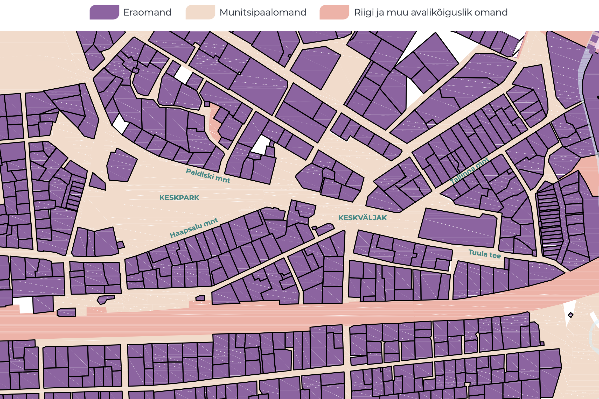

```

</div>
```{block, type='imgsource'}
<span class="imgsource-source">Allikas:</span> Sfäär planeeringud 2019.
```

Avalik ruum koosneb peale tänavavõrgustiku parkidest, veekogudest, väljakutest, ühiskondlike objektide maa-aladest. Lisaks sisaldab see arvukalt teisi võrgustikke, mis on vajalikud eraomandi toimimiseks ja mis pakuvad avalikke teenuseid. Näiteks avaliku maa all on trassid, mis tagavad elektri-, vee- ja soojusvarustuse kodudes ja ärides. Avaliku ruumi maapealses osas on võrgustikud eri liikumisviisidele ja sõidukitele, et tagada inimeste ja kaupade ligipääs eraomandile. Ühistranspordisüsteem on avaliku ruumi oluline osa.

Avalik ruum ei ole ühene ega selgepiiriline, sest võib hõlmata eraomandit ning selles võivad sisalduda ruumiosad, mis pole igal ajahetkel kättesaadavad, on tasulised või mõeldud kasutuseks kindla kogukonna liikmetele. Sellised poolavalikud ruumid on näiteks piirdetaraga spordiplatsid, kaubamaja sisetänavad, kortermajade hoovid ja välikohvikud. Avalik ruum on hajus, kuna ruumil on omadusi, mille mõjud ulatuvad vahetust füüsilisest ümbrusest kaugemale. Nii vaated ja keskkonnamõjud kui ka hooned ja nende fassaadid on osa avaliku ruumi ühishuvist, mõjutades seda nii visuaalselt kui ka seal toimuvate tegevuste kaudu.

### Avaliku ruumi kvaliteedi määrab eelkõige selle sidusus kõigile kasutajatele {-.chapter2_section}

Avaliku ruumi peamine tunnus on vaba ligipääs kõigile nii füüsilises, sotsiaalses kui ka rahalises mõttes. Vaba ligipääs on tagatud siis, kui ruumi kasutajal on võimalik oma igapäevaseid ning ühiskondlike tegevusi iseseisvalt teha järjepidevas ruumis, milles ei ole takistusi või katkestusi. Keskse tähendusega on jalgsi liikuva inimese võrgustik. Kuigi tänavaruumis sisalduv sõidutee on avaliku ruumi vajalik osa, võib sõidukite liigne kiirus ja liiklustihedus selle muuta nii ebaturvaliseks, et see langeb n-ö avaliku ruumi kaardilt välja. Sel juhul kujuneb iga ülekäigurada ja kõnnitee väga oluliseks võrgustiku elemendiks. Kui need osad on kitsad, omavahel sidumata, ohtlikud või ebameeldivad, siis võrgustik katkeb, sest tänavad ja ristmikud ei toimi enam kõigile ruumikasutajatele liikumis- ega olemisruumina.

<div class="casebox">

### Avaliku ruumi sidus areng

Tartus 2016. aastal koos Eesti Rahva Muuseumi (ERM) rajamisega uuendatud Roosi tänav rõhutab nii läbivates ruumilistes ideedes kui ka täpsemates lahendustes kesklinna ja muuseumi sidumist jalgsi liikuvale inimesele. See on võimendanud ruumitunnetust, milles ERM ei ole eraldiseisev objekt, vaid seotud Tartu kesklinna avaliku ruumi kui võrgustikuga, andes lähtepunkti ka järgmistele sammudele piirkonna elukeskkonna parendamisel.

<p class="caption" id="figure212"><span class="figure-number">Joonis 2.1.2.</span> Roosi tänav Tartus</p>
```{r, figure212, out.width='100%', fig.align='center', echo=FALSE, message=FALSE}

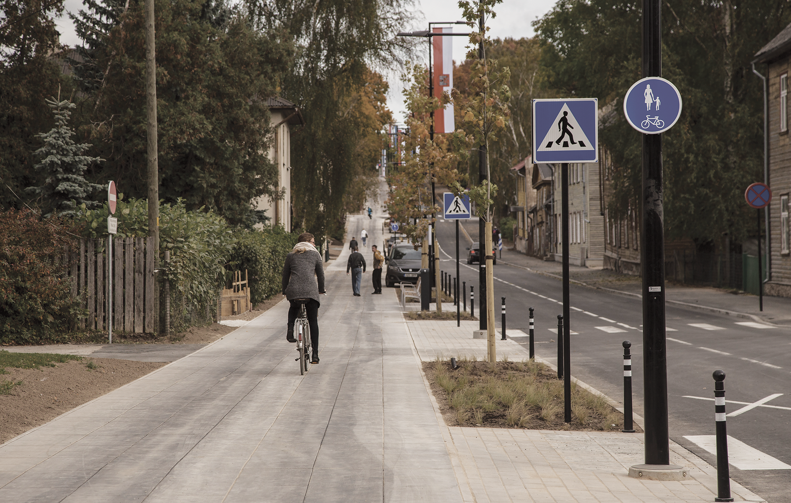

```
</div>
```{block, type='imgsource'}
<span class="imgsource-source">Allikas:</span> Triin Pitsi.
```

Autostumise tulemusel on avalikku ruumi sageli arendatud lihtsustatult, käsitledes seda pigem transporditaristuna ja juhindudes sõiduautost ja sõiduteede võrgustikust. Paljude riikide kogemus näitab, et see viib kergesti elukeskkonna halvenemiseni ja ligipääsetavuse vähenemiseni ([Gehl 2015](#Gehl2015)). Kui avalik ruum ei toimi inimsõbraliku võrgustikuna, siis kolivad autodesse ka need, kes muidu autot ei kasutaks, ja see toob linnades kaasa paratamatu ummistumise. Jalakäijale suunatud sidus avalik ruum tingib ka ühistranspordi aktiivse kasutamise. Kuigi ühe osa avaliku ruumi kvaliteedist moodustab võimalus liikuda sõiduautoga, on hea elukeskkonna eelduseks arusaam, et avalikus ruumis on inimene alati sõidukitest tähtsam.

```{block, type='blockquote-left'}
Autostumise tulemusel on avalikku ruumi sageli arendatud lihtsustatult, käsitledes seda pigem transporditaristuna ja juhindudes sõiduautost ja sõiduteede võrgustikust.
```

Sidus avalik ruum on üleilmselt oluline arengusuund elukeskkonna kvaliteedi parandamisel. ÜRO säästva arengu üks eesmärke on tagada aastaks 2030 universaalne juurdepääs kaasavale ja ligipääsetavale avalikule ruumile ning rohealadele, sest hästi kujundatud ja hooldatud sidus avalik ruum tagab madalamad kuritegevuse näitajad, võimestab sotsiaalselt tõrjutud ühiskonnarühmi ning on eeldus õnnelike ja tervete kodanike heaolule. Kvaliteetne avalik ruum on linnade majandusliku, keskkondliku ja ka kultuurilise konkurentsivõime alus ([ÜRO 2017](#2United2017)). Avalikku ruumi esikohale seadev kohaloome katusorganisatsioon mittetulundusühing Project for Public Spaces nimetab avaliku ruumi majandusliku kasuna näiteks kinnisvara väärtuse tõusu, suurenenud väikeäride tihedust ja kasvavat käivet ([PPS 2007](#Project2007)). Hea avalik ruum vähendab õhu- ja mürareostust ning toetab liigirikkuse kasvu.

```{block, type='blockquote-right'}
Kuigi ühe osa avaliku ruumi kvaliteedist moodustab võimalus liikuda sõiduautoga, on hea elukeskkonna eelduseks arusaam, et avalikus ruumis on inimene alati sõidukitest tähtsam.
```
Avaliku ruumi kui võrgustiku kvaliteedi esmane omadus on teekondade jätkuvus, mugavus ja ohutus nii lastele, eakatele kui ka erivajadustega inimestele, lähtudes igast kodust, töö- ja tegevuskohast; aga niisamuti ka terviklik ökosüsteem. Kvaliteetset avalikku ruumi iseloomustab ka selle üksikosade, iga tänava, platsi ja pargi esteetika, tajuelamused ja sümboolsed tähendused. Ruumikasutajate eri soovidele ja võimalustele vastab mitmekesine avalik ruum, mis võimaldab valikuvabadust ja iseorganiseerumist. Avaliku ruumi terviklikkuse ja kvaliteedi tagab kõikide nende aspektide kohaspetsiifline ning ruumiline läbimõeldus nii ruumi planeerimise, projekteerimise, ehitamise kui ka kasutamise järgus.

### Avaliku ruumi mõiste on Eesti õigussüsteemis sisustamata {-.chapter2_section}

Nii nagu avalik õigus eraõiguse kõrval võimaldab eraõiguslikel isikutel end riigis kindlalt tunda ja ühiskonnal tervikuna areneda, vajab eraomandis ruum selle hüvede kasutamiseks enda kõrvale avalikku ruumi ([Paaver 2013](#Paaver2013)). Avalik ruum ei teeni ise kasumit, vaid on alus nii ettevõtlusele kui ka elukeskkonna arengule.

Eesti õigusruumis ei ole avaliku ruumi mõistet otsesõnu sisustatud. Meie õigusruumis leidub määratlus mõistele avalik koht (reklaamiseaduse § 2, korrakaitseseaduse § 54), mis on suunatud igapäevaelu korraldamisele, turvalisuse ja korrashoiu tagamisele, kuid mitte ruumi püsimisele, arendamisele või parendamisele.

<div class="casebox">
### Kelle väljak?

Eesti avaliku sektori, sealhulgas riigiettevõtete vastuolulist käitumist avaliku ruumiga iseloomustab juhtum, mil 2018. aastal müüs riik Tallinna linna vastuseisust hoolimata avaliku Kompassi väljaku kinnisvarafirmale, kes seejärel taotles kinnistule kõrghoone rajamist, nähes alternatiivina üksnes suletud eraaeda. Pole seadusi, mis takistaksid sellist müüki või avaliku ruumi, näiteks tänava või pargi võõrandamist eraomandisse või nõuaks küsimuse avalikku arutamist. Riik on omavalitsuse asetanud olukorda, mis raskendab omaniku tahte puudumise korral avaliku ruumi kvaliteetset arendamist või isegi hoidmist. Taoline olukord tekib siis, kui riik või omavalitsus seisab pigem oma tulude eest, jättes avaliku ruumi tagaplaanile.

<p class="caption" id="figure213"><span class="figure-number">Joonis 2.1.3.</span> Kompassi väljak Tallinnas</p>

```{r, figure213, out.width='100%', fig.align='center', echo=FALSE, message=FALSE}

knitr::include_graphics("../figures/2-chapter/fig213.png")

```

</div>
```{block, type='imgsource'}
<span class="imgsource-source">Allikas:</span> Maa-amet.
```

Aastatel 1993–2002 kehtis asjaõigusseaduse § 9 lg 2, mis sisult kattus Rooma eraõiguse *res publicae*’ga ning mõjutas maaomandi struktuuri: „Avalik asi on asi, mis kuulub riigi- või munitsipaalomandisse ja on oma ühiskondliku olemuse tõttu kasutatav igaühe poolt nagu territoriaal- ja sisemeri, laevatatavad veekogud, avalikud tänavad, väljakud ja pargid“. Nüüdseks tühistatud määratlus oli aluseks maareformile ning sedakaudu suurele osale senisest avaliku ruumi struktuurist, sest avalikke tänavaid või parke üldjuhul ei erastatud ega tagastatud. Siiski on nii maareformi kui ka hilisemate tehingute (nt munitsipaal- ja riigimaa müügilepingud) mõjul osa avalikust ruumist saanud eramaaks. Praeguses õigusruumis puudub avaliku asja sarnane üldmõiste, mille alusel saaks avaliku ruumi ulatuses piisavalt selgelt ja püsivalt kokku leppida.

Avalikku ruumi sidusust ja ligipääsetavust mõjutab seegi, kuidas on reguleeritud õigus liikuda eramaal. Aastatel 1993–2014 kehtinud asjaõigusseaduse § 142 keelas omaniku loata erakinnistul viibimise. Aastal 2014 viidi võõra maatüki kasutamist reguleerivad sätted keskkonnaseadustiku üldosa seadusesse, kuhu muu hulgas lisati § 33 lg 3: „Omanik ei või keelata eratee ega raja kasutamist jalgsi, jalgrattaga ega muul sellesarnasel viisil liikumiseks, kui kasutus põhineb väljakujunenud taval ega ole talle koormav.“ See säte on veel vähe juurdunud, kuigi on abiks avaliku ruumi sidususe suurendamisele.


Avalik ruum saab toimida ka eramaadel, kuid sel juhul nõuab võrgustiku sidususe ja püsimise tagamine veelgi rohkem tööd avalikult sektorilt. Viimastel aastatel on avaliku ruumi mõiste jõudnud mõnesse planeeringusse ja juhendisse, näiteks 2018. aastal Rahandusministeeriumi koostatud juhend „<a href="https://planeerimine.ee/static/sites/2/uldplaneeringu_juhis_final.pdf">Nõuandeid üldplaneeringu koostamiseks</a>“ ütleb, et õigusruumis määratlemata mõistena „on mõistlik avaliku ruumi ja väärtuste teemad läbi arutada, neis kokku leppida ning sõnastada ja määrata üldplaneeringu koostamisel“. Niisamuti märgib ruumiloome ekspertrühma 2018. aasta lõpparuanne, et „kõigile kättesaadav kvaliteetne avalik ruum on arenenud demokraatliku riigi oluline tunnus“. See tähendab, et eri tasandi planeerimisvaldkonnad on teadvustamas avaliku ruumi mõistet, mis seni on jäänud juhuslikuks või sootuks tähelepanuta.

### Avalik sektor ei ole end üldjuhul teadvustanud avaliku ruumi esindaja ja tellijana  {-.chapter2_section}

Avalikku ruumi ei ole planeerimisseaduses nimetatud ega käsitletud ning see on viinud planeeringute fookuse kas kasutusotstarbe määratlemisele või konkreetsetele objektidele, hoonetele, taristule või sõiduteedele, mitte neid siduvale ühisruumile. Kui omavalitsus keskendub ainult üksikisikute huvide tasakaalustamisele seadusekohase menetluse kaudu ja kui puudub isik, kes avalikku ruumi telliks või esindaks, võib see jääda tagaplaanile ka planeerijate või arhitektide töös. Sellest on tulenenud ka osa kodanike õigustatud rahulolematus planeeringutega või nende alusel loodud ruumiga.

<div class="casebox">

### Kas tänav igaühele?

Liiga kitsas kõnnitee Tallinnas Põhja puiesteel ei võimalda liikumist kas või lapsevankri- ga, seal ei mahu kõrvuti käima ega vastutulijast mööduma, mugavusest või ohutusest rääkimata. Avaliku ruumi võrgustik on katkestatud. Ruumi kõnnitee laiendamiseks on piisavalt isegi ilma sõiduradade arvu vähendamata, aga linnavalitsus ei ole seda teinud.

<p class="caption" id="figure214"><span class="figure-number">Joonis 2.1.4.</span> Tallinna Põhja puiestee</p>

```{r, figure214, out.width='100%', fig.align='center', echo=FALSE, message=FALSE}

knitr::include_graphics("../figures/2-chapter/fig214.png")

```

</div>
```{block, type='imgsource'}
<span class="imgsource-source">Allikas:</span> Reio Avaste.
```

Omavalitsused on mõnikord eelistanud ruumiotsustes erahuve ja kahjustanud sellega avalikku ruumi põhjendusel, et puudub piisavalt selge alus avaliku ruumi püsimist või selle kvaliteedi suurendamist eraomanikult nõuda. Mõni omavalitsus on siiski seda alust tugevdanud avalikku ruumi teadlikult väärtustava üldplaneeringuga, näiteks Tartu kesklinna üldplaneeringus on avalik ruum eraldi joonistel ja peatükina esile tõstetud. Siiski ei sobi aeglaselt muutuvate dokumentidena ja liiga jäigalt fikseerituna planeeringud ka avaliku ruumi paindlikuks sammsammuliseks parendamiseks.

```{block, type='blockquote-right'}
Eri tasandi planeerimisvaldkonnad on teadvustamas avaliku ruumi mõistet, mis seni on jäänud juhuslikuks või sootuks tähelepanuta.
```

Tänavad ja pargid on enamasti avalikus omandis, kuid see ei taga avaliku ruumi sidusust. Tänavate ehitamise alus ei ole üldjuhul detailplaneeringud, vaid tee-ehitusprojektid, mida lahendatakse üksnes insenertehniliselt ega avalikustata. Nii planeeringute kui ka teeprojektide aluseks on enamasti standard EVS 843 (Linnatänavad), mille sisu näeb tervikliku võrgustikuna sõiduteid, aga mitte avalikku ruumi. Normatiivide mehaanilise rakendamise tõttu kipuvad linnaruumis domineerima sõiduteed ja autokesksus. Lühiajalistes ruumiotsustes, näiteks talvises tänavahoolduses või ehitusaegses liikluskorralduses, võimenduvad sõiduautode ületähtsustamine ja jalakäija unustamine veelgi. Nii võib avalik sektor tekitada suuremaidki katkestusi avalikus ruumis kui eraomand.

Kohalikel omavalitsustel ei ole võimalik avalikku ruumi eirata, sest see on kõigis asulates olemas, pikema aja jooksul kujunenud ja enamjaolt aktiivses kasutuses. Omavalitsused üldjuhul haldavad peaaegu kogu avalikku ruumi ja püüavad seda võimete piires edasi arendada. See on sõltunud aga eelkõige konkreetse omavalitsuse ametnike mõtteviisist.

```{block, type='blockquote-left'}
Normatiivide mehaanilise rakendamise tõttu kipuvad linnaruumis domineerima sõiduteed ja autokesksus.
```

Nii riigi Maa-amet kui ka riigiettevõtted ja omavalitsused on eraomandisse võõrandanud maatükke, mida kasutatakse avaliku ruumina või mida oleks loomulik selleks kavandada ([joonis 2.1.3](#figure213)). Sellise tehingu korral satuvad nii linnaelanike kui ka uue omaniku õigused praeguses õiguskorras ebaselgele pinnale, milles vaidluste tulemust ei saa ennustada.

Sellegipoolest leidub eraomanikke, kes on ise mõistnud avaliku ruumi vajalikkust ning on seda arendanud vahel tõhusamaltki kui kohalik omavalitsus. Tavaliselt toimub see juhul, kui ühe arendaja omandis on suurem ala. Avalik ruum väärtustab ja suurendab ala atraktiivsust nii kasutajate kui ka äride silmis. Ometi kipuvad sellised avalikud ruumid jääma laiema võrgustikuga sidumata, kui omavalitsus või omanik ei pööra tähelepanu avaliku ruumi püsimisele või sidumisele ümbrusega.

Kuna avaliku ruumiga ei ole avalikus sektoris piisavalt teadlikult tegeletud, on see jäänud paljuski kodanikuaktiivsuse töömaaks. Asumiseltsid ja huvigrupid on koostanud omal algatusel avaliku ruumi visioone, korraldanud aktsioone ja võtnud enda kanda nii koostööd kui ka vaidlusi nii eraomanike kui ka omavalitsustega. Esinduslikumate avalike ruumide loomise nimel on olulisi samme teinud Eesti Arhitektide Liit (nt EV100 arhitektuuriprogramm „<a href="http://www.arhliit.ee/EV100_arhitektuur/">Hea avalik ruum</a>“ koostöös kohalike omavalitsustega). Vabakonna ja erialaorganisatsioonide hoogustunud tegevus näitab, et avaliku ruumi sidusus ja kvaliteet teevad ühiskonnale tõsist muret. Mõneti on aktiivsed kodanikud ja kolmanda sektori ühendused asunud ise avaliku ruumi esindajaks või tellijaks. Kõik sedasorti ühiskondlikud ettevõtmised suudavad pakkuda vaid üksikuid ja ajutisi lahendusi, mis ei asenda pidevat eksperditeadmistel põhinevat tööd avaliku ruumi kui terviku parandamiseks.

```{block, type='blockquote-right'}
On oluline, et riik ja riigiettevõtted ei kahjustaks suurarenduste tellijatena ise avalikku ruumi.
```
Riigi ja omavalitsuse ametkonnad, mille otsused loovad või muudavad avaliku ruumi, lähtuvad tihti kitsalt oma ametkonna fookusest. Puuduvad ametkondi siduvad üksused, kes avalikku ruumi tervikliku võrgustikuna esindaks ja kaitseks, selleks vajalikke lahendusi looks ning teeks avaliku ligipääsetavuse ja inimsõbraliku ruumi huvides sihipärast koostööd erasektoriga.

### Avalik ruum kui võrgustik on tagatud siis, kui riik ja omavalitsused tähtsustavad seda igas ruumiotsuses ja igas mõõtkavas  {-.chapter2_section}

Avalik ruum on keerukas võrgustik ja muutumises olev struktuur. Samamoodi nagu tehnilised võrgustikud (veevarustus, elektrisüsteem jm), vajab avalik ruum toimimiseks ja arenguks võrguvaldaja järjepidevat tööd. Avaliku ruumi võrguvaldaja on avalik sektor, kes saab kaitsta ja parendada avalikku ruumi.

```{block, type='casebox'}

### Valik soovitusi ja põhimõtteid

Avaliku ruumi määratlemisel ja kvaliteedikriteeriumide kehtestamisel võib eeskuju võtta ÜRO koostatud juhendmaterjalist „Global Public Space Toolkit: From Global Principles to Local Policies and Practice“ (2015), kust leiab eriilmelisi praktilisi näiteid nii linna- kui ka riigivõimule ruumi ja poliitika loomiseks ning kodanikuühiskonna väärtustamiseks. NACTO ja Global Designing Cities Initiative’i koostatud tänavate kujundamise juhendid „Global Street Design Guide“ keskenduvad avalikule ruumile ja linnatänavate ümbermõ- testamisele. Samuti on võimalus pöörduda kohaloome põhiorganisatsiooni ehk Project for Public Spaces lihtsate kontrollküsimuste ja juhendite poole.
```

Avaliku ruumi võrgustiku valdajana on omavalitsusel õigus ja kohustus seista avaliku ruumi eest kõigis oma otsustes. Riigi ülesanne on olla linnade ja valdade partner, kuid ka õigusruumi looja ning erandjuhul ja vajaduse korral kodanike kaitsja, kui omavalitsus mingil põhjusel avaliku ruumi eest piisavalt ei seisa. Samuti on oluline, et riik ja riigiettevõtted ei kahjustaks suurarenduste tellijatena ise avalikku ruumi.

Nii linnade, valdade kui ka riigi tasandil on mõistlik kaaluda pädevate meeskondade moodustamist, kes suudavad kaitsta eri valdkondade koostöös avalikku ruumi kui sidusat võrgustikku. See ei nõua halduskoormuse kasvu, vaid pigem formaalsete menetluste asendamist pideva sisulise tööga.

Kuna avalik ruum moodustab olulise osa igapäevasest eluruumist,  on mõistlik kaasata avalikkus otsustesse, mis jäävad vormiliselt küll planeerimisregulatsioonist välja, kuid millel on tuntav mõju avalikule ruumile, sest paljusid ruumiotsuseid (nt kas mingi koht jääb avalikuks pargiks, tänavaks, mänguväljakuks, metsaks või mingi läbipääs avatuks) ei langetata planeeringutega, vaid tihti enne või pärast planeerimist, näiteks müügitehingute või liikluskorraldusega. Ideaaljuhul on avalik ruum püsivalt avalikus omandis, kuid tulenevalt Eesti senistest julgetest erastamisotsustest peab arvestama, et riik on juba teinud valiku, et avaliku ruumi sidusus ja kvaliteet tuleb tagada ka paljudel eramaadel. Samuti on oluline, et avalik sektor avalikule ruumile vajalikke maid mõtlematult ei võõrandaks, vaid seaks tehingutes avaliku ruumi tagamiseks tingimused ning oskaks vajalikke maid ka targasti omandada.

Igal omavalitsusel pole mõistlik oma määrustes või planeeringutes avaliku ruumi olemusele sisu otsida. Üldpõhimõtted saaksid selgelt ja ühesuguselt kehtida kogu riigis. Õigusruumi selguse vajadusele rõhub ka <a href="https://www.riigikantselei.ee/sites/default/files/riigikantselei/strateegiaburoo/ruumiloome_lopparuanne_.pdf">ruumiloome ekspertrühma lõpparuanne</a>:

*„Õigusaktides tuleb luua senisest selgemad alused ruumiloomele tervikuna, haarates seostatuna kõiki ruumiotsuseid. Seaduses tuleb seostatult käsitleda ruumiloome põhimõtteid ja mõisteid. Avaliku ruumi olulisuse rõhutamine ruumiloomes ja kvaliteedinõude sõnastamine annavad parema aluse kvaliteetse avaliku ruumi ja ehitatud keskkonna rajamiseks ning eelnõude ruumimõju hindamiseks.“*

Nii riik kui ka omavalitsused peavad teadvustama oma rolli avaliku ruumi võrguvaldajana või tellijana, pidades sealjuures lugu igast ruumikasutajast.

<div class="casebox">

### Visioon ühendatud linnaruumist

Linna ruumilise kvaliteedi tõstmisel on keskne tähtsus avaliku ruumi kui tervikliku võrgusti- ku sidususel, tihedusel ja mitmekesisusel. Näiteks Tallinna vanalinna ümbritsevat pargivööd saab arendada avaliku ruumi osana, võimaldades mugavat ülepääsemist sõiduteedest, laiendades jalakäiguruumi ja avades uusi kvartalisiseseid läbipääse. Nii saab ühendada inimesele mugavalt hulga ülelinnalise tähtsusega ühiskondlikke hooneid, väljakuid, tänavaid ja parke, mille kaudu saab Tallinn kujuneda tunduvalt inimsõbralikumaks linnaks.

<p class="caption" id="figure215"><span class="figure-number">Joonis 2.1.5.</span> Väljavõte EKA uurimisprojektist „Lõpetamata Linn“</p>

```{r, figure215, out.width='100%', fig.align='center', echo=FALSE, message=FALSE}

knitr::include_graphics("../figures/2-chapter/fig215.png")

```

</div>
```{block, type='imgsource'}
<span class="imgsource-source">Allikas:</span> Kavakava arhitektid 2019.
```

### Kokkuvõte  {-.chapter2_section}

Hästi toimiva ühiskonna ülesanne on hoolitseda, et inimene tunneks end ruumis hästi mitte ainult kodus, tööl ja autos, vaid ka avalikus ruumis. Avalikku ruumi mõjutab peaaegu iga ruumiotsus. Avaliku sektori tuumülesanne on ruumi mõjutavate otsuste ja lahenduste positiivseid mõjusid kaitsta ja võimendada ning negatiivseid mõjusid ennetada või takistada. Avaliku ruumi terviklikkus on üldkehtiv avalik huvi ja seal ei saa juhinduda ühe teema või ruumikasutaja eelistamisest, näiteks sõiduteede või omaniku vabaduste ülimuslikkusest. Avalik ruum vajab kaitsmise kõrval ka visioonidel põhinevat strateegilist arendamist, sealhulgas pidevat ruumilist seostamist iga rajatava hoone, sõidutee ja era-arendusega. Muu hulgas annab avalik ruum võrgustikulise ruumiobjekti tähenduses selgema aluse linnaarhitektide tööle ja tasakaalus planeeringulahendustele.

```{block, type='blockquote-left'}
Avalik ruum vajab visioonidel põhinevat strateegilist arendamist, seal hulgas seostamist iga rajatava hoone, sõidutee ja eraarendusega.
```

Kuigi Eesti lähiajaloo õigusruumis ja valitsemistavades on avalik sektor keskendunud ruumi parendamise asemel pigem seda suunavate dokumentide menetlemisele, on nüüdseks hakatud sisulises mõttes teadvustama ruumi ja elukeskkonna tulevikku. 2015. aastal lisati planeerimisseadusesse (§ 8) elukeskkonna parendamise põhimõte ning ehitusseadustikku (§ 1) eesmärk tagada ehitatud keskkonna eesmärgipärane toimivus ja kasutatavus. Need üldised sätted jäävad deklaratiivseks, kui riigis ja omavalitsustes ei käivitu teadlik töö avaliku ruumi järjekindlaks parendamiseks, milleta on võimatu elukeskkonda tervikuna edendada.

Erinevalt vaba ettevõtluse arendustest saab avalik sektor avaliku ruumi arendamist ise teadlikult ja strateegiliselt suunata. Avalikust ruumist ja selle arendamisest sõltuvad erainvesteeringud, arendajate valikud, inimeste elu- ja töökohavalikud, mida planeeringutega jäigalt reguleerida ei saa. Mõistlik on avaliku ruumi või ühisruumi mõiste kasutusele võtta mitte üksnes seadusraamistikus, vaid ühe alusena killunenud valdkondlike ruumiotsuste kokkutoomisel.

Avalik ruum kui elukvaliteeti oluliselt mõjutav võrgustik vajab pidevat tähelepanu ja tahet seda paremaks arendada. See nõuab peale tehniliste teadmiste ja oskuste loovust, head ruumitunnetust ja valdkondadevahelist sünergiat. Elukeskkonna parendamist sooviv avalik sektor mõtleb ja tegutseb kodanike ühishuvides.

Aastal 2018 valminud <a href="https://www.riigikantselei.ee/sites/default/files/riigikantselei/strateegiaburoo/ruumiloome_lopparuanne_.pdf">ruumiloome ekspertrühma lõpparuande</a> üks ettepanekuid on laiendada elukeskkonna parendamise põhimõtet selgemalt kogu ruumiloomele. Et see toimiks, peavad avalikku ruumi igas oma otsuses väärtustama nii ettevõtjad kui ka kodanikud, nii omavalitsused kui ka riik.

Turvalisust ja heaolu kasvatab eelkõige aktiivne ruumi kasutus ([Worpole ja Knox 2007](#Worpole2007)), seega on tähtis ka ruumi iseorganiseerumine ja vabakasutus. Ise- ja koosloomine suurendab ühtlasi elanike kogukonna- ja omanikutunnet. Ruumiloome formalismist vabanemise eelduseks on mõtteviisi muutus, aga ka õigusruumi toetus. Avalik ruum paraneb, kui võrgustiku terviklikkust ja mitmekesisust tähtsustatakse järjepidevalt nii suurtes otsustes kui ka pisiasjades. Sellega koos püsib ja paraneb kogu ühiskonna ja demokraatia tervis.

### Viidatud allikad {-.subreferences}

<p id="Gehl2015">Gehl, J. 2015. Linnad inimestele. Tallinn: Eesti Kunstiakadeemia, Yoko Oma.</p>
<p id="Ilus2000">Ilus, E. 2000. Rooma eraõiguse alused. Tallinn: Ilo Print.</p>
<p id="Paaver2013">Paaver, T. 2013. Mis on avalik ruum – avaliku ruumi käsitlustest ruumilises planeerimises. –Roose, A. (toim.). Peatükke planeerimisest. Protsesse, meetodeid ja näiteid. Tartu: Tartu Ülikool, 51–62.</p>
<p id="Project2007">Project for Public Spaces 2007. What is placemaking? https://www.pps.org/article/what-is-placemaking.</p>
<p id="Worpole2007">Worpole, K., Knox, K. 2007. The social value of public spaces. Joseph Rowntree Foundation. https://www.jrf.org.uk/report/social-value-public-spaces</p>
<p id="2United2017">ÜRO 2017 – New Urban Agenda. United Nations Conference on Housing and Sustainable Urban Development (Habitat III).</p>

<!--chapter:end:02.1-chapter.Rmd-->

## Ehituspärand ja ruumikvaliteet {.chapter_section .chapter2_section}

```{block, type='authors'}
<div class="author-links">**[Triin Talk](#triin-talk) ja [Siim Raie](#siim-raie)**</div>
<div><a class="print-btn" href="../print/EIA-2019-2.2.pdf"><i class="fa fa-file" aria-hidden="true"></i>Trükiversioon</a></div>
```

```{block, type='points'}
* Veerand kaitsealustest ehitismälestistest Eestis on halvas seisus ja kasutuseta, riigi panus nende korrastamisse ei ole piisav.
```

Olemasolevad ehitised ja ruumilised struktuurid moodustavad tänapäevase ruumiloome raamistiku. Ajalooline ehitis võib olla paiga sümbol, kogukonnakeskus ja turismimagnet, mille ümber luuakse selle vaatlemist ja külastamist soosivat ruumi. See võib olla ka piirkonna häbiplekk ja tüliõun, kui see riivab oma halva seisukorraga silma või ohustab avalikus ruumis liikujaid. Sõltuvalt seisukorrast võib ehituspärand peegeldada asula jätkusuutlikku püsimist läbi ajastute või luua lohutu mulje paremate aegade möödumisest, mõjutades oluliselt piirkonna kuvandit.

Nii Eestis kui ka mujal kasvas ehitatud keskkonnas pärandikaitse roll käsikäes sõjajärgse modernismi võidukäiguga 1960.–1970. aastatel. Nõukogude võimuga oli loodud soodsad võimalused ruumi pöördeliseks ümberkujundamiseks – kogu maa kuulus riigile, mis võimaldas seada utoopilisi ehitusplaane. Pärandikaitse esiletõusu on võimalik tõlgendada kriitilise vastureaktsioonina modernistlikule linnauuenduspoliitikale, millega Eestis kaasnes ühtlasi vastuseis toonasele režiimile. Eluruumide puuduse lahendamiseks olid masstoodetud korterelamud asendamatud, kuid peagi tõdeti, et asendamatu on ka ruumi piirkondlik omapära ja kultuuriväärtus.

Vastandlikud tungid ehitatud keskkonda uuendada ja säilitada kujundavad ka tänapäeval meie avalikku ruumi, kuid vastuolud ei tundu olevat enam nii teravad. Tänapäevases linnaplaneerimises arvestatakse palju rohkem olemasolevate struktuuridega, ka maaomandi killustumine ja ühiskonna demokratiseerumine ei võimalda enam kergekäeliselt terveid kvartaleid lammutavateks määrata. Mõõdukas vaesus, mille tõttu suur osa pärandist on tänaseni säilinud, on samal ajal jõudsalt taandumas. Kuigi pikemas vaates kasulik, ei ole pärandi korrastamine lühiperspektiivis omanikule kõige kasumlikum valik, mistõttu on kultuuripärandi seadusega kaitsmine endiselt vajalik. Kuidas seda tänapäeval ja tulevikus kõige mõistlikumalt teha, on olnud keskne küsimus viimase kuue aasta jooksul toimunud uue muinsuskaitseseaduse väljatöötamisel. Niisamuti on see probleemistik esil käesolevas artiklis, milles vaatleme Eesti ehituspärandi rolli avaliku ruumi kujundaja ja väärindajana. Teema käsitlemiseks püstitame kolm küsimust:

1) milline on ehituspärandi mõju ruumile ja selle kasutajatele,
2) kuidas on võimalik käsitleda ajaloolist hoonestust kestliku ruumiloome osana,
3) mis on riigi roll ehituspärandi kaitsmisel.

Artiklis vaatleme kogu ehituspärandi mõju avalikus ruumis, mitte ainult riikliku kaitse all olevaid mälestisi – muinsuskaitse mõistet on kasutatud laiemas tähenduses, see tähendab minevikupärandi kaitsmise ja säilitamisena.

### Ehituspärand aitab luua mitmekesist ruumi {-.chapter2_section}


Muinsuskaitse pole kaitse muutuste eest, vaid muutuste juhtimine selliselt, et olemasolevad väärtused säiliksid ja jääksid ruumis hoomatavaks. See on üldjuhul lihtsaim viis luua kvaliteetset ruumi – mõista juba eksisteerivate asjade väärtust, tõsta need esile ja lisada kõik uus sidusalt nende ümber, selmet ruum tühjaks lammutada ja nullist alustada. Hea näide on Rotermanni kvartal Tallinnas, kus kaitsealuste tööstushoonete ja uusarhitektuuri koosmõjus on loodud väga kõrgelt hinnatud ja mitmekesine ruum. Kui kogu kvartal oleks maha lammutatud otsetee rajamiseks Viru hotellist Linnahallini, nagu veel mõnikümmend aastat tagasi planeeriti, ei oleks kindlasti nii mitmekihilist ja omapärast keskkonda kujunenud.

```{block, type='blockquote-right'}
Muinsuskaitse pole kaitse muutuste eest, vaid muutuste juhtimine selliselt, et olemasolevad väärtused säiliksid ja jääksid ruumis hoomatavaks.
```
Arhitekt Rem Koolhaas on öelnud, et muinsuskaitse kaitseb meid tänapäeval vohava keskpärasuse eest ([Koolhaas 2014](#Koolhaas2014)). Kui globaalsetel trendidel põhinev uuslooming on tihti üheülbaline, on muinsuskaitse peamine roll säilitada ehitatud keskkonna mitmekesisust ja piirkondlikke omapärasid. Hea uus arhitektuur kipubki koonduma eelkõige kohtadesse, kus vanad väärtused on juba olemas: näiteks 2018. aasta Eesti arhitektuuripreemiatest olid kaks kolmandikku seotud muinsuskaitsealuste või nende kaitsevööndites paiknevate hoonetega.

Eestlaste huvi kultuuripärandi vastu on suhteliselt suur: vastavalt Eurobaromeetri 2017. aasta uuringule oli 71% küsitletud eestlastest külastanud aasta jooksul mõnda ajaloolist mälestist või kohta, Euroopa Liidu riikide keskmine näitaja oli 61% ([joonis 2.2.1](#figure221)).

<p class="caption" id="figure221"><span class="figure-number">Joonis 2.2.1.</span> Eestlased külastavad ajaloolisi mälestisi ja kohti rohkem kui eurooplased keskmiselt.</p>


```{r, figure221, out.width='90%',fig.align='center', echo=FALSE, message=FALSE, warning=FALSE}

library("tidyverse")
library("scales")
library("dplyr")
library("grid")
library("gridExtra")


 fig221_data <- read.csv ("../data/22_fig1_data.csv", header=TRUE, fileEncoding="utf-8", sep=";")

  fig221_data$answer <- factor(fig221_data$answer, levels = c("Ei oska öelda","Ei ole","Vähemalt üks kord"))

  fig221_data$label <- fig221_data$value
  fig221_data$label[which(fig221_data$label == 0)] <- NA

  fig221_plot1 <- ggplot(subset(fig221_data, pop %in% c("EE"))) +
    geom_bar(mapping = aes(x=question, y=value, fill=answer), width=0.5, stat="identity") +
    geom_text(mapping = aes(x=question, y=value, label=round(label, digits=0)), stat="identity", color="white", position = position_stack(vjust = .5)) +
     scale_fill_manual(values=c("#A8ACA6","#afd7d8","#369b9e")) +
    coord_flip()+
    labs(y="", x="") +
    scale_x_discrete(labels = wrap_format(50)) +
    ggtitle("EE")


      fig221_theme1 <- theme(
      text = element_text(color = "#292b2c", size = 8,family=""),
      axis.text.y = element_text(size=10),
      axis.text.x = element_blank(),
      panel.grid.major.y = element_blank(),
      plot.title = element_text(size=14)
  )


    fig221_plot2 <- ggplot(subset(fig221_data, pop %in% c("EL28"))) +
    geom_bar(mapping = aes(x=question, y=value, fill=answer), width=0.5, stat="identity") +
    geom_text(mapping = aes(x=question, y=value, label=round(label, digits=0)), stat="identity", color="white", position = position_stack(vjust = .5)) +
     scale_fill_manual(values=c("#A8ACA6","#afd7d8","#369b9e")) +
    coord_flip()+
    labs(y="%", x="") +
    scale_x_discrete(labels = wrap_format(50)) +
    ggtitle("EL28")


    fig221_theme2 <- theme(
      text = element_text(color = "#292b2c", size = 8, family=""),
      axis.text.y = element_text(size=10),
      panel.grid.major.y = element_blank(),
      legend.position = "none",
      plot.title = element_text(size=14)
  )


#grid.arrange(fig221_plot1 + fig_theme_general + fig221_theme1, fig221_plot2 + fig_theme_general + fig221_theme2, ncol = 1)

#g <- arrangeGrob(fig221_plot1 + fig_theme_general + fig221_theme1, fig221_plot2 + fig_theme_general + fig221_theme2, ncol = 1)

#ggsave(path="exported_figures/PDF/chapter2",filename="fig221.pdf",g, height=280, width=180, units="mm")

knitr::include_graphics("../figures/2-chapter/fig221.png")

```

``` {block, type='imgsource'}
<div><span class="imgsource-source">Allikas:</span> Eurobaromeeter 2017.</div>
<div><a class="data-btn" href="../data/22_fig1_data.csv"><i class="fa fa-download" aria-hidden="true"></i></i>Laadi andmed</a></div>
```

Ehituspärandi mõju on siiski laiem. Külastuspaikade tekke kõrval on sel oluline roll piirkondade elujõu ja elukeskkonna kvaliteedi kujundajana. Pärandi potentsiaali uurimisele keskendunud Euroopa Liidu koostööprojekti Cultural Heritage Counts for Europe 2015. aasta raportis on sõnastatud pärandist tulenevad ühiskonnakasud ([joonis 2.2.2](#figure222)).

<p class="caption" id="figure222"><span class="figure-number">Joonis 2.2.2.</span> Kultuuripärandi ühiskonnakasud</p>

```{r, figure222, out.width='90%',fig.align='center', echo=FALSE, message=FALSE, warning=FALSE}

knitr::include_graphics("../figures/2-chapter/fig222.png")

```
``` {block, type='imgsource'}
<span class="imgsource-source">Allikas:</span> Cultural Heritage Counts for Europe 2015.
```

Arhitektuuripärandi kaitse ei ole seadnud eesmärgiks ehitatud keskkonna stiiliühtsust või kindla ajalooperioodi ruumiilme taastamist, vaid erinevate kihistuste austamist ja esiletoomist, täiendades neid kvaliteetsete nüüdisaegsete lisandustega. Ent ka ajalooliste ehitiste koopiad ei ole välistatud – needki on vahel omal kohal, kui piirkonna ajaloos väga oluline ehitis on õnnetult hävinud, nagu näiteks Nõmme turuhoone Tallinnas. Lausalist ammuhävinud ehitiste koopiana ülesehitamist ei peeta tänapäeva muinsuskaitses aga eetiliseks eelkõige kahel põhjusel: esiteks oleks see ajaloo võltsimine ning teiseks võtaks see ressursse ja tähelepanu päris kultuuripärandilt selle väärtust ühtlasi vähendades – kui ajaloolise ehitise saab alati vanade piltide järgi üles ehitada, siis milleks seda praegu hoida.

### Olemasolevate ehitiste säilitamine on kestliku ruumilise arengu alus {-.chapter2_section}

Olemasoleva hoonestuse suuremas mahus säilitamine ja jätkuv kasutamine on üha aktuaalsem ka energiatõhususe ja kliimamuutuste kontekstis. Hoone elukaare energiabilansist kulub küttele umbes 20%, ülejäänud 80% neelab materjalide tootmine ja ehitus. Olemasolevad hooned on seega ressurss, mille jätkuv ja taaskasutamine on igati säästlik, sest kui hoone ehitamisse on juba kord paigutatud ehitusmaterjali, on selle renoveerimine ja edasi kasutamine üldjuhul väiksema ökoloogilise jalajäljega kui uue maja ehitamine, isegi kui uus on energiasäästlikum. „Kõige rohelisem on ehitis [---] mis on juba ehitatud“ ([Elefante 2007](#Elefante2007)) on teadmine, milleni on jõutud, arvestades peale küttekulude ka ehitistesse kuluvate materjalide olelusringi. 500 aastat sama maja kasutada, seda remontida ja ajakohastada on kokkuvõttes säästlikum kui iga 50 aasta järel lammutada ja uuesti ehitada.

Eestis on riikliku kaitse all 12 muinsuskaitseala ning üle 5000 ehitismälestise (need on peamiselt ajaloolised hooned, aga võivad olla ka rajatised, nagu teed ja sillad, pargid ja militaarrajatised). Ehitismälestise arv moodustab 0,7% ehitisregistris olevatest ehitistest, isegi koos muinsuskaitsealade hoonestusega moodustab riiklikult kaitstav ehituspärand umbes ühe protsendi ehitistest. Riikliku kaitse all olevate ehitiste hulga võrdlemine teiste riikide omaga on keerukas ja arvude võrdlemisel tuleb arvestada, et Eesti mälestiste nimekiri on 1990. aastate tehniliste võimaluste ning maade tükeldamise nägu: kompleksid, mis paljudes riikides loetakse üheks mälestiseks, on Eestis loetletud mitmekümne üksikmälestisena. Kaitse all olemise sisuline tähendus võib samuti olla väga erinev. USAs on näiteks üle 100 000 mälestise ning igal aastal lisatakse nimekirja veel tuhatkond objekti. Samal ajal ei tähenda riiklikku mälestiste nimekirja lisamine isegi keeldu ehitist lammutada, ehitusregulatsioone saavad kohaldada ainult kohalikud omavalitsused ([Page 2016](#Page2016)). Suurbritannias on kaitse all üle 9800 muinsuskaitseala ja 375 588 ajaloolist hoonet, lisaks veel ajaloolised pargid ja aiad, mis Eestis on arvatud ehitismälestiste hulka. Lätis on kultuurimälestisi 8584, sealhulgas riikliku tähtsusega 5183, kohaliku tähtsusega 3401, arhitektuurimälestised on neist 40%. Soomes on ehitismälestiste arv väga väike – 280 ehitist või ehitiste rühma – kuid neile lisaks on automaatselt kaitse all kõik enne 1917. aastat ehitatud kirikud, ligikaudu 800 riigile kuulunud ajaloolist ehitist ja 1258 riiklikult olulist kultuurikeskkonda. Kuna Soomes on juba 1980. aastatest võimalik pärandi kaitse planeeringute kaudu, on mälestiseks tunnistamise asemel suurem osa pärandist kaitstud planeeringutega: nende hulk on hinnanguliselt 15–20 000 ehitist või ehitiste rühma.

<div class="casebox">
<h3>Tööstuspärand</h3>

Kasutuseta ehitismälestiste seas on palju suuri tööstushooneid, mis on ehitatud hiiglasliku Vene Keisririigi vajadusi silmas pidades ning mida juba ammu sellises mahus tarvis ei lähe. Tallinnas on õnnestunud mitmed tööstuspiirkonnad taaselustada elu- ja ärikvartalitena (nt Rotermanni, Noblessneri, Lutheri, Tselluloosi ja Dvigateli kvartalid), väiksemates linnades on sellistele ehitistele raskem uut kasutust leida.
Kreenholmi manufaktuur Narvas oli 19. sajandi teisel poolel Vene Keisririigi kõige kaasaegsem tööstusettevõte ja mitu aastakümmet suurim tekstiilivabrik kogu Euroopas. Kõrgaegadel töötas selles üle kümne tuhande töötaja, väiksemas mahus tootmine kestis kuni 2010. aastani. Ambitsioonika detailplaneeringu järgi on Kreenholmi alale kavandatud atraktiivne keskus koos elumajade, meelelahutus- ja kultuuriasutuste, konverentsikeskuse, teaduspargi, hotellide ja kaubandusettevõtetega. Seni pole arendustegevuseni jõutud, kuid vähemalt on omanik mälestistele uued katused peale pannud ning saanud Narva Muuseumiga kokkuleppele, et alale võib korraldada ekskursioone.

<p class="caption" id="figure223"><span class="figure-number">Joonis 2.2.3.</span> Kreenholmi manufaktuur</p>

```{r, figure223, out.width='100%', fig.align='center', echo=FALSE, message=FALSE}

knitr::include_graphics("../figures/2-chapter/fig223.png")

```

</div>
```{block, type='imgsource'}
<span class="imgsource-source">Allikas:</span> Annika Haas.
```

Eestiski on riikliku muinsuskaitse kõrval hakanud toimima ehituspärandi kaitsmine planeeringute kaudu. Alates 2003. aastast on kohalikel omavalitsustel võimalik kehtestada miljööväärtuslikke alasid ning 2015. aastast väärtuslikke üksikobjekte. Planeeringute kasutamine ehituspärandi kaitsmiseks on uus ning alles arenev praktika, ning eeldus, et kõike, mis pole riigi kaitse all, võib lammutada, on visa taanduma.

Miljööalade ja väärtuslike üksikobjektide kaudu on pärandihoid muutunud mitmekülgsemaks ja kogukondi kaasavamaks. Planeeringu avalikustamisel saab teoreetiliselt igaüks kaasa rääkida, milliseid väärtusi peaks planeeringualal säilitama, kuid arvamuste tegelik mõju ruumiotsustele võib olla tagasihoidlik. Riiklike mälestiste nimekirjad on koostatud ajal, kui seadused tänapäevasel viisil kaasamist ei nõudnud, ning üksikute uute kaitse alla võtmiste puhul suhtleb Muinsuskaitseamet eelkõige objekti omanike ja kohaliku omavalitsusega. Riikliku kaitse alla võtmise ettepanekuid saab teha iga kodanik, kuid kaitse alla võtmise otsustavad valdkonna spetsialistid. Miljööalade ja väärtuslike üksikobjektide määramine on täielikult kohalike omavalitsuste pädevuses. Kogukondade aktiivse osalemise korral võiks sellest saada tõeliselt demokraatlik muinsuskaitse, mille puhul ei olegi oluline, kas ehitis on riiklikus vaates esinduslik ja eriline, vaid kas seda kohapeal väärtustatakse ja soovitakse jätkuvalt avalikus ruumis näha.

Pärandihoiu kahetasandiliseks muutumine aitab väärtustada ehituspärandit laiemalt ja paindlikumalt, kui seda võimaldab riiklik kaitse. Siiski tekitab uus olukord mitmeid küsimusi. Näiteks: kas kõik ehitised, mis on 1990. aastatel alternatiivide puudumise tõttu võetud riikliku kaitse alla, peavad alatiseks kaitse alla jääma? Kas miljööalal võivad nõuded olla rangemad kui muinsuskaitsealal? Vanadesse ehitistesse kui keskkonnaressurssi suhtudes on põhjust väärtustada mitte ainult 1% ajalooliselt ja arhitektuuriliselt kõige väärtuslikumaid ehitisi, mis on riikliku kaitse all, vaid seista palju laiemalt olemasolevate ehitiste eluea pikendamise eest, mida kaasav kaitse planeeringute kaudu samuti võimaldab.

Probleemiks on paljud vanad detailplaneeringud, mis kehtivad tähtajatult ja lubavad väärtuslike hoonete lammutamist, mis tänapäeval avalikkuse ootustega enam sugugi kooskõlas ei ole. Näiteks kui 2019. aastal asuti lammutama Tallinnas Kadaka tee 141 asuvat juugendlikku 1920. aastatest pärit puumaja, tõusis sellest pahameeletorm nii kohalike elanike kui ka laiemalt pärandit väärtustavate tallinlaste seas. Hoone oli vahepeal saanud populaarseks restoraniks ja selle kaitseks koguti ligi 4000 allkirja, kirjutati mitmeid pöördumisi ja artikleid. Ka linnaosavanem ütles ajakirjanduses, et tema sellist maja lammutada ei lubaks. Et aga hoone lammutamine oli lubatud 2008. aastal kehtestatud detailplaneeringuga, mis jätkuvalt ja lõputult kehtib, ei õnnestunud lammutamist peatada. Analoogseid tänapäeva kontekstis üllatava sisuga planeeringuid tuleb välja kõikjalt, ning kuigi avalikkus ja ametkonnad on saanud neis kaasa rääkida viimati 10 või isegi 20 aastat tagasi, pole vana planeeringu teostamiseks uued kaasamisringid vajalikud. Kohaliku tasandi pärandihoid peaks hõlmama uute pärandisõbralike planeeringute koostamise kõrval ka vanade detailplaneeringute ülevaatamist ja põhjendatud juhul tühistamist, mida seni ei ole teadaolevalt kohalikes omavalitsustes tehtud.

### Üksikutel ruumiotsustel on suur mõju nii kultuuripärandile kui ka regionaalarengule {-.chapter2_section}

Ehituspärandi seisukorra ja mõju avalikus ruumis määrab peamiselt selle kasutuses või kasutuseta olemine. Väheneva rahvastikuga piirkondades (ehk suures osas Eestist) tähendab hoone tühjaksjätmine tihti seda, et see jääb kasutuseta väga pikaks ajaks. Tühjad hooned muudavad asula või linnapildi trööstituks, vähendavad elanike uhkustunnet oma kodulinna üle ning nende soovi linna arengusse panustada. Mahajäetud majad tekitavad inimestes soovi ära kolida, paljud ettevõtlikumad lahkuvad ja alles jäävad põhiliselt need, kellel valikut ei ole.

```{block, type='blockquote-left'}
Toetusmeetmest rohkem mõjutavad ruumilist arengut riigi eri „silotornides“ sündivad üksikotsused: kuhu rajada kool, kus sulgeda haigla, millised asutused liita ja kuhu need paigutada.
```

Linnaruumi atraktiivsuses ja turvalisuses on oluline roll hoonestuse seisukorral – kinnilöödud akendega lagunevad „tondilossid“ peletavad eemale. Ajaloolise linnaruumi ja hoonestuse korrastamine ei ole ainult pärandihoiu ja jätkusuutlikkuse küsimus, vaid lähtub ka regionaalarengu eesmärkidest. Andes kultuuripärandi toel väikelinnadele uut hingamist, suureneb nende potentsiaal elukeskkonnana. Nii on näiteks Eesti Arhitektide Liidu projekt „Hea avalik ruum“ tõmmanud tähelepanu mitme ajaloolise linna keskväljaku või peatänava uuendamisele ja aidanud kaasata investeeringuid. Uutest linnaväljakutest elukeskkonna parendamiseks siiski ei piisa, kui disainvalgustite ja moodsa sillutise tausta moodustab kehvenevas seisus pooltühi hoonestus. Mõningat abi muinsuskaitsealade majade korrastamiseks saab lähiaastatel Kultuuriministeeriumi kavandatud muinsuskaitsealade programmist, kuid toetusmeetmest rohkem mõjutavad ruumilist arengut riigi eri „silotornides“ sündivad üksikotsused: kuhu rajada kool, kus sulgeda haigla, millised asutused liita ja kuhu need paigutada.

Aastatel 2017–2018 Eesti ruumilise arengu protsesse analüüsinud ruumiloome ekspertrühma lõpparuandes on välja toodud, et ruumiloome kvaliteedi määravad sageli otsused, mis langetatakse enne ruumilise planeerimise või projekteerimisprotsessi algust ning millesse ruumipädevusega spetsialistid kaasatud ei ole. Samamoodi sünnivad üldjuhul pärandispetsialistide osaluseta ka ajalooliste hoonete tühjaks jätmise ning asutuste vanalinnadest väljakolimise otsused. Kavandatava riikliku ruumiloome meeskonna ülesannete seas on linnaliste asulate kompaktsuse tagamine ja ajalooliste hoonete kasutuselevõtu soodustamine, mis annab lootust, et tulevikus tehakse neid otsuseid oluliselt rohkem ruumimõjudest lähtudes.

Ruumipoliitika eesmärkide tagamisel peaks kaalukate ruumiotsuste tegemisel hindama ka pikaajalisi sotsiaal-majanduslikke mõjusid, sealhulgas arvestama ehitiste kogu elukaarega – ehitamise, kasutamise, korrashoiu ja lammutamisega; väärtuste juurde loomise ja säilitamisega ning asukohast tulenevate mõjudega (vt ruumiloome ekspertrühma lõpparuanne, 2018). Nii näiteks tuleks uue, energiasäästliku ja soodsa ruutmeetrihinnaga koolimaja ehitamisel arvestada, milliste kuludega ning mis funktsiooni jaoks saab kohandada selle otsuse tõttu tühjaks jääva vana koolimaja. Energiatõhususe arvutamisel on vaja mõelda mitte ainult uue maja energiaklassile, vaid ka kulutatavate ehitusmaterjalide energiakulule ja olelusringi pikkusele, samuti kuludele seoses tühjaks jääva hoonega.

```{block, type='blockquote-right'}
Vanad ehitised on keskkonnaressurss ja nende eluea pikendamise eest tuleb seista.
```

Otsused, millisest hoonest oma asutus välja kolitakse ja mille arendamiseks suured toetussummad antakse, tehakse väljaspool muinsuskaitset. Pärandi säilimise seisukohalt on need otsused aga keskse tähtsusega ning seetõttu on oluline panustada sellesse, et sarnaselt teise põhiseadusliku ülesandega – julgeoleku tagamisega – oleks kultuuripärandi hoidmine lõimitud kõikidesse valitsemisaladesse ja toetusprogrammidesse. Eriti puudutab see riiklikke mälestisi, mille säilitamise tulevastele põlvedele on riik enda eesmärgiks seadnud.

### Mälestised on ühine hüve ja jagatud vastutus {-.chapter2_section}

Kultuuripärandi väärtust ühiskonnas käsitlev Euroopa Nõukogu poliitikadokument Faro konventsioon, millega liitumine on Eestis ettevalmistamisel, käsitleb kultuuripärandit kui universaalset inimõigust. See tähendab, et igaühel on õigus kultuuripärandist osa saada, osaleda selle loomisel ja mõtestamisel enda poolt valitud viisil ja seetõttu on pärandil oluline roll demokraatliku ühiskonna ülesehitamisel ja selle sidususe kandmisel. Elukeskkonna väärtuste hoidmine on praegugi oluline osa Eesti  asumiseltside tegevusest. Kohalikku ehituspärandit väärtustatakse eriti siis, kui seda ohustab lammutamine. Muinsuskaitseamet saab igal aastal kümneid ettepanekuid ehitiste kaitse alla võtmiseks ja enamasti on need seotud elanikkonnale vastumeelsete uusarendustega ja neile ette jääva ajaloolise hoonestuse lammutusohuga. Riikliku kaitse rakendamist ei saa siiski otsustada näiteks rahvahääletuse teel, sest sellisel juhul koosneks mälestiste nimekiri peamiselt ehitistest, mida kunagi on soovitud lammutada.  Mälestiseks tunnistamisega võtab riik kohustuse aidata kaasa nende ehitiste säilimisele. Selle pikaaegse kohustuse võtmiseks on oluline ekspertide hinnang ja lõpuks haldusotsus, et asi vastab riikliku kaitse eeldustele, s. t kuulub kultuuripärandi väärtuslikumasse ossa. Seega on oluline Faro konventsioonis sõnastatud põhimõte eristada kogukondlikku pärandiloomet ja avalikes huvides reguleeritud riiklikku pärandikaitset. Esimene on laiem mõiste – see on kollektiivne ja avatud praktika, mis ei ole tingimata seotud riiklike regulatsioonidega. Kultuurimälestiseks tunnistamine kui üks võimalikke pärandiloome akte on enamat kui arvamusküsitlus – enamik kodanike ettepanekuid saab üldjuhul eitava vastuse ning uued mälestised kinnitatakse ekspertide koostatud alusuuringute tulemuste põhjal. Siiski ei ole põhjust ekspertidepõhist riiklikku pärandikaitse protsessi ebademokraatlikuna käsitleda, kuivõrd iga kultuurimälestiseks tunnistamise ettepanekut ning sellega kaasnevaid eri seisukohti kaalutakse menetlusprotsessi raames põhjalikult. Kodanike pidev huvi objektide kaitse alla võtmise vastu on aga oluline märk sellest, et ehituspärandi kaitse on avalikes huvides, ning aitab mõista, mida inimesed oma pärandina käsitlevad.

Riiklikult kaitstud ehituspärand on meie kõikide ühine hüve jalutada vanalinna jõuluturul või pidada pulmi uhkes mõisasaalis, aga samal ajal väheste vastutus. Vastutus mälestiste säilimise ja korrashoiu ees on eelkõige nende omanikel, valdavalt eraisikutel ([joonis 2.2.4](#figure224)). Ligikaudu veerand ehitismälestistest on halvas või avariilises seisus ja umbes veerand on kasutuseta. Hoone kasutamine tagab üldjuhul selle korrashoiu ja kasutusest väljalangemine tähendab tavaliselt lagunemist. Parem on mälestiste olukord suuremates linnades, halvem maapiirkondades ja väikelinnades, kus rahvastiku vähenemine toob endaga kaasa hoonestuse tühjenemise.

<p class="caption" id="figure224"><span class="figure-number">Joonis 2.2.4.</span> Ehitismälestiste omanikud</p>

```{r, figure224, fig.asp=.75, fig.align='center', echo=FALSE, message=FALSE, warning=FALSE}

library("tidyverse")
library("scales")

 fig224_data <- read.csv ("../data/22_fig4_data.csv", header=TRUE, fileEncoding="utf-8")

fig224_data$percent=percent((fig224_data$value/100), 1)

  fig224_plot <- ggplot(data = fig224_data, aes(x = "", y = value, fill = owners)) +
  geom_bar(stat = "identity") +
  scale_fill_manual(values=c("#dbd8d7","#a18bbb","#297477")) +
  geom_text(aes(label = percent), position = position_stack(vjust = 0.5), color="white") +
  coord_polar(theta = "y") +
  labs(x="", y="")

  fig224_theme <- theme(
                    panel.grid.major.x = element_blank() ,
                    panel.grid.major.y = element_blank(),
                    panel.grid.minor.x = element_blank() ,
                     panel.grid.minor.y = element_blank(),
                     axis.line = element_blank(),
                     axis.text.x = element_blank(),
                         text=element_text(family="Montserrat")
                 )


  print(fig224_plot + fig_theme_general + fig224_theme)

  ggsave(path="../exported_figures/PDF/chapter2",filename="fig224.pdf", height=120, width=200, units="mm")

```

``` {block, type='imgsource'}
<div><span class="imgsource-source">Allikas:</span> Muinsuskaitseseaduse eelnõu seletuskiri.</div>
<div><a class="data-btn" href="../data/22_fig4_data.csv"><i class="fa fa-download" aria-hidden="true"></i></i>Laadi andmed</a></div>
```

Mälestiste ja muinsuskaitsealade hoonete remonti ja restaureerimist toetab Muinsuskaitseamet iga-aastase eelarve võimaluste piires. Probleemiks on olnud toetussumma vähesus: see oli enne majandussurutist suurusjärgus 1,1–1,3 miljonit eurot aastas, alates 2009. aastast on restaureerimistoetused jäänud vahemikku 0,5–0,7 miljonit eurot. Keskmine toetussumma on umbes 5000 eurot, suurim osa toetustest kulub avariiliste katuste parandamisele ([joonis 2.2.5](#figure225)).

<p class="caption" id="figure225"><span class="figure-number">Joonis 2.2.5.</span> Aasta 2018 restaureerimistoetuste ülevaade (€)</p>
```{r, figure225, out.width='80%', fig.align='center', echo=FALSE, message=FALSE, warning=FALSE}

library("tidyverse")

 fig225_data <- read.csv ("../data/22_fig5_data.csv", header=TRUE, fileEncoding="utf-8")

  fig225_plot <- ggplot() +
    geom_bar(data = fig225_data, mapping = aes(x=type, y=sum, fill=type), width=0.4, stat="identity") +
    scale_fill_manual(values=c("#369b9e","#a18bbb")) +
    labs(y="", x="")+
    scale_y_continuous(labels = number)

  fig225_theme <- theme(
    legend.position=0,
    text = element_text(size = 12, family="Montserrat"),
    panel.grid.major.x = element_blank() ,
    panel.grid.minor.x = element_blank(),
  )

  print(fig225_plot + fig_theme_general + fig225_theme)

  ggsave(path="../exported_figures/PDF/chapter2",filename="fig225.pdf", height=120, width=200, units="mm",encoding = "ISOLatin9.enc")
```

``` {block, type='imgsource'}
<div><span class="imgsource-source">Allikas:</span> Muinsuskaitseamet.</div>
<div><a class="data-btn" href="../data/22_fig5_data.csv"><i class="fa fa-download" aria-hidden="true"></i></i>Laadi andmed</a></div>
```

Lisaks üldisele kinnismälestiste restaureerimistoetusele on riik toetanud eraldi toetusmeetmest aastatel 2004–2018 sakraalehitiste korrastamist (nn pühakodade programm) ning aastatel 2001–2016 mõisakoole (Norra EEA toetuse abil rahastatud mõisakoolide programm). Nii mõisakoolide kui ka pühakodade programmi kogumaht oli üle 12 miljoni euro. Kirikud ja mõisad on enamasti asulate kõige suuremad ja avalikus ruumis kõige tähelepanuväärsemad ehitised, millega on seotud suur osa kohalikust kogukonnast ning mida külastatakse kaugemaltki.
Mõisakoolide programmi abil on suuremal või vähemal määral restaureeritud enamikku Eesti mõisakoolidest. Pühakodade programmist on toetusi saanud üle 200 kiriku, kabeli ja tsässona ([joonis 2.2.6](#figure226)).

<p class="caption" id="figure226"><span class="figure-number">Joonis 2.2.6.</span> Pühakodade programm (PÜP, €)</p>

```{r, figure226, fig.asp=.75, fig.align='center', echo=FALSE, message=FALSE, warning=FALSE}

library("tidyverse")
library("scales")

 fig226_data <- read.csv ("../data/22_fig6_data.csv", header=TRUE, fileEncoding="utf-8")


  fig226_plot <- ggplot(data = fig226_data) +
    geom_line(mapping = aes(x=year, y = value, colour=type, group=type), size=1) +
    scale_colour_manual(values=c("#a18bbb","#369b9e"))+
    labs(y="", x="") +
    scale_x_continuous(breaks = c(2004,2006,2008,2010,2012,2014,2016,2018), expand = c(0, 0), limits=c(2004,2018.5))+
    scale_y_continuous(breaks = c(0,1000000,2000000,3000000,4000000,5000000), labels = number, expand = c(0, 0), limits=c(0,5500000))+
    expand_limits (y=0)

   fig226_theme <- theme(
     panel.grid.minor.x = element_blank(),
      text = element_text(size = 12, family="Montserrat"),
     
  )

  print(fig226_plot + fig_theme_general + fig226_theme)

  ggsave(path="../exported_figures/PDF/chapter2",filename="fig226.pdf", height=90, width=160, units="mm",encoding = "ISOLatin9.enc")
```

``` {block, type='imgsource'}
<div><span class="imgsource-source">Allikas:</span> Muinsuskaitseamet.</div>
<div><a class="data-btn" href="../data/22_fig6_data.csv"><i class="fa fa-download" aria-hidden="true"></i></i>Laadi andmed</a></div>
```

Alates 2019. aastast on senine pühakodade programmi eelarve lisatud Muinsuskaitseameti restaureerimistoetuste eelarvesse, nii et kuigi toetussumma justkui suurenes ligikaudu poole võrra, on eraomanike toetamisvõimalused jäänud samaks. Eraomanike olukorra parandamiseks on 2019. aastast loodud taluarhitektuuri toetamise meede, mille eelarve on esialgu vaid 100 000 eurot. Väljatöötamisel on ka vanalinnade programm, mis peaks lähiaastatel andma hoogu väikelinnade muinsuskaitsealade hoonestuse restaureerimisele.
Riigi toetus riikliku kaitse all olevale ehituspärandile ei ole kaugeltki piisav: restaureerimistoetuste taotluste maht on mitu korda suurem kui toetamisvõimalused ([joonis 2.2.7](#figure227)). Majandussurutise ajal tehtud kärbe vähendas toetuste eelarvet ligi poole võrra ja kuigi pärast kriisiaastate lõppu on riigieelarve paisunud kolm korda, on riigi toetus mälestistele jäänud sisuliselt kriisiaegsele tasemele ([joonis 2.2.7](#figure227)). Erinevalt mitmest teisest riigist ei ole Eestis mälestiste omanikele ka maksusoodustusi.

<p class="caption" id="figure227"><span class="figure-number">Joonis 2.2.7.</span> Restaureerimistoetuse võrdlus riigieelarvega.</p>

```{r, figure227, fig.asp=.75, fig.align='center', echo=FALSE, message=FALSE, warning=FALSE}

library("tidyverse")

 fig227_data <- read.csv ("../data/22_fig7_data.csv", header=TRUE, fileEncoding="utf-8")


  fig227_plot <- ggplot(data = fig227_data) +
    geom_line(mapping = aes(x=year, y = value, colour=type, group=type), size=1) +
    scale_colour_manual(values=c("#a18bbb","#369b9e"))+
    labs(y="", x="aasta") +
    scale_x_continuous(breaks = c(2006,2008,2010,2012,2014,2016,2018), expand = c(0, 0), limits=c(2005,2018.5))+
    scale_y_continuous(breaks = c(0,2000000,4000000,6000000,8000000,10000000),labels = number, expand = c(0, 0), limits=c(0,11500000)) +
    expand_limits (y=0)

   fig227_theme <- theme(
     panel.grid.minor.x = element_blank(),
    text = element_text(size = 12, family="Montserrat"),
  )

  print(fig227_plot + fig_theme_general + fig227_theme)

  ggsave(path="../exported_figures/PDF/chapter2",filename="fig227.pdf", height=90, width=160, units="mm")
```

``` {block, type='imgsource'}
<div><span class="imgsource-source">Allikas:</span> Muinsuskaitseamet ning Statistikaamet.</div>
<div><a class="data-btn" href="../data/22_fig7_data.csv"><i class="fa fa-download" aria-hidden="true"></i></i>Laadi andmed</a></div>
```

Uuringus „Eraomandis oleva kinnismälestise hoidmine“ ([Tafel-Viia jt 2014](#Tafel2014)) on toodud mälestiste eraomanikke puudutava probleemi ühe tuumana asjaolu, et mälestisele seatud piirangud ja riigi poolt pakutavad toetused ei ole tasakaalus. Kolmveerand eestlastest arvab, et riigiasutused peaksid eraldama kultuuripärandile rohkem vahendeid ([joonis 2.2.8](#figure228)).

<p class="caption" id="figure228"><span class="figure-number">Joonis 2.2.8.</span> Vahendid kultuuripärandile.</p>

Riigiasutused peaksid eraldama Euroopa kultuuripärandi jaoks rohkem vahendeid (%).

```{r, figure228, fig.asp=.75, fig.align='center', echo=FALSE, message=FALSE, warning=FALSE}

library("tidyverse")
library("scales")

fig228_data <- read.csv ("../data/22_fig8_data.csv", header=TRUE, fileEncoding="utf-8")

fig228_data$answer <- factor(fig228_data$answer, levels = c("Nõustun","Ei nõustu","Ei oska öelda"))

fig228_data$percent=percent((fig228_data$value/100), 1)

  fig228_plot <- ggplot() +
  geom_rect(data= subset(fig228_data, pop %in% c("EE")), aes(fill=answer, ymax=ymax, ymin=ymin, xmax=2.9, xmin=0)) +
  geom_rect(data= subset(fig228_data, pop %in% c("EL28")), aes(fill=answer, ymax=ymax, ymin=ymin, xmax=3, xmin=4)) +
  geom_text(data=fig228_data, aes(label = percent, x=x, y=value), position = position_stack(vjust = 0.5), color="white") +
  xlim(c(0, 4)) +
  coord_polar(theta = "y") +


  scale_fill_manual(values=c("#369b9e","#dbd8d7","#a18bbb")) +
  labs(x="", y="")

  fig228_theme <- theme(
                    aspect.ratio=1,
                    panel.grid.major.x = element_blank() ,
                    panel.grid.major.y = element_blank(),
                    panel.grid.minor.x = element_blank() ,
                    panel.grid.minor.y = element_blank() ,
                    axis.line = element_blank(),
                    axis.text.x = element_blank(),
                    axis.text.y = element_blank(),
                    text = element_text(size = 12, family="Montserrat"),
                 )

  print(fig228_plot + fig_theme_general + fig228_theme)

  ggsave(path="../exported_figures/PDF/chapter2",filename="fig228.pdf", height=120, width=200, units="mm")

```
Välimine ring **Euroopa Liidu keskmine**<br>
Sisemine ring **Eesti**
``` {block, type='imgsource'}
<div><span class="imgsource-source">Allikas:</span> Eurobaromeeter 2017.</div>
<div><a class="data-btn" href="../data/22_fig8_data.csv"><i class="fa fa-download" aria-hidden="true"></i></i>Laadi andmed</a></div>
```

Riigi panust kultuuripärandisse näitab restaureerimistoetuste kõrval ka riigile kuuluva ehituspärandi haldamine. Ligi 60% mälestiste eraomanikest tajub, et riik ja kohalikud omavalitsused ei näita mälestiste haldamisel head eeskuju, kuna eelistavad tihti restaureerimisele uue maja ehitamist ([Tafel-Viia jt 2014](#Tafel2014)).
Aastal 2016 läbiviidud uuringus „Riigi omanduses olevate kultuuriväärtuslike ehitiste haldamine“ ([Mändel jt 2016](#Mändel2016)) järeldati, et vajalik on riigi kinnisvarapoliitika, mis seaks laiemad eesmärgid kui võimalikult soodne majandamine. Nii nagu Riigimetsa Majandamise Keskuse (RMK) eesmärk on tulu teenimise kõrval ka metsa väärtustamine, rajades mittekasumlikke avalikke matkateid ja metsaonne, peaks ka Riigi Kinnisvara ASi põhikirjaliste eesmärkide seas olema kultuuripärandi korrastamine ja tutvustamine. Ainult äriloogikale ja üksikutele poliitilistele otsustele tuginemine ei tuleks riigi loodusvarade haldamisel tänapäeval kõne allagi, ehituspärandi puhul on see aga tavapärane.

<div class="casebox">
<h3>Liberty suvemõisa juhtum</h3>

Liberty suvemõisasse presidendi residentsi kavandamisele on kulunud üle 350 000 euro, põhiliselt projekteerimiskulude katmiseks. See on umbes pool riiklikest restaureerimis- toetustest aastas.
Hooned võeti Eesti Vabaõhumuuseumilt üle 2014. aastal, ehitusprojekt koostati 2015. aastal. 2017. aastal otsustas president Kersti Kaljulaid presidendi residentsi siiski mitte rajada ning 2019. aasta alguse seisuga pole otsustatud, mida edasi teha. Muuseumile, mis sooviks hooned kasutusse võtta, neid tagasi ei ole antud. Mõisakompleks on avalikkusele suletud ja selle seisukord halveneb.
Riigi Kinnisvara AS (RKAS) ootab poliitilist otsust, mida mõisakompleksiga edasi teha – rohkemaks tal põhi- kirja järgi voli ei ole. Kui kultuurpärandi hoidmine ja tutvustamine oleks RKASi põhikirjaline eesmärk, oleks Liberty suvemõisa ja mõne teisegi riigile kuuluva mälestise seisukord tõenäoliselt parem.

<p class="caption" id="figure229"><span class="figure-number">Joonis 2.2.9.</span> Liberty suvemõisa Egon Kochi suvila</p>

```{r, figure229, out.width='100%', fig.align='center', echo=FALSE, message=FALSE}

knitr::include_graphics("../figures/2-chapter/fig229.png")

```

</div>
```{block, type='imgsource'}
<span class="imgsource-source">Allikas:</span> Kultuurimälestiste riiklik register, Timo Aava 2015.
```

### Kokkuvõte {-.chapter2_section}

Avaliku ruumi kui võrgustiku üks läbivaid lõimi on ehituspärand: see on pea igal pool mingil kujul olemas ning moodustab alusmustri, mida tänapäevaste lahendustega täiendades saab luua mitmekihilist, eripärast ja kvaliteetset ruumi. Muinsuskaitse eesmärk ei ole taastada kunagist ruumiilmet ega luua koopiaarhitektuuri, vaid säilitada olemasolevaid väärtusi, et need uue loomise käigus mõtlematult ei häviks.

Riikliku kaitse all on Eestis vaid murdosa ehitistest, kohalikus ruumilises kontekstis säilitamisväärseid ehitisi on mitu korda rohkem. Planeeringute kaudu on nüüd igal kogukonnal võimalik kaasa rääkida, millised asumid ja ehitised väärivad säilitamist miljööalade ja väärtuslike üksikobjektidena. Olemasolevate ehitiste jätkuva ja taaskasutamise juures on järjest olulisem ka keskkonnasäästlik aspekt.

Veerand ehitismälestistest on halvas seisus ja kasutuseta, riigi toetus nende korrastamiseks on jäänud majandussurutiseaegsele tasemele ja see ei ole kaugeltki piisav. Eraomanikele ei jää märkamata ka avaliku sektori ebajärjekindel suhtumine kultuuripärandisse – mitme riigile või kohalikele omavalitsustele kuuluva mälestise halb seisukord ja suletus avalikkusele.
Ajalooliste ehitiste, sealhulgas mälestiste ja muinsuskaitsealade kasutuse ja seisukorra määravad üldjuhul muinsuskaitsevälised otsused: asutuste välja- ja kokkukolimine, suurte eurotoetuste määramine ja muu sarnane. Asulate keskustes ehitiste tühjaks jätmine muudab asulad elukeskkonnana ebameeldivaks ning kiirendab negatiivseid rahvastikuprotsesse. Kestliku regionaalarengu ja pärandihoiu toetamiseks on vajalik üksikute ruumiotsuste parem läbimõtlemine ning avaliku sektori investeeringute ja toetuste suunamine ajalooliste keskuste elavdamisse.

### Viidatud allikad {-.subreferences}

<p id="Cultural2015">Cultural Heritage Counts for Europe 2015. Full Report. http://blogs.encatc.org/culturalheritagecountsforeurope//wp-content/uploads/2015/06/CHCfE_FULL-REPORT_v2.pdf.</p>
<p id="Elefante2007">Elefante, C. 2007. The greenest building is ... one that is already built. – Forum Journal, 21 (4), 26–38.</p>
<p id="Eurobarometer2017">Eurobarometer 2017. Special Eurobarometer 466. Cultural Heritage. European Commission Directorate-General for Communication.</p>
<p id="Koolhaas2014">Koolhaas, R. 2014. Preservation is Overtaking Us. https://www.arch.columbia.edu/books/reader/6-preservation-is-overtaking-us.</p>
<p id="Mändel2016">Mändel, M., Tafel-Viia, K., Randla, A., Lassur, S., Välja, L., Terk, E., Ingerpuu, L., Viia, A., Valge, C., Hansar, L., Orro, O. 2016. Riigi omanduses olevate kultuuriväärtuslike ehitiste haldamine. Uuringu lõpparuanne. Tallinn: Eesti Kunstiakadeemia muinsuskaitse ja konserveerimise osakond, Tallinna Ülikooli Ühiskonnateaduste Instituut.</p>
<p id="Page2016">Page, M. 2016. Why Preservation Matters. New Haven, London: Yale University Press.</p>
<p id="Tafel2014">Tafel-Viia, K., Lassur, S., Viia, A., Terk, E., Randla, A., Mändel, M., Orro, O., Naris, M., Hansar, L. 2014. Eraomandis oleva kinnismälestise hoidmine. Uuringu lõpparuanne. Tallinn: Tallinna Ülikooli Eesti Tuleviku-uuringute Instituut, Eesti Kunstiakadeemia muinsuskaitse ja konserveerimise osakond.</p>

<!--chapter:end:02.2-chapter.Rmd-->

## Aktivism avaliku ruumi koosloomes {.chapter_section .chapter2_section}

```{block, type='authors'}
<div class="author-links">**[Keiti Kljavin](#keiti-kljavin), [Johanna Pirrus](#johanna-pirrus), [Kaija-Luisa Kurik](#kaija-luisa-kurik) ja [Ingmar Pastak](#ingmar-pastak)**</div>
<div><a class="print-btn" href="../print/EIA-2019-2.3.pdf"><i class="fa fa-file" aria-hidden="true"></i>Trükiversioon</a></div>
```

```{block, type='points'}
* Eesti on jõudnud kodanikuühiskonna arengus punkti, kus inimesed soovivad üha enam elukeskkonna arengus kaasa rääkida, oma hoiakuid väljendada ning oskusi ja teadmisi rakendada.
```

Ruumi planeerimine ja ruumist mõtlemine ehk ruumi praktiline ja tähendusloome on Eestis viimase 30 aasta jooksul muutunud. Modernistlikust planeerimispraktikast neoliberaalsesse ruumikorraldusse üle kantud tellija-teostaja kahekõnesse on sekkunud kasutaja, kellel on vahetul ruumikogemusel põhinev vaatenurk ([Burby 2003](#Burby2003); [Leetmaa ja Hess 2019](#Leetmaa2019)).

Aktivism ruumiloomes ehk ruumiaktivism osutab kasutaja huvile teada saada ja kaasa rääkida, kuidas ja millistel põhimõtetel ruumi korraldatakse ja luuakse. Aktivism ühekorraga nii suunab ruumiloomet kui ka sõltub sellest, mistõttu pole selle pikk areng olnud probleemivaba. Tänapäevalgi on elujõuline planeerimistava (vt <a href="https://planeerimine.ee/">ruumilise planeerimise kodulehte</a>), kus osapooled kaasatakse üldjuhul alles avalikustamise etapis, kui põhimõttelised otsused on juba langetatud. Vaatamata sellele, et avaliku ruumi aruteludes on sisulised küsimused, näiteks kellele ja millist ruumi luuakse, endiselt sageli tagaplaanil, on Eesti üldisesse ruumidebatti jõudnud idee koosloomest ruumi planeerimisel.

Disainmõtlemisest pärit termin „koosloome“ tähistab siinkohal osapoolte kogemusi arvestavat koostööd ruumiotsuste kujundamisel ja elluviimisel. Koosloome on suunatud kokkuleppelise tulemuse saavutamisele. Eestis ei ole ruumi koosloome vormid veel välja kujunenud. Välisriikide koosloomemudelite laenamine ja kohandamine on ositi problemaatiline, kuivõrd need on pärit sageli raskesti võrreldavatest tingimustest. Erinevad on nii ühiskondlik ruumikorraldus, planeerimisõigus, ruumivaldkonna ametkondade tegevuse kooskõlastamine, toetussüsteemide koostöö ja muu sarnane. Näiteks ei toimi Lääne-Euroopa või Põhjamaade tavade ülevõtmine olukorras, kus aktivismiga ei kaasne loodetud ühiskondlik sidusus või eesmärgiks seatud koosloome tegelikult kohalikku kogukonda ei kaasa. Ruumiaktivism ei otsi alati lahendust, vaid võib ruumiloomes osaleda ka vastuseisuna, mille eesmärk on elukeskkonna pidev ümbermõtestamine ja eri huvide avalik arutelu. Koosloome on vaid üks ruumiaktivismi väljundeid, mis aitab meil ühiskonnana osapoolte mõttevahetuses saavutada paremat ja läbimõeldumat elukeskkonda.

```{block, type='blockquote-right'}
Koosloome on suunatud kokkuleppelise tulemuse saavutamisele. Eestis ei ole ruumi koosloome vormid veel välja kujunenud.
```
Ruumiaktivism eeldab üldjuhul osaleja isiklikku motiivi, olgu see seotud konkreetse ruumilise keskkonna või üha sagedamini maailmavaateliste küsimustega. Iseseisvuse taastanud Eestis on ruumilise planeerimise tavad muutunud üha avatumaks ja demokraatlikumaks ning seetõttu on ühiskonnas tekkinud ootus, et ulatuslik kodanike ja huvigruppide kaasamine on kvaliteetse ruumi loomise eelduseks. Muu hulgas on hakatud teadvustama, et praegused kaasamistavad ei vii ruumiloomes parema avaliku ruumini.

Artiklis vaatleme ruumiaktivismi eri vorme, nende toimimist ja seda, kuidas on muutunud ruumiloome osapoolte vahekord taasiseseisvunud Eestis. Kirjeldame, kuidas aktivism linnalise elukeskkonna loomesse sekkub ning otsime vastuseid järgmistele küsimustele:

1) kuidas mõjutab aktivism ruumiotsuseid,
2) milline on olnud ruumiaktivismi roll laiemalt kodanikuühiskonna arengus ja
3) millised on ruumiaktivismi peamised väljakutsed ning sisemised vastuolud Eestis.

### Ruumiaktivism on ajas muutuv ja eesmärkidest sõltuv ruumipoliitiline tegevus {-.chapter2_section}

```{block, type='blockquote-right'}
Artiklis nimetame eri aktivismivorme liikumisteks, näiteks linnalised liikumised.
```

Nii nagu on muutuv avaliku ruumi tähendus, on üheselt määratlematu ka ruumiaktivisti roll. Aktivism on sotsiaalsete, poliitiliste või muude muutuste esilekutsumine ja alternatiivsete seisukohtade esitamine – ruumiloomes esindab ruumiaktivist eelkõige isiklikke ja/või kogukonna huvidest lähtuvaid seisukohti. Mõistetega „(ruumi)aktivist“ ja „(ruumi)aktivism“ viidatakse Eestis nii asumiseltside eestvedajatele, konkreetse ehitise või planeeringulahenduse rajamise vastu koondunud liikumistele, aga ka ruumiloomes osalevatele erialaliitudele ning kodanikuühiskonna ühendustele ja organisatsioonidele. Ruumiaktivism võib olla nii reaktiivne kui ka proaktiivne tegevus. Reaktiivsus tähistab enamasti konkreetsele arendusprojektile või arengusuunale vastuseisu, proaktiivsus osutab pigem laiemale huvide eest seismisele ning soovile mõjutada ruumiloome protsessi kaudu nii kohalikku arengut kui ka protsessi ennast. Reaktiivsusel ja proaktiivsusel on ühisosa ning kumbki ei ole liikumiste ja aktivistide kaupa kategoriseeritav – algselt reaktiivsed liikumised on kujunenud aja jooksul proaktiivseteks. See aga ei tähenda, et praegu proaktiivsed liikumised ei võiks tulevikus olla taas reaktiivses rollis.

```{block, type='casebox'}
<h3>Kogukondade tegutsemisvormid</h3>

Aastal 2014 Linnalabori ja liikumise Kodukant tehtud <a href="https://www.kysk.ee/failid/Upload/files/Uuringud/Kogukonnauuring.pdf">kogukonnauuringust</a> selgus, et kohalik aktiivsus ei väljendu ainult registreeritud MTÜde kaudu, vaid võib võtta muidki organisatsioonilisi vorme. Liikumine Kodukant on 2013. aastal kokku lugenud 1316 külavanemat, 1188 külades tegutsevat seltsi ning 51 koostööühendust (vallaülest katusorganisatsiooni ja ümarlauda), mis liidavad kohalikku aktiivsust arendavaid MTÜsid, seltsinguid ja külavanemaid. Registreerimata seltsinguid, mis tegelevad kohaliku arenguga, loendati 2006. aastal 45 027. Linnaseltse tegutses Linnalabori andmetel 2014. aastal Eestis aastal 6 ning neile lisandus veel kümmekond ökokogukonda. Seega on ametlikult organiseerunud kogukondi 2014. aastal tehtud kogukonnauuringu andmetel Eestis 3500 ringis. Vastanud kogukondadest on 75% registreeritud MTÜna, 9% kogunevad spontaanselt ametlikult organiseerumata, 6% kogukondadest kogunevad külavanema eestvedamisel ja 6% tegutsevad seltsingulepingu alusel. Puudulik statistika raskendab kogukondade tegutsemisvormide kohta järelduste tegemist.

```
```{block, type='imgsource'}
<span class="imgsource-source">Allikas:</span> Lippus ja Vihma 2014.
```


```{block, type='blockquote-right'}
Aktivism on sotsiaalsete, poliitiliste või muude muutuste esilekutsumine ja alternatiivsete seisukohtade esitamine.
```
Ennekõike on ruumiaktivist olenemata ametist või haridusest ruumi vahetu kasutaja. Tal on isiklik kogemus ja seosed teatud koha või piirkonnaga ning ta tajub tuleviku arenguvõimalusi ja ohtusid. Ruumiaktivist otsib oma teadmise väljendamiseks dialoogipartnerit avalikus sektoris või kohta ja kaaslasi avaliku sektori ja arendaja vahelises arutelus. Selleks et avaliku ruumi muutustes kaasa rääkida, loovad ruumiaktivistid sageli juriidilise kehami. Mittetulunduslik või vabakondlik vorm võimaldab otsida oma tegevusele kergemini rahastusallikaid. Organiseerumist on tagant tõuganud ja sisuliselt suunanud ka mitmesuguste fondide, näiteks Euroopa Liidu tõukefondide rahaline toetus, mida on kodanikuühiskonna arendamiseks võimalik taotleda vaid juriidilisel isikul ([Kljavin 2014](#Kljavin2014)). Jätkuvalt on tajutav lõhe üksikisiku hääle ja ametlike organisatsioonide vahel. Ruumiaktivistide loodud liikumiste eesmärk ja tegevused võivad muutuda vastavalt vajadusele, tekkida ruumimuutuse vastu- ja järelmõjuna või murrangut ennetades.

### Ruumiaktivism rakendab olemasolevaid ja leiutab uusi osalusdemokraatia mudeleid  {-.chapter2_section}

```{block, type='blockquote-right'}
Ruumiaktivistide loodud liikumiste eesmärk ja tegevused võivad muutuda vastavalt vajadusele, tekkida ruumimuutuse vastu- ja järelmõjuna või murrangut ennetades.
```
Aktivismi tekkelugu paigutub Eesti kodanikuühiskonna üldise arengu ajajoonele. 1990. aastatel kujundasid ühiskonda pöördelised reformid avalikus sektoris ja üleüldine reguleerimatus nii erasektori püüdluste ohjeldamisel kui ka osapoolte kaasamisel. Ehitusbuumiaegne kinnisvaraturu ülekuumenemine ja omavalitsuste suutmatus seda reguleerida soosisid arendajate suuremahulist ja sageli läbimõtlemata tegevust nii eluasemeturul kui ka avaliku ruumi kujundamisel veel taasiseseisvumisele järgnenud teise kümnendi lõpus ([Tuvikene ja Pehk 2011](#Tuvikene2011)). Alles viimase majandussurutise (2008–2011) ajal hakkas ruumiloomes osapoolte vahekord muutuma. Selgelt eristus senisest valdavalt kahesuunalisest avaliku sektori ja maaomaniku suhtest kolmas osapool – oma elukeskkonna heast arengust huvituv kodanik või aktiviste koondav kodanikuühendus ([joonis 2.3.1](#figure231)).

<p class="caption" id="figure231"><span class="figure-number">Joonis 2.3.1.</span> Ruumiloome osapoolte suhete kujunemislugu</p>

2000\. aastate eel oli ruumiloome osapoolte suhtluses maaomanike huvid ebaselged ning kasutaja vaade määratlemata. Sealhulgas ei olnud kohalik omavalitsus ja riik enne 1995. aasta planeerimis- ja ehitusseaduse vastuvõtmist ruumikorralduslikes ülesannetes kokku leppinud. Kasutaja vaatenurga lisandumisega muutus riigi, kohaliku omavalitsuse ja maaomaniku roll selgemaks, kuid kasutaja ise on endiselt määratlemata staatuses.

```{r, figure231, fig.align='center', out.width='100%', echo=FALSE, message=FALSE, warning=FALSE}

knitr::include_graphics("../figures/2-chapter/fig231.png")

```

```{block, type='imgsource'}
<span class="imgsource-source">Allikas:</span> Autorite joonis.
```

Vabatahtlikku ja ettevaatavat rolli avaliku ruumi planeerimises hakkasid linnades täitma asumiseltsid, mille liikmed mõtestasid oma tegevust eelkõige kogukonnast lähtuvalt. Uus huvigrupp linnas sündis sageli vastureaktsioonina majandussurutiseaegsele ja -järgsele kinnisvaraarendajate omavolile.
Kasutaja paremat esindatust ilmestab Eestis viimasel kümnendil toimunud valitsemistavade muutumine: eri sektorite piirid pehmenevad ja nii tekivad käsuliinide asemel pigem pidevas arengus valitsemisvõrgustikud ([Holvandus ja Leetmaa 2016](#Holvandus2016)). Võrgustike sees on aktivistidel paremad võimalused survestada ruumiloome praktikat muutuma osapooltele avatumaks ja läbipaistvamaks. Kasutajate vastuvõtlikkus ja valdkonnaülene haritus loob ka paremad eeldused igale ruumikasutajale suurendada oma teadmisi sellest, kuidas ruumi luuakse. Eesti kodanikuühiskond on jõudnud punkti, kus inimesed tahavad enam ühiskonnaelus ja ruumiloomes osaleda, oma arvamusi ja hoiakuid väljendada ning oskusi ja teadmisi rakendada.

### Ruumiaktivism kannustab kodanikuühiskonna arengut  {-.chapter2_section}

Avaliku ruumiga tegelevad huvirühmad ja organisatsioonid on tagant tõuganud üldist kodanikuühiskonna ja demokraatlikuma kaasamiskultuuri arengut. Nende tegevus on tõestanud vajadust kodanike sekkumise järele kohaliku omavalitsuse või eraomandi sfääri ja aidanud täita eesmärki saavutada parem avalik ruum, näiteks Soo tänav või Balti jaama turg Tallinnas ([Kljavin ja Kurik 2017](#Kljavin2017)).

```{block, type='blockquote-left'}
Aktivism on sotsiaalsete, poliitiliste või muude muutuste esilekutsumine ja alternatiivsete seisukohtade esitamine.
```
Ruumiaktivismi eesmärgid teisenevad vastavalt organisatsiooni sisemisele arengule, liidrite vahetumisele ja liikmete lisandumisele. Linnalised liikumised tegelevad küpsedes järjest enam otseselt linnaplaneerimises osalemisega ([Kljavin 2014](#Kljavin2014)). Seda on soodustanud ka avaliku, era- ja mittetulundussektori tihedam partnerlus laiemate ruumilist arengut mõjutavate teenuste osutamisel ([Leetmaa jt 2014](#Leetmaajt2014); [Lippus ja Vihma 2014](#Lippus2014)). Mittetulundussektoril on sellistes projektides alltöövõtja ja koostööpartneri roll, näiteks kogukondliku siseturvalisuse projektid või korrakaitseorganisatsioonidega koostatud piirkondlikud turvalisuse kaardistused, ent ajutise ja projektipõhise sekkumise kaudu võidakse osaleda ka linnakuvandi loomisel.

Kui valdavalt jõuavad asukohapõhised liikumised tegeleda konkreetsete piirkondlike teemadega, siis järjest enam on ruumiaktiviste ja nende ühendusi koondavad või nõustavad katusorganisatsioonid üle võtnud arutelude vedaja ja osapoolte vahendaja ülesanded (nt Tallinna Asumiseltside Liit, ekspertide rühmitus Merelinna Kaitseks). Vahendaja ise võib olla samal ajal mõne ekspertorganisatsiooni või erialaliidu liige, asumiseltsi eestvedaja või sama omavalitsuse endine ametnik. Selle käigus hägustub paratamatult nii ruumiaktivisti kui ka eksperdi roll ([joonis 2.3.2](#figure232)).

<p class="caption" id="figure232"><span class="figure-number">Joonis 2.3.2.</span> Ruumiaktivisti rollid</p>
```{r, figure232, fig.align='center', out.width='100%', echo=FALSE, message=FALSE, warning=FALSE}

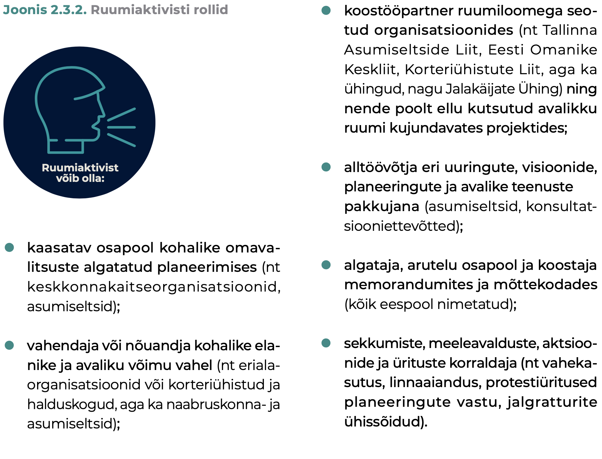

```

```{block, type='imgsource'}
<span class="imgsource-source">Allikas:</span> Autorite joonis.
```

Osapoolte kokkutoomine, sobiliku suhtlusvormi otsimine, ühiste huvide väljaselgitamine ja lahenduste üle arutlemine on osa koosloome reeglite kujunemisest. Seda tegevust mingil viisil sildistades – näiteks kasutades ingliskeelset akronüümi NIMBY (ingl *not in my back yard*, eesti keeles mitte-minu-naabrusse-sündroom) või selle variatsioone NIABY, LULU, NAMBY, BANANA – piirab avalik sektor, kinnisvara arendaja või ka meedia avalikku arutelu.

### Ruumiloomes osalevate liikumiste ja üksikisikute mõju väljendub uutes osaluskultuuri vormides {-.chapter2_section}

Ruumiaktivistide osalemist avaliku ruumi loomes takistavad peamiselt nende ebaselge legitiimsus, ühenduste ja avaliku võimu sisulise koostöövõime ebakindlus ning koosloome aja- ja ressursikulukus. Liikumiste osalemist otsustusprotsessis pärsivad nii avaliku kui ka erasektori seatud küsimused: keda ühendus esindab ja kuidas kujuneb nende legitiimsus? On selge, et liikumised ei esinda põhimõtteliselt kõiki kohalikke elanikke ega anna seetõttu selle eestvedajatele õigust kõigi elanike huvisid esindada. Siiski ei ole saavutatav ka olukord, kus asumi elanikud moodustaksid tervikliku ning ühtse kogukonna või kus naabruskonna ruumilise (ümber)kujundamisega oleks võimalik luua terviklik ning ühtne kogukond ([Holvandus ja Leetmaa 2016](#Holvandus2016); [Lippus ja Vihma 2014](#Lippus2014)).

```{block, type='blockquote-right'}
Osapoolte kokkutoomine, sobiliku suhtlusvormi otsimine, ühiste huvide väljaselgitamine ja lahenduste üle arutlemine on osa koosloome reeglite kujunemisest.
```
Ruumiaktivismi legitiimsuse kujunemine algab aktivistide sekkumisega avalikku ruumi. Juhul kui sekkumised tegelikkuses midagi muudavad, võib see viia tegevuste tunnustamiseni ja legitiimsuse suurenemiseni. Üks näiteid on Tallinna kogukondlik linnaaiandus, mida 2000. aastate alguses määratleti pigem ajutise, kasutusloata kogukondliku liikumisena (nt Polymeri kultuuritehase katuseaed). Nüüd on kogukonnaaianduse edendamise tarbeks loodud linnavalitsuses eraldi töökoht. Samal ajal ootavad omavalitsused, et kodanikud tõendaksid oma legitiimsust allkirjade kogumise (nt 1000 allkirja) või kohaliku huvi organiseeritud vahendamisega ([Pastak 2014](#Pastak2014)). Ühenduste legitiimsus ja jätkusuutlikkus sõltub inimressursist ja teadmistepagasist, laiemast kontekstist ja jagatud väärtustest – teisisõnu, ühenduse legitiimsus suureneb ajas.

Ruumiloomes osalevate ühenduste ja üksikisikute laiemat mõju kaasamispraktika arengule saab hinnata osaluskultuuri uute vormide tekkimise kaudu. Senisest planeerimispraktikast sündinud meetodid, mille abil osalust soodustatakse, esindavad tavaliselt näilist kaasamist. Näiteks on olukordi, kus arvutis kujundatud ilupiltidega tullakse justkui vastu kodaniku ebapiisavale visuaalsele lugemisoskusele, mis ei võimalda tal aru saada keerulistest planeerimisjoonistest. Seegi toimub pahatihti viimastes etappides, kui sisulised ruumi muutvad otsused on juba langetatud. Teine lõks peitub optimistlikus usus parema kaasatuse ja kogukonnaarengu egiidi all arendavatesse uutesse tehnoloogiatesse, mida kasutades jääb ebaselgeks, kuidas kogutud arvamuste ja andmetega edasi tegutsetakse ja millist süsteemset muutust need digitaalsed kaasarääkimise platvormid loovad.

```{block, type='blockquote-left'}
Ruumiloomes osalevate ühenduste ja üksikisikute laiemat mõju kaasamispraktika arengule saab hinnata osaluskultuuri uute vormide tekkimise kaudu.
```
Eesti planeerimistavades võib kohata nii kohaliku omavalitsuse esindajate kui ka konsultatsiooniettevõtete arvamust, et kaasamine on kulukas ja aeganõudev. Juhindudes vähempakkumise loogikast hangete teostaja valimisel ning avaliku sektori kokkuhoiupõhimõtetest, on tihti juba eelarvesse sisse kirjutatud võimalikult vähene kaasamine. See teeb peaaegu võimatuks veelgi aja- ja ressursikulukama koosloome rakendamise. Nii ollakse olukorras, kus avalik sektor kaasamise asemel pigem teavitab, aga ruumiaktivist ootab võimalust koostööks.

### Aktivismi väljakutsed ruumiloomes {-.chapter2_section}

```{block, type='blockquote-right'}
Üha olulisemaks kujuneb küsimus, kes on pädev kaasamist juhtima (omavalitsus, ruumiloome ekspertrühm, konsultatsiooniettevõte jne) ja kuidas jaotuvad osapoolte õigused ja ülesanded.
```
Ruumiaktivismi üks suurimaid väljakutseid on selle vastuoluline olemus – ühtaegu alternatiivseid seisukohti esitades ja muutusi esile kutsudes võib see takistada koosloome rakendamist planeerimisprotsessis. Vähemalt seni, kuni Eesti planeerimistava käsitleb ruumiaktiviste kui oponente, on koosloome ebatõenäoline. Lisaks on muret tekitav ühiskondliku arutelu liikumine reguleeritud juriidilisse sfääri, kus koosloomel mingit rolli ei ole. Näiteks on avaliku ruumi ligipääsetavus keskne küsimus mitme taristuobjekti (teede, tänavate) projekteerimise puhul, aktivistide legaalsel ähvardamisel, et takistada avalikkuse kaasamist (lühendina LÄTAK), ning suurte keskkonnamõjude kaalumisele keskenduvates keerulistes kohtuvaidlustes. Sellistel juhtudel taanduvad katsed koosloomet saavutada endiselt vaid miinimumnõuet täites planeerimisseaduses sätestatule. Ühtlasi on kohtumenetluste kaudu lahendatavad konfliktid aktiivsust üles näidanud kodanikule väsitavad ja kulukad.

```{block, type='blockquote-left'}
LÄTAK – legaalne ähvardamine, et takistada avalikkuse kaasamist.
```
Väljakutseid ruumiaktivismile on lisaks eelpool kirjeldatuile teisigi. Näiteks üha olulisemaks kujuneb küsimus, kes on pädev kaasamist juhtima (omavalitsus, ruumiloome ekspertrühm, konsultatsiooniettevõte jne) ja kuidas jaotuvad osapoolte õigused ja ülesanded. Lisaküsimusi tekitab n-ö mitmel toolil istumine – üks ja sama isik võib olla kord aktivist, siis ametnik, siis nõunik – ning sellega kaasnev teadmiste monopoli, mõjuvõimu ja ebavõrdsuse probleem ruumiloomes. Võib küsida, et kui ametnikul on paremad teadmised ja parem ligipääs informatsioonile, kas see suurendab omakorda tema mõjuvõimu ruumiotsuste tegemises. Samavõrd oluline on küsimus, kuidas muuta ruumiloome kõigile avatud ja mitmekesiseks protsessiks. Kaasamine eeldab planeerimisprotsessis n-ö laua taha jõudmiseks sageli ametlikku (juriidilist) kehamit, nagu asumiseltsid, mittetulundusühingud, mõttekojad, korteriühistud ja külaseltsid.

<div class="casebox">
<h3>Reidi tee juhtum</h3>

Reidi tee on viimase viie aasta üks suuremahulisemaid Tallinna avalikku ruumi kujundavaid projekte, mis on mõeldud mitmerealise tänavakoridorina ühendama Tallinna sadamaala Pirita teega. Selle kavandamisel on osalenud erahuve esindav Tallinna Sadam (vahendajana tee projekteerija K-Projekt), linna kasvu huve esindav linnavalitsus (vahendajana Tallinna Linnaplaneerimise Amet), avalikke huve esindavad kodanikuühendused (mitmed erialaliidud ja konkreetselt Reidi tee praeguse projekti vastu võitlevad ühendused, nt Merelinna Kaitseks ja MTÜ Eesti Roheline Liikumine).

Reidi tee on avaliku ruumi kujundamise juhtum, mis juhib tähelepanu avaliku ruumi kavandamise puudujääkidele ja koosloome puudumisele. Konflikti peamised põhjused on avalikkuse, sealhulgas aktivistide ja ruumiekspertide kõrvalejäämine lähteülesannete ja tee projekteerimise eri etappidest ning üldplaneeringu piiratusest tingitud kõiki osapooli mitterahuldav tulevikuvisioon mereääre arenguks. Eri kodanikualgatused ja erialaliidud on tee ehitusprojektile muudatusettepanekute, korraldatud aktsioonide ja meediakajastuste kaudu juhtinud tähelepanu, et Reidi tee esialgse projektilahenduse aluseks oli autoliiklust kvaliteetse mereäärse avaliku ruumi arvelt eelistav transpordikoridor.

Reidi tee juhtumis leidsid kodanikuühendused ühise keele projekti tehtud konkreetsete muudatuste kujul, näiteks piirati sõiduridasid ja tee laiust, sõidukiirust ning lisati linnamööblit (Reidi tee ehitusprojekti parandamise kokkulepe, 2018; [Teppart 2017](#Teppart2017)). Samuti kujunes ka ühine vaade Linnaplaneerimise Ametiga. 2019. aasta kevadel taganes Tallinna Linnavalitsus kokkuleppest. Reidi tee juhtum iseloomustab avaliku ruumi kujundamise arutelu liikumist juriidilisse sfääri, kus osapoolte vaidlust juhivad paragrahvid, ebavõrdne pädevus ja kaasuse lahendamiseks mõjusamad argumendid, mitte sisuline küsimus avalikust huvist ruumiloomes.

<p class="caption" id="figure233"><span class="figure-number">Joonis 2.3.3.</span> Vasakul K-Projekti projekteeritud tänavakoridor, paremal ruumiekspertide ettepanek</p>

```{r, figure233, fig.align='center', out.width='100%', echo=FALSE, message=FALSE, warning=FALSE}

knitr::include_graphics("../figures/2-chapter/fig233.png")

```

</div>
```{block, type='imgsource'}
<span class="imgsource-source">Allikas:</span> Juho Kalberg.
```

### Kokkuvõte {-.chapter2_section}

Koosloomest sündiva avalikku ruumi mõjutavate otsuste kujundamise ja elluviimise suunas liikumiseks vajame kõikide ruumis osalevate osapoolte avatud arutelu. Aktivismil on sellises ruumiloomes oluline roll pakkuda institutsioonidevälist vaadet ja esindada ruumikasutaja huve. Arutelus osalemine eeldab aktivistilt kriitilist mõtlemist ja sageli kiiret reaktsiooni, ühtlasi on oluline säilitada aktivismi sõltumatus. See aga ei välista uute koosloome vormide loomise vajalikkust. Edasiminek saab siiski toimuda vaid olukorras, kus avalike institutsioonide usaldava ja toetava keskkonna oluline osa on valdavalt vabatahtlikkuse alusel tehtava töö hindamine. Üksikisikute ja mitteformaalsete huvigruppide (ilma n-ö juriidilise kehata osalejate) ulatuslikum kaasamine ning küsimused, kuidas võimestada eri huvigruppe ruumiloomes osalema, on jätkuvalt mõttekoht avalikule sektorile. Aktivismi roll, käekäik ja tegevused võivad olla avaliku ruumi eri juhtumite puhul kordumatud ning üks kaasamismudel ei pruugi toimida kõikide ruumiotsuse puhul. Uued tehnoloogiad, näiteks veebipõhised rakendused, avaandmete platvormid, planeeringute veebiväravad on vahendid, mille abil kogutud vastused ei võrdu automaatselt hea avaliku ruumi loomega. Samal ajal ei tohiks avaliku ruumi vormilist ja kunstilist tulemust juhtida ka ainult huvikogukondade lobi ja kasutajagruppide eelistus. Osapoolte ja eri mudelite tasakaalustajaks saab olla omavalitsus, kes on kokku leppinud avaliku ruumi pikaaegsetes arengusuundades ja kus on tööl ruumiküsimustes pädevad spetsialistid. Kokkuvõttes on aktivism vaid üks eeldus paremate ruumiotsuste tegemiseks.

### Viidatud allikad {-.subreferences}

<p id="Burby2003">Burby, R. J. 2003. Making plans that matter: citizen involvement and government action. − Journal of the American Planning Association, 69 (1), 33–49.</p>
<p id="Holvandus2016">Holvandus, J., Leetmaa, K. 2016. The views of neighbourhood associations on collaborative urban governance in Tallinn, Estonia. plaNext – Next Generation Planning, 3, 49−66.</p>
<p id="Kljavin2014">Kljavin, K. 2014. The Uses of Nostalgia. Neighbourhood Associations in Post-Socialist Estonia. MA thesis. Estonian Academy of Arts.</p>
<p id="Kljavin2017">Kljavin, K., Kurik, K.-L. 2017. Balti urbanismi eripärad – ad hoc planeerimisest pehme urbanismini. – Urbanistide väljaanne U, Deep Baltic, 19.</p>
<p id="Leetmaa2019">Leetmaa, K., Hess, D. B. 2019. Incomplete service networks in enduring socialist housing estates: retrospective evidence from local centres in Estonia. – Hess, D. B., Tammaru, T. (eds.). Housing Estates in the Baltic Countries: The Legacy of Central Planning in Estonia, Latvia and Lithuania. Cham: Springer, 273–299.</p>
<p id="Leetmaajt2014">Leetmaa, K., Tammaru, T., Holvandus, J., Pastak, I., Kamenik, K., Kährik, A. 2014. Governance Arrangements and Initiatives in Tallinn, Estonia. – DIVERCITIES – Governing Urban Diversity: Creating Social Cohesion, Social Mobility and Economic Performance in Today’s Hyper-diversified Cities. Report. Tartu: University of Tartu.</p>
<p id="Lippus2014">Lippus, M., Vihma, P. 2014. Eesti kogukondade hetkeseis. Uuringuraport. Tallinn: Linnalabor ja Eesti Külaliikumine Kodukant.https://www.kysk.ee/failid/Upload/files/Uuringud/Kogukonnauuring.pdf.</p>
<p id="Pastak2014">Pastak, I. 2014. Tööstusalade ümberkujundamine ja selle roll linnaosa arengus Põhja-Tallinna näitel. Magistritöö. Tartu Ülikool.</p>
<p id="Teppart2017">Teppart, J. 2017. The conflict surrounding Reidi Road Project and its significance to the urban planning of Tallinn. MA thesis. Estonian Academy of Arts.</p>
<p id="Tuvikene2011">Tuvikene, T., Pehk, T. 2011. Kodanikualgatuse peadtõstev roll Tallinna ruumilises planeerimises. – Uustal, M. (toim.). Inimmõju Tallinna keskkonnale VI. Konverentsi artiklid. Tallinn: SA Säästva Eesti Instituut, Tallinna Botaanikaaed, 8–12.</p>

<!--chapter:end:02.3-chapter.Rmd-->

## Andmepõhine ruumiloome {.chapter_section .chapter2_section}

```{block, type='authors'}
<div class="author-links">**[Renee Puusepp](#renee-puusepp) ja [Raul Kalvo](#raul-kalvo)**</div>
<div><a class="print-btn" href="../print/EIA-2019-2.4.pdf"><i class="fa fa-file" aria-hidden="true"></i>Trükiversioon</a></div>
```

```{block, type='points'}
* Häid ruumiloomeotsuseid on võimalik teha paikapidavate ja ajakohaste ruumiandmete alusel.
```

Õigust osaleda avaliku ruumi loomes on peetud üheks väärtuslikumaks inimõiguseks, mis aga on liiga sageli hooletusse jäetud ([Harvey 2008](#Harvey2008)). Igasugune ruumi ja eriti avaliku ruumi kavandamine peaks rajanema demokraatlikel alustel, olles läbinähtav ja kõiki huvigruppe kaasav protsess. Läbinähtavust tagada ja võimalikult laia avalikkust kaasata aitaks see, kui ruumiloomeotsuste tegemisel kasutatud alusandmed on avalikud ning andmete ja otsuste seosed selgelt väljendatud.

Ruumiandmeid käsitleme ruumiandmete seaduse (kehtiv alates 2011) tähenduses andmetena, mis otseselt või kaudselt osutavad konkreetsele asukohale või geograafilisele alale, sealhulgas andmed, mis kirjeldavad ruumiobjektide asukohta, omadusi ja kuju geograafilises ruumis. Andmepõhine ruumiloome annab võimaluse muuta avaliku ruumi organiseerimist puudutavate otsuste tegemise põhjendatumaks ning suurendada selle läbipaistvust. Alternatiivsete ruumi kujundamise stsenaariumide võrdlemine, andmete järjepidev kogumine, seire ja muud andmepõhised ruumiloomemeetodid on avatud ja kaasava ruumi planeerimise loomulikud osad.

```{block, type='blockquote-right'}
Andmepõhine ruumiloome annab võimaluse muuta avaliku ruumi organiseerimist puudutavate otsuste tegemise põhjendatumaks ning suurendada selle läbipaistvust.
```
Käesoleva artikli eesmärk on osutada andmepõhise ruumiloome võimalustele ja tähtsusele Eesti tiheasumite hoonestuse ja avaliku linnaruumi kujundamisel. Järgnevaga anname lühiülevaate andmepõhise planeerimise hetkeseisust ja osutame peamistele puudujääkidele Eesti planeerimissüsteemis. Lisaks pakume välja, kuidas täiendada ruumiloomeprotsesse andmepõhiste meetoditega. Artikkel käsitleb teemat nii linnaruumi ja hoonestuse planeerimise aspektist kui ka valdade ja linnade üldplaneeringute ja madalama astme planeeringute tasemel.

### Avalikest ruumiandmetest on ühiskonnal ainult võita {-.chapter2_section}

Igaühel on õigus osaleda avaliku ruumi loomisel ja avalikul sektoril on selle õiguse teostamiseks kohustus tagada juurdepääs kõigile ruumiandmetele. Sarnaselt muude avaandmetega täidavad avatud ruumiandmed kolme põhieesmärki: parem ruumiloome otsuste mõistmine, rahva kaasatus otsustusprotsessi ning laiema kandepinna saavutamine ja uute teadmise loomine avaliku dialoogi kaudu ([Hansson ja Ekenberg 2015](#Hansson2015)). Avaandmed (sh ruumiandmed) peaksid olema avatud nii tehniliselt kui ka juriidiliselt – st vabalt allalaetavad, avatud igasuguseks kasutuseks ning varustatud kasutusloaga ([Kučera 2017](#Kučera2017)).

Eestis annavad aluse andmepõhiseks ruumiloomeks mitmed avaliku sektori tellimusel koostatud dokumendid. Rahandusministeeriumi „Nõuanded üldplaneeringute koostamiseks“ (<a href="https://planeerimine.ee/static/sites/2/uldplaneeringu_juhis_final.pdf">2018</a>) rõhutavad, et elukeskkonda saab paremaks muuta, kui kaasata planeerimisprotsessi ruumi kasutajad – elanikud-omanikud, ettevõtjad-arendajad ja puhkajad-külastajad. Riigikantselei juures tegutsenud ruumiloome ekspertrühma lõpparuanne tõdeb, et elukeskkonna parandamine peaks olema teadvustatud ja teadmistest juhitud tegevus. Selleks vajalike teadmiste tekkimine ja teadvustatud tegevus ruumis saab rajaneda ainult paikapidavatel ja ajakohastel andmetel. Neid kahte elukeskkonna parendamist käsitlevat dokumenti täiendab „Avaliku teabe masinloetava avalikustamise roheline raamat“ (2014), mis sätestab, et avaandmed peavad olema piiranguteta ja masinloetavas formaadis kättesaadavad kõigile soovijatele. Ruumiandmed peavad olema avaandmed, kui need ei lähe otseselt vastuollu eraelu puutumatuse ja julgeolekuga.

Peale riiklike andmekogude, nagu näiteks ehitisregister (EHR) ja maakataster, kus hoitakse ametlikke andmeid, luuakse ruumiandmed pidevalt juurde. Neid toodavad inimesed oma igapäevaste toimingute käigus, kasutades kohapõhiseid nutirakendusi, makstes poes pangakaardiga, viibutades Tallinna ühistranspordis „rohelist kaarti“, sõlmides kinnisvaratehinguid, taotledes ehitus- ja raieluba või lihtsalt kaubanduskeskuse ukseloenduri vaatevälja jalutades. Nende andmete süvaanalüüsi abil on võimalik ruumiprotsessidest paremini aru saada ja neile reagreerida. Protsesside mõistmine on omakorda alus läbikaalutletud ruumiloomele. Näiteks saab Tallinna ühistranspordi sõidukaardi ehk ühiskaardi andmete alusel tuvastada ühistranspordi võrgustiku kasutust ning vajadust uusi liine planeerida ja peatusi rajada.

World Economic Forumi 2017. aasta raporti kohaselt jagatakse ruumiandmed kogumise eesmärkide ja viisi poolest järgnevalt:

1) otsese eesmärgita või mõnel teisel eesmärgil kogutud andmed (nt mobiilioperaatorite kogutud kasutajate kõnetoimingute asukohad, mida agregeeritud kujul on võimalik kasutada elanikkonna liikuvuse analüüsiks);
2) eesmärgipäraselt kogutud andmed (nt liiklusloendused, mille käigus kogutud andmeid kasutatakse uute teede ruumilisel kavandamisel);
3) kasutaja genereeritud andmed (nt asukohapõhised postitused sotsiaalmeedias).

Kuigi andmete kogumisel on suundumus minna kergema vastupanu teed ja koguda neid otsese eesmärgita, peaks seda tegema siiski eesmärgipäraselt. Eriti teravalt tõuseb see vajadus esile suurte andmehulkade puhul, sest mittetarvilike andmete töötlemine, hoidmine ja haldamine võib osutuda kulukaks. Tehnoloogia eksponentsiaalse arengu üks kaasnähtudest on suurandmete tekkimine. Paljud nendest andmetest on otseselt või kaudselt seotud ruumiga. Sellised ruumiandmed on varieeruva mahu, kvaliteedi, kättesaadavuse ja ajalise piiratusega. Suurandmete ühine tunnusjoon on nende ajutisus ([Batty 2016](#Batty2016)). See tähendab, et suurandmestikku ei ole võimalik täies ulatuses talletada ning andmete kasutamine on seetõttu keerulisem kui eesmärgipäraselt kogutud tavaandmete kasutamine. Piltlikult öeldes ei mahu suurandmed Exceli tabelisse ning neid ei ole seega otstarbekas eesmärgipäratult koguda.

```{block, type='blockquote-right'}
Suurandmestikku ei ole võimalik täies ulatuses talletada ning andmete kasutamine on seetõttu keerulisem kui eesmärgipäraselt kogutud tavaandmete kasutamine.
```
Ruumilisi suurandmeid on võimalik kasutada näiteks ühistranspordi ja liikluse organiseerimiseks ja seireks, tulekahjude ja epideemiate ohjamiseks, prügimajanduse, lumekoristuse, teeparanduse ja muu sarnase korraldamiseks. Sedasorti andmepõhise ruumiplaneerimise seos füüsilise ruumi loomega on kaudne. Hoonestuse kavandamisel on suurandmete kasutamine oluliselt keerulisem, sest neid on tarvis ruumiloomeliste otsuste tegemisel töödelda. Suurandmeid saab aga kasutada ruumiliste lahenduste toimimise hindamiseks, et tuvastada, kas peale ruumiliste otsuste elluviimist on muutused tuvastatavad ka andmestikus.

```{block, type='blockquote-left'}
Ruumiandmed peavad olema avaandmed, kui need ei lähe otseselt vastuollu eraelu puutumatuse ja julgeolekuga.
```
Maailmapraktikas on tänapäeval kasutuses nii reaalajas linnade juhtimise rakendusi kui ka andmete kasutamist linnade juhtimiseks ja ruumiloomeotsuste toetamiseks. Näiteks on Melbourne Austraalias teinud maakasutuse ja jalakäijate liikumise ruumiandmed avalikult kättesaadavaks nii linnakodanikele kui ka ettevõtjatele ([World Economic Forum 2017](#World2017)). Sarnane planeeringuliste andmete avalikustamine Ameerika Ühendriikides on viinud Zonari-nimelise rakenduse loomiseni, mis koondab infot kehtivate planeeringute kohta, GIS-andmeid ja kinnisvarainfot ning pakub võimalust nii kohalikele omavalitsustele kui ka kinnisvaraarendajatele nende baasil genereerida ja analüüsida võimalikke hoonemahte. Mitu head näidet on seotud transpordiliikide, liikumise ja ligipääsetavuse parema korraldamisega. Eestile kõige lähem näide on Helsingi Mapple-nimeline interaktiivne veebipõhine rakendus, mis annab kinnisvaraarendajatele, linnaplaneerijatele, linnaosavalitsustele ja linnas paiknevatele ettevõtetele võimaluse teha paremaid otsuseid ligipääsetavuse osas. Kopenhaageni linnavalitsus on aastaid loendanud jalgrattureid ning võtab andmete alusel vastu uute jalgrattateede rajamise otsuseid ([Gehl Institute 2018](#Gehl2018)). Ameerika Ühendriikide linnades on kasutusel StreetLight Data platvorm jalakäijate, ratturite ja mootorsõidukite andmete kogumiseks ja analüüsiks, et lahendada ummikuid ja planeerida transpordivõrgustikke.

Andmepõhiste ruumiloomeotsuste tegemise peamine väljakutse seisneb andmete tõlgendamises – otsuseid ei tohi teha pimesi, vaid tuletada põhjalikust analüüsist. Keerulisemaid ja mitmetahulisi avalikku ruumi ja linnaplaneerimist puudutavaid otsuseid ei ole seega praktiline rajada mitte üksnes andmetele, vaid kombineeritud metoodikale. Ajaloost on näiteks teada juhtum, kus arvutimudeli abil optimeeritud tuletõrjekomandode paiknemine tõi hoopis kaasa tulekahjuohvrite arvu kasvu ([Flood 2010](#Flood2010)).

### Andmepõhine ruumiloome Eestis on lapsekingades {-.chapter2_section}

Euroopa Andmeportaali aruande ([Carrara jt 2017](#Carrara2017)) kohaselt kuulub Eesti avaandmete kogumises ja kasutamises järgijate gruppi – Eesti on 28 Euroopa Liidu riigi võrdluses viimaste hulgas. Üpriski kehva olukorra põhjus on asjaolu, et Eestis pole loodud ühtseid põhimõtteid eri portaalides leiduvate andmete ühildamiseks ja ristkasutamiseks. Siinkohal tuleb mainida, et raport ei arvesta X-tee andmevahetuskihiga, sest tehniliselt pole tegemist avaandmetega ning seetõttu on Eesti koht ehk ka teenimatult madal. Aruande järgi on Eesti peamised probleemid vähene poliitiline tahe, segane juriidiline raamistik, vähene teadlikkus avaandmete kasutusest, andmete vähene kättesaadavus, standardite puudumine ja andmete halb kvaliteet. 2018. aasta Euroopa Andmeportaali aruande ([Cecconi ja Radu 2018](#Cecconi2018)) järgi olid probleemsed veel avaandmete kogumise liiga vähene automatiseeritus, andmete halb masinloetavus ja üldiselt pikemaajalise strateegia puudumine. Muu Euroopaga võrreldes on avaandmete mõju meil väga väike, teisisõnu avaandmete kasutamine protsesse ja otsuseid peaaegu ei mõjuta. Mainitud mõju hinnatakse viies kategoorias:

1) strateegiline teadlikkus, mis peaks tagama jätkuva avaandmete kasutuse kasvu,
2) poliitiline mõju (sh otsustusprotsesside läbipaistvus),
3) sotsiaalne mõju (sh vähemusgruppide kaasamine otsustusprotsessidesse),
4) keskkonnamõju,
5) majanduslik mõju.

```{block, type='blockquote-right'}
Avaandmetel põhinev ruumiloome Eestis on pea olematu.
```
Ruumiandmete kättesaadavus on Eestis ebaühtlane, andmete kvaliteet kõikuv ning registrites järgitakse erinevat loogikat ([joonis 2.4.1](#figure241)). Kuigi üksikud registrid pakuvad masinloetavaid ehk automaatselt masinliidese kaudu tehtavaid päringuid, siis need lahendused on pahatihti aegunud (nt EHR) ning puudub kasutajasõbralik liides. Üks praktiline viis andmete tulemuslikuks töötlemiseks on need alla laadida, see aga teeb andmete töötlemise kohmakaks.

<p class="caption" id="figure241"><span class="figure-number">Joonis 2.4.1.</span> Eesti põhilised ruumiloomega seotud ruumiandmekogud ja nende kirjete seotus</p>

```{r, figure241, out.width='100%', fig.align='center', echo=FALSE, message=FALSE, warning=FALSE}

knitr::include_graphics("../figures/2-chapter/fig241.png")
```
```{block, type='imgsource'}
<span class="imgsource-source">Allikas:</span> Autorite joonis.
```

Registrite ristkasutuseks on välja töötatud Maa-ameti haldusalas olev aadressiandmete süsteem ehk ADS, kuid ka sellel on omad puudujäägid. Kui näiteks püüda äriregistri andmekogust leitud ettevõte paigutada ruumiliselt õigesse asukohta, siis ADSist võib päringule saada kuni 100 vastet. Või teine näide: kui ehitisregistrist (EHR) võtta hoone energiaklass ning viia see kokku Maa-ameti põhikaardi hoonete kihil olevate ehitiste andmetega, tuleb EHRis teha kolm päringut ning kasutada kahte Maa-ameti poolt pakutavat andmestikku. Sealjuures on EHRi hoonete andmestikule lisatud „energia klassi“ andmeväli, mis on praktiliselt täitmata. Selgusetuks jääb, miks neid andmeid üldse väljastatakse. Identifitseerimiskoodid, mis peaksid kajastama hoone unikaalset tunnust, on sama registri eri andmestikes erinevad. Kõik sellised kõrvalekalded vähendavad usaldust registrite vastu. Üks kasutajasõbralikumaid registreid on Maa-ameti andmestikud, kuid paraku ei paku need palju võimalusi masinloetavateks operatsioonideks. Olgugi et paljud ruumiotsused võiksid lähtuda inimestest ja nende elukohtadest, rahvastikuregister ruumiandmeid ei avalda.

Kuna andmestike ristkasutus on problemaatiline, siis näiteks linnade ja valdade üldplaneeringute puhul ei ole pahatihti arvestatud elanikkonna ja töökohtade tegeliku paiknemisega. Juhul kui ettevõtte on registreeritud fiktiivsele aadressile, siis ei saa seda kasutada töökohtade paiknemise analüüsis. Inimeste elukoha registreerimise aadress või rahvaloendus annab parema pildi sellest, kus inimesed paiknevad. Veelgi parema pildi võiks saada mobiilpositsioneerimisest ja seda on ruumiandmete kogumisel, kaardistamisel, analüüsil ja visualiseerimisel Eestis kasutatud juba vähemalt üle 15 aasta ([Ahas jt 2004](#Ahas2004)).

### Koostatud ruumianalüüside ja tehtud otsuste vahelised seosed on harva tuvastatavad {-.chapter2_section}

Eestis on häid näiteid selle kohta, kuidas mitmesuguste ruumiandmete põhjal on tehtud ulatuslikke analüüse. Otseselt ruumilise planeerimisega on seotud analüüs, mille Siseministeerium tellis Statistikaametilt lähteülesandega analüüsida rahvastiku pendelrännet ning määrata selle käigus toimepiirkonnad, mille piires inimesed liiguvad ([Tõnurist jt 2014](#Tõnuristjt2014)). On ka mõned teadlaste koostatud uuringud, nagu Tartu Ülikooli ökoloogia ja maateaduste instituudi uuring eluasemete paiknemise mõjust keskkonnale ([Poom ja Ahas 2016](#Poom2016)) ja Tartu Ülikooli geograafia osakonna uuring asustusmustrite muutumise kohta ([Reimets jt 2013](#Reimets2013)).

```{block, type='blockquote-left'}
Positiivne näide Eesti andmepõhisest otsustamisest on Majandus- ja Kommunikatsiooniministeeriumi ning Statistikaameti koostöölepe andmepõhiste otsustusmehhanismide kasutuselevõtuks avalikus sektoris.
```
Ruumiandmeid on Eestis kasutatud mitmete kavade (nt liikumiskavad, veemajanduskavad, üleujutusriskide maandamiskavad, müra vähendamise kavad) ja juhendite loomisel ning keskkonnamõjude hindamisel. Otseseid seoseid ruumiloomeotsuste ja alusandmete, -uuringute ning ruumiandmete analüüsi vahel artikli autoritel aga tuvastada ei ole õnnestunud. Isegi olulised linnaplaneerimisotsused, mis mõjutavad olulisel määral tekkivat avalikku ruumi, kipuvad toetuma intuitiivsetele kaalutlustele või on seosed andmetega peidetud või väljendamata. Avaliku ruumi kavandamisel ei viidata andmetel põhinevatele ruumilistele otsustele. Näiteks Tallinna Sadama tellitud Tallinna Vanasadama struktuurplaan ([Zaha Hadid Architects 2018](#Zaha2018)) räägib maailmatasemel avalikust ruumist ja pakub välja konkreetse ruumilise visiooni, kuid ei anna peaaegu ühtegi vihjet alusandmetele ega loo seost visioonis seatud ruumiliste eesmärkide ja ruumikasutuse andmete vahel. Selline lähenemine on sümptomaatiline Eesti ruumilise planeerimise kultuurile üldisemalt.

Põhiline probleem on ruumiloomeotsuste läbinähtamatus – otsuste tegijad ei näita otseselt, kuidas loodav ruum aitab saavutada kvantitatiivseid eesmärke, mille abil selgelt väljendada soovitud tulemust ja selle saavutamist hiljem üheselt kontrollida.

### Aeg andmepõhise ruumiloome juurutamiseks on küps {-.chapter2_section}

Järgmiste aastate jooksul ootab Eestit ees olulise tähtsusega muudatus ruumiandmete kogumisel ja kontrollimisel. Siiani on olnud üleriigiline rahvaloendus üks mehhanisme, mis aitab kontrollida registrite õigsust. Aastast 2021 läheb Eesti üle registripõhisele andmekogumisele, mis annab registritele palju suurema kaalu. Sellel muutusel on kaks poolt: esiteks kaob ära kontrollimehhanism ning teiseks kasvab registrite usaldusväärsus, sest registripidaja saab suurema vastutuse.

Positiivne muutus andmepõhiste juhtimisotsuste tegemise suunas on Eestis siiski üldiselt tuntav. Selle üks näiteid on hiljutine Majandus- ja Kommunikatsiooniministeeriumi ning Statistikaameti koostöölepe andmepõhiste otsustusmehhanismide kasutuselevõtuks avalikus sektoris ([MKM 2018](#Majandus2018)). Üsna ambitsioonika eesmärgi kohaselt peaks saama juhtimisotsuseid teha reaalajas. Lisaks on Majandus- ja Kommunikatsiooniministeerium võtnud ametisse andmejuhi (ingl *chief data officer*), kelle ülesanne on ühtse andmestrateegia paikaseadmine. Muutustele vihjab ka Tallinna ideekorje platvormi AvaLinn käivitamine, mis töötati välja Baltic Urban Labi projekti raames. Hea näide on ka Tartu ühistranspordi analüüs ja uue liinivõrgu andmepõhine modelleerimine (vt Tartu linna koduleht 2018). Samuti on Maanteeamet teinud andmepõhiseid otsuseid liiklusohtlike teelõikude ja ristmike muutmiseks liiklusõnnetuste statistika alusel ning planeerinud müratõkkeid arvutusliku mürakaardi andmete alusel.

<p class="caption" id="figure242"><span class="figure-number">Joonis 2.4.2.</span> Tallinna rattateede põhivõrgu potensiaal elukohtadest lähtuvalt.</p>
```{r, figure242, out.width='100%', fig.align='center', echo=FALSE, message=FALSE, warning=FALSE}

knitr::include_graphics("../figures/2-chapter/fig242.png")

```
```{block, type='imgsource'}
<span class="imgsource-source">Allikas:</span> Tallinna rattastrateegia 2018-2027.
```

Tallinna rattastrateegias 2018–2027 võrreldi rattateede võimalikku paiknemist. Üks kasutatud meetodeid oli potentsiaalsete 500 m raadiuses olevate kasutajate arvutuslik võrdlus. Eesmärk oli leida jalgrattateede põhivõrgule asukoht, mis oleks võimalikult lähedal suuremale hulgale elanikele. [Joonis 2.4.2](#figure242) on võrgustiku ühe stsenaariumi andmepõhine visualiseering, kus rattateede värvus näitab potentsiaalsete kasutajate lähedust.

### Sabassörkijast on võimalik tõusta eestvedajaks {-.chapter2_section}

Andmepõhise ruumiloome laiemaks levikuks ja ruumiplaneerimise tavapraktikasse jõudmiseks on vaja teha kõik ruumiloomega seotud andmed (st ruumiandmed) avalikuks ning koondada need andmete kasutaja jaoks ühte kohta. Praegu haldavad ministeeriumid ja muud riigiasutused oma andmekogusid, mida omavahel suuresti ei kooskõlastata. Andmete kogumisel ja haldamisel tuleks püüelda olukorra poole, kus Eestis on üks institutsioon, kes vahendaks kõiki avaandmeid.

Andmete sünkroniseerimine nõuab tehnilisi toiminguid. Näiteks tuleks eri ruumiandmete registrites kriitilise pilguga üle vaadata metaandmed ehk andmed kogutud andmete kohta ning võimaluse korral lisada kvaliteedi või usaldatavuse parameetrid. Lisaks tuleks välja jätta veerud, milles tegelikult andmeid ei ole, ning tagada juurdepääs andmetele masinliidese kaudu.

Eelkõige aga oleks vaja selgust andmete täpsuse kohta. Näiteks kui mõne asutuse kohta ei ole teada, millises hoones see asub, siis on ehk teada asukoht linna täpsusega. EHRi andmestikus on hoonete ehitusaastad kahtlust äratavalt korrapäraste vahemikega. Kui täpne vanus ei ole teada, siis oleks hea juurde lisada täpsusklass. Need oleksid kontrollparameetrid, mis aitaksid suurendada andmestike töökindlust ja usaldusväärsust. Andmete kasutamisel saaks sellega arvestada.

Ruumiandmete abil on võimalik luua arvutuslikke mudeleid, mille abil planeeritud muutusi ruumis hinnata. Erinevaid ruumilisi visioone saab selliste mudelite abil võrrelda – tegemist on võrdleva planeerimisega. Järjepideval ruumikasutuse seirel ning süsteemsel ruumiandmete kogumisel ja analüüsil on võimalik püüelda avalikule ruumile seatud kvantitatiivsete eesmärkide täitmise poole ning neid ka reaalselt saavutada. Näiteks Kopenhaagen on saavutanud avaliku ruumi 20% kasutamise tõusu pideva seire abil ([Gehl Institute 2018](#Gehl2018)) – sellist lähenemist võib pidada seirava planeerimise musternäiteks. Eestiski võiks sarnaselt Kopenhaageniga analüüsida avaliku ruumi kasutust.

Isegi pelk ruumiandmete visualiseerimine aitab volitatud isikutel ja asutustel teha ruumiloomeotsuseid märksa informeeritumalt ja läbipaistvamalt. Käesoleva aruande kirjutamise ajal on Tallinna Linnaplaneerimise Ameti tellimusel valmimas ruumiandmete visualiseerimise projekt, kuid seni ei küüni Eestis kehtivad linnade ja valdade üldplaneeringud kõige lihtsamale andmete visualiseerimise tasemele. Kui andmeid planeeringuotsuste tegemisel isegi kasutatakse, siis esitatakse need üldjuhul vaid üldplaneeringuotsustest eraldatud kaardimaterjali või lisadena. Planeeringuotsuste ja alusandmete omavahelised seosed jäävad läbipaistmatuks. Praegu ei saa rääkida planeeringuversioonide omavahelisest võrdlemisest ega ka pikaajalisest strateegilisest ruumikasutuse seirest.

```{block, type='blockquote-right'}
Jõulisem edasiminek avaandmete laiema kasutuse, läbipaistva ruumiloome ja demokraatliku planeerimise suunas eeldab ühtlustatud ruumiandmete jagamise strateegiat.
```
Riigi ja kohalike omavalitsuste ülesanne peaks olema võimaluste ja raamistiku loomine avaandmete kasutamiseks, mitte uue vahekihi loomine, mis takistab andmete vaba kasutust. Ise arendades ja rakendusi luues võtavad riigiasutused endale ülesande, mida saavad edukalt täita eraettevõtted, kodanikuaktivistid ning teadus- ja arendusasutused. Kui võimalikult palju ruumiandmeid oleks avalikult kättesaadavad, ajakohased ja täpsed, võiks suureneda ka valitsemise ja otsustusprotsesside üldine efektiivsus.

Jõulisem edasiminek avaandmete laiema kasutuse, läbipaistva ruumiloome ja demokraatliku planeerimise suunas eeldab ühtlustatud ruumiandmete jagamise strateegiat. Praegu on puudu juhised, kuidas andmeid koguda, säilitada ja taasesitada, asutused jagavad oma andmeid eri viisil ning andmete kokkuviimine on keeruline.

<div class="casebox">

### Jalgsikäijavoogude arvutamine

Jalakäijate liikumisuuring ([Puusepp jt 2017](#Puusepp2017)) Tallinna kesklinnas on näide andmepõhisest planeerimisest. Uuringu käigus vaadeldi avaliku ruumi kvaliteedi mõju jalgsikäijavoogudele Tallinna peatänava planeeringu kontekstis. Võrdluses vasakpoolse pildiga illustreerib parempoolne pilt olukorda, kus välisruumi on muudetud jalgsi liikujatele atraktiivsemaks. Võrdluseks kasutati arvutisimulatsiooni, mis rajanes andmepõhisele jalakäijate liikumisuuringule antud piirkonnas.

<p class="caption" id="figure243"><span class="figure-number">Joonis 2.4.3.</span> Arvutuslikud jalakäijate liikumisrajad Tallinna kesklinnas.</p>
```{r, figure243, out.width='100%', fig.align='center', echo=FALSE, message=FALSE, warning=FALSE}
knitr::include_graphics("../figures/2-chapter/fig243.png")
```
</div>
```{block, type='imgsource'}
<span class="imgsource-source">Allikas:</span> Tallinna rattastrateegia 2018-2027.
```

### Kokkuvõte  {-.chapter2_section}

Õigus osaleda avalikus ruumiloomes on iga kodaniku ja ruumikasutaja põhiõigus. Nii nagu me saame otsustada oma kodu kujundamise üle, peame saama kaasa rääkida ka avaliku ruumi organiseerimise otsustes. Kaasamise võimendamiseks, ruumiloomeliste lahenduste kaalumiseks ning otsuste põhjendamiseks peavad lähteandmed olema kõigile lihtsasti kättesaadavad. Ruumiandmed, mis ei ole otseselt seotud privaatsete isikuandmete ja riikliku julgeolekuga, oleksid soovitatavalt avaandmed – vaba juurdepääsuga ning masinloetavad. Näiteks võiks Statistikaameti haldusalasse tekkida keskne registrite avaandmete keskkond, mis vahendaks eri institutsioonide registreid avalikkusele.

Kuna avalik ruum puudutab paljusid huvitatud osapooli, siis oleks otstarbekas kokku leppida riiklikud või piirkondlikud üldpõhimõtted ning sätestada väärtused ja eesmärgid, mida ruumiloome abil saavutada. Need eesmärgid võiksid olla vähemalt osaliselt kvantitatiivselt määratletud, et saaks objektiivselt hinnata loodud lahenduste mõju. Ruumiliste lahenduste mõju hindamine võib olla ennustav või seirav. Ennustava hindamise puhul saab kasutada arvutuslikke mudeleid, mis võimaldavad hinnata mitut võimalikku ruumilist lahendust korraga ning valida neist sobilik. Avatud peaksid olema ka arvutuslikud mudelid, et tagada ülekantavus ja korratavus ning seeläbi ka läbipaistvus ja objektiivsus. Seirav hindamine on strateegilise tähtsusega ning nõuab järjekindlat tegutsemist andmete kogumisel ja salvestamisel. Selliseid andmeid ei tohiks koguda oportunistlikult. Strateegiline ruumikasutuse seire peaks olema seotud konkreetsete avaliku ruumi kasutamise eesmärkidega.

```{block, type='blockquote-right'}
Avaliku sektori peamine ülesanne avalike ruumiandmete kasutamisel on nende kogumine ja korrastamine ja terviklikkuse tagamine. Oluline on võimaldada eri andmekogude ristkasutust.
```


Avaliku sektori peamine ülesanne avalike ruumiandmete kasutamisel on kogumine ja korrastamine ja terviklikkuse tagamine. Oluline on võimaldada eri andmekogude ristkasutust. Era- ja kolmas sektor loob piisava vajaduse korral ise rakendused, mis neid andmeid kasutavad. Andmed ja tehnoloogia ei loo ega lahenda probleeme, kuid annavad inimestele ja organisatsioonidele võimaluse nendega paremini tegeleda ([Bettencourt 2014](#Bettencourt2014)). Avalikel aruteludel, uuringuaruannete koostamisel ja eelkõige ruumiloomealaste otsuste tegemisel peaksid riik ja omavalitsused alati nõudma viitamist algandmetele. Andmetes ei peitu absoluutset tõde ega ka otseseid lahendusi, aga need on alus demokraatlikule ja läbipaistvale ruumiloomele.

### Viidatud allikad {-.subreferences}
<p id="Ahas2004">Ahas, R., Aunap, R., Aasa, A. 2004. Sotsiaalse positsioneerimise meetod inimeste tegevusruumide uurimisel. – Mander, Ü., Kurs, O. (toim.). Geograafilisi uurimusi aastatuhande vahetusel. Üllitatud Tartu Ülikooli Geograafia Instituudi 85. aastapäevaks. Publicationes Instituti Geographici Universitatis Tartuensis, 89. Tartu: Tartu Ülikooli Kirjastus, 63–73.</p>
<p id="Batty2016">Batty, M. 2016. Big data and the city. – Built Environment, 42 (3), 321–337.</p>
<p id="Bettencourt2014">Bettencourt, L. M. A. 2014. The Uses of Big Data in Cities. – Big Data, 2 (1), 12–22.</p>
<p id="Carrara2017">Carrara, W., Radu, C., Vollers, H. 2017. Open Data Maturity in Europe 2017: Open Data for a European Data economy. European Data Portal. European Commission Directorate General for Communications Networks, Content and Technology.</p>
<p id="Cecconi2018">Cecconi, G., Radu, C. 2018. Open Data Maturity in Europe. Report 2018. European Data Portal. European Commission: Directorate General for Communications Networks, Content and Technology.</p>
<p id="Flood2010">Flood, J. 2010. The Fires: How a Computer Formula, Big Ideas, and the Best of Intentions Burned Down New York City – and Determined the Future of Cities. New York: Riverhead Books.</p>
<p id="Gehl2018">Gehl Institute 2018. Copenhagen Counts Everything. https://gehlinstitute.org/story/copenhagen-counts-everything.</p>
<p id="Hansson2015">Hansson, K., Ekenberg, L. 2015. Open government and democracy: a research review. – Social Science Computer Review, 33 (5), 540–555.</p>
<p id="Harvey2008">Harvey, D. 2008. The Right to the City. – New Left Review, 53, 1–16.</p>
<p id="Jüssi2018">Jüssi, M., Kalvo, R., Rannala, M., Savi, T. 2017. Tallinna Rattastrateegia 2018–2027. Tallinn: Tallinna Kommunaalamet.</p>
<p id="Kučera2017">Kučera, J. 2017. Analysis of barriers to publishing and re-use of open government data. – P. Doucek, G. Chroust, V. Oškrdal (eds.). IDIMT 2017: Digitalization in Management, Society and Economy – 25th Interdisciplinary Information Management Talks, 305–314.</p>
<p id="Majandus2018">MKM – Majandus- ja Kommunikatsiooniministeerium 2018. Tammist: lähme riigis üle andmepõhistele juhtimisotsustele.</p>
<p id="Poom2016">Poom, A., Ahas, R. 2016. How does the environmental load of household consumption depend on residential location? – Sustainability, 8 (9), 799.</p>
<p id="Puusepp2017">Puusepp, R., Lõoke, T., Cerrone, D., Männigo, K. 2017. Simulating pedestrian movement. – De Rycke, K., Gengnagel, C., Baverel, O., Burry, J., Mueller, C., Nguyen, M. M., Rahm, P., Thomsen, M. R. (eds.). Humanizing Digital Reality. Versailles: Springer, 547–557.</p>
<p id="Reimets2013">Reimets, R., Uuemaa, E., Oja, T., Sisas, E., Mander, Ü. 2013. Urbanisation-related landscape change in space and time along spatial gradients near roads: a case study from Estonia. – Landscape Research, 40 (2), 192–2017.</p>
<p id="Zaha2018">Zaha Hadid Architects 2018. Vanasadama arendusplaan 2030.</p>
<p id="Tõnuristjt2014">Tõnurist, A., Servinski, M., Valgma, Ü. 2014. Toimepiirkondade määramine. Tallinn: Statistikaamet/Siseministeerium.</p>
<p id="World2017">World Economic Forum. 2017. Data Driven Cities: 20 Stories of Innovation. Global Agenda. Prepared by the Global Future Council on Cities and Urbanization.</p>

<!--chapter:end:02.4-chapter.Rmd-->

# Looduskeskkond kui avalik hüve {.chapter3 .chapter3_section}
 <script>
  window.location = "sissejuhatus-3.html";
  </script>
## Sissejuhatus {-.chapter_section .chapter3_section .intro_section}
<h1>Looduskeskkond kui avalik hüve</h1>
```{block, type='authors'}
<div class="author-links">**[Asko Lõhmus](#asko-lõhmus)**</div>
<div><a class="print-btn" href="../print/EIA-2019-3.0.pdf"><i class="fa fa-file" aria-hidden="true"></i>Trükiversioon</a></div>
```

### Põhisõnumid {-.chapter3_section}

```{block, type='points'}
* Looduskeskkonna avalik kasutamine edendab demokraatiat keskkonnaõigluse ja jagatud looduskogemuse kaudu.

Seda soodustab Eestis looduses käimise ja looduse tundmise järjepidevust kandev kultuur. Asulates on rohealade planeerimine oluline demokraatiat edendav ja hoidev protsess. Siiski ei ole loodusalade toimimist avaliku ruumina terviklikult planeeritud ega uuritud. Ka keskkonnahüvede ja -riskide õiglase jaotuse põhimõtted vajavad riiklikku arendamist.

* Eesti maakattest moodustavad loodusalad valdava osa ja inimesed saavad tänu igaüheõigusele neid kasutada.

Loodusalade avalikku kasutamist on hakanud kohati pärssima kättesaadavuse ja ligipääsetavuse halvenemine eramaal ning metsamaastike miljööväärtuse vähenemine lageraiete tõttu. 21. sajandi keeruliste keskkonnaprobleemide ees seistes ei tule ühiskonnale kasuks, kui inimeste arusaam loodusest ja oskused seal toime tulla ahenevad loodus- ja matkaradade külastamisel kogetuks.

* On küsitav, kas siinne loodus annab Eestile elu- ja ärikeskkonnana eelise teiste regiooni riikide ees.

Meie ökosüsteemide seisund ei ole kestlik ning loodusest saadavad hüved on vaesumas. Loodusalade planeerimises on vaja pöörata senisest rohkem tähelepanu elukeskkondade tervisemõjudele, inimeste erivajadustele ning looduskeskkonna läbimõeldud kasutamisele õppimise ja sotsiaalsete suhete arendamise eesmärgil.
```

### Looduskeskkonna seisundist keskkonnaõigluse ja keskkonnademokraatiani {-.chapter3_section}

Käesoleva peatüki eri osades uurime, kui vabalt saavad Eesti inimesed looduses käia ja looduse üle otsustada ning milliseid hüvesid ühiskond loodusest saab. Nende küsimuste laiem kontekst on avaliku ruumi ja demokraatlike valitsemisvormide seos looduskeskkonnaga. See kontekst on keeruline, ajaloos muutuv ja üleilmsete megatrendide tugeva surve all, nii et vaevalt saab osutada ühele õigele lahendusele praeguse või tulevase Eesti jaoks. Küll saab praeguste teadmiste valguses välja tuua peamised inimarengu seisukohalt olulised teemad.

Kõigepealt keskkonnaseisund: iga inimese heaolu aluseks on toimivad ökosüsteemid, mille panus avaliku ruumi kvaliteeti oleneb otseselt maakasutuse viisidest ning maa omandi- ja valitsemisvormidest. Siit lähtub ühiskonnakorralduslik ülesanne: mõista, planeerida ja valitseda ökosüsteemidest lähtuvaid hüvede voogusid ning nende jaotust ühiskonnaliikmete vahel. Kui kohaldame selle ülesande füüsilisele ruumile, jõuamegi käesoleva peatüki sotsiaalse põhiküsimuseni: kellel on õigus ja juurdepääs konkreetse ala hüvistele ning võimalus nende kujundamisel kaasa rääkida? Neid õigusi ja juurdepääsu saab käsitleda keskkonnaõigluse (ingl *environmental justice*) vaatevinklist: mida ühtlasem on ala hüvistest osasaajate jaotus, seda väiksemaks kujuneb keskkonnast tulenev ebavõrdsus ühiskonnas. Võimalust keskkonna kujundamisel kaasa rääkida, omades ja jagades ka asjakohast teavet, katab aga keskkonnademokraatia mõiste. Keskkonnademokraatia eesmärk avalikus ruumis on hoida ja parandada sealsete ökosüsteemide seisundit lähtuvalt keskkonnahüvede ja -riskide õiglase jaotuse põhimõttest.

Nende otseselt heaolu puudutavate teemade jätkuna võib näha looduskeskkonna avaliku kasutamise kaudu loodavaid demokraatlikke väärtusi. Näiteks teadvustati juba rohkem kui sajand tagasi avalike parkide rolli linnakodanike ühiste moraalsete ja esteetiliste väärtuste, väärika käitumise ning võrdsel alusel sotsiaalse läbikäimise edendamisel ([Mattson 1998](#Mattson1998)). Tänapäeval võib looduskogemus kujundada ühiskonna sidusust isegi siis, kui loodust kogetakse omapäi ja jagatakse virtuaalses suhtluses. Eestiski organiseeruvad tuhanded inimesed looduspiltnike, loodusandide korjajate ja keskkonnaprobleemide vaagijate ühismeedialehtedel, mille roll demokraatias pole küll ühene, kuid on kahtlemata olemas. Veel vahetumalt kujundab sidusat kultuuriruumi ühistegevus. Viimastel aastakümnetel on meil kiiresti arenenud looduses avalikke hüviseid edendavad talgutööd, mille juured on omakorda külaühiskondade varasemas talgukultuuris. Eestimaa Looduse Fond alustas looduses talgute korraldamist juba 1990. aastate lõpul looduskaitse eesmärgil. Kõige suuremat rahvusvahelist tähelepanu on pälvinud 2008. aastal Eestist alguse saanud prügikoristustalgud, millest on omakorda välja kasvanud maikuu esimesel laupäeval peetav „Teeme ära!“ talgupäev oma elukeskkonna heaks. Näiteks 2018. aastal osales rohkem kui 53 000 inimest ligi 2200 Eesti paigas (<a href="https://www.teemeara.ee/">www.teemeara.ee</a>).

```{block, type='blockquote-right'}
Iga inimese heaolu aluseks on toimivad ökosüsteemid, mille panus avaliku ruumi kvaliteeti oleneb otseselt maakasutuse viisidest ning maa omandi- ja valitsemisvormidest.
```
Riiklik vaade peaks seega sisaldama arusaama, millist uut poliitilist kultuuri aitab looduskeskkonna avalik kasutus luua. Näiteks areneb jõudsalt biotsentristlike argumentide (looduse iseväärtus ja subjektiõigused) arvestamine valitsemisel, eriti kui neid vahendab põlisrahvaste kultuur ([Espinosa 2017](#Espinosa2017)). Kuuluvustundel, bioloogilisel päritolul ja vahetul looduskogemusel põhinevad keskkonnaeetika argumendid on leidnud oma koha Eesti õigus- ja moraalinormide arutelus ([Oja jt 2003](#Oja2003)).

### Looduskeskkonna ühiskondlik roll vajab senisest terviklikumat jälgimist {-.chapter3_section}

Looduskeskkonna peatüki ajendiks oli tõdemus, et Eestis puudub terviklik ajakohane ülevaade looduskeskkonna avaliku kasutamise ja selle üle otsustamise võimalustest seostatuna inimeste heaolu ja ühiskonna demokraatliku arenguga. Kümme aastat tagasi järeldasid Maaris Raudsepp ja teised peamiselt kaudsete andmete põhjal, et Eesti inimesed tajuvad teravalt küll eri tüüpi sotsiaalset ebaõiglust, kuid seejuures keskkonnaõiglust eriti ei teadvusta ([Raudsepp jt 2009](#Raudsepp2009)). Sestsaadik on lisandunud palju uut teavet hüvede kohta, mida inimesed loodusega kokkupuutes saavad või looduse seisundi halvenemisel kaotavad ([ten Brink jt 2016](#ten2016)). Juurdepääs teabele on ka ise üks keskkonnaõiglust ja demokraatiat siduvatest komponentidest, mida Eestil tuleb Aarhusi konventsiooniga liitununa tagada alates 2001. aastast. Sama konventsiooniga on tagatud põhiõigus keskkonnaotsuste tegemisest osa võtta ning juurdepääs keskkonnaalasele õigusemõistmisele. Need õigused on omakorda tuletatud loodusvarade jätkusuutliku kasutamise ja säästva arengu eeldustest. Kokkuvõttes on säästval arengul, keskkonnaõiglusel ja kodanikuühiskonda kaasaval demokraatial Euroopa kultuuriruumis tihe seos ([Barnes ja Hoerber 2013](#Barnes2013)).

Looduskeskkonda tähistav ruumiline põhimõiste on käesolevas aruandes loodusala – loodusliku või poolloodusliku kooslusega maa- või veeala. See järgib looduses viibimise ja looduskülastuste terminoloogiat ([Kajala jt 2008](#Kajala2008)) ning vastab inimarengu aruandes 2014/2015 „looduslike ehk puhveralade“ mõistele, mille all mõeldi „ökosüsteemide osa, milles on valdavad looduslikud protsessid ning domineerivad pärismaised liigid oma loomulikus keskkonnas (looduslikes elupaikades)“ ([Terasmaa ja Pajula 2015, lk 140](#Terasmaa2015)). Enamik maakatteklassifikatsioone eristab selgemini loodusalade vastandid – tehisalad, nagu ehitiste alla jäävad või kaevandusalad, ning agraarökosüsteemidega põllumajandusalad. Viimaste pindala ja paiknemise muutused võimaldavad hinnata ka säilinud looduskeskkonna hulka ning seisundit globaalselt ja piirkonniti.
```{block, type='blockquote-left'}
Loodusala – loodusliku või poolloodusliku kooslusega maa- või veeala.
```
Loodusalade kogum maastikul moodustab rohevõrgustiku (planeerimisseaduse § 6 nimetatud „roheliseks võrgustikuks“, mis koosneb tuumikaladest ja rohekoridoridest). Mõiste „roheala“ on planeerimisseaduses vastuoluliselt laiem, hõlmates mis tahes loodusliku või inimtekkelise päritoluga taimkattega ala. Selguse huvides kitsendatakse käesolevas aruandes rohealade mõistet üksnes asulates paiknevatele loodus- ja looduseilmelistele aladele (pargid, haljasalad, kalmistud jt). Viimaste taimestik on sageli kultiveeritud ja koosneb teadlikult valitud võõrliikidest, mis omakorda peegeldab asulavälise ja -sisese looduse erinevat käsitluskultuuri Eestis ([Magnus ja Remm 2018](#Magnus2018)).

### Eesti looduse seisundi koondnäitajad on halvenenud {-.chapter3_section}

Eesti maakattest moodustavad loodusalad valdava osa, sealhulgas metsamaa 51,4% (riigile kuuluv 26,2%), sood 4,6%, põõsastikud 1,5% ja veekogud 5,7% ([Raudsaar jt 2018](#Raudsaar2018)). See üldjaotus on 21. sajandil vähe muutunud, kuid asulate laienemine (riikliku statistika andmebaasi järgi keskmiselt 1000 hektarit aastas perioodil 2002–2017) on üleeuroopalises võrdluses suhteliselt kiire ega vasta Euroopa Liidu pikaajalisele keskkonnaeesmärgile. Üldisemalt on alarmeeriv tagasiminek riikidevahelises keskkonnaalase tulemuslikkuse indeksis (ingl *Environmental Performance Index, EPI*), mis võeti ökosüsteemide suhtelise seisundi mõõdikuks Eesti inimarengu aruandes 2014/2015 ([Terasmaa ja Pajula 2015](#Terasmaa2015)). Eesti on langenud kümne aastaga maailmas 26. kohalt 48. kohale, sealhulgas ökosüsteemide elujõulisuse puhul 7. kohalt 59. kohale. Viimast kajastab kompleksindeks, mis hõlmab ka kliimamõju- ja õhusaastenäitajaid, aga ka looduskeskkonda eraldi vaadates on Eesti positsioon taandunud elurikkuse ja elupaikade seisundi puhul 17. kohalt 24. kohale ja metsade puhul 124. kohalt 129. kohale ([Wendling jt 2018](#Wendling2018)). Globaalses võrdluses on ökosüsteemide elujõulisus suurem kõrgema inimarengu indeksiga riikides, kuid varieeruvus on suur ([joonis 3.0.1](#figure301)).

```{block, type='blockquote-right'}
Eesti tõus inimarengu sotsiaal- setes näitajates on saavutatud ebaproportsionaalselt kõrge ökoloogilise hinnaga.
```

EPI arvutuskäik on keeruline ja võib sisaldada vigu, kuid eeltoodud trendide põhjused, pööratavus ning üldisemalt loodusalade seisund ja kaasnevad hüved vajavad Eestis riiklikku tähelepanu. Riikidevahelises võrdluses on Eesti Põhjamaade ja Balti riikide seas praegu viimane ja teinud 21. sajandil läbi kõige suurema languse ([Wendling jt 2018](#Wendling2018)). Seega pole meil regioonis „puhta loodusega“ riigi konkurentsieelist ning paistab koguni, et hiljutine tõus inimarengu sotsiaalsetes näitajates on saavutatud ebaproportsionaalselt kõrge ökoloogilise hinnaga ([joonis 3.0.1](#figure301)). Viimasega haakub riigi mahajäämus ökoinnovatsioonis, mida näitab Euroopa Komisjoni keskkonna peadirektoraadi koostatav ökoinnovatsiooni indeks. Samal ajal püsib Eestis suur keskkonnaturvalisus – inimestel on ebatõenäoline kaotada juurdepääs puhtale õhule, veele ja energiaallikatele või hukkuda looduskatastroofis ([Moghim ja Garna 2019](#Moghim2019)).

<p class="caption" id="figure301"><span class="figure-number">Joonis 3.0.1.</span> Inimarengu indeksi ja ökosüsteemide elujõulisuse indeksi seos 179 riigi põhjal ning Eesti positsiooni (rohelised punktid, aastad) muutus 2005–2014</p>

<div class="desktop-plot">
```{r, figure301, out.width='100%', fig.align='center', echo=FALSE, message=FALSE, warning=FALSE}

library("tidyverse")

 fig301_data <- read.csv ("../data/30_fig1_data.csv", header=TRUE, fileEncoding="utf-8")

 fig301_data_est <- subset (fig301_data, country_name == "Estonia", select=c(iso3,country_name,hdi_2014, hdi_2017, country,epi_current, eco_current))

  fig301_horisontal_line <- data.frame(hdi=c(0.825, 0.864),
                eco=c(65.5, 65.5))

  fig301_plot <- ggplot() +
    geom_point(data = fig301_data, mapping = aes(x=hdi_2014, y=eco_current, group = 1,
            text = paste("HDI: ", hdi_2014,
                         "<br>ECO: ", eco_current,
                         "<br>Riik: ", iso3)), colour="#C8C6BF", size=1.7, show.legend = NA) +

    geom_smooth(data = fig301_data, mapping = aes(x=hdi_2014, y=eco_current),method=lm, se=FALSE, colour="#482683") +

    geom_point(data = fig301_data_est, mapping = aes(x=hdi_2014, y=eco_current, group = 1,
            text = paste("HDI: ", hdi_2014,
                         "<br>ECO: ", eco_current,
                         "<br>Riik: ", iso3)), colour="#79AC2C",size=2, show.legend = NA) +
    geom_text(data = fig301_data_est, mapping = aes(x=hdi_2014, y=55, label="2014"),hjust=1, vjust=1, colour="#79AC2C")+

    geom_point(data = fig301_data_est, mapping = aes(x=0.825, y=72.22, group = 1,
            text = paste("HDI: ", hdi_2014,
                         "<br>ECO: ", eco_current,
                         "<br>Riik: ", iso3)), colour="#79AC2C",size=2, show.legend = NA) +
    geom_text(data = fig301_data_est, mapping = aes(x=0.8, y=75, label="2005"), colour="#79AC2C") +

    geom_line(fig301_horisontal_line, mapping = aes(x=hdi, y=eco), colour="#79AC2C",size=1, show.legend = NA) +

    scale_x_continuous(breaks=c(0.2,0.3,0.4, 0.5, 0.6,0.7,0.8,0.9,1)) +
    labs(y="Ökosüsteemide elujõulisus (ECO)", x="Inimarengu indeks (HDI)")

    fig301_theme <- theme(
                    text=element_text(family="Montserrat")
                 )
  
    ggplotly((fig301_plot + fig_theme_general + fig301_theme), tooltip="text") %>%
    config(displayModeBar = F)   %>% 
    layout(legend = list(orientation = "h",y = 1.15)) %>% 
    layout(xaxis = list(fixedrange = TRUE)) %>%
    layout(yaxis = list(fixedrange = TRUE))

  #ggsave(path="exported_figures/PDF/chapter3",filename="fig301.pdf", height=140, width=200, units="mm")

```
</div>
<div class="mobile-plot">
```{r, out.width='100%', fig.align='center', echo=FALSE, message=FALSE, warning=FALSE}
    print(fig301_plot + fig_theme_general + fig301_theme)
```
</div>
``` {block, type='figure-comment'}
<span class="figure-comment-start">Märkus:</span> Seos põhineb inimarengu indeksi (HDI) puhul ÜRO arenguprogrammi (http://hdr.undp.org/en/data) ja ECO puhul Wendling jt (2018) andmetel. ECO puhul on kompleksindeksi osakaaludest arvutatud keskmine lähteaasta (2005; algandmed 2001–2007) ja lõpuaasta (2014; algandmed 2010–2017), viimasega ongi seostatud HDI (2014). Rõhtjoon tähistab ECO taset Eesti 2014. aasta inimarengu aruandes ([Terasmaa ja Pajula 2015](#Terasmaa2015)), mida ei ole tagasiulatuvalt korrigeeritud ja mille seisundiaasta oli täpsustamata.
```

``` {block, type='imgsource'}
<div><span class="imgsource-source">Allikas:</span> Autori joonis.</div>
<div><a class="data-btn" href="../data/30_fig1_data.csv"><i class="fa fa-download" aria-hidden="true"></i>Laadi andmed</a></div>
```

### Looduses viibimiseks on palju valikuid, kuid need ahenevad {-.chapter3_section}

Loodusalade hulga ja paiknemise kõrval kujundab Eestis loodusalade kasutust kolm peamist ühiskondlikku eripära: vähene rahvastikutihedus, looduses liikumise igaüheõigus ([Sepp ja Lõhmus, käesolev kogumik](#kuidas-inimesed-eesti-looduskeskkonda-kasutavad)) ning lähiajaloo maa-asustusest pärinev vaimne kultuuripärand ka linnaelanikel. Üleilmses võrdluses osutavad need suurele isiklikule vabadusele valida looduses viibimise viisi, kohta ja kestust – näiteks harjuda meelispaigana kasutama võõrast eravaldust. Looduses viibimist soodustavad Eestis veel ka piirkonna ja looduse suhteline turvalisus, riigimetsa suur pindala ja sealne teedevõrk. Neis tingimustes võiks oodata, et looduskeskkonna kasutamist piiravad esmajoones elanike endi ajalised ja liikumisvõimalused, mis üksnes lokaalselt – peamiselt suuremate linnade mõnes osas – avalduvad loodusalade ebapiisavusena (vt ka [Sepp ja Lõhmus, käesolev kogumik](#kuidas-inimesed-eesti-looduskeskkonda-kasutavad)).

```{block, type='blockquote-right'}
Looduses viibimist soodustavad Eestis piirkonna ja looduse suhteline turvalisus, riigimetsa suur pindala ja sealne teedevõrk.
```
 Igaüheõiguse alusel külastatavad asulavälised loodusalad on Eestis suurima pindalaga avalikult kasutatav (jagatud) ruum, kuid nende kasutusvõimalused ahenevad. Põhjuseks on kolme tüüpi maakasutusotsuseid, mida on käsitletud allpool. Nende tervikmõju – arvestades vastukaaluna liikumis- ja navigeerimisvõimaluste paranemist – pole uuritud. Lisaks neile otsustele võib liikumist loodusaladel piirata ka kaitsealade rajamine, kuid avaliku kasutuse konflikte on seejuures põhjustanud peamiselt vaid mootorsõidukite kasutuspiirangud veekogudel (nt Vooremaa järvedel).

**1. Eraomanikud piiravad avalikku kasutust.** Igaüheõigus tasakaalustab põhiseadusliku liikumisvabaduse tingimusega vältida keskkonnahäiringuid ja mitte kahjustada omaniku huve ja omandit. Omanik saab, oma tahet selgelt väljendades, keelata oma maal viibimise või seal loodussaaduste korjamise ([Kask jt 2015](#Kask2015)). Ainus asjakohane mõju-uuring pärineb Eestis 2008. aastast, mil erametsale seatud liikumispiiranguga oli elanikel veel vähe negatiivseid kogemusi, kuid enamik elanikkonnast (58%) arvas, et muudaks oma liikumisteed piirangute tekkimise korral ([Kaldaru 2008](#Kaldaru2008)). Piirangud on sealtpeale nähtavasti laienenud, kuivõrd jätkub 1993. aastal alanud ja pikale veninud maareformi mõju ning metsamaa müük on jätkuvalt aktiivne. Ametkondlikult on käsitletud avalikult kasutatavate teede, täpsemalt veekogude avalikele kallasradadele juurdepääsu sulgemist ([Riigikontrolli 2015. aasta audit](#Riigikontroll2015); [Poom ja Sepp, käesolev kogumik](#loodusalade-kujundamine-avalikuks-kasutuseks)). Juurdepääsu- ja tähistusprobleeme on leitud ka teistes külastusväärsetes kohtades. Ühiskonna tasakaalustatud arengu huvides vajab seega analüüsimist eraomanike, nendel maal käivate inimeste ja avaliku võimu vaheline suhtlus – tõenäoliselt saab sedakaudu mõningaid vastuolusid ja puudusi ennetada ja leevendada.

**2. Riigimetsa miljööväärtus väheneb raiete tõttu.** Lageraiete pindala on kõigis metsades kasvanud, sealhulgas riigimetsas pärast suhteliselt stabiilset perioodi 1995–2008 keskmiselt 50% võrra (alates 2015. aastast >10 000 ha aastas; [Raudsaar jt 2018](#Raudsaar2018)). Raietega kaasnev miljööväärtuse vähenemine järeldub nii inimeste esteetilisest vastumeelsusest raiesmike ja raietööde jälgede suhtes ([Gundersen ja Frivold 2008](#Gundersen2008); [Kõivik 2014](#Kõivik2014)) kui ka praktilistest tagajärgedest, nagu marja- ja seenemetsade kadumine. Neid hinnanguid peegeldab keskkonnateadlikkuse küsitlus, kus liigset metsaraiet peeti 2018. aasta olulisimaks keskkonnaprobleemiks ja Riigimetsa Majandamise Keskuse (RMK) usaldusväärsus oli võrreldes 2016. aastaga tunduvalt vähenenud ([Turu-uuringute AS 2018](#Turu-uuringute2018)). Kohalike sagenenud protestid raiete vastu näitavad tahet kujundada oma elukeskkonda vähemalt riigimaal. Maakondadest eristub metsapuhkuse võimalustelt Saaremaa (ka Läänemaa), kus on kõige vähem riigimetsa ja eraomanike seatud piirangud potentsiaalselt suurima mõjuga ([joonis 3.0.2](#figure302)). Samal ajal on Saare- ja Läänemaal riigimetsa suhteliselt vähe raiutud (metsata metsamaad 2017. aastal u 7% riigimetsa pindalast), eriti võrreldes Kagu-Eesti maakondade ja Ida-Virumaaga (üle 12%).

**3. Külastusvõimalused koonduvad ja üheülbastuvad.** Kuigi investeeringud külastustaristusse hoiavad rahulolu loodus- ja matkaradadega suurena, ei võimalda need kõiki looduskasutuse viise ega sobi kõigile ühiskonnagruppidele ([Sepp ja Lõhmus, käesolev kogumik](#kuidas-inimesed-eesti-looduskeskkonda-kasutavad)). Uuringud maailmas näitavad, et harjumus igal aastal loodusalasid külastada toob inimeste parema tervise ja ärahoitud tervishoiukulude kaudu ühiskonnale suurt kasu – ainuüksi vaimse tervise kaudu hinnanguliselt kümme korda rohkem kui turism ja 100–1000 korda rohkem kui kaitsealade administreerimise kulu ([Buckley jt 2019](#Buckley2019)). Samal ajal võivad inimeste eelistused looduses liikumisel märkimisväärselt lahkneda loodusväärtuste paiknemisest ([Hornigold jt 2016](#Hornigold2016)). Seepärast vajavad Eestis võrdlevat uurimist kaitsealade külastamise ja kodukoha looduses viibimise võimaluste keskkonna- ja tervisemõjud. Kultuuri-, sealhulgas poliitilise kultuuri küsimus on, kas piirdumine loodus- ja matkaradade külastamisega kitsendab inimeste võimet mõista ja rääkida kaasa keskkonda puudutavates otsustes.

<p class="caption" id="figure302"><span class="figure-number">Joonis 3.0.2.</span> Metsamaa, sealhulgas riigimetsa (eristatud puistud ja metsata metsamaa) osakaal maakondade üldpindalast 2017. aastal</p>

```{r, figure302, out.width='80%', fig.align='center', echo=FALSE, message=FALSE}

library("tidyverse")
library("reshape")

fig302_data <- read.csv ("../data/30_fig2_data.csv", header=TRUE, fileEncoding="utf-8")
fig302_data_clean <- subset(fig302_data, select=c(county,country_stands,country_without_forest,other_forest_land.1))

fig302_data_melt <- melt (fig302_data_clean, id=c("county"))
fig302_data_melt$variable <- factor(fig302_data_melt$variable, levels = c("other_forest_land.1","country_without_forest","country_stands"))

fig302_plot <- ggplot() +

    geom_bar(data = fig302_data_melt, mapping = aes(x=county, y=value*100, fill=variable), width=0.6, stat="identity") +
    scale_fill_manual(labels = c("Muu metsamaa", "Riik: metsata", "Riik: puistud"), values=c("#79AC2C","#482683","#5B8121")) +
    labs(y="% pindalast", x="") +
    scale_y_continuous(expand = c(0, 0), limits=c(0,100)) +
    expand_limits (y=0)


fig302_theme <- theme(
                    panel.grid.major.x = element_blank() ,
                    panel.grid.minor.x = element_blank(),
                    axis.line = element_line(size = 0.2, colour = "#cccccc"),
                    axis.text.x = element_text(angle=45, margin = margin(t = 0, r = 0, b = 0, l = 0),
                                               hjust=1.1),
                    text = element_text(size = 12, family="Montserrat"),
                 )

  print(fig302_plot + fig_theme_general + fig302_theme)

  #ggsave(path="exported_figures/PDF/chapter3",filename="fig302.pdf", height=140, width=210, units="mm")

```

``` {block, type='imgsource'}
<div><span class="imgsource-source">Allikas:</span> Raudsaar jt 2018.</div>
<div><a class="data-btn" href="../data/30_fig2_data.csv"><i class="fa fa-download" aria-hidden="true"></i>Laadi andmed</a></div>
```

### Koduümbruse loodus ja asulate rohealad vajavad senisest enam tähelepanu {-.chapter3_section}

Loodusalade avaliku kasutamise seos demokraatiaga on kõige ilmsem inimese kodukohas, kus kogukonnad saavad kohtuda isegi napil töövälisel ajal ning loodusesse pääsevad hõlpsamini liikumisraskuste või muude erivajadustega inimesed. Õigus kodukoha loodusele oma elukeskkonna (sh töökeskkonna) osana on ka põhiõigusele kõige lähemal ning olulised keskkonnaõigluse küsimused on inimeste võrdne kohtlemine asustusruumi planeerimisel ja nende võimalus planeerimises osaleda ([Jennings jt 2012](#Jennings2012)). Koduümbruse looduse küsimused – ligipääs, kvaliteet ja tulevikuperspektiiv – on võimendunud asulates, kus rohealade hüvesid kasutab palju inimesi, kuid tugev on ka alternatiivne maakasutushuvi, mis enamasti kahjustaks roheala pöördumatult või piiraks selle kasutust. Seepärast on linnaelanike ligipääs rohealadele valitud ka üheks Eesti säästva arengu näitajaks, mida tuleks silmas pidada kogu riigi strateegilises planeerimises ([Säästva arengu näitajad 2018](#saastva-arengu-naitajad2018)).

```{block, type='blockquote-right'}
Harjumus igal aastal loodusalasid külastada toob inimeste parema tervise ja ärahoitud tervishoiukulude kaudu ühiskonnale suurt kasu.
```
Eesti rohealadele on seni pööratud tähelepanu peamiselt üldistatult kogu linna või linnaosa tasemel ([Sepp ja Lõhmus;](#kuidas-inimesed-eesti-looduskeskkonda-kasutavad) [Orru jt, käesolev kogumik](#loodusalade-mõju-inimeste-heaolule)). Ilmneb, et näiteks Euroopa Liidu suuremate linnade elanike küsitluses on Tallinn keskkonnanäitajate (õhukvaliteet, müratase, rohealad) osas keskmik, kõrgemalt hindavad elanikud linna heakorda. Samal ajal seostub rohealade üldine kättesaadavus palju väiksemal määral linnaelanike üldise sooviga konkreetses linnas elada kui näiteks turvalisus või elukoht ([Eurobarometer 2016](#Eurobarometer2016)). Seega on elanike eripära ja soovide arvestamine ning keskkonnaseisundi parandamine linna rohealade planeerimisel keeruline protsess kohaliku võimu ja kogukonna koostöös.
Eesti rohealade planeerimisel ei arvestata piisavalt tervise ([Orru jt, käesolev kogumik](#loodusalade-mõju-inimeste-heaolule)) ja erivajadustega ega kodu- ja tööpaiga ühendamisega, samuti on liiga nõrk seos riiklike poliitikadokumentidega. Näiteks puuduvad looduskeskkonna aspektid Eesti vaimse tervise strateegiast (<a href="https://vatek.ee/wp-content/uploads/2016/04/Vaimse_tervise_heaolu_strateegia_2016-2025_30.03.2016.pdf">2016</a>), ehkki on teada, et looduses viibimine maandab tõhusalt psüühika- ja käitumishäirete olulisi riskitegureid, nagu stress ja vaimne kurnatus ([ten Brink jt 2016](#ten2016)). Linnaplaneerimise senine praktika viib pigem ikka rohealade vähendamiseni; rohealade vähesuse puhul on omakorda läbi mõtlemata võimalused, kuidas inimesi sinna suunata. Näiteks koolide ja lasteaedade võimalused tagada õuesõpet on kohapeal mõistetavalt piiratud, kuid rohekoridoride kaudu oleks funktsionaalne ühendamine võimalik.

Eraldi tähelepanu nõuab maastikul liikumise, loodussaaduste leidmise ja kasutamise oskuste  arendamine. Mõni neist pärimusliku taustaga oskustest, näiteks ravimtaimede tundmine, on Eestis hääbumas, teised (nt marjul ja seenel käimine) edenevad tänapäeval uues suunas ([Sepp ja Lõhmus, käesolev kogumik](#kuidas-inimesed-eesti-looduskeskkonda-kasutavad)). Neist oskustest võiksid riiklikku planeerimist vajada näiteks tsiviilkaitseoskused tulla toime katastroofitingimustes, sealhulgas juhendada looduses teisi. Inimesed, kes tunnevad hästi teatud piirkondi ja seal regulaarselt käivad, on ühtlasi võimalikud infoallikad nende alade kohta. Riik saab seda kasutada oma territooriumi keskkonnaseisundi kulutõhusaks jälgimiseks kodanikuteaduse (ingl *citizen science*) vormis, mille korraldus, tehnoloogilised lahendused ja analüüsimeetodid pakuvad suurt huvi kogu maailmas. Paljudel inimestel on säilinud seos maakohtadega, kus elasid nende vanemad või vanavanemad, teised avastavad uute maakodude ümbrust omal käel. Linnainimestel jäävad aga praktilised loodusoskused kergesti unarusse.

### Tulevikuvaade {-.chapter3_section}

Kohandumine Maa keskkonnamahutavusega kujuneb 21. sajandi inimühiskondade eksistentsiaalseks probleemiks. Selle vältimatu osa on ka loodusalade igakülgne lõimimine inimeste elukeskkonna osaks, et otstarbekalt kasutada, säilitada ja kujundada looduse pakutavaid hüvesid. Need tegevused omakorda lähtuvad senistest teadmistest ja tavadest, kusjuures arenguvõimalusi piiravad ja võivad lausa sulgeda sotsiaalsed konfliktid ning senise elu- ja majanduskorralduse liigne jäikus ([Cumming 2018](#Cumming2018)). Eesti jätkusuutlikuks arenguks on strateegiliselt oluline mõista siinsete ökosüsteemide võimalusi ja kohelda neid parimal moel, teadvustades, et looduse seisund on halvenemas.

```{block, type='blockquote-left'}
Eesti jätkusuutlikuks arenguks on strateegiliselt oluline mõista siinsete ökosüsteemide võimalusi ja kohelda neid parimal moel, teadvustades, et praegune trend on negatiivne.
```
Raamistikus „loodus-ühiskond-kultuur“ räägivad järgnevad artiklid lahti Eesti looduskeskkonna avaliku kasutamise põhiteemad: kuidas inimesed looduskeskkonda kasutavad ([Sepp ja Lõhmus](#kuidas-inimesed-eesti-looduskeskkonda-kasutavad)), mis kasu nad sellest saavad ([Orru jt](#loodusalade-mõju-inimeste-heaolule)), kuidas heaolu suurendavat looduskeskkonda planeeritakse ([Poom ja Sepp](#loodusalade-kujundamine-avalikuks-kasutuseks)) ning mil moel saavad elanikud planeerimises osaleda või seda mõjutada ([Vahtrus jt](#kaasarääkimise-võimalused-loodusalade-kasutamisel)). Nende artiklite ühisjoon on arusaam sellest, et loodusalad toimivad avalikus kasutuses omavahel seostatud maastikuna, mille eri osadel on erinevad funktsioonid ning planeerimis- ja valitsemisvõtted. Vastavalt tuleb keskkonna- ja ruumiplaneerimine lõimida kõikidesse valitsusvaldkondadesse. Niisugust läbivat tervikut ja koostoimet paljudes olulistes valdkondades veel ei ole: loodusalade eesmärgid arengudokumentides ja planeeringutes on hägused ning kogukondi ja nende teadmisi jäetakse loodusalade kavandamisest sageli eemale.

Teiseks märgivad kõik peatüki artiklid inimgruppide erinevat osasaamist loodusalade hüvedest või võimalustest, hoolimata paljude ühtlustavate põhimõtete rakendamisest (nt igaüheõigus, Aarhusi konventsiooni sätted, üleriigiline rohevõrgustiku põhimõte ja loodusalade mitmekesine haldusvõttestik eri tasanditel). See viitab vajadusele luua Eestis riiklik keskkonnaõigluse arendusprogramm, mis sisustaks tulevikku vaatavalt elanike ootused ja õigused oma elukeskkonnale, sidudes ja kujundades eri komponente. Olemasolevad programmid keskkonnaõiglust kas ei käsitle üldse või on vananenud, nagu näiteks Eesti säästva arengu riiklik strateegia „Säästev Eesti 21“ aastani 2030 (vastu võetud 2005). Konkreetselt loodusaladesse puutuvalt on põhjust ajakohastada ka Riigimetsa Majandamise Keskuse eesmärke ja valitsemispõhimõtteid, kuivõrd see asutus haldab suuremat osa avaliku juurdepääsuga loodusaladest ja nende taristust. Sellist ootust näitavad nii värskeim elanikkonna keskkonnateadlikkuse küsitlus ([Turu-uuringute AS 2018](#Turu-uuringute2018)) kui ka kogukondade vastasseis riigimetsa haldajaga ([Vihma 2019](#Vihma2019)); probleem on püstitatud ka 2030. aastani ulatuva metsanduse arengukava lähteülesandes.

Lähikümnendite üldpõhimõte Eesti looduse avaliku kasutamise juhtimisel võiks niisiis olla mitmekesiste, kestlike ning inimarengut terviklikult ja õiglaselt toetavate loodusseoste arendamine. See tähendab senisest suuremat tähelepanu looduskeskkonnast saadavatele hüvedele füüsilise ja vaimse tervise, turvalisuse ja sotsiaalsete suhete seisukohalt.

### Viidatud allikad {-.subreferences}

<p id="Barnes2013">Barnes, P. M., Hoerber, T. C. (eds.) 2013. Sustainable Development and Governance in Europe: The evolution of the discourse on sustainability. Routledge Advances in European Politics. London: Routledge.</p>

<p id="Buckley2019">Buckley, R., Brough, P., Hague, L., Chauvenet, A., Fleming, C., Roche, E., Sofija, E., Harris, N. 2019. Economic value of protected areas via visitor mental health. – Nature Communications, 10, 5005.</p>

<p id="Cumming2018">Cumming, G. S. 2018. A review of social dilemmas and social‐ecological traps in conservation and natural resource management. – Conservation Letters, 11 (1), e12376.</p>

<p id="Espinosa2017">Espinosa, C. 2017. Bringing about the global movement for the rights of nature: sites and practices for intelligibility. – Global Networks, 17 (4), 463–482.</p>

<p id="Eurobarometer2016">Eurobarometer 2016. Flash Eurobarometer 419. Quality of Life in European Cities 2015. European Commission Directorate-General for Regional and Urban Policy.</p>

<p id="Gundersen2008">Gundersen, V. S., Frivold, L. H. 2008. Public preferences for forest structures: a review of quantitative surveys from Finland, Norway and Sweden. – Urban Forestry & Urban Greening, 7, 241–258.</p>

<p id="Hornigold2016">Hornigold, K., Lake, I., Dolman, P. 2016. Recreational use of the countryside: no evidence that high nature value enhances a key ecosystem service. – PloS ONE, 11 (11), e0165043.</p>

<p id="Jennings2012">Jennings, V., Johnson Gaither, C., Gragg, R.S. 2012. Promoting environmental justice through urban green space access: a synopsis. – Environmental Justice, 5 (1), 1–7.</p>

<p id="Kajala2008">Kajala, L., Almik, A., Dahl, R., Dikšaitė, L, Erkkonen, J., Fredman, P., Søndergaard Jensen, F., Karoles, K., Sievänen, T., Skov-Petersen, H., Vistad, O. I., Wallsten, P. 2008. Külastajate seire loodusaladel – Põhjamaade ja Balti riikide kogemustel põhinev käsiraamat. TemaNord 2008: 516. Tallinn: Riigimetsa Majandamise Keskus.</p>

<p id="Kaldaru2008">Kaldaru, H. 2008. Metsa mitmekülgne kasutamine. Elanikkonna, erametsaomanike ja väikeettevõtjate küsitlus. Tallinn: Turu-uuringute AS.</p>

<p id="Kask2015">Kask, O., Lopman, E., Relve, K., Kuusk, P., Triipan, M., Vaarmari, K., Vahtrus, S., Veinla, H. 2015. Keskkonnaseadustiku üldosa seaduse kommentaarid. Tartu: Keskkonnaõiguse Keskus.</p>

<p id="Kõivik2014">Kõivik, M. 2014. Erinevate raiete esteetiline väärtus. Magistritöö. Eesti Maaülikool.</p>

<p id="Magnus2018">Magnus, R., Remm, T. 2018. Eesti võõrliikide tähendusväli: kujunemine ja linnaruumi kontekst. – Acta Semiotica Estica, 15, 89−118.</p>

<p id="Mattson1998">Mattson, K. 1998. Creating a Democratic Public: The Struggle for Urban Participatory Democracy during the Progressive Era. University Park: Pennsylvania State University Press.</p>

<p id="Moghim2019">Moghim, S., Garna, R. K. 2019. Countries' classification by environmental resilience. – Journal of Environmental Management, 230, 345–354.</p>

<p id="Oja2003">Oja, A., Keerus, K., Järvik, M., Tamm, G., Joonasson, K., Raudsepp, M., Relve, K., Veski, N., Riiberg, K., Tafel, K., Viia, A. 2003. Keskkonnaeetikast säästva ühiskonna eetikani. Inimese ja looduse vaheline tasakaal kui jätkusuutlikkuse aluspõhimõte. SEI väljaanne nr 5. Tallinn: Säästva Eesti Instituut, SEI-Tallinn ja Keskkonnainvesteeringute Keskus.</p>

<p id="Raudsaar2018">Raudsaar, M., Siimon, K.-L., Valgepea, M. (toim.) 2018. Aastaraamat Mets 2017. Tallinn: Keskkonnaagentuur.</p>

<p id="Raudsepp2009">Raudsepp, M., Heidmets, M., Kruusvall, J. 2009. Environmental Justice and Sustainability in Post-Soviet Estonia. – Agyeman, J., Ogneva-Himmelberger, Y. (eds.). Environmental Justice and Sustainability in the Former Soviet Union. Cambridge (Mass.), London: MIT Press, 215–237.</p>

<p id="Riigikontroll2015">Riigikontroll 2015. Kallasradade kasutamine. Kas omavalitsused ja Keskkonnainspektsioon on teinud kõik endast sõltuva, et inimene pääseks randa ja saaks kallasrajal liikuda? Riigikontrolli aruanne Riigikogule. Tallinn, 8.12.2015.</p>

<p id="saastva-arengu-naitajad2018">Säästva arengu näitajad 2018. Tallinn: Statistikaamet.</p>

<p id="ten2016">ten Brink, P., Mutafoglu, K., Schweitzer, J.-P., Kettunen, M., Twigger-Ross, C., Baker, J., Kuipers, Y., Emonts, M., Tyrväinen, L., Hujala, T., Ojala, A. 2016. The health and social benefits of nature and biodiversity protection. A report for the European Commission (ENV.B.3/ETU/2014/0039). London, Brussels: Institute for European Environmental Policy.</p>

<p id="Terasmaa2015">Terasmaa, J., Pajula, R. 2015. Ökosüsteemiteenused ja tasakaalu hoidmiseks vajalikud looduslikud alad. – Vetik, R. (toim.). Eesti inimarengu aruanne 2014/2015. Lõksudest välja? Tallinn: Eesti Koostöö Kogu,137–146.</p>

<p id="Turu-uuringute2018">Turu-uuringute AS 2018. Eesti elanike keskkonnateadlikkuse uuring.</p>

<p id="Vihma2019">Vihma, P. 2019. Riigimets kui ühisvara ehk kuidas lahendada Ohtu konflikti. – ERR Arvamus, 20.11.2019.</p>

<p id="Wendling2018">Wendling, Z. A., Emerson, J. W., Esty, D. C., Levy, M. A., de Sherbinin, A., et al. 2018. 2018 Environmental Performance Index. Global metrics for the Environment: Ranking country performance on high-priority environmental issues. New Haven: Yale Center for Environmental Law & Policy.</p>

<!--chapter:end:03.0-chapter.Rmd-->

## Kuidas inimesed Eesti looduskeskkonda kasutavad? {.chapter_section .chapter3_section}

```{block, type='authors'}
<div class="author-links">**[Kalev Sepp](#kalev-sepp) ja [Asko Lõhmus](#asko-lõhmus)**</div>
<div><a class="print-btn" href="../print/EIA-2019-3.1.pdf"><i class="fa fa-file" aria-hidden="true"></i>Trükiversioon</a></div>
```

```{block, type='points'}
* Eesti looduses käivad igaüheõiguse alusel aktiivselt ja eri eesmärkidel nii siinsed elanikud kui ka välisturistid, kuid arendada tuleb noorte võimalusi looduses viibida, terviklike turismiklastrite loomist ja turundamist.
```

Enamik inimesi töötab tänapäeval tehiskeskkonnas ning töist viibimist looduses asendab üha rohkem ja mitmekesisemalt sihipärane puhkamine. Looduses viibimise viisid olenevad paljudest asjaoludest, nagu vanus ja tervis, tööst vaba ja lastega veedetav aeg, maastike muutused ja juurdepääs loodusaladele. Neid asjaolusid peab arvestama loodusalade ja asjakohase ettevõtluse planeerimisel.

Juba 1960. aastatel viibis Eesti täiskasvanu keskmiselt kaheksa päeva aastas väljasõitudel loodusesse ([Margus 1974](#Margus1974)). Ligi pool neist tehti loodusandide kogumiseks: enamasti seenel ja marjul käimiseks (30%), harvem kalastamise või jahi eesmärgil (10%). Puhkealadele tehti umbes 45% sõitudest, sealhulgas 25% suplemiseks ja päevitamiseks, 15% väljasõidu ja rahvapidustustest osavõtuna, 10% loodusretkedena. Pool sajandit hiljem, 2008. aastal, pidas 54% Eesti täiskasvanutest end vähemalt hooajati regulaarseks metsas käijaks ja ainult viiendik ei käinud seal üldse, kusjuures populaarseim tegevus oli endiselt korilus või jalutamine, sealhulgas koeraga ([Kaldaru 2008](#2Kaldaru2008)). Ootuspäraselt viibisid metsas sagedamini seda omavad või sellega teenistuslikult seotud inimesed. Aastal 2018 polnud 12 kuu jooksul looduses käinud üksnes 15% (2016. aastal 8%) täiskasvanutest, enamik oli käinud korduvalt ([Turu-uuringute AS 2018](#2Turu-uuringute2018)). Eeltoodud arvud ei ole küsitlusmetoodika erinevuste tõttu otse võrreldavad, kuid on ilmne, et Eestis püsib looduse sagedase külastamise tava ja vajadus. Eripäraks Põhja- ja Lääne-Euroopa riikidega võrreldes ([Bell jt 2007](#Bell2007), [vrd Kaldaru 2008](#2Kaldaru2008)) paistab olevat pingutust nõudvate tegevuste (sportimine, maastikusõit, looduse uurimine) väiksem tähtsus Eesti looduskülastustel.

Artiklis vaatleme, millised on olnud Eesti looduskeskkonna kasutusviisid viimastel aastakümnetel, kuidas tajutakse loodusalade muutusi ning millised on ootused looduskülastustele ja tulevikuperspektiivid.

### Eesti looduskeskkonna avaliku kasutamise alus on igaüheõigus {-.chapter3_section}

Igaüheõigus lubab liikuda loodus- ja kultuurmaastikul olenemata sellest, kellele maa kuulub. Tava pärineb Põhjamaadest ja toetas seal esmalt inimesi, kellel puudus maaomand. Neil võimaldati ühest kohast teise liikuda ja end loodussaadustest elatada, kui see ei häirinud ega kahjustanud kohalikke. Kuigi igaüheõigust on Põhjamaades tunnustatud juba alates keskajast, võeti see mõistena kasutusele 20. sajandil turismi korraldamiseks. Eestis ei ole nii traditsioonilist igaüheõigust ilmselt olnud, sest elanikud olid valdavalt seotud talukohtadega ja paiksed. Siiski leidub igaüheõiguse soovitustes ja normides sarnasusi eestlaste arhailiste eetiliste tõekspidamistega. Igaüheõiguse norme hakati meil kirja panema 1970. aastatel Soome eeskujul ja Keskkonnaministeeriumi töötaja Veljo Ranniku eestvõttel. Aastal 1996 üllitas Keskkonnaministeerium brošüüri „Igaüheõigus“, et ennetada looduses liikujate ja värskete maaomanike vahelisi arusaamatusi. Juhend kirjeldas looduses liikuja õigusi ja kohustusi, rutates ette ja tõlgendades üsna vabalt senist lünklikku õiguslikku korraldust. See avaldati tava loomise lootuses: kui inimesed soovitusi piisavalt kaua teadvustavad, kujuneb neist tavaõigus. Nii on see kaks aastakümmet hiljem ka läinud, kusjuures võõral maal viibimise põhisätted sisalduvad nüüd keskkonnaseadustiku üldosa seaduses.

```{block, type='blockquote-left'}
Eestis püsib looduse sagedase külastamise tava ja vajadus.
```
Seega leiab Eestis üksnes osa avalikust looduskasutusest aset tavatähenduses avalikuks ruumiks peetavatel rohealadel. Ehkki linnainimesele on pargid kõige ligipääsetavamad loodusalad, võivad parkmetsad ja linnalähedased metsad pakkuda hoopis laialdasemaid tegevusvõimalusi. Neid alasid on puhkamiseks mõeldud looduskeskkonnana Eestis ka kõige kauem kujundatud.

Kodukoha looduskasutust täiendab  loodusturism. Selle keskmes on looduselamusi pakkuvad looduskülastused, mis võiksid vastata kohapealsetele ja jätkusuutliku arenguga seotud normidele ([Fredman jt 2012](#Fredman2012)). Looduselamusi võivad pakkuda nii ettevalmistatud alad kui ka avastamine omal käel, aktiivsed tegevused matkamisest kuni looduskaitsetöödeni ning looduses sportimine, osavõtt ühisretkedest ja seikluslaagritest. Loodusturismi teenuseid pakub Eestis ligi 200 ettevõtet ([Consumetric 2008](#Consumetric2008)). Loodusturismile lähedased on ka maa- ja ökoturism.

<div class="casebox">
<h3>Vilsandi – teerajaja loodusturismi sidumisel loodushoiuga</h3>

Aastal 1910 loodi Vilsandi saare majakavahi Artur Toomi eestvedamisel Vaika linnukaitseala, mille külastamine muutus prestiižikaks 1920. aastail. Tegu oli ju noore Eesti Vabariigi kõige läänepoolsema saarega. 1921. aasta juulis otsustasid oma puhkuse Saaremaal veeta riigivanem Konstantin Päts ja poliitik Julius Seljamaa. Artur Toomi enda sõnul: „See riigivanem Pätsi 1921. a külaskäik sai Vilsandi linnukodule õnnistuseks. Sest ajast hakkas kogu asi kiiremalt arenema ja külastajate arv tõusma“ ([Toom 1937, lk 66](#Toom1937)).

Aastal 1927 avati saarel muuseum. Kümme aastat hiljem valmis tuletorni juurde ehitatud 24-kohaline köögi ja muude abiruumidega turistide kodu. Turistide arv nii Eestist kui ka välismaalt jõudis vahetult enne Teist maailmasõda Vilsandil 3000–5000 külastajani aastas.

Loodushoiu ja turismi ühisele arengule aitas kaasa 1938. aastal loodud Loodushoiu- ja Turismi-instituut Sotsiaalministeeriumi haldusalas. Asutusele seati ülesanded korraldada looduskaitset ja järelevalvet avalike parkide üle, valitseda riigiparke, toetada suvituskohtade väljaarendamist, suunata sise- ja välisturismi.

<p class="caption" id="figure311"><span class="figure-number">Joonis 3.1.1.</span> Vilsandi ümbruskonnas on alati käinud palju turiste. Aastal 1939 oli neid vedava paadi roolis kaitseala eestvedaja Artur Toom</p>

```{r, figure311, fig.align='center', out.width='100%', echo=FALSE, message=FALSE, warning=FALSE}

knitr::include_graphics("../figures/3-chapter/fig311.png")

```

</div>
```{block, type='imgsource'}
<span class="imgsource-source">Allikas:</span> Saaremaa muuseum.
```

### Eesti loodus- ja matkarajad pakuvad häid puhkevõimalusi {-.chapter3_section}

Loodus- ja matkaradade eesmärk on võimaldada puhkamist ja loodusega omal käel tutvumist selleks ettevalmistatud kohtades. Osana kaitsealade haldamisest reguleeritakse ühtlasi niimoodi loodusele avalduvat külastuskoormust (häirimist, tallamist, prahistamist). Hästi valitud ja korrapäraselt hooldatavad liikumisteed, ööbimis- ja lõkkekohad ning prügikastid võimaldavad looduspuhkust ka tundlikel aladel, lastele, vanuritele ja erivajadustega inimestele. Esmase taristu rajamine loob majutus-, toitlustus- ja teisi külastusteenuseid pakkuvatele kohalikele kogukondadele tuluvõimalusi, mis mujal maailmas tehtud uuringute kohaselt ületavad investeeringuid pikas perspektiivis vähemalt kümnekordselt.
Looduse õpperadade planeerimise esmaideed ulatuvad Eestis 1930. aastatesse, kuid tegudeni jõuti alles tänu Tartu üliõpilaste looduskaitseringi ja Jaan Eilarti tegevusele. Tartu Ülikooli geograafiadiplomand Kai Kaare kavandas õpperaja Tilleorus (1962) ja Jaan Eilart Neerutis (1964). Esimene rahvusvahelistele nõuetele vastav matkarada avati Keila-Joal 1996. aastal.

Praegu korraldab ja jälgib riigimaal loodus- ja matkaradade kasutamist Riigimetsa Majandamise Keskus (RMK). Aastaks 2017 oli külastustaristuna rajatud 309 kattega lõkkekohta, 223 looduses liikumise rada (kokku 2562 km), 214 matkarada, 59 telkimisala (kokku 425 telkimisvõimalusega objekti), 27 vabalt kasutatavat metsaonni, 20 tasulist ööbimist võimaldavat metsamaja ja kolm maastikusõiduala. Külastuskorraldusega seotud tegevusteks kulutas RMK 2017. aastal kokku 5,3 miljonit eurot (sellest 0,7 miljonit puhkemajandusega teenitud tulust ja Euroopa Liidu sihtfinantseerimisest). RMK veebileht võimaldab külastusvõimalusi eri moel kuvada, sealhulgas näidata eraldi näiteks liikumispuuetega inimestele ligipääsetavaid objekte. Viimaste hulgas on peale lõkke- ja telkimiskohtade üle 20 õppe- ja matkaraja. Siiski on leitud, et loodusturismi piirab Eestis spetsiifilise taristu amortiseerumine (nt 2017. aastal üle poole linnuvaatlustornidest; [Jõks 2017](#Jõks2017)) või turismiklastritega ebapiisavalt seostatud info loodusobjektide kohta.

```{block, type='blockquote-left'}
Eesti keskkonnavaldkondadest oldi 2018. aastal kõige rohkem rahul just loodus- ja matkaradadega.
```
Eesti täiskasvanud elanikkonnast 55% oli 2018. aasta küsitluse kohaselt 12 kuu jooksul külastanud loodus- või matkaradu, sealhulgas 31% vastanutest korduvalt ([Turu-uuringute AS 2018](#2Turu-uuringute2018)). Võrreldes 2014. aastaga oli külastajaid 9% võrra ja korduskülastajaid 8% võrra rohkem. Seejuures oldi keskkonnavaldkondadest kõige rohkem rahul just loodus- ja matkaradadega (86% vastajaist pidas olukorda heaks). Sama küsitluse kohaselt on üldse looduses korduvalt käinute hulk siiski palju suurem (73% vastanuist; üldse looduses käinuid 83%). Järelikult on enamiku Eesti inimeste jaoks ettevalmistatud rajad endiselt ainult üks looduses käimise võimalustest.

### Kaitsealade külastajaskond suureneb ja mitmekesistub {-.chapter3_section}

Kõigil RMK majandatavatel ja külastustaristuga varustatud puhke- ja kaitsealadel ning rahvusparkides jälgitakse külastusmahtu, kasutades kohapeal kalibreeritud loendureid. Lisaks teeb RMK iga viie aasta tagant küsitluspõhiselt külastajaprofiili uuringuid. Loendurid näitavad, et külastuste hulk on kümne jälgimisaasta jooksul suurenenud, ulatudes 2017. aastal 2,4 miljoni külastuseni ([RMK 2018](#RMK2018)). See ületab kehtiva looduskaitse arengukavaga aastaks 2020 planeeritud saavutustaset ning on kõrge ka rahvusvahelises võrdluses ([Bell jt 2007](#Bell2007)). Kõige rohkem käiakse Tallinna ümbruse puhkealal, Nõva puhkealal ja Lahemaa rahvuspargis. Seejuures olid varasematel aastatel külastuste sihiks pigem telkimisalad ja lõkkekohad, kuid viimastel aastatel on märgatavalt suurenenud loodus- ja matkaradade külastatavus. Vastavalt suureneb külastuste arv ka enamikus rahvusparkides ([joonis 3.1.2](#figure312)).

RMK viimased külastajauuringud näitavad, et nii 2010. kui ka 2015. aastal käidi looduses kõige rohkem oma pereliikmete või sõpradega ning levinuim tegevus oli looduse vaatlemine. Mõlema uuringu põhjal tuli enim külastajaid Tallinnast, Tartust ja Pärnust, kuid välismaalaste – kõige sagedamini Saksamaalt, Soomest ja Lätist – osakaal on kahekordistunud (2010. aastal 6%; 2015. aastal 13%). Loodusalade külastajate vanuselises jaotuses valdavad noored ja varases keskeas täiskasvanud, suhteliselt kõige vähem on pensioniealisi. Teismeliste arv on samuti väike ja 2015. aastaks pigem veelgi vähenenud ([joonis 3.1.3](#figure313)). Aastal 2015 küsitletud külastajatest 85% tundsid, et looduses käies suurenes nende sotsiaalne, vaimne ja füüsiline heaolu, kusjuures enim suurenes vaimne heaolu ([RMK 2018](#RMK2018)). Loodusalade külastajasõbralikkuse teadmispõhiseks kujundamiseks on oluline tervise- ja teisi heaolunäitajaid tulevikus veelgi täpsemalt mõõta ([ten Brink jt 2016](#2ten2016)).

### Linnades on palju rohealasid, kuid nende kvaliteet vajab tähelepanu {-.chapter3_section}

2017&#8291;. aasta analüüsi põhjal oli Eestis „väga hea ligipääs“ (kuni 200 m) avalikule rohealale 790 900 inimesel ehk ligikaudu 90%-l tiheasustusaladel elavatest inimestest, mis on võrreldav Rootsi 92%-ga ([Säästva arengu näitajad 2018](#2saastva-arengu-naitajad2018)). Rohealade kvaliteeti käsitles põgusalt 2009. aasta inimarengu aruanne, kus toodi mõõdikuna välja elanike rahulolu ning probleemina rohealade killustumine suuremates linnades ja hävimine valglinnastumise tagajärjel linnade ümber ([Peterson 2010](#Peterson2010)). Tallinnas näitab 2009. aasta andmete võrdlus 2017. aasta linnavalitsuse tellitud rahuloluküsitlusega elanike stabiilset (u 80%) rahulolu parkide ja haljasalade piisavuse ja seisukorraga. Sarnane üldhinnang saadi Tartus, kus sedastati isegi rahulolu kasvu aastatel 2006–2016. Tartu andmete täpsem analüüs tõi aga välja, et oma elukoha ümbruses pidas parkide ja haljasalade piisavust ja seisundit väga suureks probleemiks 7% ja (teatavaks) probleemiks veel 30% linnaelanikest (eeskätt annelinlased; elanikegruppidest sagedamini eestlased ja naised). Selline lokaalse probleemina tajumine ei olnud 10 aastaga vähenenud. Ka Tallinnas on lähikonna rohealadega just piirkondlikku rahulolematust, näiteks kesklinnas, Kristiines ja Lasnamäel ([Tuhkanen jt 2018](#Tuhkanen2018)). Siit nähtub, et rahulolu kogu linna tasemel ei ole Eestis rohealade hindamiseks piisav mõõdik.

<p class="caption" id="figure312"><span class="figure-number">Joonis 3.1.2.</span> Riigimetsa Majandamise Keskuse hallatavate loodusobjektide külastuskordade koguarv ning rahvusparkide külastuskordade arv loenduritel põhineva seire andmetel, 2010–2017</p>

```{r, figure312, out.width='80%', fig.align='center', echo=FALSE, message=FALSE}

library("tidyverse")
library("reshape")

fig312_data1 <- read.csv ("../data/31_fig2_data1.csv", header=TRUE, fileEncoding="utf-8", check.names=FALSE)
fig312_data2 <- read.csv ("../data/31_fig2_data2.csv", header=TRUE, fileEncoding="utf-8", check.names=FALSE, sep=";")

fig312_data2 <- melt (fig312_data2, id=c("park"))
names(fig312_data2) <- c("park","year","visitors")

fig312_data2$park <- factor(fig312_data2$park, levels = c("Lahemaa rahvuspark","Soomaa rahvuspark","Matsalu rahvuspark","Karula rahvuspark","Vilsandi rahvuspark"))

fig312_data2$year <- factor(fig312_data2$year, levels = c("2010","2011","2012","2013","2014","2015","2016","2017"))

fig312_plot2_labels <- c("Lahemaa\nrahvuspark","Soomaa\nrahvuspark", "Matsalu\nrahvuspark", "Karula\nrahvuspark","Vilsandi\nrahvuspark")

fig312_plot_palette <- c("#b8ddea","#44a1b1","#388085","#8d76ad","#79AC2C","#5B8121","#482683","#2E4111")

  fig312_plot1 <- ggplot(data = fig312_data1) +
    geom_bar(mapping = aes(x=year, y=visitors), fill=fig312_plot_palette, width=0.7, stat="identity", position="dodge") +
    scale_x_continuous(breaks=c(2010,2011,2012,2013,2014,2015,2016,2017))+
    labs(y="Külastuskordade arv (mln)", x="")

  fig312_plot2 <- ggplot(data = fig312_data2) +
    geom_bar(mapping = aes(x=park, y=visitors, fill=year), width=0.7, stat="identity", position="dodge") +
    scale_fill_manual(values=fig312_plot_palette) +
    labs(y="Külastuskordade arv", x="") +
    scale_x_discrete(labels=fig312_plot2_labels)

  fig312_theme <- theme(
      text = element_text(color = "#292b2c", family="Montserrat"),
      panel.grid.major.x = element_blank() ,
      panel.grid.minor.x = element_blank(),
                 )

knitr::include_graphics("figures/3-chapter/fig312_map.png")
print(fig312_plot2 + fig_theme_general + fig312_theme)
print(fig312_plot1 + fig_theme_general + fig312_theme)

#ggsave(path="exported_figures/PDF/chapter3",filename="fig312a.pdf",fig312_plot1 + fig_theme_general + fig312_theme, height=120, width=200, units="mm")

#ggsave(path="exported_figures/PDF/chapter3",filename="fig312b.pdf",fig312_plot2 + fig_theme_general + fig312_theme, height=120, width=200, units="mm")
```

``` {block, type='figure-comment'}
<span class="figure-comment-start">Märkus:</span> Külastuskordade arv sisaldab puhke- ja kaitsealadel nii maastikul paiknevate objektide kui ka külastuskeskustes teavet saanud külastajate arvu (ei sisalda programmides osalejaid) ning Elistvere loomapargi külastusi. Külastuskordade arv ei ole sama mis külastajate arv, kuivõrd üks külastaja võib ala külastada korduvalt.
```

``` {block, type='imgsource'}
<div><span class="imgsource-source">Allikas:</span> Riigimetsa Majandamise Keskus 2018.</div>
<div><a class="data-btn" href="../data/31_fig2_data.zip"><i class="fa fa-download" aria-hidden="true"></i>Laadi andmed</a></div>
```


```{block, type='blockquote-left'}
Noortele ja vanuritele on linna rohealad peamine looduse kogemise koht.
```
Linna rohealade kasutus on Eestis hooajaline – suvel sagedasem kui talvel. Seejuures on mõne elanikegrupi jaoks, nagu noorukid ja vanurid, linna rohealad üldse peamine looduse kogemise koht ([joonis 3.1.3](#figure313)). Tallinna elanikud peavad veebiküsitluse andmetel ([Tuhkanen jt 2018](#Tuhkanen2018)) peamisteks rohealade väärtusteks puhkeväärtust, elu säilitavat väärtust, teraapilist ja esteetilist väärtust. Kohalike haljasalade kasutamise peamisteks ajenditeks olid teiste inimestega või lemmikloomadega aja veetmine ning oma füüsilise vormi parandamine, millele vastavad oma elukoha lähedusse soovitud rohealade tüübid ([joonis 3.1.4](#figure314)). Rohealade ökosüsteemiteenustest tähtsustati aga kõige rohkem võimalust hingata värsket õhku (94%), rahus ja vaikuses olla (91%) ning looduses jalutada (90%). Asjaolu, et üldiselt hinnatud looduskülastuse aspekte (marjad-seened, kalastamine) ei peeta linnas eriti oluliseks, näitab, kuidas tänapäeva inimene loob tervikliku elukeskkonna eri tüüpi loodusalade kombineerimisel.

*Märkus: „Looduspuhkus 2010“ (N=6231) ja „looduspuhkus 2015“ (N=5489) tähistavad kodumaiseid looduskülastajaid Riigimetsa Majandamise Keskuse 2010. ja 2015. aasta külastajauuringutes; „välisturistid 2015“ (N=764) viimati mainitud uuringus küsitletud välismaalasi ([RMK 2018](#RMK2018)). Marjuliste-seeneliste (N=518) andmed pärinevad 2011. aasta suvel ja sügisel vähemalt ühel korral sel eesmärgil looduses käinute valimist ([Kaldaru 2011](#Kaldaru2011)). Jahimeeste andmed kajastavad 2018. aasta novembri seisuga kõiki Eesti jahimehi (N=15 499, sh 381 naist; Eesti Jahimeeste Selts). Tallinna rohealade külastajate vanuseline profiil koostati 2006. aasta augustis 25-l Tallinnale iseloomulikul ja olulisel rohealal (N=542; graafikul on arvestamata lapsed – 4% üldvalimist; [Järv jt 2006](#Järv2006)).*

<p class="caption" id="figure313"><span class="figure-number">Joonis 3.1.3.</span> Eri tüüpi looduskülastajate vanuseline jaotus Eestis</p>

```{r, figure313, out.width='80%',fig.asp=1.25, fig.align='center', echo=FALSE, message=FALSE}

library("tidyverse")
library("reshape")

 fig313_data <- read.csv ("../data/31_fig3_data.csv", header=TRUE, fileEncoding="utf-8", check.names=FALSE)

 fig313_data_melt <- melt (fig313_data, id=c("vanus"))

fig313_data_melt$vanus <- factor(fig313_data_melt$vanus, levels = c("75+","60-74","50-59","40-49","30-39","20-29","15-19"))
fig313_data_melt$variable <- factor(fig313_data_melt$variable, levels = c("Tallinna pargikülastajad","Jahimehed","Marjulised-seenelised","Välisturistid 2015","Looduspuhkus 2015","Looduspuhkus 2010"))

  fig313_plot <- ggplot(data = fig313_data_melt) +
    geom_bar(mapping = aes(x=vanus, y=value, fill=variable), width=0.7, stat="identity", position="dodge") +
    labs(y="%", x="Vanuserühm") +
    coord_flip()  +
    scale_fill_manual(values=c("#b8ddea","#44a1b1","#79AC2C","#5B8121","#8d76ad","#482683")) +
      guides(fill = guide_legend(reverse = TRUE))

  fig313_theme <- theme(
      text = element_text(color = "#292b2c", family="Montserrat"),
      panel.grid.major.y = element_blank() ,
      panel.grid.minor.y = element_blank(),
                 )

print(fig313_plot + fig_theme_general + fig313_theme)

#ggsave(path="exported_figures/PDF/chapter3",filename="fig313.pdf",fig313_plot + fig_theme_general + fig313_theme, height=200, width=200, units="mm")
```

``` {block, type='imgsource'}
<div><span class="imgsource-source">Allikas:</span> Autori joonis.</div>
<div><a class="data-btn" href="../data/31_fig3_data.csv"><i class="fa fa-download" aria-hidden="true"></i>Laadi andmed</a></div>
```


<p class="caption" id="figure314"><span class="figure-number">Joonis 3.1.4.</span> Tallinna elanike hinnang eri tüüpi rohealade tähtsusele elukohas</p>

```{r, figure314, fig.asp=.75, fig.align='center', echo=FALSE, message=FALSE, warning=FALSE}

library("tidyverse")
library("scales")


 fig314_data <- read.csv ("../data/31_fig4_data.csv", header=TRUE, fileEncoding="utf-8", sep=";",check.names=FALSE)

fig314_data <- melt (fig314_data, id=c("Space"))


fig314_data$Space <- factor( fig314_data$Space, levels = c("Ala, kus ma saan aiatööd teha","Ala väheste puude/põõsastega","Mets","Veekoguäärne roheala","Mänguväljak/tervisespordi ala","Park"))

fig314_data$variable <- factor(fig314_data$variable, levels = c("Ei ole üldse tähtis","Mitte eriti tähtis","Keskmiselt tähtis","Tähtis","Väga tähtis"))

fig314_data$text_position <- fig314_data$value

fig314_data$text_position[which(fig314_data$text_position == 0)] <- NA

fig314_plot <- ggplot(data = fig314_data) +
    geom_bar(mapping = aes(x=Space, y=value, fill=variable), width=0.6, stat="identity") +
    geom_text(mapping = aes(x=Space, y=text_position, label=round(text_position, digits=0)), stat="identity", color="white", position = position_stack(vjust = .5)) +
    coord_flip() +
    scale_fill_manual(values=c("#2b164e","#a28cbc","#5B8121","#79AC2C","#482683")) +
    labs(y="%", x="") +
    scale_x_discrete(labels = wrap_format(20)) +
    guides(fill = guide_legend(reverse = TRUE,nrow=2,byrow=TRUE))

  fig314_theme <- theme(
                    panel.grid.major.y = element_blank() ,
                     panel.grid.minor.y = element_blank(),
                    text = element_text(family="Montserrat"),
                 )

print(fig314_plot + fig_theme_general+ fig314_theme)

#ggsave(path="exported_figures/PDF/chapter3",filename="fig314.pdf", height=120, width=200, units="mm")

```

``` {block, type='imgsource'}
<div><span class="imgsource-source">Allikas:</span> Tuhkanen jt 2018.</div>
<div><a class="data-btn" href="../data/31_fig4_data.csv"><i class="fa fa-download" aria-hidden="true"></i>Laadi andmed</a></div>
```


### Teave inimeste looduskasutuse kohta on lünklik {-.chapter3_section}

Looduskeskkonna avaliku kasutamise korraldamiseks on vaja teada, kuidas inimesed looduses puhkavad: kes kus käivad ja miks, kui kaua nad seal aega veedavad ja nii edasi. Traditsioonilistele tegevustele (marjul- ja seenelkäik, kalapüük) lisandub üha uusi, võimalusi laiendavad temaatilised seikluspargid, ratsa- ja kelgukoerte retked, loodusrajad. Ülevaade neist tegevustest on Eestis piiratud taristuobjektide külastustega ([RMK 2018](#RMK2018)), jahinduse ja kalastamise statistika ning üldise turismistatistikaga, mis ei erista turismiliike. Statistikaameti väliskülastajate uuringus registreeritakse „rohealade külastamist linnades“ (13 tegevuse seas kolmandal kohal), „linnast väljas looduses viibimist omal käel“ ja „linnast väljas looduses viibimist giidi juhtimisel“. Muus osas põhineb teave looduskasutuse kohta üksikuuringutel ja tervikpilt Eestis puudub.

Samal ajal on andmete kogumiseks palju tänapäevaseid võimalusi alates otsestest mõõtmistest (automaatsed loendurid, nt soojus- või liikumisanduritega; sõidukite loendurid; külastajate või piletimüügi registreerimisandmed) kuni kaudse hindamiseni matemaatiliste mudelite abil (nt lähtudes piirkonda puudutavast küsitlusest). Eestis on viimastel aastatel üha laiemalt kasutatud näiteks inimeste ruumilise liikumise hindamiseks passiivse mobiilpositsioneerimise andmeid, mida saab siduda päringutega paljudest teistest andmebaasidest ja sedakaudu uurida looduskülastuste seoseid ilmastiku- ja maastikuoludega. Eri meetodeid kasutatakse tavaliselt kombineerituna.

### Pool elanikkonnast käib marjul või seenel {-.chapter3_section}

Metsadest saadavaid füüsilisi hüvesid seostavad Eesti elanikud kõige sagedamini seente ja marjadega ([Turu-uuringute AS 2018](#2Turu-uuringute2018)). Viimane sellekohane esinduslik uuring pärineb 2011. aastast, mil küsitleti tuhandet 15–74-aastast Eesti elanikku. Küsitletuist 52% olid samal suvel ja sügisel metsaande korjanud, seda arvu kogu Eestile üldistades tähendab see vähemalt poolt miljonit inimest ([Kaldaru 2011](#Kaldaru2011)). Neile lisanduvad koos perega metsas käivad lapsed. Kuigi pooled korjajad piirdusid 1–3 käiguga, oli 12% inimesi käinud üle kümne korra ning sagedamini korjati tarbe kui lõbu pärast. Kõige harvem korjasid metsaande noored (33% 15–19-aastastest, 39% 20–29-aastastest), suuremates linnades või Ida-Virumaal elavad ja suurema sissetulekuga inimesed. Suurimas mahus korjati Lõuna-Eestis, maaelanike, pensionäride ja väikese sissetulekuga inimeste poolt. Kogusaak oli hinnanguliselt 5 miljonit liitrit marju ja 8 miljonit liitrit seeni.

```{block, type='blockquote-left'}
Suurimas mahus korjati metsaande Lõuna-Eestis, maaelanike, pensionäride ja väikese sissetulekuga inimeste poolt. Kogusaak (2011) oli hinnanguliselt 5 miljonit liitrit marju ja 8 miljonit liitrit seeni.
```

Elujõuline tava korjata loodusande pole lihtne maarahva pärand, vaid sellel on mitmekesine kujunemislugu. Aja jooksul on kadunud varasemad oskused kasutada söödavaid taimi ikaldusaastate üleelamiseks, hääbumas on arstiabita oludes kujunenud harjumus koguda looduslikke ravimtaimi. Eestis on dokumenteeritud umbes 540 ravimtaimeliigi kasutamine, aga see valik on alates 19. sajandi lõpust üha kitsenenud kodutanumal kasvavatele või kultuuristatud taimedele ([Sõukand ja Kalle 2011](#Sõukand2011)). Aastal 2018 nimetas metsadest saadavate hüvede seas ravimtaimi veel ainult 1% Eesti elanikest ([Turu-uuringute AS 2018](#2Turu-uuringute2018)).

Seene- ja marjakorjamise perspektiiv on 20. sajandi jooksul säilitus- ja korjamisvõimaluste paranedes avardunud. Varem polnud maarahval enamiku marjade hoidistamiseks vajalikku suhkrut võtta ning põllutööde kõrvalt jõudsid metsaande korjama eeskätt karjused ja lapsed. Esmalt retseptiraamatud, nüüdisajal ka toidublogid on muutnud kunagise väheolulise leivakõrvase linnastuva ja lugemishimulise rahva jaoks huvitavaks ning pakuvad sellele üha uusi kasutusvõimalusi. Kui iseseisvuse taastamise järel püüti vabaneda nõukogude perioodi mõtteviisist oma tarbeks toitu varuda, siis selle tasakaaluks on ilmunud loodusliku, kohaliku ja tervisliku toidu väärtusvalikud ([Bardone 2016](#Bardone2016)). Pikaajalise linnastumise võõrandavale mõjule viitab siiski see, et Tallinna elanikud käivad seenel ja marjul tunduvalt vähem tarbe pärast kui ülejäänud elanikkond ([Kaldaru 2011](#Kaldaru2011)).

### Loodusandide korjamist toetavad loodusharidus, liikuvus ja maastiku planeerimine {-.chapter3_section}

```{block, type='blockquote-right'}
Uuringud näitavad selget seost seenel ja marjul käimise ning inimeste liikuvuse vahel.
```

Marjul ja seenel käimise eeldus on vähemalt söödavate, mittesöödavate ja mürgiste liikide eristamine. Eesti looduses leidub hinnanguliselt umbes 400 liiki söödavaid suurseeni, nende kõrval aga ka vähemalt 200 liiki mürgiseid seeni. Seega on laialdase marjul ja seenel käimise traditsiooni hoidmiseks vaja igaühele arusaadavaid määramisjuhiseid. Esmalt anti niisuguseid juhiseid edasi traditsiooniliste oskustena, seejärel üha parema kvaliteediga trükiste kaudu. Hiljuti on tekkinud laialdased võimalused määrata loodusobjekte ka digitaalseid suhtluskanaleid kasutades, mille kriitiline eeldus on usaldusväärsus. Eestis on väga populaarne näiteks 2014. aastal loodud Facebooki leht „Eestimaa seened“, kus on üle 10 000 liikme. Sinna saab postitada nii määramist vajavate seente pilte kui ka (eraldi kataloogi) oma kindla määranguga seenepilte teistele kasutamiseks.

```{block, type='blockquote-left'}
Marja- ja seenekohtade hoidmiseks ja kujundamiseks on vaja selle tegevuse eripära arvestavat maastikuplaneerimist.
```
Uuringud näitavad selget seost seenel ja marjul käimise ning inimeste liikuvuse vahel. Autoomanikud käivad metsas sagedamini ([Kaldaru 2011](#Kaldaru2011)) ning kaugemate marjakohtade kasutuselevõttu 1960. aastatel on seostatud ühistranspordi edenemise ja eraautode suurenenud arvuga ([Bardone 2016](#Bardone2016)). Siiski on kõigi liiklusvahendite kasutamisel tüüpilised (otstarbekana näivad) liikumisraadiused. Näiteks mustikakorjajate puhul on need jalgsi või jalgrattaga kuni 5 km, autoga aga enamasti kuni 30 km ([Remm jt 2018](#Remm2018)).
Marja- ja seenekohtade hoidmiseks ja kujundamiseks on vaja selle tegevuse eripära arvestavat maastikuplaneerimist. Seni on sihipäraselt käsitletud üksnes riiklikult olulisi jõhvikasoid, mida ohustavad turbakaevandamine ja kuivendus. Aastatel 1966–1972 tehti üleriigiline jõhvikasoode inventuur ([Ruus 1975](#Ruus1975)), mille tulemusi kasutati parimate jõhvikasoode kaitse korraldamisel. Sarnast planeerimist teiste metsamarjade ja söögiseente puhul Eestis tehtud ei ole.

### Jahipidamine ühendab loodusharrastuse ja ühiskondliku ootuse {-.chapter3_section}

Jahipidamine on Eestis looduse rekreatiivsetest kasutusviisidest kõige rangemini reglementeeritud. Selleks on vaja jahitunnistust, jahimaad ja jahiluba, jahiviisist olenevalt veel ka suurulukite küttimise või jahikoeraga seotud lube. Rangest korrast hoolimata on jahipidamine olnud laialdane harrastus, mis püsib traditsioonilise ja prestiižsena tänapäevani. Oluliselt on aga muutunud jahinduse roll: selles on järjest olulisemal kohal potentsiaalseid metsa-, põllu- või aiakahjustusi põhjustavate ulukite arvukuse reguleerimine, mida võib käsitleda jahiseltsidele seatud ühiskondliku ülesandena. Selle ülesande täitmine eeldab piirkonniti piisavat jahimeeste arvu, motivatsiooni ja organiseerumist.

Eestis on 15 500 jahimeest, kuid neist 48% on vähemalt 50-aastased ([joonis 3.1.3](#figure313)) ja ainult 2,5% naised. Eesti Jahimeeste Seltsi hinnangul peaks küttimiskohustuste täitmiseks jahimeeste arv just noorte lisandumise kaudu vähemalt kahekordistuma. See kohustus avaldab kaudset survet harrastuslikule jahipidamisele, mille kaudu noored on traditsiooniliselt jahindusse tulnud. Praegu on harrastuseks jäänud peamiselt vaid väikeulukijaht koos koeraga ja harrastaja ei pruugi olla huvitatud jahiseltsi liikmesusest. Soovimatus organiseeruda võib omakorda viia raskusteni jahimaa leidmise ja jahiloa saamisega – niisuguste „maata jahimeeste“ arv on Eestis umbes 3000. Noortele jahihuvilistele väärika väljundi leidmine on Eesti jahinduse tuleviku seisukohalt oluline küsimus.

### Harrastuskalastajate arv on Eestis püsiv {-.chapter3_section}

Kalale lähevad Eesti inimesed esimest korda tavaliselt juba lapsena koos vanematega. Lisaks üldistele looduses viibimise hüvedele pakub harrastuslik kalapüük põnevust, sportlikku hasarti ja muidugi ka toidulisa. Majanduslik aspekt pole seejuures sugugi tähtsusetu: näiteks 2012. aastal püüdsid harrastajad hinnanguliselt kokku 6000 tonni kala ja tegid selleks 77 miljonit eurot kulutusi. Keskkonnaministeeriumi tellitud 2016. aasta küsitluse põhjal oli harrastuspüügi korraldusega pigem rahul 60% ning väga rahul 14% kalastajatest, rahulolematuid oli alla viiendiku.

Keskkonnaministeeriumi tellitud juhuvalimitel põhinenud uuringud (2010 ja 2012) näitasid, et Eesti vähemalt 15-aastaste elanike seas puutub aastas harrastuskalapüügiga kokku (kalastab ise või abistab näiteks paadi juhtimisel või püügivahendi käsitsemisel) iga neljas ning ainult 30% elanikest ei ole üldse kunagi kalastamisega tegelenud. Keskmisest suurem (vähemalt 30%) oli harrastuskalastajate osakaal Lõuna-Eestis ja Virumaal, selgelt väiksem aga Tallinnas (21%). Harrastuskalastajad on enamasti mehed, kusjuures suhteliselt palju on noori (alla 35-aastaseid). Aktiivsed kalastajad (vähemalt 10 püügikorda aastas) on aga sagedamini vähemalt 50-aastased ning mitte-eestlased. Harrastuskalastajate eripära näitab seegi, et üle 20% neist peab kalastamist enda kõige olulisemaks hobiks. Kalastajate meelispaikadeks on väiksemad järved ja jõed (külastanud ligi pooled küsitletuist), veerand kalastajatest on kaardistatud vahenditega käinud Peipsi järvel, 15% Suurel Emajõel. Merel kalastanuid on 18% kõigist harrastuskalastajatest, seejuures populaarseim püügipiirkond on Soome laht (8%).

Harrastuskalastajate arvu muutusi saab jälgida püügilubade statistika põhjal. Eestis peab ka õngpüüniste kasutamiseks olema tasutud püügiõiguse tasu, välja arvatud ühe lihtkäsiõnge puhul. Näiteks 2014. aastal kehtis 95 273 ja 2015. aastal 95 871 püügiluba, kuid 2016. aastal üksnes 90 348 – seda vähenemist võib seletada tol aastal talipüügiks ebasoodsate jääoludega. Et lühemaajalisi lube on ühel isikul võimalik osta aastas mitu, siis ei näita kehtivate püügiõiguste arv otse harrastuskalastajate hulka. Isikukoodide alusel sorteeritud andmete põhjal oli Eestis 2016. aastal 47 865 erinevat tasu eest kala püüdvat isikut, sealhulgas 5361 välismaalast. Arvestades eri tüüpi lube ning liites juurde hinnangu tasuta püügiõiguse omanike kohta võib sedastada, et lube vajaval moel tegeles Eestis harrastusliku kalapüügiga aastatel 2012–2016 umbes 60 000–65 000 inimest.

<p class="caption" id="figure315"><span class="figure-number">Joonis 3.1.5.</span> Harrastuskalamehed Otepääl Vahejärvel 1945. aastal</p>

```{r, figure315, fig.align='center', out.width='100%', echo=FALSE, message=FALSE, warning=FALSE}

knitr::include_graphics("../figures/3-chapter/fig315.png")

```

```{block, type='imgsource'}
<span class="imgsource-source">Allikas:</span> Erakogu.
```

<div class="casebox">
<h3>Marjulisel on „oma mets“, mida majandavad teised</h3>

Marjuliste ruumikäitumist uuriti 2017. aastal, küsitledes mustikakorjajaid, kelle seas oli enim Lõuna-Eestis nii oma tarbeks kui ka müügiks korjajad ([Remm jt 2018](#Remm2018)). Uuringust ilmnes kolm asjaolu, mis näitavad, et suhtlusest kohaliku kogukonnaga ei piisa marjametsi säästvate planeeringute tegemiseks.

* Marjulistel on avalikult kasutatavas looduskeskkonnas oma püsivad korjealad, keskmise suurusega 25 hektarit, mille nad kõige sagedamini on ise leidnud või saanud vihje lähimast suhtlusringist (sõpradelt või sugulastelt).
* Koha marjarohkusest ei piisa: eelistatud on hõlpsasti läbitavad riigimetsad teede läheduses. Teadlikumatel korjajatel on mitu erinevat kohta, millest on kasu aastatel, kui mõnes kohas saak ebasoodsa ilmastiku tõttu hävib.
* Marjulised ei eelista kaitstavaid metsi majandusmetsadele, kuigi ⅔ küsitletutest on majandusmetsades pidanud viimase 10 aasta jooksul oma korjekoha raie tõttu hülgama. Vähesed korjajad on sama aja jooksul märganud uute mustikakohtade teket.

Seega on marja- ja seenekohad Eestis kultuuriliselt olulised ja püsivad ning neid tajutakse privaatsetena. See põhjustas näiteks 1990. aastatel probleeme setude jaoks, kelle korjekohad jäid teisele poole riigipiiri ([Runnel 2002](#Runnel2002)). Peamine probleem mustikakorjajate jaoks on korjekohtade raie, mida ei kompenseeri kaitsealad ega uute marjakohtade võimalik tekkimine maastikel. Probleemi lahendamiseks tuleks marjametsade kaitset planeerida moel, mis ei eelda inimestelt oma korjekohtade avalikustamist või kiiret vahetamist.

<p class="caption" id="figure316"><span class="figure-number">Joonis 3.1.6.</span> Mustikate korjamine</p>
```{r, figure316, fig.align='center', out.width='100%', echo=FALSE, message=FALSE, warning=FALSE}

knitr::include_graphics("../figures/3-chapter/fig316.png")

```
</div>
```{block, type='imgsource'}
<span class="imgsource-source">Allikas:</span> Joonas Remm.
```

### Kokkuvõte {-.chapter3_section}

Eesti inimeste looduskülastused erinevad nii vanusegrupiti kui ka meeste ja naiste vahel. Tulevikuvaates on tähenduslik alla 20-aastaste noorte sage viibimine rohealadel ning suhteliselt vähene (ja pigem veelgi vähenev) liikumine looduses. Vanuselised erinevused ([joonis 3.1.3](#figure313)) osutavad, et looduse aineliste hüvede kasutamine võib tulevikus väheneda, erandiks on maast madalast algav kalapüügiharrastus. Noorte järelkasvu puudumist jahinduses peavad probleemiks jahindusorganisatsioonid, kes kannavad ühiskondlikku ulukite arvukuse reguleerimise ülesannet. Aastakümnetega võib väheneda ka marjul ja seenel käimine, kuigi see on Eestis varemgi elujõulisena ümber korraldunud ning praegu populaarne ka nooremas ja vanemas keskeas inimeste seas. Eakamate seas eelistavad pensionärid selgelt seenel ja marjul käimist muudele looduskülastustele, kuid liikumisvõime vähenedes jäävad nende peamiseks loodusega kokkupuutekohaks kodukoha rohealad. Eestis üldiselt väga heal järjel olevate loodus- ja matkaradade kasutamine eakate poolt on tagasihoidlik ja nende puhul on looduskülastustest saadavad hüved seotud eeskätt rohealade ning marja- ja seenekohtade kvaliteediga.

Kuigi rohealasid on Eesti linnaruumis palju, jätab soovida nende ühendatus just noortele ja eakatele atraktiivsete keskustega, omavaheline seotus ja pakutavad looduselamused. Oluline oleks lisada rohealadele komponente, mida seni on pakkunud ainult linnavälised loodusalad, ning viimaste puhul omakorda parandada juurdepääsu-, peatumis- ja liikumisvõimalusi. Haljasalade ja parkide mõjulepääsuks ning looduslike elementide sulandamiseks igapäevasesse elukeskkonda tuleks rohelist võrgustikku võimalikult tihendada, ühendades välisruumid omavahel ja asustusaladega, sealhulgas jalg- ja rattateede kaudu. Linna rohealade planeerimisel tuleb silmas pidada elanike peamisi soove – olla seal vaikuses, hingata värsket õhku ja jalutada looduses.

Asjaolu, et loodusobjektid ei ole nende külastajatele tihtipeale põhieesmärk, viitab vajadusele arendada ja turundada terviklikke turismiklastreid, milles loodusturism moodustaks ühe püsikomponendi. Looduskülastuste planeerimisel ja turundamisel tuleb enam eristada sihtgruppe, kes soovivad looduses viibida erineval moel. Välja võiks arendada digitaalsed teenusplatvormid, mis looksid kohalikule kogukonnale ettevõtlusvõimalusi paindlikke toitlustus- ja majutusvõimalusi pakkudes. Riik ja omavalitsused saaksid soodustada selliste teenusklastrite ja -platvormide loomist ja asjakohast haridust.

```{block, type='blockquote-left'}
Looduse aineliste hüvede kasutamine võib tulevikus väheneda.
```
Looduse avaliku kasutuse kohta saadaval olevad andmestikud näitavad sedagi, et statistika inimeste liikumise kohta looduses väljaspool RMK hallatavaid alasid on Eestis lünklik. Näiteks loodusturismi statistika peaks peegeldama loodusturismi olulise eesmärgina inimese ja looduse suhte kvaliteeti, mitte üksnes külastajaarve ja majanduslikku käivet. Looduskasutuse paindlikuks jälgimiseks on olemas tänapäevased meetodid (nt mobiilpositsioneerimine) või digitaalsed võimalused (nt lihtsad loodusvaatluste esitamise platvormid). Marjuliste uuring ([Remm jt 2018](#Remm2018)) näitas seda laadi uuringute võimalusi muu hulgas paremaks maastikuplaneerimiseks, sest kultuurilistel põhjustel inimesed oma liikumisi ise meelsasti ei avalikusta. Kaaluda võiks senisest palju lihtsamaid ja motiveerivad digitaalseid rakendusi, mis ühtlasi aitaksid kaardistada ka inimeste liikumist.

### Viidatud allikad {-.subreferences}

<p id="Bardone2016">Bardone, E. 2016. Meenutusi metsamarjadest. Tähtsusetust toidulisast magusa nostalgiani. – Eesti Rahva Muuseumi aastaraamat, 59, 16–41.</p>

<p id="Bell2007">Bell, S., Tyrväinen, L., Sievänen, T., Pröbstl, U., Simpson, M. 2007. Outdoor recreation and nature tourism: A European perspective. – Living Reviews in Landscape Research, 1 (2), 1–46.</p>

<p id="Consumetric2008">Consumetric 2008. Eesti loodusturismi pakkumise uuring. https://d3otexg1kysjv4.cloudfront.net/docs/2883437_eesti-loodusturismi-pakkumise-uuring.pdf.</p>

<p id="Fredman2012">Fredman, P., Boman, M., Lundmark, L., Mattsson, L. 2012. Research note: economic values in the Swedish nature-based recreation sector – a synthesis. – Tourism Economics, 18 (4), 903–910.</p>

<p id="Jõks2017">Jõks, K. 2017. Eesti vaatetornid, nende seisund ning potentsiaalsed uute vaatetornide asukohad. Bakalaureusetöö. Eesti Maaülikool.</p>

<p id="Järv2006">Järv, O., Silm, S., Ahas, R. 2006. Tallinna rohealade külastatavus ja külastajate hinnangud. Teemaplaneeringu „Tallinna rohealad“ taustauuring. Tartu: Tartu Ülikooli bioloogia-geograafiateaduskond, Geograafia Instituut.</p>

<p id="2Kaldaru2008">Kaldaru, H. 2008. Metsa mitmekülgne kasutamine. Elanikkonna, erametsaomanike ja väikeettevõtjate küsitlus. Tallinn: Turu-uuringute AS.</p>

<p id="Kaldaru2011">Kaldaru, H. 2011. Marjade ja seente korjamine elanikkonnas. Tallinn: Turu-uuringute AS.</p>

<p id="Margus1974">Margus, M. (koost.) 1974. Eesti NSV puhkealad. Tallinn: Valgus.</p>

<p id="Peterson2010">Peterson, K. 2010. Elukvaliteedist ja keskkonnast. Keskkond ja avalik huvi. Rohealade väärtus linnakeskkonnas. – Lauristin, M. (toim.). Eesti inimarengu aruanne 2009. Tallinn: Eesti Koostöö kogu, 26–34.</p>

<p id="Remm2018">Remm, L., Rünkla, M., Lõhmus, A. 2018. How bilberry pickers use Estonian forests: implications for sustaining a non-timber value. – Baltic Forestry, 24 (2), 287–295.</p>

<p id="RMK2018">RMK – Riigimetsa Majandamise Keskus 2018. Külastajaseire RMK-s. RMK majandatavate puhke- ja kaitsealad külastatavus, külastaja ja külastus. RMK külastuskorraldusosakond.</p>

<p id="Runnel2002">Runnel, P. 2002. Traditsiooniline kultuur setude enesemääratluses 1990ndatel aastatel. Doktoritöö. Studia Ethnologica Tartuensia 7. Tartu Ülikool. Tartu: Ilmamaa, OÜ Greif.</p>

<p id="Ruus1975">Ruus, E. 1975. Eesti NSV jõhvikasoode inventeerimine. – Reitalu, M. (koost.). Eesti NSV riiklike looduskaitsealade teaduslikud tööd II. Tallinn: Valgus, 120–137.</p>

<p id="Sõukand2011">Sõukand, R., Kalle, R. 2011. Change in medical plant use in Estonian ethnomedicine: a historical comparison between 1888 and 1994. – Journal of Ethnopharmacology, 135 (2), 251–260.</p>

<p id="2saastva-arengu-naitajad2018">Säästva arengu näitajad 2018. Tallinn: Statistikaamet.</p>

<p id="2ten2016">ten Brink, P., Mutafoglu, K., Schweitzer, J.-P., Kettunen, M., Twigger-Ross, C., Baker, J., Kuipers, Y., Emonts, M., Tyrväinen, L., Hujala, T., Ojala, A. 2016. The health and social benefits of nature and biodiversity protection. A report for the European Commission (ENV.B.3/ETU/2014/0039). London, Brussels: Institute for European Environmental Policy.</p>

<p id="Toom1937">Toom, A. 1937. Kolmkümmend aastat linnukaitset Eestis. – Vilbaste, G. (toim.). Looduskaitse I. Tallinn: Riigiparkide Valitsuse Kirjastus, 63–69.</p>

<p id="Tuhkanen2018">Tuhkanen, H., Kuldna, P., Uustal, M. 2018. Linna ökosüsteemiteenused Tallinna näitel. Tallinn: NATTOURS.</p>

<p id="2Turu-uuringute2018">Turu-uuringute AS 2018. Eesti elanike keskkonnateadlikkuse uuring.</p>

<!--chapter:end:03.1-chapter.Rmd-->

## Loodusalade mõju inimeste heaolule {.chapter_section .chapter3_section}

```{block, type='authors'}
<div class="author-links">**[Kati Orru](#kati-orru), [Mait Lang](#mait-lang) ja [Hans Orru](#hans-orru)**</div>
<div><a class="print-btn" href="../print/EIA-2019-3.2.pdf"><i class="fa fa-file" aria-hidden="true"></i>Trükiversioon</a></div>
```

```{block, type='points'}
* Koduümbruse rohealad parandavad Eesti inimeste elukvaliteeti, kuid avaliku ruumi kujundamisel nende tervise- ja sotsiaalset mõju sihipäraselt ei arvestata.
```

Loodusalad pakuvad inimestele võimalust olla füüsiliselt aktiivne, ammutada positiivseid elamusi ja teadmisi, lõõgastuda ja vaimselt taastuda. Maastikel ja nende avalikult kasutatavatel osadel on oluline osa kultuuri, identiteedi ja ühtekuuluvustunde kujundamisel. Need hüved ei pruugi olla linnastunud inimestele enam lihtsasti kättesaadavad. Lisaks saastunud elukeskkonna otsestele tervisemõjudele vähenevad linnastuvas ühiskonnas näiteks kogemused loodusjõududega toimetulemiseks.

```{block, type='blockquote-right'}
Hoolimata kasust heaolule ja tervisele, teadvustatakse loodusala tervistatavat mõju Eestis vähe.
```
Käesolevas peatükis selgitame, milline on Eestis kodulähedase looduse seos inimese vaimse ja füüsilise tervisega, kuidas seda arvestatakse loodusalade kujundamisel ning kuidas arendada inimeste võimet looduse ootamatustega toime tulla. Keskkonnaõigluse ühe aspektina võib lähilooduse tervistav mõju olla suhteliselt olulisem just vähem kindlustatutele ([Chiabai jt 2018](#Chiabai2018)), see tähendab, avalikult kasutatavad elukohalähedased loodusalad võivad vähendada lõhet erineva sissetulekuga inimeste tervisenäitajates. Hoolimata selgest kasust heaolule ja tervisele, teadvustatakse loodusala tervistavat mõju Eestis vähe. Näiteks 2018. aasta Eesti elanike keskkonnateadlikkuse uuringu alusel teadvustas metsade tervistavat mõju vaid 7% Eesti elanikkonnast ([Turu-uuringute AS 2018](#3Turu-uuringute2018)).

Elukoha tervisemõju varasemad uuringud Euroopas, sealhulgas Eestis, kinnitavad, et näiteks õhusaaste halvendab inimeste tervist ja vähendab oodatavat eluiga nii maal kui ka linnas ([Orru jt 2016b](#Orru2016)). Inimese sotsiaalset tausta ja terviseseisundit arvesse võttes vähendab isegi vähene õhu saastatus oluliselt hinnanguid heaolule. Teistes riikides on selgitatud, et loodusalade lähedal elavatel inimestel on vähem hingamisteede ja südame-veresoonkonnahaigusi ja vaimse tervise häireid ning neil on tugevam immuunsüsteem ([WHO 2017](#WHO2017)). Neis uuringutes on paremaid tervisenäitajaid seletatud muu hulgas sellega, et loodusalade lähedus soosib inimeste füüsilist aktiivsust ja loob suhtluskeskkonna. Näiteks Hollandis veedavad lapsed, kelle kodust 500 m raadiuses on ühe elamu kohta vähemalt 75 m2 roheala, 15% rohkem aega õues mängides, keskmiselt 1,5 tundi nädalas (<a href="https://home.kpmg/nl/nl/home.html">www.kpmg.nl</a>).


### Loodusalade pindala seos Eesti täiskasvanute tervisehinnangutega {-.chapter3_section}

Eesti asulates on üldiselt hea ligipääs rohealadele. Aastal 2013 elas 57% väiksema ja keskmise suurusega linnaliste piirkondade elanikest rohealadest jalutuskäigu kauguses (400 m) ([Roose jt 2013](#Roose2013)). Käesoleva artikli autorid uurisid, kuidas mõjutab loodusalade pindala kodust 500 m raadiuses inimeste hinnanguid oma tervisele, depressiivsusele, füüsilisele aktiivsusele ja lähedusele kohalikega. Kasutasime Euroopa sotsiaaluuringu 2012. aasta esinduslikku valimit 2380 Eesti täiskasvanu sotsiaalsetest ja terviseteguritest. Nende koduümbruse kirjeldamiseks kasutasime elukoha koordinaate ja Euroopa Keskkonnaagentuuri hallatava projekti CORINE (https://land.copernicus.eu/pan-european/corine-land-cover) käigus loodud 2000. aasta maakattekaarti, mida on ka teistes teadusuuringutes kasutatud inimese tegevusruumi ja loodusega kokkupuute kirjeldamiseks. Selgus ([joonis 3.2.1](#figure321)), et loodusalade suurenedes ainuüksi 5% võrra tõusid keskmiselt 4% võrra ka šansid pidada oma tervist heaks (šansside suhe 95% usaldusnivool 1,01–1,07), tunda lähedust ümbruskonna elanikega (1,01–1,06) ja olla füüsiliselt aktiivne (1,01–1,06). Viimane võib kaasa aidata südame-veresoonkonnahaiguste kontrolli all hoidmisele. Šanss tunda depressiivsust aga vähenes 5% võrra (0,94–0,98), mis kinnitab mujal maailmas saadud uurimistulemusi loodusalade võimalikust stressi leevendavast mõjust.

Kontrollisime seoseid ka eraldi

1) Tallinnas ja Tartus, kus rohealade osakaal linna üldpindalast oli keskmiselt 8,5%, ning
2) väiksemates linnades, eeslinnades ja maapiirkondades, kus loodusalasid on rohkem (keskmiselt 17,7%).

Rohealade pindala seos kõigi heaolu- ja tervisenäitajatega kehtis üksnes väiksemates linnades ja maal. Ka Tallinnas ja Tartus hindasid rohealade läheduses elavad inimesed oma tervist paremaks ja tundsid sagedamini lähedust ümbruskonna elanikega, kuid selget seost ei olnud füüsilise aktiivsuse ja depressiivsuse kujunemise või ärahoidmisega. Seost rohealade läheduse ning inimese füüsilise aktiivsuse ja depressiivsusega kinnitavad siiski uuringud teistes maailma linnades ([Barton jt 2016](#Barton2016); [2017](#Barton2017)). Eesti analüüsis ilmnenud nõrk seos võib olla tingitud andmete enesehinnangulisest olemusest, mis ei pruugi täiel määral kattuda inimese objektiivsete liikumisharrastuste või psühholoogilise tervise näitajatega. Edasised uuringud peaksid neid seoseid ja piirkondlikke erisusi selgitama ning täpsustama loodusalade pindalaga seotud põhjuslikke seoseid. Näiteks võivad alternatiivsed treeninguvõimalused või võimalus käia maakodus või looduskeskkonnas vähendada rohealade tähtsust suuremate linnade elanike liikumisharjumustes. Ilmselt olenevad liikumisvõimalused ka sellest, kui hea planeeringuga (müravaba) ja heakorrastatud on park või roheala.

<p class="caption" id="figure321"><span class="figure-number">Joonis 3.2.1.</span> Koduümbruse loodusalade pindala ning heaolu- ja tervisenäitajate analüüs ning tulemused</p>

``` {block, type='figure-comment'}
<span class="figure-comment-start">Märkus:</span> Šansid on arvutatud logistilise regressiooni mudelites, mis võtsid arvesse soo, vanuse, haridusaastad ja tunnetatud toimetuleku praeguse sissetuleku juures. Oma tervist hinnati 5 palliskaalal, teisendades „heaks“ väärtused 4–5. Füüsilist aktiivsust vähemalt 20 minutit viimase 7 päeva jooksul hinnati 8 palli skaalal (8 = iga päev). Väidet, et tunnen lähedust ümbruskonna elanikega, hinnati 5 palli skaalal, kus 1 on „täiesti nõus“ ja 5 „ei ole üldse nõus“ (teisendus „nõus“ on väärtused 1-2). Depressiivsuse tundmist viimase nädala jooksul mõõdeti 4 palli skaalal, millest uuriti väärtust 1 („mitte kunagi“).
```

```{r, figure321, fig.align='center', out.width='90%', echo=FALSE, message=FALSE, warning=FALSE}

knitr::include_graphics("../figures/3-chapter/fig321.png")

```

``` {block, type='imgsource'}
<span class="imgsource-source">Allikas:</span> CORINE 2000; Euroopa sotsiaaluuring 2012.
```

### Loodusaladest saadavat tervisekasu ei arvestata planeerimisel piisavalt {-.chapter3_section}

```{block, type='blockquote-left'}
Loodusaladest saadavat kasu mõõdetakse ärahoitud enneaegsete surmadega, haigestumuse ja haiglaraviga ning haigekassa tegemata kulutustega.
```

Loodusaladest saadavat kasu mõõdetakse ärahoitud enneaegsete surmadega, haigestumuse ja haiglaraviga ning haigekassa tegemata kulutustega. Neid tagajärgi kujundavad loodusala funktsioonid, mis avalduvad inimesele ökosüsteemiteenuste või hüvedena: näiteks tulvavee adsorbeerimine ja puhastamine, asulasisene liikumiskoridor või võimalus kohaliku loodusega tutvuda ([joonis 3.2.2](#figure322)). Loodusala funktsioone määravad omakorda ökosüsteemi omadused. Näiteks asulate kuumasaare probleemi leevendamisel on eriti väärtuslikud lehtpuudega rohealad, kuid õhusaastet püüavad paremini okaspuud, komplekssema lehestikuga puud või mitmekesised roheseinad ([Chiabai jt 2018](#Chiabai2018)).

<p class="caption" id="figure322"><span class="figure-number">Joonis 3.2.2.</span> Ökosüsteemiteenused kujundavad avalikult kasutatava loodusala toimimist inimeste heaolu ja riski allikana</p>

```{r, figure322, fig.align='center', out.width='90%', echo=FALSE, message=FALSE, warning=FALSE}

knitr::include_graphics("../figures/3-chapter/fig322.png")

```

``` {block, type='imgsource'}
<span class="imgsource-source">Allikas:</span> Autorite joonis.
```

Ökosüsteemi funktsioonide tagamine on kõige keerulisem tiheasustusala ruumikonkurentsis. Maailma eri linnades on püütud leida multifunktsionaalseid looduspõhiseid ruumilahendusi, et vähendada saastet ja müra kesklinnas ning võimaldada aktiivset liikumist. Tuntud näiteks on Cheonggyecheon Soulis, kus kuivendatud ja automagistraaliks muudetud jõesäng pöörati 2005. aastal tagasi rohe- ja puhkealaks. Ka Eestis on häid näiteid elukeskkonna ja aktiivse liikumise võimaluste loomisest: rannapromenaadid Pärnus (2006) ja Haapsalus (2010), Raadi mõisaalade ühendamine Tartu kesklinnaga (2016).

Ruumilise planeeringu tervisekasu hindamiseks kasutatakse metoodikat, kus tervisemõju muutust prognoositakse lähtuvalt praegusest ja tulevasest keskkonnateguritega kokkupuute ja tervisemõju seosest (doos-vastus-seos) ning kokkupuute või füüsilise aktiivsuse muutusest. Selleks mõõdetakse või modelleeritakse õhusaaste, müra või muu taolise keskkonnateguri tasemed (olemasolev olukord) ning seejärel luuakse erinevate tulevikustsenaariumide mudelid. Seejärel võetakse aluseks praeguse haigestumuse või suremuse tase ning doos-vastus-seose kaudu (nt kui palju muutub suremus iga mikrogrammi saasteaine ühiku kohta) prognoositakse elanikkonna haigestumuse või suremuse muutus tulevikus.
Seda metoodikat on Eestis rakendatud näiteks Tallinna Peatänava 2016. aasta arhitektuurikonkursi parima lahenduse analüüsil, kus uuriti, mil määral roheala suurendamine ja liikluse piiramine Tallinna südalinnas vähendaks müra ja parandaks õhukvaliteeti ([joonis 3.2.3](#figure323)). Praegu põhjustab sealne õhu saastatus ja müra aastas hinnanguliselt 30 enneaegset surma. Kui Pärnu ja Narva maantee algusse jääks vaid üks sõidurida kummaski suunas ning ühissõidukite rida, väheneks enneaegsete surmade arv Tallinna südalinnas umbes 4% võrra aastas valdavalt heitgaaside, aga ka teetolmu ja müra vähenemise tõttu ([Orru jt 2016a](#Orru2016)). Müra ja saaste vähenedes suureneb ka inimeste tahe tänaval viibida ja sedakaudu elanikkonna füüsiline aktiivsus. Jalakäijate loendus ning Google Street View vaadete tõlgendamine näitas, et Peatänaval liikus päevas umbes 6000 jalakäijat, kelle füüsiliselt aktiivseks ajaks hinnati keskmiselt 15 minutit. Selline aktiivsus hoiab ära keskmiselt kolm enneaegset surma aastas.

Niimoodi mõõdetud tervisekasu või -kahju on võimalik ümber arvestada ka rahasse. Näiteks on välja arvutatud, et Londoni kesklinna rohealad vähendavad tervisekahju ja kulutusi Suurbritannia haigekassale hinnanguliselt 1,82 miljoni naela väärtuses (<a href="https://www.gov.uk/government/organisations/natural-england">Natural England</a>). Hollandi loodusalade suurendamine praeguselt 13,9%-lt territooriumist 10% võrra aitaks aastas ära hoida ligikaudu 84 000 perearsti poole pöördumist ja säästa 65 miljonit eurot haigekassa kulutustelt (<a href="https://home.kpmg/nl/nl/home.html">www.kpmg.nl</a>).

<p class="caption" id="figure323"><span class="figure-number">Joonis 3.2.3.</span> Tallinna kesklinna peenosakeste (PM10) aasta keskmine sisaldus (μg/m3) ja müratase (dB(A)) päeval (Ld 7.00–23.00)</p>

```{r, figure323, fig.align='center', out.width='90%', echo=FALSE, message=FALSE, warning=FALSE}

knitr::include_graphics("../figures/3-chapter/fig323.png")

```

``` {block, type='imgsource'}
<span class="imgsource-source">Allikas:</span> Orru jt 2016a.
```

### Inimesed seisavad silmitsi loodusalade nõrgenenud puhverdusvõimega {-.chapter3_section}

Rohealad puhverdavad kliimamuutustest inimeste heaolule tingitud ohtusid, mida Eestis ennustatakse metsatulekahjude, paduvihmade ja tormikahjustuste tõttu suurenevat. Muu hulgas püüavad rohealad kinni liigse sadevee, vähendavad tormituulte laastavat mõju ning leevendavad kuumasaare efekti ([Demuzere jt 2014](#Demuzere2014)). Ka kuumapäevadel, mil ööpäeva keskmine temperatuur ei lange alla 21 kraadi, suurenevad terviseriskid. Aastatel 1980–2015 suurenes kuumaga seotud enneaegsete surmade arv Eestis 2,4 korda, eriti märgatavalt krooniliste haigustega inimestel, eakatel ning Ida- ja Kesk-Eestis ([Orru jt 2018](#Orru2018)). Nende ohtude vähendamiseks on asulates olulised nii (puudega) rohealad kui ka veekogud, kuid suure arendushuvi ja lünkliku planeerimisvõttestiku tõttu on surve selliste alade vähenemiseks Eestis tugev ([Poom ja Sepp, käesolev kogumik](#loodusalade-kujundamine-avalikuks-kasutuseks)).

```{block, type='blockquote-right'}
Muu hulgas püüavad rohealad kinni liigse sadevee, vähendavad tormituulte laastavat mõju ning leevendavad kuumasaare efekti.
```
Keskkonnamuutuste ja äärmuslike ilmaoludega toimetulekul on lisaks loodusala ligipääsetavusele tähtis ka looduskogemustest saadud stabiilsuse ja turvalisuse tunne ([Clayton jt 2017](#Clayton2017)). Keskkonnaprobleemide keerukaid seoseid heaolu ja tervisega on kergem mõista inimestel, kes sellega elukoha või töö kaudu otse kokku puutuvad. Euroopa riikide võrdluses on keskkonnahoiu väärtustamine paranenud seal, kus inimesed on juba kogenud kuumalaineid linnades või maastikupõlenguid ([Orru ja Lilleoja 2015](#Orru2015)). Eesti nende riikide hulka ei kuulu ja keskkonnahoiu väärtustamine on meil pigem vähenenud. Kantar Emori küsitlusuuring Eesti inimeste seas näitas, et ⅔ peavad tõenäoliseks erakordsetest ilmaoludest tekitatud ning 40% ulatusliku metsa- ja maastikutulekahju tekitatud hädaolukordasid, ent nendega toimetuleku oskustes on kindlad vastavalt 51% ja 25% elanikest ([Kantar Emor 2017](#Kantar2017)).

Looduses toimetuleku oskusteta ja geograafiliselt piiratud toetusvõrgustikuga ühiskonnagrupid muretsevad rohkem oma keskkonnamuutustest tingitud haavatavuse pärast, Eestis on need tüüpiliselt linnainimesed ja venekeelne elanikkond ([Orru jt 2018](#Orru2018)). Maapiirkondades ollakse loodusjõudude tekitatud ebamugavustega (nt elektrikatkestus) rohkem harjunud ning paremini valmis mõnda aega oma toidu ja kütte varal toime tulema. Sarnase valmisoleku hoidmiseks linnades on oluline, et avalik ruum võimaldaks inimestel ka seal loodust kogeda.

### Loodusalade potentsiaal avaneb hariduse kaudu {-.chapter3_section}

Looduskogemuse vähenedes kitseneb mugavustsoon, eriti noorte puhul. Kuigi noortel võivad olla head teoreetilised loodusteadmised (OECD haridusstatistika PISA 2017 alusel on Eesti õpilaste loodusteaduslike teadmiste tase maailma riikide seas 3. kohal), siis praktilised looduskogemused vähenevad. Noorte kokkupuude virtuaalse keskkonnaga ületab mitmekordselt looduses viibimise aja ja nad eelistavad keskkondi, mida saavad kontrollida ([Davis 2014](#Davis2014)). Ometi on uudishimust ja avastamisrõõmust juhitud mäng looduses oluline laste normaalse riskitaju kujunemisele, suurendab loovust ja otsustusvõimet ning parandab kohanemist ootamatute olukordadega ([Clayton jt 2017](#Clayton2017)). Eestiski populaarsust koguvad kogukonnaaiad on üks näide inimeste püüdest hoida sidet loodusega ka linnakeskkonnas. Neis aedades peetakse näpud-mullas-lõõgastumist, kogukondade ja ka põlvkondade vahelist suhtlemist ning taimekasvatuse kogemuste vahetamist aiasaadustest olulisemakski hüveks ([Kangur 2018](#Kangur2018)).

```{block, type='blockquote-left'}
75% noortest hindab kõrgelt võimalusi viibida looduskeskkonnas. Pool vastanutest tunnevad hirmu – eelkõige metsas äraeksimise ees, aga ka vastikustunnet putukate ja teiste elusolendite vastu.
```
Eesti noorte nn Y-põlvkonna looduskasutusega seotud emotsioone uuriti veebiküsitluse kaudu ([Saar 2015](#Saar2015)). Selgus, et 75% noortest hindab kõrgelt võimalusi viibida looduskeskkonnas. Küsitletud noored väärtustavad lõõgastust, mida pakub looduses üksi või kaaslastega olemine või füüsiline pingutus. Ent pool vastanutest, eriti alaealised, tunnevad hirmu – eelkõige metsas äraeksimise ees, aga ka vastikustunnet putukate ja teiste elusolendite vastu. Need negatiivsed emotsioonid seostuvad linnastumisega (võõrandumisega) ning vähenevad vanuse, kogemuse ja kontrollivõime kasvades.

### Kokkuvõte {-.chapter3_section}

Ligipääs mitmekesistele loodusaladele oma kodu ümbruses pakub Eesti inimestele paremaid võimalusi lõõgastumiseks ja tervise tugevdamiseks. See aitab vähendada tervisenäitajate ebavõrdsust, mis tuleneb sotsiaalsest kuuluvusest või majanduslikest võimalustest. Lisaks soodustab rohelus ka ühiskondlikku läbikäimist ning vähendab seega potentsiaalselt inimgruppide segregatsiooni, mis on kriitiline Eesti tiheasustusaladel ja eeslinnades. Tulenevalt suurenevast survest kasutada loodusalasid teede ja muu taristu rajamiseks on asulate planeerimisel senisest süstemaatilisemalt ja terviklikumalt vaja hinnata loodusalade heaolufunktsioone. Praegu ei ole piisavalt kasutatud võimalusi teha tervise ja heaolu mõju uuringuid Eesti avaliku ruumi ja loodusalade planeerimisel. Loodusalade kättesaadavuse ja kvaliteedi eesmärgid vajavad selget sõnastamist nii riiklikes arengukavades, nagu transpordi ja liikuvuse arengukava aastateks 2021–2030, ning kohalike omavalitsuste arengukavades, nagu Tallinna arengukava 2021+.

Kuigi seoses linnastumisega vähenevad inimeste kokkupuuted looduskeskkonnaga, nõuab muutlik loodus tähelepanu. Arvestades, et Eestis prognoositakse äärmuslike ilmastikunähtuste sagenemist, aitaks parem ligipääs rohealadele vähendada tulvade, tormide ja kuumusega seotud riske inimeste heaolule ja tervisele. Loodushariduse kaudu inimese ja looduse vahelise seose taastamine on üks olulisi viise, et näha loodusalade pakutavate hüvede mõju oma tervisele ja heaolule ning vajadust aidata kaasa sellele, et need hüved säiliksid. Seejuures ei saa loota vaid struktureeritud looduskülastustele, mida pakuvad loodushariduskeskused ja matkarajad – füüsilise ja vaimse tervise hoidmiseks on inimestel vaja vaba juurdepääsu loodusaladele ka linnas. Ühe olulisema tegevussuunana Eestis tuleks loodusalad hõlpsasti kättesaadavaks teha ka linnalastele.

### Viidatud allikad {-.chapter3_section}

<p id="Barton2016">Barton, J., Bragg, R., Wood, C., Pretty, J. 2016. Green Exercise: Linking Nature, Health and Well-Being. London: Routledge.</p>

<p id="Barton2017">Barton, J., Rogerson, M. 2017. The importance of greenspace for mental  health. – The British Journal of Psychiatry, 14 (4), 79–81.</p>

<p id="Chiabai2018">Chiabai, A., Quigora, S., Martinez-Juarez, P., Higgins, S., Taylor, T. 2018. The nexus between climate change, ecosystem services and human health: towards a conceptual framework. – Science of the Total Environment, 635, 1191−1204.</p>

<p id="Clayton2017">Clayton, S., Manning, C. M., Krygsman, K., Speiser, M. 2017. Mental Health and Our Changing Climate: Impacts, Implications, and Guidance. Washington: American Psychological Association, ecoAmerica.</p>

<p id="Davis2014">Davis, J. (ed.) 2014. Young Children and the Environment: Early Education for Sustainability. Cambridge: Cambridge University Press.</p>

<p id="Demuzere2014">Demuzere, M., Orru, K., Heidrich, O., Olazabal, E., Geneletti, D., Orru, H., Bhave, A. G., Mittal, N., Feliu, E., Faehnle, M. 2014. Mitigating and adapting to climate change: multi-functional and multi-scale assessment of green urban infrastructure. – Journal of Environmental Management, 146, 107–115.</p>

<p id="Euroopa2012">Euroopa sotsiaaluuring – The European Social Survey (ESS) Round 6 2012.europeansocialsurvey.org/data/download.html?r=6.</p>

<p id="Kangur2018">Kangur, L. 2018. Linnaaiandus kui sotsiaalne praktika: Tartu noorte näitel. Magistritöö. Eesti Maaülikool.</p>

<p id="Kantar2017">Kantar Emor 2017. Elanikkonna hädaolukorraks valmisoleku alase teadlikkuse indeksuuring 2017.</p>

<p id="Orru2016">Orru, H., Kaasik, M., Pindus, M., Tamm, T., Kärbla, V. 2016a. Tallinna kesklinna ja Vanasadama vahelise liikumisruumi õhusaaste ja müra muutuste modelleerimine Tallinna uue peatänava rajamisel ning sellest tulenevate tervisemõjude vähenemise hindamine. Tartu Ülikool: Peremeditsiini ja Rahvatervishoiu Instituut.</p>

<p id="Orru2015">Orru, K., Lilleoja, L. 2015. Contextual drivers of environmental values cross-culturally: evidence from Europe between 2004 and 2012. – Studies of Transition States and Societies, 7 (3), 38−51.</p>

<p id="Orru2016b">Orru, K., Orru, H., Maasikmets, M., Hendrikson, R., Ainsaar, M. 2016b. Well-being and environmental quality: does pollution affect life satisfaction? – Quality of Life Research, 25 (3), 699−705.</p>

<p id="Orru2018">Orru, K., Tillmann, M., Ebi, K. L., Orru, H. 2018. Making administrative systems adaptive to emerging climate change-related health effects: case of Estonia. – Atmosphere, 9 (6), 221−240.</p>

<p id="Roose2013">Roose, A., Kull, A., Gauk, M., Tali, T. 2013. Land use policy shocks in the post-communist urban fringe: a case study of Estonia. – Land Use Policy, 30 (1), 76–83.</p>

<p id="Saar2015">Saar, T. 2015. Loodus on hirmutav ja ebamugav: Y-generatsiooni kogemused looduses. Magistritöö. Eesti Maaülikool.</p>

<p id="3Turu-uuringute2018">Turu-uuringute AS 2018. Eesti elanike keskkonnateadlikkuse uuring.</p>

<p id="WHO2017">WHO – World Health Organization 2017. Urban Green Space Interventions and Health. A Review of Impacts and Effectiveness. Copenhagen: WHO Regional Office for Europe.</p>

<!--chapter:end:03.2-chapter.Rmd-->

## Loodusalade kujundamine avalikuks kasutuseks {.chapter_section .chapter3_section}

```{block, type='authors'}
<div class="author-links">**[Age Poom](#age-poom) ja [Kalev Sepp](#kalev-sepp)**</div>
<div><a class="print-btn" href="../print/EIA-2019-3.3.pdf"><i class="fa fa-file" aria-hidden="true"></i>Trükiversioon</a></div>
```

```{block, type='points'}
* Rohevõrgustik on tugeva arendussurve all eelkõige linnu ümbritsevates omavalitsustes, mis pärsib võrgustiku sidusat ja igakülgset toimimist ning avaliku kasutuse võimalusi.
```

```{block, type='blockquote-right'}
Looduskaitsekorraldus ja ruumiline planeerimine loovad eeldused loodusalade säilimiseks ja kasutamiseks.
```
Artiklis anname ülevaate loodusalade ruumilise planeerimise ja korralduse õiguslikust raamist, mille abil kujundatakse loodusalade ja loodusväärtuste säilimist ning ligipääsu loodusaladele. Selgitame, millistest põhimõtetest lähtutakse, milliste vahenditega loodusalade kaitset ja kasutust hallatakse ning millised on strateegilise ja ruumilise planeerimise eri tasandite seosed loodusväärtuste kaitsel.

Loodusalade terviklikku toimimist ja juurdepääsu korraldatakse Eestis looduskaitse ja ruumilise planeerimise vahenditega. Looduskaitsekorralduse eesmärk on tagada elurikkus, toimivad ökosüsteemid ning kultuurilooliselt ja esteetiliselt väärtusliku looduskeskkonna säilimine. Ruumilise planeerimise ülesandepüstitus on laiem: kavandada maakasutust ühiskonnaelu eri valdkondi ja huve lõimides ja tasakaalustades. Seejuures rõhutab planeerimisseadus ruumilise planeerimise rolli „demokraatliku, pikaajalise, tasakaalustatud“ ja „keskkonnahoidliku ning majanduslikult, kultuuriliselt ja sotsiaalselt jätkusuutliku arengu“ tagamisel. Demokraatia elemendid planeerimisel on maakasutusega seotud huvide ja huvigruppide määratlemine ning ühiskondliku aruteluruumi loomine, et planeerimisprotsessis leppida kokku ruumikasutuse põhimõtetes ja lahendustes. Kaalutlusotsuste puhul saab nii selgitada, kas näiteks piirkonnale eriomaste maastike või rohevõrgustiku säilitamine on olulisem kui erahuvist lähtuv arendustegevus või maavara kaevandamine.

Kogu looduskeskkonda puudutavas planeerimises lähtutakse Eestis keskkonnaseadustiku üldosa seadusest, mis on 2014. aastast keskne põhiseaduse keskkonnakaitselisi sätteid sisustav õigusakt. Asjakohased looduskeskkonna planeerimise põhimõtted ([joonis 3.3.1](#figure331)) eeldavad eluvaldkondade lõimitust, huvide tasakaalustatust, keskkonnakahjude vältimist ja keskkonnakaalutluste igakülgset arvestamist ühiskonnaelu korraldamisel.

<p class="caption" id="figure331"><span class="figure-number">Joonis 3.3.1.</span> Keskkonnakaitse ja ruumilise planeerimise põhimõtted, põhiõigused ja -kohustused Eesti Vabariigi põhiseaduse, keskkonnaseadustiku üldosa seaduse ning planeerimisseaduse alusel</p>

```{r, figure331, fig.align='center', out.width='90%', echo=FALSE, message=FALSE, warning=FALSE}

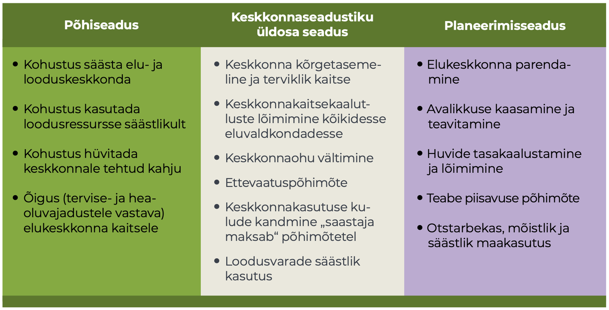

```

``` {block, type='imgsource'}
<span class="imgsource-source">Allikas:</span> Autorite joonis.
```

### Loodusalade planeerimisel lähtutakse lähimuspõhimõttest {-.chapter3_section}

Ruumiline planeerimine kasvas välja linna- ja regionaalplaneerimisest ning selle termini võtsid kasutusele Euroopa regionaalplaneerimise eest vastutavad ministrid 1983. aastal nn Torremolinose ehk Euroopa regionaalse/ruumilise planeerimise hartaga. Harta koostamine lähtus soovist tagada hea elukeskkond ja elukvaliteet. Harta sõnastas esmakordselt ruumilise planeerimise põhimõtted, mis kajastuvad ka Eesti planeerimisseaduses. Aastal 2013 kiitis Euroopa Ruumiliste Planeerijate Nõukogu, mille liige on ka Eesti Planeerijate Ühing, heaks Euroopa planeerimise harta ([ECTP-CEU 2013](#ECTP-CEU2013)). Selles Euroopa ruumilises tulevikuvaates tõstetakse esile ka vajadus tagada ökoloogiline toimimine tehiskeskkonna planeerimisel, igaühe juurdepääs kultuuri- ja looduspärandile ning maastike ja linna rohealade roll elukvaliteedi kujundajana.

Ruumilise planeerimise harta on suunda näitav väärtuspõhine kokkulepe. See käsitleb planeerimist ruumiliste otsustustasandite koostöö- ja koordineerimisvahendina. Iga tasand – alates rahvusvahelisest koostööst säästva arengu saavutamisel kuni kohalike arengu- ja maakasutusplaanideni – peab arvestama vähemalt vahetult ülal- ja allpool paikneva tasandi eesmärkide ja tegevustega. Euroopa Liidus ei ole ühtset planeerimisõigust: ruumilise planeerimise süsteem on hierarhiline ja selle õigusraami seab iga liikmesriik ise. Eestis toimib hierarhilisuse põhimõte praktikas siiski valdavalt ühesuunaliselt: suurema ruumiüksuse strateegilised dokumendid suunavad madalama tasandi ruumiplaneeringute sisu ([Irbis Konsultatsioonid jt 2017](#Irbis2017)).

```{block, type='blockquote-left'}
Eestis toimib hierarhilisuse põhimõte valdavalt ühes suunas: suurema ruumiüksuse strateegilised dokumendid suunavad madalama tasandi ruumiplaneeringute sisu.
```
Teisalt on ruumilisel planeerimisel keskne lähimuspõhimõte: kohalikku elu puudutavad arendusotsused tehakse üldjuhul võimalikult elanikule lähedal ehk madalaimal otstarbekal haldustasandil. Planeeringu väärtus piirkonna tuleviku, elukeskkonna ja avaliku ruumi kujundamisel ning kooskõla kogukonna huvidega sõltub menetleja võimest kasutada elanike teadmust ning kaasata neid nii planeeringu koostamisse kui ka täitmisse ([Levald 2018](#Levald2018); [Nuga jt 2015](#Nuga2015); [Vahtrus jt, käesolev kogumik](#kaasarääkimise-võimalused-loodusalade-kasutamisel)). Eesti 2017. aasta haldusreform, mis tõi kaasa omavalitsuste arvu ligi kolmekordse vähenemise, oli suunatud just sellise võimekuse suurendamisele piirkonnas. Lisaks on planeerimise kvaliteeti parandanud Eesti ametnike ja ekspertide osalemine täiendõppeprogrammides ja rahvusvahelistes võrgustikes nagu Vision and Strategies Around the Baltic Sea (VASAB) või European Spatial Planning Observation Network (ESPON) ([Adams jt 2014](#Adams2014)).

Eestis jõustati avaliku menetlusena toimuv ruumiline planeerimine 1995. aastal kehtima hakanud planeerimis- ja ehitusseadusega. Alates 2015. aastast vastutab selle eest Rahandusministeeriumi planeeringute osakond. Riigi tasandi ruumiarengut suunavad üleriigiline ja maakonnaplaneering ning neid täpsustavad teemaplaneeringud. Kohaliku tasandi ruumiarengu ja maakasutuse otsused langetab üldplaneeringut ja detailplaneeringut koostades kohalik omavalitsus. Uute, 2015. aasta planeerimisseaduses määratletud planeeringuliikidena eristuvad hierarhilisest süsteemist riigi eriplaneering ja kohaliku omavalitsuse eriplaneering, mille alusel saab olulise ruumilise mõjuga objekti rajamist kavandada väljaspool tavapärast planeerimismenetlust. Eriplaneeringute praktika on Eestis alles välja kujunemas ja nende mõju loodusaladele pole selge.

Avaliku ruumi kujundamise seisukohast on olulisemad planeeringutasandid maakonna- ja üldplaneering. Need arvestavad riigis kehtestatud strateegiliste suundadega, olles samal ajal piisavalt kontekstitundlikud ja kohalikku kogukonda kaasavad. 1999. aastal kõikides maakondades riiklikult algatatud teemaplaneeringut „Asustust ja maakasutust suunavad keskkonnatingimused“ peetakse Eesti asustusstruktuuri kõige enam mõjutanud ruumiliseks planeeringuks, mis tagab rohealade olemasolu ja reguleerib elamuehituse laienemist ([Irbis Konsultatsioonid jt 2017](#Irbis2017)). Üldplaneering määratleb maakasutuse kohaliku omavalitsuse territooriumil kooskõlas maakonna tasandi planeeringu põhimõtetega. Sealjuures sõnastab üldplaneering puhkealade, avalikult kasutatavate veekogude ning rohevõrgustike, väärtuslike maastike ja looduskoosluste säilimist tagavad kasutustingimused.

### Loodusalade seisundit mõjutavad nii rahvusvahelised arengueesmärgid kui ka riiklik valdkonnapoliitika  {-.chapter3_section}

```{block, type='blockquote-right'}
Eesti on liitunud rahvusvaheliste lepetega, mis toetavad sidusa ja toimiva rohevõrgustiku säilimist ja avalikkuse ligipääsu loodusaladele.
```
Looduskaitse ja säästva arenguga seotud ruumilisel ja strateegilisel planeerimisel juhindutakse rahvusvahelistest lepetest ([joonis 3.3.2](#figure332)). Varasematest üleilmsetest loodusalade avalikke hüvesid rõhutavatest lepetest on olulisemad 1972. aastast pärinevad kultuuri- ja looduspärandi kaitse konventsioon ning Stockholmi inimkeskkonna kaitse konverentsi deklaratsioon. Aastal 1992 kirjutas iseseisvuse taastanud Eesti Vabariik alla elurikkuse kaitset ja säästvat arengut käsitlevatele lepetele, sealhulgas bioloogilise mitmekesisuse konventsioonile ja ÜRO Agenda 21 tegevuskavale. Rohealade olulisusele elukeskkonnas juhib tähelepanu Maailma Terviseorganisatsiooni keskkonna ja tervise deklaratsioon (2010). Konkreetsemalt käsitleb linna rohealasid, aga ka üldise hea keskkonnaseisundi, elurikkuse ja heaolu tagamist 2015. aastal kokku lepitud ÜRO säästva arengu tegevuskava 2030+. Euroopa tasandil on koostatud mitu loodusalade, maastike, kultuuripärandi ja elukeskkonna kaitsele suunatud konventsiooni, strateegiat või tegevuskava, sealhulgas Euroopa rohetaristu strateegia (2013). Näitena eri väärtuste lõimitusest piirkondade majandamisel väärib märkimist UNESCO programm „Inimene ja biosfäär“, mille raames loodi 1989. aastal Lääne-Eesti saarte biosfääri programmiala.

<p class="caption" id="figure332"><span class="figure-number">Joonis 3.3.2.</span> Valik rahvusvahelisi ja Eesti strateegilisi arengudokumente, mis raamistavad loodusalade väärtustamist Eestis</p>

```{r, figure332, fig.align='center', out.width='100%', echo=FALSE, message=FALSE, warning=FALSE}

knitr::include_graphics("../figures/3-chapter/fig332.png")

```

``` {block, type='figure-comment'}
<span class="figure-comment-start">Märkus:</span> Toonitud põhjal on ruumiplaneeringute liigid, mis muu hulgas käsitlevad loodusalade kasutuse eesmärgipärasust ja kaitset. Joonis ei hõlma Euroopa Liidu direktiive, Eesti seadusi ega teiste valdkondade strateegilisi arengudokumente, mis võivad samuti mõjutada loodusalade avalikku kasutust.
```

``` {block, type='imgsource'}
<span class="imgsource-source">Allikas:</span> Autorite joonis.
```

Rahvusvahelised lepped väärtustavad loodusalade fundamentaalset ja mitmekihilist rolli inimeste tervise ning ühiskonna- ja majanduselu jaoks. Bioloogilise mitmekesisuse konventsiooni raames loodud ÜRO globaalse elurikkuse strateegia (2010) eeldab, et riigid on elurikkuse ja selle kaudu loodusalade väärtuste säilimiseks arvestanud elurikkuse väärtustega riiklikes ja kohalikes strateegiates, arengukavades ja ruumilistes planeeringutes hiljemalt aastaks 2020. Eestis vajavad need põhimõtted arendamist, et poliitika ei piirduks loodusalade kui üksnes pärandi või majandusressursi väärtustamisega. Näiteks pikaajalist piirkondlikku arengut suunav Eesti regionaalarengu strateegia märgib probleemina küll valglinnastumisega kaasnevat loodusalade kadu, kuid lahendusena toob esile piirkonnale iseloomulike loodusressursside kasutuse kohalikus ettevõtluses ja kogukondlikus tegevuses. Regionaalarengu strateegia ei anna suuniseid, kuidas piirata arendussurvet loodusaladele, et tagada nende ökoloogiline toimimine, avalik ligipääsetavus ja roll elukvaliteedi hoidmisel. Eesti deklareerib siiski, et on ÜRO globaalse elurikkuse strateegia eesmärke saavutamas, luues hiljemalt 2023. aastaks riikliku süsteemi ökosüsteemi teenuste kaardistamiseks, hindamiseks ja arvestamiseks strateegilises ning ruumilises planeerimises ([Linder ja Kakuver 2017](#Linder2017)).

Lisaks otseselt loodusalasid käsitlevatele dokumentidele mõjutavad loodusalasid teiste eluvaldkondade strateegilised arengudokumendid – eelkõige riigi strateegilisi huve ja valdkondade arengusihte väljendavad poliitika põhialused, valdkondade ja valitsemisala arengukavad ning programmid. Otseselt ruumikasutusega seotud valdkonnad on energeetika, maapõuekasutus, tööstus, põllumajandus, metsandus, looduskaitse, veemajandus, transport, telekommunikatsioon, riigikaitse, turism ja elamualade areng. 2014. aasta regionaalarengu strateegia järgi on füüsilise ruumi piiratuse tingimustes vajalik saavutada valdkonnapoliitika ja ruumilise planeerimise sisuline ja ruumiline kooskõla. See tähendab, et ka valdkondlikest arengudokumentidest peaks ilmnema, kuidas aitavad arengusihid kaasa kvaliteetse elukeskkonna ja avaliku ruumi saavutamisele, sealhulgas loodusalade hea seisundi ja juurdepääsu kaudu.

Riigikantselei juures töötanud ruumiloome ekspertrühma hinnangul aga puudub Eestis seni loodus- ja ehitatud keskkonda koos vaatav ning eri ruumiloome valdkondi siduvalt rakendav ruumipoliitika, mis oleks tegevuse aluseks kõigil otsustustasanditel ja kõigis valdkondades. Kehtiva õiguse kohaselt ei pea valdkondlike strateegiliste arengudokumentide koostamisel ruumiplaneeringutega arvestama, sealhulgas ei käsitleta ega arvestata kaasnevat ruumilist mõju ega eri dokumentide ruumilist koosmõju ([Rahandusministeerium 2019](#Rahandusministeerium2019)). Arengudokumentide kooskõla üleriigilise planeeringuga on mõnikord välja toodud, kuid vaid deklaratiivselt. Aja jooksul on valdkondlikke huve kaitsvate arengudokumentide ruumiline mõju tugevnenud ja kaalutlusõiguse kasutamine planeerimises vähenenud. See on kaasa toonud maakondlike ja kohalike huvide nõrga esindatuse strateegilistes dokumentides ([Irbis Konsultatsioonid jt 2017](#Irbis2017)), kusjuures ruumilise planeerimise kaudu ei ole võimalusi valdkondlike arengukavade ruumilise mõjuga regulatsioone muuta ([Rahandusministeerium 2019](#Rahandusministeerium2019)). Mõned Euroopa riigid (Iirimaa, Leedu) on astunud samme ühtse aluse loomiseks ruumiliste arengusuundade, strateegiliste arengudokumentide ja riiklike investeerimisplaanide koostamisel (samas).

### Loodusaladel on erinevad juurdepääsuvõimalused ja kasutuskitsendused {-.chapter3_section}

Eesti loodusalade planeerimise alused ning nende õiguslik ja halduslik korraldus on keeruline (joonised [3.3.3](#figure333) ja [3.3.4](#figure334)). Samal alal võib kehtida korraga mitu kaitsekorda või kasutuskitsendust, näiteks kui ala kuulub samaaegselt maastikukaitseala piiranguvööndisse, kalda veekaitsevööndisse ja rohevõrgustiku tugialasse. Kitsendused puudutavad ka loodusala avalikku kasutamist, sealhulgas alal viibimist.

<p class="caption" id="figure333"><span class="figure-number">Joonis 3.3.3.</span> Eesti loodusaladel võib korraga kehtida mitu kaitsekorda sõltuvalt ala loodusväärtustest</p>

```{r, figure333, fig.align='center', out.width='100%', echo=FALSE, message=FALSE, warning=FALSE}

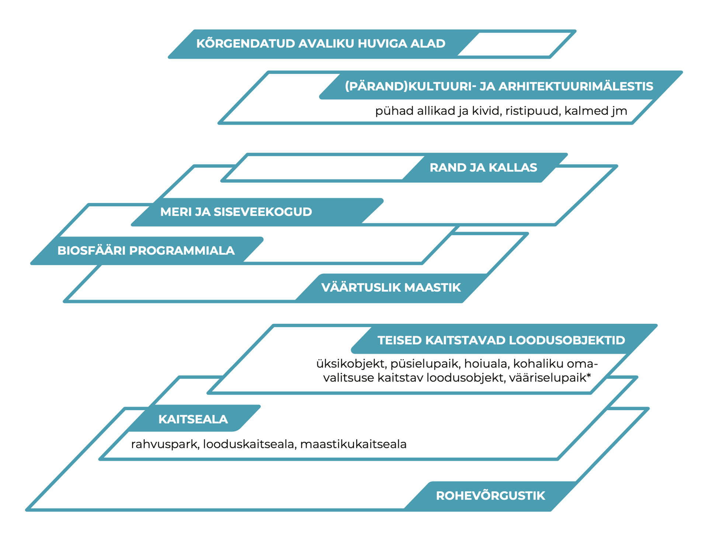

```
``` {block, type='figure-comment'}
<span class="figure-comment-start">*</span> Ala metsas, kus kitsalt kohastunud, ohustatud, ohualdiste või haruldaste liikide esinemise tõenäosus on suur. Vääriselupaik on erametsas kaitstud vabatahtlikult, riigimetsas keskkonnaministri käskkirja alusel.
```

``` {block, type='imgsource'}
<span class="imgsource-source">Allikas:</span> Autorite joonis.
```
Eestis on loodusaladele valdavalt vaba juurdepääs ja neid külastavad erinevad huvilised ([Sepp ja Lõhmus, käesolev kogumik](#kuidas-inimesed-eesti-looduskeskkonda-kasutavad)), kuid avalik füüsiline ruum on õigusaktides määratlemata. Euroopa planeerimise harta näitlikustab seda tänavate, väljakute, jalgradade ja rohevõrgustikuna (<a href="https://planeerimine.ee/static/sites/2/euroopa_planeerimise_harta.pdf">ECTP-CEU 2013</a>). Eestis on keskkonnaseadustiku üldosa seadusega esmaselt sätestatud üldise juurdepääsu põhimõte: kuigi maatükil tohib viibida vaid omaniku loal, eeldatakse loa olemasolu, kui omanik ei ole selgelt väljendanud vastupidist. Peale omaniku tohib juurdepääsu loodusalale piirata ka kohalik omavalitsus üldplaneeringuga, kui selleks on ülekaalukas avalik või erahuvi või juhul, kui kallasrajal paikneb seaduslik ehitis.

Kõige selgemini on piiritletud avalik juurdepääs ning loodushoid looduskaitseseaduse alusel kaitstavatel objektidel (18,5% Eesti maismaast; [Linder ja Kakuver 2017](#Linder2017)). Kaitsealadel kehtivad eri rangusastmega kaitsevööndid, millest kõige rangema kaitse ja avaliku juurdepääsu keeluga on loodusreservaat (1% kaitsealade maismaapindalast; [samas](#Linder2017)). Sihtkaitse- (60%) ja piiranguvööndisse (39%) kuuluvat maad tohib külastada lähtuvalt kaitse-eeskirjas seatud korrast, kuid igal juhul on seal keelatud telkida, teha lõket ja korraldada üritusi selleks ettevalmistamata ning tähistamata kohtades. Päikesetõusust loojanguni on kaitsealal paiknevad või kaitstava loodusobjekti juurde viivad teed ja rajad kõigile avatud. Ka ranna ja kalda kaitsevööndid (piirangu-, ehituskeelu- ja veekaitsevöönd) on avaliku kasutuse seisukohalt olulised – avalikus kasutuses olevale veekogule peab olema tagatud püsiv juurdepääs, veekogu piiril peab kallasrada läbipääsu võimaldama ja kaitsevööndites tuleb säilitada puhketingimused.

```{block, type='blockquote-right'}
Kallasraja omavolilise sulgemise või kallasrajale pääsemise takistamine on levinud era- ja avaliku huvi põrkumise olukord.
```
Riigikontroll on toonud oma auditis välja kallasraja omavolilise sulgemise või kallasrajale pääsemise takistamise kui levinud era- ja avaliku huvi põrkumise olukorra Eestis ([Riigikontroll 2015](#1Riigikontroll2015)). Leidub hulgaliselt eraomanikke, kel puudub Riigikontrolli hinnangul tahe oma maal olevaid teid ja parkimiseks sobilikke kohti avalikku kasutusse lubada. Probleemiks võib olla ka veekogudeni viivate juurdepääsuteede raske leitavus ja kehv tähistus või juurdepääsuvõimaluste puudumine sootuks, samuti kallasraja katkemisel ümberpääsu tähistamata jätmine. Riigikontroll tähtsustas kallasraja kasutatavuse tagamisel kohaliku omavalitsuse otsustavust üldplaneeringu koostamisel ja soovitas tõhusamat koostööd Keskkonnainspektsiooniga.

```{block, type='blockquote-left'}
Kõrgendatud avaliku huviga aladeks on 3,5% RMK hallatavaid metsamaid, mis külgnevad puhkemetsade, tiheasustusalade või eramutega või mis on olulised kultuuripärandi seisukohast.
```

Suur osa Eesti riigi omandis olevate loodusalade haldusest on delegeeritud Riigimetsa Majandamise Keskusele (RMK) ehk eraõiguslikule juriidilisele isikule. Era- ja avalike, riiklike ja kohalike huvide tasakaalustamiseks metsamaa majandamisel on RMK alates 2017. aastast määratlenud kõrgendatud avaliku huviga alad (KAH alad) ning nende majandamisvõtted. Sellisteks aladeks on RMK hallatavad metsamaad, mis külgnevad puhkemetsade, tiheasustusalade või eramutega või mis on olulised kultuuripärandi seisukohast. Nende alade majandamiseks on kogukonnaga kokku lepitud rangemad ja enam konteksti arvestavad põhimõtted. Alade majandamisel tähtsustatakse huvirühmade kaasamist ja maastikuga arvestamist, kuid neid alasid ei jäeta majandamisest välja. 2019. aasta alguseks on RMK teatel kõrgendatud avaliku huviga aladena määratletud 51 134 hektarit metsamaad, mis moodustab 3,5% kogu RMK hallatavast metsamaast.

<p class="caption" id="figure334"><span class="figure-number">Joonis 3.3.4.</span> Avalik-õiguslike asutuste ja RMK tööjaotus loodusalade maakasutuse ja kaitse planeerimisel ja korraldamisel</p>

```{r, figure334, fig.align='center', out.width='100%', echo=FALSE, message=FALSE, warning=FALSE}

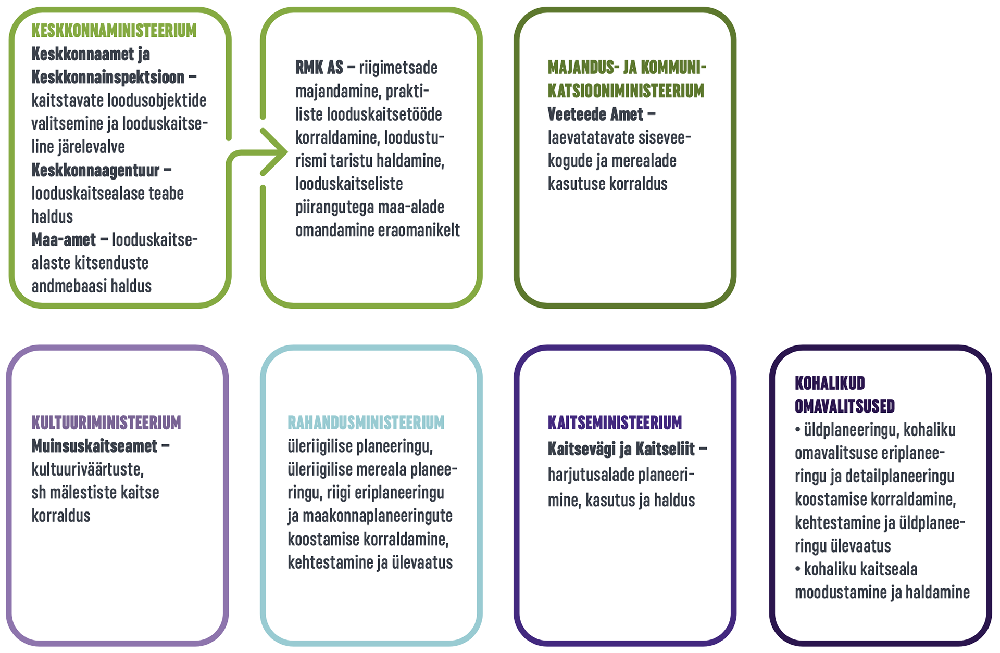

```

``` {block, type='imgsource'}
<span class="imgsource-source">Allikas:</span> Autorite joonis.
```

Asulates pakuvad elanikele esmast kokkupuudet loodusaladega asulalähedased metsad, linnametsad, pargid ja kalmistud. Linnametsi ja linnalähiseid parkmetsi on Eestis teadlikult majandatud vähemalt 19. sajandi keskpaigast alates: juba toona hinnati kõrgelt metsade puhkeväärtust. Linnasiseste ja linna lähipuhkealade kasutamise üheks olulisemaks näitajaks on nende paiknemise kaugus inimeste elukohast, millest põhjalikumalt räägivad [Sepp ja Lõhmus, käesolev kogumik](#kuidas-inimesed-eesti-looduskeskkonda-kasutavad) ning [Orru jt, käesolev kogumik](#loodusalade-mõju-inimeste-heaolule).

Avaliku juurdepääsu ja kasutatavuse mõttes on eriline loodusala meri. Merealade ajaloolisele kasutusele (kalapüük või liikumistee) on lisandumas uusi kasutusviise, näiteks puhkemajandus või energiatootmine. Merealade rekreatiivne väärtus avaldub ka vaates merele ning uued kasutusviisid võivad avatud merevaate säilimisega konkureerida. Eestis on koostamisel kogu mereala (koos rannaalaga 36 500 km²) hõlmav planeering, mille käigus selgitatakse välja huvid ja eri kasutusotstarveteks sobilikud alad, hinnatakse kasutusviiside koosmõju ning sõlmitakse planeeringuosaliste vahel merekasutuse pikaajaline kokkulepe. Merealade planeerimise praktika on uus kogu Euroopa Liidus (kohustus mereruumi planeerida kehtestati alles 2014. aastal). Enne Eesti merealade planeeringu algatamist jõuti Eestis kehtestada Hiiu- ja Pärnumaa merealade maakonnaplaneering (vastavalt 2016. ja 2017. aastal).

Siseveekogudel paiknevate loodusväärtuste kaitse ja avaliku kasutuse reguleerimine toimub piirkondlike veemajanduskavade ning ruumilise planeerimise kaudu, arvestades loodus- ja tervisekaitse nõuetega. Avalikud supelrannad määratletakse üldplaneeringuga. Veekogudel liikumist haldab laevatatavate veekogude puhul Veeteede Amet. Kohalikul omavalitsusel on õigus seada avalikult kasutatavatele veekogudele ajutisi kasutuspiiranguid.

### Rohevõrgustik seob loodusalad tervikuks, kuid selle toimimine pole tervikuna tagatud {-.chapter3_section}

```{block, type='blockquote-right'}
Kõige ulatuslikum kaitse loodusalade maakasutusmuutuste eest on seotud rohevõrgustikuga, mis hõlmab 55% Eesti maismaast.
```

Kõige ulatuslikum kaitse loodusalade maakasutusmuutuste eest on seotud rohevõrgustikuga, mis hõlmab 55% Eesti maismaast. Selle eesmärk on sidusalt ühendada eri tüüpi looduslikke või looduslähedasi maa- ja veealasid, et tagada nende ökoloogiline toimimine ning maastike säilimine. Rohevõrgustik koosneb eri tähtsusega (riiklik, maakondlik, kohalik) tugialadest ja neid ühendavatest rohekoridoridest. Eesti kaitsealusest maast kuulub rohevõrgustikku 88%, mis omakorda moodustab umbes kolmandiku rohevõrgu kogupindalast. Kõige enam kattuvad kaitstavad alad ja rohevõrgustik Läänemaal (51% rohevõrgustikust kaitse all), kõige vähem aga Põlvamaal (18%). Väljaspool rohevõrgustikku on kõige enam alasid looduskaitse all Hiiu- (29%), Valga- (28%) ja Saaremaal (27%) ([joonis 3.3.5](#figure335)).

<p class="caption" id="figure335"><span class="figure-number">Joonis 3.3.5.</span> Rohevõrgustiku ja kaitstavate loodusobjektide (kaitsealad, kaitstavate liikide leiukohad, püsielupaigad, Natura 2000 alad) osakaal maakonna kogupindalast</p>

```{r, figure335, out.width='90%', fig.align='center', echo=FALSE, message=FALSE}

library("tidyverse")

fig335_data <- read.csv ("../data/33_fig5_data.csv", header=TRUE, fileEncoding="utf-8")

fig335_data$objects <- factor(fig335_data$objects, levels = c("RV ala väljaspool kaitsealasid","Kaitstavad loodusobjektid väljaspool RV ala","Kaitstavad loodusobjektid RV alal"))


  fig335_plot <- ggplot() +
    geom_bar(data = fig335_data, mapping = aes(x=reorder(county,-value), y=value, fill=objects), width=0.6, stat="identity") +
    scale_fill_manual(values=c("#79AC2C","#482683","#5B8121"), labels=c("Rohevõrgustiku ala väljaspool kaitsealasid","Kaitstavad loodusobjektid väljaspool rohevõrgustiku ala","Kaitstavad loodusobjektid rohevõrgustiku alal")) +
    labs(y="%", x="") +
    guides(fill=guide_legend(nrow=3,byrow=TRUE)) +
      scale_y_continuous(expand = c(0, 0), limits=c(0,100)) +
    expand_limits (y=0)

      fig335_theme <- theme(
                    panel.grid.major.x = element_blank() ,
                    panel.grid.minor.x = element_blank(),
                    axis.line = element_line(size = 0.2, colour = "#cccccc"),
                    axis.text.x = element_text(angle=45, margin = margin(t = 7, r = 0, b = 0, l = 0), hjust=1.1),
                    text = element_text(family="Montserrat"),
                 )

print(fig335_plot + fig335_theme + fig_theme_general)

#ggsave(path="exported_figures/PDF/chapter3",filename="fig335.pdf", height=140, width=210, units="mm")

```

``` {block, type='imgsource'}
<div><span class="imgsource-source">Allikas:</span> Kutsar jt 2018.</div>
<div><a class="data-btn" href="../data/33_fig5_data.csv"><i class="fa fa-download" aria-hidden="true"></i>Laadi andmed</a></div>
```

Rohevõrgustiku vajaduse sätestab rahvusvaheliselt Euroopa Liidu rohetaristu strateegia ja riiklikult Eesti looduskaitse arengukava. Võrgustikku kuuluvad alad määratakse maakonna- ja üldplaneeringuga. Rohevõrgustiku planeerimisel on abiks rohevõrgustiku planeerimisjuhend ([Kutsar jt 2018](#Kutsar2018)) ja Rahandusministeeriumi 2018. aasta juhend „<a href="https://planeerimine.ee/static/sites/2/uldplaneeringu_juhis_final.pdf">Nõuandeid üldplaneeringu koostamiseks</a>“. Idee ise ulatub Eestis tagasi 1960. aastatesse, mil Jaan Eilart ja Vaike Parker tegid esimesed katsetused puhkemaastike ja rohekoridoride planeerimisel Tartu ümbruses ning Heino Luik ja Veljo Ranniku tegelesid põlevkivi tootmisalade funktsionaalse tsoneerimisega Ida-Virumaal. 1980. aastate alguses arendati teadustöös uuenduslikku käsitlust ökovõrgustikest kui maastikul inimmõju ökoloogiliselt kompenseerivatest aladest ([Mander jt 2018](#Mander2018)). Erineva täpsusastmega ökovõrgustike kaarte koostati kuni 1980. aastate lõpuni, neist täpseimad loodi Tallinna, Kirde-Eesti ning Saare- ja Hiiumaa kohta. „Roheline võrgustik“ võeti terminina kasutusele 2000. aastal kehtestatud üleriigilises planeeringus Eesti 2010+. Praegu käsitleb planeerimisseadus rohevõrgustikke koos väärtuslike maastike, põllumajandusmaade ja miljööaladega, viidates muu hulgas nende alade omavahelisele seosele ja rohevõrgustiku kultuurilisele tähtsusele.

```{block, type='blockquote-right'}
Eestis puudub konsensus ja ühene kohtupraktika küsimuses, kas arendusplaani vastuolu planeeringuga annab aluse tegevusloa väljastamisest keeldumiseks või mitte.
```
Rohevõrgustikku kuuluvate, kuid kaitsealadest välja jäävate loodusalade säilimist ja juurdepääsu tagab maakonna- ja üldplaneeringute nõue mitte muuta selliste alade maakasutuse peamist otstarvet (nt asendada loodusala tehisalaga, nagu maardla või elamualaga, mis ühtlasi välistab avaliku kasutuse). Kitsendusi seatakse ka maakasutuse korraldamisel ja tegevuslubade väljastamisel, sealhulgas ehitusõiguse andmisel. Siiski saab planeeringut muutes jätta võrgustikust välja arendussurve all olevaid või maardlatel paiknevaid loodusväärtuslikke alasid, mis ei kuulu kaitsealade koosseisu. Arendussurve rohevõrgustikule on olnud viimasel aastakümnel märkimisväärne just suuremate tõmbekeskuste (Tallinna ja Tartu) rõngasvaldades.

Rohevõrgustiku toimimist ohustavate arendusplaanide puhul analüüsitakse mõju ulatust ja tegevuse lubatavust keskkonnamõju hindamise käigus, kuid arenduspõhise hindamise puudus on kuhjuvate ja hajusate ruumiliste mõjude piiratud käsitlus. Maakonna- ja üldplaneeringud on küll koostatud laia strateegilise vaate alusel, kuid Eestis puudub konsensus ja ühene kohtupraktika küsimuses, kas arendusplaani vastuolu planeeringuga annab aluse tegevusloa väljastamisest keeldumiseks või mitte ([Kask jt 2015](#2Kask2015)). Seetõttu on planeerimismenetlus loodusväärtusliku avaliku ruumi kaitsel küll oluline, kuid mitte alati piisav vahend ning võtmetähtsusega aladel tuleks kaaluda tugevamaid kaitsemeetmeid.

```{block, type='casebox'}
<h3>Rohevõrgustiku analüüs näitab planeerimise puudujääke ja õigusraamistiku vajakajäämist</h3>

Looduskaitse arengukava raames analüüsiti Eesti maakonna- ja üldplaneeringutes määratletud rohevõrgustiku toimimist aastatel 2003–2017 ([Kutsar jt 2018](#Kutsar2018)). Andmepäringule vastasid tähtajaks 14 maavalitsust 15st ja 133 kohalikku omavalitsust 213st. Analüüsiks sobilikud ruumiandmed (vektorfailid) saadi 15 maakonna- ja 74 üldplaneeringu kohta.

Rohkem kui pooltes planeeringutes esines suuri kõrvalekaldeid rohevõrgustiku määratlemise metoodikast. Tugialad ja rohekoridorid olid valdavalt eristamata (11 maakonna- ja 43 üldplaneeringus), nagu ka riikliku või maakondliku tähtsusega ja kohaliku tähtsusega tugialad. Selle tulemusena ei ole võrgustiku elemendid enamikus planeeringutes eristatavad ja seletuskirjas seatud kasutustingimused ei seostu üheselt aladega kaardil. Seega ei saa majandamisotsuseid alapõhiselt kaaluda ning kaob tugialadele ja rohekoridoridele erinevate tingimuste sätestamise mõte.
Harjumaa näitel analüüsiti rohevõrgustiku muutumist CORINE 2006., 2012. ja 2018. aasta maakattetüüpide tasemel. Ajavahemikul 2006–2012 teisenes Harjumaa rohevõrgustikus kokku 12 010 hektarit maad, mille seas valdas loodusliku maakatte klasside teisenemine. Umbes 300 hektaril muudeti loodusliku maakattega ala tehisalaks, enamasti elamuarenduseks ja karjäärideks. Rohekoridoride katkestusi (mingi osa koridori looduslikust maakattest muutus tehisalaks) oli näiteks Tallinna ümbruses ja põhimaanteede ääres kokku 25 ([joonis 3.3.6](#figure336)). Ajavahemikul 2012–2018 teisenes rohevõrgustikus kokku 10 509 hektarit maad, sealhulgas muudeti 224 hektarit loodusliku maakattega ala tehisalaks. Nende muutustega eemaldati seni rohevõrgustikku kuuluvad alad avalikust kasutusest ning kadus neile planeeringuga seatud loodusala funktsioon.

Analüüsist järeldati, et Eesti õigusraamistik on rohevõrgustiku kaitse tagamiseks piisav siis, kui õigusakte rakendatakse sihiga säilitada rohevõrgustikku. Arendussurve toob kaasa rohevõrgustiku killustumise. Piirkondades, kus rahvastik kahaneb ja arendussurve on väiksem, säilib võrgustiku kvaliteet ja juurdepääsetavus. Rohevõrgustike säilimist ja igakülgset toimimist aitab tagada planeerimismenetluse tehnilise taseme tõstmine, sealhulgas rohevõrgustiku sihttasemete määratlus, ruumiinfo digistandardite kasutus ja planeerimislahenduse sidumine avalike andmekogudega.

```

<p class="caption" id="figure336"><span class="figure-number">Joonis 3.3.6.</span> Harju maakonna rohevõrgustiku katkestused 2006. ja 2012. aasta võrdluses</p>

```{r, figure336, fig.align='center', out.width='100%', echo=FALSE, message=FALSE, warning=FALSE}

knitr::include_graphics("../figures/3-chapter/fig336.png")

```

```{block, type='imgsource'}
<span class="imgsource-source">Allikas:</span> Kutsar jt 2018.
```

### Kokkuvõte {-.chapter3_section}

```{block, type='blockquote-right'}
Arendussurve toob kaasa rohevõrgustiku killustumise. Piirkondades, kus rahvastik kahaneb ja arendussurve on väiksem, säilib võrgustiku kvaliteet ja juurdepääsetavus.
```
Eestis kehtivad ruumilise planeerimise ja looduskaitse nõuded, mis toetavad loodusalade säilimist, nende head seisundit ja avalikku juurdepääsu. Üle poole Eesti maismaast kuulub rohevõrgustikku, mis on kokku lepitud ruumilise planeerimise protsessis. Sama ajal on kaitstavaid maa-alasid Eestis proportsionaalselt vähem kui teistes Euroopa riikides – vastavalt 20% ja 26% ([EEA 2019](#European2019)). Praegustest ruumilise planeerimise ja looduskaitse meetmetest ei piisa, et tagada hea elukeskkond, avatud ruum ja loodusalade hüvede säilimine. Selle põhjusteks on eri valdkondi katva läbimõeldud ruumipoliitika puudumine ja õiguslik võimalus mitte lähtuda strateegiliste arengudokumentide koostamisel ning arendusplaanide menetlemisel planeeringus kokku lepitud tingimustest ja ruumilise koosmõju analüüsist. Nende kitsaskohtade lahendamise kõrval on sidusa ruumipoliitika elluviimisel oluline ka planeeringute tehnilise taseme tõus ja digiajastu normidele vastav info kättesaadavus.

### Viidatud allikad {-.subreferences}

<p id="Adams2014">Adams, N., Cotella, G., Nunes, R. 2014. The engagement of territorial knowledge communities with European spatial planning and the territorial cohesion debate: a Baltic perspective. – European Planning Studies, 22 (4), 712–734.</p>

<p id="ECTP-CEU2013">ECTP-CEU 2013. Euroopa planeerimise harta: visioon Euroopa linnade ja piirkondade jaoks 21. sajandil. Barcelona: Euroopa Ruumiliste Planeerijate Nõukogu.</p>

<p id="European2019">EEA – European Environmental Agency 2019. Share of country designated as terrestrial protected area and the overlap between Natura 2000 or Emerald sites and national designations. https://www.eea.europa.eu/ds_resolveuid/13e289d0367a4cf2b4ddfb7aac31efee.</p>

<p id="Irbis2017">Irbis Konsultatsioonid OÜ, Tartu Ülikooli Sotsiaalteaduslike rakendusuuringute keskus, Hendrikson & Ko OÜ 2017. Arengu ruumiline ja strateegiline kavandamine, sh regionaaltasandi funktsioonid ruumilise arengu suunamisel. Aruanne Rahandusministeeriumile. https://planeerimine.ee/static/sites/2/arengu-ruumiline-ja-strateegiline-kavandamine-1.pdf.</p>

<p id="2Kask2015">Kask, O., Lopman, E., Relve, K., Kuusk, P., Triipan, M., Vaarmari, K., Vahtrus, S., Veinla, H. 2015. Keskkonnaseadustiku üldosa seaduse kommentaarid. Tartu: Keskkonnaõiguse Keskus.</p>

<p id="Kutsar2018">Kutsar, R., Metspalu, P., Eschbaum, K., Vahtrus, S., Sepp, K. 2018. Rohevõrgustiku planeerimisjuhend. Tallinn, Tartu: Keskkonnaagentuur, Hendrikson & Ko OÜ.</p>

<p id="Levald2018">Levald, A. 2018. Kohandav planeerimine ja ruumiloome kahaneva rahvastikuga piirkondades. – Ettekanne Riigikogu probleemkomisjoni istungil Toompeal 3.12.2018. Tallinn: Rahandusministeerium.</p>

<p id="Linder2017">Linder, M., Kakuver, K. (toim.) 2017. Looduskaitse. Eesti looduse kaitse aastal 2015. Eesti looduse mitmekesisus 5. Tallinn: Keskkonnaagentuur.</p>

<p id="Mander2018">Mander, Ü., Kull, A., Uuemaa, E., Mõisja, K., Külvik, M., Kikas, T., Raet, J., Tournebize, J., Sepp, K. 2018. Green and brown infrastructures support a landscape-level implementation of ecological engineering. – Ecological Engineering, 120, 23–35.</p>

<p id="Nuga2015">Nuga, M., Metspalu, P., Org, A., Leetmaa, K. 2015. Planning post-summurbia: from spontaneous pragmatism to collaborative planning? – Moravian Geographical Reports, 23 (4), 36−46.</p>

<p id="Rahandusministeerium2019">Rahandusministeerium 2019. Ruumilise planeerimise rohelise raamatu eelnõu 26.07.2019. https://planeerimine.ee/prr.</p>

<p id="1Riigikontroll2015">Riigikontroll 2015. Kallasradade kasutamine. Kas omavalitsused ja Keskkonnainspektsioon on teinud kõik endast sõltuva, et inimene pääseks randa ja saaks kallasrajal liikuda? Riigikontrolli aruanne Riigikogule. Tallinn, 08.12.2015.</p>

<!--chapter:end:03.3-chapter.Rmd-->

## Kaasarääkimise võimalused loodusalade kasutamisel {.chapter_section .chapter3_section}

```{block, type='authors'}
<div class="author-links">**[Siim Vahtrus](#siim-vahtrus), [Liina Remm](#liina-remm), [Kärt Vaarmari](#kärt-vaarmari)**</div>
<div><a class="print-btn" href="../print/EIA-2019-3.4.pdf"><i class="fa fa-file" aria-hidden="true"></i>Trükiversioon</a></div>
```

```{block, type='points'}
* Keskkonnademokraatiat soosib Eestis hea õigusraamistik ning põhjalik keskkonnaandmestik, kuid pärsib elanike pessimism ning teabe ja andmete keerukas esitusviis.
```

Eestis on suur osa looduskeskkonnast vähemalt mingil määral avalikult kasutatav või igaühele ligipääsetav. Keskkonnaotsused mõjutavad seega ka loodusalade avalikku kasutust. Näiteks võib otsus rajada riigimetsa uus kruusakarjäär või lubada soos turba kaevandamist jätta ümbruskonna inimesed ilma harjumuspärasest marjul käimise kohast. Looduslike paikade, sealhulgas looduslike pühapaikade või külakogukondade puhkemetsade kasutust võib piirata ka uue tee või raudtee rajamise otsus. Luba rajada jõe äärde uus tehas, hüdroelektrijaam või muud taolist võib vähendada kalastamise ja suplemise võimalusi või jätta inimesed ilma looduslikest vaatamisväärsustest. Isegi kui keskkonnaotsuse objektiks olevat tegevust kavandatakse üksnes eramaale või avalikust kasutusest väljas olevasse kohta – näiteks uue põlevkivikaevanduse rajamise puhul –, ulatuvad selle mõjud sageli kaugemale näiteks müra, õhusaaste, veereostuse ja liikluskoormuse suurenemise näol.

```{block, type='blockquote-right'}
Isegi kui keskkonnaotsuse objektiks olevat tegevust kavandatakse üksnes eramaale või avalikust kasutusest väljas olevasse kohta, ulatuvad selle mõjud sageli kaugemale näiteks müra, õhusaaste, veereostuse ja liikluskoormuse suurenemise näol.
```

Anname ülevaate, mil määral saavad inimesed keskkonnaotsuste tegemises kaasa rääkida, keskendudes kahele teemale: milline on keskkonnaotsustes osalemise korraldus (võimalus) ja kuivõrd on inimesed harjunud avalikult arvamust avaldama (ühiskondlik aktiivsus). Need aspektid omakorda olenevad sellest, millist teavet inimesed oma keskkonna kohta saavad ja kuidas seda kasutavad.

### 1980. aastate sündmused tingisid Nõukogude Eestis avaliku keskkonnaarutelu {-.chapter3_section}

Nõukogude Liidu perioodil otsustati keskkonnaküsimusi Eestis avaliku dialoogita ja teave keskkonnaohtude kohta oli salastatud ([Kiisel 2005](#Kiisel2005)). Näiteks oli rangelt salastatud aastatel 1946–1991 Sillamäel töötanud strateegilise tähtsusega uraanitehase tegevusega seonduv. Teadmiste puudumine takistas inimestel ka oma elukeskkonnaga seotud keskkonnaprobleemide lahendamisest osavõttu. Lisaks peeti keskkonnakaitset nii üldsuse teadvuses kui ka ekspertide seas teadlaste ja looduskaitseorganisatsioonide kitsalt spetsialiseeritud tegevusalaks, elanikkonda aga pigem looduse reostajaks kui kaitsjaks. Samal ajal oli avalikkus Eesti looduse ohustatuse pärast murelik, mõistis ja hindas teaduslikku kriitilist lähenemist keskkonnaprobleemidele ega usaldanud ametkondlikku optimismi ([Lauristin 1988](#Lauristin1988)).
1987.–1988. aasta rahvuslik protestiliikumine Virumaale kavandatud fosforiidikaevanduste vastu muutis pilti oluliselt. Paari aasta jooksul muutusid avalikkuse osalemisvormid arutelus ja otsustamises ning kujunes välja avalik arvamus, mis oli fosforiidi kaevandamise suhtes negatiivne. Avalikkus tekitas ise oma osalemise võimalused ja poliitilise surve otsustusprotsessile ning saavutaski tulemuse, et kavandatud suuremahuline fosforiidikaevandus jäi rajamata.

Samal ajal hakkasid inimesed nõudma ka keskkonnainfo avalikustamist. Nõukogude Liidus tervikuna hakati keskkonnaohtudest ja -probleemidest avalikumalt rääkima pärast 1986. aasta Tšornobõli tuumaelektrijaama õnnetust. Siseriikliku ja rahvusvahelise surve tulemusena lubas toonane Nõukogude Liidu Kommunistliku Partei keskkomitee peasekretär Mihhail Gorbatšov teha õnnetuse kohta käiva teabe avalikuks. Sellele järgnenud perioodil tunnistasid mitmed riigid keskkonnainfo saamise ja keskkonnaküsimustes avalikkuse kaasamise olulisust. Samal ajal (1984–1987) töötas ÜRO keskkonnakomisjon säästva arengu kontseptsiooni kallal, kirjutades töö lõppraportisse (nn Brundtlandi raport; 1987) esmakordselt sisse vajaduse kaasata ühiskonna eri osapooled keskkonnaotsuste tegemisse. Raport oli hiljem aluseks Rio deklaratsioonile (1992), mis ütleb juba otsesõnu, et „riiklikul tasandil peab igaühel olema asjakohane juurdepääs ametiasutuste käsutuses olevale keskkonnainfole“. Euroopa Liit võttis 1990. aastal vastu direktiivi 90/313/EMÜ keskkonnainfole juurdepääsu vabaduse kohta. Aastal 1998 aastal võeti vastu Aarhusi konventsioon, mis näeb ette igaühe õiguse saada keskkonnainfot ja osaleda keskkonnaasjade otsustamises ning annab neis asjus juurdepääsu õigusemõistmisele.

<div class="casebox">
<h3>Eesti keskkonnademokraatia sünd nn fosforiidisõjas</h3>

Fosforiidikaevanduste planeerimine Virumaale algas Nõukogude Liidu ametkondades juba 1970. aastatel, ent info selle kohta oli avalikkuse eest salastatud. Plaani sisuks oli rohkem kui 10 000 töötajaga hiigelkaevanduse rajamine, mis tähendanuks suurt ohtu põhjaveele ning massiivset võõrtööliste sisserännet. Eesti NSV Teaduste Akadeemias käsitleti plaani 1970. aastate teises pooles, ent laiem avalikkus sai kaevanduse kavandamisest teada 1987. aasta alguses.

1987&#8291;. aasta kevadel korraldasid Tartu tudengid rahumeelseid protestiaktsioone, teemat kajastati teravalt ajakirjanduses. Sellele järgnes 1988. aastal Eesti Rohelise Liikumise sünd ning esimese suure keskkonnateemalise massiaktsioonina roheliste rattaretk „Kuidas elad, Virumaa?“. Rahvakoosolekud toimusid Tallinnas ja Tartus, töö- ja õppekollektiivides korraldati avalikke pressikonverentse ning kohtumisi teadlastega, toimetused ja valitsusorganid hakkasid saama hulgaliselt kollektiivseid kirju, noorte seas levisid spontaansed väljendusvormid levilauludest loosungite ja särkideni. 29. mail 1987 võttis ENSV Ülemnõukogu vastu otsuse, millega pani valitsusele kohustuseks arvestada edasiste uuringute tegemisel praeguse ja tulevaste põlvkondade huvidega maa, maapõue ja veeressursside kaitseks ning teaduslikult põhjendatud ratsionaalseks kasutamiseks.

Protsessi käigus arenesid erinevad avalikkuse osalemise ja demokraatia vormid – teabe avalikustamisele massiteabevahendites ning isikutevahelistele aruteludele lisandusid kohtumised, üldsuse väljaastumised, kollektiivsed kirjad, seejärel hääletamised, küsitlused, arutelud valitavas organis ning lõpuks otsuse vastuvõtmine nõukogude võimu ja avaliku kontrolli organite poolt ([Lauristin 1988](#Lauristin1988)).

<p class="caption" id="figure341"><span class="figure-number">Joonis 3.4.1.</span> Meeleavaldus 19. mail 1987. aastal</p>
```{r, figure341, fig.align='center', out.width='100%', echo=FALSE, message=FALSE, warning=FALSE}

knitr::include_graphics("../figures/3-chapter/fig341.png")

```

</div>
```{block, type='imgsource'}
<span class="imgsource-source">Allikas:</span> Postimehe arhiiv, Scanpix Baltics.
```

### Eesti praegune osalemis- ja keskkonnainfo avalikustamise normistik on hea {-.chapter3_section}

Pärast iseseisvuse taastamist vähenes avalik huvi keskkonnaküsimuste vastu märgatavalt. Samal ajal liikus Eesti keskkonnaõigus jõudsalt Euroopa Liidu õigusruumi suunas: 2001. aastal ühines Eesti Aarhusi konventsiooniga ning 2004. aastal sai Euroopa Liidu liikmeks, mis tähendas ka Euroopa Liidu õigusnormide ülevõtmist. Nende normidega tekkis tugev alus keskkonnainfo kättesaadavuse ja osalemisõiguse tagamiseks. Aarhusi konventsiooni nõuded on viidud peamiselt keskkonnaseadustiku üldosa seadusse (KeÜS), mille alusel on igaühel üldjuhul juurdepääs keskkonnainfole ning õigus osaleda olulise keskkonnamõjuga otsuste tegemises.

```{block, type='blockquote-left'}
OECD 2017. aasta Eesti keskkonnatoime ülevaate kohaselt on Eestis keskkonnademokraatia arenenud ja keskkonnainfo kättesaadav.
```
Võrdleva uuringu „Environmental Democracy Index“ kohaselt oli Eesti 2015. aastal maailma riikide pingereas osalemisõigust ja info kättesaadavust käsitlevate nõuete ülevõtmise ja täitmise poolest 70 riigi hulgas 14. kohal ([World Resources Institute 2015](#World2015)). OECD 2017. aasta Eesti keskkonnatoime ülevaate kohaselt on Eestis keskkonnademokraatia arenenud ja keskkonnainfo kättesaadav. Kaks kolmandikku elanikest peab end keskkonnaasjades hästi informeerituks, kuigi info täielikkus ja kvaliteet võiksid olla paremad. Ka keskkonnaasjades osalemise võimalus on OECD ülevaate kohaselt üldiselt tagatud, ehkki juurdepääs õigusemõistmisele (võimalus keskkonnaotsuseid vaidlustada) vajaks veelgi laiendamist. Ühe peamise puudusena tuuakse välja vaidemenetluse (otsuse õiguspärasuse kontroll haldusorganite poolt) vähest tõhusust, mis tuleb sellest, et vaideid lahendavad sageli samad asutused, kes tegid ka vaidlustatud otsuse.

### Avaliku ruumi kujundamisel on avalikkusel üldjuhul õigus kaasa rääkida {-.chapter3_section}

Osalusdemokraatia ja keskkonnaotsuste alused (sh ÜRO 1992. aasta Rio deklaratsioon, Aarhusi konventsioon) lähtuvad põhimõttest, et avalikkusele info jagamisest kaasamiseks ei piisa. Üksikisikutel ja nende ühendustel peab olema võimalus elu- ja looduskeskkonda mõjutavate olulise keskkonnamõjuga otsuste tegemisel kaasa rääkida (KeÜS § 28), see tähendab kasutada riigi poolt kättesaadavaks tehtud infot otsuste aktiivseks kujundamiseks. Otsustusprotsessides osaledes saavad kodanikud omalt poolt riigile ka infot anda. „Olulise keskkonnamõju“ määratleb keskkonnamõju hindamise ja keskkonnajuhtimissüsteemi seadus, näiteks loetakse selle hulka metsamaa raadamist (raiet maakasutuse muutmise eesmärgil) enam kui 100 hektari suurusel alal või pealmaakaevandamist enam kui 25 hektari suurusel alal. Väiksema mõjuga tegevuste puhul ei ole igaühel võimalik otsustamisel osaleda, ent otseselt puudutatud isikutele tuleb anda võimalus arvamust avaldada.
Osalemisvõimaluste andmine sõltub ka otsustamise tasandist ([tabel 3.4.1](#table341)). Õigusnormide kohaselt on avaliku ruumi kujundamises kaasa rääkimise võimalused Eestis üldiselt head. Järgnevalt toome välja need valdkonnad, kus ühiskonna kaasarääkimisvõimalused on vähesed, kuigi huvigruppide soov kaasa rääkida on suur.

```{block, type='blockquote-right'}
Keskkonna otsuste vaided ei ole tõhusad, kuna vaideid lahendavad sageli samad asutused, kes tegid vaidlustatud otsuse.
```
Kohaliku tasandi üksikobjektide planeerimisel on kaasarääkimisvõimalus puudulik maavarade kaevandamise ja metsaraie puhul. Lageraie järel võib metsa taastumine aega võtta terve inimese eluaja, kaevandamisega piiratakse aga juurdepääsu ning kujundatakse loodusala ilme täiesti ümber. Hoolimata olulisest ja pikaajalisest mõjust, ei toimu kummagi tegevuse puhul ruumilist planeerimist ja sellega seotud avalikku arutelu asukohavalikute üle. Seega puudub, erinevalt näiteks linnakeskkonnas uute hoonete planeerimisest, nendes valdkondades nii planeerimise sidusus kui ka kumulatiivse keskkonnamõju analüüs.

Kaevandusalade ja raiete kaasav planeerimine oleks mõistlik. Näiteks Austrias ja Taanis kasutusel olevat maavarade ruumilist planeerimist peetakse ekspertide arvates heaks võimaluseks kaevandusettevõtete ja kohalike inimeste vaheliste konfliktide lahendamisel ([MinPol 2017](#MinPol2017)). Eestis võiks maavarade ruumiline planeerimine anda rahuldava vastuse ka küsimusele, millisest maardlast kaevandades on võimalik mõjud keskkonnale ja inimestele hoida kõige väiksematena. Praegu on uute maardlate kasutuselevõtul juhtiv roll kaevandusettevõtjatel. Metsaraie puhul puuduvad võimalused kaasa rääkida isegi naaberkinnistute omanikel – raie otsustavad vaid Keskkonnaamet ning maaomanik. Riigimetsa Majandamise Keskus (RMK) on alates 2017. aastast kaasanud kõrgendatud avaliku huviga aladel raiete planeerimisse kohalikke elanikke ([Poom ja Sepp, käesolev kogumik](#loodusalade-kujundamine-avalikuks-kasutuseks)). Tegu on aga värske muudatusega ja on praktikat on liiga vähe, et teha järeldusi selle vabatahtliku meetme mõju kohta. 2018. aasta keskkonnateadlikkuse uuring kinnitab ühiskondlikku ootust, et metsaraieid kaalutaks senisest enam ning maaomanike õigused ei oleks sedavõrd ulatuslikud ([Turu-uuringute AS 2018](#4Turu-uuringute2018)).

```{block, type='blockquote-left'}
Kohaliku tasandi üksikobjektide planeerimisel on kaasarääkimis- võimalus puudulik maavarade kaevandamise ja metsaraie puhul.
```
Ka loodusalasid mõjutava poliitika kujundamises on kodanike võimalused kaasa rääkida piiratud, kuigi mõju loodusalade avalikule kasutusele on sageli otsene, eriti transporditaristut, aga ka metsandust ja maavarade valdkonda kavandades. Arengukavade ja teiste strateegiliste otsuste eelnõud koostatakse sageli töörühmades, kuhu kutsutakse vaid valitud huvirühmade (ettevõtjate, teadlaste, keskkonnaühenduste) esindajad. Kui arengukava raames viiakse läbi keskkonnamõju strateegiline hindamine, saavad kodanikud küll osaleda, ent alles pärast strateegiliste valikute langetamist. Kodanike vahetult kaasamata jätmist arengukavade koostamisse on aidanud mõnevõrra tasakaalustada see, et enamasti kaasatakse keskkonnaühendusi, kes esindavad ka kodanikkonna huve.


```{block, type='blockquote-right'}
Loodusalasid mõjutavate projektide puhul on probleem avalikkuse kaasamine alles peale põhimõtteliste otsuste langetamist.
```
Strateegiliste ja riiklike huvidega seotud, loodusalasid mõjutavate projektide puhul on probleem  avalikkuse kaasamine pärast põhimõtteliste otsuste langetamist. Kui strateegilised valikud on juba tehtud, kahaneb kodanike võimalus otsuste sisu mõjutada peamiselt detailide arutamiseks. Seetõttu nõuabki Aarhusi konventsioon, et avalikkust tuleb kaasata varases etapis, kus kõik otsused on lahtised. Näiteks 2017–2018 avalikkuse tähelepanu köitnud Est-Fori tselluloositehase planeerimisel otsustati enne avalikku diskussiooni, et eriplaneeringuga otsitakse tehasele asukohta vaid Emajõe vesikonnas ([Kõnnussaar ja Lõhmus 2018](#Konnusaar2018)). Riigikohus rõhutas asjas 3-17-2132 tehtud määruses küll, et planeeringuga uuritava ala kitsendamine protsessi alguses ei tähenda, et hiljem ei saaks põhimõtteliselt kaaluda tehase rajamist mujale. Planeeringumenetluse enneaegse lõpetamise tõttu ei ole aga teada, kas riik oleks ka praktikas selleks valmis olnud.

<p class="caption" id="table341"><span class="figure-number">Joonis 3.4.1.</span> Eesti keskkonnaotsuste jaotus otsustustasandi ja laadi alusel ning kodanike võimalused neis olukordades kaasa rääkida</p>

<div style="overflow-x:auto;">
<table id="table_341" style="width:100%">

  <tr>
    <th colspan="5" class="table_341_blank">OTSUSE LIIK</th>
  </tr>

  <tr>
    <th class="table_341_blank"></th>
    <th class="table_341_blank"></th>
    <th class="table341_green">Üksikobjekti kavandamine</th>
    <th class="table341_green">Ruumiline planeering</th>
    <th class="table341_green">Poliitika/ strateegia</th>
  </tr>

  <tr>
  <th rowspan="3" class="table_341_blank table_341_vertical">RUUMILINE ULATUS</th>
    <th class="table341_dark_green">KOHALIK</th>
    <td class="table341_purple">Erinevad load, nt:<br>
• vee erikasutuseks<br>
• kaevandamiseks<br>
• metsaraieks<br>
• hoonete rajamiseks
Detailplaneeringud</td>

  <td>Üldplaneeringud</td>
  <td>Arengukavad, nt:<br>
• kohaliku omavalit- suse arengukava<br>
• jäätmehooldus- kava<br>
• ühisveevärgi arendamise kava</td>
</tr>

  <tr>
    <th class="table341_dark_green">REGIONAALNE</th>
    <td>Erinevad regionaalse tähtsusega taristuobjektid, nt:<br>
• elektriliinid<br>
• maanteed<br>
• raudteed<br>
• jäätmekeskused</td>

  <td>Maakonnaplaneering</td>
  <td>Piirkondlikud kavad, nt piirkondlikud arengukavad, arengustra- teegiad</td>
</tr>

  <tr>
    <th class="table341_dark_green">RIIKLIK</th>
    <td class="table341_purple">Üleriigilise tähtsusega objektid, nt:<br>
• suursadamad<br>
• põhimaanteed<br>
• kaitseväe harjutus- väljakud<br>
• suurtehased</td>

  <td>Üleriigiline planeering</td>
  <td class="table341_purple">Riiklikud arengukavad ja strateegiad, nt:<br>
•&nbsp;maapõuepoliitika põhialused<br>
• looduskaitse arengukava<br>
• metsanduse arengukava</td>
</tr>

</table>
</div>

``` {block, type='figure-comment'}
<span class="figure-comment-start">Märkus:</span> Lillaga märgitud otsuse liigid, milles osalemise võimalused on (teatud otsuste puhul) piiratud.
```

```{block, type='imgsource'}
<span class="imgsource-source">Allikas:</span> Autorite joonis.
```

### Hoolimata õigusest osaleda on Eesti elanikud passiivsed ja pessimistlikud {-.chapter3_section}

Kaasarääkimise õigus ei taga kvaliteetset ja eesmärgipärast osalemist keskkonnaotsuste tegemisel. Eesti elanike suhtumist keskkonnaotsustes osalemisse iseloomustavad pigem passiivsus ja pessimism. 2018. aasta keskkonnateadlikkuse uuringus ([Turu-uuringute AS 2018](#4Turu-uuringute2018)) pidas peaaegu pool (46%) vastajatest kaasarääkimise võimalust ebaoluliseks. Seda võimalust hindasid rohkem kõrgharidusega inimesed, samuti suurema sissetulekuga inimesed.

Veelgi passiivsem on osalemine praktikas. Kohaliku omavalitsuse tasandil pidas oma võimalusi kaasarääkimiseks heaks alla 10% vastanutest, riigi tasandil alla 5%. Kõige väiksemaks peavad oma osalusvõimalusi Kirde-Eesti elanikud. Peamiste takistustena tuuakse välja vähest usku oma osaluse mõjukusse (21% vastanutest) ja ajapuudust (19%) ([samas](#4Turu-uuringute2018)). Need tulemused ühtivad üldjoontes Keskkonnaõiguse Keskuse uuringuga Eesti elanike keskkonnaõigusealase teadlikkuse kohta ([Uuringukeskus Klaster 2013](#Uuringukeskus2013)).

Uuringud ([Suškevič 2014](#Suškevičs2014); [Uuringukeskus Klaster 2013](#Uuringukeskus2013)) toovad välja pessimistliku suhtumise olulisemad põhjused.

1. Probleemid info levitamise kanalite laadi ja sisuga. Ühepoolsed suhtluskanalid, mida enamasti kasutatakse (ametlikud teadaanded, ajalehed, internetileheküljed jne) ei ole osalejate seisukohast parimad, eelistatavad on kahepoolsed suhtluskanalid (nt näost näkku kohtumised). Otsustusprotsesside kohta levitatav info on sageli tavakodanikele raskesti arusaadav nii väljendusviisi kui ka kodanike väheste eelteadmiste tõttu.

2. Avalikkust kaasavate ametnike suhtumine. Paljud ametnikud ei mõistnud 2014. aastal kaasamise olulisust ja kasu. Eestis kui tüüpilises Kesk- ja Ida-Euroopa siirdeühiskonnas on passiivsed nii kodanikud kui ka ametnikud. Viimased peavad oluliseks tehnilist ja loodusteaduslikku sisendit ning riigisektori huvi. Kuna kaasamisest kardetakse sageli pigem ebameeldivusi ja ajakulu, eelistatakse täita „miinimumprogramm“.

3. Ametlike otsustusprotsesside keerukus. Seejuures ei ole ametlikud menetlused kodanike endi hinnangul sugugi ainsad ega isegi eelistatud viisid otsusetegemises osaleda.

### Sihtrühmad ootavad tõhusamate kaasamismeetodite kasutuselevõttu {-.chapter3_section}

Kaasamise tõhusus sõltub suuresti meetoditest. Kaasamise põhikomponendid on huvirühmade informeerimine, nendega konsulteerimine ja nende osalemine otsusetegemise protsessis ([joonis 3.4.2](#figure342)). Keskkonnaotsuste õigusraamistik näeb neist peamistena ette informeerimise ja konsulteerimise. Nii planeeringute kui ka keskkonnalubade menetluses on miinimumnõudeks plaanitava otsuse eelnõu väljapanek, mille raames on võimalik materjalidega tutvuda ja kirjalikke seisukohti esitada, ning avalik arutelu, kus arvamust saab avaldada suuliselt.
Kaasamise kolmanda komponendi (osaluse) elemente leiab mingil määral ruumilise planeerimise nõuetest. Planeerimisseadus sätestab näiteks huvitatud isikute ja keskkonnaorganisatsioonidega koostöö tegemise nõude, üldplaneeringu puhul tuleb koostööd teha ka planeeringuala elanikke esindavate ühendustega. Keskkonnalubade andmisel (nt kaevandamisluba, metsateatis) tuleneb seadusest nõue üksnes avalikkuse informeerimiseks ja konsulteerimiseks.

Tänapäevaste meetoditena on üha rohkem juttu osalusplaneerimisest ja kommunikatiivsest planeerimisest. Osalusplaneerimine tähendab aktiivsel kahesuunalisel suhtlusel põhinevat protsessi, kus koostööd teevad otsustajad-poliitikud, planeerijad ja kohalik kogukond. Praktikas on planeeringute koostamisel kasutatavad kaasamise võtted hoolimata haldusreformi ja koolitustega suutlikkuse suurendamisest siiski veel ühekülgsed ning muutust ei ole kaasa toonud ka info- ja kommunikatsioonitehnoloogia areng ([Roose 2013](#2Roose2013)).

Kaasamine ning huvirühmadega suhtlemine ei peaks piirduma ka rangelt ametlike suhtlusviisidega. Näiteks maaomanike kaasamisel on selgunud, et avalikustamiskampaaniad nende infovajadust ei rahulda, tõhusamad on vahetud ja konkreetset sisulist infot pakkuvad suhtlusvormid, näiteks telefonivestlus looduskaitseametnikuga ([Suškevičs 2014](#Suškevičs2014)).


<p class="caption" id="figure342"><span class="figure-number">Joonis 3.4.2.</span> Kaasamise raamistik</p>

```{r, figure342, fig.align='center', out.width='90%', echo=FALSE, message=FALSE, warning=FALSE}

knitr::include_graphics("../figures/3-chapter/fig342.png")

```

``` {block, type='imgsource'}
<span class="imgsource-source">Allikas:</span> Lepa jt 2004 järgi.
```

### Sisuka kaasarääkimise eelduseks on keskkonnainfo olemasolu ja kättesaadavus {-.chapter3_section}

Loodusalade kasutust mõjutavates otsustes kaasarääkimise võimalused ja aktiivsus sõltuvad ka sellest, kui palju on inimestel nende alade ja kavandatava tegevuse kohta teavet. Avalik keskkonnainfo suurendab usaldust otsustajate vastu, võimaldab keskkonnateadlikke valikuid, stimuleerib majandust keskkonnasäästule ja keskkonnakaitseasutusi hoolikale tegutsemisele ning võimaldab elanikel informeeritult keskkonnaotsustes osaleda ([Rowan-Robinson jt 1996](#Rowan1996)). Erilise mõjuga neis protsessides on ühine infoloome, sealhulgas kodanike kogutud info.
Aarhusi konventsiooni alusel peab keskkonnainfo olema üldjuhul kättesaadav ([joonis 3.4.3](#figure343)). Avalikustamine peab toimuma arusaadaval ja ligipääsetaval viisil, näiteks tuleb koostada avalikke andmekogusid ja ametnikel abistada teabe otsijaid. Keskkonnainfo määratlus on seejuures väga avar – see hõlmab esiteks igasugust kirjalikus, nähtavas või mis tahes muus materiaalses vormis olevat teavet, mis käsitleb keskkonnaelementide (nt õhk, vesi, pinnas, looduslik mitmekesisus jm) seisundit ja vastastiktoimet. Samuti puudutab keskkonnainfo keskkonda mõjutavaid tegureid (nt energia, müra, valgus). Lisaks hõlmab keskkonnainfo ka kavandatavate tegevuste ja meetmete kirjeldusi ning aruandeid, analüüse ja muid materjale keskkonna kohta.

Loodusalade planeerimine ei puuduta ainult kohalikku elanikkonda. Eesti inimesed tajuvad endaga tihedalt seotuna vähemalt kogu Eesti keskkonda. Üleriigilistes küsitlustes (2010–2018) pidasid oma kodukoha ja Eestiga seonduvat infot oluliseks enam kui 90% ja väga oluliseks pool elanikest ([Turu-uuringute AS 2018](#4Turu-uuringute2018)). Samale tulemusele jõudis 2016. aastal tartlaste seas tehtud küsitlus ([Eesti Uuringukeskus 2016](#Eesti2016)). Kasvavat paistab nende hulk, kes hoolivad laiemalt maailma keskkonnaseisundist või tunnetavad selle seost oma kodumaaga: 2018. aastal pidas Euroopa ja maailma keskkonna kohta käivat teavet endale väga oluliseks üle kolmandiku, varem keskmiselt 22% elanikkonnast ([Turu-uuringute AS 2018](#4Turu-uuringute2018)).

Seejuures ei ole üldsus kursis algupärase keskkonnateabega (ainult 3% elanikest kasutab asjakohaseid andmebaase), vaid jälgib peamiselt meediat (televisioon, uudisteportaalid, ajalehed ja raadio). Olulist rolli keskkonnateabe vahendamisel mängivad sõbrad ja tuttavad, sealhulgas sotsiaalmeedia (samas). Keskkonnateabe tõhusamaks levitamiseks saab esmaselt kasutada eelkõige neid kanaleid, kuigi kohalike lehtede puhul võib probleemiks osutuda omavalitsuste kontroll väljaande sisu üle ([Vaikmaa 2010](#Vaikmaa2010)).
Neil, kes kasutavad keskkonnateabe andmebaase, on rikkalikud valikud. Eesti on üleilmse keskkonnademokraatia uuringus keskkonnateabe kättesaadavuse pingereas väga kõrgel 14. kohal, kuigi ette heidetakse andmete killustatust ([World Resources Institute 2015](#World2015)). Eesti loodusalasid käsitlevaid põhjalikke ruumiandmeid haldavad mitu asutust. Maa-amet pakub alusandmeid, nagu põhikaart ja ortofotod. Looduse seisundit kajastavad näiteks Põllumajanduse Registrite ja Informatsiooni Amet poollooduslike koosluste kaardikihil, Keskkonnaagentuur metsaregistris ja loodusvaatluste andmebaasis, Eesti Märgalade Ühing soode kaardirakendusel.

<p class="caption" id="figure343"><span class="figure-number">Joonis 3.4.3.</span> Keskkonnainfo allikad ja ligipääs</p>

```{r, figure343, fig.align='center', out.width='90%', echo=FALSE, message=FALSE, warning=FALSE}

knitr::include_graphics("../figures/3-chapter/fig343.png")

```

``` {block, type='figure-comment'}
<span class="figure-comment-start">Märkus:</span> Eri osaliste kogutud keskkonnainfo jaguneb riigi haldusse jõudnult erineval määral kättesaadavaks. Piiratud juurdepääsuga teave on näiteks Kaitseväe laskemoonavarude asukohad, aktiivselt tuleb teavitada terviseriskiga õhureostusest, nõudmise korral kättesaadavad on haruldaste liikide elupaigad, avalik on metsastatistika.
```

``` {block, type='imgsource'}
<span class="imgsource-source">Allikas:</span> Autorite joonis.
```

```{block, type='blockquote-left'}
Eesti on üleilmse keskkonna- demokraatia uuringus keskkonnateabe kättesaadavuse pingereas väga kõrgel 14. kohal.
```

Keskkonnaregistri kasutajate küsitlus näitab, et ametlikele teabepäringutele eelistatakse ise avalikest veebirakendustest info otsimise võimalust ([Keskkonnaagentuur 2017](#Keskkonnaagentuur2017)). Ise talitamine soosib süvamõtlemist ja vähendab avaliku sektori halduskoormust. Praegu pärsib tõhusaid otsinguid siiski andmete ebapiisav omavaheline seostatus ja ühise veebivärava puudumine. Kasutajad soovivad pärida kaardilt kogu huvipakkuvasse alasse jäävat andmestikku. Maa-ameti kaardirakendus annab küll mitmekülgse pildi kaitsealuste loodusobjektide ja muude maakasutuse kitsenduste kohta, kuid näiteks loodusvaatluste andmebaasi kirjed, metsateatised, seireinfo, õhusaasteallikad ja keskkonnaload on omaette andmebaasides, neist vaid kaks esimest koos kaardirakendusega.

### Loodust jälgiv elanikkond edendab kodanikuühiskonda {-.chapter3_section}

Keskkonnademokraatias on mitmekülgsed võimalused harrastusvaatlejatel ja -vaatlustel. Vaatlemine võimaldab inimestel õppida loodust tundma, pakkuda andmeid teadusele ja keskkonnaseirele. Ühtlasi muutuvad vaatlejad keskkonnateadlikumaks, mis edendab argumenteeritud ja ratsionaalset arutelu avalikku ruumi kujundavate otsuste juures. Riigi keskkonnainfo võib harrastusvaatluste lisamisel muutuda põhjalikumaks, aga ka usaldusväärsemaks, eriti haruldaste liikide või sündmuste või vastuoluliste olukordade kajastamisel.

Eesti inimestel on mitmesuguseid võimalusi oma loodusvaatlusi edastada; need on kõige paremini välja arendatud elustikuliikide vaatlemise puhul. Riigi ülalpeetavast loodusvaatluste andmebaasist jõuavad kaitsealuste liikide vaatlused pärast vahekontrolli otse keskkonnaregistrisse, saades ametlikult kasutatavaks. Ka Tartu Ülikooli hallatava PlutoFi andmebaasiga on loodud andmete ülekandmise võimalus, mida aga seni täielikult ei kasutata. Nende kahe peamise rahvalikke liigivaatlusi koondava andmebaasi vaatluste hulk tõusis 2010. aastate algul hüppeliselt, peegeldades e-lahenduste mugavaks ja kättesaadavaks muutumist. Tõusu jätkumine viitab aga ka kasvanud huvile ([joonis 3.4.4](#figure344)).

Harrastusvaatlejate kogutud andmete kasutamine avaliku ruumi haldamisel on Eestis seni vähene ja selle põhjused lasuvad tõenäoliselt nii andmete kõikuvas kvaliteedis kui ka laialipillatuses (sh vähene kooskõla professionaalsete uuringu- ja seireprogrammidega). Suur osa on juhuvaatlused ning osa andmetest ei jõua erialaühingutelt koondandmebaasidesse. See viitab vajadusele parandada harrastusvaatluste kasutamist professionaalide koordineeritud programmides. Enam kasutust leiavad kaitsealuste ja võõrliikide vaatlused, näiteks looduskaitses, keskkonnamõjude hindamisel ja keskkonnaseisundi ülevaadetes ([Raadom 2018](#Raadom2018)). Loodusvaatluste andmebaasist jõudis aastatel 2014–2018  keskkonnaregistrisse siiski ainult 11% kaitsealuste ja mitte ühtki võõrliigi soontaimevaatlust ([Härm 2019](#Harm2019)).

Arenenud harrastusteadusega riikides, nagu Suurbritannia, on kodanikud kutsutud näiteks linnaõhu kvaliteeti mõõtma ja valitud ökosüsteemide taastamist seirama. Siiski on kõikjal vaja paremini ühendada harrastusvaatlused otsustamise ja keskkonnategevustega ([Liu ja Kobernus 2017](#Liu2017)). Eesti harrastusteaduse seis peegeldab üldisemat arengujärku keskkonnademokraatias, kus kodanike kaasamine loodusalade haldamisse oleneb riigi usaldusest, kodanikuaktiivsusest ning tehnilistest suhtlus- ja andmehaldusvahenditest.

<p class="caption" id="figure344"><span class="figure-number">Joonis 3.4.4.</span> Riikliku loodusvaatluste andmebaasi üleüldine kasutamine (A1, A2) ja Tartu Ülikooli loodusmuuseumi PlutoF andmebaasi kasutmine linnuvaatlejate poolt (B1, B2) 9 aasta jooksul</p>

```{r, figure344, fig.asp=1.5, message=FALSE, echo=FALSE, warning=FALSE}

library("tidyverse")
library("reshape")
library("gridExtra")


fig344_data12 <- read.csv ("../data/34_fig4_data1.csv", header=TRUE, fileEncoding="utf-8",check.names=FALSE)
fig344_data34 <- read.csv ("../data/34_fig4_data2.csv", header=TRUE, fileEncoding="utf-8",check.names=FALSE)

fig344_data12 <- melt (fig344_data12, id=c("variable"))
names(fig344_data12) [2] <- "year"
fig344_data12$year <- as.numeric(as.character(fig344_data12$year))

fig344_data34 <- melt (fig344_data34, id=c("year"))
fig344_data34$year <- as.numeric(as.character(fig344_data34$year))

fig344_data <- bind_rows(fig344_data12,fig344_data34)
fig344_data <- fig344_data[order(fig344_data$year),]

fig344_data$variable <- factor(fig344_data$variable, levels = c("Isikuid","Vaatusi","Linnuvaatlejate arv","Linnuvaatluste arv"))


  fig344_plot <- ggplot() +
    geom_line(data = fig344_data, mapping = aes(x=year, y=as.numeric(value), group=variable, colour=variable), size=1.2) +
    labs(y="", x="") +
    expand_limits (y=0) +
    scale_x_continuous(expand = c(0, 0), limits=c(2008,2017.5), breaks=c(2009,2011,2013,2015,2017)) +
    facet_wrap(~variable, nrow=4, strip.position="left", scales = "free_y") +
    scale_colour_manual(values=c("#79ac2c", "#5b8121", "#79ac2c", "#5b8121"),guide = guide_legend(reverse = TRUE))

  fig344_theme <- theme (
    legend.position="none",
    panel.spacing = unit(2, "lines"),
    strip.text.y = element_text(size = 10),
    strip.placement = "outside",
    text = element_text(family="Montserrat"),
  )

  print(fig344_plot + fig_theme_general + fig344_theme)

ggsave(path="../exported_figures/PDF/chapter3",filename="fig344.pdf",fig344_plot + fig_theme_general+    fig344_theme, height=217, width=142, units="mm")

```

``` {block, type='imgsource'}
<div><span class="imgsource-source">Allikas:</span> Loodusvaatluste andmebaasi koduleht. PlutoF andmebaas, koostanud Veljo Runnel.</div>
<div><a class="data-btn" href="../data/34_fig4_data.zip"><i class="fa fa-download" aria-hidden="true"></i>Laadi andmed</a></div>
```


<div class="casebox">
<h3>Harrastusvaatlejad lahendasid Ess-soo kasutusdilemmat</h3>

Ess-soo on olnud kohalikele oluline marjakoht ja endise Urvaste valla ainuke raba. Kui Võrumaa keskkonnateenistus andis 2002. aastal arendajale nõusoleku oluliselt laiendada sealset turbakaevandust, organiseerus kohalik kogukond ja seisis plaanile järjekindlalt vastu. Teiste seas käisid 2004. aastal sood väisamas loodushuvilised, kes leidsid kaitsealuseid linde ja taimi. Põhjalikum inventuur eriteadlaste poolt kinnitas, et ala on olulise looduskaitselise väärtusega.

Pärast mitmeid kohtuvaidlusi, teaduslikke analüüse, retki sohu ja kogukondlikku ühistegevust moodustati Urvaste vallavalitsuse otsusega 2010. aastal kohalik kaitseala – Ess-soo maastikukaitseala. Aastal 2019 ja 2020 tegeleb RMK kraavide sulgemise ja kujundusraietega soo äärealadel ja endisel turbakaevandusalal, et soo terviklikkust taastada. Kohalikud elanikud jälgivad huviga nii soo taastamise käiku kui ka seal tehtavaid teadusuuringuid.

<p class="caption" id="figure345"><span class="figure-number">Joonis 3.4.5.</span> Ess-soo kogukonna seeneretk</p>
```{r, figure345, fig.align='center', out.width='100%', echo=FALSE, message=FALSE, warning=FALSE}

knitr::include_graphics("../figures/3-chapter/fig345.png")

```
</div>
```{block, type='imgsource'}
<span class="imgsource-source">Allikas:</span> Airi Hallik-Konnula.
```

### Kokkuvõte {-.chapter3_section}

Eesti avaliku ruumi kujundamisel on kaasarääkimise võimalused õigusnormides küll juba ulatuslikult reguleeritud, ent laiendada tuleks osalusvõimalusi seal, kus õigusraamistik ei ole piisav – ennekõike maavarade planeerimise ning metsaraiete küsimuses. Oluline on jätkuvalt panustada ka kaasamispraktika arendamisse. Sisukaks kaasamiseks on kaasajatel vaja uusi oskusi, paindlikku lähenemist ning lähenemisviise, mis sobivad eri sihtrühmadele.

Keskkonnateabe puhul on vaja olemasolevad andmekogud koondada viisil, mis aitaks kasutajasõbralikult algandmeid ühest allikast leida. Harrastusteaduse potentsiaali täielikuks ärakasutamiseks on vaja lisaks kodanikuaktiivsuse kasvatamisele suurendada riigi usaldust harrastusvaatlejate suhtes, samuti võib olla vaja luua täiendavaid tehnilisi suhtlus- ja andmehaldusvahendeid ning sidumist otsustusprotsessidega.

### Viidatud allikad {-.subreferences}

<p id="Eesti2016">Eesti Uuringukeskus 2016. Tartlane ja keskkond 2016. Uuringuraport.</p>

<p id="Harm2019">Härm, B. 2019. Keskkonnaregistri täiendamise analüüs Eesti Loodusvaatluste andmebaasi (LVA) näitel. Bakalaureusetöö. Eesti Maaülikool.</p>

<p id="Keskkonnaagentuur2017">Keskkonnaagentuur 2017. Keskkonnaregistri avaliku teenuse kasutajauuring. Kokkuvõte ja analüüs.</p>

<p id="Kiisel2005">Kiisel, M. 2005. Keskkonnateadvuse kujunemine Eestis 1980ndatest 2005ni. Magistritöö. Tartu Ülikool.</p>

<p id="Konnusaar2018">Kõnnussaar, T., Lõhmus, A. 2018. Tselluloositehase eriplaneeringu juhtum: mida on Eesti ühiskonnal sellest õppida? –  Mõõt või meelevald.. Eesti Rooma Klubi Aastaraamat. Tallinn: Eesti Rooma Klubi, 215–223.</p>

<p id="Lauristin1988">Lauristin, M. 1988. Fosforiidisündroom ja avalikkuse areng. – Eesti Loodus, 7–8, 424–430, 494–498.</p>

<p id="Lepa2004">Lepa, R., Illing, E., Kasemets, A., Lepp, Ü., Kallaste, E. 2004. Kaasamine otsustetegemise protsessi. Tallinn: Poliitikauuringute keskus PRAXIS.</p>

<p id="Liu2017">Liu, H.-Y., Kobernus, M. 2017. Citizen science and its role in sustainable development: status, trends, issues, and opportunities. – Ceccaroni, L., Piera, J. (eds.). Analyzing the Role of Citizen Science in Modern Research. Advances in Knowledge Acquisition, Transfer, and Management.. Hershey (Penn.): IGI Global, 147–167.</p>

<p id="MinPol2017">MinPol 2017. Study – Legal framework for mineral extraction and permitting procedures for exploration and exploitation in the EU (MINLEX). Final Report. European Commission Directorate-General for Internal Market, Industry, Entrepreneurship and SMEs. Luxembourg: Publications Office of the European Union.</p>

<p id="OECD2017">OECD 2017. OECD Environmental Performance Reviews: Estonia 2017. Paris: OECD Publishing.</p>

<p id="Raadom2018">Raadom, T. 2018. Elurikkuse teemalise harrastusteaduse andmete kasutus Eestis: võimalused ja problemaatika. Magistritöö. Eesti Maaülikool.</p>

<p id="2Roose2013">Roose, A. (toim.) 2013. Peatükke planeerimisest: protsesse, meetodeid ja näiteid. Tartu: Tartu Ülikool.</p>

<p id="Rowan1996">Rowan-Robinson, J., Ross, A., Walton, W., Rothnie, J. 1996. Public access to environmental information: a means to what end? – Journal of Environmental Law, 8 (1), 19–42.</p>

<p id="Suškevičs2014">Suškevičs, M. 2014. Knowledge, Learning and Legitimacy in Participatory Multi-level Ecological Network Governance. PhD thesis. Tartu: Estonian University of Life Sciences.</p>

<p id="4Turu-uuringute2018">Turu-uuringute AS 2018. Eesti elanike keskkonnateadlikkuse uuring.</p>

<p id="Uuringukeskus2013">Uuringukeskus Klaster 2013. Eesti elanike keskkonnaõiguse-alase teadlikkuse uuring.</p>

<p id="Vaikmaa2010">Vaikmaa, M. 2010. Ajaleht Pealinn 2009–2010. Bakalaureusetöö. Tartu: Tartu Ülikool.</p>

<p id="World2015">World Resources Institute 2015. The Environmental Democracy Index.</p>

<!--chapter:end:03.4-chapter.Rmd-->

# Eesti Aruteluruum {.chapter4 .chapter4_section}
 <script>
  window.location = "sissejuhatus-4.html";
  </script>
## Sissejuhatus {-.chapter_section .chapter4_section .intro_section}
<h1>Eesti Aruteluruum</h1>

```{block, type='authors'}
<div class="author-links">**[Indrek Ibrus](#indrek-ibrus)**</div>
<div><a class="print-btn" href="../print/EIA-2019-4.0.pdf"><i class="fa fa-file" aria-hidden="true"></i>Trükiversioon</a></div>
```

### Põhisõnumid {- .chapter4_section}

```{block, type='points'}
* Eesti toimetusliku kontrollita aruteluruum on afektiivne

Avalikes aruteludes on hakanud tooni andma sotsiaalmeediaplatvormidel või mujal veebis loodud keskkondades harrastatav afektiivne ehk üliemotsionaalne kõnepruuk – uudislike olukordade kiire sildistamine, mure või ärrituse väljendamine, eelarvamustest lähtuvad halvustavad hoiakud, pahatihti vihakõne. Et afektiivne suhtlus ei võimalda mõistmisele suunatud ühiskondlikku dialoogi ning toetab väärinfo levikut, tuleb sellele vastu seismiseks pakkuda meediaharidust laiemale elanikkonnale.

* Tõenduspõhist asjatundlikkust nõudvad arutelud võivad teadlastele olla frustreerivad

Eesti ajakirjandusväljaanded on „teaduse usku“, andes sageli sõna nii teadlastele kui ka teistele ekspertidele. Suurema ühiskondliku tähelepanu alla tõusvad keerukad ja tõendust vajavad arutelud toovad aga sageli kaasa ideoloogilisi rünnakuid teadlaste vastu, nende asjatundlikkuse tühistamist. Ajakirjanduses leidub puhuti ka karikatuurseid käsitlusi teaduslikest aruteludest. Ajakirjandusväljaanded peaksid seetõttu otsima uusi viise tõenduspõhiseid arutelusid tasakaalukamalt vahendada.

* Eesti noored hoiavad avalikest aruteludest eemale

Eesti noored internetikasutajad tarbivad küll sotsiaalmeediat uudisteni jõudmiseks enam kui ajakirjandusväljaandeid, kuid peavad viimaseid tõeste uudiste allikana usaldusväärsemaks. Noored ei löö veebipõhistes aruteluruumides kuigivõrd kaasa, kuna pelgavad sealseid hierarhiaid ja afektiivset kõnepruuki. Vahendatud aruteluruumide asemel eelistatakse näost näkku kõnelusi ning ühiskonda panustatakse pigem konkreetsete päriseluliste ettevõtmiste kaudu. Meediajuhid hindavad kõrgelt noorte meediakirjaoskust.
```

### Lähtekohad {- .chapter4_section}

„Ruumiga“ on üldiselt häda. „Ruum“ on käepärane kujund, kui soovitakse kõnelda keerulistes seostes tegutsejatest ja nende omavahel seotud tegevustest. „Kultuuriruum“, „küberruum“, „keeleruum“, „majandusruum“, „õigusruum“ jne – neid mõisteid iseloomustab korraga nii teatud sisemise ühtsuse kui ka mitmekesisuse eeldus. Need ruumid on ka üldjuhul piiritletud, oluline on eristatus välisest, teistsugusest ruumist. Sageli jääb lahtiseks küsimus, kuidas need kujundlikud ruumid seonduvad päris ruumiga – sellega, kus inimesed füüsiliste objektina suurema osa oma ajast veedavad. See küsimus on aktuaalne ka siinses aruandes. Kui ülejäänud inimarengu aruande peatükid pakuvad eri vaatenurki sellele, kuidas ruumisuhted ja -korraldus mõjutavad ühiskonna ja demokraatia käekäiku, siis siin arutame, kuidas kujuteldavas – Eesti elanike aruteludest tekkivas ruumis arenevad suhted mõjutavad omakorda nii Eesti inimarengut, demokraatiat kui ka n-ö pärisruumis toimuvat.

Niisiis, kus on Eesti aruteluruum ja millest see koosneb, kes seda loovad? Eesti aruteluruumi loovad kõik Eesti elanikud, Eestist mõtlejad ja kõnelejad igal pool üle ilma. Digiajastu eripära on, et see aruteluruum saab tõesti ühes rütmis ja suhteliselt vahetult üleilmselt toimida. Samal ajal on aga arenenud selle sisemine temaatiline ja ideoloogiline killustatus – Eestist räägitakse üha enam eraldatult, erinevates poolsuletud aruteluruumides ja erinevalt. Selles vastuolus väljendub ka nüüdisaja aruteluruumide peamine pinge – ühelt poolt eeldab demokraatia toimimine ühiskonna laialdast osalemist diskussioonides ning nende pinnalt kujunevaid ühiskondlikke kokkuleppeid ja konsensust, teiselt poolt on vajalik ka erinevate vaadete ja unikaalsete ideede rikkus, et ühiskonnal oleks edasiminekuks valida lai valik alternatiivseid ideid ja teadmust. Alternatiivsed ideed vajavad aga arenguks ja küpsemiseks mõnevõrra eristatud ja iseseisvaid suhtlusruume.

```{block, type='blockquote-left'}
Avaliku aruteluruumi ülesanne demokraatlikus ühiskonnas on toota korraga nii ideederikkust kui ka sellest rikkusest parimate arengusuundade väljasõelumist.
```

Avaliku aruteluruumi ülesanne demokraatlikus ühiskonnas, avalik hüve, mida see ühiskonnale pakub, seisneb seetõttu osaliselt paradoksaalses vastuolus – toota korraga nii ideederikkust ja -ringlust kui ka sellest rikkusest parimate (või üksmeelele jõudmise võimalust pakkuvate) ideede ja arengusuundade väljasõelumist. Järgnev peatükk vaatleb seda teemat nelja nurga alt: kuidas aruteluruumi erinevad allruumid toimivad, kes neis osalevad, kuivõrd võimaldavad need uute ideede ja eksperditeadmise aruteluruumi sisenemist ning kuivõrd võimaldavad arutelud eri allruumide dialooge ning teatud ühisosa tekitamist või parimates lahendustes kokkuleppele jõudmist.

Eesti avalikku aruteluruumi luuakse eri meediumidega. Neid on nii klassikalisi – trükiajakirjandus ja ringhääling – kui ka suhteliselt uuemaid – ajakirjandusväljaannete või -kanalite veebikeskkonnad, sotsiaalmeediaplatvormid, meelsuskogukonnad või huvivaldkonnad oma uudiste ja arutelukeskkondadega internetis (nt äärmusparempoolsete, alternatiivsete ravivõtete pooldajate või investeerimishuviliste veebikeskkonnad). Kõigil neil meediumidel ja nende allkeskkondadel on omad sisemised organiseerumispõhimõtted, millega korraldatakse seda, kes, millal ja mis ulatuses sõna saavad. Ajakirjanduslikel institutsioonidel on nimetatud reeglid kõige läbimõeldumad ja kõige enam järgitud. Seoses veebi dünaamilise arenguga on aga ka ajakirjanduslikes keskkondades need reeglid viimasel paaril aastakümnel pidevalt muutunud. Oma roll on ka meediaturu kontsentreerumisel ning sellega seonduval eri meedialiikide koondumisel meediakontsernide sees.

```{block, type='blockquote-right'}
Aruteluruumi areng sõltub meediaturgude kahe suundumuse, killustumise ja koondumise tasakaalust.
```

Meediaturge on ikka iseloomustanud see, et suured ettevõtted on tõhusamad ja seega võimekamad kui väiksemad ning tulemuseks on alati olnud oligipoolsed turud, mida kontrollivad üksikud suured meediakontsernid. Võrgumeedia ajastul on see suundumus süvenenud. Eesti peavoolulist ehk ajakirjanduslike meediakanalite poolt loodud aruteluruumi korraldavad Eestis praegu neli suuremat nn meediamaja (Eesti Rahvusringhääling, Postimees Grupp, Ekspress Grupp ja Äripäev). Meediamajade sees aga üritatakse efektiivsust saavutada ka mastaabisäästu põhimõttega, eri kanalite ja väljaannete sisu ristkasutades ja -turundades. Selle käigus on tulnud üle vaadata mitu senist ajakirjanduseetikat ja aruteluruumi korraldamist puudutavat reeglit. Otseseid muutusi on tinginud näiteks meediaväljaannetele kuuluvad, kuid vähem kontrollitud kommentaariumid, samuti meediainstitutsioonide tegevus sotsiaalmeedias. Nende esiletõus on tähendanud toimetusliku kontrolli vähenemist aruteluruumi üle. Meediakontsernide sisemine koondumine on ühtlasi aidanud neutraliseerida Eesti aruteluruumide killustumist eri meedialiikide lõikes, näiteks koondavad kontsernide veebiportaalid (Postimees.ee ja Delfi.ee) pea kõigi kontserni väljaannete ja kanalite loodud sisu. Niisiis on killustumisele olemas ka vastasjõud – koondumine – ning ka aruteluruumi areng sõltub nende kahe vastandliku suundumuse tasakaalust.

### Artiklite kokkuvõte {- .chapter4_section}

Järgnevalt võtan kokku ja seostan aruteluruumi peatüki artiklite põhisõnumid ehk Eesti meedia- ja kommunikatsiooniuurijate viimaste aastate uuringutulemused Eesti aruteluruumi arengu kohta. Jälgin eraldi kahte peamist meediatüüpi – toimetusliku kontrolliga ajakirjandust ning ilma toimetusliku kontrollita sotsiaalmeediat.

Osalust toimetusliku kontrollita võrgumeedias, sealhulgas sotsiaalmeedias, analüüsivad siinses peatükis Andreas Ventsel ja Mari-Liis Madisson oma artiklis ühiskondlik-poliitilisest kommunikatsioonist sotsiaalmeedias ning Veronika Kalmus ja Andra Siibak artiklis Eesti noorte osalusest virtuaalses aruteluruumis. Mõlemad artiklid osutavad võrgumeedias aset leidva kommunikatsiooni riskidele. Kui interneti algusajal omistati sellele oluline demokratiseeriv võime ning ka sotsiaalmeedias (eelkõige kasutajate täisnimesid kasutavas Facebookis) nähti ratsionaalse demokraatliku debati võimestajat, on nii Eesti kui ka muu maailma internetikommunikatsiooni uurijad viimastel aastatel osutanud pigem probleemidele. Ventsel ja Madisson näitavad, et avalike teemade arutamisel võrgumeedias on toimunud liikumine argumentatsiooni lihtsustumise suunas, suhtluses valdavad kiiresti mõistetavad ja tugeva emotsionaalse laenguga sõnumid.
```{block, type='blockquote-left'}
Afektiivse kommunikatsiooni funktsioon on aktuaalse ühiskondliku arengu esmane sildistamine, et väljendada mingite aspektide olulisust teatud sündmuste või nähtuste mõtestamisel.
```
Olulise nüüdisaegse autorina on Zizi Papacharissi võtnud sotsiaalmeedia kontekstis kasutusele afektiivse kommunikatsiooni mõiste ([Papacharissi 2016](#Papacharissi2016)). See viitabki puhkudele, kus lühikeste ja vahetute postituste mõjul kujuneb teatud aktuaalseid teemasid vormiv tunnetuslik atmosfäär ning käsitletavate teemade pakilisuse ühine tajumine. Afektiivse kommunikatsiooni funktsioon on aktuaalse ühiskondliku arengu esmane sildistamine, et väljendada mingite aspektide olulisust teatud sündmuste või nähtuste mõtestamisel. Selline kooskogemine on oluline kriiside aegu, mil sotsiaalmeediat võidakse kasutada kollektiivseks mure või ärritatuse näitamiseks ning esmaste seisukohtade väljendamiseks. Nii kriisiolukordades kui ka muul ajal seondub afektiivse kommunikatsiooniga ka sotsiaalmeedia omadus avaldada emotsioone, mis muidu jääksid allasurutuks. Suhteliselt tõenäolisemad on ka teisi halvustavad seisukohavõtud, eelarvamuslikkus või koguni vihakõne ([Tiidenberg 2017](#Tiidenberg2017)). Vihakõne all peame siinkohal silmas arvamusväljendusi, millega inimesi ähvardatakse, solvatakse või alandatakse mitte nende isikuomaduste, vaid grupikuuluvuse põhjal, näiteks kuulumine rassilisse, etnilisse, usulisse, puude või seksuaalse sättumusega seonduvasse gruppi.

Sotsiaalmeedia ja muude veebifoorumite eripäraks on, et need on võimaldanud märkimisväärselt mitmekesistada avalikke aruteluruume. Need keskkonnad võivad olla seotud ajakirjanduse loodud aruteluruumiga, kus teemasid vahendavad n-ö tavapärased arvamusliidrid (ajakirjanikud, poliitikud, teadlased, eksperdid). Kuid need võivad olla ka täiesti eraldiseisvad, kui neis on kesksel kohal kas ajakirjanduses ignoreeritud isikud või vaid sotsiaalmeedias oma mõju saavutanud inimesed (nt *youtuber*’id, Instagrami-kuulsused, Twitteri või Facebooki mikroblogijad jms), kes on suutnud eripärase sisu ja stiiliga endale suurema jälgijaskonna tekitada. Alternatiivsete arutelukeskkondade puhul nähakse aga riskikohana nende suhtelist suletust – arutelus ei osale mitte ainult suhteliselt piiratud ring osavõtjaid, vaid ka arutelude aines, nende ideoloogiline alus ja infoallikad jäävad üheülbaliseks. Sellised keskkonnad kinnistavad olemasolevaid arusaamu ja väärtusi, enamik neis esitatavast toetab osaliste juba väljakujunenud maailmapilti. Infosse, mis senistest arusaamadest lahkneb, suhtutakse sagedasti kui kahtlasesse või süvenemist mitteväärivasse. Niisugust suhtlemist on nimetatud kajakambri efektiks. Kui selliseid ruume on rohkelt, toob see kaasa ühiskonna laiema sisemise polariseerumise ([Madisson ja Ventsel 2016](#Madisson2016)).

```{block, type='blockquote-right'}
Vaid väga väike osa ühiskonnast (eri uuringute kohaselt 4–5%) piirdub oma meediatarbimises ja infootsingutes vaid üksikute keskkondadega.
```

Viimastel aastatel on välisuurijad ([Dutton jt 2017](#Dutton2017)) näidanud, et kajakambrite mõju ei ole ühiskonnas nii suur, kui vahepeal kardetud. Vaid väga väike osa ühiskonnast (eri uuringute kohaselt 4–5%) piirdub oma meediatarbimises ja infootsingutes vaid üksikute keskkondadega. Enamik inimesi puutub oma igapäevaelus kokku siiski üsna mitmekesise meediasisu spektriga, samuti kasutab suurem osa internetikasutajaid nüüdseks oskuslikult ka otsimootoreid, mis toovad inimesteni erilaadset informatsiooni. Suletud või poolsuletud ja afektiivsete aruteluruumide kaudsem probleemne kaasnähe on aga sellest hoolimata nende vastandumist ja polariseerumist tootev loogika. Seejuures ei vastanduta ainult teistsuguste vaadetega gruppidele, vaid ka meediainstitutsioonidele ja nende loodud arutelukeskkondadele, samuti institutsionaalselt tunnustatud asjatundjatele.

```{block, type='blockquote-left'}
Eestis puudub mehhanism, mis otseselt motiveeriks teadlasi avalikes aruteludes osalema
```

Toimetusliku kontrolliga meedia kohta saame lugeda Ragne Kõuts-Klemmi artiklist, et afektiivne kommunikatsioon on valdav ka ajalehtede kommentaariumides. Kommenteeritakse enam seda, mis on ärritav ja polariseeriv. Ka neist, enamasti siiski modereeritud keskkondadest võivad seetõttu saada kergelt vihakõne eskaleerumise kohad. Samal ajal saame Kõuts-Klemmi artiklist teada, et arvamusartiklite vormis saab ajalehtedes või nende veebikülgedel sõna siiski küllaltki kitsas ring inimesi – tuntud isikud ja need, kes on omandanud arvamusžanri võtted. Positiivseks tuleb pidada asjaolu, et arvamuskülgedel saavad rohkelt sõna ka eksperdid ja teadlased – Eesti ajalehtede arvamusküljed on „teaduse usku“. Siiski on osalemine ühiskondlikus debatis teadlastele tihti üksjagu rusuv. Arko Olesk näitab oma artiklis, kuidas Eestis puudub praegu mehhanism, mis otseselt motiveeriks teadlasi avalikes aruteludes osalema. Enamik teeb seda kodanikuaktiivsusest. Nii Olesk kui ka Kõuts-Klemm näitavad, kuidas keerulisemate ja teaduslikku asjatundlikkust vajavate käsitluste puhul võib meedia teemale n-ö alla jääda, keskendudes pigem kaasnevale konfliktile kui selle taga olevate faktide ja argumentide kaalumisele. Meedia võib teadlaskonna erimeelsusi naeruvääristada, vastuoluliste teemade puhul peab ekspert arvestama rünnakutega tema asjatundlikkuse vastu ja diskussiooni ideoloogilise tasalülitamisega, eksperditeadmiste tühistamisega. Sellised kogemused võivad olla eksperdile frustreerivad ja vähendada huvi aruteluruumis kaasa lüüa.

Eelnevaga seotud tähelepanuväärne areng, mida uurivad oma artiklis Veronika Kalmus ja Andra Siibak, on kasvava põlvkonna ehk noorte ettevaatlikkus eelkirjeldatud kas afektiivse või meediaväljaannete puhul tihti hierarhilise arutelruumi suhtes. Kuigi noorteni jõuavad uudised ja ühiskondlik keskustelu pigem sotsiaalmeedia kaudu kui otse ajakirjandust tarbides, usaldavad nad uudisteallikana meediaväljaandeid siiski enam. Virtuaalse aruteluruumi suhtes on nad kriitilised, nähes selles puuduvat viisakat ja argumenteeritud suhtluskultuuri. Seepärast eelistatakse virtuaalse aruteluruumi asemel pigem silmast silma suhtlust ning mõne konkreetse ühiskondliku valupunktiga otseselt, käsi külge pannes tegelemist.

```{block, type='blockquote-right'}
Iseseisvaks jäänud väljaanded otsivad püsimajäämiseks kõrvaltegevusi, mis on vähendanud nende sõltumatust kohalikest võimukandjatest.
```

Toimetusliku kontrolliga meedia ühe suurema probleemikohana, mis puudutab ka Eesti ruumilist arengut, tuleb aga esile tuua maakondliku ja väikekohtade ajakirjanduse keerukat olukorda. Sellele osutas 2019. aasta alguses Tartu ja Tallinna meediauurijate tehtud ühisuuring ([Kõuts-Klemm jt 2019](#Kõuts-Klemm2019)). Ajakirjanduse üks väljakujunenud tuluallikaid on reklaam, kuid Eesti meediaettevõtete sissetulek reklaamist on rahvusvaheliste digiplatvormide siinse reklaamivahendustegevuse tõttu aina piiratum. Lisaks, kuivõrd suurem osa majandustegevusest on koondunud suurlinnadesse, on maakonna või valla reklaamiturg kahanenud sedavõrd, et seab ohtu kvaliteetse kohaliku ajakirjanduse kestmise. Suure osa maakondlikest ajakirjandusväljaannetest on Eesti suuremad meediamajad juba üles ostnud ja oma tegevusse lõiminud ning kontsernisisest mastaabisäästu püüeldes on kohaliku väljaande tegevusulatus tihtipeale kahanenud. Iseseisvaks jäänud väljaanded otsivad püsimajäämiseks kõrvaltegevusi, mis on tihtipeale vähendanud nende sõltumatust kohalikest võimukandjatest. Kartes kaotada koostööpartnereid (nt omavalitsus, reklaamitellijad) võivad kohalikud ajakirjandusettevõtted jätta täitmata ülesande jälgida kriitiliselt majandusliku ja poliitilise võimu teostamist. Kohalikud omavalitsused, kes rahastavad omaenda tasuta jagatavaid väljaandeid ja pahatihti müüvad neisse isegi reklaami, raskendavad omakorda kohaliku sõltumatu meedia püsimajäämist. Kõik see ohustab ka kohaliku aruteluruumi toimimist. Kui puuduvad sõltumatud institutsioonid, mis kohalikku arutelu veavad ja edendavad, vähendab see ka võimalust, et nende arutelude abil saaks konsensuslikult setitada kohalikke arengueesmärke ning et toimiv paikkondlik infovahetus looks väiksemate kohtade elanikele ja ettevõtetele igapäevaelus uusi võimalusi.

### Kuidas edasi? {- .chapter4_section}

Eelneva võib kokku võtta järeldusega, et Eesti vahendatud aruteluruum ei toimi ideaalselt. Kui ajakirjandusliku meedia loodud aruteluruumi probleemid – keskendatus konfliktidele, nähtuste lihtsustamine, kõnejärje andmisel tuntud ja žanrivõtted omandanud isikute eelistamine – on vanad, siis võrgumeediaga on kaasnenud aruteluruumi osaline killustumine ning uutes ruumides kohati silmatorkav ühiskondlikust dialoogist keeldumine, asjatundlikkusel põhineva autoriteetsuse mittetunnustamine ning üldiselt leviv afektiivne kõnepruuk on uued. Selle tulemuseks omakorda on aga osa ühiskonnagruppide, sealhulgas noorte eemalehoidmine ühiskondlikust avalikust arutelust. Need probleemid ei ole Eestile ainuomased. Selliseid suundumisi kirjeldatakse mitmel pool maailmas, seda enam, et kommunikatsiooniks kasutatavad platvormid on üldjuhul samad. Kuivõrd võrgukeskkondadega kaasnevate riskide eest demokraatiale nähakse vastutavana suuri sotsiaalmeediaplatvorme, on Euroopa Liit ja suuremad riigid asunud neilt otsustavalt nõudma nii võltsuudiste leviku peatamist kui ka selliste keskkondade sulgemist, kus vihakõne või väärinfo levitamine on regulaarne. Arvestades, et ka Eesti aruteluruumi toimimine ja ühiskondliku dialoogi kvaliteet sõltub rahvusvahelistest platvormidest, peab Eesti edaspidi tähelepanelikult ja nõudlikult osalema Euroopa Liidu kui võimeka rahvusvaheliste turgude reguleerija teemakohases töös.

```{block, type='blockquote-left'}
Eesti kohalikud meediaorganisatsioonid on aastaid kaotamas turupositsioone (sh reklaamiraha) üleilmsetele platvormidele.
```

Rahvusvahelises regulatiivses töös, kuid samuti ka Eesti meediapoliitika arendamisel tuleb silmas pidada sedagi, et Eesti kohalikud meediaorganisatsioonid on juba aastaid kaotamas turupositsioone (sh reklaamiraha) üleilmsetele platvormidele. On oluline suunata osa sellest rahast tagasi, näiteks nimetatud platvorme maksustades, et siinset ajakirjandust Eesti aruteluruumi kujundamisel võimestada. Erilist tähelepanu tuleb seejuures pöörata just maakondlikule ja kohalikule ajakirjandusele, mis on kõige haavatavamas seisus. Et viimaste tööst sõltub otseselt avaliku aruteluruumi kvaliteet väljaspool suuremaid linnu, on neil mõju ka laiemale Eesti tasakaalustatud ruumilisele arengule. Eesti maakondlikku ja kohalikku ajakirjandust ei saa aga võimestada üksnes otsetoetuste või subsiidiumidega, vaid parandada tuleb laiemat koostööd Eesti meedia- ja kultuuriasutuste ning avaliku sektori vahel. Oluline arengusuund on seejuures andmete, eriti avaandmete jagamine, kuid kindlasti ka otsesem püüd üksteise tegevusi võimendada. Muu hulgas tuleb oluliselt parandada Eesti Rahvusringhäälingu tuge kohalikule ajakirjandusele ja väikekohtade aruteluruumile. Näiteks tuleks tihendada korrespondentide võrku, tagada suurem kohalolek eriti Lõuna-Eestis ning pakkuda kohalikele väljaannetele ja kanalitele ka võrgukeskkondade arendamiseks teenuseid ja platvormi.

```{block, type='blockquote-right'}
Erilist tähelepanu tuleb pöörata maakondlikule ja kohalikule ajakirjandusele, mis on kõige haavatavamas seisus.
```

Eesti laiema aruteluruumi arenguks peaks Eesti ajakirjandusele olema kriitiliselt tähtis eri laadi asjatundlikkuse kaasamine avalikku arutellu. Eesti ajakirjandus annab küll teadlastele ja teistele ekspertidele sõna, kuid teemade käsitlus ei pruugi samal ajal olla tasakaalukas. Meediakanalid peavad leidma viisi, kuidas keerukat tõendust vajavaid teemasid avalikkusele esitleda nii, et arutelu kujuneks vähem emotsionaalseks ja rohkem dialoogiliseks, mõistmist ning parimat lahendust otsivaks. Ka teadusasutused ja teaduspoliitika suunajad peavad leidma paremaid võimalusi, kuidas motiveerida teadlasi avalikes aruteludes osalema, ning koolitama neid seda tegema mõjusal, ühiskonna üldist teadlikkust suurendaval ja arutelu edendaval viisil.

Nagu siinse sissejuhatuse alguses tõdetud – laiem aruteluruum peab võimaldama nii alternatiivsete ja eripäraste ideede ehk mitmekesisuse esile kerkimist ning küpsemist kui ka üldist ühiskondliku dialoogi ja üksmeele otsimist. Ajakirjanduse kui aruteluruumi kujundaja perspektiivist peaks see tähendama esiteks spetsiifilisemate temaatiliste aruteluruumide loomist või nende otsinguid (nt teadusvaldkondade foorumid või muud pädevad arutelukeskkonnad). Teiseks tuleks võimaldada nende ruumide vahelist dialoogi, vahendada olulisi ideid ja kvaliteetset teadmust laiale elanikkonnale, kaasates kodanikke arutellu modereeritud positiivsete hõivamisvormide kaudu. Selline eri teadmusruumide ühendamine on klassikalise rahvuslike innovatsioonisüsteemide teooria ([Lundvall 2010](#Lundvall2010)) põhjal esmane eeldus dünaamilise aruteluruumi arenguks, mis on võimeline pidevalt sünteesima uusi ideid ning erinevaid alternatiivseid võimalusi kas riskide maandamiseks või uute arenguvõimaluste realiseerimiseks. Kui tavaliselt rõhutatakse selliste rahvuslike innovatsioonisüsteemide tekkes ülikoolide, ettevõtluse ja avaliku sektori hea koostöö olulisust, siis tänapäeva võrguajastul tuleb hakata nägema ka kvaliteetse ajakirjanduse ja meediasektori kui laiema ühiskondliku mõtte- ja ideevahetuse kureerija olulisust ([Ibrus 2019](#Ibrus2019)).

```{block, type='blockquote-left'}
Veebipõhise suhtluse riskide vältimine sõltub kahtlemata sellest, kuidas suureneb üldine teadlikkus neist riskidest.
```

Arutelukultuuri areng, aga eriti veebipõhise suhtluse riskide vältimine sõltub kahtlemata sellest, kuidas suureneb üldine teadlikkus neist riskidest. Intervjuud Eesti meediajuhtidega osutasid ([Kõuts-Klemm jt 2019](#Kõuts-Klemm2019)), et praegused noored on hoopis meedia- ja allikakriitilisemad kui vanem põlvkond. Noorte ettevaatlikkus tuli välja ka Kalmuse ja Siibaku käesoleva kogumiku artiklist. Niisiis võiks üks eesmärke olla laiendada koolides end tõestanud meediaharidusprogramme ka laiemale elanikkonnale. Selliste programmide eestvedajaks saaksid olla meediaorganisatsioonid ise kui arutelukultuuri kvaliteedist kriitiliselt huvitatud osapooled.

### Viidatud allikad {-.subreferences}

<p id="Dutton2017">Dutton, W. H., Reisdorf, B., Dubois, E., Blank, G. 2017. Social shaping of the politics of internet search and networking: moving beyond filter bubbles, echo chambers, and fake news. Quello Center Working Paper No 2944191. Lansing: Michigan State University.</p>

<p id="Ibrus2019">Ibrus, I. (ed.) 2019. Emergence of Cross-innovation Systems: Audiovisual Industries Co-innovating with Education, Health Care and Tourism. Bingley: Emerald.</p>

<p id="Kõuts-Klemm2019">Kõuts-Klemm, R., Harro-Loit, H., Ibrus, I., Ivask, S., Juurik, M., Jõesaar, A., Järvekülg, M., Kauber, S., Koorberg, V., Lassur, S., Loit, U., Tafel-Viia, K. 2019. Meediapoliitika olukorra ja arengusuundade uuring. Tartu, Tallinn: Tartu Ülikool, Tallinna Ülikool.</p>

<p id="Lundvall2010">Lundvall, B. Å. 2010. National Systems of Innovation: Toward a Theory of Innovation and Interactive Learning. London: Anthem Press. </p>

<p id="Madisson2016">Madisson, M., Ventsel, A. 2016. Autocommunicative meaning-making in online-communication of Estonian extreme right. – Sign Systems Studies, 44 (3), 326−354.</p>

<p id="Papacharissi2016">Papacharissi, Z. 2016. Affective publics and structures of storytelling: sentiment, events and mediality. – Information, Communication & Society, 19 (3), 307–324.</p>

<p id="Tiidenberg2017">Tiidenberg, K. 2017. Ihu ja hingega internetis. Tallinn: Tallinna Ülikooli Kirjastus.</p>

<!--chapter:end:04.0-chapter.Rmd-->

## Ühiskondlik-poliitiline diskussioon digitaalses avalikus ruumis {.chapter_section .chapter4_section}

```{block, type='authors'}
<div class="author-links">**[Andreas Ventsel](#andreas-ventsel) ja [Mari-Liis Madisson](#mari-liis-madisson)**</div>
<div><a class="print-btn" href="../print/EIA-2019-4.1.pdf"><i class="fa fa-file" aria-hidden="true"></i>Trükiversioon</a></div>
```

```{block, type='points'}
* Sotsiaalmeedia avalikus ruumis avaldatud sõnumitele ei kehti selged ajakirjanduse eetika- ja kvaliteedipõhimõtted nagu kutseliste ajakirjandusväljaannete puhul.
```

Eestis saavutasid aktiivsete meediakasutajate jälgitavates kanalites elektroonilised vahendid ülekaalu 2011. aastal. Käesolev artikkel keskendub avalikku sotsiaalmeediasuhtlust iseloomustavatele tähendusloome suundumustele ja nende rollile ühiskondlik-poliitiliste arutelude kujundamisel.

```{block, type='blockquote-right'}
Tähendusloome on protsess, mille vahendusel suhtluspartnerid püüavad üksteisest ja ümbritsevast maailmast aru saada, vestluskaaslast mõjutada ning mõningatel juhtudel teda lausa eksitada.
```

Meie eesmärk on näidata, millised tähendusloome suundumused viivad sotsiaalmeediasuhtluse sulgumiseni ja radikaliseerumiseni, millised aga demokraatlikuma avatud kommunikatsioonini. Osutame konkreetsetele näidetele ja uurimustele, mis aitavad sotsiaalmeedia arutelude tunnuseid ning tähendusloome tüüpe kaardistada. Eestis on seni avaldatud vähe (sotsiaal)meedia tähendusloome eripäradele pühendatud kvalitatiivseid uuringuid. Samuti on oluline tähele panna, et digitaalne avalik ruum on märksa laiem kui sotsiaalmeedia, ent just viimases saavad kokku väga mitmesugused kanalid ja infosfäärid ning see on üks peamisi kohti, kus kodanikud avalike teemade käsitlemisel osalevad. On kujunenud teabekeskkond – digitaalne avalik ruum, kus interaktiivsete võrku ühendatud seadmete kasutajad saavad nii teiste loodud infot tarbida kui ka selle loomises osaleda. Teaduskirjanduses on osutatud teabekeskkonna tekkimise probleemidele. Ühena neist nimetatakse asjaolu, et avalike teemade arutamisel digitaalses meedias on toimunud jõuline liikumine lihtsustumise ja personaliseerumise suunas.

```{block, type='blockquote-left'}
Digitaalne avalik ruum on märksa laiem kui sotsiaalmeedia, ent just viimases saavad kokku väga mitmesugused kanalid ja infosfäärid ning see on üks peamisi kohti, kus kodanikud avalike teemade käsitlemisel osalevad.
```

Tavapäraselt on ühiskondlik-poliitiline arutelu jõudnud laiema auditooriumini ajakirjanduse vahendusel, kus toimetused valivad välja mitmekülgse taustaga esinejad ning püüavad tagada teemas püsimise ja normikohase väitluse. Sotsiaalmeediaajastul on avalike arutelupindade hulk märkimisväärselt mitmekesistunud ning võimalikult suure auditooriumini jõudmiseks ei pea kõnelejad enam ajakirjanduse vahendavast rollist sõltuma. Sotsiaalmeedias võivad avalike teemade vahendajateks olla n-ö traditsioonilised arvamusliidrid (ajakirjanikud, poliitikud, teadlased, eksperdid), mitmesuguste ettevõtete või institutsioonide kontod, arutelugrupid, aga ka sotsiaalmeedia mõjuisikud (nt Youtube’i postitajad, Instagrami-kuulsused, Twitteri või Facebooki mikroblogijad jms), kes on suutnud sagedaste postituste, huviväärse sisu ning paeluva stiili tõttu endale suure jälgijaskonna tekitada. Sotsiaalmeedia vahendajad koondavad konkreetsete teemadega seonduvat teavet ja jagavad sageli ka selle info tõlgendamiseks suuniseid, lisaks pakuvad nende leheküljed võimalust postitatud sisu üle nii vahendaja enda kui ka tema auditooriumiga arutleda. Uuringud on näidanud, et eriti noorem publik eelistab avalike teemadega kursisolekuks peamise kanalina sotsiaalmeediat ega pea ajakirjandusliku töö tulemusena valminud tekste enam põhiliseks ja eelistatumaks uudise liigiks ([Vihalemm ja Kõuts-Klemm 2017, lk 256, 258](#Vihalemm2017); [Opermann 2018](#Opermann2018)). Sarnast suundumust on täheldatud ka muu maailma noorte hulgas ([Newman jt 2017](#Newman2017)). Sotsiaalmeedia vahendajatega seonduv peamine risk seisneb selles, et neil on teatud teemade ühiskondliku tähenduse kujunemise suhtes suur võim, kuid nende eesmärgid ja tegutsemispõhimõtted jäävad auditooriumile sageli varjatuks.

```{block, type='blockquote-right'}
Avalike teemade arutamisel digitaalses meedias on toimunud jõuline liikumine lihtsustumise ja personaliseerumise suunas.
```
Uurimistöö on näidanud, et Venemaa infosõja sõdurid, kelle eesmärk on eksitavaid seoseid külvata, konflikte õhutada ja NATO usaldusväärsust õõnestada, on iseäranis ohtlikud, kui neil õnnestub saavutada populaarse vahendaja või sotsiaalmeedia mõjuisiku staatus ([Jantunen 2018](#Jantunen2018); [Nissen 2015](#Nissen2015)). Nende tegevuse põhisihiks on kujundada avalikku arvamust viisil, mis võimaldaks inforünnakute organiseerijal oma poliitilis-majanduslikke eesmärke saavutada. Niisuguses õõnestustegevus kasutatakse väga emotsionaalseid ja/või vastuolulisi teemasid, kombineerides sihtgrupile tuttavaid sündmusi ning strateegiliselt kujundatud lugusid. Viimaste usaldusväärseks muutmiseks kasutatakse näiteks võltsitud tegelasi (vahel näitlejate etendatud karakterid), kunstlikult tekitatud sotsiaalmeediaaktiivsust (ostetud laigid ja kommentaarid), olematuid teadusallikaid, konflikti õhutavaid vandenõuteooriaid ja vasturääkivusi.

### Sotsiaalmeedia lubavused soodustavad emotsioonipõhist suhtlust {-.chapter4_section}

Sotsiaalmeedia aruteluruumi eripärade käsitlemiseks on oluline mõista sotsiaalmeediaplatvormide tehnilisi ja sotsiaalseid võimalusi. Sotsiaalmeedia pakutavate võimaluste ehk lubavuste tõttu on teatud käitumis- või kasutamisviisid kasutajale mugavamad, iseenesestmõistetavamad ja seega tõenäolisemad kui mõned muud ([Tiidenberg 2017, lk 21](#2Tiidenberg2017)). Sotsiaalmeedia olulisemate lubavustena on nimetatud näiteks jäävust ehk sotsiaalmeedias esitatu automaatset säilitamist ja arhiveerimist, kopeeritavust ehk tekstide hõlpsat paljundatavust ning otsitavust ehk loodud sisu kajastumist otsingumootorites ([samas, lk 67](#2Tiidenberg2017)). Lisaks on sotsiaalmeedia lubavustena esile toodud anonüümsuse- või nähtamatusetunnet, mis innustab inimesi oma kaemust väga avameelselt jagama. Nii avatakse sotsiaalmeedias sageli emotsioone, mis jääksid muidu allasurutuks, sellega seoses on tõenäolisemad ka teisi halvustavad seisukohavõtud, eelarvamuslikkus või koguni vihakõne ([samas, lk 58](#2Tiidenberg2017)).

```{block, type='blockquote-left'}
Sotsiaalmeedia lubavused soodustavad selliste avalike kogukondade tekkimist, mida iseloomustavad formeerumise kiirus, geograafiline hajutatus, anonüümsus ja emotsioonipõhisus.
```
Reaktsioonide, kopeerimis- ja jagamisfunktsiooni populaarsust seostatakse sotsiaalmeedia aruteluruumi emotsioonipõhiseks ja vähem argumenteerituks muutumisega. Nende lubavuste tõttu on sotsiaalmeedia diskussioonides pretsedenditult tähtis roll ühenduses oleku, kaasatuse ning tekstide kooskogemise tunde võimendamisel. Kommunikatsiooniuurija Zizi Papacharissi uuris koos oma uurimisrühmaga miljoneid Occupy Wall Streeti ja araabia kevadega (iseäranis Egiptusega) seotud Twitteri-säutse ning võttis taolise suhtluse eripära kirjeldamiseks kasutusele afektiivse jutustamise (ingl *affective storytelling*) mõiste ([Papacharissi 2016](#Papacharissi2016)). Üks olulisemaid järeldusi on, et kiirete reaktsioonide või üldjuhul üsna lühikestest postitustest koosnevate afektiivsete sotsiaalmeedia lõimede vahendusel kujuneb teatud teemasid vormiv tunnetuslik õhkkond ning nende teemade pakilisuse ja olulisuse ühine tajumine, ent samas ka algeline viis nende kollektiivse tähenduse esmaseks sildistamiseks  (samas, lk 311). Niisuguse afektiivse kommunikatsiooni aluseks on ühine äratundmine, et mingid aspektid on teatud sündmuste või nähtuste mõtestamisel olulised, ehkki need ei liigendu veel selgelt eristuvateks tähendusüksusteks. Afektiivne kooskogemise tunne on sotsiaalmeedias iseäranis tõenäoline kriiside, katastroofide ja konfliktide ajal ehk puhkudel, kui sotsiaalmeediat kasutatakse kollektiivse mure ja ärritatuse väljendamiseks.

### Interneti kasutamine Eestis {-.chapter4_section}

„Mina. Maailm. Meedia“ (MeeMa) uuringu andmetel on Eestis alates 1990. aastate lõpust, eriti aga pärast sajandivahetust internetikasutus väga kiiresti kasvanud. Uuringus kasutatud Kantar Emori andmetel tõusis internetikasutus 15–74-aastase elanikkonna hulgas 28%-lt 2000. aastal 83%-ni 2014. aastal ([Vihalemm ja Kõuts-Klemm 2017, lk 263](#Vihalemm2017)). Eesti näitajad on võrreldavad USA ja Suurbritanniaga, kus internetikasutajaid on täiskasvanud elanikkonnas 87% ([samas, lk 252](#Vihalemm2017)). Nagu kinnitavad Emori ja MeeMa 2014. aasta uuringu tulemused, ei ole internet kujunenud kõige populaarsemaks meediumiks Eestis üksnes nooremaealiste hulgas, vaid on samavõrra mõjutanud traditsioonilise meedia kasutamist ka teistes vanuserühmades ([samas, lk 264](#Vihalemm2017)). Seejuures ei ole internetikasutamises haridustaseme ja soopõhised erinevused nii suured kui erinevused internetikasutajate vanusegruppide vahel – nooremas vanusegrupis (15–19-aastased) oli kasutajaid 100%, keskeas vanuserühmas (40–49-aastased) 75% ja pensionieas inimeste hulgas 54%. Samuti ei ole internetikasutamises olulisi erinevusi eesti- ja venekeelsete inimeste hulgas ([samas, lk 264](#Vihalemm2017)).

Uue sajandi esimese kümnendi lõpus sai alguse ka sotsiaalmeedia populaarsuse plahvatuslik kasv ning kujunemine nii avaliku kui ka privaatse inforuumi keskmeks. Kultuuriministeeriumi tellitud uuringu ([Kaldur jt 2017](#Kaldur2017)) järgi on nii eesti- kui ka venekeelse elanikkonna seas populaarne platvorm Facebook, mida kasutab aktiivselt 56% eestlastest (noortest koguni 90%) ning 43% venekeelsest elanikkonnast. Venekeelse elanikkonna hulgas on peale Facebooki populaarsed veel venekeelsed platvormid Odnoklassniki (33%) ja VKontakte (26%). Eesti inimesed on harjunud kaasaskantavate interaktiivsete ekraanide vahendusel ühiselu puudutavat teavet, päevauudiseid ja poliitilisi debatte jälgima, ent ka aeg-ajalt aruteludes osalema. Seejuures võime näha, et huvi uudiste vastu on elanikkonnas endiselt üpris suur ning muutunud on vaid kanalid, mille kaudu uudiseid jälgitakse – n-ö traditsiooniliste meediakanalite kahjuks. Ligikaudu veerand MeeMa 2014. aasta küsitlusele vastanutest väidab, et nad on loobunud interneti tõttu ajalehtede lugemisest, kümnendik ka tele- ja raadiouudiste jälgimisest traditsioonilisel viisil ([Vihalemm ja Kõuts-Klemm 2017, lk 254](#Vihalemm2017)). MeeMa uuringu järgi on esile kerkinud kasutajatüüp, kelle meediarepertuaar piirneb eelkõige sotsiaalmeediaga ning väga vähesel määral internetiportaalide ja veebilehtedega.

*Ilmselt domineerib selle tüübi huvide seas suhtlus- ja meelelahutushuvi, samas kui huvi uudiste ja arutluste vastu on vähene. Võib väita, et esimese [2004] ja viimase „Mina. Maailm. Meedia“ [2017] on toimunud oluline murrang elanikkonna meediaeelistustes: ligi pooled eestlastest eelistavad meediakasutuseks internetikeskkonda. See omakorda tähendab auditooriumi veelgi ulatuslikumat fragmenteerumist ([Vihalemm ja Kõuts-Klemm 2017, lk 274](#Vihalemm2017)).*

Sotsiaalmeediasse on tekkinud arvukalt avalikke (mitmesugused lehed ja kõigile registreeritud platvormikasutajatele kättesaadavad grupid) ja poolavalikke diskusioonipindu (grupid, kuhu pääseb administraatori heakskiidul), mille keskmes on kas maailmavaateliste (nt Virginia Woolf sind ei karda!, EKRE Sõprade Klubi) või päevakajaliste ühiskondlike teemade arutamine (nt Aitäh, aga minu traditsiooniline perekond ei vaja kaitset, Eesti Metsa Abiks, EI PAGULASMASSIDELE). Tõsi, avalike teemade (ühiselu puudutavate uudiste, poliitiliste debattide jne) vaagimine ei ole digitaalse meediakasutuse põhiline ja ainuke tulipunkt. Selle kõrval suheldakse sõprade-tuttavate ringiga ning luuakse ja tarbitakse meelelahutuslikku sisu.

### Suletud tähendusloome tekitab polariseerumist {-.chapter4_section}


```{block, type='blockquote-right'}
Suletud tähendusloomet iseloomustab halvustav ja tõrjuv suhtumine oponentidesse ning muudesse võimalikesse vaatepunktidesse.
```
Eelkirjeldatud sotsiaalmeediasuhtluse analüüsimine avatud ja suletud tähendusloome raamistikus aitab mõista tegureid, mis viivad kommunikatsiooni kapseldumiseni või soodustavad dialoogi. Mõistame suletud tähendusloomena suhtlemist, mis toetub eelkõige seostele, mida potentsiaalne saaja juba eelnevalt teab, ning mis pigem väldib alternatiivseid vaatepunkte ([Madisson ja Ventsel 2016](#Madisson-Ventsel2016)). Sotsiaalmeedia arutelukliima peamise murekohana nähaksegi selle takerdumist stereotüüpidesse ja liiga üheülbaliste arvamuste vahetusse. Sotsiaalmeedias eelistatakse info- ja kommunikatsiooniruumi, mis olemasolevaid arusaamu ja väärtusi kinnistab või vähemalt varasemate veendumustega ilma kimbatust ja vastuolusid tekitamata haakub. Infosse, mis olemasolevatest arusaamadest lahkneb, suhtutakse kui ebaolulisse ning mitte süvenemist väärivasse. Niisugust suhtlemist on nimetatud kajakambri efektiks, mis kasvatab ja ühtlustab kogukondlikku mälu ja kus sarnaste vestluspartneritega suheldes eelarvamused ning ühised seisukohad kinnistuvad ja polariseeruvad ([samas](#Madisson-Ventsel2016)).

```{block, type='blockquote-left'}
Kajakambri efekt iseloomustab suhtlusolukorda, kus sarnaste vestluspartneritega suheldes eelarvamused ja ühised seisukohad kinnistuvad ja polariseeruvad.
```

Sotsiaalmeedia kajakambrisuhtlusele on iseloomulik oponentide halvustav ja karikatuurne kujutamine, mis omakorda vähendab nendega dialoogi astumise võimalust. Tähendusloome seisukohalt on kajakambrisuhtluse tulemus suuresti etteennustatav, sest selle aluseks on teravat vastandumist tekitav antiteetiline loogika. See jagab maailma kaheks vastandlikuks (binaarseks) osaks: moraalseks ja ebamoraalseks, kasulikuks ja kahjulikuks, sõpradeks ja vaenlasteks jne. Kajakambriefekt ilmneb sageli sotsiaalmeediaaruteludes, mis kujunevad konfliktsete ühiselu puudutavate teemade ümber, olgu nendeks näiteks puidurafineerimistehase rajamise plaan, metsanduspoliitika või ränderaamistik ([Olesk, käesolev kogumik](#ekspertide-roll-ja-staatus-ühiskondlikes-meediaaruteludes)). Eriti tugevalt avaldub kajakambriefekt suhtluses, mis koondab äärmuslike poliitiliste vaadetega vestlejaid. Näiteks Eesti paremäärmuslikele blogidele keskendunud kvalitatiivsest uurimusest ([Madisson 2016](#2Madisson2016)) selgus, et sealne suletud tähendusloome ei võimalda enamasti väärtuste ja normide suhtelisuse tajumist ega tunnusta tõlgendusteede ja vaatepunktide paljusust. Uuritud 2015.–2016. aasta Euroopa rändekriisile keskenduvates postitustes tuli seda laadi tähendusloome jõuliselt esile. Nii vastandati aatelised, õiglased, tasakaalukad, võõrale propagandale mittealluvad rahvuslikud põliseestlased valelikele, kasuahnetele, kahepalgelistele, ebaloomulikele, rumalatele ja hüsteerilist retoorikat harrastavatele gruppidele ning ka korruptiivse meedia- ja haridussüsteemi tõttu n-ö ajupestud tavakodanike massidele ([samas](#2Madisson2016)). Ka Eesti Konservatiivse Rahvaerakonna ja selle juhtfiguuride 2014.–2016. avalikku sotsiaalmeediasisu käsitlenud uurimus täheldas märkimisväärset antiteetilise tähendusloome osakaalu. Näiteks positsioneeris erakonna sotsiaalmeediaretoorika kõikvõimalikke oponente, näiteks naiste ja seksuaalvähemuse õiguste eest seisjaid, vene rahvuse esindajaid, teiste erakondade juhtpoliitikuid, Eesti suuremaid meediaväljaandeid, aga ka mitmeid ühiskonnateoreetikuid (nt Herbert Marcuset ja Theodor Adornot) ohtlike vaenlastena ([Kasekamp jt 2018](#Kasekamp2018)).

Sotsiaalmeediasuhtlus on oma olemuselt hübriidne, sest see põimib kommertshuvisid teenivatel platvormidel (nt Facebook ja Twitter) sageli kokku nii avaliku, privaatse kui ka alternatiivse teabesfääri. Ometi kipuvad sotsiaalmeedia gruppides osalevad inimesed sealset inforuumi väärtustama just põhjusel, et seda tajutakse olevat võrsunud rohujuuretasandilt või „inimeste endi seast“. Arutelugruppides, mida iseloomustab tugev kajakambriefekt ja polariseerumine, võib täheldada jõulist vastandumist juhtivatele meediaväljaannetele ning sageli ka võimuinstitutsioonidele. Taolistes aruteluruumides rõhutatakse rohujuuretasandi autoriteetsust, mis tähendab eelkõige usaldust mitteametliku teadmise vastu ehk tavade ja arusaamade vastu, mille loomise ja vahendamise puhul ei tajuta institutsionaalse sfääri, näiteks valitsuse, meediaettevõtete, haridusasutuste jms mõju ([Howard 2011, lk 7–10](#Howard2011)). Mingite teadmiste ja hoiakute tajumine rohujuuretasandilt võrsununa toimib kui väärtuskriteerium, kus usaldusväärsus ei tulene mitte niivõrd väidete ja argumenteerimise kvaliteedist, kuivõrd ennekõike vastandumisest peavoolule. Taolisele suundumusele on osutanud Andra Siibaku ja Anu Masso 2018. aasta kvalitatiivne uurimus, mis põhines intervjuudel, kus pagulasvastaste Facebooki grupi „EI Pagulastele / Estonians against refugee quotas“ liikmed avasid põhjusi, miks nad aktiivselt seda gruppi külastavad. Peamiselt tulid välja eliidivastased hoiakud, sealhulgas tugev usaldamatus nii suuremate meediakanalite kui ka erakondade vastu. Intervjueeritavad jagasid seisukohta, et pagulasvastane Facebooki grupp on ainus kanal, kust immigratsiooniteemal kallutamata infot hankida. Vastajad väärtustasid isiklikke lugusid, kus „inimesed nagu nemad ise“ vahendasid oma (üldjuhul negatiivseid) kogemusi väidetavate immigrantidega ([samas, lk 317–318](#Siibak2018)). Uurimuse järeldusena märgivad autorid ([samas, lk 318–319](#Siibak2018)), et pagulasvastane grupp toimis kui kajakamber, mis võimendas ja ühtlustas massiimmigratsiooniga seotud eelarvamusi.

```{block, type='casebox'}
<h3>Suletud auditooriumiga suhtlusgrupid</h3>

Kajakambristunud poliitikateemaliste arutelugruppide kõrval on institutsionaalsele autoriteedile vastanduv tähendusloome levinud alternatiivmeditsiini valdkonna vestlustes. Eesti avalikkuses on enim kõneainet pakkunud suletud Facebooki grupp „MMS ja DMSO Eesti“, kus propageeriti MMSi kui „imelise mineraalilahuse“ ehk kloordioksiidi kasutamist mitmesuguste haiguste ennetamisel ja ravis. Kõnealune grupp koondas ligi 8000 kasutajat ning vastandus jõuliselt nii Eesti ametlikule meditsiinisüsteemile kui ka suurematele meediaväljaannetele, süüdistades viimaseid pahatahtlikus laimukampaanias ja vandenõus. Avaliku tähelepanu ning Terviseameti pöördumiste tõttu sulges Facebook 2018. aasta septembris selle grupi.
```

Kajakambrisuhtluse stereotüüpidel ja kordustel põhinevat infokasutust kompenseerib tugev kogukondliku sideme loomise võime. Suhtlemise sihiks on vestluspartneri tunnustamine/mittetunnustamine, tähtis roll on usaldusliku kontakti loomisel, mis põhineb grupisiseste normide kinnitamisel ja ühtlustunde tekitamisel. Lisaks tagab taoline suhtlus suure tõenäosusega motivatsiooni ja kindlustunde edasiseks kontaktideks, kuna „õigel“ viisil loodud teated tagavad positiivse tagasiside, mis annab omakorda hoogu edasiseks suhtluseks. Samal ajal võib sotsiaalsete suhete loomisele suunatud suhtlus olla kättesaadav vaid piiratud auditooriumile: näiteks võidakse grupiga liitumisel nõuda suhtlusgruppi kuuluvate liikmete soovitusi või reguleeritakse seda ankeedilaadse küsimustikuga. Uue liikme sobivuse üle otsustavad enamasti sotsiaalmeediagrupi valitud usaldusisikud ehk moderaatorid.

### Avatud tähendusloome kaasab eri osapooli {-.chapter4_section}

Nagu nimigi osutab, on avatud tähendusloome avatud uutele suhtluspartneritele ning alternatiivsetele vaatepunktidele. Avatud tähendusloome on suunatud eri seisukohtade sünteesimisele ning järgib ideaalis arutleva demokraatia tingimusi, mille kohaselt peaks suhtlemine olema:

1) vaba ehk ainult arutluse tulemused ja reeglid on siduvad;

2) mõistlik ehk rakendatakse ainult „parema argumendi jõudu“ ([Habermas 1998](#Habermas1998));

3) võrdsuse printsiibist lähtuv ehk kõigil on võrdne õigus kõnelda ja kritiseerida ja

4) konsensuslik ehk ideaalne arutelu seab sihiks ratsionaalselt motiveeritud üksmeele saavutamise suhtluspartnerite vahel ([Cohen 1989](#Cohen1989)).


```{block, type='blockquote-right'}
Ideaalis võimaldab avatud tähendusloome arutluses osalejatel ratsionaalselt motiveeritud üksmeeleni jõuda.
```

Ühiskondlik dialoog tähendab avalike teemade arutamist argumenteeritul ja eri huvigruppe võrdselt kaasaval viisil. Dialoogi oluliseks sihiks on suhtluspartnerite mõistmine ning kõiki osapooli arvestava seisukoha väljaarendamine. Vastupidiselt suletud tähendusloomele on dialoogilise ja avatud tähendusloome oluliseks kriteeriumiks suhtluspartnerite püüe leida ühist keelt, mille abil on võimalik arutleda ühiskondlikult olulistel teemadel. See avaldub kujukalt näiteks siis, kui üks vestluspartner palub teisel arusaamatud terminid lahti seletada või kui püütakse leppida kokku reeglites, millele dialoog üles ehitada. Asjaolu, et kommunikatsioonis osalejad pakuvad samast asjast rääkides erinevaid tõlgendusi, on loomulik. Avatud tähendusloomet iseloomustab kõnealuse teema, arutelu objekti piiride pidev täpsustamine, tähelepanu juhtimine dialoogipartneri seisukohtades esinevatele vasturääkivustele, mis võimaldab liikumist vastastikku kujuneva arusaamise suunas. Dialoogilise kommunikatsiooni lõpptulemus kujuneb mitmesuguseid perspektiive, maailmavaateid ning erinevaid sotsiaalseid rõhuasetusi arvestavalt ja lõimivalt. Avatud tähendusloome tingimuste järgimine võimaldab kommunikatsioonis osalejatel kujundada mõistlikke eelistusi ja otsustusi.

Sotsiaalmeedia avalikus ruumis aitab avatud tähendusloomet toetada suhtlusgruppidele teatud piirangute seadmine, näiteks dialoogipõhimõtteid austava kodukorra loomine, arutelude modereerimine ning isikutuvastuse nõude kehtestamine. Viimane aitab vältida olukordi, kus valeidentiteete (nt trollid või käpiknukud) luues teatud seisukohtade (eba)populaarsust kunstlikult võimendatakse, et auditooriumi manipuleerida.

Modereerimine seostub peamiselt ebasobivate kirjutiste eemaldamise, grupiga liitumissoovide rahuldamise või tagasilükkamisega, aga ka arutelu fookuse hoidmisega. Eesti puhul on modereerimise ja sotsiaalmeedia arutelude kvaliteedi seoseid võrdlemisi vähe uuritud. Poolavaliku Facebooki grupi modereerimisele keskendunud analüüs ([Orgse 2018](#Orgse2018)) tõi ühe probleemina välja, et moderaatoritel on oma väljakujunenud väärtushinnangute tõttu ideaalse dialoogi tingimusi sageli raske luua, näiteks anda sõna neile, kelle seisukoht nende omast otsustavalt erineb. Suure liikmeskonnaga gruppides on aga kõigi kasutajate arvamusavaldusi, avameelsust ja kriitikat keerulisem tagada.

### Kokkuvõte {-.chapter4_section}

Pöörasime artiklis tähelepanu sellistele tähendusloome tunnustele, mille domineerimine soodustab sotsiaalmeediaarutelude polariseerimist ja takistab argumenteeritud diskussiooni arenemist ja eri ühiskonnagruppide lõimimist. Üht või teist suhtlemisviisi ei saa iseenesest kahjulikuks pidada, näiteks võib antiteetiline tähenduseloome tõsiste ühiskondlike kriiside ajal toimida tõhusa mobiliseerijana, niisamuti on sotsiaalsete sidemete kinnitamine oluline peaaegu igas suhtlusolukorras. Problemaatiliseks muutuvad need siis, kui osutatud tähendusloome tunnused hakkavad mingis suhtluskeskkonnas domineerima viisil, mis varjutab teistsuguste arvamuste sõnastamist, pärsib suhtlejate otsustusprotsesside kriitilist analüüsi ja kasvatab manipuleerimisohtu.

```{block, type='blockquote-right'}
Sotsiaalmeedia arutelude kvaliteedi tõstmiseks tuleks edendada meediaharidust, mis õpetab tänapäevase infost üleküllastunud veebisuhtluse kriitilise analüüsimise oskust.
```
Sotsiaalmeedia suhtlusoskuste parendamist võib otseselt seostada Eesti elanikkonna psühholoogilise kaitsestrateegia kujundamisega. Liberaaldemokraatlikes ühiskondades saab vaenulik infotegevus end sõnavabaduse sildi all õigustada. Erinevalt professionaalsetest ajakirjandusväljaannetest ei laiene sotsiaalmeedia vahendajatele eetika- ja kvaliteedipõhimõtted, mis rõhutavad faktikontrolli, allikapõhisust, ekspertide seisukohtade esitamist, kajastuste neutraalsuse ja vaadete tasakaalustatuse norme. Seetõttu saab vaenulikule õõnestustegevusele omast „infoudu“ loomist, strateegiliste narratiivide levitamist iseäranis edukalt ellu viia kohati kontrollimatus sotsiaalmeediakeskkonnas ([Nissen 2015, lk 11](#Nissen2015)).

Osutatud vaenuliku infotegevuse tagajärgede vältimiseks ja sotsiaalmeedia arutelude üldise kvaliteedi tõstmiseks tuleks edendada meediaharidust, mis õpetaks tänapäevase infost üleküllastunud veebisuhtluse kriitilise analüüsimise oskust. Meediaõpetus peaks hõlmama kõiki haridusastmeid ja pöörama tähelepanu järgmistele küsimustele: kuidas avada sotsiaalmeedia tekstitüüpide (nt meemide) tähendusi ning mõista nende kasutamise eesmärke konkreetsetes aruteludes; kuidas olla sotsiaalmeediasuhtluses allikakriitiline ja märgata tekstide vahendajate võimalikke varjatud kavatsusi, kuidas tunda ära tähendusloomet, mille eesmärk on tähelepanu saavutamine, auditooriumi eksitamine ning konfliktide õhutamine.

Digitaalses avalikus ruumis toimuvate tähendusloomeprotsesside mõistmisel on oluline roll nii sotsiaal- kui ka humanitaarteadlastel. Eesti riigikaitse arengukava 2017–2026 rõhutab strateegilise kommunikatsiooni tähtsust riigikaitse arendussuunana. Selle taustal tuleks soodustada koostööd teadusasutustega, mis tegelevad sotsiaalmeedias valitsevate tähendusloomesuundumuste uurimisega. Tegemist on selgelt kultuuri- ja keelespetsiifiline uurimisvaldkonnaga ja seega ei saa teistes riikides tehtud uuringutulemusi kriitikavabalt Eestisse üle võtta. Eesti digitaalsele avalikule ruumile keskenduv akadeemiline uurimistöö vajab seega läbimõeldumat koordineerimist, millele aitaks kaasa koostöö edendamine uurimisasutuste ning inforünnakute ja meediamanipulatsioonide uurimisele keskenduvate vabatahtlike organisatsioonide (nt Propastop) vahel.

 Samuti aitab digitaalset avatud suhtlemist edendada sotsiaalmeedia platvormide suhtlusgruppide moderaatorite töökvaliteedi tõstmine näiteks moderaatoritele mõeldud koolitusprogrammide kaudu. Positiivne algatus oleks ka moderaatoritöö (riiklik) tunnustamine ning kõrgetasemeliselt modereeritud ja dialoogi soodustavate sotsiaalmeedia kommunikatsiooniruumidele kvaliteedimärkide jagamine. See eeldaks avalike sotsiaalmeedia arutelude hea tava väljatöötamist ja tutvustamist. Tunnustuse saanud keskkonnad julgustaksid erialateadlasi, asjatundjaid ja aktiivseid kodanikke sotsiaalmeedias ühiskondlikult olulistel teemadel sõna võtma. See omakorda soodustaks avatud ja argumenteeritud avalikku suhtlemist.

### Viidatud allikad {-.subreferences}

<p id="Cohen1989">Cohen, J. 1989. Deliberation and Democratic Legitimacy. – Hamlin, A., Phillip Petit, P. (eds.). The Good Polity: Normative Analysis of the State. New York: Blackwell.</p>

<p id="Habermas1998">Habermas, J. 1998. Inclusion of the Other: Studies in Political Theory. Cambridge: Polity.</p>

<p id="Howard2011">Howard, R. G. 2011. Digital Jesus: The Making of a New Christian Fundamentalist Community on the Internet. New York: New York University Press.</p>

<p id="Jantunen2018">Jantunen, S. 2018. Infosõda. Tallinn: Kultuurileht.</p>

<p id="Kaldur2017">Kaldur, K., Vetik, R., Kirss, L., Seppel, K., Kallas, K., Masso, M., Anniste, K. 2017. Eesti ühiskonna integratsiooni monitooring. Meediakasutus ja infoväli. Tallinn: Kultuuriministeerium.</p>

<p id="Kasekamp2018">Kasekamp, A., Madisson, M.-L., Wierenga, L. J. 2018. Discursive opportunities for the Estonian populist radical right in a digital society. – Problems of Post-Communism, 66 (1), 47–58.</p>

<p id="2Madisson2016">Madisson, M.-L. 2016. The Semiotic Construction of Identities in Hypermedia Environments: The Analysis of Online Communication of the Estonian Extreme Right. Tartu: University of Tartu Press.</p>

<p id="Madisson-Ventsel2016">Madisson, M.-L., Ventsel, A. 2016. Autocommunicative meaning-making in online-communication of Estonian extreme right. – Sign Systems Studies, 44 (3), 326−354.</p>

<p id="Newman2017">Newman, N., Fletcher, R., Kalogeropoulos, A., Levy, D. A. L., Nielsen, R. K. 2017. Reuters Institute Digital News Report 2017. Oxford: Reuters Institute for the Study of Journalism.</p>

<p id="Nissen2015">Nissen, T. E. 2015. Sotsiaalmeedia kasutamine relvasüsteemina. Tänapäeva konfliktide omadused. Tallinn: Tallinna Raamatutrükikoda.</p>

<p id="Opermann2018">Opermann, S. 2018. Youth news media use in Estonia. – Andersson, Y., Dalquist, U., Ohlsson, J. (eds.). Youth and News in a Digital Media Environment. Nordic-Baltic Perspectives. Göteborg: Nordicom, University of Gothenburg, 91–104.</p>

<p id="Orgse2018">Orgse, S. 2018. Facebooki arutelude modereerimine „Virginia Woolf sind ei karda!“ grupi näitel. Bakalaureusetöö. Tartu Ülikool. </p>

<p id="Papacharissi2016">Papacharissi, Z. 2016. Affective publics and structures of storytelling: sentiment, events and mediality. – Information, Communication & Society, 19 (3), 307–324.</p>

<p id="Siibak2018">Siibak, A., Masso, A. 2018. „People who defend their homeland“: motivations for joining and being active in an anti-immigration group on Facebook. – Proceedings of the 9th International Conference on Social Media and Society (SMSociety). Copenhagen: SMSociety.</p>

<p id="2Tiidenberg2017">Tiidenberg, K. 2017. Ihu ja hingega internetis. Tallinn: Tallinna Ülikooli Kirjastus.</p>

<p id="Vihalemm2017">Vihalemm, P., Kõuts-Klemm, R. 2017. Meediakasutuse muutumine: internetiajastu saabumine. – Vihalemm, P., Lauristin, M., Kalmus, V., Vihalemm, T., Keller, M. (toim.). Eesti ühiskond kiirenevas ajas: Eesti elaviku muutumine 2002–2014 uuringu „Mina. Maailm. Meedia“ tulemuste põhjal. Tartu: Tartu Ülikooli Kirjastus, 251–278.</p>

<!--chapter:end:04.1-chapter.Rmd-->

## Eesti noored virtuaalses arvamusruumis {.chapter_section .chapter4_section}

```{block, type='authors'}
<div class="author-links">**[Veronika Kalmus](#veronika-kalmus) ja [Andra Siibak](#andra-siibak)**</div>
<div><a class="print-btn" href="../print/EIA-2019-4.2.pdf"><i class="fa fa-file" aria-hidden="true"></i>Trükiversioon</a></div>
```

```{block, type='points'}
* Eesti noored on aktiivsed internetikasutajad: nende seas ei esine märkimisväärset digikihistumist, nende netitegevused on mitmekülgsed ning hinnangud oma digioskustele head. Ometi osalevad Eesti noored interneti ja sotsiaalmeedia vahendusel ühiskonnaelus ja poliitikas tagasihoidlikult. Enamgi veel, kohati on noored virtuaalse arvamusruumi suhtes kriitilised. Demokraatlik ja poliitiline osalus selle kitsas ja traditsioonilises mõttes noori ei paelu, seda ei muuda ligitõmbavamaks ka virtuaalne arvamusruum. Pigem on nad valmis panustama ja kaasa lööma neile endale südamelähedastes valdkondades, näiteks vabatahtlikuna.
```

```{block, type='blockquote-right'}
Digiosalus – interneti ja sotsiaalmeedia vahendusel kodanikuühiskonnas ja poliitikas osalemine.
```
Poliitilist ja kodanikuosalust peetakse elujõulise demokraatia ja hästi toimiva avaliku ruumi alustalaks. Ajal, mil peaaegu kõikides demokraatlikes riikides võib täheldada eriti nooremate põlvkondade süvenevat võõrandumist institutsioonide (sh parteide) kaudu aetavast poliitikast, pannakse suuri lootusi digiosaluse kasvule ja virtuaalsete arvamusruumide arengule. Artiklis vaatleme, kuivõrd aktiivselt kasutavad Eesti lapsed ja noored digiosaluse võimalusi ning mis on virtuaalse arvamusruumi edasise arengu eeldused ja takistused. Aastatel 2010–2018 kogutud küsitlusandmed võimaldavad meil analüüsida Eesti noore põlvkonna internetikasutuse ja digiosaluse arengutrende ning paigutada need rahvusvahelisse võrdluskonteksti. Lisaks pakuvad kvalitatiivsed uuringud võimalust mõista digiosalusega seotud probleeme noorte vaatevinklist ning heita pilku tulevikku.

### Eesti lapsed kasutavad internetti iga päev {-.chapter4_section}
Virtuaalses arvamusruumis osalemine eeldab, et digikeskkondi peetakse enesestmõistetavaks ja need on kõigile ligipääsetavad. Laste teadlikumat ja turvalisemat internetikasutust eesmärgiks seadev, 33 riigi teadlasi ühendav võrgustik EU Kids Online on enam kui 10 aasta jooksul uurinud peamisi suundumusi Euroopa, sealhulgas Eesti laste netikasutuses. EU Kids Online’i projekti raames küsitles Turu-uuringute AS 2010. ja 2018. aastal Eesti kõiki piirkondi hõlmava esindusliku valimi alusel kodudes 1000 internetikasutajast last vanuses 9–16 (2018. aastal 9–17) eluaastat.

Internet on muutunud Eesti laste igapäevaelu lahutamatuks osaks – kui 2010. aastal külastas internetti iga päev või peaaegu iga päev 82% Eesti 9–16-aastastest lastest, siis 2018. aastal kasutas internetti vähemalt ühest seadmest iga päev koguni 97% 9–17-aastastest ([Sukk ja Soo 2018](#Sukk-Soo2018)).

```{block, type='blockquote-left'}
Digikihistumine – ebavõrdsus soo, rahvuse, vanuse või elukoha alusel.
```
Kasutussageduse suurenemist seletab kahtlemata mobiilsete seadmete oluliselt parem kättesaadavus. Aastal 2010 käis telefoni kaudu internetis 31% Eesti lastest, 2018. aastaks oli see näitaja aga kolmekordistunud: 93% vastanutest kasutas mobiil- või nutitelefoni abil internetti vähemalt kord kuus ning 86% tegi seda peaaegu iga päev või sagedamini. Teisi seadmeid kasutasid lapsed harvem: laua- või sülearvuti on peaaegu igapäevane tööriist 43% ning tahvelarvuti üksnes 15% Eesti 9–17-aastaste jaoks. Internetile ligipääsus ja nutiseadmete kättesaadavuses ei esine laste seas märkimisväärset digikihistumist.

```{block, type='blockquote-right'}
Internetile ligipääsus ja nutiseadmete kättesaadavuses ei esine laste seas märkimisväärset digikihistumist.
```
Eesti lapsed veedavad internetis märkimisväärselt suure osa oma ärkvelolekuajast. Tavalisel koolipäeval on suurem osa 9–17-aastastest (41%) internetis ligikaudu 2–3 tundi, 26% aga 4–5 tundi või rohkemgi ([Sukk jt 2018](#Sukk2018)). Koolivabadel päevadel kasvab netiavarustes veedetav aeg märgatavalt: nädalavahetustel ja koolivaheaegadel sisustab peaaegu pool lastest 4–5 tundi või rohkem oma päevast netitegevustega ([joonis 4.2.1](#figure421)). Sedavõrd ulatuslik netikasutus iseloomustab enamikku poistest, vene kodukeelega lastest ning 13–17-aastastest.

<p class="caption" id="figure421"><span class="figure-number">Joonis 4.2.1.</span> Internetis veedetud aeg koolivabadel päevadel 2018 (%)</p>

Küsimus ankeedis: Umbes kui kaua veedad sa aega internetis vabadel päevadel, kui kooli ei ole (nt nädalavahetused, koolivaheajad)?
Alus: kõik lapsed (N = 1020).

```{r, figure421, fig.asp=.75, fig.align='center', echo=FALSE, message=FALSE, warning=FALSE}

library("tidyverse")
library("scales")


 fig421_data <- read.csv ("../data/42_fig1_data.csv", header=TRUE, fileEncoding="utf-8")

 fig421_data$group <- factor(fig421_data$group, levels = c("Vene","Eesti","15-17 a","13-14 a","11-12 a","9-10 a","Tüdrukud","Poisid","Kõik lapsed"))
  fig421_data$answer <- factor(fig421_data$answer, levels = c("Ei taha öelda","Ei oska öelda","Umbes 6 tundi või rohkem","Umbes 4-5 tundi","Umbes 2-3 tundi","Umbes 1 tund või vähem"))

    fig421_data$text_position <- fig421_data$value

    fig421_data$text_position[which(fig421_data$text_position == 0)] <- NA

  fig421_plot <- ggplot(data = fig421_data) +
    geom_bar(mapping = aes(x=group, y=value, fill=answer), width=0.6, stat="identity") +
    geom_text(mapping = aes(x=group, y=text_position, label=round(text_position, digits=0)), stat="identity", color="white", position = position_stack(vjust = .5)) +
    coord_flip() +
     scale_fill_manual(values=c("#86858A","#A8ACA6","#5E4A0C","#8D6F11","#BC9417","#C9A945")) +
    labs(y="%", x="") +
      scale_x_discrete(labels = wrap_format(30)) +
    guides(fill = guide_legend(reverse = TRUE))

  fig421_theme <- theme(
                    panel.grid.major.y = element_blank() ,
                     panel.grid.minor.y = element_blank(),
                    text = element_text(family="Montserrat"),
                 )

print(fig421_plot + fig_theme_general+ fig421_theme)

#ggsave(path="exported_figures/PDF/chapter4",filename="fig421.pdf", height=200, width=200, units="mm")

```

``` {block, type='imgsource'}
<div><span class="imgsource-source">Allikas:</span> EU Kids Online Eesti uuring 2018; Sukk ja Soo 2018.</div>
<div><a class="data-btn" href="../data/42_fig1_data.csv"><i class="fa fa-download" aria-hidden="true"></i>Laadi andmed</a></div>
```

Igapäevane netikasutus on virtuaalses arvamusruumis osalemise eeltingimus, tõeliselt aktiivset kaasarääkimist soodustab aga digitaalse kaasatuse kõrge tase ehk võimalikult paljude noorte osasaamine digivõimaluste koguulatusest, mis tähendab jõudmist internetivõimaluste redeli kõrgematele ehk edasijõudnute astmetele. Kui redeli alumistel astmetel on netitegevused seotud infootsingu, suhtluse ning meelelahutusega ega nõua spetsiifilisi digioskusi, siis kõrgematel astmetel tegutsemine nõuab nii täiendavat pädevust kui ka motivatsiooni ([Livingstone ja Helsper 2007](#Livingstone2007); [Pruulmann-Vengerfeldt ja Runnel 2012](#Pruulmann-Vengerfeldt2012)) ning nendele jõuab väike osa lastest (alla 50%). [Joonis 4.2.2](#figure422) näitab, et kõrgematele ehk edasijõudnute astmetele paigutuvad nii loomingulised (nt blogi või kodulehe pidamine) kui ka digiosalusega seotud tegevused (nt petitsioonide allkirjastamine).

<div class="casebox">
<p class="caption" id="figure422"><span class="figure-number">Joonis 4.2.2.</span> Internetivõimaluste redel</p>

Küsimus ankeedis: Kui sageli sa oled viimase kuu (30 päeva) jooksul teinud internetis järgmisi asju? Alus: kõik lapsed (N = 1020). Selgitus: tegevus paikneb redeli astmel vasta- valt harrastajate osakaalule vaadeldaval aastal.
```{r, figure422, out.width='90%',, fig.align='center', echo=FALSE, message=FALSE}

knitr::include_graphics("../figures/4-chapter/fig422.png")

```
</div>
``` {block, type='imgsource'}
<span class="imgsource-source">Allikas:</span> EU Kids Online uuring 2010; 2018.
```

EU Kids Online’i 2010. aasta küsitluse andmetel paistsid Eesti lapsed Euroopa taustal silma suhteliselt suure internetivõimaluste kasutamise aktiivsusega. Näiteks uudiste jälgimise puhul ületasid Eesti lapsed Euroopa keskmist taset, olles samal ajal loominguliste ja osalustegevuste (nt blogipidamine, veebilehele sõnumi postitamine) poolest ELi keskmised ([joonis 4.2.2](#figure422)). Eesti kuulus koos Tšehhi, Rootsi, Hollandi ja Küprosega väheste maade rühma, kus väga väike osa lapsi (kuni 5%) harrastas internetis üksnes kuni kahte eri tegevust ([Pruulmann-Vengerfeldt ja Runnel 2012](#Pruulmann-Vengerfeldt2012)).

2018\. aasta andmetel on laste hulgas kasvanud meelelahutuse ja suhtlemisega seotud tegevuste harrastajate osatähtsus ([joonis 4.2.2](#figure422)). Seevastu interneti kasutamine koolitööks ning uudiste jälgimiseks on võrreldes kaheksa aasta taguse ajaga muutunud Eesti laste seas vähem levinud tegevuseks. Loomingulised ja osalustegevused on jätkuvalt pigem ebatüüpilised, edasijõudnute tasemele vastavad – näiteks arutles internetis poliitiliste või ühiskondlike probleemide üle küsitlusele eelnenud kuu jooksul vaid 12% Eesti lastest.

### Laste digitaalne kirjaoskus paraneb {-.chapter1_section}

```{block, type='blockquote-right'}
Loomingulised ja osalustegevused on jätkuvalt pigem ebatüüpilised, edasijõudnute tasemele vastavad – näiteks arutles internetis poliitiliste või ühiskondlike probleemide üle küsitlusele eelnenud kuu jooksul vaid 12% Eesti lastest.
```
Noored saavad tehnoloogia pakutavatest võimalustest maksimaalselt osa vaid siis, kui neil on vastav pädevus – digitaalne kirjaoskus – et tehnoloogiat võimalikult mitmekülgselt kasutada ning võimalike riskidega eos toime tulla.

EU Kids Online’i 2010. aasta uuringu andmetel väitsid Eesti lapsed end hakkama saavat keskmiselt viie digitaalset kirjaoskust näitava tegevusega (uuritud kaheksast), olles selle tulemusega Soome, Sloveenia ja Hollandi laste järel Euroopas neljandal kohal ([Livingstone jt 2011](#Livingstone2011)).
```{block, type='blockquote-left'}
Eesti noored hindavad oma digitaalset kirjaoskust väga heaks ning tunnevad end eri veebitegevustes üldjuhul enesekindlalt.
```
Praegu oskavad Eesti lapsed internetis veelgi oskuslikumalt tegutseda: EU Kids Online’i Eesti 2018. aasta küsitlustulemustest nähtub ([Joonis 4.2.3](#figure423); vt ka [Sukk ja Soo 2018](#Sukk-Soo2018)), et enamik uuringus osalenud 13–17-aastastest oskab veebilehitsejas avada uut vahelehte (93%), leida uuesti veebilehti, mida on hiljuti külastanud (92%), avada allalaaditud faile (92%) või kasutada privaatsussätteid, seades piiranguid sellele, kes internetis nende jagatavat sisu näeb (90%). Märgatavalt ebakindlamalt tunnevad noored end autoriõiguste ja kasutuspiirangute teemadel (pädevaks peab end 78%); ka veebilehe usaldusväärsuse hindamine ei ole päris kõigile jõukohane (74%). Kõige suuremaid raskusi valmistavad noortele sisuloomega seotud tegevused – 36% uuringus osalenud 13–17-aastastest väitis end hakkama saavat kodulehe loomisega ning 19% oskas kasutada programmeerimiskeeli.

### Digiosalus ei paelu Eesti noori {-.chapter4_section}

Varasemate uuringute kohaselt on internet Eesti noortele peamine uudiste allikas ([Allaste jt 2018](#Allaste2018)). EU Kids Online’i Eesti 2018. aasta küsitluse andmetest nähtub, et mis tahes kanali vahendusel jälgib uudiseid iga päev ligikaudu veerand 13–17-aastastest (harvemini teeb seda 65%). Noored kalduvad enamikku uudistest pigem usaldama; uudiste usaldusväärsuses kahtlejaid on alla viiendiku.

```{block, type='blockquote-left'}
Noored osalevad ka ise uudisvoos uudiseid jagades, hinnates või kommenteerides, kuid kõikide osalusviiside harrastajaid on alla poole.
```
Võrreldes sotsiaalmeediaga aitavad traditsioonilised uudiskanalid noori vale- ehk väljamõeldud, ebatõeste uudiste väljasõelumisel rohkem: ligikaudu pool 13–17-aastastest leiab, et ajalehed, raadio ja telekanalid aitavad neil fakte väljamõeldisest eristada, sotsiaalmeediat usaldab selles osas veidi alla kolmandiku. Sotsiaalmeedia kanalitest eelistavad noored uudiste jälgimiseks ja jagamiseks YouTube’i – nädala jooksul kasutas just seda kanalit 78% 13–17-aastastest – järgnesid Facebook (70%), Facebook Messenger (57%), Instagram (56%) ja Snapchat (49%).

Noored osalevad ka ise uudisvoos uudiseid jagades, hinnates või kommenteerides, kuid kõikide osalusviiside harrastajaid on alla poole. Tavapärasem on mõnest uudisest sõprade ja koolikaaslastega silmast silma rääkimine (tavalisel nädalal teeb seda 45% 13–17-aastastest); mõne veebikanali vahendusel räägitakse uudistest sõpradega harvem (38%). Küllaltki levinud on sotsiaalmeedias uudise laikimine või hindamine, mida harrastab 43%, ning uudise jagamine Messengeris (32%). Uudiste kommenteerimine sotsiaalmeedias on iganädalane tegevus vaid iga viienda noore puhul, uudisteportaali lisab kommentaare aga üksnes 5%.

Kvalitatiivsed uuringud noorte digiosaluse teemadel annavad aimu, mis on suhteliselt madalate osalusnäitajate taga. Näiteks fookusgrupiintervjuudest 15–18-aastaste noortega ilmnes, et liiga aktiivne arvamuse avaldamine (nt sotsiaalmeedias) pigem devalveerib veebiauditooriumi silmis postituse teemat ja näitab seetõttu ka postituse tegijat halvas valguses ([Sukk 2018](#Sukk2018)).

<p class="caption" id="figure423"><span class="figure-number">Joonis 4.2.3.</span> Digioskused Eesti 13–17-aastaste noorte seas 2018 (%)</p>

Küsimus ankeedis: Kuivõrd vastavad järgmised väited sinu puhul tõele?
Alus: kõik 13–17-aastased lapsed (n = 528).

```{r, figure423, out.width='100%', fig.asp=1.25, fig.align='center', echo=FALSE, message=FALSE}

library("tidyverse")
library("scales")
library("dplyr")


 fig423_data <- read.csv ("../data/42_fig3_data.csv", header=TRUE, fileEncoding="utf-8")

    fig423_data$cumsum <- ave(fig423_data$value, fig423_data$question, FUN=cumsum)

    fig423_data$text_position_temp <-(fig423_data$value - 0.5*fig423_data$value)
    fig423_data$text_position <- 100 - fig423_data$cumsum +  fig423_data$text_position_temp
    fig423_data$text_position[which(fig423_data$text_position == 0)] <- NA


 fig423_data$question <- factor(fig423_data$question, levels = c("Mõnikord leian end veebilehtedelt teadmata, kuidas ma sinna sattusin","Ma oskan kasutada programmeerimiskeeli (nt Python, C++)","Ma oskan luua kodulehte","Ma oskan luua internetist leitud videotest või muusikast midagi uut","Minu jaoks on lihtne teha kindlaks, kas veebilehte saab usaldada","Ma tean, millised erinevad kasutuspiirangud ja autoriõigused kehtivad internetis leiduvatele materjalidele ","Ma tean, millises olukorras ma peaksin jagama infot internetis ja millises mitte","Ma oskan internetis käituda olukorrale vastavalt","Ma oskan kasutada klahvikombinatsioone (nt Ctrl + C kopeerimiseks)","Ma oskan avada allalaaditud faile","Ma tean, kuidas seada piiranguid, kes internetis minu infot näevad (nt sõbrad, sõprade sõbrad või kõik kasutajad)","Minu jaoks on lihtne leida veebilehte, mida olen hiljuti külastanud","Ma oskan avada uut vahelehte internetibrauseris"))

  fig423_data$answer <- factor(fig423_data$answer, levels = c("Ei oska öelda","Vastab täielikult tõele","Pigem vastab tõele","Ei üks ega teine","Pigem ei vasta tõele","Ei vasta üldse tõele"))


  fig423_plot <- ggplot(data = fig423_data) +
    geom_bar(mapping = aes(x=question, y=value, fill=answer), width=0.5, stat="identity") +
    geom_text(mapping = aes(x=question, y=text_position, label=round(value, digits=0)), stat="identity", color="white") +
     scale_fill_manual(values=c("#A8ACA6","#E4D4A2","#C9A945","#BC9417","#8D6F11","#5E4A0C","#2F2506")) +
    coord_flip() +
    labs(y="%", x="") +
    scale_x_discrete(labels = wrap_format(28)) +
     guides(fill = guide_legend(reverse = TRUE))

    fig423_theme <- theme(
      text = element_text(color = "#292b2c", size = 10, family="Montserrat"),
      axis.text.y = element_text(size=8),
      panel.grid.major.y = element_blank() ,
      panel.grid.minor.y = element_blank(),
  )

print(fig423_plot + fig_theme_general + fig423_theme)

#ggsave(path="exported_figures/PDF/chapter4",filename="fig423.pdf", height=230, width=170, units="mm")

```

``` {block, type='imgsource'}
<div><span class="imgsource-source">Allikas:</span> EU Kids Online Eesti uuring 2018; Sukk ja Soo 2018.</div>
<div><a class="data-btn" href="../data/42_fig3_data.csv"><i class="fa fa-download" aria-hidden="true"></i>Laadi andmed</a></div>
```

Samal ajal pidasid fookusgruppides osalenud noored oluliseks tõika, et digitehnoloogiate tekkega on avanenud hulgaliselt võimalusi maailma muutmiseks. Sotsiaalmeediast alguse saanud kampaaniad (nt #minaka, milles seksuaalselt ahistatud või rünnatud inimesed postitasid oma kogemustest ajendatud lugusid) võivad julgustada oma kogemusest teada andma ning häält kuuldavaks tegema. Noored leidsid, et üksikisiku tasandil võivad sellised kampaaniad luua võimalusi mõttekaaslaste leidmiseks ja positiivsete emotsioonide tekkeks; ühiskondlikus plaanis aitavad need aga murda vananenud tabusid ja suurendada teadlikkust ([Sukk 2018](#Sukk2018)).

### Eesti noorte osalustüübid {-.chapter4_section}

```{block, type='blockquote-left'}
Üks levinumaid digiosaluse vorme Eesti noorte seas on ühiskondliku või poliitilise sisuga uudiste, muusika või videote jagamine sotsiaalvõrgustikes. Seda tegevust on vähemalt mõnikord harrastanud üle kolmandiku Eesti noortest.
```
Digiosalust vaadeldakse tavapäraselt koos üldise poliitilise ja kodanikuaktiivsusega. ELi Horisont 2020 programmist rahastatud rahvusvahelise teadusprojekti CATCH-EyoU (2015–2018) raames uuriti noorte ühiskondlikku aktiivsust kaheksas Euroopa riigis, sealhulgas Eestis. Analüüs näitas, et Eesti noored osalevad ühiskonnaelus mõõdukalt. Enamikku uuritud 18 osalustegevusest oli harrastanud alla poole 2016. aastal küsitletud Eesti 15–30-aastastest noortest (N = 1002); 18 tegevuse seas oli aga üks levinumaid ühiskondliku või poliitilise sisuga uudiste, muusika või videote jagamine sotsiaalvõrgustikes. Seda tegevust on vähemalt mõnikord harrastanud üle kolmandiku noortest ([Kalmus ja Beilmann 2017](#Kalmus2017)). Noorte rühmitamisel eristus selgelt kaks osalusvormi ja nendega seotud aktivisti tüüpi: heategevuslik panustamine ja digiaktivism. Neisse tüüpidesse kuulumist soodustab rohkem võimalusi pakkuv sotsiaalne keskkond: põhirahvusesse kuulumine, elukoht suurlinnas või selle lähiümbruses, demokraatlikum pere ja haritumad emad. Paljusid eri osalustegevusi harrastavaid, poliitiliselt meelestatud aktiviste on väga vähe, passiivseid noori aga palju


```{block, type='casebox'}
<h3>Eesti noorte osalustüübid</h3>

**Poliitiliselt meelestatud aktivistid (5,5%)** harrastavad keskmisest enam kõiki poliitilisi tegevusi, veebiosalust ja vabatahtlikku tööd. Nad on pigem gümnaasiumiealised, rohkem on noormehi, eesti ja vene noori on võrdselt, nad on pärit pigem maakohast või väikelinnast, nende emad on sagedamini keskhariduseta. Võrreldes teiste tüüpidega usaldavad nad professionaalset ajakirjandust vähem, kuid alternatiivset võrgumeediat rohkem.

**Vabatahtlikud-heategijad (30%)** paistavad silma vabatahtliku töö ja heategevusega. Nad on pigem kahekümnendates aastates, rohkem on neide. Valdavalt on nad eestlased, pärit suurlinnast või selle ümbrusest, nende emad on pigem kesk- või kõrgharidusega. Nad usaldavad professionaalset ajakirjandust teistest tüüpidest rohkem, alternatiivset võrgumeediat aga vähem.

**Digiaktivistid (27,6%)** ilmutavad enim võrgu- ja tarbijaaktiivsust. Nad on pigem kahekümnendates aastates, veidi rohkem on noormehi, valdavalt on nad eestlased ja pärit suurlinnast või selle ümbrusest, nende emad on sagedamini kõrgharidusega. Digiaktivistid usaldavad alternatiivset võrgumeediat teistest tüüpidest vähem.

**Passiivsed noored (36,8%)** on kõikides osalusvormides keskmisest tagasihoidlikumad. Nad on pigem gümnaasiumiealised, noormehi-neidusid on üpris võrdselt, palju on vene noori. Nad on pärit pigem maakohast või väikelinnast, nende emadel on enamasti keskharidus või alla selle. Ka nende pere ja sõprade ühiskondlik aktiivsus on vähene.

```

``` {block, type='imgsource'}
<span class="imgsource-source">Allikas:</span> Kalmus ja Beilmann 2017.
```

### Noorte digiosalust takistavad tegurid {-.chapter4_section}

```{block, type='blockquote-right'}
Digiosaluse vähene tajutud ühiskondlik mõjukus ning viisaka ja argumenteeritud suhtluskultuuri puudumine pärsib tugevalt noorte motivatsiooni veebiaruteludes osaleda.
```

Kvalitatiivsetest uuringutest ([Sukk 2018](#Sukk2018)) nähtub samuti, et noored käituvad eri veebigruppides ja foorumites peamiselt passiivsete jälgijatena ning ise teemasid tõstatama või oma arvamust avaldama ei kipu. Õigupoolest ilmnes Euroopa Soolise Võrdõiguslikkuse Instituudi tellimusel 2018. aasta kevadel tehtud fookusgrupiintervjuudest 15–18-aastaste noortega (N = 20), et paljud uuringus osalejad peavad digivahendeid osaluse kontekstis pigem ebavajalikeks ja kohati osalust sootuks takistavateks vahenditeks. Noorte keskmisest tagasihoidlikuma digiosaluse põhjustena nimetati nii platvormist tulenevaid probleeme (nt anonüümsus, privaatsusriskid, kehakeele puudumine ja piiratud võimalused tunnete väljendamiseks) kui ka isiklikke takistusi ([Sukk 2018](#Sukk2018)). Näiteks tunnistasid mitmed fookusgruppides osalenud noored, et hoiduvad internetis arvamuse avaldamisest, sest tunnevad end ebakindlalt ning pelgavad teiste, peamiselt vanemate kasutajate negatiivseid reaktsioone ja hukkamõistu. Paljud uuringus osalenud noored tunnistasid, et on loobunud internetis eri teemadel kaasa rääkimast seetõttu, et ei näe, et internetis arvamuse avaldamine või veebikampaaniates osalemine ühiskonnas päriselt loodetud muutust kaasa tooks. Noorte sõnul tunnevad nad internetikeskkondades suheldes puudust viisakast ja argumenteeritud suhtluskultuurist, mistõttu nende endi soov aruteludes aktiivselt kaasa lüüa on tugevalt pärsitud.

<p class="caption" id="figure424"><span class="figure-number">Joonis 4.2.4.</span> Digiosalust takistavad tegurid: noorte vaade</p>

```{r, figure424, out.width='100%', fig.align='center', echo=FALSE, message=FALSE}

knitr::include_graphics("../figures/4-chapter/fig424.png")


```

``` {block, type='imgsource'}
<span class="imgsource-source">Allikas:</span> Sukk 2018.
```

### Noored tajuvad virtuaalse arvamusruumi kitsaskohti {-.chapter4_section}

EU Kids Online’i andmed võimaldavad hinnata, kuivõrd on noorte hirm kaaslaste hukkamõistu ja negatiivsete netikogemuste ees põhjendatud ning missugune on netiosalusega seotud riskide laiem taust ja kujunemislugu.

2010\. aasta andmeil paistsid Eesti lapsed Euroopa eakaaslaste seas negatiivses mõttes silma väga kõrge kiusamise ja küberkiusu kogemise tasemega: kiusamise all oli kannatanud 43%, küberkiusu all aga 14% Eesti 9–16-aastastest lastest. Mõlemad näitajad olid 25 riigi seas absoluutses tipus, ületades Euroopa keskmist taset enam kui kahekordselt ([Livingstone jt 2011](#Livingstone2011)). Kõige sagedamini leidis küberkiusamine tollal aset sotsiaalvõrgustikes või kiirsuhtlusprogrammides (nt Messengeris), harvemini meilitsi või jututubades. Küberkiusamist esines rohkem neis maades, kus ka silmast silma kiusamine oli levinum ([Livingstone jt 2011](#Livingstone2011)) – seega võisime järeldada, et küberkiusamises väljenduvad sügavamad sotsiaalsed probleemid ning tegemist ei ole uuest tehnoloogiast tingitud muutusega laste käitumises. Lisaks oli Eestis võrreldes teiste riikidega 2010. aastal kõige rohkem neid lapsi, kes olid kogenud mõnd netiriski (üle 60%); internetis end millestki häirituna tundnud ehk netikahju kogenud laste osakaalu poolest (25%) oli Eesti 2. kohal Taani järel ([Kalmus 2013](#Kalmus2013)).

Kaheksa aastaga on Eesti laste negatiivsete kogemuste pagas jäänud mõne näitaja puhul samale tasemele, mõnes aspektis aga vähenenud. Netikahju kogemine pole oluliselt langenud: 22% EU Kids Online’i Eesti 2018. aasta küsitluses osalenud 9–17-aastastest väitis, et viimase 12 kuu jooksul on miski neid internetis häirinud või muretsema pannud. Üldise kiusamise all kannatamine on vähenenud märkimisväärselt: 2018. aasta andmeil oli kiusamist viimase 12 kuu jooksul kogenud vähem kui neljandik lastest (23%). Küberkiusamise kogemine ei ole aga langenud: vähemalt mõnel korral aastas oli seda juhtunud 15% lastega.
Ühtlasi tunnistas rohkem kui iga kümnes (13%) 2018. aasta küsitluses osalenud Eesti lastest, et nad on viimase 12 kuu jooksul ise kedagi kiusanud; 5% möönis, et on seda teinud internetis või telefonis. Küberkiusamise muret tekitavalt laiast levikust kõneleb ka selle pealtnägemise sagedus: 2018. aasta andmeil on küberkiusu tunnistajaks olnud 40% Eesti 11–17-aastastest.

```{block, type='blockquote-left'}
Küberkiusamise muret tekitavalt laiast levikust kõneleb selle pealtnägemise sagedus: 2018. aasta andmeil on küberkiusu tunnistajaks olnud 40% Eesti 11–17-aastastest.
```

Valdavalt seisneb küberkiusamine vastikute või solvavate sõnumite saatmises – seda on kogenud 58% internetis või telefonis kiusatud lastest. Just see netikiusamise vorm koos grupist või tegevusest väljajätmisega (mille all on kannatanud 28% küberkiusatutest) võib mõjuda negatiivselt noorte soovile ja tajutud võimalustele digiruumis kaasa rääkida. Lisaks võib noorte digiosalust pärssida negatiivse veebisisuga kokkupuutumine. Näiteks on 2018. aasta andmeil 35% Eesti 9–17-aastastest kohanud digiruumis vihasõnumeid, mis ründavad teatud isikuid või rühmi.

Kindlasti mängib digitaalse arvamusruumi kujunemises rolli see, kuivõrd turvalise ja usaldusväärsena noored internetti tajuvad. EU Kids Online’i 2018. aasta küsitlus näitab, et veidi rohkem kui kolmveerand lastest (77%) tunnevad end internetis alati või sageli turvaliselt, samal ajal on 5% lapsi, kes ei tunne end mitte kunagi turvaliselt. Enamik vastanutest usub siiski, et nad teavad, mida teha, kui keegi käitub internetis viisil, mis neile ei meeldi, ning veidi üle poole lastest leiavad, et inimesed on digiruumis pigem lahked ja abivalmid.

### Kokkuvõte {-.chapter4_section}

Eesti laste ja noorte internetikasutamise sageduses on kaheksa aastaga toimunud märgatav kasv: enamik noori kasutab internetti iga päev, veetes netiavarustes tunde ([Sukk ja Soo 2018](#Sukk-Soo2018)). Nutitelefonid ja mobiilne internet on pea kõigile lastele kättesaadavad. Paljuski just nutitelefonide levikust tingitud interneti kasutussageduse suurenemine ei ole aga viinud oodatud tõusuni digiosaluses; andmed ei viita ka selle eeldatavale kasvule lähitulevikus. Eesti noorte digiosalust ei piira geograafiline ruum, vaid asjaolu, et nutitelefone kasutatakse teist laadi tegevusteks. Noored keskenduvad internetis peamiselt meelelahutusele, suhtlusele ja infootsingule, olles jäänud internetivõimaluste redeli kahele alumisele astmele ehk tegevuste juurde, mis ei nõua palju teadmisi ega digioskusi. Internetivõimaluste redeli kõrgematele ehk edasijõudnute astmetele jõudmine, s.o aktiivseks digikodanikuks saamine, ei jää siiski noorte puudulike digioskuste taha – üldiselt hindavad Eesti noored oma digipädevust kõrgelt. Nad eelistavad aga kasutada digiruumi omavahelise suhtlusruumi ja meelelahutusplatvormina, mitte niivõrd ühiskondlike arutelude areenina.

Kvalitatiivsetest uuringutest nähtub, et noorte mõõduka digiosaluse põhjuseks on vähene motivatsioon ja huvi veebis ühiskondlikel teemadel kaasa rääkida. Osaliselt pärsib noorte tahet viisaka ja argumenteeritud suhtluskultuuri puudumine ning digiosaluse vähene ühiskondlik mõjukus, samal ajal hindavad noored sageli enam kaasalöömist päriselu kodanikualgatustes, näiteks osalemist vabatahtlikuna ettevõtmistes, mis just neile korda lähevad. Uuringud ([nt CATCH-EyoU – Kalmus ja Beilmann 2017](#Kalmus2017)) näitavad siiski, et valdavalt osalevad noored enamikus kodaniku- ja poliitilistes tegevustes tagasihoidlikul määral. Paljuski seetõttu eelistavad noored jääda ka virtuaalses arvamusruumis pigem mõõdukalt aktiivseks pealtvaatajaks ega kipu kasutama digiruumi kõiki võimalusi või seda uueks looma.

Virtuaalse arvamusruumi arengut võiksid soodustada järjestikused päriselt tulemusi toovad veebipõhised kodaniku- või poliitilised algatused – mõned edulooks ja legendiks kujunevad kampaaniad võimalikult paljudele südamelähedasel teemal (kujundlikult öeldes: virtuaalne fosforiidisõda või Facebooki Balti kett). Kahtlemata tuleks kasuks ka küberkiusu leviku senisest palju tõhusam ohjamine ning üldise suhtluskultuuri paranemine. Lühiajalistest kampaaniatest selleks ei piisa – oluline on jätkata teadlikkuse suurendamisega, kasvatada noortes täisleppimatust küberkiusu suhtes ning arendada säilenõtkust ja toimimisoskusi nii küberkiusamise kogemisel kui ka selle pealtnägemisel. Täiskasvanud digikodanike eeskuju arvamuskultuuri viljelemisel ning vähemalt elementaarne viisakus noorte digikodanike panusega arvestamisel on samuti määrava tähtsusega.

### *Tänusõnad* {-.chapter4_section}
*Aastatel 2006–2014 rahastas EU Kids Online’i projekti Euroopa Komisjon turvalisema interneti programmist. EU Kids Online’i Eesti 2018. aasta küsitlust rahastasid Eesti Interneti SA, Haridus- ja Teadusministeerium (Euroopa Sotsiaalfondist), Justiitsministeerium, Sotsiaalministeerium ning uurimisprojektid PUT 44 (Eesti Teadusagentuur) ja IUT 20-38 (Haridus- ja Teadusministeerium).*

### Viidatud allikad {-.subreferences}
<p id="Allaste2018">Allaste, A.-A., Beilmann, M., Tiidenberg, K. 2018. Digitaalne osalus. – Noorteseire aastaraamat 2017–2018. Noored ja osalus. Tallinn: Eesti Noorsootöö Keskus, Tallinna Ülikool, 119–139.</p>

<p id="Kalmus2013">Kalmus, V. 2013. Laste turvalisus uues meediakeskkonnas. – Heidmets, M. (toim.). Eesti inimarengu aruanne 2012/2013. Eesti maailmas. Tallinn: Eesti Koostöö Kogu, 83–85.</p>

<p id="Kalmus2017">Kalmus, V., Beilmann, M. 2017. Mis tüüpi kodanikud on Eesti noored? – Mihus, 21, 13−14.</p>

<p id="Livingstone2011">Livingstone, S., Haddon, L., Görzig, A., Ólafsson. K. 2011. Risks and safety on the internet: the perspective of european children: full findings from the EU Kids Online survey. London: London School of Economics and Political Science.</p>

<p id="Livingstone2007">Livingstone, S., Helsper, E. 2007. Gradations in digital inclusion: children, young people and the digital divide. – New Media & Society, 9 (4), 671–696.</p>

<p id="Pruulmann-Vengerfeldt2012">Pruulmann-Vengerfeldt, P., Runnel, P. 2012. Online opportunities. – Livingstone, S., Haddon, L., Görzig, A. (eds.). Children, risk and safety on the internet: research and policy challenges in comparative perspective. Bristol: Policy Press, 73–85.</p>

<p id="Sukk2018">Sukk, M. 2018. Online-osalus ja mitte-osalus: Eesti noorte arvamused ja kogemused. Magistritöö. Tartu Ülikool.</p>

<p id="Sukk-Soo2018">Sukk, M., Soo, K. 2018. EU Kids Online’i Eesti 2018. aasta uuringu esialgsed tulemused. – Kalmus, V., Kurvits, R., Siibak, A. (toim.).  Tartu: Tartu Ülikooli Ühiskonnateaduste Instituut.</p>

<!--chapter:end:04.2-chapter.Rmd-->

## Ajakirjanduse kujundatav arvamusruum {.chapter_section .chapter4_section}

```{block, type='authors'}
<div class="author-links">**[Ragne Kõuts-Klemm](#ragne-kõuts-klemm)**</div>
<div><a class="print-btn" href="../print/EIA-2019-4.3.pdf"><i class="fa fa-file" aria-hidden="true"></i>Trükiversioon</a></div>
```

```{block, type='points'}
* Ajakirjanduse võimalused avaliku arvamusruumi kujundamisel on vähenenud ning kasvanud on teiste toimijate – auditooriumi, konkreetsete huvigruppide ja ülemaailmsete platvormide roll ja vastutus.
```

Ajakirjanduse ja aruteluruumi omavaheline suhe on 21. sajandil keerukam kui kunagi varem. Ajakirjanduse võimalused avalikku aruteluruumi kujundada on teisenenud, keerulisemaks on muutunud ühise inforuumi tekke, elanikkonda ühendava enesetaju ning kaasavate ja avatud vestlussituatsioonide toetamine. Ka avalik aruteluruum ise on mitmekesisem, sisaldades täiesti avalikke, poolavalikke ja laiemale avalikkusele suletud ruume. Internetis võimenduse saanud aruteluruumis saavad nüüd osaleda toimijad, kelle arvamused ei ole seni avalikkuse ette jõudnud. Muutuste hindamine positiivse või negatiivsena on keeruline, kuid rahvusvahelisi pressi- ja arvamusvabaduse hinnanguid aluseks võttes paistab, et Eestis olukord halveneb – oleme langenud pressivabaduse hinnangutes tagasi teise kümnesse ([joonis 4.3.1](#figure431)). Selle olukorra taga võib näha ajakirjanduse vähenenud ressursse ja võimalusi majanduslikust ja poliitilisest mõjust sekkumata toimida ([Vihalemm 2013](#Vihalemm2013)), et anda tõest, igakülgset ja ausat teavet ühiskonnas toimuva kohta, nagu see on sõnastatud ajakirjanduse ülesandena Eesti ajakirjanduseetika koodeksis. Ajakirjanduse olukorra halvenemist märgib indeks juhul, kui riigis esineb nii sõna kui ka teoga rünnakuid ajakirjanike, meediaorganisatsioonide, sõnavabaduse või nende eest seisjate vastu. Ka Eesti ajakirjanikud on viimastel aastatel teada andnud ähvardustest oma elule ja tervisele. Samuti on pressivabaduse vähenemise taga avalikkusesse jõudnud teated toimetuse autonoomia kahanemisest Eesti ühes suurimas meediakontsernis ja ajakirjanike vähenenud töökohakindlus ootamatute vallandamiste tõttu.

<p class="caption" id="figure431"><span class="figure-number">Joonis 4.3.1.</span> Eesti positsiooni muutumine pressivabaduse hinnangutes 15 aasta jooksul Soome ja Lätiga võrreldes</p>

```{r, figure431, out.width='90%', fig.asp=.75, fig.align='center', echo=FALSE, message=FALSE}

library("tidyverse")

 fig431_data <- read.csv ("../data/43_fig1_data.csv", header=TRUE, fileEncoding="utf-8")

fig431_data$country <- factor(fig431_data$country, levels = c("Soome","Eesti","Läti"))


  fig431_plot <- ggplot(data = fig431_data) +
    geom_line(mapping = aes(x=year, y = as.numeric(value), colour=country, group=country), size=1) +
    geom_text(mapping = aes(x=year, y=as.numeric(value), label=position), stat="identity", vjust=-0.3) +
    scale_colour_manual(values=c("#3A404A","#BC9417","#A8ACA6")) +
    scale_y_reverse(breaks=c(0,5,10,15,20,25,30,35,40,45,50,55)) +
    scale_x_continuous(breaks=c(2004,2006,2008,2010,2012,2014,2016,2018)) +
    labs(y="Koht edetabelis", x="")

   fig431_theme <- theme(
        text = element_text(family="Montserrat"),
  )

  print(fig431_plot + fig_theme_general + fig431_theme)

  #ggsave(path="exported_figures/PDF/chapter4",filename="fig431.pdf", height=140, width=210, units="mm")
```

```{block, type='imgsource'}
<div><span class="imgsource-source">Allikas:</span> Reporters without Borders 2018.</div>
<div><a class="data-btn" href="../data/43_fig1_data.csv"><i class="fa fa-download" aria-hidden="true"></i>Laadi andmed</a></div>
```

Mitmekülgne, eri hääli kaasav ja argumenteeritud arutelu on demokraatliku ühiskonnakorralduse eeltingimus ja jätkumise tagatis – avalikus aruteluruumis räägitakse läbi meie ühiselu aluspõhimõtted ja reeglid ning lepitakse kokku parimad viisid, kuidas reageerida muutuva maailma väljakutsetele.

```{block, type='blockquote-left'}
Mitmekülgne, eri hääli kaasav ja argumenteeritud arutelu on demokraatliku ühiskonnakorralduse eeltingimus ja jätkumise tagatis.
```

Artikli põhiseisukoht on, et ajakirjanduse võimalused avaliku arvamusruumi kujundamisel on vähenenud ning kasvanud on teiste toimijate, näiteks auditooriumi, konkreetsete huvigruppide ja ülemaailmsete suurkorporatsioonide kontrolli all oleva tehnoloogia roll ja vastutus. Muutust näitavad viimase kümmekonna aasta eestikeelse ajakirjanduse sisu, toimetuste tööprotsesside ning meedia retseptsiooni uuringud. Käesolevas artiklis sünteesin Tartu Ülikoolis tehtud väiksemate, nii kvalitatiivsete kui ka kvantitatiivsete uuringute tulemusi ning kasutan ka rahvusvaheliste uuringute tähelepanekuid olukorra kohta Eestis ja Euroopas. Artiklis vastan järgmistele küsimustele:


1) milline on arutelu ajakirjanduse enda kontrollitud aruteluruumis, s.t ajalehtedes ja uudisportaalides;

2) kuidas mõjutavad veebiajakirjanduse kommentaariumid ajakirjanduse kujundatavat aruteluruumi ning

3) milliseid võimalusi ja probleeme on ajakirjanduse kujundatavale aruteluruumile toonud kaasa sotsiaalmeedia.

Ajakirjanduse seisukohalt vaadatuna hõlmab avalik aruteluruum erineva kontrollipotentsiaaliga alasid – näiteks päevalehe arvamusartiklite valiku teeb toimetaja, Riigikogu saali arutelu on aga ajakirjanduse kontrolli alt põhimõtteliselt väljas, kuigi ei saa eitada, et ajakirjandusel võib olla sellele kaudne mõju. Nendes arvamusruumi osades, mis jäävad ajakirjandusliku sekkumise ulatusest välja, kujundavad arvamusruumi üksikisikute ja huvigruppide osalemissoov, aktiivsus ja aruteluoskused – agentsus. Interneti puhul on olulised ka eri keskkondade tehnoloogilised võimalused ja piirangud.

```{block, type='blockquote-left'}
Agentsus on toimimisvõimekus konkreetsetes ühiskondlik-poliitilistes oludes.
```

Interneti arenguga on kaasas käinud auditooriumi võimestamine – see tähendab, et internetiplatvormidel saavad auditooriumi liikmed olla nii üksinda kui ka koos teistega nähtavamad ning oma suhtluseesmärke iseseisvalt realiseerida. Just sotsiaalmeedialt kui peamiselt internetiarutelu keskkonnalt on oodatud arutelukultuuri demokratiseerimist. Aruteluruumi laienemine on aga toonud kaasa ka mitmed soovimatud nähtused, näiteks netiagressioon, auditooriumiga manipuleerimise võimaluste suurenemine ja avalikkuse hoiakute polariseerumine. Meediauurijaid on üllatanud just netiagressiooni teke toimetuse kontrollita keskkonnas, kuhu koguneb suur hulk vaenulikke, laimavaid ja solvavaid väiteid eri isikute kohta. Ajakirjandusel ei ole olnud piisavalt raha, teadmisi ega oskusi, et nendele protsessidele vastu seista.

Kui vaadata avalikku arvamusruumi ajakirjanduse ja auditooriumide toimevõime ehk agentsuse pingeväljana, ilmneb pöördvõrdeline seos: platvormidel, millel kasvab auditooriumi võimalus sekkumata tegutseda, on selle võrra väiksem ajakirjanduse kontrollipotentsiaal ja toimimisvõime ([joonis 4.3.2](#figure432)).

<p class="caption" id="figure432"><span class="figure-number">Joonis 4.3.2.</span> Ajakirjanduse ja auditooriumi võimalused arvamusruumi kontrollida eri meediaplatvormidel</p>

```{r, figure432, out.width='100%', fig.align='center', echo=FALSE, message=FALSE}

knitr::include_graphics("../figures/4-chapter/fig432.png")
```

``` {block, type='imgsource'}
<span class="imgsource-source">Allikas:</span> Autori joonis.
```

### Ajakirjanduse kontroll arvamusruumi üle traditsioonilistes meediakanalites {-.chapter4_section}

Ametialastest kokkulepetest ja rollist lähtuvalt on professionaalse ajakirjanduse ülesanne kujundada aruteluruumi nii, et riiki, kultuuri, majandust ja ühiskonda puudutavad olulised sündmused ja protsessid oleksid kajastatud ning erinevad vaated kaasatud.
Ajalehe toimetus sekkub ühiskonna arvamuskliima kujundamisse jõuliselt näiteks juhtkirjade kaudu. Eestis kirjutatakse juhtkiri suuremates päevalehtedes enamasti konkreetse lehenumbri kõige olulisemal teemal ([Kald 2006](#Kald2006)). Juhtkiri ei pruugi olla kollektiivne looming, kuid esindab üldjuhul toimetuse enamuse või juhtgrupi konsensuslikku seisukohta. Lisaks tellivad toimetajad olulistel teemadel arvamusartikleid, valivad toimetusse jõudnute hulgast avaldamiseks tähtsamad ja paremad arvamuslood ning hoiavad teemat päevakorral jätkuarvamusi hankides. Ideaalis jälgivad toimetajad seejuures Saksa filosoofi Jürgen Habermasi poolt määratletud vestlussituatsiooni kujunemiseks vajalikke tingimusi: et eri osapooled saaksid sõna ning et arutelu oleks mitmekesine ja tasakaalustatud.

Ajalehtede arvamuskülgedel arvajate ring on olnud siiski pigem kitsas. Arvajatena eelistatakse isikuid, kes on omandanud arvamusžanri konventsioonid, kelle arvamusi peetakse huvitavaks või kellel on otsustajana piisav tähtsus, et tema arvamusi kajastada. Eestikeelse kultuuriajakirjanduse uuringust ([Kõuts-Klemm 2015](#Kõuts-Klemm2015)), mis hõlmas eri meediakanalite kolme kuu sisu, selgus, et kultuuriteemalistes arvamusartiklites ja arutelusaadetes said kõige rohkem sõna eksperdid ja teadlased (41%), ajakirjanikud ja toimetajad (34%) ning loomeinimesed (17%). Sarnane muster ilmneb arvamusrubriikide puhul ka üldisemalt. Aastal 2018 tehtud kahe üleriigilise päevalehe sisu analüüs näitab, et nende väljaannete arvamustoimetused avaldavad sageli teaduslikke ja eksperdiarvamusi. Kõnekas on ajakirjanike enda nii sage esinemine arvajatena, kuid üldpildis on vähe nähtavad tavakodanike, ametnike ja kultuuritegelaste arvamused ([joonis 4.3.3](#figure433)).

<p class="caption" id="figure433"><span class="figure-number">Joonis 4.3.3.</span> Arvamuslugude autorid eestikeelsetes ülerigiilistes päevalehtedes (%)</p>
(N = 485, 2018.a. 12 juhuslikult valitud nädalat, argipäevadel ilmunud artiklid)
.
```{r, figure433, fig.asp=.75, fig.align='center', echo=FALSE, message=FALSE}

library("tidyverse")

 fig433_data <- read.csv ("../data/43_fig3_data1.csv", header=TRUE, fileEncoding="utf-8")

fig433_data$group <- factor(fig433_data$group, levels = c("Postimees","Eesti Päevaleht","Kokku"))
fig433_data$variable <- factor(fig433_data$variable, levels = c("ettevõtja", "ametnik","kultuuritegelane","kodanik","poliitik","ajakirjanik","teadlane, ekspert"))

  fig433_plot <- ggplot() +
    geom_bar(data = fig433_data, mapping = aes(x=group, y=value, fill=variable), width=0.4, stat="identity") +
    scale_fill_manual(values=c("#E6E3DA","#F2EAD1","#E4D4A2","#C9A945","#BC9417","#8D6F11","#5E4A0C")) +
    scale_y_continuous(expand = c(0, 0), limits=c(0,105)) +
    expand_limits (y=0) +
    labs(y="%", x="")

  fig433_theme <- theme(
    legend.position="right",
    text = element_text(size = 12, family="Montserrat"),
    panel.grid.major.x = element_blank() ,
    panel.grid.minor.x = element_blank(),
  )

  print(fig433_plot + fig_theme_general + fig433_theme)

  #ggsave(path="../exported_figures/PDF/chapter4",filename="fig433.pdf", height=120, width=200, units="mm")
```

``` {block, type='imgsource'}
<div><span class="imgsource-source">Allikas:</span> Autori joonis.</div>
<div><a class="data-btn" href="../data/43_fig3_data1.csv"><i class="fa fa-download" aria-hidden="true"></i>Laadi andmed</a></div>
```

Poliitikute ligipääsu arvamusmeediale kontrollivad toimetajad eriti tähelepanelikult just valimiseelsel perioodil – toimetuses lepitakse kokku teemad, mille kohta poliitikutelt arvamust küsitakse, ning publikule vahendatakse kõigi institutsionaliseerunud poliitiliste jõudude sõnumid.

Arvamustoimetajate valikud, kuidas arutelusid kujundada, tuginevad ideaalis professionaalse ajakirjanduse aluspõhimõtetele (tasakaalustatus, erapooletus), kuid oma osa mängib valikute tegemisel ka toimetajate maailmavaade. Näiteks Eesti liitumisel Euroopa Liiduga lõi ajakirjandus toetavat fooni liitumisotsusele, esitades suuremas osas arvamuslugudes liitumist sammuna, millele ei ole alternatiivi ([Järvet 2007](#Järvet2007)). Keeruliste teemade puhul, milles on palju osapooli ja mitmesuguseid nii nähtavaid kui ka varjatud huve, näiteks Nord Streami gaasijuhtme ehitamisega seonduv ([Laev 2010](#Laev2010)), võib ajakirjandus jääda teemale alla, sest ei suuda ise piisavalt analüüsida osapoolte huve ja sõnumeid ning seetõttu teha adekvaatseid valikuid kõnejärje edasiandmisel. Süvenemiseks on ajakirjanikel vaja nii aega kui ka teadmisi asjatundliku arvamuse kujundamiseks.

```{block, type='casebox'}
<h3>Ajakirjandus toetab arutelu teket</h3>

Arvamusrubriigid on eri toimetustes erinevalt väärtustatud ning mitmed toimetused soovivad oma brändi olulise osana näha avaliku kõneaine kujundaja rolli.

Meediaettevõte Äripäev on loonud enda kui arvamusliidri kuvandit otsustajatele ja ärieliidile suunatud elitaarsete konverentside kaudu ning aruteluruumi pakuvad ka alates 2017. aasta septembrist tegutseva Äripäeva raadio jutusaated.

Ajaleht Postimees korraldab 2000. aastast aruteluseminari „Arvamusliidrite lõuna“, millel osalevad teadlased, eksperdid ja poliitikud ning millel antakse välja aasta arvamusliidri auhind. Samuti ilmub igal laupäeval Postimehe lisaleht „Arvamus. Kultuur“.
```

Ajakirjanduse kontrollitud arvamusruumist kõrvale jäetutel on olnud internetitehnoloogia arenemisel lihtsam luua oma aruteluplatvorme. Alternatiivmeedia kanalite (nt Telegram, Uued Uudised, Objektiiv) loojad näevad oma peamise ülesandena arvamusruumi mitmekesistamist ([Saavik 2017](#Saavik2017)). Selliseid kanaleid nimetatakse meelsusmeediaks, sest selles levitatakse teatud kindlat maailmavaadet – näiteks portaal Objektiiv esindab oma toimetuse sõnul rahvuskonservatiivset vaadet. Alternatiivmeedia on tekkinud täitma tühimikke, mida üldauditooriumile suunatud meedia ei täida. Sageli võib sel põhjusel olla mõnele alternatiivmeedia kanalile iseloomulik äärmuslik hoiak ühiskonnas toimuva suhtes. Viimased uuringud näitavad, et äärmuslikke vaateid esitava alternatiivmeedia jälgijaskonna moodustavad inimesed, kes on ühiskonnas ja kaasinimestes pettunud ja kes tunnevad vähem huvi poliitika, majanduse, ühiskonnaelu teemade ning üldse uudiste vastu ([Rämmer 2018](#Rämmer2018)).

```{block, type='blockquote-right'}
Meelsusmeediaks nimetatakse sellist meediat, mis edastab ainult ühte kitsast maailmavaadet, mille sisus ei ole maailmavaatelist paljusust.
```

Nimetatud tähelepanekud osutavad, et Eesti ajakirjanduse kujundatav arvamusruum ei erine teiste demokraatlike riikide omast. Ka mujal antakse üldauditooriumile suunatud meedias sõna eelkõige ühiskondlikule eliidile, avaldatakse suur hulk ajakirjanike enda arvamusi ning arvamusruumi mitmekesistumise ülesannet täidavad eelkõige alternatiivmeedia kanalid.

### Veebiajakirjanduse kaasav arhitektuur ja toimimine {-.chapter4_section}

Eesti ajakirjandusväljaanded avasid 1999. aastal veebiväljaannete loomisel ukse lugejate kaasamisele. Toepfl ja Litvinenko, kes võrdlesid endiste Nõukogude liiduvabariikide veebiväljaandeid, leidsid, et teistega võrreldes on Eesti uudisteportaalid näide avatud ja kaasavast veebiarhitektuurist ([Toepfl ja Litvinenko 2018](#Toepfl2018)). Kommentaarium on veebiväljaannete enesestmõistetav osa, mis võimaldab auditooriumil oma vaateid väljendada, arutelu suunata ja ka uusi teemasid tõstatada. Seevastu teine, Avatud Eesti Fondi 2013. aastal tellitud uuring tõi välja, et kommentaariumi kasutamine arutelus osalemiseks on siiski pigem tagasihoidlik – kommentaare olid kirjutanud üldse 13% ja regulaarselt kommenteerisid vaid 3% Eesti täisealistest elanikest. Kommenteerimiseks on avatud nii uudisnupud kui ka arvamuslood, kuigi enamasti jääb just arvamuslugude kommentaaride arv väikeseks. Arvamustes, millele elavamalt reageeritakse, peab sisalduma auditooriumi mingil viisil ärritav moment – kommenteerijate aktiivsus on suurem lugude puhul, mis käsitlevad vastakaid arvamusi tekitavat teemat, on kirjutatud polariseeriva kuvandiga isiku poolt või puudutavad inimeste alusväärtusi, mille väljendamist peavad inimesed oluliseks. Välja on toodud seos artiklite tonaalsuse ja kommentaariumi häälestuse vahel – näiteks Portugali 2015. aasta valimiste eelse kajastuse analüüs osutas, et väga negatiivne suhtumine poliitilistesse vastastesse toob kaasa ka märksa negatiivsemad kommentaarid ([Conçalves 2018](#Conçalves2018)). Samuti kasutatakse kommentaariumi teadlikult auditooriumiga manipuleerimiseks poliitilistel eesmärkidel, et ühiskonda lõhestada, tekitada emotsionaalset laetust ja võimendada konflikte.

Tänapäeva infokülluse olukorras, kus suuremad veebitoimetused toodavad ja paiskavad Eestis arvamusruumi päevas kuni 500 tekstiühikut, on eri tekstidel toimetuse silmis erinev tähtsus. Arvamusžanri väärtustatakse veebitoimetuses rohkem kui uudisžanri. Intervjuud arvamustoimetajatega tõid välja, et kui uudisinfot püütakse veebiväljaandes pihustada igale ajahetkele võrdselt, siis arvamuslugude avaldamiseks valitakse pigem lugemise tippaeg ([Klaassen 2018](#Klaassen2018)).

```{block, type='blockquote-right'}
Veebitoimetused on võtnud kommentaariumi avades vastutuse tagada selles heade suhtlustavade järgimine.
```

Toimetajate sekkumiseta võib kommentaariumist saada netivaenu eskaleerumise koht, kus valdavad mittetsiviliseeritud ja ebaviisakad kommentaarid. Praegu modereerivad kõik avatud kommentaariumidega veebiväljaanded kommentaare nii algoritmide kui ka inimmoderaatorite ja lugejate enda abiga. Samuti tehakse mõne teema puhul toimetuses teadlik valik teemat kommenteerimiseks mitte avada (nt suurkatastroofid, sisserände teemad).

Igaühele avatud arvamuskeskkonna olemasolu veebis võimestab auditooriumi – annab sellele hääle ja nähtavuse. Kuigi veebiajakirjanduse kommentaariumist taheti loomise algaegadel kujundada isereguleeruva arutelu koht, oli see ilmselgelt liiga optimistlik soov. Veebiajakirjandus on olnud sunnitud auditooriumi agentsust piirama, et vältida laimu ja vihakõne vohamist. Veebitoimetused on võtnud kommentaariumi avades vastutuse tagada selles heade suhtlustavade järgimine – selle põhimõtte möödapääsmatusele osutas Euroopa Inimõiguste Kohtu otsus Delfi kaasuses (vt juhtumi kokkuvõtet [Välisministeerium 2015](#Välisministeerium2015)).

### Sotsiaalmeedia vastuolulised võimalused {-.chapter4_section}

Veebiväljaannetes avaldatud arvamusi on võimalik võimendada ka sotsiaalmeedia kanalite kaudu. Juba 2013. aastal oli peaaegu kõigil Eesti ajakirjandusväljaannetel oma Facebooki lehekülg või isegi mitu. Sotsiaalmeedias on veelgi suurem tõenäosus, et arvamus muutub viraalseks – leiab palju viitamist ja edasisuunamist, tekitades niimoodi arutelu oluliste ühist otsustamist vajavate küsimuste üle. Ajakirjandusväljaanne võib jagada oma veebisisu ise oma Facebooki lehel või Youtube’i kanalis, võib teatavatele saadetele või rubriikidele luua sotsiaalmeedias lisakanaleid, aga võib loota ka auditooriumi soovile jagada lugusid uudisteportaalist otse, sest portaalis on iga loo juures lingid mitmele sotsiaalmeedia kanalile.

Postimehe platvormide analüüs kahe kuu jooksul (september kuni oktoober 2018) näitas, et internetis avaldatud arvamusartiklid liiguvad eri trajektoore pidi. Just sotsiaalmeedias on liikumismustrite tuvastamine keeruline, sest postituste levimist mõjutavad ka sotsiaalmeedia algoritmid, mille üle ei ole kontrolli kasutajatel ega ka veebitoimetajatel. Mõnevõrra sõltub loo nähtavus arvamustoimetaja aktiivsusest loo jagamisel, kuid enamgi veel loo teemast ja selle autorist. Näiteks saavad ajakirjanike arvamuslood sotsiaalmeedias enamasti mitu korda suurema kõlapinna kui teadlaste-ekspertide omad. Viimaste arvamused ei põhjusta üldjuhul suuri vaidlusi ja seeläbi ka sotsiaalmeedia kasutajate ägedaid reaktsioone. Teadlased ja eksperdid arutlevad oma arvamusartiklite üle sotsiaalmeedias omaenda poolavalikes või suletud kodades. Tänu pidevale avalikkuse ees esinemisele kutsuvad ajakirjanikud seevastu esile rohkem reaktsioone. Kolmanda suurema arvajate rühma – poliitikute – arvamused saavad sotsiaalmeedia võimenduses samuti pigem rohkem reaktsioone ning tihti jätkatakse diskussiooni ka nende isiklikes Facebooki kogukondades või neist välja jäävate kodanike arutelulõimedes.

Postimehe platvormidest ilmub kõige rohkem arvamuslugusid uudisteportaalis postimees.ee, kus sõltuvalt päevast ilmub 10–15 arvamuslugu. Nendest kuni pooled (5–7 lugu) trükitakse ära ka järgmise päeva paberlehes. Postimees oma Facebooki lõimes arvamuslugusid enamasti ei levita, kuigi mõni üksik väga suure arutelupotentsiaaliga lugu jõuab ka sinna. Postimehe Facebooki lehekülg on uudiste päralt ning seal levitatu saab jälgijatelt reaktsioone (laike, jagamisi, soovitamisi), kuid enamasti seal sisukat ja argumenteeritud diskussiooni ei teki. Postimees levitab arvamuslugusid eraldi loodud Facebooki arvamuslehel, pihustades konkreetse päeva lood pikemale perioodile (sh nädalavahetused). Selliselt levitatud lugude jälgitav resonants on siiski enamasti vähene. Arvestades lehtede jälgijate arve, on vähene vastukaja ootuspärane – 2018. aasta oktoobri seisuga oli Postimehe Facebooki arvamuslehel natuke üle 5000 jälgija, Postimehe Facebooki põhilehel aga samal ajal üle 160 000 jälgija ([joonis 4.3.4](#figure434)).

<p class="caption" id="figure434"><span class="figure-number">Joonis 4.3.4.</span> Ajakirjanduse ja auditooriumi agentsus Postimehe näitel</p>

<div class="casebox">
```{r, figure434, out.width='90%', fig.asp=.75, fig.align='center', echo=FALSE, message=FALSE}

knitr::include_graphics("../figures/4-chapter/fig434.png")
```
</div>
``` {block, type='imgsource'}
<span class="imgsource-source">Allikas:</span> Autori joonis.
```

Postimees.ee lugeja saab algatada ise arutelu oma sõpruskonnas, kui jagab loo linki oma sotsiaalmeedia kanalis, kuid siis sumbub arutelu enamasti ühe päevaga selsamal „seinal“. Samuti sumbuvad sotsiaalmeedia allkeskkondades ka arvamuslugude autorite sel viisil levitatud lood.

Sotsiaalmeedia ei ole aga üldise avaliku arutelu ärgitamiseks parim keskkond, sest selles osalemist piiravad mitmed psühholoogilised tõkked. Olles platvormina madala ligipääsubarjääriga, saavad aruteludega liituda ka inimesed, kes ei pea aruteludes osaledes kinni põhilistest viisakusreeglitest ning nii võib sotsiaalmeedias arutlemise püüe päädida ebameeldiva suhtluskogemusega. Sel põhjusel ei osale suur osa sotsiaalmeedia kasutajatest aktiivselt arvamusruumi kujundamises, kuid kujutavad endast märkimisväärset arutelude jälgijate seltskonda ([Kõuts-Klemm jt 2017, lk 296](#Kõuts-Klemm2017)). Sotsiaalmeedia aktiivsus võib sotsiaalse isolatsiooni hirmus taanduda pelgalt postituste laikimisele – see on maksimaalseks oma meelsuse näitamise viisiks, mida suur osa sotsiaalmeedia kasutajatest endale lubavad ([Hermida jt 2012](#Hermida2012)). Samuti on probleem see, et autor kaotab oma sõnumite üle sotsiaalmeedias hõlpsasti kontrolli – kord postitatuna hakkab postitus elama oma elu, sest selle edasist trajektoori määravad tehnoloogilised tegurid, näiteks sotsiaalmeedia algoritmid. Siiski on sotsiaalmeedia praegu oma puudustest hoolimata üks käepärasemaid võimalusi auditooriumi osalemiseks avalikus arvamusruumis.

### Kokkuvõte {-.chapter4_section}

Ajakirjanduse võimalused kujundada eesmärgipäraselt avalikku aruteluruumi ja sealtkaudu privaatseid aruteluruume on muutunud keerulisemaks. Probleemid sõnavabaduse ja arvamuskultuuriga Eestis tulevad esile ka ajakirjandusvabaduse rahvusvahelistest hinnangutest. Avalik aruteluruum ise on mitmetahulisem, hõlmates ajakirjanduse poolelt vaadatuna mitmesuguse kontrollipotentsiaaliga tsoone. Vaadates ajakirjanduse võimalusi aruteluruumi kujundada agentsuse ja kontrolli kategooriates, näeme, et aruteluruumis osalejad ei ole võrdsed. Tavaajakirjanduse puhul on suhe ajakirjanduse ja auditooriumi vahel selgelt ebavõrdne – ajakirjanike agentsus domineerib auditooriumi agentsuse üle. Sotsiaalmeedia platvormidel on nii ajakirjanikud kui ka auditoorium võrdselt võimestatud, kuid mõlemad kaotavad oma sõnumite üle kiiresti kontrolli. Seda põhjustavad nii algoritmiline sekkumine kui ka sotsiaalmeedia võrgustikstruktuur.

Seega sõltub avaliku aruteluruumi kvaliteet nii tehnoloogilistest teguritest kui ka osapoolte valmisolekust ja võimekusest aruteluruumis osaleda. Auditooriumi puhul kindlasti ka valmisolekust pidada kinni avaliku suhtlemise headest tavadest. Tehnoloogilised tegurid on suurkorporatsioonide kontrolli all, kes on olnud tõrksad võtma vastutust sotsiaalmeedias toimuva eest. Samuti tuleks tegeleda teavituse ja koolitamisega, et auditoorium saaks teadlikuks oma vastutusest. Ajakirjandus on oma vastutusest kindlasti rohkem teadlik, kuid praegustes majandustingimustes võib toimetustel olla puudu ressursist, et seda vastutust realiseerida. Veebiajakirjanduse toimimiseks arvamusruumina peab ajakirjandus panustama märksa rohkem vahendeid kui seni – palkama moderaatoreid, investeerima masinõppeks võimeliste modereerimisalgoritmide arendusse, koolitama auditooriumi. Sama teevad teiste Euroopa riikide veebitoimetused. Professionaalse ajakirjanduse ees on keeruline ülesanne seista vastu arvamusruumi üha suuremale killustumisele ning hoida ühiskonda läbipaistvana ja avalikku arutelu demokraatiat toetavana.

### Viidatud allikad {-.subreferences}

<p id="Avatud-Eesti-Fond2013">Avatud Eesti Fond 2013. Uuring: online-kommentaaride mõjusfääris elab pool miljonit Eesti inimest. – Avatud Eesti Fondi veebisait, 12.09.2013.</p>

<p id="Conçalves2018">Conçalves, J. 2018. „My opponent is a …“. Determinants of incivility and relevance in news comments to election coverage. Paper presented at the 7th European Communication Conference „Centres and Peripheries: Communication, Research, Tradition“, 31 October – 3 November 2018, Lugano, Switzerland.</p>

<p id="Hermida2012">Hermida, A., Fletcher, F., Korell, D., Logan, D. 2012. Share, like, recommend. Decoding the social media news consumer. – Journalism Studies, 13 (5–6), 815–824.</p>

<p id="Järvet2007">Järvet, A. 2007. Euroopa Liidu käsitlemine Postimehes aastatel 2000–2004 ja avalik avamus Euroopa Liiduga liitumise suhtes. Bakalaureusetöö. Tartu Ülikool.</p>

<p id="Kald2006">Kald, I. 2006. Juhtkirja valimine päevalehes (Eesti Päevalehe, Postimehe ja Äripäeva näitel). Bakalaureusetöö. Tartu Ülikool.</p>

<p id="Klaassen2018">Klaassen, M. 2018. Vale- ja võltsuudiste avaldamine peavoolumeedias: Eesti meediaväljaannete peatoimetajate selgitused tekkepõhjustele. Bakalaureusetöö. Tartu Ülikool.</p>

<p id="Kõuts-Klemm2015">Kõuts-Klemm, R. (koost.) 2015. Kultuuriajakirjanduse sisu ja vormi statistiline monitooring 2015. Lepingulise uurimistöö „Meediasotsioloogiline uuring „Kultuuriajakirjanduse sisu ja kasutajaskond““ vahearuande I osa.</p>

<p id="Kõuts-Klemm2017">Kõuts-Klemm, R., Pruulmann-Vengerfeldt, P., Siibak, A., Lauristin, M. 2017. Internetikasutus ja sotsiaalmeedia kasutus. – Vihalemm, P., Lauristin, M., Kalmus, V., Vihalemm, T. (toim.). Eesti ühiskond kiirenevas ajas. Uuringu „Mina. Maailm. Meedia“ 2002–2014 tulemused. Tartu: Tartu Ülikooli Kirjastus, 279–298.</p>

<p id="Laev2010">Laev, S. 2010. Keerulise teema kajastus päevalehtede arvamuskülgedel Nord Streami gaasijuhtme näitel. Magistritöö. Tartu Ülikool.</p>

<p id="Reporters-without-Borders2018">Reporters without Borders 2018. Press Freedom Index 2018. https://rsf.org/en/ranking.</p>

<p id="Rämmer2018">Rämmer, A. 2018. Alternatiivmeediat usaldavad rohkem need, kes on ühiskonnaelust võõrdunud. – ERR Novaator Ühiskond, 18.07.2018.</p>

<p id="Saavik2017">Saavik, S. 2017. Eesti alternatiivmeedia kanalite Nihilist, Vanglaplaneet ja Uued uudised toimimine ning funktsioonid. Bakalaureusetöö. Tartu Ülikool.</p>

<p id="Talvari2009">Talvari, M. 2009. Avalik-õigusliku telekanali (Eesti Televisioon) roll avaliku diskussiooni foorumina saate „Vabariigi kodanikud“ näitel. Bakalaureusetöö. Tartu Ülikool.</p>

<p id="Toepfl2018">Toepfl, F., Litvinenko, A. 2018. Transferring control from the backend to the frontend: a comparison of the discourse architectures of comment sections on news websites across the post-Soviet world. – New Media & Society, 20 (8), 2844–2861.</p>

<p id="Vihalemm2013">Vihalemm, P. 2013. Infokeskkond ja meediavabadus. – Heidmets, M. (toim.). Eesti inimarengu aruanne 2012/2013. Eesti maailmas. Tallinn: Eesti Koostöö Kogu, 70–74.</p>

<p id="Välisministeerium2015">Välisministeerium 2015. Inimõiguste kohus kuulutas välja Delfi vs Eesti otsuse ja leidis, et Eesti ei ole rikkunud konventsiooni artiklit 10, st sõnavabadust. – Välisministeeriumi veebisait, 16.06.2015.</p>

<!--chapter:end:04.3-chapter.Rmd-->

## Ekspertide roll ja staatus ühiskondlikes meediaaruteludes {.chapter_section .chapter4_section}

```{block, type='authors'}
<div class="author-links">**[Arko Olesk](#arko-olesk)**</div>
<div><a class="print-btn" href="../print/EIA-2019-4.4.pdf"><i class="fa fa-file" aria-hidden="true"></i>Trükiversioon</a></div>
```

```{block, type='points'}
* Eksperdid ja teadlased suudavad Eestis käivitada olulisi ühiskondlikke arutelusid ning rikastada neid teaduspõhise teabega. See aga ei tähenda, et avalikkus tajuks neid arutelusid alati teadmistepõhistena.
```

Aasta 2018 lõpus kerkis Eesti päevapoliitika üheks keskseks teemaks küsimus Eesti ühinemisest ÜRO ränderaamistikuga. Valitsus selles üksmeelele ei jõudnud ning mitme päeva jooksul oli õhus valitsuskoalitsiooni lagunemise võimalus. Liitumise vastu olnud justiitsminister Urmas Reinsalu põhjendas avalikes esinemistes, et tugineb rahvusvahelise õiguse ekspertide hinnangutele, mille kohaselt võtavad riigid raamistikuga liitudes endale ulatuslikke kohustusi migrantide kohtlemisel. Välisminister Sven Mikser rõhutas omakorda õiguskantsleri hinnangut, et ränderaamistik ei ole õiguslikult siduv ega too kaasa uusi kohustusi.

Sisulise arutelu kõrval ilmus Eesti ajakirjanduses sel teemal ka arvamuslugusid pealkirjadega „Püha ekspert eksitab“ (<a href="https://majandus24.postimees.ee/6457147/harry-tuul-puha-ekspert-eksitab">Harry Tuul, Postimees, 20.11.2018</a>), „Pooltoonideta Eesti viib ühiskonda, kus ekspert vaikib“ (<a href="https://arvamus.postimees.ee/6455198/allar-joks-pooltoonideta-eesti-viib-uhiskonda-kus-ekspert-vaikib.">Allar Jõks, Postimees, 16.11.2018</a>) ja „Ränderaamistiku poleemikas on vastutus nii poliitikutel kui ka teadlastel“ (<a href="https://novaator.err.ee/878140/oigusteadlane-randeraamistiku-poleemikas-on-vastutus-nii-poliitikutel-kui-ka-teadlastel">Birgit Aasa, ERR, 19.11.2018</a>). Arutelu ei käinud seega mitte ainult ÜRO dokumendi õiguslike tagajärgede üle, vaid ka selle üle, kes on pädev sõna võtma ja kuidas peaks avalikkus ekspertide seisukohtadega ümber käima. Arvamuslugude autorid, kes ise olid enamasti valdkonna eksperdid, heitsid meediale ette keerulise teema liigset lihtsustamist. Nagu viitas Tartu Ülikooli Euroopa õiguse dotsent Carri Ginter (<a href="https://www.err.ee/878530/ginter-uksteise-pihta-loobitud-oigusarvamused-randeraamistikust-erinevad-vahe">ERR, 21.11.2018</a>), erinesid ränderaamistiku kohta esitatud õigusarvamused üksteisest sisulises mõttes vähe, „küll polariseerus ühiskond nende ümber ja hakkas nende arvamusi üksteise pihta loopima, et asi oleks mustem ja valgem“.

Artiklitest tuleb aga välja ka autorite arusaam, et debatis osales eksperdi sildi all nii mõnigi, kes ei teinud seda objektiivselt ja faktipõhiselt aluselt, vaid enda või kellegi teise huvide edendamiseks või ideoloogilise seisukoha toetamiseks. Avalikus teemakäsitluse käigus tajuti mitmesuguseid ohte teadmistepõhise arutelu võimalikkusele üldiselt, näiteks: „Kui teadlastelt ei saa enam eeldada poliitilist erapooletust, põhjalikkust ja tasakaalustatust nende ekspertiisi kuuluva esitamisel, kannatab sellega lisaks konkreetse teadlase autoriteedile ka kogu teaduse tõsiseltvõetavus“ (<a href="https://novaator.err.ee/878140/oigusteadlane-randeraamistiku-poleemikas-on-vastutus-nii-poliitikutel-kui-ka-teadlastel">Birgit Aasa, ERR, 19.11.2018</a>).

Ränderaamistiku näide toob ilmekalt esile, kui keerukas võib olla ekspertide roll avalikes aruteludes. Peale põhiteema peavad osapooled ja avalikkus muu hulgas tegelema ka küsimustega, keda ja miks usaldada ekspertidena ning kas ja kuidas arvestada ühiskondlikult kaalukate otsuste langetamisel teaduspõhise infoga.

<div class="casebox">
<h3>ÜRO ränderaamistik</h3>

ÜRO globaalne ränderaamistik on ÜRO liikmesriikide poolt ühiselt läbi räägitud deklaratsioon, mis keskendub seaduslikule liikumisele, nagu töö- või õpiränne, ja annab võimaluse parandada rahvusvahelist rändealast koostööd, sealhulgas ennetada ebaseaduslikku rännet ja võidelda inimkaubanduse ja -smugeldamisega. Kokkuleppe teksti lõpetasid ÜRO liikmesriigid 2018. aasta juulis ja see võeti vastu 19. detsembril Marokos Marrakechis peetud valitsustevahelisel konverentsil. Eesti valitsus ei saavutanud raamistiku toetamises konsensust ja saatis teema Riigikogusse, kes võttis vastu raamistikku toetava avalduse. Sellele tuginedes hääletas Eesti Marrakechis raamistiku vastuvõtmise poolt.

<p class="caption" id="figure441"><span class="figure-number">Joonis 4.4.1.</span> Rändelepingu protest Stenbocki maja ees</p>
```{r, figure441, out.width='100%', fig.align='center', echo=FALSE, message=FALSE}

knitr::include_graphics("../figures/4-chapter/fig441.png")
```
</div>

```{block, type='imgsource'}
<span class="imgsource-source">Allikas:</span> Ekspress Meedia, Madis Veltman.
```

Need küsimused ei ole uued. Paljud arenenud riikide viimaste aastakümnete tähelepanuväärsed ühiskondlikud vaidlused ja vastuolud taanduvad lähemal vaatlusel just ekspertide või faktide usaldamise küsimusele. On olnud olukordi, kus teadus on alt vedanud suurõnnetuste ärahoidmisel (nt Tšornobõli ja Fukushima tuumaõnnetused, hullulehmatõbi, linnu- ja seagripp), kus peljatakse uute või olemasolevate teadusrakenduste negatiivseid mõjusid (nt vaktsiinid, geneetiliselt muundatud põllukultuurid) või kus ühiskondade ette on kerkinud ootamatud väljakutsed ja n-ö nurjatud probleemid (nt kliimamuutus, rändekriis). Nii on ekspertide ja faktide staatust puudutavad küsimused ülemaailmselt üha enam päevakorral, nagu on tõestanud ka Brexiti-kampaania, Donald Trumpi „alternatiivsete faktide“ maailm ning Venemaaga seostatavad infooperatsioonid sotsiaalmeedias.

```{block, type='blockquote-right'}
Teaduslike teadmiste arusaadavas ja selges keeles vahendamine ei teeni ainult teadustulemuste populariseerimise eesmärki, vaid on oluline komponent ühiskonna demokraatlikus toimimises.
```

Tõnis Saarts (<a href="https://sirp.ee/s1-artiklid/c9-sotsiaalia/huvasti-postkommunistlik-eesti/">2018</a>) tõdeb, et Eesti poliitika ja ühiskonna kesksed küsimused on kiiresti lähenenud postindustriaalse läänemaailma põhivoolule, keskendudes näiteks üleilmastumise mõjudele, eneseväljenduse väärtustele (nt seoses vähemuste õiguste ja keskkonnakaitsega) ning osalusdemokraatiaga seonduvale. Need on ühtlasi valdkonnad, kust pärineb suurem osa eeltoodud näidetest olulise ekspertide osalusega ühiskondlike arutelude kohta. Nii on asjakohane küsida, milline on olukord sarnaste debattidega Eestis.

Siinses artiklis vaatlen ekspertide osalust Eesti ühiskondlikes aruteludes peamiselt keskkonnateemaliste näidete toel ja analüüsin, mil määral on teadlased ja teised eksperdid päevakajalistes debattides nähtaval ja milline on nende roll arutelude kujundamisel. Seejuures keskendun just meedia vahendusel peetavatele debattidele, sest meedia on ühiskonnas kõige avalikum areen. Meedias toimuval on võime jõuda kõige suurema osani elanikest, kujundada nende teadmisi, hoiakuid ja jagatud arusaamu.

Ekspertide osaluse kohta aruteludes ei ole Eestis seni tehtud süstemaatilisi uuringuid. Siinsel püüdel suundumusi analüüsida on abiks illustreerivad väljavõtted ajakirjandusest koos mõningase üldkirjeldava statistikaga station.ee meediamonitooringust.

### Teadlaste roll ühiskondlikes aruteludes {-.chapter4_section}

Arutleva demokraatia ideaali kohaselt (ja ka avatud valitsemise põhimõtete järgi,<a href="https://www.opengovpartnership.org/process/joining-ogp/open-government-declaration/"> vt Open Government Declaration 2011</a>) sünnivad otsused ühiskonnas sellise arutelu tulemusel, kuhu on kaasatud kõik olulised osapooled ning mille keskmes on argumenteerimine ja põhjendamine. Ekspertide osalus tagab, et arutlejate käsutuses on parim olemasolev teadmine, et jõuda informeeritud otsuseni. Seetõttu rõhutavad ka teaduskommunikatsiooni teoreetilised käsitlused, et teaduslike teadmiste arusaadavas ja selges keeles vahendamine ei teeni ainult teadustulemuste populariseerimise eesmärki, vaid on oluline komponent ühiskonna demokraatlikus toimimises.

Teadlaste avalikku arutellu kaasamise nimel on viimastel aastakümnetel teinud suuri pingutusi paljud teadusinstitutsioonid. Aastal 1977 lisas Rootsi seadusesse sätte, mille kohaselt on ülikoolide kolmas ülesanne teaduse tegemise ja õppetöö kõrval ka teadusliku teadmise vahendamine avalikkusele ([Kasperowski ja Nolin 2003](#Kasperowski2003)). Briti Kuningliku Seltsi (<a href="https://royalsociety.org/~/media/Royal_Society_Content/policy/publications/1985/10700.pdf">The Royal Society</a>) 1985. aasta mõjukas raport „The Public Understanding of Science“ sõnastas, et avalikkusega suhtlemine on iga teadlase kohustus. Eestis toovad nii Tartu Ülikooli eetikakeskuses välja töötatud <a href="https://www.ut.ee/sites/default/files/www_ut/hea_teadustava_est.pdf">Hea teadustava</a> kui ka <a href="http://www.akadeemia.ee/_repository/File/ALUSDOKUD/Eetikakoodeks2002.pdf">Eesti teadlaste eetikakoodeks</a> esile teadlase ülesande teadustulemusi „populariseerida“ või „propageerida“, eetikakoodeks lisab ka vajaduse vastu seista ebateadusele.

Poliitikadokumentides leiab see teema Eestis käsitlust aga vähem. Keskkonnaministeeriumi 2005. aasta
„<a href="https://www.riigikantselei.ee/sites/default/files/content-editors/Failid/saastev_eesti_21.pdf">Säästev Eesti 21</a>“ arengu strateegia küll toob ainsa Eesti jätkusuutlikkust tagava arenguteena esile teadmistepõhisuse (selles dokumendis „teadmuspõhisus“) mitte ainult majanduses, vaid ka riigivalitsemises ja ühiskonnas laiemalt. Haridus- ja Teadusministeeriumi 2014. aastal avaldatud Eesti teadus- ja arendustegevuse ning innovatsiooni strateegia „<a href="https://www.hm.ee/sites/default/files/59705_teadmistepohine_eesti_est.pdf">Teadmistepõhine Eesti</a>“ käsitleb teaduse panust ühiskonda aga pea eranditult majandusvõtmes.

```{block, type='blockquote-left'}
Kui teadlane osaleb avalikes aruteludes, on see pigem kodanikuaktiivsuse väljendamine, mitte erialaselt eeldatud ja toetatud tegevus.
```
Eesti teadlased on ajalooliselt olnud ühiskonnas nähtavas rollis. Eurobaromeetri 2010. aasta uuringu kohaselt soovivad eestlased teadusteemade kohta enim kuulda teadlastelt ning Euroopa Liidu keskmisega võrreldes vähem teistelt ühiskondlikelt tegutsejatelt. Toetus teadusele on tugev ning samuti on kõrged ootused selle positiivsele mõjule. Sealsamas uuringus tunnistas aga 40% eestlastest, et pole teaduse arenguga kursis nii palju, kui tahaks, viidates, et toetus teadusele on pigem ootuste- kui teadmistepõhine.

Seega võib öelda, et ühelt poolt ootab meie ühiskond teadlaste sõnumeid. Suhtlemise soodustamiseks on viimase kümmekonna aasta jooksul tekkinud ka parem tugi: on loodud tugistruktuurid ülikoolides, suurenenud teaduskajastus meedias (nt telesaade „Rakett 69“ ja portaal ERR Novaator), antakse teaduse populariseerimise auhindu ning struktuurivahendite toel toimivad riiklikud programmid (TeaMe ja TeaMe+).


```{block, type='blockquote-right'}
Ekspert – oma valdkonda teadmistepõhiselt tutvustav spetsialist.
```
Teiselt poolt seostub nõudlus kas teaduse populariseerimisega (s.o teadlaste töö või üldiste teaduslike põhimõtete selgitamine) või oodatakse teaduselt eeskätt rakenduslikku panust majanduse hüvanguks. Kummalgi juhul puudub otseselt eelkirjeldatud demokraatlik mõõde, mis tekib osalemisest avalikes debattides. Samuti ei ole Eesti ülikoolides veel sisse töötatud viise, kuidas väärtustada teadlase panust ühiskonda, sealhulgas osalemist avalikes aruteludes ja poliitikakujundamises ning teaduskommunikatsioonis laiemalt, ega soosi seda ka teaduse ja ülikoolide rahastamismudelid. Nii võib öelda, et kui teadlane osaleb avalikes aruteludes, on see pigem kodanikuaktiivsuse väljendamine, mitte erialaselt eeldatud ja toetatud tegevus. Sama võib eeldada teiste oma valdkonda teadmistepõhiselt tutvustavate spetsialistide kohta. Neil põhjustel ei ole ekspertide pidev aktiivne osalus ühiskondlikes aruteludes sugugi enesestmõistetav.

### Puidurafineerimistehase kava ärgitas teadlasi vedama avalikku arutelu  {-.chapter4_section}

Jaanuaris 2017 teatas rühm Eesti ettevõtjaid, et kaalub „tänapäevase ja keskkonnasõbraliku puidurafineerimistehase ehitamist Eestisse“ (<a href="http://biorefinery.ee/eestisse-kavandatakse-1-miljardi-euro-suurust-toostusinvesteeringut.">Biorefinery.ee, 10.01.2017</a>). Paar nädalat hiljem lisas tehase arendamiseks loodud ettevõte Est-For Invest, et „eelanalüüsi kohaselt oleks kõige otstarbekam rajada tehas Tartu- või Viljandimaale, Suure Emajõe jõgikonda. Tehase asukoha valiku tegemiseks, sealhulgas keskkonnamõjude hindamiseks, taotlevad projekti arendajad riigi eriplaneeringut“ (<a href="http://biorefinery.ee/planeeritav-tehas-voiks-asuda-suur-emajoe-jogikonnas">Biorefinery.ee, 27.01.2017</a>).

Valitsus algatas eriplaneeringu tehasele sobivaima asukoha leidmiseks ja mõjude strateegiliseks hindamiseks mais 2017. Samal ajal ajakirjanduses ilmuma hakanud hinnangutes võib eristada kolme peamist muret: tehase võimalik mõju Eesti metsadele (mis seondus samal ajal käinud laiema aruteluga metsanduse arengukava üle), mure Emajõe ja Peipsi järve seisundi pärast ning mõju inimeste elukeskkonnale (eeskätt võimalike haisulekete tõttu). Lisandus kartus, et riigi eriplaneeringut kasutades minnakse otsuste tegemisel mööda kohalikest elanikest ja kohalikest omavalitsustest.

Arutelu edenedes vastasseisud võimendusid. Aasta 2018 jaanipäeva eel teatas valitsus eriplaneeringu lõpetamise protsessi alustamisest ja sama aasta novembris lõpetas selle ametlikult. Seejärel andsid ka arendajad teada, et loobuvad tehase rajamise kavast. Meediamonitooringu ([Joonis 4.4.2](#figure442)) põhjal olid enim kajastatud sündmused eriplaneeringu alustamise ja lõpetamise otsuste vahel kolme ülikooli rektori kokkulepe (detsembris 2017), allkirjade kogumine Tartus (jaanuaris 2018), avalikkuse ette jõudnud puidutarneleping RMKga (jaanuaris 2018), Tartu apelli nime all sõnastatud kodanike pöördumine ja tehase rajamise mõjude arutelu Tartu volikogus, mis otsustas taotleda riigi eriplaneeringu lõpetamist (märtsis 2018), ning tehase rajamise vastu suunatud Emajõe inimkett ja protestid teise võimaliku asukohana nimetatud Tabiveres (mais 2018).

<p class="caption" id="figure442"><span class="figure-number">Joonis 4.4.2.</span> Puidurafineerimistehase mainimissagedus meedias perioodil 1.01.2017–20.12.2018</p>
```{r, figure442, out.width='100%', fig.asp=.5625, fig.align='center', echo=FALSE, message=FALSE}

library("tidyverse")

 fig442_data <- read.csv ("../data/44_fig2_data.csv", header=TRUE, fileEncoding="utf-8")

fig442_data_cleaned <- as.data.frame(table(fig442_data$date))
fig442_data_cleaned$date <- as.Date(fig442_data_cleaned$Var1)


  fig442_plot <- ggplot(data = fig442_data_cleaned) +
    geom_line(mapping = aes(x=date, y=Freq), size=.8, group="date", colour="#BC9417") +
    scale_x_date(date_breaks="2 months",date_labels =  "%d.%m.%y") +
    labs(y="Sagedus", x="Kuupäev")

    fig442_theme <- theme(
                     axis.line = element_line(size = 0.2, colour = "#cccccc"),
                     axis.text.x = element_text(angle=45, margin = margin(t = 7, r = 0, b = 0, l = 0), hjust=1.1),
                    axis.title.x = element_text(margin = margin(t = 15, r = 0, b = 0, l = 0)),
                      text = element_text(family="Montserrat"),
                 )

  print(fig442_plot + fig_theme_general + fig442_theme)

  #ggsave(path="exported_figures/PNG",filename="fig442.png",height=150, width=300, units="mm")
  #ggsave(path="exported_figures/PDF",filename="fig442.pdf", height=120, width=200, units="mm")
```

```{block, type='imgsource'}
<div><span class="imgsource-source">Allikas:</span> Station.ee meediamonitooring, otsisõnad „puidurafineerimistehas“ ja „tselluloositehas“.</div>
<div><a class="data-btn" href="../data/44_fig2_data.csv"><i class="fa fa-download" aria-hidden="true"></i>Laadi andmed</a></div>
```

Kokku mainiti märksõnu „puidurafineerimistehas“ või „tselluloositehas“ 2017. ja 2018. aasta jooksul meedias ligi 4000 artiklis ja saatelõigus. Enim pälvis kajastusi juunikuine valitsuse otsus alustada eriplaneeringu lõpetamine, teise tipu tekitas märtsikuine Tartu volikogu arutelu. 41% meediakajastustest mainis ka ülikoole, teadlasi või teadust üldiselt, andes ligikaudse määra, kuivõrd arutelud teadusega seonduvale toetusid või viitasid. Seejuures oli nende märksõnade mainimine sagedasem just 2018. aasta märtsikuus ja oluliselt harvem juunis, mil oli teema kajastuste üldine tipp.

<div class="casebox">
<h3>Puidurafineerimistehase rajamise plaan</h3>

Uue puidurafineerimistehase rajamise algatasid Eesti ettevõtjad 2017. aasta jaanuaris ja pakkusid selle võimalikuks asukohaks Suure Emajõe läheduse. Valitsus algatas eriplaneeringu tehasele sobivaima asukoha leidmiseks ja mõjude strateegiliseks hindamiseks mais 2017. Tartus koondusid tehase rajamise kava suhtes kriitilised teadlased ja kodanikuaktivistid Tartu apelli töörühma, kes koostas pöördumisi riigi eriplaneeringu lõpetamiseks. Sama otsustas 2018. aasta märtsis taotleda Tartu linnavolikogu. Sama aasta juunis moodustati nõudmiste toetuseks Emajõe ääres mitme tuhande osalejaga inimkett. 2018. aasta jaanipäeva eel teataski valitsus eriplaneeringu lõpetamise protsessi alustamisest ja sama aasta novembris lõpetas selle ametlikult, mille järel peatasid ettevõtjad tehase arendamise.

<p class="caption" id="figure443"><span class="figure-number">Joonis 4.4.3.</span> Puidurafineerimistehase vastane meeleavaldus Emajõel, Tartus</p>

```{r, figure443, out.width='100%', fig.align='center', echo=FALSE, message=FALSE}

knitr::include_graphics("../figures/4-chapter/fig443.png")
```
</div>
```{block, type='imgsource'}
<span class="imgsource-source">Allikas:</span> Oop.
```

Teema kohta ilmunud silmapaistvamaid artikleid vaadeldes saab täpsemalt eritleda teadlaste ja teiste ekspertide osalust ja rolli. Nende põhjal võib öelda, et teadmistepõhisus oli debatis oluline märksõna, mida oma sõnades rõhutasid nii tehase rajamise eestvedajad (<a href="http://biorefinery.ee/aadu-polli-puidurafineerimistehas-kui-argumenteeritud-debati-proovikivi">Biorefinery.ee, 7.03.2018</a>), protsessi kriitikud, näiteks Tartu apelli töörühm (<a href="https://www.err.ee/837131/tartu-apelli-tooruhm-6-levinud-eksivaidet-tselluloositehasest-ja-eriplaneeringust">ERR, 5.06.2018</a>), kui ka sõltumatute ekspertidena arvamuslugusid kirjutanud teadlased (<a href="http://maaleht.delfi.ee/news/keskkond/uudised/keemik-tselluloositehasest-valefaktide-kasutamine-ja-emotsioonidest-laetud-arutelud-ei-aita-kaasa-ratsionaalse-ja-argumenteeritud-otsuse-tegemisele?id=81471789">Indrek Aarna, Maaleht, 19.03.2018</a>; <a href="https://ekspress.delfi.ee/kuum/analuus-mida-me-teame-ja-mida-ei-tea-tartu-tselluloositehase-mojust-emajoele?id=82174131">Enn Loigu, Eesti Ekspress, 23.05.2018</a>). Seejuures ei saavutatud siiski üksmeelt selles, millised teadmised on olulised. Suurimad vastuolud tekkisid küsimuses, kas Emajõe äärde tehase rajamise otsuse jaoks on tarvis uuringuid või mitte.

Keskkonnamõju hindamine oleks olnud riigi eriplaneeringu üks osa, sellega aga ei jõutud alustada. Emajõe äärde tehase rajamise vastased, näiteks Tartu linnapea Urmas Klaas, ütlesid kohati otse välja seisukoha, et nende hinnangul pole täiendavaid uuringuid tarvis (<a href="http://www.delfi.ee/news/paevauudised/eesti/urmas-klaas-astub-kaja-kallasele-vastu-mingeid-uuringuid-tselluloositehase-kohta-pole-vaja?id=81391205">Indrek Tark, Delfi, 9.03.2018</a>). Seda seisukohta kritiseeriti debatis korduvalt kui tunnistust emotsionaalsest, mittetõenduspõhisest käsitlusest; näiteks tegi sellise etteheite Eesti Teaduste Akadeemia president Tarmo Soomere (<a href="https://www.err.ee/875846/soomere-eriplaneeringu-lopetamisest-uks-arenguvoimalus-lasti-lorri-minna.">Tõnu Karjatse, Toomas Pott, ERR, 9.11.2018</a>).

Väidet, et uuringuid pole tarvis, esitleti samuti teaduspõhisena. Näiteks kirjutas Kristjan Zobel (<a href="https://arvamus.postimees.ee/4473813/kristjan-zobel-innukas-ja-enesekindel-harimatus">Postimees, 20.04.2018</a>): „Võrtsjärve-Emajõe-Peipsi vesikond on kahtlemata üks läbiuuritumaid siseveekogude ökosüsteeme maailmas. [---] Mina ei oska ökoloogina tõesti pakkuda, mida olulist me selle veeökosüsteemi juures ei tea“. Erik Puura (<a href="https://tartu.postimees.ee/4435723/erik-puura-kusimus-pole-selles-kas-tehas-muudab-keskkonna-seisundi-halvemaks-vaid-selles-kui-palju-ta-seda-teeb">Postimees, 11.03.2018</a>) sõnul „ei hakata uurima mitte seda, kas keskkond jääks pärast tehase käivitumist sama puhtaks, vaid seda, kui palju halvemaks võiks Tartu, Emajõe ja Peipsi keskkonnaseisund vastavalt seadustele ja normatiividele minna“.

Kuna argumendi kohaselt on Emajõe ja Peipsi seisund halb ega tohi halveneda, välistab see mis tahes reostusallika lisamise vesikonda. Vastusena on teised teadlased (<a href="https://ekspress.delfi.ee/kuum/analuus-mida-me-teame-ja-mida-ei-tea-tartu-tselluloositehase-mojust-emajoele?id=82174131">Enn Loigu, Eesti Ekspress, 23.05.2018</a>)  jällegi rõhutanud veekogude seisundi olulist paranemist viimasel ajal ning mitmeid eri aspekte (<a href="http://maaleht.delfi.ee/news/keskkond/uudised/keemik-tselluloositehasest-valefaktide-kasutamine-ja-emotsioonidest-laetud-arutelud-ei-aita-kaasa-ratsionaalse-ja-argumenteeritud-otsuse-tegemisele?id=81471789">Indrek Aarna, Maaleht, 19.03.2018</a>; <a href="https://www.postimees.ee/5904523/emajoe-teadlased-tselluloositehase-moju-pidanuks-uurima">Tiina Kaukvere, Postimees, 23.07.2018</a>), mida me uuringuteta teada ei saa, kui ka sooviksime teadmistepõhiselt tehase rajamist välistada.

Teadlaste eri arusaamad ja tõlgendused näiteks seoses lubatud fosforitasemega tõid kaasa vastastikused etteheited avalikkuse eksitamises (<a href="https://ekspress.delfi.ee/kuum/analuus-mida-me-teame-ja-mida-ei-tea-tartu-tselluloositehase-mojust-emajoele?id=82174131">Enn Loigu, Eesti Ekspress, 23.05.2018</a>; <a href="https://www.err.ee/823117/tartu-apelli-tooruhm-professori-vaited-ringvaates-olid-eksitavad">Tartu apelli töörühm 2018</a>), või suisa valefaktide kasutamises (<a href="http://maaleht.delfi.ee/news/keskkond/uudised/keemik-tselluloositehasest-valefaktide-kasutamine-ja-emotsioonidest-laetud-arutelud-ei-aita-kaasa-ratsionaalse-ja-argumenteeritud-otsuse-tegemisele?id=81471789">Indrek Aarna, Maaleht, 19.03.2018</a>), kusjuures mõnikord seati avalikult kahtluse alla teise teadlase asjatundlikkus (<a href="https://epl.delfi.ee/arvamus/ulo-mander-protesteerib-tselluloositehase-osas-marandi-artikkel-naitab-piiratud-teadmisi-veesusteemide-okoloogiast?id=82700929">Ülo Mander, Eesti Päevaleht, 19.06.2018</a>; vt ka <a href="https://www.err.ee/823117/tartu-apelli-tooruhm-professori-vaited-ringvaates-olid-eksitavad">Tartu apelli töörühm 2018</a>). Neid käsitluste ja arusaamade erinevusi käsitles mõnevõrra ka meedia, tehes seda nii naeruvääristavalt, väites, et „argumente varjutasid emotsioonid“ (<a href="https://www.err.ee/689935/teadlaste-vaitluses-tselluloositehase-ule-varjutasid-argumente-emotsioonid">Madis Hindre, ERR, 16.03.2018</a>),  kui ka tasakaalustatult (<a href="https://www.postimees.ee/5904523/emajoe-teadlased-tselluloositehase-moju-pidanuks-uurima">Tiina Kaukvere, Postimees, 23.07.2018</a>), viimast alles pärast valitsuse otsust algatada eriplaneeringu lõpetamine.

Toodud viited, aga ka mitme teise teadlase, nt Ülo Manderi, Jaan Kersi, Tõnu Kurissoo ja Andres Marandi sõnavõtud, näitavad, et debatis osales arvestatav hulk teadlasi, kes panustasid arutellu teadusliku teadmise ja argumenteeritud väidetega. Ka kodanike pöördumise sõnastanud ja allkirju kogunud Tartu apelli töörühm koosnes peamiselt Tartu Ülikooli teadlastest. Mitmed meedias ilmunud teadlaste sõnavõtud osutusid kaalukateks, neile viidati diskussiooni käigus korduvalt.

Sellegipoolest on kogu puidurafineerimistehase rajamise plaani ümber arenenud ühiskondlikku protsessi tagantjärele meedias hinnatud peamiselt või isegi üksnes emotsioonidest juhituks, mitteratsionaalseks (nt <a href="https://www.aripaev.ee/uudised/2018/12/28/vare-eesti-tulistab-endale-ise-jalga">Raivo Vare – Äripäev, 28.12.2018</a>, <a href="https://arvamus.postimees.ee/6498915/argo-rosin-eestis-kuulatakse-liiga-vahe-inseneride-arvamust.">Argo Rosin – Postimees, 14.01.2019</a>, <a href="https://www.err.ee/888574/alar-karis-eestlased-on-vaga-osavad-millegi-vastu-olema">Alar Karis – ERR, 31.12.2018 </a>). Ühelt poolt võib selle põhjuseks olla asjaolu, et teaduslikud küsimused jäid lahenduseta, enne algatas valitsus eriplaneeringu menetlemise lõpetamise, põhjendades seda eeskätt kohalike vastuseisuga (<a href="https://www.aripaev.ee/uudised/2018/06/21/valitsus-lopetab-est-fori-tselluloositehase-planeeringu">Äripäev, 21.06.2018</a>) . Tartu apelli eestvedajadki hindasid toimunut oma <a href="https://tartuapell.voog.com/meedias-ilmunud-artiklid">kodulehel</a>  kui kodanikuühiskonna, mitte niivõrd oma argumentide võitu. Samuti puudus teadlaskonna seas ühtsus, mille tõttu oli nende debatti lihtne seada emotsionaalsemate vastaseisude (Tartu–Tallinn, ärimehed–looduskaitsjad) raamistusse.
```{block, type='blockquote-right'}
Puidurafineerimistehase rajamise plaani ümber arenenud ühiskondlikku protsessi on tagantjärele meedias hinnatud peamiselt või isegi üksnes emotsioonidest juhituks, mitteratsionaalseks.
```
Puidurafineerimistehasele, aga ka teistele suurarendustele viidates tõstatas veel laiema küsimuse Mihkel Kangur (<a href="https://meieeesti.postimees.ee/6449150/miks-ei-saa-usaldada-uuringuid?_ga=2.222894303.59909593.1542142137-1958740714.1541782303&fbclid=IwAR3xVUnUB_MdoQKbFYEG7iXtmSPi36Ij9Q9HuqJINIlBGEt3g10f7aDM9sU.">Postimees, 9.11.2018</a>): kas praegune uuringute tellimise viis tagab nende objektiivsuse ja kvaliteedi? Samuti aktiveeris teadlasi avalikku arutellu astuma 2017. aastal lõpus sõlmitud kolme ülikooli rektori lepe, mille sõnastuse kohaselt määravad ülikoolid „suuremate teemade“ puhul „oma seisukohtade avalikustamiseks kõneisikud“ (<a href="https://heureka.postimees.ee/4337427/rektorite-kokkulepe-tekitab-tartu-teadlastes-suukorvistamise-hirmu">Kaur Maran, Postimees, 8.12.2017</a>) . Ka need teadlased, kes ei olnud otseselt tehasedebatiga seotud, lugesid sellest välja soovi piirata kriitilisi hääli ning asusid avalikkusele selgitama akadeemilise vabaduse olemust ja olulisust.

```{block, type='blockquote-left'}
Seal, kus üks osapool nägi argumenteerimist ja teaduslikke väiteid, tajusid teised avalikkuse eksitamist ja emotsionaalsust ning vastupidi.
```
Ilmselt on vähesed teemad iseseisvuse taastanud Eestis siinseid teadlasi sedavõrd innustanud avalikus arutelus osalema, kui seda suutis puidurafineerimistehase rajamise plaan. Peamised meediakanalid võimaldasid eri pooltel oma seisukohti väljendada. Kuigi tänu sellele oli avalikkuse käsutuses piisavalt teaduslikke argumente (pikemad ja põhjalikumad artiklid olid mittetellijatele enamasti küll n-ö maksumüüri taga), ei tajutud arutelu tervikuna teadmistepõhisena. Ekspertide vahel toimus debatt teaduslike väidete üle, kuid valitses ka vastuolu kogu protsessi mõtestamisel: seal, kus ühed nägid argumenteerimist ja teaduslikke väiteid, tajusid teised avalikkuse eksitamist ja emotsionaalsust ning vastupidi.

Paljude omaduste poolest oli puidurafineerimistehase debatt Eestile esma- ja erakordne, kuid loomu poolest meenutab see suuresti Lääne-Euroopas juba 1970. aastatest tuntud vastasseise, mis on saanud tuntuks akronüümiga NIMBY (ingl *not in my back yard* ehk tõlkes "mitte minu tagahoovis"). Ka neis on suurarenduste tekitav vastasseis ühelt poolt nähtav emotsionaalse ja irratsionaalsena, teiselt poolt aga kodanike adekvaatse riskitaju väljendusena (vt nt [Kraft ja Clary 1991](#Kraft1991)). Tõsiasi, et Eestis asetusid kohalike rolli muidu ühiskonnas ekspertidena tunnustatud inimesed, ei tundunud seda mustrit Eestis muutvat.

### Metsandusdebatis ei toonud avalik arutelu eksperte üksteisele lähemale  {-.chapter4_section}

Kui puidurafineerimistehase debatis said – üldise taju kohaselt – määravaks emotsioonid, mitte argumendid, siis kas mõne Eesti lähiajaloos peetud arutelu puhul saab välja tuua ekspertide rolli otsuste teadmistepõhisel suunamisel?

Tselluloositehase aruteluga samaaegne, samalaadne, haakuv ja vastastikku võimendav oli debatt Eesti metsamajanduse üle. Ka metsaarutelu puhul saame öelda, et teadlaste hääl oli kuuldav: avaliku debati üks käivitajaid oli teadlaste Raul Rosenvaldi, Asko Lõhmuse ja Kaie Kriiska Postimehes ilmunud arvamuslugu (<a href="https://arvamus.postimees.ee/3946035/tartu-teadlased-keskkonnaministeerium-varjab-mittesaastlikku-metsaraiet">14.12.2016</a>), mis juhtis tähelepanu teadlaste tajutud probleemidele Keskkonnaministeeriumi metsa juurdekasvu arvutustes. Samal ajal alustas vastusena plaanitud metsaseaduse muudatustele rahvaliikumine Eesti Metsa Abiks, mis tõi lageraiete küsimuse ühiskonna tähelepanu alla. Keskkonnaorganisatsioonide protestid saavutasid plaanitavas metsaseaduses mõningaid kohandusi ning lubaduse huvigruppe paremini kaasata (<a href="https://www.postimees.ee/3949625/ministeerium-otsustas-parast-keskkonnauhendustega-kohtumist-metsaseadusega-edasi-minna">Liis Velsker, Postimees, 16.12.2016</a>). Teema on püsinud aktuaalne seoses 2018. aastal alanud metsanduse arengukava koostamise protsessiga.

```{block, type='casebox'}
<h3>Mure Eesti metsade pärast</h3>

Aastal 2016 algatas Keskkonnaministeerium metsaseaduse muutmise, millega langetati kuuskede raievanust. Muudatuse vastu protesteerimiseks loodud kodanikuliikumise Eesti Metsa Abiks sõnul on raietegevus Eestis kontrolli alt väljunud. Samal ajal väitsid ökoloogiateadlased, et metsaseaduse muutmise õigustamiseks kasutatud Keskkonnaministeeriumi arvutused metsa juurdekasvu kohta on avalikkust eksitavad. Vastanduste tulemusel kujundati käimasolev metsanduse arengukava koostamise protsess kaasavam, kuid pinged on püsinud.
```

Selleski olid eksperdid meedias nähtavad ja pidasid omavahelist, kohati üsna tehnilist arutelu. Kaks rühma, keda võib üldistatult nimetada „ökoloogideks“ ja „metsakorraldajateks“ (kelle sekka saab arvestada ka Keskkonnaministeeriumi esindajad), vaidlesid mõistete, metsa juurdekasvu mõõtmise metoodikate ja muu statistika tõlgendamise üle. Kahel juhtumi avalikus arutelus oli veelgi sarnasusi: siingi tundsid mitmed eksperdid vajadust rõhutada, et senine arutelu on olnud liiga emotsionaalne ja väärinfot täis ning et otsustamisel peaks usaldama asjatundjaid (<a href="https://www.sirp.ee/s1-artiklid/c21-teadus/veel-metsadest-ja-metsandusest/">Veiko Uri, Sirp, 24.03.2017)</a>), vältides müüte, emotsioone ja eelarvamusi.

```{block, type='blockquote-right'}
Teadlaskonna seas puudus ühtsus, mille tõttu oli nende debatti lihtne seada emotsionaalsemate vastaseisude (Tartu–Tallinn, ärimehed–looduskaitsjad) raamistusse.
```
Ekspertide debatiga samal ajal toimusid avalikkuses aktsioonid – puidurafineerimistehase puhul allkirjade kogumine või inimkett Emajõe ääres (<a href="https://www.err.ee/832746/tartus-kogunes-emajoe-aarde-mitu-tuhat-tselluloositehase-vastast">ERR, 19.05.2018</a>) ning metsateema puhul protest Haabersti hõberemmelga langetamise vastu (<a href="https://www.postimees.ee/4158863/galerii-videod-ja-blogi-haabersti-hoberemmelgas-voeti-politsei-jouga-maha">Liis Velsker, Hanneli Rudi, Postimees, 27.06.2017</a>) –, mida sai nimetada emotsioonidele tuginevaks. See võimaldas oponentidel laiendada hinnangut kogu teemakäsitlusele, sealhulgas ekspertide panusele. Nii kohtab metsandusdebatiski „metsakorraldajate“ poolelt (konkreetselt isikutele või tegudele viitamata) hinnanguid, et puhkenud on „mõistetamatu paanika“ (<a href="https://www.emu.ee/ylikoolist/uudised/pressiteated/uudis/2017/03/30/henn-korjus-uue-metsaseadusega-kaasnev-paanika-on-valdkonnaga-seotud-inimestele-moistetamatu">Henn Korjus, Eesti Maaülikooli pressiteade, 30.03.2017</a>), käib „pooltõdedega tähelepanu taotlemine“ (<a href="https://maaleht.delfi.ee/news/maaleht/uudised/andres-talijarv-alati-ei-ole-must-nii-must-kui-seda-naidata-puutakse?id=83060249">Andres Talijärv intervjuus Maalehele, 19.07.2018</a>) , või vihjeid lamemaalastele (<a href="https://www.pollumajandus.ee/uudised/2017/04/20/marko-pomerants-must-valge-debatt-rohelisel-taustal">Marko Pomerants, Põllumajandus.ee, 20.04.2017</a>).

On ka selgemalt ekspertide vastu suunatud väiteid: nende kriitika on mitteteaduspõhine (<a href="https://heureka.postimees.ee/4388981/ministeeriumi-vastulause-teaduste-akadeemia-metsamajanduse-kriitika-ei-ole-teaduspohine">Riina Martverk, Postimees, 26.01.2018</a>)  või tuleneb piiratud vaatest, millele vastandub metsandusasjatundjate oskus näha metsa eluringi (Andres Talijärv „Bioloogid on õppinud bioloogilist poolt. [---] Metsamehed on hariduse poolelt rikkamad.“ – <a href="https://maaelu.postimees.ee/5790475/andres-talijarv-arusaam-metsa-eluringist-on-justkui-kadunud.">Viio Aitsam, Postimees, 19.07.2018</a>). Rõhutatakse seniste otsuste teaduspõhisust (<a href="https://arvamus.postimees.ee/3947059/keskkonnaministeeriumi-vastulause-metsa-juurdekasv-on-suurem-kui-seni-arvatud">Riina Martverk, Postimees, 15.12.2016</a>) . „Ökoloogide“ leer heidab omakorda ette, et „metsakorraldajad“ eitavad ökoloogilisi probleeme ja eksitavad statistikat tõlgendades tahtlikult, seejuures metsatööstuse kasuks (<a href="https://www.sirp.ee/s1-artiklid/c21-teadus/mida-on-naidanud-aasta-metsapoleemikat/">Asko Lõhmus, Sirp, 1.09.2017 </a> ja <a href="https://www.sirp.ee/s1-artiklid/c21-teadus/metsapoleemika-teine-aasta-ragastiku-voim/">14.09.2018</a>), neid iseloomustab piiratud mõtteviis, mis käsitleb ainult metsa majanduslikku väärtust (<a href="https://arvamus.postimees.ee/3969739/indrek-talpsep-metsade-majandamine-peab-olema-uhiskonnale-vastuvoetav">Indrek Talpsep, Postimees, 5.01.2017</a>). Seatakse kahtluse alla ekspertide ja riigiametnike sõltumatus: riigi metsanduspoliitikat ja seda toetavate eksperdiarvamuste taga nähti „suurtöösturite kõrvu“ ja seda käsitati majanduslike huvide, kohati otseselt metsatööstuse teenistuses olevana (<a href="https://arvamus.postimees.ee/4137775/kaul-nurm-kuusikute-raievanuse-langetamise-tagant-paistavad-suurtoosturite-korvad">Kaul Nurm, Postimees, 6.06.2017</a>; <a href="https://www.sirp.ee/s1-artiklid/c21-teadus/metsapoleemika-teine-aasta-ragastiku-voim/">Asko Lõhmus, Sirp, 14.09.2018</a>).

Vähe oli märke sellest, et poolte seisukohad oleksid arutelu jooksul teineteisele lähemale liikunud, kumbki jäi oma arusaamisele kindlaks. Üks arutelu algataja, Asko Lõhmus (<a href="https://www.sirp.ee/s1-artiklid/c21-teadus/metsapoleemika-teine-aasta-ragastiku-voim/">Sirp, 14.09.2018</a>), võttis debati olemuse kokku, nimetades seda eelkõige argumentidega raskesti lahendatavaks ning metsanduse juhtide kapseldunud hoiakutesse kinni jäänud väärtuskonfliktiks.

Ekspertidena said avalikkuses rohkem tunnustust siiski metsanduspoliitika kriitikud, näiteks nimetas Postimees Asko Lõhmuse metsandusdebatis osalemise eest 2017. aastal aasta inimeseks.

### Kokkuvõte {-.chapter4_section}

Kuidas tunnevad eksperdid end Eesti aruteluruumis? Selles artiklis kirjeldatud kolm näidet (ränderaamistik, puidurafineerimistehas, metsandus) osutavad sellele, kui keeruka olukorraga peab kokku puutuma vastuolulist teemat käsitlevasse avalikku debatti sekkuda sooviv asjatundja. Peamiselt on raskused seotud sellega, kuidas eksperdi esitatud fakte ja argumente arutelus teiste osaliste poolt käsitletakse.

```{block, type='blockquote-left'}
Tumeekspertiis on teadlaste ja ekspertide teadmine, mis ei ole jõudnud ülejäänud ühiskonnani, kuigi see aitaks lahendada või käsitleda olulisi probleeme.
```

Esmalt on julgustav siiski asjaolu, et iga teema puhul on eksperdid meedias hästi esindatud. Sellele viitab ka Ragne Kõuts-Klemmi [artikkel](#ajakirjanduse-kujundatav-arvamusruum) siinses peatükis. Sõna saab mitu eksperti, nad esitavad eri seisukohti ning vajaduse korral üsna põhjalikult. See näitab, et meediakanalitel on põhimõtteline tahe teadmistepõhiste debattide toetamiseks olemas. Ka edukad populariseerimise näited (Geenivaramu, ESTCube) tõestavad, et eksperdid võivad end teinekord meedias tunda hoituna ning saavutada hea nähtavuse ja ühiskondliku mõju. Selle kõrval on teemasid ja eksperte, kes pole tahtnud või pole eri põhjustel suutnud meediakünnist ületada. Meil on teadmised, mis on ühiskonnale kättesaadavad tänu ekspertide osalusele avalikes aruteludes, ning tumeekspertiis ehk teadmine, mis pole (väljaspool akadeemilist ringkonda) kättesaadav ja ühiskond ei pruugi teadagi, et see on meie ekspertidel olemas.

Ühiskonna huvides on, et oluliste küsimuste aruteludes ei jääks vajalikud teadmised varjule pelgalt seetõttu, et nende avalikkusele vahendamine on vaevanõudev.


```{block, type='blockquote-right'}
Ühiskonna huvides on, et oluliste küsimuste aruteludes ei jääks vajalikud teadmised varjule pelgalt seetõttu, et nende avalikkusele vahendamine on vaevanõudev.
```
Vastuoluliste teemade puhul peab ekspert arvestama tõenäolise vastupanuga tema esitatud faktidele, väidetele ja tõlgendustele. Siinsete näidete puhul on sageli vaidlustajaks olnud teine ekspert ning sisuliste aspektidega samavõrra oluliseks kerkib arutelu eksperdi või tema väidete usaldusväärsuse kriteeriumide üle. Need arutelu aspektid võivad tagada meile parema diskussiooni, kui neid aga kasutatakse ideoloogiliselt, siis võivad need arutelu hoopis tasalülitada.

Seega võib debatis osalemine olla eksperdile rusuv kogemus. Harva, kui meedias väljaastumisel on nähtav mõju otsustele või isegi debati kulule. Palveid lõpetada emotsioonidele mängimine ja alustada argumenteeritud arutelu ilmselt ei võeta kuulda. Halvemal juhul võib keegi noppida valikuliselt üles mõne eksperdi väite ja hakata seda enda tõlgenduses ideoloogiliselt ära kasutama. Kui lisada, et enamasti ei ole eksperdil arutelus kaasa löömiseks muud põhjust peale tunnetatud kodanikukohuse, näeme palju põhjusi, miks nii meedia, auditooriumid kui ka eksperdid ise peaksid pingutama Eestis argumenteeritud arutelu toetavate keskkondade alalhoidmise ja arendamise nimel. Muu hulgas ka seetõttu, et ühiskondlike probleemide keerukus eeldatavasti vaid süveneb.

Siinsed näited tõid esile, et teadlased-eksperdid on Eestis eri tüüpi ühiskondlikes aruteludes täitnud eri rolle: teadlane võib osa võtta aktivistina, tegutsedes teatud eesmärgi saavutamise nimel; ta võib olla selgitaja, maailma teadmise vahendaja, aga ka kriitiline mõtestaja, küsimuste püstitaja. Näited tõestavad, et keerukustest hoolimata suudavad eksperdid Eestis käima tõmmata olulisi ühiskondlikke arutelusid ning rikastada neid teaduspõhise teabega.

Parima eksperditeadmise nähtavale toomine ja sellele kasutusse aitamine on pidev väljakutse, millega seisab silmitsi ka inimarengu aruanne. Olgu lugejale kaasa antud teadmine, et kui nii 2013. kui ka 2015. aasta aruande puhul koondus pool aruandeperioodi kõigist meediakajastusest aruande ilmumise järgsele paarile nädalale, siis 2017. aasta aruande mõju on püsinud kauem: kaks kolmandikku kajastustest on ilmunud hiljem kui vahetult aruande väljatuleku järel (station.ee meediamonitooringu andmeil).

### Viidatud allikad {-.subreferences}

<p id="Eesti2002">Eesti teadlaste eetikakoodeks. Tallinn: Eesti Teaduste Akadeemia, 2002. http://www.akadeemia.ee/_repository/file/ALUSDOKUD/Eetikakoodeks2002.pdf</p>

<p id="Eurobarometer2010">Eurobarometer 2010. Special Eurobarometer 304. Science and Technology. European Commission Research Directorate-General.</p>

<p id="Hea2017">Hea teadustava. Tartu: Tartu Ülikooli eetikakeskus, 2017.</p>

<p id="Kasperowski2003">Kasperowski, D., Nolin, J. 2003. Initiatives on public understanding of science in Sweden. – Optimising public understanding of Science and Technology. Brussels: European Commission, 562–588.</p>

<p id="Kraft1991">Kraft, M. E., Clary, B. B. 1991. Citizen participation and the NIMBY syndrome: public response to radioactive waste disposal. – The Western Political Quarterly, 44 (2), 299–328.</p>

<p id="Open2011">Open Government Declaration. 2011. https://www.opengovpartnership.org/process/joining-ogp/open-government-declaration/</p>

<p id="Saarts2018">Saarts, T. 2018. Hüvasti, postikommunistlik Eesti! – Sirp, 14.12.2018.</p>

<p id="Saastev2005">Säästev Eesti 21. Tallinn: Eesti Keskkonnaministeerium, 2005.</p>

<p id="Teadmistepohine2014">Teadmistepõhine Eesti. Tartu: Haridus- ja Teadusministeerium, 2014.</p>

<p id="TheRoyal1985">The Royal Society 1985. The public understanding of science. https://royalsociety.org/~/media/Royal_Society_Content/policy/publications/1985/10700.pdf</p>

<!--chapter:end:04.4-chapter.Rmd-->

# Eesti elukeskkond aastal 2050 {.chapter5 .chapter5_section}
 <script>
  window.location = "sissejuhatus-5.html";
  </script>
## Sissejuhatus {-.chapter_section .chapter5_section .intro_section}
<h1>Eesti elukeskkond aastal 2050</h1>

```{block, type='authors'}
<div class="author-links">**[Kristi Grišakov](#kristi-grišakov)**</div>
<div><a class="print-btn" href="../print/EIA-2019-5.0-Tulevik.pdf"><i class="fa fa-file" aria-hidden="true"></i>Trükiversioon</a></div>
```


### Põhisõnumid {-.chapter5_section}

```{block, type='points'}
* Tulevikumuutused mõjutavad füüsilist ruumi – loodus- ja tehiskeskkonda – ning jagavad selle uute kasutusviiside põhjal ümber.

Muutused elukeskkonnas on seotud muutustega maailmas ja meie võimega muutustega kohaneda. Meie elukeskkonna arengut mõjutab nii kliimamuutus kui ka rahvusvahelised ettevõtted ja poliitika, uued tehnoloogiad ja teenused, samuti rahvastiku vananemine ja linnastumine. Oma elukeskkonna ümberkujundamisel peame arvestama, et juba tehtut ei ole võimalik tagasi pöörata, see võtab aastakümneid aega ning on kallis ja keeruline. Seetõttu on oluline elukeskkonda puudutavate valikute tegemisel mõista muutuste pikemaajalist mõju elukeskkonna kvaliteedile.

* Eesti ees on ruumiline valik: kas arendada edasi liberaalset elukeskkonda, mis pakub mugavusi vaid heal majanduslikul järjel ja kohustustest vabadele inimestele, või kaasavamat elukeskkonda, mis keskendub kõigi heaolu parandamisele.

Ruumilise valiku tegemist toetavad käesolevas peatükis esitatud neli stsenaariumi, mis näitlikustavad maailmas ja Eestis toimuvaid muutusi ning nende tagajärgi. Stsenaariumid on jutustused, mis aitavad tulevikku ette kujutada ja rääkida sellest ühistel alustel. Nende abil kutsume lugejat kaasa mõtlema, millises elukeskkonnas me soovime tulevikus elada ja milliseid tulevikke vältida.
```

Aruande eelmistes peatükkides on selgitatud, kuidas on viimase 30 aasta jooksul muutunud meie suhtlus-, liikumis- ja elamisviisid, elukohaeelistused ning suhe looduskeskkonda. Milliseks muutub meie elukeskkond järgmise 30 aasta jooksul? Käesoleva peatüki eesmärk on kirjeldada Eesti elukeskkonna võimalikke tulevikke lähtuvalt ülemaailmsetest, regionaalsetest ja kohalikest suundumustest ja poliitikavalikutest ning koostada nende tegurite põhjal neli tulevikustsenaariumi. Stsenaariumid ise on mõtlemise abivahendid, mis näitlikustavad maailmas ja Eestis toimuvaid muutusi ning nende tagajärgi.

<div class='casebox'>
#### Mõtteharjutus: päevakajalised teemad 30 aastat tagasi (1987–1988)
* Päevakorrale tõuseb fosforiit, täpsemalt kavatsus rajada Rakvere rajooni suuremahuline loodust reostav fosforiidikaevandus.
* Eesti Roheline Liikumine loodi kahe rohelise foorumiga 28. aprillil ja 23. mail 1988 Tallinnas.
* Tallinnas asutatakse 12. detsembril aastal 1987 Eesti Muinsuskaitse Selts, esimeheks Trivimi Velliste.
* 6. detsembril 1987 sünnib 500 000. tallinlane.
* Esimene arvutiviirus, WordWideWebi kontseptsiooni esmane arutamine.
</div>

Stsenaariumide abil kutsume lugejat kaasa mõtlema, millises tulevikumaailmas soovime elada ja milliseid tulevikke vältida. Kuidas oleme võimelised kohanema nii globaalse arengu kui ka Eesti-siseste tulevikuväljakutsetega? Peatükk koosneb kolmest osast. Esmalt anname ülevaade stsenaariumiplaneerimise meetodist ja peamistest põhimõtetest. Seejärel kirjeldame peamisi suundumusi, mis mõjutavad Eesti elukeskkonda. Peatüki lõpus kirjeldame Eesti tuleviku elukeskkonda nelja stsenaariumina.

### Mis on stsenaariumiplaneerimine? {-.chapter5_section}

Stsenaariumiplaneerimine on üks planeerimise meetodeid, mille eesmärk on mõista olevikus toimuvate muutuste ja otsuste mõju tulevikumaailma kujunemisel. Stsenaarium on strateegilise mõtlemise tööriist, mida kasutatakse olukordades, kus hoolimata teadmatusest peab tulevikuks valmistuma ja otsuseid vastu võtma. Siin koostatud stsenaariumid põhinevad klassikalise intuitiivse loogika meetodil, mis kasutab olemasolevaid prognoose ja andmeid ning loob nende põhjal erinevate muutuste tagajärgi illustreerivad tulevikulood ([Wright jt 2013](#Wright2013)).

Elukeskkond on stsenaariumiplaneerimises eriline valdkond, sest erinevalt uutest tehnoloogiatest ja teenustest muutub see aeglaselt. Kiired muutused elukeskkonnas nõuavad suuri investeeringuid, milleks on vaja raha ja poliitilisi kokkuleppeid. Elukeskkonda võidakse hoolikalt planeerida, kuid plaanide tegemise ja nende teostamise vaheline aeg on üldjuhul pikk ning tegelike muutuste ilmnemine võtab aega.

```{block, type='blockquote-right'}
21&#8291;. sajandi elukeskkonna arengut mõjutab nii kliimamuutus, rahvusvahelised ettevõtted ja poliitika kui ka uued tehnoloogiad ja teenused.
```

Elukeskkonda mõjutavate tegurite rolli ja mõju tuleviku kujundamisel on keeruline prognoosida. Kvantitatiivselt mõõdetakse valdkondlikke muutusi, mis ei anna ülevaadet elukeskkonna kui terviku muutumisest. Muutused elukeskkonnas on seotud muutustega maailmas ja meie võimega muutustega kohaneda. 21. sajandi elukeskkonna arengut mõjutab nii kliimamuutus, rahvusvahelised ettevõtted ja poliitika kui ka uued tehnoloogiad ja teenused. Sageli on keeruline hoomata, millised nendest mõjudest on kõige suurema kaaluga või toovad kaasa ootamatuid ja üllatavaid tagajärgi. Tulevikku kujundavaid tegureid kirjeldatakse seetõttu kahel tasandil – prognoosid ja vaevu tajutavad märgid (ingl weak signals). Erinevaid valdkondlikke prognoose (nt rahvastikuprognoosid) koostatakse olemasolevaid mineviku- ja olevikutrende tulevikku pikendades. Sellised prognoosid annavad meile aimu võimalikust tulevikust senise olukorra jätkudes, aga mitte teguritest, mis trendide suunda võivad muuta, või valdkondlike trendide ootamatust koosmõjust tulevikumaailma kujundamisel ([Thomas 1994](#Thomas1994)).

Tuleviku-uuringutes kasutatakse seetõttu mõistet vaevu tajutavad märgid, mis tähendab keskendumist prognooside kõrval ka väiksematele muutustele, millel on potentsiaali tulevikutrajektoore nihestada. Vaevu tajutavad märgid võivad avalduda näiteks noorema põlvkonna väärtustes: noored oma praeguste tarbimis- ja liikumiseelistusega panevad paika tuleviku käitumismustreid. Kuigi nende laiemat mõju ei ole veel võimalik tõestada, on vaevu tajutavate märkide vaatlemine oluline, sest need aitavad arutleda tulevikumuutuste üle, mille tegelik mõju võib ilmneda kümneid aastat hiljem. Käesolevas peatükis kasutame mõlemat tüüpi tegureid, nii suurema tõenäosusega prognoose kui ka vaevu tajutavaid märke, millel võib elukeskkonnale olla oluline mõju, kuid mille kohta meil ei ole veel tõenduspõhist materjali.

Stsenaariumide koostamine koosnes lihtsustatult kolmest etapist: valdkondlike muutuste koondamine, kõige tõenäolisemate või suurimat mõju omavate muutuste kindlaksmääramine ning muutuste tagajärgede illustreerimine tulevikustsenaariumide abil. Valdkondlike muutuste kindlaksmääramisel kasutasime prognoose, raporteid ja stsenaariume Eestist ja välismaalt. Kasutasime ka mõningaid globaalse haardega stsenaariume ja prognoose, kuid enamik peatükis kirjeldatud muutusi lähtusid siiski Euroopa kontekstist ja väärtustest. Teise lähtekohana kasutasime käesoleva aruande peatükkides käsitletud muutusi aruteluruumi, elukeskkonna ja looduskeskkona toimimises ja kasutamises viimase 30 aasta jooksul ning käesoleva aruande artiklite autorite pakutud võimalikke valdkondlikke tulevikuväljavaateid. Kõige tõenäolisemate ja suurimat mõju omavate tegurite väljaselgitamiseks toimusid töötoad peatükkide toimetajate ja kutsutud valdkonnaekspertide osalusel. Töötubades valisime välja kaks kõige olulisemat tulevikulugude põhisuunda ning koostasime igale stsenaariumile esialgse sisu, mis keskendus elanike igapäevaelule ja omavahelisele suhtlusele. Töötubade järel täpsustasime suurima mõjuga muutuste kirjeldusi ja kirjutasime stsenaariumi illustreerivad tulevikulood. Kirjeldatud tulevikumuutuste valikul võtsime arvesse kaht ruumilist tasandit: esiteks laiemat ruumiskaalat, mille puhul muutused mõjutavad elukeskkondade paiknemist ja omavahelisi ühendusi kogu Eesti territooriumil, ning teiseks kitsamat ruumiskaalat, mis hõlmab muutusi elukeskkondade sees. Oluliste muutuste kindlaksmääramisel jätsime välja sellised äärmuslikud muutused nagu Euroopa Liidu lagunemine või looduskatastroofid. Samuti eeldasime vaba Eesti riigi püsimist ka aastal 2050. Nende sisendite põhjal koondasime peamised suundumused, millel on oluline mõju ruumilise elukeskkonna (ümber)kujunemisele järgmise 30 aasta perspektiivis.

### Peamised suundumused {-.chapter5_section}

<span class="bullet-heading">**Rahvastiku kahanemise ja vananemise ajastu on nii Eestis kui ka rahvusvaheliselt uus olukord, mis süvendab veelgi regioonide ebavõrdsust.**</span>

ÜRO prognoosi kohaselt saavutab Euroopa rahvaarv tipptaseme (748 miljont) aastaks 2021 ja hakkab pärast seda langema. Kuigi viimase 70 aasta jooksul on elanikkond vähenenud ainult kuues maailma riigis, siis ajavahemikul 2020–2100 väheneb rahvastik 90 riigis, sealhulgas ⅔ kõigist Euroopa riikidest ([Cilluffo ja Ruiz 2019](#Cilluffo2019); [ÜRO 2019](#ÜRO2019b)). Statistikaameti põhiprognoosi (2019) kohaselt väheneb Eesti rahvaarv 2040. aastaks ligikaudu 1,3 miljonini ning 2060. aastal 1,2 miljonini ([joonis 5.1](#figure51)). Eesti ühiskonda iseloomustab eakate inimeste osatähtsuse suur kasv – 2040. aastaks prognoositakse, et iga neljas inimene (25%) Eestis on vanem kui 65 eluaastat ning 2060. aastal jõuab eakate osatähtsus 30%-ni. Tuleviku eakas on praegu vanuses 25+ ning inimeste väärtused ja elukohavalik määravad ära selle, millised nad on eakatena 2060. aastal. Prognoos maalib tuleviku Eestist Harjumaa ja Tartumaa keskse pildi – vähemalt 65% rahvastikust elab 2040. aastaks kahes suuremas linnaregioonis. Nendes kahes regioonis on seetõttu ka kõige suurem tööealise elanikkonna osatähtsus ja kõige vähem eakaid (osatähtsus 20–21%). Teised maakonnad on kõik kahaneva elanikkonnaga: Ida-Virumaal, Järva, Valga ja Jõgeva maakonnas väheneb rahvaarv vähemalt 1/3 võrra ja elanikkond on riigi keskmisest vanem (Ida-Virumaal ja Lääne maakonnas on osatähtsus kõige suurem, kuni 40%).

<p class="caption" id="figure51"><span class="figure-number">Joonis 5.1.</span> Eesti rahvaarvu muutus 2019–2080</p>

```{r, figure51, fig.asp=.75, fig.align='center', echo=FALSE, message=FALSE, warning=FALSE}

library("tidyverse")
library("scales")
library("reshape")

fig51_data <- read.csv ("../data/5_fig1_data.csv", header=TRUE, fileEncoding="utf-8", sep=";", check.names=FALSE, stringsAsFactors=FALSE)
fig51_data <- melt(fig51_data, id=c("Rahvaarv"))

names(fig51_data)[names(fig51_data) == "Rahvaarv"] <- "scenario"
names(fig51_data)[names(fig51_data) == "variable"] <- "year"

fig51_data$year <- as.numeric(as.character(fig51_data$year))

  fig51_plot <- ggplot(data = fig51_data) +
    geom_line(mapping = aes(x=year, y = value, colour=scenario, group=scenario), size=1) +
    scale_colour_manual(values=c("#500e0c", "#a01b17", "#a4d0cd", "#ec6823"))+
    labs(y="Rahvaarv", x="aasta") +
    scale_x_continuous(breaks=c(2019,2030,2040,2050,2060,2070,2080), expand = c(0, 0), limits=c(2019,2082))+
    scale_y_continuous(breaks=c(200000,400000,600000,800000,1000000,1200000,1400000), labels = number, expand = c(0, 0), limits=c(0,1400000))+
    expand_limits (y=0)+
      guides(colour=guide_legend(nrow=4,byrow=TRUE))

   fig51_theme <- theme(
        text = element_text(family="Montserrat"),
  )

  print(fig51_plot + fig_theme_general + fig51_theme)

  #ggsave(path="exported_figures/PDF/chapter5",filename="fig51.pdf", height=120, width=200, units="mm",encoding = "ISOLatin9.enc")
```

``` {block, type='imgsource'}
<div><span class="imgsource-source">Allikas:</span> Statistikaamet.</div>
<div><a class="data-btn" href="../data/5_fig1_data.csv"><i class="fa fa-download" aria-hidden="true"></i>Laadi andmed</a></div>
```

<span class="bullet-heading">**Elanike koondumist suurtesse linnadesse ja ülejäänud Eesti jätkuvat kahanemist soosib linnaliste asulate kiirenev majanduskasv**</span>

Eelmise sajandi teisel poolel kahanesid majanduslanguse ja tööstuse ümberorganiseerimise tõttu kiiresti suured tööstuslinnad, näiteks Detroit ja Saint Louis, mis kaotasid üle poole elanikkonnast, aga ka paljud Euroopa linnad, nagu Manchester ja Leipzig ([Rumpel ja Slach 2014](#Rumpel2014)). Käesoleval sajandil on mitme suurlinna nagu Pariisi või New Yorgi puhul näha suundumust, kus linnakeskused on hakanud kahanema linnaregiooni kasvu arvelt, samal ajal kui teistele linnadele nagu Stockholm, Oslo ja London prognoositakse elanike arvu stabiilset kasvu ([Evans 2019](#Evans2019); [ÜRO 2018](#ÜRO2018)). Ameerika Ühendriikides süvendab regionaalset ebavõrdsust innovatsioonisektori (IT-sektori ja kõrgtehnoloogiliste ettevõtete) kasvu ja töökohtade koondumine vaid viide linnaregiooni (Boston, San Francisco, San Jose, Seattle ja San Diego), kus toimub 90% sektori kasvust ja asub ligi veerand töökohtadest ([Atkinson jt 2019](#Atkinson2019)). Kasvutempo Tallinna ja Tartu linnapiirkonnas on pikaajaliselt ületanud teiste Eesti regioonide kasvukiirust ning regioonide sotsiaal-majandusliku taseme erinevus on üha suurenenud. Kui 1997. aastal moodustas Harjumaa SKP 55,2% kogu Eesti SKPst, siis 2007. aastal oli see 59,6% ning 2017. aastal juba 63,7% ([Arenguseire Keskus 2019](#AreguseireKeskus2019)). Kuigi pealinnaregiooni ennakkasvu teiste piirkondadega võrreldes võib pidada tavapäraseks nähtuseks, on piirkondade arengu erinevused Eestis Euroopa suurimate seas (samas). Linnade nn konkurentsieelise ([Rosenthal ja Strange 2004](#Rosenthal2004)) empiirilisel mõõtmisel on täheldatud, et linna rahvaarvu kahekordistumine suurendab linna tootlikkust 3–8% ja linna tiheduse kahekordistumine 5%. Linna mõjupiirkonna kahekordistamine lisab veel 4,5%. Ettevõtted koonduvad sinna, kus on tööjõud, ja elanikud kolivad sinna, kus on võimalus tööd leida. Sama valdkonna ettevõtetele on kasulik koonduda ühte piirkonda ([Laakso ja Loikkainen 2018](#Laakso2018)).

```{block, type='blockquote-right'}
Kasvutempo Tallinna ja Tartu linnapiirkonnas on pikaajaliselt ületanud teiste Eesti regioonide kasvukiirust ning regioonide sotsiaal-majandusliku taseme erinevus on üha suurenenud.
```

Üldjuhul on teenuste (sh uued platvormid) toimimise ning muude investeeringute aluseks tasuvusanalüüs, mis lähtub piisavast rahvaarvust ja asustustihedusest. Turumajanduse loogika järgi ei ole perspektiivne neid teenuseid hajaasustuses pakkuda, nagu ka hajaasustuses ja ääremaal on keerulisem saada laenu elamispinna soetamiseks või renoveerimiseks ([McAfee ja Brynjolfsson 2017](#McAfee2017)). Uusi liikuvusteenuseid, mis kombineerivad omavahel autorenti, rattaringlust ja ühistransporti, pole perspektiivne pakkuda isegi alla miljoni elanikuga linnaregioonides ([Sassiad 2019](#Sassiad2019)). Seetõttu on tõenäoline, et elanikkonna edasine kasv ja innovatsioon teenusmajanduses jõuavad vaid kasvavatesse linnaregioonidesse, süvendades veelgi kahanevate või väiksemate regioonide mahajäetust. Rööbiti toimub liikumine kasvavate linnaregioonide sees ja vahel. Elanikud eelistavad kolida väiksematesse, hõredamalt asustatud ja madalamate eluasemehindadega linnadesse ja asulatesse ([Thompson 2019](#Thompson2019)). Eestis on see suundumus selgemalt nähtav Harju regioonis, kus Tallinn pakub töökohti ja teenuseid, kuid suurimad võitjad on Tallinna ümbritsevad väikelinnad, mis suudavad pakkuda paremat elukeskkonda ning ühtaegu mugavat ja kiiret ühendust pealinnaga (Keila, Saue). Juba praegu on elanike keskmise sissetuleku poolest Tallinna ümbritsev regioon pealinnast jõukam ([joonis 5.2](#figure52)), ning kihistumine keskuslinna ja ümbritseva piirkonna (aga ka eri linnaosade) elanike vahel võib veelgi süveneda. Pered, kuhu sünnivad lapsed, elavad pigem linnast väljas ja valivad elukohaks suurema linna ümbruses asuva uuselurajooni ([Raid ja Tammur 2018](#Raid2018)). Sama statistika alusel võib vaevu tajutavate märkidena täheldada ka noorte perede liikumist maale, samuti eakate liikumist suurematest keskustest tagasi kunagisse kodukanti.

<p class="caption" id="figure52"><span class="figure-number">Joonis 5.2.</span> Kuu keskmine brutotulu Tallinna regioonis</p>

```{r, figure52, out.width='100%', fig.align='center', echo=FALSE, message=FALSE, warning=FALSE}

library(sf)          # classes and functions for vector data
library(raster)      # classes and functions for raster data
library(tmap)
library(svglite)

Brutotulu <- st_read(dsn ="../data/5_fig2_data/EKSPORT_3301-r2JoQJvv97bKfi7L-t7.shp")
head(as.data.frame(Brutotulu))

Brutotulu$VAARTUS <- as.numeric(as.factor(Brutotulu$VAARTUS)) -1
Brutotulu <- Brutotulu[order(Brutotulu$NIMI),]

fig52_data <- read.csv("../data/5_fig2_data/fig52_data.csv", header=TRUE, sep=";")
fig52_data <- fig52_data[order(fig52_data$Üksus),]

Brutotulu$palk <- fig52_data$Väärtus

names(Brutotulu)[names(Brutotulu) == "palk"] <- "Keskmine Brutotulu (€)"

fig_52_plot <- tm_shape(Brutotulu) + 
    tm_fill("Keskmine Brutotulu (€)",title="Keskmine brutotulu (eurot)", palette = c("#E6E3DA","#d7bf74","#a01b17"), breaks=c(925,1043,1075,1107,1144,1209,1349,1711), popup.vars="Keskmine Brutotulu (€)", id="NIMI") +
  
  tm_borders(col="white") +
  
  tm_text (col="black", text="NIMI",xmod=0) +
  
    tm_layout(
      outer.margins=0, inner.margins=c(.02, .1, .02, .02),asp=1920/1080,
      legend.outside = FALSE,
      legend.format=list(text.separator="..."),
      frame = FALSE) +

      tm_view (
        set.zoom.limits = c(9, 12),
        set.bounds = c(23.6397953631, 58.9745283067, 26.1316992531,59.8110903998),
        view.legend.position = c("right","bottom"),
      )
   
tmap_mode("view")
#fig_52_plot

#tmap_save(tm = fig52_plot, filename = "fig52.pdf")

#svg(filename="figure.svg")
#fig_153_plot
#dev.off()

```

``` {block, type='imgsource'}
<div><span class="imgsource-source">Allikas:</span> Statistikaamet 2019.</div>
<div><a class="data-btn" href="../data/5_fig2_data.zip"><i class="fa fa-download" aria-hidden="true"></i>Laadi andmed</a></div>
```

<span class="bullet-heading">**Taristuinvesteeringud, eelkõige kiired rongiühendused, võimaldavad toetada kestlikku ruumiplaneerimist.**</span>

```{block, type='blockquote-left'}
Taristu arendamine lähtub Euroopa Liidu strateegiast muuta aastaks 2050 transpordisektor süsinikuvabaks.
```

Taristu mõju võib olla ka vastupidine, kui see võimaldab kiireid ühendusi vaid suurte keskuste vahel ning võimendab sellega regionaalset tasakaalustamatust ja ääremaastumist. Taristu arendamine lähtub Euroopa Liidu strateegiast muuta aastaks 2050 transpordisektor süsinikuvabaks ([Euroopa Komisjon 2018](#EuroopaKomisjon2018)). Peale Euroopa Liidu investeerivad transporti ka teised riigid, näiteks on Hiina teinud transpordiinvesteeringuid nii Euroopas, Aasias kui ka Aafrikas ning on peainvestor ka FinEst Bay Area projektis, mis soovib erainvestorite toel rajada Helsingi ja Tallinna vahelise raudteetunneli ja tehissaared. Soome linnastsenaariumid 2039 ([Demos Helsinki 2018](#DemosHelsinki2018)) pakuvad ühe stsenaariumina välja „Ühe tunni Soome“, kus mugavate uute ühendustega on kõik peamised keskused tunni kaugusel. Eestis realiseerub üks osa sellest stsenaariumist, kui valmib Rail Baltica trass, mis toob Pärnu vähem kui tunniajase rongisõidu kaugusele ja ka Riia senisest oluliselt lähemale. See võib aidata tasakaalustada muidu väga Harju ja Tartu regiooni keskset tulevikuprognoosi veel ühe keskusega. Rahvusvahelised ühendused, nagu Rail Baltica, on olulised üleeuroopalise ühtekuuluvuse tagamiseks, kuid ilma riigisisese kiire rongiliikluse samaaegse arenguta lisavad need vaid hoogu juurde kolme suurema linnaregiooni edasisele kasvule ja süvendavad sellega trassist eemale jääva Eesti edasist kahanemist.

<span class="bullet-heading">**Kahanevad piirkonnad on võimalus uustulnukatele.**</span>

Maailmas on praegu 258 miljonit sisserändajat, kümnest sisserändajast kuus asuvad elama Aasiasse või Euroopasse ([ÜRO 2017](#ÜRO2017)). Seejuures on ⅔ sisserändajatest pärit samuti Aasiast või Euroopast. Alates 2000. aastast on rahvusvaheline ränne hoogustunud ning 50% võrra suurenenud (kokku 85 miljonit inimest), kusjuures vaid 10% rändajatest on pagulased. Soome linnastsenaariumid 2039 ([Demos Helsinki 2018](#DemosHelsinki2018)) toovad olulise suundumusena välja sisserändajate liikumise eelkõige väiksematesse linnadesse, mitte suurtesse linnaregioonidesse. Sisserände olulisusele rõhub ka FinEst Bay Area projekti toetav stsenaarium ([Demos Helsinki 2019](#DemosHelsinki2019)), mille kohaselt võiks tunneli avamise ja Aasia lennuühenduste arvu jätkuva kasvu korral olla rände hulk Helsingi-Tallinna regiooni ligi 30 000 inimest aastas. Kuna erinevalt Helsingist on Tallinna eluasemeturg soodsam ja samal ajal vähem reguleeritud (puudub ulatuslik linnaüürikorterite programm ja selged mehhanismid elanike kihistumise vältimiseks), siis võib tunneli avamine kaasa tuua kinnisvarahindade tõusu nii Tallinnas kui ka kogu Harju regioonis. See muutus võib omakorda tõugata inimesed eelistama soodsamaid võimalusi teistes Eesti piirkondades või Eestist lahkuma.

<span class="bullet-heading">**Kliimamuutus kujundab ümber elanike elukoha- ja eluviisieelistusi, ehitatud keskkonna ja avaliku ruumi toimemehhanisme ja väljanägemist.**</span>

Kliimamuutuse mõju avaldub kogu maailmas. Kliimamuutusest kõige enam mõjutatud on vaesemad arengumaad, mis sõltuvad kõige rohkem oma looduskeskkonnast ja millel ei ole vahendeid kliimamuutusega toimetulekuks. Kliimamuutus mõjutab Euroopa eri piirkondi erinevalt. Lõuna- ja Kesk-Euroopas muutuvad sagedamaks kuumalained, metsapõlengud ja põuaperioodid. Põhja-Euroopa muutub oluliselt niiskemaks ja talvised üleujutused võivad saada tavapäraseks. Ajavahemikul 1980–2011 kannatas Euroopas üleujutuste tõttu rohkem kui 5,5 miljonit inimest ja otsene majanduslik kahju oli üle 90 miljardi euro ([Euroopa Komisjon 2019](#EuroopaKomisjon2019)).

```{block, type='blockquote-left'}
Kohanemisvõime tähendab regiooni majanduslikku, sotsiaal-kultuurilist, institutsioonilist ja tehnoloogilist võimekust kliimamuutusest tingitud ohtude vältimisel, aga ka uute võimaluste kasutamisel.
```

Kliimamuutuse mõju võrreldes Lõuna-Euroopa piirkondadega on Eesti territooriumil mõõdukas, kuid Eesti kohanemisvõimet kliimamuutusega hinnatakse keskmisest nõrgemaks ([ESPON 2012](#EPSON2012)). 2100. aastani koostatud Eesti kliimastsenaariumide ([Luhamaa jt 2014](#Luhamaa2014)) kohaselt sagenevad ka Eestis üleujutused ja põuaperioodid, suureneb kaldaerosioon ja satuvad ohtu kaldarajatised, lisaks peab olema valmis suuremateks tormikahjustusteks. Samuti on kliimamuutusest mõjutatud jää- ja lumikatte kestus, metsapõlengute sagenemine ja võõrliikide migratsioon Eesti territooriumile. Rannikulähedased madalamad piirkonnad, sealhulgas suuremates Eesti linnades, võivad muutuda elamiskõlbmatuks, sealse kinnisvara väärtus langeb. Suured asfaltpinnad linnades muudavad keeruliseks sademevee dreenimise suurte vihmavalingute puhul ning tekitavad kuumasaari suvistel kõrge temperatuuriga perioodidel.

Peale kliimamuutuse kujundab elukeskkonda kliimaneutraalsust taotlevate eesmärkide täitmine, näiteks Euroopa Liidu pikaajaline strateegia 2050 ([Euroopa Komisjon 2018](#EuroopaKomisjon2018)), mis toob muu hulgas kaasa näiteks hoonete, eelkõige kortermajade ulatusliku renoveerimise ning transpordis sisepõlemismootoriga autode vahetamise teiste tehnoloogiate vastu, ühistranspordi ja teiste säästvate liikumisviiside eelisarendamise.

<span class="bullet-heading">**Üha enam pööratakse tähelepanu elukeskkonna rollile terviseriskide vähendamisel ning tervislike eluviiside toetamisel ([Sotsiaalministeerium 2019](#Sotsiaalministeerium2019)).**</span>

Elanike tervisekäitumise kujundamisel ja terviseriskide maandamisel on suur, kuid sageli vähe tähtsustatud roll hästi planeeritud elukeskkonnal. Näiteks Helsingi linna koostatud jalgrattasõidu tasuvusuuringu kohaselt toetab rattataristusse investeerimine nii elanike tervist kui ka ligipääsetavust ([Helsingin kaupunkisuunnitteluvirasto 2014](#Helsinginkaupunkisuunnitteluvirasto2014)). Kulude-tulude suhe iga-aastase 20 miljoni suuruse investeeringu kohta on 8, mis tähendab, et iga investeeritud euro toob tagasi 8 eurot. Helsingi linnas oli rattasõitude osatähtsus kõigist transpordiviisidest 2013. aastal 11%, 2020. aasta eesmärk on 15%. Võrdluseks: Tallinnas on rattasõitude osatähtsus kõigist transpordiviisidest vaid 1% ([Eesti Uuringukeskus 2018](#EestiUuringukeskus2018)). Peaaegu kolmandik ehk 30,7% eestimaalastest liigub vähem kui 15 minutit päevas jalgsi või jalgrattaga tööle või töölt koju, kuus aastat varem oli see näitaja vaid 21,9% ([Reile jt 2019](#Reile2018)). Keskmisest vähem liiguvad Kesk-Eesti, Põhja-Eesti ja Lõuna-Eesti elanikud; neis piirkondades asuvad ühtlasi ka suurimad linnaregioonid. Eriti oluline on liikumisharjumuste mõju tervisele laste puhul, kes võrreldes varasemaga käivad vähem õues ning keda viiakse kooli/lasteaeda üha enam autoga. Veerand esimese klassi lastest on ülekaalus või rasvunud ([Metsoja jt 2018](#Metsoja2015)). Elukeskkonna kvaliteet (ligipääsu puudumine rohealadele, müra ja valgussaaste) mõjutab ka vaimset tervist ja stressitaset.

```{block, type='blockquote-right'}
Peaaegu kolmandik ehk 30,7% eestimaalastest liigub vähem kui 15 minutit päevas jalgsi või jalgrattaga tööle või töölt koju.
Eesti inimarengu aruanne 2019/2020.
```

Euroopa Tervise Foorumi stsenaariumide ([EHFG 2017](#EHFG2017)) kohaselt muutub elanike tervisekäitumise jälgimine ja tervislike eluviiside toetamine vananevat ühiskonda ja suurenevaid tervishoiukulusid arvesse võttes üha olulisemaks. Euroopa Tervise Foorumi 2037 stsenaariumid kirjeldavad kolme võimalust, kuidas on tulevikus jaotunud elanike ja ühiskonna vastutus inimeste tervise eest. Esimene võimalus on tervise jälgimine siduda heaoluühiskonna riigiga, mis paralleelselt jagab ka kodanikupalka. Teise võimaluse kohaselt jälgib oma tervist tulevikus iga kodanik ise, kes vastutab sel juhul ka ainuisikuliselt, kui ta ülesandega hakkama ei saa. Kolmanda võimaluse puhul antakse tervisevalvuri roll tehnoloogiale, mis selgitab võimalikud terviseprobleemid välja nii geenianalüüside kui ka kodanike igapäevaelu jälgivate sensorite abil.

<span class="bullet-heading">**Liikumisvajadus ja distants elukeskkonna osade vahel (kodu, töö, puhkus) suurenevad. Uued liikuvusteenused kujundavad ümber inimeste liikumisharjumusi.**</span>

Rahvusvaheline lennuliikluse assotsiatsioon ([IATA 2019](IATA2019)) prognoosib, et aastaks 2036 lennureisijate arv mitmekordistub, jõudes 7,8 miljardini aastas. Elanike autoga läbitud kilomeetrite arv suureneb 2030. aastaks keskmiselt 23% (5,88 triljoni kilomeetrini). Veelgi suuremaks paisub läbitud kilomeetrite arv Ameerika Ühendriikides (24%) ja Hiinas (183%) ([PwC 2018](PWC2018)). Näiteks Soomes liigub viiendik lastega perekondi iga nädal mitme kodu vahel ([Demos Helsinki 2018](DemosHelsinki2018)). Eestis on elukoha kaugus töökohast aastate jooksul pikenenud. Kui 1998. aastal oli keskmine töökoha kaugus elukohast 7,3 kilomeetrit, siis 2017. aastal 11 kilomeetrit ([Statistikaamet 2018b](#Statistikaamet2018b)). Üha suureneva liikumisvajadusega tegelemine on üks keskseid küsimusi ÜRO säästva arengu tegevuskava eesmärkide täitmisel 2030. aastaks. Peamise transpordivahendina kasutatakse Eestis sisepõlemismootoriga isiklikke sõiduautosid ([Tuvikene jt, käesolev kogumik](#ligipääsetavuse-muutused-autostunud-eestis)), kuid Euroopa Liidu pikaajalise strateegia kohaselt peaks kogu transpordisektor olema 2050. aastaks süsinikuvaba ([Euroopa Komisjon 2018](#EuroopaKomisjon2018)).

```{block, type='blockquote-left'}
Tallinna kesklinnas on parkimiskohtade all brutopinnana hõivatud sama palju maad kui eluhoonete all ja rohkem maad kui büroohoonete all.
```

Suurenev liikumisvajadus, pikad vahemaad ja teenuse mugavus tõukavad tagant uute individuaalsete liikuvusteenuste arengut (nt sõidujagamine, autode ja tõukerataste lühirent). Sellistest uutest liikuvusteenustest nagu sõidujagamine on eelkõige tänu selle suuremale kasutusmugavusele kujunemas ühistranspordi konkurent. Sõidujagamine teenusena ei ole oluliselt erinev taksoteenusest, kuid selle platvormipõhine ja algoritmide poolt juhitud majandamine tähendab lühemaid ooteaegu ja sageli soodsamat hinda. Sõidujagamise teenuse kasutamine kasvab kiiresti, kahe aastaga 4% võrra (19%-lt 23%-ni) ([Gartner Research 2017](#GartnerResearch2017)). Sama uuringu kohaselt on 50% küsitletuid valmis loobuma oma isiklikust sõiduautost juhul, kui nad säästavad vähemalt 50% isikliku sõiduauto omamisega seotud kuludelt ning auto saabub vähem kui kümne minuti jooksul. Tallinnas oli 2015. aastal keskmine kulu sõiduautole 259 eurot kuus ([TNS Emor, 2015](#TNSEmor2015)) ning Tallinna parkimisuuringust ([Cerrone jt 2019](#Cerrone2019)) nähtub, et Bolti sõidujagamisteenust kasutatakse samades kesklinna piirkondades, kus on väga head ühistranspordiühendused. Soomes tegutseb liikuvusteenus Whim, mis ühendab eri liikumisvõimalused (linnaratas, ühistransport, sõiduki lühirent) üheks kuupaketiks, mis on ühtlasi odavam kui isikliku auto kulud. Üks osa on parkimiskulu: mida kõrgemaks tõusevad Tallinna linna ja eelkõige linnakeskuse kinnisvarahinnad ([Maa-amet 2015](#Maa-amet2015); [Noorkõiv 2015](#Noorkõiv2015)), seda kasumlikum on väärtuslikku maad, millest oluline osa on praegu kasutuses parklatena, kasutada sihtotstarbeliselt – see tähendab hoonestada. Tallinna kesklinnas on parkimiskohtade all brutopinnana hõivatud sama palju maad kui eluhoonete all ja rohkem maad kui büroohoonete all ([Cerrone jt 2019](#Cerrone2019)). Parkimiskohtade all oleva maa väärtus, milleks on võetud avatud parkimisplatside parkimiskohtade arvu (allikas: Europark) ja maa viimase ostutehingu väärtuse suhe (allikas: Maaamet maakataster), on asumiti erinev – keskmiselt 128 eurot koha kohta Mustamäel kuni 10 789 eurot koha kohta südalinnas. Seetõttu väheneb parkimiskohtade arv ja parkimistasud tõusevad. Parkimine kui mugavusteenus muutub eelkõige linnakeskuses üha kulukamaks ning suunab inimesi eelistama linnakeskusesse jõudmiseks pigem ühistransporti ja liikuvusteenuseid. Esimesed isejuhtivad autod on tõenäoliselt suunatud sõidujagamisteenuste pakkumisele, kuna seda nähakse nende peamise rakendusena. Prognoositakse, et nende sõidukitega liikumine võib moodustada aastal 2030 juba 40% erasõitude aastasest läbisõidust Euroopas ([PwC 2018](#PWC2018)). Isejuhtivate autode kasutamine sõidujagamisteenuse pakkumiseks võimaldab hoida kokku tööjõukuludelt ning langetada veelgi teenuse hinda. See tähendab, et ühistranspordil on veelgi keerulisem kasutusmugavuse poolest autodega (sh sõidujagamisega) konkureerida. Samuti muudab isejuhtivatele sõidukite tulek ruumikasutust, näiteks ehitatakse ümber parkimismajad, hoonestatakse endised parkimisplatsid või leitakse neile uus funktsioon avaliku ruumina.

<span class="bullet-heading">**Töösuhted teisenevad, kaugtöö on üks oluline tulevikus töötamise viis, mis ühtlasi pakub võimalust elada hajaasustuses ([Arenguseire Keskus 2019](#AreguseireKeskus2019)).**</span>

```{block, type='blockquote-right'}
Tallinn konkureerib elu- ja töökeskkonna atraktiivsuse poolest Stockholmi, Helsingi ja Riiaga.
```

Euroopa Liidus teeb tööealisest elanikkonnast korrapäraselt kaugtööd 5%. Hollandis (13,7%) ja Soomes (12,7%) on kaugtöötajate osatähtsus üle kahe korra suurem kui Eestis (6%). Taanis ja Rootsis saab üle poole töötajatest kasutada paindlikku tööaega ([Arenguseire Keskus 2018](#AreguseireKeskus2018)). 2015. aastal oli teinud Eestis kaugtööd 20% töötajatest ning suurenes töötajate hulk (34%), kellel oli soov kaugtööd teha ([Sotsiaalministeerium 2017](#Sotsiaalministeerium2017)). Paindliku tööaja ja töötaja autonoomia poolest (30%) on Eesti Euroopa Liidus üheksandal kohal. Kaugtöö osatähtsuse suurenemisel on mõju elanike liikuvusele ja ruumikasutusele. Elukohta ei pea valima seega töökoha lähedusele, kuna kohal ei pea käima korrapäraselt. Seetõttu võib jätkuvalt pikeneda vahemaa kodust töökohale. Uued tehnoloogiad võivad veelgi vähendada töökohal olemise vajadust ning ruumikasutus töökohtades muutub koos kaugtööga paindlikumaks ja efektiivsemaks. Töötamine – nii tööajad, töötamise viisid kui ka töötingimused – muutuvad inimeste individuaalsetele vajadustele vastavamaks ([Demos Helsinki 2018](#DemosHelsinki2018)). Majanduslike ja tehnoloogiliste eelduste tõttu on osaajaga kaugtöö eelkõige jõukamate ühiskondade ja regioonide keskklassi võimalus ([Arenguseire Keskus 2019](#AreguseireKeskus2019)). Töökohad liiguvad üha rohkem sinna, kus on talendid – nii elavatesse linnakeskustesse kui ka rahulikesse looduskaunistesse kohtadesse ([Demos Helsinki 2018](#DemosHelsinki2018)). 64% liikuvatest globaalsetest teadmustöötajatest valib oma töökoha just asukoha, mitte aga organisatsiooni või ettevõtte järgi ([Pärna 2016](#Pärna2016)). Tööelu liikuvusest annavad aimu sellised uued Eesti juurtega ettevõtted nagu Jobbatical, mis tegeleb töörände hõlbustamisega, või Teleport, mille abil saab elamiseks ja töötamiseks sobilikke linnu omavahel võrrelda. Tallinn konkureerib elu- ja töökeskkonna atraktiivsuse poolest Stockholmi, Helsingi ja Riiaga (samas). Kaugtöövõimalused ja töökohtade järgnemine talentidele võib suurte keskuste ees anda arengueelise Eesti hajaasustusega ääremaapiirkondadele, kuid konkreetsete asulate ja regioonide kasu sõltub elukeskkonna kvaliteedist, mida töötajatele suudetakse pakkuda ([Arenguseire Keskus 2019](#AreguseireKeskus2019)).

<span class="bullet-heading">**Meie liikumist ruumis jälgib ja suunab üha rohkem tehnoloogia.**</span>

Digitaalsed platvormid on edukad eelkõige seetõttu, et nad suudavad koguda, säilitada ning analüüsida suuri andmehulki ning luua nendest uut väärtust. Mobiilse interneti ja nutitelefoni tulek ei muutnud võimalikuks mitte ainult andmete kogumise arvutis tehtud toimingute, vaid ka inimeste liikumiste kohta. Platvormid nagu Facebook ja Google sõltuvad suuresti reklaamitulust. Reklaam moodustab Twitteri ja Google’i sissetulekutest üle 80%, Facebookil ja Snapchatil ligi 100% ([ÜRO 2019](#ÜRO2019a)). Seetõttu on nendel platvormidel oluline stiimul isiklike andmete kogumiseks ja analüüsimiseks, kuna selle põhjal saab kasutajatele reklaami sihipäraselt suunata. Eesti 16–74-aastaste internetikasutajate seas kasutas 90% internetti e-kirjade saatmiseks või lugemiseks ning info otsimiseks toodete ja teenuste kohta. Viimase 12 kuu jooksul broneeris eraisikult veebilehe või mobiiliäpi kaudu sõiduteenust (nt Taxify, Uber) iga neljas ning majutusteenust (nt Airbnb) iga viies internetikasutaja ([Statistikaamet 2018a](#Statistikaamet2018a)). Mida rohkem saavad (suur)ettevõtted koguda tarbimistegevuse andmeid eri toodete ja teenuste lõikes, seda tulemuslikumalt saab tarbijad profileerida, neile tooteid suunata ja nende valikuid juhtida ([Ibrus 2019](#Ibrus2019b)). Seetõttu korraldavad kodanike valikuid (sh liikumist) nii digitaalses kui ka füüsilises ruumis üha enam algoritmid. Sihtkoha valikul mängivad suuremat rolli eri rakenduste soovitused – näha on valikuid, mis sobivad kasutaja profiiliga või mis meeldivad tema sõpradele. Sihtkohtadesse liikumine toimub samuti rakenduse soovitataval trajektooril. Algoritmide soovitusi pidevalt järgides tekivad passiivsed tarbijad, kes valivad vaid ettekirjutatud valikute vahel ([de Waal 2014](#Waal2014); [Mällo 2019](#Mällo2019)).

Ruumiandmetel on tulevikus oluline roll kasutajakogemuse mõistmisel ja kvaliteetsema ruumi planeerimisel ([Puusepp ja Kalvo, käesolev kogumik](#andmepõhine-ruumiloome)) ainult juhul, kui omavalitsusel või riigil on nendele andmetele ligipääs. Suurettevõtete kogutud andmete puhul on kodanikel vähe kontrolli selle üle, mis eesmärgil neid andmeid kasutatakse ja kellele edasi müüakse.

<span class="bullet-heading">**Nooremate põlvkondade orienteeritus liikuvusele ja kogemustele kujundab ümber elamise ja vaba aja veetmise viise.**</span>

Uuest põlvkonnast ¾ (eelkõige nn millenniaalid, vanus 18–34 aastat) soovib oma raha kulutada asjade asemel kogemustele ([Eventbrite 2017](#Eventbrite2017)). ⅘ sellest vanusegrupist osaleb korrapäraselt eri üritustel, kuna neile on tähtis kohtuda inimestega oma kogukonnast ja maailmast. ⅔ lapsevanematest (keda on millenniaalide seas üle 53%) käivad oma lastega üha rohkem peredele sobivatel üritustel, niisiis ei lõpe üritustel osalemine pereelu algusega. Kogemustele kulutavad oma sissetulekut ka Eesti noored (vanus 16–24). Viimase 12 kuu jooksul on internetis eraisikult majutuse broneerinud veerand noortest ([Ait 2017](#Ait2017)) ja sõiduteenust tellinud 41%. Noorte kõige ostetumad tooted ja teenused olid transporditeenused (64%) ja ürituste piletid (63%). Kogemusteenusena saab käsitleda ka looduskülastuste populaarsust. Noorte loodukasutuse uuringu raames selgus ([Orru jt, käesolev kogumik](#loodusalade-mõju-inimeste-heaolule)), et ¾ noortest hindab kõrgelt võimalusi viibida looduses. Noored väärtustavad lõõgastust, mida pakub üksi või kaaslastega looduses olemine või füüsiline pingutus. Selline kogemustele ja ühistegevustele suunatud suundumus muudab avaliku ruumi sündmusterohkeks kohaks, kus toimuvad kontserdid, spordiüritused (nt maratonid) ja muud tegevused ([Demos Helsinki 2018](#DemosHelsinki2018)). Ühtlasi iseloomustab kogemusele suunatud põlvkonda ka paindlikkus ja liikuvus tööelu ja elustiili valikul. PwC uuringu ([2012](#PWC2012)) järgi soovib 72% millenniaalidest karjääri jooksul välismaal töötada. Enamasti piirdub välismaa vaid lääneriikidega, vaid 9% on nõus töötama Indias või Hiinas. Millenniaalidele järgnev Z-põlvkond vahetab elu jooksul tõenäoliselt keskmiselt 17 korda töökohta, 5 korda karjääri ja 15 korda kodu ([McCrindle 2018](#McCrindle2018)).

<span class="bullet-heading">**Eesti elukeskkonda kujundab liberaalne ruumikäsitlus, mille kohaselt on avaliku ruumi peamine roll olla individuaalsetele hüvedele allutatud tarbimis- ja sõitmisruum.**</span>

```{block, type='blockquote-left'}
Hästi toimivate asulate pinnast peaks 50% olema kasutuses avaliku ruumina, kuid selle eesmärgi täidavad vähesed asulad.
```

Aasta 2016 seisuga on kaubanduskeskuste renditav pind ühe elaniku kohta USAs 2,2 m2, Kanadas 1,5 m2 ja Austraalias 1,0 m2 ([Rapp ja Helimer 2016](#Rapp2016)). Tallinnas on kaubanduskeskuste pinda ligi kaks korda rohkem kui teiste Balti riikide pealinnades: Tallinnas 0,8 m2, Vilniuses 0,5 m2 ja Riias 0,4 m2 elaniku kohta ([joonis 5.3](#figure53); [Cushman & Wakefield 2015](#Cushman2015)). Üldist kaubanduspinda on Tallinnas veelgi enam, 2019. aasta lõpu seisuga 1,64 m2 inimese kohta. Tallinna parkimisuuringu ([Cerrone jt 2019](#Cerrone2019)) raames arvutati välja, kui palju brutopinda hõivavad Tallinna linnaosades parkimiskohad, sõiduteed ja jalakäijatele mõeldud ruum (sh kõnniteed). Parkimise ja sõiduteede brutopind on üle kahe korra suurem jalakäijatele mõeldud brutopinnast. Lisaks on parkimiseks ja sõiduteedeks mõeldud brutopind enamikus linnaosades kaks korda suurem ka eluhoonete brutopinnast ([joonis 5.4](#figure54)). Kiirelt kasvanud eeslinnades on krundivälist avalikku ruumi planeeritud veelgi vähem ([Leetmaa, käesolev kogumik](#sissejuhatus-1)). Hästi toimivate asulate pinnast peaks 50% olema kasutuses avaliku ruumina, kuid selle eesmärgi täidavad vähesed asulad ([UN-Habitat 2015](#UN-Habitat2015)).

<p class="caption" id="figure53"><span class="figure-number">Joonis 5.3.</span> Kaubanduskeskuste pindala Tallinnas võrrelduna teiste Euroopa linnadega</p>

```{r, figure53, out.width='100%', fig.align='center', echo=FALSE, message=FALSE}

knitr::include_graphics("../figures/5-chapter/fig53.png")

```

``` {block, type='imgsource'}
<span class="imgsource-source">Allikas:</span> Cushman & Wakefield 2015.
```

```{block, type='blockquote-right'}
Tark linn on kontseptsioon, mis lähtub info- ja kommunikatsioonitehnoloogiatel põhinevate teenuste ja taristu arendamisest linnakeskkonnas, näiteks energiasäästlikud hooned ja elamud, nõudluspõhine transpordisüsteem. Tark linn põhineb elanike kaasamisel ja nende keskkonnateadlikkuse suurendamisel.
```

Tuues paralleeli sotsiaalmeediaga, võib avalikku ruumi kirjeldada kui hiiglaslikku platvormi (nt Facebook). Avaliku ruumi traditsiooniline ühiskondlik roll on olnud kokku tuua huvigruppe ja võimaldada kohtumist ka nendega, kes on meist erinevad ([de Waal 2014](#Waal2014)). Samamoodi nagu on probleem võrgumeedia killustatus, kui eri grupid ei soovi osaleda ühiskondlikus dialoogis ([Ibrus, käesolev kogumik](#sissejuhatus-4)), on füüsilise ruumi demokraatliku toimimisega probleem, kui puudub avalik ruum, kus oleks võimalik kokku puutuda enda omast erineva tausta ja vaadetega inimestega. Seetõttu on üha olulisemaks muutumas avaliku ruumi kvaliteet, võime pakkuda tegevusi eri vanuserühmadele ning tuua inimesi kokku ühisteks rituaalideks ([Demos Helsinki 2018](#DemosHelsinki2018)).

<p class="caption" id="figure54"><span class="figure-number">Joonis 5.4.</span> Ruumikasutus Tallinnas</p>

```{r, figure54, fig.asp=1.5, fig.align='center', echo=FALSE, message=FALSE, warning=FALSE}

library("tidyverse")
library("scales")
library("reshape2")

fig54_data <- read.csv ("../data/5_fig4_data2.csv", header=TRUE, fileEncoding="utf-8", sep=";", check.names=FALSE)
fig54_data <- melt(fig54_data, id=c("Linnaosa"))

#fig54_data$variable <- factor(fig54_data$variable, levels = c("Parkimiskohtade pindala (20m²/pk)","Parkimiskohtade pindala (25m²/pk)","Parkimiskohtade pindala (30m²/pk)","Parkimiskohtade pindala (40m²/pk)","Tänavavõrgu pindala (m²)","Jalakäija ruumi pindala (m²)","Eluruumide pindala (m²)","Bürooruumide pindala (m²)","Kaubandus- ja teeninduruumide pindala (m²)","Meelelahutus-, haridus- tervishoiu- ja muude avalike ruumide pindala (m²)","Tööstus- ja laoruumide pindala (m²)"))

fig54_data$variable <- factor(fig54_data$variable, levels = c("Parkimiskohad (25m²/pk)","Tänavavõrk","Jalakäijate ruum","Eluruumid","Bürooruumid","Kaubandus- ja teenindusruumid","Meelelahutus-, haridus-, tervishoiu- ja muud avalikud ruumid","Tööstus- ja laoruumid"))

  fig54_plot <- ggplot(data = fig54_data) +
    geom_col(mapping = aes(x=variable, y = as.numeric(as.character(value)), fill=variable), size=0.7) +
    facet_wrap(~Linnaosa, nrow=8, strip.position="right") +
    coord_flip() +
    labs(y="m²", x="") +
    scale_y_continuous(labels=function(x) format(x, big.mark = " ", scientific = FALSE), limits=c(0,3000000), breaks=c(0, 1250000,2500000)) +
    scale_fill_manual(values=c("#500e0c", "#a01b17", "#ce2e26", "#da702d","#3c2754","#664a92", "#548ea4", "#bfd3d8"),guide = guide_legend(reverse = TRUE)) +
      guides(fill=guide_legend(nrow=4,byrow=TRUE))

   fig54_theme <- theme(
    #axis.text.y = element_blank(),
    legend.position="none",
    strip.text.y = element_text(size = 10),
    panel.grid.major.y = element_blank() ,
    panel.grid.minor.y = element_blank(),
    axis.line.y = element_blank(),
    axis.ticks.y = element_blank(),
    text = element_text(family="Montserrat"),
  )

  print(fig54_plot + fig_theme_general + fig54_theme)

  #ggsave(path="exported_figures/PDF/chapter5",filename="fig54.pdf", height=260, width=195, units="mm",encoding = "ISOLatin9.enc")
```

``` {block, type='imgsource'}
<div><span class="imgsource-source">Allikas:</span> Cerrone jt 2019.</div>
<div><a class="data-btn" href="../data/5_fig4_data2.csv"><i class="fa fa-download" aria-hidden="true"></i>Laadi andmed</a></div>
```

```{block, type='blockquote-left'}
Avalik ruum on koht, kus jagatud identiteeti võimendada ja erinevate ühisrituaalide abil taasluua.
```

Ruumi (sh avaliku ruumi) tulevikku kujundavaid tegureid saab lihtsustatult jagada kaheks – kogukondlikeks ja liberaalseteks. Kaubandus-, parkla- ja sõiduteepinna ülekaalu loetakse loetakse (avaliku) ruumi planeerimisel liberaalse ruumikäsitluse domineerimise üheks sümptomiks ([de Waal 2014](#Waal2014)). Liberaalset ruumikäsitlust iseloomustab kodanike suur vabadus valikute tegemisel, kuid kodanike nähakse eelkõige erinevate teenuste tarbijana. Selle ruumikäsitluse kohaselt on ühiskondlikult aksepteeritav, et kodanik liigubki ainult privaatsfääris (st autos, mitte ühistranspordis) või isoleerib end kõrgete aedade taha. Samuti seostatakse tuleviku targa linna kontseptsiooni peamiselt liberaalse ruumikäsitlusega, kus kodanikud „kauplevad“ oma andmetega, saades vastutasuks võimaluse ruumi või teenust kasutada ([Rogan 2019](#Rogan2019)). Liberaalsele ruumikäsitlusele vastanduva kogukondliku avaliku ruumi sümboliteks võib pidada lauluväljakut, aga ka linnade keskväljakuid ja asumifestivale. Kogukondliku ruumikäsitluse kohaselt on oluline kodanike ühine jagatud identiteet, mitte individuaalsed eripärad. Avalik ruum on koht, kus jagatud identiteeti võimendada ja erinevate ühisrituaalide abil taasluua. Kogukondlikku ruumikäsitlust toetavad näiteks EV100 programm „Hea avalik ruum“, mille raames uuendatakse linnade keskväljakud ja peatänavad, ning talgukultuur, nt „Teeme ära“ talgupäevad, avalik matkaradade võrgustik, kogukonnaaiad, aga ka omavalitsuste kaasav eelarve, mille kaudu on viidud ellu mitmeid avaliku ruumi projekte. Avaliku ruumi tulevik oleneb sellest, kas ja kuidas leitakse tasakaal nende kahe ideaali vahel – piisavalt vabadust ja individuaalsust ning ühtlasi sidet oma kogukonna ja kultuuriga.

### *Tänusõnad* {-.chapter5_section}

*Tänan kõiki, kes osalesid tuleviku stsenaariumide töötubades. Aitäh, Helen Sooväli-Sepping, Indrek Ibrus, Asko Lõhmus, Kadri Leetmaa, Epp Lankots, Triin Vihalemm, Andres Sevtšuk, Lily Song, Margit Keller, Kaja Peterson, Alar Kilp, Teele Pehk, Gerrit Mäesalu, Anni Müüripeal, Martin Noorkõiv, Mihkel Laan, Mihkel Kaevats, Toomas Tammis, Jan Kaus ja Kaisa Schmidt-Thomé!*

### Kasutatud prognoosid ja stsenaariumid {-.subreferences}

<p id="AreguseireKeskus2018">Arenguseire Keskus 2018. Tööturg 2035. Tööturu tulevikusuunad ja -stsenaariumid.</p>

<p id="AreguseireKeskus2019">Arenguseire Keskus 2019. Eesti regionaalse majanduse stsenaariumid 2035.</p>

<p id="DemosHelsinki2018">Demos Helsinki 2018. Kaupungistumisen käännekohdat: skenaarioita Suomen kaupungistumisen tulevaisuudesta 2039.</p>

<p id="DemosHelsinki2019">Demos Helsinki 2019. The Zone of Open Optimism: A Scenario of the Tallinn–Helsinki Metropolitan Area in the 2030s.</p>

<p id="EHFG2017">EHFG – European Health Forum Gastein 2017. The EHFG Health Futures Project: Scenarios for Health in 2037.</p>

<p id="Luhamaa2014">Luhamaa, A., Kallis, A., Mändla, K., Männik, A., Pedusaar, T., Rosin, K. 2014. Eesti tuleviku kliimastsenaariumid aastani 2100. Tallinn: Keskkonnaagentuur.</p>

<p id="Statistikaamet2019">Statistikaamet 2019. Rahvastikuprognoos aastani 2080.</p>

<p id="ÜRO2019a">ÜRO – United Nations 2019a. Revision of World Population Prospects.</p>

### Viidatud allikad {-.subreferences}

<p id="Ait2017">Ait, J. 2017. Noored IT-seadmete ja interneti maailmas. https://blog.stat.ee/2017/10/26/noored-it-seadmete-ja-interneti-maailmas.</p>

<p id="Atkinson2019">Atkinson, R. D., Muro, M., Whiton, J. 2019. The case for growth centers: how to spread tech innovation across America. Washington: Brookings.</p>

<p id="Börjeson2006">Börjeson, L., Höjer, M., Dreborg, K.-H., Ekvall, T., Finnveden, G. 2006. Scenario types and techniques: towards a user’s guide. – Futures, 38 (7), 723–739.</p>

<p id="Cerrone2019">Cerrone, D, Grišakov, K., Lehtovuori, P., Männigo, K. 2019. meta PARK. Tallinn: SPIN Unit.</p>

<p id="Cilluffo2019">Cilluffo, A., Ruiz, N. G. 2019. World’s population is projected to nearly stop growing by the end of the century. Pew Research Center, Fact-tank – News in the Numbers.</p>

<p id="Cushman2015">Cushman & Wakefield 2015. European Shopping Centre Development Report.</p>

<p id="Waal2014">de Waal, M. 2014. The City as Interface. How New Media Are Changing the City. Rotterdam: nai010 publishers.</p>

<p id="EestiUuringukeskus2018">Eesti Uuringukeskus 2018. Tallinnlaste rahuloluküsitlus 2018-3.</p>

<p id="EPSON2012">ESPON – European Spatial Planning Observation Network 2012. Climate Change and Europe’s Regions. https://www.espon.eu/climate-2012.</p>

<p id="EuroopaKomisjon2018">Euroopa Komisjon 2018. Puhas planeet kõigi jaoks. Euroopa pikaajaline strateegiline visioon, et jõuda jõuka, nüüdisaegse, konkurentsivõimelise ja kliimaneutraalse majanduseni. https://eur-lex.europa.eu/legal-content/ET/TXT/HTML/?uri=CELEX:52018DC0773&from=ET.</p>

<p id="EuroopaKomisjon2019">Euroopa Komisjon 2019. Kliimamuutuste tagajärjed. https://ec.europa.eu/clima/change/consequences_et.</p>

<p id="Evans2019">Evans, J. 2019. Global cities begin to shrink as inner areas empty out. – Financial Times, 25 August.</p>

<p id="Eventbrite2017">Eventbrite 2017. The Experience Movement. How Millennials Are Bridging Cultural and Political Divides Offline.</p>

<p id="GartnerResearch2017">Gartner Research 2017. For Mobility as a Service to Work, CIOs Must Help Deliver Convenience to Customers or End Users Over Cost Reductions.</p>

<p id="Helliwell2019">Helliwell, J. F., Layard, R., Sachs, J. D. 2019. World Happiness Report.</p>

<p id="Helsinginkaupunkisuunnitteluvirasto2014">Helsingin kaupunkisuunnitteluvirasto 2014. Pyöräilyn edistämisohjelma.</p>

<p id="IATA2019">IATA 2019. 20 Year Passenger Forecast.</p>

<p id="Ibrus2019b">Ibrus, I. 2019. Ostes pileteid eesti eludesse. – ERR Arvamus, 17.10.2019.</p>

<p id="Laakso2018">Laakso, S., Loikkainen H. A. 2018. Kaupungistuminen – viimeaikainen ilmiö vai pitkään jatkunut kehityskulku? – Kvartti, 11.05.2018.</p>

<p id="Maa-amet2015">Maa-amet 2015. Elamumaa turuülevaade.</p>

<p id="McAfee2017">McAfee, A., Brynjolfsson, E. 2017. Machine, Platform, Crowd: Harnessing Our Digital Future. New York: W. W. Norton & Company.</p>

<p id="McCrindle2018">McCrindle, M. 2018. Generation next: meet Gen Z and the Alphas. https://mccrindle.com.au/insights/blog/generation-nextmeet-gen-z-alphas.</p>

<p id="Metsoja2015">Metsoja, A., Nelis, L., Nurk, E. 2018. Euroopa laste rasvumise seire. Eesti 2015/16. õa uuringu raport. Tallinn: Tervise Arengu Instituut.</p>

<p id="Mällo2019">Mällo, T. 2019. Pärast kino läheme õhtust sööma. Kes seda tegelikult otsustab? – Eesti Päevaleht, 26.11.2019.</p>

<p id="Noorkõiv2015">Noorkõiv, R. 2015. Korteriturg regionaalarengu taseme mõõdikuna. – Servinski, M., Kivilaid, M., Tischler, G. (koost.). Eesti piirkondlik areng 2015. Tallinn: Statistikaamet, 170–176, 177–181.</p>

<p id="Pärna2016">Pärna, O. (koost.) 2016. Töö ja oskused 2025. Tööjõuvajaduse seire- ja prognoosisüsteem OSKA – OSKuste Arendamise koordinatsioonisüsteemi loomine. Ülevaade olulisematest trendidest ja nende mõjust Eesti tööturule kümne aasta vaates. Tallinn: Sihtasutus Kutsekoda.</p>

<p id="PWC2012">PwC – PricewaterhouseCoopers 2012. Millennials at Work – Reshaping the Workplace in Financial Services.</p>

<p id="PWC2018">PwC – PricewaterhouseCoopers 2018. Five Trends Transforming the Automotive Industry.</p>

<p id="Raid2018">Raid, K., Tammur, A. 2018. Millisesse perre sünnivad lapsed? – Eesti Statistika Kvartalikiri, 4, 9–17.</p>

<p id="Rapp2016">Rapp, N., Heimer, M. 2016. These 4 charts show why shopping malls are in trouble. – Fortune, 2.12.2016.</p>

<p id="Reile2018">Reile, R., Tekkel, M., Veideman, T. 2019. Eesti täiskasvanud rahvastiku tervisekäitumise uuring 2018. Tallinn: Tervise Arengu Instituut.</p>

<p id="Rogan2019">Rogan, K. 2019. The 3 pictures that explain everything about smart cities. https://www.citylab.com/design/2019/06/smart-city-photos-technology-marketing-branding-jibberjabber/592123/?fbclid=IwAR0wxR1RB5n9HicYYEuZfse_rjmm-0s37czDBnM-uMLGdv-qpCEIwvi1bRds.</p>

<p id="Rosenthal2004">Rosenthal, S. S., Strange, W. C. 2004. Evidence on the nature and sources of agglomeration economies. – Henderson, J. V., Thisse, J. F. (eds.). Handbook of Regional and Urban Economics, Volume 4, Cities and Geography. Amsterdam: Elsevier, 2119–2171.</p>

<p id="Rumpel2014">Rumpel, R., Slach, O. 2014. Shrinking cities in central Europe. – Tasilo, H., Petr, D., Pavel, R., Koutsky, J. (eds.). Transitions in Regional Science – Regions in Transition: Regional Research in Central Europe. Prague: Wolters Kluwer, 142–155.</p>

<p id="Sassiad2019">Sassiad, M. 2019. Liikuvus kui teenus. Tartu Planeerimiskonverentsi 2019 ettekanne.</p>

<p id="Schwartz1991">Schwartz, P. 1991. The Art of the Long View: Paths to Strategic Insight for Yourself and Your Company. New York: Currency Doubleday.</p>

<p id="Sotsiaalministeerium2017">Sotsiaalministeerium 2017. Eesti tööelu-uuring 2015. – Sotsiaalministeeriumi toimetised nr 1/2017.</p>

<p id="Sotsiaalministeerium2019">Sotsiaalministeerium 2019. Rahvastiku tervise arengukava 2020–2030. https://www.sm.ee/et/rahvastiku-tervise-arengukava-2020-2030.</p>

<p id="Statistikaamet2018a">Statistikaamet 2018a. Jagamismajandusteenuse kasutajate osatähtsus suureneb. Pressiteade 100.</p>

<p id="Statistikaamet2018b">Statistikaamet 2018b. TT232: Põhitöökoha keskmine kaugus elukohast soo ja töölkäimise viisi järgi. Andmebaas.</p>

<p id="Thomas1994">Thomas, C. W. 1994. Learning from imagining the years ahead. – Planning Review, 22 (3), 6–10.</p>

<p id="Thompson2019">Thompson, D. 2019. Why are America’s three biggest metros shrinking? https://www.citylab.com/life/2019/09/why-are-americas-three-biggest-metros-shrinking/597682.</p>

<p id="TNSEmor2015">TNS Emor 2015. Tallinna elanike liikumisviiside uuring elektrisõidukite lühirendi ja säästva transpordi kasutamise arendamiseks.</p>

<p id="UN-Habitat2015">UN-Habitat 2015. United Nations Human Settlements Programme (UN-Habitat). Global Public Space Toolkit: From Global Principles to Local Policies and Practice.</p>

<p id="Wright2013">Wright, G., Cairns, G., Bradfield, R. 2013. Scenario methodology: new developments in theory and practice. Introduction to the Special Issue. – Technological Forecasting and Social Change, 80 (4), 561–565.</p>

<p id="ÜRO2017">ÜRO – United Nations Population Division 2017. Population Facts 2017.</p>

<p id="ÜRO2018">ÜRO – United Nations Population Division 2018. The World’s Cities in 2018. Data Booklet.</p>

<p id="ÜRO2019b">ÜRO – United Nations 2019b. Digital Economy Report 2019: Value Creation and Capture: Implications for Developing Countries.</p>

<!--chapter:end:05.0-chapter.Rmd-->

## Eesti 2050 stsenaariumid {-.chapter_section .chapter5_section }

```{block, type='authors'}
<div class="author-links">**[Kristi Grišakov](#kristi-grišakov) ja [Mihkel Kaevats](#mihkel-kaevats)** (stsenaariumitekstid)</div>
<div><a class="print-btn" href="../print/EIA-2019-5.1-Tulevikustsenaariumid.pdf"><i class="fa fa-file" aria-hidden="true"></i>Trükiversioon</a></div>
```

Eelnevalt kirjeldatud muutuste mõju näitlikustamiseks on koostatud neli stsenaariumi. Need on avastuslikud ([Börjeson 2006](#Börjeson2006)) ja illustreerivad võimalikult erinevaid tulevikutrajektoore. Avastuslikud stsenaariumid erinevad teistest stsenaariumitüüpidest (prognoosidest ja normatiivsetest stsenaariumidest) sellepoolest, et nad keskenduvad eri muutujate koosmõjule ega määra kindlaks konkreetset eesmärki, mis peab kõigis stsenaariumides olema saavutatud (samas). Avastuslike stsenaariumide roll on näitlikustada iga telje võimalikke äärmusi, mis ei pruugi tegelikkuses kirjeldatud viisil realiseeruda. Näiteks avaliku ruumi puhul on raske ette kujutada täielikult individualistlikku (liberaalset) või täielikult kogukondliku kasutust, küll aga võidakse kalduda rohkem ühte või teise suunda.

```{block, type='blockquote-left'}
Avastuslike stsenaariumide roll on näitlikustada iga telje võimalikke äärmusi.
```
Stsenaariumide teljed on valitud selliselt, et need haaravad kombineeritult nii laiemal skaalal Eesti asustusstruktuuris toimuvaid muutusi kui ka kitsamal skaalal avaliku ruumiga toimuvat. Ülemaailmse haardega muutusi (nt kliimamuutus, isejuhtivad sõidukid) kasutatakse tulevikulugudes valikuliselt selleks, et illustreerida muutuste koosmõju tagajärgi. Stsenaariumide teljed valiti ja esialgsed kavandid koostati kõigi käesoleva aruande peatüki toimetajate töötubade raames ([joonis 5.5](#figure55)). 

Stsenaariumides mainitud õnneindeks ei ole konkreetne indeks, vaid tulevikumaailmas kasutatav uus indeks, mis kombineerib vastutustundliku majanduskasvu, säästva arengu näitajad ja inimeste hinnangu oma elu õnnelikkusele ning füüsilisele ja vaimsele tervisele.

### Tulevikustsenaarumide põhiteljed on asustusstruktuur ja avalik ruum {-.chapter5_section }

Kahe telje ristumisel tekib neli stsenaariumi. Eesti elu erinevates tulevikes kirjeldatakse lugude kaudu. Stsenaariumilood kirjeldavad tulevikku olevikuvormis, kas üldise kirjelduse või mõne tegelase silme läbi ([Schwartz 1991](#Schwartz1991)). Stsenaariumid kirjutatakse taotluslikult reljeefsete lugudena, et tuua välja nende erinevused ning ärgitada lugejat kaasa mõtlema. Stsenaariumide eesmärk on teadvustada võimalike muutuste tagajärgi.

Asustusstruktuuri telg näitab elanike elukohavalikut ja regionaalse arengu suundumust. Telje ülemine ots lähtub prognoosidest ([Statistikaamet 2018](#Statistikaamet2018a)), mille kohaselt rahvastik koondub suurematesse linnadesse. Seejuures kasvavad hoogsamalt linnaregioonid, kuid linnade keskuste kasv jääb pigem mõõdukaks. Telje alumine ots (elu maal) lähtub tasakaalustatud regionaalsest arengust, kus linnaliste asustuspiirkondade rahvastik protsentuaalselt ei kasva või pigem kahaneb. Selle suundumuse ellurakendumiseks on vaja linnade konkurentsieelise tasakaalustamist näiteks hajainnovatsiooni näol, kus innovatsiooniprojektide, teenuste ja majandustegevuse mitmekesistamiseks suunatakse investeeringuid kahanevatesse keskustesse ja hajaasustusse. Praegu elab linnalistes ja väikelinnalistes asustuspiirkondades 69% rahvastikust ([Statistikaamet 2019](#Statistikaamet2019)), Tallinna, Tartu ja Pärnu maakonnas 45% rahvastikust. Aastal 1989 elas linnalistes asustuspiirkondades 71% rahvastikust. Statistikaameti 2019. aasta rahvastikuprognoosi baasstsenaariumi järgi on nende nimetatud kolme maakonna rahvastiku osatähtsus 2040. aastaks 71%.

Avaliku ruumi telg näitab avaliku ruumi rolli ühiskonnas, keskendudes spetsiifilisemalt andmete, liikuvuse ja ligipääsetavuse küsimustele. Telje individuaalse ruumi otsas on tavakodanikul ligipääs avalikule ruumile ja teenustele vastavalt isiklikule tarbimisvõimekusele. Ligipääs andmetele, liikuvusteenustele ja avalikule ruumile (nt rohealad) oleneb sissetulekust ja sotsiaalsest staatusest. Telje jagatud ruumi otsas on kõigile ühiskonnaliikmetele tagatud võrdne ligipääs avalikule hüvele nii andmete, avaliku ruumi kui ka liikuvusteenuste puhul. Kogukonna liikmeks olek ja ühistegevustesse panustamine on väärtustatud.

<p class="caption" id="figure55"><span class="figure-number">Joonis 5.5.</span> Eesti 2050 elukeskkonna stsenaariumid asustusstruktuuri ja avaliku ruumi teljel</p>

```{r, figure55, out.width='100%', fig.align='center', echo=FALSE, message=FALSE}

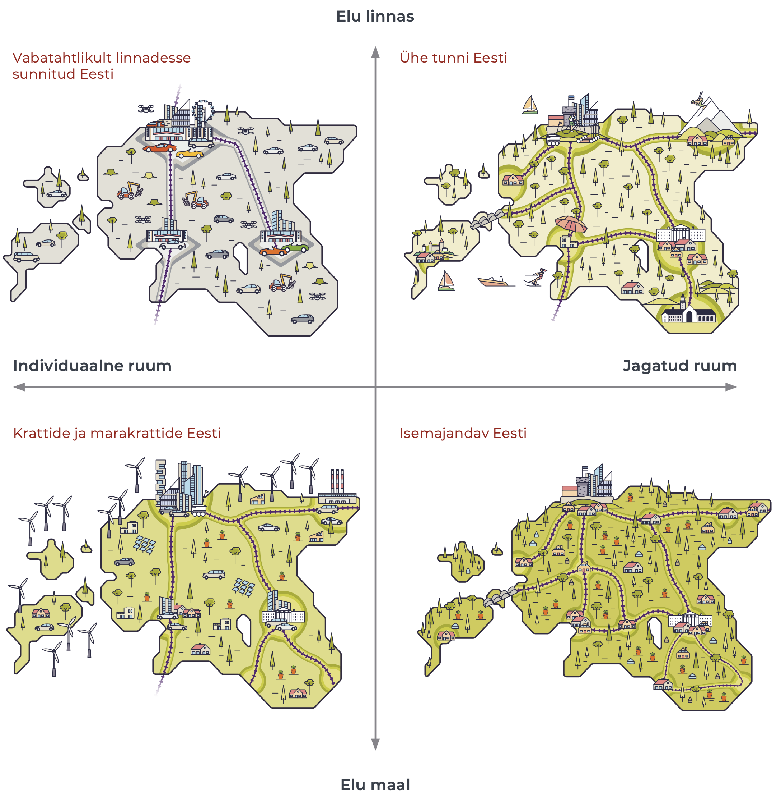

```

``` {block, type='imgsource'}
<span class="imgsource-source">Allikas:</span> Autori joonis.
```

<!--chapter:end:05.1-chapter.Rmd-->


## Vabatahtlikult linnadesse sunnitud Eesti {-.chapter_section .chapter5_section .future_section}

<div class="map-icon">
```{r, out.width='100%', fig.align='center', echo=FALSE, message=FALSE}
knitr::include_graphics("../figures/5-chapter/linnades.png")
```
</div>


<div><a class="print-btn" href="print/EIA-2019-5.1-Vabatahtlikult-linnadesse.pdf"><i class="fa fa-file" aria-hidden="true"></i>Trükiversioon</a></div>

```{r, out.width='100%', fig.align='center', echo=FALSE, message=FALSE}

knitr::include_graphics("../figures/5-chapter/kaart-1.png")

```

<table class="future-table">
<tbody>

<tr>
<td align="left" class="future-table-black">Rahvastik linnades:</td>
<td align="right" class="future-table-red">80%</td>
</tr>

<tr>
<td align="left" class="future-table-black">Varanduslik kihistumine:</td>
<td align="right" class="future-table-red">suur</td>
</tr>

<tr>
<td align="left" class="future-table-black">Ruumiline ebavõrdsus:</td>
<td align="right" class="future-table-red">suur</td>
</tr>

<tr>
<td align="left" class="future-table-black">Hea avalik ruum:</td>
<td align="right" class="future-table-red">privilegeeritutele</td>
</tr>

<tr>
<td align="left" class="future-table-black">Andmed:</td>
<td align="right" class="future-table-red">suurettevõtetel „kõikenägev silm“, õigused ebavõrdselt jaotunud</td>
</tr>

<tr>
<td align="left" class="future-table-black">Ühiskonna kulutused baastaristule:</td>
<td align="right" class="future-table-red">suured ja kasvavad</td>
</tr>

<tr>
<td align="left" class="future-table-black">Sotsiaal-majanduslik efektiivsus:</td>
<td align="right" class="future-table-red">vähene</td>
</tr>

<tr>
<td align="left" class="future-table-black">Säästva arengu eesmärgid:</td>
<td align="right" class="future-table-red">ei ole saavutatud, kuigi mõni valdkond on teistest tugevam</td>
</tr>
</tbody></table>


„Nähtamatu käe“ juhtimisel on eestlased ja ka üsna paljud uuseestlased kogunenud Tallinna, Tartu ja Pärnu linnaregiooni – hoogne elamuarendus on haaranud linnalähedased põllud, kuid ajaloolised linnad ise ei ole samas tempos kasvanud. Puuduvate kesklinnade asemel saadakse kokku kauba- ja meelelahutuskeskustes. Linnaväljakute asemel vajatakse parklaid ja laiu teid, sest tavaline eestlane ei taha näha vaeseid ja võõraid. Pealegi on tänaval ohtlik. Regioonid on tugevalt kihistunud: jõukam rahvas elab heade koolide, tenniseklubide ja kaunite rohealade piirkonnas, mille ümber on aed ja valvurid. Linnad ise on rõhuvas osas vaeste ja uussisserändajate elukorterite päralt, äärelinnades on kehvad koolid, kehvad ühendused ja ohtlik õhtuti väljas käia. Tallinn ja Pärnu on hästi maailmaga ühendatud – Helsingi tunnel ja Rail Baltica loovad hea ühenduse neile, kes selle eest maksta jaksavad. Ent Tartussegi saab kiirelt rongiga või isikliku droonikapsliga. Inimestel ei ole märkimisväärset ühistunnet, pigem õigustatakse rikkust tubliduse ja vaesust laiskusega. Nende n-ö laisemate andmed on igaühele müügiks, peenem rahvas maksab teatava privaatsuse eest suurettevõtetele lunaraha. Ühiskonda vaevavad elustiilihaigused ja kuivõrd puudub toetav küünarnukitunne, siis tunneb suurem osa eestimaalasi end üksikuna. SKP asemel ühiskonna edukuse peamiseks mõõdupuuks saanud õnneindeksis on Eestis mitu aastat järjest kukkunud ning langemist ei pidurda ka suuremat ühtsust taotlevad kampaaniad.

<div class="future-illustration">
```{r, out.width='100%', fig.align='center', echo=FALSE, message=FALSE}

knitr::include_graphics("../figures/5-chapter/tulevik-1.png")

```
</div>

<!--chapter:end:05.11-scenario1.Rmd-->

## Ühe tunni Eesti {-.chapter_section .chapter5_section .future_section}

<div class="map-icon">
```{r, out.width='100%', fig.align='center', echo=FALSE, message=FALSE}
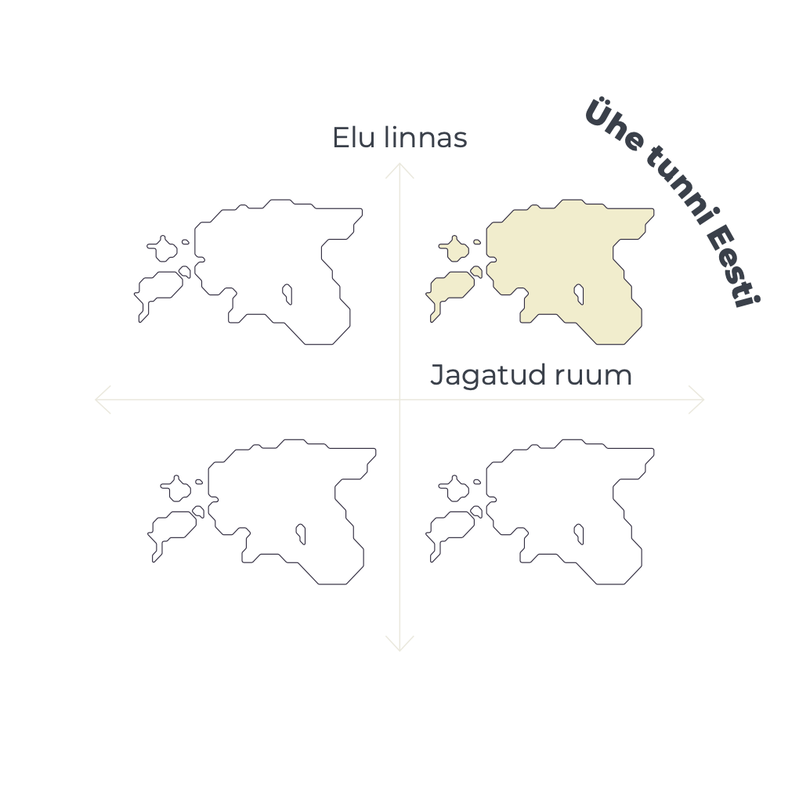
```
</div>

<div><a class="print-btn" href="print/EIA-2019-5.1-UhetunniEesti.pdf"><i class="fa fa-file" aria-hidden="true"></i>Trükiversioon</a></div>

```{r, out.width='100%', fig.align='center', echo=FALSE, message=FALSE}

knitr::include_graphics("../figures/5-chapter/kaart-2.png")

```

<table class="future-table">
<tbody>

<tr>
<td align="left" class="future-table-black">Rahvastik linnades:</td>
<td align="right" class="future-table-red">80%</td>
</tr>

<tr>
<td align="left" class="future-table-black">Varanduslik kihistumine:</td>
<td align="right" class="future-table-red">väike</td>
</tr>

<tr>
<td align="left" class="future-table-black">Ruumiline ebavõrdsus:</td>
<td align="right" class="future-table-red">väike</td>
</tr>

<tr>
<td align="left" class="future-table-black">Hea avalik ruum:</td>
<td align="right" class="future-table-red">jagatud ja ligipääs tagatud</td>
</tr>

<tr>
<td align="left" class="future-table-black">Andmed:</td>
<td align="right" class="future-table-red">igaühe omad, õigused on kaitstud</td>
</tr>

<tr>
<td align="left" class="future-table-black">Ühiskonna kulutused baastaristule:</td>
<td align="right" class="future-table-red">suured, aga võrdsemalt jagatud</td>
</tr>

<tr>
<td align="left" class="future-table-black">Sotsiaal-majanduslik efektiivsus:</td>
<td align="right" class="future-table-red">keskmisest suurem</td>
</tr>

<tr>
<td align="left" class="future-table-black">Säästva arengu eesmärgid:</td>
<td align="right" class="future-table-red">oleme maailmas eeskujuks</td>
</tr>
</tbody></table>

Põhjaliku regionaalse planeerimise tulemusena on terves Eestis elamuarendus ja liikuvusteenused omavahel seotud, mistõttu on esmajärgus ehitatud rongiühendusega kohtadesse. Arendajatele tundus see alguses liiga piirav, aga inimesed on rahul ega igatse sõltuvust isiklikust sõidukist. Igal linnaregioonil on oma nägu ja keskused, mis töötavad ringmajanduse põhimõttel. Uue ärkamise on läbi teinud kunagine murelaps Ida-Virumaa, mis on esmalt kunstnike ja seejärel idusektori sinna kolimise tulemusena nüüd Eesti atraktiivsemaid ja kosmopoliitsemaid elupiirkondi, kus on teine kodu nii Peterburi, Eesti kui ka teiste maade loovinimestel. Eestimaalastele meeldib aega veeta parkides ja linnaväljakutel, kuhu nad liiguvad parajasti sobivaima liiklusvahendiga – trammiga, isejuhtiva kapsliga, vesinikrattaga või kõiki neid kombineerides. Linnades on elamuslik tänava- ja katkematu rohevõrgustik, mis aitab kliimakriisiga kohaneda, ning avalikus ruumis toimub palju möödujate tähelepanu paeluvaid tegevusi. Rakendatud on nn 8-80-põhimõte, mis tähendab, et nii 8- kui ka 80-aastased saavad avalikus ruumis kõrvalise abita liikuda. Räägitakse palju vaimse tervise hoidmisest ja ollakse tähelepanelikud, kui lähedasel inimesel võivad rasked ajad olla. Inimesed on kogukondlikult pühendunud mõnele varem avalikule võimule kuulunud tööle: aidatakse kõige nooremaid ja kõige vanemaid, rajatakse ühisaedu, kujundatakse tänavaid ja hoove. Suuremates linnades läheb uussisserändajatel sisseelamine üsna ladusalt, ehkki väiksemates kohtades võidakse neile ikka viltu vaadata. Õnneindeksis on Eesti suhteliselt eesotsas ja viimased paar aastat isegi tõusnud.

<div class="future-illustration">
```{r, out.width='100%', fig.align='center', echo=FALSE, message=FALSE}


```
</div>

<!--chapter:end:05.12-scenario2.Rmd-->

## Krattide ja Marakrattide Eesti {-.chapter_section .chapter5_section .future_section}

<div class="map-icon">
```{r, out.width='100%', fig.align='center', echo=FALSE, message=FALSE}
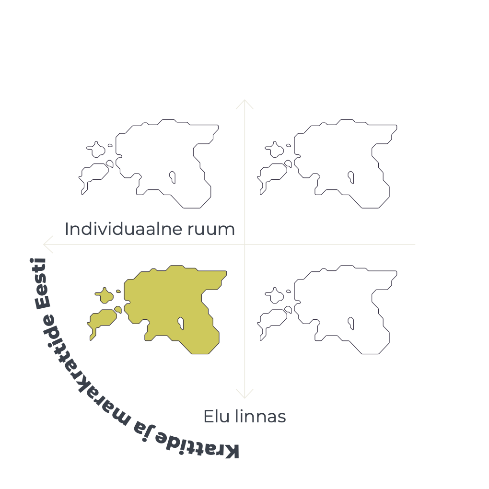
```
</div>

<div><a class="print-btn" href="print/EIA-2019-5.1-Kratid.pdf"><i class="fa fa-file" aria-hidden="true"></i>Trükiversioon</a></div>

```{r, out.width='100%', fig.align='center', echo=FALSE, message=FALSE}

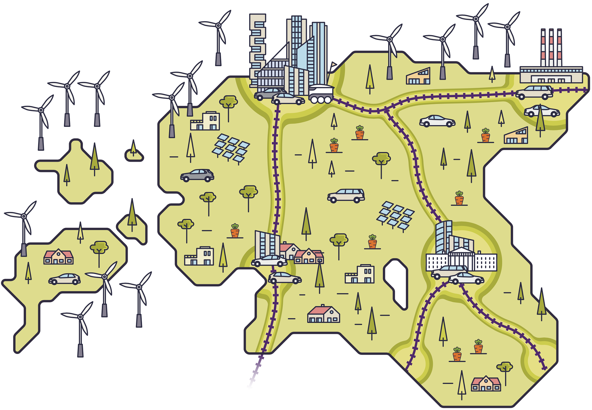

```

<table class="future-table">
<tbody>

<tr>
<td align="left" class="future-table-black">Rahvastik linnades:</td>
<td align="right" class="future-table-red">70%</td>
</tr>

<tr>
<td align="left" class="future-table-black">Varanduslik kihistumine:</td>
<td align="right" class="future-table-red">suur</td>
</tr>

<tr>
<td align="left" class="future-table-black">Ruumiline ebavõrdsus:</td>
<td align="right" class="future-table-red">väga suur</td>
</tr>

<tr>
<td align="left" class="future-table-black">Hea avalik ruum:</td>
<td align="right" class="future-table-red">privilegeeritud, jagatud või olematu, vastavalt kohaliku omavalitsuse võimetele</td>
</tr>

<tr>
<td align="left" class="future-table-black">Andmed:</td>
<td align="right" class="future-table-red">koondunud suurte ettevõtete kätte, aga suur küberkuritegevus</td>
</tr>

<tr>
<td align="left" class="future-table-black">Ühiskonna kulutused baastaristule:</td>
<td align="right" class="future-table-red">suured ja ebavõrdselt jaotatud</td>
</tr>

<tr>
<td align="left" class="future-table-black">Sotsiaal-majanduslik efektiivsus:</td>
<td align="right" class="future-table-red">väga vähene</td>
</tr>

<tr>
<td align="left" class="future-table-black">Säästva arengu eesmärgid:</td>
<td align="right" class="future-table-red">mõni väiksem omavalitsus on suutnud täita, tervikuna pilt kehv</td>
</tr>
</tbody></table>

Eestis on erinevad suured ja väiksemad keskused, millest võimekamad püüavad leida oma nägu – kes püüab tähelepanu kõrgtehnoloogilisi lahendusi pakkudes, kes meelitab enda juurde aina rohkem vanemaid inimesi, kes tegeleb digiteeritud agrotootmisega. Samal ajal on ka üpris mahajäänud kante, kus peamine tööandja on pankrotti läinud ja abi pole kuskilt näha. Seal jäävad silma vaid suurettevõtetele kuuluvad tuulikud ja päikesepaneelid, aga neid käitavad spetsialistid ei ole kohaliku rahva seast. Uussisserändajad on jagunenud üle terve riigi ja just väiksemates kohtades leidub neid rohkem – seal on rohkem pakkumist väga väikse palgaga töödele, mida kohalikud ise taha või ei jaksa teha – samal ajal vajavad aina vananevad asulad eriti just sotsiaaltöötaja abi. Eriti halb lugu on sõltuvushaiguste ja HIVga, mida peetakse igaühe oma veaks. Paljud varakamad inimesed elavad hajali, sest kliimakriis on isu linnades elada kustutanud: armastatakse öelda, et õige eestlane elab ikka oma aia ja põllulapiga majas. Kogukondlikku lähenemist harrastavad „hipid“, nii-öelda korralik inimene üritab aga ikka naabrist parem olla. Tänu hajusale asustusele pole avaliku ruumi kvaliteet suurem asi, pigem eelistatakse raha maanteedesse panna. Need on erineva kvaliteediga, kunagiste ambitsioonikate taristuprojektide ebaõnnestumisest on õpitud, et pole mõtet liiga suurelt üritadagi. Isejuhtivate autode ja transpordidroonide pakkujaid on erinevaid, nii et peenemale rahvale on saadaval hea teenus, vaesem rahvas aga vaatab, kuidas saab – päris tihti saab vastu näppe. Õnneindeksis on Eesti keskpärane järelelohiseja.

<div class="future-illustration">
```{r, out.width='100%', fig.align='center', echo=FALSE, message=FALSE}


```
</div>

<!--chapter:end:05.13-scenario3.Rmd-->

## Isemajandav Eesti {-.chapter_section .chapter5_section .future_section}

<div class="map-icon">
```{r, out.width='100%', fig.align='center', echo=FALSE, message=FALSE}
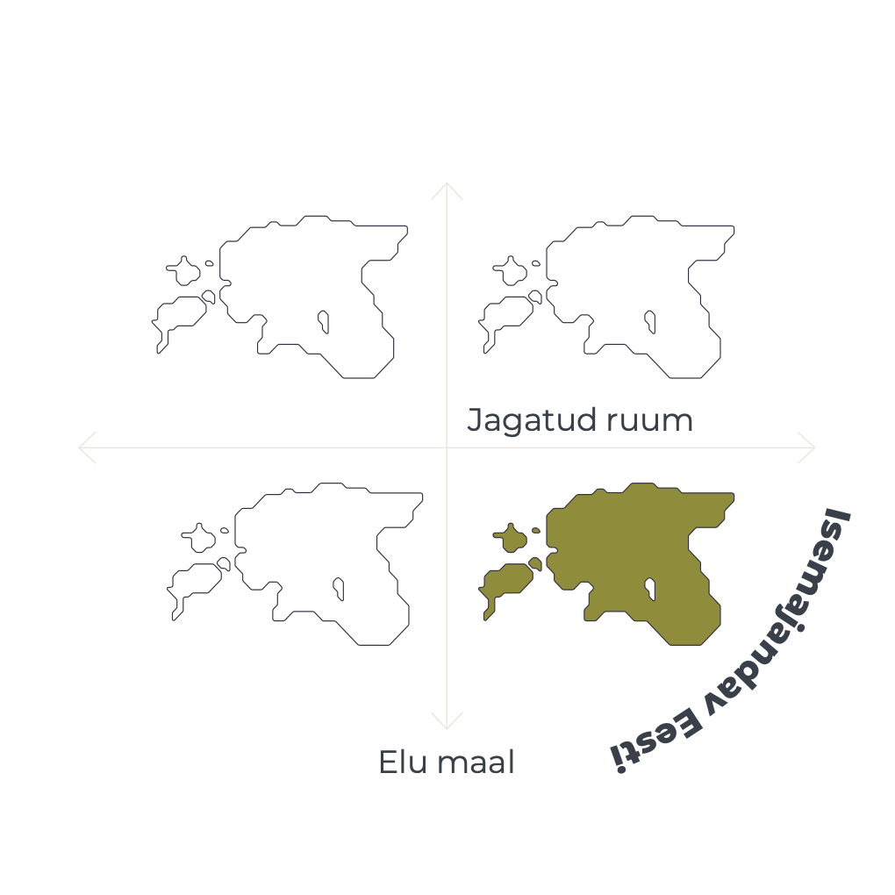
```
</div>

<div><a class="print-btn" href="print/EIA-2019-5.1-Isemajandav.pdf"><i class="fa fa-file" aria-hidden="true"></i>Trükiversioon</a></div>

```{r, out.width='100%', fig.align='center', echo=FALSE, message=FALSE}

knitr::include_graphics("../figures/5-chapter/kaart-4.png")

```

<table class="future-table">
<tbody>

<tr>
<td align="left" class="future-table-black">Rahvastik linnades:</td>
<td align="right" class="future-table-red">60%</td>
</tr>

<tr>
<td align="left" class="future-table-black">Varanduslik kihistumine:</td>
<td align="right" class="future-table-red">väike, aga ühiskond pole kuigi rikas</td>
</tr>

<tr>
<td align="left" class="future-table-black">Ruumiline ebavõrdsus:</td>
<td align="right" class="future-table-red">esineb paikkonniti</td>
</tr>

<tr>
<td align="left" class="future-table-black">Hea avalik ruum:</td>
<td align="right" class="future-table-red">võimas rohevõrgustik, aga vähem linnalist keskkonda</td>
</tr>

<tr>
<td align="left" class="future-table-black">Andmed:</td>
<td align="right" class="future-table-red">igaühe omad, tugevad küberkogukonnad</td>
</tr>

<tr>
<td align="left" class="future-table-black">Ühiskonna kulutused baastaristule:</td>
<td align="right" class="future-table-red">suured, aga võrdsemalt jagatud</td>
</tr>

<tr>
<td align="left" class="future-table-black">Sotsiaal-majanduslik efektiivsus:</td>
<td align="right" class="future-table-red">keskmisest väiksem, aga võrdselt jagatud</td>
</tr>

<tr>
<td align="left" class="future-table-black">Säästva arengu eesmärgid:</td>
<td align="right" class="future-table-red">oleme teistest veidi ees</td>
</tr>
</tbody></table>

Kliimakatastroofi, kaugtöövõimaluste ja uuskogukondliku majanduse tulemusena on suur osa eestlasi kolinud maale, mõne väiksema tõmbekeskuse lähedale. Vajadusi teenuste järele rahuldavad nii digitaalsed lahendused kui ka korralik talgukultuur ja naturaalmajandus – inimesed aitavad üksteist pidevalt, kuigi ka pisut sunnitult, sest väike riik ei suuda nii hajali elavatele inimestele kõike vajalikku tagada. Omajagu sõltub toimetulek ja teenuste kvaliteet ka kogukonna võimekusest: kus on häid eestvedajaid, seal elu edeneb, kuid kahjuks esineb ka vastupidist. Peale järelelonkijate on ka teisitimõtlejaid, kes peavad muud rahvast väärituks. Uussisserändajaid on kõikjal, eriti kogukondades, kes on uute tulijate kasulikkusest aru saanud. Neist peetakse väga lugu, sest nad panevad õla alla seal, kus meil omal jõudu napib. Sotsiaal-majanduslikult on suur rõhk omakasvatatud toidul, oma 3D-prinditud asjadel ja ühistulisel energiatootmisel. Just nagu kunagistes taludes, tehakse päris palju ära ise ja pereringis. Terve Eesti on ühendatud raudteevõrguga, mis on üsna hästi seotud ka mitmesuguste „viimase kilomeetri“ lahendustega, mille seast saab valida sobiva ja taskukohase liikumisviisi. Avalik ruum on pigem looduslik keskkond ja looduses aktiivselt liikumisest on saanud eestluse lahutamatu osa. Eesti on Euroopas kuulus oma elujõuliste metsade ja puhaste randade poolest. Õnneindeksis on Eesti tubli, tõusis hiljuti mitu kohta, aga nüüd paistab, et klaaslagi on ees. Tühja neist indeksitest, elu on ju mõnus, mõtlevad eestimaalased omakeskis, ning panevad suitsusauna küdema.

<div class="future-illustration">
```{r, out.width='100%', fig.align='center', echo=FALSE, message=FALSE}

knitr::include_graphics("../figures/5-chapter/tulevik-4.png")

```
</div>

<!--chapter:end:05.14-scenario4.Rmd-->

# Autorid ja toimetajad {.chapter6 .chapter6_section .chapter_section}

<div><a class="print-btn" href="../print/EIA-2019-6-Autorid.pdf"><i class="fa fa-file" aria-hidden="true"></i>Trükiversioon</a></div>


### Peatoimetaja {-.chapter6_section}

<div class="author-container" id="helen-sooväli-sepping">

<div class="author-img-container">
```{r, out.width='50%', fig.align='left'}
knitr::include_graphics('../figures/6-authors/HelenSoovali-Sepping.png')
```
</div>

<div>
#### Helen Sooväli-Sepping {-.head-editor-name}
on Tallinna Ülikooli jätkusuutliku arengu prorektor, keskkonnakorralduse professor ja kultuurigeograafia vanemteadur. Ta vastutab TLÜs keskkonnakorralduse ja linnakorralduse magistriõppekava eest. Tema põhilised uurimisteemad käsitlevad ruumi- ja maastikuplaneerimist. Praegu huvitavad teda kõige enam kultuuri ja kogukondlikkuse aspektid, samuti säästva arengu ja säilenõtkuse teemad nii linna- kui ka maapiirkonnas, keskkonnapoliitika ning kodanikuteadus.

</div>
</div>

### Peatükkide toimetajad {-.chapter6_section}

<div class="author-container" id="kristi-grišakov">

<div class="author-img-container">
```{r, out.width='50%', fig.align='left'}
knitr::include_graphics('../figures/6-authors/KristiGrisakov.png')
```
</div>

<div>
#### Kristi Grišakov {-.editor-name}
on Tallinna Tehnikaülikooli arhitektuuri ja urbanistika akadeemia lektor ja maastikuarhitektuuri õppekavade programmijuht. Tema uurimistöö keskendub prognooside ja stsenaariumide kasutusvõimalustele ruumianalüüsis ja tulevikuvisioonide koostamisel. Süvitsi on ta uurinud piiriüleste linnade (Tallinn-Helsingi) temaatikat, Euroopa Liidu ruumipoliitikat, sealhulgas suurte taristuprojektide mõju kohalikule keskkonnale ja uute tehnoloogiate mõju linnakeskkonnale.

</div>
</div>


<div class="author-container" id="indrek-ibrus">
<div class="author-img-container">
```{r, out.width='50%', fig.align='left'}
knitr::include_graphics('../figures/6-authors/IndrekIbrus.png')
```
</div>

<div>
#### Indrek Ibrus {-.editor-name}
on Tallinna Ülikooli Balti filmi, meedia, kunstide ja kommunikatsiooni instituudi (BFM) meediainnovatsiooni professor ning TLÜ meediainnovatsiooni ja digikultuuri tippkeskuse juhataja. Ta juhib TLÜs ka audiovisuaalkunstide ja meediauuringute doktoriõppekava. Tema peamised uurimisteemad on meedia innovatsioon ja digikultuur seotuna majandusteaduslike innovatsiooniuuringute ning mitmesuguste kultuuri uurimise meetodite ja lähenemistega.

</div>
</div>


<div class="author-container" class="epp-lankots">
<div class="author-img-container">
```{r, out.width='50%', fig.align='left'}
knitr::include_graphics('../figures/6-authors/EppLankots.png')
```
</div>

<div>
#### Epp Lankots {-.editor-name}
on Eesti Kunstiakadeemia teadusprorektor ning kunstiteaduse ja visuaalkultuuri instituudi vanemteadur. Tema uurimisteemad on 20. sajandi arhitektuur ja elukeskkond, Nõukogude uuringud, ruumi- ja materiaalse kultuuri teooriad, 20. sajandi arhitektuurihistoriograafia ja kunstiajalookirjutus. 2015. aastal sai ta Eesti Kultuurkapitali arhitektuuri sihtkapitali tegevuspreemia arhitektuurialase teadustöö eest.

</div>
</div>


<div class="author-container" id="kadri-leetmaa">
<div class="author-img-container">
```{r, out.width='50%', fig.align='left'}
knitr::include_graphics('../figures/6-authors/KadriLeetmaa.png')
```
</div>

<div>
#### Kadri Leetmaa {-.editor-name}
on Tartu Ülikooli ökoloogia ja maateaduste instituudi inimgeograafia vanemteadur ning TÜ rände- ja linnauuringute keskuse juhataja. Tema uurimisteemad on ränne ja ebavõrdsus ruumis, inimeste elukohaeelistused linnades, rahvustevahelised kontaktid ühiskonnas ja ruumis, linna- ja regionaalplaneerimine. Alates 2017. aastast on ta Euroopa Liidu koostööprogrammi URBACT Eesti esindaja.

</div>
</div>


<div class="author-container" id="asko-lõhmus">
<div class="author-img-container">
```{r, out.width='50%', fig.align='left'}
knitr::include_graphics('../figures/6-authors/AskoLohmus.png')
```
</div>

<div>
#### Asko Lõhmus {-.editor-name}
on loomaökoloog, Tartu Ülikooli juhtivteadur ja loodusressursside õppetooli juhataja. Tema teadustöö on aastakümnetega laienenud elurikkuse säilitamise ja säästva arengu laiale teemavaldkonnale, eriti looduslike ökosüsteemide säästlikule majandamisele. Ta on osalenud eksperdina paljudes riiklikes planeerimisprotsessides ning tema huvialade hulka kuulub ka säästva arengu juhtimine, muu hulgas kodanikuühiskonna kaudu.

</div>
</div>

### Autorid {-.chapter6_section}

<div class="author-container" id="dago-antov">
<div class="author-img-container">
```{r, out.width='50%', fig.align='left'}
knitr::include_graphics('../figures/6-authors/DagoAntov.png')
```
</div>

<div>
#### Dago Antov {-.author-name}
on Tallinna Tehnikaülikooli transpordiplaneerimise professor ning transpordi ja logistika teaduskeskuse juht. Tema peamised uurimisteemad on liikuvus, liikumisviiside lõimivus, liiklusvõrkude analüüs ja liikluse mõjud, eelkõige liiklemise ohutus. Ta on avaldanud enam kui 40 teadusartiklit ja juhendanud ligi 50 doktori- ja magistritööd. Ta on õpetanud liikuvusega seonduvaid kursusi TTÜs, Eesti Kunstiakadeemias, Sisekaitseakadeemias, Tartu Ülikoolis ja mujal.

</div>
</div>

<div class="author-container" id="mihkel-kaevats">
<div class="author-img-container">
```{r, out.width='50%', fig.align='left'}
knitr::include_graphics('../figures/6-authors/MihkelKaevats.png')
```
</div>

<div>
#### Mihkel Kaevats {-.author-name}
on luuletaja, kriitik, TLÜ doktorant ja kodanikuaktivist, kes on praegu Tallinn 2021+ strateegia üks koostajatest. Ta oli üks Prussakovi nimelise rattaühingu (1997–2009) ja Uue Maailma Seltsi (2006–2013) eestvedajatest. Kirgliku jalgratturi ja jalutajana jälgib ta pidevalt ruumi ning seda kasutavaid inimesi. Tema osalusel valmiva Tallinna strateegia keskmes on hea avalik ruum ja arenguhüpe liikuvuses.

</div>
</div>

<div class="author-container" id="veronika-kalmus">
<div class="author-img-container">
```{r, out.width='50%', fig.align='left'}
knitr::include_graphics('../figures/6-authors/VeronikaKalmus.png')
```
</div>

<div>
#### Veronika Kalmus {-.author-name}
on Tartu Ülikooli sotsioloogia professor. Tema uurimishuvid on seotud põlvkondade, sotsialiseerumise, hariduse, väärtuste, noorte kodanikuosaluse, meedia- ja ajakasutuse ning ühiskondlike muutuste, sealhulgas sotsiaalse aja kiirenemisega. Rahvusvahelise teadlasvõrgustiku EU Kids Online aktiivse liikmena ja Eesti töörühma juhina keskendub ta laste ja noorte internetikasutusele ning selle sotsiaalsele vahendamisele. 2008. aastal pälvis ta Vabariigi Presidendi Kultuurirahastu noore teadlase preemia.

</div>
</div>

<div class="author-container" id="raul-kalvo">
<div class="author-img-container">
```{r, out.width='50%', fig.align='left'}
knitr::include_graphics('../figures/6-authors/RaulKalvo.png')
```
</div>

<div>
#### Raul Kalvo {-.author-name}
on arhitekt, ettevõtte Inphysica Technology asutaja, Eesti Kunstiakadeemia digitaalse geomeetria õppejõud. Tema peamine huvi on ruumiliste andmetega seotud otsuste tegemine ning sellest lähtuv tarkvaraarendus. Levinuim neist on Urban Network Analysis toolbox for Rhino. Ta on seotud mitme liikuvusuuringu ja strateegiaprojektiga Eestis ning keskkonna tervisemõjude hindamisega Soomes. Lisaks teadustööle tegeleb ta projektidega sisearhitektuurist linnaehituseni.

</div>
</div>

<div class="author-container" id="elo-kiivet">
<div class="author-img-container">
```{r, out.width='50%', fig.align='left'}
knitr::include_graphics('../figures/6-authors/EloKiivet.png')
```
</div>

<div>
#### Elo Kiivet {-.author-name}
on arhitekt ja urbanist, Linnalabori juhatuse liige, Paide linnaarhitekt ning neljandat aastat arvamusfestivali välialade ja linnaruumi kujunduse kuraator. Tema peamised huvid on avalik ruum, kohaloome ja ruumiharidus. Õpetanud Tallinna Tehnikakõrgkoolis, Tallinna Ülikoolis ja Eesti Kunstiakadeemias ning Arhitektuurikoolis ja Tallinna Kunstigümnaasiumis.

</div>
</div>

<div class="author-container" id="keiti-kljavin">
<div class="author-img-container">
```{r, out.width='50%', fig.align='left'}
knitr::include_graphics('../figures/6-authors/KeitiKljavin.png')
```
</div>

<div>
#### Keiti Kljavin {-.author-name}
on urbanist, Linnalabori juhatuse liige ja urbanistide väljaande U toimetaja. Praegu juhendab ta Eesti Kunstiakadeemia arhitektuuri ja linnaplaneerimise osakonnas urbanistika ja sisearhitektuuri magistrante nende lõputöödes ja erialastuudiotes.

</div>
</div>

<div class="author-container" id="kaija-luisa-kurik">
<div class="author-img-container">
```{r, out.width='50%', fig.align='left'}
knitr::include_graphics('../figures/6-authors/Kaija-LuisaKurik.png')
```
</div>

<div>
#### Kaija-Luisa Kurik {-.author-name}
on Manchesteri arhitektuuriülikooli doktorant ning Heritage Action Zone’i regeneratsiooniprojekti projektijuht Rochdale’is. Tema peamised uurimisteemad on linnade regeneratsioon, postsotsialistlik linnaruum ning planeerimispraktika muutused.

</div>
</div>

<div class="author-container" id="ragne-kõuts-klemm">
<div class="author-img-container">
```{r, out.width='50%', fig.align='left'}
knitr::include_graphics('../figures/6-authors/RagneKouts-Klemm.png')
```
</div>

<div>
#### Ragne Kõuts-Klemm {-.author-name}
on Tartu Ülikooli ajakirjandussotsioloogia dotsent ja ühiskonnateaduste instituudi asejuhataja. Tema teadustöö valdkonnad on keskendunud meediakasutusele ja ühiskonna muutumisele, laiemalt on teda huvitanud meedia roll ühiskondliku sidususe tekkes. Praeguseks on tema teemade hulka lisandunud ka ajakirjanduses toimunud muutuste analüüs ja tõlgendamine.

</div>
</div>

<div class="author-container" id="anneli-kährik">
<div class="author-img-container">
```{r, out.width='50%', fig.align='left'}
knitr::include_graphics('../figures/6-authors/AnneliKahrik.png')
```
</div>

<div>
#### Anneli Kährik {-.author-name}
on Tartu Ülikooli linnageograafia vanemteadur. Tema peamised uurimisteemad on ränne, segregatsioon, linna- ja eluasemepoliitika. Praegu keskendub tema uurimistöö peamiselt segregatsiooni ja lõimumise seostele eri eluvaldkondades (pere, elukoht, kool, töö), mida ta uurib Eesti ja Soome suurte riigiandmete (loendused, registrid) alusel. 2013–2016 töötas ta teadurina Uppsala ülikoolis, uurides segregatsiooni Rootsis. Ta on avaldanud artikleid kõrgetasemelistes erialaajakirjades.

</div>
</div>

<div class="author-container" id="mait-lang">
<div class="author-img-container">
```{r, out.width='50%', fig.align='left'}
knitr::include_graphics('../figures/6-authors/MaitLang.png')
```
</div>

<div>
#### Mait Lang {-.author-name}
on Tartu Ülikooli Tartu Observatooriumi vanemteadur ja Eesti Maaülikooli metsandus- ja maaehitusinstituudi dotsent. Tema peamised uurimisteemad on seotud looduse kaugseirega ning ruumi- ja kaugseireandmete töötlemisega.

</div>
</div>

<div class="author-container" id="bradley-loewen">
<div class="author-img-container">
```{r, out.width='50%', fig.align='left'}
knitr::include_graphics('../figures/6-authors/BradleyLoewen.png')
```
</div>

<div>
#### Bradley Loewen {-.author-name}
on kaitsnud doktorikraadi Tartu Ülikooli majandusteaduskonnas ning oli Marie Curie innovaatilise koolituse võrgustiku RegPol 2 karjääri alustav teadlane Tšehhis, Ungaris ja Eestis. Ta on Norra teadus- ja tehnikaülikooli NTNU säästva ehituse teadur ning töötanud Briti Columbia ja Toronto ülikoolis. Tema uurimisteemad hõlmavad Euroopa linna- ja regionaalplaneerimist ning poliitikat, institutsioone, valitsemist ja innovatsiooni.

</div>
</div>

<div class="author-container" id="mari-liis-madisson">
<div class="author-img-container">
```{r, out.width='50%', fig.align='left'}
knitr::include_graphics('../figures/6-authors/Mari-LiisMadisson.png')
```
</div>

<div>
#### Mari-Liis Madisson {-.author-name}
on Tartu Ülikooli semiootika teadur, kelle peamised uurimisteemad on identiteediloome, strateegilised narratiivid ja veebikeskkondades leviv desinformatsioon. Ta on teinud koostööd Kaitseväe Ühendatud Õppeasutustega ning osalenud sõjalist kommunikatiivset pettetegevust käsitlevates uurimisprojektides. 2019 alustas ta Belfasti Queen’si ülikoolis järeldoktorantuuri, mis on pühendatud strateegiliste vandenõunarratiivide semiootilisele uurimisele.

</div>
</div>

<div class="author-container" id="tõnu-oja">
<div class="author-img-container">
```{r, out.width='50%', fig.align='left'}
knitr::include_graphics('../figures/6-authors/TonuOja.png')
```
</div>

<div>
#### Tõnu Oja {-.author-name}
on Tartu Ülikooli geoinformaatika ja kartograafia õppetooli juhataja ning professor. Tema peamised uurimisvaldkonnad on maastikuökoloogia ja säästlik areng.

</div>
</div>

<div class="author-container" id="arko-olesk">
<div class="author-img-container">
```{r, out.width='50%', fig.align='left'}
knitr::include_graphics('../figures/6-authors/ArkoOlesk.png')
```
</div>

<div>
#### Arko Olesk {-.author-name}
on teadusajakirjanik ja Tallinna Ülikooli Balti filmi, meedia, kunstide ja kommunikatsiooni instituudi teaduskommunikatsiooni lektor. Tema keskne uurimisteema on teadlaste suhtlus ajakirjandusega, samuti tunneb ta huvi innovatsiooni- ja keskkonnakommunikatsiooni vastu. Ta juhib Raadio 2s populaarteaduslikku saadet „Puust ja punaseks“.

</div>
</div>

<div class="author-container" id="hans-orru">
<div class="author-img-container">
```{r, out.width='50%', fig.align='left'}
knitr::include_graphics('../figures/6-authors/HansOrru.png')
```
</div>

<div>
#### Hans Orru {-.author-name}
on Tartu Ülikooli keskkonnatervishoiu dotsent ning Umea ülikooli külalisteadur. Tema peamised uurimisvaldkonnad on väliskeskkonna mõju inimeste tervisele. Selle raames on ta keskendunud õhusaastele ja kliimamuutustele, kuid viimasel ajal ka põlevkivisektorile, siseõhusaastele ja müra tervisemõjudele. Viimase 15 aasta jooksul on ta osalenud enam kui 30 teadus- või rakendusuuringus, millel on olnud oluline mõju keskkonna tervisemõjude teadvustamisele ühiskonnas.

</div>
</div>

<div class="author-container" id="kati-orru">
<div class="author-img-container">
```{r, out.width='50%', fig.align='left'}
knitr::include_graphics('../figures/6-authors/KatiOrru.png')
```
</div>

<div>
#### Kati Orru {-.author-name}
on kestlikkuse sotsioloogia vanemteadur Tartu Ülikooli ühiskonnateaduste instituudis ja külalisteadur King’s College Londonis. Tema uurimisvaldkonnad on sotsiaalne ja piirkondlik ebavõrdsus transpordi- ja energiatarbimises ning selle keskkonnamõjud, planeeringute sotsiaalsete mõjude hindamise metoodika, sotsiotehniliste süsteemide jätkusuutlik areng. Ta juhib tööpakki H2020 BuildERS projektis kogukondade kerksusest hädaolukordades. Ta on olnud järeldoktorantuuris Umea ülikooli keskkonna- ja tervisepsühholoogia uurimisrühmas.

</div>
</div>

<div class="author-container" id="toomas-paaver">
<div class="author-img-container">
```{r, out.width='50%', fig.align='left'}
knitr::include_graphics('../figures/6-authors/ToomasPaaver.png')
```
</div>

<div>
#### Toomas Paaver {-.author-name}
on Eesti Kunstiakadeemia arhitektuuri ja linnaplaneerimise eriala doktorant. Tema peamine uurimisteema on arhitekti töö ühiskondlik roll. Tema mitmekesine praktika ruumiloome valdkonnas hõlmab töid linna- ja riigiametnikuna, asumiseltsi aktivistina, arhitektina ja õpetajana. Tema töö on olnud seotud planeeringutega, tänavate ja hoonete ehitusprojektidega, lähteülesannetega, õigusloomega ning seoste loomisega ruumiloomeprotsessides.

</div>
</div>

<div class="author-container" id="ingmar-pastak">
<div class="author-img-container">
```{r, out.width='50%', fig.align='left'}
knitr::include_graphics('../figures/6-authors/IngmarPastak.png')
```
</div>

<div>
#### Ingmar Pastak {-.author-name}
on omandamas doktorikraadi geograafias ja töötab Tartu Ülikooli inimgeograafia nooremteadurina. Tema peamised uurimisteemad on sotsiaalruumiline ebavõrdsus, gentrifikatsioon nii rahvastikuprotsessi kui ka ettevõtluskeskkonna muutusena ning laiemalt linnaplaneerimine targa linna innovatsioonidest kaasamispraktikateni. Ta õpetab TÜ linnageograafia ja –planeerimisega seonduvaid kursusi.

</div>
</div>

<div class="author-container" id="johanna-pirrus">
<div class="author-img-container">
```{r, out.width='50%', fig.align='left'}
knitr::include_graphics('../figures/6-authors/JohannaPirrus.png')
```
</div>

<div>
#### Johanna Pirrus {-.author-name}
on Tartu Ülikooli geograafia osakonna inimgeograafia doktorant. Tema peamine uurimisteema on kaasav linnaplaneerimine ja –valitsemine. Tema praegune uurimistöö keskendub eelkõige paneelelamupiirkondade avaliku ja sotsiaalse ruumi küsimustele ning headele tavadele. Lisaks teadustööle tegeleb ta geograafia osakonnas õpetamise ja lõputööde juhendamisega.

</div>
</div>

<div class="author-container" id="bianka-plüschke-altof">
<div class="author-img-container">
```{r, out.width='50%', fig.align='left'}
knitr::include_graphics('../figures/6-authors/BiankaPluschke-Altof.png')
```
</div>

<div>
#### Bianka Plüschke-Altof {-.author-name}
on Tallinna Ülikooli keskkonnasotsioloogia teadur. Ta on õppinud ja töötanud Berliini Humboldti ülikoolis, Varssavi ülikoolis, Slovakkia tehnikaülikoolis ja Tartu Ülikoolis. Tema uurimistöö keskendub sotsiaal-ruumilisele ebavõrdsusele ning ruumi loomise praktikatele ja diskursustele. Doktoritöös uuris ta territoriaalse häbimärgistamise teemat Eesti maakohtade näitel. Lisaks uurib ta linnakeskkonna küsimusi TLÜ uurimisrühmas „Inimese ja looduse vastastikmõju linnastuvas maailmas“.

</div>
</div>

<div class="author-container" id="age-poom">
<div class="author-img-container">
```{r, out.width='50%', fig.align='left'}
knitr::include_graphics('../figures/6-authors/AgePoom.png')
```
</div>

<div>
#### Age Poom {-.author-name}
on Helsingi Ülikooli järeldoktorantuuri teadur ja Tartu Ülikooli keskkonnakaitse lektor. Ta tegeleb inimeste liikuvuse, tegevusruumi ja keskkonna vastastikusteseoste uurimisega, sealhulgas analüüsides rohealadega kokkupuudet ja keskkonnariskidele avatust. Talle pakub huvi säästva liikumise ja tarbimise ning targa ja jätkusuutliku linna temaatika. TÜ mobiilsuslabori liikmena tegeleb ta mobiilipõhiste ruumikasutusuuringute andmetaristu arendamise ja väliskoostööprojektidega.

</div>
</div>

<div class="author-container" id="renee-puussepp">
<div class="author-img-container">
```{r, out.width='50%', fig.align='left'}
knitr::include_graphics('../figures/6-authors/ReneePuusepp.png')
```
</div>

<div>
#### Renee Puusepp {-.author-name}
on arhitekt, ettevõtte Creatomus Solutions asutaja ja tegevjuht, Eesti Kunstiakadeemia vanemteadur. EKA arhitektuuriteaduskonnas täidab ta teadustöö juhi kohustusi. Oma varasemas uurimistöös keskendus ta eelkõige dünaamiliste simulatsioonide loomisele ja sidumisele arhitektuuri ja planeerimise vahendite ja meetoditega. Praegu juhib ta masskohandatavate tehasemajade uurimis- ja tootearendussuunda.

</div>
</div>

<div class="author-container" id="siim-raie">
<div class="author-img-container">
```{r, out.width='50%', fig.align='left'}
knitr::include_graphics('../figures/6-authors/SiimRaie.png')
```
</div>

<div>
#### Siim Raie {-.author-name}
on Muinsuskaitseameti peadirektor. Õppinud ärijuhtimist Estonian Business Schoolis ning muinsuskaitse ja konserveerimise eriala Eesti Kunstiakadeemias, kus jätkuvad ka doktoriõpingud. Tema uurimistöö teema on mälestise omanikud, nende identiteet ja motivatsioon. Varem on ta töötanud Vabariigi Presidendi Kantselei direktori ja Eesti Kaubandus-Tööstuskoja peadirektorina.

</div>
</div>

<div class="author-container" id="merlin-rehema">
<div class="author-img-container">
```{r, out.width='50%', fig.align='left'}
knitr::include_graphics('../figures/6-authors/MerlinRehema.png')
```
</div>

<div>
#### Merlin Rehema {-.author-name}
on Tallinna Ülikooli humanitaarteaduste instituudi kultuurigeograafia suuna doktorant ning Hendrikson &amp; Ko liikuvusspetsialist. Oma doktoritöös uurib ta jalgsi liikumist mõjutavaid füüsilisi ja ühiskondlikke tegureid ning nende võimalikke mõjutusmehhanisme. Peamised uurimishuvid ja töövaldkonnad on eri tasandite liikuvusuuringud ning säästva transpordi planeerimine liikuvuskavade ja linnaruumi muutuste kaudu.

</div>
</div>

<div class="author-container" id="liina-remm">
<div class="author-img-container">
```{r, out.width='50%', fig.align='left'}
knitr::include_graphics('../figures/6-authors/LiinaRemm.png')
```
</div>

<div>
#### Liina Remm {-.author-name}
on Tartu Ülikooli looduskaitsebioloogia teadur. Oma uurimistöödes tegeleb ta elurikkuse hoidmise ja looduslikkuse taastamise võtetega. Teemavaldkonnad on varieerunud säästvast metsamajandamisest ja soode taastamisest looduse hüvede ehk ökosüsteemiteenuste kaardistamiseni. Ta on osalenud rohkem kui 15 teadusartikli ja paljude populaarteaduslike artiklite kirjutamisel. Loodusharidust jagab ta üliõpilaste juhendaja, õppejõu ja Eestimaa Looduse Fondi talgujuhina.

</div>
</div>

<div class="author-container" id="antti-roose">
<div class="author-img-container">
```{r, out.width='50%', fig.align='left'}
knitr::include_graphics('../figures/6-authors/AnttiRoose.png')
```
</div>

<div>
#### Antti Roose {-.author-name}
on Tartu Regiooni Energiaagentuuri kliima- ja energiaprojektide juht. Tema linnastumisuuringud on keskendunud eeslinnadele, energiakasutusele, planeerimisele ning kliimamuutustega kohanemisele. Toimetas õpikut „Peatükke planeerimisest“ (2013). On koostanud ruumilise arengu dokumente nii Euroopa Liidu kui ka väikevaldade tasemel. Euroopa territoriaalse koostöö ekspert.

</div>
</div>

<div class="author-container" id="kalev-sepp">
<div class="author-img-container">
```{r, out.width='50%', fig.align='left'}
knitr::include_graphics('../figures/6-authors/KalevSepp.png')
```
</div>

<div>
#### Kalev Sepp {-.author-name}
on Eesti Maaülikooli keskkonnakaitse ja maastikukorralduse professor ning samanimelise õppetooli juhataja. Tema lai uurimisvaldkond hõlmab maakasutuse muutusi ja selle mõju elurikkusele, maastiku planeerimist, kaitsealade jätkusuutlikust, loodushoiu mõju regionaalsele arengule, loodusehüvede hindamist ja kaardistamist, kaugseire rakendamist maastikuseires. Ta on osalenud eksperdina paljude riiklike metoodikate ja strateegiadokumentide koostamisel. Rahvusvahelise Looduskaitseliidu ekspert.

</div>
</div>

<div class="author-container" id="andra-siibak">
<div class="author-img-container">
```{r, out.width='50%', fig.align='left'}
knitr::include_graphics('../figures/6-authors/AndraSiibak.png')
```
</div>

<div>
#### Andra Siibak {-.author-name}
on Tartu Ülikooli ühiskonnateaduste instituudi meediauuringute professor ning meedia ja kommunikatsiooni doktoriõppekava juht. Tema peamised uurimishuvid on seotud laste ja noorte internetikasutuse, internetikasutuse vahendamise, uue meedia auditooriumide ning privaatsuse teemadega. 2015 pälvis Vabariigi Presidendi Kultuurirahastu noore teadlase preemia, 2017. aastast programmi „Silmapaistev noor eestlane“ (TOYP) laureaat.

</div>
</div>

<div class="author-container" id="triin-talk">
<div class="author-img-container">
```{r, out.width='50%', fig.align='left'}
knitr::include_graphics('../figures/6-authors/TriinTalk.png')
```
</div>

<div>
#### Triin Talk {-.author-name}
on restauraator ja muinsuskaitsja, kes on töötanud Tallinna Kultuuriväärtuste Ametis miljööalade spetsialistina ning Muinsuskaitseametis ehitismälestiste peainspektorina.

</div>
</div>

<div class="author-container" id="tauri-tuvikene">
<div class="author-img-container">
```{r, out.width='50%', fig.align='left'}
knitr::include_graphics('../figures/6-authors/TauriTuvikene.png')
```
</div>

<div>
#### Tauri Tuvikene {-.author-name}
on linnageograaf, kes töötab Tallinna Ülikooli humanitaarteaduste instituudi maastiku ja kultuuri keskuses vanemteadurina. Tema uurimisvaldkond on liikuvuskultuurid ja postsotsialistlikud linnauuringud. Neil teemadel on ta avaldanud teadusartikleid tunnustatud ajakirjades Current Sociology, IJURR jt. Ta on raamatu „Post-Socialist Urban Infrastructures“ (Routledge, 2019) toimetaja. Alates 2019 juhib humanitaarteaduste võrgustiku HERA rahvusvahelist projekti ühistranspordist kui avalikust ruumist.

</div>
</div>

<div class="author-container" id="kärt-vaarmari">
<div class="author-img-container">
```{r, out.width='50%', fig.align='left'}
knitr::include_graphics('../figures/6-authors/KartVaarmari.png')
```
</div>

<div>
#### Kärt Vaarmari {-.author-name}
on Eestimaa Looduse Fondi arendusjuht ja juhatuse liige. Varem tegutsenud keskkonnajuristina, olles muu hulgas üks Keskkonnaõiguse Keskuse asutajatest. Keskkonnaõiguse valdkonnas on tema uurimisteemad olnud keskkonnaalased õigused, avalikkuse kaasamine keskkonnaotsuste tegemisse ning valitsusväliste vabaühenduste roll avaliku keskkonnahuvi esindamisel. Ta on olnud keskkonnaseadustiku üldosa seaduse kommenteeritud väljaande (2015) toimetaja ja kaasautor ning avaldanud artikleid ajakirjades nagu Journal for European Environmental and Planning Law, Juridica jt.

</div>
</div>

<div class="author-container" id="siim-vahtrus">
<div class="author-img-container">
```{r, out.width='50%', fig.align='left'}
knitr::include_graphics('../figures/6-authors/SiimVahtrus.png')
```
</div>

<div>
#### Siim Vahtrus {-.author-name}
töötab Keskkonnaõiguse Keskuses. Ta on koostanud juhendeid keskkonnamõju hindamise, avalikkuse kaasamise ning ruumilise planeerimise teemal. Ta on keskkonnaseadustiku üldosa seaduse kommenteeritud väljaande (2015) ning „Keskkonnamõju strateegilise hindamise käsiraamatu“ (2017) kaasautor. Ta on avaldanud artikleid rahvusvahelistes teadusajakirjades nagu Juridica International, European Energy and Environmental Law Review ja Impact Assessment and Project Appraisal.

</div>
</div>

<div class="author-container" id="andreas-ventsel">
<div class="author-img-container">
```{r, out.width='50%', fig.align='left'}
knitr::include_graphics('../figures/6-authors/AndreasVentsel.png')
```
</div>

<div>
#### Andreas Ventsel {-.author-name}
on Tartu Ülikooli semiootika vanemteadur. Tema peamised uurimisteemad on poliitiline semiootika, visuaalsemiootika, strateegilised narratiivid infosõja kontekstis ja mõjutustegevus veebikeskkonnas. Ta on osalenud rohkem kui tosinas teadusprojektis. Ta on teinud koostööd Kaitseväe Ühendatud Õppeasutustega ning juhib praegu sõjalisele kommunikatiivsele pettetegevusele pühendatud uurimisprojekti.

</div>
</div>

<div class="author-container" id="annika-väiko">
<div class="author-img-container">
```{r, out.width='50%', fig.align='left'}
knitr::include_graphics('../figures/6-authors/AnnikaVaiko.png')
```
</div>

<div>
#### Annika Väiko {-.author-name}
on alates 2014. aastast Tartu Ülikooli rände- ja linnauuringute keskuse teadustöö assistent. Tal on magistrikraad inimgeograafia ja regionaalplaneerimise erialal. Tema peamised uurimisteemad on ränne, segregatsioon linnades ja elukohaliikuvus.

</div>
</div>

<!--chapter:end:06.0-authors.Rmd-->

# Info {.chapter7 .chapter7_section .chapter_section}

Avalehel on pärijate loal Jaan Krossi luuletus värssromaanist „Tiit Pagu“, LR 2020/1-3, lk 10 ning autori loal Hando Runneli luuletust kogust „Sinamu“. Tartu: Ilmamaa, 2005, lk 70.<br>

Peatoimetaja: Helen Sooväli-Sepping<br>
Retsensent: Mikko Lagerspetz<br>
Koordinaator ja assistent: Anni Müüripeal<br>
Keelekorrektuur: Hille Saluäär (Refiner Translations)<br>
Viidete korrektuur: Anu Printsmann ja Refiner Translations<br>
Kujundus: Disainikorp<br>
Illustratsioonid: Karel Korp<br>
Fotod: Annika Haas, Kaupo Kalda<br>

Digitaalne aruanne:  Taavet Kutsar<br>
Digitaalse aruande lähtekood saadaval: https://github.com/Demokraatialabor/EIA_2019<br>
Laadi alla aruande <a href="../print/EIA-2019.pdf">trükiversioon</a>.


Aruande trükkimiseks kasutatud paberipuit on saadud jätkusuutlikult majandatud metsast.<br>

Trükk: AS Printon<br>
Väljaandja: SA Eesti Koostöö Kogu<br>
Autoriõigused: autorid ja SA Eesti Koostöö Kogu, 2020<br>

<!--chapter:end:07.0-info.Rmd-->

