# Estonian Human Development Report 2019/2020 {-.cover-page}

<div class="cover-container">
<div id="cover-hero">
<div><a class="lang-btn" href="../index.html">eesti keeles</a></div>
<h1>Estonian Human Development Report 2019/2020</h1>
<h2>Spatial Choices for an Urbanised Society</h2>


```{block, type='poem1'}

```
</div>
</div>

<div id="cover-body">
<div class="cover-container">
The Estonian Human Development Report is a biennially published collection of articles reflecting and interpreting the current socio-economic situation in Estonia and possible future developments.

Produced as a collaboration involving acclaimed scientists and experts, the in-depth report contributes to knowledge-based perspectives and policymaking, and helps make research accessible.

The Estonian human development reports follow the model of the international human development index and reports published by the United Nations.

The Estonian human development reports have been published since 1995, and since 2006, by the <a href="https://www.kogu.ee">Estonian Cooperation Assembly</a>. The digital version of the report uses open data and open source code.
</div>
</div>

<div id="cover-footer">
<div class="cover-container">
```{block, type='poem2'}

```
</div>
</div>

<!--chapter:end:index.Rmd-->

## Foreword {-.chapter_section .foreword_section}

```{block, type='authors authors_eng'}
<div class="author-links">**Kersti Kaljulaid**</div>
<div><a class="print-btn" href="../eessõna.html">EE</a></div>
```

Dear reader,

I am writing these lines during the last weeks of the first wave of the coronavirus outbreak. Most of this report was completed before the pandemic, with the exception of the introduction and this foreword.

You may be reading this during a new isolation, perhaps waiting for an already developed vaccine to arrive in Estonia, or living with the threat of the coronavirus, knowing that at least some antiviral drugs are available to us and effective enough to make us feel a bit more confident.

However it may be, the main themes of this report – urbanisation and the deterioration of the living environment caused by this choice; human-centric urban planning; sparse population and the mitigation of the resulting problems; people’s personal responsibility and voluntary contribution to the development and maintenance of a democratic society; the challenges posed by climate change, and the need to manage and overcome them – will be tested and their significance proven through the crisis caused by the coronavirus.
Nothing has changed, although it feels as if everything had. In particular, we have lost our confidence that humanity as a whole, or at least the more affluent part of it – those with sufficient access to food, water, education and healthcare – will be able to cope with anything that nature, or its response to our actions towards it, can throw at us. No more than six months ago, for many of us, the only piece missing from that confidence seemed to be a sense of how to protect ourselves against those whom fate has dealt a weaker hand – refugees from war, climate change or economic disadvantage. So, we live in a new world, but the problems we face in that world are pretty much the same.

How do we turn Tallinn, our expanding capital, into a green city safe for pedestrians and cyclists, where you can still quickly get from one side of the city to the other? How do we make sure that the city is not a public service desert when it comes to noticing and helping people? Can we take advantage of the trend that already existed before the coronavirus crisis, with many Estonians moving to the country, and being reluctant to come back to work in the city? How could the sparsely populated areas in Estonia be helped by the unexpected realisation that our tolerance for remote work seems to be much higher than we previously thought? Could our startups and ICT sector and the services they provide in other fields further strengthen this trend?

Is there a way for us to launch an active climate revolution and use it to support our economic development instead of passively seeking climate neutrality by consuming green energy produced by others? What role would a climate revolution play in our consumer choices, including the choices we make in transport, and what role will be played by a shift to clean and diffuse energy production? Will Tartu and Pärnu – the smart city and the summer capital – as well as other smaller cities show what can be achieved in a city whose size does not force it to compromise between mobility and the environment, including the urban environment?

Dear reader, you will not find the answers to these questions in this report. But you will find out how our country lives and breathes. Ranking 30th in the Human Development Index, Estonia holds a high position that allows us to dream big, make quick decisions and find solutions that benefit society as a whole.

<div class=president-grid-container>
<div president-title-container>
<p id="head-lugemist">Happy reading!</p>

**Kersti Kaljulaid**<br>
President of the Republic of Estonia

Kadriorg, 11 May 2020
</div>

<div class="president-photo-container">
```{r, out.width='50%', fig.align='left'}
knitr::include_graphics('../figures/0-intro/Kersti_Kaljulaid_ametlik_2019.jpg')
```
</div>
</div>

<!--chapter:end:00.1-intro_by_president.Rmd-->

## Introduction {-.chapter_section .chapter0_section .intro_section #introduction-0}

<h1>SPATIAL DEVELOPMENT IN ESTONIA</h1>


```{block, type='authors authors_eng'}
<div class="author-links">**[Helen Sooväli-Sepping](#helen-sooväli-sepping) and [Antti Roose](#antti-roose)**</div>
<div><a class="print-btn" href="../sissejuhatus.html">EE</a></div>
```

### Key messages {-.chapter0_section #key-messages-0}

```{block, type='points'}
* Estonia has advanced to 30th position in the world in terms of human development, but has since stalled.

The well-being of the Estonian population has improved remarkably compared to other countries in the world. Domestically, social inequality between regions is deepening.

* Estonia’s metropolisation is reflected in the continued growth of the Greater Tallinn urban area, where people, economic activity and services are concentrating, while the rest of Estonia is shrinking.

For Estonia as a whole, metropolisation creates an imbalance in terms of statehood, governance, the economy, and the quality of life, space and the environment. It is time to require urban policy-making, time to create a national framework and targeted measures based on actual urban areas, rather than administrative city boundaries.

* The multilocality of Estonians connects Tallinn with the counties, and the cities with rural areas.

People’s expanding daily activity spaces and the recent administrative reform have led to a dilution of spatial identity. A lifestyle and infrastructure based on car use allows people to operate simultaneously in the city and the countryside. Multilocality, or living in more than one place, due to labour migration, country homes, networks of families and friends, study and leisure, requires more flexible spatial planning and administrative arrangements.

* Public debate results in a better living environment and greater consensus.

The development of deliberative skills is in the national interest. More effective, transparent and feedback-based modes of public participation are needed to promote participatory democracy. Digital platforms, a media space based on analytical argumentation, a competent civil service and reliable experts all contribute to this, ensuring the exchange of knowledge and building mutual trust between the state and its citizens.

* Built heritage and natural areas as part of Estonian culture strengthen people’s relationship with the environment and their sense of belonging.

A diverse living environment requires the protection of built heritage based on the principles of sustainable development, combined with an investment plan that ensures the preservation, utilisation and management of buildings of national importance. Estonians’ environmental awareness is undergoing rapid and sharp changes, which explains the social confrontations over the use of natural areas in recent years. More targeted planning of natural areas and better management of visits to nature helps to improve the health of urban populations and maintain their contact with nature.
```

In his speech on the 78th anniversary of the Republic of Estonia on 24 February 1996, President Lennart Meri declared:

*Where do Estonia’s strengths lie? Estonia’s strength is [that it] is exactly where it is; that it is precisely the size it is.*

The total land area of Estonia is exactly 43,465 sq. km (Land Board 2020). The Estonian territory – the land, geographical places, their use and usefulness, the cities, towns and villages as well as its natural environment – is a national asset. It is here, in this ‘space’, to use academic parlance, that Estonia exists and develops. The Estonian Human Development Report 2019/2020 focuses on the spatial development of Estonia in terms of social processes and processes affecting the well-being of the Estonian people. The fundamental question of this report is how to recreate and enhance spatial diversity, quality and balance in Estonia in a way that is democratic and serves the interests of society as a whole.

In the five chapters that follow, we approach the concept of space as broadly as possible – on different scales and in the different senses of the term. We extend the concept geographically to cover the whole of Estonia, looking at the settlement structure, natural areas, urban space, including urban design, and the deliberative space that connects us. We also describe the health of Estonian democracy as it undergoes spatial change, from the perspective of sustainable development and social cohesion, emphasising the importance of the co-creation of habitable space that is human-friendly and on a human scale. Therefore, space as the umbrella term for this report refers to the common space that serves the public interest and provides public goods.

Several articles in the report raise the issue of democratic spatial relations in the public sphere, where the public interest clashes with individual and private interests. How public is public space? This question has arisen sharply in Estonian society in recent years, in connection with the planning of urban space as well as industrial facilities, apartment buildings, roads and other structures, and also in connection with deforestation and the opportunities for spending time in nature. Indeed, we can understand public space by contrasting it with private (or privatised) space. Although 40% of Estonia’s land is state-owned and 1% is owned by local governments, public access to this space is limited, for example, in the case of national defence lands. The public interest may also concern the 59% of the Estonian territory that is private property.

```{block, type='blockquote-right'}
Space itself affects people’s lives and behaviour, and shapes the way we think at both the collective and individual level.
```

Space plays an important role in shaping social processes. The use and design of public space, including privately owned public space, reflects how society is organised. The more open and democratic the society, the better the opportunities for participation in shaping space and the more transparent the spatial decisions. Space itself affects people’s lives and behaviour, and shapes the way we think at both the collective and individual level. Moreover, the nature of public space has changed substantially in recent decades. As well as historical and textual narratives, the cultural space is made up of physical space as a medium for national self-description. Therefore, the digital deliberative space can serve as an extension of the town square or village green. Public digital and physical space are closely intertwined, creating the effect of time-space compression – digitally, we can be in several spaces at the same time.

### Estonia has advanced to 30th position in the world in terms of human development, but has since stalled {-.chapter0_section}

According to the Human Development Index introduced by the United Nations Development Programme in 1990, Estonia qualifies among countries with very high human development. Estonia ranks 30th with an index of 0.882 and has remained in that position for the past six years ([Table 0.1](#table01)). The index takes into account life expectancy, mean years of schooling and GNI per capita at constant prices. Estonian residents have an average life expectancy of 78.6 years, which is 3 years less than the European Union average. Life expectancy depends on several factors: the environment, access to healthcare, people’s standard of living and health awareness. In Estonia, life expectancy is higher in urban areas, among ethnic Estonians and the more highly educated population ([Statistics Estonia 2018](#StatisticsEstonia2018)). Education continues to be highly valued and respected. Globally, students receive more years of schooling only in Switzerland, the United States and Canada.

The improvement in well-being has been significant and inspired the slogan ‘Estonia has never done as well as it is doing today’. More important than measurement and indexing systems, however, are data quality and the depth with which the data is studied.
A chain is only as strong as its weakest link; in other words, the population is as prosperous as the most financially vulnerable social groups. According to Statistics Estonia, 284,300 (21.7%) Estonians lived at risk of poverty and 31,400 (2.4%) in absolute poverty in 2019. About half of the elderly population experience risk of poverty. While the share of the population at risk of poverty has decreased slowly but steadily in recent years, the difference between the richest and poorest fifth of the population has not changed since 2017. Not all social groups, let alone all regions, have benefited from the increase in well-being. Differences in average life expectancy, educational levels and income are regional and also related to the state of the environment (see e.g. [National Health Plan 2020–2030](#NationalHealthPlan2030)).

In the first decades of this century, the world has seen a rapid rise in the standards of living due to the successful fight against disease, hunger and poverty. But today the world faces a new wave of inequality, and inequality as the biggest obstacle to human well-being is also at the heart of the global Human Development Report published in late 2019. The report is framed by a forward-looking message that two new global trends have emerged over the past decade which are affecting people’s well-being around the world: access to technology and climate change. The success stories in technology, such as artificial intelligence and machine learning, are widening the gap with populations and countries that do not have the capacity to keep up with technological development. The climate crisis is already hitting the world’s poorest regions and vulnerable groups harder. Climate change is expected to cause 250,000 additional deaths a year from malnutrition, malaria, diarrhoea and heat stress between 2030 and 2050 ([United Nations 2019](#UnitedNations2019)).

<p class="caption" id="table01"><span class="figure-number">Table 0.1</span> Human Development Index and its components in selected countries (2018)</p>

<div style="overflow-x:auto;">
<table class="table table-bordered table-hover table-condensed" id="table_01">
<thead><tr><th title="Field #1"" align="left !important">HDI rank</th>
<th title="Field #2" class="table_01_country">Country</th>
<th title="Field #3">Human Development Index value</th>
<th title="Field #4">Life expectancy at birth (y)</th>
<th title="Field #5">Expected years of schooling</th>
<th title="Field #6">Mean years of schooling</th>
<th title="Field #7">Gross national income per capita (2011 PPP $)</th>
</tr></thead>
<tbody><tr>
<td align="left" class="table_01_nr">1</td>
<td class="table_01_country">Norway</td>
<td>0.954</td>
<td>82.3</td>
<td>18.1</td>
<td>12.6</td>
<td>68,059</td>
</tr>
<tr>
<td align="left" class="table_01_nr">2</td>
<td class="table_01_country">Switzerland</td>
<td>0.946</td>
<td>83.6</td>
<td>16.2</td>
<td>13.4</td>
<td>59,375</td>
</tr>
<tr>
<td align="left" class="table_01_nr">3</td>
<td class="table_01_country">Ireland</td>
<td>0.942</td>
<td>82.1</td>
<td>18.8</td>
<td>12.5</td>
<td>55,660</td>
</tr>
<tr>
<td align="left" class="table_01_nr">4</td>
<td class="table_01_country">Germany</td>
<td>0.939</td>
<td>81.2</td>
<td>17.1</td>
<td>14.1</td>
<td>46,946</td>
</tr>
<tr>
<td align="left" class="table_01_nr">4</td>
<td class="table_01_country">Hong Kong, China (SAR)</td>
<td>0.939</td>
<td>84.7</td>
<td>16.5</td>
<td>12</td>
<td>60,221</td>
</tr>
<tr>
<td align="left" class="table_01_nr">6</td>
<td class="table_01_country">Australia</td>
<td>0.938</td>
<td>83.3</td>
<td>22.1</td>
<td>12.7</td>
<td>44,097</td>
</tr>
<tr>
<td align="left" class="table_01_nr">6</td>
<td class="table_01_country">Iceland</td>
<td>0.938</td>
<td>82.9</td>
<td>19.2</td>
<td>12.5</td>
<td>47,566</td>
</tr>
<tr>
<td align="left" class="table_01_nr">8</td>
<td class="table_01_country">Sweden</td>
<td>0.937</td>
<td>82.7</td>
<td>18.8</td>
<td>12.4</td>
<td>47,955</td>
</tr>
<tr>
<td align="left" class="table_01_nr">9</td>
<td class="table_01_country">Singapore</td>
<td>0.935</td>
<td>83.5</td>
<td>16.3</td>
<td>11.5</td>
<td>83,793</td>
</tr>
<tr>
<td align="left" class="table_01_nr">10</td>
<td class="table_01_country">Netherlands</td>
<td>0.933</td>
<td>82.1</td>
<td>18</td>
<td>12.2</td>
<td>50,013</td>
</tr>
<tr>
<td align="left" class="table_01_nr">11</td>
<td class="table_01_country">Denmark</td>
<td>0.93</td>
<td>80.8</td>
<td>19.1</td>
<td>12.6</td>
<td>48,836</td>
</tr>
<tr>
<td align="left" class="table_01_nr">12</td>
<td class="table_01_country">Finland</td>
<td>0.925</td>
<td>81.7</td>
<td>19.3</td>
<td>12.4</td>
<td>41,779</td>
</tr>
<tr>
<td align="left" class="table_01_nr">13</td>
<td class="table_01_country">Canada</td>
<td>0.922</td>
<td>82.3</td>
<td>16.1</td>
<td>13.3</td>
<td>43,602</td>
</tr>
<tr>
<td align="left" class="table_01_nr">14</td>
<td class="table_01_country">New Zealand</td>
<td>0.921</td>
<td>82.1</td>
<td>18.8</td>
<td>12.7</td>
<td>35,108</td>
</tr>
<tr>
<td align="left" class="table_01_nr">15</td>
<td class="table_01_country">United Kingdom</td>
<td>0.92</td>
<td>81.2</td>
<td>17.4</td>
<td>13</td>
<td>39,507</td>
</tr>
<tr>
<td align="left" class="table_01_nr">15</td>
<td class="table_01_country">United States</td>
<td>0.92</td>
<td>78.9</td>
<td>16.3</td>
<td>13.4</td>
<td>56,140</td>
</tr>
<tr>
<td align="left" class="table_01_nr">17</td>
<td class="table_01_country">Belgium</td>
<td>0.919</td>
<td>81.5</td>
<td>19.7</td>
<td>11.8</td>
<td>43,821</td>
</tr>
<tr>
<td align="left" class="table_01_nr">18</td>
<td class="table_01_country">Lichtenstein</td>
<td>0.917</td>
<td>80.5</td>
<td>14.7</td>
<td>12.5</td>
<td>99,732</td>
</tr>
<tr>
<td align="left" class="table_01_nr">19</td>
<td class="table_01_country">Japan</td>
<td>0.915</td>
<td>84.5</td>
<td>15.2</td>
<td>12.8</td>
<td>40,799</td>
</tr>
<tr>
<td align="left" class="table_01_nr">20</td>
<td class="table_01_country">Austria</td>
<td>0.914</td>
<td>81.4</td>
<td>16.3</td>
<td>12.6</td>
<td>46,231</td>
</tr>
<tr>
<td align="left" class="table_01_nr">21</td>
<td class="table_01_country">Luxembourg </td>
<td>0.909</td>
<td>82.1</td>
<td>14.2</td>
<td>12.2</td>
<td>65,543</td>
</tr>
<tr>
<td align="left" class="table_01_nr">22</td>
<td class="table_01_country">Israel</td>
<td>0.906</td>
<td>82.8</td>
<td>16</td>
<td>13</td>
<td>33,650</td>
</tr>
<tr>
<td align="left" class="table_01_nr">22</td>
<td class="table_01_country">Korea (Republic of)</td>
<td>0.906</td>
<td>82.8</td>
<td>16.4</td>
<td>12.2</td>
<td>36,757</td>
</tr>
<tr>
<td align="left" class="table_01_nr">24</td>
<td class="table_01_country">Slovenia</td>
<td>0.902</td>
<td>81.2</td>
<td>17.4</td>
<td>12.3</td>
<td>32,143</td>
</tr>
<tr>
<td align="left" class="table_01_nr">25</td>
<td class="table_01_country">Spain</td>
<td>0.893</td>
<td>83.4</td>
<td>17.9</td>
<td>9.8</td>
<td>35,041</td>
</tr>
<tr>
<td align="left" class="table_01_nr">26</td>
<td class="table_01_country">Czechia</td>
<td>0.891</td>
<td>79.2</td>
<td>16.8</td>
<td>12.7</td>
<td>31,597</td>
</tr>
<tr>
<td align="left" class="table_01_nr">26</td>
<td class="table_01_country">France</td>
<td>0.891</td>
<td>82.5</td>
<td>15.5</td>
<td>11.4</td>
<td>40,511</td>
</tr>
<tr>
<td align="left" class="table_01_nr">28</td>
<td class="table_01_country">Malta</td>
<td>0.885</td>
<td>82.4</td>
<td>15.9</td>
<td>11.3</td>
<td>34,795</td>
</tr>
<tr>
<td align="left" class="table_01_nr">29</td>
<td class="table_01_country">Italy</td>
<td>0.883</td>
<td>83.4</td>
<td>16.2</td>
<td>10.2</td>
<td>36,141</td>
</tr>
<tr>
<td align="left" class="table_01_nr">30</td>
<td class="table_01_est table_01_country">Estonia</td>
<td class="table_01_est">0.882</td>
<td class="table_01_est">78.6</td>
<td class="table_01_est">16.1</td>
<td class="table_01_est">13</td>
<td class="table_01_est">30 379</td>
</tr>
<tr>
<td align="left" class="table_01_nr"></td>
<td> </td>
<td> </td>
<td> </td>
<td> </td>
<td> </td>
<td> </td>
</tr>
<tr>
<td align="left" class="table_01_nr">34</td>
<td class="table_01_country">Lithuania</td>
<td>0,869</td>
<td>75,7</td>
<td>16,5</td>
<td>13</td>
<td>29,775</td>
</tr>
<tr>
<td align="left" class="table_01_nr">39</td>
<td class="table_01_country">Latvia</td>
<td>0,854</td>
<td>75,2</td>
<td>16</td>
<td>12,8</td>
<td>26,301</td>
</tr>
<tr>
<td align="left" class="table_01_nr">49</td>
<td class="table_01_country">Russian Federation</td>
<td>0,824</td>
<td>72,4</td>
<td>15,5</td>
<td>12</td>
<td>25,036</td>
</tr>
</tbody></table>
</div>

``` {block, type='imgsource'}
<span class="imgsource-source">Source:</span> United Nations 2019.
```

### Estonia’s metropolisation is reflected in the continued growth of the Greater Tallinn urban area, where people, economic activity and services are concentrating, while the rest of Estonia is shrinking and degenerating {-.chapter0_section}

The map of Estonia is simple. Tallinn is the big city, Tartu is the university town and Pärnu is the summer capital; there is the late-industrial northeastern Estonia, southern Estonia, which is increasingly a region for recreation, agriculture and forestry, and the marine islands. To simplify even further, we can divide the country into two – there is Tallinn and the rest of Estonia: the nine-to-five county towns and the periphery that increasingly resembles a national park. Rather than mere labels, this is the actual spatial structure and administrative division of Estonia ([Figure 0.1](#figure01)). In terms of spatial development, the ‘two Estonias’ referred to by social scientists in 2000 have now become a reality (see [Lauristin 2001](#Lauristin2001); [Vetik 2002](#Vetik2002)).

The scientific community is increasingly discussing planetary urbanisation, explaining and specifying the growing impact of urbanisation processes on globalisation, the blurring of centres and urban areas, and the destructive pressures on nature ([Schmidt 2018](#Schmidt2018)). The urbanisation process intertwines market economy activities that connect to a global network and intensifies land use. Rural areas are transformed into agro-industrial complexes; nature is commodified for tourism and other purposes; industrial parks are built along with logistics and transport infrastructure.

<p class="caption" id="figure01"><span class="figure-number">Figure 0.1</span> The Estonian urban system (2,000 or more residents as of 2019)</p>

```{r, figure01, out.width='100%', fig.align='center', echo=FALSE, message=FALSE}
library(sf)          # classes and functions for vector data
library(raster)      # classes and functions for raster data
library(tmap)
library(svglite)

fig_04_map_data <- st_read(dsn ="../data/0_fig1_data/maakond_20200101.shp")
head(as.data.frame(fig_04_map_data))

fig_04_map_settlements <- st_read(dsn ="../data/0_fig1_data/asustusyksus_20200301.shp")
head(as.data.frame(fig_04_map_settlements))

fig_04_map_counties <- st_read(dsn ="../data/0_fig1_data/omavalitsus_20200301.shp")
head(as.data.frame(fig_04_map_counties))

fig_04_data_settlements <- read.csv("../data/0_fig1_data/fig_04_data_settlements.csv", header=TRUE, sep=";", check.names=FALSE)
fig_04_data_counties <- read.csv("../data/0_fig1_data/fig_04_data_counties.csv", header=TRUE, sep=";", check.names=FALSE)

fig_04_settlements <- merge(fig_04_map_settlements,fig_04_data_settlements, by="ANIMI")
fig_04_counties <- merge(x=fig_04_map_counties,y=fig_04_data_counties, by="ONIMI")


fig_04_settlements$Asula[fig_04_settlements$TYYP==c(4)]<- "Linn"
fig_04_settlements$Asula[fig_04_settlements$TYYP==c(5)]<- "Linn"
fig_04_settlements$Asula[fig_04_settlements$TYYP==c(6)]<- "Linnaosa"
fig_04_counties$Asula[fig_04_counties$TYYP==c(1)]<- "Vald"
fig_04_counties$Asula[fig_04_counties$TYYP==c(4)]<- "Linn"

fig_04_settlements <- fig_04_settlements[c(-2,-3,-4,-5,-6,-7,-9,-10)]
fig_04_counties <- fig_04_counties[c(-2,-3,-4,-5,-7,-8)]

colnames(fig_04_settlements)[1] <- "Nimi"
colnames(fig_04_counties)[1] <- "Nimi"

fig_04_data <- rbind(fig_04_settlements, fig_04_counties)

fig_04_map <- tm_shape(fig_04_map_data) +
    tm_fill("#e6e3da") +
    tm_borders(col="white") +
    tm_layout (
      frame = FALSE
              )

fig_04_population <-  tm_shape(fig_04_data) +
      tm_bubbles(col = "Asula",alpha = 0.5, border.col= "white", size = "Elanike arv",scale= 10, xmod=0, sizes.legend=c(2000,10000,50000), title.size="Elanike arv", palette= c("#c54409","#79ac2c","#369b9e"))
     # tm_text (col="#3a404a", text="Nimi",xmod=1, size=0.5, auto.placement=TRUE)

    tm_layout(
      outer.margins=0, inner.margins=c(.02, .1, .02, .02), asp=1920/1080,
      legend.text.size=1,
      legend.title.size=1,
      legend.outside = FALSE,
      legend.width=.25, legend.height = .7,
      legend.format=list(text.separator="kuni"),
      frame = FALSE)

#tmap_save(tm = fig_04_map + fig_04_population, filename = "fig_04_notext.pdf")

#svg(filename="figure.svg")
#pop_change + GDP
#dev.off()


knitr::include_graphics("../figures/0-intro/fig01_eng.jpg")

```

``` {block, type='imgsource'}
<div><span class="imgsource-source">Source:</span> Statistics Estonia.</div>
<div><a class="data-btn" href="../data/0_fig1_data.zip"><i class="fa fa-download" aria-hidden="true"></i>Download data</a></div>
```

```{block, type='blockquote-right'}
The urbanisation process intertwines market economy activities that connect to a global network and intensifies land use.
```

The significance and impact of a city can no longer be measured in terms of its urban form, density and other spatial features alone. Today’s cities are defined by a socio-spatial force that transcends administrative boundaries ([Brenner 2019](#Brenner2019)). The Estonian city no longer follows the traditional idea of a high-density industrial settlement with a clearly defined urban centre. The current 47 cities with administrative boundaries in Estonia only notionally form an urban system, as most of them lack sufficient size and the functions of a 21st-century town. In Estonia, urbanisation occurs as the expansion of urban areas and the growth of the urban population in and around Tallinn. Urban-regional economic theory explains the current metropolisation process in terms of a deepening imbalance and concentration of growth ([Nijkamp and Kourtit 2013](#Nijkamp2013)). Estonia is a textbook example of these theoretical economic models. Urbanisation, and metropolisation in particular, has significant negative externalities, primarily in terms of the use of urban space and the environment, but also social impacts, such as wealth disparities in society. In the 2000s, urbanisation in Estonia was characterised by the rapid Europeanisation of the legal, administrative and socio-economic spheres ([Raagmaa et al. 2014](#Raagmaa2014)) ([Table 0.2](#table02)). In a new wave of economic growth in the 2010s, European metropolises merged into megaregions (London and Manchester; Paris, Brussels, Amsterdam and the German conurbations; Rome, Milan and Turin). In this context, Tallinn is by no means a large city, ranking only 59th in the European Union in terms of population size.

<p class="caption" id="table02"><span class="figure-number">Table 0.2</span> Key developments in European and Estonian urban policy</p>

<div style="overflow-x:auto;">
<table class="table table-bordered table-hover table-condensed" id="table_02">
<thead><tr><th title="Field #1">Decade</th>
<th title="Field #2">European development</th>
<th title="Field #3">Key processes in Europe</th>
<th title="Field #4">Key urban policy areas in 'old' Europe</th>
<th title="Field #5">Key urban policy areas in Estonia</th>
</tr></thead>
<tbody><tr>
<td class="table_02_red">1990</td>
<td>Integration of the single market and trans-European infrastructures, including the transport network</td>
<td>Democratisation and state reforms in Central and Eastern Europe.</td>
<td>Culture and tourism. Competition policy.</td>
<td>Transitional reforms, including land and ownership reform and urban governance. Privatisation and emergence of property market.</td>
</tr>
<tr>
<td class="table_02_red">2000</td>
<td>Eastern enlargement of the European Union.</td>
<td>Economic boom and financial crisis. Terrorism.</td>
<td>Metropolitan areas. Quality of life.</td>
<td>Urban planning. Property boom, incl. suburbanisation wave, new centres and urban infrastructure, and business parks.</td>
</tr>
<tr>
<td class="table_02_red">2010</td>
<td>Megaregions as networks of metropolitan areas.</td>
<td>Economic recovery. Austerity policy.</td>
<td>Smart specialisation. Technological development and innovation. </td>
<td>Large developments and major infrastructures. Gentrification. Discussion of public space. Participatory city and the emergence of civic activism.</td>
</tr>
<td class="table_02_red">2020 and beyond</td>
<td>Deglobalisation. Maintaining Europe's geopolitical position in the world. Climate neutrality.</td>
<td>Economic crisis. Brexit. European Green Deal. Digitalisation. Populism. Protection of European culture.</td>
<td>Sustainable, smart, inclusive city. New democracy.</td>
<td>Rail Baltic. Talsinki. Sustainable shrinkage. Social security.</td>
</tr>
</tbody></table>
</div>

``` {block, type='imgsource'}
<span class="imgsource-source">Source:</span> Clark et al. 2018; Mäntysalo et al. 2019; Raagmaa et al. 2014.
```

Estonian urban development as a whole is based on the expansion of urban land, that is, on land take. Between 2000 and 2017, settlement area increased by 138 sq. km ([Oja, Ch. 1](#changes-in-land-use-distortion-of-the-meaning-of-urban-and-rural)). New urban land equal to nine times the area of the town of Viljandi has been generated in Estonia during those years through changing land use, although no new cities have been added on the map. This urban growth is characterised by fragmentation and diffusion. Architecture historian and member of the Estonian Academy of Sciences Mart Kalm ([2018](#Kalm2018)) has characterised the Estonian built space as follows::

*‘Compared to the rest of Europe, it is embarrassing how little attention we pay to sustainability today. [...] Poverty and changing circumstances have rarely allowed integrated environments to emerge, which is why fragmented environments are more characteristic of modern Estonia.’*

```{block, type='blockquote-left'}
The metropolisation during the first two decades of this century has already shaped Estonian history.
```
At present, 920,000 people or 69% of the Estonian population live in an urban environment; about 550,000 of them, or 40% of the population, live in the Greater Tallinn area ([Roose, Ch. 1](#the-triumph-of-planning-freedom-in-suburban-estonia)). The metropolisation during the first two decades of this century has already shaped Estonian history. Nevertheless, the impact is not yet comparable with that of the mass housing construction and immigration of the 1970s and 1980s. The growth of Greater Tallinn in the 2010s has meant extensive new property and traffic infrastructure development, residential segregation ([Tammaru et al. 2020](#Tammaru2020)), fragmented expansion of new settlements ([Roose, Ch. 1](#the-triumph-of-planning-freedom-in-suburban-estonia)) and declining public urban space ([Paaver and Kiivet, Ch. 2](#public-space-as-an-interconnecting-network-within-the-living-environment)) on an unprecedented scale. With rapid motorisation, more and more urban territory is occupied by roads and parking spaces ([Grišakov, Ch. 5](#estonian-living-environment-in-2050)). Infrastructure investments are also funnelled into road construction, with less invested in pedestrian and bicycle paths, town squares and parks. The lack of physical activity associated with increased car use ([Tuvikene et al., Ch. 1](#accessibility-changes-in-motorised-estonia)) may in turn affect people’s physical and mental health, which have been deteriorating in Estonia in recent decades due to obesity and mental disorders ([Sustainable Development Indicators 2018](#StatisticsEstonia2018)). Paved surfaces and built-up areas are expanding, sacrificing urban greenery, which has become increasingly important in the deepening climate crisis as a source of biodiversity and as a carbon sink to help clean and buffer the environmental impacts of the urban environment and human activity ([Poom and Sepp, Ch. 3](#shaping-natural-areas-for-public-use); [Hansis et al. 2015](#Hansis2015); [EEA 2019a](#EEA2019)). In the context of rapid urban growth, public and private interests often collide (e.g. in the property development in Viimsi municipality outside Tallinn and the densification of the Kalamaja district in Tallinn; see [Paaver and Kiivet, Ch. 2](#public-space-as-an-interconnecting-network-within-the-living-environment); [Kljavin et al., Ch. 2](#urban-activism-in-the-co-creation-of-public-space); [Ventsel and Madisson, Ch. 4](#socio-political-discussion-in-the-digital-public-space)).

Tallinn’s potential for development lies in it becoming a twin city with Helsinki. Talsinki could combine Helsinki’s global image for the knowledge economy and quality of life with Tallinn’s innovation and growth momentum to emerge as a city of the future which fosters the knowledge economy and innovation. This would mean the creation of a global city with over a million residents ([Grišakov, Ch. 5](#estonian-living-environment-in-2050)).

### The multilocality enjoyed by people living in Estonian connects Tallinn with the counties, and the cities with the villages {-.chapter0_section}

All counties except Harjumaa are shrinking. Between 2000 and 2018, the population of Harjumaa county increased by 10%, while Tartumaa county lost 4% of its population and the other counties 10–25%. Shrinkage is the reverse of metropolisation. As an example, consider the population pyramids of a new suburban neighbourhood on the outskirts of Tallinn and a rural small town  ([Figure 0.2](#figure02)). Young families with children live in the Tallinn suburb, while the population of the rural town is predominantly aged 50+. A region is shrinking when it experiences a significant population decline within a single generation. The gap between Tallinn and the counties is growing spatially, economically, socially, culturally and in terms of living conditions ([Kährik and Väiko, Ch. 1](#modern-living-conditions-whose-privilege); [Plüschke-Altof et al., Ch. 1](#increasing-regional-polarisation-in-estonia)). At the heart of this development is a bundle of questions that have been waiting to be answered throughout the past decade: Do shrinking county towns have the strength to get the counties up and running? Is the business environment vibrant and diverse enough? Is the available workforce and catchment area sufficient for economic development?

<p class="caption" id="figure02"><span class="figure-number">Figure 0.2.</span> The population pyramids of a Tallinn suburban neighbourhood and a small town</p>

<div class="desktop-plot">
```{r, joonis02, fig.cap='', out.width='100%', fig.asp=.75, fig.align='center', echo=FALSE, message=FALSE}

library("tidyverse")
library("scales")
library("reshape")
library("showtext")
library("plotly")

showtext_auto()
font_add_google(name = "Montserrat", family = "Montserrat")

fig02_data <- read.csv ("../data/0_fig2_data.csv", header=TRUE, fileEncoding="utf-8", sep=";", check.names=FALSE)
fig02_data <- melt(fig02_data, id=c("Vanus","Asukoht"))

fig02_data$Vanus <- factor(fig02_data$Vanus, levels = c("0-4","5-9","10-14","15-19","20-24","25-29","30-34","35-39","40-44","45-49","50-54","55-59","60-64","65-69","70-74","75-79","80-84","85-89","90+"))

fig02_data$Asukoht_eng[grepl("Tallinna eeslinn",fig02_data$Asukoht)]<-"Tallinn suburb"
fig02_data$Asukoht_eng[grepl("Maa-alevik",fig02_data$Asukoht)]<- "Rural small town"

fig02_data$variable_eng[grepl("Mehed",fig02_data$variable)]<- "Men"
fig02_data$variable_eng[grepl("Naised",fig02_data$variable)]<- "Women"

fig02_data$Asukoht_eng <- factor(fig02_data$Asukoht_eng, levels = c("Tallinn suburb","Rural small town"))

fig02_data$percent=percent((fig02_data$value/100), 1)

fig02_data$Osakaal <- ifelse(test = fig02_data$variable_eng == "Men", yes = -fig02_data$value, no = fig02_data$value)

  fig02_plot <- ggplot(data = fig02_data,
       mapping = aes(x = Vanus, y = Osakaal,fill = variable_eng, text = paste("", variable_eng,
                         "<br>", value,"%"))) +
      geom_col() +
      coord_flip() +
      scale_y_continuous(labels = abs, breaks=c(-15,-10,-5,0,5,10,15), limits = max(fig02_data$value) * c(-1.2,1.2)) +
      scale_fill_manual(values=c("#369b9e","#c54409")) +
      labs(y = "%", x="Age") +
      facet_wrap(~Asukoht_eng, nrow=1, strip.position="top")

    fig_theme_general <- theme(
                     text = element_text(color = "#292b2c", size = 10, family=""),
                     panel.background = element_rect(fill = "white", colour = "white"),
                     panel.grid.major = element_line(colour="#eaeaea", size = (0.2)),
                     panel.grid.minor = element_line(size = (0.2), colour="#eaeaea"),

                     axis.line = element_line(size = 0.2, colour = "#eaeaea"),
                     axis.ticks = element_line(colour = "#eaeaea", size=(0.2)),
                     axis.text.x = element_text(margin = margin(t = 10, r = 0, b = 0, l = 0)),
                     axis.text.y = element_text(margin = margin(t = 0, r = 10, b = 0, l = 0)),
                    axis.title.y = element_text(margin = margin(t = 0, r = 20, b = 0, l = 0)),
                    axis.title.x = element_text(margin = margin(t = 15, r = 0, b = 0, l = 0)),
                    plot.margin = unit(c(0.5,0,0,0), "cm"),

                     legend.position="top",
                     legend.title=element_blank(),
                     legend.key = element_rect(fill="white"),
                      legend.background = element_rect(fill=NA),

                    strip.text = element_text( size = 10, color = "#292b2c"),
                    strip.background = element_rect(color="white", fill="white")
  )

  fig02_theme <- theme(
    text=element_text(family="Montserrat")
                 )
ggplotly(fig02_plot + fig_theme_general + fig02_theme, tooltip = "text") %>%
config(displayModeBar = F, collaborate = F)   %>%
layout(legend = list(orientation = "h",y = 1.15)) %>%
layout(xaxis = list(fixedrange = TRUE)) %>%
layout(yaxis = list(fixedrange = TRUE))

#ggsave(path="exported_figures/PDF/chapter0",filename="fig05.pdf", height=130, width=200, units="mm")
```

</div>
<div class="mobile-plot">
```{r, out.width='100%', fig.align='center', echo=FALSE, message=FALSE, warning=FALSE}
print(fig02_plot + fig_theme_general + fig02_theme)
```
</div>

``` {block, type='imgsource'}
<div><span class="imgsource-source">Source:</span> Population Register.</div>
<div><a class="data-btn" href="../data/0_fig2_data.csv"><i class="fa fa-download" aria-hidden="true"></i></i>Download data</a></div>
```

The shrinkage does not involve only labour migration and the search for higher income. Excess housing stock, which is deteriorating in terms of liveability as well as structurally and technologically, has tied down many Estonian families, as the market price of their homes has sunk. At the same time, the counties do not offer young families the opportunity to start a home in new housing. Inequality in terms of living conditions and property prices, and sporadic public transport pushes minors and retirement-age population into mobility poverty, and thereby further deepens the overall regional inequality in Estonia ([Kährik and Väiko, Ch. 1](#modern-living-conditions-whose-privilege); [Tuvikene et al., Ch. 1](#accessibility-changes-in-motorised-estonia)).

```{block, type='blockquote-right'}
Estonia needs a place-based plan for smart shrinking in three key areas: jobs, homes and public services.
```
The weakening of the counties and county towns has accelerated the trend towards a two-centre Estonia, consisting of Tallinn and Tartu, and their respective hinterlands within an hour’s drive of each city ([Figure 0.3](#figure03)). First, the jobs move to Tallinn or Tartu, then the homes and services follow. After university studies, many young people stay in Tallinn or Tartu, rather than returning home. This process is mitigated by multilocality. Many people own two homes, one in the city and the other in the countryside, where they travel on weekends and for summer holidays. In addition, there are also transnational families, who live abroad and come on holiday to Estonia. Transnationalism has brought Tallinn closer to Helsinki and Stockholm than, for example, Rakvere or Paide, both in terms of time geography – as places to live and work – and in terms of living conditions. Therefore, the counties, and also the university city of Tartu, remain remote and are sidelined in the processes of globalisation  ([Leetmaa, Ch. 1](#introduction-1)). The concept of proximity to home has also changed as a result of time-space compression and acceleration ([Lauristin et al. 2017](#Lauristin2017)) as well as due to the urban life model; it has expanded to cover towns and rural areas. This, in turn, has undermined spatial identity, blurring the meaning of the hometown or village.

<p class="caption" id="figure03"><span class="figure-number">Figure 0.3.</span> The Estonian urban system outlined by geographer Edgar Kant nearly a century ago essentially still applies today, including the concept of two urban centres with catchment areas within a radius of an hour’s drive around Tallinn and Tartu – ‘one-hour Estonia’</p>

```{r, figure03, out.width='100%', fig.align='center', echo=FALSE, message=FALSE}

knitr::include_graphics("../figures/0-intro/fig03.png")

```

``` {block, type='imgsource'}
<span class="imgsource-source">Source:</span> Kant (1935).
```

So far, spatial restructuring in public administration and the recent administrative reform have failed to provide a key to sustainable shrinkage. On the one hand, the central government required rural municipalities to merge in order to address population decline and join forces in organising life in the country. On the other hand, services and other social networks (shopping and leisure centres, education and medical services, etc.) keep on moving to the cities. European Union programmes and projects that promote entrepreneurship and revitalise rural areas have had a modest impact, as they have largely reached only urban areas ([Estonian Regional Development Strategy 2014–2020 monitoring report 2019](#monitoringreport2019); [Raagmaa et al. 2014](#Raagmaa2014)). So far, regional policy has been focused on the competitiveness of regions. This sort of regional policy has supported market economy processes but has not helped to decrease peripheralisation ([Plüschke-Altof et al., Ch. 1](#increasing-regional-polarisation-in-estonia)).

Estonia needs a place-based plan for smart shrinking in three key areas: jobs, homes and public services. This requires regional development to be planned and the challenges resolved from two fundamentally different perspectives: from the point of view of growth and competition, based on the principles of the market economy, and from the point of view of shrinking, based on solidarity. Estonia needs two public governance models – one for metropolisation, the other for shrinkage.

### Public debate results in a better living environment and greater consensus {-.chapter0_section}

As the nature of the physical public space has changed substantially in recent decades, our communication environments have undergone an equally fundamental change. Communicating and socialising on digital platforms offers extensive opportunities for discussions and meetings with strangers as well as people we know. Virtual space is taking over the functions of physical space ([Ibrus, Ch. 4](#introduction-4)). Like the living environment and physical space, the deliberative environment should also be diverse and balanced ([Kõuts-Klemm, Ch. 4](#the-deliberative-space-shaped-by-the-press)). Today, traditional printed journalism is retreating in the face of new media, thus deepening the digital divide. This has led to the narrowing of the local information space in many parts of Estonia ([Kalmus and Siibak, Ch. 4](#estonian-youth-in-the-virtual-opinion-space)), which points to the problem that older people lack access to the media due to their insufficient digital skills ([Tambaum 2019](#Tambaum2019)).

The discussion of public issues in online media has shifted from argumentation towards oversimplification. Communication is dominated by easily grasped messages with a strong emotional charge ([Ventsel and Madisson, Ch. 4](#socio-political-discussion-in-the-digital-public-space)). On the other hand, the impact of new media and the resulting echo chamber effect on the deliberative space have been overestimated. The emotional form of communication originating in social media has spread throughout the media space, where expert and evidence-based argumentation can be hijacked to set up a conflict between different positions and refute arguments instead of finding common ground in the debate ([Olesk, Ch. 4](#the-role-and-status-of-experts-in-societal-media-discussions)). This is also the reason why Estonian youth do not want to participate in public debates ([Kalmus and Siibak, Ch. 4](#estonian-youth-in-the-virtual-opinion-space)). A culture of communication includes the ability to follow good practice in public communication.

```{block, type='blockquote-left'}
A culture of communication includes the ability to follow good practice in public communication.
```

Estonian civil society advocates have been promoting a culture of deliberation and participation. Despite these efforts, the level of civic activism remains low in Estonia – we are several decades behind countries like Finland and Sweden ([Ainsaar and Strenze 2019](#Ainsaar2019)). Spatial planning practices have become increasingly open and democratic in Estonia since the country regained its independence. This is beginning to instil in people the understanding that public participation is part of creating and shaping a good living environment. Yet, most of the Estonian population has a passive or pessimistic attitude towards public participation ([Vahtrus et al., Ch. 3](#public-participation-in-decisions-on-the-use-of-natural-areas)). This is caused by insufficient feedback and a merely formal approach to engaging the public, which reduces the meaningfulness and credibility of public participation and gives rise to participation fatigue. Interest groups that advocate for public space are actively seeking dialogue partners in the public or private sector and are driving the development of civil society and a more democratic culture of participation ([Kljavin et al., Ch. 2](#urban-activism-in-the-co-creation-of-public-space)). Even so, public administration has become overly bureaucratic and impenetrably technocratic. Finding a consensus is obstructed by the barrier of the highly specialised language that exists between the planners and designers on the one hand and citizens on the other. The detailed technical drawings and descriptions submitted for public discussion in the depths of the internet do not allow ordinary people the opportunity to have a say in local development. This, in turn, has led to an opposition to development and spatial change – the attitude of ‘not in my backyard’, or NIMBYism.

In recent years, conflicts over spatial planning and debates on the use of natural areas have shown that people hold diverging views of environmental values.

```{block, type='blockquote-right'}
In recent years, conflicts over spatial planning and debates on the use of natural areas have shown that people hold diverging views of environmental values.
```
The poor quality of debate is one of the biggest problems of the information age. There are various solutions for creating better space and clarifying the views of the different parties. A balanced, consensus-oriented deliberative space is a prerequisite for cooperation and cohesion between different social groups. The development of deliberative skills is in the public interest. We need to improve citizen competence and debating skills in order to empower our citizens and promote broad-based democracy. Opportunities for this are provided by digital platforms, which are already being developed, a competent civil service and professional experts.

### Built heritage and natural areas as part of our culture strengthen people’s relationship with the environment and their sense of belonging {-.chapter0_section}

Physical space as an integral part of cultural space is another medium for national self-description alongside historical and textual narratives. Layers of different historical eras are embedded in our living environment with its contemporary and historical buildings, urban and rural fabric, settlement structures, and land use. This makes our landscape, its design and representations one of the most important means for creating a collective memory and identity, much the same way as our core literary texts, films, theatre performances, or song and dance festivals. According to the Statistics Estonia collection [Sustainable Development Indicators 2018](#StatisticsEstonia2018), the state of our cultural heritage continues to show the sustainability of Estonian culture and society’s awareness of the values of cultural heritage.

New buildings have been erected for the country’s most important cultural and memory institutions – the Art Museum of Estonia (Kumu) and the Estonian National Museum (ERM). We also need to value the existing architectural and landscape heritage more. Alongside the construction of new buildings, the re-use of built heritage should be preferred more systematically. This will bring socio-economic benefits to the entire region, rather than just a specific area of life ([Historic England 2019](#HistoricEngland2019)).The utilisation of cultural heritage will make small towns and settlements as a whole more attractive both for the population and for visitors to the area ([Talk and Raie, Ch. 2](#built-heritage-and-spatial-quality)). Establishing this kind of thinking requires thorough socio-economic impact analysis and a comprehensive view of both the built heritage and the region as whole, as well as taking into account the interests and available resources of as many stakeholders as possible ([Lankots, Ch. 2](#introduction-2)). It is also appropriate to ask for each site what the purpose of preserving the heritage would be and look at the ability of the state or the private owner to invest in the protected site. For a more diverse living environment, Estonia’s built heritage needs protection combined with a socio-cultural and economic impact assessment, as well as a national investment plan and measures to ensure the preservation, reuse and management of historical buildings that are a priority for the state.

The urbanisation process in recent decades has had an impact on cultural practices. In Estonia, many cultural practices orally passed down from generation to generation, such as mushroom and berry picking and the cultivation and preservation of fruit and vegetables, have survived. We protect nature and care about the environment. The annual Let’s Do It! campaign days, which bring together thousands of Estonians, are a case in point. The State Forest Management Centre’s recreational areas are extremely popular among city dwellers and in many places operate at the limit of their visitor capacity. Despite all this, the Estonian population is losing contact with nature; the last couple of generations are lacking knowledge of nature more broadly, and there is also an irrational fear of nature ([Sepp and Lõhmus, Ch. 3](#how-do-people-use-the-natural-environment-in-estonia)). The loss of biodiversity and natural sites in Estonia ([EEA 2019b](#EEA2019b); [Lõhmus, Ch. 3](#introduction-3)), as well as across Europe, and the expansion of the built environment signal ruptures in the value system of Estonian society, which explain the conflicts over spatial planning and the use of natural areas in recent years ([Olesk, Ch. 4](#the-role-and-status-of-experts-in-societal-media-discussions); [Vahtrus et al., Ch. 3](#public-participation-in-decisions-on-the-use-of-natural-areas)). Such ruptures in cultural continuity are directly related to environmental awareness and behaviour towards the environment. Gandy ([2018](#Gandy2018)) points out that we cannot increase people’s ecological awareness if their exposure to nature is limited to TV shows, images in magazines and visits to natural museums. Society will take climate change and threats to biodiversity more seriously only if people perceive and experience nature directly. Integrated planning in Estonian urban areas will stop building over urban and peri-urban green spaces, which are crucial for human health and well-being.

### Future perspectives {-.chapter0_section}

While they have a powerful socio-economic impact, cities are also vulnerable systems. The authors of this human development report consistently point out that the growth of Estonia’s largest cities, especially the Tallinn urban area, in terms of building stock and infrastructure often comes at the expense of public space and greenery, which are important for people’s mental and physical well-being. They also draw attention to the link between climate change and rapid automobilisation. Reducing carbon emissions requires preferring more climate-friendly modes of mobility ([Tuvikene et al., Ch. 1](#accessibility-changes-in-motorised-estonia)).

Examples of numerous cities, both in the Baltic Sea region and Europe more broadly, highlight the growing role of cities as drivers of sustainable development and innovation. Urban growth will be guided by the European Union’s climate policy both in the near future and in the longer term. What does the climate policy entail for governance? The main criterion for planning decisions will be the efficiency of land use in relation to climate change. In the next decade, the focus of European climate policy will extend from energy use to land use, designated as LULUCF (land use, land-use change and forestry) in current carbon accounting to emphasise the role of land-use change and forestry in the carbon cycle. The circular economy is becoming increasingly important. In the urban environment, this is reflected in the renewal of urban areas, brownfield development and renovating existing buildings instead of erecting new ones.

An urban environment that follows the principles of sustainable development and provides a good quality of life feels good for 8 and 80-year-olds alike. On its way to becoming the European Capital of Culture, the city of Tartu is promoting a new era of urbanism in Estonia, looking at urban culture in terms of urban space and the living environment. In the coming years, Tartu will make infrastructure investments preferring pedestrians and cyclists; it will enhance the city centre by building parks suitable for children and the elderly, creating new well-adapted architecture, and promoting street culture. Pärnu has also set the goal of improving the health of its residents by boosting the quality of the urban environment. Cooperation between cities, universities and health institutions to create a health-promoting environment can lay the foundations for improving public health, thereby reducing direct health costs ([Grišakov, Ch. 5](#estonian-living-environment-in-2050)).

```{block, type='blockquote-right'}
Estonia is no exception in terms of peripheralisation, but due to our geopolitical location, it may threaten Estonia’s statehood.
```

Neither the Nordic countries nor the rest of Europe have so far been able to propose effective policies to curb shrinkage in rural areas. However, there are promising examples from the Nordics ([Nordregio 2017](#Nordregio2017)) that may also be suitable for Estonia. Estonia is no exception in terms of peripheralisation, but due to our geopolitical location, it may threaten Estonia’s statehood. The decline of permanent settlement in the border areas creates a territorial vacuum where only Estonian military and law enforcement agencies operate. This is often the only way to ensure a state presence in these areas. Addressing the issue of border regions requires closer co-operation with the other Baltic States. Following the recent local governance reform, people in rural areas need reassurance that high-quality services will be available to all age groups. Based on the experience of other countries (ibid.), the key to retaining existing local communities and attracting young people to the regions may lie in the active participation of local citizens in the development processes of the region and in guiding these processes. Local government that is open, empowering and encourages cooperation ensures an atmosphere of trust, inducing people to care about the planning and implementation of local development, and providing them the opportunity to guide regional development. This involves long-term strategic agreements that are based on trust and transcend daily politics.

There is untapped potential in integrating Estonian civil society into national and local-level decision-making processes. More effective, transparent and feedback-based modes of public participation are needed to promote deliberative democracy, ensuring the exchange of knowledge and building trust between the state and its citizens. Another trust-building mechanism in society is the accessibility and accuracy of data. Society’s innovation is driven by the smart city, which relies on the interpretation of real-time public data and integrated knowledge transfer between private enterprises, universities and citizens’ initiatives. Citizen science based on publicly accessible data can offer additional social innovation solutions to urban and rural communities, and also act as a partner for the state and local governments in solving specific problems. In this way, civil society is a partner that fosters social cohesion and influences governance processes through participation.

By the time this report is complete, we are in the grip of a global health crisis. Large cities, where disease control is difficult, are particularly vulnerable in this situation. Major outbreaks of disease known throughout history have significantly changed the nature and behavioural patterns of cities and societies. It is to be hoped that the two current major global challenges – the health and climate crises – will be tackled in tandem.

### References {-.subreferences}

<p id="Ainsaar2019">Ainsaar, M., Strenze, T. (ed.) 2019. Väärtused kui inimvara ja nende seos ühiskonna arenguga. Tallinn, Tartu: Arenguseire Keskus, Tartu Ülikool.</p>
<p id="Brenner2019">Brenner, N. 2019. New Urban Spaces: Urban Theory and the Scale Question. Oxford: Oxford University Press.</p>
<p id="Clark2019">Clark, G., Moonen, T., Nunley, J. 2019. The Story of Your City: Europe and its Urban Development 1970 to 2020. European Investment Bank.</p>
<p id="EEA2019">EEA – European Environmental Agency 2019a. Land and soil in Europe. EEA Signals 2019. Luxembourg: Publications Office of the European Union.</p>
<p id="EEA2019b">EEA – European Environmental Agency 2019b. The European environment – state and outlook 2020. Luxembourg: Publications Office of the European Union.</p>
<p id="monitoringreport2019">Estonian Regional Development Strategy 2014–2020 monitoring report 2019. Tallinn: Rahandusministeerium.</p>
<p id="Gandy2018">Gandy, M. 2018. Cities in deep time. – Cities, 22 (1), 96–195.</p>
<p id="Hansis2015">Hansis, E., Davis, S. J., Pongratz, J. 2015. Relevance of methodological choices for accounting of land use change carbon fluxes. – Global Biogeochemical Cycles, 29 (8), 1230–1246.</p>
<p id="HistoricEngland2019">Historic England 2019. – Annual Report & Accounts 2018/2019.</p>
<p id="Kalm2018">Kalm, M. 2018. Eesti arhitektuuri 100 aastat. Talust tarbimismaastikuni. Tallinn: Postimehe Kirjastus.</p>
<p id="Kant1935">Kant, E. 1935. Bevölkerung und Lebensraum Estlands: ein anthropoökologischer Beitrag zur Kunde Baltoskandias. Tartu: Akadeemiline Kooperatiiv.</p>
<p id="Lauristin2001">Lauristin, M. 2001. Kas siirdeaeg on Eestis lõppenud? – Eesti Päevaleht, 25.04.2001.</p>
<p id="Lauristin2017">Lauristin, M., Kalmus, V., Keller, M., Kiisel, M., Massu, A., Opermann, S., Vihalemm, P., Vihalemm, T. 2017. Kokkuvõte. Eesti ühiskonda kujundavad protsessid ja tulevikuarengud. – Vihalemm, P., Lauristin, M., Kalmus, V., Vihalemm, T. (ed.) Eesti ühiskond kiirenevas ajas. Uuringu „Mina. Maailm. Meedia“ 2002–2014 tulemused. Tartu: Tartu Ülikooli Kirjastus, 669–723.</p>
<p id="Mäntysalo2019">Mäntysalo, R., Kanninen, V., Purkarthofer, E., Koste, O.-W. (ed.) 2019. Kaupunkiseudut: Ristiinvalotuksia ja rajanylityksiä. BEMINE-hankkeen loppuraportti. Aalto-yliopiston julkaisusarja CROSSOVER 3/2019.</p>
<p id="Nijkamp2013">Nijkamp, P., Kourtit, K. 2013. The “New Urban Europe”: Global Challenges and Local Responses in the Urban Century. – European Planning Studies, 21 (3), 291–315.</p>
<p id="Nordregio2017">Nordregio 2017. White paper on Nordic sustainable cities. Stockholm: Nordregio.</p>
<p id="Raagmaa2014">Raagmaa, G., Kalvet, T., Kasesalu, R. 2014. Europeanization and De-Europeanization of Estonian Regional Policy. – European Planning Studies, 22 (4), 775–795.</p>
<p id="NationalHealthPlan2030)">National Health Plan 2020–2030. Tööversioon. Tallinn: Sotsiaalministeerium, 2020.</p>
<p id="Schmidt2018">Schmidt, C. 2018. Journeys through planetary urbanization: Decentering perspectives on the urban. – Environment and Planning D: Society and Space, 36 (3), 591–610.</p>
<p id="StatisticsEstonia2018">Sustainable Development Indicators 2018. Tallinn: Statistics Estonia.</p>
<p id="Tambaum2019">Tambaum, T. 2019. Vanemas tööeas inimeste interneti kasutus ja sotsiaalne aktiivsus SHARE nelja laine andmetes. – Sakkeus, L., Tambaum, T. (ed.). Vananemine elukaare vaates. SHARE Eesti Uuringu teine ülevaade. Tallinn: Tallinna Ülikool, 71–84.</p>
<p id="Tammaru2020">Tammaru, T., Marcinczak, S., Aunap, R., van Ham, M., Janssen, H. 2020. Relationship between income inequality and residential segregation of socioeconomic groups. – Regional Studies, 54 (4), 450–461.</p>
<p id="Vetik2002">Vetik, R. (ed.) 2002. Kaks Eestit. Artiklite, ettekannete ja analüüside kogumik. Tallinn: Tallinna Pedagoogikaülikool.</p>
<p id="UnitedNations2019">United Nations 2019. Human Development Report 2019. Beyond income, beyond averages, beyond today: Inequalities in human development in the 21st century. New York. http://hdr.undp.org/en/content/human-development-report-2019.</p>

<!--chapter:end:00.2-chapter.Rmd-->

# Diversity in the Estonian living environment {.chapter1 .chapter1_section}
 <script>
  window.location = "introduction-1.html";
  </script>

## Introduction {-.chapter1_section .intro_section #introduction-1}

<h1>Diversity in the Estonian living environment</h1>

```{block, type='authors authors_eng'}
<div class="author-links">**[Kadri Leetmaa](#kadri-leetmaa)**</div>
<div><a class="print-btn" href="../sissejuhatus-1.html">EE</a></div>
```

### Key messages {-.chapter1_section #key-messages-1}

```{block, type='points'}
* A minimal network of local and regional centres should be agreed and maintained in Estonia to enable living anywhere in the country, including in peripheral regions.

If most of the cities and towns continue to shrink, it will not be possible to live in all Estonian regions in the future. It is not only rural areas that are threatened by peripheralisation; basic services are also disappearing from county towns and even regional centres are shrinking. In addition, the stigmatisation of rural life will exacerbate peripheralisation.

* The remote towns and regions of Estonia are in a double periphery. A coherent, domestically and internationally well-connected settlement system would help to overcome this.

The peripheries of Estonia are far away from the country’s major cities as well as from European core areas. The international mega-infrastructure projects that are currently planned can alleviate the situation, but only if they also connect the peripheral regions. A car-only mobility model is inadequate to connect such places; it makes some people mobile, but isolates others (such as the elderly, young people and children).

* Suburban and rural lifestyles need rethinking. The ongoing urban sprawl and shrinkage processes reduce the diversity of the Estonian living environment.

Unplanned suburban development prevents the creation of good public space in the cities and at the same time ignores the need for common public space in the suburbs. The preservation of natural and cultural landscapes is not systematically considered in the suburbs. In shrinking rural settlements, there are fewer and fewer people whose lifestyle directly reproduces traditional natural and cultural landscapes.
```

### Points of departure {-.chapter1_section}

In this chapter, we extend the concept of public space to the entire Estonian settlement system by observing the quality of the living environment of Estonian people in different parts of the settlement system. One of the key concepts in this chapter is the diversity of living environments – for a relatively small population and territory, the choice of living environments in Estonia is diverse and this is a value in itself. By treating the settlement system as public space, we are referring to the right to space – the opportunity for all people to choose between a variety of living environments so that the main services and benefits are accessible in their preferred place of residence. In a democratic society, every region should have two important features: accessibility and connectivity.

```{block, type='blockquote-right'}
For a relatively small population and territory, the choice of living environments in Estonia is diverse and this is a value in itself.
```

In Estonia today, both the living environments both lifestyles are becoming increasingly uniform. Over the past three decades, natural and cultural landscapes have been threatened by intensive construction on agricultural land, scrub overgrowing arable land and increasingly intensified logging. The meaning of rural and urban has changed. As many urban people prefer to live in a less dense environment, hybrid forms of urban-rural landscape have emerged around the cities. Over the past three decades, the working-age population throughout the settlement system has predominantly migrated towards larger centres, where higher education institutions and jobs are concentrated. Agricultural employment has been declining and fewer and fewer people are engaged in the activities that have historically shaped rural landscapes.

Increasing car use and a good road network have made people more mobile, reducing the perceived distances between places. This will benefit those who take car use for granted, while for other groups dependent on public transport (the elderly, children and young people), the car-based mobility model is an unfavourable trend. Changes in the geographical location of economic activities and the shrinking network of local and regional centres have increased the need for mobility. The opportunities to choose between living environments are limited by the availability of jobs and basic services in the vicinity of the place of residence. While three decades ago most rural jobs were in the centres of collective farms, which also served as primary service centres, today living away from major cities mostly means long-distance commuting, because many functions (schools, medical care and other daily services) have disappeared even from the county towns.

```{block, type='blockquote-left'}
Increasing car use and a good road network have made people more mobile, reducing the perceived distances between places. This, however, is an unfavourable trend for those who depend on public transport, for example, the elderly and young people.
```
The decline of rural areas is a pan-European trend ([ESPON 2017](#ESPON2017); [Hörnström and Perjo 2015](#Hörnström2015); [Leick and Lang 2018](#Leick2018)). This vicious cycle is difficult to break: as people leave the area after losing their jobs, the lack of a critical mass of consumers for services also causes a reduction of service jobs, and as a result, the pressure to close down vital daily services increases. This has also been the case in Estonia. The agricultural boom towards the end of the Soviet era was the golden age for rural regions and remote small towns ([Marksoo 1985](#Marksoo1985)). Since then, young people who have grown up in the periphery have started to study and work in major cities ([Leetmaa and Väiko 2015](#Leetmaa2015)) or outside Estonia ([Tiit 2015](#Tiit2015)), and there are fewer reasons to return home. The shrinkage of peripheral regions has been particularly sharp in the countries of Central and Eastern Europe. While the population decreased in the rural municipalities of the EU-15 Member States by slightly more than 35% in the period 2001–2011, in the new EU Member States, the share of declining municipalities was on average 60%, in the Baltic States even more than 80% ([ESPON 2017](#ESPON2017)).

Shrinkage is not only a concern for remote rural areas, it is also affecting towns in the periphery, and in the long run entire regions are shrinking ([ESPON 2017](#ESPON2017)). In Estonia, too, the gradual emptying of the lower levels of the settlement system can be observed. Currently, there are only two cities with increasing population in Estonia, the capital city Tallinn and its small satellite town Saue. All county towns as well as regional centres are losing population ([Figure 1.0.1](#figure101)).

<p class="caption" id="figure101"><span class="figure-number">Figure 1.0.1.</span> Population change in Estonian county towns, 2000–2017, population as of 1 January 2000 = 100%</p>

<div class="desktop-plot">
```{r, figure101, fig.align='center', out.width='100%', echo=FALSE, message=FALSE, warning=FALSE}

library("tidyverse")
library("plotly")


fig101_data <- read.csv ("../data/10_fig1_data.csv", header=TRUE, fileEncoding="utf-8")

fig101_palette <- c("#482683","#482683","#482683","#482683","#482683","#482683","#482683","#482683","#482683","#482683","#482683","#482683","#482683","#482683","#482683","#482683","#482683","#b6a8cd")

fig101_line <- data.frame(x=c(0, 19),
                y=c(100, 100))


names(fig101_data)[names(fig101_data) == "county"] <- "Maakond"
names(fig101_data)[names(fig101_data) == "change"] <- "Proportion"

  fig101_plot <- ggplot() +
    geom_col(data = fig101_data, mapping = aes(x=reorder(Maakond, Proportion), y=Proportion), fill=fig101_palette, width=0.6, show.legend = NA) +
    geom_line(data = fig101_line, mapping=aes(x=x, y=y), col="#482683") +
    scale_y_continuous(breaks=c(0, 20,40, 60, 80, 100)) +
    labs(y="%", x="")

    fig101_theme <- theme(
                    panel.grid.major.x = element_blank() ,
                    panel.grid.minor.x = element_blank(),
                    axis.line = element_line(size = 0.2, colour = "#cccccc"),
                    axis.text.x = element_text(angle=45, margin = margin(t = 7, r = 0, b = 0, l = 0), hjust=1.1),
                    text=element_text(family="Montserrat")
                 )

  ggplotly((fig101_plot + fig_theme_general + fig101_theme), tooltip = c("Proportion")) %>%
    config(displayModeBar = F) %>%
    layout(legend = list(orientation = "h",y = 1.15)) %>%
    layout(xaxis = list(fixedrange = TRUE)) %>%
    layout(yaxis = list(fixedrange = TRUE))

#ggsave(path="exported_figures/PDF/chapter1",filename="fig101.pdf", height=140, width=210, units="mm")

```
</div>
<div class="mobile-plot">
```{r, out.width='100%', fig.align='center', echo=FALSE, message=FALSE, warning=FALSE}
print(fig101_plot + fig_theme_general + fig101_theme)
```
</div>
``` {block, type='figure-comment'}
<span class="figure-comment-start">Note:</span> Ida-Virumaa includes all its major towns. In the case of Kärdla, Rapla, Põlva and Jõhvi, data is provided for the town within the municipality.
```

``` {block, type='imgsource'}
<div><span class="imgsource-source">Source:</span> Statistics Estonia 2000; 2018.</div>
<div><a class="data-btn" href="../data/10_fig1_data.csv"><i class="fa fa-download" aria-hidden="true"></i></i>Download data</a></div>
```

A shrinking network of local centres starts to limit the opportunities for living in more remote areas. A network of centres traditionally operates hierarchically: daily services should be available in centres close to where people live, other services that people need less frequently should be present in larger centres that people may also visit regularly. If the daily activities of a family can be accomplished within a reasonable distance from home, there is no need to leave the region permanently. By its very nature, commuting is a substitute for out-migration – although time-consuming and costly, and wasteful of natural resources, it prevents the periphery from extreme shrinkage. The principle that centres are necessary to serve the surrounding regions has been followed in the Estonian county-level spatial plans (A guide for defining centres and functional zones in county spatial plans 2013). In cooperation with the Ministry of the Interior ([Tõnurist et al. 2014](#Tõnurist2014)) Statistics Estonia has proposed a network of local centres and respective catchment zones that should be maintained in order to avoid further shrinkage in peripheral regions.

```{block, type='blockquote-left'}
By its nature, commuting is a process that substitutes out-migration and prevents the extreme shrinkage of more remote places.
```
In 2000, [Ahas et al.](#Ahas2000) proposed the idea of Estonia as a ‘scattered city’. The vision for Estonia as a scattered city (or ‘low-density urbanised space’) is also discussed in detail in the current national spatial plan <a href="https://www.rahandusministeerium.ee/et/ruumiline-planeerimine/uleriigiline-planeering">Estonia 2030+</a> (effective as of 30 August 2012, action plan updated 9 October 2014). According to this vision, all locations in Estonia could be well connected with each other and to the outside world, ‘to ensure that any settled location in Estonia is liveable’ (<a href="https://www.rahandusministeerium.ee/et/ruumiline-planeerimine/uleriigiline-planeering">Estonia 2030+</a>, p. 13). The national plan also emphasises the system of functional areas (catchment zones) and centres as a spatial model, assuming that this network provides ‘services at a good level, jobs creating high added value and competitive education’ (<a href="https://www.rahandusministeerium.ee/et/ruumiline-planeerimine/uleriigiline-planeering">ibid.</a>, p. 14). The position of the national plan regarding the differences between urban and rural lifestyles is less clear. It has been said that ‘urban lifestyle prevails also in the countryside’, but at the same time, no solution has been proposed for urban life in the countryside to allow the long-term preservation of the spatial values of rural landscapes.

```{block, type='blockquote-right'}
The vision of a ‘scattered city’ is a model for the settlement system where all diverse regions across the country are well connected with each other and to the outside world.
```
Population data over recent decades demonstrates that instead of the proposed scattered settlement model, the population has consistently concentrated in large urban areas. Dispersal processes are visible only within urban regions, from cities to suburban zones. For example, between the two last censuses (1989–2000), approximately 34,700 people settled from elsewhere in Estonia in the capital city region; in the following decade, 2000–2011, this number was already 51,000. Nearly 23,000 people moved in the opposite direction, from the Tallinn urban region to the rest of Estonia in the 1990s; in the 2000s nearly 20,000 people. At the same time, the number of movers from Tallinn to its suburbs doubled in 2000 (nearly 34,000) compared to the 1990s (approximately 17,000) ([Leetmaa and Väiko 2015](#Leetmaa2015)). More recent data confirms that the trend has continued: in 2018 alone, 5,259 people left Harjumaa county for the rest of Estonia, and 7,899 moved from the rest of Estonia to Harjumaa in the same year. In recent years, approximately 4,500–5,000 people have left Tallinn for suburban municipalities in Harjumaa, and about 3,000 have moved in the opposite direction (Statistics Estonia 2015; 2016).

### Articles in this chapter {-.chapter1_section}

In what follows, I will summarise the topics and key messages of the articles in this chapter. The first topic discussed is regional polarisation – the exclusion of peripheral regions from the economic success of the country over the past few decades. Bianka Plüschke-Altof, Bradley Loewen and Kadri Leetmaa, and Tõnu Oja in their articles show that the population has grown only in the Tallinn urban region in recent decades. They point out that this has been indirectly leveraged by EU funding, the distribution of which has not favoured the peripheral regions. Anneli Kährik and Annika Väiko show that the subsidies for renovation issued by the KredEx foundation have also long been distributed in favour of wealthier regions (see also [Lihtmaa et al. 2018](#Lihtmaa2018)).

Their analysis reveals that most people in Estonia live in housing that needs modernisation. The majority of Estonian housing stock originates from the Soviet era. In wealthier urban areas, people have been able to improve their living conditions more often, but in the context of a free housing market, there are many people in difficult economic conditions in both central and peripheral areas who are unable to invest in housing. In the capital city region with high real estate prices, even young middle-income households find it difficult to enter the housing market. At the same time, there is a surplus of housing in peripheral towns, but there is almost no new modern housing (e.g. rental apartments). It is noteworthy, according to the articles by Kährik and Väiko, and Roose, that good living conditions in terms of modern housing do not always coincide with good-quality public space, pleasant natural environment and accessibility.

```{block, type='blockquote-left'}
Good living conditions in terms of modern housing do not always overlap with areas with nearby good public spaces, pleasant natural environment and accessibility.
```
Connections to larger centres with more functions and diverse services are vital for living in the peripheral regions of the country. The article by Tauri Tuvikene, Merlin Rehema and Dago Antov gives an overview of transportation problems in low-density areas. Many people in the rural areas find themselves in the situation where there are increasingly less services and jobs in the nearby centres, while at the same time the public transport routes and schedules do not allow them to rely on public transport. As a result, the private car (as in sparsely populated Nordic countries  – [Velaga et al. 2012](#Velaga2012)) plays an increasing role in the mobility of people living in remote districts. The shrinking population and the increasing use of cars, in turn, hinder the operation of regular public transport. However, the car-only mobility model isolates people who do not drive themselves, such as the elderly.

Plüschke-Altof and others argue that peripheralisation is both an objective process of the concentration of the economy and population in the central regions and depopulation in the peripheral regions, as well as a subjective thought pattern in the minds of residents, opinion leaders and decision-makers. While the Estonian Human Development Report 2016/2017 emphasised the parallel societies of Estonian- and Russian-speaking people in Estonia, the gap between the capital city region and the rest of Estonia is no smaller. Plüschke-Altof et al. explain that rural areas are often either ‘invisible’ to the wider public or have a reputation as a ‘backward region’. Paradoxically, negative stories about the periphery are created by an (urban) elite who may not have direct contact and experience with these regions. Stigmatisation is exacerbating objective peripheralisation, in the longer perspective also impacting investment decisions and residential choices ([Miggelbrink and Meyer 2015](#Miggelbrink2015)).

Another key topic that the articles in this chapter elucidate is the planning issues related to suburbanisation. Roose in his article estimates the population of the new suburbs in the Tallinn, Tartu and Pärnu urban regions to be around 130,000 (one tenth of the Estonian population). Oja shows that from the beginning of the century (a period of rapid suburbanisation) the share of built-up land in Estonia has increased by about 1.3‰. It is noteworthy that this newly built-up land is not reversible to its former (agricultural) land use. Current construction activity on suburban land in Estonia is driven mainly by demand for new housing and by private interests rather than the conscious planning of green areas, landscapes and farmland. As a result, fragmented land use patterns have emerged in suburban areas.

Tuvikene and co-authors emphasise that the suburbs of Estonia are extremely car-centred. As with peripheral areas, the car-only mobility model makes some people mobile and others less mobile. For example, children in suburban households typically depend on parents to transport them. Car-based mobility is also inappropriate for the elderly, and they form a significant share of the population in suburban areas (e.g. in former summer cottage districts). Tuvikene and co-authors argue that car dependency in suburban neighbourhoods could be avoided with a sensible combination of urban and suburban planning: cities should not plan their public space according to the needs of suburban residents (such as comfortable parking or wider streets for cars).

Roose’s article focuses on suburban public space. There are few social interaction sites outside private plots in suburban settlements. Unless the local government deliberately aims to create good-quality public space in the planning process, it is usually not created on the initiative of private developers and individual owners. Although many new bicycle and pedestrian paths have been recently built around the city with the support of EU funds, the spatial organisation of expanded suburban areas (road network, green areas, public space, public transport) does not connect the new and former settlement structure. At the end of the Soviet era, attention was also paid to the architecture and public space of the central settlements of collective farms in rural districts. In the three decades since Estonia regained its independence, the urban planning and architectural design of suburban centres has not yet become significant.

```{block, type='blockquote-left'}
The diversity of living environments requires maintaining differences between urban and rural areas and preserving natural and cultural landscapes.
```

The third topic highlighted in the chapter is the preservation of the diversity of the living environment in Estonia – urban-rural differences and diverse natural and cultural landscapes. Oja’s analysis points to the increasing uniformity, or convergence, of landscapes. The 1990s were marked by farmland becoming rapidly overgrown with scrub; in the following decades this process has somewhat slowed down. Recently, there has been active public debate about the volumes of timber being felled. According to land cover data, forests in Estonia are gradually becoming younger and the share of coniferous forests is decreasing. Land use changes are evident around cities, where built-up areas are rapidly expanding. Suburban developments in Estonia tend to be fragmented (see [Roose, this report](#the-triumph-of-planning-freedom-in-suburban-estonia)), meaning that the natural and cultural landscapes in major urban regions have been rather wastefully handled. Oja also analyses current measures that should preserve the diversity of the living environments both in the periphery and in the suburbs: the management of nature protection in nature reserves, planned green networks, county-level plans for valuable arable lands and valuable landscapes.

In conclusion, all the articles in this chapter call for reflection on the diversity of Estonian living environments as a value in itself. All living environments do not need to be similar, but large differences in living conditions, access to basic services and mobility could be the issues where the state systematically intervenes to ensure the agreed service level to all regions. The landscapes created by the interaction of people and nature are inevitably changing. However, change can also be managed, especially for irreversible processes such as the loss of arable land, valuable landscapes or biodiversity. These are values that have hitherto been linked to the rural environment.

### Estonia in the international context {-.chapter1_section}

In the European and global context, Estonia is a sparsely populated peripheral country. Our peripheral regions also constitute a geographical double-periphery – far from major Estonian cities and poorly connected to European core areas. In comparison, a typical shrinking region in the Netherlands will have millions of jobs located within a half-hour train journey. The Baltic States and the Scandinavian countries are generally sparsely populated, and it is therefore natural that the larger cities are quite far apart in travelling time from each other. Of course, this also sets limits on economic development. Pan-European infrastructure projects (Rail Baltica, an undersea tunnel, better flight connections) linking the larger cities of the macro-region could potentially provide the Baltic Sea region with more employment and business opportunities.

Compared to the densely urbanised areas of Central Europe, northeast America and elsewhere, Estonia is rich in green areas. We take access to greenery and wildlife for granted while also valuing our natural areas. This is also one of the reasons why public opinion is particularly attentive and sensitive to the expected environmental impacts of planned mega-projects. Both of the following aspects are important for the spatial development of Estonia: the preservation of natural values and our connectivity with the main global and European economic centres. However, in the planning of large infrastructure projects, it is important to prevent increased regional disparities and further peripheralisation of remote regions. All of Estonia, including the periphery, should benefit from the new international connections. Along with investing in major international projects, connections between peripheral regional centres and the major national transport hubs should improve. In other words, it is unreasonable to invest huge public resources in international projects if as a result there will be a shortage of funds to make new connections available for the peripheral regions, which will at least face the loss of natural landscapes. The concept of an internally well-connected scattered city proposed by the Estonian national spatial plan would only be realistic if the smaller Estonian towns were to be connected to the international networked economy, rather than fading as administrative centres and only providing local services.

```{block, type='blockquote-right'}
Our peripheral regions also constitute a geographical double-periphery – far from major Estonian cities and poorly connected to European core areas.
```
In global and European comparisons, our cities are also rich in nature and biodiversity. Even the large housing estates in our cities are sparsely built according to land cover data ([Oja, this report](#changes-in-land-use-distortion-of-the-meaning-of-urban-and-rural)), with ample free space between buildings. With regard the amount of greenery, the wooden houses of inner-city districts in Tallinn and Tartu resemble rural settlements or small towns more than dense urban environments ([Kährik et al. 2016](#Kährik2016)). Urban gardening and urban environmental movements have become important in urban planning. It follows that natural and low-intensity urban space is considered a normal thing in Estonia. As the population in most Estonian cities is shrinking, it is only a matter of time before the principles of urban planning for shrinking cities ([Hörnström and Perjo 2015](#Hörnström2015); [Pallagst et al. 2017](#Pallagst2017)) will be applied in the strategic and spatial planning of our small towns, county towns and regional centres. So far, only the city of Valga has dared to abandon the growth rhetoric and has set itself the goal of planning a shrinking city ([Tintera 2019](#Tintera2019)).

Although Estonian cities are rather sparse and green, suburbanisation is also commonplace. An important factor contributing to suburbanisation is the relatively poor living conditions in Estonian cities ([Kährik and Väiko, this report](#modern-living-conditions-whose-privilege)), which is why modern housing is being built both in and around the cities. In the new suburbs outside the city border, both public transport and the design of public space has taken a back seat. In European cities, new suburban developments are predominantly located near major public transport routes. As a tacit social agreement, in Estonian society the rights of individual owners have always been considered as a high priority – this also transfers to spatial planning. So far, home owners and small developers have been the main actors in suburban housing construction in Estonia. With these actors, and with the good will of cooperation, good local spatial solutions could be developed. In many cities around the world, international developers, as well as financial investors who often remain anonymous to local governments, play an important role in the housing market ([Bernt et al. 2017](#Bernt2017); [Watt and Minton 2016](#Watt2016)). In the future, our urban planners should also prepare for this global trend.

```{block, type='blockquote-left'}
In the new suburbs outside the city border, both public transport and the design of public space has taken a back seat. In European cities, new suburban developments are predominantly located near major public transport routes.
```
The spatial model of a scattered city in the <a href="https://www.rahandusministeerium.ee/et/ruumiline-planeerimine/uleriigiline-planeering">Estonia 2030+</a> national spatial plan is, in the international context, Estonia’s own way forward. In most cases, research literature contrasts disperse settlement structures with compact cities – the latter being seen as more resource efficient ([Owen and Herlin 2009](#Owen2009)). In the Nordic countries, where sparsely populated areas are also common, efforts have been made to develop appropriate service models. For example, it is considered that the ageing population in the periphery needs tailored services that, in places with a high proportion of the elderly, cannot be left solely to the municipalities where many elderly live ([Hörnström and Perjo 2015](#Hörnström2015)).

So far, however, we do not have the monitoring indicators to measure the progress of the scattered city envisaged in the national spatial plan and its various elements. According to population statistics, in addition to urbanisation (movement towards central regions), counter-urbanisation (migration from large urban regions to smaller ones) is a smaller trend; for example, in 2018, 5,259 people left Harjumaa county to live in other Estonian counties. People in the later stages of their working lives and the elderly, who often return to where they came from or settle permanently in their former summer homes, are more likely to make such moves, but in some cases younger households are also (re)discovering rural areas and small peripheral towns ([Leetmaa and Väiko 2015](#Leetmaa2015)). In many cases, the benefits of combining a main urban and temporary rural home are also utilised. At the end of the 2000s, approximately 5% of the Estonian population changed their place of residence seasonally ([Silm and Ahas 2010](#Silm2010)). As out-migration has already taken place for decades, there are farms and houses in the countryside as likely locations to settle permanently or seasonally. Often, people return to places they have had a connection with from earlier in their life. The visibility and image of the place also determines the choice of destination, the most popular are the islands, coastal areas, culturally interesting places. Although the spatial model of a scattered city is conceptually emphasised in the national spatial plan, there is no consensus on how rural values, lifestyles and landscapes should survive when the urban life style becomes predominant in rural regions. There is currently no data on the extent to which people migrate to rural areas only to avail themselves of a picturesque milieu and who is (re)creating the rural living environment and how.

### How do we move forward? {-.chapter1_section}

The vision of the Estonia 2030+ national spatial plan to take advantage of the diversity of living environments in the country and make it a well-functioning scattered city has not yet been realised in practice. Until now, the settlement system in Estonia has been dominated by urbanisation (migration towards larger urban regions). Since the 1980s, when Soviet agriculture favoured rural life, the lower levels of the settlement system have gradually declined. Theoretically, these trends could only be reversed if external factors were to make agriculture or other rural activities significant again, such as when climate change significantly increases the value of arable land in temperate climate zones. In the meantime, the peripheral regions and towns of Estonia need to find a realistic niche to stabilise their population and prevent economic activity from further shrinking.

```{block, type='blockquote-right'}
The vision of the Estonia 2030+ national spatial plan to take advantage of the diversity of living environments in the country and make it a well-functioning scattered city has not yet been realised in practice.
```
The alternative is continued decline over the coming decades. This, however, would call into question the deep-rooted position in our legal system that people should have the opportunity to live in all Estonian regions. Article 34 of the Estonian Constitution states: ‘Everyone whose presence in the Estonia territory is lawful has the right to move freely in that territory and to choose freely where to reside.’ In the national spatial plan Estonia 2030+, the development objective is ‘to ensure that any settled location in Estonia is liveable’. Local governments have a duty to provide school transport for children from all homes, regardless of their location. The disappearance of permanent settlements from peripheral regions is considered in the political rhetoric as a threat to national security. As the current spatial development trends will continue for decades to come and the network of local centres will gradually fade, sooner or later we will need to ask ourselves whether we can keep up the task of providing connectivity and basic services in every remote village.

The stability of regions far from larger cities can only be ensured by maintaining a nationwide network of county towns and smaller service centres. The most important basic services in peripheral and declining regions are education and health ([Boncinelli et al. 2015](#Boncinelli2015)). In all Estonian functional areas (with respective centres) ([Tõnurist et al. 2014](#Tõnurist2014)), it is necessary to agree on minimum service levels across sectoral policies, so that centres are not weakened by the excessive rationalisation of one or another policy area that does not take into account regional differences. Effective regional policy must have a redistributive component. In the coming years, when the new financial period of the European Union 2021–2027 begins, the current regional distribution of the cohesion funding grants could be critically reviewed. A good example is the KredEx housing renovation subsidies, which for a long time, competitively distributed, supported mainly Tallinn and Tartu urban regions, but have recently deliberately started to favour less developed regions as well. In shaping the future regional policy objectives, the pre-EU regional policy programmes and target areas of Estonia (see the Estonian Regional Policy Concept 1994 and the Estonian Regional Development Strategy 1998) could be brought back to the discussion. In the latter, a clearer direction was taken to support less developed regions, even if there was significantly less money for regional policy at that time. In the early 2000s, for example, an Estonian national regional policy programme addressing the network of local centres was also working for a short time.

```{block, type='blockquote-left'}
Effective regional policy must have a redistributive component.
```
The most important sectoral policy with a regional impact is transport policy and policy covering other connections between different regions. It is not sufficient just to link the capital city to Europe, good connections between cities and local centres within the country are also needed. The internet has been present in Estonia for more than a quarter of a century; in the next twenty-five years, the connection speeds and digital solutions could allow unrestricted remote work all over the country. A well-connected scattered city could potentially offer people the opportunity to do some work on the train, on the bus, and why not in a self-driving car. In addition, this spatial model for the future could allow people to choose when they want to be connected and accessible to everyone, and when to enjoy the luxury of being offline.

```{block, type='blockquote-right'}
After the completion of the city squares currently being built in small towns under the ‘Estonia 100 – Good Public Space’ programme, a new competition for good public space in the suburbs should also be launched.
```
It is possible that over time, current confidence in a complete market economy in housing and planning will also change. There are plenty of opportunities in education and employment all over Estonia and around the world; owner-occupied space will anchor people in space and make them less mobile both spatially and socially. In the housing markets of European countries, the full market principle is rather the exception. Alongside its positive aspects, we also see that it has increased inequalities in living conditions in Estonia in recent decades, both within cities and regionally. There is a need for housing policies that aim at more social groups and also take into account the specificities of the centre and the periphery. After the completion of the city squares currently being built in small towns under the <a href="https://www.ev100.ee/et/ev100-arhitektuuriprogramm">Estonia 100 – Good Public Space</a> programme, a new competition for good public space in the suburbs should also be launched. Many new suburban settlements are already larger in population than typical small towns in Estonia. An exemplary suburb would be a natural extension of the urban space of the central city – connected by public transport, convenient for cycling and walking, with well-designed public spaces, and with attractive and well-preserved natural and cultural landscapes within easy reach.

### References {-.subreferences}

<p id="Ahas2000">Ahas R., Mark, Ü., Albre, N. 2000. Hajalinn Eesti. – Luup, 13, 122.</p>

<p id="Bernt2017">Bernt, M., Colini, L., Förste, D. 2017. Privatization, Financialization and State Restructuring in Eastern Germany: The case of Am südpark. – International Journal of Urban and Regional Research, 41 (4), 555–571.</p>

<p id="Boncinelli2015">Boncinelli, F., Pagnotta, G., Riccioli, F., Casini, L. 2015. The determinants of quality of life in rural areas from a geographic perspective: the case of Tuscany. – Review of Urban & Regional Development Studies, 27 (2), 104–117.</p>

<p id="ESPON2017">ESPON – European Spatial Planning Observation Network 2017. Policy Brief: Shrinking Rural Regions in Europe. Towards smart and innovative approaches to regional development challenges in depopulating rural regions. </p>

<p id="Hörnström2015">Hörnström, L., Perjo, L. 2015. Nordic ways of dealing with depopulation and ageing in rural and peripheral areas. Stockholm: Nordregio.</p>

<p id="Kährik2016">Kährik, A., Temelová, J., Kadarik, K., Kubeš, J. 2016. What attracts people to inner city areas? The cases of two post-socialist cities in Estonia and the Czech Republic. – Urban Studies, 53 (2), 355–372.</p>

<p id="Leetmaa2015">Leetmaa, K., Väiko, A. 2015. Siseränne asustussüsteemi kujundajana perioodil 1989–2011. –Tammur, A. (ed.). Rahvastiku areng. Tallinn: Statistikaamet, 76–113.</p>

<p id="Leick2018">Leick, B., Lang, T. 2018. Re-thinking non-core regions: planning strategies and practices beyond growth. – European Planning Studies, 26 (2), 213–228.</p>

<p id="Lihtmaa2018">Lihtmaa, L., Hess, D. B., Leetmaa, K. 2018. Intersection of the Global Climate Agenda with regional development: unequal distribution of energy efficiency-based renovaton subsidies for apartment buildings. – Energy Policy, 119 (8), 327–338.</p>

<p id="Marksoo1985">Marksoo, A. 1985. Rahvastiku rändest. – Raig, I. (ed.). Maaelu. Maa sotsiaalse arengu probleeme Eestis. Tallinn: Valgus, 28–34.</p>

<p id="Miggelbrink2015">Miggelbrink, J., Meyer, F. 2015. Lost in complexity? Researching the role of socio-spatial ascriptions in the process of peripheralization. – Lang, T., Henn, S., Ehrlich, K., Sgibnev, W. (eds.). Understanding Geographies of Polarization and Peripheralization: Perspectives from Eastern and Central Europe and Beyond. London: Palgrave Macmillan, 62–79.</p>

<p id="Owen2009">Owen, S., Herlin, I. S. 2009. A sustainable development framework for a landscape of dispersed historic settlement. – Landscape Research, 34 (1), 33–54.</p>

<p id="Pallagst2017">Pallagst, K., Fleschurz, R., Said, S. 2017. What drives planning in a shrinking city? Tales from two German and two American cases. – Town Planning Review, 88 (1), 15–28.</p>

<p id="Silm2010">Silm, S., Ahas, R. 2010. The seasonal variability of population in Estonian municipalities. – Environment and Planning A: Economy and Space, 42 (10), 2527−2546.</p>

<p id="Tiit2015">Tiit, E.-M. 2015. Eesti viimase veerandsajandi välisränne. Statistiline hinnang. – Tammur, A. (ed.). Rahvastiku areng. Tallinn: Statistikaamet, 56–75.</p>

<p id="Tintera2019">Tintera, J. 2019. Kahanev elanikkond vajab väiksemat linnaruumi. – Postimees, 23 May. https://arvamus.postimees.ee/6695087/jiri-tintera-kahanev-elanikkond-vajab-vaiksemat-linnaruumi.</p>

<p id="Tõnurist2014">Tõnurist, A., Servinski, M., Valgma, Ü. 2014. Toimepiirkondade määramine. Tallinn: Siseministeerium ja Statistikaamet.</p>

<p id="Velaga2012">Velaga, N. R., Beecroft, M., Nelson, J. D., Corsar, D., Edwards, P. 2012. Transport poverty meets the digital divide: accessibility and connectivity in rural communities. – Journal of Transport Geography, 21 (3), 102–112.</p>

<p id="Watt2016">Watt, P., Minton, A. 2016. London’s housing crisis and its activisms. – City, 20 (2), 204–221.</p>

<!--chapter:end:01.0-chapter.Rmd-->

## Changes in land use: distortion of the meaning of urban and rural { .chapter_section .chapter1_section}

```{block, type='authors authors_eng'}
<div class="author-links">**[Tõnu Oja](#tõnu-oja)**</div>
<div><a class="print-btn" href="../maakasutuse-muutused-linna-ja-maa-tähenduse-moondumine.html">EE</a></div>
```

```{block, type='points'}
* Landscapes are polarised as a result of urbanisation and peripheralisation.
```

Land zoning and the resulting landscapes reflect the way we use our territory. Landscape – the natural and human-made environment surrounding us as we perceive it – is changing and some of the changes are irreversible. Therefore, sometimes we need to guide these changes. Historically formed landscape is intrinsic to Estonian culture; the diversity of landscapes ensures biodiversity and, at the same time, provides people with choices as to the most convenient living environment.

According to Estonian custom, both urban and agricultural or forest landscapes may be public space. The owner has the right to limit access to privately owned land but a large part of the space is actually public – everyone can go there, see it, experience it. This article asks how landscape diversity in Estonia changes over time and whether the choices we have today will also be available in the future.

```{block, type='blockquote-right'}
Landscape – the natural and human-made environment surrounding us as we perceive it.
```
Land use changes may be analysed using direct spatial data (e.g. the [CORINE Land Cover data](#CORINE)) or data reflecting the use of space indirectly (e.g. the open access data provided by Statistics Estonia). CORINE is a European project which maps the land cover in different countries using standardised methods. In Estonia, CORINE has been used to map land cover in 1990, 2000, 2006, 2012 and 2018; the data is open access. Land cover means the biological or non-biological cover of the Earth’s surface, including artificial materials, agricultural plants, forests, (semi)natural areas, wetlands and waterbodies. Land cover largely reflects the impact of land use on how the Earth’s surface appears – its landscape. The CORINE data is general and does not reflect small-scale changes in land cover. Another resource for monitoring changes in land use is the data produced by Statistics Estonia. For example, the data from the last two censuses (2000 and 2011) has been presented on the basis of regular cells of one square kilometre in rural areas and one hectare in cities. To some extent, changes in land zoning are also reflected in the open access data in the Estonian Topographic Database managed by the Land Board. Land zoning changes in protected areas are reflected in the Estonian Nature Information System. The following is an attempt to analyse and explain this data.

### Population decline and migration to urban regions affect landscapes {-.chapter1_section}

Changes in land use affect landscapes. Land use changes according to human activity and lifestyle. The first relevant factor is population loss – by 2017, the Estonian population had decreased by almost 57,000 (4.1%) compared to the turn of the century. Another factor is the movement of people within Estonia. This has led to population growth in and around the cities of Tallinn, Tartu and Pärnu, while the remaining regions (most of the country) have lost people ([Figure 1.1.1](#figure111)).

<p class="caption" id="figure111"><span class="figure-number">Figure 1.1.1.</span> Population change between the 2000 and 2011 censuses (in sq. km)</p>

```{r, figure111, out.width='100%', fig.asp=.75, fig.align='center', echo=FALSE, message=FALSE}

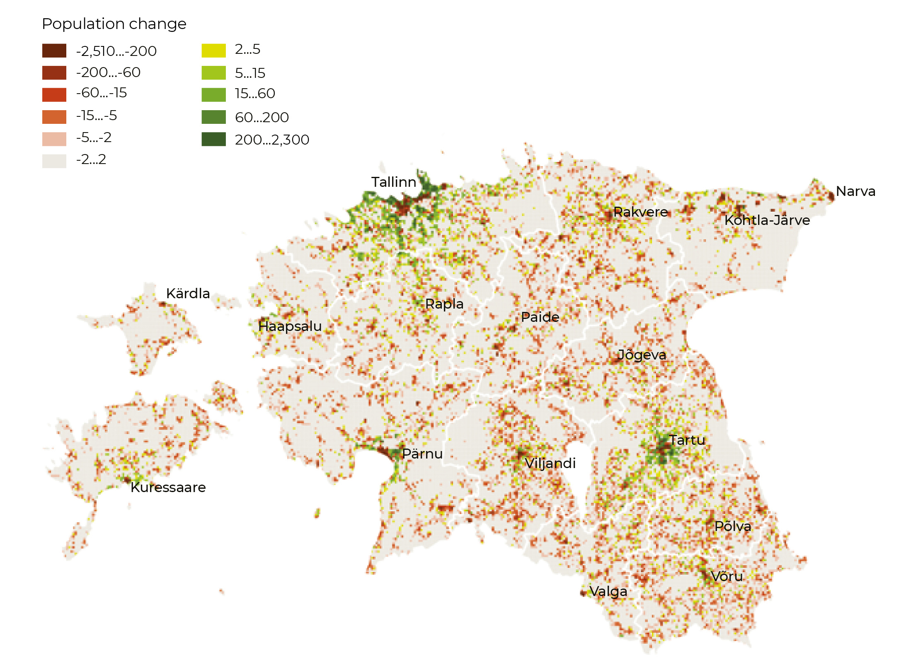

```

``` {block, type='imgsource'}
<div><span class="imgsource-source">Source:</span> Statistics Estonia censuses of 2000 and 2011.</div>
<div><a class="data-btn" href="../data/11_fig1_data.zip"><i class="fa fa-download" aria-hidden="true"></i>Download data</a></div>
```

The third factor is the change in the meaning of a rural lifestyle. According to Statistics Estonia, approximately as little as two-thirds of the population in Estonia live in municipalities formally considered urban. The majority of the municipalities formally considered rural around Tallinn, Tartu and Pärnu are urban or suburban in terms of lifestyle. In the areas around the larger cities, where thirty years ago wealthy agricultural holdings dominated (e.g. growing vegetables for the city), the first choice for employment today is not agriculture. The need for employment in agriculture has also decreased due to the ‘industrialisation’ of the sector. In Estonia as a whole, only about 1 in 40 residents is employed in agriculture in the wider sense. Accordingly, people living in rural areas are engaged in something different from traditional practices forming agricultural landscapes. All this has an impact on Estonian landscapes and therefore also the living environments.

### Built-up areas are increasing mostly around cities {-.chapter1_section}

Most of the new residential areas replaced previous agricultural lands (12.2%). It is important to point out that the majority of residential areas (including districts of residential blocks like Mustamäe and Lasnamäe in Tallinn or Annelinn in Tartu) qualify as discontinuous urban fabric according to CORINE; all the new residential areas and areas with industrial or commercial buildings definitely form a discontinuous urban fabric. Adding other built-up areas, the total increase in artificial surfaces (as defined in CORINE) reaches 23 sq. km ([Oja 2009](#Oja2009); [2014](#Oja2014)). Between 2006 and 2012, 11 sq. km of discontinuous urban fabric was added and about the same area of industrial or commercial units. About 7.5 sq. km of it replaced agricultural land. So the increase in built-up areas was similar to the previous period.

```{block, type='blockquote-left'}
Lands with buildings on them or nearby cannot be turned back into agricultural land.
```
Between 2012 and 2018, the addition of built-up areas somewhat slowed. Residential areas increased by 3.65 sq. km (2.5 sq. km of which was previously agricultural land) and industrial/commercial areas increased by 5.83 sq. km (4.39 sq. km of which was previously agricultural land). The disappearance and appearance of construction sites is more or less the same, which indicates not much change in building activities.

The growth of built-up areas since the beginning of the century is not very large – approximately 1.3‰ of land area – but unlike several other changes, this process is not reversible. Lands with buildings on them or nearby cannot be turned back into agricultural land. Regionally, most of the new residential areas are located in Harjumaa, Tartumaa and Pärnumaa counties ([Figure 1.1.2](#figure112)). This is confirmed by the population data from Statistics Estonia (see [Figure 1.1.1](#figure111)).

<p class="caption" id="figure112"><span class="figure-number">Figure 1.1.2.</span> Addition of new residential areas</p>

```{r, figure112, out.width='100%', fig.asp=.75, fig.align='center', echo=FALSE, message=FALSE, warning=FALSE}

library(sf)          # classes and functions for vector data
library(raster)      # classes and functions for raster data
library(tmap)
library(svglite)

fig112_maakonnad <- st_read(dsn ="../data/11_fig2_data/maakond_20200101.shp")
head(as.data.frame(fig112_maakonnad))


Muutus_2002...2006 <- st_read(dsn ="../data/11_fig2_data/change112121.shp")
head(as.data.frame(Muutus_2002...2006))
Muutus_2002...2006$year <- "2000-2006"

Muutus_2006...2012 <- st_read(dsn ="../data/11_fig2_data/lisand2012.shp")
head(as.data.frame(Muutus_2006...2012))
Muutus_2006...2012$year <- "2006-2012"

Muutus_2012...2018 <- st_read(dsn ="../data/11_fig2_data/lisand2018.shp")
head(as.data.frame(Muutus_2012...2018))
Muutus_2012...2018$year <- "2012-2018"


fig_112_plot <- #tm_shape(fig112_maakonnad) +
    #tm_fill("#E6E3DA", palette = c("#E6E3DA", "#DAD4E6","#B6A8CD", "#917DB5","#482683")) +
    #tm_borders(col="white") +

    #tm_layout(
     # outer.margins=0, inner.margins=c(.02, .1, .02, .02),asp=1920/1080,
    #  legend.outside = FALSE,
    #  legend.format=list(text.separator="kuni"),
    #  frame = FALSE) +

    tm_shape(Muutus_2002...2006) + tm_fill("year", legend.fill.show = TRUE, title="", palette=c("#B6A8CD"), popup.vars=FALSE) +
      tm_borders(col="white", alpha=0) +

      tm_shape(Muutus_2006...2012) + tm_fill("year", legend.fill.show = TRUE, title="", palette=c("#6D519C"),popup.vars=FALSE) +
      tm_borders(col="white", alpha=0) +

      tm_shape(Muutus_2012...2018) + tm_fill("year", legend.fill.show = TRUE, title="", palette=c("#241342"),popup.vars=FALSE) +
      tm_borders(col="white", alpha=0) +

      tm_view (
        set.zoom.limits = c(7, 16),
        set.bounds = c(21.6397953631, 57.4745283067, 28.1316992531,59.8110903998)
      )

tmap_mode("view")
fig_112_plot

#tmap_save(tm = fig_153_plot, filename = "figure153.png")
#tmap_save(tm = fig_112_plot, filename = "fig112.pdf")

#svg(filename="figure.svg")
#fig_153_plot
#dev.off()
```

``` {block, type='imgsource'}
<div><span class="imgsource-source">Source:</span> CORINE 2000; 2006; 2012; 2018.</div>
<div><a class="data-btn" href="../data/11_fig2_data.zip"><i class="fa fa-download" aria-hidden="true"></i>Download data</a></div>
```

Statistics Estonia data on the land area indicated in climate reports shows that settlement area increased by 138 sq. km between 2000 and 2017 – from 3,287 sq. km at the turn of the century to 4,325 sq. km in 2017, which means 4.2% growth. This number is more than double that reflected in the CORINE data. As the CORINE minimum mapping unit is 5 hectares, a lot of new settlements with a smaller area must have been added around cities.

```{block, type='blockquote-right'}
Many quarries have been forested after being closed, but this is still a significant change in land use, as the restoration of valuable agricultural land is usually impossible.
```
In addition to the increase in built-up areas in a narrow sense, other areas with a strong human impact have also increased – in all periods, the area covered by roads, railways, airports and other similar facilities has increased by 3 to 4 sq. km per period. Quarries must also be considered areas with a strong human impact. Between 2006 and 2012, 26 sq. km of quarries were added and the total area of quarries increased by 21 sq. km (some of the quarries became exhausted and their land use changed). Between 2012 and 2018, the total area of quarries increased by 13.5 sq. km. Most of the new quarries are located in Ida-Virumaa county, some are also in Harjumaa county. Many quarries have been forested after being closed, but this is still a significant change in land use, as the restoration of valuable agricultural land is usually impossible and forests on closed quarries tend to have a lower category than the forests there before the quarry came into use.

### Urban sprawl reduces the diversity of the use of space in urban areas and their surroundings {-.chapter1_section}

We already saw that population density and new built-up areas have increased primarily around three Estonian cities – Tallinn, Tartu and Pärnu. Now we will discuss Tartu and its surroundings as an example ([Anni and Oja 2016](#Anni2016); [Marksoo 2005](#Marksoo2005)). Historical retrospect contributes to our understanding of today’s trends.

Pre-modern Tartu functioned for a long time as a compact unit. Once common land, the area around the town was divided between fiefdoms, or manors, which started to limit the outward growth of the town about 500 years ago. Nevertheless, ‘suburbs’ or slums appeared just outside the town wall around Tartu in the 16th and 17th centuries. The borders of the town were first legally defined in the 18th century. Later, new factors supporting the development of the town appeared – the university, the railway, and industry and commerce. This accelerated the development of the town, which emerged as a wellspring of national culture. The densification of the town centre and extension of the town limits into neighbouring areas began. At the turn of the 20th century, Tartu started to extend outside its previous boarders onto lands rented from the surrounding manors (large landowners). While meeting the need to enlarge Tartu, not much attention was paid to the value of agricultural land.

New opportunities to extend the town resulted from the nationalisation of the manor lands after the establishment of the Republic of Estonia. In 1922 and 1923, the area of Tartu increased compared to its previous borders by 150%. Half of the area inside the town was agricultural at first, the built-up areas only covered a quarter. But this ratio rapidly started to change. The next increase in the territory of the city happened in 1962 (11%) and again in 1977 (63%), as the new Annelinn district of pre-fabricated apartment buildings was established. Subsequently (until the 2017 administrative reform), the city boarders have only been corrected slightly here and there. During the Soviet period, extending the city borders was limited by the military airfield in Raadi and the desire of the collective farms around the city to protect their agricultural land. Therefore, Tartu has grown outside its borders several times, which is normal for a growing city. A cyclical recurrence can be seen – after a significant increase, the city becomes denser and more homogeneous within its borders, and after densification, a new expansion occurs if possible.

```{block, type='blockquote-left'}
The comprehensive plans of the municipalities around cities have favoured urban sprawl, envisaging the continuation of urban land use beyond the city limits.
```
The comprehensive plans of the municipalities around cities have favoured urban sprawl, envisaging the continuation of urban land use beyond the city limits. Previous agricultural lands have been built on with residential housing, industrial buildings and other similar infrastructure. In many places, suburban districts have merged with the city. Together with people, services have also moved. This is confirmed by the calculations performed by Statistics Estonia to estimate the area of high-density neighbourhoods outside the city limits based on census data (the census methodology ignored administrative borders; see [Figure 1.1.3](#figure113)). Urban sprawl can also be seen when comparing the data from the two censuses of 2000 and 2011. Population density has grown faster outside the city than inside.

<p class="caption" id="figure113"><span class="figure-number">Figure 1.1.3.</span> Changes in population density between two censuses (2000 and 2011) demonstrate how the intensity of the use of space in the city and its hinterland has become more similar</p>

```{r, figure113, out.width='80%', fig.asp=.75, fig.align='center', echo=FALSE, message=FALSE}

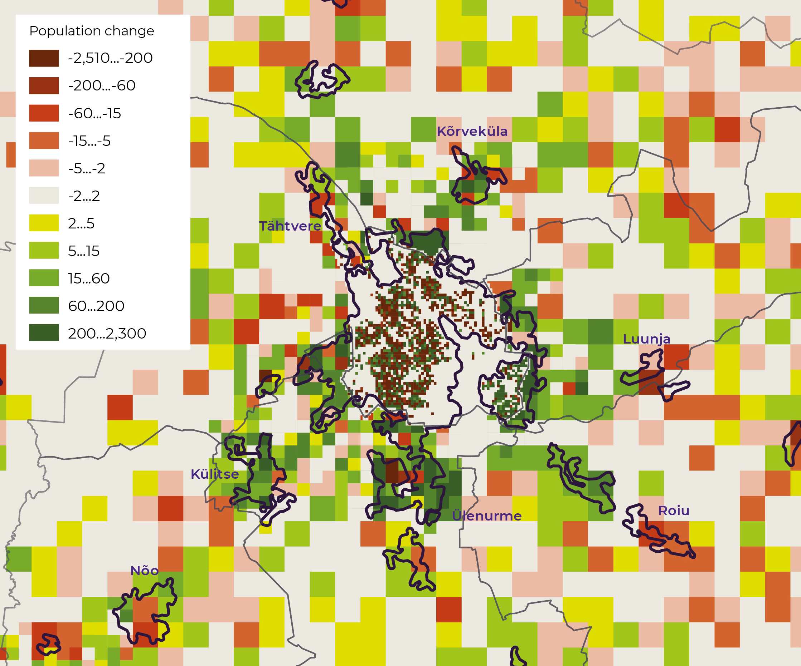

```

``` {block, type='imgsource'}
<div><span class="imgsource-source">Source:</span> Statistics Estonia censuses of 2000 and 2011.</div>
<div><a class="data-btn" href="../data/11_fig3_data.zip"><i class="fa fa-download" aria-hidden="true"></i>Download data</a></div>
```

The construction of new commercial centres on the edge of the city or immediately outside it also affects the extension of city borders; the effect of shifting urban space is largely due to the development of the transportation infrastructure, such as the ring-road and railway. Moving the industrial areas out of the city affects the development of the transportation infrastructure, which in turn initiates the emergence of new local commuting centres. Similar trends have been described in Europe since the 19th century ([Antrop 2004](#Antrop2004)). New built-up areas appear on previous agricultural lands, and also less commonly on forest land.

In Tartu, we see high-density city districts becoming less dense ([Figure 1.1.3](#figure113)), while low-density districts with good connections to the city centre become denser, creating some pressure to build on lands that were previously common space or recreation areas. Population density becomes more even throughout the urban area; we can see a kind of diffusion. In Tartu and its surroundings, the number of uninhabited areas has decreased (in terms of population density by both per square kilometre and hectare), whereas the most densely populated districts (Annelinn, Tähtvere) have become less densely inhabited. Average population density has nevertheless grown. Cells with a very high or very low population density have become less numerous, while medium-density cells have become more numerous.

A similar trend can be seen in other major urban regions in Estonia. From the point of view of theoretical urban models, what we see here is the physical broadening of urban centres. However, the variety of land use intensity within the different parts of the urban area (different parts of the historical centre and new housing areas on the edge of town) is decreasing. Urban sprawl does not only affect the suburban areas, changes in land cover and population density show that land use intensity is becoming more even in all urban areas.

### Agricultural landscape is shrinking and becoming less populated {-.chapter1_section}

The total area of agricultural land has not changed much in the 21st century; it varies between 8,000 and 9,000 sq. km. The same can be said of cultivated land, which makes up quite consistently two-thirds of the agricultural land. Considering the decrease in agricultural land in the 1990s, the slight increase in 2001–2007 is important. At the same time, the number of agricultural households more than halved during the period. The decrease in the number of households continued after 2007 and by 2016 the number was two-thirds of that in 2007. On the other hand, the share of agricultural land in active use increased. The share of agricultural land in land owned by households increased from 65% to 75%. The share of agricultural land not used more than halved compared to that in active use. This indicates an increase in the value of agricultural land.

The data on land area in climate reports (Statistics Estonia) also indicates that both arable land and grasslands have shrunk. There was 10,566 sq. km of arable land and 2,983 of grasslands in 2000, while only 10,316 and 2,744 sq. km remained in 2017. This means we have lost 250 sq. km of arable land and 239 of grasslands. Part of them have been built up in the course of suburbanisation, but even more have been overgrown by forest in peripheral regions.

The CORINE data also shows changes in agricultural lands but mostly it is a change from one agricultural use to another. Still, a decrease of agricultural land is also noticeable in the land cover data.

### Forest land is growing but we have less coniferous forests and the forests are becoming younger {-.chapter1_section}

Between 2000 and 2006, trends similar to the previous decade continued in land cover changes. The highest increase was in the class of transitional woodlands/shrubs, which in Estonia means clear-felled forests. The process of agricultural land being overgrown by forest was slower. At the same time, some of the transitional woodlands disappeared as a result of the intense felling in the 1990s; these have mainly been replaced by deciduous or mixed forest. The addition of coniferous forests is remarkably small ([CORINE](#CORINE)).

Changes in the structure of forests continued in the subsequent periods. Between 2006 and 2012, the area of transitional woodlands decreased by 150 sq. km; deciduous and mixed forests increased, while coniferous forests decreased. An area of 434 sq. km of forest was felled and new forest grew on 605 sq. km. Between 2012 and 2018, all types of forested land decreased. The area of transitional woodlands that appeared (clear-felled areas) was four times the area that was lost (grown into forest); the clear-felled area increased by 751 sq. km.

```{block, type='blockquote-right'}
Forest land has in long term slightly increased due to agricultural lands being overgrown by forest and the forest structure is changing.
```
Changes in felling intensity are also reflected in the statistical forest inventory data. For example, altogether 880 sq. km of forest was felled in 2001; dropping to only 524 in 2008, this figure bounced back up to 881 sq. km in 2013. The data on land area in climate reports shows an increase in forest land by 1.8%, from 23,961 sq. km in 2000 to 24,384 sq. km in 2017. The area of forest land in the climate reports is somewhat higher than that calculated based on the concept of forest land used in Estonia, as the former also includes scrubland, forested wetlands and natural grasslands.

In summary, we can say that forest land has in long term slightly increased (due to agricultural lands being overgrown by forest) and the forest structure is changing. There is less coniferous forest and the forests are younger. In general, these changes are not as irreversible as, for example, building on agricultural land. Clear-felled areas grow into forest again. Felling intensity has been greater than forest growth, but the forest land is not being converted into some other use; while the land cover is changing (forest → clear-cut → forest), the land remains forest land.

### The preservation of valuable agricultural lands restrains landscape changes {-.chapter1_section}

All the county spatial plans adopted in the mid-2010s designate a layer of valuable agricultural lands where the scope for changing the land use is limited. For example, the county spatial plan for Viljandimaa prescribes the principles for the drafting of all municipal comprehensive plans and the use of valuable agricultural lands. The aim is to guarantee that agricultural land is used for its intended purpose. The county spatial plan for Tartumaa lists general conditions for the use of valuable agricultural lands and prescribes that these should generally remain in agricultural use and be kept suitable for tillage. Using valuable agricultural land for non-agricultural purposes may occur only in the interests of the public or community if these interests cannot be fulfilled otherwise. As valuable agricultural lands were treated in the county spatial plans according to the Ministry of Rural Affairs guidelines, the situation is similar in all counties.

Attempts have already been made to change the county spatial plans. This is more common around larger cities, where the pressure to construct residential buildings is greater. For example, a study of agricultural lands in the northern part of Rae municipality outside Tallinn found that some of the valuable agricultural lands according to the county spatial plan overlapped with prospective residential construction areas in an earlier municipal comprehensive plan. The study therefore suggested that some of the valuable lands be removed from the list.

```{block, type='blockquote-left'}
The onslaught of monotonous and boring agricultural landscape is restrained by the requirement to preserve ecological elements (which also supports biodiversity) arising from the European Common Agricultural Policy and its support measures.
```
The law regulating rural life and agricultural trade has been amended to limit the use of valuable agricultural land for any other purpose. There is 700,000 hectares of valuable agricultural land to be protected in Estonia, which is 63% of all agricultural land. One-sixth of Estonia’s land area should remain agricultural landscape. At the county level, the share of valuable agricultural land currently varies between 84% in Järvamaa and 48% in Ida-Virumaa.

In general, the proposed measures place restrictions on changes in land use (both for construction and reforestation) and the fragmentation of agricultural lands. The obligation to ensure the preservation of agricultural lands is transferred to the land owners. The onslaught of monotonous and boring agricultural landscape is restrained by the requirement to preserve ecological elements (which also supports biodiversity) arising from the European Common Agricultural Policy and its support measures. Despite causing ongoing disputes, the planned changes in legislation will most probably still restrict urban sprawl.

### Protecting valuable landscapes and conservation areas helps preserve the overall appearance of landscapes {-.chapter1_section}

Valuable landscapes were already mapped in county spatial plans as special thematic layers during the previous planning cycle in the early years of the century. These were transferred to the current county spatial plans. As an example of the typical restrictions established in county spatial plans to preserve land use in valuable landscapes, we can look again at Viljandimaa county. When planning constructions in a valuable landscape, the aim has to be to preserve the existing historical settlement as well as possible, consider the historical road network and building traditions. When planning new buildings, traditional building styles for the region should be considered. Preserving openness and views of agricultural landscapes, traditional landscape elements and structures is recommended. Facilities that disturb views must be avoided.

The planning layer for valuable landscapes essentially overlaps with the layer for valuable agricultural land. Generally speaking, the county spatial plans (with the layers for green networks, valuable landscapes and valuable agricultural lands) serve as a constraint on changes to the general appearance of landscapes.

The preservation of landscapes is also supported by the existence of conservation areas. One-fifth of the total land area of Estonia is covered by some form of protection (NATURA nature and bird areas, nature conservation areas, local protection, valuable habitats, etc.) ([Table 1.1.1](#table111)). While a significant portion of Estonia is subject to double or multiple protection regimes, strict nature reserves account for less than 0.2%.

<p class="caption" id="table111"><span class="figure-number">Table 1.1.1.</span> Share of conservation areas in the total territory by counties in 2019 (%)</p>

<div style="overflow-x:auto;">
<table id="table_111" style="width:100%">

  <tr>
    <th>Põlva</th>
    <th>Jõgeva</th>
    <th>Järva</th>
    <th>Lääne-Viru</th>
    <th>Võru</th>
    <th>Viljandi</th>
    <th>Tartu</th>
    <th>Rapla</th>
    <th id="table111_header_main">ESTONIA</th>
    <th>Harju</th>
    <th>Ida-Viru</th>
    <th>Valga</th>
    <th>Hiiu</th>
    <th>Saare</th>
    <th>Pärnu</th>
    <th>Lääne</th>
  </tr>

  <tr>
    <td>8.8</td>
    <td>11.1</td>
    <td>14.1 (45.5*)</td>
    <td>14.9 (53.2*)</td>
    <td>15.7</td>
    <td>16.1</td>
    <td>19.2</td>
    <td>19.3</td>
    <td>19.6 (24.8)</td>
    <td>20.1</td>
    <td>20.4</td>
    <td>20.9</td>
    <td>24.3</td>
    <td>24.8</td>
    <td>28</td>
    <td>33.7</td>
  </tr>

</table>
</div>

\*Including the Pandivere water protection area.

``` {block, type='imgsource'}
<span class="imgsource-source">Source:</span> Estonian Nature Information System 2019; Land Board 2019.
```

The total size of conservation areas reported in the Estonian Nature Information System is more than four times greater than that of the cadastral units with ‘protected area’ marked as their intended purpose. This is because, in the Nature Information System, conservation areas include large national parks, NATURA nature and bird areas and other similar areas; while subject to conservation restrictions, the majority of these areas have an intended purpose other than ‘protected area’. The conservation restrictions often include restrictions on construction or changes to land use. Conservation areas are a protective measure against landscape changes; for example, the protective purpose of the Otepää nature park is to ‘protect, maintain, restore [...] natural and heritage landscapes’. Activities that change the landscape are allowed only if approved by the governor of the conservation area and usually activities that disrupt the protection function are not approved.

### Summary {-.chapter1_section}

Urban areas in Estonia are becoming larger – between 2000 and 2017, the area of urban settlements grew by 138 sq. km or 4.2%. Within urban settlements – cities or towns and the surrounding hinterland that has grown with them – both settlement density and the use of space are gradually homogenising. Land that was previously agricultural is becoming covered with residential or industrial areas. The urban sprawl – services on the edge of town, ring roads and adjacent shopping centres – adds to the pressure to replace agricultural lands and less often forests with built-up areas.

Convergence is also happening in peripheral rural landscapes, albeit in different ways. Due to migration and other demographic factors, the periphery is losing people. Agricultural employment has decreased considerably, and there are fewer agricultural households. Even if the area of arable land has not decreased in the aftermath of the collapse of agriculture in the 1990s, the industrialisation and automation of agriculture has greatly decreased the need for labour. Although the forested area has grown recently, the share of coniferous forest in fells is high. Estonian forests are getting younger.

Over the past three decades, we have lost 250 sq. km of agricultural land and 239 sq. km of grasslands. Part of this land has been built on, and an even larger part has grown into forest. Landscapes are converging in different parts of the settlement system: near the cities, land that was previously agricultural or forested has been built on; in more remote areas, arable lands and grasslands have overgrown with scrub. Due to an unbalanced approach to forest felling, landscape diversity is decreasing.

```{block, type='blockquote-right'}
The persistence of valuable agricultural land is important both for national security and the preservation of our traditional activities and culture. The changing age structure of our forests also decreases our biodiversity.
```

Landscapes are always changing. Some of these changes are not reversible. Therefore, the current loss of agricultural land cannot practically be reversed within a reasonable time frame. However, domestic food is becoming more and more valuable. Recent decades have shown that so is agricultural land. The persistence of valuable agricultural land is important both for national security and the preservation of our traditional activities and culture. The changing age structure of our forests also decreases our biodiversity. One of the values of Estonia’s settlement system has so far been that people can choose between rural and urban environments for living. The convergence of landscapes, caused by suburbanisation and emergence of peripheral areas, narrows these options.

Looking to the future, there will probably be no radical shifts in the trends to do with landscape changes. Nevertheless, lower population density in the periphery is starting to inhibit internal migration, and signs of migration decrease are already noticeable. Several means to avoid the convergence of landscapes are already in use in Estonia. The systematic preservation of valuable agricultural lands both near cities and in peripheral regions will curb urban sprawl and the process of landscapes being overgrown by forest. The measures taken to protect valuable landscapes and conservation areas support the preservation of landscapes, and value the ecological elements of agricultural lands, keeping them from becoming monotonous. The impact of these measures will probably be clear in the coming decades.

### References {-.subreferences #references-11}

<p id="Anni2016">Anni, K., Oja, T. 2016. Laienevate linnade piirimuudatustest haldusreformi kontekstis. – Riigikogu Toimetised, 33, 125–140.</p>

<p id="Antrop2004">Antrop, M. 2004. Landscape change and the urbanization process in Europe. – Landscape and Urban Planning, 67 (1–4), 9–26.</p>

<p id="CORINE">CORINE Land Cover – COoRdination of INformation on the Environment. European Union Earth Observation Programme Copernicus Land Monitoring Service Pan-European Component.</p>

<p id="Marksoo2005">Marksoo, A. 2005. Linnasiire. – Pullerits, H., Tõnisson, U., Liim, A., Andresen, A. (eds.). Tartu. Ajalugu ja kultuurilugu. Tartu: Tartu Linnamuuseum, Ilmamaa.</p>

<p id="Oja2009">Oja, T. 2009. Maakasutuse muutused (7.2). Valglinnastumine (7.3). – Kaukver, K. (ed.). Keskkonnaülevaade 2009. Tallinn: Keskkonnaministeeriumi Info- ja Tehnokeskus, 115–123.</p>

<p id="Oja2014">Oja, T. 2014. Maakasutuse muutused (6.1). – Kaukver, K. (ed.). Keskkonnaülevaade 2013. Tallinn: Keskkonnaagentuur, 131–137.

<!--chapter:end:01.1-chapter.Rmd-->

## Increasing regional polarisation in Estonia {.chapter_section .chapter1_section}

```{block, type='authors authors_eng'}
<div class="author-links">**[Bianka Plüschke-Altof](#bianka-plüschke-altof), [Bradley Loewen](#bradley-loewen) and [Kadri Leetmaa](#kadri-leetmaa)**</div>
<div><a class="print-btn" href="../keskuse-ja-ääremaa-lõhe-eestis.html">EE</a></div>
```

```{block, type='points'}
* Peripheralisation is a process whereby economic, social, political and image-related factors cause inequality in socio-spatial development, creating a divide between cores and peripheries. These factors result in the emergence of a global, regional and local core-periphery hierarchy, which manifests itself in the loss of population, jobs and services in the peripheral areas and their concentration in core areas.
```


```{block, type='blockquote-right'}
The focus on regional competitiveness, an approach shared by Estonian and EU regional policy, has not helped to reverse peripheralisation.
```

In recent decades, growing social and spatial inequality has been prevalent in Central and Eastern European countries ([Lang and Görmar 2019](#Lang2019)). In Estonia, too, regional inequalities have increased, and large parts of the settlement system – once economically and socially viable small towns and rural areas – have become peripheral within the country. As most jobs are in major urban centres, rural exodus has become commonplace, especially among the younger generation. It has thus become increasingly difficult to ensure equal availability of vital services throughout the country, as the need for services decreases due to the parallel processes of demographic decline and ageing in Estonian peripheries. While acknowledging the established understanding of peripheralisation in Estonia, defined as a process of out-migration and loss of jobs and services in remote areas away from urban centres ([Säästva arengu komisjon 2010](#Säästva-arengu-komisjon2010)), this article argues that these objective processes are intertwined with the subjective stigmatisation of peripheral areas. We also discuss the extent to which the regional policy of Estonia and the European Union (EU) has helped to reduce the core-periphery divide. The article draws on demographic and economic data of Statistics Estonia (current population statistics, the 2011 census and the data on regional gross domestic product (GDP)) to describe regional polarization processes. For regional policy trends, we rely on the results of Bradley Loewen’s doctoral thesis defended at the University of Tartu in 2018 ([Loewen 2018](#Loewen2018); [Loewen and Schulz 2019](#Loewen2019)). The thesis analyses the development of regional policy in Estonia and other Central and Eastern European countries, as well as their relations with the EU cohesion policy. The description of subjective peripheralisation processes is based on Bianka Plüschke-Altof’s doctoral thesis ([Plüschke-Altof 2017](#Plüschke-Altof2017); [Plüschke-Altof and Grootens 2019](#Plüschke-Altof2019)), defended at the University of Tartu in 2017, and analysing the (re)production of peripheral images in rural Estonia and the local initiatives to counter it.

### Peripheralisation is self-reproducing {-.chapter1_section}

Increasing regional inequalities are manifested most clearly in the ongoing concentration of human and economic capital in Estonia’s major urban areas. This mostly happens at the expense of rural communities and small towns, where these resources disappear and remain absent from regional development. With the exception of the Tallinn urban area (Harjumaa county), all other Estonian counties have suffered from population loss between 1995 and 2017. The population of Harjumaa increased by 5% during this period. Tartu County was relatively stable with a population loss of 5% within this period, whereas other counties saw a remarkable population decline of between 12 and 27% ([Figure 1.2.1](#figure121)). Besides out-migration from peripheral areas to the major cities, migration abroad, enabled by Estonia joining the Schengen area in 2004, also plays a significant role. According to Statistics Estonia, the positive migration rate in recent years, including the return migration of people who previously left Estonia, also favours the capital region. For example, in 2018, 57% of those who settled in Estonia did so in Harjumaa. Moreover, many who are officially registered as Estonian residents regularly commute abroad. The 2011 census showed that between 3% (Harjumaa) and 8% (Pärnumaa) of registered residents in Estonian counties had actually worked abroad and could therefore be absent for a significant period of time.

<p class="caption" id="figure121"><span class="figure-number">Figure 1.2.1.</span> Regional polarisation in Estonia: population change and distribution of national GDP by county in 1995 and 2017</p>

```{r, figure121, out.width='100%', fig.asp=.75, fig.align='center', echo=FALSE, message=FALSE}

library(sf)          # classes and functions for vector data
library(raster)      # classes and functions for raster data
library(tmap)
library(svglite)

Maakonnad <- st_read(dsn ="../data/12_fig1_data/maakond_20200101.shp")
head(as.data.frame(Maakonnad))
Maakonnad <- Maakonnad[order(Maakonnad$MNIMI),]
Maakonnad$MNIMI <- c("Harjumaa county", "Hiiumaa county", "Ida-Virumaa county", "Järvamaa county", "Jõgevamaa county", "Läänemaa county", "Lääne-Virumaa county", "Pärnumaa county", "Põlvamaa county", "Raplamaa county", "Saaremaa county", "Tartumaa county", "Valgamaa county", "Viljandimaa county", "Võrumaa county")

fig_data <- read.csv("../data/12_fig1_data/fig_121_data.csv", header=TRUE, sep=";")
fig_data <- fig_data[order(fig_data$county_est),]

Maakonnad$Rahvaarvu_muutus <- fig_data$pop_change
Maakonnad$SKP1995 <- fig_data$GDP95
Maakonnad$SKP2016 <- fig_data$GDP16

names(Maakonnad)[names(Maakonnad) == "Rahvaarvu_muutus"] <- "Population change (%)"
names(Maakonnad)[names(Maakonnad) == "SKP1995"] <- "Share of national GDP in 1995 (%)"
names(Maakonnad)[names(Maakonnad) == "SKP2016"] <- "Share of national GDP in 2016 (%)"

fig_121_plot <- tm_shape(Maakonnad) +
    tm_fill("Population change (%)", title="Population change (percentage) 1995–2016",
    breaks = c(-30,-20, -10,0,10), palette = c("#B6A8CD","#6D519C","#361C62","#96CBD2"), popup.vars=c("Population change (%)","Share of national GDP in 1995 (%)","Share of national GDP in 2016 (%)")) +
    tm_borders(col="white") +

  tm_layout(
    legend.format=list(text.separator="...")) +

  tm_shape(Maakonnad) +
      tm_bubbles(col = "#dbe9da",alpha = 0.6, size = "Share of national GDP in 1995 (%)", scale = 541/640 * 8*1.7, border.col=NULL,xmod=-5, title.size="Share of national GDP in 1995 (%)", popup.vars=c("Population change (%)","Share of national GDP in 1995 (%)","Share of national GDP in 2016 (%)") ) +
      tm_text (col="white", text="Share of national GDP in 1995 (%)",xmod=-5) +

    tm_shape(Maakonnad) +
    tm_bubbles(col = "#369B9E",alpha = 0.6, size = "Share of national GDP in 2016 (%)", scale = 8*1.7, border.col=NULL,xmod=2, title.size="Share of national GDP in 2016 (%)",popup.vars=c("Population change (%)","Share of national GDP in 1995 (%)","Share of national GDP in 2016 (%)")) +
      tm_text (col="white", text="Share of national GDP in 2016 (%)", xmod=2) +

      tm_view (
        set.zoom.limits = c(7, 16),
        view.legend.position = c("left","bottom"),
        set.bounds = c(21.6397953631, 57.4745283067, 28.1316992531,59.8110903998),
      )

tmap_mode("view")
fig_121_plot

#tmap_save(tm = Rahvastiku_muutus + SKP, filename = "figure2.pdf")

#svg(filename="figure.svg")
#pop_change + GDP
#dev.off()

```

``` {block, type='figure-comment'}
<span class="figure-comment-start">Note:</span> Up to 1995, return migration to the former Soviet Union was a key factor in population change. During the observed period, GDP per capita increased in all the counties, but proportionally the greatest increase was concentrated in Harjumaa and Tartumaa.
```

``` {block, type='imgsource'}
<div><span class="imgsource-source">Source:</span> Statistics Estonia 2000; 2011.</div>
<div><a class="data-btn" href="../data/12_fig1_data.zip"><i class="fa fa-download" aria-hidden="true"></i>Download data</a></div>
```

In line with the concentration of human capital between 1995 and 2017, economic growth also favoured Harjumaa, which increased its contribution to the national GDP from 54 to 64%. Tartumaa increased its share of national GDP as well, while that of the other counties decreased, with the sharpest decline occurring in the industrial northeast of Estonia. There are also fewer and fewer jobs outside the urban centres. Commuting from the country to the cities has therefore become more commonplace. While there is no recent reliable data on commuting, a survey conducted in 2007–2009 ([Ahas et al. 2011](#Ahas2011)) showed that 28% of the population (380,000 people) were commuters in Estonia.

```{block, type='blockquote-left'}
The settlement system is increasingly biased towards major urban regions, or even exclusively towards the capital region.
```
These general trends confirm that regional inequalities have objectively deepened in Estonia ([Annist 2017](#Annist2017); [Noorkõiv 2009](#Noorkõiv2009)), and are directly linked to population decline and dwindling economic activity in the peripheral areas. As jobs and services concentrate in larger centres, this results in a loss of employment opportunities and other necessities for people living in rural areas and small towns. The settlement system is increasingly biased towards major urban regions, or even exclusively towards the capital region. Growing regional inequalities and an inevitable decline of non-core regions have also been well documented in other Central and Eastern European countries and elsewhere in Europe ([Lang and Görmar 2019](#Lang2019)). In fact, Estonian small towns and rural areas are located in a so-called double-periphery – far from the main centres within Estonia but also on the extreme periphery in relation to the European core. This makes it even more difficult to reverse peripheralisation, understood as a multifaceted, multi-level process that produces social and spatial inequalities.

As in other European nations, the global trends of de-industrialisation, increasing automation and a declining agricultural sector also affect Estonia ([Raagmaa and Noorkõiv 2013](#Raagmaa2013)). The collapse of the Soviet economy launched a very compressed economic shock in the 1990s; the restructuring that occurred over decades in other countries was experienced in Estonia over only a couple of years ([Annist 2017](#Annist2017)). Jobs disappeared in both the urban industrial and rural agricultural sectors, heavily affecting the industrial northeast, small mono-functional industrial towns throughout the country and agricultural regions in the south – the counties of Viljandimaa, Valgamaa, Võrumaa and Põlvamaa among others. As the previously strong agricultural sector had also supported the service economy (personal and related producer and administrative services), the economic reorganisation hit the agricultural regions particularly severely. In the southern Estonian counties listed above, the share of workforce in the primary sector (mainly agriculture) dropped from 37% in 1990 to only 9% by 2017. The total number of employed people decreased from 91,400 in 1990 to 61,400 in 2017 and from 33,600 to 5,600 in the primary sector. Only the industrial Ida-Virumaa county faced a faster employment decline in the same period (more than 50%). New jobs have been created in the service sector, especially in rural tourism ([Raagmaa and Noorkõiv 2013](#Raagmaa2013)), which benefits from the tendency of seasonal living in rural areas during the summer (estimated at 5% of Estonian residents – [Ahas et al. 2011](#Ahas2011)). However, the structural loss of employment in agriculture has far out-weighed these new income opportunities.

```{block, type='blockquote-right'}
The economic restructuring and new residential and commuting patterns support a vicious cycle of population decline that also leads to the disappearance of essential public services, such as schools, further fuelling shrinkage.
```
Even though the main changes in agricultural employment occurred already in the 1990s, the shrinkage has not stopped since. The total number of employed persons in the four counties in southern Estonia has remained stable since the early 2000s (63,000 employed in 2001), but there are fewer jobs available close to the place of residence, thus requiring more long-distance commuting ([Figure 1.2.2](#figure122)). In 2000, most of the employed residents of the counties of southern Estonia worked in their home county; by 2011, 23% worked outside their home county and 7% outside Estonia. In the case of transnational migrants, who commute for work but remain tied to their place of residence, the most important destination for Estonians is Finland ([Annist 2017](#Annist2017); [Anniste et al. 2017](#Anniste2017)). This means that many commuters are only in their home regions on weekends or even less often, which may also cause the out-migration of their families over the long term. The economic restructuring and new residential and commuting patterns support a vicious cycle of population decline that also leads to the disappearance of essential public services, such as schools, further fuelling shrinkage.

<p class="caption" id="figure122"><span class="figure-number">Figure 1.2.2.</span> Workplace location – in county of residence, elsewhere in Estonia or outside Estonia – among the residents of the counties of Viljandimaa, Valgamaa, Võrumaa and Põlvamaa in 2000 and 2011</p>

```{r, figure122, out.width='80%', fig.asp=.75, fig.align='center', echo=FALSE, message=FALSE}

library("tidyverse")
library("svglite")
library("scales")

  fig122_data <- read.csv ("../data/12_fig2_data.csv", header=TRUE, fileEncoding="utf-8")

  fig122_plot <- ggplot(data = fig122_data) +
  geom_col(mapping = aes(x=county, y=value, fill=location_est), width=0.7) +
  facet_wrap(~year, nrow=1) +
  labs(y="Number of jobs", x="", fill="Location of jobs") +
  scale_y_continuous(labels = comma) +
  scale_fill_manual(values=c("#482683", "#917db5", "#369B9E"), labels = c("In county of residence", "Elsewhere in Estonia", "Outside Estonia"))

 fig122_theme <- theme(
          panel.grid.major.x = element_blank() ,
          panel.grid.minor.x = element_blank(),
          text=element_text(family="Montserrat")
                 )

  print(fig122_plot + fig_theme_general + fig122_theme)

#ggsave(path="exported_figures/PDF/chapter1",filename="fig122.pdf", height=140, width=200, units="mm")
```
``` {block, type='imgsource'}
<div><span class="imgsource-source">Source:</span> Statistics Estonia 2000; 2011.</div>
<div><a class="data-btn" href="../data/12_fig2_data.csv"><i class="fa fa-download" aria-hidden="true"></i></i>Download data</a></div>
```

### The stigmatisation of rural areas and small towns exacerbates peripheralisation {-.chapter1_section}

Alongside the objective indicators related to the loss of human capital, peripheralisation also has a subjective dimension. The downward spiral of post-socialist shrinkage in Estonian rural areas and small towns is shown in impaired rural images, which were historically very positive due to the peasant roots of Estonian identity ([Nugin 2014](#Nugin2014)). However, the meaning of rurality is changing alongside the growing regional inequalities, reinforced by a declining agricultural sector and rapidly growing urban areas. Today, rural areas and small towns are less associated with agriculture and more with recreation and tourist consumption ([Raagmaa and Noorkõiv 2013](#Raagmaa2013)). While local decision-makers and marketers promote idyllic images of rural life and nature to attract tourists or second-home owners, there is a tendency in the media to attach negative ascriptions of peripherality to rural areas and small towns.

As peripherality does not have a neutral meaning in public debates, but is mostly associated with disadvantages and problems, the peripheral image is potentially stigmatising for Estonian rural areas ([Plüschke-Altof 2017](#Plüschke-Altof2017)). This affects people’s decisions to visit, invest or settle there, thus aggravating objective peripheralisation. It is therefore important to understand how spatial images are produced. There are many different platforms for the public discussion of critical social issues, from politics and marketing to scientific and popular literature. However, the media, including influential national newspapers such as Postimees, Eesti Päevaleht and Maaleht, plays a crucial role in reaching wider audiences. An analysis of the opinion pieces published in these newspapers between 2011 and 2015 investigated in more detail who generates the peripheral image of rural areas in the Estonian print media and how this is done. In addition, 12 in-depth interviews were conducted with influential opinion leaders and editors ([ibid.](#Plüschke-Altof2017)).


```{block, type='blockquote-left'}
By expressing views on the nature of rural areas and rural life, peripheralisation or Estonian regional policy, opinion leaders create an image that spreads more widely in Estonian society.
```
The question of who has a voice and is heard in the Estonian print media as part of the public discourse space is important in a democratic society. Even if the image is generated by all of us, opinion leaders play an important role in creating the image of rurality. For Estonians, the image of rural life has notably been shaped by opinion leaders such as the writer A. H. Tammsaare and President Lennart Meri. By expressing views on the nature of rural areas and rural life, peripheralisation or Estonian regional policy, opinion leaders create an image that spreads more widely in Estonian society. Studies ([Plüschke-Altof 2017](#Plüschke-Altof2017)) show that opinion articles are mainly written by journalists, academics, politicians, and culture and art workers, who represent urban-based institutions such as media outlets, state administration, universities or cultural institutions (about 86% of the authors; see [Figure 1.2.3](#figure123)). Although representing urban-based institutions does not necessarily mean living in a city (especially considering the seasonal rural population), the analysis nevertheless confirms that rural entrepreneurs, local readers and interest representatives are the least likely to speak up in opinion articles (about 10% of the authors). This means that the residents of rural areas and small towns in particular seem to be less involved in the debate on rural peripherality.

<p class="caption" id="figure123"><span class="figure-number">Figure 1.2.3.</span> Who shapes the image of rural areas in Estonian print media?</p>

```{r, joonis123, fig.cap='', out.width='80%', fig.asp=.75, fig.align='center', echo=FALSE, message=FALSE}

library("tidyverse")
library("scales")

 fig123_data <- read.csv ("../data/12_fig3_data.csv", header=TRUE, fileEncoding="utf-8")

 fig123_data$percent=percent((fig123_data$proportion/100), 1)

  fig123_plot <- ggplot(data = fig123_data) +
    geom_col(mapping = aes(x=reorder(body_eng, proportion), y=proportion), fill="#482683", width=0.7, show.legend = NA) +
    geom_text(aes(label = percent, x=body_eng, y=proportion), nudge_x = 0, nudge_y = 3, color="#777777") +
    labs(y="%", x="") +
    coord_flip ()

  fig123_theme <- theme(
                  panel.grid.major.y = element_blank() ,
                  panel.grid.minor.y = element_blank(),
                  text=element_text(family="Montserrat")
                 )

  print(fig123_plot + fig_theme_general + fig123_theme)

  #ggsave(path="exported_figures/PDF/chapter1",filename="fig123.pdf", height=140, width=200, units="mm")
```

``` {block, type='figure-comment'}
<span class="figure-comment-start">Note:</span> The calculations are based on 296 opinion articles published in Postimees, Eesti Päevaleht and Maaleht from 2011 to 2015. The authors and co-authors of the articles, responsible journalists and editors were considered opinion leaders in this analysis.
```

``` {block, type='imgsource'}
<div><span class="imgsource-source">Source:</span> Plüschke-Altof 2017.</div>
<div><a class="data-btn" href="../data/12_fig3_data.csv"><i class="fa fa-download" aria-hidden="true"></i></i>Download data</a></div>
```

As to how the image of peripherality is created, the analysis ([Figure 1.2.4](#figure124)), shows that opinion articles mostly associate the word ‘peripheral’ with rural areas (in 52% of cases), referring either to specific areas or ‘nameless’ places in the countryside (e.g. ‘a remote forest village’). In some cases (7.3%), all of Estonia outside Tallinn and its immediate surroundings is described as a periphery, which again reflects regional concentration. Less frequently than rural peripheries, the articles (42%) discuss peripheries in a global or EU context (e.g. Estonia’s poor flight connection, economic dependence on the EU, Estonia’s political role in the world), and by far least (3%) in an urban context (e.g. problematic city districts or outskirts). The equating of rural with peripheral is a potential stigma for rural areas because peripheries are not described neutrally, but instead as places that are economically lagging behind, geographically remote, politically dependent, institutionally thin and socially problematic. In some cases, this image of rural – or rather ‘non-urban’ – peripherality is enhanced by a narrative emphasising the responsibility of peripheral communities for local development (and by extension also deficits) or portraying them as examples of a self-induced failure. For example, newspaper opinion articles refer to a local ‘kolkhoz mentality’ or irrational resistance to ‘modern’ development. This means that the debate does not only link rural areas to peripherality in a negative sense but also holds them accountable, creating the impression that ‘there is nothing good in the country’. Through repetition, this link becomes self-evident for the readership and society more broadly.

<p class="caption" id="figure124"><span class="figure-number">Figure 1.2.4.</span> Which places does the Estonian print media describe as peripheries?</p>

```{r, figure124, out.width='100%', fig.asp=.75, fig.align='center', echo=FALSE, message=FALSE, warning=FALSE}

library(ggwordcloud)
library(wordcloud)
library(dplyr)

library(showtext)

showtext_auto()

fig124_data <- read.csv ("../data/12_fig4_data.csv", header=TRUE)
fig124_data <- sample_frac(fig124_data, 1L) ##randomizing order of data frame to keep the words shuffled

set.seed(27)
#fig124_plot <- ggplot(fig124_data, aes(label = location_est, size=freq, color=freq)) +
#  geom_text_wordcloud_area(eccentricity = 0.27, area_corr = F) +
#  scale_size_area(max_size = 10) +
#  theme_minimal() +
#  scale_color_gradient(low = "#B6A8CD", high = "#482683")

#  fig123_theme <- theme(
#  text = element_text(color = "#292b2c", size = 12, family="Montserrat")
 # )

#fig124_plot <- wordcloud(words=fig124_data$location_est,freq=fig124_data$freq,scale=c(3,0.5),min.freq=3,max.words=Inf,
#	random.order=TRUE, random.color=FALSE, rot.per=0, colors=c("#917DB5","#917DB5","#917DB5","#6D519C","#6D519C","#482683"),ordered.colors=FALSE,use.r.layout=FALSE,fixed.asp=TRUE,family = "",font = 2)

#print(fig124_plot + fig_theme_general + fig123_theme)
knitr::include_graphics("../figures/1-chapter/fig124_eng.jpg")
#ggsave(path="exported_figures/PDF/chapter1",filename="fig124.pdf", height=120, width=200, units="mm")

```

``` {block, type='figure-comment'}
<span class="figure-comment-start">Note:</span> The calculations are based on 296 opinion articles published in Postimees, Eesti Päevaleht and Maaleht between 2011 and 2015.
```

``` {block, type='imgsource'}
<div><span class="imgsource-source">Allikas:</span> Plüschke-Altof 2017.</div>
<div><a class="data-btn" href="../data/12_fig4_data.csv"><i class="fa fa-download" aria-hidden="true"></i>Download data</a></div>
```

Although the analysis of opinion articles shows that the media debate is dominated by negative images of rural peripherality, there is also a contrasting way of thinking, expressed by representatives of rural areas (entrepreneurs, local politicians, members of interest groups, etc.). This draws on existing positive ascriptions to rural life as shown by opinion articles that describe Estonian rural areas as the ‘cradle’ of the nation, home to heritage culture and pure nature, or focus on rural development potential in areas such as tourism or organic food production. The authors of such articles respond to images of self-induced failure with examples of best practices for actively coping or emphasise the limits of responsibility at the local level, including the limited revenue base of local governments and the specific problems faced by rural entrepreneurs. They point out that local development depends on processes taking place at higher levels of government and that peripheral areas receive too little attention as a result of Estonia’s neoliberal regional policy. However, this opposing line of reasoning was primarily covered in the Maaleht newspaper, which focuses on rural issues. In general, it remained under-represented in comparison to an image of rural communities as self-induced failures.

### Competitiveness-based regional policy has not reduced peripheralisation {-.chapter1_section}

In what follows, we will focus on whether and to what extent regional policy and local strategies have succeeded in reversing or mitigating the interwoven objective and subjective processes of peripheralisation. An analysis ([Loewen 2018](#Loewen2018)) of EU regional policy making, based on 19 expert interviews and relevant policy documents to the early 1990s, shows that, compared to the implementation of EU regional policy in other Central and Eastern European countries, Estonia has applied a spatially blind approach to regional policy and mainly focused on competitiveness, which, while successful in supporting Estonia’s overall economic growth, has not reduced regional inequalities within Estonia.

```{block, type='blockquote-left'}
Spatial blindness in regional policy means that overarching policy objectives and principles are applied across the territory, without regard to differences in regional or local conditions, resources and potentials, even while regional inequalities affect localities’ ability to implement the policy based on human resources, political power and administrative capacity, amongst multiple factors.
```

In the 2000s, the EU cohesion policy shifted from a welfare-distributive approach to a policy based on competitiveness and innovation. This transition coincided with institution building and designing new policies in the new member states, including Estonia. While the first principles of Estonian regional policy were already laid down in 1994 with a regional policy concept document, followed in 1996 by the definition of programmes and target areas (peripheral districts, rural community building, island border areas, monofunctional settlements, Ida-Virumaa county, Setomaa and southeast Estonia), the state lacked sufficient funds to implement these at the time. 2By the 2000s, when joining the EU was on the agenda, an expectation had developed that the addition of EU funds would enable additional investments to support the economic development of the whole country and help the less developed regions to catch up. While EU support has made unprecedented external funds available for policy measures in Estonia, their use has not led to a reduction of regional inequalities within the country. This was even more so because the cohesion aims were rather implemented centrally and in a spatially blind way after Estonia’s accession to the EU in 2004.

Contrary to its stance towards the larger 2004 accession countries, the European Commission treated Estonia as a single unit for implementing regional policy, similarly to the other Baltic States, but not, for example, Slovenia, where regional differences are some of the smallest in Europe. The approach allowed for a centralised regional policy aimed at economic growth on a national scale ([Loewen 2018](#Loewen2018)), something at which Estonia has been successful compared to other EU member states and, particularly, other post-socialist countries ([European Commission 2017](#European-Commission2017)). This success story, however, masks the reality of significant regional inequalities. Cohesion policy continues to focus on regional competitiveness and innovation in the last financing period (2014–2020), which mainly benefits strong urban regions ([Loewen and Schulz 2019](#Loewen2019)). In Estonia, these are above all the capital region and, to a lesser extent, the city of Tartu and the surrounding area. Current cohesion policy thus actually challenges traditional notions of cohesion and instead of closing the core-periphery divide may in fact widen it.

After 15 years of experience with EU cohesion policy in Estonia, we should question the desirability of continuing with a spatially blind approach. The situation is somewhat ironic, because, thanks to the success of the country in achieving economic growth during previous financing periods, Estonia may be promoted from a less developed to a more developed region in the EU classification for the next period (2021–2027). This status is likely to reduce EU support in the next period. With a decline in investment, it will be increasingly important for policy objectives to be systematically rethought, including in the context of reducing regional inequalities.

### The peripheral status and image of a place sets limits to its competitiveness {-.chapter1_section}

Against the backdrop of objective and subjective peripheralisation processes, which the implementation of EU regional policy has not significantly reduced in Estonia, many rural areas and small towns have themselves started to actively look for ways to promote local development. Their methods include image-building used by places as a counter-strategy to the development of a negative peripheral image. Since the early 2000s, one measure supported by EU funding schemes (e.g. the LEADER programme) has been the diversification of the rural economy, including image-building strategies. In their development plans, most rural municipalities in Estonia (83% in 2018) have set image-building as one of their development strategies, including organising image-building events, monitoring the image of the municipality and engaging in active place-marketing or purposefully building their spatial image. In addition to well-known media programmes (such as Maatund on Kuku Radio, Maahommik on national television (ETV) or the Vikerraadio news broadcasts in local dialects), several initiatives aimed at the broader public in Estonia, including ‘Maale elama’ (‘Living in the country’) and ‘Tule maale’ (‘Come to the country’), highlighting the positive aspects of rural life, have originated from peripheral areas.

<div class="casebox">

<h3> Promoting rural life to fight peripheralisation: rural image initiatives</h3>

The ‘Living in the country’ and ‘Come to the country’ initiatives both started in 2012, from a conviction that it was time to start thinking systematically about rural images. Although neither of the movement leaders, Ivika Nõgel (‘Living in the country’) and Tiit Niilo (‘Come to the country’) knew of the other’s similar initiative beforehand, both were motivated by the same idea: rural life has to be promoted if the loss of population and services is to be stopped. The initiatives’ activities are twofold: (1) help people interested in moving to rural areas and (2) promote and market rural places to the wider public for example by organising fairs.

<p class="caption" id="figure125"><span class="figure-number">Figure 1.2.5.</span> The logos of ‘Living in the country’ and ‘Come to the country’</p>

```{r, figure125, out.width='100%', fig.asp=.75, fig.align='center', echo=FALSE, message=FALSE}

knitr::include_graphics("../figures/1-chapter/fig125.png")

```
</div>

```{block, type='imgsource'}
<span class="imgsource-source">Source:</span> ‘Living in the country’ website 2019; ‘Come to the country’ website 2019.
```

Such attempts to enhance regional competitiveness through image-building, however, are limited by the very same peripheral status and image that rural areas are trying to overcome, as research conducted in peripheral areas on Kihnu Island, Järvamaa, Mulgimaa and Setomaa indicates ([Grootens 2018](#Grootens2018); [Plüschke-Altof 2017](#Plüschke-Altof2017); [Plüschke-Altof and Grootens 2019](#Plüschke-Altof2019)). Based on 66 in-depth interviews with local decision-makers and residents, three main ways of image-building used in Estonian peripheral regions were identified:

1) image reversal,
2) (strategic) self-peripheralisation,
3) striving for visibility.

These do not always arise as conscious strategies, as images are created by various parties both intentionally and unconsciously. Nevertheless, these different ways of image-building have an effect on how the region is perceived from inside and outside and thereby also affect decision-making on migration and investment.

```{block, type='blockquote-left'}
Image reversal uses peripherality as a ‘trump card’, so that local decision-makers from Kihnu Island or Setomaa, for instance, argue it is exactly because of the peripheral status that they have been able to preserve their rural idyll and cultural heritage.
```
Image reversal uses peripherality as a ‘trump card’ ([Grootens 2018](#Grootens2018)), so that local decision-makers from Kihnu Island or Setomaa, for instance, argue it is exactly because of the peripheral status that they have been able to preserve their rural idyll and cultural heritage. The familiar urban–rural hierarchy is turned on its head by emphasising positive notions of rurality and negative aspects of urban life such as ‘crime, drug addiction, traffic and crap like that’ (from an interview with a local decision-maker in Setomaa). Proponents of image reversal are often highly aware of the importance of spatial images: ‘It is not so much a question of geographical location, but about where we are in peoples’ minds’ (from an interview with a local decision-maker in Mulgimaa). Strategic self-peripheralisation does not try to reverse the peripheral image but uses it to emphasise the limited possibilities for dealing with peripheralisation locally and works on the assumption that peripheries should receive support. Hence, it critically questions how local municipalities are supposed to enhance regional competitiveness with the very limited local resources that require ‘living from hand to mouth’ (from an interview with a local resident of Mulgimaa). Finally, when peripherality is experienced as invisibility or being a blank spot on the map ([Grootens 2018](#Grootens2018)), the main aim is to ‘be in the big picture, on the big plan’ (from an interview with a local decision-maker in Järvamaa).

Despite these efforts, peripheralisation itself sets limits to enhancing regional competitiveness through image-building. While the objectives of image-reversal and striving for visibility are essentially aligned with the idea of place-marketing for increased competitiveness, their successful implementation requires cultural, political, economic and human resources that are often not available in peripheral areas. Limits are set by objective factors resulting from the peripheral status of a place, such as the lack of funding, people or networks with influential journalists or national-level decision-makers. Furthermore, municipalities risk downplaying and washing over persistent local problems or creating a hollow image that does not build on local realities; it may also happen that image-building focuses on overly general qualities that fail to distinguish rural areas from all others ([Grootens 2018](#Grootens2018); [Plüschke-Altof 2017](#Plüschke-Altof2017)). This consequently leaves many rural areas and small towns with no other option than to resort to self-peripheralisation. Despite offering the option of openly addressing local problems and calling for a more redistributive regional policy, this approach to image-making might once again become a burden to local development because of its stigmatising effect.

### Summary {-.chapter1_section #summary-12}

While the flourishing of agriculture at the end of the Soviet era favoured rural communities, the opposite trend has prevailed in the three decades since. Although peripheral regions were hit hard by the collapse of the socialist-era economy, the opportunities for the periphery are currently being redefined throughout Europe ([Lang and Görmar 2019](#Lang2019)). No support measure can reverse the economic situation of the current peripheral areas in Estonia to take it back to where it was in the late 1980s. However, we can talk about decelerating peripheralisation to find a new balance between economic and demographic development in rural areas and small towns, and creating opportunities for communities that are currently active.

In Estonia, shrinkage is affecting county towns and even stronger regional centres. Objective peripheralisation, which deprives outlying regions of the benefits of national economic growth, can be said to be a problem that concerns almost all of Estonia. The analyses of spatial images cited in this article vividly illustrate the fact that, in the minds of the Estonian people, peripheries are being created from the top down – from the capital to the periphery and the elite to ordinary citizens. The negative image of peripheral areas can only be mitigated if the people living in these areas are more involved in spatial image-building and discussions about the development of rural areas and small towns outside the capital region.

The competitiveness-based approach in European and Estonian regional policy has not helped to stop the unequal development of Estonian regions. Due to more limited resources, it is difficult for the peripheral regions to compete with the core regions of the national economy also in terms of competing for EU support. To date, Estonia’s treatment as a single unit for the use of EU funding has scarcely permitted such funding to be used to purposefully support the less developed regions of the country. Estonia’s status in the EU’s cohesion policy is likely to change quite soon: it may no longer be classified as a less developed region in Europe, the rate of co-financing for projects may become higher and the total volume of European support may be expected to decrease. This situation creates the opportunity and impetus to discuss what resources should be used for future interventions against peripheralisation, how potentially diminishing EU funds could be allocated to the peripheries more purposefully, and whether the country’s future financing model for regional policy can be more spatially differentiated.

### *Acknowledgements* {-.chapter1_section}

*The research leading to the results presented in this article was conducted within the framework of the RegPol2 project ‘Socio-economic and Political Responses to Regional Polarization in Central and Eastern Europe’, coordinated by the Leibniz Institute for Regional Geography in Leipzig, Germany. The project received funding from the People Programme (Marie Curie Actions) of the European Union’s Seventh Framework Programme FP7/2007-2013/ under REA grant agreement No 607022.*

### References {-.subreferences #references-12}

<p id="Ahas2011">Ahas, R., Silm, S., Aasa, A., Leetmaa, K., Saluveer, E., Tiru, M. 2011. Pendelrändest Eestis. Mobiilpositsioneerimise andmestikul põhinev analüüs. – Narusk, E. (ed.), Eesti piirkondlik areng. Tallinn: Statistikaamet, 185–196.</p>

<p id="Annist2017">Annist, A. 2017. Maaelu muutuv tähendus ja väljaränne – Tammaru, T. (ed.), Eesti inimarengu aruanne 2016/2017. Eesti rändeajastul. Tallinn: Eesti Koostöö Kogu, 247–254.</p>

<p id="Anniste2017">Anniste, K., Pukkonen, L., Paas, T. 2017. Towards incomplete migration: Estonian migration to Finland. – Trames, 21 (71/66), 97–114.</p>

<p id="European-Commission2017">European Commission 2017. My region, My Europe, Our future: The seventh report on economic, social and territorial cohesion. Brussels: Publications Office of the European Union.</p>

<p id="Grootens2018">Grootens, M. 2018. Leading places on the map. Opening up leadership practices in two Estonian peripheral places. – Halduskultuur – Administrative Culture, 18 (2), 203–221.</p>

<p id="Lang2019">Lang, T., Görmar, F. (eds.) 2019. Regional and Local Development in Times of Polarisation. Singapore: Palgrave Macmillan.</p>

<p id="Loewen2018">Loewen, B. 2018. Towards Territorial Cohesion? Path Dependence and Path Innovation of Regional Policy in Central and Eastern Europe. PhD thesis. Tartu: University of Tartu Press.</p>

<p id="Loewen2019">Loewen, B., Schulz, S. 2019. Questioning the Convergence of Cohesion and Innovation Policies in Central and Eastern Europe. – Lang, T., Görmar, F. (eds.), Regional and Local Development in Times of Polarisation. Singapore: Palgrave Macmillan, 121–148.</p>

<p id="Noorkõiv2009">Noorkõiv, R. (ed.) 2009. Regionaalne areng ja elukeskkond. – Lauristin, M. (ed.). Eesti inimarengu aruanne 2009. Tallinn: Eesti Koostöö Kogu, 49–72.</p>

<p id="Nugin2014">Nugin, R. 2014. ‘I think that they should go. Let them see something’. The context of rural youth’s out-migration in post-socialist Estonia. – Journal of Rural Studies, 34, 51–64.</p>

<p id="Plüschke-Altof2017">Plüschke-Altof, B. 2017. Images of the Periphery Impeding Rural Development? Discursive Peripheralization of Rural Areas in Post-Socialist Estonia. PhD thesis. Tartu: University of Tartu Press.</p>

<p id="Plüschke-Altof2019">Plüschke-Altof, B., Grootens, M. 2018. Leading through image making? On the limits of emphasising agency in structurally disadvantaged rural places. – Lang, T., Görmar, F. (eds.), Regional Policy in Times of Social and Spatial Polarisation. Basingstoke: Palgrave Macmillan, 319–341.</p>

<p id="Raagmaa2013">Raagmaa, G., Noorkõiv, R. 2013. Globaliseeruv Eesti küla. Avaneva maailma arenguvõimalused ja ohud. Tallinn: Eesti Külaliikumine Kodukant.</p>

<p id="Säästva-arengu-komisjon2010">Säästva arengu komisjon 2010. Eesti inimvara raport 2010: Võtmeprobleemid ja lahendused. Tallinn: Eesti Koostöö Kogu.</p>

<!--chapter:end:01.2-chapter.Rmd-->


## The triumph of planning freedom in suburban Estonia {.chapter_section .chapter1_section}

```{block, type='authors authors_eng'}
<div class="author-links">**[Antti Roose](#antti-roose)**</div>
<div><a class="print-btn" href="../planeerimisvabaduse-võidukäik-eeslinna-eestis.html">EE</a></div>
```

```{block, type='points'}
* The plot-by-plot suburban developments on the outskirts of Tallinn, Tartu and Pärnu result in diffuse, sparse, fragmented settlements without focal points, where the only public space is bicycle and pedestrian paths, playgrounds, car parks and the surrounding wasteland.
```

The Estonian welfare state has developed hand in hand with suburban Estonia. In Tallinn, it began with Tiskre, followed by single-family homes and low-rise, high-density apartment buildings covering the Viimsi peninsula, after which suburbanisation moved deeper into Harjumaa county. The suburbanisation of Tartu gained momentum during the economic boom. People have begun to speak about Greater Tallinn and Greater Tartu. Symbolically and in keeping with the times, even the Estonian National Museum was built on the outskirts of Tartu – in Raadi.

```{block, type='blockquote-left'}
Suburbanisation is a new and unfamiliar phenomenon in Estonia, which is confirmed by the hesitation in naming and defining settlements as suburban in both official and vernacular language.
```
In the suburbs, the development model of a democratic and free society meets the market economy’s idea of growth and competition, materialising in the most physical way in new neighbourhoods and the social practices of suburban life. Suburbs on the outskirts grow rapidly, intermittently, mechanically, in contrast to the gradual, considered development of the historic urban centre. In this article, I will address the extent and nature of the suburbanisation of areas surrounding Tallinn, Tartu and Pärnu over the past few decades, highlighting the causes and consequences of suburbanisation, with the aim of considering how public and private interests are fulfilled in suburban planning, development and urban governance.

Suburbanisation is a new and unfamiliar phenomenon in Estonia, which is confirmed by the hesitation in naming and defining settlements as suburban in both official and vernacular language. While some suburbanised villages have been elevated to the status of a small town (*alevik*) – for example, Peetri and Luige outside Tallinn, or Räni and Vahi outside Tartu – none has so far managed to earn the status of city (*linn*) in the settlement hierarchy.

### How to define a suburb? {-.chapter1_section}

The development of the settlements in the hinterlands of Estonia’s biggest cities is characterised by three key concepts: suburbanisation, urban sprawl and peri-urbanisation. In addition, the <a href="https://www.rahandusministeerium.ee/et/ruumiline-planeerimine/uleriigiline-planeering">Estonia 2030+</a> national spatial plan introduced the concept of a scattered city (or ‘low-density urbanised space’), which combines compact cities, suburbs and peripheral settlements into a single entity.

The key concept of suburbanisation, in its broadest sense, describes the process of people settling in the hinterland of a city, whereby a clear boundary between the country and the city disappears ([Tammaru et al. 2004](#Tammaru2004)). Because of the particularly chaotic way that suburbanisation was happening prior to the economic crisis of 2007, the more evaluative term ‘urban sprawl’ has entered public parlance ([Leetmaa et al. 2014](#Leetmaa2014); [Tammaru et al. 2009](#Tammaru2009)). It refers to the relatively uncontrolled spread of a city that also reaches into the hinterland beyond the suburban zone. The change in land use in urban sprawl manifests in the appearance of strips of patchy, separated housing that often leads to a wasteful use of land resources, energy and infrastructure, environmental pollution, congestion and many other external impacts. In literature pertaining to urban planning, urban sprawl is generally considered to be a negative type of city development ([van Dijk 2009](#van-Dijk2009)). In Western and Central Europe, there is also the concept of peri-urbanisation, referring to a better solution in which a stricter planning policy enables the expansion of a city in a coherent pattern on the perimeter of the urban centre ([Phelps 2017](#Phelps2017)). The urban sprawl of the early 2000s in Estonia is now similarly continuing as peri-urbanisation.

The following analysis of the suburbanisation of Tallinn, Tartu and Pärnu is based on administrative units where the main indicator is the number of inhabitants and the main criterion is rapid growth since 2001. Greater Tallinn includes the rural municipalities of Harku, Jõelähtme, Keila, Kiili, Rae, Saku, Saue and Viimsi, and the city of Saue. Greater Tartu has expanded into the rural municipalities of Haaslava, Luunja, Tartu, Tähtvere and Ülenurme. The suburbs of Pärnu are formed by the rural municipalities of Audru, Paikuse, Sauga and Tahkuranna. Therefore, this approach excludes Tallinn’s ‘old’ suburbs and satellite towns Keila and Maardu, and Sindi in Pärnu. The second criterion is the formation of new suburban settlements that are measurably suburban by the number of new housing units and population density. Change and growth are important above all also here. Suburban population density can be observed from a modest 100 inhabitants per square kilometre. Statistics Estonia has defined the transitional suburban zone as a semi-urban area with a minimum population density of 200 inhabitants per square kilometre, but even this quota is too high for the settlement pattern on the outskirts.

```{block, type='blockquote-right'}
The change in land use in urban sprawl manifests in the appearance of strips of patchy, separated housing that often leads to a wasteful use of land resources, energy and infrastructure, environmental pollution, congestion and many other external impacts.
```

Regarding similarities and differences with European suburbs, suburbanisation in the Netherlands, France, Germany and the Nordic countries accelerated with the launch of national housing programmes in the 1960s and continued throughout the 1970s and 1980s ([Bruegmann 2008](#Bruegmann2008)). In Mediterranean countries, suburbanisation became the dominant urbanisation process a few decades later, in the 1980s, as a result of the developmental advantages provided by urban centres. By the 1990s, the development of urban areas in Western and Central Europe had reached the post-suburban stage that prompted a search for a new key solution for the development of stagnated suburbs ([Phelps and Wood 2011](#Phelps2011)). Architects and designers following the trend of new suburbanisation emphasised the importance of aesthetics and the densification of urban space, prioritising pedestrians and public transport over car traffic, as well as ecological, sustainable solutions that also accentuated rurality ([Randolph 2012](#Randolph2012)). Post-suburban developments, urban design and urban organisation all mimic the characteristics and processes of an urban centre, both in the diversification of the urban environment and its uses, and in the densification of housing, but they continue to do so in dimensions and forms that are suburban. In addition, the legislature has established strict quotas that limit construction on greenfield sites, while supporting secondary land use on brownfield sites in areas outside cities and towns.

```{block, type='blockquote-left'}
As in Estonia, the suburbs elsewhere in Eastern and Central Europe have emerged, through the fragmentation of land use, as single-purpose residential areas and commercial logistics parks.
```
Suburbanisation – both its supply and demand – reached the cities of Central and Eastern Europe only by the late 1990s, with the maturation of market forces, after which the rate of suburbanisation has developed in line with economic growth, being an expression of the development of the welfare state ([Phelps 2017](#Phelps2017)). As in Estonia, the suburbs elsewhere in Eastern and Central Europe have emerged, through the fragmentation of land use, as single-purpose residential areas and commercial logistics parks, along with some large shopping centres and European Union co-financed infrastructure projects to meet the needs of the car-centric consumer society ([Leetmaa et al. 2014](#Leetmaa2014)). The urbanisation of Estonia continues in the modernist stage and even Greater Tallinn has not yet reached late modernism, not to mention reurbanisation or polycentric urban regionalisation.

### One-tenth of Estonians live in the suburbs {-.chapter1_section}

Suburbanisation manifests itself as a movement of people and economic activity from the urban centre to the suburbs. As the number of inhabitants and jobs in the suburbs grows, it creates active travel patterns for work and school, which in turn increases mobility. The rate of suburbanisation is measured by comparing suburban indicators with those of the urban centre. Comparing the three suburban areas with each other is also relevant. The following analysis is based on the administrative division in effect prior to the 2017 administrative reform. A total of 130,000 people live in the suburban zones of Tallinn, Tartu and Pärnu. The suburbanisation of Tallinn began as early as the 1990s, demonstrated by the fact that the population in the municipalities surrounding Tallinn grew by a tenth in the period between the censuses of 1989 and 2001. In the period between 2001 and 2018, the number of suburban residents grew by 37,000 (64%) in Greater Tallinn, by 5,000 (27%) in the suburban municipalities of Tartu and by 3,500 (28%) in the suburban municipalities of Pärnu ([Figure 1.3.1](#figure131)).

<p class="caption" id="figure131"><span class="figure-number">Figure 1.3.1.</span> Number of suburban residents in the surrounding areas of Tallinn, Tartu and Pärnu, 2001–2018</p>
<div class="desktop-plot">
```{r, figure131, out.width='100%', fig.asp=.75, fig.align='center', echo=FALSE, message=FALSE, warnings=FALSE}

library("tidyverse")
library("plotly")

 fig131_data <- read.csv ("../data/13_fig1_data.csv", header=TRUE, fileEncoding="utf-8")


  fig131_plot <- ggplot(subset(fig131_data, area_eng %in% c("Tallinn suburbs", "Tartu suburbs", "Pärnu suburbs"))) +
    geom_line(mapping = aes(colour=area_eng, x=year, y = value, group = area_eng, text = paste("", scales::comma(value),
                         "<br>", area_eng,
                         "<br>", year)), size=1) +
    #geom_text(mapping = aes(x=year, y=as.numeric(value), label=value), stat="identity", vjust=-1, size=2) +
    scale_colour_manual(values=c("#3A404A","#482683","#369B9E")) +
    scale_y_continuous(expand = c(0, 0), limits=c(0,100000), labels = comma) +
    scale_x_continuous(breaks=c(2001,2006,2011,2015,2016,2017,2018),expand = c(0, 0), limits=c(2000,2018.5)) +
    labs(y="Number of suburban residents", x="")
    expand_limits (y=0)

   fig131_theme <- theme(
     panel.grid.minor.x = element_blank(),
     text=element_text(family="Montserrat")
  )

ggplotly(fig131_plot + fig_theme_general + fig131_theme, tooltip = c("text") ) %>%
config(displayModeBar = F, collaborate = F)   %>%
layout(legend = list(orientation = "h",y = 1.15)) %>%
layout(xaxis = list(fixedrange = TRUE)) %>%
layout(yaxis = list(fixedrange = TRUE))

#ggsave(path="exported_figures/PDF/chapter1",filename="fig131.pdf", height=160, width=250, units="mm")
```
</div>

<div class="mobile-plot">
```{r, out.width='100%', fig.asp=.75, fig.align='center', echo=FALSE, message=FALSE, warnings=FALSE}

print(fig131_plot + fig_theme_general + fig131_theme)

```
</div>
```{block, type='imgsource'}
<div><span class="imgsource-source">Source:</span> Statistics Estonia.</div>
<div><a class="data-btn" href="../data/13_fig1_data.csv"><i class="fa fa-download" aria-hidden="true"></i></i>Download data</a></div>
```

In Greater Tallinn, suburbanisation has been most intense in the rural municipalities of Viimsi, Rae, Harku and Kiili, but to a lesser extent also in Saue, Saku and Jõelähtme. Unique among the new settlements of Estonia is the area of Viimsi, which, in addition to two towns – Viimsi and Haabneeme – still has 14 villages, several of which are the size of towns (Randvere, Pärnamäe and Püünsi). The suburbanisation of Tartu has been led by the rural municipalities of Ülenurme and Tartu, and to a lesser extent, Luunja, Haaslava and Tähtvere. Pärnu has spread into the rural municipalities of Audru, Sauga and Paikuse, as well as Tahkuranna.

```{block, type='blockquote-right'}
Unique among the new settlements of Estonia is the area of Viimsi, which, in addition to two towns – Viimsi and Haabneeme – still has 14 villages, several of which are the size of towns (Randvere, Pärnamäe and Püünsi).
```
Official statistics do not reflect the real number of suburban residents. Looking at the number of new dwellings, data from the 2011 census compared to the population register, as well as other studies of suburbs all confirm that migration to the suburbs is significantly greater. Based on housing statistics, we can formally increase the number of new suburban residents from 45,000 to 70,000. In this century, an estimated 55,000 people have moved to the suburbs of Tallinn and 11,000 people to the suburbs of Tartu. According to a comparison of 2011 census data with the number of inhabitants on the population register, there were 10–18% more inhabitants than registered in the suburbs of Tallinn and 13–25% more inhabitants than registered in the suburbs Tartu ([Roose et al. 2015](#Roose2015)). Registering a formal residence in the urban centre guarantees suburban families with children access to the city’s social and educational services. Indeed, it is primarily people in the age group for having families (aged 30–49) that move to the suburbs.

In addition to changes in places of residence, suburban commuting has also been on the rise. Commuting has been happening in both directions, as places of work are not only in the urban centre, but increasingly also in the suburbs, which have seen a rise in logistics and industrial parks. The 2016 pilot census showed that Tallinn’s daytime population increased by 57,000, while in Tartu the figure was 21,000. A third of all children in the municipalities on the outskirts of Tallinn go to school in the city.

<p class="caption" id="figure132"><span class="figure-number">Figure 1.3.2.</span> Distribution of new dwellings across urban centres, suburbs and the rest of Estonia, 1999‒2018</p>

```{r, figure132, out.width='90%', fig.asp=.75, fig.align='center', echo=FALSE, message=FALSE, warnings=FALSE}

library("tidyverse")
library("scales")

 fig132_data <- read.csv ("../data/13_fig2_data.csv", header=TRUE, fileEncoding="utf-8")

fig132_data$area_eng <- factor(fig132_data$area_eng, levels = c("Tallinn","Tallinn suburbs","Tartu","Tartu suburbs","Pärnu","Pärnu suburbs", "Rest of Estonia"))

  fig132_plot <- ggplot(data = fig132_data) +
    geom_col(mapping = aes(x=area_eng, y=value, fill=area_eng), width=0.7) +
    geom_text(aes(label = scales::comma(value), x=area_eng, y=value), nudge_x = 0, nudge_y = 2500, color="#777777") +
    labs(y="%", x="") +
    labs(y="", x="", fill="") +
    scale_fill_manual(values=c("#482683", "#482683", "#917db5","#917db5","#369B9E","#369B9E", "#abd9d6")) +
    scale_y_continuous(labels = comma)


   fig132_theme <- theme(
                  panel.grid.major.x = element_blank() ,
                  panel.grid.minor.x = element_blank(),
                  legend.position = 0,
                  text=element_text(family="Montserrat")
  )

  print(fig132_plot + fig_theme_general + fig132_theme)


  #ggsave(path="exported_figures/PDF/chapter1",filename="fig132.pdf", height=160, width=250, units="mm")
```

```{block, type='imgsource'}
<div><span class="imgsource-source">Source:</span> Statistics Estonia.</div>
<div><a class="data-btn" href="../data/13_fig2_data.csv"><i class="fa fa-download" aria-hidden="true"></i></i>Download data</a></div>
```

New suburban housing (18,794 dwellings) makes up 29% of all new housing construction in Estonia (1999–2018). There are 13,438 new homes in the suburbs of Tallinn, 4,091 in the suburbs of Tartu and 1,265 in the suburbs of Pärnu ([Figure 1.3.2](#figure132)). In addition to this, there are new housing units that are inhabited but are formally still under construction, which would increase the above figures by about a quarter ([Roose et al. 2015](#Roose2015)). Since 2013, the volume of intra-urban developments in Tallinn has grown faster than the volume of suburban developments, now exceeding it three times over ([Figure 1.3.3](#figure133)). Regarding housing types, the previous majority held by detached houses in the suburbs of Tallinn gave way to semi-detached and terraced houses in the mid-2000s, while the 2010s have seen new apartments become the most popular. In Tartu, the volume of intra-urban development has remained more or less equal to suburban development, although suburbanisation has accelerated in recent years. From 2015, the suburbs of Tartu have been dominated by terraced houses and apartment buildings. The suburbanisation of Pärnu has remained steadily at an average of 50 new dwellings per year over two decades.

<p class="caption" id="figure133"><span class="figure-number">Figure 1.3.3.</span> Number of new dwellings in Tallinn, Tartu and Pärnu compared to their respective suburbs, 2002–2018</p>
<div class="desktop-plot">
```{r, figure133, out.width='90%', fig.asp=.75, fig.align='center', echo=FALSE, message=FALSE, warnings=FALSE}

library("tidyverse")
library("reshape")

 fig133_data <- read.csv ("../data/13_fig3_data.csv", header=TRUE, fileEncoding="utf-8", sep=";", check.names=FALSE)

 fig133_data_clean <- melt (fig133_data, id=c("area"))
 colnames( fig133_data_clean) <- c("area", "year","value")

fig133_data_clean$area_eng[grepl("Tallinn",fig133_data_clean$area)]<-"Tallinn"
fig133_data_clean$area_eng[grepl("Tartu",fig133_data_clean$area)]<-"Tartu"
fig133_data_clean$area_eng[grepl("Pärnu",fig133_data_clean$area)]<-"Pärnu"
fig133_data_clean$area_eng[grepl("Tallinna eeslinn",fig133_data_clean$area)]<-"Tallinn suburbs"
fig133_data_clean$area_eng[grepl("Tartu eeslinn",fig133_data_clean$area)]<-"Tartu suburbs"
fig133_data_clean$area_eng[grepl("Pärnu eeslinn",fig133_data_clean$area)]<-"Pärnu suburbs"

fig133_data_clean$area_eng <- factor (fig133_data_clean$area_eng, levels = c("Tallinn","Tallinn suburbs", "Tartu","Tartu suburbs","Pärnu","Pärnu suburbs"))


  fig133_plot <- ggplot(fig133_data_clean) +
    geom_line(mapping = aes(x=year, y = as.numeric(value), colour=area_eng, group=area_eng, text = paste("", area_eng,
                         "<br>", year,
                         "<br>", scales::comma(value))), size=1) +
    #scale_x_continuous(expand = c(0, 0), limits=c(2002,2018)) +
    scale_y_continuous (expand = c(0, 0), limits=c(0,3200)) +
    labs(y="Number of new dwellings", x="") +
    expand_limits (y=0) +
    scale_colour_manual(values=c("#482683", "#917db5","#369B9E", "#abd9d6","#03bdf2","#b1e0f9"), labels=c("Tallinn","Tallinn suburbs", "Tartu","Tartu suburbs","Pärnu","Pärnu suburbs")) +
    scale_y_continuous(labels = comma)

   fig133_theme <- theme(
        axis.text.x = element_text(angle=45, margin = margin(t = 7, r = 0, b = 0, l = 0), hjust=1.1),
        text=element_text(family="Montserrat")
  )

  ggplotly(fig133_plot + fig_theme_general + fig133_theme, tooltip = "text" ) %>%
config(displayModeBar = F, collaborate = F)   %>%
layout(legend = list(orientation = "h",y = 1.15)) %>%
layout(xaxis = list(fixedrange = TRUE)) %>%
layout(yaxis = list(fixedrange = TRUE))

  #ggsave(path="exported_figures/PDF/chapter1",filename="fig133.pdf", height=120, width=200, units="mm")
```

</div>
<div class="mobile-plot">
```{r, out.width='100%', fig.asp=.75, fig.align='center', echo=FALSE, message=FALSE, warnings=FALSE}

print(fig133_plot + fig_theme_general + fig133_theme)

```
</div>

```{block, type='imgsource'}
<div><span class="imgsource-source">Source:</span> Statistics Estonia.</div>
<div><a class="data-btn" href="../data/13_fig3_data.csv"><i class="fa fa-download" aria-hidden="true"></i></i>Download data</a></div>
```
### Suburban neighbourhoods are characterised by a fragmented settlement structure {-.chapter1_section}

While cities have traditionally been considered dense, diverse and coherent, new suburbs contrast with urban centres in terms of the former being scattered and sparse single-purpose settlements. Suburbanisation has expanded Greater Tallinn to 800 sq. km, of which 159 sq. km forms the administrative area of the city of Tallinn. Greater Tartu has grown morphologically to 120 sq. km, of which 39 sq. km is taken up by the city of Tartu. The urban boundaries are less easily defined in Pärnu.

Suburbanisation begins with the conversion of open land, usually agricultural land. In twenty years, the land alongside the roads leading out of Tallinn and Tartu has mostly been developed, along with the areas around the edges of these cities, where the densification of suburban settlements continues. The further from the city a settlement is, the sparser and more fragmented it becomes. New housing of up to a dozen or so buildings has been constructed here and there in dispersed settlement type villages, such as Vaskjala village in the Rae rural municipality or Laane village in the Kambja rural municipality, without there being any concentration of new residential areas nor a central logic.

In terms of urban form, neighbourhoods made up of mainly detached houses (with a density of 200 dwellings per sq. km or 600 inhabitants per sq. km) are generally distinct from those dominated by terraced houses and apartment buildings (with a population density of 600–800 dwellings per sq. km or approximately 2,000 inhabitants per sq. km) ([Figure 1.3.4](#figure134)). Population density in the suburbs that are sparser and have a more scenic landscape pattern falls to 50–100 inhabitants per sq. km. Alongside residential areas, business and logistics parks also take up space in the suburbs. There is generally no public land.

<p class="caption" id="figure134"><span class="figure-number">Figure 1.3.4.</span> Suburban morphology in the town of Vahi in the municipality of Tartu</p>

```{r, figure134, out.width='90%', fig.align='center', echo=FALSE, message=FALSE, warnings=FALSE}

knitr::include_graphics("../figures/1-chapter/fig134_eng.jpg")

```

```{block, type='imgsource'}
<span class="imgsource-source">Source:</span> Land Board.
```

### The pattern of a new suburb emerges as the sum of detailed spatial plans {-.chapter1_section}

County spatial plans accentuate existing settlement structures and seek to place new housing either tightly within high-density neighbourhoods or in their immediate vicinity. This would make it possible to create a spatial model for the development of integrated housing and urban infrastructure, as well as the preconditions for efficient urban management. Comprehensive plans follow the same spatial policy. Currently, it is common for suburbanised space to be created on the basis of individual detailed spatial plans that largely disrupt the strategy of developing an integrated and cohesive settlement through local government comprehensive plans. Two methodological approaches have developed during the preparation of county spatial plans. For Tallinn, the development of the settlements in the vicinity of the city was conveyed in the form of vague areas, while in the case of Tartu, it was the actual situation that formed the basis for the county plan, with both planned and potential suburban neighbourhoods noted down, based on adopted detailed plans, coherent land use and realistic needs ([Figure 1.3.5](#figure135)).

<p class="caption" id="figure135"><span class="figure-number">Figure 1.3.5.</span> County spatial plan with vague vs strict boundaries – Harjumaa vs Tartumaa</p>

```{r, figure135, out.width='100%', fig.align='center', echo=FALSE, message=FALSE, warnings=FALSE}

knitr::include_graphics("../figures/1-chapter/fig135.png")

```

```{block, type='imgsource'}
<span class="imgsource-source">Source:</span> 2030+ Harjumaa county spatial plan (2018); 2030+ Tartumaa county spatial plan (2019).
```

```{block, type='blockquote-right'}
Currently, it is common for suburbanised space to be created on the basis of individual detailed spatial plans that largely disrupt the strategy of developing an integrated and cohesive settlement through local government comprehensive plans.
```
Secondly, county spatial plans seek polycentric urban development. However, the development of the service network in Tallinn, Tartu and Pärnu is still based around the urban centre. In the Tallinn urban area, large leisure centres have assumed the role of central hubs. Tabasalu, Keila, Saue, Saku, Kiili, Jüri, Loo, Maardu and Viimsi form a circle of local commuting centres. Small towns on the outskirts of cities meet primary needs on the principle of proximity to home. Their development as central hubs has been limited, as the only commercial service provided is in the form of grocery stores, which also include a pharmacy, pet shop, pizza counter and beauty salon. No strong suburban centres are expected to appear in cities the size of Tartu and Pärnu either, due to limitations set by the scale effect and relatively fast mobility.

In reality, the development of suburban settlements is determined by fragmented, small-scale detailed spatial plans prepared and adopted separately and in random chronological order, as illustrated by the spatial planning map of the rural municipalities of Rae and Raasiku ([Figure 1.3.6](#figure136)).

<p class="caption" id="figure136"><span class="figure-number">Figure 1.3.6.</span> Fragmented new suburban settlement: the detailed planning areas of the rural municipalities of Rae and Raasiku from 1999</p>

```{r, figure136, out.width='100%', fig.asp=.75, fig.align='center', echo=FALSE, message=FALSE, warnings=FALSE}

knitr::include_graphics("../figures/1-chapter/fig136.png")

```

```{block, type='imgsource'}
<span class="imgsource-source">Source:</span> Land Board spatial planning application 2018.
```

<div class="casebox">
<h3> A row of terraced houses in Veskimöldre – quick and easy!</h3>

A straightforward example of suburban densification is the expansion of the new neighbourhood of Veskimöldre in Koruserva. The developer requested the initiation of the detailed spatial plan from the Saue rural municipality government on 12 August 2016, which was followed by the initiation decision on 3 January 2017, with the municipal council adopting the plan on 15 August 2017. Eight hectares of land was divided into five plots for terraced houses. In addition, the plan included a technical facility for a sewage pumping station and the preservation of a green network corridor  ([Figure 1.3.7](#figure137)). Development is ongoing and most of the units of the three terraced houses were sold by April 2019.

<p class="caption" id="figure137"><span class="figure-number">Figure 1.3.7.</span> Detailed spatial plan of the Koruserva registered immovable in Alliku village – an example of suburban densification</p>

```{r, figure137, out.width='100%', fig.align='center', echo=FALSE, message=FALSE}

knitr::include_graphics("../figures/1-chapter/fig137.png")

```
</div>
```{block, type='imgsource'}
<span class="imgsource-source">Source:</span> K-Projekt.
```

### Place-making as an expression of market forces and planning policy {-.chapter1_section}

An active real estate market and a liberal legal system are the forces that drive the suburbanisation process ([van Dijk 2009](#van-Dijk2009)). Areas surrounding cities are the dream of developers and planners alike. The land reform of the 1990s created a varied division of land use and favoured the formation of a liquid real estate market. In the early 2000s, a second land reform began in areas outside cities, in which wedges of farm land were divided into residential plots. Developing suburban lands is legally, procedurally and operationally simple, cost-efficient and fast. Local governments of suburban areas have not limited the growth of their settlements, with planning solutions being generally uncomplicated and based on the mutual interest and goodwill of both developer and local government. This, however, becomes a problem – an oversupply of undeveloped land leads to an illogical and fragmented land use pattern of randomly arranged plots at different stages of development.

```{block, type='blockquote-left'}
An oversupply of undeveloped land leads to an illogical and fragmented land use pattern of randomly arranged plots at different stages of development.
```
Compared to the urban centre, the housing market behaves differently in the suburbs. Residential development grew faster in Tallinn’s suburbs than in Tallinn itself during the first economic boom, but was still unable to exceed the level of 2,000 new dwellings per year (2007). The decline in residential development turned around in the suburbs in just three years, while the volume of new housing in Tallinn kept declining until 2013. However, growth in the suburbs has been slower than in Tallinn during the last five years. The residential development of Tartu is so far characterised by a balance between the city and the suburbs, and began tipping in favour of the suburbs during the growth that began in 2013, but was then followed by growth in the volume of urban centre developments that overtook the suburbs in 2018. The economic crisis had a limited effect on residential development in the suburbs of Tartu, which confirms the stability and liquidity of the university city’s housing market.

In a competitive situation, home buyers can choose between a home in the city or in the suburbs. Greater demand exists for housing in new neighbourhoods just outside the city limits with better access, infrastructure and quality of living environment, and this leads to the creation of a marketing image projecting wealth and influence, resulting in higher real estate prices. Prices remain more affordable in more distant suburbs and in partially developed neighbourhoods ([Figure 1.3.8](#figure138)).

<p class="caption" id="figure138"><span class="figure-number">Figure 1.3.8.</span> A place-marketing perspective on the small town of Jüri by the real estate company Laam Kinnisvara</p>

*‘Apartments at Väljaku 5 – a comfortable living environment for the young and active / A childhood full of opportunities / A home near the city in Jüri / The population of the town is growing thanks to a functioning infrastructure system, the rural municipality’s successful efforts in providing a healthy living environment, as well as constantly improving opportunities for leisure and recreation.’*

```{r, figure138, out.width='100%',, fig.align='center', echo=FALSE, message=FALSE, warnings=FALSE}

knitr::include_graphics("../figures/1-chapter/fig138.png")
```

```{block, type='imgsource'}
<span class="imgsource-source">Source:</span> Laam Kinnisvara.
```

Local governments, as the bodies adopting comprehensive and detailed spatial plans, have undivided authority in the final decisions regarding suburban development. On the one hand, there is a legal mandate granting the extensive, limitless discretion regarding areas without restrictions in public law, and on the other hand, there is the practical administrative capacity and planning practices of the local government. How can we turn down a developer? As the right of discretion is still subject to a compliance regime set out in the Administrative Procedure Act, which requires local governments to have the capacity to make planning decisions based on substantive, technical and legal circumstances, controversial cases lead to matters being taken to court. Still, judicial review and state supervision of planning decisions are limited due to the high level of planning authority among local governments, with most disputes being settled out of court between the local government, the developer and third parties. In suburban development, the temporal dimension is as important as location. For example, until 2015, detailed spatial plans for projects in the suburbs outside Tartu took an average of 12 months to process, while a detailed plan for a project within the city took twice that time.

```{block, type='blockquote-right'}
Until 2015, detailed spatial plans for projects in the suburbs outside Tartu took an average of 12 months to process, while a detailed plan for a project within the city took twice that time.
```
Why are county spatial plans and comprehensive plans failing to sufficiently organise the spatial development of new suburbs? When it comes to providing solutions to the expansion of settlements, county spatial plans have an approach that is vague, while comprehensive plans aim for the unrealistic zoning of residential lands with the expectation that these could house thousands upon thousands of new residents. While the summary maps of comprehensive plans demonstrate a nascent understanding of a realistic number of warehouses and small industries that the markets of Tallinn, Tartu and Pärnu can support, residential lands continue to be generously reserved in the suburban zones, with a carefree manner one would expect from someone playing SimCity. What is happening, in essence, is the registration of building rights in the case of any future interest, as there are no taxes or other tools to manage oversupply.

The risks of overplanning are exemplified by the projected population growth of the small town of Peetri and its surrounding areas. The baseline scenario includes a projected population of 8,100 by 2025, while the number of inhabitants may potentially exceed 14,000 by the year 2030. Based on the current comprehensive plan, there are 1,400 hectares of residential land planned in the rural municipality of Rae, next to Tallinn, which should amount to about 20,000 inhabitants. The rural municipal government has promised its people that it will reduce the surface area of residential lands and reallocate it to public infrastructure, such as green spaces.

If the supply side of suburbanisation is driven by a free market, the same is true for demand. The question is not about where people want to live, but where people can afford to live. In other words, what matters is their economic situation, income and credit standing. Depending on the location, it is possible to get a living space in the suburbs that is larger by a third, or even more, than a property with the same value in the city. However, some of the more elitist suburban neighbourhoods have also become expensive for families with an average income. Analyses of the causes of suburbanisation often overestimate social and aspirational selection criteria. Apart from house prices, the choice of a new suburban home is often determined by commuting distance and, consequently, the cost of fuel. The logistics of getting to and from work and school are a time-sensitive matter for suburban households. Poor public transport means that someone will become the family taxi driver. An increased family size and lifestyle choices are other factors to consider when looking at new suburban residents. In other words, looking at what happens when a hipster becomes a family man. Suburbanisation is currently also gaining momentum due to the big generations born in the late 1980s starting to settle down.

```{block, type='blockquote-left'}
American-style values – the dream of a new and beautiful home among the suburban greenery that provides safety, peace and quiet – are not stereotypical of suburbanisation in Estonia.
```
American-style values – the dream of a new and beautiful home among the suburban greenery that provides safety, peace and quiet – are not stereotypical of suburbanisation in Estonia. The difference between the quality of life in the urban centre and the suburbs is not as great in Tallinn, Tartu and Pärnu as it is in the metropolises of Europe and America that have become metro-urbanised, with high inequality, through multiple waves of growth. The Estonian suburbs are generally home to a four-person family in which the mother and father go to work or work from home – unless on parental leave – and the children go to school in the city centre. A car and a pure-breed dog are considered valued members of the family. They exercise enthusiastically in public spaces, on bicycle and pedestrian paths. Socialising takes place among the family. The backyard is equipped with a playhouse and trampoline, a greenhouse and an outdoor kitchen. The tone is set by the hum of a lawnmower, sauna evenings and barbecues among friends.

### Easily accessible public services and spaces are limited in the suburbs {-.chapter1_section}

As part of the programmatic implementation of urban policy within the framework of the action for the sustainable development of European Union urban areas, strategies were developed in 2014 for the urban areas of Tallinn, Tartu and Pärnu, the objectives of which included the construction of kindergartens and bicycle paths, the development of the public transportation system and the design of public urban space. There was also a call for coherent (sub)urban governance that would transcend administrative borders. These topics undoubtedly concern the primary needs of suburban residents, and the state and local governments must meet these needs in a satisfactory way, while taking into account thousands of new residents. Apart from organising planning processes, as described above, how do local governments usually keep up with a growing population? Local governments engage in suburban planning, which includes the following: engineering infrastructure, increasing the number of spaces in kindergartens and schools (e.g. by placing children in mega-schools and temporary buildings), traffic and parking management, establishing the upkeep of areas between new residential areas and building sites, etc. Another important task is providing information to new residents – reassuring them in relation to all long-term development trends, as well as urgent needs. Local governments organise meetings on spatial planning or public services when grievances have developed in relation to the transparency of planning processes or the accessibility of services. Suburban residents are doubly attentive to local developments and private or public decisions, so as to be able to mitigate risks to their real estate or quality of life as early as possible.

```{block, type='blockquote-left'}
The suburban space is full of sudden interruptions.
```

One would think that the planning of public space would be more carefully thought through in respect to new suburbs that have plenty of open space on the basis of the argument in favour of a better living environment and greenery, than what would be possible in densely populated city centres. The areas between houses could, in theory, become well-organised and coherent public spaces. In practice, however, only the bare minimum is done, which around new housing often amounts to a few trees, a hedge, a car park and a playground. In some cases, areas originally planned for communal use have later become limited to private use, due to underutilisation or misuse. The suburban space is full of sudden interruptions, such as dead ends that are impassable even to pedestrians and cyclists, footpaths or street lighting that end just as they reach the plot of an apartment building, bus stops that are on the other side of a field, or building sites in the centre of new neighbourhoods that remain muddy pools for years.

Public space in suburban districts usually takes the form of green areas, bicycle and pedestrian paths, footpaths, playgrounds and sports fields, public transport stops, car parks, shopping centres and petrol stations. Although new suburbs have plenty of greenery, new housing still decreases natural and green areas, cuts through elements of the green network or leaves habitats isolated. Developments constructed one house at a time cannot create a logic to the urban space until the neighbourhood has been completely built.

```{block, type='blockquote-left'}
Suburban transport infrastructure, wide motorways, frontage roads, multilevel junctions, noise barriers and petrol stations create a large-scale transport landscape.
```
The classic street is rarely, if ever, seen in new suburbs. Urban design standards force developers to construct footpaths, but only in front of apartment buildings. The presence of a footpath is integral to creating basic street ambiance, but it is not enough on its own. This is why bicycle and pedestrian paths are the most popular public spaces in new suburbs. Bicycle and pedestrian paths are actively used by young parents for walking with their infants and toddlers, by sports enthusiasts for running, Nordic walking, cycling and roller skating, as well as by dog owners. Footpaths are rarely used for travelling to work or school – functional mobility for suburban residents is mainly based on cars. Suburban transport infrastructure, wide motorways, frontage roads, multilevel junctions, noise barriers and petrol stations create a large-scale transport landscape.

```{block, type='blockquote-right'}
The modern petrol station not only offers fuel but, in the absence of a better alternative, also performs the general functions of a grocery store, café, fast food place, rest stop and even a smoking area.
```
There is a growing demand for playgrounds ([Figure 1.3.9](#figure139)) in new suburbs. Developers and local governments have taken note and focused more on playgrounds when designing the areas between new apartment buildings, whereas children from families living in detached houses play in their own yards. Ball courts have also been added to playgrounds, with the intention of offering young people the opportunity to play court games. New residential areas have also seen tennis courts built; however, the use of these is limited and club-based. Public car parks can also be considered public spaces, in the strict sense of the word. Detailed spatial plans generally take public and communal interests into consideration, but acting on these during construction is another question, particularly when residential areas are being developed in stages. However, one issue that has become a matter of life and death are pedestrian and cycle crossings in the context of increasingly heavy suburban traffic flows. The placement of bus stops in new neighbourhoods has also become a contentious issue, since nobody wants additional traffic noise and people gathering on their doorstep.

<p class="caption" id="figure139"><span class="figure-number">Figure 1.3.9.</span> A playground like any other – a jungle gym, a slide and a swing</p>

```{r, figure139, out.width='90%', fig.align='center', echo=FALSE, message=FALSE, warnings=FALSE}
knitr::include_graphics("../figures/1-chapter/fig139.png")
```

```{block, type='imgsource'}
<span class="imgsource-source">Source:</span> Photo by the author.
```

Shopping centres provide plenty of public space in suburban zones, but their public use is still regulated by their owners, which also means limited opening times. Petrol stations, which are often the first service sites to appear in new suburbs, are part of the same private-public space. The modern petrol station not only offers fuel but, in the absence of a better alternative, also performs the general functions of a grocery store, café, fast food place, rest stop and even a smoking area. In general, adding playgrounds, bus stops and other public sites to an existing, quiet and peaceful new suburb has given rise to disputes between the local government, the developer and residents of neighbouring plots, which, at worst, have resulted in the public site in question being moved further or abandoned altogether.

### Summary {-.chapter1_section #summary-13}

In light of the nature of Estonia’s suburbanisation in recent decades, characterised by private ownership and planning freedom, suburban development should be viewed from the American perspective of urban growth and growth management, and not as the normatively strict European-style of urban planning. While the type of suburbanisation happening in Estonia is indeed American, there are some basic urban differences compared to new suburbs in the USA – new suburbs in Estonia are small, not too far from the urban centre and they are not uniform as a result of mass development. Unlike the urbanisation process in the USA and partly also in Western Europe, suburban growth in Estonia has not been the direct consequence of the degeneration, decline or negative circumstances of the urban centre.

The suburban growth machine is currently running at full speed, inseparable from the metropolisation and urban social development of Estonia. Suburbanisation affects an area up to 20 kilometres wide around Tallinn and areas within a 5-kilometre radius of Tartu and Pärnu. The suburban lifestyle is based on the model of a nuclear family with a house and a car.

A completely new type of suburban settlement has developed in the immediate zone around Tallinn, Tartu and Pärnu. The new suburbs in Estonia are characterised by a low population density, usually 50–200 inhabitants per square kilometre, reaching up to 1,000 inhabitants per square kilometre in small towns on the outskirts, and a fragmented and car-centric environment for leisure, services and mobility. In conclusion, we can estimate there to be 70,000 new suburban residents who, while having made the choice of the location for their homes individually, collectively affect the functioning of the entire urban area.

Suburbanisation has a considerable impact on the landscape and the environment, as well as an economic and social significance. In new suburbs, the line between the urban and the rural becomes blurred spatially as well as socially and economically ([Bruegmann 2008](#Bruegmann2008)). As residents move in, the development of new suburbs, which at first is a rationally commercial and standard, technical operation, increasingly becomes a social process, where different interests and needs, viewpoints and values converge. The suburban residents themselves operate on two spatial levels. Essential to them is their street and neighbourhood, but of equal importance is the urban centre to where most of them commute on a daily basis. The spatial consequences of suburban growth accumulate as a result of the uncoordinated actions of private interest actors – be it real estate developers or young families buying a house – and are not framed by public interests. Coherent urban planning at the level of local neighbourhoods is hindered by administrative fragmentation.

```{block, type='blockquote-right'}
The spatial consequences of suburban growth accumulate as a result of the uncoordinated actions of private interest actors – be it real estate developers or young families buying a house – and are not framed by public interests.
```
As people’s mobility between the urban centre and the suburbs increase, everyday spatial patterns become modified, which in turn must be taken into account in urban management (traffic signal cycles, bus routes, educational administration). Rapid and chaotic suburbanisation has shown the need for neighbourhood-level urban planning decisions between local governments that would take into account not only land use functions, but also all public services and goods, up to and including considering environmental and socio-economic impacts at least a decade in advance. The powerlessness of the broader national spatial plans has given the local governments of the suburbs a de jure and de facto monopoly in making (sub)urban planning decisions. Suburban development is driven by site selections made by private developers in administrative divisions fragmented by land reform. In early 2019, due to significant opposition by landowners, the Riigikogu (Estonian Parliament) decided to abandon an initiative to protect valuable farmland, despite it being an issue for which legislative regulation has been sought for years. In democratic societies, restraining or legally and administratively managing suburbanisation and urban sprawl has proved to be impossible, which is something also demonstrated and confirmed in suburban Estonia. In light of the circumstances detailed above, Estonian urban policy needs to adopt a pragmatic approach to new suburbs in order to stand more firmly against the dispersal of the urban centre. In view of Estonia’s settlement pattern and the mobility of its inhabitants, the urban area is the optimal functional planning area to link residential, work, service and recreational networks and to develop social, technical and green infrastructures. This should include joint decisions by local governments belonging to the urban region, a common geography of services and its management in joint bodies (such as public transport centres). Coherent urban development across administrative boundaries is possible through joint decision-making and collaboration. One way to do this is by creating intermediate administrative levels and decision-making bodies for urban regions. Better management of detailed spatial planning could be achieved by using thematic settlement plans to more strictly define areas for development and outline development stages along with upper limits for the development of dwellings. Until this is achieved, there will be no limit to suburbanisation.

### References {-.subreferences #references-13}

<p id="Bruegmann2008">Bruegmann, R. 2008. Sprawl: A Compact History. Chicago: University of Chicago Press.</p>

<p id="Leetmaa2014">Leetmaa, K., Kährik, A., Nuga, M., Tammaru, T. 2014. Suburbanization in the Tallinn metropolitan area. – Stanilov, K., Sýkora, L. (eds.), Confronting Suburbanization: Urban Decentralization in Postsocialist Central and Eastern Europe. Oxford: Wiley-Blackwell, 192–224.</p>

<p id="Phelps2017">Phelps, N. A. (ed.) 2017. Old Europe, New Suburbanization? Governance, Land, and Infrastructure in European Suburbanization. Toronto: University of Toronto Press.</p>

<p id="Phelps2011">Phelps, N. A., Wood, A. M. 2011. The new post-suburban politics? – Urban Studies, 48 (12), 2591–2610.</p>

<p id="Randolph2012">Randolph, J. 2012. Environmental Land Use Planning and Management. Washington: Island Press.</p>

<p id="Roose2015">Roose, A., Noorkõiv, R., Gauk, M. 2015. Tartu eeslinnastumine. – Eesti Statistika Kvartalikiri, 1, 80−109.</p>

<p id="Tammaru2004">Tammaru, T., Kulu, H., Kask, I. 2004. Urbanization, Suburbanization, and Counterurbanization in Estonia. – Eurasian Geography and Economics, 45 (3), 159–176.</p>

<p id="Tammaru2009">Tammaru, T., Leetmaa, K., Silm, S., Ahas, R. 2009. Temporal and Spatial Dynamics of the New Residential Areas around Tallinn. – European Planning Studies, 17 (3), 423−439.</p>

<p id="van-Dijk2009">van Dijk, T. 2009. Who is in charge of the urban fringe? Neoliberalism, open space preservation and growth control. – Planning Practice and Research, 24, 343–361.</p>

<!--chapter:end:01.3-chapter.Rmd-->

## Modern living conditions – whose privilege? {.chapter_section .chapter1_section}

```{block, type='authors authors_eng'}
<div class="author-links">**[Anneli Kährik](#anneli-kährik) and [Annika Väiko](#annika-väiko)**</div>
<div><a class="print-btn" href="../nüüdisaegsed-elamistingimused-kelle-privileeg.html">EE</a></div>
```

```{block, type='points'}
* Half of the Estonian population believe that their living conditions need to be improved; those in a better financial situation can afford to live in better-quality housing.
```

Changes in Estonian society in the 1990s significantly affected the organisation of the housing sector. As a result of the ownership reform, the majority of the population became property owners, but they also took on the responsibility for the maintenance of the housing. There was a transition from rental housing to a society of ownership: home ownership became the ‘norm’ and only those who (as yet) lacked the opportunity to buy their own home remained in the rental market. The market began to shape the distribution of housing.

```{block, type='blockquote-right'}
Living conditions and their accessibility are issues that concern the quality of life and social justice.
```
In this article, we will discuss the living conditions in Estonia, regional differences, changes in the state’s role in the organisation of the housing sector and the choices currently faced. We ask who in Estonia today has the privilege of living in modern housing. We will discuss how the state, local governments, investors and residents could work together to reach a better-balanced outcome in terms of living conditions and availability of housing for specific target groups and regions. A dwelling is typically considered a private rather than public space. However, the housing sector is certainly an area of public interest and affects society as a whole, because the quality of living conditions and access to modern housing in different parts of the country or city are issues that concern social justice and people’s quality of life. It is from this perspective that we will address the issue of housing in this article.

```{block, type='blockquote-right'}
Outside the major cities, and especially in rural areas, there is a surplus of housing, with up to one in five dwellings being uninhabited.
```
The main objectives of Estonia’s national housing policy are to improve the access to housing and to modernise the housing stock (<a href="https://www.mkm.ee/sites/default/files/enmak_2030.pdf">National Development Plan of the Energy Sector until 2030</a>). The quality of living conditions is also seen internationally as an important part of the well-being of the population. Poor living conditions, such as a lack of amenities, damp walls, windows and floors in bad repair, overcrowding or even limited access to housing due to high prices, are all used as indicators of material deprivation in pan-European analyses (e.g. Eurostat classifications). Housing prices are typically affected by location. In Estonia, the biggest price hike has taken place in Tallinn and Tartu, with housing prices further depending on their location within the city. A good location near the city centre guarantees easy access to services, jobs, educational institutions and leisure activities. However, a good location is a relative concept. Good living conditions (e.g. new suburban developments) may well be found in a location lacking public space and access to services, but the opposite can also be true (e.g. rental housing in poor condition in the city centre).

The article mainly uses data from the Estonian Social Survey (2017), which is a part of the European Union Statistics on Income and Living Conditions (EU-SILC), and was conducted by Statistics Estonia. The second part of the article deals with national housing policy measures and their regional distribution, relying on KredEx data on the distribution of renovation grants.

### A typical person in Estonia lives in a Soviet-era mass housing apartment; the housing stock is renewed faster in the capital region {-.chapter1_section}

As the population of Estonia has decreased compared to 1990, there is no overall housing shortage in Estonia: according to Statistics Estonia, there were 650,000 dwellings per 600,000 households in Estonia in 2011. However, the distribution of housing does not correspond to the spatial distribution of households and migration trends. Outside the major cities, and especially in rural areas, there is a surplus of housing, with up to one in five dwellings being uninhabited. In Tallinn and Tartu, the demand for housing is higher than the supply, with 7% of the dwellings occupied by several households. That alone does not reflect the real extent of housing shortages, as difficulties in gaining access to the housing market prevent young people from becoming independent and leaving their parents’ homes.

Although the percentage of households occupying private houses has increased slightly, as much as 70% of the households in Estonia live in apartments. The percentage of apartments in Estonia is significantly above the EU average (41%). The relative importance of apartment buildings is by far the highest in Tallinn, while there is a higher percentage of single-family homes outside of settlement centres and further away from the capital region ([Figure 1.4.1](#figure141)).

<p class="caption" id="figure141"><span class="figure-number">Figure 1.4.1.</span> Distribution of housing based on dwelling type in Tallinn (on the left) and in the periphery (counties, excluding county towns and Harjumaa) (on the right)</p>

```{r, figure141, out.width='85%', fig.align='center', echo=FALSE, message=FALSE}

library("tidyverse")
library("scales")


 fig141_data <- read.csv ("../data/14_fig1_data.csv", header=TRUE, fileEncoding="utf-8")

fig141_data$area_eng[grepl("Tallinn",fig141_data$area)]<-"Tallinn"
fig141_data$area_eng[grepl("Maapiirkonnad",fig141_data$area)]<-"Rural areas (excl. Harjumaa)"

fig141_data$percent=percent((fig141_data$value/100), 1)

  fig141_plot <- ggplot(data = fig141_data, aes(x = "", y = value, fill = variable)) +
  geom_bar(stat = "identity") +
  scale_fill_manual(values=c("#b1e0f9","#482683","#369B9E"), labels=c("Single-family house","Apartment in a large building","Apartment in a small building")) +
  geom_text(aes(label = percent), position = position_stack(vjust = 0.5), color="white") +
  coord_polar(theta = "y") +
  labs(x="", y="")+
  facet_grid(~area_eng)

  fig141_theme <- theme(
                    panel.grid.major.x = element_blank() ,
                    panel.grid.major.y = element_blank(),
                    panel.grid.minor.x = element_blank() ,
                     panel.grid.minor.y = element_blank(),
                     axis.line = element_blank(),
                     axis.text.x = element_blank(),
                    text=element_text(family="Montserrat")
                 )


  print(fig141_plot + fig_theme_general + fig141_theme)

#ggsave(path="exported_figures/PDF/chapter1",filename="fig141.pdf", height=140, width=200, units="mm")

```

``` {block, type='imgsource'}
<div><span class="imgsource-source">Source:</span> Estonian Social Survey 2017 (Statistics Estonia).</div>
<div><a class="data-btn" href="d../ata/14_fig1_data.csv"><i class="fa fa-download" aria-hidden="true"></i></i>Download data</a></div>
```


```{block, type='blockquote-right'}
The living conditions for the majority of the Estonian population have been improved by renovating their current housing.
```
The majority of the Estonian housing stock dates back to the Soviet period ([Figure 1.4.2](#figure142)). The construction of the mass-produced apartment buildings peaked between 1960 and 1990, when approximately 13,000 new dwellings were built in Estonia every year. This period coincides with the rapid growth of the industrial sector and the introduction of a foreign workforce. Large apartment buildings were mainly erected in cities, where whole new districts were formed. Such industrial and economically efficient construction of small apartments also reached rural areas. Smaller, two- and three-storey buildings were erected there. Modern apartments with all conveniences were a desired dwelling for many, considering the lack of housing in the Soviet period. At that time, private houses were usually built without any government funding, and it was the only way of improving living conditions for anyone who did not get an apartment from the government or through their job. However, for some people building their own house was an opportunity for self-realisation, or a way to live in a more spacious home ([Kõre et al. 1996](#Kõre1996)). In Soviet Estonia, few investments were made towards the maintenance of nationalised pre-war dwellings. Historical residential areas in cities turned into slums, and new standard apartments were generally preferred even in rural areas ([ibid.](#Kõre1996)).

The construction of new housing gained major impetus after 2000, as the overall living standards and credit opportunities improved. In Tallinn and Harjumaa county, construction activity has been faster than elsewhere in Estonia ([Figure 1.4.2](#figure142)). In Tallinn, one in five families live in housing built after 1991, and outside of Tallinn, as many as one in three families live in such housing in Harjumaa. Elsewhere in Estonia, residential construction activity has been significantly lower. In general, the improvement of the living conditions for the majority of the people in Estonia has only been possible by renovating their old homes.

<p class="caption" id="figure142"><span class="figure-number">Figure 1.4.2.</span> Time of construction for housing (‘regional centres’ means county towns)</p>
<div class="desktop-plot">
```{r, figure142, out.width='90%', fig.align='center', echo=FALSE, message=FALSE}

library("tidyverse")

 fig142_data <- read.csv ("../data/14_fig2_data.csv", header=TRUE, fileEncoding="utf-8")

fig142_data$area_eng[grepl("Tallinn",fig142_data$area)]<-"Tallinn"
fig142_data$area_eng[grepl("Harjumaa",fig142_data$area)]<-"Harjumaa (excl. Tallinn)"
fig142_data$area_eng[grepl("Regionaalsed",fig142_data$area)]<-"Regional centres (excl. Tallinn)"
fig142_data$area_eng[grepl("Väikelinnad",fig142_data$area)]<-"Small towns and rural areas (excl. Harjumaa)"

fig142_data$area_eng <- factor(fig142_data$area_eng, levels = c("Tallinn","Harjumaa (excl. Tallinn)","Regional centres (excl. Tallinn)","Small towns and rural areas (excl. Harjumaa)"))

  fig142_plot <- ggplot(data = fig142_data) +
    geom_bar(mapping = aes(x=years, y=value, fill=area_eng, text = paste("", area_eng,
                         "<br>", years,
                         "<br>", value, "%")), size=1.2, stat = "identity", position="dodge") +
    scale_fill_manual(values=c("#482683", "#917db5","#369B9E","#b1e0f9")) +
    labs(y="% of dwellings", x="") +
    guides(fill=guide_legend(nrow=2,byrow=TRUE))

  fig142_theme <- theme(
                  axis.text.x = element_text(hjust=0.5),
                  panel.grid.major.x = element_blank(),
                  panel.grid.minor.x = element_blank(),
                  text=element_text(family="Montserrat")
                 )


ggplotly(fig142_plot + fig_theme_general + fig142_theme, tooltip = "text" ) %>%
config(displayModeBar = F, collaborate = F)   %>%
layout(legend = list(orientation = "h",y = 1.15)) %>%
layout(xaxis = list(fixedrange = TRUE)) %>%
layout(yaxis = list(fixedrange = TRUE))

  #ggsave(path="../exported_figures/PDF/chapter1",filename="fig142.pdf", height=140, width=200, units="mm")

```

</div>
<div class="mobile-plot">
```{r, out.width='100%', fig.asp=.75, fig.align='center', echo=FALSE, message=FALSE, warnings=FALSE}

print(fig142_plot + fig_theme_general + fig142_theme)

```
</div>
``` {block, type='imgsource'}
<div><span class="imgsource-source">Source:</span> Estonian Social Survey 2017 (Statistics Estonia).</div>
<div><a class="data-btn" href="../data/14_fig2_data.csv"><i class="fa fa-download" aria-hidden="true"></i></i>Download data</a></div>
```

Over the years, access to housing has improved and there is also more space per person. According to the census data, at the turn of the millennium there was 24.4 square metres of floor area and 1.08 rooms per capita, but by 2011, the corresponding figures were already 31.4 square metres and 1.28 rooms. Based on this indicator, we are in a relatively high position compared to other EU countries.

### The condition of the housing stock is improving, but rural housing is in worse condition {-.chapter1_section}

```{block, type='blockquote-right'}
13% of households still live in housing without all modern amenities. That indicator places Estonia among the lowest among EU countries.
```
The housing stock in Estonia is relatively outdated and needs major investments in modernisation. Soviet-era residential buildings have become rather outdated. As many as 13% of households in Estonia still live in housing without all modern conveniences – they either lack a flush toilet not shared with other households and/or up-to-date washing facilities (a shower or bath). The situation has become better compared to 2000 when we were among the last on the list of EU countries. The problem is most severe in small towns and rural areas. As many as one in five families living in the periphery complain of poor living conditions (damp walls, decayed windows/floors) ([Figure 1.4.3](#figure143)).

<p class="caption" id="figure143"><span class="figure-number">Figure 1.4.3.</span> Housing issues and lack of amenities by type of settlement (‘regional centres’ means county towns)</p>

```{r, figure143, fig.align='center', echo=FALSE, message=FALSE}

library("tidyverse")

 fig143_data <- read.csv ("../data/14_fig3_data.csv", header=TRUE, fileEncoding="utf-8")

fig143_data$area_eng[grepl("Tallinn",fig143_data$area)]<-"Tallinn"
fig143_data$area_eng[grepl("Harjumaa",fig143_data$area)]<-"Harjumaa (excl. Tallinn)"
fig143_data$area_eng[grepl("Regionaalsed",fig143_data$area)]<-"Regional centres (excl. Tallinn)"
fig143_data$area_eng[grepl("Väikelinnad",fig143_data$area)]<-"Small towns and rural areas (excl. Harjumaa)"

  fig143_plot <- ggplot(data = fig143_data) +
    geom_bar(mapping = aes(x=reorder(area_eng, -value), y=value, fill=variable),position = "dodge", width=0.7, stat="identity") +
    coord_flip()+
    labs(y="%", x="") +
    scale_fill_manual(values=c("#482683","#917DB5"), labels=c("Decayed or damp","Lacking a toilet or shower/bath"))

    fig143_theme <- theme(
                  panel.grid.major.y = element_blank() ,
                  panel.grid.minor.y = element_blank(),
                  text=element_text(family="Montserrat")
                 )


  print(fig143_plot + fig_theme_general + fig143_theme)

  #ggsave(path="../exported_figures/PDF/chapter1",filename="fig143.pdf", height=140, width=200, units="mm")

```

``` {block, type='imgsource'}
<div><span class="imgsource-source">Source:</span> Estonian Social Survey 2017 (Statistics Estonia).</div>
<div><a class="data-btn" href="../data/14_fig3_data.csv"><i class="fa fa-download" aria-hidden="true"></i></i>Download data</a></div>
```

Approximately half of the Estonian population lives in dwellings which, in their opinion, require modernisation due to being in very poor condition or with significant deficiencies. Satisfaction with living conditions is influenced by the age and type of residential building: there are more problems with dwellings in older buildings, as well as with smaller buildings (both apartment buildings and single-family homes) ([Figure 1.4.4](#figure144)). Residents of large (relatively new) apartment buildings rate the housing condition slightly better. The situation is worse for housing in small towns and rural areas, and the rental sector as a whole has somewhat more shortcomings compared to owner-occupied housing.

<p class="caption" id="figure144"><span class="figure-number">Figure 1.4.4.</span> People’s assessment of the condition of housing based on the age (above) and type (below) of residential building</p>
<div class="desktop-plot">
```{r, figure144, out.width='80%', fig.asp=1.0, fig.align='center', echo=FALSE, message=FALSE}

library("tidyverse")
library(gridExtra)
library(grid)

fig144_data1 <- read.csv ("../data/14_fig4_data1.csv", header=TRUE, fileEncoding="utf-8")
fig144_data2 <- read.csv ("../data/14_fig4_data2.csv", header=TRUE, fileEncoding="utf-8")


fig144_data1$condition_eng[grepl("Värskelt",fig144_data1$condition)]<-"Newly renovated"
fig144_data1$condition_eng[grepl("Hea seisukord",fig144_data1$condition)]<-"Good condition"
fig144_data1$condition_eng[grepl("Esinevad suured puudused",fig144_data1$condition)]<-"Major defects"
fig144_data1$condition_eng[grepl("Esineb puudusi",fig144_data1$condition)]<-"Some defects"

fig144_data2$condition_eng[grepl("Värskelt",fig144_data2$condition)]<-"Newly renovated"
fig144_data2$condition_eng[grepl("Hea seisukord",fig144_data2$condition)]<-"Good condition"
fig144_data2$condition_eng[grepl("Esinevad suured puudused",fig144_data2$condition)]<-"Major defects"
fig144_data2$condition_eng[grepl("Esineb puudusi",fig144_data2$condition)]<-"Some defects"

fig144_data2$type_of_residence_eng[grepl("Väike korterelamu",fig144_data2$type_of_residence)]<-"Small apartment building"
fig144_data2$type_of_residence_eng[grepl("Suur korterelamu",fig144_data2$type_of_residence)]<-"Large apartment building"
fig144_data2$type_of_residence_eng[grepl("Eramaja",fig144_data2$type_of_residence)]<-"Single-family home"

  fig144_plot1 <- ggplot(data = fig144_data1) +
    geom_bar(mapping = aes(x=condition_eng, y=value, fill=year, text = paste("", condition_eng,
                         "<br>", year,
                         "<br>", value,"%")), width=0.7, stat="identity") +
    coord_flip() +
    labs(y="%", x="") +
    scale_fill_manual(values=c("#DAD4E6","#B6A8CD","#b1e0f9","#6D519C","#369B9E","#361C62")) +
     guides(fill = guide_legend(reverse = TRUE)) +
      scale_x_discrete(labels = wrap_format(20))

  fig144_plot2 <- ggplot(data = fig144_data2) +
    geom_bar(mapping = aes(x=condition_eng, y=value, fill=type_of_residence_eng, text = paste("", condition_eng,
                         "<br>", type_of_residence_eng,
                         "<br>", value,"%")), width=0.7, stat="identity") +
    coord_flip() +
    labs(y="%", x="") +
    scale_fill_manual(values=c("#369B9E","#b1e0f9","#482683")) +
    guides(fill = guide_legend(reverse = TRUE)) +
    scale_x_discrete(labels = wrap_format(20))

    fig144_theme <- theme(
                    panel.grid.major.y = element_blank() ,
                     panel.grid.minor.y = element_blank(),
                      text=element_text(family="Montserrat")
                 )

  ggplotly(fig144_plot1 + fig144_theme + fig_theme_general, tooltip = "text" ) %>%
config(displayModeBar = F, collaborate = F)   %>%
layout(legend = list(orientation = "h",y = 1.25)) %>%
layout(xaxis = list(fixedrange = TRUE)) %>%
layout(yaxis = list(fixedrange = TRUE))

ggplotly(fig144_plot2 + fig144_theme + fig_theme_general, tooltip = "text" ) %>%
config(displayModeBar = F, collaborate = F)   %>%
layout(legend = list(orientation = "h",y = 1.15)) %>%
layout(xaxis = list(fixedrange = TRUE)) %>%
layout(yaxis = list(fixedrange = TRUE))

#ggsave(path="exported_figures/PDF/chapter1",fig144_plot1 + fig144_theme + fig_theme_general,filename="fig144a.pdf", height=100, width=170, units="mm")

#ggsave(path="exported_figures/PDF/chapter1",fig144_plot2 + fig144_theme + fig_theme_general,filename="fig144b.pdf", height=100, width=170, units="mm")
```

</div>
<div class="mobile-plot">
```{r, out.width='100%', fig.asp=1.0, fig.align='center', echo=FALSE, message=FALSE, warnings=FALSE}

grid.arrange(fig144_plot1 + fig144_theme + fig_theme_general, fig144_plot2 + fig144_theme + fig_theme_general, ncol = 1)

```
</div>

``` {block, type='imgsource'}
<div><span class="imgsource-source">Source:</span> Estonian Social Survey 2017 (Statistics Estonia).</div>
<div><a class="data-btn" href="../data/14_fig4_data.zip"><i class="fa fa-download" aria-hidden="true"></i></i>Download data</a></div>
```

<div class="casebox">
<h3>The state of the housing market differs between small towns and the capital</h3>

The choices and opportunities for affordable housing in small towns differ from those in Tallinn or Tartu. In the latter two, historic housing stock is being renovated, particularly in the older residential areas of the city centre ([Figure 1.4.5](#figure145)). This is driven by market demand and investor interest. However, the same market processes do not work in small towns further away from the capital. An example of this is the town of Valga ([Figure 1.4.6](#figure146)), where the type of housing stock that is gentrified in the big cities is standing empty. Indeed, some owners and heirs have given up their property as the real estate has almost no market value. For the same reason, it is not possible to get a bank loan for the reconstruction of the building. Therefore, people in small towns prefer to live in an apartment in a prefabricated apartment building, as these buildings and dwellings are in better condition.

<p class="caption" id="figure145"><span class="figure-number">Figure 1.4.5.</span> The residential buildings in Kalamaja, Tallinn, have largely been renovated during the past two decades</p>
```{r, figure145, out.width='100%', fig.align='center', echo=FALSE, message=FALSE}

knitr::include_graphics("../figures/1-chapter/fig145.png")

```
<p class="caption" id="figure146"><span class="figure-number">Figure 1.4.6.</span> In Valga, there is no demand for the historical wooden houses in the city centre, although it is an area of cultural and environmental value</p>
```{r, figure146, out.width='100%', fig.align='center', echo=FALSE, message=FALSE}

knitr::include_graphics("../figures/1-chapter/fig146.png")

```

</div>
```{block, type='imgsource'}
<span class="imgsource-source">Source:</span> Anneli Kährik and Valga rural municipality.
```

### Financial security: key to improved living conditions {-.chapter1_section}

Housing problems are largely economic in nature. A higher income makes it possible to live in renovated or new housing, and a lower income restricts people from improving their living conditions ([Figure 1.4.7](#figure147)). For low-income families, the amount spent on housing constitutes a large part of the family budget, and there is not enough money to invest. According to every fourth low-income household, housing costs (utilities, rent/mortgage) are a huge burden on their family’s budget, while only 5% of higher-income families have a similar complaint. Families with many children also live in somewhat poorer conditions than families with one or two children. Comparing the living conditions of Estonian families with children to the situation in other EU countries, Estonia’s level of dissatisfaction stands out (22% of families with children are dissatisfied with the quality of their housing, while the EU average is 12%).

<p class="caption" id="figure147"><span class="figure-number">Figure 1.4.7.</span> People’s assessment of the condition of housing by income group (20% of the population with the lowest income – on the right; 20% of the population with the highest income – on the left)</p>

```{r, figure147, out.width='80%', fig.asp=.75, fig.align='center', echo=FALSE, message=FALSE}

library("tidyverse")

fig147_data <- read.csv ("../data/14_fig7_data.csv", header=TRUE, fileEncoding="utf-8")

fig147_data$income_size <- factor(fig147_data$income_size, levels = c("Suur sissetulek","Väike sissetulek"))
fig147_data$condition <- factor(fig147_data$condition, levels = c("Esineb suuri puudusi","Esineb puudusi","Hea seisukord","Värskelt remonditud"))

fig147_data$income_size_eng[grepl("Suur sissetulek",fig147_data$income_size)]<-"High income"
fig147_data$income_size_eng[grepl("Väike sissetulek",fig147_data$income_size)]<-"Low income"

 fig147_data$percent=percent((fig147_data$value/100), 1)

  fig147_plot <- ggplot(data = fig147_data,aes(x="", y=value, fill=condition)) +
    geom_bar(width=0.7, stat="identity") +
    scale_fill_manual(values=c("#b1e0f9","#369B9E","#482683","#361C62"), labels=c("Major defects","Some defects","Good condition","Newly renovated")) +

    geom_text(aes(label = percent), position = position_stack(vjust = 0.5), color="white") +
    coord_polar("y", start=0)+
    facet_wrap(~income_size_eng, nrow=1)+
    labs (x="", y="")

    fig147_theme <- theme(
                    panel.grid.major.x = element_blank() ,
                    panel.grid.major.y = element_blank(),
                    panel.grid.minor.x = element_blank() ,
                    panel.grid.minor.y = element_blank(),
                    axis.line = element_blank(),
                    axis.text.x = element_blank(),
                    text=element_text(family="Montserrat")
                 )

print(fig147_plot + fig_theme_general +   fig147_theme)

#ggsave(path="exported_figures/PDF/chapter1",filename="fig147.pdf", height=140, width=200, units="mm")
```

``` {block, type='imgsource'}
<div><span class="imgsource-source">Source:</span> Estonian Social Survey 2017 (Statistics Estonia).</div>
<div><a class="data-btn" href="../data/14_fig7_data.csv"><i class="fa fa-download" aria-hidden="true"></i></i>Download data</a></div>
```

```{block, type='blockquote-right'}
For low-income families, the amount spent on housing constitutes a large part of the family budget, and there is not enough money to invest.
```
As expected, there are more households in Tallinn and Harjumaa county that are better off. Consequently, the residents of the capital region have more opportunities for improving the quality of their housing. However, the differences between the settlement types remain valid even when comparing the living conditions of similar-income households. People assess the condition of the dwellings in the capital to be better even when the household’s own resources are not particularly extensive ([Figure 1.4.8](#figure148)). On average, 70% of the people in the capital city live in renovated or well-maintained housing. Here, the younger average age of the Tallinn housing stock may play a role, but the success factor might also be related to greater social diversity in the capital’s apartment buildings and districts: if a residential building houses low-income inhabitants as well as those who are financially better off, the overall effect is positive for everyone.

<p class="caption" id="figure148"><span class="figure-number">Figure 1.4.8.</span> People’s assessment of the condition of their dwellings by income and settlement type. On the left: 20% of the people with the lowest income; on the right: 20% of the people with the highest income (‘regional centres’ means county towns)</p>
<div class="desktop-plot">
```{r, figure148, out.width='80%', fig.asp=.75, fig.align='center', echo=FALSE, message=FALSE}

library("tidyverse")

 fig148_data <- read.csv ("../data/14_fig8_data.csv", header=TRUE, fileEncoding="utf-8")

fig148_data$area_eng[grepl("Tallinn",fig148_data$area)]<-"Tallinn"
fig148_data$area_eng[grepl("Harjumaa",fig148_data$area)]<-"Harjumaa (excl. Tallinn)"
fig148_data$area_eng[grepl("Regionaalsed",fig148_data$area)]<-"Regional centres (excl. Tallinn)"
fig148_data$area_eng[grepl("Väikelinnad",fig148_data$area)]<-"Small towns and rural areas (excl. Harjumaa)"
fig148_data$condition_eng[grepl("Värskelt remonditud",fig148_data$condition)]<-"Newly renovated or in good condition"
fig148_data$condition_eng[grepl("Remonti vajav",fig148_data$condition)]<-"In need of repair"
fig148_data$income_eng[grepl("Suur sissetulek",fig148_data$income)]<-"High income"
fig148_data$income_eng[grepl("Väike sissetulek",fig148_data$income)]<-"Low income"

fig148_data$area_eng <- factor(fig148_data$area_eng, levels = c("Small towns and rural areas (excl. Harjumaa)","Regional centres (excl. Tallinn)","Harjumaa (excl. Tallinn)","Tallinn"))

  fig148_plot <- ggplot(data = fig148_data) +
    geom_bar(mapping = aes(x=area_eng, y=value, fill=condition_eng ,text = paste("", condition_eng,
                         "<br>", area_eng,
                         "<br>", value, "%")), width=0.6, stat="identity") +
    scale_fill_manual(values=c("#369B9E","#482683")) +
    coord_flip() +
    labs(y="%", x="") +
    facet_wrap(~income_eng, nrow=1) +
    scale_x_discrete(labels = wrap_format(23)) +
    guides(fill = guide_legend(reverse = TRUE))

  fig148_theme <- theme(
                    panel.grid.major.y = element_blank(),
                    panel.grid.minor.y = element_blank(),
                    panel.grid.minor.x = element_blank(),
                    axis.line = element_blank(),
                    axis.text.x = element_blank(),
                    text=element_text(family="Montserrat")
                 )

ggplotly(fig148_plot + fig148_theme + fig_theme_general, tooltip = "text" ) %>%
config(displayModeBar = F, collaborate = F)   %>%
layout(legend = list(orientation = "h",y = 1.25)) %>%
layout(xaxis = list(fixedrange = TRUE)) %>%
layout(yaxis = list(fixedrange = TRUE))
#ggsave(path="../exported_figures/PDF/chapter1",filename="fig148.pdf", height=140, width=200, units="mm")

```
</div>
<div class="mobile-plot">
```{r, out.width='100%', fig.asp=.75, fig.align='center', echo=FALSE, message=FALSE, warnings=FALSE}

print(fig148_plot + fig148_theme + fig_theme_general)

```
</div>

``` {block, type='imgsource'}
<div><span class="imgsource-source">Source:</span> Estonian Social Survey 2017 (Statistics Estonia).</div>
<div><a class="data-btn" href="../data/14_fig8_data.csv"><i class="fa fa-download" aria-hidden="true"></i></i>Download data</a></div>
```

### The housing sector was fully geared towards market-based housing after independence was restored {-.chapter1_section}

After 1991, the housing policy underwent major restructuring. The privatisation of the housing stock became a national priority, as did the government’s withdrawal from housing maintenance and renovation issues. Between 1994 and 2002, the amount of publicly-owned housing stock fell from 64% (72% in cities) to 4%. There were few tools left for the authorities to support households experiencing financial difficulties in purchasing or renovating their homes. The three pillars of the 1990s reforms were:

1) mass privatisation – 98% of the dwellings in Soviet-era apartment buildings were privatised via privatisation vouchers (*erastamisväärtpaber*, EVP);
2) returning dwellings to their rightful owners – the so-called involuntary tenants were compensated for the injustice inflicted on them, either financially or by providing them with another dwelling;
3) creating the necessary conditions for the emergence of a liberal housing market by abolishing national rent restrictions.

The rental market developed gradually, mainly on the basis of privatised apartments which the owners had left vacant for various reasons. The initiative of real estate developers to build rental apartments was modest. By 2011, the private rental sector accounted for about 15% of the market, while the owner-occupied sector amounted to as much as 83% ([Figure 1.4.9](#figure149)). In EU countries, the latter accounts for 69%, the proportion of dwellings with preferential rent rates is mostly higher than in Estonia. The total share of tenants is the highest in the capital (approximately 22%), which also has the highest number of rental apartments offered by the public sector. A typical private-sector tenant is a young person living alone or as a couple; there are few larger households and middle-aged or older people who rent.

<p class="caption" id="figure149"><span class="figure-number">Figure 1.4.9.</span> Overview by ownership relations. On the left: entire Estonia; on the right: by settlement type ()‘regional centres’ means county towns)</p>

```{r, figure149, out.width='100%', fig.align='center', echo=FALSE, message=FALSE}

library("tidyverse")
library(gridExtra)
library(grid)
library("scales")

fig149_data1 <- read.csv ("../data/14_fig9_data1.csv", header=TRUE, fileEncoding="utf-8")
fig149_data2 <- read.csv ("../data/14_fig9_data2.csv", header=TRUE, fileEncoding="utf-8")


fig149_data1$group_eng[grepl("Omanik",fig149_data1$group)]<-"Owners"
fig149_data1$group_eng[grepl("erasektor",fig149_data1$group)]<-"Tenants (private sector)"
fig149_data1$group_eng[grepl("avalik sektor",fig149_data1$group)]<-"Tenants (public sector)"

fig149_data2$area_eng[grepl("Tallinn",fig149_data2$area)]<-"Tallinn"
fig149_data2$area_eng[grepl("Harjumaa",fig149_data2$area)]<-"Harjumaa (excl. Tallinn)"
fig149_data2$area_eng[grepl("Regionaalsed",fig149_data2$area)]<-"Regional centres (excl. Tallinn)"
fig149_data2$area_eng[grepl("Väikelinnad",fig149_data2$area)]<-"Small towns and rural areas (excl. Harjumaa)"


fig149_data1$group <- factor(fig149_data1$group, levels = c("Omanik","Üürnik (erasektor)","Üürnik (avalik sektor)"))
fig149_data2$variable <- factor(fig149_data2$variable, levels = c("Üürnik (avalik sektor)","Üürnik (erasektor)","Omanik"))

fig149_data2$area_eng <- factor(fig149_data2$area_eng, levels = c("Small towns and rural areas (excl. Harjumaa)","Regional centres (excl. Tallinn)","Harjumaa (excl. Tallinn)","Tallinn"))

fig149_data1$percent=percent((fig149_data1$value/100), 1)


  fig149_plot1 <- ggplot(data = fig149_data1, aes(x="", y=value, fill=group_eng)) +
    geom_bar( width=0.7, stat="identity") +
    geom_text(aes(x=1.15,label = percent), position = position_stack(vjust = 0.5), color="white") +
    scale_fill_manual(values=c("#482683","#369B9E","#b1e0f9")) +
    coord_polar("y")+
    labs(y="", x="") +
    guides(fill=guide_legend(nrow=3,byrow=TRUE))


  fig149_plot2 <- ggplot(data = fig149_data2) +
    geom_bar(mapping = aes(x=area_eng, y=value, fill=variable), width=0.7, stat="identity") +
    scale_fill_manual(values=c("#b1e0f9","#369B9E","#482683")) +
    coord_flip() +
    labs(y="%", x="") +
    scale_x_discrete(labels = wrap_format(17)) +
    guides(fill=guide_legend(nrow=3,byrow=TRUE, reverse=TRUE))

      fig149_theme1 <- theme(
                    panel.grid.major.x = element_blank() ,
                    panel.grid.major.y = element_blank(),
                    panel.grid.minor.x = element_blank() ,
                     panel.grid.minor.y = element_blank(),
                     axis.line = element_blank(),
                     axis.text.x = element_blank(),
                 )

            fig149_theme2 <- theme(
                    panel.grid.major.y = element_blank() ,
                    panel.grid.minor.y = element_blank() ,
                    panel.grid.minor.x = element_blank(),
                    legend.position = "none"

                 )

grid.arrange(fig149_plot1 + fig_theme_general + fig149_theme1, fig149_plot2 + fig_theme_general + fig149_theme2 , ncol = 2)

#ggsave(path="exported_figures/PDF/chapter1",filename="fig149a.pdf",fig149_plot1 + fig_theme_general + fig149_theme1, height=140, width=100, units="mm")
#ggsave(path="exported_figures/PDF/chapter1",filename="fig149b.pdf",fig149_plot2 + fig_theme_general + fig149_theme2, height=140, width=100, units="mm")
```

``` {block, type='imgsource'}
<div><span class="imgsource-source">Source:</span> Estonian Social Survey 2017 (Statistics Estonia).</div>
<div><a class="data-btn" href="../data/14_fig9_data.zip"><i class="fa fa-download" aria-hidden="true"></i></i>Download data</a></div>
```

By the 2000s, the state had almost completely withdrawn from housing policy, and the housing market was operating on the principles of a market economy. However, it then became evident that the market and private initiative alone do not guarantee access to housing or improve the quality of the housing stock by updating it sufficiently, and therefore in the 2000s, measures to promote the improvement of the housing stock and the development of rental housing stock have also been introduced.

### New public-sector measures have been introduced over time{-.chapter1_section}

Nationally, the longest implemented measure has been support for owner-occupancy (Estonian National Housing Development Plan 2003–2008). In order to support young people entering the housing market, KredEx has offered them additional loan guarantees ([Table 1.4.1](#table141)). There is also a tax incentive applied to interest paid on the housing loan. As a social benefit, a subsistence benefit has been used to cover the running costs of the dwelling (excluding loan repayments) to the extent that it leaves the recipient with enough funds for subsistence. While as many as 14% of Estonian households received this benefit in the late 1990s, the number of recipients is now below 1%.

<p class="caption" id="table141"><span class="figure-number">Table 1.4.1.</span> Existing national housing policy measures and their target groups</p>

<div style="overflow-x:auto;">
<table id="table_141" style="width:100%">
  <tr>
    <th class="table141_main_header">GRANT TYPE</th>
    <th class="table141_main_header">TARGET GROUP</th>
  </tr>

  <tr>
    <th colspan="2">Promoting owner-occupancy</th>
  </tr>
  <tr>
    <td>Home loan guarantee (down-payment obligation reduced, 10% of the collateral value of the loan must be self-financed as a minimum)</td>
    <td>Young families, young professionals and other target groups wanting to get a loan to purchase or renovate a home.</td>
  </tr>
    <tr>
    <td>Income tax incentive on home loan interest</td>
    <td>Persons who have taken out a home loan</td>
  </tr>

  <tr>
    <th colspan="2">Social benefits</th>
  </tr>
  <tr>
    <td>Subsistence benefit (state financial aid for people in need)</td>
    <td>Low-income households whose income after paying housing costs is below the subsistence level</td>
  </tr>

  <tr>
    <th colspan="2">Establishing rental housing stock</th>
  </tr>
  <tr>
    <td>Investment grants to local governments for developing housing stock</td>
    <td>Mobile workers and economically disadvantaged target groups (rules set by the local government)</td>
  </tr>

  <tr>
    <th colspan="2">Improving the quality of the housing stock</th>
  </tr>
  <tr>
    <td>Reconstruction grants for apartment buildings</td>
    <td>Owners of apartment buildings erected before 1993 whose residential building needs reconstruction</td>
  </tr>

  <tr>
    <td>Reconstruction grants for small residential buildings</td>
    <td>Owners of small residential buildings erected before 1993 whose residential building needs reconstruction</td>
  </tr>

  <tr>
    <td>Home support for large families</td>
    <td>Low-income families with three or more children whose home needs to be renovated or who do not have adequate housing</td>
  </tr>

  <tr>
    <td>Aid for modifying the housing for people with disabilities</td>
    <td>People with special needs whose housing requires modification</td>
  </tr>

</table>
</div>

``` {block, type='imgsource'}
<span class="imgsource-source">Source:</span> KredEx; Energy Development Plan until 2030; Social Welfare Act (table by the authors).
```

Grant for establishing public-sector rental housing stock (up to 50% of the eligible costs of the project) was granted by the state to local governments during the period 2003–2007, and a similar grant has been provided more systematically again since 2018. The primary objective is to create modern housing stock in areas with ‘market failures’ (the grant is also awarded to other local governments). This support measure seeks to strengthen the competitiveness of regions, with new housing targeted at mobile workers and low-income households

<div class="casebox">
<h3>Tallinn has been the most active local government with regard to the construction of new municipal buildings</h3>

Programmes supporting the construction of municipal buildings in Tallinn have partially been implemented with state funding (approx. 25% of the cost of the projects). The new residential buildings can mainly be found in Lasnamäe ([Figure 1.4.10](#figure1410)) and in Põhja-Tallinn. Between 2003 and 2012, some 3,000 new dwellings were added thanks to the new programmes, accounting for nearly 2% of the housing stock in Tallinn. The dwellings are located in 5–15-storey residential buildings. These dwellings were intended for resettling tenants from reclaimed housing and other needs-based target groups, such as young families, workforce needed by the city, and social welfare groups. 40% of the new housing is municipally owned, while others are privately owned or public-private partnership projects (privately owned). In the case of the latter, the city’s involvement consisted of providing land for the construction and building the infrastructure. Even in apartments developed exclusively by the private sector, the rent is subsidised – the difference between the market rent and the so-called social rent is paid by Tallinn. According to the original plan, the rent was to cover two-thirds of the cost-based rent for the municipal apartments (excl. construction costs), and half of the market rent in private sector apartments (Tallinn Housing Construction Programme I and II). Later, the level of rent was fixed for projects implemented by a private developer at 9.09 euros per square metre per month for 20 years, of which 21% is covered by the tenant and the rest by the local government.

<p class="caption" id="figure1410"><span class="figure-number">Figure 1.4.10.</span> Municipal construction programmes in Tallinn (Raadiku district)</p>

```{r, figure1410, out.width='90%', fig.align='center', echo=FALSE, message=FALSE}

knitr::include_graphics("../figures/1-chapter/fig1410.png")

```

</div>
```{block, type='imgsource'}
<span class="imgsource-source">Source:</span> Anneli Kährik.
```

State funding is intended to improve the quality of the housing stock. KredEx issues reconstruction grants for apartment buildings. This is a direct grant which partially covers the cost of the insulation of the buildings and the renovation of the heating systems. The main objective is to achieve energy savings in households and to improve the condition of the buildings and the general living environment. Grants are also provided to improve the quality and energy efficiency of small residential buildings (30% of eligible costs). A separate measure in support of housing quality, ‘Home support’, is aimed at large lower-income families for the construction, purchase or renovation of housing. State benefits are also provided to local governments to support the modification of dwellings for people with special needs.

### Reconstruction grants help to improve living conditions, but unevenly across regions {-.chapter1_section}

The owners of dwellings located in Estonian counties and in different types of settlements have used the reconstruction grants issued by KredEx to a greater or lesser degree. Grants are most likely to have reached three counties: in addition to Harjumaa and Tartumaa, also Lääne-Virumaa. However, such grants have rarely been awarded to Ida-Virumaa, Võrumaa, Hiiumaa and Läänemaa counties; or in other words, the most remote peripheral areas in Estonia ([Figure 1.4.11](#figure1411)). The more prosperous the region, the more grants are used; regions that are lagging behind do not use grants as actively (see also [Lihtmaa et al. 2018](#Lihtmaajt2018)). With regard to reconstruction grants for small residential buildings, the economic development of the region and the use of the grants are slightly less interconnected, but here too, Ida-Virumaa and southeast Estonia have a weaker position. Compared to more universal types of grants, the outcomes from the distribution of housing renovation grants (‘home support’) aimed at large families varies. This grant has also reached the more remote counties, but households in Ida-Virumaa county also use this grant less.

<p class="caption" id="figure1411"><span class="figure-number">Figure 1.4.11.</span> Regional distribution of KredEx measures</p>

``` {block, type='figure-comment'}
<span class="figure-comment-start">Note:</span> Details of the disbursement of support throughout the disbursement period.
```

```{r, figure1411, out.width='100%', fig.asp=.75, fig.align='center', echo=FALSE, message=FALSE}

knitr::include_graphics("../figures/1-chapter/fig1411_eng.jpg")

```

``` {block, type='imgsource'}
<div><span class="imgsource-source">Source:</span> KredEx.</div>
<div><a class="data-btn" href="../data/14_fig11_data.zip"><i class="fa fa-download" aria-hidden="true"></i>Download data</a></div>
```
Consequently, it can be said that in those regions where less economic, social and knowledge capital exists, fewer government grants have been used. This impact is cumulative: without construction and renovation activities, positive role models will not develop in the neighbourhood. Renovation initiatives will also benefit those who are less well-off financially and living in the same residential buildings. Previous studies show that there is no significant correlation between the active receipt of reconstruction grants and the average prosperity of the inhabitants of apartment buildings ([Hess et al. 2019](#Hess2019)). This indicates that social diversity is a resource for the renovation of apartment buildings that benefits all residents. However, the income-based nature of grants indirectly helps to equalise regional disparities.

### The key question in the housing sector is – what are the options for intervention? {-.chapter1_section}

Since 2011, housing prices have been rising steadily in larger cities. However, income growth has not kept pace with the rising prices ([Kährik 2019](#Kährik2019)). In cities with a high demand, rental and purchase prices are not affordable for young people starting their careers or for young families. Similarly, it is not easy for them to get a home loan from a bank without a stable employment relationship and sufficient income. Young people’s access to the housing market is increasingly more dependent on their parents’ wallets and their parents’ loan guarantees. However, not all young people can rely on that. Whether to buy or to rent is also a matter what is available. For young people on the move, it is often more reasonable to live in rental accommodation, without the burden of a long-term loan or being tied to a particular property ([Ministry of Economic Affairs and Communications 2013](#MKM2013)). For smaller towns, the main development obstacle is the lack of rental housing that meets modern standards. In addition to young people, the elderly also wish to have more varied housing options ([Toots and Idnurm 2015](#Toots2015)). Supporting only the owner-occupant sector at the national level makes the housing market vulnerable to economic cycles. Such cycles are characterised by rapid price increases during an economic boom, and sharp falls in prices during times of crisis. By contrast, a larger rental sector makes it possible to prevent the real estate market from overheating.

```{block, type='blockquote-left'}
The more prosperous the region, the more grants are used; regions that are lagging behind do not use grants as actively.
```
There is currently no credible alternative to owning a home in Estonia. The rental market is relatively small and fragmented, and does not provide long-term security either for the tenant or the landlord. So far, rental housing projects have not been profitable for private developers, although interest in such developments is growing. However, the public sector lacks the resources to develop a larger rental market with its own means, which is why broader groups such as young families have rarely been considered target groups. This in turn affects the reputation of municipal dwellings.

A larger rental market with differentiated prices and a regulatory framework that provides a sense of security would provide more options and help stabilise the housing market. It is important to take into consideration regional characteristics, household needs and the diversity of living environments when implementing new rental programmes. As there are many types of people who need rental properties, there is a need for different types of rental housing at different price and quality levels, for people ranging from those with special needs who require assisted living services, to the elderly, and families with children.

```{block, type='blockquote-right'}
Supporting only the owner-occupant sector at the national level makes the housing market vulnerable to economic cycles.
```
In several countries, subsidised rental housing is made available in partnership with the private sector. Such projects are implemented with the support of public subsidies and incentive packages, such as direct subsidies for the construction of rental housing, or the implementation of land policy measures (infrastructure development, preferential land supply), the provision of public loan guarantees for construction (e.g. in Finland) and various tax benefits. With the support of the public sector, it is possible to differentiate rent levels by target group. In many European countries (e.g. the United Kingdom, the Netherlands and Finland), housing estates are often established with diverse forms of ownership: in addition to owner-occupied housing, new residential areas must also include rental dwellings available at market and discount rates. The rule stipulating the percentage of discount rental accommodation in new housing developments is also known as the ‘minimum percentage law’.

```{block, type='blockquote-left'}
The inequality of living conditions exacerbates overall regional inequality in Estonia.
```
A significant set of problems is related to the need to improve the quality of the housing stock. Although existing measures and private investments have led to a gradual improvement in living conditions, the need for investment remains high and overwhelming for private owners. In addition to few economic opportunities, skills are also scarce. The renovation requirements vary depending on the type and age of the dwelling. Regional differences in living conditions are striking. Peripheral regions and small towns are losing their younger working-age population and economic capacity. Poor living conditions further reduce the attractiveness of these areas. Investments in housing stock are also hindered by the fact that renovations in the periphery are not profitable. Often, however, renovations are stalled by a lack of information, skills and role models. In order to stimulate renovation and housing stock updates in small towns and rural areas, region-specific grants would be necessary, supplementing the well-functioning universal KredEx subsidies. More outreach activities should be aimed outside the main centres. As the financial situation for families is the main obstacle and incentive for making investments, besides the regional aspect, a wider differentiation of grants according to the living standard of the households would also help to equalise living conditions.

The inequality of living conditions exacerbates overall regional inequality in Estonia. Targeted and region-specific grants could help to reduce this inequality. Better-planned region-specific measures from local governments and the state, and cooperation with private developers would also make it possible to expand and diversify the rental housing stock, for which there is increasing demand.

### References {-.subreferences #references-14}

<p id="Hess2019">Hess, D. B., Väiko, A., Tammaru, T. 2019. Effects of New Construction and Renovation on Ethnic and Social Mixing in Apartment Buildings in Estonia. Centre for Migration and Urban Studies, Department of Geography, University of Tartu.</p>

<p id="Kährik2019">Kährik, A. 2019. Kuidas ohjata kasvavat ebavõrdsust eluasemeturul? – Müürileht, 14 April, https://www.muurileht.ee/kuidas-ohjata-kasvavat-ebavordsust-eluasemeturul/.</p>

<p id="Kõre1996">Kõre, J., Ainsaar, M., Hendrikson, M. 1996. Eluasemepoliitika Eestis 1918–1995. – Akadeemia, 10, 2133–2163.</p>

<p id="Lihtmaajt2018">Lihtmaa, L., Hess, D. B., Leetmaa, K. 2018. Intersection of the global climate agenda with regional development: Unequal distribution of energy efficiency-based renovation subsidies for apartment buildings. – Energy Policy, 119, 327–338.</p>

<p id="MKM2013">Ministry of Economic Affairs and Communications 2013. Üürieluaseme kättesaadavus ja vajadus. Üliõpilaste hinnangute analüüs. Uuringuraport. Tallinn: Tallinna Tehnikaülikooli linna- ja eluasemesotsioloogia uurimisgrupp.</p>

<p id="Toots2015">Toots, A., Idnurm, T. 2015. Üürielamufondi vajalikkus 50+ elanike hulgas. Uuringuraport. Tallinn: Tallinna Ülikooli Riigiteaduste Instituut.</p>

<!--chapter:end:01.4-chapter.Rmd-->

## Accessibility changes in motorised Estonia {.chapter_section .chapter1_section}

```{block, type='authors authors_eng'}
<div class="author-links">**[Tauri Tuvikene](#tauri-tuvikene), [Merlin Rehema](#merlin-rehema) and [Dago Antov](#dago-antov)**</div>
<div><a class="print-btn" href="../ligipääsetavuse-muutused-autostunud-eestis.html">EE</a></div>
```

```{block, type='points'}
* While motorisation reduces people’s travel options in Estonia’s larger urban regions, a private car ensures access to services in remote areas.
```

```{block, type='blockquote-right'}
Motorisation is the increase in the frequency of owning and using motor vehicles, and the spread of motor culture in a broader sense.
```
The first car was driven on Estonian roads in 1896; currently, there are over 740,000 cars in Estonia (Statistics Estonia 2018). Cars are a commodity owned by over half of the country’s inhabitants. On the one hand, using cars has improved the travel options of many people and considerably reduced the perceived distances. On the other hand, the powerful increase in the number of cars has changed the public space in towns as well as elsewhere in Estonia. Motorisation is the increase in the frequency of owning and using motor vehicles, and the spread of motor culture in a broader sense. In sparsely populated rural areas where public transport is insufficient, private cars have become indispensable. In Estonia’s urban regions, the pace in the growth of the number of cars is gradually coming to a halt and there is increasing interest in ideas for planning street space favouring various users. This article discusses motorisation in its two roles: as a facilitator and an inhibitor of access. The aim of the article is to give an overview of how motorisation and the direction of car-based mobility influence access to public services and public space in general for the Estonian population. The article also discusses the strategies for sustainable mobility in.

```{block, type='blockquote-left'}
Mobility is a person’s ability to move from one place to another to meet their daily needs, using one or several modes of transport or transport services.
```
Mobility is a person’s ability to move from one place to another to meet their daily needs, using one or several modes of transport or transport services. As opposed to traffic planning, which deals with the movement and access of vehicles, mobility planning focuses on the movement of people and goods regardless of the mode of transport. Sustainable mobility means the development of environmentally friendly and sustainable transport for moving people around.

### The rapid motorisation of the 1990s is stabilising {-.chapter1_section}

Rapid motorisation in Estonia is similar to that occurring in other Eastern Bloc countries. After World War II, the levels of motorisation measured as the number of cars per 1,000 inhabitants did not differ significantly in Eastern and Western Europe. Just a decade later, the difference was huge. By the early 1990s, motorisation was near a historical peak or had considerably slowed in European Union countries as well as the US, while compensation for the lag that had occurred in Eastern Bloc countries in the previous decades was only beginning. For example, West Germany reached its current level of motorisation in the 1980s, but East Germany reached the same level by the 2000s after German reunification ([Pucher and Buehler 2005](#Pucher2005)). In Estonia, the limited availability of private cars during the Soviet period was replaced by an enthusiasm for car ownership in the 1990s. Since then, Estonia has gradually caught up with the level of car use in Western European countries ([Figure 1.5.1](#figure151)). Although motorisation continued in Western Europe, the pace of motorisation has been slower there. In terms of the number of registered cars per 1,000 inhabitants, Estonia is currently behind only the most motorised countries of the EU, such as Italy, Luxembourg, Malta and Finland, but has surpassed most of the Western European EU member states.

<p class="caption" id="figure151"><span class="figure-number">Figure 1.5.1.</span> Change in motorisation in Western (EU 15) and Eastern European countries (countries that have joined the EU since 2004, except Cyprus and Malta)</p>
<div class="desktop-plot">
```{r, figure151, out.width='90%', fig.asp=.5625, fig.align='center', echo=FALSE, message=FALSE}

library("tidyverse")

 fig151_data <- read.csv ("../data/15_fig1_data2.csv", header=TRUE, fileEncoding="utf-8")

fig151_data$area_eng[grepl("Eesti",fig151_data$area)]<-"Estonia"
fig151_data$area_eng[grepl("Ida",fig151_data$area)]<-"Eastern Europe"
fig151_data$area_eng[grepl("Lääs",fig151_data$area)]<-"Western Europe"

  fig151_plot <- ggplot(data = fig151_data) +
    geom_line(mapping = aes(x=year, y=value, colour=area_eng, group=area_eng,text = paste("", area_eng,
                         "<br>", year,
                         "<br>", value)), size=0.75) +
    scale_x_continuous(breaks=c(1990,1992,1994,1996,1998,2000,2002,2004,2006,2008,2010,2012,2014,2016), expand = c(0, 0), limits=c(1990,2016.5)) +
    scale_y_continuous(expand = c(0, 0), limits=c(0,550)) +
    scale_colour_manual(values=c("#482683","#369B9E","#b1e0f9")) +
    labs(y="Cars per 1,000 inhabitants", x="") +
    expand_limits (y=0)

  fig151_theme <- theme (
         text=element_text(family="Montserrat")

  )

ggplotly(fig151_plot + fig_theme_general + fig151_theme, tooltip = "text" ) %>%
config(displayModeBar = F)   %>%
layout(legend = list(orientation = "h",y = 1.15)) %>%
layout(xaxis = list(fixedrange = TRUE)) %>%
layout(yaxis = list(fixedrange = TRUE))

  #ggsave(path="exported_figures/PDF/chapter1",filename="fig151.pdf", height=120, width=200, units="mm",encoding = "ISOLatin9.enc")
```

</div>
<div class="mobile-plot">
```{r, out.width='100%', fig.asp=.75, fig.align='center', echo=FALSE, message=FALSE, warnings=FALSE}

print(fig151_plot + fig_theme_general + fig151_theme)

```
</div>

``` {block, type='imgsource'}
<div><span class="imgsource-source">Source:</span> Eurostat 2019.</div>
<div><a class="data-btn" href="../data/15_fig1_data2.csv"><i class="fa fa-download" aria-hidden="true"></i></i>Download data</a></div>
```

Therefore, the rapid motorisation of Eastern Europe, including Estonia, in the 1990s and 2000s, can be regarded as compensation for the difference caused by political systems. Considering historical motorisation trends (e.g. in the United States), the pace of motorisation will come to a halt sooner or later. The reasons vary, but the bottom line is that everyone who ever wanted to own a car will have acquired one, while every new car user has experienced difficulties with parking space and traffic jams due to the large number of cars. Therefore, the rapid pace of motorisation in previous periods cannot serve as the basis for future predictions and decisions, such as road construction planning.

### Motorisation affects the environment, people’s health, mobility and access to services {-.chapter1_section}

Motorisation has an environmental impact in terms of energy and land use; it also changes social life and the economic functioning of societies. According to 2017 data from the International Energy Agency, half of the world’s oil output is used for urban and road transport, and the transport sector accounts for over one-quarter of global carbon dioxide emissions. Further to fuel consumption, the environmental impact of motorisation comes from the manufacture and use of cars, traffic hazards, as well as the use of the urban space. As people exercise less when moving around by car, the negative impact of motorisation is also expressed in health conditions, such as obesity and cardiovascular diseases ([Bassett et al. 2008](#Bassett2008)). In addition to noise, vibration and pollution via airborne particulate matter in heavy-traffic streets, fewer opportunities for socialising presents another problem for people. Due to motorisation, city streets become ‘traffic pipes’ for cars, which reduce the possibilities available to all other participants in the traffic. The quality of streets as public space has therefore deteriorated.

```{block, type='blockquote-right'}
Accessibility means the opportunities for people to participate in usual social activities.
```
As streets have often become ‘traffic pipes’, motorisation in cities is beginning to hamper general accessibility. Accessibility means the opportunities for people to participate in usual social activities ([Farrington 2007](#Farrington2007)). In addition to the freedom of movement, accessibility covers delivering or planning services and jobs closer to people in order to reduce the need to travel ([Figure 1.5.2](#figure152)). Examples of this are the digitalisation of social services and the creation of digital workplaces. Although public services are quite easily accessible online in Estonia without leaving home, social life, the education of children, hobbies and entertainment still require visiting larger towns or city centres. Reducing accessibility to only cover the needs of car users is one-sided, as it reduces travel options and quality for other groups of traffic participants, including pedestrians, cyclists, seniors and people with special needs. For transport planning to take into account a variety of circumstances, an understanding of the role and use of cars in various environments is required: in low-density areas, rural areas, urban regions, and within settlements.

<p class="caption" id="figure152"><span class="figure-number">Figure 1.5.2.</span> Elements of accessibility</p>

```{r, figure152, out.width='80%', fig.align='center', echo=FALSE, message=FALSE}

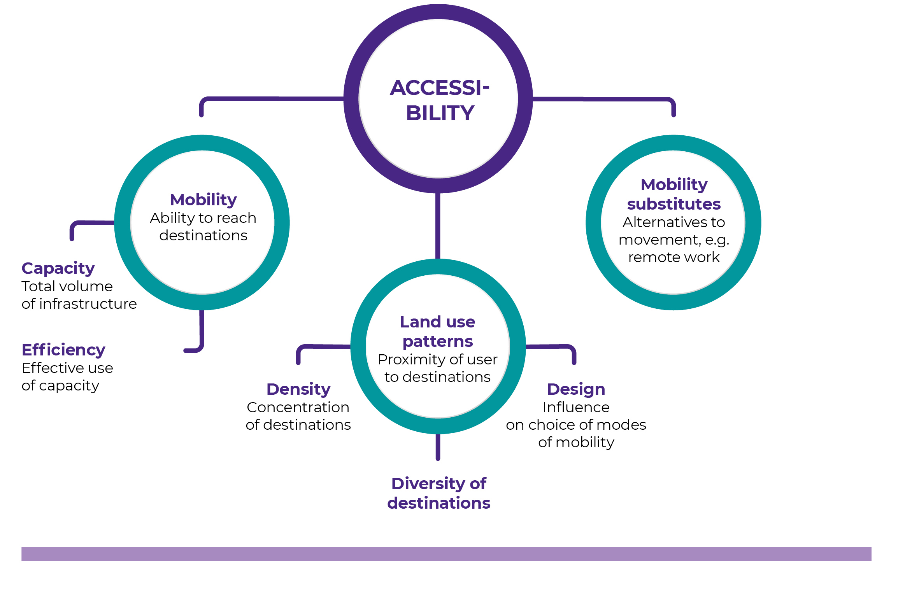

```

```{block, type='imgsource'}
<span class="imgsource-source">Source:</span> Discovering Urbanism 2010.
```

```{block, type='casebox'}
<h3> A sustainable urban mobility plan</h3>

The purpose of a sustainable mobility plan is to create a sustainable transport system. This means meeting people’s current and future mobility needs using modes of mobility that do not damage the human environment ([LiLiA 2017](#LiLiA2017)). Such an organisation of mobility requires a convenient public transport network, seamless switching between modes of mobility, development of active modes of mobility (e.g. cycling and walking) and a reduction of the need for cars. The European Commission adopted an action plan on urban mobility in 2009 and supports its implementation at the level of EU member states through the creation of cooperation and knowledge networks, data gathering and financial investments ([Eltis 2019](#ELTIS2019)).  
```

### Life in low-density areas is car-centred {-.chapter1_section}

Surveys by the Estonian Road Administration on satisfaction with public transport show that people’s satisfaction with the quality and accessibility of public transport within counties has decreased. Arrival times, routes and connections between routes are the greatest sources of dissatisfaction. Even if the locations of stops and limited departures a day make public transport accessible to a large part of the population ([Figure 1.5.3](#figure153)), this does not mean that it can actually compete with car transport in terms of travel time and the number of connections. According to the 2014 survey ‘Satisfaction of inhabitants with local public services’ by Saar Poll, satisfaction with and competitiveness of public transport are higher in towns than in lower-density areas; that is, peri-urban areas and remote areas far from urban centres. In low-density areas, especially in areas of low demand, public transport departures are infrequent and it is difficult for people to time their movements, especially if journeys have to be combined.

<p class="caption" id="figure153"><span class="figure-number">Figure 1.5.3.</span> Access to public transport in Estonia (assessed by the nearness of stops and frequency of departures)</p>

```{r, figure153, out.width='100%', fig.asp=.75, fig.align='center', echo=FALSE, message=FALSE}

library(sf)          # classes and functions for vector data
library(raster)      # classes and functions for raster data
library(tmap)
library(svglite)

Settlements <- st_read(dsn ="../data/15_fig3_data/EKSPORT_3301-N0RqvBQsFGT19Q0M-t7.shp")
head(as.data.frame(Settlements))

Settlements$VAARTUS <- as.numeric(as.factor(Settlements$VAARTUS)) -1

names(Settlements)[names(Settlements) == "VAARTUS"] <- "Residents with good access (%)"

Roads <- st_read(dsn ="../data/15_fig3_data/tee.shp")
head(as.data.frame(Roads))

Roads <- subset (Roads, TYYP != c("Tänav"), select=c(NIMETUS,TYYP, geometry))
Roads <- subset (Roads, TYYP != c("Kõrvalmaantee"), select=c(NIMETUS,TYYP, geometry))
Roads <- subset (Roads, TYYP != c("Muu tee"), select=c(NIMETUS,TYYP, geometry))
Roads <- subset (Roads, TYYP != c("Ramp või ühendustee"), select=c(NIMETUS,TYYP, geometry))

Roads$TYYP <- "Main and support roads"

fig_153_plot <- tm_shape(Settlements) +
    tm_fill("Residents with good access (%)", title="Residents with good access to public transport (%)", popup.vars="Residents with good access (%)",id="NIMI", breaks=c(0,1,25,50,75,100), palette = c("#E6E3DA", "#DAD4E6","#B6A8CD", "#917DB5","#482683")) +
    tm_borders(col="white", alpha=0) +

    tm_layout(
      outer.margins=0, inner.margins=c(.02, .1, .02, .02),asp=1920/1080,
      legend.outside = FALSE,
      legend.format=list(text.separator="..."),
      frame = FALSE) +

    tm_shape(Roads) + tm_lines(col = "TYYP", legend.col.show = TRUE,palette = c("#3A404A", "#3A404A"), title.col="",popup.vars=NULL) +

      tm_view (
        set.zoom.limits = c(7, 16),
        view.legend.position = c("left","bottom"),
        set.bounds = c(21.6397953631, 57.4745283067, 28.1316992531,59.8110903998)
      )

tmap_mode("view")
fig_153_plot

#tmap_save(tm = fig_153_plot, filename = "figure153.png")
#tmap_save(tm = fig_153_plot, filename = "figure153.pdf")

#svg(filename="figure.svg")
#fig_153_plot
#dev.off()

```

```{block, type='imgsource'}
<div><span class="imgsource-source">Source:</span> Statistics Estonia 2018; Nõmm 2018.</div>
<div><a class="data-btn" href="../data/15_fig3_data.zip"><i class="fa fa-download" aria-hidden="true"></i>Download data</a></div>
```

Intensifying car traffic reduces the number of travellers using public transport and this makes good services more expensive and difficult to provide in low-density areas. The decreasing quality and frequency of public transport in turn favours motorisation. According to the Estonian Road Administration, the number of passengers on county routes nearly halved in 2003–2016; the decrease was especially rapid in 2003–2009 ([Figure 1.5.4](#figure154)). These years were a period of rapid increase in wealth and motorisation that led to a shift in modes of mobility in favour of cars. The number of users of public transport has decreased even though the mileage of public transport vehicles has not decreased during the same period.

<p class="caption" id="figure154"><span class="figure-number">Figure 1.5.4.</span> Changes in number of passengers and distance travelled on county routes in Estonia, 2003–2016</p>
<div class="desktop-plot">
```{r, figure154, out.width='90%', fig.asp=.5625, fig.align='center', echo=FALSE, message=FALSE}

library("tidyverse")

 fig154_data <- read.csv ("../data/15_fig4_data.csv", header=TRUE, fileEncoding="utf-8", sep=";")

 fig154_data$variable_eng[grepl("Läbisõit",fig154_data$variable)]<-"Distance travelled (million km)"
fig154_data$variable_eng[grepl("Sõitjate arv",fig154_data$variable)]<-"Number of passengers (million)"


  fig154_plot <- ggplot(data = fig154_data) +
    geom_line(mapping = aes(x=year, y=value, colour=variable_eng, group=variable, text = paste("", variable_eng,
                         "<br>", value,
                         "<br>", year)), size=0.75) +
    scale_x_continuous(breaks=c(2003,2004,2006,2008,2010,2012,2014,2016), expand = c(0, 0), limits=c(2003,2016.5)) +
    scale_y_continuous(expand = c(0, 0), limits=c(0,40)) +
    scale_colour_manual(values=c("#482683","#369B9E")) +
    labs(y="", x="") +
    expand_limits (y=0)

  fig154_theme <- theme (
         text=element_text(family="Montserrat")
  )

ggplotly(fig154_plot + fig_theme_general + fig154_theme, tooltip = "text" ) %>%
config(displayModeBar = F)   %>%
layout(legend = list(orientation = "h",y = 1.15)) %>%
layout(xaxis = list(fixedrange = TRUE)) %>%
layout(yaxis = list(fixedrange = TRUE))

 # ggsave(path="exported_figures/PDF/chapter1",filename="fig154.pdf", height=120, width=200, units="mm",encoding = "ISOLatin9.enc")
```

</div>
<div class="mobile-plot">
```{r, out.width='100%', fig.asp=.75, fig.align='center', echo=FALSE, message=FALSE, warnings=FALSE}

print(fig154_plot + fig_theme_general + fig154_theme)

```
</div>

``` {block, type='imgsource'}
<div><span class="imgsource-source">Source:</span> Estonian Road Administration.</div>
<div><a class="data-btn" href="../data/15_fig4_data.csv"><i class="fa fa-download" aria-hidden="true"></i></i>Download data</a></div>
```

```{block, type='casebox'}
<h3>A mobility survey in Saaremaa for organising demand-based transport</h3>

Demand-responsive transport has the potential of offering more flexible and cost-effective solutions in low-density areas. A pilot project carried out in Saaremaa in 2018 by the Centre for Applied Anthropology of Estonia explored how people perceived their travel options and what mobility strategies work in low-density areas. The project revealed that in low-density areas, mobility poses an issue mainly for domestic parents of young children, seniors with reduced mobility, people working shifts in another village or in Kuressaare, and for children and young people attending extracurricular activities in towns. The idea of demand-responsive transport was received with reservations in Saaremaa. People currently prefer to get a ride home in a friend’s car rather than take a bus, even if the car journey involves additional stops and detours. People have created and use Facebook travel groups to share rides. Therefore, elements of demand-responsive transport and ride-sharing are already present in the daily practice of local people. More organised and professional ride-sharing developments that offer better travel options in low-density areas certainly deserve more attention by transport planners in the future.
```

### Suburbs are more car-centred than urban centres {-.chapter1_section}

```{block, type='blockquote-right'}
Intensifying car traffic reduces the number of travellers using public transport and this makes good services more expensive and difficult to provide in low-density areas.
```
Urban sprawl has occurred in Estonia’s largest urban regions over the past two decades: new residential, commercial, service and production areas have been established outside densely populated areas, but as the new areas lack integrated planning, the inhabitants commute between the city centre and suburban residential districts, often using private cars. Over the past 20 years, the population has increased considerably in Tallinn’s immediate surroundings ([Figure 1.5.5](#figure155)), but decreased by 10–20% in the more remote municipalities of Harjumaa county. According to the commuting data of the 2011 census by Statistics Estonia, there are 28 functional areas in Estonia around urban centres with populations over 5,000. While many of these urban centres are small, especially in southern Estonia, one of them – Tallinn – impacts people’s mobility across the country.

<p class="caption" id="figure155"><span class="figure-number">Figure 1.5.5.</span> Number of cars per household in Tallinn (2016) and Harjumaa (2017) and population increase in Tallinn’s immediate surroundings over the past 20 years. Population in 1998 = 100%</p>

```{r, figure155, out.width='90%', fig.align='center', echo=FALSE, message=FALSE}

library("tidyverse")
library(gridExtra)
library(grid)

  fig155_data1 <- read.csv ("../data/15_fig5_data1.csv", header=TRUE, fileEncoding="utf-8")

  fig155_data2 <- read.csv ("../data/15_fig5_data2.csv", header=TRUE, fileEncoding="utf-8")

  fig155_line <- data.frame(x=c(0, 5),
                y=c(100, 100))

  fig155_data1$number_of_cars_eng[grepl("1 auto",fig155_data1$number_of_cars)]<-"1 car"
  fig155_data1$number_of_cars_eng[grepl("2 või enam autot",fig155_data1$number_of_cars)]<-"2 or more cars"
  fig155_data1$number_of_cars_eng[grepl("Pole autot",fig155_data1$number_of_cars)]<-"No car"

  fig155_data1$number_of_cars_eng <- factor (  fig155_data1$number_of_cars_eng, levels = c("No car", "1 car", "2 or more cars"))

  fig155_data2$growth_of_population_eng[grepl("Viimsi vald",fig155_data2$growth_of_population)]<-"Viimsi\n municipality"
  fig155_data2$growth_of_population_eng[grepl("Harku vald",fig155_data2$growth_of_population)]<-"Harku\n municipality"
  fig155_data2$growth_of_population_eng[grepl("Rae vald",fig155_data2$growth_of_population)]<-"Rae\n municipality"
  fig155_data2$growth_of_population_eng[grepl("Kiili vald",fig155_data2$growth_of_population)]<-"Kiili\n municipality"


  fig155_plot1 <- ggplot(data = fig155_data1) +
    geom_bar(mapping = aes(x=area, y=value, fill=area), width=0.7, stat="identity", position = "dodge") +
    scale_fill_manual(values=c("#369B9E","#482683")) +
    facet_wrap(~number_of_cars_eng, nrow=1) +
    labs(y="%", x="") +
    expand_limits (y=0)

    fig155_plot2 <- ggplot() +
    geom_bar(data = fig155_data2, mapping = aes(x=growth_of_population_eng, y=value, fill=growth_of_population_eng), width=0.7, stat="identity") +
      geom_line(data = fig155_line, mapping=aes(x=x, y=y), col="#482683") +
    scale_fill_manual(values=c("#B6A8CD","#b1e0f9","#369B9E","#482683")) +
    labs(y="%", x="") +
    expand_limits (y=0)

    fig155_theme1 <- theme(
          panel.grid.major.x = element_blank() ,
          panel.grid.minor.x = element_blank(),
          legend.position = "none",
          strip.text.x = element_text(size = 8),
          text = element_text(size = 9)
    )

        fig155_theme2 <- theme(
          panel.grid.major.x = element_blank() ,
          panel.grid.minor.x = element_blank(),
          legend.position = "none",
           text = element_text(size = 10)

    )

grid.arrange(fig155_plot1 + fig_theme_general + fig155_theme1, fig155_plot2  + fig_theme_general + fig155_theme2, ncol = 2)

#ggsave(path="exported_figures/PDF/chapter1",filename="fig155a.pdf",fig155_plot1 +fig_theme_general + fig155_theme1, height=140, width=140, units="mm")
#ggsave(path="exported_figures/PDF/chapter1",filename="fig155b.pdf",fig155_plot2 + fig_theme_general +  fig155_theme2, height=140, width=140, units="mm")
```

``` {block, type='imgsource'}
<div><span class="imgsource-source">Source:</span> Kantar Emor 2018; Statistics Estonia 1998, 2018.</div>
<div><a class="data-btn" href="../data/15_fig5_data.zip"><i class="fa fa-download" aria-hidden="true"></i></i>Download data</a></div>
```

As in low-density rural areas, life without a car is also complicated in peri-urban areas. In areas just outside Tallinn in Harjumaa, an average of eight households out of ten have a private car, while nearly half of the households have two or more cars ([Figure 1.5.5](#figure155)). A mobility study of Tallinn’s direct surroundings conducted by Kantar Emor in 2018 for the Estonian Road Administration shows that the inhabitants of Harjumaa use a car for nearly two out of three trips, while Tallinn residents only make about half of all trips by car. According to TNS Emor 2015 data, people living in urban centres use cars less than those living in the suburbs. An opposite trend is apparent in the use of public transport. The percentage of public transport users is higher in Tallinn than in the city’s hinterland. There are also differences within the hinterland. In the Lääne-Harju rural municipality, which includes the town of Keila with a good electric rail connection with Tallinn, people use the train for 16% of their trips. On the other hand, in the Saku rural municipality, which has a rail connection but the train service is less frequent and connections with Tallinn are poorer, only 1% of all trips to the capital city are taken by train.

```{block, type='blockquote-left'}
Going to work on foot or by public transport has decreased since the late 1990s, while driving to work by car has doubled.
```
Commuting trends over the past decade show that using cars has become more popular in Tallinn as well as elsewhere in Harjumaa ([Figure 1.5.6](#figure156)). The relative share of walking to work has decreased considerably in peri-urban areas, as jobs are increasingly located in Tallinn. The share of those who walk to work has remained unchanged within Tallinn. The share of using public transport has decreased from 50% to 35% in Tallinn and from 26% to 18% elsewhere in Harjumaa. The nationwide trend is similar: Going to work on foot or by public transport has decreased since the late 1990s, while driving to work by car has doubled ([Figure 1.5.7](#figure157)).


<p class="caption" id="figure156"><span class="figure-number">Figure 1.5.6.</span> Modes of travelling to work in Tallinn and the rest of Harjumaa, 2000–2017</p>
<div class="desktop-plot">
```{r, figure156, out.width='95%', fig.asp=.75, fig.align='center', echo=FALSE, message=FALSE}

library("tidyverse")
library("plotly")

 fig156_data <- read.csv ("../data/15_fig6_data.csv", header=TRUE, fileEncoding="utf-8")

 fig156_data$value=as.numeric(levels(fig156_data$value))[fig156_data$value]

  fig156_data$variable_eng[grepl("Jalgsi",fig156_data$variable)]<-"On foot"
  fig156_data$variable_eng[grepl("Sõiduautoga",fig156_data$variable)]<-"By car"
  fig156_data$variable_eng[grepl("Ühissõidukiga",fig156_data$variable)]<-"By public transport"

  fig156_data$variable_eng <- factor (fig156_data$variable_eng, levels = c("On foot", "By car", "By public transport"))

  fig156_plot <- ggplot(subset(fig156_data, variable_eng %in% c("On foot", "By car", "By public transport"))) +
    geom_line(mapping = aes(x=year, y=value, colour=variable_eng, group=variable_eng, text = paste("", variable_eng,
                         "<br>", year,
                         "<br>", value)), size=0.75) +
    scale_x_continuous(breaks=c(2000,2002,2004,2006,2008,2010,2012,2014,2016), expand = c(0, 0), limits=c(2000,2017.5)) +
    scale_y_continuous(expand = c(0, 0), limits=c(0,71)) +
    scale_colour_manual(values=c("#1f9a9e","#482683","#83d0f5"))+
    facet_wrap(~area, nrow=1) +
    labs(y="Share of modal use (%)", x="") +
    expand_limits (y=0)

  fig156_theme <- theme (
           axis.text.x = element_text(angle=45, margin = margin(t = 0, r = 0, b = 0, l = 0), hjust=1.1),
            text=element_text(family="Montserrat")
  )

ggplotly(fig156_plot + fig_theme_general + fig156_theme, tooltip = "text" ) %>%
config(displayModeBar = F)   %>%
layout(legend = list(orientation = "h",y = 1.15)) %>%
layout(xaxis = list(fixedrange = TRUE)) %>%
layout(yaxis = list(fixedrange = TRUE))


  #ggsave(path="exported_figures/PDF/chapter1",filename="fig156.pdf",fig156_plot + fig156_theme +fig_theme_general, height=90, width=150, units="mm")
```
</div>
<div class="mobile-plot">
```{r, out.width='100%', fig.asp=.75, fig.align='center', echo=FALSE, message=FALSE, warnings=FALSE}

  print(fig156_plot + fig_theme_general + fig156_theme)

```
</div>

``` {block, type='imgsource'}
<div><span class="imgsource-source">Source:</span> Statistics Estonia.</div>
<div><a class="data-btn" href="../data/15_fig6_data.csv"><i class="fa fa-download" aria-hidden="true"></i></i>Download data</a></div>
```

Motorisation has been a nationwide trend. According to the Estonian Road Administration ([2017](#Maanteeamet2017)) the mileage of cars has increased 16% in 2013–2017. While public transport remains competitive in regional centres, the people living in peri-urban and remote areas increasingly depend on cars. This means that efforts to reduce the use of cars at national and municipal levels have not been sufficient.

<p class="caption" id="figure157"><span class="figure-number">Figure 1.5.7.</span> Main mode of travelling to work, duration of journey and distance to work for employed people in Estonia, 1997–2017</p>
<div class="desktop-plot">
```{r, figure157, fig.align='center', echo=FALSE, message=FALSE, fig.asp=0.75}

library("tidyverse")
library("scales")

 fig157_data1 <- read.csv ("../data/15_fig7_data1.csv", header=TRUE, fileEncoding="utf-8")

fig157_data1$variable_eng[grepl("Jalgsi",fig157_data1$variable)]<-"On foot"
fig157_data1$variable_eng[grepl("Töötab kodus",fig157_data1$variable)]<-"Works at home, works and lives in the same place"
fig157_data1$variable_eng[grepl("Ühissõidukiga",fig157_data1$variable)]<-"Public transport"
fig157_data1$variable_eng[grepl("Ametiauto, töökoha sõidukiga",fig157_data1$variable)]<-"Take-home vehicle"
fig157_data1$variable_eng[grepl("Isikliku autoga",fig157_data1$variable)]<-"Private car"
fig157_data1$variable_eng[grepl("Jalgratta, mopeedi, mootorrattaga",fig157_data1$variable)]<-"Bicycle, moped, motorcycle"

fig157_data1$variable_eng <- factor ( fig157_data1$variable_eng, levels = c("Works at home, works and lives in the same place","Public transport", "Take-home vehicle","Private car","Bicycle, moped, motorcycle","On foot"))

 fig157_data2 <- read.csv ("../data/15_fig7_data2.csv", header=TRUE, fileEncoding="utf-8")

fig157_data2$variable_eng[grepl("Keskmine põhitöökohale jõudmise aeg",fig157_data2$variable)]<-"Average time of travel to main job (min)"
fig157_data2$variable_eng[grepl("Põhitöökoha keskmine kaugus elukohast",fig157_data2$variable)]<-"Average distance from place of residence to main job (km)"

fig157_data2$variable_eng <- factor ( fig157_data2$variable_eng, levels = c("Average time of travel to main job (min)","Average distance from place of residence to main job (km)"))


  fig157_plot1 <- ggplot() +
    geom_bar(data = fig157_data1, mapping = aes(x=year, y=value, fill=variable_eng, text = paste("", variable_eng,
                         "<br>", year,
                         "<br>", value,"%")), width=0.7, stat="identity") +
    scale_fill_manual(values=c("#2d6a6d","#b1e0f9","#4bb1ca","#6D519C","#369B9E","#241342")) +

    scale_x_continuous(breaks=c(1997, 1999,2001,2003,2005,2007,2009,2011,2013,2015,2017)) +
    scale_y_continuous(breaks=c(20, 40,60,80,100)) +
    guides(fill=guide_legend(nrow=6,byrow=TRUE)) +
    labs(y="Main mode of travel to work (%)", x="")


  fig157_plot2 <- ggplot() +
    geom_line(data = fig157_data2, mapping = aes(x=year, y=value, colour=variable_eng,group=variable_eng, text = paste("", variable_eng,
                         "<br>", value,
                         "<br>", year)), size=0.75) +
    scale_colour_manual(values=c("#369B9E","#482683")) +
    labs(y="", x="") +
    scale_x_continuous(breaks=c(1997, 1999,2001,2003,2005,2007,2009,2011,2013,2015,2017), expand = c(0, 0), limits=c(1997,2017.5)) +
    scale_y_continuous(breaks=c(5, 10,15,20,25), expand = c(0, 0), limits=c(0,25)) +
    expand_limits (y=0)


    fig157_theme1 <- theme (
          panel.grid.major.x = element_blank() ,
          panel.grid.minor.x = element_blank(),
          axis.text.x = element_text(angle=45, margin = margin(t = 7, r = 0, b = 0, l = 0), hjust=1.1),
          legend.position = "right",
            text=element_text(family="Montserrat")

  )
    fig157_theme2 <- theme (
           text=element_text(family="Montserrat")
  )

ggplotly(fig157_plot1 + fig_theme_general + fig157_theme1, tooltip = "text" ) %>%
config(displayModeBar = F)   %>%
layout(legend = list(orientation = "h",y = 1.15)) %>%
layout(xaxis = list(fixedrange = TRUE)) %>%
layout(yaxis = list(fixedrange = TRUE))


ggplotly(fig157_plot2 + fig_theme_general + fig157_theme2, tooltip = "text" ) %>%
config(displayModeBar = F)   %>%
layout(legend = list(orientation = "h",y = 1.15)) %>%
layout(xaxis = list(fixedrange = TRUE)) %>%
layout(yaxis = list(fixedrange = TRUE))


  #ggsave(path="exported_figures/PDF/chapter1",filename="fig157a.pdf",fig157_plot1  +fig_theme_general + fig157_theme1, height=120, width=210, units="mm")

    #ggsave(path="exported_figures/PDF/chapter1",filename="fig157b.pdf",fig157_plot2  +fig_theme_general + fig157_theme2, height=100, width=210, units="mm")
```

</div>
<div class="mobile-plot">
```{r, out.width='100%', fig.asp=.75, fig.align='center', echo=FALSE, message=FALSE, warnings=FALSE}

  print(fig157_plot1 + fig_theme_general + fig157_theme1)
  print(fig157_plot2 + fig_theme_general + fig157_theme2)

```
</div>

``` {block, type='imgsource'}
<div><span class="imgsource-source">Source:</span> Statistics Estonia.</div>
<div><a class="data-btn" href="../data/15_fig7_data.zip"><i class="fa fa-download" aria-hidden="true"></i></i>Download data</a></div>
```

Not all journeys are made to go to work or for shopping. Nearly one-tenth of journeys by car are made to take children to school or kindergarten. In the peri-urban areas of Tallinn, 12% of people drive daily to give rides to others, within which women up to the age of 34 represent the largest group ([Kantar Emor 2018](#Kantar2018)). Tallinn therefore repeats the global experience that living outside a city means actively using a car, giving rides to children, and that mostly mothers fulfil this role ([McCarthy et al. 2017](#McCarthy2017)).

```{block, type='blockquote-right'}
Good public transport connections and non-motorised traffic networks in the suburbs would help create an environment with a variety of uses, in which people would not have to travel to the city for every activity or service.
```
Although the growth of suburbs has been studied to a fair extent, the changing of the public space due to urban sprawl or the expansion of suburbs has not been discussed sufficiently. Some of the effects are as expected. For example, in car-dependent environments, those family members that do not drive a car themselves, especially children under 18, depend on the willingness, time and availability of their parents to transport them. Contacts between the various groups of society also become less frequent. Living in the suburbs and travelling by car considerably reduces socialisation on the street or encounters with strangers on public transport, which are so typical of an urban lifestyle. Even though suburban communities may have a community spirit and inner democracy, such a community consists of socially and economically similar people and their encounters with different types of people are scarce. Furthermore, surveys show that the daily travelling of urban residents leads to a lower environmental burden than that of peri-urban and rural inhabitants ([Poom 2017](#Poom2017)). But it is the urban centres that suffer the most from the impact of motorisation, such as air pollution, noise, traffic jams and the use of the public space for parking.

In urban planning, it is essential to link the planning and management of mobility in the city centre to that in the suburbs. Good public transport connections and non-motorised traffic networks in the suburbs would help create an environment with a variety of uses, in which people would not have to travel to the city for every activity or service. Better access to services in the suburbs would improve the quality of the public space in both the suburbs and urban centres. In urban regions, better accessibility would increase participation in social life and lead to a more coherent society.

### The development of mobility in urban centres is based on cars {-.chapter1_section}

Urban sprawl and the related motorisation influence the quality of the public space in urban centres as a facilitator of people-to-people contact and communication. If jobs and services disappeared from the city centre, suburban inhabitants would have no reason to go there any more. This in turn means that shops and cafés in the centre would lose business. New buildings in urban centres – usually standard-design grocery stores in small towns and office buildings in larger towns – tend to be too bulky for good public space. The quality of public space, including street space, has a considerable impact on people’s willingness, desire and opportunities to move around and be in the urban space. The quality of public space is not easily measured or quantified, while the time spent in cars and traffic jams inevitably reduces opportunities to meet and socialise in the street space.

```{block, type='blockquote-left'}
The quality of public space, including street space, has a considerable impact on people’s willingness, desire and opportunities to move around and be in the urban space.
```
Mobility development in Estonia’s largest towns has so far been based on the expectation of continuing motorisation. Large road projects, such as Reidi Road, Haabersti roundabout and the planned Rävala connection in Tallinn, as well as the ring road through Tartu that is part of a national highway, illustrate the political willingness to improve the quality of car travel. While these very expensive road building projects are under way, insufficient attention is paid to ways of facilitating other modes of mobility that would be equally available to people with lower and higher incomes. Giant road structures disrupt the human-dimension of public space suitable for pedestrians, and therefore encourage even greater motorisation. In planning documents, the number of parking places is usually determined by standards without considering the location of the site or the proximity of public transport. Measures such as planning settlements near public transport routes or establishing and maintaining bicycle paths would facilitate a wide range of modes of mobility and thereby reduce the need for owning and using a private car. Cyclists and pedestrians are mentioned in the current urban, suburban and rural plans mostly in the context of safety. Preferential strategic planning of non-motorised traffic infrastructure as an alternative to car traffic is not a priority in any of the municipalities.

Not enough competitive and attractive alternatives to car traffic have been offered to cater for walking and cycling, even though the bicycle is one of the fastest modes of mobility during peak hour and for distances under 3 km ([Figure 1.5.8](#figure158)). According to data on Tallinn (<a href="https://www.tallinn.ee/est/Tallinn-arvudes">Tallinn arvudes 2018</a>), it had 273 km of bicycle and pedestrian paths in 2017, of which nearly 90% were tracks for non-motorised traffic shared with pedestrians.

<p class="caption" id="figure158"><span class="figure-number">Figure 1.5.8.</span> Comparison of the competitiveness of modes of mobility in terms of time</p>

```{r, figure158, fig.align='center', out.width='80%', echo=FALSE, message=FALSE}

library("tidyverse")

 fig158_data <- read.csv ("../data/15_fig8_data.csv", header=TRUE, fileEncoding="utf-8", sep = ";")

 fig158_data$liikumisviis_eng[grepl("Autoga", fig158_data$liikumisviis)]<-"By car"
 fig158_data$liikumisviis_eng[grepl("Jala", fig158_data$liikumisviis)]<-"On foot"
fig158_data$liikumisviis_eng[grepl("Jalgrattaga", fig158_data$liikumisviis)]<-"By bicycle"

fig158_data$liikumisviis_eng <- factor (fig158_data$liikumisviis_eng, levels = c("By car","On foot", "By bicycle"))

  fig158_line <- data.frame(x=c(0,1,1,1,0,3,3,3),
                y=c(14,14,14,0,17,17,17,0), line=c(1,1,2,2,3,3,4,4))

  fig158_plot <- ggplot() +
    geom_line(fig158_line, mapping = aes(x=x, y=y, group=line), colour="#3A404A",size=0.5, show.legend = NA, linetype = "dashed") +

    geom_line(data = fig158_data, mapping = aes(x=distance, y=time, colour=liikumisviis_eng, group=liikumisviis_eng), size=1) +
    scale_x_continuous(breaks=c(0,1,2,3,4,5),expand = c(0, 0), limits=c(0,5.1)) +
    scale_y_continuous(expand = c(0, 0), limits=c(0,70)) +
    expand_limits (y=0) +
    scale_colour_manual(values=c("#482683","#369B9E","#b1e0f9")) +
    labs(y="Elapsed time (min)", x="Distance (km)")


    fig158_theme <- theme (
           text=element_text(family="Montserrat")
  )

  print(fig158_plot + fig_theme_general + fig158_theme)

  #ggsave(path="exported_figures/PDF/chapter1",filename="fig158.pdf",fig158_plot  +fig_theme_general + fig158_theme, height=90, width=100, units="mm")
```

``` {block, type='imgsource'}
<div><span class="imgsource-source">Source:</span> Tallinn Bicycle Strategy 2018–2027.</div>
<div><a class="data-btn" href="../data/15_fig8_data.csv"><i class="fa fa-download" aria-hidden="true"></i></i>Download data</a></div>
```

The coverage of bicycle paths is more than two times lower in Tallinn compared to the capital cities (Helsinki, Stockholm) of Estonia’s neighbouring countries ([Otsus 2016](#Otsus2016)). For example, in the centre of Tallinn, the bicycle path network is fragmented and has poor connections to the railway and bus stations. Bicycles could be used much more in our climate zone throughout the year: according to Statistics Estonia, only 1.6% of the inhabitants of Tallinn used a bicycle to go to work in 2017, while in the neighbouring capitals of similar climate such as Helsinki and Stockholm, 11% and 9% respectively of all trips were made by bicycle ([ECF 2013](#ECF2013)). This is explained by the general practice of developing travel options in Estonia, which has not valued the creation of space for bicycles so far.

In smaller towns, car traffic is lighter, while the lack of footpaths and of contemporary public space in general is a more acute problem. This is especially evident in settlements divided by major highways, such as Rõngu or Adavere. However, a number of smaller municipalities have understood the importance of human-friendly space and good accessibility, especially for the younger population; they have built bicycle and pedestrian paths and bicycle parking facilities and developed central squares. Where local public transport is minimal or absent and distances are short, these settlements have great potential for convenient non-motorised traffic.

### Future trends: enabling various modes of mobility in suitable volumes will reduce the use of cars {-.chapter1_section}

Young people in many Western European countries such as the United Kingdom are increasingly giving up car ownership. The reasons behind this trend are the reduced subsidies for work-related travel, higher expenses of owning a private car, and improved public transport ([Le Vine and Jones 2012](#Le-Vine2012)). Changes that will reduce the use of cars are also appearing in Estonia. For example, several mobile applications have been developed for rental and ride-sharing services in urban regions that reduce the need to own a car. The change in modes of mobility is also driven by the development of home delivery services for goods and food, and of mail orders for goods. By offering convenience through alternative solutions, such trends make it easier to not own a car.

```{block, type='blockquote-right'}
Cyclists and pedestrians are mentioned in the current urban, suburban and rural plans mostly in the context of safety.
```
Sustainable mobility requires human-centred planning that focuses on the quality of life and accessibility. Therefore, measures that combine the direction of land use, offer convenient alternatives to car users, establish the infrastructure needed for that, and shape awareness and attitudes would need to be chosen. The needs and challenges vary somewhat depending on the particular region. For families living in rural areas, participating in the usual activities in society means almost always driving by car. At the same time, transport on demand and community ride-sharing services offer new alternatives to owning a private car and also to a deficient public transport system. For example, in the Saaremaa municipality, a pilot project is planned for on-demand and social transport solutions, in which people can provide information about the dates and times of their travel, which can form the basis on which timetables are prepared. Such models have been tested for short periods in Lääne-Virumaa and Setomaa. Sustainable mobility planning also requires multimodality: cars will still be necessary for some journeys, but it is important that there are also sufficient non-motorised modes of transport for the necessary trips. Further opportunities lie in innovative usage models that, instead of the costs of owning a car, offer packages for a monthly fee that allow the use of a certain means of transport. Mobility-as-a-Service is already being taken up in several countries, with Finland as one of the leaders in the field.

```{block, type='blockquote-left'}
Sustainable mobility requires human-centred planning that focuses on the quality of life and accessibility.
```
The functioning of easily accessible urban regions requires a preference for multipurpose land use. In such an arrangement, places of residence, work and spending leisure time are in close proximity, while urban encroachment is directed toward areas with good public transport connections. A private car need not be the fastest means of travelling between places; a ‘reasonable level of congestion’ or ‘reasonable travel time’ is a better unit for transport planning than minimising car travel time by a few minutes ([Banister 2008](#Banister2008)). Combining modes of mobility in urban centres and suburbs would maintain the advantages of living in a low-density area while facilitating the use of public transport instead of cars. For example, public transport can be connected to bicycle path networks by building not only car parks, but also bicycle parks near railway stations and bus stops. Tallinn peri-urban areas already have more bicycle traffic than the high-density city. Sustainable and mobility-promoting solutions will be easier to achieve if the various development plans, strategies and mobility plans are coordinated so that the development of settlement and mobility are approached as an integral whole. Despite a few positive examples, such as the mobility plan for the Tallinn urban region that is currently being prepared, local governments have cooperated very little so far.

```{block, type='blockquote-left'}
Combining modes of mobility in urban centres and suburbs would maintain the advantages of living in a low-density area while facilitating the use of public transport instead of cars.
```
Sustainable planning in an urban environment also requires paying attention to those members of society that have no opportunity to use a car. In an ageing society, it is important that all groups of society can access good public space and services. An urban centre can counter the impacts of urban sprawl if it is planned for pedestrians; that is, has convenient footpaths, safe and convenient pedestrian crossings, and a pleasant street front supporting social activities. By developing an inclusive physical urban space, we ultimately favour all groups in society.

It is true that the car enables mobility in certain situations and certainly for some senior citizens and people with mobility difficulties. Motorisation has also helped to bring the various Estonian regions closer to each other and made it possible to live in remote areas of the country. However, excessive dependence on cars is detrimental to the functioning of society. It makes accessibility a privilege only enjoyed by part of society, thus reducing social contact. Ensuring accessibility and good public space across Estonia requires specific intervention into the design of urban public space as well as offering creative solutions for low-density areas.

### *Acknowledgements* {-.chapter1_section #acknowledgments-15}

*The work of Tauri Tuvikene on this publication was supported by the project ‘Public transport as public space in European cities: Narrating, experiencing, contesting (PUTSPACE)’; financial support was provided by the HERA Joint Research Programme (www.heranet.info), which is co-funded by AKA, BMBF via DLR-PT, ETAg, and the European Commission through Horizon 2020.*

### References {-.subreferences #references-15}

<p id="Banister2008">Banister, D. 2008. The sustainable mobility paradigm. – Transport Policy, 15 (2), 73–80.</p>

<p id="Bassett2008">Bassett, D. R., Pucher, J., Buehler, R., Thompson, D. L., Crouter., S. E. 2008. Walking, cycling, and obesity rates in Europe, North America, and Australia. – Journal of Physical Activity and Health, 5 (6), 795–814.</p>

<p id="Discovering2010">Discovering Urbanism 2010. From a mobility to an accessibility orientation. http://discoveringurbanism.blogspot.com/2010/02/from-mobility-to-accessibility.html.</p>

<p id="ECF2013">ECF – European Cyclist Federations 2013. The benefits of cycling: unlocking their potential for Europe. https://ecf.com/resources/cycling-facts-and-figures.</p>

<p id="ELTIS2019">Eltis – The Urban Mobility Observatory 2019. The Sustainable Urban Mobility Plan concept and guidelines. https://www.eltis.org/mobility-plans/sump-concept.</p>

<p id="Farrington2007">Farrington, J. H. 2007. The new narrative of accessibility: its potential contribution to discourses in (transport) geography. – Journal of Transport Geography, 15 (5), 319–30.</p>

<p id="Jüssi2017">Jüssi, M., Kalvo, R., Rannala, M., Savi, T. 2017. Tallinna rattastrateegia 2018–2027. Tallinn: Tallinna Kommunaalamet.</p>

<p id="Kantar2018">Kantar Emor 2018. Tallinna lähipiirkonna – Harjumaa (v.a Tallinna linn) ning Kohila ja Rapla valdade elanike liikumisviiside uuring. Tallinn: Maanteeamet.</p>

<p id="Le-Vine2012">Le Vine, S., Jones, P. 2012. On the Move: Making Sense of Car and Train Travel Trends in Britain. London: The Royal Automobile Club Foundation for Motoring Ltd.</p>

<p id="LiLiA2017">LiLiA – Tallinna piirkonna säästva linnaliikuvuse arengukava 2017. Tallinna LiLia 2035. Kontseptsioon. https://www.mnt.ee/sites/default/files/content-editors/Failid/Yldine/talilia_kontseptsioon_juuni2017.pdf.</p>

<p id="Maanteeamet2017">Estonian Road Administration 2017. Autopargi läbisõit 2017. https://www.mnt.ee/sites/default/files/survey/labisoit_2017.pdf.</p>

<p id="McCarthy2017">McCarthy, L., Delbosc, A., Currie, G., Molloy, A. 2017. Factors influencing travel mode choice among families with young children (aged 0–4): a review of the literature. – Transport Reviews, 37 (6), 767–781.</p>

<p id="Nõmm2018">Nõmm, T. 2018. Kolmel inimesel neljast on ühistransport hästi kättesaadav nii linnas kui ka maal. https://blog.stat.ee/tag/uhistransport.</p>

<p id="Otsus2016">Otsus, E. 2016. Tallinna jalgrattateede sidusus. BA thesis. University of Tartu.</p>

<p id="Poom2017">Poom, A. 2017. Spatial Aspects of the Environmental Load of Consumption and Mobility. PhD thesis. Tartu: University of Tartu Press.</p>

<p id="Pucher2005">Pucher, J., Buehler, R. 2005. Transport policies in Central and Eastern Europe. – Button, K. J., Hensher, D. A. (eds.). Transport Strategy, Policy, and Institutions. Oxford: Elsevier Press, 725–744.</p>

<p id="Rakendusliku2018">Centre for Applied Anthropology 2018. Liikuvusuuring Saaremaal nõudluspõhise transpordi korraldamiseks. http://www.antropoloogia.ee/uuringud.</p>

<p id="TNS2015">TNS Emor 2015. Liikumisviiside uuring elektrisõidukite lühirendi ja säästva transpordi kasutamise arendamiseks Tallinnas. Tallinn: Majandus- ja Kommunikatsiooniministeerium, KredEx.</p>

<!--chapter:end:01.5-chapter.Rmd-->

# Public urban space {.chapter2 .chapter2_section}
 <script>
  window.location = "introduction-2.html";
  </script>
## Introduction {-.chapter_section .chapter2_section .intro_section #introduction-2}
<h1>Public urban space</h1>
```{block, type='authors authors_eng'}
<div class="author-links">**[Epp Lankots](#epp-lankots)**</div>
<div><a class="print-btn" href="../sissejuhatus-2.html">EE</a></div>
```

### Key messages {-.chapter2_section #key-messages-2}

```{block, type='points'}
* In Estonia, the creation of public space has been unsystematic and fragmented between spatial plans with different focal points.

The creation of public space involves more than just the planning process. A narrow view that does not take into account the spatial impact of the development of transport, the education network and tourism among other areas does not help to achieve a better living environment. Creating an accessible, safe, seamlessly functioning and pleasant public space requires the public sector to combine the perspectives of different sectors and to manage the process.

* Material cultural heritage is a resource for improving the quality of public space and the living environment.

Taking into consideration the wider spatial impact of individual decisions when planning services in the counties will at once solve a number of important problems for the state. The exploitation and maintenance of cultural heritage will help to densify the centres of shrinking settlements and make small towns more attractive.

* Instead of relying on co-creation, the planning of public space in Estonian towns and cities has tended to focus more on procedure, being merely formally inclusive rather than informed by diverse knowledge and data.

The involvement of local communities and other stakeholders does not automatically guarantee high-quality public space, just like the collection of detailed data alone does not guarantee a democratic decision. It is important to strike a balance between the users of a space and the knowledge of experts. What is more, both experts and knowledge can be divided into different camps.
```

### Points of departure {-.chapter2_section #points-of-departure-2}

In the history of European civilisation, the links between democracy and physical space have manifested themselves primarily through public space, which has not only provided a forum for public discussion but also marked the economic, political and cultural centre of an urbanising society. Today, the meaning of public space has expanded even further. Rather than a clearly defined section of urban space (a square or market place), public space is widely understood as space that is accessible to everyone and allows strangers to meet face to face ([Parkinson 2012](#Parkinson2012)). This shift in meaning results from the increased movement of people in the Industrial Age as work began to move further away from the home and contacts with other people and different kinds of people increased ([Sennet 1986](#Sennet1986)). Rapid technological development in the 20th century has significantly changed the spatial environment, how it is used and perceived, as well as the way it is studied. With the ‘spatial turn’ in the humanities and social sciences during the final decades of the 20th century, attention shifted to the relationship between space and society – how social relations are manifested in space and how space in turn shapes these relationships ([Lefebvre 1974](#Lefebvre1974); [Soja 1989](#Soja1989)). Public space as a political arena is one of the key interdisciplinary concepts describing this turn.

```{block, type='blockquote-left'}
Rapid technological development in the 20th century has significantly changed the spatial environment, how it is used and perceived, as well as the way it is studied.
```

As urbanisation accelerates, public space is under increasing pressure everywhere in the world, and the occupation of new areas for large-scale residential development has led to a loss of diversity in the urban space. There are no recognisable centres in the peri-urban residential areas and their role has been taken over by massive shopping centres on the outskirts of the city. The reduction of public space leads to a homogenised spatial environment, receding local identity and the loss of the attractiveness and competitiveness of regions. The UN sustainable development goals also specify public space and its accessibility as a global challenge to ensure quality of life in an urbanising world.

This chapter focuses on the quality of physical public space in Estonian urban environments, or densely populated areas, and on the specific conditions that have shaped these since the restoration of Estonia’s independence. Throughout the chapter, the creation of public space is treated as a set of spatial decisions of wider public interest, showing how public space engages everyone – including those who do not go to city squares. Related to public space in this sense is the concept of the spatial design (*ruumiloome*), introduced in Estonia in recent years, which broadens the understanding of spatial planning and architecture to include experts in various fields. Spatial plans and construction documents, on this view, are only some of the methods of spatial design and cannot be used to account for all changes occurring in space, including public space. Good public space is thus characterised by knowledge-based co-creation that cuts across the boundaries of different forms of ownership and considers different experiences of the use of space.

```{block, type='blockquote-right'}
The reduction of public space leads to a homogenised spatial environment, receding local identity and the loss of the attractiveness and competitiveness of regions.
```
To helps us understand the processes affecting Estonian public space, we need to be aware of the impact of our recent past. The post-war modernisation of Estonia was carried out under Soviet rule, during which Estonia developed into a largely urbanised society. Urban planning aimed at the mass-construction of new housing and the trend towards eliminating the urban-rural divide have significantly influenced the spatial structure of present-day Estonian settlements. Spatial changes on such a large scale – the construction of residential centres around agricultural holdings in rural areas, redeveloped city centres and new residential districts in the cities – were only possible in the context of the total state ownership of land. The individual or community had no say in issues relating to the living environment (e.g. choice of residence or discussion of regional development). Public space in the sense of both the common space between houses and public squares was an ideologically charged topic in Soviet urban planning, but smaller units of space (e.g. residential buildings or apartments) can also be considered part of the public sphere at the time due to state ownership or variations of it (e.g. cooperative ownership). This extended public sphere, peculiar to the Soviet system, was replaced by an at times extreme individualism in the 1990s ([Taul 2013](#Taul2013)). The tension between the private and public still largely influences spatial planning and the status of public space in Estonia. The manifestations and traces of this tense relationship are discernible at different levels in Estonian cities and towns. For example, after the privatisation of apartments, the appearance of Soviet-era apartment blocks has changed, with windows replaced and balconies converted in different ways for each apartment, which also affects the experience of the public space, and private cars now occupying the common space between the houses. On a larger scale, this is reflected, for example, in pragmatic planning that accommodates the wishes of private developers along the seafront in central Tallinn, with the resulting buildings in the port area forming long barriers that are otherwise more typical on the edges of the city.

```{block, type='blockquote-left'}
Spatial design – the formation and implementation of decisions that influence the development of space.
```
However, in the last decade, the creation of public space has made progress in Estonia. The inclusion of stakeholders in spatial planning is emphasised in the Planning Act, and the public sector as a whole has started to take its role as the commissioning party for public space more seriously. The architectural quality of public-sector buildings is improving, and architectural competitions have become the norm – juries for architectural awards (e.g. the annual awards of the Cultural Endowment of Estonia) composed of spatial design professionals are more often recognising public buildings and projects contributing to society more broadly. The ‘percentage law’ of 2011, which requires the use of 1% of the construction budget for public buildings to be spent on art, has enriched public space despite some legal problems, showing how public space can also promote the creation of culture in a narrower sense.

```{block, type='blockquote-right'}
The inclusion of stakeholders in spatial planning is emphasised in the Planning Act, and the public sector as a whole has started to take its role as the commissioning party for public space more seriously.
```
Against this background, however, it is important to emphasise that creating public space is not sustainable if it is reduced to government contracting – be it under the ‘percentage act’ or the town squares project as part of the Estonia 100 anniversary programme. Public space can only function to promote democracy if it is constantly possible to question and redefine it ([Levine 2010](#Levine2010)). This includes being open to experimentation, criticism from outside the institutions, and spontaneous citizen-initiated action that upsets the stability of the status quo to a certain extent. Non-institutional art, pop-up spaces and artworks, and the spontaneous use of space are some of the options for encouraging the creation of public space. Art in public space is also a means of drawing attention to public space as such, and thinking about the nature of the public sphere and how it is changing. The very essence of public space is debate, which arises from the interplay of different – also opposing – views, and through continually posing new questions that institutional and often decorative art or spatial design cannot evoke. Paradoxically, public space benefits if the tension between public contracting (for the creation of privately or publicly owned space) and informal practices remains.

### Articles in this chapter {-.chapter2_section #articles-in-this-chapter-2}

All four articles in this chapter concede that the role of public space has not been sufficiently recognised in Estonian spatial planning, either through the treatment of the existing built heritage or the creation of new built environments. Nevertheless, recent years have seen a growing awareness of the public space among the population and a consensus among spatial professionals that such awareness is necessary. The articles highlight three major issues related to the creation of the physical public space.

The first important issue is the need to see the whole spectrum of public space. Toomas Paaver and Elo Kiivet explain in their article that good public space does not consist of only individual well-designed elements of the urban space, such as town squares; instead, it is the uninterrupted, seamless operation and the human scale that ensure the quality of public space. This includes offering a variety of modes of mobility and a safe and comfortable streetscape rich in experiences and open to spontaneous interventions, as well as perceived connections with surrounding buildings and non-public spaces. Paaver and Kiivet show how the narrowly focused sectoral documents and norms produced at the various levels of government and by different ministries represent conflicting values, thus creating divisions rather than coherence in the public space.

In the second article of the chapter, Triin Talk and Siim Raie similarly emphasise that if the full spectrum of costs and impacts were considered in public sector governance and investments in state-owned property, the state would be better placed to deal with the decaying and disused built heritage, which we are responsible for preserving for future generations. Investing in cultural heritage would be financially beneficial for society in the long run and would also be in keeping with globally recognised principles of sustainable development. Talk and Raie argue that the state’s property policy should include cultural heritage management as an objective. It is clear from Talk and Raie’s article, as well as the article by Paaver and Kiivet, that the quality of public space is a matter of national interest at a strategic level and fostering it requires it to be more clearly recognised as a task of the public sector.

```{block, type='blockquote-right'}
The quality of public space is a matter of national interest at a strategic level and fostering it requires it to be more clearly recognised as a task of the public sector.
```
The need for an integrated treatment of public space is related to another major theme: how could spatial design be used to help resolve major societal problems? The examples discussed in this chapter involve boosting regional development in shrinking cities, in particular by preserving the living environment on multiple levels and creating social cohesion through the co-creation of space. The article by Talk and Raie addresses the need to densify shrinking small towns through the use of heritage and the existing environment. The authors explain how, in addition to the campaign for building new town squares in historic centres, the local governments could further improve the quality of life by bringing more life to the town centres around these squares.

At the level of values, the co-creation of public space helps to reduce divisions in society and to connect different social groups. The article by Keiti Kljavin, Johanna Pirrus, Kaija-Luisa Kurik and Ingmar Pastak recognises that Estonia’s social development has reached a point where people are increasingly willing to have a say in the issues that shape their living environment. Paaver and Kiivet also point out that, since the public sector has often left the management of public space to the private owner and not committed to it, the whole issue has so far been largely the domain of civic activism. Neighbourhood associations and other associations of space users as well as several major publicity campaigns (e.g. the Reidi tee case in Tallinn) show how the public sector fails to value co-creation as a meaningful and constructive method, and public engagement in the planning process is often limited to the mere dissemination of information. Kljavin and others admit that co-creative planning of public space is unlikely, at least as long as Estonian planning practices at the local and national level continue to treat spatial activists as opponents. The authors also show how spatial activism and advocating for public space has boosted the development of Estonian civil society more broadly. In order for activism to have this kind of impact and for democratic society to continue to develop, spatial activists need the opportunity to constantly invent new forms of public participation and intervention. This means that having a seat at the discussion table should not require setting up a legal entity. At the same time, the authors acknowledge that the ability of activists to influence the creation of a cohesive public space is limited if the public sector does not agree on the general and long-term aims for the development of the public space in Estonia.

Public participation is related to the third important topic of the chapter – the quality of the debate informing spatial decisions. Renee Puusepp and Raul Kalvo write that one of the key principles of a planning process that considers different interests and takes into account a broad spectrum of experiences is the systematic collection, analysis and cross-use of spatial data. Spatial plans should be prepared through informed discussion where different solutions could be considered on the basis of visualised spatial data rather than relying on arbitrary, intuitive arguments as they have been to date. The parties would be able to rationally argue and make clearer and more comprehensible decisions with data-backed knowledge. Puusepp and Kalvo admit that, while we are close to the European average in terms of the collection of spatial data, the data collected does not influence the spatial design processes and decisions in Estonia or no clear connections are drawn between the data and spatial solutions. The authors believe that the public availability of up-to-date and accurate spatial data helps to improve the quality and overall efficiency of governance and decision-making processes.

Improving the collection and use of data will not, however, replace other forms of public participation. According to Kljavin et al., the quality of the debate and decisions on space depends on the balance of user experience and expert knowledge. This means that decision-making cannot be based solely on the preferences of stakeholders; instead, public participation involves the careful, balanced consideration of both expert knowledge and user experience.

### Estonia in the international context {-.chapter2_section #estonia-in-the-international-context-2}

It is problematic to assess the quality, or accessibility, of public space based on quantitative indicators, but one way of measuring it is to monitor the means of transport used by residents for their daily movements. It is widely acknowledged that settlements with a public space that is safe and pleasant to stay and move around in are pedestrian and bicycle friendly. In this field, Tallinn and Harjumaa county, which have the highest population density, as well as the rest of Estonia, are noticeably lagging behind the European average. According to the [Eurobarometer 2014](#Eurobarometer2014) survey, 14% of the people in Finland, 23% in Denmark and 35% in the Netherlands, or 8% in Europe on average, used a bicycle to move around on a typical day. In Estonia, the figure was 5%, which is a few percentage points behind both Lithuania and Latvia. Estonia shows a clear trend towards motorisation: in 2018, 54.5% of the workforce used a privately owned or company car to go to work, while only 2.7% took a bicycle ([Statistics Estonia database 2018](#Statistics2018)). At the same time, international documents and contemporary planning recommendations make no reference to improving public space through allowing more room for cars in our streets ([Gehl Architects 2011](#Gehl2011); [Pere n.d.](#Pere); [United Nations 2017](#United2017)). On the contrary, more and more cities around the world are moving towards closing the city centre to cars or significantly restricting traffic. Both the above figures and the fact that the use of urban space is centred around passenger cars show a gap between current international trends and the accessibility of public space in present day Estonia.

Still, in line with international frameworks as well as local sectoral recommendations, we do display a relatively good awareness of the importance of public space in shaping a high-quality living environment. Estonia has recognised the cultural value of the built environment through the Davos Declaration (<a href="http://www.arhliit.ee/uudised/ean-kiidab-heaks-davosi-deklaratsiooni/">2018</a>), joined the European Landscape Convention (<a href="https://www.envir.ee/et/euroopa-maastikukonventsioon/">2017</a>) and, by signing the Leipzig Charter on Sustainable European Cities (<a href="https://ec.europa.eu/regional_policy/archive/themes/urban/leipzig_charter.pdf">2007</a>) confirmed its readiness to focus on creating user-oriented and high-quality public space. The importance of public space in improving the quality of the living environment and the built environment was first mentioned in the Estonian architectural policy (<a href="https://www.kul.ee/sites/kulminn/files/content-editors/eesti_arhitektuuripoliitika.pdf">2002</a>); clearly a product of its time, the policy attaches value to the outcomes of the chaotic 1990s in construction, emphasising the need to preserve architecture and the built environment primarily as part of the wealth of our national heritage. The <a href="https://www.riigikantselei.ee/sites/default/files/riigikantselei/strateegiaburoo/ruumiloome_lopparuanne_.pdf">final report by an expert group on spatial design</a> operating under the Government Office between 2017 and 2018, on the other hand, shows a shift away from valuing architectural quality towards a broad-based co-creation of space over the past 15 years. The report stands out against the backdrop of international agreements with its broad perspective, treating spatial design as ‘the formulation and implementation of decisions that influence the development of space’ (p. 5). The main recommendations of the working group are as follows: improving the spatial competence of the public sector, pursuing quality design, preserving cultural heritage, and public sector responsibility for promoting the quality of public space and the built environment.

### How do we move forward?{-.chapter2_section}

To create good public space, it is important first to be aware of the fact that objectives can be set on very different scales – from easily realisable changes to goals attainable in the longer term. The expected impact of major changes can be assessed on a smaller scale – for example, by testing temporary solutions to limit car traffic or by boosting street life with seasonal events. Various stakeholders in Estonia already have experience and knowledge of planning large public-space projects and of related debates; these can be used to pilot new changes.

Today, most local governments struggle with finding someone to take on a leadership role, as the planning of public space tends to be driven by pragmatic considerations rather than coordinated progress towards an ideal ([Traks 2019](#Traks2019)). Another aspect to consider when planning public space is how to make it accessible to everyone – including the elderly, people with disabilities, children and individuals with a reduced ability to cope – by implementing the principles of inclusive and universal design ([Astangu Vocational Rehabilitation Centre 2012](#Astangu2012)).
The goal to improve the living environment declared in the <a href="https://www.rahandusministeerium.ee/et/ruumiline-planeerimine/uleriigiline-planeering">Estonia 2030+</a> national spatial plan requires that the more specific plans not only outline a network of services and centres but also elucidate the concept of the quality of space itself. To formulate this requirement and oversee the interaction between the different areas of spatial planning, it is necessary to enhance the spatial competence of local governments, especially in the new municipalities created during the 2017 administrative reform.

```{block, type='blockquote-right'}
Public space must be accessible to all, including the elderly, people with disabilities and children.
```

But how do we make the physical public space work for shrinking small towns, so that the living environment would also survive in remote areas away from the larger centres? Adapting to sustainable shrinkage and consciously adjusting spatial planning to this has been seen as a solution here. In other words, we should think about how to adapt the town to the needs of the population and revitalise the town centre rather than only seeking growth ([Tintera 2018](#Tintera2018)). In seeking integrated solutions that bring together different areas, the creation of public space plays a pivotal role and can also help preserve and restore historic buildings, local identities and natural values ([Ministry of Finance 2015](#Ministryoffinance2015)). Equally important is the conscious development of a culture of participation in small towns. This calls for a significant shift in how planning goals are set – meeting the needs of the locals and maintaining a continuous public debate should be seen as an integral part of creating good public space.

### References {-.subreferences #references-2}

<p id="Astangu2012">Astangu Vocational Rehabilitation Centre 2012. Kõiki kaasava elukeskkonna kavandamine ja loomine.</p>
<p id="Statistics2018">Statistics Estonia database 2018. Hõivatud soo ja töölkäimise viisi järgi.</p>
<p id="Eurobarometer2014">Eurobarometer 2014. Special Eurobarometer 422a. Quality of Transport. European Commission: Directorate-General for Mobility and Transport.</p>
<p id="Gehl2011">Gehl Architects 2011. Public Spaces & Public Life Study: City of Adeleide 2011. Copenhagen: Gehl Architects ApS.</p>
<p id="Lefebvre1974">Lefebvre, H. 1974. Production de l'espace. Paris: Éditions Anthropos.</p>
<p id="Levine2010">Levine, C. 2010. The paradox of public art: democratic space, the avant-garde, and Richard Serra’s “Tilted arc”. – Orum, A. M., Neal, Z. P. (eds.). Common Ground? Readings and Reflections on Public Space. New York: Routledge, 164–172.</p>
<p id="Parkinson2012">Parkinson, J. 2012. Democracy and Public Space: The Physical Sites of Democratic Performance. Oxford: Oxford University Press.</p>
<p id="Pere">Pere, P.-P. (n.d.). Jalakäijate ja jalgratturite roll linna brändi ning kohaliku ärikeskkonna kujundamisel. Juhtumiuuringud Tallinna peatänava projektile. Future Place Leadership.</p>
<p id="Ministryoffinance2015">Ministry of Finance 2015. Suunised kahanevate piirkondade säästlikuks ruumiliseks planeerimiseks.</p>
<p id="Sennet1986">Sennet, R. 1986. The Fall of The Public Man. London: Faber.</p>
<p id="Soja1989">Soja, E. W. 1989. Postmodern Geographies: The Reassertion of Space in Critical Social Theory. New York: Verso.</p>
<p id="Taul2013">Taul, G. 2013. Monumentaalmaal kui avalik ruum. http://gregortaul.ee/articlesinest/monumentaalmaal-kui-avalik-ruum.</p>
<p id="Tintera2018">Tintera, J. 2018. Kuidas kaitsta kahanevat linna? – Eesti Arhitektuuriajakiri MAJA, 92 (winter), 96–105.</p>
<p id="Traks2019">Traks, M. 2019. Indrek Peil: Lokaalne linlane. – Eesti Arhitektuuriajakiri MAJA, 95 (winter), 6–21.</p>
<p id="United2017">United Nations 2017. New Urban Agenda. United Nations Conference on Housing and Sustainable Urban Development (Habitat III).</p>

<!--chapter:end:02.0-chapter.Rmd-->

## Public space as an interconnecting network within the living environment {.chapter_section .chapter2_section}

```{block, type='authors authors_eng'}
<div class="author-links">**[Toomas Paaver](#toomas-paaver) and [Elo Kiivet](#elo-kiivet)**</div>
<div><a class="print-btn" href="../avalik-ruum-kui-elukeskkonda-siduv-võrgustik.html">EE</a></div>
```

```{block, type='points'}
* Maintaining and developing public space is a task for the public sector and requires creativity, professionalism and cooperation.
```

Every time we step out the front door or garden gate, we enter the public space. It is the common space that allows us to move between all non-public spaces. But public space is not only about mobility. It is a common living space, the integrated functioning of which determines the extent of social cohesion and the quality of the living environment. The UN-Habitat programme dealing with the future of cities and sustainable human settlements ([United Nations 2017](#2United2017)) defines public spaces as all places accessible and enjoyable by all for free and without a profit motive. It is our everyday living space but also a venue for discussions and demonstrations. Good public space helps strengthen communities, promote citizen participation, reduce segregation and encourage tolerance; therefore, the quality of public space can also be seen as a manifestation of the health of the society and democracy.

```{block, type='blockquote-left'}
Good public space helps strengthen communities, promote citizen participation, reduce segregation and encourage tolerance.
```
Processes and decisions in different areas (transport, environmental protection, business, education, culture, etc.) affect our living environment and result in a multitude of spatial relationships that determine the functioning of the public space. This means that public space that is developed without an integrated vision is fragile and vulnerable. Public space is not an isolated element of landscape or technology; it is interconnected with the surrounding buildings and non-public spaces, creating integrated localities, both functionally and aesthetically.

This chapter will discuss the physical public space primarily within urban environments, the responsibility of the public sector for protecting it, and the treatment of the concept in legislation and governance. The introductory section will explain the components of public space and outline the basic requirements for good-quality public space. We will also pose the question of how the concept of public space has been treated in Estonian legislation since the restoration of the country’s independence and how it has been perceived by the public sector. Finally, we will propose a number of principles for the protection and improvement of public space.

### Public space is a network connecting people’s homes, workplaces and other activity spaces {-.chapter2_section}

```{block, type='blockquote-right'}
Throughout history, the primary and central function of public space as public property has been to connect people’s lives.
```

Understanding public space as a public thing dates back more than two thousand years. Roman private law already described *res extra commercium*– ‘a thing outside commerce’ – which was excluded from private ownership and could not be traded. This included *res communes omnium*– things naturally belonging to everyone, such as the air, the sea and flowing water – as well as *res publicae* – objects that could be owned privately but have been designated for public use in the interest of the common good – for example, riverbanks and public roads ([Ilus 2000](#Ilus2000)).

Throughout history, the primary and central function of public space as public property (*res publicae*) has been to connect people’s lives. From the point of view of the quality of the living environment, today this means that every person should perceive the space as pleasant, comfortable and safe, starting from their own doorstep, regardless of age, income or vehicle ownership. If we drew the movement trajectories and activity spaces of every single person on a map, we would see a network-like image. In cities, this image of public space would largely coincide with the street network, but is far more nuanced in reality.

<div class='casebox'>
<h3>Public space and ownership</h3>
Public space usually belongs to the state or municipality; occasionally it may be privately owned. The network-like nature of public space is best displayed on cadastral maps of cities, depicting ownership structure. Public property makes up an interconnected system, while private property consists of single separate parcels.

<p class="caption" id="figure211"><span class="figure-number">Figure 2.1.1.</span> Map of ownership structure in the town of Keila</p>

```{r, figure211, out.width='100%', fig.align='center', echo=FALSE, message=FALSE}

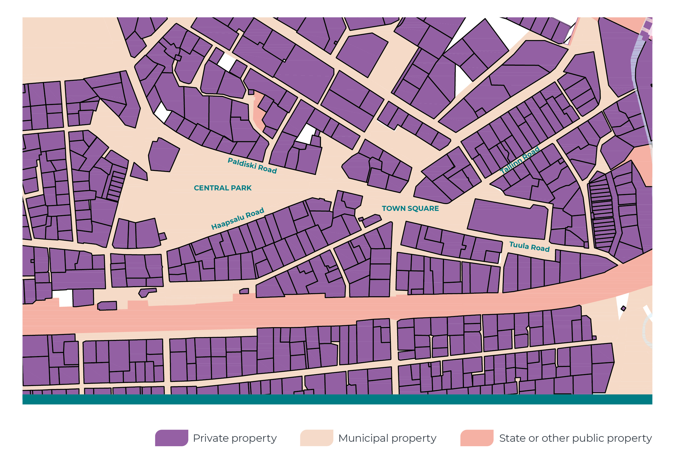

```

</div>
```{block, type='imgsource'}
<span class="imgsource-source">Source:</span> Sfäär planeeringud 2019.
```

In addition to the street network, public space also comprises parks, waterbodies, squares and land under and around public buildings. It also includes a number of other public service networks necessary for the functioning of private property. For example, electricity, water and district heating for homes and businesses are provided through underground utility networks below public land. On the ground, networks for different modes of mobility and vehicles ensure the access of people and goods to private property. The public transport system is an integral part of the public space.

Public space can never be defined completely and comprehensively, as it may contain parts of private property, not accessible at any given time, accessible for a fee or only open for use by members of a specific community. Such semi-public spaces include fenced sports grounds, internal streets of shopping centres, courtyards of apartment buildings, and street cafés. Public space is diffuse, as it has properties that have an impact beyond its immediate physical surroundings. Views and environmental impact, as well as buildings and their facades are objects of common interest in the public space, influencing it both visually and through the activities taking place in the shared space.

### The quality of public space is mainly determined by its continuity for all users {-.chapter2_section}

The chief characteristic of public space is free access to all in the physical, social and also financial sense. Free access has been guaranteed if the users of the space can carry out their everyday and social activities independently in a continuous space that does not contain barriers or interruptions. The network used by pedestrians is of central importance. Although the carriageway in the street is a necessary component of public space, the excessive speed of vehicles and traffic density may create a level of danger that effectively banishes the space from public use. In this case, every single crossing and footpath will become an essential element of the network. If these elements are too narrow, not interconnected, dangerous or unpleasant, the network will be interrupted because streets and crossings can no longer serve all users as a space for living and moving around.

<div class="casebox">

### Developing a continuous public space

Roosi Street in Tartu, renovated in 2016 in conjunction with the construction of the Estonian National Museum, establishes a pedestrian connection between the city centre and the museum with emphasis on both the overarching spatial design and specific solutions. This enhances the spatial perception of the museum not as a stand-alone item but a node in the public space network of central Tartu, also serving as a platform for further steps to improve the living environment in the neighbourhood.

<p class="caption" id="figure212"><span class="figure-number">Figure 2.1.2.</span> Roosi Street in Tartu</p>
```{r, figure212, out.width='100%', fig.align='center', echo=FALSE, message=FALSE}

knitr::include_graphics("../figures/2-chapter/fig212.png")

```
</div>
```{block, type='imgsource'}
<span class="imgsource-source">Source:</span> Triin Pitsi.
```

As a result of motorisation, public space has often been developed in an oversimplified fashion, considering it primarily as a transport infrastructure, focusing on passenger vehicles and the road network. The experience of numerous countries demonstrates that this can easily lead to reduced quality of the living environment and limited access ([Gehl 2015](#Gehl2015)). If public space does not operate as a human-friendly network, the people who would not otherwise drive a car, will start using one, inevitably leading to urban congestion. Well-interconnected public space with a focus on pedestrians also brings about active use of public transport. Although the opportunity to move in a passenger car is one aspect of the quality of public space, a good living environment is based on the principle that in the public space humans take precedence over vehicles.

```{block, type='blockquote-left'}
As a result of motorisation, public space has often been developed in an oversimplified fashion, considering it primarily as a transport infrastructure, focusing on passenger vehicles and the road network.
```

Continuous public space is a globally important trend in the effort to improve the quality of living environments. One of the UN’s sustainable development goals for 2030 is guaranteeing universal access to inclusive and accessible public space and green areas, as well-designed and well-maintained continuous public space ensures lower crime rates, empowers socially excluded groups and serves as a prerequisite for the well-being of happy and healthy citizens. Good-quality public space is the basis for the economic, environmental and cultural competitiveness of cities ([United Nations 2017](#2United2017)). Project for Public Spaces ([2007](#Project2007)), a non-profit umbrella initiative for creating public spaces, lists rising property prices, increasing density of small shops and increasing sales among the economic benefits of public space. Good-quality public space reduces air and noise pollution and supports biodiversity.

```{block, type='blockquote-right'}
Although the opportunity to move in a passenger car is one aspect of the quality of public space, a good living environment is based on the principle that in the public space humans take precedence over vehicles.
```
The primary characteristics of quality public space as a network is continuity, convenience and safety of trajectories for children, the elderly and disabled people, starting from every home, workplace and activity space, complemented by an integrated ecosystem. Good-quality public space is also characterised by the aesthetics, sensations and symbolic meanings associated with each of its single components – streets, squares and parks. The different wishes and resources of its users will be met by a multifaceted public space, allowing freedom of choice and self-organisation. The integrity and quality of public space is ensured only through the locality-specific spatial conceptualisation of all the aspects listed above during the stages of planning, design, construction and use of the space.

### The concept of public space has not been defined in Estonian legislation{-.chapter2_section}

Just as the role of public law alongside private law is to allow private subjects to feel safe in the state and the society to develop, private space requires public space next to it so that the benefits of private space could be used ([Paaver 2013](#Paaver2013)). Public space does not generate profits but serves as a basis for business and the development of the living environment.

Estonian legislation provides no explicit definition of public space. While it does include the definition of a ‘public place’ (Article 2 of the Advertising Act, Article 54 of the Law Enforcement Act), this is focused on organising daily life, ensuring safety and maintaining order, rather than preserving, developing or improving the space.

<div class="casebox">
### Whose square?

The controversial handling of public space by the Estonian public sector, including state-owned enterprises, is perfectly illustrated by the state’s sale of the public Kompassi Square to a property developer in 2018, regardless of opposition from the city of Tallinn. The developer requested the use of the square for a high-rise building, citing a closed private garden as the only alternative. There is no legislation that prohibits such a sale, prevents the privatisation of public spaces, for example streets or parks, or requires a public consultation on the matter. The state has put municipalities in a situation that makes it difficult to develop or even maintain quality public space if the owner lacks the will to do so. Such a situation arises if the state or municipality only looks out for its financial interests, neglecting public space.

<p class="caption" id="figure213"><span class="figure-number">Figure 2.1.3.</span> Kompassi Square in Tallinn</p>

```{r, figure213, out.width='100%', fig.align='center', echo=FALSE, message=FALSE}

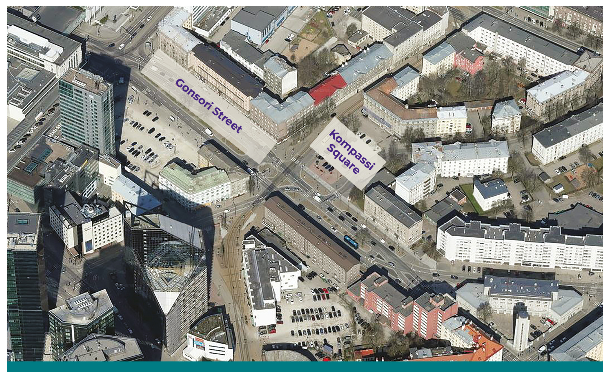

```

</div>
```{block, type='imgsource'}
<span class="imgsource-source">Source:</span> Land Board.
```

The 1993–2002 version of Article 9(2) of the Law of Property Act included a definition essentially identical to the Roman *res publica*, with implications for land ownership: ‘A public thing is an object owned by the state or municipality that is, due to its communal nature, usable by everybody, such as territorial waters, inland seas, navigable waterbodies, public streets, squares and parks.’ This definition, which is no longer valid, served as a basis for land reform and, through this, largely generated the current structure of public space, as most public streets and parks were neither privatised nor returned to pre-war owners. Nevertheless, both the land reform and later transactions (sales of both state-owned and municipally owned land) have resulted in the privatisation of parts of public space. Our current legislation lacks a general concept akin to *res publica*, or the ‘public thing’, that could serve as the basis for establishing a clear and permanent scope for the concept of public space.

The integration and accessibility of public space are also influenced by the regulation of movement on private property. The 1993–2014 version of Article 142 of the Law of Property Act prohibited any presence on private property without the authorisation of the owner. In 2014, the provisions regarding the use of land belonging to another person were transferred to the General Part of the Environmental Code Act, with the addition of Article 33(3): ‘The owner shall not prohibit the use of a private road or path on foot, by bicycle or for moving in another similar manner where the use is based on established custom and is not burdensome on the owner.’ The provision has not yet taken root in everyday application but is helps to improve the continuity of public space.

Public space can also function on private land, but in that case, ensuring that the network remains an integrated whole, demands even more effort from the public sector. In recent years, the concept of public space has been used in a few planning documents and guidelines; for example, the <a href="https://planeerimine.ee/static/sites/2/uldplaneeringu_juhis_final.pdf">2018 guidelines from the Ministry of Finance </a> for drafting comprehensive plans state that, as the concept has not been defined in legislation, ‘it is sensible to discuss topics related to public space and public values, and agree, define and determine them in the course of creating a comprehensive plan.’ The 2018 final report of the Spatial Design Expert Group also notes that ‘quality public space accessible to all is an important characteristic of a developed democratic state’. This means that planning on different levels is acknowledging the concept of public space, which has so far often been treated sporadically or neglected completely.

### The public sector has not established itself as an advocate and commissioning party for public space {-.chapter2_section}

The Planning Act does not discuss or even mention public space. As a result, the focus of planning has shifted to either defining the specific application of the land in question or to specific objects, buildings, infrastructure or roads, rather than the common space connecting them. If local governments only focus on balancing individual interests through the legally prescribed procedure, and if there is no one to commission or advocate for public space, it can remain a secondary consideration in the work of spatial planners and architects. This has led to justified dissatisfaction among some citizens with the spatial plans or the space created on this basis.

<div class="casebox">

### A street for everyone?

The narrow footpath on Põhja puiestee in Tallinn excludes movement with a pram as well as walking side by side or passing somebody moving in the other direction, not to mention convenience and safety. The public space network is interrupted. There is enough space to widen the footpath even without reducing the number of lanes for cars, but the city government has failed to do this.

<p class="caption" id="figure214"><span class="figure-number">Figure 2.1.4.</span> Põhja puiestee in Tallinn</p>

```{r, figure214, out.width='100%', fig.align='center', echo=FALSE, message=FALSE}

knitr::include_graphics("../figures/2-chapter/fig214.png")

```

</div>
```{block, type='imgsource'}
<span class="imgsource-source">Source:</span> Reio Avaste.
```

In their spatial decision-making, local governments have, at times, given preference to private interests, harming the public space, with the explanation that there is no clear legal basis that demands the maintenance of the public space or its improvement by private owners. Some local governments have nevertheless strengthened the legal basis through adopting comprehensive plans that purposefully give value to the public space; for example, in the comprehensive plan for Tartu city centre, the public space has been highlighted on separate figures and in a separate chapter. However, slow documentary procedures and official spatial plans that are overly strict and fixed are not convenient tools for the flexible step-by-step improvement of the public space.

```{block, type='blockquote-right'}
Planning on different levels is acknowledging the concept of public space, which has so far often been treated sporadically or neglected completely.
```

Streets and parks are mostly publicly owned, which, however, is no guarantee of a continuous public space. Streets are generally not built on the basis of detailed plans but road construction documents, which only cover engineering solutions and are not made public. Both spatial plans and road construction projects are mostly based on the standard EVS 843 (Urban streets), which considers roads, rather than the public space, as the integrated network. A car-centred focus on roads tends to dominate in urban spaces due to the mechanical application of standards and norms. Short-term spatial decisions regarding, for example, winter maintenance or traffic organisation during construction works, further leverage the overemphasis on passenger cars and neglect the pedestrian. In this way, the public sector can create even greater interruptions in the public space than private property.

Local authorities cannot ignore public space, as it exists in all settlements, has been shaped over a long period of time and is mostly in active use. Usually, municipalities manage almost the entire local public space and try to develop it in accordance with their means. But this has been largely dependent on the mindset of the officials of the specific municipality.

```{block, type='blockquote-left'}
A car-centred focus on roads tends to dominate in urban spaces due to the mechanical application of standards and norms.
```

The Land Board as well as state-owned companies and local governments have privatised plots that are used as public space or have a natural potential to be planned as such ([Figure 2.1.3](#figure213)). Under the current legislation, such transactions place the rights of both the urban population and the new owner on a shaky ground, with no predictability concerning the outcome of any dispute.

Nevertheless, some private owners have realised the need for public space and have developed it on their own, sometimes more efficiently than the municipality. This usually happens if one developer owns a large area. Public space adds value and increases the attractiveness of the area in the eyes of both users and businesses. Regrettably, such public spaces tend to remain unconnected to the wider network of public space, unless the municipality or owner pays sufficient attention to its maintenance and interconnection with the surroundings.

As the public sector has failed to consider public space in an informed fashion, the topic has largely remained in the hands of active citizens. Neighbourhood associations and interest groups have come up with initiatives that involve a vision for the public space, organised campaigns and taken a leading role either in cooperation or disputes with private owners and local governments. Important steps in order to increase the presentability of public spaces have been taken by the Estonian Association of Architects (e.g. the Estonia 100 architectural programme <a href="http://www.arhliit.ee/EV100_arhitektuur/">Good Public Space</a> in cooperation with local governments). The increased activity of NGOs and sectoral organisations indicates public concerns about the continuity and quality of public space. To some extent, active citizens and NGOs have themselves stepped into the role as advocates or commissioners of public space. However, all such community action can only provide isolated and temporary solutions; it does not replace continuous expert-knowledge-based work to improve the public space as a whole.

```{block, type='blockquote-right'}
It is important that the state and state-owned enterprises themselves do not harm the public space in their role as commissioning parties in large development projects.
```
National and municipal authorities, whose decisions create or change the public space, often limit themselves to their narrow area focus. There are no institutions that would act as coordinators between different authorities and protect public space as an integral network, create appropriate solutions for this and cooperate purposefully with the private sector in the interests of the accessibility and human dimension of the public space.

### The public space can only function as a network if the state and local governments emphasise it in spatial decisions at every level {-.chapter2_section}

Public space is a complex network and an ever-changing structure. As with utility networks (water, electricity, etc.), public space also needs continuous work by the operator for it to function and develop. The operator of the public space network is the public sector, which has the ability to protect and improve it.

```{block, type='casebox'}

### Some principles and recommendations

As a model for defining public space and its quality criteria, the UN guidelines Global Public Space Toolkit: From Global Principles to Local Policies and Practice (2015) provide diverse practical examples for cities and national governments in the field of spatial design and policy, underlining the value of civil society. Global Street Design Guides by NACTO and the Global Designing Cities Initiative focus on public space and rethinking urban streets. It is also possible to make use of the simple checklists and guidelines of the Project for Public Spaces – a central organisation for place-making.
```

As the operator, a local government is entitled and required to protect public space through all its decisions. It is the state’s role to be a partner for cities and other municipalities, shaping the legal space and, in exceptional cases, also protecting the citizens if the municipality fails to advocate sufficiently for the public space. It is also important that the state and state-owned enterprises do not harm the public space themselves in their role as commissioning parties in large development projects.

At municipal and state level, it is equally important to consider setting up competent teams that can defend the public space as a continuous network through cooperation between different areas. This would not entail an increase in the administrative burden but rather replace formal procedures with continuous substantive work.

As the public space makes up a large part of the everyday living environment, it is sensible to involve the public in making decisions, formally outside the scope of planning regulations but with considerable impact on the public space, as many spatial decisions (e.g. on whether a plot will remain a public park, a street, a playground, a grove or whether a particular passageway will remain open) are not made during the planning procedure but often before or after that, for example, by way of purchase transactions or during traffic planning. In an ideal situation, the public space would be publicly owned on a permanent basis; however, considering Estonia’s courageous privatisation decisions so far, the state has already placed itself in a position where it needs to maintain the continuity and quality of public space on numerous private properties. It is important that the public sector carefully consider its transactions to privatise land that is integral to the public space, so as to ensure that the public space is safeguarded; the public sector must also be smart about acquiring new lands as necessary.

It would not be sensible for every individual municipality to create definitions of public space in their regulations or spatial plans. Clear and uniform general principles should be applied nationally. The <a href="https://www.riigikantselei.ee/sites/default/files/riigikantselei/strateegiaburoo/ruumiloome_lopparuanne_.pdf">final report by the Spatial Design Expert Group</a> also stresses the need for legislative clarity:

*Legislation must establish a clearer basis for spatial design, covering all spatial decisions in an interconnected way. The main principles and concepts of spatial design must be treated in a coherent way in the law. Underlining the importance of public space in spatial design and defining quality requirements will provide a better basis for creating a good-quality public space and built environment, as well as for spatial impact assessments of draft legislation.*

Both the state and local governments need to acknowledge their role as the operators of the public space networks or commissioning parties for public space, while respecting all users of the space.

<div class="casebox">

### A vision of a continuous urban space

The interconnectedness, density and diversity of public space as an integral network plays a central role in improving the spatial quality of a city. For example, the green belt surrounding the old town of Tallinn can be developed as a part of the public space, allowing the convenient crossing of carriageways, widening pedestrian areas and opening up new passageways through city blocks. This allows for creating convenient pedestrian connections between a number of public buildings, squares, streets and parks of citywide importance, giving Tallinn an opportunity to develop into a considerably more human-friendly city.

<p class="caption" id="figure215"><span class="figure-number">Figure 2.1.5.</span> Excerpt from the Estonian Academy of Arts project ‘Unfinished City’</p>

```{r, figure215, out.width='100%', fig.align='center', echo=FALSE, message=FALSE}

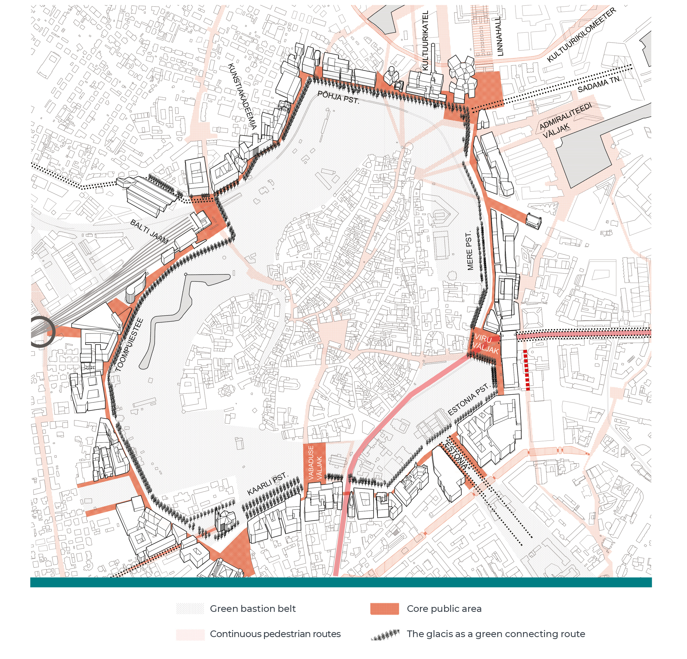

```

</div>
```{block, type='imgsource'}
<span class="imgsource-source">Source:</span> Kavakava Architects 2019.
```

### Summary {-.chapter2_section #summary-21}

It is the task of a well-functioning society to make sure that people feel well not only at home, at work or in their car but also in the public space. Public space is influenced by almost every spatial decision. The core task of the public sector is protecting and leveraging the positive impact resulting from all spatial decisions and solutions, as well as preventing and blocking negative impacts. The integrity of public space is a universal public interest and cannot be managed by way of giving preference to an individual topic or user; for example, by treating roads or the freedoms of the property owner as superior. In addition to protection, the public space also needs strategic development based on vision documents, including constant interconnection with any new building, road or private development project. Public space as a network also provides a firmer basis for the work of city architects and helps create balanced planning solutions.

```{block, type='blockquote-left'}
Public space needs strategic development based on vision documents, including constant interconnection with any new building, road or private development project.
```

Although recent legislation and governance practice in Estonia have been characterised by a tendency for the public sector to focus on processing regulative documents instead of improving the spatial environment, a more substantive acknowledgement of the future of space and the living environment is emerging. In 2015, the principle of improving the living environment was added to the Planning Act (Article 8) and the objective of ensuring the purposeful functionality and usability of the built environment to the Building Code (Article 1). Those general provisions will remain merely declarative if the state and local governments do not launch informed efforts towards the continuous improvement of the public space, indispensable for developing the living environment as a whole.

Unlike in business projects, the public sector can strategically guide the development of the public space in an informed manner. The public space and its development affect private investments, the choices of developers, and where individuals choose to live and work; this cannot be regulated rigidly through spatial plans. It would be sensible to adopt a definition of public or common space not only as part of the legislative framework but also as a foundation for unifying spatial decisions, which are currently fragmented between different fields.

Public space as a network with a significant impact on the quality of life calls for constant attention and the desire to improve it. In addition to technical knowledge and skills, this requires creativity, good spatial perception and synergy between different fields. A public sector that sees the improvement of the living environment as a worthwhile goal is one that thinks and acts in the common interest of its citizens.

One of the proposals presented in the <a href="https://www.riigikantselei.ee/sites/default/files/riigikantselei/strateegiaburoo/ruumiloome_lopparuanne_.pdf">2018 final report of the Spatial Design Expert Group</a> is to extend the principle of improving the living environment more clearly to cover the entire process of spatial design. For this to work, businesses and citizens, local governments and the state should all consider the value of the public space in their decisions.

As security and well-being are more likely to grow out of the active use of space ([Worpole and Knox 2007](#Worpole2007)), it is important to value the free use of space and allow it to self-organise. Individual and collaborative creativity also promote the feeling of community and ownership among citizens. Freeing ourselves from formalism in spatial design requires a change in mindset but also legislative support. The public space will be improved if the integrity and diversity of the network is continuously appreciated both in large decisions and the detail. This helps to maintain and improve the health of the society and democracy in general.

### References {-.subreferences #references-21}

<p id="Gehl2015">Gehl, J. 2015. Linnad inimestele. Tallinn: Eesti Kunstiakadeemia, Yoko Oma.</p>
<p id="Ilus2000">Ilus, E. 2000. Rooma eraõiguse alused. Tallinn: Ilo Print.</p>
<p id="Paaver2013">Paaver, T. 2013. Mis on avalik ruum – avaliku ruumi käsitlustest ruumilises planeerimises. –Roose, A. (toim.). Peatükke planeerimisest. Protsesse, meetodeid ja näiteid. Tartu: Tartu Ülikool, 51–62.</p>
<p id="Project2007">Project for Public Spaces 2007. What is placemaking? https://www.pps.org/article/what-is-placemaking.</p>
<p id="2United2017">United Nations 2017. New Urban Agenda. United Nations Conference on Housing and Sustainable Urban Development (Habitat III).</p>
<p id="Worpole2007">Worpole, K., Knox, K. 2007. The social value of public spaces. Joseph Rowntree Foundation. https://www.jrf.org.uk/report/social-value-public-spaces</p>

<!--chapter:end:02.1-chapter.Rmd-->

## Built heritage and spatial quality {.chapter_section .chapter2_section}

```{block, type='authors authors_eng'}
<div class="author-links">**[Triin Talk](#triin-talk) and [Siim Raie](#siim-raie)**</div>
<div><a class="print-btn" href="../ehituspärand-ja-ruumikvaliteet.html">EE</a></div>
```

```{block, type='points'}
* A quarter of the architectural monuments in Estonia are in poor condition and lie in disuse; the state’s contribution to their maintenance is insufficient.
```

Existing buildings and spatial structures form a framework for contemporary spatial design. A historic building can be a local symbol, community centre and tourist attraction, and the space surrounding it can be designed to facilitate viewing and visiting it. It can also be a source of shame and discord if its poor condition causes it to be considered an eyesore or a threat to people moving in the public space. Built heritage has significant influence on the image of a region – its condition can either reflect the resilience of the settlement through the ages or act as a bleak reminder of better times lost.

In Estonia and elsewhere, the growing role of built heritage conservation went hand in hand with the triumph of post-war modernism in the 1960s and 1970s. The Soviet authorities had created favourable conditions for the revolutionary transformation of space – all land was owned by the state, making it possible to introduce utopian building plans. The rise of heritage conservation can be viewed as a critical response to modernist urban renewal policies, which in the case of Estonia was also accompanied by opposition to the ruling regime. Mass-produced apartment buildings were indispensable in solving housing shortages, but it was soon recognised that the regional identity and cultural value of space were also indispensable.

The conflicting initiatives to renew and preserve the built environment continue to shape our public space today, but the disagreements no longer seem so acute. Contemporary urban planning takes much greater account of existing structures; the fragmentation of land ownership and democratisation of society also make it more difficult to demolish entire city blocks. At the same time, moderate poverty, which has helped to preserve much of the heritage to this day, is declining. Although beneficial in the long run, heritage restoration is not the most profitable option for owners in the short term, and that makes the protection of cultural heritage by law still necessary. How best to carry it out today and in the future has been the central question in the development of a new Heritage Conservation Act over the past six years. The issue is also highlighted in this article, as we look at the role of built heritage in shaping and enhancing the value of public space in Estonia. To address this issue, we pose three questions:

1) What is the impact of built heritage on space and its users?
2) How can historical buildings be regarded as part of sustainable spatial design?
3) What is the role of the state in protecting built heritage?

In the article, we look at the impact of all built heritage in the public space, not just listed buildings, and discuss heritage conservation in a broader sense covering the protection and preservation of heritage.

### Built heritage helps to create diverse space {-.chapter2_section}

Heritage conservation is not about resisting change; it is an effort to manage change so that existing values are preserved and remain discernible in space. This is usually the easiest way to create good-quality space – to understand the value of things that already exist, to highlight them and add new things around them in a coherent way, instead of disassembling the space and starting from scratch. A good example is the Rotermann Quarter in Tallinn, where a combination of protected industrial buildings and new architecture has created a highly valued and diverse space. If the plans from a few decades ago had been realised and the entire quarter had been demolished to create a shortcut between Viru Hotel and Linnahall, an environment as multifaceted and distinctive as exists today would certainly not have emerged.

```{block, type='blockquote-right'}
Heritage conservation is not about resisting change; it is an effort to manage change so that existing values are preserved and remain discernible in space.
```
Architect Rem Koolhaas ([2014](#Koolhaas2014)) has said that heritage conservation protects us from today’s proliferation of mediocrity. While new architecture that follows global trends often lacks variety, the key role of heritage conservation is to preserve the diversity and regional characteristics of the built environment. Good new architecture tends to be concentrated in places where old values already exist: for example, two thirds of the Estonian Architecture Awards in 2018 were given for protected buildings or buildings located in protected zones.

Estonians have a relatively high interest in cultural heritage: according to a Eurobarometer survey (2017), 71% of Estonians had visited a historical monument or site within the past year, while the European Union average was 61% ([Figure 2.2.1](#figure221)).

<p class="caption" id="figure221"><span class="figure-number">Figure 2.2.1.</span> Estonians visit historical monuments and sites more often than the average European</p>


```{r, figure221, out.width='90%',fig.align='center', echo=FALSE, message=FALSE, warning=FALSE}

library("tidyverse")
library("scales")
library("dplyr")
library("grid")
library("gridExtra")


 fig221_data <- read.csv ("../data/22_fig1_data.csv", header=TRUE, fileEncoding="utf-8", sep=";")

  fig221_data$answer <- factor(fig221_data$answer, levels = c("Ei oska öelda","Ei ole","Vähemalt üks kord"))

  fig221_data$label <- fig221_data$value
  fig221_data$label[which(fig221_data$label == 0)] <- NA

  fig221_plot1 <- ggplot(subset(fig221_data, pop %in% c("EE"))) +
    geom_bar(mapping = aes(x=question, y=value, fill=answer), width=0.5, stat="identity") +
    geom_text(mapping = aes(x=question, y=value, label=round(label, digits=0)), stat="identity", color="white", position = position_stack(vjust = .5)) +
     scale_fill_manual(values=c("#A8ACA6","#afd7d8","#369b9e")) +
    coord_flip()+
    labs(y="", x="") +
    scale_x_discrete(labels = wrap_format(50)) +
    ggtitle("EE")


      fig221_theme1 <- theme(
      text = element_text(color = "#292b2c", size = 8,family=""),
      axis.text.y = element_text(size=10),
      axis.text.x = element_blank(),
      panel.grid.major.y = element_blank(),
      plot.title = element_text(size=14)
  )


    fig221_plot2 <- ggplot(subset(fig221_data, pop %in% c("EL28"))) +
    geom_bar(mapping = aes(x=question, y=value, fill=answer), width=0.5, stat="identity") +
    geom_text(mapping = aes(x=question, y=value, label=round(label, digits=0)), stat="identity", color="white", position = position_stack(vjust = .5)) +
     scale_fill_manual(values=c("#A8ACA6","#afd7d8","#369b9e")) +
    coord_flip()+
    labs(y="%", x="") +
    scale_x_discrete(labels = wrap_format(50)) +
    ggtitle("EL28")


    fig221_theme2 <- theme(
      text = element_text(color = "#292b2c", size = 8, family=""),
      axis.text.y = element_text(size=10),
      panel.grid.major.y = element_blank(),
      legend.position = "none",
      plot.title = element_text(size=14)
  )


#grid.arrange(fig221_plot1 + fig_theme_general + fig221_theme1, fig221_plot2 + fig_theme_general + fig221_theme2, ncol = 1)

#g <- arrangeGrob(fig221_plot1 + fig_theme_general + fig221_theme1, fig221_plot2 + fig_theme_general + fig221_theme2, ncol = 1)

#ggsave(path="exported_figures/PDF/chapter2",filename="fig221.pdf",g, height=280, width=180, units="mm")

knitr::include_graphics("../figures/2-chapter/fig221_eng.jpg")

```

``` {block, type='imgsource'}
<div><span class="imgsource-source">Source:</span> Eurobarometer 2017.</div>
<div><a class="data-btn" href="../data/22_fig1_data.csv"><i class="fa fa-download" aria-hidden="true"></i></i>Download data</a></div>
```

The impact of built heritage is wider still. Aside from offering sites worth visiting, it plays an important role in shaping the vitality of regions and contributing to the quality of their living environment. The report ‘Cultural Heritage Counts for Europe’ (2015), a European Union collaborative project dedicated to researching the potential of heritage, articulates its societal benefits ([Figure 2.2.2](#figure222)).

<p class="caption" id="figure222"><span class="figure-number">Figure 2.2.2.</span> Societal benefits of cultural heritage</p>

```{r, figure222, out.width='90%',fig.align='center', echo=FALSE, message=FALSE, warning=FALSE}

knitr::include_graphics("../figures/2-chapter/fig222_eng.jpg")

```
``` {block, type='imgsource'}
<span class="imgsource-source">Source:</span> Cultural Heritage Counts for Europe 2015.
```

The conservation of architectural heritage is not aimed at maintaining unity of style in the built environment, or at reconstructing the appearance of a specific period of history, but at honouring and highlighting the various layers of the built environment while complementing them with high-quality contemporary additions. Replicas of historical buildings are also not excluded – they can be appropriate if buildings central to the region’s history have been destroyed, as in the case of the Nõmme market building in Tallinn. However, reconstructing copies of long-lost buildings is no longer considered ethical in heritage conservation today, and for two reasons: first, it would be a manipulation of history, and second, it would divert resources and attention away from real cultural heritage while reducing its value – if historic buildings can always be rebuilt using old pictures, why try to conserve them now?

### The conservation of existing buildings is the basis for sustainable spatial development {-.chapter2_section}

Advances in the maintenance and continued use of existing buildings are also increasingly relevant in the context of energy efficiency and climate change. Around 20% of the energy balance of a building’s life cycle is spent on heating, with the remaining 80% consumed by the production and construction of materials. Existing buildings are therefore a resource, the continued use and reuse of which is fully sustainable – once building materials have been placed into a building, the renovation and continued use of that building generally has a lower environmental footprint than erecting a new house, even if the new house is more energy-efficient. ‘The greenest building is … one that is already built’ ([Elefante 2007](#Elefante2007)) is a recognition that also considers the life cycle of the materials used in the construction of buildings, and not just the cost of heating. Using, repairing and upgrading the same building for 500 years is more sustainable than demolishing and rebuilding every 50 years.

There are 12 heritage conservation areas and over 5,000 listed structures in Estonia (the latter are mainly historic buildings, but may also include structures such as roads and bridges, parks and military facilities). Listed buildings account for about 0.7% of the buildings in the Register of Buildings, and even with the inclusion of the buildings located in the heritage conservation areas, built heritage under state protection only accounts for about one percent of all buildings. Comparing the number of buildings under state protection with those of other countries is difficult and must be done while recognising that the list of Estonian heritage sites mirrors the technical possibilities and land fragmentation of the 1990s: complexes considered as single heritage sites in many countries have been listed as dozens of separate buildings in Estonia. The meaning of state protection can also vary greatly. In the US, for example, there are over 100,000 monuments and a thousand more are added to the list each year. Yet designation as a monument under state protection does not even involve a ban on demolition – building regulations can only be implemented by local authorities ([Page 2016](#Page2016)). In the UK, there are over 9,800 heritage protection areas and 375,588 listed buildings, excluding historic parks and gardens, which in Estonia are included among listed places. In Latvia, there are 8,584 cultural monuments, 5,183 of which are of national importance and 3,401 of local importance – 40% of them are architectural monuments. Finland has a very small number of monuments – 280 buildings or groups of buildings – but additionally, all churches built before 1917 are automatically granted protection, and the same goes for approximately 800 historic buildings once owned by the state and 1,258 nationally significant cultural environments. Heritage conservation through planning has been used in Finland since the 1980s; instead of being listed as monuments, most of built heritage is protected by planning documents – an estimated 15–20,000 buildings or groups of buildings.

<div class="casebox">
<h3>Industrial heritage</h3>

Our disused built heritage includes many large industrial facilities first constructed for the needs of the great Russian Empire and long since proved unnecessary on such a scale. In Tallinn, several industrial areas have been successfully revitalised as residential and business districts (e.g. the Rotermann, Noblessner, Luther, Tselluloos and Dvigatel quarters); in smaller towns, new uses for such buildings have been more difficult to find. The Kreenholm Manufacturing Company in Narva, for several decades Europe’s largest textile producer, was the most modern industrial enterprise of the Russian Empire in the second half of the 19th century. At its peak, it employed more than ten thousand people; on a smaller scale, production continued until 2010. According to an ambitious proposal, approved as a detailed spatial plan, the Kreenholm area will be converted into an attractive hub with residential houses, entertainment and cultural institutions, a conference centre, a science park, hotels and commerce. Although the development is yet to commence, the owner has fitted the buildings – architectural monuments – with new roofs and reached an agreement with Narva Museum allowing guided tours on the premises.

<p class="caption" id="figure223"><span class="figure-number">Figure 2.2.3.</span> The Kreenholm Manufacturing Company building</p>

```{r, figure223, out.width='100%', fig.align='center', echo=FALSE, message=FALSE}

knitr::include_graphics("../figures/2-chapter/fig223.png")

```

</div>
```{block, type='imgsource'}
<span class="imgsource-source">Source:</span> Annika Haas.
```

Estonia has also started to implement heritage conservation through municipal spatial plans alongside state-level heritage protection. Since 2003, local government authorities have been able to establish milieu protection areas, and, since 2015, individual sites of cultural value. The use of planning documents for the purposes of conservation of built heritage is still a new and emerging practice, and the assumption that anything that is not under state protection can be demolished is slow to recede.

Through the milieu protection areas and individual sites of cultural value, heritage conservation has become more comprehensive and inclusive of local communities. In theory, when a plan is made public, anyone can express their opinion on what values should be preserved in the planning area, but the actual impact of those comments on spatial design decisions can be modest. The lists of national monuments were compiled at a time when public participation was not required by law in the same way as it is today, and in the few instances where protection has been granted to new sites, the National Heritage Board has mostly been in contact only with local authorities and the property owners. Proposals to take sites under state protection can be made by any citizen, but whether protection is granted is for specialists to decide. Designating milieu protection areas and individual sites of cultural value is entirely up to local governments. With the active participation of communities, this could become a truly democratic form of heritage conservation, one that does not prioritise how representable and distinctive a building is in a country-wide comparison, but whether it is valued locally and people still wish to see it in the public space.

A two-tiered heritage conservation system helps to value built heritage more broadly and flexibly than is possible with only state protection. Even so, the new situation raises many questions. For example, should permanent state-level protection be granted to all buildings that were listed in the 1990s due to a lack of alternatives? Can requirements be stricter for milieu protection areas than they are for heritage conservation areas? When considering old buildings as an environmental resource, protecting only 1% of the historically and architecturally most valued buildings that are under state protection is not enough – more should be done to extend the lifetime of other existing buildings, and inclusive conservation through planning allows this.

The problem lies with many old detailed plans, the validity of which continues indefinitely and permits the demolition of valuable buildings, even though they are today no longer in line with public expectations. For example, when the demolition of a 1920s wooden art nouveau building at 141 Kadaka Road was commenced in Tallinn in 2019, it created an outcry among locals who value cultural heritage. The building had become a popular restaurant and nearly 4,000 signatures were gathered in an effort to save it, on top of which several appeals and articles were written. The city district elder also told the press he would not agree to the demolition of the building. However, because the demolition was authorised by a detailed plan established in 2008, the validity of which had no termination date, efforts to halt it were unsuccessful. Similar planning documents – with content that comes across as surprising in today’s context – are springing up everywhere, and while 10 or even 20 years have passed since the public and government agencies last had their say over them, old plans can be implemented without first consulting the stakeholders once again. In addition to drafting new heritage-friendly plans, local heritage conservation should include the review and, where appropriate, revoking of old detailed plans, which, as far as is known, local government authorities have not yet done.

### Individual spatial decisions have a major impact on cultural heritage and regional development {-.chapter2_section}

The condition and impact of built heritage in the public space are mainly determined by its use or disuse. A building left empty in an area where population is in decline (that is, in most areas of Estonia) will often remain unused for a very long time. Empty buildings make a settlement look abandoned, decrease the sense of pride locals feel for their home town and their willingness to contribute to its development. Neglected buildings make people want to move away, many enterprising people leave and those that remain mostly have no choice but to stay.

```{block, type='blockquote-left'}
Spatial development is less influenced by funding measures and more by the individual decisions made in the different silos of government authorities – decisions on where to open a school, where to close a hospital, which institutions to join together and where to place them.
```

The state of its buildings plays a great role in the attractiveness and security of a town – ramshackle houses with boarded up windows have a dispiriting effect. Upkeep of the historic urban space and buildings is not only a matter of heritage conservation and sustainability, it also follows regional development goals. Cultural heritage can be a way to provide small towns with a breath of fresh air, increasing their potential as a living environment. For example, the Union of Estonian Architects has drawn attention to the renovation of several town centres with the project ‘Good Public Space’, helping to attract investors. Constructing new town squares is, however, not enough to improve the urban living environment if the designer lights and cutting-edge pavement are surrounded by half-empty buildings in a state of dilapidation. In the coming years, the heritage conservation programme planned by the Ministry of Culture will provide some help in renovating buildings located in heritage conservation areas, but spatial development is less influenced by funding measures and more by the individual decisions made in the different silos of government authorities – decisions on where to open a school, where to close a hospital, which institutions to join together and where to place them.

In its final report, the Spatial Design Expert Group, which in 2017 and 2018 analysed spatial development processes in Estonia, concluded that the quality of spatial design is often determined by decisions made prior to the spatial planning or design process, and without the involvement of spatial experts. Similarly, the decisions to abandon old buildings and move institutions out of historic districts are usually made without the involvement of heritage specialists. Among other tasks, the proposed Spatial Design Expert Group is to ensure the compactness of urban settlements and encourage the utilisation of historic buildings. This offers hope that in the future, these decisions will be significantly more influenced by spatial expertise.

To ensure that spatial policy objectives are attained, substantial spatial decisions should also consider long-term socio-economic impacts, including the entire life cycle of buildings – construction, use, maintenance and demolition – the creation and preservation of values, and the aspect of location (2018 final report of the Spatial Design Expert Group). For example, when constructing a new energy-efficient schoolhouse at an affordable square-metre price, attention should be paid to finding a new function for the old schoolhouse, including working out the cost of necessary modifications. When calculating energy efficiency, it is necessary to consider not only the energy class of the new building, but also the energy consumption and life cycle of the construction materials used, as well as costs related to the vacated building.

```{block, type='blockquote-right'}
Old buildings are an environmental resource and it is worth extending their life.
```

Decisions to move offices out of particular buildings and allocate large grants to particular developments are made outside of heritage conservation. Yet, these decisions are central to the preservation of heritage, and it is therefore important to integrate cultural heritage conservation into all areas of governance and support programmes, as with the other constitutional tasks, such as ensuring national security. This applies to listed buildings in particular, as the state has set itself the task of preserving them for future generations.

### Monuments are a common good and a shared responsibility {-.chapter2_section}

The Council of Europe policy document on the value of cultural heritage for society, the Faro Convention, which Estonia is preparing to join, regards cultural heritage as a universal human right. This means that everyone has the right to engage with cultural heritage, to participate in its creation and interpretation in the way they choose, and that therefore, heritage plays an important role in building and sustaining a democratic society. Protecting the assets of the living environment is already a considerable part of the activities of Estonian neighbourhood associations. Local built heritage is valued even more if it is threatened by demolition. Each year, the National Heritage Board receives dozens of proposals from the public to place buildings under protection; most of the proposals are aimed against the demolition threat to historic buildings getting in the way of new developments. Still, state protection could not be tied to a referendum because then the list of monuments would mainly consist of buildings that were intended to be demolished at some point in the past. By designating a building as a monument, the state commits itself to contributing to its preservation. Prior to taking on this long-term commitment, expert assessment is needed, and, subsequently an administrative decision ensuring that the case meets the requirements for state protection, that is to say, belongs to the more valuable part of the cultural heritage. It is therefore important to distinguish between the community’s right to cultural heritage and the national policies to protect cultural heritage in the public interest as formulated in the Faro Convention. The first concept is broader, referring to a collective and open practice that is not necessarily linked to any national regulations. As a possible instrument of heritage construction, designating a site as a monument requires more than just an opinion poll – most proposals made by citizens receive a negative response, and new monuments are confirmed on the basis of expert research. There is no reason to consider the expert-based national heritage conservation process undemocratic, however, as each proposal for the designation of a monument, as well as the different viewpoints surrounding it, are thoroughly considered. Yet the continued interest citizens show in bringing new sites under state protection demonstrates that the conservation of the built heritage is indeed in the public interest, and also helps us understand what people regard as their heritage.

State-protected built heritage is a common good, offering us all the opportunity to stroll around the Old Town Christmas Market or get married in a splendid manor house, but at the same time, it is the responsibility of a few. The responsibility for the preservation and maintenance of monuments lies primarily with their owners, mostly private individuals ([Figure 2.2.4](#figure224)). About a quarter of all listed buildings are in poor or critical condition and around another quarter are in disuse. Use of a building generally ensures its maintenance, and falling out of use usually hastens decay. The condition of monuments is better in larger towns and worse in rural areas and small towns, where population decline results in the emptying of buildings.

<p class="caption" id="figure224"><span class="figure-number">Figure 2.2.4.</span> Ownership of architectural monuments</p>

```{r, figure224, fig.asp=.75, fig.align='center', echo=FALSE, message=FALSE, warning=FALSE}

library("tidyverse")
library("scales")

fig224_data <- read.csv ("../data/22_fig4_data.csv", header=TRUE, fileEncoding="utf-8")

fig224_data$owners_eng[grepl("Eraomanik", fig224_data$owners)]<-"Private owner"
fig224_data$owners_eng[grepl("Omavalitsus", fig224_data$owners)]<-"Municipality"
fig224_data$owners_eng[grepl("Riik", fig224_data$owners)]<-"State"

fig224_data$owners_eng <- factor (fig224_data$owners_eng, levels = c("Private owner","Municipality", "State"))

fig224_data$percent=percent((fig224_data$value/100), 1)

  fig224_plot <- ggplot(data = fig224_data, aes(x = "", y = value, fill = owners_eng)) +
  geom_bar(stat = "identity") +
  scale_fill_manual(values=c("#dbd8d7","#a18bbb","#297477")) +
  geom_text(aes(label = percent), position = position_stack(vjust = 0.5), color="white") +
  coord_polar(theta = "y") +
  labs(x="", y="")

  fig224_theme <- theme(
                    panel.grid.major.x = element_blank() ,
                    panel.grid.major.y = element_blank(),
                    panel.grid.minor.x = element_blank() ,
                     panel.grid.minor.y = element_blank(),
                     axis.line = element_blank(),
                     axis.text.x = element_blank(),
                         text=element_text(family="Montserrat")
                 )


  print(fig224_plot + fig_theme_general + fig224_theme)

#ggsave(path="../exported_figures/PDF/chapter2",filename="fig224.pdf", height=120, width=200, units="mm")

```

``` {block, type='imgsource'}
<div><span class="imgsource-source">Source:</span> Explanatory memorandum of the draft Heritage Conservation Act.</div>
<div><a class="data-btn" href="../data/22_fig4_data.csv"><i class="fa fa-download" aria-hidden="true"></i></i>Download data</a></div>
```

Repair and restoration of monuments and buildings in heritage conservation areas is supported by the National Heritage Board to the extent possible given its annual budget. One problem has been the lack of funding: before the recession, annual grants ranged from 1.1 to 1.3 million euros, but since 2009, restoration grants have varied between 0.5 and 0.7 million euros. The average grant is around 5,000 euros, with most of the grant funds used for emergency roof repairs ([Figure 2.2.5](#figure225)).

<p class="caption" id="figure225"><span class="figure-number">Figure 2.2.5.</span> Restoration grants in 2018 (€)</p>
```{r, figure225, out.width='80%', fig.align='center', echo=FALSE, message=FALSE, warning=FALSE}

library("tidyverse")

 fig225_data <- read.csv ("../data/22_fig5_data.csv", header=TRUE, fileEncoding="utf-8")

 fig225_data$type_eng[grepl("Taotluste maht", fig225_data$type)]<-"Applied for"
  fig225_data$type_eng[grepl("Toetused", fig225_data$type)]<-"Granted"


  fig225_plot <- ggplot() +
    geom_bar(data = fig225_data, mapping = aes(x=type_eng, y=sum, fill=type), width=0.4, stat="identity") +
    scale_fill_manual(values=c("#369b9e","#a18bbb")) +
    labs(y="", x="")+
    scale_y_continuous(labels = comma)

  fig225_theme <- theme(
    legend.position=0,
    text = element_text(size = 12, family="Montserrat"),
    panel.grid.major.x = element_blank() ,
    panel.grid.minor.x = element_blank(),
  )

  print(fig225_plot + fig_theme_general + fig225_theme)

  #ggsave(path="../exported_figures/PDF/chapter2",filename="fig225.pdf", height=120, width=200, units="mm",encoding = "ISOLatin9.enc")
```

``` {block, type='imgsource'}
<div><span class="imgsource-source">Source:</span> National Heritage Board..</div>
<div><a class="data-btn" href="../data/22_fig5_data.csv"><i class="fa fa-download" aria-hidden="true"></i></i>Download data</a></div>
```

In addition to general grants for the restoration of immovable monuments, the state has used specific support measures to fund the renovation of sacral buildings between 2004 and 2018 as part of the ‘places of worship programme’, and the renovation of manor schools between 2001 and 2016 under a programme funded by the Norwegian EEA. Both programmes had a total value of over 12 million euros. In most cases, churches and manors are the largest and most prominent buildings in the settlements, with significance for a large part of the community and even attracting visitors from other areas.
With the help of the manor schools programme, most Estonian manor schools have been restored to some degree. The places of worship programme has given grants to more than 200 churches and chapels ([Figure 2.2.6](#figure226)).

<p class="caption" id="figure226"><span class="figure-number">Figure 2.2.6.</span> The places of worship programme (€)</p>
<div class="desktop-plot">
```{r, figure226, fig.asp=.75, fig.align='center', echo=FALSE, message=FALSE, warning=FALSE}

library("tidyverse")
library("scales")

 fig226_data <- read.csv ("../data/22_fig6_data.csv", header=TRUE, fileEncoding="utf-8")

 fig226_data$type_eng[grepl("Taotluste kogusumma", fig226_data$type)]<-"Total applications"
fig226_data$type_eng[grepl("PÜPi eelarve kogusumma", fig226_data$type)]<-"Total programme budget"

fig226_data$type_eng <- factor (fig226_data$type_eng, levels = c("Total applications","Total programme budget"))

  fig226_plot <- ggplot(data = fig226_data) +
    geom_line(mapping = aes(x=year, y = value, colour=type_eng, group=type_eng, text = paste("", type_eng,
                         "<br>", year,
                         "<br>", scales::comma(value),"€")), size=0.75) +
    scale_colour_manual(values=c("#a18bbb","#369b9e"))+
    labs(y="", x="") +
    scale_x_continuous(breaks = c(2004,2006,2008,2010,2012,2014,2016,2018), expand = c(0, 0), limits=c(2004,2018.5))+
    scale_y_continuous(breaks = c(0,1000000,2000000,3000000,4000000,5000000), labels = comma, expand = c(0, 0), limits=c(0,5500000))+
    expand_limits (y=0)

   fig226_theme <- theme(
     panel.grid.minor.x = element_blank(),
      text = element_text(size = 12, family="Montserrat"),

  )

ggplotly(fig226_plot + fig_theme_general + fig226_theme, tooltip = "text" ) %>%
config(displayModeBar = F, collaborate = F)   %>%
layout(legend = list(orientation = "h",y = 1.15)) %>%
layout(xaxis = list(fixedrange = TRUE)) %>%
layout(yaxis = list(fixedrange = TRUE))

#ggsave(path="../exported_figures/PDF/chapter2",filename="fig226.pdf", height=90, width=160, units="mm",encoding = "ISOLatin9.enc")
```
</div>

<div class="mobile-plot">
```{r, out.width='100%', fig.asp=.75, fig.align='center', echo=FALSE, message=FALSE, warnings=FALSE}

  print(fig226_plot + fig_theme_general + fig226_theme)

```
</div>

``` {block, type='imgsource'}
<div><span class="imgsource-source">Source:</span> National Heritage Board.</div>
<div><a class="data-btn" href="../data/22_fig6_data.csv"><i class="fa fa-download" aria-hidden="true"></i></i>Download data</a></div>
```

As of 2019, the places of worship programme was incorporated into the National Heritage Board’s restoration grant budget; even though the budget increased by nearly half as a result, the capacity for funding private owners has remained unchanged. To improve the situation for private owners, a measure to support traditional rural architecture was created in 2019, with an initial budget of only 100,000 euros. A programme of grants for old towns is also being developed, and is expected to encourage the restoration of small-town heritage protection areas in the coming years.

The state’s support for built heritage under its protection is far from sufficient: the volume of applications for restoration grants is several times greater than the funding capacity ([Figure 2.2.7](#figure227)). A cut made during the economic crisis reduced the budget for grants almost by half, and although the state budget has tripled since the end of the crisis, state support for monuments has essentially remained at the crisis level ([Figure 2.2.7](#figure227)). Unlike many other countries, Estonia offers no tax incentives for monument owners.

<p class="caption" id="figure227"><span class="figure-number">Figure 2.2.7.</span> Comparison of the restoration grant and the state budget</p>

<div class="desktop-plot">
```{r, figure227, fig.asp=.75, fig.align='center', echo=FALSE, message=FALSE, warning=FALSE}

library("tidyverse")
library("scales")

 fig227_data <- read.csv ("../data/22_fig7_data.csv", header=TRUE, fileEncoding="utf-8")

 fig227_data$type_eng[grepl("Restaureerimistoetus", fig227_data$type)]<-"Restoration grants (€)"
fig227_data$type_eng[grepl("Riigieelarve kulud", fig227_data$type)]<-"State budget expenditure (€)"

  fig227_plot <- ggplot(data = fig227_data) +
    geom_line(mapping = aes(x=year, y = value, colour=type_eng, group=type_eng, text = paste("", type_eng,
                         "<br>", year,
                         "<br>", scales::comma(value))), size=0.75) +
    scale_colour_manual(values=c("#a18bbb","#369b9e"))+
    labs(y="", x="") +
    scale_x_continuous(breaks = c(2006,2008,2010,2012,2014,2016,2018), expand = c(0, 0), limits=c(2005,2018.5))+
    scale_y_continuous(breaks = c(0,2000000,4000000,6000000,8000000,10000000),labels = comma, expand = c(0, 0), limits=c(0,11500000)) +
    expand_limits (y=0)

   fig227_theme <- theme(
     panel.grid.minor.x = element_blank(),
    text = element_text(size = 12, family="Montserrat"),
  )

  ggplotly(fig227_plot + fig_theme_general + fig227_theme, tooltip = "text" ) %>%
config(displayModeBar = F, collaborate = F)   %>%
layout(legend = list(orientation = "h",y = 1.15)) %>%
layout(xaxis = list(fixedrange = TRUE)) %>%
layout(yaxis = list(fixedrange = TRUE))

  #ggsave(path="../exported_figures/PDF/chapter2",filename="fig227.pdf", height=90, width=160, units="mm")
```

</div>
<div class="mobile-plot">
```{r, out.width='100%', fig.asp=.75, fig.align='center', echo=FALSE, message=FALSE, warnings=FALSE}

  print(fig227_plot + fig_theme_general + fig227_theme)

```
</div>

``` {block, type='imgsource'}
<div><span class="imgsource-source">Source:</span> National Heritage Board, Statistics Estonia.</div>
<div><a class="data-btn" href="../data/22_fig7_data.csv"><i class="fa fa-download" aria-hidden="true"></i></i>Download data</a></div>
```

The research project ‘Protection of privately owned cultural heritage’ ([Tafel-Viia et al. 2014](#Tafel2014)) has identified the lack of a balance between restrictions concerning monuments and state financial support as one of the core issues facing private owners. Three-quarters of Estonians believe that state authorities should allocate more resources for cultural heritage ([Figure 2.2.8](#figure228)).

<p class="caption" id="figure228"><span class="figure-number">Figure 2.2.8.</span> Resources for cultural heritage</p>

*State authorities should allocate more resources for cultural heritage (%).*

```{r, figure228, fig.asp=.75, fig.align='center', echo=FALSE, message=FALSE, warning=FALSE}

library("tidyverse")
library("scales")

fig228_data <- read.csv ("../data/22_fig8_data.csv", header=TRUE, fileEncoding="utf-8")

fig228_data$answer_eng[grepl("Nõustun", fig228_data$answer)]<-"Agree"
fig228_data$answer_eng[grepl("Ei nõustu", fig228_data$answer)]<-"Disagree"
fig228_data$answer_eng[grepl("Ei oska öelda", fig228_data$answer)]<-"Don't know"

fig228_data$answer <- factor(fig228_data$answer, levels = c("Agree","Disagree","Don't know"))

fig228_data$percent=percent((fig228_data$value/100), 1)

  fig228_plot <- ggplot() +
  geom_rect(data= subset(fig228_data, pop %in% c("EE")), aes(fill=answer_eng, ymax=ymax, ymin=ymin, xmax=2.9, xmin=0)) +
  geom_rect(data= subset(fig228_data, pop %in% c("EL28")), aes(fill=answer_eng, ymax=ymax, ymin=ymin, xmax=3, xmin=4)) +
  geom_text(data=fig228_data, aes(label = percent, x=x, y=value), position = position_stack(vjust = 0.5), color="white") +
  xlim(c(0, 4)) +
  coord_polar(theta = "y") +


  scale_fill_manual(values=c("#369b9e","#dbd8d7","#a18bbb")) +
  labs(x="", y="")

  fig228_theme <- theme(
                    aspect.ratio=1,
                    panel.grid.major.x = element_blank() ,
                    panel.grid.major.y = element_blank(),
                    panel.grid.minor.x = element_blank() ,
                    panel.grid.minor.y = element_blank() ,
                    axis.line = element_blank(),
                    axis.text.x = element_blank(),
                    axis.text.y = element_blank(),
                    text = element_text(size = 12, family="Montserrat"),
                 )

  print(fig228_plot + fig_theme_general + fig228_theme)

  #ggsave(path="../exported_figures/PDF/chapter2",filename="fig228.pdf", height=120, width=200, units="mm")

```
Outside **EU average**<br>
Inside **Estonia**
``` {block, type='imgsource'}
<div><span class="imgsource-source">Source:</span> Eurobarometer 2017.</div>
<div><a class="data-btn" href="../data/22_fig8_data.csv"><i class="fa fa-download" aria-hidden="true"></i></i>Download data</a></div>
```

In addition to restoration grants, the state’s contribution to cultural heritage is reflected in the management of state-owned built heritage. Nearly 60% of the private owners of monuments feel that the state and local governments are not setting a good example with their management of the monuments, as they often prefer constructing a new building to restoring an old one ([Tafel-Viia et al. 2014](#Tafel2014)).

A recent study on the management of state-owned built cultural heritage ([Mändel et al. 2016](#Mändel2016)) concluded that the state’s property policy needs broader goals than keeping management costs as low as possible. Like the State Forest Management Centre (RMK) aims to increase the appreciation of the forest by building hiking trails and cabins for free public use alongside its profit-orientated activities, the articles of association of Riigi Kinnisvara AS (the manager of state-owned property) should also include objectives relating to the management and displaying of cultural heritage. Today, relying solely on business logic and individual political decisions would be unthinkable in the management of the state’s natural resources, yet it is still common in the case of its built heritage.

<div class="casebox">
<h3>The case of Liberty Manor</h3>

More than 350,000 euros have been used on the planning of a presidential residence at Liberty Manor, most of it to cover design costs. This would be about half of the annual restoration grants from the state budget.
The buildings were acquired from the Estonian Open Air Museum in 2014, the construction documents were completed in 2015. In 2017, however, President Kersti Kaljulaid decided against establishing the residence, and as of early 2019, no decision has been made on what to do next. The museum would like to use the buildings, yet these have not been returned. The manor complex is closed to the public and its condition is deteriorating.
Riigi Kinnisvara AS is awaiting a political decision on what to do with the complex – according to its articles of association, the company has no further authority on the matter. If its articles of association would include the objective of preserving and displaying cultural heritage, Liberty Manor and several other state-owned monuments would probably be in better condition.

<p class="caption" id="figure229"><span class="figure-number">Figure 2.2.9.</span> Koch family summer house at Liberty Manor</p>

```{r, figure229, out.width='100%', fig.align='center', echo=FALSE, message=FALSE}

knitr::include_graphics("../figures/2-chapter/fig229.png")

```
</div>

```{block, type='imgsource'}
<span class="imgsource-source">Source:</span> National Register of Cultural Monuments, Timo Aava 2015.
```

### Summary {-.chapter2_section #summary-22}

Built heritage is a thread connecting the entire network of public space: in one form or another, it is found almost everywhere, constituting a foundational pattern that can be complemented with contemporary solutions to create a multi-layered, unique and high-quality public space. The purpose of heritage conservation is not to restore the spatial appearance of earlier times or to create architectural copies, but to preserve existing values so that they are not thoughtlessly destroyed as new elements are created.

Only a fraction of the buildings in Estonia are under state protection, while many times more are worth preserving in the local spatial context. Municipal spatial planning practices now allow each community to have a say on which locations and buildings deserve to be preserved as milieu protection areas or individual sites of cultural value. Another increasingly important aspect in the continued use and reuse of existing buildings is the environmental.

A quarter of architectural monuments are in poor condition and in disuse, while state support for their restoration has remained at recession levels and is far from sufficient. Private owners are also aware of the public sector’s inconsistent stance towards cultural heritage – the poor condition of many state or local government-owned monuments and how they are closed to the public.

The use and condition of historic buildings, including monuments and heritage areas, is generally determined by decisions made outside heritage conservation, including the relocation and joining together of institutions, and allocations of large EU grants. Leaving buildings empty in settlement centres impairs the living environment and speeds up negative population processes. In order to support sustainable regional development and heritage conservation, better reflection on individual spatial decisions is needed, along with directing public investment and grants into the revitalisation of historic centres.

### References {-.subreferences #references-22}

<p id="Cultural2015">Cultural Heritage Counts for Europe 2015. Full Report. http://blogs.encatc.org/culturalheritagecountsforeurope//wp-content/uploads/2015/06/CHCfE_FULL-REPORT_v2.pdf.</p>
<p id="Elefante2007">Elefante, C. 2007. The greenest building is ... one that is already built. – Forum Journal, 21 (4), 26–38.</p>
<p id="Eurobarometer2017">Eurobarometer 2017. Special Eurobarometer 466. Cultural Heritage. European Commission Directorate-General for Communication.</p>
<p id="Koolhaas2014">Koolhaas, R. 2014. Preservation is Overtaking Us. https://www.arch.columbia.edu/books/reader/6-preservation-is-overtaking-us.</p>
<p id="Mändel2016">Mändel, M., Tafel-Viia, K., Randla, A., Lassur, S., Välja, L., Terk, E., Ingerpuu, L., Viia, A., Valge, C., Hansar, L., Orro, O. 2016. Riigi omanduses olevate kultuuriväärtuslike ehitiste haldamine. Uuringu lõpparuanne. Tallinn: Eesti Kunstiakadeemia muinsuskaitse ja konserveerimise osakond, Tallinna Ülikooli Ühiskonnateaduste Instituut.</p>
<p id="Page2016">Page, M. 2016. Why Preservation Matters. New Haven, London: Yale University Press.</p>
<p id="Tafel2014">Tafel-Viia, K., Lassur, S., Viia, A., Terk, E., Randla, A., Mändel, M., Orro, O., Naris, M., Hansar, L. 2014. Eraomandis oleva kinnismälestise hoidmine. Uuringu lõpparuanne. Tallinn: Tallinna Ülikooli Eesti Tuleviku-uuringute Instituut, Eesti Kunstiakadeemia muinsuskaitse ja konserveerimise osakond.</p>

<!--chapter:end:02.2-chapter.Rmd-->

## Urban activism in the co-creation of public space {.chapter_section .chapter2_section}

```{block, type='authors authors_eng'}
<div class="author-links">**[Keiti Kljavin](#keiti-kljavin), [Johanna Pirrus](#johanna-pirrus), [Kaija-Luisa Kurik](#kaija-luisa-kurik) and [Ingmar Pastak](#ingmar-pastak)**</div>
<div><a class="print-btn" href="../aktivism-avaliku-ruumi-koosloomes.html">EE</a></div>
```

```{block, type='points'}
* Estonian civil society has reached a point where people increasingly want to have a say in the development of the urban environment, express their views, and apply their skills and knowledge.
```

Planning and architectural practice – that is, the creation and theoretical discussion of the built environment – have changed in Estonia over the past 30 years. The two-way discussion between the client and the contractor characteristic to modernist planning practices and adopted by neoliberal governance now involves a third stakeholder – the user with a perspective based on individual experience has entered the conversation  ([Burby 2003](#Burby2003); [Holvandus and Leetmaa 2016](#Holvandus2016)).

Urban activism, or civic activism in architecture and urban planning, indicates the user’s interest in knowing and having a say in how and on what principles the built environment is governed and created. Activism both directs design and depends on it, which is why its long development has not been without problems. Even today, there is a viable planning practice whereby stakeholders are usually only invited to participate after decisions have already been made in principle and are about to be put into practice. Although substantive issues in discussions about space, such as what kind of public space is created and for whom, are still often left in the background, the general debate about spatial decisions in Estonia now also includes the idea of co-creation in planning.

Borrowed from design theory, the term ‘co-creation’ refers to cooperation in the design and implementation of spatial decisions that takes into account the experience of a broad range of stakeholders. Co-creation is aimed at achieving a consensus-based result. However, forms of meaningful co-creation have not yet fully developed in Estonia. Directly adapting co-creation models from other countries is problematic, as they often emerge from contexts that are difficult to compare. There are differences in urban governance and legislation – that is, planning law, coordination of the activities of the agencies involved, cooperation of support systems and so on. For example, adopting practices from Western Europe or the Nordic countries does not work in a situation where civic activism does not lead to the expected social cohesion or where co-creation does not actually involve the local community. Urban activism does not always need to look for a solution but can also participate in design as opposition that is constantly re-defining what constitutes a good environment for living and encouraging discussions about different interests publicly. Co-creation as a method is only one of the outputs of activism; it helps us as a society to achieve a better and more carefully planned living environment through the exchange of ideas between stakeholders.

```{block, type='blockquote-right'}
Co-creation is aimed at achieving a consensus-based result. However, forms of meaningful co-creation have not yet fully developed in Estonia.
```
Urban activism generally implies a personal motive on the part of the participant, which may be related to a specific environment or increasingly to questions of worldview. Planning practices have become more open and democratic in Estonia since the 1990s, and therefore society expects citizen and stakeholder participation as a prerequisite for creating good public space. Among other things, this has led to recognising that current practices of public participation are not producing better public space.

In this article, we look at different forms of urban activism and how the relationship between the stakeholders in spatial design has changed in Estonia since the 1990s. We look at how activism gets involved in the creation of the urban living environment and look for answers to the following questions:

1) How does activism influence spatial decisions?
2) What role has urban activism played in the development of civil society in general?
3) What are the main challenges and internal contradictions of urban activism in Estonia?

### Urban activism as a political activity changes in time and its form varies according to the aims pursued {-.chapter2_section}

Just as the meaning of public space, the role of the activist also changes. Activism is the instigation of social, political or other changes and the presentation of alternative views – an urban activist primarily represents personal and/or community interests regarding planning and design. In Estonia, the terms ‘(urban) activist’ and ‘(urban) activism’ refer to the leaders of neighbourhood associations, movements against the construction of a specific building or planning decision, as well as professional and civil society associations and organisations involved in planning and design. Urban activism can be both reactive and proactive. The reactive aspect usually refers to opposition to a specific development project or development direction, while the proactive aspect refers to a broader advocacy and desire to influence both local development and the planning process itself through design. Reactivity and proactivity share common ground, and neither can be characterised in terms of specific movements or activists – movements that were initially reactive have often become proactive over time. Proactive movements, on the other hand, may return to a reactive role in the future.

```{block, type='casebox'}
<h3>Forms of community action</h3>

 A <a href="https://www.kysk.ee/failid/Upload/files/Uuringud/Kogukonnauuring.pdf">community survey</a> conducted in 2014 by the Estonian Urban Lab (Linnalabor) and the Estonian village movement Kodukant revealed that registered NGOs are not the only organisational form used for local activism. In 2013, Kodukant counted 1,316 village elders, 1,188 associations operating in villages and 51 cooperation associations (cross-municipal umbrella organisations and round tables that unite NGOs, associations and village elders developing local activity). A total of 45,027 unregistered associations engaged in local development were counted in 2006. According to Linnalabor, there were 6 urban associations in Estonia in 2014, and about a dozen eco-communities. Thus, according to the 2014 survey, there are about 3,500 officially organised communities in Estonia. Of the communities responding to the survey, 75% were registered as NGOs, 9% gathered spontaneously without being officially organised, 6% gathered under the leadership of the village elder and 6% operated on the basis of partnership agreements. Insufficient statistics make it difficult to draw conclusions about the forms of action of these communities.

```
```{block, type='imgsource'}
<span class="imgsource-source">Source:</span> Lippus and Vihma 2014.
```


```{block, type='blockquote-right'}
Activism is the instigation of social, political or other changes and the presentation of alternative views.
```
Regardless of their occupation and education, activists are first and foremost direct users of space. They have personal experience with and connections to a certain place or region, and they perceive the opportunities and threats of future developments. The activist seeks a dialogue partner in the public sector or a place and companions in the discussion between the public sector and the developer. In order to have a say in changes in public space, activists often form a legal entity. The non-profit or NGO form makes it easier to raise funds for community activities. Such organisation has been driven and essentially directed by the financial support offered by various funds, such as the European Union Structural Funds, which are only available to legal entities engaged in the development of civil society ([Kljavin 2014](#Kljavin2014)). There is still a perceptible gap between the voice of the individual and officially registered organisations. The purpose and activities of movements started by community activists may change according to needs, emerge in counteraction to a spatial change or in anticipation of a breakthrough.

### Urban activism implements existing models and invents new models of participatory democracy {-.chapter2_section}

```{block, type='blockquote-right'}
The purpose and activities of movements started by community activists may change according to needs, emerge in counteraction to a spatial change or in anticipation of a breakthrough.
```
Activism has emerged as part of the broader development of Estonian civil society. In the 1990s, society was shaped by revolutionary reforms in the public sector and widespread lack of regulation regarding both curbing private sector aspirations and organising stakeholder participation. The overheating of the property market during the construction boom and the inability of local governments to regulate this favoured large-scale and often ill-considered activities by developers both in the housing market and in shaping the public space at the end of the second decade of Estonia’s renewed independence ([Tuvikene and Pehk 2011](#Tuvikene2011)). It was only during the last economic downturn (2008–2011) that the relationship between the stakeholders in spatial design began to change. A third party emerged that clearly changed the previous two-way relationship between the public sector and the landowner; interested in the good development of their living environment, citizens and civic associations bringing together activists entered the stage ([Figure 2.3.1](#figure231)).

<p class="caption" id="figure231"><span class="figure-number">Figure 2.3.1.</span> Developing relationships between stakeholders</p>

```{r, figure231, fig.align='center', out.width='100%', echo=FALSE, message=FALSE, warning=FALSE}

knitr::include_graphics("../figures/2-chapter/fig231_eng.jpg")

```

```{block, type='imgsource'}
<span class="imgsource-source">Source:</span> Figure by the authors.
```

In cities, neighbourhood associations defining their activities primarily through community interests began to play a voluntary, forward-looking role in the planning of public space. New interest groups were often born in counteraction to the arbitrary activity of property developers during and after the recession.

Changes in governance practices in Estonia over the past decade have resulted in a better representation of users: as the boundaries between different sectors are softening, constantly developing governance networks are replacing chains of command ([Holvandus and Leetmaa 2016](#Holvandus2016)). Within these networks, activists are better able to put pressure on spatial design practices so they become more open and transparent to all stakeholders. User receptivity and cross-sectoral expertise also create better conditions for each user of public space to increase their knowledge of how the space is developed. Estonian civil society has reached a point where people want to participate more in public affairs and spatial design, express their opinions and attitudes, and apply their skills and knowledge.

### Urban activism spurs the development of civil society {-.chapter2_section}

Interest groups and organisations dealing with public space have contributed to the development of civil society and a more democratic culture of participation. Their activities have proved the need for citizens to intervene in the sphere of local government or private property and have helped to achieve the goal of developing better public space, such as in the cases of Soo Street or the Baltic Station Market in Tallinn  ([Kljavin and Kurik 2017](#Kljavin2017)).

```{block, type='blockquote-left'}
Activism is the instigation of social, political or other changes and the presentation of alternative views.
```
The goals of activism are transformed as an organisation develops, leaders change and membership grows. As they mature, urban movements are more and more directly involved in urban planning ([Kljavin 2014](#Kljavin2014)). This has been facilitated by closer partnerships between the public, private and non-profit sectors in the provision of wider services affecting spatial development ([Leetmaa et al. 2014](#Leetmaajt2014); [Lippus and Vihma 2014](#Lippus2014)). The non-profit sector has the role of subcontractor and partner in such projects (e.g. projects focusing on community safety or regional security mappings in collaboration with law enforcement organisations), but temporary and project-based interventions also allow the sector to contribute to urban image-building.

While local movements tend to address specific local issues, umbrella organisations bringing together or advising activists and their associations have increasingly taken over the role of facilitating discussions and mediating between stakeholders (e.g. Tallinn Union of Neighbourhood Associations, the activist group ‘In Defence of the Maritime City’). The mediator may at the same time be a member of an expert organisation or a professional association, a leader of a neighbourhood association or a former official of the same local government. In the process, the roles of the activist and the expert inevitably blur ([Figure 2.3.2](#figure232)).

<p class="caption" id="figure232"><span class="figure-number">Figure 2.3.2.</span> Roles of a spatial activist</p>
```{r, figure232, fig.align='center', out.width='100%', echo=FALSE, message=FALSE, warning=FALSE}

knitr::include_graphics("../figures/2-chapter/fig232_eng.jpg")

```

```{block, type='imgsource'}
<span class="imgsource-source">Source:</span> Figure by the authors.
```

Bringing stakeholders together, finding a suitable form of communication, identifying common interests and discussing solutions are all part of developing rules for co-creation. By labelling this activity – for example, using the acronym NIMBY (‘not in my back yard’) or its variations NIABY, LULU, NAMBY, BANANA – the public sector, the property developer or the media will restrict access to public discussions.

### The impact of movements and individuals involved in spatial design is expressed in new forms of participatory culture {-.chapter2_section}

The main obstacles to the participation of activists in the creation of public space are their lack of legitimacy, the unreliable cooperative relationship between civic associations and public authorities, and the time and resource-intensive nature of co-creation. The participation of movements in the decision-making process is impeded by questions raised by both the public and the private sector: Who does the association represent and how does its legitimacy develop? It is clear that movements cannot represent the interests of all local people, and therefore their leaders do not have the right to speak for all residents. Neither is it possible to achieve a situation where the inhabitants of a neighbourhood would form a uniform and integrated community or where it would be possible to create a uniform and integrated community through re designing the neighbourhood ([Holvandus and Leetmaa 2016](#Holvandus2016); [Lippus and Vihma 2014](#Lippus2014)).

```{block, type='blockquote-right'}
Bringing stakeholders together, finding a suitable form of communication, identifying common interests and discussing solutions are all part of developing rules for co-creation.
```
The development of the legitimacy of activism begins with activist-led interventions in the public space. If these interventions achieve a real spatial change, this can lead to the recognition of the activists’ action and increased legitimacy. One example is Tallinn’s community-led urban gardening, which in the early 2000s used to be seen as a temporary, unauthorised community movement (e.g. the roof garden at the Polymer Culture Factory). A project manager role has now been created in Tallinn city government to promote community gardening. At the same time, local governments expect citizens to prove their legitimacy through petitions (e.g. submitting a minimum of 1,000 signatures) or mediating local interests in an organised manner ([Pastak 2014](#Pastak2014)). The legitimacy and sustainability of associations depends on human resources and knowledge, the wider context and shared values – in other words, the legitimacy of an association increases over time.

The wider impact of associations and individuals involved in the development of public participation practices can be evaluated in terms of the emergence of new forms of participatory culture. Methods that have emerged from past planning practice to encourage participation usually represent merely ostensible involvement. For example, attractive computer-generated images are used to seemingly compensate for the citizens’ insufficient visual literacy, which does not enable them to understand complex planning drawings. Even this often occurs only in the final stages of planning, when the important spatial decisions have already been made. Another pitfall lies in the optimistic belief in new technologies developed in the name of better public participation and community building; however, these technologies leave it unclear how the opinions and data collected will be used and what systemic change digital participation platforms will bring.

```{block, type='blockquote-left'}
The wider impact of associations and individuals involved in the development of public participation practices can be evaluated in terms of the emergence of new forms of participatory culture.
```
In Estonian planning practice, both local government representatives and consultancies have expressed that public participation is costly and time-consuming. With public procurement based on the logic of underbidding and public-sector frugality, minimal public participation is often already written into budgetary policy. This makes it almost impossible to implement co-creation, which is even more time and resource-intensive. This leads to a situation where the public sector informs rather than involves the public, while the activist expects an opportunity to cooperate.

### Challenges to activism in urban design {-.chapter2_section}

```{block, type='blockquote-right'}
The questions of who is competent to manage participation (the municipality, spatial design expert group, consultancies, etc.) and how the rights and tasks of those involved should be distributed are becoming increasingly important.
```
One of the biggest challenges for activism is a conflict at its very core – while presenting alternative views and bringing about change, it can hinder co-creation in the planning process. At least as long as Estonian planning practice continues to treat activists as opponents, co-creation remains unlikely. In addition, there is a worrying shift in the public discussions towards a strictly regulated legal debate, where co-creation has no role to play. Let us take the accessibility of public space as an example. It is a key issue when considering the design of various types of infrastructure (roads, streets) when activists are intimidated with strategic lawsuits against public participation (SLAPP), or when complex court disputes are reduced to the consideration of only the major environmental impacts. In such cases, attempts to achieve co-creation continue to be limited to meeting the minimum requirements of the Planning Act. Furthermore, conflict resolution through court proceedings has proven exhausting and costly for the activist.

```{block, type='blockquote-left'}
SLAPP – strategic lawsuit against public participation.
```
There are also other challenges to activism. For example, the questions of who is competent to manage participation (the municipality, spatial design expert group, consultancies, etc.) and how the rights and tasks of those involved should be distributed are becoming increasingly important. Additional questions arise from stakeholders taking multiple roles – the same person can be an activist, then a city government officer, then an adviser – and the accompanying problems of knowledge monopoly, influence and inequality in spatial design. One may ask whether better knowledge and access to information increases public servants’ authority in making decisions about urban space. Equally important is the question of how to make design an inclusive process open to all. Participation in the planning process often require having a legal entity, such as a registered neighbourhood association, non-profit organisation, think tank, housing association or village association.

<div class="casebox">
<h3>The case of Reidi Road</h3>

Reidi Road (Reidi tee), which is intended to connect the Tallinn port area with Pirita Road as a multi-lane corridor, is one of the largest projects shaping Tallinn’s public space in the last five years. Its planning has involved the Port of Tallinn representing private interests (mediated by the road designer K-Projekt), the city government representing the city’s growth interests (mediated by the Tallinn Urban Planning Department), civic associations representing public interests (several professional associations and associations fighting specifically against the current Reidi Road project, such as the activist group ‘In Defence of the Maritime City’ and the Estonian Green Movement).

Reidi Road is a case of designing public space that draws attention to shortcomings in spatial planning and the lack of co-creation. The main reasons for the conflict are the exclusion of the public, including activists and spatial design experts, from the various stages of the initial tasks and road design, and a future vision of the waterfront development that fails to satisfy all the stakeholders due to the limitations of the comprehensive plan. Various civic initiatives and professional associations proposed design modifications, organised actions and media coverage to point out that the initial solution for Reidi Road focused on a transport corridor that favoured car traffic at the expense of seaside public space.

In the case of Reidi Road, civic associations found common ground in the form of specific changes made to the design, such as reducing the number of lanes, road width and speed, and adding street furniture (Reidi Road Construction Project Improvement Agreement 2018; [Teppart 2017](#Teppart2017)). A common perspective was achieved in collaboration with the urban planning department of the Tallinn city government. In the spring of 2019, the Tallinn city government withdrew from the agreement. The case of Reidi Road illustrates how the discussion of public space turns into a legal dispute characterised by stakeholders’ varying levels of competence and extensive use of legal references, rather than exploring the substantive issue of public interest in spatial design.

<p class="caption" id="figure233"><span class="figure-number">Figure 2.3.3.</span> The street designed by K-Projekt on the left, the proposal by spatial design experts on the right</p>

```{r, figure233, fig.align='center', out.width='100%', echo=FALSE, message=FALSE, warning=FALSE}

knitr::include_graphics("../figures/2-chapter/fig233.png")

```

</div>
```{block, type='imgsource'}
<span class="imgsource-source">Source:</span> Juho Kalberg.
```

### Summary {-.chapter2_section #summary-23}

To move towards co-creation in the design and implementation of public space, we need open discussion between all the parties involved in the process. Activism plays an important role in such urban design, providing an external, non-institutional view and representing the interests of the user of the city space. Participating in the debate requires the activist to think critically and often react quickly, and it is important to maintain the independence of activism. However, this does not preclude the need to create new forms of co-creation. Progress can only occur if appreciation for largely volunteer work is an integral part of a trusting and supportive atmosphere in public institutions. The questions of how to achieve the participation of individuals and informal interest groups (i.e. those without a legal entity) more meaningfully than just filling the minimum requirements defined in the Planning Act, and how to empower different stakeholders in spatial design continue to be a challenge for the public sector. The role, evolution and methods of activism may be unique to different instances of public space, and one model of participation may not work for making all spatial decisions. Public engagement carried out using new technologies, such as web-based applications, open-data platforms and spatial planning portals, does not automatically translate into good design of public space. At the same time, the formal and aesthetic outcomes of urban design should not be driven solely by the lobbying of interest groups and the preferences of user groups. The balance between different stakeholders and models can be achieved if local governments agree on long-term development goals for public space and employ competent urban design expert s. Activism is only one prerequisite for making better spatial decisions.

### References {-.subreferences #references-23}

<p id="Burby2003">Burby, R. J. 2003. Making plans that matter: citizen involvement and government action. − Journal of the American Planning Association, 69 (1), 33–49.</p>
<p id="Holvandus2016">Holvandus, J., Leetmaa, K. 2016. The views of neighbourhood associations on collaborative urban governance in Tallinn, Estonia. plaNext – Next Generation Planning, 3, 49−66.</p>
<p id="Kljavin2014">Kljavin, K. 2014. The Uses of Nostalgia. Neighbourhood Associations in Post-Socialist Estonia. MA thesis. Estonian Academy of Arts.</p>
<p id="Kljavin2017">Kljavin, K., Kurik, K.-L. 2017. Balti urbanismi eripärad – ad hoc planeerimisest pehme urbanismini. – Urbanistide väljaanne U, Deep Baltic, 19.</p>
<p id="Leetmaa2019">Leetmaa, K., Hess, D. B. 2019. Incomplete service networks in enduring socialist housing estates: retrospective evidence from local centres in Estonia. – Hess, D. B., Tammaru, T. (eds.). Housing Estates in the Baltic Countries: The Legacy of Central Planning in Estonia, Latvia and Lithuania. Cham: Springer, 273–299.</p>
<p id="Leetmaajt2014">Leetmaa, K., Tammaru, T., Holvandus, J., Pastak, I., Kamenik, K., Kährik, A. 2014. Governance Arrangements and Initiatives in Tallinn, Estonia. – DIVERCITIES – Governing Urban Diversity: Creating Social Cohesion, Social Mobility and Economic Performance in Today’s Hyper-diversified Cities. Report. Tartu: University of Tartu.</p>
<p id="Lippus2014">Lippus, M., Vihma, P. 2014. Eesti kogukondade hetkeseis. Uuringuraport. Tallinn: Linnalabor ja Eesti Külaliikumine Kodukant. https://www.kysk.ee/failid/Upload/files/Uuringud/Kogukonnauuring.pdf.</p>
<p id="Pastak2014">Pastak, I. 2014. Tööstusalade ümberkujundamine ja selle roll linnaosa arengus Põhja-Tallinna näitel. MA thesis. University of Tartu.</p>
<p id="Teppart2017">Teppart, J. 2017. The conflict surrounding Reidi Road Project and its significance to the urban planning of Tallinn. MA thesis. Estonian Academy of Arts.</p>
<p id="Tuvikene2011">Tuvikene, T., Pehk, T. 2011. Kodanikualgatuse peadtõstev roll Tallinna ruumilises planeerimises – Uustal, M. (ed.). Inimmõju Tallinna keskkonnale VI. Conference articles. Tallinn: SA Säästva Eesti Instituut, Tallinna Botaanikaaed, 8–12.</p>

<!--chapter:end:02.3-chapter.Rmd-->

## Data-driven spatial planning {.chapter_section .chapter2_section}

```{block, type='authors authors_eng'}
<div class="author-links">**[Renee Puusepp](#renee-puusepp) and [Raul Kalvo](#raul-kalvo)**</div>
<div><a class="print-btn" href="../andmepõhine-ruumiloome.html">EE</a></div>
```

```{block, type='points'}
* Good spatial planning decisions can only be made on the basis of accurate and up-to-date spatial data.
```

The right to participate in the creation of public space has been considered one of the most valuable human rights, one too often neglected ([Harvey 2008](#Harvey2008)). Any kind of spatial planning, especially if it involves public space, should be carried out according to democratic principles, being transparent and inclusive of all stakeholders. It helps to ensure transparency and include as wide a public as possible if the data used as the basis for spatial planning decisions are made public and links between the data and decisions clearly explained.

The Spatial Data Act (in force since 2011) defines spatial data as any data with a direct or indirect reference to a specific location or geographic area, including data that describes the location, characteristics and shape of spatial objects in geographic space. Data-driven spatial planning provides an opportunity to improve the rationale and transparency of decisions concerning the organisation of public space. The comparison of alternative spatial scenarios, consistent data collection and monitoring, as well as other data-driven spatial planning methods are natural tools for creating open and inclusive spaces.

```{block, type='blockquote-right'}
Data-driven spatial planning provides an opportunity to improve the rationale and transparency of decisions concerning the organisation of public space.
```
The aim of this article is to point out opportunities for data-driven planning and its importance in shaping high-density built-up areas and urban public space in Estonia. In what follows, we will give a short overview of the present state of data-driven planning and outline the main deficiencies in the Estonian planning system. We will also propose how data-driven methods could complement the current spatial planning processes. The article will treat the topic from the perspective of urban spatial planning and construction planning on the one hand, and at the level of comprehensive plans and lower-level municipal plans on the other.

### Open-access spatial data can only benefit society {-.chapter2_section}

Everybody has the right to participate in the creation of public space, and the public sector should ensure access to all spatial data in order to enable the execution of this right. Just as any other type of open data, open-access spatial data serves three main objectives: better understanding of spatial planning decisions, public involvement in the decision-making process, and establishing a wider platform and creating new knowledge through public dialogue ([Hansson and Ekenberg 2015](#Hansson2015)). Open data, including spatial data, should be open from both a technical and a legal perspective – this means being available for downloading, open for all uses and accompanied by a licence for use ([Kučera 2017](#Kučera2017)).

In Estonia, several public-sector documents provide a basis for data-driven spatial planning. The Ministry of Finance ‘Guidelines for the compilation of comprehensive plans’ (<a href="https://planeerimine.ee/static/sites/2/uldplaneeringu_juhis_final.pdf">2018</a>) emphasise that the living environment can be improved through involving the users of the space – residents/owners, businesses/developers and recreational users/visitors – in the planning process. The 2018 final report of the Spatial Design Expert Group under the aegis of the Government Office notes that the improvement of the living environment should be a deliberate knowledge-based effort. Knowledge generation and deliberate action in space can only be based on accurate and current data. The two documents dealing with the improvement of the living environment are complemented by the Green Paper on the Machine-Readable Publication of Public Information (2014), which stipulates that open data must be available to all without any limitation and in machine-readable format. Spatial data must be considered open data, unless it would endanger individual privacy or public security.

Alongside public databases like the National Register of Buildings and Land Cadastre, which hold official data, new spatial data is constantly being created. This takes place during the everyday activities of people, as they use location-based smart solutions, pay by bankcard, validate their transport cards on Tallinn’s public transport, conclude property transactions, apply for construction

The World Economic Forum report (2017, p. 6) classifies spatial data as follows based on collection method and objectives:

1)	‘opportunistic data’ collected for one purpose and then used for another (e.g. data collected by mobile phone companies on call locations that, in an aggregated format, can be used to analyse population mobility);
2)	‘purposely-sensed data’ (e.g. traffic counts used for spatial planning of new roads);
3)	‘user-generated data’ (e.g. location-tagged posts on social media).

Although the general trend in data capture is tending towards the easier option – collecting data opportunistically, without a specific purpose – the process should still be objective-focused. This is especially important in the case of large data volumes, as the processing, storage and management of unnecessary data may prove expensive. One of the side-effects of exponential technological growth is the emergence of big data. A large part of this data is directly or indirectly related to space. Such spatial data varies in terms of volume, quality, accessibility and temporal constraints. The main characteristic of big data is its temporality ([Batty 2016](#Batty2016)). This means that big data cannot be stored in its entirety and is therefore more complicated to use than purposely collected ordinary data. Essentially, big data does not fit in an Excel spreadsheet, and therefore it is not sensible to capture it without setting clear objectives.

```{block, type='blockquote-right'}
Big data cannot be stored in its entirety and is therefore more complicated to use than purposely collected ordinary data.
```
Big data related to space can be used, for example, to organise and monitor public transport and traffic, to contain fires and pandemics, or to organise waste collection, snow removal, road maintenance and other similar tasks. The link between such data-driven spatial planning and the actual creation of physical space is indirect. Using big data in construction planning is significantly more complicated, as the data needs to be processed in order to be useful in decision-making spatial design. Big data can, however, also be used to assess the outcome of spatial solutions by way of determining whether any changes in the data can be detected after the solutions are applied.

```{block, type='blockquote-left'}
Spatial data must be considered open data, unless it would endanger individual privacy or public security.
```
Current international practice includes real-time software applications for the management of cities, as well as other data use for supporting spatial planning decisions and managing cities. For example, the Australian city of Melbourne has made spatial data concerning land use and pedestrian mobility publicly available for both citizens and businesses ([World Economic Forum 2017](#World2017)). Similar opening-up of planning data in the United States has led to the creation of the Zonar application, which collects information concerning valid spatial plans, GIS data and property information, providing local authorities and property developers an opportunity to generate and analyse possible building volumes. Several examples of good practice can be found in relation to the better organisation of transport modes, mobility, and accessibility. The closest to Estonia is the interactive web-based solution Mapple in Helsinki, which helps property developers, planning officials, district governments and local businesses to make better decisions concerning accessibility. Copenhagen city government has, for years, counted cyclists and used this information to decide on building new bicycle paths ([Gehl Institute 2018](#Gehl2018)). In US cities, the StreetLight Data platform is used to capture and analyse data concerning pedestrians, cyclists and motor vehicles to resolve congestion and plan transport networks.

The biggest challenge related to data-driven spatial planning decisions is the interpretation of the data – decisions must not be made in a rush but based on comprehensive analysis. Therefore, it is not practicable to base complex and multifaceted decisions about the public space and urban planning solely on data but rather on a combined methodology. Historically, we can for example find a case where the placement of rescue commandos optimised by a computer simulation brought about an increase in the number of fatalities during fires ([Flood 2010](#Flood2010)).

### First steps in data-driven spatial planning in Estonia {-.chapter2_section}

According to a European Data Portal report ([Carrara et al. 2017](#Carrara2017)), Estonia belongs to the ‘Followers’ cluster in open data capture and use – we are among the last in the EU28. The reason for the relatively poor performance lies in the lack of common principles for harmonisation and cross-use of data in different portals. In this, we have to note that the report does not account for the X-Road data exchange layer, as technically the data involved is not open data. According to the report, Estonia’s main problems are a low level of political will, confusing legal framework, poor awareness of the use of open data, limited access to data, lack of standards and low data quality. According to the 2018 European Data Portal report ([Cecconi and Radu 2018](#Cecconi2018)), the low level of automation in open data capture, data that is insufficiently machine readable, and more generally, the lack of a long-term strategy are still problematic. Compared to the rest of Europe, the impact of open data in Estonia is very low, in other words, use of open data has practically no bearing on processes and decisions. The impact in question is estimated across five categories:

1)	strategic awareness that should guarantee the continued growth of open data usage,
2)	political impact (e.g. transparency of decision-making processes),
3)	social impact (e.g. inclusion of minorities in decision-making),
4)	environmental impact,
5)	economic impact.

Therefore, we may conclude based on the European Data Portal reports that open-data-driven spatial planning is practically non-existent in Estonia.

```{block, type='blockquote-right'}
Open-data-driven spatial planning is practically non-existent in Estonia.
```
The accessibility of spatial data in Estonia is uneven, data quality fluctuates and the logical basis of the different registers varies ([Figure 2.4.1](#figure241)). Although a few of the registers allow for machine-readable queries (automatically executable through a machine interface), the solutions tend to be outdated (e.g. the Register of Buildings) and lack user-friendly interfaces. It is sometimes practical to download the data, which, however, makes processing clumsy.

<p class="caption" id="figure241"><span class="figure-number">Figure 2.4.1.</span> Main spatial planning databases and the links between them</p>

```{r, figure241, out.width='100%', fig.align='center', echo=FALSE, message=FALSE, warning=FALSE}

knitr::include_graphics("../figures/2-chapter/fig241_eng.jpg")
```
```{block, type='imgsource'}
<span class="imgsource-source">Source:</span> Figure by the authors.
```

An address data system, or ADS, has been created under the administration of the Land Board for the cross-use of registers. However, the solution has its deficiencies. For example, if you tried to connect a company identified in the business register database to its correct geospatial location, the ADS might generate up to 100 matches. Or another example: if we want to extract the energy class of a building from the Register of Buildings and combine it with the data on the buildings layer of the main cadastral map of the Land Board, it will require three queries in the register and the use of two different datasets provided by the Land Board. At the same time, the buildings dataset in the Register of Buildings does include the field ‘Energy class’, which has been left empty in most cases. It is unclear why such data has been made available at all. The codes that should serve as unique building identifiers differ between datasets within the same register. Such abnormalities reduce trust in public registers. Land Board datasets are among the most user-friendly available, but unfortunately do not provide a lot of opportunities for machine-readable operations. Although many spatial decisions should be based on residents and their homes, the Population Register does not make spatial data available.

Due to the problems with the cross-use of datasets, comprehensive plans of cities and rural municipalities often do not take into account the real location of the homes and workplaces of the residents. If a company is registered with a letterbox address, it is of no use in workplace location analysis. A better understanding of the actual locations of residents can be gained through the use of registered residency data for individuals or the national census data. An even better picture could be compiled on the basis of mobile positioning, which has been used for the capture, mapping, analysis and visualisation of spatial data in Estonia for more than 15 years ([Ahas et al. 2004](#Ahas2004)).

### Clear connections between spatial analyses and subsequent decisions are rare {-.chapter2_section}

Estonia has a number of good examples of extensive spatial analyses conducted using various types of spatial data. An analysis with a direct spatial planning aspect was commissioned by the Ministry of the Interior from Statistics Estonia with the task of analysing commuting and determining the daily activity spaces within which people move ([Tõnurist et al. 2014](#Tõnuristjt2014)). A few scientific reports also exist; for example, the study conducted by the Institute of Ecology and Earth Sciences at the University of Tartu on the environmental load of residential locations ([Poom and Ahas 2016](#Poom2016)) and the survey of the Department of Geography at the University of Tartu on changing settlement patterns ([Reimets et al. 2013](#Reimets2013)).

Spatial data has been used in Estonia in the preparation of a number of programmes (movement programmes, river basin management plans, noise containment plans) and guidelines, as well as in environmental impact assessments. However, we have not been able to establish any direct links between spatial planning decisions on the one hand and the relevant source data, research or spatial data analysis on the other. Even key urban planning decisions with a significant impact on public space tend to be intuitive or relate to the underlying data in a way that is neither explicit nor explained. Data-driven spatial decisions are hardly ever referenced in the process of planning public space. For example, the Tallinn Old City Harbour masterplan ([Zaha Hadid Architects 2018](#Zaha2018)), commissioned by the Port of Tallinn, mentions world-class public space and proposes a specific spatial vision, but lacks almost any reference to the underlying data and does not draw a connection between the envisioned spatial objectives and data on the use of space. This approach is symptomatic of Estonian spatial planning culture in general.

The biggest problem is that spatial planning decisions lack transparency – decision-makers fail to show how the created space would help to fulfil quantitative objectives, which could be used to clearly describe the desired outcome and later unequivocally verify its achievement.

### High time to introduce data-driven spatial planning {-.chapter2_section}

In the coming years, Estonia will be undergoing an important change in the capture and verification of spatial data. So far, the national census has been one of the mechanisms for verifying the content of national registers. In 2021, Estonia will switch to register-based data collection, which will hugely increase the role of registers. The change will have two important aspects: first, the verification mechanism will disappear; second, the reliability of registers will increase hand in hand with the registrar’s responsibilities.

Nevertheless, a positive shift towards more data-driven management decisions is already visible in Estonia. A recent example is the cooperation agreement between the Ministry of Economic Affairs and Communications and Statistics Estonia on the adoption of data-driven decision-making mechanisms in the public sector ([Ministry of Economic Affairs and Communications 2018](#Economic2018)). It sets the ambitious target of introducing real-time management decisions. In addition, the ministry has appointed a chief data officer (CDO) with the task of establishing a uniform national data strategy. Change is also visible in the launch of the Tallinn public platform for gathering ideas (AvaLinn), created in the course of the Baltic Urban Lab project. The analysis of the existing public transport network in Tartu and the data-driven modelling of the new transport network (website of Tartu City 2018) is also a good example. The Road Administration has also taken data-driven decisions on changes to dangerous roads and junctions based of accident statistics and made plans to install noise barriers based on a computational noise map.

<p class="caption" id="figure242"><span class="figure-number">Figure 2.4.2.</span> The potential of the Tallinn bicycle path network based on residential locations</p>
```{r, figure242, out.width='100%', fig.align='center', echo=FALSE, message=FALSE, warning=FALSE}

knitr::include_graphics("../figures/2-chapter/fig242_eng.jpg")

```
```{block, type='imgsource'}
<span class="imgsource-source">Source:</span> Tallinn Bicycle Strategy 2018–2027.
```

Tallinn Bicycle Strategy 2018–2027 ([Jüssi et al. 2017](#Jüssi2017)) compared the potential locations for bicycle path. One of the methods used was the comparison of the calculated number of potential users within a 500-metre radius. The objective of the exercise was to determine a location for the core network, as close as possible to the largest number of residents. [Figure 2.4.2](#figure242) is a data-based visualisation of one of the scenarios with the colour of the tracks indicating the proximity to potential users.

### From follower to leader {-.chapter2_section}

To foster data-driven spatial planning until it becomes common practice, we need to make all the relevant data public, including spatial data, and bring it together in a single location for the convenience of the user. Currently, ministries and other state authorities maintain their own databases in a largely uncoordinated manner. When collecting and managing data, we should strive towards a situation with a single national institution mediating all open data.

Data synchronisation requires technical steps. For example, the metadata (describing the existing data) in all the registers containing spatial data should be critically reviewed, adding quality or reliability parameters if possible. Columns with no data content should be deleted and machine-readability ensured.

However, the most important task is achieving clarity about data accuracy. For example, if the location of an organisation is not available at building level, the city where it is located might still be available. When looking at the Register of Buildings dataset concerning the year of construction, the distribution of results is suspiciously regular. If the exact construction year is not known, it would be useful to see a reference to the accuracy of the data. This kind of control parameter would enhance the reliability of datasets. They could be taken into account when using the data.

Spatial data can be used to create computational models for evaluating the planned outcome of spatial changes. Such models make it possible to compare different spatial visions; in other words, comparative planning. Constant monitoring of spatial usage and systemic capture and analysis of spatial data make it possible to strive towards achieving quantitative objectives set for public space and realistically achieve them. For example, Copenhagen has used continuous monitoring to achieve a 20% increase in the use of public spaces ([Gehl Institute 2018](#Gehl2018)) – an approach that may be considered best practice in the field on monitoring-based planning. As in Copenhagen, the use of public space could also be analysed in Estonia.

Even the simple visualisation of spatial data would help authorised persons and organisations to make spatial planning decisions in a much more informed and transparent fashion. During the compilation of this report, a spatial data visualisation project commissioned by the Tallinn Urban Planning Department is ongoing; however, so far, comprehensive plans of Estonian cities and rural municipalities fall short of even the most elementary standards of data visualisation. Even when data is used in planning decisions, it is, as a rule, presented as maps or annexes separately from the decisions themselves. The logical connections between planning decisions and the underlying data remain obscure. Currently, the comparison of different versions of plans or long-term strategic monitoring of the use of space is not general practice.

```{block, type='blockquote-right'}
Better progress towards the wider use of open data, transparent spatial design and democratic planning processes requires a unified strategy for sharing spatial data.
```
It should be the task of the state and local authorities to create opportunities and frameworks for the use of open data, rather than building another intermediary layer, hindering the free use of data. By choosing to develop and create software applications, state authorities are taking on tasks that could easily be fulfilled by the private sector, active citizens or research and development institutions. If as much up-to-date, accurate spatial data as possible were made openly available, we could also witness an increase in the efficiency of governance and decision-making in general.

Better progress towards the wider use of open data, transparent spatial design and democratic planning processes requires a unified strategy for sharing spatial data. Currently, no guidelines have been adopted on the collection, storage and reproduction of data; authorities use different methods to share their data and it is difficult to combine data from different sources.

<div class="casebox">

### Simulating pedestrian flows

A recent study of pedestrian mobility in central Tallinn ([Puusepp et al. 2017](#Puusepp2017)) is an example of comparative data-driven planning. The study compared the existing situation (left) with new versions of the main street of Tallinn (right). The comparison was based on a computer simulation created using the data-driven pedestrian mobility study of the area. The image is a visualisation of simulated pedestrian flows for two different spatial scenarios.

<p class="caption" id="figure243"><span class="figure-number">Figure 2.4.3.</span> Computer-simulated pedestrian routes in central Tallinn</p>
```{r, figure243, out.width='100%', fig.align='center', echo=FALSE, message=FALSE, warning=FALSE}
knitr::include_graphics("../figures/2-chapter/fig243.png")
```
</div>
```{block, type='imgsource'}
<span class="imgsource-source">Source:</span> Puusepp et al. 2017.
```

### Summary  {-.chapter2_section #summary-24}

Participation in the planning of public space is a fundamental right of every citizen and user of the space. Just as we can choose the decoration of our own home, we should also have a say in the decisions concerning the organisation of public space. To improve public participation, weigh spatial design solutions and explain decisions, the source data must be easily accessible. Spatial data with no direct bearing on privacy or national security should be open data – freely accessible and machine-readable. One option would be to create a centralised open-data environment administered by Statistics Estonia, mediating access to the registers of different institutions.

As public space concerns so many stakeholders, it would be appropriate to agree on general national or regional principles, as well as values and objectives for spatial planning. The objectives should at least be partly quantifiable, so as to gain the opportunity to objectively assess the impact of the proposed solutions. The impact of spatial solutions can be assessed by either forecasting or monitoring. In the case of forecasting, computational models can be used to assess a number of potential spatial solutions in parallel, so as to select the appropriate one. The models should also be openly accessible to ensure transferability, reproducibility and, through this, also transparency and objectivity.

```{block, type='blockquote-right'}
The public sector’s main tasks in the use of open-access spatial data include collecting, organising and ensuring the integrity of the data. It is important to enable the cross-use of different databases.
```

The public sector’s main tasks in the use of open-access spatial data include collecting, organising and ensuring the integrity of the data. It is important to enable the cross-use of different databases. If sufficient need arises, the private and third sector will create the software that makes use of the data. Data and technology do not create or solve problems but give individuals and organisations an opportunity to resolve them more successfully ([Bettencourt 2014](#Bettencourt2014)). The state and local governments should always require that the source data used be referenced in public discussions, survey reports and, most importantly, spatial decision-making. Data never carries absolute truth and neither does it propose spatial solutions; however, it does serve as a good foundation for democratic and transparent spatial planning.

### References {-.subreferences #references-24}

<p id="Ahas2004">Ahas, R., Aunap, R., Aasa, A. 2004. Sotsiaalse positsioneerimise meetod inimeste tegevusruumide uurimisel. – Mander, Ü., Kurs, O. (eds.). Geograafilisi uurimusi aastatuhande vahetusel. Üllitatud Tartu Ülikooli Geograafia Instituudi 85. aastapäevaks. Publicationes Instituti Geographici Universitatis Tartuensis, 89. Tartu: Tartu Ülikooli Kirjastus, 63–73.</p>
<p id="Batty2016">Batty, M. 2016. Big data and the city. – Built Environment, 42 (3), 321–337.</p>
<p id="Bettencourt2014">Bettencourt, L. M. A. 2014. The Uses of Big Data in Cities. – Big Data, 2 (1), 12–22.</p>
<p id="Carrara2017">Carrara, W., Radu, C., Vollers, H. 2017. Open Data Maturity in Europe 2017: Open Data for a European Data economy. European Data Portal. European Commission Directorate General for Communications Networks, Content and Technology.</p>
<p id="Cecconi2018">Cecconi, G., Radu, C. 2018. Open Data Maturity in Europe. Report 2018. European Data Portal. European Commission: Directorate General for Communications Networks, Content and Technology.</p>
<p id="Flood2010">Flood, J. 2010. The Fires: How a Computer Formula, Big Ideas, and the Best of Intentions Burned Down New York City – and Determined the Future of Cities. New York: Riverhead Books.</p>
<p id="Gehl2018">Gehl Institute 2018. Copenhagen Counts Everything. https://gehlinstitute.org/story/copenhagen-counts-everything.</p>
<p id="Hansson2015">Hansson, K., Ekenberg, L. 2015. Open government and democracy: a research review. – Social Science Computer Review, 33 (5), 540–555.</p>
<p id="Harvey2008">Harvey, D. 2008. The Right to the City. – New Left Review, 53, 1–16.</p>
<p id="Jüssi2017">Jüssi, M., Kalvo, R., Rannala, M., Savi, T. 2017. Tallinna Rattastrateegia 2018–2027. Tallinn: Tallinna Kommunaalamet.</p>
<p id="Kučera2017">Kučera, J. 2017. Analysis of barriers to publishing and re-use of open government data. – P. Doucek, G. Chroust, V. Oškrdal (eds.). IDIMT 2017: Digitalization in Management, Society and Economy – 25th Interdisciplinary Information Management Talks, 305–314.</p>
<p id="Economic2018">Ministry of Economic Affairs and Communications 2018. Tammist: lähme riigis üle andmepõhistele juhtimisotsustele.</p>
<p id="Poom2016">Poom, A., Ahas, R. 2016. How does the environmental load of household consumption depend on residential location? – Sustainability, 8 (9), 799.</p>
<p id="Puusepp2017">Puusepp, R., Lõoke, T., Cerrone, D., Männigo, K. 2017. Simulating pedestrian movement. – De Rycke, K., Gengnagel, C., Baverel, O., Burry, J., Mueller, C., Nguyen, M. M., Rahm, P., Thomsen, M. R. (eds.). Humanizing Digital Reality. Versailles: Springer, 547–557.</p>
<p id="Reimets2013">Reimets, R., Uuemaa, E., Oja, T., Sisas, E., Mander, Ü. 2013. Urbanisation-related landscape change in space and time along spatial gradients near roads: a case study from Estonia. – Landscape Research, 40 (2), 192–2017.</p>
<p id="Tõnuristjt2014">Tõnurist, A., Servinski, M., Valgma, Ü. 2014. Toimepiirkondade määramine. Tallinn: Statistikaamet/Siseministeerium.</p>
<p id="World2017">World Economic Forum. 2017. Data Driven Cities: 20 Stories of Innovation. Global Agenda. Prepared by the Global Future Council on Cities and Urbanization.</p>
<p id="Zaha2018">Zaha Hadid Architects 2018. Vanasadama arendusplaan 2030.</p>

<!--chapter:end:02.4-chapter.Rmd-->

# Natural environment as a public good {.chapter3 .chapter3_section}
 <script>
  window.location = "introduction-3.html";
  </script>
## Introduction {-.chapter_section .chapter3_section .intro_section  #introduction-3}
<h1>Natural environment as a public good</h1>
```{block, type='authors authors_eng'}
<div class="author-links">**[Asko Lõhmus](#asko-lõhmus)**</div>
<div><a class="print-btn" href="../sissejuhatus-3.html">EE</a></div>
```

### Key messages {-.chapter3_section #key-messages-3}

```{block, type='points'}
* Public use of the natural environment promotes democracy through environmental justice and a shared experience of nature.

In Estonia, this is supported by a tradition of spending time in nature and getting to know nature. Although the planning of urban green spaces is important for promoting and maintaining democracy, there has been no comprehensive research on, or planning of, natural areas as public space. The principles of the fair distribution of environmental benefits and burdens should be addressed at the national level.

* Natural areas make up the majority of Estonia’s land cover and people are allowed to use them based on everyman’s right.

In places, the public use of natural areas has come under threat from limited access to private land and the diminishing environmental value of forests due to clear-felling. In the face of the complex environmental challenges of the 21st century, society will not benefit if people’s understanding of nature and skills to cope in nature are limited to what they experience on visiting educational or hiking trails.

* It is questionable whether natural areas make Estonia a preferable living and business environment compared to other countries in the region.

The condition of our ecosystems is not sustainable and the benefits offered by nature are being reduced. In the planning of natural areas, we need to focus more attention on the health impacts of our living environment, on universal access, and on the use of the natural environment for educational purposes and developing social relations.
```

### From the condition of the natural environment to environmental justice and environmental democracy {-.chapter3_section}

The articles in this chapter examine the freedom that Estonian people enjoy in terms of their ability to move freely in nature and make decisions regarding the natural environment, and the benefits society derives from it. The broader context of these issues is the relationship between public space and democratic forms of government on the one hand, and the natural environment on the other. This context is complex, changes with time and is exposed to strong pressures from global megatrends, so it is hardly possible to point to a single right solution for Estonia either today or in the future. However, current knowledge does allow us to highlight the main issues concerning human development.

First, the condition of the environment. Everyone’s well-being depends on functioning ecosystems, which contribute to the quality of public space in ways that are dependent on land use patterns and forms of land ownership and governance. Hence the task of organising society: to understand, plan and manage the flow of benefits from ecosystems and their distribution among the members of society. By focusing on this task as it relates to physical space specifically, we come to the fundamental societal questions addressed in this chapter: who is entitled to the benefits of a particular area, and who has access to them and the opportunity to have a say in shaping them? These questions can be discussed from the perspective of environmental justice: the more evenly distributed the benefits are among the population, the less environmental inequality exists in society. The opportunity to have a say in shaping the environment by having and sharing relevant information, on the other hand, comes under the concept of environmental democracy. The aim of environmental democracy is to maintain and improve the condition of the ecosystems in the public space in accordance with the principle of the fair distribution of environmental benefits and burdens.

The democratic values created through the public use of the natural environment can be seen as a continuation of these immediate concerns about well-being. For example, the role of public parks in promoting shared moral and aesthetic values, appropriate behaviour and social interaction on an equal basis was already recognised more than a century ago ([Mattson 1998](#Mattson1998)). Today, the experience of nature can foster social cohesion, even if the experience is solitary and only shared in virtual communication. In Estonia, too, thousands of people come together on social media pages for nature photographers, foragers or those concerned by environmental problems; in different ways, all of these platforms undoubtedly play a role in democracy. Joint action, on the other hand, plays an even more direct role in shaping a cohesive cultural space. Recent decades have seen the rapid emergence of social actions in nature that promote public goods; these actions have their roots in the tradition of communal work in Estonian village culture. The Estonian Fund for Nature started organising collective actions in nature for conservation purposes already in the late 1990s. The most international attention has been caught by the waste collection campaigns that started in Estonia in 2008, and grew into the annual Let’s Do It! campaign days, on the first Saturday of May, aimed at improving the living environment. In 2018, for example, more than 53,000 people participated in almost 2,200 locations across Estonia (<a href="https://www.teemeara.ee/">www.teemeara.ee</a>).

```{block, type='blockquote-right'}
Everyone’s well-being is based on functioning ecosystems, which contribute to the quality of public space in ways that are directly dependent on land use patterns and forms of land ownership and governance.
```
A national view on these issues should include an understanding of how the public use of the natural environment can help create a new political culture. For example, biocentric arguments (appealing to the intrinsic value and subjective rights of nature) are powerfully gaining currency in governance, especially when mediated by an indigenous culture ([Espinosa 2017](#Espinosa2017)). Arguments of environmental ethics, based on a sense of belonging, biological origin and immediate experiences of nature, have found their place in discussions of legal and moral norms in Estonia ([Oja et al. 2003](#Oja2003)).

### The social role of the natural environment requires better monitoring {-.chapter3_section}

This chapter was motivated by the realisation that in Estonia we do not have a comprehensive, up-to-date overview of the possibilities for the public use of and decision-making on the natural environment in relation to our well-being and the democratic development of society. More than a decade ago, Maaris Raudsepp and co-authors concluded, mainly based on indirect data, that Estonians have a keen perception of different types of social injustice, but at the same time are not particularly aware of environmental justice ([Raudsepp et al. 2009](#Raudsepp2009)). Since then, much new information has been added about the benefits people receive from contact with nature or lose when nature deteriorates ([ten Brink et al. 2016](#ten2016)). Access to information is itself a link between environmental justice and democracy, and one that Estonia has committed to ensure as a party to the Aarhus Convention since 2001. The convention also grants the fundamental right to participate in environmental decision-making and have access to justice in environmental matters. These rights, in turn, are derived from the principles of the sustainable use of natural resources and sustainable development. In conclusion, sustainable development, environmental justice and democracy that engages civil society are closely linked in the European cultural space ([Barnes and Hoerber 2013](#Barnes2013)).

The fundamental spatial concept used to describe the natural environment in this report is that of a natural area – an area of land or water with a natural or semi-natural community. This type of space is referred to as ‘nature areas’ in the manual Visitor monitoring in nature areas ([Kajala et al. 2008](#Kajala2008)) and ‘natural or buffer areas’ in the Estonian Human Development Report 2014/2015, where they are defined as that ‘part of the ecosystem in which natural processes prevail and indigenous species dominate their natural environment (natural habitats)’ ([Terasmaa and Pajula 2015](#Terasmaa2015), p. 140). Most land cover classification systems distinguish natural areas less clearly than their opposites – artificial areas (e.g. built-up areas or mines) and agricultural land with agroecosystems. Changes in the surface area and location of these kinds of areas also allow the scope and condition of the preserved natural environment to be estimated globally and regionally.

```{block, type='blockquote-left'}
Natural area – an area of land or water with a natural or semi-natural community.
```
The totality of natural areas in a landscape forms a green network (defined in Section 6 of the Estonian Planning Act as consisting of core areas and green corridors connecting core areas). Paradoxically, the term ‘green area’ is defined more broadly in the Planning Act, to include any area covered with vegetation of either natural or human origin. For clarity, this report will restrict the term ‘green areas’ only to natural and nature-like areas (parks, urban grasslands, cemeteries, etc.) located in populated places. The vegetation in these areas is often cultivated and consists of consciously selected exotic species, reflecting the difference between how nature is seen inside and outside populated places in Estonian culture ([Magnus and Remm 2018](#Magnus2018)).

### The overall condition of Estonian nature has deteriorated {-.chapter3_section}

Natural areas make up the majority of Estonia’s land cover, including 51.4% forest land (26.2% state-owned), 4.6% wetlands, 1.5% scrubland and 5.7% waterbodies ([Raudsaar et al. 2018](#Raudsaar2018)). This overall distribution has changed little in the 21st century, but urban sprawl (an average of 1,000 hectares per year between 2002 and 2017 according to the Statistics Estonia database) has been relatively fast compared to the rest of Europe and does not meet the European Union’s long-term environmental goals. More generally, there has been an alarming setback in terms of the international Environmental Performance Index (EPI), which was used as the indicator for the relative status of our ecosystems in the Estonian Human Development Report 2014/2015 ([Terasmaa and Pajula 2015](#Terasmaa2015)). In ten years, Estonia has fallen from 26th to 48th in the world, including from 7th to 59th in terms of ecosystem vitality. Ecosystem vitality is a complex index that also covers climate change impact and air pollution indicators; but even when looking at the natural environment separately, Estonia has retreated from 17th to 24th in biodiversity and habitats, and from 124th to 129th in forests ([Wendling et al. 2018](#Wendling2018)). Globally, ecosystem vitality is higher in countries with a higher Human Development Index, but variability is also high ([Figure 3.0.1](#figure301)).

```{block, type='blockquote-right'}
Estonia’s rise in terms of the social indicators of human development has been achieved at a disproportionately high ecological cost.
```

The calculation process for the EPI is complicated and may contain errors. Still, the causes behind the above trends, their reversibility as well as the general condition of natural areas and the associated benefits require attention at the national level in Estonia. In a regional comparison, Estonia currently lags behind the Nordics and Baltics and has experienced the largest decline among these countries during this century ([Wendling et al. 2018](#Wendling2018)). Consequently, we do not have the competitive advantage of a country with ‘pure nature’ in the region and it even seems that the recent rise in terms of the social indicators of human development has been achieved at a disproportionately high ecological cost ([Figure 3.0.1](#figure301)). This is in line with the country having lagged behind in eco-innovation, as shown by the Eco-Innovation Index compiled by the European Commission’s Directorate-General for the Environment. At the same time, environmental security remains high in Estonia – people are unlikely to lose access to clean air, water and energy sources or die in a natural disaster ([Moghim and Garna 2019](#Moghim2019)).

<p class="caption" id="figure301"><span class="figure-number">Figure 3.0.1.</span> The correlation between the Human Development Index and the Ecosystem Vitality Index based on 179 countries, and the change in Estonia’s position (green symbols, years) 2005–2014</p>

<div class="desktop-plot">
```{r, figure301, out.width='100%', fig.align='center', echo=FALSE, message=FALSE, warning=FALSE}

library("tidyverse")

 fig301_data <- read.csv ("../data/30_fig1_data.csv", header=TRUE, fileEncoding="utf-8")

 fig301_data_est <- subset (fig301_data, country_name == "Estonia", select=c(iso3,country_name,hdi_2014, hdi_2017, country,epi_current, eco_current))

  fig301_horisontal_line <- data.frame(hdi=c(0.825, 0.864),
                eco=c(65.5, 65.5))

  fig301_plot <- ggplot() +
    geom_point(data = fig301_data, mapping = aes(x=hdi_2014, y=eco_current, group = 1,
            text = paste("HDI: ", hdi_2014,
                         "<br>ECO: ", eco_current,
                         "<br>Country: ", iso3)), colour="#C8C6BF", size=1.7, show.legend = NA) +

    geom_smooth(data = fig301_data, mapping = aes(x=hdi_2014, y=eco_current),method=lm, se=FALSE, colour="#482683") +

    geom_point(data = fig301_data_est, mapping = aes(x=hdi_2014, y=eco_current, group = 1,
            text = paste("HDI: ", hdi_2014,
                         "<br>ECO: ", eco_current,
                         "<br>Country: ", iso3)), colour="#79AC2C",size=2, show.legend = NA) +
    geom_text(data = fig301_data_est, mapping = aes(x=hdi_2014, y=55, label="2014"),hjust=1, vjust=1, colour="#79AC2C")+

    geom_point(data = fig301_data_est, mapping = aes(x=0.825, y=72.22, group = 1,
            text = paste("HDI: ", hdi_2014,
                         "<br>ECO: ", eco_current,
                         "<br>Country: ", iso3)), colour="#79AC2C",size=2, show.legend = NA) +
    geom_text(data = fig301_data_est, mapping = aes(x=0.8, y=75, label="2005"), colour="#79AC2C") +

    geom_line(fig301_horisontal_line, mapping = aes(x=hdi, y=eco), colour="#79AC2C",size=1, show.legend = NA) +

    scale_x_continuous(breaks=c(0.2,0.3,0.4, 0.5, 0.6,0.7,0.8,0.9,1)) +
    labs(y="Ecosystem Vitality (ECO)", x="Human Development Index (HDI)")

    fig301_theme <- theme(
                    text=element_text(family="Montserrat")
                 )

    ggplotly((fig301_plot + fig_theme_general + fig301_theme), tooltip="text") %>%
    config(displayModeBar = F)   %>%
    layout(legend = list(orientation = "h",y = 1.15)) %>%
    layout(xaxis = list(fixedrange = TRUE)) %>%
    layout(yaxis = list(fixedrange = TRUE))

  #ggsave(path="exported_figures/PDF/chapter3",filename="fig301.pdf", height=140, width=200, units="mm")

```
</div>
<div class="mobile-plot">
```{r, out.width='100%', fig.align='center', echo=FALSE, message=FALSE, warning=FALSE}
    print(fig301_plot + fig_theme_general + fig301_theme)
```
</div>
``` {block, type='figure-comment'}
<span class="figure-comment-start">Note:</span> The correlation is based on data from the [UN Development Programme](http://hdr.undp.org/en/data) for the human development index (HDI) and data from Wendling et al. (2018) for ecosystem vitality (ECO). In the case of ECO, the average start year (2005; source data 2001–2007) and end year (2014; source data 2010–2017) have been calculated as the weighted mean of the components of the index; the HDI (2014) has been correlated with the end year. The line indicates the ECO level in the Estonian Human Development Report 2014/2015 ([Terasmaa and Pajula 2015](#Terasmaa2015)); the level has not been adjusted retrospectively and the year for which this level is valid was unspecified.
```

``` {block, type='imgsource'}
<div><span class="imgsource-source">Source:</span> Figure by the author.</div>
<div><a class="data-btn" href="../data/30_fig1_data.csv"><i class="fa fa-download" aria-hidden="true"></i>Download data</a></div>
```

### The options for spending time in nature are narrowing {-.chapter3_section}

In addition to their number and location, the use of natural areas in Estonia is mainly shaped by three specific social factors: low population density, everyman’s right ([Sepp and Lõhmus, this report](#how-do-people-use-the-natural-environment-in-estonia)) and the remaining rural cultural heritage shared by today’s urban population. In a global comparison, these point to a relatively great deal of personal freedom to choose how and where to spend time in nature and for how long; for example, making a habit of using someone else’s private property as a favourite place to visit. Other factors that encourage spending time in nature in Estonia include the relative safety of the region and the natural environment, the large surface area of state forests and the extensive road network in them. In these circumstances, one would expect the use of the natural environment to be limited primarily by a lack of time and mobility options for the individual, which would only locally manifest in terms of the inadequate availability of natural areas – mainly in certain parts of the larger cities [Sepp and Lõhmus, this report](#how-do-people-use-the-natural-environment-in-estonia)).

```{block, type='blockquote-right'}
Factors that encourage spending time in nature in Estonia include the relative safety of the region and the natural environment, the large area of state forests and the road network in them.
```
While everyman’s right makes natural areas located outside populated places the largest type of publicly used (shared) space in terms of surface area, the options for using them are narrowing. This is due to three types of land use decisions, which will be discussed below. The overall restrictive impact of these decisions, taking into account the opposite effect of the improvements in mobility and navigation, has not been studied. In addition to these decisions, movement in natural areas may also be restricted by the establishment of conservation areas; so far, however, conflicts over the public use of conservation areas have mainly been caused only by restrictions on the use of motor vehicles on waterbodies (e.g. on the lakes in Vooremaa).

**1. Private landowners are restricting public land-use.** Everyman’s right balances the constitutional freedom of movement with the obligation to avoid causing an environmental nuisance and not harm the interests or property of the owner. By clearly expressing their will, owners can prohibit people from crossing or foraging for wild produce on their land ([Kask et al. 2015](#Kask2015)). The only relevant impact study conducted in Estonia dates back to 2008, when the population still had few negative experiences with movement restrictions in private forests but did predict that they would change their routes if restrictions were applied ([Kaldaru 2008](#Kaldaru2008)). Restrictions have apparently been applied more extensively since then, as the effects of the protracted land reform, which began in 1993, have continued, as has the active sale of forest land. The authorities have addressed the issue of blocking access to public roads; specifically, closing off public paths along the banks of waterbodies ([2015 audit by the National Audit Office](#Audit2015); [Poom and Sepp, this report](#shaping-natural-areas-for-public-use)). Problems with access or marking have also been found in other places of interest. In the interests of balanced social development, therefore, interaction between private owners, nature visitors and the public authorities should be analysed – some contradictions and shortcomings can probably be prevented or alleviated in this way.

**2. The milieu value of state forest is decreasing due to felling.** After a relatively stable period between 1995 and 2008, clear-felling has increased in all forests, including by more 50% in state forests, where more than 10,000 hectares have been felled annually since 2015 ([Raudsaar et al. 2018](#Raudsaar2018)). The fact that felling reduces human-environment value is demonstrated by people’s aesthetic aversion to clear-felled areas and the traces left behind by felling ([Gundersen and Frivold 2008](#Gundersen2008); [Kõivik 2014](#Kõivik2014)) as well as the practical consequences, such as the loss of forests suitable for berry or mushroom picking. These preferences were confirmed by a recent environmental awareness survey ([Turu-uuringute AS 2018](#Turu-uuringute2018)), which showed that forest degradation was considered the most important environmental issue in 2018 and the reliability of the State Forest Management Centre (RMK) had dropped significantly compared to 2016. Increased local protests against logging show people’s willingness to shape their living environment, at least on state land. In terms of opportunities for spending time in forest areas, the counties of Saaremaa and Läänemaa stand out for having the smallest amount of state forests and potentially the greatest impact from restrictions set by private owners ([Figure 3.0.2](#figure302)). On the other hand, relatively little felling has been done in the state forests in Saaremaa and Läänemaa (about 7% of the state forest area was unstocked forest land as of 2017), especially compared to the counties of southeastern Estonia and Ida-Virumaa county (over 12%).

**3. Opportunities for visiting are increasingly concentrated and homogenised.** Although investments in visitor infrastructure keep satisfaction with nature and hiking trails high, they do not facilitate all ways of using natural areas and are not suitable for all groups in society ([Sepp and Lõhmus, this report](#how-do-people-use-the-natural-environment-in-estonia)). Studies around the world show that the habit of visiting natural areas every year brings great benefits to society through better health and avoided healthcare costs – the benefits through improved mental health alone are estimated to be ten times more than the income from tourism and 100 to 1,000 times more than the cost of administering protected areas ([Buckley et al. 2019](#Buckley2019)). At the same time, people’s preferences when moving in nature can diverge significantly from the location of high nature value ([Hornigold et al. 2016](#Hornigold2016)). Therefore, the environmental and health impacts of visiting protected areas as compared to having opportunities for spending time in nature close to home need to be assessed in Estonia. It is a cultural question, including a question of political culture, whether being restricted to visiting educational and hiking trails could limit people’s ability to understand and have their say in environmental decisions.

<p class="caption" id="figure302"><span class="figure-number">Figure 3.0.2.</span> Share of forest land, including state forests (stocked and unstocked forest land separately) in the total area of counties in 2017</p>

```{r, figure302, out.width='80%', fig.align='center', echo=FALSE, message=FALSE}

library("tidyverse")
library("reshape")

fig302_data <- read.csv ("../data/30_fig2_data.csv", header=TRUE, fileEncoding="utf-8")
fig302_data_clean <- subset(fig302_data, select=c(county,country_stands,country_without_forest,other_forest_land.1))

fig302_data_melt <- melt (fig302_data_clean, id=c("county"))
fig302_data_melt$variable <- factor(fig302_data_melt$variable, levels = c("other_forest_land.1","country_without_forest","country_stands"))

fig302_plot <- ggplot() +

    geom_bar(data = fig302_data_melt, mapping = aes(x=county, y=value*100, fill=variable), width=0.6, stat="identity") +
    scale_fill_manual(labels = c("Other forest land", "State-owned unstocked", "State-owned stocked"), values=c("#79AC2C","#482683","#5B8121")) +
    labs(y="% of area", x="") +
    scale_y_continuous(expand = c(0, 0), limits=c(0,100)) +
    expand_limits (y=0)


fig302_theme <- theme(
                    panel.grid.major.x = element_blank() ,
                    panel.grid.minor.x = element_blank(),
                    axis.line = element_line(size = 0.2, colour = "#cccccc"),
                    axis.text.x = element_text(angle=45, margin = margin(t = 0, r = 0, b = 0, l = 0),
                                               hjust=1.1),
                    text = element_text(size = 12, family="Montserrat"),
                 )

  print(fig302_plot + fig_theme_general + fig302_theme)

  #ggsave(path="exported_figures/PDF/chapter3",filename="fig302.pdf", height=140, width=210, units="mm")

```

``` {block, type='imgsource'}
<div><span class="imgsource-source">Source:</span> Raudsaar et al. 2018.</div>
<div><a class="data-btn" href="../data/30_fig2_data.csv"><i class="fa fa-download" aria-hidden="true"></i>Download data</a></div>
```

### Neighbourhood natural areas and urban green spaces require more attention from planners {-.chapter3_section}

The link between the public use of natural areas and democracy is most evident in local neighbourhoods, where communities can meet even during the limited time outside work, and people with reduced mobility or other special needs have easier access to nature. The right to neighbourhood natural areas as part of one’s living environment (including working environment) also comes closest to being a fundamental right, and important issues of environmental justice concern the equal treatment of people in settlement planning and their opportunities to participate in planning ([Jennings et al. 2012](#Jennings2012)). The issues of neighbourhood natural areas – access, quality and future prospects – are clearest in settlements: the benefits of green space are enjoyed by many people there, while there is also a strong interest in an alternative land use that would in most cases irreversibly damage the green space or limit its use. This is why access to green spaces for urban populations has been chosen as an indicator of Estonia’s sustainable development, and should be considered in strategic planning across the country ([Sustainable Development Indicators 2018](#Indicators2018)).

```{block, type='blockquote-right'}
The habit of visiting natural areas every year brings great benefits to society through better health and avoided healthcare costs.
```
To date, green spaces in Estonia have mainly been treated in a generalised way, at the level of the whole city or urban district ([Sepp and Lõhmus](#how-do-people-use-the-natural-environment-in-estonia); [Orru et al., this report](#the-impact-of-natural-areas-on-peoples-well-being)). For example, it turns out that in a survey of the residents of cities in the European Union, Tallinn shows average results in terms of environmental indicators (air quality, noise level, green areas); it is the city’s cleanliness that the residents value more highly. The residents’ general satisfaction with living in their city is much less related to the accessibility of green spaces than it is, for example, with their sense of safety or the place where they live ([Eurobarometer 2016](#Eurobarometer2016)). Consequently, taking into account the particular preferences of the residents and improving the condition of the environment in the process of planning urban green spaces is a difficult task requiring cooperation between the local authorities and the community.
The planning of green spaces in Estonia does not take sufficient account of human health ([Orru et al., this report](#the-impact-of-natural-areas-on-peoples-well-being)) and universal access, or connections between home and work; there is also little reference to this in national policy documents. For example, considerations about the natural environment are absent from the Estonian mental health strategy (<a href="https://vatek.ee/wp-content/uploads/2016/04/Vaimse_tervise_heaolu_strateegia_2016-2025_30.03.2016.pdf">2016</a>), although it is well known that spending time in nature is a good mitigator of key risk factors for mental and behavioural disorders, such as stress or mental exhaustion ([ten Brink et al. 2016](#ten2016)). The current practice of urban planning continues to reduce green spaces, and where green spaces are already in short supply, not enough attention is focused on the ways to direct people there. For example, schools and kindergartens understandably have limited on-site opportunities to provide outdoor education, but green corridors could be established to functionally connect them to green spaces.

Developing the necessary skills for navigating in the landscape or finding and using wild produce requires special attention. Some of these skills with a traditional background, such as knowing medicinal plants, are fading in Estonia, while others, such as mushroom or berry picking, are now transforming in new directions ([Sepp and Lõhmus, this report](#how-do-people-use-the-natural-environment-in-estonia)). The capabilities that might require national planning include civil defence skills for coping in the case of a disaster, including instructing others in nature. Individuals who know certain areas well and visit them regularly are also potential sources of information about those areas. The state can use this as a cost-effective method for monitoring the status of the environment in its territory. The organisation, technological solutions and analytical methods of such ‘citizen science’ are sparking great interest throughout the world. Many people in Estonia have maintained a connection with the rural areas where their parents or grandparents lived; others discover for themselves the surroundings of their new country homes. For city dwellers, however, practical nature skills are easily forgotten.

### Future perspectives {-.chapter3_section #future-perspectives30}

Adapting to the Earth’s carrying capacity will be an existential problem for human societies in the 21st century. The comprehensive integration of natural areas into the human living environment in order to use, preserve and shape the benefits of nature in a practical way will be a necessary part of this. These activities, in turn, stem from existing knowledge and practices; however, development opportunities may be limited or even closed off by social conflicts and the rigidity of the current way of life and economic structures ([Cumming 2018](#Cumming2018)). To ensure Estonia’s sustainable development, it is strategically important to understand the potential of local ecosystems and to treat them as best we can, recognising that the condition of natural areas is deteriorating.

```{block, type='blockquote-left'}
To ensure Estonia’s sustainable development, it is strategically important to understand the potential of local ecosystems and to treat them as best we can, recognising that the condition of natural areas is deteriorating.
```
Within this framework of nature–society–culture, the articles in this chapter discuss key topics regarding the public use of the natural environment in Estonia: how people use the natural environment ([Sepp and Lõhmus](#how-do-people-use-the-natural-environment-in-estonia)), what benefits they receive ([Orru et al.](#the-impact-of-natural-areas-on-peoples-well-being)), how the natural environment is planned to enhance well-being ([Poom and Sepp](#shaping-natural-areas-for-public-use)) and how residents can participate in or influence planning ([Vahtrus et al.](#public-participation-in-decisions-on-the-use-of-natural-areas)). These articles share the understanding that natural areas function as interconnected landscapes in public use; their different parts have different functions and require different planning and governance methods. Accordingly, environmental and spatial planning should be integrated into all areas of government. Such integration and synergy do not yet exist in many important fields: the objectives for natural areas are not clearly defined in development documents and spatial plans, and communities and their knowledge are often ignored in the planning of natural areas.

Another point made by all the articles is that there are disparities in the access different groups have to the benefits or opportunities offered by natural areas, despite the implementation of many equalising principles (e.g. everyman’s right, the provisions of the Aarhus Convention, the nation-wide green network principle, and the diverse practices of nature management at different levels). This points to the need for a national development programme for environmental justice in Estonia, which would devise future-oriented expectations and the rights of the population regarding our living environment by linking and shaping its components. The existing programmes either do not address environmental justice at all or are outdated (e.g. the national strategy Sustainable Estonia 21, adopted in 2005 and covering the period until 2030). With regard to natural areas in particular, there is also reason to update the objectives and governance principles of the State Forest Management Centre (RMK), as this institution controls most of the country’s natural areas with public access and their infrastructure. This expectation is confirmed by the latest popular survey on environmental awareness ([Turu-uuringute AS 2018](#Turu-uuringute2018)) and the confrontations between communities and the RMK ([Vihma 2019](#Vihma2019)); the problem is also identified in the terms of reference for the national forestry development plan until 2030.

The general principle for managing the public use of Estonian nature over the coming decades should therefore be to develop diverse and sustainable human-nature connections that support human development in a way that is both comprehensive and fair. This requires paying more attention to the benefits received from the natural environment in terms of physical and mental health, safety and social relations.

### References {-.subreferences #references-3}

<p id="Barnes2013">Barnes, P. M., Hoerber, T. C. (eds.) 2013. Sustainable Development and Governance in Europe: The evolution of the discourse on sustainability. Routledge Advances in European Politics. London: Routledge.</p>

<p id="Buckley2019">Buckley, R., Brough, P., Hague, L., Chauvenet, A., Fleming, C., Roche, E., Sofija, E., Harris, N. 2019. Economic value of protected areas via visitor mental health. – Nature Communications, 10, 5005.</p>

<p id="Cumming2018">Cumming, G. S. 2018. A review of social dilemmas and social‐ecological traps in conservation and natural resource management. – Conservation Letters, 11 (1), e12376.</p>

<p id="Espinosa2017">Espinosa, C. 2017. Bringing about the global movement for the rights of nature: sites and practices for intelligibility. – Global Networks, 17 (4), 463–482.</p>

<p id="Eurobarometer2016">Eurobarometer 2016. Flash Eurobarometer 419. Quality of Life in European Cities 2015. European Commission Directorate-General for Regional and Urban Policy.</p>

<p id="Gundersen2008">Gundersen, V. S., Frivold, L. H. 2008. Public preferences for forest structures: a review of quantitative surveys from Finland, Norway and Sweden. – Urban Forestry & Urban Greening, 7, 241–258.</p>

<p id="Hornigold2016">Hornigold, K., Lake, I., Dolman, P. 2016. Recreational use of the countryside: no evidence that high nature value enhances a key ecosystem service. – PloS ONE, 11 (11), e0165043.</p>

<p id="Jennings2012">Jennings, V., Johnson Gaither, C., Gragg, R.S. 2012. Promoting environmental justice through urban green space access: a synopsis. – Environmental Justice, 5 (1), 1–7.</p>

<p id="Kajala2008">Kajala, L., Almik, A., Dahl, R., Dikšaitė, L, Erkkonen, J., Fredman, P., Søndergaard Jensen, F., Karoles, K., Sievänen, T., Skov-Petersen, H., Vistad, O. I., Wallsten, P. 2008. Külastajate seire loodusaladel – Põhjamaade ja Balti riikide kogemustel põhinev käsiraamat. TemaNord 2008: 516. Tallinn: Riigimetsa Majandamise Keskus.</p>

<p id="Kaldaru2008">Kaldaru, H. 2008. Metsa mitmekülgne kasutamine. Survey of residents, private forest owners and small enterprises. Tallinn: Turu-uuringute AS.</p>

<p id="Kask2015">Kask, O., Lopman, E., Relve, K., Kuusk, P., Triipan, M., Vaarmari, K., Vahtrus, S., Veinla, H. 2015. Keskkonnaseadustiku üldosa seaduse kommentaarid. Tartu: Keskkonnaõiguse Keskus.</p>

<p id="Kõivik2014">Kõivik, M. 2014. Erinevate raiete esteetiline väärtus. MA thesis. Estonian University of Life Sciences.</p>

<p id="Magnus2018">Magnus, R., Remm, T. 2018. Eesti võõrliikide tähendusväli: kujunemine ja linnaruumi kontekst. – Acta Semiotica Estica, 15, 89−118.</p>

<p id="Mattson1998">Mattson, K. 1998. Creating a Democratic Public: The Struggle for Urban Participatory Democracy during the Progressive Era. University Park: Pennsylvania State University Press.</p>

<p id="Moghim2019">Moghim, S., Garna, R. K. 2019. Countries' classification by environmental resilience. – Journal of Environmental Management, 230, 345–354.</p>

<p id="Audit2015">National Audit Office of Estonia 2015. Kallasradade kasutamine. Kas omavalitsused ja Keskkonnainspektsioon on teinud kõik endast sõltuva, et inimene pääseks randa ja saaks kallasrajal liikuda? Report for the Estonian Parliament. Tallinn, 8 December.</p>

<p id="Oja2003">Oja, A., Keerus, K., Järvik, M., Tamm, G., Joonasson, K., Raudsepp, M., Relve, K., Veski, N., Riiberg, K., Tafel, K., Viia, A. 2003. Keskkonnaeetikast säästva ühiskonna eetikani: Inimese ja looduse vaheline tasakaal kui jätkusuutlikkuse aluspõhimõte. SEI väljaanne nr 5. Tallinn: Säästva Eesti Instituut, SEI-Tallinn, Keskkonnainvesteeringute Keskus.</p>

<p id="Indicators2018">Sustainable Development Indicators – Säästva arengu näitajad 2018. Tallinn: Statistics Estonia.</p>

<p id="Raudsaar2018">Raudsaar, M., Siimon, K.-L., Valgepea, M. (eds.) 2018. Aastaraamat Mets 2017. Tallinn: Keskkonnaagentuur.</p>

<p id="Raudsepp2009">Raudsepp, M., Heidmets, M., Kruusvall, J. 2009. Environmental Justice and Sustainability in Post-Soviet Estonia. – Agyeman, J., Ogneva-Himmelberger, Y. (eds.). Environmental Justice and Sustainability in the Former Soviet Union. Cambridge (Mass.), London: MIT Press, 215–237.</p>

<p id="ten2016">ten Brink, P., Mutafoglu, K., Schweitzer, J.-P., Kettunen, M., Twigger-Ross, C., Baker, J., Kuipers, Y., Emonts, M., Tyrväinen, L., Hujala, T., Ojala, A. 2016. The health and social benefits of nature and biodiversity protection. A report for the European Commission (ENV.B.3/ETU/2014/0039). London, Brussels: Institute for European Environmental Policy.</p>

<p id="Terasmaa2015">Terasmaa, J., Pajula, R. 2015. Ökosüsteemiteenused ja tasakaalu hoidmiseks vajalikud looduslikud alad. – Vetik, R. (ed.). Eesti inimarengu aruanne 2014/2015. Lõksudest välja? Tallinn: Eesti Koostöö Kogu,137–146.</p>

<p id="Turu-uuringute2018">Turu-uuringute AS 2018. Eesti elanike keskkonnateadlikkuse uuring.</p>

<p id="Vihma2019">Vihma, P. 2019. Riigimets kui ühisvara ehk kuidas lahendada Ohtu konflikti. – ERR Arvamus, 20 November.</p>

<p id="Wendling2018">Wendling, Z. A., Emerson, J. W., Esty, D. C., Levy, M. A., de Sherbinin, A., et al. 2018. 2018 Environmental Performance Index. Global metrics for the Environment: Ranking country performance on high-priority environmental issues. New Haven: Yale Center for Environmental Law & Policy.</p>

<!--chapter:end:03.0-chapter.Rmd-->

## How do people use the natural environment in Estonia? {.chapter_section .chapter3_section}

```{block, type='authors authors_eng'}
<div class="author-links">**[Kalev Sepp](#kalev-sepp) and [Asko Lõhmus](#asko-lõhmus)**</div>
<div><a class="print-btn" href="../kuidas-inimesed-eesti-looduskeskkonda-kasutavad.html">EE</a></div>
```

```{block, type='points'}
* The natural environment in Estonia is visited by locals and foreign tourists alike, who actively take advantage of everyman’s right in a variety of ways. However, opportunities for young people to spend time in nature need to be improved, and comprehensive tourism clusters established and marketed.
```

Most people nowadays work in an artificial environment, so that instead of spending time in nature for occupational reasons, more and more do it specifically for recreation, in an increasing variety of ways. The way people spend time in nature depends on many factors, such as age and health, amount of time off work to spend with their children, changes in the landscape and access to natural areas. These factors must be taken into account in the planning of natural sites and associated businesses.

Already in the 1960s, Estonian adults spent an average of eight days in nature each year ([Margus 1974](#Margus1974)). Nearly half of these were spent foraging: mostly mushroom and berry picking (30%), less often fishing or hunting (10%). About 45% of the trips were made to recreation areas, 25% of these for the purpose of bathing and sunbathing, 15% as part of company outings and community festivals and 10% as nature trips. Half a century later, in 2008, 54% of Estonian adults said they visited forests regularly, at least seasonally, and only one fifth did not do so at all; the most popular activities were still foraging and walking, as well as dog walking ([Kaldaru 2008](#2Kaldaru2008)). As expected, forest owners and people vocationally tied to the forest spent more time there. In 2018, only 15% of adults (8% in 2016) had not spent time in nature during the past 12 months; most had done so repeatedly ([Turu-uuringute AS 2018](#2Turu-uuringute2018)). The figures above are not directly comparable due to differences in the survey methodologies, but it is evident that the practice and need for frequent nature visits persists in Estonia. Compared to Northern and Western European countries ([Bell et al. 2007](#Bell2007); [cf. Kaldaru 2008](#2Kaldaru2008)) outings in nature in Estonia seem to be less to do with specific applied activities (sports, off-roading, studying nature).

In this article, we look at the ways in which the Estonian natural environment has been used in recent decades, perceived changes in natural areas, and expectations and future perspectives for engaging with nature.

### The public use of the Estonian natural environment is based on everyman’s right {-.chapter3_section}

Everyman’s right, or the freedom to roam, allows the general public to access natural and cultural landscapes, regardless of who owns the land. The custom originated in the Nordic countries and was initially in place to support people who had no land of their own. They were allowed to move between places and forage for food, as long as they did so without disturbing or harming the locals. Although everyman’s right has been recognised in the Nordic countries since the Middle Ages, the term was only introduced in the 20th century in the context of tourism management. Everyman’s right probably has less of a tradition in Estonia, as the population was mostly stationary and tied to farmsteads. Yet the recommendations and norms of everyman’s right bear similarities with the archaic ethical beliefs of Estonians. Following the example of Finland, such norms were first established in the 1970s under the initiative of Veljo Rannik from the Ministry of the Environment. In 1996, the ministry published a brochure entitled ‘Everyman’s right’ (‘Igaüheõigus’) to prevent misunderstandings between new landowners and people moving in natural areas. The guide introduced the rights and obligations of those moving in the wild, freely interpreting the patchwork of existing legal arrangements. It was published in the hope of establishing a custom: if people are aware of the recommendations for long enough, these will become common law. This is indeed the case two decades later, while the General Part of the Environmental Code Act now contains the main provisions on being on private land.

```{block, type='blockquote-left'}
The practice and need for frequent nature visits persists in Estonia.
```
Therefore, only a part of the public use of natural areas in Estonia occurs in green areas that qualify as public space in the ordinary sense. Although parks are the most accessible natural areas for people living in cities, forest parks and peri-urban forests can offer additional opportunities for activities. In Estonia, these natural areas are those that have for the longest time been shaped as recreational environments.

The local use of natural areas is complemented by nature tourism. At its core are opportunities offering the chance to experience nature while meeting local and sustainable development standards ([Fredman et al. 2012](#Fredman2012)). Experiencing nature can mean visiting prepared sites or exploring a place independently, engaging in activities that range from hiking for pleasure to conservation work, as well as outdoor sports, participation in field trips and adventure camps. Around 200 companies offer nature tourism services in Estonia ([Consumetric 2008](#Consumetric2008)). Nature tourism is closely related to rural tourism and ecotourism.

<div class="casebox">
<h3>Vilsandi – a pioneer in linking nature tourism with conservation</h3>

Vaika Bird Sanctuary was established in 1910 on the initiative of Vilsandi lighthouse keeper Artur Toom and became a celebrated tourist destination in the 1920s. It was, after all, the westernmost island in the young Republic of Estonia. In July 1921, State Elder Konstantin Päts and politician Julius Seljamaa decided to spend their holiday in Saaremaa. In the words of Artur Toom: ‘This visit by State Elder Päts in 1921 was a blessing to the Vilsandi bird home. After that, things started to progress faster and the number of visitors increased.’ ([Toom 1937](#Toom1937), p. 66])

A museum was opened on the island in 1927. Ten years later, tourist accommodation with 24 beds, a kitchen and other ancillary rooms was completed near the lighthouse. Just before World War II, the number of Estonian and foreign tourists visiting Vilsandi reached 3,000–5,000 per year.

The joint advancement of nature conservation and tourism was facilitated by the Institute for Nature and Tourism established under the Ministry of Social Affairs in 1938. The institute was assigned the tasks of organising nature conservation, supervising public parks, managing state parks, supporting the development of summer resorts and directing domestic and foreign tourism.

<p class="caption" id="figure311"><span class="figure-number">Figure 3.1.1.</span> Vilsandi has always attracted many tourists. In 1939, Artur Toom, the leader of the conservation area, steered a boat carrying them</p>

```{r, figure311, fig.align='center', out.width='100%', echo=FALSE, message=FALSE, warning=FALSE}

knitr::include_graphics("../figures/3-chapter/fig311.png")

```

</div>
```{block, type='imgsource'}
<span class="imgsource-source">Source:</span> Saaremaa Museum.
```

### Estonian educational and hiking trails offer good recreational opportunities {-.chapter3_section}

The purpose of educational and hiking trails is to provide opportunities to rest and explore natural areas prepared for this purpose. The management of conservation areas also includes the regulation of the burden of visitation (disturbance, trampling, littering). Well-chosen and regularly maintained trails, overnight camping and campfire sites, and garbage bins allow for nature visits even in fragile areas, and for children, the elderly and people with disabilities. Establishing a primary infrastructure creates revenue opportunities for local communities that provide accommodation, food and other services for visitors, which, according to research done elsewhere in the world, will in the long run exceed the investment at least ten-fold.

The idea of planning educational trails in Estonia first emerged in the 1930s, but it was not until the founding of the Tartu Students Nature Conservation Circle by Jaan Eilart that action was finally taken. Kai Kaare, a geography graduate of the University of Tartu, designed an educational trail at Tilleoru (1962) and Jaan Eilart planned one at Neeruti (1964). The first hiking trail meeting international requirements was opened at Keila-Joa in 1996.

Currently, the State Forest Management Centre (RMK) manages and monitors the use of educational and hiking trails on state-owned land. As things stood in 2017, the visitor infrastructure included 309 covered campfire sites, 223 nature trails (2,562 km in total), 214 hiking trails, 59 camping sites (425 sites in total where camping is possible), 27 free-of-charge forest huts, 20 rental huts and three off-road areas. In 2017, RMK spent a total of 5.3 million euros on activities related to tourism management (of which 0.7 million was revenue from recreational services and grants from the European Union). RMK’s website provides different filters for displaying destinations, including a separate display of sites accessible to people with reduced mobility. This includes more than 20 educational trails and hiking trails, as well as campfire and camping sites. Nevertheless, it has been found that nature tourism in Estonia is restricted by the dilapidation of specific infrastructure (e.g. more than half of the birdwatching towers; [Jõks 2017](#Jõks2017)) and the insufficient linking of natural sites to tourism clusters in information materials.

```{block, type='blockquote-left'}
Educational and hiking trails had the highest satisfaction rating in Estonian environmental matters in 2018.
```
According to a 2018 survey, 55% of the Estonian adult population had visited educational or hiking trails within the previous 12 months, while 31% of them had done so more than once ([Turu-uuringute AS 2018](#2Turu-uuringute2018)). Compared to 2014, the number of visitors had grown by 9% and that of recurrent visitors by 8%. Educational and hiking trails also had the highest satisfaction rating in matters regarding the environment (86% of respondents considered the situation to be good). Yet the number of people visiting natural areas repeatedly was higher still – 73% of respondents, while the amount of those who had visited a natural area at least once was 83%, according to the same survey. For most people in Estonia, therefore, following prepared trails is still only one of the options for spending time in nature.

### The number of visitors to conservation areas is increasing and the visitor profiles are diversifying {-.chapter3_section}

Using on-site calibrated counters, visitor numbers are monitored in all RMK-managed recreational and conservation areas and national parks with visitor infrastructure. In addition, RMK conducts visitor profile surveys once every five years. The counters show that the number of visits has increased over the ten years of observation, reaching 2.4 million visits in 2017 ([RMK 2018](#RMK2018)). This exceeds the goal set for 2020 by the current Nature Conservation Development Plan and is also high in international comparisons ([Bell et al. 2007](#Bell2007)). The Surroundings of Tallinn Recreation Area, Nõva Recreation Area and Lahemaa National Park are the most visited areas. While in earlier years, visits were mostly to camping sites and campfire sites, in recent years the popularity of educational and hiking trails as destinations has increased significantly. Accordingly, the number of visits to most national parks is also increasing ([Figure 3.1.2](#figure312)).

Recent visitor surveys by RMK indicate that, in 2010 and 2015, most people visited natural areas with family or friends and that observing nature was the most common activity. According to both surveys, the largest number of visitors came from Tallinn, Tartu and Pärnu, but the share of foreigners – most often from Germany, Finland and Latvia – has doubled (6% in 2010 and 13% in 2015). Young people and early-middle-aged adults dominate in the age distribution of visitors, while people of retirement age are least represented. The number of teenagers is also small, having decreased even further by 2015 ([Figure 3.1.3](#figure313)). In 2015, 85% of respondents felt that spending time in nature increased their social, mental and physical well-being, with the highest increase being that of mental well-being ([RMK 2018](#RMK2018)). Health and other well-being benefits need to be measured even more specifically in the future in order to improve the visitor friendliness of natural areas in a knowledge-based way ([ten Brink et al. 2016](#2ten2016)).

### Towns and cities have many green spaces, but their quality requires attention {-.chapter3_section}

According to a 2017 analysis, 790,900 people, or approximately 90% of people living in densely populated areas in Estonia, had ‘very good access’ (up to 200 m from the place of residence) to a public green space, which is comparable to the corresponding figure of 92% in Sweden ([Sustainable Development Indicators 2018](#2indicators2018)). The quality of green spaces was briefly addressed in the 2009 Estonian Human Development Report, which used population satisfaction as an indicator and highlighted the problem of the fragmentation of green areas in larger cities and the destruction of peri-urban green areas as a result of urban sprawl ([Peterson 2010](#Peterson2010)). A comparison of 2009 data with the satisfaction survey commissioned by Tallinn City Government in 2017 shows that residents are satisfied (about 80%) with the amount and condition of parks and green spaces in Tallinn. The overall assessment was similar in Tartu, and even an increase in satisfaction was established between 2006 and 2016. However, a more detailed analysis of the Tartu data revealed that 7% of urban residents considered the amount and condition of parks and green spaces around their place of residence to be highly problematic and another 30% (mainly residents of Annelinn; most commonly ethnic Estonians and women) considered it to be problematic. Perception of this problem on a local level had not decreased in 10 years. There is regional dissatisfaction with the nearby green spaces in Tallinn as well; for example, in the city centre, Kristiine and Lasnamäe ([Tuhkanen et al. 2018](#Tuhkanen2018)). This shows that satisfaction with the city or town as a whole is not a sufficient indicator for assessing green spaces in Estonia.

<p class="caption" id="figure312"><span class="figure-number">Figure 3.1.2.</span> Total number of visits to natural sites managed by the State Forest Management Centre and number of visits to national parks, according to monitoring data from counters, 2010–2017</p>

<div class="desktop-plot">
```{r, figure312, out.width='80%', fig.align='center', echo=FALSE, message=FALSE}

library("tidyverse")
library("reshape")
library("plotly")

fig312_data1 <- read.csv ("../data/31_fig2_data1.csv", header=TRUE, fileEncoding="utf-8", check.names=FALSE)
fig312_data2 <- read.csv ("../data/31_fig2_data2.csv", header=TRUE, fileEncoding="utf-8", check.names=FALSE, sep=";")

fig312_data2 <- melt (fig312_data2, id=c("park"))
names(fig312_data2) <- c("park","year","visitors")

fig312_data2$park_eng[grepl("Vilsandi rahvuspark", fig312_data2$park)]<-"Vilsandi National Park"
fig312_data2$park_eng[grepl("Matsalu rahvuspark", fig312_data2$park)]<-"Matsalu National Park"
fig312_data2$park_eng[grepl("Soomaa rahvuspark", fig312_data2$park)]<-"Soomaa National Park"
fig312_data2$park_eng[grepl("Lahemaa rahvuspark", fig312_data2$park)]<-"Lahemaa National Park"
fig312_data2$park_eng[grepl("Karula rahvuspark", fig312_data2$park)]<-"Karula National Park"

fig312_data2$park_eng <- factor(fig312_data2$park_eng, levels = c("Lahemaa National Park","Soomaa National Park","Matsalu National Park","Karula National Park","Vilsandi National Park"))

fig312_data2$year <- factor(fig312_data2$year, levels = c("2010","2011","2012","2013","2014","2015","2016","2017"))

fig312_plot2_labels <- c("Lahemaa\nNational Park","Soomaa\nNational Park", "Matsalu\nNational Park", "Karula\nNational Park","Vilsandi\nNational Park")

fig312_plot_palette <- c("#b8ddea","#44a1b1","#388085","#8d76ad","#79AC2C","#5B8121","#482683","#2E4111")

  fig312_plot1 <- ggplot(data = fig312_data1) +
    geom_bar(mapping = aes(x=year, y=visitors, text = paste("", year,
                         "<br>", visitors)), fill=fig312_plot_palette, width=0.7, stat="identity", position="dodge") +
    scale_x_continuous(breaks=c(2010,2011,2012,2013,2014,2015,2016,2017))+
    labs(y="Number of visits (million)", x="")

  fig312_plot2 <- ggplot(data = fig312_data2) +
    geom_bar(mapping = aes(x=park_eng, y=visitors, fill=year, text = paste("", park_eng,
                         "<br>", year,
                         "<br>", scales::comma(visitors))), width=0.7, stat="identity", position="dodge") +
    scale_fill_manual(values=fig312_plot_palette) +
    labs(y="Number of visits", x="") +
    scale_x_discrete(labels=fig312_plot2_labels) +
    scale_y_continuous(labels=comma) 

  fig312_theme <- theme(
      text = element_text(color = "#292b2c", family="Montserrat"),
      panel.grid.major.x = element_blank() ,
      panel.grid.minor.x = element_blank(),
                 )

knitr::include_graphics("../figures/3-chapter/fig312_map_eng.jpg")

ggplotly(fig312_plot2 + fig_theme_general + fig312_theme, tooltip = "text" ) %>%
config(displayModeBar = F, collaborate = F)   %>%
layout(legend = list(orientation = "h",y = 1.15)) %>%
layout(xaxis = list(fixedrange = TRUE)) %>%
layout(yaxis = list(fixedrange = TRUE))

ggplotly(fig312_plot1 + fig_theme_general + fig312_theme, tooltip = "text" ) %>%
config(displayModeBar = F, collaborate = F)   %>%
layout(legend = list(orientation = "h",y = 1.15)) %>%
layout(xaxis = list(fixedrange = TRUE)) %>%
layout(yaxis = list(fixedrange = TRUE))

#ggsave(path="exported_figures/PDF/chapter3",filename="fig312a.pdf",fig312_plot1 + fig_theme_general + fig312_theme, height=120, width=200, units="mm")

#ggsave(path="exported_figures/PDF/chapter3",filename="fig312b.pdf",fig312_plot2 + fig_theme_general + fig312_theme, height=120, width=200, units="mm")
```

</div>

<div class="mobile-plot">
```{r, out.width='100%', fig.asp=.75, fig.align='center', echo=FALSE, message=FALSE, warnings=FALSE}

knitr::include_graphics("../figures/3-chapter/fig312_map_eng.jpg")
print(fig312_plot2 + fig_theme_general + fig312_theme)
print(fig312_plot1 + fig_theme_general + fig312_theme)

```
</div>

``` {block, type='figure-comment'}
<span class="figure-comment-start">Note:</span> The number of visits includes the number of visitors to both natural sites and visitor centres (excluding programme participants) in recreational and conservation areas, as well as visits to Elistvere Animal Park. The number of visits does not accurately indicate the number of visitors, as one visitor may visit an area more than once.
```

``` {block, type='imgsource'}
<div><span class="imgsource-source">Source:</span> State Forest Management Centre 2018.</div>
<div><a class="data-btn" href="../data/31_fig2_data.zip"><i class="fa fa-download" aria-hidden="true"></i>Download data</a></div>
```

```{block, type='blockquote-left'}
For adolescents and the elderly, urban green spaces are the most common place they come into contact with nature.
```
The use of urban green spaces is seasonal in Estonia – more frequent in summer than in winter. For some population groups, such as adolescents and the elderly, urban green spaces are generally the most common place they come into contact with nature ([Figure 3.1.3](#figure313)). According to an online survey ([Tuhkanen et al. 2018](#Tuhkanen2018)), the residents of Tallinn most value the recreational value, life preserving value, therapeutic and aesthetic value of green spaces. The main motives for using nearby green spaces were spending time with other people or pets and improving physical fitness, which corresponded to the types of green space the respondents wanted to have near their place of residence ([Figure 3.1.4](#figure314)). The chance to breathe fresh air (94%), enjoy peace and quiet (91%) and walk in nature (90%) were regarded as the most valuable aspects of ecosystem services in green spaces. The fact that the generally appreciated aspects of visiting nature (foraging, fishing) are not considered important in the city indicates that people today combine different types of natural areas to create a holistic living environment.

<p class="caption" id="figure313"><span class="figure-number">Figure 3.1.3.</span> Age distribution of different types of nature visitors in Estonia</p>

<div class=desktop-plot>
```{r, figure313, out.width='80%',fig.asp=1.25, fig.align='center', echo=FALSE, message=FALSE}

library("tidyverse")
library("reshape")

 fig313_data <- read.csv ("../data/31_fig3_data.csv", header=TRUE, fileEncoding="utf-8", check.names=FALSE)

 fig313_data_melt <- melt (fig313_data, id=c("vanus"))

fig313_data_melt$vanus <- factor(fig313_data_melt$vanus, levels = c("75+","60–74","50–59","40–49","30–39","20–29","15–19"))

fig313_data_melt$variable_eng[grepl("Looduspuhkus 2010", fig313_data_melt$variable)]<-"Nature visits 2010"
fig313_data_melt$variable_eng[grepl("Looduspuhkus 2015", fig313_data_melt$variable)]<-"Nature visits 2015"
fig313_data_melt$variable_eng[grepl("Välisturistid 2015", fig313_data_melt$variable)]<-"Foreign tourists 2015"
fig313_data_melt$variable_eng[grepl("Marjulised-seenelised", fig313_data_melt$variable)]<-"Berry and mushroom pickers"
fig313_data_melt$variable_eng[grepl("Jahimehed", fig313_data_melt$variable)]<-"Hunters"
fig313_data_melt$variable_eng[grepl("Tallinna pargikülastajad", fig313_data_melt$variable)]<-"Visitors to Tallinn green areas"


fig313_data_melt$variable_eng <- factor(fig313_data_melt$variable_eng, levels = c("Visitors to Tallinn green areas","Hunters","Berry and mushroom pickers","Foreign tourists 2015","Nature visits 2015","Nature visits 2010"))

  fig313_plot <- ggplot(data = fig313_data_melt) +
    geom_bar(mapping = aes(x=vanus, y=value, fill=variable_eng, text = paste("", vanus,
                         "<br>", variable_eng,
                         "<br>", value, "%")), width=0.7, stat="identity", position="dodge") +
    labs(y="%", x="Age group") +
    coord_flip()  +
    scale_fill_manual(values=c("#b8ddea","#44a1b1","#79AC2C","#5B8121","#8d76ad","#482683")) +
      guides(fill = guide_legend(reverse = TRUE))

  fig313_theme <- theme(
      text = element_text(color = "#292b2c", family="Montserrat"),
      panel.grid.major.y = element_blank() ,
      panel.grid.minor.y = element_blank(),
                 )

ggplotly(fig313_plot + fig_theme_general + fig313_theme, tooltip = "text" ) %>%
config(displayModeBar = F, collaborate = F)   %>%
layout(legend = list(orientation = "h",y = 1.15)) %>%
layout(xaxis = list(fixedrange = TRUE)) %>%
layout(yaxis = list(fixedrange = TRUE))

#ggsave(path="exported_figures/PDF/chapter3",filename="fig313.pdf",fig313_plot + fig_theme_general + fig313_theme, height=200, width=200, units="mm")
```

</div>

<div class="mobile-plot">
```{r, out.width='100%', fig.asp=.75, fig.align='center', echo=FALSE, message=FALSE, warnings=FALSE}

print(fig313_plot + fig_theme_general + fig313_theme)

```
</div>

``` {block, type='figure-comment'}
<span class="figure-comment-start">Note:</span> ‘Nature visits 2010’ (N=6,231) and ‘Nature visits 2015’ (N=5,489) represent domestic nature visitors in the 2010 and 2015 visitor surveys conducted by RMK; ‘Foreign tourists 2015’ (N=764) represents foreign respondents to the survey ([RMK 2018](#RMK2018)). The berry and mushroom picker data (N=518) is derived from a sample of those having gone foraging for wild berries and mushrooms at least once during the summer and autumn of 2011 ([Kaldaru 2011](#Kaldaru2011)). The data on hunters covers all Estonian hunters (N=15,499, including 381 women; Estonian Hunters Society) in November 2018. The age profile of visitors to Tallinn green spaces was drawn up in August 2006 for 25 key green spaces characteristic to Tallinn (N=542; the graph excludes children – 4% of the general sample; [Järv et al. 2006](#Järv2006)).
```

``` {block, type='imgsource'}
<div><span class="imgsource-source">Source:</span> Figure by the authors.</div>
<div><a class="data-btn" href="../data/31_fig3_data.csv"><i class="fa fa-download" aria-hidden="true"></i>Download data</a></div>

```

<p class="caption" id="figure314"><span class="figure-number">Figure 3.1.4.</span> Evaluation by Tallinn residents of the importance of different types of green space in their area</p>

```{r, figure314, fig.asp=.75, fig.align='center', echo=FALSE, message=FALSE, warning=FALSE}

library("tidyverse")
library("scales")


 fig314_data <- read.csv ("../data/31_fig4_data.csv", header=TRUE, fileEncoding="utf-8", sep=";",check.names=FALSE)

fig314_data <- melt (fig314_data, id=c("Space"))

fig314_data$Space_eng[grepl("Park", fig314_data$Space)]<-"Park"
fig314_data$Space_eng[grepl("Mänguväljak", fig314_data$Space)]<-"Playground / fitness area"
fig314_data$Space_eng[grepl("Veekoguäärne roheala", fig314_data$Space)]<-"Waterfront green space"
fig314_data$Space_eng[grepl("Mets", fig314_data$Space)]<-"Forest"
fig314_data$Space_eng[grepl("Ala väheste puude/põõsastega", fig314_data$Space)]<-"Area with a few trees/bushes"
fig314_data$Space_eng[grepl("Ala, kus ma saan aiatööd teha", fig314_data$Space)]<-"Area where I can do gardening"


fig314_data$Space_eng <- factor( fig314_data$Space_eng, levels = c("Area where I can do gardening","Area with a few trees/bushes","Forest","Waterfront green space","Playground / fitness area","Park"))

fig314_data$variable <- factor(fig314_data$variable, levels = c("Ei ole üldse tähtis","Mitte eriti tähtis","Keskmiselt tähtis","Tähtis","Väga tähtis"))

fig314_data$text_position <- fig314_data$value

fig314_data$text_position[which(fig314_data$text_position == 0)] <- NA

fig314_plot <- ggplot(data = fig314_data) +
    geom_bar(mapping = aes(x=Space_eng, y=value, fill=variable), width=0.6, stat="identity") +
    geom_text(mapping = aes(x=Space_eng, y=text_position, label=round(text_position, digits=0)), stat="identity", color="white", position = position_stack(vjust = .5)) +
    coord_flip() +
    scale_fill_manual(values=c("#2b164e","#a28cbc","#5B8121","#79AC2C","#482683"), labels=c("Not at all important","Not particularly important","Moderately important","Important","Extremely important")) +
    labs(y="%", x="") +
    scale_x_discrete(labels = wrap_format(20)) +
    guides(fill = guide_legend(reverse = TRUE,nrow=2,byrow=TRUE))

  fig314_theme <- theme(
                    panel.grid.major.y = element_blank() ,
                     panel.grid.minor.y = element_blank(),
                    text = element_text(family="Montserrat"),
                 )

print(fig314_plot + fig_theme_general+ fig314_theme)

#ggsave(path="exported_figures/PDF/chapter3",filename="fig314.pdf", height=120, width=200, units="mm")

```

``` {block, type='imgsource'}
<div><span class="imgsource-source">Source:</span> Tuhkanen et al. 2018.</div>
<div><a class="data-btn" href="../data/31_fig4_data.csv"><i class="fa fa-download" aria-hidden="true"></i>Download data</a></div>
```


### Information on the use of natural areas is fragmentary {-.chapter3_section}

In order to manage the public use of the natural environment, information is needed on the recreational use of natural areas: where people go and why, how long they spend time there and so on. An increasing amount of new options are emerging in addition to traditional activities like berry and mushroom picking and fishing – adventure and theme parks, nature trails, horseback riding and dog sledding trips. An overview of these activities in Estonia is limited to visits to infrastructure objects ([RMK visitor monitoring](#RMK2018)), hunting and fishing statistics and general tourism statistics which do not differentiate between types of tourism. The foreign visitor survey conducted by Statistics Estonia records ‘visits to green spaces in cities’ (third most popular out of 13 activities), ‘independent visits to natural areas outside of cities’ and ‘guided tours to natural areas outside of cities’. Other than that, information on the use of natural areas is based on individual studies and there is no comprehensive overview of the situation in Estonia.

At the same time, there are many options for data collection available today, including direct measurements (automatic counters, e.g. with heat or motion sensors; vehicle counters; visitor or ticket registration data) and indirect estimations using mathematical models (e.g. drawing on a survey of the region). For example, in recent years, passive mobile positioning data has been increasingly used in Estonia to evaluate the spatial movement of people; the data can be linked to queries from many other databases, making it possible to examine the links between nature visits, and weather and landscape conditions. Different methods are usually used in combination.

### Half of the population go berry or mushroom picking {-.chapter3_section}

Regarding forests, the Estonian population most often associates the material benefits with mushrooms and berries ([Turu-uuringute AS 2018](#2Turu-uuringute2018)). The latest representative survey dates back to 2011, when one thousand Estonian residents aged 15–74 were interviewed: 52% of the respondents had foraged for wild produce in the same summer and autumn, which, when extrapolated to the entire population, accounts for at least half a million people ([Kaldaru 2011](#Kaldaru2011)). This does not include children who visit the forest along with their parents. Although half of the pickers limited their visits to 1 to 3 times, 12% went on more than a dozen visits, while foraging for consumption was more common than foraging for fun. Young people (33% of people aged 15–19 and 39% of people aged 20–29), people living in bigger cities or in Ida-Virumaa, and those with higher income were the least frequent to forage. The largest volumes of natural produce were picked in southern Estonia and by rural residents, retired people and people on a low income. The estimated total harvest volume was 5 million litres of berries and 8 million litres of mushrooms.

```{block, type='blockquote-left'}
The largest volumes of wild produce were picked in southern Estonia and by rural residents, retired people and people on a low income. The estimated total harvest volume in 2011 was 5 million litres of berries and 8 million litres of mushrooms.
```

The viable practice of foraging for wild produce is not simply the heritage of country folk but has a diverse history. Over time, earlier skills of using edible plants to survive years of crop failure have disappeared, and the habit of collecting natural medicinal plants in the absence of medical care is fading away. The use of about 540 different medicinal plants has been documented in Estonia, but since the late 19th century, this range has steadily narrowed to backyard plants and cultivars ([Sõukand and Kalle 2011](#Sõukand2011)). In 2018, only 1% of Estonians mentioned medicinal plants as one of the benefits obtained from the forest ([Turu-uuringute AS 2018](#2Turu-uuringute2018)).

In contrast, the potential of mushroom and berry picking has increased over the 20th century as opportunities for picking and storing have improved. In the past, country folk did not have enough sugar to store most of the berries, and because of demanding farm work, it was mainly shepherds and children who were sent to forage. Initially recipe books, and nowadays food blogs, have made the once marginal side dish attractive to an urbanised population and continue to offer new applications. After the restoration of independence, attempts were made to break free from the Soviet-era mindset of food self-sufficiency, but this has been balanced by increasing value being placed on natural, local and healthy food ([Bardone 2016](#Bardone2016)). However, the disillusioning effect of long-term urbanisation is illustrated by the fact that residents of Tallinn do not go mushroom and berry picking for consumption nearly as much as the rest of the population ([Kaldaru 2011](#Kaldaru2011)).

### Nature education, mobility and landscape planning contribute to foraging for wild produce {-.chapter3_section}

```{block, type='blockquote-right'}
Studies show a clear link between mushroom and berry picking and mobility.
```

The ability to distinguish between edible, non-edible and poisonous species is the minimum requirement for foraging. It is estimated that about 400 species of edible mushroom are found naturally in Estonia, along with at least 200 species of poisonous mushrooms. If the tradition of wild berry and mushroom picking is to continue, clear and comprehensible guidelines for identifying species are needed. Such instructions used to be passed on as traditional skills, and later through publications of increasing quality. In recent years, extensive opportunities have emerged for identifying species using media platforms, for which reliability is a critical requirement. One of the most popular examples is the Facebook group ‘Eestimaa seened’ (‘Estonian mushrooms’), which was created in 2014 and has over 10,000 members. Photos of mushrooms that need species identification can be posted to the group, as well as photos of mushrooms that have already been identified for others to browse (in a separate album).

```{block, type='blockquote-left'}
In order to maintain and shape mushroom and berry picking spots, landscape planning needs to consider the specifics of these activities.
```
Studies show a clear link between mushroom and berry picking and mobility. Car owners visit forests more often ([Kaldaru 2011](#Kaldaru2011)), and the adoption of remote berry picking spots in the 1960s has been linked to the advancement of public transport and the increasing number of private cars ([Bardone 2016](#Bardone2016)). Each means of transportation is characterised by a different travel radius. The travel radius for blueberry pickers, for example, is up to 5 km on foot or by bicycle, and up to 30 km by car ([Remm et al. 2018](#Remm2018)).
In order to maintain and shape mushroom and berry picking spots, landscape planning needs to consider the specifics of these activities. So far, only nationally important cranberry bogs threatened by peat extraction and drainage have been targeted. A nationwide inventory of cranberry bogs was compiled between 1966 and 1972 ([Ruus 1975](#Ruus1975)), the results of which were used to organise the protection of the best cranberry bogs. Similar planning has not been implemented for other wild berries and edible mushrooms in Estonia.

### Hunting combines outdoorsmanship with meeting societal expectations {-.chapter3_section}

Hunting is the most strictly regulated outdoors recreational activity in Estonia. It requires a hunting certificate, hunting grounds and a hunting permit, as well as separate permits for hunting large game and for hunting with dogs. Despite strict procedures, hunting has been a widespread pursuit that remains traditional and reputable to this day. The role of hunting has changed dramatically, however, with increasing importance being placed on regulating the numbers of wildlife causing potential damage to forests, fields or gardens – this can be regarded as the societal task placed on hunting associations. To fulfil this task, a sufficient number of hunters in each region, as well as adequate motivation and organisation are necessary.

There are 15,500 hunters in Estonia, but 48% of them are 50 years old or older ([Figure 3.1.3](#figure313)) and only 2.5% are women. According to the Estonian Hunters Society, the number of hunters should be at least doubled through the addition of young people in order to fulfil hunting obligations. This obligation exerts indirect pressure on recreational hunting, through which young people have traditionally been introduced to hunting. Hunting for small game with dogs is now the last remaining form of recreational hunting, and hunters are not necessarily interested in joining a hunting association. The unwillingness to accede may in turn lead to difficulties in finding hunting grounds and obtaining a hunting permit – there are about 3,000 ‘landless hunters’ like this in Estonia. Finding a reputable outlet for young hunting enthusiasts is an important issue for the future of hunting in Estonia.

### The number of recreational fishermen in Estonia is stable {-.chapter3_section}

The first time Estonian people go fishing is usually with their parents during childhood. In addition to the general benefits of being outdoors, recreational fishing offers excitement, athletic thrill and, of course, additional food. The economic aspect is in no way insignificant either: it was estimated that in 2012, for example, recreational fishermen caught a total of 6,000 tonnes of fish, for which they spent 77 million euros. According to a 2016 survey commissioned by the Ministry of the Environment, 60% of fishermen were rather satisfied and 14% very satisfied with the management of recreational fishing, with less than one-fifth being dissatisfied.

Random sample studies commissioned by the Ministry of the Environment (2010 and 2012) showed that one in four people in Estonia of at least 15 years of age are involved in recreational fishing at least once a year (either by fishing themselves or assisting with the boat or gear) and only 30% have never engaged in fishing. The share of recreational fishermen was higher than average (at least 30%) in southern Estonia and Virumaa county and clearly smaller in Tallinn (21%). Recreational fishermen are mostly men, and a relatively high proportion are young people under the age of 35. However, active fishermen – those who go fishing at least 10 times per year – are mostly 50 years old or older and non-ethnic Estonians. Recreational fishing is also distinctive in that over 20% of practitioners consider fishing to be their most important hobby. Smaller lakes and rivers are the most popular locations for fishing (nearly half of the respondents have visited these); a quarter of all fishermen have visited Lake Peipus, 15% the Emajõgi River. Eighteen per cent of recreational fishermen fish at sea, with the Gulf of Finland being the most popular area (8%).

Changes in the number of recreational fishermen can be assessed based on fishing permit statistics. In Estonia, a fishing fee must also be paid for line fishing, except when using one simple hand line. For example, 95,273 fishing permits were in force in 2014 and 95,871 in 2015, but only 90,348 in 2016 – this decrease can be explained by the unfavourable conditions for ice fishing that year. As one person can purchase several shorter-term permits in the course of one year, the number of valid fishing permits does not correspond to the actual number of recreational fishermen. According to data sorted using personal identification codes, there were 47,865 persons fishing for a fee in Estonia in 2016, including 5,361 foreigners. Taking into account the different types of permits and adding an estimate of those holding the right to fish without a permit, it can be stated that in the period between 2012 and 2016, approximately 60,000–65,000 people were engaged in recreational fishing in Estonia.

<p class="caption" id="figure315"><span class="figure-number">Figure 3.1.5.</span> Recreational fishermen at Vahejärve Lake, Otepää, 1945</p>

```{r, figure315, fig.align='center', out.width='100%', echo=FALSE, message=FALSE, warning=FALSE}

knitr::include_graphics("../figures/3-chapter/fig315.png")

```

```{block, type='imgsource'}
<span class="imgsource-source">Source:</span> Private collection.
```

<div class="casebox">
<h3>Berry pickers have their own picking spots in forests managed by others</h3>

In order to study the spatial behaviour of berry pickers, interviews were conducted with commercial and non-commercial blueberry pickers in southern Estonia in 2017 ([Remm et al. 2018](#Remm2018)). The study revealed three factors, which indicate that coordination with the local community is not enough for the sustainable planning of berry picking forests.

* Berry pickers have permanent picking spots in publicly used natural areas averaging 25 hectares in area, which they have usually either discovered by themselves or found with the help of friends and relatives.
* The abundance of berries is not the only requisite: pickers prefer easy-to-access state forests near roads. More knowledgeable pickers have a number of different locations that can be useful in years of crop failure in some areas due to bad weather.
* Berry pickers do not prefer protected forests to commercial forests, although two-thirds of those surveyed have lost picking spots in the last 10 years due to logging. Few pickers have noticed the emergence of new blueberry spots during the same period.

In conclusion, berry and mushroom picking spots in Estonia are culturally important, permanent and perceived as private. In the 1990s, this caused problems for the Seto people, whose picking spots were now behind the state border ([Runnel 2002](#Runnel2002)). The main problem for blueberry pickers is the logging of picking sites, which is not compensated for by the existence of protected areas or the possible emergence of new berry picking spots. To address this problem, the protection of berry forests should be planned in a way that does not require people to disclose or quickly change their picking spots.

<p class="caption" id="figure316"><span class="figure-number">Figure 3.1.6.</span> Blueberry picking</p>
```{r, figure316, fig.align='center', out.width='100%', echo=FALSE, message=FALSE, warning=FALSE}

knitr::include_graphics("../figures/3-chapter/fig316.png")

```
</div>
```{block, type='imgsource'}
<span class="imgsource-source">Source:</span> Joonas Remm.
```

### Summary {-.chapter3_section #summary-31}

The visits made by Estonian people to the natural environment vary between different age groups as well as between men and women. Looking to the future, the fact that young people under the age of 20 frequently spend time in urban green spaces, but less and less often in natural areas, is significant. Disparities between age groups ([Figure 3.1.3](#figure313)) indicate that the use of nature’s material benefits may decline in the future, with the exception of recreational fishing, which already starts when children are young. The lack of young hunters is seen as a problem by hunting organisations carrying out the societal task of regulating game numbers. Berry and mushroom picking may also decline in future decades, although it has returned in Estonia in the past and is still popular with younger and older middle-aged people today. Retired people clearly prefer mushroom and berry picking to other activities in nature, but as their mobility decreases, the natural environments they come into contact with are limited mostly to green spaces close to their home. The use of well-maintained educational and hiking trails by elderly people is modest in Estonia, and the benefits of visiting nature in their case mainly relate to the quality of green spaces as well as berry and mushroom picking locations.

Although there are many green areas in Estonian urban space, they tend to be poorly connected to centres attractive to young people and the elderly, and their interconnectedness as well as the outdoor experiences they provide leave room for improvement. It is important to supplement green spaces with some components that have so far only been provided by natural areas outside urban centres and, in the latter case, to improve their accessibility and options for staying and moving around. In order to enhance the benefits of green spaces and parks and integrate natural elements into the everyday living environment, green networks should be densified by connecting outdoor spaces with each other and with residential areas by adding pedestrian and bicycle paths. The main interests of residents – to enjoy the quiet, breathe fresh air and walk in nature – must be taken into account when planning urban green spaces.

The fact that natural sites are often not the main destination for visitors suggests the need to develop and market integrated tourism clusters in which nature tourism is a permanent component. It is necessary to distinguish between target groups when planning and marketing visits to natural areas, as the way they spend time in nature differs. Digital service platforms could be developed to create business opportunities for the local community by providing flexible dining and accommodation options. The state and local governments could promote the creation of such service clusters and platforms and provide appropriate education.

```{block, type='blockquote-left'}
The use of nature’s material benefits may decline in the future.
```
Available data on the public use of the natural environment also shows that there is a lack of statistics regarding the movement of people in natural areas outside those managed by RMK. Statistics on nature tourism, for example, should reflect the quality of the relationship between people and nature as an important goal of nature tourism, rather than just visitor numbers and economic turnover. There are modern methods (e.g. mobile positioning) and digital applications (e.g. easy-to-use platforms for uploading nature observations) available for the flexible monitoring of the use of natural areas. Among other things, the survey of berry pickers ([Remm et al. 2018](#Remm2018)) showed that culturally Estonians value their privacy highly and are reluctant to disclose their movements. Simpler and more motivating digital applications should be considered, which would also help map people’s movements.

### References {-.subreferences #references-31}

<p id="Bardone2016">Bardone, E. 2016. Meenutusi metsamarjadest. Tähtsusetust toidulisast magusa nostalgiani. – Eesti Rahva Muuseumi aastaraamat, 59, 16–41.</p>

<p id="Bell2007">Bell, S., Tyrväinen, L., Sievänen, T., Pröbstl, U., Simpson, M. 2007. Outdoor recreation and nature tourism: A European perspective. – Living Reviews in Landscape Research, 1 (2), 1–46.</p>

<p id="Consumetric2008">Consumetric 2008. Eesti loodusturismi pakkumise uuring. https://d3otexg1kysjv4.cloudfront.net/docs/2883437_eesti-loodusturismi-pakkumise-uuring.pdf.</p>

<p id="Fredman2012">Fredman, P., Boman, M., Lundmark, L., Mattsson, L. 2012. Research note: economic values in the Swedish nature-based recreation sector – a synthesis. – Tourism Economics, 18 (4), 903–910.</p>

<p id="Järv2006">Järv, O., Silm, S., Ahas, R. 2006. Tallinna rohealade külastatavus ja külastajate hinnangud. Teemaplaneeringu „Tallinna rohealad“ taustauuring. Tartu: Tartu Ülikooli bioloogia-geograafiateaduskond, Geograafia Instituut.</p>

<p id="Jõks2017">Jõks, K. 2017. Eesti vaatetornid, nende seisund ning potentsiaalsed uute vaatetornide asukohad. BA thesis. Estonian University of Life Sciences.</p>

<p id="2Kaldaru2008">Kaldaru, H. 2008. Metsa mitmekülgne kasutamine. Survey of residents, private forest owners and small enterprises. Tallinn: Turu-uuringute AS.</p>

<p id="Kaldaru2011">Kaldaru, H. 2011. Marjade ja seente korjamine elanikkonnas. Tallinn: Turu-uuringute AS.</p>

<p id="Margus1974">Margus, M. (ed.) 1974. Eesti NSV puhkealad. Tallinn: Valgus.</p>

<p id="2indicators2018">Sustainable Development Indicators – Säästva arengu näitajad 2018. Tallinn: Statistics Estonia.</p>

<p id="Peterson2010">Peterson, K. 2010. Elukvaliteedist ja keskkonnast. Keskkond ja avalik huvi. Rohealade väärtus linnakeskkonnas. – Lauristin, M. (ed.). Eesti inimarengu aruanne 2009. Tallinn: Eesti Koostöö kogu, 26–34.</p>

<p id="Remm2018">Remm, L., Rünkla, M., Lõhmus, A. 2018. How bilberry pickers use Estonian forests: implications for sustaining a non-timber value. – Baltic Forestry, 24 (2), 287–295.</p>


<p id="Runnel2002">Runnel, P. 2002. Traditsiooniline kultuur setude enesemääratluses 1990ndatel aastatel. Doktoritöö. Studia Ethnologica Tartuensia 7. Tartu Ülikool. Tartu: Ilmamaa, OÜ Greif.</p>

<p id="Ruus1975">Ruus, E. 1975. Eesti NSV jõhvikasoode inventeerimine. – Reitalu, M. (ed.). Eesti NSV riiklike looduskaitsealade teaduslikud tööd II. Tallinn: Valgus, 120–137.</p>

<p id="Sõukand2011">Sõukand, R., Kalle, R. 2011. Change in medical plant use in Estonian ethnomedicine: a historical comparison between 1888 and 1994. – Journal of Ethnopharmacology, 135 (2), 251–260.</p>

<p id="RMK2018">RMK – State Forest Management Centre 2018. Külastajaseire RMK-s. RMK majandatavate puhke- ja kaitsealad külastatavus, külastaja ja külastus. RMK külastuskorraldusosakond.</p>

<p id="2ten2016">ten Brink, P., Mutafoglu, K., Schweitzer, J.-P., Kettunen, M., Twigger-Ross, C., Baker, J., Kuipers, Y., Emonts, M., Tyrväinen, L., Hujala, T., Ojala, A. 2016. The health and social benefits of nature and biodiversity protection. A report for the European Commission (ENV.B.3/ETU/2014/0039). London, Brussels: Institute for European Environmental Policy.</p>

<p id="Toom1937">Toom, A. 1937. Kolmkümmend aastat linnukaitset Eestis. – Vilbaste, G. (ed.). Looduskaitse I. Tallinn: Riigiparkide Valitsuse Kirjastus, 63–69.</p>

<p id="Tuhkanen2018">Tuhkanen, H., Kuldna, P., Uustal, M. 2018. Linna ökosüsteemiteenused Tallinna näitel. Tallinn: NATTOURS.</p>

<p id="2Turu-uuringute2018">Turu-uuringute AS 2018. Eesti elanike keskkonnateadlikkuse uuring.</p>

<!--chapter:end:03.1-chapter.Rmd-->

## The impact of natural areas on people’s well-being {.chapter_section .chapter3_section}

```{block, type='authors authors_eng'}
<div class="author-links">**[Kati Orru](#kati-orru), [Mait Lang](#mait-lang) and [Hans Orru](#hans-orru)**</div>
<div><a class="print-btn" href="../loodusalade-mõju-inimeste-heaolule.html">EE</a></div>
```

```{block, type='points'}
* Neighbourhood green spaces have a positive effect on the quality of life of Estonians, yet their health and social impact are not taken into account when designing public spaces.
```

Natural areas provide people with opportunities to be physically active, gain positive experiences and knowledge, and relax and recover spiritually. Landscapes and those parts of them that are open to the public have an important role in shaping culture, identity and creating a sense of belonging. For an urbanised population, these benefits may no longer be easily accessible. In addition to the direct health effects of a polluted living environment, an urbanising society is affected by a loss of experience in dealing with natural forces.

```{block, type='blockquote-right'}
The clear health and well-being benefits of natural areas are not widely recognised in Estonia.
```
In this chapter, we will explore the relationships between neighbourhood green spaces and people’s mental and physical health, how this should be taken into account when designing natural areas and how to improve people’s ability to cope with unexpected natural events. As an aspect of environmental justice, the health benefits of having green spaces near home may have a proportionally greater impact on the more vulnerable ([Chiabai et al. 2018](#Chiabai2018)), meaning that local public natural areas may help to narrow the gap between income groups in respect to health issues. The clear health and well-being benefits of natural areas are not widely recognised in Estonia. For example, according to a 2018 environmental awareness study among the Estonian population, the health benefits of forests were only acknowledged by 7% ([Turu-uuringute AS 2018](#3Turu-uuringute2018)).

Previous European studies on the health impact of where people live, including those conducted in Estonia, confirm that air pollution is detrimental to human health and decreases life expectancy both in rural and urban areas ([Orru et al. 2016b](#Orru2016)). When taking into account people’s social background and health status, even low levels of air pollution have a significant negative effect on perceived well-being. In other countries, it has been shown that people who live near natural areas have fewer respiratory and cardiovascular illnesses and mental health disorders, while also having a stronger immune system ([WHO 2017](#WHO2017)). In these studies, the better health indicators have been explained, among other things, by the fact that the proximity of natural areas promotes people’s physical activity and creates an environment for communication. For example, children in the Netherlands that have at least 75 sq. m of green space per dwelling within a 500 m radius of their homes spend 15% more time playing outside, which amounts to an average of 1.5 extra hours per week (<a href="https://home.kpmg/nl/nl/home.html">www.kpmg.nl</a>).


### The relationship between the size of natural areas and the self-reported health of Estonian adults {-.chapter3_section}

Generally, Estonian settlements have good access to green spaces. In 2013, 57% of the inhabitants of small and medium-sized urban areas lived within walking distance (400 m) of green spaces ([Roose et al. 2013](#Roose2013)). The authors of this article studied the impact of the size of the natural areas within a 500 m radius of people’s homes on those people’s self-reported health, depression, physical activity and connectedness to other locals. We used a representative sample of the social and health factors of 2,380 Estonian adults from the 2012 European Social Survey. To describe their home neighbourhoods, we used the coordinates of their places of residence and the European Environment Agency’s CORINE Land Cover map (https://land.copernicus.eu/pan-european/corine-land-cover) from 2000, which has also been used in other academic studies to describe the overlap between the individuals’ activity spaces and nature. We saw ([Figure 3.2.1](#figure321)) that an increase of just 5% in the size of natural areas came with an average increase of 4% in the odds of assessing one’s health as good (odds ratio of 1.01–1.07 with a 95% confidence level), feeling connected to other local residents (1.01–1.06) and being physically active (1.01–1.06). The latter may help to manage cardiovascular disease. The odds of feeling depressed fell by 5% (0.94–0.98), confirming the findings of research conducted in other parts of the world on the potentially stress-relieving effects of natural areas.

We also checked the relationships separately for:

1) Tallinn and Tartu, where green spaces accounted for an average of 8.5% of the total urban area; and
2) smaller cities, suburbs and rural areas that had more natural areas (17.7% on average).

We found the relationship between the size of green spaces and all well-being and health indicators only existed in smaller cities and rural areas. In Tallinn and Tartu, while people who lived near green spaces gave better assessments of their health and were more likely to feel connected to other local residents, there was no clear relationship between physical activity and the development or prevention of the symptoms of depression. This kind of relationship between the proximity of green spaces and people’s physical activity and the symptoms of depression is confirmed by studies in other cities of the world ([Barton et al. 2016](#Barton2016); [2017](#Barton2017)). The weak relationship in the Estonian analysis may be due to the data being based on people’s self-assessments, which may not fully overlap with their objective physical activity levels or indicators of psychological health. Further studies are needed to clarify these relationships and regional differences as well as specify the causal links in connection with the size of natural areas. For example, alternative opportunities to exercise or going to a holiday house in the countryside or visiting natural environments may reduce the importance of green spaces in the physical activity habits of residents in larger cities. Opportunities for engaging in physical activity probably also depend on the quality of planning (whether it is noise-free) and level of upkeep of parks or green spaces.

<p class="caption" id="figure321"><span class="figure-number">Figure 3.2.1.</span> The analysis and results of the size of neighbourhood natural areas and indicators of well-being and health</p>

``` {block, type='figure-comment'}
<span class="figure-comment-start">Note:</span> The odds are calculated using logistic regression models that take into account gender, age, years of education and the perceived adequacy of current levels of income. People assessed their health on a scale of 1 to 5, where values between 4 and 5 were converted to ‘good’. Physical activity for at least 20 minutes over the past 7 days was assessed on a scale of 1 to 8 (8 = daily). A statement about feeling connected to other local residents was assessed on a scale of 1 to 5, where 1 was ‘completely agree’ and 5 was ‘completely disagree’ (values 1 and 2 were converted to ‘agree’). Feelings of depression during the past week were measured on a scale of 1 to 4, with a focus on the value 1 (‘never’).
```

```{r, figure321, fig.align='center', out.width='90%', echo=FALSE, message=FALSE, warning=FALSE}

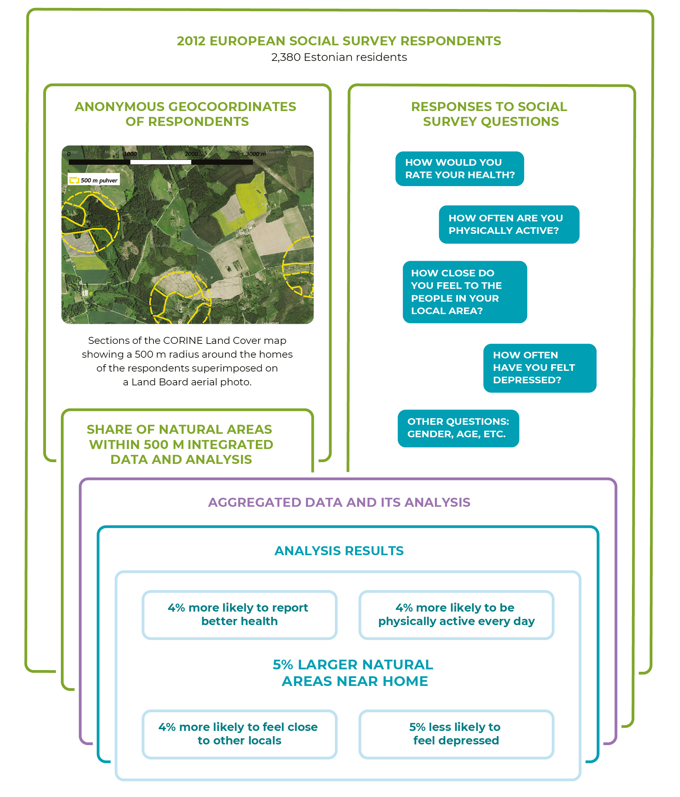

```

``` {block, type='imgsource'}
<span class="imgsource-source">Source:</span> CORINE 2000; European Social Survey 2012.
```

### The health benefits of natural areas are not sufficiently taken into account during planning {-.chapter3_section}

```{block, type='blockquote-left'}
The benefits associated with natural areas are measured by the number of premature deaths, cases of illness and hospitalisations prevented, and the amount of unspent budget by the health insurance fund.
```

The benefits associated with natural areas are measured by the number of premature deaths, cases of illness and hospitalisations prevented and the amount of unspent budget by the health insurance fund. These outcomes are shaped by how natural areas affect people in the form of ecosystem services or benefits: such as the absorption and purification of flood waters, movement corridors within settlements or opportunities to interact with local nature ([Figure 3.2.2](#figure322)). The impact of natural areas is in turn defined by the characteristics of the ecosystem. For example, green spaces with broadleaved trees are particularly valuable for alleviating the urban heat island effect, while coniferous trees, trees with more complex leaf structures or combinations of species on green walls are better at capturing air pollution ([Chiabai et al. 2018](#Chiabai2018)).

<p class="caption" id="figure322"><span class="figure-number">Figure 3.2.2.</span> Ecosystem services shape the functioning of public natural areas as a source of human well-being and risk</p>

```{r, figure322, fig.align='center', out.width='90%', echo=FALSE, message=FALSE, warning=FALSE}

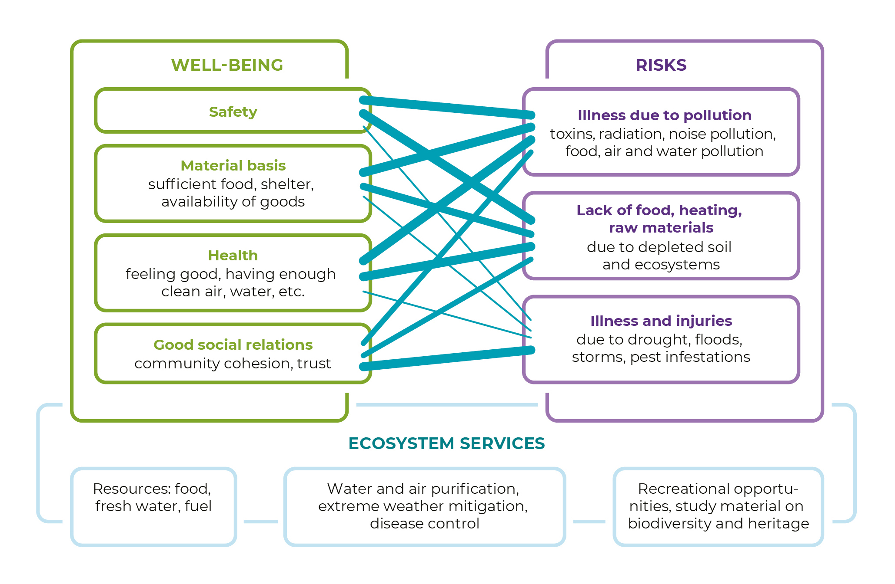

```

``` {block, type='imgsource'}
<span class="imgsource-source">Source:</span> Figure by the authors.
```

Ensuring ecosystem functions is most challenging in densely populated areas where there is competition for space. Different cities around the world have tried to find multifunctional nature-based spatial solutions for decreasing pollution and noise in the urban centre and promoting active travel. A well-known example is Cheonggyecheon in Seoul, where the drained riverbed that had been made into a motorway was reconverted into a green recreation area in 2005. Estonia, too, has good examples of creating living environments and opportunities for active travel: beach promenades in Pärnu (2006) and Haapsalu (2010), and connecting the Raadi manor grounds with Tartu city centre (2016).

The health benefits of spatial planning are assessed using a methodology where the change in health effects is projected on the basis of the relationship between current and future exposure to environmental factors and their health effects (dose–response relationship), and the change in exposure or physical activity. To this end, levels of air pollution, noise or other such environmental factors are measured or modelled (current situation), followed by the creation of various models of future scenarios. Then, current levels of morbidity or mortality are used as a basis for projecting any change in future levels of morbidity or mortality among the population using the dose–response relationship (e.g. what is the change in mortality per microgram of a pollutant unit).

This methodology has already been implemented in Estonia; for example, when analysing the best solution in the 2016 architectural design competition for Tallinn’s Main Street project, where the extent to which increasing green spaces and limiting traffic in the city centre of Tallinn would reduce noise and improve air quality was assessed ([Figure 3.2.3](#figure323)). Currently, air pollution and noise in this area cause an estimated 30 premature deaths per year. If there were just one lane in each direction along with a bus lane at the top of Pärnu maantee and Narva maantee, the number of premature deaths in the city centre of Tallinn would drop by approximately 4% per year, largely due to a reduction in the amount of exhaust fumes, but also of road dust and noise ([Orru et al. 2016a](#Orru2016)). Reduced levels of noise and pollution make people more willing to spend time on the streets, which in turn has a positive effect on the physical activity levels of the population. A pedestrian count along with an interpretation of Google Street View images showed that there were approximately 6,000 pedestrians per day on the Main Street, with an average physically active time of 15 minutes. This kind of activity level prevents an average of three premature deaths per year.

Health benefits or health damage measured like this can also be calculated in monetary terms. For example, it has been calculated that the green spaces in London city centre reduce health damage and costs to the United Kingdom’s health insurance fund by an estimated 1.82 million pounds (<a href="https://www.gov.uk/government/organisations/natural-england">Natural England</a>). Netherlands by 10% from the current 13.9% of the country’s territory would help prevent approximately 84,000 visits to the family doctor and save the health insurance fund 65 million euros per year (<a href="https://home.kpmg/nl/nl/home.html">www.kpmg.nl</a>).

<p class="caption" id="figure323"><span class="figure-number">Figure 3.2.3.</span> Tallinn’s annual average concentration (μg/m3) of particulate matter (PM10) and noise levels (dB(A)) during the day (Ld 7.00–23.00)</p>

```{r, figure323, fig.align='center', out.width='90%', echo=FALSE, message=FALSE, warning=FALSE}

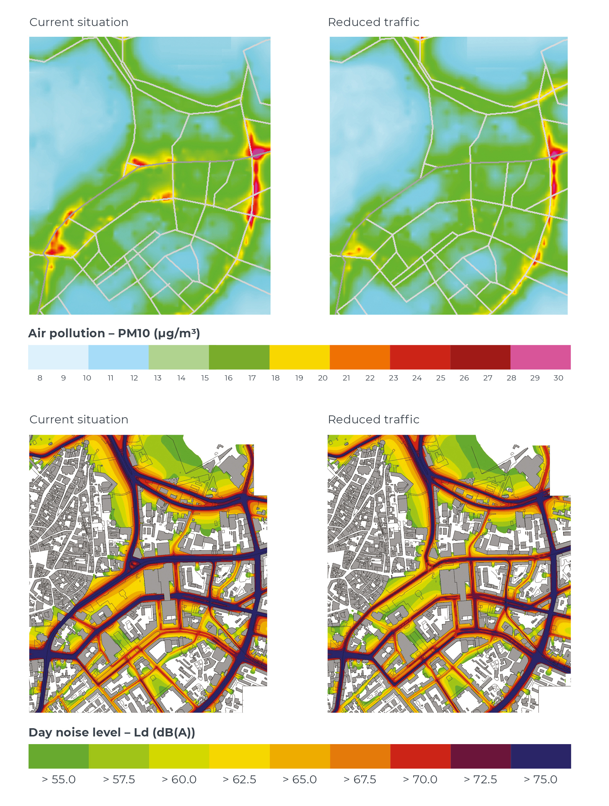

```

``` {block, type='imgsource'}
<span class="imgsource-source">Source:</span> Orru et al. 2016a.
```

### The buffering capacity of natural areas is weakening {-.chapter3_section}

Green spaces help to buffer the risks posed to human well-being by climate change, which are expected to increase in Estonia due to forest fires, torrential rains and storm damage. Green spaces catch excess rain water, reduce the devastating effects of storm winds, alleviate the urban heat island effect and have other benefits ([Demuzere et al. 2014](#Demuzere2014)). Health risks are also increased during hot days when the average daily temperature does not fall below 21 degrees. Between 1980 and 2015, the number of premature deaths associated with heat increased 2.4 times, particularly among people with chronic diseases, the elderly, and those living in eastern and central Estonia ([Orru et al. 2018](#Orru2018)). In order to limit these risks, it is important for settlements to have both green spaces (with trees) and bodies of water, but the pressure to reduce these kinds of areas is significant in Estonia due to a high degree of interest in development and fragmentary planning methods ([Poom and Sepp, this report](#shaping-natural-areas-for-public-use)).

```{block, type='blockquote-right'}
Green spaces catch excess rain water, reduce the devastating effects of storm winds, alleviate the urban heat island effect and have other benefits.
```
In addition to the accessibility of natural areas, the feeling of stability and safety gained from experiences in nature is also important for the ability to cope with environmental changes and extreme weather conditions ([Clayton et al. 2017](#Clayton2017)). The complex links between environmental problems and well-being and health are easier to understand for people who are exposed to these issues through where they live or as part of their work. A comparison of European countries shows that environmental protection has become more valued in places where people have already experienced heat waves in cities or wildfires ([Orru and Lilleoja 2015](#Orru2015)). Estonia is not among these places and environmental protection has tended to become less valued. A recent survey by Kantar Emor showed that two-thirds of respondents in Estonia considered that emergencies caused by extreme weather conditions are likely, while 40% considered that emergencies caused by large-scale forest fires and wildfires are likely, but just 51% and 25% of respondents, respectively, were sure of their ability to cope with these emergencies ([Kantar Emor 2017](#Kantar2017)).

Social groups lacking the skills to cope in nature and with a geographically limited support network are more worried about their vulnerability in the face of environmental changes. In Estonia, these mostly include urban residents and the Russian-speaking population ([Orru et al. 2018](#Orru2018)). People in rural areas are more used to inconveniences caused by natural forces (such as power cuts) and are better prepared to get by with their own food and heating sources for a brief period. To maintain a similar level of preparedness in cities, it is important that public spaces enable people to experience nature.

### Education is key to unlocking the potential of natural areas {-.chapter3_section}

Fewer nature experiences lead to a narrowed comfort zone, particularly for young people. Although young people may have a good theoretical knowledge of nature (according to OECD education statistics on the 2017 PISA results, the level of life sciences knowledge among Estonian students is 3rd among the countries of the world), practical nature experiences are diminishing. Young people’s exposure to virtual environments exceeds their time spent in nature many times over and they prefer environments that they can control ([Davis 2014](#Davis2014)). Yet playtime in nature, driven by curiosity and a sense of discovery, is vital for the normal development of risk perception in children. It also increases creativity and reasoning skills as well as improving adaptability to unexpected situations ([Clayton et al. 2017](#Clayton2017)). Community gardens, which are also becoming popular in Estonia, are an example of people’s efforts to maintain a connection to nature in urban environments. The relaxation from gardening, interactions between people of different communities and generations, and the sharing of gardening experiences made possible by these gardens are often considered greater benefits than the horticultural products themselves ([Kangur 2018](#Kangur2018)).

```{block, type='blockquote-left'}
75% of young people highly value opportunities to spend time in natural environments. Half of the respondents, particularly minors, reported feeling fearful – particularly of getting lost in the forest, but also of feeling disgusted by insects and other animals.
```
An online survey explored the emotions associated with the nature experiences of the Estonian Generation Y ([Saar 2015](#Saar2015)). It turned out that 75% of young people highly value opportunities to spend time in natural environments. The young people surveyed said they appreciated the sense of relaxation that comes with spending time in nature, either alone or with others, or from physical exertion. However, half of the respondents reported feeling fearful – particularly of getting lost in the forest, but also of feeling disgusted by insects and other critters. These negative emotions are associated with urbanisation (alienation) and become less prevalent with age, as experiences are gained and the capacity for control increases.

### Summary {-.chapter3_section #summary-32}

Easy access to diverse natural areas offers Estonians better opportunities to relax and improve their health. It helps to reduce health inequalities resulting from social background or financial status. Green spaces also encourage social interaction and can therefore potentially help in reducing segregation among different social groups, which is of critical importance in Estonia’s densely populated areas and suburbs. As there is increasing pressure to use natural areas for the construction of roads and other infrastructure, the health and well-being functions of natural areas should be explored more systematically and comprehensively when planning settlements. At present, the opportunities to conduct impact studies with a focus on health and well-being have not been sufficiently exploited when planning Estonian public spaces and natural areas. Objectives regarding the accessibility and quality of natural areas should be clearly defined in national development plans, such as the 2021–2030 development plan for transport and mobility, as well as in local government development plans, such as the Tallinn Development Plan 2021+.

Although urbanisation is limiting people’s exposure to the natural environment, the changing natural world demands our attention. Given the projected increase in extreme weather phenomena in Estonia, improved access to green spaces would help to reduce the risk to people’s well-being and health posed by floods, storms and heat. Restoring people’s relationship to the environment through nature education is one important way of realising the health and well-being benefits provided by natural areas and responding to the need to ensure that these benefits are maintained. This cannot be achieved solely through structured visits to nature provided by nature education centres and hiking trails – in order to maintain their physical and mental health, people also need free access to natural areas in cities. One of the most important courses of action to take in Estonia would be to make natural areas easily accessible to children in the cities and towns.

### References {-.chapter3_section #references-32}

<p id="Barton2016">Barton, J., Bragg, R., Wood, C., Pretty, J. 2016. Green Exercise: Linking Nature, Health and Well-Being. London: Routledge.</p>

<p id="Barton2017">Barton, J., Rogerson, M. 2017. The importance of greenspace for mental health. – The British Journal of Psychiatry, 14 (4), 79–81.</p>

<p id="Chiabai2018">Chiabai, A., Quigora, S., Martinez-Juarez, P., Higgins, S., Taylor, T. 2018. The nexus between climate change, ecosystem services and human health: towards a conceptual framework. – Science of the Total Environment, 635, 1191−1204.</p>

<p id="Clayton2017">Clayton, S., Manning, C. M., Krygsman, K., Speiser, M. 2017. Mental Health and Our Changing Climate: Impacts, Implications, and Guidance. Washington: American Psychological Association, ecoAmerica.</p>

<p id="Davis2014">Davis, J. (ed.) 2014. Young Children and the Environment: Early Education for Sustainability. Cambridge: Cambridge University Press.</p>

<p id="Demuzere2014">Demuzere, M., Orru, K., Heidrich, O., Olazabal, E., Geneletti, D., Orru, H., Bhave, A. G., Mittal, N., Feliu, E., Faehnle, M. 2014. Mitigating and adapting to climate change: multi-functional and multi-scale assessment of green urban infrastructure. – Journal of Environmental Management, 146, 107–115.</p>

<p id="Euroopa2012">European Social Survey (ESS) Round 6 2012. europeansocialsurvey.org/data/download.html?r=6.</p>

<p id="Kangur2018">Kangur, L. 2018. Linnaaiandus kui sotsiaalne praktika: Tartu noorte näitel. MA thesis. Estonian University of Life Sciences.</p>

<p id="Kantar2017">Kantar Emor 2017. Elanikkonna hädaolukorraks valmisoleku alase teadlikkuse indeksuuring 2017.</p>

<p id="Orru2016">Orru, H., Kaasik, M., Pindus, M., Tamm, T., Kärbla, V. 2016a. Tallinna kesklinna ja Vanasadama vahelise liikumisruumi õhusaaste ja müra muutuste modelleerimine Tallinna uue peatänava rajamisel ning sellest tulenevate tervisemõjude vähenemise hindamine. Tartu Ülikool: Peremeditsiini ja Rahvatervishoiu Instituut.</p>

<p id="Orru2015">Orru, K., Lilleoja, L. 2015. Contextual drivers of environmental values cross-culturally: evidence from Europe between 2004 and 2012. – Studies of Transition States and Societies, 7 (3), 38−51.</p>

<p id="Orru2016b">Orru, K., Orru, H., Maasikmets, M., Hendrikson, R., Ainsaar, M. 2016b. Well-being and environmental quality: does pollution affect life satisfaction? – Quality of Life Research, 25 (3), 699−705.</p>

<p id="Orru2018">Orru, K., Tillmann, M., Ebi, K. L., Orru, H. 2018. Making administrative systems adaptive to emerging climate change-related health effects: case of Estonia. – Atmosphere, 9 (6), 221−240.</p>

<p id="Roose2013">Roose, A., Kull, A., Gauk, M., Tali, T. 2013. Land use policy shocks in the post-communist urban fringe: a case study of Estonia. – Land Use Policy, 30 (1), 76–83.</p>

<p id="Saar2015">Saar, T. 2015. Loodus on hirmutav ja ebamugav: Y-generatsiooni kogemused looduses. MA thesis. Estonian University of Life Sciences.</p>

<p id="3Turu-uuringute2018">Turu-uuringute AS 2018. Eesti elanike keskkonnateadlikkuse uuring.</p>

<p id="WHO2017">WHO – World Health Organization 2017. Urban Green Space Interventions and Health. A Review of Impacts and Effectiveness. Copenhagen: WHO Regional Office for Europe.</p>

<!--chapter:end:03.2-chapter.Rmd-->

## Shaping natural areas for public use {.chapter_section .chapter3_section}

```{block, type='authors authors_eng'}
<div class="author-links">**[Age Poom](#age-poom) and [Kalev Sepp](#kalev-sepp)**</div>
<div><a class="print-btn" href="../loodusalade-kujundamine-avalikuks-kasutuseks.html">EE</a></div>
```

```{block, type='points'}
* The green network is under great development pressure especially in the municipalities surrounding cities; this inhibits the coherent and comprehensive functioning of the network as well as the possibilities for its public use.
```

```{block, type='blockquote-right'}
Nature conservation management and spatial planning facilitate the preservation and use of natural areas.
```
In this article, we provide an overview of the legal framework for the spatial planning and management of natural areas, which is used to shape the preservation of natural areas, the value of nature and access to natural areas. We explain the underlying principles and administrative methods for the protection and use of natural areas and the hierarchical and horizontal links between strategic and spatial planning in the context of preserving the value of nature.

The integral functioning of and access to natural areas are managed in Estonia by means of nature conservation and spatial planning. The purpose of nature conservation arrangements is to ensure biodiversity, functioning ecosystems and the preservation of a natural environment of cultural and aesthetic value. The definition of the task of spatial planning is more general: to plan land use in a manner that integrates and balances the various areas and interests of social life. The Planning Act emphasises the role of spatial planning in ensuring ‘democratic, long-term, balanced’ and ‘environmentally sound and economically, culturally and socially sustainable development’. The elements of democracy in the planning process include defining the interests and categories related to land use and creating a deliberative space in society in order to agree during the planning process on the principles and solutions for the use of space. In the case of discretionary decisions, it can thus be clarified whether, for example, the preservation of region-specific landscapes or the green network is more important than development based on private interests or mining and quarrying.

Planning concerning the entire natural environment is regulated in Estonia by the General Part of the Environmental Code Act, which has been the main legal instrument since 2014 that elaborates on the constitutional provisions on the protection of the environment. Appropriate principles for planning in the natural environment ([Figure 3.3.1](#figure331)) require the integration of fields of life, the balancing of interests, prevention of environmental damage and comprehensive regard for environmental considerations in organising social life.

<p class="caption" id="figure331"><span class="figure-number">Figure 3.3.1.</span> The principles, fundamental rights and obligations concerning the protection of the environment and spatial planning based on the Estonian Constitution, the General Part of the Environmental Code Act and the Planning Act</p>

```{r, figure331, fig.align='center', out.width='90%', echo=FALSE, message=FALSE, warning=FALSE}

knitr::include_graphics("../figures/3-chapter/fig331_eng.jpg")

```

``` {block, type='imgsource'}
<span class="imgsource-source">Source:</span> Figure by the authors.
```

### The planning of natural areas is based on the principle of subsidiarity {-.chapter3_section}

Spatial planning grew out of urban and regional planning; the term was first used by the ministers in charge of European regional planning in 1983 in the European Regional/Spatial Planning Charter, also known as the Torremolinos Charter. The charter was driven by the desire to ensure a healthy environment for Europeans and a high quality of life. The charter was the first document to formulate the principles of spatial planning, which are also reflected in the Estonian Planning Act. In 2013, the European Council of Spatial Planners, of which the Estonian Association of Spatial Planners is a member, approved the Charter of European Planning ([ECTP-CEU 2013](#ECTP-CEU2013)). This European spatial vision highlights the need to ensure ecological functioning, access to cultural and natural heritage for all, and the role of landscapes and urban green spaces as elements of the quality of life when planning the artificial environment.

The spatial planning charter is a value-based agreement pointing the way forward. It sees planning as a means of cooperation and coordination between spatial decision-making levels. Every level – from international cooperation for attaining sustainable development to local development and land use plans – should take into account the goals and activities of at least the levels immediately above and below it. The European Union lacks common planning law: the system of spatial planning is hierarchical and the legal framework is established by each member state itself. In Estonia, hierarchy is primarily one-way: the strategic documents of a larger spatial unit direct the content of lower-level spatial plans ([Irbis Konsultatsioonid et al. 2017](#Irbis2017)).

```{block, type='blockquote-left'}
In Estonia, hierarchy is primarily one-way: the strategic documents of a larger spatial unit direct the content of lower-level spatial plans.
```
However, spatial planning is based on the key principle of subsidiarity: development decisions concerning local affairs are, as a rule, made as close to the inhabitants as possible; that is, at the lowest feasible level of the administration. The value of spatial plans in shaping the future, living environment and public space of a region and their agreement with the community’s interests depend on the ability of the processor to use the knowledge of residents and involve them in preparing and implementing the plan ([Levald 2018](#Levald2018); [Nuga et al. 2015](#Nuga2015); [Vahtrus et al., this report](#public-participation-in-decisions-on-the-use-of-natural-areas)). The Estonian administrative reform of 2017 that reduced the number of municipalities nearly three-fold aimed at increasing that very capacity in the region. Furthermore, planning quality has been improved through the participation of Estonian officials and experts in continuing professional education programmes and international networks such as Vision and Strategies Around the Baltic Sea (VASAB) and the European Spatial Planning Observation Network (ESPON) ([Adams et al. 2014](#Adams2014)).

Spatial planning as a public procedure was introduced in Estonia with the Planning and Building Act of 1995. The Spatial Planning Department of the Ministry of Finance has been responsible for spatial planning since 2015. Spatial development at the national level is guided by the national spatial plan and county spatial plans and elaborated through thematic plans. Local decisions on spatial development and land use are made by the local government when preparing comprehensive spatial plans and detailed spatial plans. National designated spatial plans and local government designated spatial plans are two new types of plans defined in the 2015 Planning Act that stand out against the hierarchical system; under these plans, objects of significant spatial impact can be established outside the usual planning procedure. The practice of designated spatial plans is only evolving in Estonia and their impact on natural areas is not clear.

From the viewpoint of shaping public space, county spatial plans and comprehensive plans are the most important planning levels. They take into account the national strategic guidelines while being sufficiently context-sensitive and engaging the local community. The thematic spatial plan ‘Environmental conditions guiding settlement and land use’, which was nationally initiated in all counties in 1999, is regarded as the spatial plan that has had the greatest impact on Estonia’s settlement structure; it provides for green spaces and regulates the expansion of housing construction ([Irbis Konsultatsioonid et al. 2017](#Irbis2017)). A comprehensive plan defines land use on the territory of a municipality in line with the principles of the county-level plan. A comprehensive plan formulates the conditions of use that ensure the preservation of recreational areas, public waterbodies and green networks, valuable landscapes and biological communities.

### International development objectives and national policies influence the status of natural areas {-.chapter3_section}

```{block, type='blockquote-right'}
Estonia has joined international treaties supporting the preservation of a coherent and functioning green network and public access to natural areas.
```
Spatial and strategic planning related to nature conservation and sustainable development is guided by international treaties ([Figure 3.3.2](#figure332)). Of the earlier international agreements emphasising the public benefits of natural areas, the most important are the 1972 Convention Concerning the Protection of the World Cultural and Natural Heritage and the 1972 Declaration of the United Nations Conference on the Human Environment. In 1992, after regaining independence, Estonia signed agreements on the protection of biodiversity and sustainable development, including the Convention on Biological Diversity and the UN Agenda 21 action plan. The importance of green spaces in the living environment is highlighted by the WHO Declaration on Environment and Health (2010). Urban green spaces in particular, as well as the protection of the condition of the environment, its biodiversity and well-being in general are covered by the 2030 Agenda for Sustainable Development adopted by the UN in 2015. A number of conventions, strategies and action plans for the protection of natural areas, landscapes, cultural heritage and the living environment have been adopted at the European level, including the EU Strategy on Green Infrastructure (2013). The Man and the Biosphere Programme under UNESCO, within which a biosphere programme area was designated for the western Estonian islands in 1989, deserves mention as an example of the integration of values in regional management.

<p class="caption" id="figure332"><span class="figure-number">Figure 3.3.2.</span> A selection of international and Estonian strategic development documents framing the appreciation for natural areas in Estonia</p>

```{r, figure332, fig.align='center', out.width='100%', echo=FALSE, message=FALSE, warning=FALSE}

knitr::include_graphics("../figures/3-chapter/fig332_eng.jpg")

```

``` {block, type='figure-comment'}
<span class="figure-comment-start">Note:</span> Types of spatial plans are highlighted that, among other things, pertain to the protection of natural areas and their use for designated purposes. Figure 3.3.2 does not cover EU directives, Estonian laws or strategic development documents of other sectors, which can also impact the public use of natural areas.
```

``` {block, type='imgsource'}
<span class="imgsource-source">Source:</span> Figure by the authors.
```

International agreements value the fundamental and multi-layered role of natural areas in human health as well as social and economic affairs. The UN Global Biodiversity Strategy (2010) prepared under the Convention on Biological Diversity presumes that in order to preserve biodiversity and thereby the value of natural areas, countries will have integrated biodiversity values into their national and local strategies, development plans and spatial plans by 2020 at the latest. In Estonia, these principles require developing in order for policy to value natural areas as more than merely heritage or economic resources. For example, the Estonian Regional Development Strategy, which guides long-term regional development, acknowledges the problem of the loss of natural areas due to urban sprawl, but as a solution, it highlights the use of the region-specific natural resources in local enterprise and community activities. The Regional Development Strategy does not set guidelines on how to alleviate development pressure on natural areas to ensure their ecological functioning, their role in maintaining the quality of life, and public access to them. Estonia declares it is achieving the goals of the UN Global Biodiversity Strategy by creating a national system to map and assess ecosystem services and integrate them into strategic and spatial planning by 2023 at the latest ([Linder and Kakuver 2017](#Linder2017)).

In addition to documents directly pertaining to natural areas, these areas are also affected by the strategic development documents of other policy areas, especially the basic policy documents expressing the nation’s strategic interests and sectoral development targets, as well as development plans and programmes for specific policy and governance areas. Areas directly related to the use of space include energy, the use of mineral resources, industry, agriculture, forestry, nature conservation, water management, transport, telecommunications, national defence, tourism and the development of residential areas. The 2014–2020 Regional Development Strategy calls for working towards substantive and spatial harmony between policy areas and spatial planning, considering that physical space is limited. This means that sectoral development documents should indicate how development targets contribute to the achievement of a high-quality living environment and public space, including through the good condition of and access to natural areas.

According to the spatial design expert group set up at the Government Office, Estonia lacks a spatial policy with an integrated approach to the natural and built environment and that coherently implements the various fields of spatial planning to serve as the basis for activities at all levels of decision-making and all policy areas. According to applicable law, sectoral strategic development documents are not required to consider spatial plans, spatial impact, or the combined spatial impact of the various documents ([Ministry of Finance 2019](#Ministry2019)). The consistency of development documents with the national spatial plan is sometimes specified, but only in a declarative manner. The spatial impact of development documents protecting sectoral interests has intensified over time, while the use of discretion in planning has decreased. This has led to the poor representation of county and local interests in strategic documents ([Irbis Konsultatsioonid et al. 2017](#Irbis2017)), where the regulations of sectoral development plans that have spatial impacts cannot be changed through spatial planning ([Ministry of Finance 2019](#Ministry2019)). Some European countries (Ireland, Lithuania) have taken steps to provide a single basis for preparing spatial development guidelines, strategic development documents and national investment plans (ibid.).

### Natural areas have different access options and restrictions on use {-.chapter3_section}

The bases for planning natural areas in Estonia and the related legal and administrative arrangements are complex ([Figures 3.3.3](#figure333) and [3.3.4](#figure334)). An area may be subject to multiple protection procedures or restrictions on use; for example, if an area is part of a limited management zone in a landscape protection area, a waterfront protection zone, and a core area of the green network. Restrictions also concern the public use of natural areas, including staying in these areas.

<p class="caption" id="figure333"><span class="figure-number">Figure 3.3.3.</span> Estonian natural areas may be subject to multiple protection procedures depending on the natural value of the area</p>

```{r, figure333, fig.align='center', out.width='100%', echo=FALSE, message=FALSE, warning=FALSE}

knitr::include_graphics("../figures/3-chapter/fig333_eng.jpg")

```
``` {block, type='figure-comment'}
<span class="figure-comment-start">*</span> Areas in a forest with a high probability of the presence of narrowly adapted, threatened, vulnerable or rare species.
```

``` {block, type='imgsource'}
<span class="imgsource-source">Source:</span> Figure by the authors.
```
Natural areas are generally publicly accessible in Estonia and visited by various groups ([Sepp and Lõhmus, this report](#how-do-people-use-the-natural-environment-in-estonia)), but the physical public space is not defined by the law. The Charter of European Planning cites streets, squares, footpaths and green links as examples of the ‘public realm’ (<a href="https://planeerimine.ee/static/sites/2/euroopa_planeerimise_harta.pdf">ECTP-CEU 2013</a>). The General Part of the Environmental Code Act sets out the principle of general access: while entering a plot of land requires the permission of the owner, permission is assumed unless the owner has clearly indicated otherwise. In addition to the owner, the local government may restrict access to a natural area in a comprehensive plan if this is required by overriding public interest or private interest or if a lawful structure is located on a waterfront path.

Public access and nature conservation are most clearly defined for sites protected under the Nature Conservation Act (18.5% of Estonia’s land area; [Linder and Kakuver 2017](#Linder2017)). Protected areas have protection zones of varying strictness, the most stringent of which are nature reserves (1% of the land area of protected areas; [ibid.](#Linder2017)). Land in special management zones (60%) and limited management zones (39%) may be visited according to the procedure set out in the protection rules; in all cases, it is prohibited to camp, build fires and organise events in places not specifically prepared and designated for these purposes. Roads and paths in protected areas or leading to protected natural sites are open to the public from sunrise to sunset. Protected zones along shores and banks (limited management zone, building exclusion zone and water protection zone) are also relevant in respect to public use: permanent access must be provided to waterbodies that are in public use; a waterfront path must allow access at the border of the waterbody, and conditions for recreation must be maintained in protected zones.

```{block, type='blockquote-right'}
The unauthorised closure of a waterfront path or the obstruction of access to such a path is a common example of conflict between private and public interests in Estonia.
```
The National Audit Office has pointed out in an audit that the unauthorised closure of a waterfront path or obstruction of access to such a path is a common example of conflict between private and public interests in Estonia ([National Audit Office 2015](#1Audit2015)). There are many private owners that, according to the National Audit Office, lack the will to allow the roads and suitable parking spots on their land to be used by the public. Another possible problem is the difficulty of finding and the poor signage of access roads to waterbodies, or even a complete lack of access, as well as failure to mark an alternative route where a waterfront path is disrupted. The National Audit Office has emphasised the importance of decisiveness on the part of the local government during the preparation of comprehensive plans and recommended that cooperation with the Environmental Inspectorate be intensified to ensure the usability of waterfront paths.

```{block, type='blockquote-left'}
Areas of increased public interest include 3.5% of the forest lands administered by the RMK, which border recreational forest areas, densely populated areas or private residential buildings, or are important in terms of cultural heritage.
```

A large part of the administration of natural areas owned by the Estonian state has been delegated to the State Forest Management Centre (RMK), which is a legal entity in private law. To balance private and public, national and local interests in forest land management, the RMK has defined areas of increased public interest and the methods for their management since 2017. Such areas include forest lands administered by the RMK that are adjacent to recreational forest areas, densely populated areas or private residential buildings or that are important in terms of cultural heritage. To manage these areas, stricter principles that have more regard for the local context have been agreed with the community. The participation of stakeholders and consideration of the landscape are important aspects in managing these areas, but they are not excluded from being managed. According to the RMK, a total of 51,134 hectares of forest land was defined as areas of increased public interest by early 2019, which constitutes 3.5% of the total forest land administered by the RMK.

The Heritage Conservation Act helps preserve natural areas on which cultural monuments are located. The national register of cultural monuments includes, for example, ancient burial sites and burial mounds, hill forts and settlement sites, natural sacred sites, such as sacred springs, sacrificial stones and trees with carved crosses, as well as observation posts and defence lines (in total over 2,500 objects located in natural areas). Estonia is acceding to the Framework Convention on the Value of Cultural Heritage for Society (Faro Convention, 2005), which defines benefiting from cultural heritage and contributing to its enrichment as a human right. To preserve and acknowledge historical natural sacred sites and the possibility to visit them, the National Heritage Board is gathering information on the location and physical status of natural sacred sites and on the related folklore. According to the National Heritage Board, information on the natural sacred sites of nearly 60 parishes had been collected by 2019 or were being collected.

<p class="caption" id="figure334"><span class="figure-number">Figure 3.3.4.</span> Distribution of work between public bodies in the planning and management of the land use and protection of natural areas</p>

```{r, figure334, fig.align='center', out.width='100%', echo=FALSE, message=FALSE, warning=FALSE}

knitr::include_graphics("../figures/3-chapter/fig334_eng.jpg")

```

``` {block, type='imgsource'}
<span class="imgsource-source">Source:</span> Figure by the authors.
```

In settlements, the inhabitants are provided with primary contact with natural areas in terms of forests, urban woodlands, parks and cemeteries. Urban woodlands and forested parks have been managed in Estonia since at least the mid-19th century, as the recreational value of forests was already highly appreciated then. An important indicator of the use of recreational areas within and near urban areas is their proximity to people’s homes ([Sepp and Lõhmus, this report](#how-do-people-use-the-natural-environment-in-estonia);[Orru et al., this report](#The-impact-of-natural-areas-on-peoples-well-being)).

The sea constitutes a special natural area in terms of public access and usability. Historical uses of maritime areas, such as for fishing or travelling, are being supplemented by new uses such as recreation and energy production. The recreational value of maritime areas is also reflected in sea views, while new uses may compete with the preservation of sea views. A spatial plan covering Estonia’s entire maritime area (36,500 sq. km including the shore area) is being prepared, in the course of which interests and areas suitable for various uses are being identified, the combined impact of the uses is assessed and a long-term agreement on the use of the sea made between the parties to the plan. Spatial planning for maritime areas is a new practice for the entire European Union (the obligation of maritime spatial planning was only established in 2014). Before the Estonian maritime spatial plan was initiated, county spatial plans for the maritime areas of Hiiumaa and Pärnumaa were adopted in 2016 and 2017, respectively.

Protection of natural values on inland waterbodies and regulating their public use is effected through regional river basin management plans and spatial planning, having regard for the requirements of the conservation of nature and the protection of health. Public beaches are defined in comprehensive plans. Travelling on navigable waterbodies is administered by the Maritime Administration. Local governments may set temporary restrictions on the use of public waterbodies.

### The green network connects natural areas, but its function as a whole is not guaranteed {-.chapter3_section}

```{block, type='blockquote-right'}
The most extensive protection against land-use changes in natural areas relates to the green network, which covers 55% of Estonia’s land area.
```

The most extensive protection against land-use changes in natural areas relates to the green network, which covers 55% of Estonia’s land area. Its purpose is to coherently link various types of natural or semi-natural land and water areas to ensure their ecological functioning and the preservation of landscapes. The green network consists of core areas of various levels of importance (at national, county and local levels) and the green corridors connecting them. Of the total land area of protected zones in Estonia, 88% is covered by the green network and this constitutes about one-third of the total size of the green network. Protected zones and the green network overlap most in Läänemaa and least in Põlvamaa (with 51% and 18% of the green network protected in these counties, respectively). The protected areas not covered by the green network are largest in Hiiumaa (29%), Valgamaa (28%) and Saaremaa (27%) ([Figure 3.3.5](#figure335)).

<p class="caption" id="figure335"><span class="figure-number">Figure 3.3.5.</span> The green network and protected natural sites (protected areas, places where protected species have been found, species protection sites, Natura 2000 sites) as a percentage of the total area of the county</p>

<div class=desktop-plot>
```{r, figure335, out.width='90%', fig.align='center', echo=FALSE, message=FALSE}

library("tidyverse")

fig335_data <- read.csv ("../data/33_fig5_data.csv", header=TRUE, fileEncoding="utf-8")

fig335_data$objects_eng[grepl("RV ala väljaspool kaitsealasid", fig335_data$objects)]<-"Green network area outside protected areas"
fig335_data$objects_eng[grepl("Kaitstavad loodusobjektid RV alal", fig335_data$objects)]<-"Protected natural sites inside green network area"
fig335_data$objects_eng[grepl("Kaitstavad loodusobjektid väljaspool RV ala", fig335_data$objects)]<-"Protected natural sites outside green network area"


fig335_data$objects_eng <- factor(fig335_data$objects_eng, levels = c("Green network area outside protected areas","Protected natural sites outside green network area","Protected natural sites inside green network area"))


  fig335_plot <- ggplot() +
    geom_bar(data = fig335_data, mapping = aes(x=reorder(county,-value), y=value, fill=objects_eng, text = paste("", county,
                         "<br>", objects_eng,
                         "<br>", value, "%")), width=0.6, stat="identity") +
    scale_fill_manual(values=c("#79AC2C","#482683","#5B8121"), labels=c("Green network area outside protected areas","Protected natural sites outside green network area","Protected natural sites inside green network area")) +
    labs(y="%", x="") +
    guides(fill=guide_legend(nrow=3,byrow=TRUE)) +
      scale_y_continuous(expand = c(0, 0), limits=c(0,100)) +
    expand_limits (y=0)

      fig335_theme <- theme(
                    panel.grid.major.x = element_blank() ,
                    panel.grid.minor.x = element_blank(),
                    axis.line = element_line(size = 0.2, colour = "#cccccc"),
                    axis.text.x = element_text(angle=45, margin = margin(t = 7, r = 0, b = 0, l = 0), hjust=1.1),
                    text = element_text(family="Montserrat"),
                 )

ggplotly(fig335_plot + fig335_theme + fig_theme_general, tooltip = "text" ) %>%
config(displayModeBar = F, collaborate = F)   %>%
layout(legend = list(orientation = "h",y = 1.15)) %>%
layout(xaxis = list(fixedrange = TRUE)) %>%
layout(yaxis = list(fixedrange = TRUE))

#ggsave(path="exported_figures/PDF/chapter3",filename="fig335.pdf", height=140, width=210, units="mm")

```

</div>

</div>
<div class="mobile-plot">
```{r, out.width='100%', fig.asp=.75, fig.align='center', echo=FALSE, message=FALSE, warnings=FALSE}

print(fig335_plot + fig335_theme + fig_theme_general)

```

``` {block, type='imgsource'}
<div><span class="imgsource-source">Sourve:</span> Kutsar et al. 2018.</div>
<div><a class="data-btn" href="../data/33_fig5_data.csv"><i class="fa fa-download" aria-hidden="true"></i>Download data</a></div>
```

The need for a green network is set out at the international level in the EU Strategy on Green Infrastructure and at the national level in the Estonian Nature Conservation Development Plan. The areas covered by the green network are defined in county spatial plans and comprehensive plans. The green network was planned with the help of the green network planning guide ([Kutsar et al. 2018](#Kutsar2018)) and the <a href="https://planeerimine.ee/static/sites/2/uldplaneeringu_juhis_final.pdf">Ministry of Finance 2018 guidelines for comprehensive plans</a>. The idea of a green network in Estonia goes back to the 1960s when Jaan Eilart and Vaike Parker first attempted to plan recreational landscapes and green corridors around Tartu, while Heino Luik and Veljo Ranniku were engaged in the functional zoning of oil-shale production areas in Ida-Virumaa. In the early 1980s, attempts were made to research and develop an innovative approach to ecological networks as landscape areas ecologically compensating for human impact ([Mander et al. 2018](#Mander2018)). Maps of ecological networks of various levels of precision were prepared until the late 1980s; the most precise of them were prepared for Tallinn, northeastern Estonia and Hiiumaa. The term ‘green network’ was introduced in the national spatial plan Estonia 2010+, adopted in 2000. The current Planning Act covers green networks along with valuable landscapes, agricultural areas and built-up areas of cultural and environmental value, referring among other things to the interconnectedness of these areas and the cultural importance of the green network.

```{block, type='blockquote-right'}
There is no consensus or clear case law in Estonia on whether or not a development plan’s conflict with a spatial plan constitutes grounds for refusal to issue an operating licence.
```
The preservation of and access to natural areas covered by the green network but not by protected areas are ensured through the requirement not to alter the main purpose of land use in such areas (e.g. replacement of natural by artificial areas, such as mineral deposits or residential areas, which also preclude public use) set out in county spatial plans and comprehensive plans. Restrictions are also set during the process of managing land use and issuing operating licences, including granting building rights. However, areas of natural value that are under development pressure or include mineral deposits can be excluded from the network by amending the spatial plan, unless such areas are part of protected areas. There has been remarkable development pressure on the green network over the past decade in the ring-shaped rural municipalities around the largest local commuting centres (Tallinn and Tartu).

Where development plans endanger the functioning of the green network, the extent of the impact and the permissibility of the activity are analysed in the course of environmental impact assessment, but development-based assessment includes only a limited approach to cumulative and diffuse spatial impacts. While county spatial plans and comprehensive plans have been prepared with a broad strategic view, there is no consensus or clear case law in Estonia on whether or not a development plan’s conflict with a spatial plan constitutes grounds for refusal to issue an operating licence ([Kask et al. 2015](#2Kask2015)). Therefore, even though the planning procedure is an important aspect of protecting a public space with natural value, it is not always sufficient, and stricter protective measures should be considered for key areas.

```{block, type='casebox'}
<h3>Analysis of the green network shows shortcomings in planning and legislation</h3>

Within the framework of the Estonian Nature Conservation Development Plan, an analysis was conducted of the functioning of the green network as defined in Estonian county spatial plans and comprehensive plans for 2003–2017 ([Kutsar et al. 2018](#Kutsar2018)). Responses were received in due course from 14 county governments out of 15 and 133 local governments out of 213. Spatial data (vector files) suitable for analysis were received on 15 county spatial plans and 74 comprehensive plans.

In more than half of the plans, major deviations from the methodology for defining the green network were found. Typically, no distinction was made between core areas and green corridors (in 11 county spatial plans and 43 comprehensive plans), and between core areas of importance at the national, county and local levels. As a result, elements of the network are not distinguishable in most of the plans, and the conditions of use set in the explanatory statement do not unambiguously match the areas on the map. Therefore, management decisions cannot be weighed on the basis of each area and the reason for setting different conditions for core areas and green corridors is lost.

Changes in the green network at the level of CORINE 2006, 2012 and 2018 land cover classes were analysed for Harjumaa. Between 2006 and 2012, the land cover changed on a total of 12,010 hectares in the Harjumaa green network, of which most were shifts from one natural land cover class to another. On about 300 hectares, areas with a natural land cover were turned into artificial areas, mostly for residential development and quarries. There were 25 interruptions to green corridors (turning part of the natural land cover of the corridor into an artificial area) in the surroundings of Tallinn and near major highways ([Figure 3.3.6](#figure336)). Between 2012 and 2018, land cover changes occurred on a total of 10,509 hectares of green network land, of which 224 hectares of natural land cover were turned into artificial areas. By virtue of these changes, former green network areas were removed from public use and lost their designated function as natural areas.

It was concluded from the analysis that the Estonian legal framework will be sufficient to ensure the protection of the green network once laws and regulations are applied with the aim of preserving the green network. Development pressure results in the fragmentation of the green network. The quality and accessibility of the network is maintained in areas where the population decreases and development pressure is lower. Improving the technical level of planning procedures, including the definition of target levels for the green network, using digital standards for spatial information and linking the planning solution to databases would help guarantee the preservation and all-round functioning of green networks.

```

<p class="caption" id="figure336"><span class="figure-number">Figure 3.3.6.</span> Interruptions in the green network of Harjumaa in 2012 compared to 2006</p>

```{r, figure336, fig.align='center', out.width='100%', echo=FALSE, message=FALSE, warning=FALSE}

knitr::include_graphics("../figures/3-chapter/fig336_eng.jpg")

```

```{block, type='imgsource'}
<span class="imgsource-source">Source:</span> Kutsar et al. 2018.
```

### Summary {-.chapter3_section #summary-33}

```{block, type='blockquote-right'}
Development pressure results in the fragmentation of the green network. The quality and accessibility of the network is maintained in areas where the population decreases and development pressure is lower.
```
Spatial planning and nature conservation requirements are in place in Estonia which support the preservation of natural areas, their condition and public accessibility. Over half of Estonia’s land area is covered by the green network agreed upon during the spatial planning process. At the same time, the proportion of protected areas is smaller in Estonia than elsewhere in Europe – 20% and 26%, respectively ([EEA 2019](#European2019)). The current spatial planning and nature conservation measures are not enough to guarantee good living environment, open space and the preservation of the benefits of natural areas. The reasons for this are the lack of a carefully designed cross-sectoral spatial policy and the legal possibility of not complying with the conditions agreed upon in the preparation of strategic development documents and when processing development plans, as well as with the analysis of combined spatial impacts. Alongside resolving these issues, it is important for the implementation of a coherent spatial policy to improve the technical level of plans and ensure the accessibility of information in line with the standards of the digital age.

### References {-.subreferences #references-33}

<p id="Adams2014">Adams, N., Cotella, G., Nunes, R. 2014. The engagement of territorial knowledge communities with European spatial planning and the territorial cohesion debate: a Baltic perspective – European Planning Studies, 22 (4), 712–734.</p>

<p id="ECTP-CEU2013">ECTP-CEU 2013. The Charter of European Planning: The Vision for Cities and Regions – Territories of Europe in the 21st Century. Barcelona: The European Council of Spatial Planners.</p>

<p id="European2019">EEA – European Environmental Agency 2019. Share of country designated as terrestrial protected area and the overlap between Natura 2000 or Emerald sites and national designations. https://www.eea.europa.eu/ds_resolveuid/13e289d0367a4cf2b-4ddfb7aac31efee.</p>

<p id="Irbis2017">Irbis Konsultatsioonid OÜ, Tartu Ülikooli Sotsiaalteaduslike rakendusuuringute keskus, Hendrikson & Ko OÜ 2017. Arengu ruumiline ja strateegiline kavandamine, sh regionaaltasandi funktsioonid ruumilise arengu suunamisel. Report for the Ministry of Finance. https://planeerimine.ee/static/sites/2/arengu-ruumiline-ja-strateegiline-kavandamine-1.pdf.</p>

<p id="2Kask2015">Kask, O., Lopman, E., Relve, K., Kuusk, P., Triipan, M., Vaarmari, K., Vahtrus, S., Veinla, H. 2015. Keskkonnaseadustiku üldosa seaduse kommentaarid. Tartu: Keskkonnaõiguse Keskus.</p>

<p id="Kutsar2018">Kutsar, R., Metspalu, P., Eschbaum, K., Vahtrus, S., Sepp, K. 2018. Rohevõrgustiku planeerimisjuhend. Tallinn, Tartu: Keskkonnaagentuur, Hendrikson & Ko OÜ.</p>

<p id="Levald2018">Levald, A. 2018. Kohandav planeerimine ja ruumiloome kahaneva rahvastikuga piirkondades. Presentation at an Estonian Parliament study committee meeting, Toompea, 3 December 2018. Tallinn: Ministry of Finance.</p>

<p id="Linder2017">Linder, M., Kakuver, K. (eds.) 2017. Looduskaitse. Eesti looduse kaitse aastal 2015. Eesti looduse mitmekesisus 5. Tallinn: Keskkonnaagentuur.</p>

<p id="Mander2018">Mander, Ü., Kull, A., Uuemaa, E., Mõisja, K., Külvik, M., Kikas, T., Raet, J., Tournebize, J., Sepp, K. 2018. Green and brown infrastructures support a landscape-level implementation of ecological engineering. – Ecological Engineering, 120, 23–35.</p>

<p id="Ministry2019">Ministry of Finance 2019. Ruumilise planeerimise rohelise raamatu eelnõu 26.07.2019. https://planeerimine.ee/prr.</p>

<p id="1Audit2015">National Audit Office of Estonia 2015. Kallasradade kasutamine. Kas omavalitsused ja Keskkonnainspektsioon on teinud kõik endast sõltuva, et inimene pääseks randa ja saaks kallasrajal liikuda? Report for the Estonian Parliament. Tallinn, 8 December 2015.</p>

<p id="Nuga2015">Nuga, M., Metspalu, P., Org, A., Leetmaa, K. 2015. Planning post-summurbia: from spontaneous pragmatism to collaborative planning? – Moravian Geographical Reports, 23 (4), 36−46.</p>

<!--chapter:end:03.3-chapter.Rmd-->

## Public participation in decisions on the use of natural areas {.chapter_section .chapter3_section}

```{block, type='authors authors_eng'}
<div class="author-links">**[Siim Vahtrus](#siim-vahtrus), [Liina Remm](#liina-remm) and [Kärt Vaarmari](#kärt-vaarmari)**</div>
<div><a class="print-btn" href="../kaasarääkimise-võimalused-loodusalade-kasutamisel.html">EE</a></div>
```

```{block, type='points'}
* Environmental democracy in Estonia is supported by a good legal framework and comprehensive environmental data; on the other hand, it is hampered by pessimistic citizens and the complicated presentation of information.
```

A large part of Estonia’s natural environment is at least to some extent open to public use or accessible to everyone. Environmental decision-making therefore impacts the public use of natural areas. A decision to allow a new gravel quarry in a state-owned forest or to permit the extraction of peat in a mire, for example, may result in a local community losing its traditional berry-picking area. The use of natural areas, including sacred natural sites or recreational forest areas in local communities, may also be limited by the decision to build a new road or railway. Permitting a new factory, hydropower plant or similar development on a river may reduce opportunities to engage in fishing or swimming or deprive people of natural sights. Even if the activity subject to environmental permits is being planned on private land or some distance from places in public use (e.g. establishing a new oil shale mine), its impact (e.g. noise, air or water pollution, increased traffic) often has a wide geographical range.

```{block, type='blockquote-right'}
Even if the activity subject to environmental permits is being planned on private land or some distance from places in public use, its impact (e.g. noise, air or water pollution, increased traffic) often has a wide geographical range.
```

The article provides an overview of how people can participate in environmental decision-making, focusing on two issues: the system for participating in environmental decision-making (opportunities), and the extent to which people are used to expressing their opinions publicly (level of civic activism). These two aspects are in turn dependent on the information given to people about their environment and the use of this information.

### Public debate on the environment was induced by events in the 1980s in Soviet Estonia {-.chapter3_section}

During the Soviet era, environmental matters in Estonia were decided without public dialogue and information on environmental risks was classified ([Kiisel 2005](#Kiisel2005)). For example, everything related to the strategically important uranium plant in Sillamäe, which functioned between 1946 and 1991, was highly classified. Lack of information also hampered public participation in solving environmental problems related to the living environment. Furthermore, environmental protection was viewed both by the general public as well as experts as a highly specialist field, at the same time, viewing the general population as rather the polluters than the protectors of the environment. Alongside these attitudes, in addition to their concern about the risks to Estonia’s natural environment, the general public also understood and valued a critical scientific approach to environmental problems and mistrusted the optimism of the authorities ([Lauristin 1988](#Lauristin1988)).

The national protest movement of 1987–1988 against the phosphorite mining planned in Virumaa changed the situation significantly. In just a few years, the ways in which the public took part in discussions and decision-making changed and a negative public opinion towards mining phosphorite developed. The public created its own opportunities for participating and exerting political pressure on the decision-making process, and the result was that the large-scale mining operation was never initiated.

At the same time, people started to demand access to environmental information. Across the Soviet Union, public discussion of environmental risks and problems began after the 1986 accident in Chernobyl nuclear power plant. As a result of domestic and international pressure, the Secretary General of the Central Committee of the Communist Party of the Soviet Union at the time, Mikhail Gorbachev, promised to publish information on the accident. Following these events, many countries recognised the importance of access to environmental information and public participation in environmental matters. Around the same time (1984–1987), the UN Commission on the Environment was working on the concept of sustainable development, including in its final report (the Brundtland report 1987) the need to include different stakeholders in environmental decision-making for the first time. The report fed into the Rio Declaration (1992), which already expressly provides that ‘[a]t the national level, each individual shall have appropriate access to information concerning the environment that is held by public authorities’. In 1990, the European Union adopted Directive 90/313/EEC on the freedom of access to information on the environment. In 1998, the Aarhus Convention was adopted, which provides everyone the right to environmental information and public participation in environmental decision-making as well as access to justice in these matters.

<div class="casebox">
<h3>Environmental democracy is born in Estonia in the ‘phosphorite war’</h3>

Planning for a phosphorite mining operation in Virumaa was already initiated by the Soviet authorities in the 1970s; information on it was classified. The plan foresaw an enormous mine with more than 10,000 employees, posing a risk to the ground water and bringing with it a massive migration of workers from other regions of the Soviet Union. The Academy of Sciences of the Estonian SSR discussed the plan in the second half of the 1970s, but the public only learnt of the plans at the start of 1987.

In spring 1987, the students of Tartu University organised peaceful protests, and the plan was critically discussed in the newspapers. This was followed by the birth of the Estonian Green Movement in 1988 and as the first mass event on the environment, a bicycle tour ‘How are you doing, Virumaa?’ was organised by the Greens. Public meetings were held in Tallinn and Tartu; press conferences as well as meetings with scientists were organised by different organisations; newspapers and state authorities received numerous collective letters; and among the youth, spontaneous expressions flourished, including pop songs, slogans and t-shirts. On 29 May 1987, the Supreme Council of the ESSR adopted a decision, by which it required the government authorities to take the interests of current and future generations in protecting the soil, earth and water as well the interest in the scientifically reasonable and rational use of these resources into account in future studies.

Different forms of public participation and democracy developed in the course of this process. In addition to publishing information in the mass media, and private discussions and meetings, public protests, collective letters, voting, polls, discussions in elected bodies and finally a decision by the Soviet public authorities were used and developed ([Lauristin 1988](#Lauristin1988)).

<p class="caption" id="figure341"><span class="figure-number">Figure 3.4.1.</span> Protest meeting on 19 May 1987</p>
```{r, figure341, fig.align='center', out.width='100%', echo=FALSE, message=FALSE, warning=FALSE}

knitr::include_graphics("../figures/3-chapter/fig341.png")

```

</div>
```{block, type='imgsource'}
<span class="imgsource-source">Source:</span> Archive of Postimees, Scanpix Baltics.
```

### The current legal framework on public participation and environmental information in Estonia is sound {-.chapter3_section}

After the restoration of independence, the public’s interest in environmental matters declined significantly. At the same time, Estonian environmental legislation was decisively harmonised with that of the European Union. In 2001, Estonia ratified the Aarhus Convention and in 2004 it joined the European Union, which meant that EU law had to be transposed. With these legal provisions, a strong foundation for access to environmental information and public participation was created. The requirements arising from the Aarhus Convention are mostly established in the General Part of the Environmental Code Act, according to which anyone is, as a rule, entitled to access to environmental information and has the right to participate in the making of decisions with significant environmental impact.

```{block, type='blockquote-left'}
According to the OECD Environmental Performance Review of Estonia from 2017, environmental democracy in Estonia is developed and environmental information accessible.
```

According to the comparative study ‘Environmental Democracy Index’, in 2015, Estonia ranked 14 out of the 70 countries studied regarding rules and the practice of public participation and access to information ([World Resources Institute 2015](#World2015)). According to the OECD Environmental Performance Review of Estonia from 2017, environmental democracy in Estonia is developed and environmental information accessible. Two thirds of the population consider themselves to be well informed of environmental matters, although the completeness and quality of information could be improved. Public participation opportunities in environmental matters are generally good according to the OECD review, although access to justice in environmental matters should be broadened. As a major challenge, the low effectiveness of administrative review (checking the legality of decisions by administrative bodies) was highlighted; this is because the same authority in charge of making the decision under review is often also in charge of the review process.

### The public can mostly participate in the management of public space {-.chapter3_section}

Participatory democracy and the legal basis for environmental decision-making (i.e. 1992 UN Rio Declaration, Aarhus Convention) are based on the principle that merely informing the public is not enough. Individuals and civil society groups must also have the chance to have a say in decision-making related to decisions with significant environmental impact on their living and natural environment (General Part of the Environmental Code Act, Article 28); in other words, use the information made publicly available by the authorities to actively shape the decisions that are being made. By participating in decision-making, citizens can in turn also give information to the authorities. Activities with ‘significant environmental impact’ are defined in the Environmental Impact Assessment and Environmental Management System Act and includes deforestation (conversion of forest land) of an area of more than 100 hectares and open-cast mining with a surface area of more than 25 hectares. If the decision does not involve a significant environmental impact, the right to participate is not available to everyone, although people directly affected must be provided with a chance to have their say in the matter.

Participation rights also depend on the level of decision-making ([Table 3.4.1](#table341)). Estonian legislation generally provides a good opportunity to be involved in the management of public space. In the following paragraphs, we will focus on the areas where the public participation opportunities are lacking, although stakeholders have a strong desire to have their say.

```{block, type='blockquote-right'}
The reviewing of environmental decisions is ineffective, as the authority in charge of making the original decision is often also in charge of the review process.
```
Regarding project-level decision-making at the local level, participation opportunities are lacking in respect of mining and forestry activities. After clear-felling, a forest may take an entire lifetime to be restored to its former state; mining limits access to natural areas and as a result completely changes the landscape. Despite substantial and long-lasting impacts from these decisions, spatial planning, and therefore public debate over the optimal location for mines and clear-felled areas is missing in the legal framework and practice. Thus, unlike, for example, the planning of new buildings in the urban environment, there is no coherence in the planning or analysis of the cumulative environmental impact in these areas.

Participatory planning for mining and clear-felling of forested areas would be reasonable. In Austria and Denmark, for example, spatial planning is applied to the use of mineral resources, and according to experts, this is a good way to resolve conflicts between mining companies and local communities ([MinPol 2017](#MinPol2017)). In Estonia, spatial planning could provide a satisfactory answer to the question of which deposits should be exploited as a priority to minimise the impact on the environment and people – at the moment, mining companies have a decisive role in choosing which deposits are mined and in which order. Regarding forest management, at the moment even the owners of neighbouring plots of land do not have a say in deciding over clear felling and other activities – only the landowner and the Environmental Board are involved in the decision-making. Starting from 2017, the State Forest Management Centre (RMK) has involved communities in planning forestry operations in areas with high public interest (see [Poom and Sepp, this report](#shaping-natural-areas-for-public-use)); however, there is relatively little practice, and therefore no conclusions about the impact of this voluntary measure can be made. A 2018 environmental awareness study ([Turu-uuringute AS 2018](#4Turu-uuringute2018)) confirms society’s expectations of greater scrutiny on forestry activities and limitations on landowners’ rights.

```{block, type='blockquote-left'}
Regarding project-level decision-making at the local level, participation opportunities are lacking in respect of mining and forestry activities.
```
The opportunities for individuals to be involved in policy-making affecting natural areas is also limited, although its impact on the public use of natural areas is often direct, especially in the case of policy-making and planning of transport infrastructure, forestry and mineral resources. Drafts of development plans and other strategic decisions are often written with the involvement of working groups, where only representatives of certain stakeholders (companies, scientists, environmental NGOs) are included. When a strategic environmental impact assessment is carried out as part of the decision-making process, individuals may participate, but can only do so after strategic choices have already been made. The lack of the direct participation of individuals has been somewhat compensated by the fact that in most cases environmental NGOs, who also represent the interests of citizens, have been included.


```{block, type='blockquote-right'}
The main problem with strategic projects that affect national interests and also impact natural areas is that public participation is offered only after strategic decisions have already been made.
```
The main problem with strategic projects that affect national interests, but also impact natural areas, is that public participation is offered only after strategic decisions have already been made. Once strategic choices have been made, the public’s influence on the project is mainly reduced to arguing over technical details. This is why the Aarhus Convention requires that the public must be offered participation opportunities at an early stage, before making any decisions. In the planning procedures for the Est-For wood processing plant, which caught the attention of the public in 2017–2018, for example, it was decided that a national designated spatial plan would be prepared to find a location for the plant within the basin of the Emajõgi River before public discussions even began ([Kõnnussaar and Lõhmus 2018](#Konnusaar2018)). The Supreme Court ruled (in Case No 3-17-2132) that narrowing the geographical scope of a national designated spatial plan at the start of the procedures does not necessarily preclude considering alternative locations outside the original boundaries at later stages. Due to the early termination of the planning procedures, however, we do not know whether the authorities would have been prepared to follow this ruling in practice.

<p class="caption" id="table341"><span class="figure-number">Figure 3.4.1.</span> The system of environmental decision-making in Estonia based on the level and nature of decision-making as well as individuals’ right to participate</p>

<div style="overflow-x:auto;">
<table id="table_341" style="width:100%">

  <tr>
    <th colspan="5" class="table_341_blank">TYPE OF DECISION</th>
  </tr>

  <tr>
    <th class="table_341_blank"></th>
    <th class="table_341_blank"></th>
    <th class="table341_green">Specific project</th>
    <th class="table341_green">Spatial plan</th>
    <th class="table341_green">Policy/strategy</th>
  </tr>

  <tr>
  <th rowspan="3" class="table_341_blank table_341_vertical">GEOGRAPHIC SCOPE</th>
    <th class="table341_dark_green">LOCAL</th>
    <td class="table341_purple">Permits, e.g.:<br>
• for special use of water<br>
• for mining<br>
• for forestry activities<br>
• for construction of buildings<br>
Detailed spatial plans</td>

  <td>Comprehensive plans</td>
  <td>Development plans, e.g.:<br>
• municipal development plans<br>
• waste management plans<br>
• development plans for public water supply and waste water systems</td>
</tr>

  <tr>
    <th class="table341_dark_green">REGIONAL</th>
    <td>Regional infrastructure objects, e.g.:<br>
• power lines<br>
• roads<br>
• railways<br>
• waste treatment centres</td>

  <td>County spatial plan</td>
  <td>Regional plans, e.g. regional development plans, development strategies</td>
</tr>

  <tr>
    <th class="table341_dark_green">NATIONAL</th>
    <td class="table341_purple">Facilities of national importance, e.g.:<br>
• major harbours<br>
• national main roads<br>
• practice grounds for the defence forces<br>
• large industrial installations</td>

  <td>National spatial plan</td>
  <td class="table341_purple">National development plans and strategies, e.g.:<br>
• framework strategy for mineral resources<br>
• development plan for nature conservation<br>
• development plan for forestry</td>
</tr>

</table>
</div>

``` {block, type='figure-comment'}
<span class="figure-comment-start">Note:</span> The cells with violet highlighting refer to types of decisions where (in some cases) public participation opportunities are limited.
```

```{block, type='imgsource'}
<span class="imgsource-source">Source:</span> Figure by the authors.
```

### Despite the right to participate, Estonians are passive and pessimistic {-.chapter3_section}

The existence of a right to participate does not automatically guarantee high-quality and appropriate participation in environmental decision-making. The attitudes of Estonian society towards participation in environmental decision-making are rather characterised by passivity and pessimism. In the 2018 environmental awareness study ([Turu-uuringute AS 2018](#4Turu-uuringute2018)), almost half of the respondents (46%) considered their participation rights irrelevant. The rights were more highly valued by respondents with higher education and higher income levels.

Participation in practice is even less active. Less than 10% of the respondents considered their participation opportunities to be good at the local level; at the national level, only 5% of respondents considered the opportunities to be good. The lowest level of confidence was expressed by respondents from north-east Estonia. The main obstacles reported were a low level of confidence in the impact that participation would have (21% of respondents) and lack of time (19%) ([ibid.](#4Turu-uuringute2018)). These results are in broad terms similar to the results of a study of the awareness of environmental law among Estonians and their rights commissioned by the Estonian Environmental Law Centre ([Klaster 2013](#Klaster2013)).

The main reasons for this pessimistic attitude have been addressed in several studies ([Suškevič 2014](#Suškevičs2014); [Klaster 2013](#Klaster2013)):

1. Issues with the character and content of channels used for the dissemination of information. The one-way communication channels that are mostly used (official notices, newspapers, websites) are not ideal for participants who prefer two-way channels of communication (e.g. personal meetings). The information given on decision-making procedures is often hard to understand for regular citizens both because of the wording as well as the low level of previous knowledge of the procedures and vocabulary used among citizens.

2. The attitudes of public servants in charge of public participation. Many public servants in 2014 did not understand the benefits and importance of public participation. As is typical for Central and Eastern European transition societies, both the public as well as public servants are passive in Estonia. The latter prioritise technical and scientific input and the interests of the public sector. As public participation is seen as a source of unpleasant exchanges and loss of time, a ‘minimal effort’ approach is preferred.

3. Complexity of official decision-making procedures. In reality, the public does not see official procedures as the only, nor the preferred way to participate in decision-making.

### Stakeholders expect more effective methods of participation {-.chapter3_section}

The effectiveness and efficiency of public participation is largely determined by the methods applied. The main components of public participation are informing stakeholders, consulting them, and including them in the decision-making process (see [Figure 3.4.2](#figure342)). The legal framework provides mostly for the first two components – informing and consulting. Both in the case of spatial plans and environmental permits, the basic requirements include the public display of the planned decision (which includes the opportunity to review the materials and make written statements) and public hearings, where statements can be made orally.

Elements of the third component (inclusion) can be, to a certain degree, found in the requirements of spatial planning. The Planning Act, for example, includes a requirement to cooperate with people interested in the spatial plan as well as environmental NGOs; in the case of a comprehensive plan, cooperation with local citizens’ groups is also required. Procedural rules for environmental permits (e.g. mining permits, felling notices) only require informing and consulting the public.

Contemporary methods, such as participatory planning and communicative planning, are gaining ever more attention. Participatory planning is a process based on active two-way communication, where the decision is made in cooperation with decision makers and politicians, planning experts and communities. In practice, however, the methods of public participation used for spatial planning procedures are still lacking diversity, despite administrative reforms, training for capacity building, and even the development of information and communication technology ([Roose 2013](#2Roose2013)).

Public participation and communication with the stakeholders should also not be strictly limited to formal communication methods. Studies have shown that when seeking the participation of landowners in the management of nature conservation areas, for example, public campaigns are not enough to satisfy their information needs; more direct forms of communication which provide specific substantive information, such as a phone call with a national nature conservation officer, are more efficient ([Suškevičs 2014](#Suškevičs2014)).


<p class="caption" id="figure342"><span class="figure-number">Figure 3.4.2.</span> Public participation framework</p>

```{r, figure342, fig.align='center', out.width='90%', echo=FALSE, message=FALSE, warning=FALSE}

knitr::include_graphics("../figures/3-chapter/fig342_eng.jpg")

```

``` {block, type='imgsource'}
<span class="imgsource-source">Source:</span> Based on Lepa et al. 2004.
```

### Access to environmental information is a requirement for substantive public participation {-.chapter3_section}

The opportunities for and practice of public participation in decision-making related to natural areas are also dependent on the level of information the public has about these areas and planned activities. Publicly available environmental information increases public trust in decision-makers, enables environmentally-friendly decision-making, stimulates the economy to be environmentally responsible and exposes environmental authorities to a high level of scrutiny as well as making informed participation in decision-making possible ([Rowan-Robinson et al. 1996](#Rowan1996)). Compiling information, including information gathered by the public itself, plays a special role in these procedures.

According to the Aarhus Convention, environmental information must, as a rule, be made available ([Figure 3.4.3](#figure343)). Information must be made available in an understandable and accessible way; for example, public databases must be created and public servants must assist citizens looking for information. ‘Environmental information’ is broadly defined – it includes any information that is in written, visible or in any other material form and concerns the state of elements of the environment (such as air, water, soil, biodiversity, etc.) and the interactions among these elements. It also includes information on factors affecting the environment such as energy, noise and light. Environmental information also includes the descriptions of planned activities and measures, reports, analyses and other materials on the environment.

Planning the use of natural areas does not only affect local communities. The Estonian people feel closely related to the natural environment of the entire country. State-wide surveys (2010–2018) have shown that more than 90% of respondents considered information related to their surroundings as well as the rest of Estonia to be important; more than half of the respondents considered it ‘very important’ ([Turu-uuringute AS 2018](#4Turu-uuringute2018)). A survey on the attitudes of the residents of Tartu reached a similar conclusion ([Estonian Research Centre ](#Estonia2016)). The share of Estonians who are concerned with the state of the world’s environment or recognise its relationship with the situation in Estonia seems to be on the rise: in 2018, more than a third of respondents found that information on the environment in Europe and the whole world is ‘very important’, previously 22% of respondents took this view, on average ([Turu-uuringute AS 2018](#4Turu-uuringute2018)).

At the same time, the public is not well aware of original or ‘raw’ environmental information (only 3% of the respondents use the relevant databases), but rather follows these issues via the media (television, online news media, newspapers and radio). Friends and acquaintances, including via social media, play an important role in the dissemination of environmental information (ibid.). In order to disseminate environmental information more effectively, these could be used as the primary channels, although in the case of local newspapers, local government control over the content of the publication can be a problem ([Vaikmaa 2010](#Vaikmaa2010)).

For those using databases on environmental information, there is a wide choice of sources. Estonia ranks high (14th) on the accessibility of environmental information in a global environmental democracy study, although the fragmentation of data is identified as a challenge ([World Resources Institute 2015](#World2015)). Large volumes of spatial data on natural areas in Estonia are managed by several authorities. The Land Board offers basic data such as the Estonian Basic Map and orthophotographs. The state of the environment is reflected in several electronic geoinformation data sets; for example, the semi-natural communities dataset managed by the Agricultural Registers and Information Board, the forest registry and nature observations database managed by the Environmental Agency, and the wetlands dataset managed by the Estonian Wetlands Society.

<p class="caption" id="figure343"><span class="figure-number">Figure 3.4.3.</span> Sources and access to environmental information</p>

```{r, figure343, fig.align='center', out.width='90%', echo=FALSE, message=FALSE, warning=FALSE}

knitr::include_graphics("../figures/3-chapter/fig343_eng.jpg")

```

``` {block, type='figure-comment'}
<span class="figure-comment-start">Note:</span> Environmental information gathered by different actors is not made equally accessible by the authorities. For example, access to information on the location of the ammunition storage facilities belonging to the Defence Forces is limited; information on air pollution that is hazardous to human health must be proactively disseminated; the location of habitats of rare species are only accessible based on requests for information, whereas forestry statistics are publicly available.
```

``` {block, type='imgsource'}
<span class="imgsource-source">Source:</span> Figure by the authors.
```

```{block, type='blockquote-left'}
Estonia ranks high (14th) on the accessibility of environmental information in a global environmental democracy study.
```

A survey among the users of the environmental registry demonstrated that searching for information from publicly accessible web applications is preferred to official requests for information ([Environmental Agency 2017](#Environmentalagency2017)). The independent use of data sources encourages deeper thinking and reduces the administrative burden of the public sector. At the moment, however, efficient queries in databases are hampered by a lack of connectivity between databases and the lack of a common web portal. Users would like to have access to all data related to an area on an online map. The geoinformation application presented by the Land Board does give a thorough overview of protected natural sites as well as other restrictions on land use, but at the same time, the entries to the nature observation database, felling notices, monitoring data, air pollution sources and environmental permits are found in separate databases, with only the first two in this list linked to a map application.

### Citizens that follow the natural environment promote civil society {-.chapter3_section}

In environmental democracy, there are diverse opportunities for interested parties. Observations enable citizens to learn about nature and offer data for professional scientific research and environmental monitoring. At the same time, interested parties become more environmentally aware, which promotes reasoned and rational public discussion in decision-making on the future of the public space. Use of input from citizens could make environmental information held by public authorities more extensive, but also more reliable, especially concerning rare species or events or controversial issues.

There are several ways Estonians can provide input about their environment; these are most developed for input about fauna and flora. Observations on protected species that are uploaded to the nature observation database (which is managed by the state) are added to the environmental registry after a manual quality check, so they can ultimately contribute to official decision-making procedures. A similar data transfer system has been set up for the PlutoF database managed by the University of Tartu, although this is still not used to the full extent. The use of these two largest databases for citizen observations of species increased significantly at the start of the 2010s, reflecting the improved user-friendliness and accessibility of electronic means. The continuing rise in the use of such databases seems to suggest an increased interest on the part of the public ([Figure 3.4.4](#figure344)).

The use of data gathered by citizens for the management of the public space in Estonia is still limited. This is most probably caused by both the uneven quality of the data as well as its fragmentation (including its limited coherence with professional research and monitoring programmes). A large share of the data is made up of random observations and some of the data is not transferred from NGOs to public databases. This situation reflects the need to improve the use of citizen observations in programmes that are coordinated by professionals. Observations of protected and alien species are those that are most used; for example, in nature conservation, environmental impact assessments and environmental reports ([Raadom 2018](#Raadom2018)).

In countries with advanced citizen science, such as the United Kingdom, citizens have been invited, for example, to monitor air quality in cities and monitor the restoration of heath ecosystems. Better use of citizen observations in decision-making and the management of the environment is still a challenge everywhere ([Liu and Kobernus 2017](#Liu2017)). The state of citizen science in Estonia reflects the broader state of environmental democracy in which the inclusion of citizens in the management of natural areas depends on trust on the part of the public authorities, the level of activism among citizens and the technical means for communication and data management.

<p class="caption" id="figure344"><span class="figure-number">Figure 3.4.4.</span> The number of observers (A1) and observations (A2) inserted in the Estonian Nature Observations Database and the use of the University of Tartu Natural History Museum’s PlutoF database by birdwatchers (B1, B2) over a period of nine years</p>

<div class="desktop-plot">
```{r, figure344, fig.asp=1.5, message=FALSE, echo=FALSE, warning=FALSE}

library("tidyverse")
library("reshape")
library("gridExtra")


fig344_data12 <- read.csv ("../data/34_fig4_data1.csv", header=TRUE, fileEncoding="utf-8",check.names=FALSE)
fig344_data34 <- read.csv ("../data/34_fig4_data2.csv", header=TRUE, fileEncoding="utf-8",check.names=FALSE)

fig344_data12 <- melt (fig344_data12, id=c("variable"))
names(fig344_data12) [2] <- "year"
fig344_data12$year <- as.numeric(as.character(fig344_data12$year))

fig344_data34 <- melt (fig344_data34, id=c("year"))
fig344_data34$year <- as.numeric(as.character(fig344_data34$year))

fig344_data <- bind_rows(fig344_data12,fig344_data34)
fig344_data <- fig344_data[order(fig344_data$year),]

fig344_data$variable_eng[grepl("Isikuid", fig344_data$variable)]<-"Number of users"
fig344_data$variable_eng[grepl("Vaatusi", fig344_data$variable)]<-"Number of observations"
fig344_data$variable_eng[grepl("Linnuvaatlejate arv", fig344_data$variable)]<-"Number of birdwatchers"
fig344_data$variable_eng[grepl("Linnuvaatluste arv", fig344_data$variable)]<-"Number of bird observations"

fig344_data$variable_eng <- factor(fig344_data$variable_eng, levels = c("Number of users","Number of observations","Number of birdwatchers","Number of bird observations"))


  fig344_plot <- ggplot() +
    geom_line(data = fig344_data, mapping = aes(x=year, y=as.numeric(value), group=variable_eng, colour=variable_eng, text = paste("", year,
                         "<br>", scales::comma(value))), size=0.75) +
    labs(y="", x="") +
    expand_limits (y=0) +
    scale_x_continuous(expand = c(0, 0), limits=c(2008,2017.5), breaks=c(2009,2011,2013,2015,2017)) +
    facet_wrap(~variable_eng, nrow=4, strip.position="left", scales = "free_y") +
    scale_colour_manual(values=c("#79ac2c", "#5b8121", "#79ac2c", "#5b8121"),guide = guide_legend(reverse = TRUE)) +
    scale_y_continuous(labels = comma)

  fig344_theme <- theme (
    legend.position="none",
    panel.spacing = unit(2, "lines"),
    strip.text.y = element_text(size = 10),
    strip.placement = "outside",
    text = element_text(family="Montserrat"),
  )

ggplotly(fig344_plot + fig_theme_general + fig344_theme, tooltip = "text" ) %>%
config(displayModeBar = F, collaborate = F)   %>%
layout(legend = list(orientation = "h",y = 1.15)) %>%
layout(xaxis = list(fixedrange = TRUE)) %>%
layout(yaxis = list(fixedrange = TRUE))

#ggsave(path="../exported_figures/PDF/chapter3",filename="fig344.pdf",fig344_plot + fig_theme_general+    fig344_theme, height=217, width=142, units="mm")

```

</div>

<div class="mobile-plot">
```{r, out.width='100%', fig.asp=1.5, fig.align='center', echo=FALSE, message=FALSE, warnings=FALSE}

print(fig344_plot + fig_theme_general + fig344_theme)

```
</div>


``` {block, type='imgsource'}
<div><span class="imgsource-source">Source:</span> Estonian Nature Observations Database website; PlutoF database. Compiled by Veljo Runnel.</div>
<div><a class="data-btn" href="../data/34_fig4_data.zip"><i class="fa fa-download" aria-hidden="true"></i>Download data</a></div>
```


<div class="casebox">
<h3>Citizen scientists helped to solve the dilemma on the use of Ess-soo</h3>

Ess-soo has been an important source for wild berries for the locals and the only raised bog in the former Urvaste municipality. After a permit was issued to a mining company by Võrumaa county environmental service to significantly extend the peat extraction operation in the bog in 2002, the local community organised and persistently resisted the plan. Among other activities, nature enthusiasts visited the bog and found protected bird and plant species in 2004. A thorough inventory by scientists confirmed that the area has significant nature conservation value.

After several court cases, scientific analyses, field trips to the bog and communal cooperation, the Urvaste municipal government established a local nature conservation area – the Ess-soo landscape protection area – in 2010. In 2019–2020, the State Forest Management Centre is filling drainage ditches and carrying out formative cutting at the edges of the bog as well as an area of past peat extraction in order to restore the integrity of the bog. Locals will keep a keen eye on both the restoration of the bog as well as the scientific studies carried out there.

<p class="caption" id="figure345"><span class="figure-number">Figure 3.4.5.</span> Ess-soo community gathering mushrooms</p>
```{r, figure345, fig.align='center', out.width='100%', echo=FALSE, message=FALSE, warning=FALSE}

knitr::include_graphics("../figures/3-chapter/fig345.png")

```
</div>
```{block, type='imgsource'}
<span class="imgsource-source">Source:</span> Airi Hallik-Konnula.
```

### Summary {-.chapter3_section #summary-34}

The legal requirements facilitating public participation in the management and development of the public space are already extensive; however, participation opportunities should be improved where the legal framework is not sufficient yet – especially for spatial planning in regard to mining and forestry. Continued efforts to develop the practices of public participation are also important. For the substantive and effective inclusion of the public, the civil servants in charge will have to acquire new skills, apply flexible approaches and use methods that are tailored to different stakeholders.

Existing databases for environmental information need to be brought together so that data could be found from a single source in a user-friendly manner. To use the full potential of citizen science, trust on the part of public authorities in citizen observations needs to be increased in addition to fostering civic activism. Additional technical means of communication and data management as well as linking the gathered data via official decision-making procedures may also be needed.

### References {-.subreferences #references-34}

<p id="Estonia2016">Estonian Research Centre – Eesti Uuringukeskus 2016. Tartlane ja keskkond 2016. Survey report.</p>

<p id="Harm2019">Härm, B. 2019. Keskkonnaregistri täiendamise analüüs Eesti Loodusvaatluste andmebaasi (LVA) näitel. BA thesis. Estonian University of Life Sciences.</p>

<p id="Environmentalagency2017">Environmental Agency (Keskkonnaagentuur) 2017. Keskkonnaregistri avaliku teenuse kasutajauuring. Kokkuvõte ja analüüs.</p>

<p id="Kiisel2005">Kiisel, M. 2005. Keskkonnateadvuse kujunemine Eestis 1980ndatest 2005ni. MA thesis. University of Tartu.</p>

<p id="Konnusaar2018">Kõnnussaar, T., Lõhmus, A. 2018. Tselluloositehase eriplaneeringu juhtum: mida on Eesti ühiskonnal sellest õppida? –  Mõõt või meelevald. Eesti Rooma Klubi Aastaraamat. Tallinn: Eesti Rooma Klubi, 215–223.</p>

<p id="Lauristin1988">Lauristin, M. 1988. Fosforiidisündroom ja avalikkuse areng. – Eesti Loodus, 7–8, 424–430, 494–498.</p>

<p id="Lepa2004">Lepa, R., Illing, E., Kasemets, A., Lepp, Ü., Kallaste, E. 2004. Kaasamine otsustetegemise protsessi. Tallinn: Poliitikauuringute keskus PRAXIS.</p>

<p id="Liu2017">Liu, H.-Y., Kobernus, M. 2017. Citizen science and its role in sustainable development: status, trends, issues, and opportunities. – Ceccaroni, L., Piera, J. (eds.). Analyzing the Role of Citizen Science in Modern Research. Advances in Knowledge Acquisition, Transfer, and Management. Hershey (Penn.): IGI Global, 147–167.</p>

<p id="MinPol2017">MinPol 2017. Study – Legal framework for mineral extraction and permitting procedures for exploration and exploitation in the EU (MINLEX). Final Report. European Commission Directorate-General for Internal Market, Industry, Entrepreneurship and SMEs. Luxembourg: Publications Office of the European Union.</p>

<p id="OECD2017">OECD 2017. OECD Environmental Performance Reviews: Estonia 2017. Paris: OECD Publishing.</p>

<p id="Raadom2018">Raadom, T. 2018. Elurikkuse teemalise harrastusteaduse andmete kasutus Eestis: võimalused ja problemaatika. MA thesis. Estonian University of Life Sciences.</p>

<p id="2Roose2013">Roose, A. (ed.) 2013. Peatükke planeerimisest: protsesse, meetodeid ja näiteid. Tartu: Tartu Ülikool.</p>

<p id="Rowan1996">Rowan-Robinson, J., Ross, A., Walton, W., Rothnie, J. 1996. Public access to environmental information: a means to what end? – Journal of Environmental Law, 8 (1), 19–42.</p>

<p id="Suškevičs2014">Suškevičs, M. 2014. Knowledge, Learning and Legitimacy in Participatory Multi-level Ecological Network Governance. PhD thesis. Tartu: Estonian University of Life Sciences.</p>

<p id="4Turu-uuringute2018">Turu-uuringute AS 2018. Eesti elanike keskkonnateadlikkuse uuring.</p>

<p id="Klaster2013">Klaster 2013. Eesti elanike keskkonnaõiguse-alase teadlikkuse uuring.</p>

<p id="Vaikmaa2010">Vaikmaa, M. 2010. Ajaleht Pealinn 2009–2010. BA thesis. Tartu: Tartu Ülikool.</p>

<p id="World2015">World Resources Institute 2015. The Environmental Democracy Index.</p>

<!--chapter:end:03.4-chapter.Rmd-->

# Estonian deliberative space {.chapter4 .chapter4_section}
 <script>
  window.location = "introduction-4.html";
  </script>

## Introduction {-.chapter_section .chapter4_section .intro_section #introduction-4}
<h1>Estonian deliberative space</h1>

```{block, type='authors authors_eng'}
<div class="author-links">**[Indrek Ibrus](#indrek-ibrus)**</div>
<div><a class="print-btn" href="../sissejuhatus-4.html">EE</a></div>
```


### Key messages {-.chapter4_section #key-messages-4}

```{block, type='points'}
* The editorially unsupervised Estonian deliberative space is affective.

The affective, or extremely emotional, jargon being used on social media platforms, and in other web-based environments – the rapid labelling of news-based situations, the expression of worry or irritation, disparaging attitudes based on prejudices, and often hate speech – have started to impact public discussions. Since affective communication does not allow for social dialogue based on understanding, and relies on the spread of false information, media education for the broad population is needed to counter this.

* Discussions that require evidence-based expertise may be frustrating for scientists and experts.

The Estonian press is research-friendly and often provides a forum for scientists and other experts. However, complicated discussions requiring proof, which attract greater public attention, often result in ideological attacks on the experts themselves, and the negation of their expertise. At times, cartoonish treatments of academic discussion can be found in the press. Therefore, the press should find new ways of providing evidence-based discussions in a more balanced way.

* Estonian youth avoid public discussions.

Young Estonian internet users rely more heavily on social media than journalism to access news, but they consider the latter to be a more trustworthy news source. Young people do not participate very much in online discussion forums, since they reject the hierarchies and affective jargon found there. Instead of intermediated deliberative spaces, they prefer face-to-face conversations and tend to contribute to society through concrete real-life activities. Media leaders highly value young people’s media literacy.
```

### Points of departure {- .chapter4_section #points-of-departure-4}

The metaphoric concept of space is generally problematic. ‘Space’ is a handy term when one wants to speak about participants in complex relationships and their interrelated activities. ‘Cultural space’, ‘cyberspace’, ‘linguistic space’, ‘economic space’, ‘legal space’, etc. – these concepts simultaneously characterise a kind of inner unity, as well as an assumption of diversity. These spaces are usually limited; what is important is how they are differentiated from the other, different kinds of space. Often, the question that is left unanswered is how these figurative spaces relate to the real space – where people as physical objects spend most of their time. This issue is also relevant to this discussion. While the other chapters of the human development report provide various viewpoints on how spatial relations and organisation impact the well-being of society and democracy, here the discussion revolves around how the relations developing in the imagined space created by the discussions of the Estonian population impact human development and democracy in Estonia, as well as what is occurring in the ‘real space’.

Therefore, where is Estonia’s deliberative space, what is it comprised of, and who is creating it? The Estonian deliberative space is being created by the entire Estonian population, as well as the people who think and speak about Estonia around the world. A specific characteristic of the digital age is that a deliberative space can truly operate in step and relatively immediately around the world. However, at the same time, an internal thematic and ideological fragmentation has developed – Estonia is increasingly being spoken about differently in different semi-closed deliberative spaces. This contradiction is also reflected in the main tension in today’s deliberative spaces – on the one hand, a functioning democracy assumes the broad participation of society in discussions and for social agreements and consensus to be based thereon. On the other hand, a wealth of different views and unique ideas is also needed for society to have a broad choice of ideas and knowledge to choose from in order for progress to occur. However, in order to develop and mature, alternative ideas need somewhat differentiated and independent communication spaces.

```{block, type='blockquote-left'}
The function of the public deliberative space in a democratic society is to produce both the diversity and circulation of ideas, and simultaneously also select the best ideas and directions for development.
```

The function of the public deliberative space in a democratic society, the public good that the society provides, is comprised of a partially paradoxical contradiction; that is, it should simultaneously produce both the diversity and circulation of ideas, and should also filter out the best ideas (or those that provide an opportunity to arrive at a consensus) and development trends. The following chapter examines this topic from four angles: how do the various sub-spaces of this deliberative space operate; who participates in them; to what extent do they facilitate the introduction of new ideas and expert knowledge into the deliberative space; and to what degree do the discussions in the various sub-spaces promote dialogue and the development of common ground or agreement on the best possible solution.

The Estonian public deliberative space is created by various media. These include both the classical print and broadcast media, as well as the relatively new online versions of journalistic publications, social media platforms, the news and discussion environments of opinionated media or interest groups (e.g. the web environments of extreme right-wingers, investors or advocates of alternative therapies). All these media and their sub-environments have their own internal organisational principles, which determine who gets to speak, as well as when and to what extent. The rules established by journalistic institutions are the most considered and most adhered to. However, with the dynamic development of the internet, the rules in the journalistic environments have been continually changing in the last few decades. Media market concentration, and the related consolidation of various types of media within media groups, has also played a role.

```{block, type='blockquote-right'}
The development of the deliberative space depends on the balance between two opposite trends – convergence and fragmentation – in the media.
```

The fact that large enterprises are more efficient, and therefore more powerful, has always characterised media markets, and this has always resulted in oligopolistic markets that are controlled by a few large media concerns. During the age of online media, this trend has intensified. The four largest so-called ‘media houses’ (Estonian Public Broadcasting, Postimees Group, Ekspress Group and Äripäev) organise the deliberative spaces created by Estonia’s mainstream or journalistic media channels. The media houses also try to achieve efficiency through economies of scale by cross-using and cross-marketing their channels and publications. In the course of this activity, many past rules related to journalistic ethics and the organisation of the deliberative space have had to be reviewed. Specific changes have been caused by the comments sections of the publications, which are less controlled, as well as the activities of the media institutions in social media. This has resulted in the reduction of editorial control over the deliberative space. The internal consolidation of the media groups has also helped to neutralise the fragmentation of Estonian deliberative spaces based on the type of media. For instance, the web portals of these companies (Postimees.ee and Delfi.ee) aggregate almost all the content produced by their publications and channels. Therefore, a counterforce (i.e. convergence) also exists and the development of the deliberative space depends on the balance between these two opposite trends.

### Articles in this chapter {- .chapter4_section #articles-in-this-chapter-4}

Below, I will summarise and link the key messages of the articles in this chapter – the results produced by Estonian media and communications researchers during the last few years. I will separately consider the two main types of media – editorially supervised journalistic media and social media outlets that are not editorially supervised.

Participation in online media, including social media that is not editorially supervised, is analysed in this chapter by Andreas Ventsel and Mari-Liis Madisson in their article about social-political communication in social media, and Veronika Kalmus and Andra Siibak in their article about the participation of Estonian youth in the virtual deliberative space. Both articles allude to the communication risks in online media. During the early days of the internet, a significant democratising power was attributed to it, and social media (primarily Facebook, where users appear under their full names) was seen as powering rational democratic debate. However, during the past few years, researchers of internet communications in both Estonia and the rest of the world have instead alluded to problems. Ventsel and Madisson demonstrate that a movement toward the simplification of argumentation has occurred in the discussions of public issues online, and that easily grasped messages with a strong emotional charge dominate.

```{block, type='blockquote-left'}
The function of affective communication is the initial labelling of current social developments, in order to express the significance of certain aspects in the interpretation of events and phenomena.
```
As a significant contemporary author, Zizi Papacharissi ([2016](#Papacharissi2016)) has introduced the concept of affective communication. This refers to occasions when short and immediate posts create a cognitive atmosphere that shapes certain topical themes and a shared sense of urgency. The function of affective communication is the initial labelling of current social developments, in order to express the significance of certain aspects in the interpretation of events and phenomena. This shared experience is important in times of crisis, when social media can be used to demonstrate collective concern or irritation, and the expression of initial positions. In both crisis situations, as well as at other times, the ability of social media to express emotions that would otherwise be suppressed is associated with affective communication. Disparaging statements, prejudices or even hate speech are also more likely to occur ([Tiidenberg 2017](#Tiidenberg2017), p. 58). By hate speech we mean expressions of opinion that threaten, insult or humiliate people and are not based on their personal characteristics but on their membership in a group; for example, membership in a racial, ethnic, religious, disability or sexual orientation group.

The distinctive feature of social media and other online forums is that they have allowed for a significant diversification of public deliberative spaces. These environments can be linked to the deliberative space created by journalism, where topics are mediated by ordinary opinion leaders (journalists, politicians, scientists, experts). But they can also operate completely separately if they focus on people who have been ignored in the press or those who have become influencers through social media (e.g. YouTubers, Instagram celebrities, Twitter or Facebook micro-bloggers, etc.), who have been able to attract followers with their unique content and style. However, the relatively closed nature of alternative discussion environments has been seen as a risk – not only does a limited circle of people participate in the discussions, but the subjects of the discussions, their ideological basis and sources of information are one-dimensional. These environments consolidate existing understandings and values, and most reinforce the already established world views of the participants. Information that diverges from already formed opinions is often viewed as suspicious and not taken seriously. This attitude is called the echo chamber effect. If there is a proliferation of such spaces, it will lead to a broader internal polarisation of society ([Madisson and Ventsel 2016](#Madisson2016)).

```{block, type='blockquote-right'}
Only a very small part of society (4% to 5% according to various studies) limits its media consumption and information searches to a few environments.
```

During recent years, foreign researchers (e.g. [Dutton et al. 2017](#Dutton2017)) have shown that the echo chamber effect is not as great in society as had been feared. Only a very small part of society (4% to 5% according to various studies) limits its media consumption and information searches to a few environments. Most people in their daily lives come into contact with quite a diverse spectrum of media content. And most internet users are now skilfully using search engines that provide people with different kinds of information. However, an indirect, but problematic, aspect of closed or semi-closed and affective deliberative spaces is their logic that promotes confrontation and polarisation. In this, not only do groups with different views become confrontational, but so too do media institutions and the discussion environments they create, as well as the institutionally recognised experts.

```{block, type='blockquote-left'}
Estonia lacks a mechanism that would directly motivate researchers to participate in public discussions.
```

In regard to editorially supervised media, the article by Ragne Kõuts-Klemm tells us that affective communication also prevails in the comments sections of online newspapers. Most comments address that which is irritating and polarising. Consequently, even these, mostly moderated environments, may become places where hate speech quickly escalates. At the same time, we learn from Kõuts-Klemm that the number of people who have the opportunity to express their opinions in the form of op-ed articles in newspapers or on their websites is quite limited – they are usually well-known people or those with experience in the opinion genre. The fact that experts and scientists often appear on op-ed pages should be seen as positive, and shows that the op-ed pages of Estonian newspapers are ‘research-friendly’. And yet, participation in the social debate can often be somewhat exasperating for the research community. In his article, Arko Olesk points out that Estonia lacks a mechanism that would directly motivate researchers to participate in public discussions. Most do so as active citizens. Both Olesk as well as Kõuts-Klemm show how, in cases where a more complicated and scientifically knowledgeable approach is required, the media may not be up to handling the topic, and sometimes focuses on the accompanying conflict rather than weighing the facts and arguments behind it. The media may ridicule the differences of opinions in the research community, and in the case of controversial topics, experts must often deal with attacks on their expertise, the ideological levelling of the discussion, and annulment of expert knowledge. Such experiences can be frustrating for experts and reduce their interest in participating in the deliberative space.

A significant related development, which is examined in the article by Veronika Kalmus and Andra Siibak, is the fact that the next generation – the youth – may be wary of the kind of deliberative space described above, which is either affective or hierarchical, as is often the case in media publications. Although news and social debates reach the youth mostly through social media and not the direct consumption of journalism, they still have more trust in journalistic media outlets as news sources. They are critical of the virtual deliberative space, and think it lacks a polite and reasoned communication culture. Therefore, instead of the virtual deliberative space, they prefer face-to-face communications and a direct, hands-on approach to dealing with social issues.

```{block, type='blockquote-right'}
Publications that have remained independent need to search for secondary activities to help them survive and this has often increased their dependence on local authorities.
```

However, one of the greatest problems of editorially supervised media, which also impacts Estonia’s spatial development, is the complicated situation related to county and local journalism. This was dealt with in a study conducted by Tartu and Tallinn media researchers in early 2019 ([Kõuts-Klemm et al. 2019](#Kõuts-Klemm2019)). One of the existing sources of income is advertising, although the advertising income of Estonian media companies is increasingly limited due to the advertising brokerage activities of international digital platforms. In addition, since most economic activity is concentrated in the large cities, the advertising markets in the counties and rural municipalities has decreased to the point where the survival of high-quality local journalism is at risk. A large number of the county newspapers have already been bought by Estonia’s larger media companies, and as the result of economies of scale within the group, the reach of local publications has often declined. Publications that have remained independent need to search for secondary activities to help them survive and this has often increased their dependence on local authorities. Fearful of losing their cooperation partners (e.g. local governments, advertisers), the local press may not fulfil their critically important task of monitoring the exercise of economic and political power. Local governments that fund their own free publications often sell advertising in them, thereby making it more difficult for local independent media to survive. All this threatens the functioning of the local deliberative space. If there are no independent institutions that drive and promote local debate, it reduces the possibility that local development goals can be established by consensus and that effective local information exchange will be able create new opportunities in the daily lives of people and businesses in less populated areas.

### How do we move forward? {- .chapter4_section #how-do-we-move-forward-4}

The foregoing may be summed up as follows: Estonia’s mediated deliberative space does not operate ideally. If the problems created in the deliberative space by the journalistic media – focus on conflicts, simplification of phenomena, giving a voice to well-known people with generic approaches – are old, then what is new in regard to online media is a partial fragmentation and a sometimes striking unwillingness to engage in social dialogue, a refusal to acknowledge expertise-based authority, and the general spread of affective speech. This, in turn, has resulted in the reluctance of some social groups, including young people, to join the public social debate. These problems are not unique to Estonia. These trends are being observed in many places around the world, all the more because the communication platforms are generally the same. To the extent that major social media platforms are being held responsible for the risks to democracy posed by online environments, the European Union and other large countries have started to demand that these platforms stop the spread of fake news and are closing down environments where hate speech or misinformation is regularly spread. Considering the fact that the functioning of the Estonian deliberative space and the quality of social dialogue depends on international platforms, Estonia must participate attentively and insistently in the work of the European Union as a capable regulator of international markets in this field.

```{block, type='blockquote-left'}
Local Estonian media organisations have been losing market share (and advertising money) to global platforms.
```

In regard to international regulatory work, as well as the development of Estonia’s media policy, it should be remembered that local Estonian media organisations have been losing market share (and advertising money) to global platforms. It is important to direct some of this money back into these platforms by, for instance, taxing the global platforms in order to empower the local press in shaping Estonia’s deliberative space. Special attention needs to be paid to the county and local press, which is most vulnerable. And since its work directly influences the quality of the public deliberative space outside the larger cities, they also impact Estonia’s balanced spatial development. However, Estonia’s county and local press cannot be empowered by grants or subsidies alone. Instead, broader cooperation must be developed between Estonia’s media and cultural institutions and the public sector. An important trend is the sharing of data, especially open data, as are the endeavours to more directly amplify each other’s actions. Among other things, the support of Estonian Public Broadcasting for the local press and the deliberative space in less populated areas must be significantly improved. For example, the network of correspondents should be expanded, in order to ensure a greater presence, especially in south Estonia, and to provide local publications and channels with services and platforms for developing online environments.

```{block, type='blockquote-right'}
Special attention needs to be paid to the county and local press, which is most vulnerable.
```

In order to develop a broader deliberative space in Estonia, it is critically important to involve various types of expertise in the public discussion. The Estonian press does provide a platform for scientists and other experts but at the same time the treatment of topics may not be balanced. Media channels must find ways of presenting topics requiring complex proof to the public in a way that reduces the emotional nature of the discussion and produces more of a dialogue that focuses on seeking understanding and finding solutions. The people directing research institutions and research policy must also find better ways of motivating academics to participate in public discussions, and training them to do so with impact, thereby increasing general awareness and promoting discussion.

As stated at the beginning of this introduction, the broader deliberative space must on the one hand enable diverse, alternative ideas to emerge and mature, but on the other hand also seek general social dialogue and consensus. From the perspective of the press as the shaper of the deliberative space, this means the creation of, or search for, more specific thematic deliberative spaces (e.g. forums of specific research fields). Secondly, dialogue between these spaces should be enabled, along with the communication of important ideas and knowledge to the general public, also involving the citizenry through discussions based on moderated means of recruitment. Based on the theory of national innovation systems ([Lundvall 2010](#Lundvall2010)), this connection of various knowledge spaces is the main prerequisite for the development of a dynamic deliberative space that is able to constantly synthesise new ideas and various alternative ways in order to either manage risks or realise new development opportunities. If usually, the importance of good cooperation between universities, business and the public sector is stressed as being necessary for the development of such a national innovation system, then in today’s online era, the importance of high-quality journalism and media, as the curator of a broader social exchange of ideas must also be recognised ([Ibrus 2019](#Ibrus2019)).

```{block, type='blockquote-left'}
Avoiding the risks of web-based communication undoubtedly depends on how the general awareness of these risks increases.
```

The development of a discussion culture, and especially avoiding the risks of web-based communication, undoubtedly depends on how the general awareness of these risks increases. Interviews with Estonian media leaders indicated ([Kõuts-Klemm et al. 2019](#Kõuts-Klemm2019)), that today’s youth is actually more critical of the media and sources than the older generation. The caution of younger people is also revealed in Kalmus and Siibak’s article in this anthology. One of the objectives could be to expand the media education programmes in schools in order to reach more of the general population. Such programmes could be headed up by the media organisations themselves as parties that are critically interested in the quality of the deliberative culture.

### References {-.subreferences #references-4}

<p id="Dutton2017">Dutton, W. H., Reisdorf, B., Dubois, E., Blank, G. 2017. Social shaping of the politics of internet search and networking: moving beyond filter bubbles, echo chambers, and fake news. Quello Center Working Paper No 2944191. Lansing: Michigan State University.</p>

<p id="Ibrus2019">Ibrus, I. (ed.) 2019. Emergence of Cross-innovation Systems: Audiovisual Industries Co-innovating with Education, Health Care and Tourism. Bingley: Emerald.</p>

<p id="Kõuts-Klemm2019">Kõuts-Klemm, R., Harro-Loit, H., Ibrus, I., Ivask, S., Juurik, M., Jõesaar, A., Järvekülg, M., Kauber, S., Koorberg, V., Lassur, S., Loit, U., Tafel-Viia, K. 2019. Meediapoliitika olukorra ja arengusuundade uuring. Tartu, Tallinn: Tartu Ülikool, Tallinna Ülikool.</p>

<p id="Lundvall2010">Lundvall, B. Å. 2010. National Systems of Innovation: Toward a Theory of Innovation and Interactive Learning. London: Anthem Press.</p>

<p id="Madisson2016">Madisson, M., Ventsel, A. 2016. Autocommunicative meaning-making in online-communication of Estonian extreme right. – Sign Systems Studies, 44 (3), 326−354.</p>

<p id="Papacharissi2016">Papacharissi, Z. 2016. Affective publics and structures of storytelling: sentiment, events and mediality – Information, Communication & Society, 19 (3), 307–324.</p>

<p id="Tiidenberg2017">Tiidenberg, K. 2017. Ihu ja hingega internetis. Tallinn: Tallinna Ülikooli Kirjastus.</p>

<!--chapter:end:04.0-chapter.Rmd-->

## Socio-political discussion in the digital public space {.chapter_section .chapter4_section}

```{block, type='authors authors_eng'}
<div class="author-links">**[Andreas Ventsel](#andreas-ventsel) and [Mari-Liis Madisson](#mari-liis-madisson)**</div>
<div><a class="print-btn" href="../ühiskondlik-poliitiline-diskussioon-digitaalses-avalikus-ruumis.html">EE</a></div>
```

```{block, type='points'}
* Clear principles of journalistic ethics and quality do not apply to the messages published in the public space of social media as they do in the case of professional journalism.
```

In Estonia, electronic devices became the channels used by the majority of those actively following the media in 2011. This article focuses on the trends in meaning creation that characterise social media communications and their role in shaping the socio-political discussion.

```{block, type='blockquote-right'}
Meaning creation is a process through which communication partners seek to understand each other and the world around them and to influence and, in some cases, even mislead their discussion partners.
```

Our objective is to show which meaning creation leads to the closure and radicalisation of social media, and which leads to more democratic open communication. We refer to specific examples and studies that can help map the features of social media debates and the types of meaning creation. Few qualitative studies have been published in Estonia on the specifics of (social) media meaning creation. It is also important to understand that the digital public space is much broader than just social media, although very different channels and information spheres converge in social media and it is one of the main places where citizens participate in the discussion of public topics. An information environment has evolved – this is a digital public space where users of interactive devices connected to the network can consume information created by others and participate in creating information. Academic literature has also pointed out the problems related to the emergence of the information environment. One such problem is the fact that there has been a strong shift towards simplification and personalisation when discussing public issues in the digital media.

```{block, type='blockquote-left'}
The digital public space is much broader than just social media, although very different channels and information spheres converge in social media and it is one of the main places where citizens participate in the discussion of public topics.
```

Traditionally, socio-political debates have reached wider audiences through the press, where the editorial staff select speakers from diverse backgrounds, as well as strive to ensure that the discussions stay on topic and are debated according to the rules. In the social media era, the number of public deliberative spaces has significantly diversified, and speakers no longer need to depend on the mediating role of the press to reach the largest possible audiences. In social media, so-called traditional opinion leaders (journalists, politicians, academics, experts) can mediate public topics as can the accounts of various enterprises and institutions, discussion groups, as well as social media influencers (such as YouTubers, Instagram celebrities, Twitter or Facebook micro-bloggers, etc.), who, through frequent posts, interesting content, and engaging styles, have been able to attract a large following. Social media mediators gather information on specific topics and often provide guidelines for interpreting that information; in addition, their pages provide an opportunity to discuss the posted content with both the intermediaries themselves and their audience. Studies have shown that younger audiences, in particular, prefer social media as their main channel for keeping up with public topics, and do not consider texts produced by journalism to be the main and preferred news medium ([Vihalemm and Kõuts-Klemm 2017](#Vihalemm2017), pp. 256, 258; [Opermann 2018](#Opermann2018)). The main risk with social media mediators is that they have a great deal of power over the development of the social significance of certain topics, but their goals and policies often remain hidden from their audiences.

```{block, type='blockquote-right'}
There has been a strong shift towards simplification and personalisation when discussing public issues in the digital media.
```
Research by Saara Jantunen ([2018](#Jantunen2018)) and Thomas Elkjer Nissen ([2015](#Nissen2015)) has shown that Russian Information War warriors seeking to sow misleading links, fuel conflict and undermine NATO’s credibility are particularly dangerous when they succeed in becoming popular mediators or social media influencers. Their main goal is to shape public opinion in ways that allow the organisers of the information attacks to achieve their political and economic goals. Such subversive actions use highly emotional and/or controversial themes, combine them with events familiar to the target audience and strategically designed stories. For example, fake characters (sometimes played by actors) are used to make the false information seem more trustworthy, along with artificially generated social media activity (paid likes and comments), non-existent scientific sources, conspiracy theories and contradictions that fuel conflict.

### The affordances of social media encourage emotion-based communication {-.chapter4_section}

Understanding the technical and social capabilities of social media platforms is important when dealing with the specificities of the social media deliberative space. According to Katrin Tiidenberg ([2017](#2Tiidenberg2017), p. 21), due to the affordances (opportunities) provided by social media, certain types of behaviour and usage is more convenient for the users, and therefore more likely to occur than others. For instance, permanency, the automatic storage and archiving of what is displayed on social media, copy-ability, or the ease of copying texts, and searchability, or inclusion of content in search engines ([ibid.](#2Tiidenberg2017), p. 67) have all been mentioned as the most significant affordances of social media. In addition, a sense of anonymity or invisibility has been mentioned as one facet of the affordance of social media that encourages people to share insights frankly. Thus, emotions, which would otherwise be repressed, are often expressed on social media, and in this context, disparaging statements, prejudices or even hate speech are more likely to occur ([ibid.](#2Tiidenberg2017), p. 58).

```{block, type='blockquote-left'}
Social media affordances encourage the emergence of public communities characterised by their speed of formation, geographical dispersion, anonymity and emotion.
```
The popularity of reactions, as well as the copying and sharing functions have been associated with making the social media deliberative space more emotion-based and less argument-based. Due to tolerance, the amplification of the feeling of being connected, involved and experiencing texts together plays a role with unprecedented importance in social media discussions. Communication researcher Zizi Papacharissi ([2016](#2Papacharissi2016)) and her team examined millions of tweets sent out during the Occupy Wall Street actions and the Arab Spring (especially in Egypt) and adopted the phrase affective storytelling to describe this type of communication. One of Papacharissi’s ([ibid.](#2Papacharissi2016), p. 311) most important conclusions was that quick reactions, or affective social media threads, generally comprised of rather short posts, can create a cognitive atmosphere that shapes certain topics and a common perception of the urgency and importance of these topics but is also a rudimentary way of initially labelling their collective meaning. Such affective communication is based on the common recognition that certain aspects are important to give events or phenomena meaning, although they are not yet structured into distinct units of meaning. An affective sense of experiencing something together is especially likely to occur in social media during times of crisis, disaster and conflict; that is, when social media is used to express collective concern and irritation.

### Internet use in Estonia {-.chapter4_section}

According to the study *Me. World. Media* (*Mina. Maailm. Meedia* / *MeeMa*), internet use has increased at a very fast pace since the late 1990s, and especially since the turn of the century. According to the Kantar Emor data used in the study, internet usage among people aged 15 to 74 has increased from 28% in 2000 to 83% in 2014 ([Vihalemm and Kõuts-Klemm 2017](#Vihalemm2017), p. 263). Estonian indicators are comparable to those of the US and Great Britain, where 87% of the adult population use the internet ([ibid.](#Vihalemm2017), p. 252). As confirmed by the Emor and MeeMa studies of 2014, the internet has not only become the most popular medium among the youth, but has similarly impacted the consumption of traditional media among other age groups ([ibid.](#Vihalemm2017), p. 264). However, the differences in internet usage based on education or gender are smaller than those based on age – 100% of the younger age group (15–19 yrs) are internet users, 75% of the middle-age group (40–49 yrs) and 54% of pensioners. There are also no significant differences between Estonian-speaking or Russian-speaking people ([ibid.](#Vihalemm2017), p. 264).

Social media experienced explosive growth at the end of the first decade of the new century and it became the centre of both the public and private information space. According to the study commissioned by the Ministry of Culture ([Kaldur et al. 2017](#Kaldur2017)), the Facebook platform is popular among both Estonian- and Russian-speaking populations, with 56% of all Estonians (and even 90% of the youth) using it actively and 43% of the Russian population also doing so. In addition to Facebook, the Russian-language platforms Odnoklassniki (33%) and VKontakte (26%) are also popular among the Russian-speaking population. Estonian people are used to sharing information, news and monitoring, as well as sometimes participating in, the political debate on their portable interactive screens. While we can see that interest in the news continues to be strong among the population, and it is only the channels used to follow it that have changed, to the detriment of ‘traditional’ media channels. Roughly a quarter of the respondents to the 2014 MeeMa survey said that they have stopped reading newspapers due to the internet, and 10% said they had stopped following the TV and radio news in the traditional way ([Vihalemm and Kõuts-Klemm 2017](#Vihalemm2017), p. 254). According to the MeeMa study, a user type has emerged whose media repertoire is limited primarily to social media and spends very little time on internet portals or websites.

*Apparently, interest in communication and entertainment predominates among the interests of this type, while there is little interest in news and discussion platforms. It can be said that a significant change in the media preferences of the population has occurred between the first [2004] and last Mina. Maailm. Meedia surveys [2017]: almost 50% of Estonians prefer the internet for media usage. This in turn means an even more extensive fragmentation of the auditorium.* ([Vihalemm and Kõuts-Klemm 2017](#Vihalemm2017), p. 274)

Numerous discussion platforms, public (various newspapers and groups available to registered users) and semi-public (groups that can be accessed with the approval of the administrator), have developed on the internet. Some of these are centred around a world view, (e.g. ‘Virginia Woolf Sind Ei Karda!’ [Virginia Woolf is not afraid of you], ‘EKRE Sõprade Klubi’ [Friends of the Conservative People’s Party of Estonia club]) while others discuss current social topics (e.g. ‘Aitäh, aga minu traditsiooniline perekond ei vaja kaitset’ [Thanks, but my traditional family does not need protecting], ‘Eesti Metsa Abiks’ [Estonian forest aid], ‘EI PAGULASMASSIDELE’ [Estonians against refugee quotas]). However, it is also true that weighing in on public topics (news about cohabitation, political debates, etc.) is not the main and only focus of digital media usage. People also use social media to communicate with their friends and acquaintances, and create and consume entertaining content.

### Closed meaning creation evokes polarisation {-.chapter4_section}


```{block, type='blockquote-right'}
Closed meaning creation is characterised by a disparaging and dismissive attitude towards opponents and other possible points of view.
```
The analysis of social media communication within the framework of open and closed meaning creation helps us understand the factors that can either lead to communication encapsulation or promote dialogue. We define communication as closed meaning creation if it primarily supports the connections that the potential receiver already knows, and tends to avoid alternative points of view ([Madisson and Ventsel 2016](#Madisson-Ventsel2016)). Getting stuck in stereotypes and exchanges of views that are too one-sided are seen as being the main problem with the discussion climate on social media. On social media, the preference is for information and communication spaces that reinforce existing understandings and values, or at least coincide with existing beliefs without creating discomfort or inconsistency. However, information that deviates from existing understandings is viewed as insignificant or not worth delving into. This attitude is called the echo chamber effect, which increases and synchronises community memory, and causes prejudices and common positions to become entrenched and polarised ([ibid.](#Madisson-Ventsel2016)) as similar conversation partners communicate.

```{block, type='blockquote-left'}
The echo chamber effect characterises a communicative situation in which prejudices and common positions become entrenched and polarised when communicating with very similar conversational partners.
```

The disparaging and cartoonish characterisation of one’s opponents is typical of the social media echo chamber, which in turn reduces the possibility of developing a dialogue. From the viewpoint of meaning creation, the result is highly predictable because it is based on antithetical logic that causes sharp opposition. This divides the world into two oppositional (binary) parts: the moral and the immoral, the useful and harmful, friends and enemies, etc. This echo chamber effect often appears in social media discussions that develop around conflicting issues related to ordinary life, be it a plan for setting up a wood processing plant, a forestry policy or migration framework (see [Olesk, this report](#the-role-and-status-of-experts-in-societal-media-discussions)). The echo chamber effect is felt especially strongly in communications among people with extreme political views. For example, a qualitative study of the blogs of Estonian right-wing extremists ([Madisson 2016](#2Madisson2016)) showed that the closed meaning creation that occurs often does not allow for a perception of the relativity of values and norms, and does not recognise the plurality of interpretations and points of view. This type of meaning creation was forcefully presented in the posts focused on the European migration crisis of 2015–2016. Consequently, ‘noble’, ‘just’, ‘balanced’, ‘indigenous’ Estonians who were not influenced by foreign propaganda were contrasted with groups that promote ‘deceitful’, ‘greedy’, ‘two-faced’, ‘unnatural’, ‘stupid’ and ‘hysterical’ rhetoric, as well as the ‘brainwashed’ masses of ordinary citizen corrupted by the media and education system ([ibid.](#2Madisson2016)). The study dealing with the public social media content of the Conservative People’s Party of Estonia and its leading figures in 2014–2016 also revealed a noteworthy share of antithetical meaning creation. For example, the party’s social media rhetoric positioned all possible opponents, for instance, the defenders of women’s and LGTB rights, representatives of the Russian-speaking population, leading politicians of the other political parties, Estonia’s large media outlets, and many social theorists (e.g. Herbert Marcuse and Theodor Adorno) as dangerous enemies ([Kasekamp et al. 2018](#Kasekamp2018)).

Social media communication is hybrid by nature because the public, private as well as alternative information spheres are often intertwined on platforms that serve commercial interests (e.g. Facebook and Twitter). And yet, the people who participate in social media groups tend to value their information spaces because these are perceived as having sprouted from the grassroots level or ‘from among the people themselves’. In the discussion groups that are characterised by polarisation and a strong echo chamber effect, a forceful confrontation with leading media outlets, and often with the authorities, is apparent. In these deliberative spaces, the authority of the grassroots level is stressed, which primarily means that unofficial knowledge – customs and understandings – are trusted and the impact of the institutional sphere (e.g. the government, media companies, educational institutions, etc.) in its creation and communication is imperceptible ([Howard 2011](#Howard2011), pp. 7–10). The perception of some knowledge and attitudes as having arisen from the grassroots level functions as a value criterion, in which trustworthiness is based less on the quality of the arguments and reasoning, and more on its opposition to the mainstream. This trend was alluded to in Andra Siibak and Anu Masso’s qualitative study (2018), which is based on interviews with the members of the anti-immigrant Facebook group ‘EI Pagulastele / Estonians against refugee quotas’, who discuss the reasons they actively visit this group. Mostly anti-elite attitudes emerged, including a deep distrust in the large media channels, and the political parties. The interviewees shared their position that the anti-refugee Facebook group is the only channel that provides non-biased information on immigration. The respondents valued personal stories, where ‘people like them’ described their own (generally negative) experiences with supposed immigrants ([ibid.](#Siibak2018), pp. 317–318). In their conclusions related to the study, the authors note ([ibid.](#Siibak2018), pp. 318–319), that the anti-refugee group also functioned as an echo chamber that amplified and unified the prejudice related to mass immigration.

```{block, type='casebox'}
<h3>Example of a closed communication group</h3>

Along with the echo chamber-like policy discussion groups, meaning creation opposed to institutional authority is also widespread in the discussions related to alternative medicine. The closed Facebook group called ‘MMS ja DMSO Eesti’, where the use of MMS or chlorine dioxide is promoted as a ‘a wonderful mineral solution’ for the prevention and cure of various diseases, has become a great topic of conversation among the Estonian public. This group collected almost 8,000 followers and forcefully opposed Estonia’s official medical system and the larger media publications. It also accused the latter of a malicious libel campaign and conspiracy. Due to public attention and an appeal by the Health Board, Facebook shut the group down in September of 2018.
```

A strong ability for community bonding can compensate for information usage based on stereotypes and repetitions resulting from echo chamber communications. The goal of communication is the recognition/non-recognition of one’s conversational partner, and an important role is played by the establishment of a trustworthy contact that is based on the confirmation of intra-group norms and creating a sense of uniformity. In addition, this type of communication most probably ensures the motivation for and sense of security in maintaining contacts, since the messages created in the ‘right’ way ensure positive feedback, which in turn provides the impetus for continued communication. At the same time, the communication directed at the creation of social relations may be available to only a limited audience; for example, recommendations from members of the social group may be required when joining the group or be regulated by forms resembling questionnaires. The eligibility of new members is usually decided by the trustees or moderators chosen by the social media group.

### Open meaning creation involves various parties {-.chapter4_section}

As the term suggests, open meaning creation is open to new communication partners and alternative viewpoints. Open meaning creation is directed at the synthesis of various positions and is ideally based on the terms of deliberative democracy, according to which communication should be:

1) free – only the results and rules of the discussion are binding;

2) reasonable – only the ‘force of the better argument’ applies ([Habermas 1998](#Habermas1998));

3) based on the principle of equality – everyone has an equal right to speak and criticise, and

4) consensual – the ideal discussion is focused on achieving rationally motivated consensus among the communication partners ([Cohen 1989](#Cohen1989)).


```{block, type='blockquote-right'}
Ideally, open meaning creation allows the participants in the discussion to arrive at a rationally motivated consensus.
```

Social dialogue means discussing public issues in a reasoned way that allows all the stakeholders to be involved on an equal basis. An important goal of the dialogue is to understand the communication partners, and develop a position that takes all the parties into consideration. As opposed to closed meaning creation, an important criterion of dialogue-based and open meaning creation is an attempt on the part of the communication partners to find a common language that makes it possible to discuss issues of social importance. This manifests itself, for example, if one conversational partner asks the other to clarify an incomprehensible term or if an attempt is made to agree on the rules on which to base the dialogue. The fact that communication participants provide different interpretations when talking about the same thing is natural. Open meaning creation is characterised by a constant clarification of the boundaries of the topic in question, and directing attention to the inconsistencies in the positions of the dialogue partners, which enables a mutually evolving understanding to be sought. Dialogue-based communication results in the considered and integrated development of various perspectives, world views and points of emphasis. Adhering to the requirements of open meaning creation enables the communication participants to formulate reasonable preferences and decisions.

Setting certain restrictions on social groups can help to support open meaning creation in social media in the public space. For example, these include establishing rules of procedure which respect the principles of dialogue, moderating the discussions and requiring personal identification. The latter helps to avoid a situation where false identities (e.g. trolls or pawns) are created in order to artificially boost the popularity or unpopularity of certain positions in order to manipulate the audience.

Moderating mainly involves removing inappropriate writings, approving or rejecting requests to join the group, and keeping the discussion focused. In the case of Estonia, there has been limited research on the connections between moderating and the quality of social media discussions. An analysis that focused on the moderating of a semi-public Facebook group ([Orgse 2018](#Orgse2018)) revealed the following problem: due to the established values of the moderators, they often had difficulty creating the ideal conditions for a dialogue; for example, giving voice to those whose positions differed fundamentally from their own. However, in high-membership groups, it is more difficult to secure the opinions, frankness and criticism of all users.

### Summary {-.chapter4_section #summary-41}

In this article, we have drawn attention to aspects of meaning creation which, when they dominate, promote the polarisation of social media discussions and prevent the development of reasoned discussion and the integration of various social groups. No means of communication can be considered as harmful in and of itself. For example, in times of serious social crisis, antithetical meaning creation can act as an effective mobiliser; likewise, the affirmation of social connections is important in almost every communication situation. They become problematic when the aforementioned features of meaning creation start to dominate the communication environment in ways that overshadow the formulation of dissenting opinions, inhibit the critical analysis of the communicators’ decision-making processes and increase the danger of manipulation.

```{block, type='blockquote-right'}
To enhance the overall quality of social media discussions, media education should be promoted, which teaches people how to critically analyse today’s information-saturated online communications.
```
The improvement of social media communication skills can be directly associated with the development of a psychological protection strategy by the Estonian population. In liberal democracies, antagonistic information activity can justify itself under the banner of freedom of expression. Unlike the professional press, social media mediators are exempt from the principles of ethics and quality that emphasise fact-checking, being source-based, the presentation of expert opinions, and the norms of neutral reporting and balanced views. This can result in an ‘information fog’ that is inherent to antagonistic subversive activities, and the dissemination of strategic narratives, especially in sometimes unsupervised social media environments ([Nissen 2015](#Nissen2015), p. 11).

To avoid the consequences of such antagonistic information activities and enhance the overall quality of social media discussions, media education should be promoted, which teaches people how to critically analyse today’s information-saturated online communications. Media education should cover all levels of education and address the following questions: how to decipher the meaning of the types of social media texts (e.g. memes) and understand why they are used in specific discussions; how to be source-critical in social media and how to detect the hidden intentions of those intermediating the texts; and how to recognise meaning creation aimed at gaining attention, misleading the audience and inciting conflict.

Academics in the social sciences and humanities play an important role in understanding the meaning creation under way in the digital public space. The Estonian National Defence Development Plan 2017–2026 stresses the importance of strategic communication as a developmental trend in national defence. Against this background, cooperation with academic institutions that deal with studying the dominant trends of meaning creation in social media should be encouraged. This is clearly a culture- and language-specific area of research, and thus, the research results from other countries cannot be uncritically applied to Estonia. Therefore, the academic research focused on the Estonian digital public space needs thoughtful coordination that facilitates cooperation between the research institutes and voluntary organisations (e.g. Propastop) focused on studying information attacks and media manipulation.

Training programmes to help raise the work quality of communication group moderators on social media platforms can also help to promote open digital communication. A positive initiative would also be the (national) recognition of the work of moderators, and awarding quality labels to well-moderated and dialogue-friendly social media communication spaces. This would require the development and dissemination of good practices for public social media debates. Having environments that have been recognised would encourage professionals, practitioners and active citizens to speak out on issues of social importance in social media. This would, in turn, promote open and reasoned public communication.

### References {-.subreferences #references-41}

<p id="Cohen1989">Cohen, J. 1989. Deliberation and Democratic Legitimacy. – Hamlin, A., Petit, P. (eds.). The Good Polity: Normative Analysis of the State. New York: Blackwell.</p>

<p id="Habermas1998">Habermas, J. 1998. Inclusion of the Other: Studies in Political Theory. Cambridge: Polity.</p>

<p id="Howard2011">Howard, R. G. 2011. Digital Jesus: The Making of a New Christian Fundamentalist Community on the Internet. New York: New York University Press.</p>

<p id="Jantunen2018">Jantunen, S. 2018. Infosõda. Tallinn: Kultuurileht.</p>

<p id="Kaldur2017">Kaldur, K., Vetik, R., Kirss, L., Seppel, K., Kallas, K., Masso, M., Anniste, K. 2017. Eesti ühiskonna integratsiooni monitooring. Meediakasutus ja infoväli. Tallinn: Kultuuriministeerium.</p>

<p id="Kasekamp2018">Kasekamp, A., Madisson, M.-L., Wierenga, L. J. 2018. Discursive opportunities for the Estonian populist radical right in a digital society. – Problems of Post-Communism, 66 (1), 47–58.</p>

<p id="2Madisson2016">Madisson, M.-L. 2016. The Semiotic Construction of Identities in Hypermedia Environments: The Analysis of Online Communication of the Estonian Extreme Right. Tartu: University of Tartu Press.</p>

<p id="Madisson-Ventsel2016">Madisson, M.-L., Ventsel, A. 2016. Autocommunicative meaning-making in online-communication of Estonian extreme right. – Sign Systems Studies, 44 (3), 326−354.</p>

<p id="Newman2017">Newman, N., Fletcher, R., Kalogeropoulos, A., Levy, D. A. L., Nielsen, R. K. 2017. Reuters Institute Digital News Report 2017. Reuters Institute for the Study of Journalism.</p>

<p id="Nissen2015">Nissen, T. E. 2015. Sotsiaalmeedia kasutamine relvasüsteemina. Tänapäeva konfliktide omadused. Tallinn: Tallinna Raamatutrükikoda.</p>

<p id="Opermann2018">Opermann, S. 2018. Youth news media use in Estonia. – Andersson, Y., Dalquist, U., Ohlsson, J. (eds.). Youth and News in a Digital Media Environment. Nordic-Baltic Perspectives. Göteborg: Nordicom, University of Gothenburg, 91–104.</p>

<p id="Orgse2018">Orgse, S. 2018. Facebooki arutelude modereerimine „Virginia Woolf sind ei karda!“ grupi näitel. BA thesis. University of Tartu.</p>

<p id="2Papacharissi2016">Papacharissi, Z. 2016. Affective publics and structures of storytelling: sentiment, events and mediality. – Information, Communication & Society, 19 (3), 307–324.</p>

<p id="Siibak2018">Siibak, A., Masso, A. 2018. ‘People who defend their homeland’: motivations for joining and being active in an anti-immigration group on Facebook. – Proceedings of the 9th International Conference on Social Media and Society (SMSociety). Copenhagen: SMSociety.</p>

<p id="2Tiidenberg2017">Tiidenberg, K. 2017. Ihu ja hingega internetis. Tallinn: Tallinna Ülikooli Kirjastus.</p>

<p id="Vihalemm2017">Vihalemm, P., Kõuts-Klemm, R. 2017. Meediakasutuse muutumine: internetiajastu saabumine. – Vihalemm, P., Lauristin, M., Kalmus, V., Vihalemm, T., Keller, M. (eds.). Eesti ühiskond kiirenevas ajas: Eesti elaviku muutumine 2002–2014 uuringu „Mina. Maailm. Meedia“ tulemuste põhjal. Tartu: Tartu Ülikooli Kirjastus, 251–278.</p>

<!--chapter:end:04.1-chapter.Rmd-->

## Estonian youth in the virtual opinion space {.chapter_section .chapter4_section}

```{block, type='authors authors_eng'}
<div class="author-links">**[Veronika Kalmus](#veronika-kalmus) and [Andra Siibak](#andra-siibak)**</div>
<div><a class="print-btn" href="../eesti-noored-virtuaalses-arvamusruumis.html">EE</a></div>
```

```{block, type='points'}
* Estonian youth are active users of the internet: there is no significant digital stratification among them, their online activities are diverse, and the assessment of their digital skills is good. And yet, the participation of Estonian youth in community life and politics online or through social media is modest. Moreover, at times, young people are critical of the virtual opinion space. Democratic and political participation, in its narrow and traditional sense, does not attract young people and is not made any more attractive by the virtual opinion space. Instead, they are willing to contribute and participate in areas of activity close to their hearts, for example, as volunteers.
```

```{block, type='blockquote-right'}
Digital participation – participation in civil society and politics through the internet and social media.
```
Political and civic participation is seen as the foundation of a viable democracy and a well-functioning public space. At a time when almost all democratic countries are experiencing deepening alienation in regard to politics conducted by institutions (including political parties), especially among the younger generation, great hope is being placed on the growth of digital participation and the development of virtual opinion spaces. In this chapter, we will take a look at how actively Estonian children and youth take advantage of the opportunities of digital participation and what the preconditions and obstacles are for the further development of the virtual opinion space. Survey data collected in 2010–2018 enable us to analyse trends in the development of internet use and digital content among the younger Estonian generation and place them in an international reference context. In addition, qualitative studies provide an opportunity to understand the problems of digital participation from a youth perspective and to look at the future.

### Estonian children use the internet daily {-.chapter4_section}

Participation in the virtual opinion space requires that digital environments are taken as a given and accessible to everyone. Aiming for a more informed and safer use of the internet by children, EU Kids Online, a network of academics from 33 countries, has been researching the main trends in the internet use of European children, including those in Estonia, for the last 10 years. In 2010 and 2018, within the framework of the EU Kids Online project, Turu-uuringute AS Eesti interviewed 1,000 internet users aged 9 to 16 (9 to 17 in 2018) at home, based on a representative sample of all Estonian regions.

The internet has become an integral part of the daily lives of Estonian children – while in 2010, 82% of Estonian children aged 9 to 16 visited the internet daily or almost daily, in 2018, as many as 97% of 9- to 17-year-olds accessed the internet on at least one device every day ([Sukk and Soo 2018](#Sukk-Soo2018)).

```{block, type='blockquote-left'}
Digital stratification – inequality based on gender, ethnicity, age or place of residence.
```
The increase in the usage rate is undoubtedly explained by the significantly better availability of mobile devices. In 2010, 31% of Estonian children accessed the internet by phone. By 2018, this number had tripled: 93% of respondents accessed the internet via mobile or smart phone at least once a month, and 86% did so almost daily or more often. Other devices were used less frequently by children: of Estonian 9- to 17-year-olds, a desktop or laptop computer is almost a daily tool for 43%, and a tablet for only 15%.

```{block, type='blockquote-right'}
There is no significant digital stratification among children in accessing the internet and smart devices.
```
Estonian children spend a significant number of their waking hours on the internet. On ordinary school days, a large number of 9- to 17-year-olds (41%) spend about 2 to 3 hours on the internet, while 26% spend 4 to 5 hours or more ([Sukk et al. 2018](#Sukk2018)). On non-school days, the time spent on the web increased considerably: on weekends and during school holidays, almost half the children spend 4 to 5 hours or more a day on online activities ([Figure 4.2.1](#figure421)). This extensive internet usage is typical of most boys, children who speak Russian at home, and 13- to 17-year-olds.

<p class="caption" id="figure421"><span class="figure-number">Figure 4.2.1.</span> Time spent on the internet during non-school days, 2018 (%)</p>

Survey question: About how much time do you spend on the internet during the days when you don’t go to school (e.g. weekends, school holidays)? Base: all children (N=1,020).

```{r, figure421, fig.asp=.75, fig.align='center', echo=FALSE, message=FALSE, warning=FALSE}

library("tidyverse")
library("scales")


 fig421_data <- read.csv ("../data/42_fig1_data.csv", header=TRUE, fileEncoding="utf-8")

fig421_data$group_eng[grepl("Kõik lapsed",  fig421_data$group)]<-"All children"
fig421_data$group_eng[grepl("Poisid",  fig421_data$group)]<-"Boys"
fig421_data$group_eng[grepl("Tüdrukud",  fig421_data$group)]<-"Girls"
fig421_data$group_eng[grepl("9-10 a",  fig421_data$group)]<-"9 to 10 yrs"
fig421_data$group_eng[grepl("11-12 a",  fig421_data$group)]<-"11 to 12 yrs"
fig421_data$group_eng[grepl("13-14 a",  fig421_data$group)]<-"13 to 14 yrs"
fig421_data$group_eng[grepl("15-17 a",  fig421_data$group)]<-"15 to 17 yrs"
fig421_data$group_eng[grepl("Eesti",  fig421_data$group)]<-"Estonian"
fig421_data$group_eng[grepl("Vene",  fig421_data$group)]<-"Russian"

 fig421_data$group_eng <- factor(fig421_data$group_eng, levels = c("Russian","Estonian","15 to 17 yrs","13 to 14 yrs","11 to 12 yrs","9 to 10 yrs","Girls","Boys","All children"))


  fig421_data$answer <- factor(fig421_data$answer, levels = c("Ei taha öelda","Ei oska öelda","Umbes 6 tundi või rohkem","Umbes 4-5 tundi","Umbes 2-3 tundi","Umbes 1 tund või vähem"))

    fig421_data$text_position <- fig421_data$value

    fig421_data$text_position[which(fig421_data$text_position == 0)] <- NA

  fig421_plot <- ggplot(data = fig421_data) +
    geom_bar(mapping = aes(x=group_eng, y=value, fill=answer), width=0.6, stat="identity") +
    geom_text(mapping = aes(x=group_eng, y=text_position, label=round(text_position, digits=0)), stat="identity", color="white", position = position_stack(vjust = .5)) +
    coord_flip() +
     scale_fill_manual(values=c("#86858A","#A8ACA6","#5E4A0C","#8D6F11","#BC9417","#C9A945"), labels=c("Don’t want to say","Don’t know","6 hours or more","4 to 5 hours","2 to 3 hours","Up to 1 hour")) +
    labs(y="%", x="") +
      scale_x_discrete(labels = wrap_format(30)) +
    guides(fill = guide_legend(reverse = TRUE))

  fig421_theme <- theme(
                    panel.grid.major.y = element_blank() ,
                     panel.grid.minor.y = element_blank(),
                    text = element_text(family="Montserrat"),
                 )

print(fig421_plot + fig_theme_general+ fig421_theme)

#ggsave(path="exported_figures/PDF/chapter4",filename="fig421.pdf", height=200, width=200, units="mm")

```

``` {block, type='imgsource'}
<div><span class="imgsource-source">Source:</span> EU Kids Online Estonian survey 2018; Sukk and Soo 2018.</div>
<div><a class="data-btn" href="../data/42_fig1_data.csv"><i class="fa fa-download" aria-hidden="true"></i>Download data</a></div>
```

Daily internet use is a precondition for participating in a virtual opinion space. However, truly active participation is facilitated by a high level of digital inclusion; that is, the largest possible number of young people being able to avail themselves of the entire range of digital opportunities, which means reaching the higher, or more advanced, steps on the ladder of internet opportunities. If on the lower steps of the ladder, the online activities are related to information searches, communication and entertainment, and do not require any special digital skills, then operating at higher levels requires both additional competence and motivation ([Livingstone and Helsper 2007](#Livingstone2007); [Pruulmann-Vengerfeldt and Runnel 2012](#Pruulmann-Vengerfeldt2012)) and only a small portion of the children (less than 50%) reach these levels. [Figure 4.2.2](#figure422) shows that both creative activities (e.g. maintaining a blog or website) as well as those involving digital participation (e.g. signing petitions) are located at the higher, or more advanced, levels.

<div class="casebox">
<p class="caption" id="figure422"><span class="figure-number">Figure 4.2.2.</span> Steps on the ladder of children’s digital inclusion, 2010 and 2018 (% of children engaged in online activities)</p>

Survey question: How often did you do the following on the internet during the last month (30 days)? Base: all children (N=1,020). Explanation: the activity is assigned to a step on the ladder based on the percentage of users in the given year.
```{r, figure422, out.width='90%',, fig.align='center', echo=FALSE, message=FALSE}

knitr::include_graphics("../figures/4-chapter/fig422_eng.jpg")

```
</div>
``` {block, type='imgsource'}
<span class="imgsource-source">Source:</span> EU Kids Online survey 2010; 2018.
```

Based on the data from the EU Kids Online survey for 2010, Estonian children were distinguished by a relatively high level of using online opportunities compared to Europe generally. For example, Estonian children exceeded the European average when it came to reading the news. However, at the same time, in regard to creative and participatory activities (e.g. keeping a blog, posting messages on a website), they were close to the EU average ([Figure 4.2.2](#figure422)). Estonia, along with the Czech Republic, Sweden, the Netherlands and Cyprus, is one of the few countries where a small number of children (up to 5%) only used the internet for two or less activities ([Pruulmann-Vengerfeldt and Runnel 2012](#Pruulmann-Vengerfeldt2012)).

Based on 2018 data, the proportion of children engaged in entertainment and communication activities has increased ([Figure 4.2.2](#figure422)). On the other hand, using the internet for school work and news monitoring is less common among Estonian children than it was eight years ago. Creative and participatory activities continue to be atypical. And, in the month prior to the survey, only 12% of Estonian children corresponded to the advanced level; that is, they discussed political or social problems on the internet.

### Children’s digital literacy is improving {-.chapter1_section}

```{block, type='blockquote-right'}
Creative and participatory activities continue to be atypical. For example, in the month prior to the survey, only 12% of Estonian children corresponded to the advanced level; that is, they discussed political or social problems on the internet.
```
Young people can make the most of the opportunities provided by technology only if they have the corresponding competence (i.e. digital literacy) to use the technology in the most versatile way possible and manage the potential risks.

According to the EU Kids Online 2010 survey, Estonian children claimed they could cope with an average of five digital literacy activities (of the eight under examination). This result puts them in fourth place after children in Finland, Slovenia and the Netherlands ([Livingstone et al. 2011](#Livingstone2011)).

Today, Estonian children can use the internet even more skilfully: the 2018 results for Estonia in the EU Kids Online survey show ([Figure 4.2.3](#figure423); see also [Sukk and Soo 2018](#Sukk-Soo2018)), that the majority of the 13- to 17-year-olds who participated in the study know how to open a new tab in their web browser (93%), find the websites they have recently visited again (92%), open downloaded files (92%) and use privacy settings in order to restrict who can see the content they share on the internet (90%). Young people are much more uncertain about topics related to copyright and restrictions on use (78% consider themselves to be competent); and not everyone feels they are able to assess the reliability of websites (74%). Activities related to content creation cause the greatest difficulties for young people – 36% of the 13- to 17-year-olds who participated claimed they are able to create websites, and 19% were able to use programming languages.

### Digital participation does not appeal to Estonian youth {-.chapter4_section}

According to earlier studies, the internet is the main news source for Estonian young people ([Allaste et al. 2018](#Allaste2018)). The data from the EU Kids Online Estonia 2018 survey shows that about a quarter of 13- to 17-year-olds follow the news every day on some channel (65% do so less often). Young people tend to trust most news; less than 20% have doubts about the reliability of news.

```{block, type='blockquote-left'}
Young people also participate in the news feed by sharing, rating and commenting, but only half of them do so.
```
Compared to social media, traditional news channels are of more help for young people in screening out what is false or fictional, and fake news: approximately half the 13- to 17-year-olds find that newspapers, radio and TV help them separate fact from fiction, while slightly less than a third trust social media in this regard. Of the social media channels, young people prefer YouTube for reading and sharing news – 78% of 13- to 17-year-olds used this channel during one week. This was followed by Facebook (70%), Facebook Messenger (57%), Instagram (56%) and Snapchat (49%).

Young people also participate in the news feed by sharing, rating and commenting, but only half of them do so. More typically, they talk about some news item with friends and schoolmates face-to-face (this is usually done weekly by 45% of 13- to 17-year-olds); some online channels are used less often to talk about the news (38%). Liking and rating news on social media is quite popular, and is done by 43%, as is sharing news on Messenger (32%). Only 20% of the youth comment on the news on social media every week, and only 5% add comments on news portals.

Qualitative studies on the digital participation of young people give us an idea of what is behind the relatively low participation rates. For example, focus group interviews with 15- to 18-year-olds revealed that being too active (e.g. on social media) tends to devalue the topic of the post for the online audience, and therefore the person posting is also presented in a bad light ([Sukk 2018](#Sukk2018)).

<p class="caption" id="figure423"><span class="figure-number">Figure 4.2.3.</span>  Digital skills among Estonian 13- to 17-year-olds 2018 (%)</p>

Survey question: To what extent do the following statements apply to you?
Base: all 13- to 17-year olds (N=528).

```{r, figure423, out.width='100%', fig.asp=1.25, fig.align='center', echo=FALSE, message=FALSE}

library("tidyverse")
library("scales")
library("dplyr")


 fig423_data <- read.csv ("../data/42_fig3_data.csv", header=TRUE, fileEncoding="utf-8")

    fig423_data$cumsum <- ave(fig423_data$value, fig423_data$question, FUN=cumsum)

    fig423_data$text_position_temp <-(fig423_data$value - 0.5*fig423_data$value)
    fig423_data$text_position <- 100 - fig423_data$cumsum +  fig423_data$text_position_temp
    fig423_data$text_position[which(fig423_data$text_position == 0)] <- NA

    fig423_data$question_eng[grepl("Mõnikord leian end veebilehtedelt teadmata, kuidas ma sinna sattusin",  fig423_data$question)]<-"Sometimes I find myself on websites without knowing how I got there"
    fig423_data$question_eng[grepl("Ma oskan kasutada programmeerimiskeeli",  fig423_data$question)]<-"I know how to use programming languages (e.g. Python, C++)"
    fig423_data$question_eng[grepl("Ma oskan luua kodulehte",  fig423_data$question)]<-"I know how to create a website"
    fig423_data$question_eng[grepl("Ma oskan luua internetist leitud videotest või muusikast midagi uut",  fig423_data$question)]<-"I know how to create something new from videos or music found online"
    fig423_data$question_eng[grepl("Minu jaoks on lihtne teha kindlaks, kas veebilehte saab usaldada",  fig423_data$question)]<-"I find it easy to determine whether a website can be trusted"
    fig423_data$question_eng[grepl("Ma tean, millised erinevad kasutuspiirangud ja autoriõigused kehtivad internetis leiduvatele materjalidele",  fig423_data$question)]<-"I know what restrictions on use and copyrights apply to online material"
    fig423_data$question_eng[grepl("Ma tean, millises olukorras ma peaksin jagama infot internetis ja millises mitte",  fig423_data$question)]<-"I know when I should and should not share information online"
      fig423_data$question_eng[grepl("Ma oskan internetis käituda olukorrale vastavalt",  fig423_data$question)]<-"I know how to behave appropriately online"
      fig423_data$question_eng[grepl("Ma oskan kasutada klahvikombinatsioone",  fig423_data$question)]<-"I know how to use keyboard shortcuts (e.g. Ctrl + C to copy)"
      fig423_data$question_eng[grepl("Ma oskan avada allalaaditud faile",  fig423_data$question)]<-"I know how to download and open files"
      fig423_data$question_eng[grepl("Ma tean, kuidas seada piiranguid, kes internetis minu infot näevad",  fig423_data$question)]<-"I know how to set restrictions on who can see my online information (e.g. friends, friends of friends or all users)"
      fig423_data$question_eng[grepl("Minu jaoks on lihtne leida veebilehte, mida olen hiljuti külastanud",  fig423_data$question)]<-"It is easy for me to find a website I have visited recently"
      fig423_data$question_eng[grepl("Ma oskan avada uut vahelehte internetibrauseris",  fig423_data$question)]<-"I know how to open a new tab in my internet browser"


 fig423_data$question_eng <- factor(fig423_data$question_eng, levels = c("Sometimes I find myself on websites without knowing how I got there","I know how to use programming languages (e.g. Python, C++)","I know how to create a website","I know how to create something new from videos or music found online","I find it easy to determine whether a website can be trusted","I know what restrictions on use and copyrights apply to online material","I know when I should and should not share information online","I know how to behave appropriately online","I know how to use keyboard shortcuts (e.g. Ctrl + C to copy)","I know how to download and open files","I know how to set restrictions on who can see my online information (e.g. friends, friends of friends or all users)","It is easy for me to find a website I have visited recently","I know how to open a new tab in my internet browser"))

  fig423_data$answer <- factor(fig423_data$answer, levels = c("Ei oska öelda","Vastab täielikult tõele","Pigem vastab tõele","Ei üks ega teine","Pigem ei vasta tõele","Ei vasta üldse tõele"))


  fig423_plot <- ggplot(data = fig423_data) +
    geom_bar(mapping = aes(x=question_eng, y=value, fill=answer), width=0.5, stat="identity") +
    geom_text(mapping = aes(x=question_eng, y=text_position, label=round(value, digits=0)), stat="identity", color="white") +
     scale_fill_manual(values=c("#A8ACA6","#E4D4A2","#C9A945","#BC9417","#8D6F11","#5E4A0C","#2F2506"), labels=c("Don’t know","Completely true","Rather true","Neither","Rather not true","Not true at all")) +
    coord_flip() +
    labs(y="%", x="") +
    scale_x_discrete(labels = wrap_format(28)) +
     guides(fill = guide_legend(reverse = TRUE))

    fig423_theme <- theme(
      text = element_text(color = "#292b2c", size = 10, family="Montserrat"),
      axis.text.y = element_text(size=8),
      panel.grid.major.y = element_blank() ,
      panel.grid.minor.y = element_blank(),
  )

print(fig423_plot + fig_theme_general + fig423_theme)

#ggsave(path="exported_figures/PDF/chapter4",filename="fig423.pdf", height=230, width=170, units="mm")

```

``` {block, type='imgsource'}
<div><span class="imgsource-source">Source:</span> EU Kids Online Estonian survey 2018; Sukk and Soo 2018.</div>
<div><a class="data-btn" href="../data/42_fig3_data.csv"><i class="fa fa-download" aria-hidden="true"></i>Download data</a></div>
```

At the same time, the young people who participated in the focus groups considered it important that the development of digital technologies has opened up many opportunities for making changes in the world. Campaigns that have been started on social media (e.g. #MeToo, where sexually abused or assaulted people posted stories based on their experiences) encourage people to communicate their experiences and make their voices heard. At the individual level, young people found that such campaigns can create opportunities to find like-minded people and generate positive emotions. And in the social context, they can help break obsolete taboos and raise awareness ([Sukk 2018](#Sukk2018)).

### Types of civic participation among Estonian youth {-.chapter4_section}

```{block, type='blockquote-left'}
One of the most popular forms of digital participation among Estonian youth is sharing political news, music and videos on social networks. More than a third of Estonian young people at least sometimes participated in this activity.
```
Digital participation is traditionally viewed as being part of general political and civic engagement. Within the framework of the international research project called CATCH-EyoU (2015–2018), financed by EU Horizon 2020, the social activity of young people was studied in eight European countries, including Estonia. The analysis showed that young people in Estonia participate moderately in community life. Less than half of the 15- to 30-year-old Estonian respondents surveyed in 2016 (N=1,002) had participated in most of the 18 political and civic activities that were studied. However, among the 18 activities, one of the most popular was sharing political news, music or videos on social networks. More than a third of the young people had at least sometimes participated in this activity ([Kalmus and Beilmann 2017](#Kalmus2017)). Two forms of participation were distinguished when clustering the young people – voluntary benefactors and digital activists. Belonging to these types is facilitated by a more empowering social environment – being a member of the ethnic majority, living in a large city or its surroundings, belonging to a more democratic family, and having a more educated mother. There are very few politically minded activists involved in many participatory activities, and many young people are passive.


```{block, type='casebox'}
<h3> Civic participation among Estonian youth</h3>

**Politically minded activists (5.5%)** engage more than average in political activities, online participation and volunteer work. They tend to be secondary school students. More are young men, while Estonian and Russian youths are equally involved. They tend to come from the country or small towns, and their mothers more often than not do not have a secondary education. Compared to the other types, they have less trust in professional journalism, and more in alternative online media.

**Voluntary benefactors (30%)** stand out due to their volunteer and charity work. They tend to be in their 20s, and there are more young women than men. The majority are Estonian, come from large cities or their surroundings, and their mothers tend to have a secondary or higher education. They have more trust in professional journalism than the other types, and less trust in alternative online media.

**Digital activists (27.6%)** engage in the most online and consumer activities. They tend to be in their 20s, and there are slightly more young men. Most of them are Estonian and come from large cities and their surroundings. Their mothers more often have a higher education. Digital activists place less trust in online media than the other types.

**Passive young people (36.8%)** are less active than the average in all forms of participation. They tend to be secondary school students, and almost an equal number of males and females. They tend to come from the country or small towns. Most of their mothers have a secondary education or less. Their families and friends are not very socially active.

```

``` {block, type='imgsource'}
<span class="imgsource-source">Source:</span> Kalmus and Beilmann 2017.
```

### Factors hindering the digital participation of young people {-.chapter4_section}

```{block, type='blockquote-right'}
The lack of any perceived societal impact of digital participation and the lack of a reasoned communication culture strongly inhibits the motivation of young people to participate in online discussions.
```

Qualitative studies ([Sukk 2018](#Sukk2018)) also show that young people act mostly as passive observers in online groups and forums, and do not tend to raise topics or express their opinions. In fact, in the focus group interviews with 15- to 18-year-olds (n=20) conducted in spring 2018 for the European Institute for Gender Equality, it became evident that many of the participants in the study consider digital tools to be unnecessary in the context of participation, and at times, even a barrier to such participation. The reasons for a lower than average rate of digital participation among young people included issues related to the platform (such as anonymity, privacy risks, lack of body language, and limited ability to express emotions) as well as personal barriers ([Sukk 2018](#Sukk2018)). For example, many of the young people who participated in the focus groups admitted they avoid expressing opinions online because they feel insecure and afraid of negative reactions and condemnation by other, mainly older, users. Many of the young people participating in the study admitted that they have refrained from speaking out on various topics online because they do not believe that expressing their opinions online or participating in online campaigns will actually bring about the expected real change. According to young people, when interacting in online environments, they discern the lack of a polite and reasoned communication culture, and therefore their own wish to be actively involved in the debate is severely inhibited.

<p class="caption" id="figure424"><span class="figure-number">Figure 4.2.4.</span> Factors inhibiting digital participation: youth perspective</p>

```{r, figure424, out.width='100%', fig.align='center', echo=FALSE, message=FALSE}

knitr::include_graphics("../figures/4-chapter/fig424_eng.jpg")


```

``` {block, type='imgsource'}
<span class="imgsource-source">Source:</span> Sukk 2018.
```

### Young people perceive the weaknesses of the virtual opinion space {-.chapter4_section}

The EU Kids Online data enables an assessment to be made of the following: how justified the fear of condemnation and negative online experiences is for young people; and what the broader background and history is of the risks associated with online participation.

Based on the 2010 data, Estonian children stood out among their European peers in the negative sense for the very high level of bullying and cyberbullying: among Estonian 9- to 16-year-olds, 43% had suffered from bullying, and 14% from cyberbullying. Both indicators were at the absolute top among the 25 countries, and more than twice the European average ([Livingstone et al. 2011](#Livingstone2011)). At that time, cyberbullying occurred most often in social networks or instant messaging programs (like Messenger), and less often by email or in chat rooms. Cyberbullying occurred more often in countries where face-to-face bullying was more common ([Livingstone et al. 2011](#Livingstone2011)) therefore, we could conclude that cyberbullying expresses deeper social problems and not changes in children’s behaviour that were caused by new technology. In addition, in 2010, compared to other countries, Estonia was in second place after Denmark when it came to children who had experienced some online risk (more than 60%); and the proportion of children who had been disturbed by something on the internet, or been harmed online (25%) ([Kalmus 2013](#Kalmus2013)).

During the last eight years, the number of negative online experiences among Estonian children has remained at the same level for some indicators, but has decreased in some respects. The percentage of those who have been harmed online has not significantly declined: 22% of the 9- to 17-year-olds who participated in the EU Kids Online Estonia survey in 2018 claimed they had been disturbed by or worried about something they experienced online during the past 12 months. The suffering from general bullying has decreased significantly: according to the 2018 data, less than one-quarter (23%) of the children had experienced bullying in the last 12 months. However, the incidence of cyberbullying has not declined: 15% of the children had experienced it at least a few times during the year.

In addition, more than one-tenth (13%) of the Estonian children who participated in the 2018 survey admitted that they themselves had bullied someone during the last 12 months; 5% admitted they had done so online or by phone. The widespread proliferation of cyberbullying is also reflected in the large number of eyewitnesses: according to the data from 2018, 40% of Estonian 11- to 17-year-olds have witnessed cyberbullying.

```{block, type='blockquote-left'}
The widespread proliferation of cyberbullying is also reflected in the large number of eyewitnesses: according to the data from 2018, 40% of Estonian 11- to 17-year-olds have witnessed cyberbullying.
```

Cyberbullying mainly consists of sending nasty or offensive messages – these have been received by 58% of the children who have been bullied online or by phone. It is this form of cyberbullying, along with exclusion from a group or activity (which 28% of cyberbullying victims have suffered), that can negatively impact on young people’s desire and perceived ability to have a say in the digital space. In addition, young people’s digital participation can be inhibited by exposure to negative online content. For example, according to 2018 data, 35% of Estonian 9- to 17-year-olds had encountered angry messages in the digital space that attack certain individuals or groups.

A role in shaping the digital opinion space is definitely played by how safe and trustworthy the young people feel the internet is. The EU Kids Online 2018 survey shows that slightly more than three-quarters of the children (77%) always, or often, feel safe online, while 5% of children never feel safe. However, most respondents believe they know what to do if someone behaves inappropriately online, and slightly more than half of the children find that people in the digital space tend to be kind and helpful.

### Summary {-.chapter4_section #summary-42}

During the last eight years, there has been a significant increase in the frequency of internet use by Estonian children and young people: the majority of young people use the internet daily, and spend hours in the vast expanses of the internet ([Sukk and Soo 2018](#Sukk-Soo2018)). Smartphones and mobile internet are available to almost all children. However, in many ways, the increase in internet usage due to the spread of smart phones has not led to the expected increase in digital participation; the data also do not indicate any expected growth in the near future. The digital participation of Estonian youth is not limited by geographic space, but rather by the fact that smart phones are used for other kinds of activities. On the internet, young people focus mainly on entertainment, communication and information searches, and remain on the two lowest levels (i.e. activities) of the ladder of internet opportunities – those that do not require much knowledge or digital skill. However, the lack of digital skills on the part of young people is not the reason for not having reached the top or advanced levels of the internet ladder; that is, becoming active digital citizens. Generally, Estonian youth assess their digital competence as being good, but they prefer to use the digital space for interaction and entertainment rather than as an arena for social debate.

Qualitative studies show that the reasons for young people’s modest digital participation include a lack of motivation and limited interest in weighing in on social issues online. Young people’s activity is partially inhibited by the lack of a polite and reasoned communication culture and the limited societal impact of digital participation. At the same time, young people often feel that it is more important to be involved in real-life citizens’ initiatives; for instance, participating in volunteer actions that address their interests. However, studies (e.g. [CATCH-EyoU – Kalmus and Beilmann 2017](#Kalmus2017)) show that young people are mostly involved in civic and political activities to a limited extent. Therefore, in many ways, young people prefer to remain moderately active bystanders in the virtual opinion space and do not tend to take full advantage of the digital space or contribute to improving it.

The development of a virtual opinion space could be facilitated by successive civic or political initiatives that could produce real results; for example, success stories and legendary campaigns related to the topics that are close to the hearts of as many people as possible (figuratively speaking: a virtual phosphorite war or Baltic Chain on Facebook). Undoubtedly, a much more effective management of cyberbullying and an improvement in the overall communication culture would also be beneficial. However, short-term campaigns will not be sufficient – it is important to continue raising awareness, developing zero tolerance for cyberbullying among young people, and develop resilience and coping skills when experiencing or witnessing cyberbullying. The role played by adult digital citizens in developing a culture of opinion, and at the very least, elementary courtesy regarding the contributions of young digital citizens is also crucial.

### *Acknowledgements* {-.chapter4_section #acknowledgements-42}
*Between 2006 and 2014, the EU Kids Online project was funded by the European Commission through the Safer Internet Programme. The EU Kids Online 2018 Estonian survey was funded by Estonian Internet Foundation, Ministry of Education and Research (from the European Social Fund), Ministry of Justice, Ministry of Social Affairs, and research projects PUT 44 (Estonian Research Council) and IUT 20-38 (Ministry of Education and Research).*

### References {-.subreferences #references-42}
<p id="Allaste2018">Allaste, A.-A., Beilmann, M., Tiidenberg, K. 2018. Digitaalne osalus – Noorteseire aastaraamat 2017–2018. Noored ja osalus. Tallinn: Eesti Noorsootöö Keskus, Tallinna Ülikool, 119–139.</p>

<p id="Kalmus2013">Kalmus, V. 2013. Laste turvalisus uues meediakeskkonnas. – Heidmets, M. (ed.). Eesti inimarengu aruanne 2012/2013. Eesti maailmas. Tallinn: Eesti Koostöö Kogu, 83–85.</p>

<p id="Kalmus2017">Kalmus, V., Beilmann, M. 2017. Mis tüüpi kodanikud on Eesti noored? – Mihus, 21, 13−14.</p>

<p id="Livingstone2011">Livingstone, S., Haddon, L., Görzig, A., Ólafsson, K. 2011. Risks and safety on the internet: the perspective of European children: full findings from the EU Kids Online survey. London: London School of Economics and Political Science.</p>

<p id="Livingstone2007">Livingstone, S., Helsper, E. 2007. Gradations in digital inclusion: children, young people and the digital divide. – New Media & Society, 9 (4), 671–696.</p>

<p id="Pruulmann-Vengerfeldt2012">Pruulmann-Vengerfeldt, P., Runnel, P. 2012. Online opportunities. – Livingstone, S., Haddon, L., Görzig, A. (eds.). Children, risk and safety on the internet: research and policy challenges in comparative perspective. Bristol: Policy Press, 73–85.</p>

<p id="Sukk2018">Sukk, M. 2018. Online-osalus ja mitte-osalus: Eesti noorte arvamused ja kogemused. MA thesis. University of Tartu.</p>

<p id="Sukk-Soo2018">Sukk, M., Soo, K. 2018. EU Kids Online’i Eesti 2018. aasta uuringu esialgsed tulemused. – Kalmus, V., Kurvits, R., Siibak, A. (eds.). Tartu: Tartu Ülikooli Ühiskonnateaduste Instituut.</p>

<!--chapter:end:04.2-chapter.Rmd-->

## The deliberative space shaped by the press {.chapter_section .chapter4_section}

```{block, type='authors authors_eng'}
<div class="author-links">**[Ragne Kõuts-Klemm](#ragne-kõuts-klemm)**</div>
<div><a class="print-btn" href="../ajakirjanduse-kujundatav-arvamusruum.html">EE</a></div>
```

```{block, type='points'}
* The possibilities for the press to shape the public sphere have been reduced and the role and responsibility of other actors – the audience, specific interest groups and global platforms – have increased.
```

The relationship between the press and the deliberative space in the 21st century is more complicated than ever before. The opportunities for the press to shape the public sphere have changed; the development of a common information space has become more complicated, as has supporting a unifying self-image among the population and supporting deliberative communication. The public deliberative space itself is also more diverse, and includes totally public, semi-public and closed spaces for the general public. Actors whose opinions had yet to reach the public can now participate in deliberative spaces that have been amplified by the internet. Assessing whether these changes are positive or negative is complicated. However, based on international assessments of the freedom of the press and opinion, it seems that the situation in Estonia is worsening – we have dropped into the teens in the rankings regarding the freedom of the press ([Figure 4.3.1](#figure431)). This situation can be explained by a reduction in the resources available for the press and its ability to act without economic or political interference ([Vihalemm 2013](#Vihalemm2013)), in order to provide truthful, comprehensive, and honest information about what is going on in society, as formulated as its task in the Estonian Code of Ethics for the Press. The index indicates that the situation is worsening for the press, as there are both verbal and actual attacks on journalists, media organisations, and the freedom of expression or advocates in the country. Estonian journalists have also reported threats to their lives and well-being in recent years. The decrease in editorial autonomy in one of the largest media groups in Estonia and the reduced job security of journalists due to unexpected layoffs have also led to a decrease in press freedom.

<p class="caption" id="figure431"><span class="figure-number">Figure 4.3.1.</span> The change in Estonia’s position in assessments of the freedom of the press over 15 years compared to Finland and Latvia</p>
<div class="desktop-plot">
```{r, figure431, out.width='90%', fig.asp=.75, fig.align='center', echo=FALSE, message=FALSE}

library("tidyverse")

 fig431_data <- read.csv ("../data/43_fig1_data.csv", header=TRUE, fileEncoding="utf-8")

 fig431_data$position_eng[grepl("3. koht",   fig431_data$position)]<-"3rd place"
 fig431_data$position_eng[grepl("12. koht",   fig431_data$position)]<-"12th place"
 fig431_data$position_eng[grepl("14. koht",   fig431_data$position)]<-"14th place"
 fig431_data$position_eng[grepl("24. koht",   fig431_data$position)]<-"24th place"
 fig431_data$position_eng[grepl("50. koht",   fig431_data$position)]<-"50th place"

 fig431_data$country_eng[grepl("Eesti",   fig431_data$country)]<-"Estonia"
 fig431_data$country_eng[grepl("Läti",   fig431_data$country)]<-"Latvia"
 fig431_data$country_eng[grepl("Soome",   fig431_data$country)]<-"Finland"

fig431_data$country_eng <- factor(fig431_data$country_eng, levels = c("Finland","Estonia","Latvia"))


 fig431_plot <- ggplot(data = fig431_data) +
    geom_text(mapping = aes(x=year, y=as.numeric(value), label=position_eng), stat="identity", vjust=-0.3) +
    geom_line(mapping = aes(x=year, y = as.numeric(value), colour=country_eng, group=country_eng, text = paste("", country_eng,
                         "<br>", value)), size=0.75) +
    scale_colour_manual(values=c("#3A404A","#BC9417","#A8ACA6")) +
    scale_y_reverse(breaks=c(0,5,10,15,20,25,30,35,40,45,50,55)) +
    scale_x_continuous(breaks=c(2004,2006,2008,2010,2012,2014,2016,2018)) +
    labs(y="", x="")

   fig431_theme <- theme(
        text = element_text(family="Montserrat"),
  )

ggplotly(fig431_plot + fig_theme_general + fig431_theme, tooltip = "text") %>%
config(displayModeBar = F, collaborate = F)   %>%
layout(legend = list(orientation = "h",y = 1.15)) %>%
layout(xaxis = list(fixedrange = TRUE)) %>%
layout(yaxis = list(fixedrange = TRUE))

  #ggsave(path="exported_figures/PDF/chapter4",filename="fig431.pdf", height=140, width=210, units="mm")
```
</div>

<div class="mobile-plot">
```{r, out.width='100%', fig.asp=.75, fig.align='center', echo=FALSE, message=FALSE, warnings=FALSE}

  print(fig431_plot + fig_theme_general + fig431_theme)

```
</div>
```{block, type='imgsource'}
<div><span class="imgsource-source">Source:</span> Reporters without Borders 2018.</div>
<div><a class="data-btn" href="../data/43_fig1_data.csv"><i class="fa fa-download" aria-hidden="true"></i>Download data</a></div>
```

Diverse, inclusive and reasoned debate is a prerequisite for a democratic society and a guarantee of its continuation – the basic principles and rules of our common life and the best way of reacting to the challenges of a changing world are debated in our public deliberative space.

```{block, type='blockquote-left'}
Diverse, inclusive and reasoned debate is a prerequisite for a democratic society and a guarantee of its continuation.
```

The primary position of this article is that the opportunities for the press to shape the public sphere have declined and the role and responsibility of other actors (e.g. the audience, specific interest groups and technology controlled by large global corporations) has increased. Studies of the content of the Estonian-language press, its editorial processes and media reception over the past decade indicate these changes. In this article, I have synthesised the results of smaller qualitative and quantitative studies conducted at the University of Tartu, and also included observations from international studies regarding the situation in Estonia and Europe. I answer the following questions in the article:


1) What is the debate like in the deliberative space controlled by the press – in newspapers and news portals?

2) How do online news comments sections impact the deliberative space shaped by the press?

3) What opportunities and problems has social media introduced into the deliberative space shaped by the press?

Viewed from the position of the press, the public deliberative space includes various areas with control potential; for example, the editor is the one who chooses the op-ed articles for a daily newspaper. However, the discussion in the Riigikogu is virtually beyond the media’s control. And yet, it cannot be denied that the press may have an indirect impact. In those parts of the opinion space that are outside the scope of press intervention, it is agency – the willingness, involvement and debating skills of individuals and interest groups – that shapes the opinion space. In the case of the internet, the technological possibilities and restrictions of various environments are also significant.

```{block, type='blockquote-left'}
Agency is the ability to act in specific socio-political contexts.
```

The development of the internet has been accompanied by an empowerment of the audience – this means that members of the audience, alone and with others, can be more visible on internet platforms and can realise their communication goals independently. It is social media, as a predominantly online discussion environment, that was expected to democratise the discussion culture. However, the expansion of the deliberative space has resulted in many unwanted phenomena, such as online hostility, increased manipulation of the audience, and the polarisation of public attitudes. Media researchers have been particularly surprised by the emergence of net aggression in uncontrolled editorial environments, where many hostile, defamatory and insulting statements about various individuals accumulate. The press has not had enough money, knowledge or skills to counter these processes.

If we view the power of the media and audience to act – or their agency – in the public opinion space as in a field of tensions, an inverse relationship appears: as the ability of the audience to act without interference increases, the capability of the press to exert control and operational capability decreases ([Figure 4.3.2](#figure432)).

<p class="caption" id="figure432"><span class="figure-number">Figure 4.3.2.</span> The opportunities for the press and the audience to control the opinion space on various media platforms</p>

```{r, figure432, out.width='100%', fig.align='center', echo=FALSE, message=FALSE}

knitr::include_graphics("../figures/4-chapter/fig432_eng.jpg")
```

``` {block, type='imgsource'}
<span class="imgsource-source">Source:</span> Figure by the author.
```

### Media control of the opinion space in traditional media channels {-.chapter4_section}

Based on professional agreements and roles, the assignment of professional journalism is to shape the deliberative space in a way that important events and processes affecting the country, culture, economy and society are reported on and different views are included.
The editorial staff of newspapers intervene vigorously in shaping the public opinion climate, for example, through editorials. In Estonia, editorials in the major daily newspapers usually deal with the most important topic that is covered in each issue ([Kald 2006](#Kald2006)). The editorials need not be collective creations, but generally represent the consensus of the majority of the editorial board or the steering group. In addition, the editors commission op-eds on significant topics, choose the most important and best op-eds for publication from among those that have been submitted, and keep the topic on the agenda by commissioning follow-up opinions. Ideally, editors should observe the conditions necessary for the formation of a deliberative communication as defined by German philosopher Jürgen Habermas – that the various parties get their say and the debate is diverse and balanced.

However, the circle of opinion-makers who are published on op-ed pages has tended to be rather limited. Preference is given to those who have adopted op-ed conventions or are of sufficient importance as decision-makers to have their views published. One study of Estonian-language cultural publications ([Kõuts-Klemm 2015](#Kõuts-Klemm2015)), which covered the content of various media channels over three months, showed that the following people had the most say in cultural opinion pieces and discussion programmes: experts and academics (41%), journalists and editors (34%) and intellectuals (17%). A similar pattern appears more generally in op-ed articles. The analysis of two national newspapers conducted in 2018 showed that the op-ed editors of these publications often publish academic and expert opinions. The frequent appearance of journalists themselves as opinion-makers is telling. However, in general, the views of ordinary citizens, officials and cultural figures are hardly visible ([Figure 4.3.3](#figure433)).

<p class="caption" id="figure433"><span class="figure-number">Figure 4.3.3.</span> The authors of op-eds in national Estonian-language newspapers (%)</p>
(N=485, articles that appeared on workdays during 12 randomly selected weeks in 2018).

<div class="desktop-plot">
```{r, figure433, fig.asp=.75, fig.align='center', echo=FALSE, message=FALSE}

library("tidyverse")

 fig433_data <- read.csv ("../data/43_fig3_data1.csv", header=TRUE, fileEncoding="utf-8")

  fig433_data$variable_eng[grepl("ettevõtja", fig433_data$variable)]<-"Entrepreneurs"
  fig433_data$variable_eng[grepl("ametnik", fig433_data$variable)]<-"Public servants"
  fig433_data$variable_eng[grepl("kultuuritegelane", fig433_data$variable)]<-"Cultural figures"
  fig433_data$variable_eng[grepl("kodanik", fig433_data$variable)]<-"Citizens"
  fig433_data$variable_eng[grepl("poliitik", fig433_data$variable)]<-"Politicians"
  fig433_data$variable_eng[grepl("ajakirjanik", fig433_data$variable)]<-"Journalists"
  fig433_data$variable_eng[grepl("teadlane, ekspert", fig433_data$variable)]<-"Scientists, experts"

  fig433_data$group_eng[grepl("Postimees", fig433_data$group)]<-"Postimees"
  fig433_data$group_eng[grepl("Eesti Päevaleht", fig433_data$group)]<-"Eesti Päevaleht"
  fig433_data$group_eng[grepl("Kokku", fig433_data$group)]<-"All"


fig433_data$group_eng <- factor(fig433_data$group_eng, levels = c("Postimees","Eesti Päevaleht","All"))
fig433_data$variable_eng <- factor(fig433_data$variable_eng, levels = c("Entrepreneurs", "Public servants","Cultural figures","Citizens","Politicians","Journalists","Scientists, experts"))

  fig433_plot <- ggplot() +
    geom_bar(data = fig433_data, mapping = aes(x=group_eng, y=value, fill=variable_eng, text = paste("", variable_eng,
                         "<br>", value,"%")), width=0.4, stat="identity") +
    scale_fill_manual(values=c("#E6E3DA","#F2EAD1","#E4D4A2","#C9A945","#BC9417","#8D6F11","#5E4A0C")) +
    scale_y_continuous(expand = c(0, 0), limits=c(0,105)) +
    expand_limits (y=0) +
    labs(y="%", x="")

  fig433_theme <- theme(
    legend.position="right",
    text = element_text(size = 12, family="Montserrat"),
    panel.grid.major.x = element_blank() ,
    panel.grid.minor.x = element_blank(),
  )

ggplotly(fig433_plot + fig_theme_general + fig433_theme, tooltip = "text") %>%
config(displayModeBar = F, collaborate = F)   %>%
layout(legend = list(orientation = "h",y = 1.15)) %>%
layout(xaxis = list(fixedrange = TRUE)) %>%
layout(yaxis = list(fixedrange = TRUE))

  #ggsave(path="../exported_figures/PDF/chapter4",filename="fig433.pdf", height=120, width=200, units="mm")
```
</div>

<div class="mobile-plot">
```{r, out.width='100%', fig.asp=.75, fig.align='center', echo=FALSE, message=FALSE, warnings=FALSE}

print(fig433_plot + fig_theme_general + fig433_theme)

```
</div>
``` {block, type='imgsource'}
<div><span class="imgsource-source">Source:</span> Figure by the author.</div>
<div><a class="data-btn" href="../data/43_fig3_data1.csv"><i class="fa fa-download" aria-hidden="true"></i>Download data</a></div>
```

The access of politicians to opinion media is particularly closely monitored by the editors during the election period – the editors agree upon the topics that the politicians will be asked to comment on, and the messages of all the institutionalised political forces are communicated to the public.

Ideally, the choices made by op-ed editors on how to shape discussions are based on the basic principles of professional journalism (balance, impartiality). However, the world views of the editors are also reflected in the choices. For instance, when Estonia joined the European Union, the press created a supportive background for the accession decision by presenting, in most op-ed articles, the accession as a step for which there was no alternative ([Järvet 2007](#Järvet2007)). In the case of complex topics, which have many stakeholders and a variety of interests that are both visible and hidden (e.g. the building of the Nord Stream gas pipeline ([Laev 2010](#Laev2010)), the press may fall short because it is unable to sufficiently analyse the interests and messages of the parties, and is therefore unable to make adequate decisions when communicating the reasoning. In order to delve into topics, journalists need both time and information in order to develop knowledgeable opinions.

```{block, type='casebox'}
<h3>Connecting opinion leaders</h3>

The Äripäev media company has created an image as an opinion leader by organising elite conferences aimed at decision-makers and the business community, and has also provided a deliberative space via the Äripäev radio talk shows that has been broadcast since September of 2017.

Since 2000, the Postimees newspaper has organised discussion seminars called the Opinion Leaders’ Lunch, which is attended by academics, experts and politicians, and where an annual opinion leader award is presented. In addition, Postimees publishes a weekly insert called ‘Arvamus. Kultuur’ (Opinion. Culture).

```

As internet technology has developed, it has been easier for those who have been excluded from the controlled opinion space of the press to develop their own discussion platforms. The creators of alternative media channels (e.g. Telegram, Uued Uudised, Objektiiv) see diversifying the opinion space to be their main assignment ([Saavik 2017](#Saavik2017)). Such channels are called opinionated media because they promote a certain world view (e.g. the Objektiiv portal represents a national conservative view). Alternative media have developed in order to fill the gaps not filled by the media directed at a broader audience. And therefore, some alternative media channels may be characterised by extreme reactions to what is occurring in society. Recent studies show that the audience for alternative media presenting extreme views is comprised of people who are disappointed in society and their fellow human beings, and who have less interest in topics related to politics, economics, and social life and are generally opposed to the news ([Rämmer 2018](#Rämmer2018)).

```{block, type='blockquote-right'}
Opinionated media presents only one narrow world view and does not reflect a diversity of world views.
```

These observations indicate that the opinion space shaped by the Estonian press does not differ from those in other democratic countries. Elsewhere, the media targeted at the general audience primarily provides a platform for the social elite, a large number of the journalists’ own opinions are published, and so the assignment of diversifying the opinion space is fulfilled primarily by alternative media channels.

### Inclusive architecture and the functioning of online journalism {-.chapter4_section}

In 1999, Estonian press publications opened the door to the involvement of readers by creating online publications. Toepfl and Litvinenko ([2018](#Toepfl2018)), who compared the online publications of the former Soviet republics, found that compared to other news portals, the Estonian portals are an example of an open and inclusive online architecture. The comments section is an anticipated feature of online publications, which enables the audience to express its opinions, direct the discussion and raise new issues. On the other hand, another study commissioned by the Open Estonia Foundation (2013) found that the use of the comments section to participate in discussions was rather modest – only 13% of Estonian adults had written any comments, and only 3% commented regularly. Comments can be made regarding news items and op-ed articles, although in most cases, there are relatively few comments about op-ed articles. Usually, the opinions that prompt more lively reactions contain some irritating moment for the audience, deal with topics that give rise to conflicting opinions, are written by someone with a polarising image, or concern the fundamental values that people consider to be important. The connection between the tone of the article and the attitude of the comments – for example, the analysis of the pre-election coverage of Portugal in 2015 – showed that a very negative attitude towards one’s political opponents also leads to many more negative comments ([Conçalves 2018](#Conçalves2018)). Comments sections are also used to deliberately manipulate the audience for political purposes, to divide society, create emotional strain and intensify conflicts.

Today, when an abundance of information exists, and the online editorial boards of larger publications produce and distribute up to 500 text units per day in Estonia; different texts have different meanings for different editorial boards. And the opinion genre is more valued by online editors than the news genre. Interviews with opinion editors revealed that, if they try to spread the news out equally time-wise, then op-ed articles are usually posted during the peak reading time ([Klaassen 2018](#Klaassen2018)).

```{block, type='blockquote-right'}
By posting comments sections, online editorial boards have accepted the responsibility to ensure that good communication practices are followed.
```

Without editorial intervention, the comments section can become a place where online hate escalates and uncivilised and impolite comments start to predominate. Currently, all the online publications with open comment sections moderate the comments with the help of algorithms, as well as human moderators and the readers themselves. Also, in the case of some topics (e.g. catastrophes, immigration topics), a conscious decision is made by the editorial board not to open the topic for comment.

Having an online opinion environment that is open to everyone empowers the audience – gives it a voice and visibility. Although, in the early years, the online comments section was meant to create a place for self-regulatory debate, this was clearly wishful thinking. In order to avoid the proliferation of slander and hate speech, online journalism has been forced to limit audience agency. By posting comments sections, online editorial boards have accepted the responsibility to ensure that good communication practices are followed – the indispensability of this principle was confirmed by the judgement of the European Court of Human Rights in the Delfi case (for a summary of the case, see [Ministry of Foreign Affair 2015](#Välisministeerium2015)).

### The contradictory potential of social media {-.chapter4_section}

The views expressed in online publications can also be amplified through social media channels. Almost all Estonian press had their own Facebook page or even several by 2013. There is a greater likelihood that an opinion will go viral in social media – many likes and shares will occur, thus leading to a debate on important issues that require common decision-making. A news publication can share its web content on its Facebook page or YouTube channel, and create additional channels on social media for specific programmes or titles. And it can also hope that the audience wants to share stories directly from the news portal, and therefore, the stories include links to several social media channels.

A two-month analysis of the Postimees platforms (September to October 2018) show that op-ed articles published on the internet follow various trajectories. In particular, it is difficult in social media to track the movement patterns because the spread of posts is also influenced by social media algorithms that are not controlled by the users or online editors. To some extent, the visibility of a story depends on the opinion editor’s activity in sharing the story; however, the topic of the story and its author can be even more important. For example, journalists’ op-ed articles in social media usually have a much greater impact that those of academics or experts. As a rule, the opinions of the latter do not cause as much controversy or fierce reactions from social media users. Academics and experts have discussions about their op-ed articles in their own semi-public or closed social media spaces. On the other hand, journalists elicit more reactions because of their constant public appearances. The opinions of the third largest group of actors – the politicians – also tend to elicit greater reactions when amplified by social media, and the discussions often continue in their personal Facebook communities or on the external discussion threads among the citizens.

Of the Postimees platforms, the largest number of op-ed articles appear on the Postimees.ee news portal, where, depending on the day, 10 to 15 op-ed articles are published. Of these, up to half (5 to 7 articles) are printed in the next day’s newspaper. Postimees does not usually share its op-ed articles on its Facebook thread, although some stories with very high discussion potential do end up there. The Postimees Facebook page is devoted to news, which receives reactions (likes, shares, recommendations), but meaningful and reasoned discussions usually do not develop there. The Postimees posts its op-ed articles on a separate Facebook opinion page, where it spreads the stories from a specific day over a longer period (including weekends). However, there is little discernible response to the stories distributed in this way. This is to be expected considering the number of followers the page has – as of October 2018, the Postimees Facebook opinion page had over 5,000 followers, while the main Postimees page had over 160,000 followers ([Figure 4.3.4](#figure434)).

<p class="caption" id="figure434"><span class="figure-number">Figure 4.3.4.</span> Journalistic and audience agency based on the example of Postimees</p>

<div class="casebox">
```{r, figure434, out.width='90%', fig.asp=.75, fig.align='center', echo=FALSE, message=FALSE}

knitr::include_graphics("../figures/4-chapter/fig434_eng.jpg")
```
</div>
``` {block, type='imgsource'}
<span class="imgsource-source">Source:</span> Figure by the author.
```

Postimees.ee readers can initiate a discussion within their own circle of friends when sharing a story link on their own social media channel, but usually, the discussion dies down on that same ‘wall’. The stories circulated by opinion authors in this way also die down in social media sub-environments.

However, social media is not the best environment for stimulating public debate because there are many psychological barriers that restrict participation. Being a platform with a low barrier of access, people can join the discussion who do not adhere to the basic rules of courtesy when participating in discussions, and therefore any attempt to discuss something in social media may result in an unpleasant communication experience. For this reason, a large percentage of social media users are not actively involved in the development of their opinion space, but represent a noteworthy circle who just follow the debate ([Kõuts-Klemm et al. 2017](#Kõuts-Klemm2017), p. 296). Social media activity can, for fear of social isolation, be reduced to merely liking some postings – this is the maximum reaction elicited from a large number of social media users ([Hermida et al. 2012](#Hermida2012)). Another problem is that authors can easily lose control of their messages on social media – once it is posted the message starts to live a life of its own because its subsequent trajectory is determined by technological factors, such as social media algorithms. And yet, despite these drawbacks, social media is currently one of the most convenient ways for the audience to participate in the public opinion space.

### Summary {-.chapter4_section #summary-43}

The ability of the press to purposefully design the public deliberative space, and thereby the private deliberative spaces, has become more complex. Problems with the freedom of expression and the opinion culture in Estonia have also emerged from international assessments of the freedom of the press. The public sphere itself is more multifaceted. And viewed from the perspective of the press, involves zones with various degrees of potential for control. When examining the ability of the press to shape the deliberative space in the categories of agency and control, we see that the participants in the deliberative space are not equal. In the case of traditional journalism, the relationship between the press and the audience is clearly unequal – the agency of the journalists dominates the agency of the audience. On social media platforms journalists and audiences are equally empowered, but both quickly lose control over their messages. This is caused by algorithmic intervention as well as the structure of social media networks.

Therefore, the quality of the public deliberative space is dependent on both technological factors, as well as the willingness and ability of the parties to participate in the discussion. In the case of the audience, it certainly also involves a readiness to adhere to good public communication practices. The technological factors are controlled by large corporations, who have been reluctant to take responsibility for what happens on social media. In addition, informing and training should be pursued to make the audience aware of its responsibilities. The press is certainly more aware of its responsibilities, but under current economic conditions, editorial staff may lack the resources to fulfil this responsibility. In order for online journalism to function as an opinion space, the media must invest far more resources than it has to date to hire moderators, invest in the development of moderation algorithms capable of machine learning, and educate the audience. The online editors in other European countries are doing the same. Professional journalism is facing the difficult task of countering the increasing fragmentation of the opinion space, as well as maintaining the transparency of society and supporting the democracy of public debate.

### References {-.subreferences #references-43}

<p id="Conçalves2018">Conçalves, J. 2018. ‘My opponent is a …’. Determinants of incivility and relevance in news comments to election coverage. Paper presented at the 7th European Communication Conference ‘Centres and Peripheries: Communication, Research, Tradition’, 31 October – 3 November 2018, Lugano, Switzerland.</p>

<p id="Hermida2012">Hermida, A., Fletcher, F., Korell, D., Logan, D. 2012. Share, like, recommend. Decoding the social media news consumer. – Journalism Studies, 13 (5–6), 815–824.</p>

<p id="Järvet2007">Järvet, A. 2007. Euroopa Liidu käsitlemine Postimehes aastatel 2000–2004 ja avalik avamus Euroopa Liiduga liitumise suhtes. BA thesis. University of Tartu.</p>

<p id="Kald2006">Kald, I. 2006. Juhtkirja valimine päevalehes (Eesti Päevalehe, Postimehe ja Äripäeva näitel). BA thesis. University of Tartu.</p>

<p id="Klaassen2018">Klaassen, M. 2018. Vale- ja võltsuudiste avaldamine peavoolumeedias: Eesti meediaväljaannete peatoimetajate selgitused tekkepõhjustele. BA thesis. University of Tartu.</p>

<p id="Kõuts-Klemm2015">Kõuts-Klemm, R. (ed.) 2015. Kultuuriajakirjanduse sisu ja vormi statistiline monitooring. Lepingulise uurimistöö „Meediasotsioloogiline uuring „Kultuuriajakirjanduse sisu ja kasutajaskond““ vahearuande I osa.</p>

<p id="Kõuts-Klemm2017">Kõuts-Klemm, R., Pruulmann-Vengerfeldt, P., Siibak, A., Lauristin, M. 2017. Internetikasutus ja sotsiaalmeedia kasutus. – Vihalemm, P., Lauristin, M., Kalmus, V., Vihalemm, T. (eds.). Eesti ühiskond kiirenevas ajas. Uuringu „Mina. Maailm. Meedia“ 2002–2014 tulemused. Tartu: Tartu Ülikooli Kirjastus, 279–298.</p>

<p id="Laev2010">Laev, S. 2010. Keerulise teema kajastus päevalehtede arvamuskülgedel Nord Streami gaasijuhtme näitel. MA thesis. University of Tartu.</p>

<p id="Välisministeerium2015">Ministry of Foreign Affairs 2015. Inimõiguste kohus kuulutas välja Delfi vs Eesti otsuse ja leidis, et Eesti ei ole rikkunud konventsiooni artiklit 10, st sõnavabadust. – Ministry of Foreign Affairs website, 16 June.</p>

<p id="Avatud-Eesti-Fond2013">Open Estonia Foundation 2013. Uuring: online-kommentaaride mõjusfääris elab pool miljonit Eesti inimest. – Open Estonia Foundation website, 12 September.</p>

<p id="Reporters-without-Borders2018">Reporters without Borders 2018. Press Freedom Index 2018. https://rsf.org/en/ranking.</p>

<p id="Rämmer2018">Rämmer, A. 2018. Alternatiivmeediat usaldavad rohkem need, kes on ühiskonnaelust võõrdunud. – ERR Novaator Ühiskond, 18 July.</p>

<p id="Saavik2017">Saavik, S. 2017. Eesti alternatiivmeedia kanalite Nihilist, Vanglaplaneet ja Uued uudised toimimine ning funktsioonid. BA thesis. University of Tartu.</p>

<p id="Talvari2009">Talvari, M. 2009. Avalik-õigusliku telekanali (Eesti Televisioon) roll avaliku diskussiooni foorumina saate „Vabariigi kodanikud“ näitel. BA thesis. University of Tartu.</p>

<p id="Toepfl2018">Toepfl, F., Litvinenko, A. 2018. Transferring control from the backend to the frontend: a comparison of the discourse architectures of comment sections on news websites across the post-Soviet world. – New Media & Society, 20 (8), 2844–2861.</p>

<p id="Vihalemm2013">Vihalemm, P. 2013. Infokeskkond ja meediavabadus – Heidmets, M. (ed.). Eesti inimarengu aruanne 2012/2013. Eesti maailmas. Tallinn: Eesti Koostöö Kogu, 70–74.</p>

<!--chapter:end:04.3-chapter.Rmd-->

## The role and status of experts in societal media discussions {.chapter_section .chapter4_section}

```{block, type='authors authors_eng'}
<div class="author-links">**[Arko Olesk](#arko-olesk)**</div>
<div><a class="print-btn" href="../ekspertide-roll-ja-staatus-ühiskondlikes-meediaaruteludes.html">EE</a></div>
```

```{block, type='points'}
* In Estonia, experts and scientists are able to launch major societal debates and enrich them with research findings. However, this does not mean that the public always perceives these discussions as knowledge-based.
```

In late 2018, one of the central issues in the daily politics of Estonia was the question of Estonia’s accession to the UN’s Global Compact for Migration. The government could not reach a consensus in this regard, and for several days, there was the possibility that the coalition government might collapse. In his public appearances, Minister of Justice Urmas Reinsalu, who opposed the compact, argued that based on the assessments of international law experts, the countries that acceded to the compact were thereby accepting extensive obligations related to the treatment of migrants. On the other hand, Minister of Foreign Affairs Sven Mikser emphasised the Chancellor of Justice’s assessment that the migration compact is not legally binding and will not result in any new obligations.

Alongside the substantive discussion, the following op-eds appeared in the Estonian press: ‘Püha ekspert eksitab’ (<a href="https://majandus24.postimees.ee/6457147/harry-tuul-puha-ekspert-eksitab">Holy expert misleads, Harry Tuul, Postimees, 20 November 2018</a>), ‘Pooltoonideta Eesti viib ühiskonda, kus ekspert vaikib’ (<a href="https://arvamus.postimees.ee/6455198/allar-joks-pooltoonideta-eesti-viib-uhiskonda-kus-ekspert-vaikib.">An Estonia without ‘shades of grey’ leads to a society where experts are silent, Allar Jõks, Postimees, 16 November 2018</a>) and ‘Ränderaamistiku poleemikas on vastutus nii poliitikutel kui ka teadlastel’ (<a href="https://novaator.err.ee/878140/oigusteadlane-randeraamistiku-poleemikas-on-vastutus-nii-poliitikutel-kui-ka-teadlastel">Both politicians and scientists responsible for migration compact controversy, Birgit Aasa, Estonian Public Broadcasting, 19 November 2018</a>). Therefore, the debate was not limited to the legal consequences of the UN document, but also who is competent to speak and how the public should deal with the expert opinions. The authors of the op-eds, most of whom were experts in their field, criticised the media for oversimplifying a complex subject. As Carri Ginter, Associate Professor of European Law at the University of Tartu, said (<a href="https://www.err.ee/878530/ginter-uksteise-pihta-loobitud-oigusarvamused-randeraamistikust-erinevad-vahe">Estonian Public Broadcasting, 21 November 2018</a>), there was little difference in the substance of the legal opinions on the migration compact, ‘but society polarised around them and started throwing their opinions at each other trying to make things more black-and-white’.

However, the articles also revealed the authors’ view that some of the people who participated in the debate under the banner of being an expert did so not on an objective and factual basis, but in order to promote their own or someone else’s interests or to support their ideological position. In the course of the public discussion on the topic, it was perceived that a variety of threats existed even to having a knowledge-based debate. For instance, the following observation was made by <a href="https://novaator.err.ee/878140/oigusteadlane-randeraamistiku-poleemikas-on-vastutus-nii-poliitikutel-kui-ka-teadlastel">Birgit Aasa (Estonian Public Broadcasting, 19 November 2018)</a>: ‘If scientists can no longer be expected to be impartial, thorough and balanced in their expertise, the credibility of all science suffers as does the authority of any one scientist.’

How complex the role of experts in public debate can be was vividly demonstrated by the example of the migration compact. In addition to the main topic, the parties and the public also had to deal with the issue of whom to trust as experts and why, as well as whether and how to take research-based information into account when making societally important decisions.

<div class="casebox">
<h3>The UN’s compact for migration</h3>

The UN’s Global Compact for Migration is a joint declaration negotiated by the member states of the United Nations, which focuses on legal movement (e.g. labour and study migration) and provides an opportunity to improve international migration-based cooperation, including the prevention of illegal migration and combating human trafficking and smuggling. The text was finalised by the UN member states in July 2018. On 10 December 2018, the document was approved at an intergovernmental conference in Marrakech, Morocco and endorsed by the UN General Assembly on 19 December. The Estonian government did not achieve a consensus of support for the compact and sent the topic to the parliament, which adopted a statement in support of the compact. Based thereon, Estonia voted to support the compact in the UN General Assembly.

<p class="caption" id="figure441"><span class="figure-number">Figure 4.4.1.</span> Demonstration against the UN Global Compact</p>
```{r, figure441, out.width='100%', fig.align='center', echo=FALSE, message=FALSE}

knitr::include_graphics("../figures/4-chapter/fig441.png")
```
</div>

```{block, type='imgsource'}
<span class="imgsource-source">Source:</span> Ekspress Meedia, Madis Veltman.
```

These questions are not new. Upon closer examination, many of the noteworthy social disputes and contradictions of the developed world in recent decades have been reduced to the question of whether experts or facts could be trusted. There have been situations where science has failed in preventing disasters (e.g. the Chernobyl and Fukushima nuclear accidents, mad cow disease, avian and swine flu), where the negative effects of new or existing scientific applications are feared (e.g. vaccines, genetically modified crops) or where societies have faced unexpected challenges and ‘wicked problems’ (e.g. climate change, migration crisis). Therefore, questions related to the status of experts and facts is increasingly on the agenda globally, as has been proven by the Brexit campaign, Donald Trump’s ‘alternative facts’ and the information operations in social media associated with Russia.

```{block, type='blockquote-right'}
Theoretical approaches to science communication also emphasise that the provision of scientific knowledge in plain and clear language not only serves to popularise scientific results but is also an essential component of a democratically functioning society.
```

Tõnis Saarts (<a href="https://sirp.ee/s1-artiklid/c9-sotsiaalia/huvasti-postkommunistlik-eesti/">2018</a>) recognises that the central issues facing Estonian politics and society are increasingly resembling the mainstream problems of the post-industrial Western world, focusing, for example, on the effects of globalisation, the values of self-expression (e.g. with regard to minority rights and environmental protection) and issues related to participatory democracy. These are also areas that provide most of the aforementioned examples of significant expert input in societal discussions. Therefore, it is pertinent to ask what the situation is in regard to similar debates in Estonia.

In this chapter, I will look at the participation of experts in Estonian public debates, based primarily on environment-related examples, and will analyse the extent to which scientists and other experts are visible in the current debate and what role they play in shaping the debate. I will focus on media debates because the media is one of society’s most public arenas. What happens in the media has the ability to reach the majority of the population, and to shape their knowledge, attitudes and shared understanding.

So far, no systematic studies have been conducted regarding the participation of experts in discussions in Estonia. Illustrative extracts from the press, along with some general statistics from the media monitoring by station.ee, have been helpful in conducting this analysis. Links to the media articles used can be found in the online version of the chapter.

### The role of scientists in societal debates {-.chapter4_section}

Based on the ideal of deliberative democracy (and the principles of open government, see the <a href="https://www.opengovpartnership.org/process/joining-ogp/open-government-declaration/">Open Government Declaration 2011</a>) decisions in society are born as a result of discussions that involve all the relevant parties and focus on reasoning and justification. The participation of experts ensures that those involved in discussions have the best available knowledge to help them reach an informed decision. Therefore, theoretical approaches to science communication also emphasise that the provision of scientific knowledge in plain and clear language not only serves to popularise scientific results but is also an essential component of a democratically functioning society.

In recent decades, many research institutions have made great efforts to engage researchers in public debate. In 1977, Sweden introduced a legal provision according to which the third task of universities, in addition to research and teaching, is to provide scientific information to the public ([Kasperowski and Nolin 2003](#Kasperowski2003)). The Royal Society’s influential 1985 report (<a href="https://royalsociety.org/~/media/Royal_Society_Content/policy/publications/1985/10700.pdf">The Public Understanding of Science</a>) stated that communication with the public is the responsibility of every scientist. In Estonia, both the <a href="https://www.ut.ee/sites/default/files/www_ut/hea_teadustava_est.pdf">Hea teadustava (Code of Conduct for Research Integrity, 2017)</a> issued by the Centre for Ethics of the University of Tartu and the <a href="https://www.etag.ee/wp-content/uploads/2013/09/Eetikakoodeks2002.pdf">Eesti teadlaste eetikakoodeks (Estonian Code of Conduct for Research Integrity, 2002)</a> highlight the task of academics to ‘popularise’ or ‘promote’ research results, and the code of ethics also adds the need to confront pseudoscience.

In Estonia, however, political documents pay less attention to this topic. The development strategy <a href="https://www.riigikantselei.ee/sites/default/files/content-editors/Failid/saastev_eesti_21.pdf">Sustainable Estonia 21</a> (2005), prepared by the Ministry of the Environment, indeed specifies knowledge-based development as the only path that can ensure sustainability, not only in the economy, but also in state governance and society more broadly. The strategy <a href="https://www.hm.ee/sites/default/files/59705_teadmistepohine_eesti_est.pdf">Knowledge-Based Estonia</a> (2014), drawn up by the Ministry of Education and Research, deals with academia’s contribution to society, but almost exclusively in relation to the economy.

```{block, type='blockquote-left'}
When an academic expert participates in public debates, it is an expression of civic activism rather than an activity that is professionally expected or supported.
```
Historically, Estonian scientists have played a visible role in society. According to the Eurobarometer survey for 2010, Estonians would rather hear about scientific topics from scientists, and compared to the European Union average, less from other societal actors. There is strong support for science, and also high expectations of its positive impact. However, in this same survey, 40% of Estonians admitted that they are not as up to date on developments in science and technology as they would like to be (Eurobarometer 2010), which suggests that their support for science is based more on expectations than knowledge.

Therefore, it could be said that, on the one hand, our society is expecting information from scientists. Over the last decade, better support has also developed to facilitate communication: support structures have been established at universities; reporting of science has increased in the media (e.g. the Rakett 69 TV show and the Novaator portal produced by Estonian Public Broadcasting); prizes are awarded for the popularisation of science; and EU structural funds have been used to create national science communication programmes (TeaMe and TeaMe+).

```{block, type='blockquote-right'}
Expert – a specialist providing knowledge-based information about his or her field.
```
On the other hand, the demand is related either to the popularisation of science (i.e. explaining the work of academics or general scientific principles), or the fact that academia is primarily expected to make a practical contribution to the economy. In both cases, there is no explicit democratic dimension that results from participation in public debates. Nor have Estonian universities yet developed ways to reward the contributions made by academics to society, including participating in public discussions and policymaking, as well as science communication more broadly. This is also not promoted by the research and university financing models. Consequently, one could say that when an academic expert participates in public debates, it is an expression of civic activism rather than an activity that is professionally expected or supported. The same can be assumed of the specialists that provide knowledge-based information about their fields. For these reasons, the continued active participation of experts in public debates cannot be taken for granted.

### A plan for a wood processing plant encouraged academics to lead the public debate {-.chapter4_section}

In January 2017, a group of Estonian entrepreneurs announced it was considering ‘the construction of a modern and environmentally-friendly wood processing plant in Estonia’ (<a href="http://biorefinery.ee/eestisse-kavandatakse-1-miljardi-euro-suurust-toostusinvesteeringut.">Biorefinery.ee, 10 January 2017</a>). A few weeks later, Est-For Invest, the company established to develop the plan, added that ‘according to preliminary analyses, it would be most practical to build the plant in the Emajõgi River basin in Tartumaa or Viljandimaa county. In order to select the site, and prepare the environmental impact assessment, the project developers are applying for a national designated spatial plan’ (<a href="http://biorefinery.ee/planeeritav-tehas-voiks-asuda-suur-emajoe-jogikonnas">Biorefinery.ee, 27 January 2017</a>).

In May 2017, the government initiated a designated planning procedure to find the most suitable site for the plant and strategically assess its impact. At the same time, three major concerns can be discerned in the assessments that had begun to appear in the press: the potential impact of the plant on Estonia’s forests (related to a broader ongoing debate on a forestry development plan), concerns about the condition of the Emajõgi River and Lake Peipsi, and the impact on the people’s living environment (primarily due to possible odour from the plant). There was also the fear that the local people and local governments would be ignored in the decision-making process under such a national designated spatial plan.

As the debate progressed, confrontations intensified. Around mid-summer 2018, the government announced it was starting the process to cancel the designated plan, and it was officially cancelled in November of that year. Thereafter, the developers announced that they were abandoning the plan to construct the plant. According to media monitoring ([Figure 4.4.2](#figure442)), the events that were most widely reported between the decisions to initiate and halt the plan included the following: an agreement between three university rectors to consolidate their positions on matters such as building the wood processing plant (December 2017); the collection of signatures in Tartu (January 2018); a contract with RMK (State Forest Management Centre) that became public (January 2018); an appeal by the citizenry formulated under the Tartu Appeal Working Group; and the discussion of the impact of building the plant in Tartu City Council – which decided to apply for the cancellation of the national designated planning procedure (March 2018); as well as a human chain along Emajõgi River organised to protest the construction of the plant and public protests at the other possible location in Tabivere (May 2018).

<p class="caption" id="figure442"><span class="figure-number">Figure 4.4.2.</span> Frequency of mentions related to the wood processing plant between 1 January 2017 and 20 December 2018</p>
<div class="desktop-plot">
```{r, figure442, out.width='100%', fig.asp=.5625, fig.align='center', echo=FALSE, message=FALSE}

library("tidyverse")

 fig442_data <- read.csv ("../data/44_fig2_data.csv", header=TRUE, fileEncoding="utf-8")

fig442_data_cleaned <- as.data.frame(table(fig442_data$date))
fig442_data_cleaned$date <- as.Date(fig442_data_cleaned$Var1)

names(fig442_data_cleaned)[names(fig442_data_cleaned) == "Freq"] <- "Frequency"

  fig442_plot <- ggplot(data = fig442_data_cleaned) +
    geom_line(mapping = aes(x=date, y=Frequency),group="date", size=.75, colour="#BC9417") +
    scale_x_date(date_breaks="2 months",date_labels =  "%d.%m.%Y") +
    labs(y="Frequency", x="")

    fig442_theme <- theme(
                     axis.line = element_line(size = 0.2, colour = "#cccccc"),
                     axis.text.x = element_text(angle=45, margin = margin(t = 7, r = 0, b = 0, l = 0), hjust=1.1),
                    axis.title.x = element_text(margin = margin(t = 15, r = 0, b = 0, l = 0)),
                      text = element_text(family="Montserrat"),
                 )

ggplotly(fig442_plot + fig_theme_general + fig442_theme, tooltip = "Frequency") %>%
config(displayModeBar = F, collaborate = F)   %>%
layout(legend = list(orientation = "h",y = 1.15)) %>%
layout(xaxis = list(fixedrange = TRUE)) %>%
layout(yaxis = list(fixedrange = TRUE))

  #ggsave(path="exported_figures/PNG",filename="fig442.png",height=150, width=300, units="mm")
  #ggsave(path="exported_figures/PDF",filename="fig442.pdf", height=120, width=200, units="mm")
```
</div>

<div class="mobile-plot">
```{r, out.width='100%', fig.asp=.75, fig.align='center', echo=FALSE, message=FALSE, warnings=FALSE}

  print(fig442_plot + fig_theme_general + fig442_theme)
```
</div>
```{block, type='imgsource'}
<div><span class="imgsource-source">Source:</span> Station.ee media monitoring, search words ‘wood processing plant’ and ‘cellulose plant’.</div>
<div><a class="data-btn" href="../data/44_fig2_data.csv"><i class="fa fa-download" aria-hidden="true"></i>Download data</a></div>
```

In 2017 and 2018, the keywords ‘wood processing plant’ or ‘cellulose plant’ were mentioned in the media in nearly 4,000 articles and broadcasts. The government’s June decision to initiate the cancellation of the designated planning received the most attention. Another peak was caused by the discussion in Tartu City Council in March. Forty-one per cent (41%) of media reports also mentioned universities, researchers or science in general, thereby providing an approximate measure of the extent to which the discussions were based on or referred to science. The mention of these keywords was more frequent in March 2018 and significantly less frequent in June, when the discussion of the topic reached its overall peak.

<div class="casebox">
<h3>Plans for a wood processing plant</h3>

Estonian entrepreneurs initiated the construction of a new wood processing plant in January 2017 and suggested that it could be located near the Emajõgi River. In May 2017, the government initiated a designated planning procedure to find the most suitable site for the plant and strategically assess its impact. In Tartu, academics and civic activists critical of the plan to construct the factory organised the Tartu Appeal Working Group, which presented appeals aimed at cancelling the national designated plan. In March 2018, the Tartu City Council also decided to apply for the same. In June of the same year, a human chain with several thousand participants was formed along the Emajõgi River to support the demands. Just before mid-summer 2018, the government announced that it would start the process to cancel the designated plan, and it was officially cancelled in November of the same year; the entrepreneurs discontinued the development of the plant.

<p class="caption" id="figure443"><span class="figure-number">Figure 4.4.3.</span> Protest against a new wood processing plant</p>

```{r, figure443, out.width='100%', fig.align='center', echo=FALSE, message=FALSE}

knitr::include_graphics("../figures/4-chapter/fig443.png")
```
</div>
```{block, type='imgsource'}
<span class="imgsource-source">Source:</span> Photo by Oop.
```

By reviewing the most prominent articles on the subject, it is possible to further analyse the involvement and role of researchers and other experts. Based on the articles, it can be said that the concept of being knowledge-based was an important factor in the debate and was stressed by those promoting the construction of the plant (<a href="http://biorefinery.ee/aadu-polli-puidurafineerimistehas-kui-argumenteeritud-debati-proovikivi">Biorefinery.ee, 7 March 2018</a>), the critics of the process – the Tartu Appeal Working Group (<a href="https://www.err.ee/837131/tartu-apelli-tooruhm-6-levinud-eksivaidet-tselluloositehasest-ja-eriplaneeringust">Estonian Public Broadcasting, 5 June 2018</a>), – as well as the scholars who wrote op-ed articles as independent experts (<a href="http://maaleht.delfi.ee/news/keskkond/uudised/keemik-tselluloositehasest-valefaktide-kasutamine-ja-emotsioonidest-laetud-arutelud-ei-aita-kaasa-ratsionaalse-ja-argumenteeritud-otsuse-tegemisele?id=81471789">Indrek Aarna, Maaleht, 19 March 2018<a href="https://ekspress.delfi.ee/kuum/analuus-mida-me-teame-ja-mida-ei-tea-tartu-tselluloositehase-mojust-emajoele?id=82174131">; Enn Loigu, Eesti Ekspress, 23 May 2018</a>). However, there was no consensus on what knowledge was important. The greatest controversy was related to whether or not the decision to build a factory on the Emajõgi River required further research.

An environmental impact assessment would have been part of the national designated spatial plan, but the project never progressed that far. The opponents of building a plant on the Emajõgi River (e.g.mayor of Tartu Urmas Klaas) sometimes expressed the view that no further research was needed (<a href="http://www.delfi.ee/news/paevauudised/eesti/urmas-klaas-astub-kaja-kallasele-vastu-mingeid-uuringuid-tselluloositehase-kohta-pole-vaja?id=81391205">Indrek Tark, Delfi, 9 March 2018</a>). This position was repeatedly criticised during the debate as evidence of an emotional, non-evidence-based approach; this reproach was voiced, for example, by Tarmo Soomere, President of the Estonian Academy of Sciences (<a href="https://www.err.ee/875846/soomere-eriplaneeringu-lopetamisest-uks-arenguvoimalus-lasti-lorri-minna.">Tõnu Karjatse, Toomas Pott, Estonian Public Broadcasting, 9 November 2018</a>).

The claim that no research was needed was also presented as being science-based. For example, Kristjan Zobel wrote the following (<a href="https://arvamus.postimees.ee/4473813/kristjan-zobel-innukas-ja-enesekindel-harimatus">Postimees, 20 April 2018</a>): ‘The Võrtsjärv-Emajõgi-Peipsi river basin is undoubtedly one of the most researched inland water ecosystems in the world. [...] As an ecologist, I really cannot say what it is that we do not know about this aquatic ecosystem.’ According to Erik Puura (<a href="https://tartu.postimees.ee/4435723/erik-puura-kusimus-pole-selles-kas-tehas-muudab-keskkonna-seisundi-halvemaks-vaid-selles-kui-palju-ta-seda-teeb">Postimees, 11 March 2018</a>), ‘the focus of the research will not be whether the environment would remain as clean after the start-up of the plant, but how much worse the laws and regulations would allow the environmental status of Tartu, the Emajõgi River and Lake Peipsi to become.’

Since, based on this argument, the state of the Emajõgi River and Lake Peipsi is already bad and must not worsen, it ruled out adding another source of pollution to the river basin. In response, other scientists (<a href="https://ekspress.delfi.ee/kuum/analuus-mida-me-teame-ja-mida-ei-tea-tartu-tselluloositehase-mojust-emajoele?id=82174131">Enn Loigu, Eesti Ekspress, 23 May 2018</a>) emphasised the significant improvements recently achieved in the condition of these bodies of water and various other aspects (<a href="http://maaleht.delfi.ee/news/keskkond/uudised/keemik-tselluloositehasest-valefaktide-kasutamine-ja-emotsioonidest-laetud-arutelud-ei-aita-kaasa-ratsionaalse-ja-argumenteeritud-otsuse-tegemisele?id=81471789">Indrek Aarna, Maaleht, 19 March 2018</a>; <a href="https://www.postimees.ee/5904523/emajoe-teadlased-tselluloositehase-moju-pidanuks-uurima">Tiina Kaukvere, Postimees, 23 July 2018</a>) that would not be determined without research if we wished to prevent the construction of the plant for knowledge-based reasons.

The various views and interpretations of the scientists regarding, for example, the permitted levels of phosphorus, led to mutual accusations of misleading the public (<a href="https://ekspress.delfi.ee/kuum/analuus-mida-me-teame-ja-mida-ei-tea-tartu-tselluloositehase-mojust-emajoele?id=82174131">Enn Loigu, Eesti Ekspress, 23 May 2018</a>; <a href="https://www.err.ee/823117/tartu-apelli-tooruhm-professori-vaited-ringvaates-olid-eksitavad">Tartu Appeal Working Group 2018</a>) or use of false information (<a href="http://maaleht.delfi.ee/news/keskkond/uudised/keemik-tselluloositehasest-valefaktide-kasutamine-ja-emotsioonidest-laetud-arutelud-ei-aita-kaasa-ratsionaalse-ja-argumenteeritud-otsuse-tegemisele?id=81471789">Indrek Aarna, Maaleht, 19 March 2018</a>), while sometimes the expertise of another scientist was publicly questioned (e.g. <a href="https://epl.delfi.ee/arvamus/ulo-mander-protesteerib-tselluloositehase-osas-marandi-artikkel-naitab-piiratud-teadmisi-veesusteemide-okoloogiast?id=82700929">Ülo Mander, Eesti Päevaleht, 19 June 2018</a>; <a href="https://www.err.ee/823117/tartu-apelli-tooruhm-professori-vaited-ringvaates-olid-eksitavad">Tartu Appeal Working Group, Estonian Public Broadcasting, 19 April 2018</a>). These differences in approaches and understandings were addressed by the media to some extent, either by ridiculing them, saying that the ‘arguments were overshadowed by emotions’ (<a href="https://www.err.ee/689935/teadlaste-vaitluses-tselluloositehase-ule-varjutasid-argumente-emotsioonid">Madis Hindre, Estonian Public Broadcasting, 16 March 2018</a>), or by presenting them in a balanced manner (<a href="https://www.postimees.ee/5904523/emajoe-teadlased-tselluloositehase-moju-pidanuks-uurima">Tiina Kaukvere, Postimees, 23 July 2018</a>). The latter only after the government had decided to initiate the cancellation of the designated planning.

However, the cited references, as well as the positions of several other academics (e.g. Ülo Mander, Jaan Kers, Tõnu Kurissoo and Andres Marandi) show that a significant number of academic experts contributed to the debate with scientific knowledge and reasoned claims. The Tartu Appeal Working Group, which formulated the citizens’ appeal and collected signatures, was comprised primarily of scientists from academic institutions in Tartu. Several of the scholarly positions that appeared in the media proved to be compelling and were repeatedly referenced throughout the discussion.

However, the entire societal discussion around the plan to set up a wood processing plant was assessed in the media as primarily, or even purely, irrational and driven by emotions (e.g <a href="https://www.aripaev.ee/uudised/2018/12/28/vare-eesti-tulistab-endale-ise-jalga">Raivo Vare, Äripäev, 28 December 2018</a>; <a href="https://arvamus.postimees.ee/6498915/argo-rosin-eestis-kuulatakse-liiga-vahe-inseneride-arvamust.">Argo Rosin, Postimees, 14 January 2019</a>; <a href="https://www.err.ee/888574/alar-karis-eestlased-on-vaga-osavad-millegi-vastu-olema">Alar Karis, Estonian Public Broadcasting, 31 December 2018</a>). On the one hand, this may be due to the fact that the scientific issues remained unresolved because the government cancelled the designated planning, citing local opposition as the main reason (<a href="https://www.aripaev.ee/uudised/2018/06/21/valitsus-lopetab-est-fori-tselluloositehase-planeeringu">Äripäev, 21 June 2018</a>). On their website, the leaders of the <a href="https://tartuapell.voog.com/meedias-ilmunud-artiklid">Tartu Appeal</a> regarded this as more of a victory for civil society than for their own scientific arguments. There was also no unity among the academic community, which made it easy to fit their debates into a confrontational framework (Tartu vs Tallinn, businessmen vs conservationists).

```{block, type='blockquote-right'}
The entire societal discussion around the plan to set up a wood processing plant was assessed in the media as primarily, or even purely, irrational and driven by emotions.
```
In reference to the wood processing plant and other major developments, Mihkel Kangur raised an even broader issue (<a href="https://meieeesti.postimees.ee/6449150/miks-ei-saa-usaldada-uuringuid?_ga=2.222894303.59909593.1542142137-1958740714.1541782303&fbclid=IwAR3xVUnUB_MdoQKbFYEG7iXtmSPi36Ij9Q9HuqJINIlBGEt3g10f7aDM9sU.">Postimees, 9 November 2018</a>) – does the current way in which studies are commissioned ensure their objectivity and quality? An agreement between the rectors of three universities concluded at the end of 2017, which states that, in the case of ‘major issues’, the universities will ‘designate spokespersons to present their views’, also motivated academics to enter the public debate (<a href="https://heureka.postimees.ee/4337427/rektorite-kokkulepe-tekitab-tartu-teadlastes-suukorvistamise-hirmu">Kaur Maran, Postimees, 8 December 2017</a>). Even the academics who were not directly involved in the debate over the processing plant, interpreted this statement as a desire to limit critical voices and began explaining the nature and importance of academic freedom to the public.

```{block, type='blockquote-left'}
Where some saw argumentation and scientific statements, others perceived misrepresentation and emotion.
```
There have probably been few other topics in re-independent Estonia that have motivated local academics to participate in public debate as much as the plan to construct the wood processing plant. While the main media outlets allowed the various parties to express their views, making an adequate number of scientific arguments available to the public (although many non-subscribers could not access the longer and more detailed articles due to ‘paywalls’), the discussion as a whole was not perceived as being knowledge-based. The debate between the experts was about scientific claims, but there was also a contradiction in how the whole process was interpreted: where some saw argumentation and scientific statements, others perceived misrepresentation and emotion.

In many respects, the debate about the wood processing plant was the first of its kind and exceptional for Estonia, but the nature of the dispute resembles many of the confrontations that have taken place in Western Europe since the 1970s that fall under the acronym NIMBY (‘not in my backyard’). In such cases, the confrontation caused by a major development project is seen as being emotional and irrational by one side and as an adequate expression of the citizens’ perception of risk by the opposing side (see e.g. [Kraft and Clary 1991](#Kraft1991)). The fact that, in Estonia, the role of locals was assumed by people who are usually recognised as experts did not seem to alter this pattern.

### Public debate on forestry did not bring experts any closer together {-.chapter4_section}

If according to the general view, emotions rather than arguments became the determining factor in the debate over the wood processing plant, has there been any debate conducted recently in Estonia in which the role of experts contributed to knowledge-based decision-making?

At the same time as the discussion regarding the wood processing plant, a similar debate about Estonian forestry was also under way. The two debates were interlinked and mutually amplified each other. In the forestry debate, we can also say that academic experts made their voices heard: among the initiators of the public debate was an op-ed article in the Postimees daily newspaper by scientists Raul Rosenvald, Asko Lõhmus and Kaie Kriiska (<a href="https://arvamus.postimees.ee/3946035/tartu-teadlased-keskkonnaministeerium-varjab-mittesaastlikku-metsaraiet">Postimees, 14 December 2016</a>), which drew attention to the problems perceived by scientists in the Ministry of the Environment’s forest regrowth calculations. At the same time, a popular movement called ‘Eesti Metsa Abiks’ (Estonian Forest Aid) was started in response to the planned changes to the Forest Act, which brought the issue of clear-cutting to the public’s attention. Protests from environmental organisations resulted in some adjustments being made to the planned Forest Act and a promise that stakeholders would be more involved in the future (<a href="https://www.postimees.ee/3949625/ministeerium-otsustas-parast-keskkonnauhendustega-kohtumist-metsaseadusega-edasi-minna">Liis Velsker, Postimees, 16 December 2016</a>). The topic has remained relevant in connection with the preparation of the Forestry Development Plan that was started in 2018.

```{block, type='casebox'}
<h3>Concern for Estonian forests</h3>

In 2016, the Ministry of the Environment initiated an amendment to the Forest Act, which reduced the age when spruce trees could be felled. According to Estonian Forest Aid, a civic movement created to protest against this change, logging activity in Estonia is out of control. At the same time, ecologists claimed that the calculations on forest growth used by the Ministry of the Environment to justify the amendment to the Forest Act were misleading the public. As a result of these contradictions, the ongoing process for preparing the Forestry Development Plan has become more inclusive, but tensions still persist.
```

In this case, the experts were again visible in the media and conducted rather technical discussions with each other. The two groups, which can be generally divided into ‘ecologists’ and ‘forest managers’ (the latter also included representatives of the Ministry of the Environment), debated the interpretation of various concepts, forest growth measurement methodologies and other statistics. There were several similarities between the two public debates: here, too, many experts felt the need to emphasise that the discussion so far has been too emotional and full of misinformation, and that decision-making should rely on experts (<a href="https://www.sirp.ee/s1-artiklid/c21-teadus/veel-metsadest-ja-metsandusest/">Veiko Uri, Sirp, 24 March 2017</a>), and avoid myths, emotions and preconceptions.

```{block, type='blockquote-right'}
At the same time as the expert debate, there were public actions that could be described as being based on emotions, which allowed the opponents to expand this assessment to cover the entire debate, including the input of experts.
```
At the same time as the expert debate, there were public actions that could be described as being based on emotions – in the case of the wood processing plant, this involved gathering signatures and a human chain along the Emajõgi River (<a href="https://www.err.ee/832746/tartus-kogunes-emajoe-aarde-mitu-tuhat-tselluloositehase-vastast">Estonian Public Broadcasting, 19 May 2018</a>) and, in the case of the forestry issue, a protest against the felling of the Haabersti White Willow (<a href="https://www.postimees.ee/4158863/galerii-videod-ja-blogi-haabersti-hoberemmelgas-voeti-politsei-jouga-maha">Liis Velsker, Hanneli Rudi, Postimees, 27 June 20177</a>). This allowed the opponents to expand this assessment to cover the entire debate, including the input of experts. In the forestry debate, there were also opinions expressed by the ‘forest managers’ (without referring to specific individuals or actions) that an ‘incomprehensible panic’ has broken out (<a href="https://www.emu.ee/ylikoolist/uudised/pressiteated/uudis/2017/03/30/henn-korjus-uue-metsaseadusega-kaasnev-paanika-on-valdkonnaga-seotud-inimestele-moistetamatu">Henn Korjus, Estonian University of Life Sciences press release, 30 March 2017</a>), ‘attention is being sought by spreading half-truths’ (<a href="https://maaleht.delfi.ee/news/maaleht/uudised/andres-talijarv-alati-ei-ole-must-nii-must-kui-seda-naidata-puutakse?id=83060249">Andres Talijärv’s interview in Maaleht, 19 July 2018</a>), or even references to flat-earthers (<a href="https://www.pollumajandus.ee/uudised/2017/04/20/marko-pomerants-must-valge-debatt-rohelisel-taustal">Marko Pomerants, Põllumajandus.ee, 20 April 2017</a>).

There were also claims that clearly targeted the experts: their criticism is not knowledge-based (<a href="https://heureka.postimees.ee/4388981/ministeeriumi-vastulause-teaduste-akadeemia-metsamajanduse-kriitika-ei-ole-teaduspohine">Riina Martverk, Postimees, 26 January 2018</a>) or it is the result of a limited view that contrasts with the skill of forestry professionals to determine the life cycle of the forest (Andres Talijärv: ‘The biologists have learned the biological side. [...] The foresters are richer in education’ in <a href="https://maaelu.postimees.ee/5790475/andres-talijarv-arusaam-metsa-eluringist-on-justkui-kadunud.">Viio Aitsam, Postimees, 19 July 2018</a>). Emphasis is placed on the science-based nature of the decisions made (<a href="https://arvamus.postimees.ee/3947059/keskkonnaministeeriumi-vastulause-metsa-juurdekasv-on-suurem-kui-seni-arvatud">Riina Martverk, Postimees, 15 December 2016</a>). The ‘ecologist’ camp, in turn, complained that the ‘forest managers’ were denying ecological problems and deliberately misinterpreting statistics to benefit the forestry industry (<a href="https://www.sirp.ee/s1-artiklid/c21-teadus/mida-on-naidanud-aasta-metsapoleemikat/">Asko Lõhmus, Sirp, 1 September 2017 </a> and <a href="https://www.sirp.ee/s1-artiklid/c21-teadus/metsapoleemika-teine-aasta-ragastiku-voim/">14 September 2018</a>); they were characterised as having a limited mindset that was dealing only with the economic value of the forest (<a href="https://arvamus.postimees.ee/3969739/indrek-talpsep-metsade-majandamine-peab-olema-uhiskonnale-vastuvoetav">Indrek Talpsep, Postimees, 5 January 2017</a>). The independence of the experts and public officials was called into question: the state’s forestry policy seemed to be designed for the ‘ears of large industrialists’, and the expert opinions supporting it were seen as being subordinated to economic interests and the needs of the forest industry (<a href="https://arvamus.postimees.ee/4137775/kaul-nurm-kuusikute-raievanuse-langetamise-tagant-paistavad-suurtoosturite-korvad">Kaul Nurm, Postimees, 6 June 2017</a>; <a href="https://www.sirp.ee/s1-artiklid/c21-teadus/metsapoleemika-teine-aasta-ragastiku-voim/">Asko Lõhmus, Sirp, 14 September 2018</a>).

There was little indication that the positions of the opposing parties moved closer to one another in the course of the debate, and each side remained firm in their understanding. Asko Lõhmus (<a href="https://www.sirp.ee/s1-artiklid/c21-teadus/metsapoleemika-teine-aasta-ragastiku-voim/">Sirp, 14 September 2018</a>), one of the initiators of the debate, summarised this by calling it a conflict of values that is stuck in the narrow-minded attitudes of the forest managers and difficult to resolve using argument alone.

However, the critics of the forestry policy received more public recognition as experts; for example, the Postimees daily newspaper named Asko Lõhmus 2017 Person of the Year for his participation in the forestry debate.

### Summary {-.chapter4_section #summary-44}

How do experts feel in the Estonian deliberative space? The three examples described in this article (the migration compact, wood processing plant, forestry policy) indicate how complicated the situation can be for experts that want to participate in a public debate that deals with a controversial topic. The main difficulties are related to how the facts and arguments presented by the experts are addressed by the other participants in the discussion.

Initially, however, it is encouraging that in each case, the experts were well represented in the media. Ragne Kõuts-Klemm’s [article](#the-deliberative-space-shaped-by-the-press) in this chapter also refers to this. Several experts were given the floor, and they presented various points of view, and if necessary, involving considerable depth. This shows that the media has the fundamental will to support a knowledge-based debate. The successful examples of popularisation (Geenivaramu, ESTCube) also prove that experts can sometimes feel accommodated by the media and achieve good visibility and societal impact. However, there are also topics and experts who have been unwilling or, for various reasons, unable to cross the media threshold. We have knowledge that has become available to the public thanks to the participation of experts in public discussions, but we also know that our experts possess knowledge that is not available (outside of academic circles) and which society may not even know exists.

It is in the interests of society that the necessary knowledge is not left out of the debates on important issues simply because it is difficult to disseminate this knowledge to the public.


```{block, type='blockquote-right'}
It is in the interests of society that the necessary knowledge is not left out of the debates on important issues simply because it is difficult to disseminate this knowledge to the public.
```
When dealing with controversial topics, experts must expect that the facts, opinions and interpretations they present will meet with resistance. In the case of the above examples, the challengers were often other experts, and the credibility of the experts or their positions became just as important as the scientific aspects of the issue. These aspects of the debate can result in a better discussion, but if used ideologically, can instead shut down the discussion.

Therefore, participating in a debate can be a frustrating experience for experts. Rarely does taking a public position have a visible impact on decisions or even alter the course of the debate. Requests to stop playing on emotions and to start a reasoned discussion are apparently not going to be heard. In the worst case, someone will selectively quote some of the expert’s statements, give them an ideological interpretation and make use of it to their own advantage. If we also consider that in most cases the expert has no other reason to be involved in the debate than a perceived civic duty, we can see many reasons why the media, audiences and the experts themselves should work harder to maintain and develop environments that support reasoned debate in Estonia. All the more because, among other things, the complexity of social problems is expected to worsen.

The examples presented here show that academic experts have played different roles in various types of public debate in Estonia: an academic can be an activist working towards a certain goal, a populariser, a mediator of global knowledge, as well as a critical thinker or poser of questions. The examples provided here prove that, despite the complexity of the issues, experts in Estonia are capable of engaging in important social debates and enriching them with knowledge-based information.

Presenting the best expert knowledge and facilitating its use is a constant challenge that is also faced by the human development report. The reader should be aware that, in the case of the 2013 and 2015 reports, half the media response was concentrated in the few weeks after the publication of the report, while the impact of the 2017 report lasted longer: two-thirds of the reporting appeared later than immediately after the publication of the report (station.ee media monitoring data).

### References {-.subreferences #references-44}

<p id="Eesti2002">Eesti teadlaste eetikakoodeks – The Estonian Code of Conduct for Research Integrity. Tallinn: Eesti Teaduste Akadeemia, 2002.</p>

<p id="Eurobarometer2010">Eurobarometer 2010. Special Eurobarometer 304. Science and Technology. European Commission Research Directorate-General.</p>

<p id="Hea2017">Hea teadustava – Code of Conduct for Research Integrity. Tartu: Tartu Ülikooli eetikakeskus, 2017.</p>

<p id="Kasperowski2003">Kasperowski, D., Nolin, J. 2003. Initiatives on public understanding of science in Sweden – Optimising public understanding of Science and Technology. Brussels: European Commission, 562–588.</p>

<p id="Kraft1991">Kraft, M. E., Clary, B. B. 1991. Citizen participation and the NIMBY syndrome: public response to radioactive waste disposal. – The Western Political Quarterly, 44 (2), 299–328.</p>

<p id="Open2011">Open Government Declaration 2011. https://www.opengovpartnership.org/process/joining-ogp/open-government-declaration/.</p>

<p id="Saarts2018">Saarts, T. 2018. Hüvasti, postkommunistlik Eesti! – Sirp, 14 December.</p>

<p id="Saastev2005">Sustainable Estonia 21 – Säästev Eesti 21. Tallinn: Ministry of the Environment, 2005.</p>

<p id="Teadmistepohine2014">Knowledge-based Estonia – Teadmistepõhine Eesti. Tartu: Ministry of Education and Research, 2014.</p>

<p id="TheRoyal1985">The Royal Society 1985. The public understanding of science. https://royalsociety.org/~/media/Royal_Society_Content/policy/publications/1985/10700.pdf</p>

<!--chapter:end:04.4-chapter.Rmd-->

# Estonian living environment in 2050 {.chapter5 .chapter5_section}
 <script>
  window.location = "introduction-5.html";
  </script>
## Introduction {-.chapter_section .chapter5_section .intro_section #introduction-5}
<h1>Estonian living environment in 2050</h1>

```{block, type='authors authors_eng'}
<div class="author-links">**[Kristi Grišakov](#kristi-grišakov)**</div>
<div><a class="print-btn" href="../sissejuhatus-5.html">EE</a></div>
```


### Key messages {-.chapter5_section #key-messages-5}

```{block, type='points'}
* Future changes will affect the physical space – both the natural and built environment – and redistribute it based on new uses.

Changes in the living environment are related to changes in the world and our ability to adapt to them. Factors influencing the development of our living environment include climate change, international corporations and politics, new technologies and services, as well as the ageing population and urbanisation. In reshaping our living environment, we must bear in mind that we cannot reverse what is already done as this would take decades, be costly and complicated. Therefore, choices affecting the living environment must rest on an understanding of the long-term impact on the quality of the living environment.

* Estonia faces a spatial choice: either to continue developing a liberal living environment with amenities only for those who are financially unburdened or to develop a more inclusive living environment that focuses on improving well-being for all.

To aid in this choice, four scenarios are presented in this chapter that illustrate the changes taking place in the world and in Estonia, along with their consequences. The scenarios are narratives that help us envision the future and provide a common basis for discussing it. With the help of these scenarios, we invite the reader to think about the kind of living environment we wish to inhabit in the future, and the kinds of futures we want to avoid.
```

The previous chapters of this report have described changes that have occurred over the past 30 years in the ways we communicate, travel and live, in our location preferences and our relationship to the natural environment. What will our living environment look like over the next 30 years? This chapter aims to outline the potential futures of the Estonian living environment based on global, regional and local trends and policy choices, and to use these factors to draft four future scenarios. The scenarios themselves are tools for thinking that illustrate the changes taking place in Estonia and the world, along with their consequences.

<div class='casebox'>
#### A thought exercise: current topics 30 years ago (1987–1988)
* Phosphorite rises on the agenda, specifically the plan to open a large-scale phosphorite mine in the Rakvere district, which would pollute the environment.
* The Estonian Green Movement is founded in the course of two green forums in Tallinn on 28 April and 23 May 1988.
* The Estonian Heritage Society is founded in Tallinn on 12 December 1987, with Trivimi Velliste as chairman.
* On 6 December 1987, the 500,000th citizen of Tallinn is born.
* The first computer virus appears and there is initial discussion of the concept of the World Wide Web.
</div>

With the help of these scenarios, we invite the reader to think about the kind of world we wish to inhabit in the future, and the kinds of future we want to avoid. How are we able to adapt to global developments as well as future challenges inside Estonia? The chapter consists of three parts. First, we provide an overview of the method and main principles of scenario planning. Then, we describe the main trends affecting the Estonian living environment. At the end of the chapter, we outline four future scenarios for the Estonian living environment.

### What is scenario planning? {-.chapter5_section}

Scenario planning is a planning method that aims to understand the impact of current changes and decisions on shaping the future. A scenario is a tool for strategic thinking that is used in situations where preparing for the future and making decisions is necessary despite uncertainty. The scenarios outlined here are based on the method of intuitive logics, which uses existing predictions and data to create narratives about the future that illustrate the consequences of various developments ([Wright et al. 2013](#Wright2013)).

The living environment is a distinctive field in scenario planning, because unlike technologies and services, it is slow to change. Rapid changes in the living environment involve large investments, which require money and political agreements. The living environment may be carefully planned, but the time it takes to implement these plans is generally long and real changes are slow to appear.

```{block, type='blockquote-right'}
Factors influencing the development of the 21st-century living environment are climate change, international corporations and politics, new technologies and services, as well as the ageing population and urbanisation.
```

It is difficult to predict the role and impact that factors influencing the living environment have in shaping the future. Quantitative methods are used for measuring changes in various sectors, which do not provide an overview of how the living environment is changing as a whole. Changes in the living environment are related to changes in the world and our ability to adapt. Factors influencing the development of the 21st-century living environment are climate change, international corporations and politics, new technologies and services, as well as the ageing population and urbanisation. It is often difficult to grasp which of these carry the most weight or lead to unexpected and surprising consequences. For this reason, factors shaping the future are described on two levels – as forecasts and as weak signals. Various sectoral forecasts (e.g. population forecasts) are prepared by extending past and present trends into the future. Such predictions give us an idea of the potential future if the current situation continues, but ignore factors that may shift trends and the unexpected combined impact of sectoral trends in shaping the future ([Thomas 1994](#Thomas1994)).

For this reason, the concept of weak signals has been adopted in future studies, which means that in addition to forecasts, smaller changes that have the potential to shift future trajectories are also considered. Weak signals can be seen, for example, in the values of the younger generation: young people, with their current preferences in consumption and mobility, set the patterns of behaviour for the future. Although their wider impact cannot yet be demonstrated, weak signals are important indicators to examine, as they help discuss future changes, the actual impact of which may only become apparent decades later. In this chapter, we use both types of factor – forecasts, which are more likely to prove true, and weak signals, which may have a significant impact on the living environment, but cannot currently be backed with existing evidence.

The scenarios were prepared in three stages: aggregating sectoral changes, identifying the most likely or influential changes, and using future scenarios to illustrate the consequences of these changes. Sectoral changes were determined using forecasts, reports and scenarios from Estonia and elsewhere. Some global scenarios and forecasts were included, but most of the developments described in the chapter are based on the European context and values. As a second starting point, we used the changes discussed in the chapters of this report concerning the functioning and use of the deliberative space, the living environment and the natural environment over the past 30 years, along with potential future perspectives for these fields proposed by the authors of the articles. In order to identify the most likely and significant factors, workshops with chapter editors and sectoral experts were held. In these workshops, we selected two key directions for the future narratives and produced initial content for each scenario, focusing on the daily life of residents and their relations with one another. Following the workshops, we refined the descriptions of the changes with the greatest impact and wrote up future narratives to illustrate the scenarios. Two spatial levels were considered in the selection of the described future changes: first, a larger spatial scale on which changes affect the location of living environments and their interconnections throughout Estonia, and second, a smaller spatial scale that covers changes within the living environments. In identifying significant changes, we excluded extreme shifts such as the collapse of the European Union or natural disasters. We also expected Estonia to have retained its independence in 2050. Based on these inputs, we compiled the main trends that will have significant impact on (re)shaping the spatial living environment over the next 30 years.

### Main trends {-.chapter5_section}

<span class="bullet-heading">**The era of the ageing population and population decline in Estonia and elsewhere brings on a new situation that further deepens regional inequalities.**</span>

The UN has projected that Europe’s population will peak at 748 million by 2021 and start declining after that. Although population decline has occurred in only six world countries over the past 70 years, it is estimated that 90 countries, including two-thirds of all European countries, will face depopulation between 2020 and 2100 ([Cilluffo and Ruiz 2019](#Cilluffo2019); [United Nations 2019](#ÜRO2019b)). According to Statistics Estonia’s baseline projection (2019), Estonia’s population will decrease to approximately 1.3 million by 2040 and to 1.2 million by 2060 ([Figure 5.1](#figure51)). Estonian society is characterised by a large increase in the share of the elderly – it is projected that by 2040, every fourth person (25%) in Estonia will be more than 65 years of age, and in 2060 the share of the elderly will reach 30%. The elderly of the future are currently aged 25+ and their values and choice of location determine what they will be like in old age in 2060. According to the projection, the future picture of Estonia is centred on Harju and Tartu counties – by 2040, a minimum of 65% of the population will live in these two major urban areas. These two areas therefore also have the highest share of the working age population and the lowest share of the elderly (20–21%). The populations of all the other counties are declining: in Ida-Virumaa, Järvamaa, Valgamaa and Jõgevamaa counties, the population has decreased by at least a third and is older than the national average (Ida-Virumaa and Läänemaa counties have the largest share of the elderly: up to 40%).

<p class="caption" id="figure51"><span class="figure-number">Figure 5.1.</span> Changes in the Estonian population, 2019–2080</p>

```{r, figure51, fig.asp=.75, fig.align='center', echo=FALSE, message=FALSE, warning=FALSE}

library("tidyverse")
library("scales")
library("reshape")

fig51_data <- read.csv ("../data/5_fig1_data.csv", header=TRUE, fileEncoding="utf-8", sep=";", check.names=FALSE, stringsAsFactors=FALSE)
fig51_data <- melt(fig51_data, id=c("Rahvaarv"))

names(fig51_data)[names(fig51_data) == "Rahvaarv"] <- "scenario"
names(fig51_data)[names(fig51_data) == "variable"] <- "year"

fig51_data$year <- as.numeric(as.character(fig51_data$year))

fig51_data$scenario_eng[grepl("Stsenaarium 1", fig51_data$scenario)]<-"Scenario 1 (baseline)"
fig51_data$scenario_eng[grepl("Stsenaarium 2 ", fig51_data$scenario)]<-"Scenario 2 (high birth rate and migration rate)"
fig51_data$scenario_eng[grepl("Stsenaarium 3", fig51_data$scenario)]<-"Scenario 3 (low birth rate, low mortality, balanced migration)"
fig51_data$scenario_eng[grepl("Stsenaarium 4", fig51_data$scenario)]<-"Scenario 4 (birth rate at replacement level)"

  fig51_plot <- ggplot(data = fig51_data) +
    geom_line(mapping = aes(x=year, y = value, colour=scenario_eng, group=scenario_eng), size=1) +
    scale_colour_manual(values=c("#500e0c", "#a01b17", "#a4d0cd", "#ec6823"))+
    labs(y="Population", x="") +
    scale_x_continuous(breaks=c(2019,2030,2040,2050,2060,2070,2080), expand = c(0, 0), limits=c(2019,2082))+
    scale_y_continuous(breaks=c(200000,400000,600000,800000,1000000,1200000,1400000), labels = comma, expand = c(0, 0), limits=c(0,1400000))+
    expand_limits (y=0)+
      guides(colour=guide_legend(nrow=4,byrow=TRUE))

   fig51_theme <- theme(
        text = element_text(family="Montserrat"),
  )

  print(fig51_plot + fig_theme_general + fig51_theme)

  #ggsave(path="exported_figures/PDF/chapter5",filename="fig51.pdf", height=120, width=200, units="mm",encoding = "ISOLatin9.enc")
```

``` {block, type='imgsource'}
<div><span class="imgsource-source">Source:</span> Statistics Estonia 2019.</div>
<div><a class="data-btn" href="../data/5_fig1_data.csv"><i class="fa fa-download" aria-hidden="true"></i>Download data</a></div>
```

<span class="bullet-heading">**The concentration of population in large cities and the continuous emptying of the rest of Estonia is driven by accelerating economic growth occurring in urban settlements.**</span>

In the second half of the last century, recession and industrial restructuring caused the rapid decline of great industrial cities, such as Detroit and Saint Louis, which lost more than half of their population, but also of many European cities, such as Manchester and Leipzig ([Rumpel and Slach 2014](#Rumpel2014)). This century has seen a trend in several major cities, like Paris or New York, whereby urban areas have begun to grow at the expense of shrinking city centres, while other cities, such as Stockholm, Oslo and London, are projected to face steady population growth ([Evans 2019](#Evans2019); [United Nations 2018](#ÜRO2018)). In the United States, regional disparities are exacerbated by the concentration of the innovation sector (IT and high-tech companies) into only five urban regions (Boston, San Francisco, San Jose, Seattle and San Diego), which account for 90% of sectoral growth and nearly a quarter of jobs ([Atkinson et al. 2019](#Atkinson2019)). The growth rate in the urban areas of Tallinn and Tartu has for a long time exceeded that of other Estonian regions, and differences between socio-economic levels at the regional level have continuously increased. If in 1997 the GDP of Harjumaa county accounted for 55.2% of the total GDP in Estonia, then in 2007 it had reached 59.6% and in 2017 already 63.7%  ([Foresight Centre 2019](#AreguseireKeskus2019)). Although the advanced growth of the capital region can be considered a common phenomenon, the differences in the development of various regions in Estonia are among the largest in Europe ([ibid.](#AreguseireKeskus2019)). Empirical measurements of the competitive advantage of cities ([Rosenthal and Strange 2004](#Rosenthal2004)) have shown that doubling the city’s population increases the productivity of the city by 3–8% and doubling the population density increases it by 5%. Doubling the city’s sphere of influence will add another 4.5%. Businesses follow the workforce and residents relocate to where there are opportunities to find work. It is useful for businesses in the same field to concentrate in one region ([Laakso and Loikkainen 2018](#Laakso2018)).

```{block, type='blockquote-right'}
The growth rate in the urban areas of Tallinn and Tartu has for a long time exceeded that of other Estonian regions, and differences between socio-economic levels at the regional level have continuously increased.
```

As a rule, services (including new platforms) are provided and other investments made based on a cost-benefit analysis, which factors in a sufficient population size and density. From a market economy perspective, it is not viable to provide services in low-density areas, just as it is more difficult to obtain a loan for the acquisition or renovation of a dwelling in low-density and peripheral areas ([McAfee and Brynjolfsson 2017](#McAfee2017)). It has even been estimated that new mobility-as-a-service (MaaS) solutions that combine car rental, bicycle-sharing and public transport are not cost effective in urban regions with less than one million inhabitants ([Sassiad 2019](#Sassiad2019)). Therefore, it is likely that population growth and innovation in the service economy will only reach growing urban areas, further aggravating the underdevelopment of declining or smaller regions. There is concurrent movement inside and between growing urban areas. Residents prefer to relocate to smaller, lower-density cities and settlements with lower housing prices ([Thompson 2019](#Thompson2019)). In Estonia, this trend is most visible in the Harju region where Tallinn offers jobs and services, but the biggest gain is made by small surrounding towns that can offer a better living environment as well as convenient and fast connections to the capital (Keila, Saue). The average income is already higher in the area around Tallinn than it is in the capital ([Figure 5.2](#figure52)), and the social stratification between the population of the city centre and the surrounding areas (as well as between various city districts) may increase further in the future. Families with children are more likely to live outside the city and choose to locate to a new housing estate in the city outskirts ([Raid and Tammur 2018](#Raid2018)). From these statistics, the movement of young families to the countryside, as well as the movement of the elderly from larger centres back to their former neighbourhoods, can also be detected as weak signals.

<p class="caption" id="figure52"><span class="figure-number">Figure 5.2.</span> Average monthly gross income in the Tallinn area</p>

```{r, figure52, out.width='100%', fig.align='center', echo=FALSE, message=FALSE, warning=FALSE}

library(sf)          # classes and functions for vector data
library(raster)      # classes and functions for raster data
library(tmap)
library(svglite)

Brutotulu <- st_read(dsn ="../data/5_fig2_data/EKSPORT_3301-r2JoQJvv97bKfi7L-t7.shp")
head(as.data.frame(Brutotulu))

Brutotulu$VAARTUS <- as.numeric(as.factor(Brutotulu$VAARTUS)) -1
Brutotulu <- Brutotulu[order(Brutotulu$NIMI),]

fig52_data <- read.csv("../data/5_fig2_data/fig52_data.csv", header=TRUE, sep=";")
fig52_data <- fig52_data[order(fig52_data$Üksus),]

Brutotulu$palk <- fig52_data$Väärtus

names(Brutotulu)[names(Brutotulu) == "palk"] <- "Average gross income (euros)"

fig_52_plot <- tm_shape(Brutotulu) +
    tm_fill("Average gross income (euros)",title="Average gross income (euros)", palette = c("#E6E3DA","#d7bf74","#a01b17"), breaks=c(925,1043,1075,1107,1144,1209,1349,1711), popup.vars="Average gross income (euros)", id="NIMI") +

  tm_borders(col="white") +

  tm_text (col="black", text="NIMI",xmod=0) +

    tm_layout(
      outer.margins=0, inner.margins=c(.02, .1, .02, .02),asp=1920/1080,
      legend.outside = FALSE,
      legend.format=list(text.separator="..."),
      frame = FALSE) +

      tm_view (
        set.zoom.limits = c(9, 12),
        set.bounds = c(23.6397953631, 58.9745283067, 26.1316992531,59.8110903998),
        view.legend.position = c("right","bottom"),
      )

tmap_mode("view")
fig_52_plot

#tmap_save(tm = fig52_plot, filename = "fig52.pdf")

#svg(filename="figure.svg")
#fig_153_plot
#dev.off()

```

``` {block, type='imgsource'}
<div><span class="imgsource-source">Source:</span> Statistics Estonia 2018.</div>
<div><a class="data-btn" href="../data/5_fig2_data.zip"><i class="fa fa-download" aria-hidden="true"></i>Download data</a></div>
```

<span class="bullet-heading">**Infrastructure investments and high-speed train connections in particular encourage sustainable spatial planning.**</span>

```{block, type='blockquote-left'}
The advancement of infrastructure is guided by the European Union strategy to decarbonise the transport sector by 2050.
```

The impact of infrastructure may also be reversed – if high-speed connections are provided only between large centres, regional imbalances and peripheralisation will be exacerbated. The advancement of infrastructure is guided by the European Union strategy to decarbonise the transport sector by 2050 ([European Commission 2018](#EuroopaKomisjon2018)). In addition to the European Union, other countries also invest in transport – China, for example, has made transport investments in Europe, Asia and Africa and is a major investor in the FinEst Bay Area project, which aims to build a rail tunnel and artificial islands between Helsinki and Tallinn with funding from private investors. The 2039 scenarios of urbanisation in Finland ([Demos Helsinki 2018](#DemosHelsinki2018)) include the scenario of ‘One-hour Finland’, where convenient new connections make it possible to reach all major centres in one hour. In Estonia, this scenario will partly be realised with the completion of the Rail Baltica route, which will bring Pärnu less than an hour away from Tallinn and Riga considerably closer than it currently is. This can help balance future projections that are rather focused on the Tallinn and Tartu regions by adding another centre. International connections, such as Rail Baltica, are important for ensuring pan-European cohesion, but without the simultaneous development of domestic high-speed train traffic, they will only boost the continued growth of the three largest urban areas and thereby aggravate demographic decline in the parts of Estonia left off-route.

<span class="bullet-heading">**Declining areas are an opportunity for newcomers.**</span>

According to the United Nations ([2017](#ÜRO2017)) there are 258 million immigrants in the world, with six out of ten immigrants settling in Asia or Europe. Two-thirds of all immigrants also originate from Asia or Europe. International migration has intensified since 2000, increasing by 50% (85 million people in total), while only 10% of migrants are refugees. The 2039 scenarios of urbanisation in Finland ([Demos Helsinki 2018](#DemosHelsinki2018)) highlight the movement of immigrants to smaller towns rather than large urban areas as an important trend. The importance of immigration is also emphasised in the scenario supporting the FinEst Bay Area project ([Demos Helsinki 2019](#DemosHelsinki2019)), which estimates that opening the rail tunnel and continuing to increase the number of air routes to Asia could attract nearly 30,000 foreign inhabitants per year to the Helsinki-Tallinn area. As the housing market in Tallinn is more affordable and less regulated than the one in Helsinki (no extensive city rental housing programme exists in Tallinn nor any definite mechanisms to prevent social stratification), the opening of the tunnel may lead to an increase in real estate prices in Tallinn and the entire Harjumaa county. This change may in turn prompt people to select more affordable options in other areas of Estonia or to leave the country altogether.

<span class="bullet-heading">**Climate change is reshaping people’s location and lifestyle preferences as well as the functioning and appearance of the built environment and public space.**</span>

The effects of climate change will be felt around the world. Poor developing countries are most affected by climate change, as they are most dependent on their natural environment and lack the resources to cope with the changing climate. Climate change affects different parts of Europe in different ways. In southern and central Europe, heat waves, forest fires and droughts are becoming more frequent. Northern Europe is becoming significantly rainier and winter floods may become commonplace. Between 1980 and 2011, floods affected more than 5.5 million people in Europe and the direct economic damage amounted to more than 90 billion euros ([European Commission 2019](#EuroopaKomisjon2019)).

```{block, type='blockquote-left'}
Adaptability means the economic, socio-cultural, institutional and technological capacity of a region to avoid the threats posed by climate change, but also to seize new opportunities.
```

The impact of climate change in Estonia is moderate compared to southern European regions, yet Estonia’s ability to adapt to climate change is assessed as weaker than average ([ESPON 2012](#EPSON2012)). According to Estonian climate scenarios until the year 2100 ([Luhamaa et al. 2014](#Luhamaa2014)), floods and droughts will become more frequent in Estonia as well, coastal erosion will increase, coastal constructions will be exposed and greater storm damage will occur. Climate change will also affect the duration of ice and snow cover, lead to increased forest fires and cause the migration of alien species to Estonia. Lower coastal areas, including those situated in larger Estonian cities, may become uninhabitable, and the value of real estate there will decrease. Large asphalt surfaces in cities make it difficult to drain storm water during heavy rainfall and create heat islands during periods of high summer temperatures.

In addition to climate change, the living environment will also be shaped by climate-neutrality targets, such as the European Union’s 2050 long-term strategy ([European Commission 2018](#EuroopaKomisjon2018)), which includes major renovations of buildings, specifically apartment buildings, as well as the replacement of internal combustion engine cars with other technologies, and the prioritisation of public transport and other sustainable modes of mobility.

<span class="bullet-heading">**There is growing awareness of the role of the living environment in reducing health risks and supporting healthy lifestyles ([Ministry of Social Affairs 2019](#Sotsiaalministeerium2019)).**</span>

A well-planned living environment plays a major but often overlooked role in shaping the population’s health-related behaviour and mitigating health risks. For example, a cycling feasibility study conducted by the City of Helsinki ([Helsingin kaupunkisuunnitteluvirasto 2014](#Helsinginkaupunkisuunnitteluvirasto2014)) found that investing in bicycle infrastructure promotes the health of the population as well as accessibility. The cost-benefit ratio for an annual investment of 20 million is 8, which means that for every euro invested, there is a return of 8 euros. In Helsinki, the share of cycling in all modes of transport was 11% in 2013, while the target for 2020 is 15%. By comparison: in Tallinn, the share of cycling is only 1% of all modes of transport ([Estonian Research Centre 2018](#EestiUuringukeskus2018)). Almost a third or 30.7% of Estonians walk or cycle between home and work for up to 15 minutes a day, while six years earlier this figure was only 21.9% ([Reile et al. 2019](#Reile2018)). Residents of central, northern and southern Estonia are less mobile than average; these areas are also home to the largest urban areas. The effect of mobility habits on the health of children is particularly important, as they are spending less time outdoors and are increasingly given rides to school or kindergarten. A quarter of first-graders are overweight or obese ([Metsoja et al. 2018](#Metsoja2015)). The poor quality of the living environment (lack of access to green spaces, noise and light pollution) also affects mental health and stress levels.

```{block, type='blockquote-right'}
Almost a third or 30.7% of Estonians walk or cycle between home and work for up to 15 minutes a day.
```

According to scenarios by the European Health Forum ([EHFG 2017](#EHFG2017)), monitoring the health-related behaviour of the population and promoting healthy lifestyles is becoming increasingly important in the context of an ageing society and rising healthcare costs. The European Health Forum’s scenarios for 2037 outline three possible options for how the responsibility for human health will be distributed between citizens and society. The first option is to link health monitoring to a welfare state that also provides basic income. The second option is that, in the future, each citizen will monitor their own health, bearing sole responsibility if they should fail. The third option is that monitoring health will be entrusted to technology, using genetic analysis as well as sensors that monitor citizens’ daily lives to identify potential health problems.

<span class="bullet-heading">**Mobility needs and the distances between parts of the living environment (home, work, leisure) are increasing. New mobility-as-a-service solutions are reshaping people’s mobility habits.**</span>

The International Air Transport Association ([IATA 2019](#IATA2019)) predicts that by 2036, the number of air passengers will multiply, reaching 7.8 billion a year. The distance travelled by car will increase by an average of 23% by 2030 (to 5.88 trillion kilometres). The distance travelled will increase even more in the United States (24%) and China (183%) ([PwC 2018](#PWC2018)). In Finland, for example, one-fifth of families with children move between several dwellings each week ([Demos Helsinki 2018](#DemosHelsinki2018)). In Estonia, the distance between the workplace and the place of residence has increased year by year. The average distance to work increased from 7.3 kilometres in 1998 to11 kilometres in 2017 ([Statistics Estonia 2018b](#Statistikaamet2018b)). Addressing the growing need for mobility is one of the key issues in meeting the UN’s 2030 Agenda for Sustainable Development goals. The main means of transport in Estonia are private cars with internal combustion engines ([Tuvikene et al., this repot](#accessibility-changes-in-motorised-estonia)), but according to the European Union’s long-term strategy, the entire transport sector should be carbon-free by 2050 ([European Commission 2018](#EuroopaKomisjon2018)).

```{block, type='blockquote-left'}
In Tallinn city centre, the total land area taken up by parking spaces is equal to that taken up by residential buildings and larger than that taken up by office buildings.
```

An increasing need for mobility, long distances and the convenience of services are driving the development of new MaaS solutions (e.g. car sharing, short-term car and scooter rental). New MaaS solutions such as car sharing are starting to compete with public transport, mainly due to their greater ease of use. Ride-sharing as a service is not significantly different from a taxi service, but its platform-based and algorithm-driven management means shorter waiting times and often also lower prices. The use of ride-sharing services is growing rapidly: by 4% in two years (from 19% to 23%), according to a recent survey ([Gartner Research 2017](#GartnerResearch2017)). The same survey states that 50% of respondents are willing to give up their private car if they save at least 50% on the cost of owning a car and the ride-sharing car arrives in less than ten minutes. In 2015, the average cost of a private car in Tallinn was 259 euros a month ([TNS Emor, 2015](#TNSEmor2015)) and the Tallinn parking survey ([Cerrone et al. 2019](#Cerrone2019)) shows that Bolt’s ride-sharing service is used in those areas of the city centre with very good public transport connections. The MaaS solution Whim, which operates in Finland, combines different travel options (city bike, public transport, short-term car rental) within one monthly package that is cheaper than the cost of a private car. Part of the issue is the cost of parking: the higher the real estate prices in Tallinn, and especially the city centre ([Land Board 2015](#Maa-amet2015); [Noorkõiv 2015](#Noorkõiv2015)), the more profitable it is to use valuable land – a significant part of which is currently used as car parks – purposefully; that is, for the development of housing. In Tallinn city centre, the total land area taken up by parking spaces is equal to that taken up by residential buildings and larger than that taken up by office buildings ([Cerrone et al. 2019](#Cerrone2019)). The value of the land covered by parking spaces, estimated as the ratio of the number of open-air parking spaces (source: Europark) to the value of the last purchase of the land (source: Land Board), varies from an average of 128 euros per parking space in Mustamäe up to 10,789 euros per parking space in the city centre (ibid.). Due to this, the number of parking spaces will decrease and parking fees will rise. Parking as an amenity service will become more and more expensive, especially in the city centre, and lead people to opt for public transport and MaaS solutions to get to the city centre. The first self-driving cars are likely to be geared towards car-sharing services, as this is seen as their main application. It is projected that by 2030, these vehicles could already account for 40% of the annual private use mileage in Europe ([PwC 2018](#PWC2018)). The use of self-driving cars in car-sharing services helps save on labour costs and lower the price of the service even further. This means that public transport services will struggle even more to compete with cars (including car sharing) in terms of ease of use. The advent of self-driving vehicles will also change the use of space; for example, multi-storey car parks will be repurposed and former outdoor car parks developed as housing or converted into public space.

<span class="bullet-heading">**Employment relationships will change and remote work will become an important way of working, offering the opportunity to live in a low-density area ([Foresight Centre 2019](#AreguseireKeskus2019)).**</span>

```{block, type='blockquote-right'}
Tallinn competes with Stockholm, Helsinki and Riga in terms of the attractiveness of the living and working environment.
```

In the European Union, 5% of the working-age population regularly works remotely. The share of remote workers in the Netherlands (13.7%) and Finland (12.7%) is more than twice as high as in Estonia (6%). In Denmark and Sweden, more than half of the employees can use flexible working hours ([Foresight Centre 2018](#AreguseireKeskus2018)). In 2015, 20% of employees in Estonia had worked remotely and the number of those who wished to work remotely increased to 34% ([Ministry of Social Affairs 2017](#Sotsiaalministeerium2017)). In terms of flexible working hours and employee autonomy (30%), Estonia ranks ninth in the European Union. The increasing share of remote work has an impact on the mobility of the population and the use of space. It is therefore not necessary to reside in the vicinity of the workplace, as regular attendance is not expected. The distance between home and work may thus continue to increase. New technologies can further reduce the need to be present at the workplace and remote work will allow for a more flexible and efficient use of office spaces. Working – in terms of working hours, ways of working and working conditions – is becoming more in line with people’s individual needs ([Demos Helsinki 2018](#DemosHelsinki2018)). Due to economic and technological preconditions, the opportunity for part-time remote work is available primarily to the middle class in more affluent societies and regions ([Foresight Centre 2019](#AreguseireKeskus2019)). Jobs are increasingly following the talent – both to vibrant city centres and peaceful, scenic areas ([Demos Helsinki 2018](#DemosHelsinki2018)). Sixty-four per cent of global knowledge economy workers choose their workplace based on location, rather than on organisation ([Pärna 2016](#Pärna2016)). Jobbatical, which facilitates labour migration, and Teleport, which can be used to compare cities suitable for living and working, are new companies with Estonian beginnings that provide an idea of the mobility of working life. Tallinn competes with Stockholm, Helsinki and Riga in terms of the attractiveness of the living and working environment ([ibid.](#Pärna2016)). Remote work opportunities and the following of talent may give Estonia’s low-density remote areas a development advantage over large centres, but gains for specific settlements and regions depend on the quality of the living environment they are able to provide ([Foresight Centre 2019](#AreguseireKeskus2019)).

<span class="bullet-heading">**Our mobility is increasingly being monitored and guided by technology.**</span>

Digital platforms are successful primarily because they can collect, store, analyse and create new value from large amounts of data. The advent of the mobile internet and the smartphone made it possible not only to collect data on computer operations but also on the movement of people. Platforms such as Facebook and Google rely heavily on advertising revenue. Advertising accounts for over 80% of the revenue of Twitter and Google and almost 100% of the revenue of Facebook and Snapchat ([United Nations 2019](#ÜRO2019a)). Therefore, these platforms have a strong incentive to collect and analyse personal data, as it can be used to target advertising to users. Among Estonian internet users in the 16–74 age bracket, 90% used the internet to send or read emails and search for information about products and services. In the past 12 months, travel services (e.g. Taxify, Uber) and accommodation (e.g. Airbnb) were booked via a website or mobile app by every fourth and fifth internet user, respectively ([Statistics Estonia 2018a](#Statistikaamet2018a)). The more (large) companies can collect consumer data for various products and services, the more effectively they can profile consumers, target products to them and guide their choices ([Ibrus 2019](#Ibrus2019b)). Therefore, people’s choices (including mobility) in both the digital and physical space are increasingly organised by algorithms. Suggestions from different applications play a bigger role in choosing a destination – users can see options that match their profile or are liked by their friends. Navigating to destinations also follows the route recommended by the application. By constantly following the recommendations of the algorithms, passive consumers emerge who choose only between the prescribed options ([de Waal 2014](#Waal2014); [Mällo 2019](#Mällo2019)).

In the future, spatial data will play an important role in understanding the user experience and planning better-quality space ([Puusepp and Kalvo, this report](#data-driven-spatial-planning)) but only if the local government or the state has access to this data. In the case of data collected by large companies, citizens have little control over what the data is used for and to whom it is sold.

<span class="bullet-heading">**The younger generations’ orientation towards mobility and experience is reshaping the way we live and spend our free time.**</span>

Three-quarters of the new generation (especially millennials, aged 18–34) want to spend their money on gaining experiences rather than possessions ([Eventbrite 2017](#Eventbrite2017)). Fourth-fifths of the people in this age group participate regularly in various events, as it is important for them to meet people from their community and the world. Two-thirds of parents increasingly attend family-friendly events with their children and more than 53% of millennials are parents; so participation in events does not end with starting a family. Young people (aged 16–24) in Estonia also spend their income on experiences. Over the past 12 months, 25% of young people have booked accommodation from a private individual ([Ait 2017](#Ait2017)) and 41% have ordered a travel service online. The most frequently purchased products and services for young people were transport (64%) and events (63%). The popularity of nature visits can also be considered experience-based. A study of young people’s use of natural areas ([Orru et al., this report](#the-impact-of-natural-areas-on-peoples-well-being)) revealed that 75% of young people highly value opportunities to be in nature. Young people appreciate the sense of relaxation that comes with spending time in nature, either alone or with others, or from physical exertion. This trend towards experience and collective activities makes the public space an eventful arena for concerts, sports (e.g. marathons) and other activities ([Demos Helsinki 2018](#DemosHelsinki2018)). The experience-oriented generation is also characterised by flexibility and mobility in their choice of work and lifestyle. According to a PricewaterhouseCoopers survey, 72% of millennials want to work abroad during their careers ([PwC 2012](#PWC2012)). In most cases, ‘abroad’ is limited to Western countries, while only 9% are willing to work in India or China. The Z generation following the millennials is likely to change jobs an average of 17 times, careers 5 times and homes 15 times during their lives ([McCrindle 2018](#McCrindle2018)).

<span class="bullet-heading">**The Estonian living environment is shaped by a liberal approach to space, according to which the primary role of public space is to be an arena for consumption and private motorised travel, governed by individual benefits.**</span>

```{block, type='blockquote-left'}
Half of the area of well-functioning settlements should be used as public space, but few settlements meet this target.
```

As of 2016, the leasable floorspace per capita of shopping centres was 2.2 sq. m in the USA, 1.5 sq. m in Canada and 1.0 sq. m in Australia ([Rapp and Helimer 2016](#Rapp2016)). Tallinn has nearly twice as much shopping centre floorspace per capita as the capital cities of the other Baltic countries: 0.8 sq. m in Tallinn, 0.5 sq. m in Vilnius and 0.4sq. m in Riga ([Figure 5.3](#figure53); [Cushman & Wakefield 2015](#Cushman2015)). As of the end of 2019, the total commercial floorspace in Tallinn was 1.64 sq. m per capita. In a recent survey of parking in Tallinn ([Cerrone et al. 2019](#Cerrone2019)), the total area occupied by parking spaces, roads and pedestrian space (including footpaths) in various districts of the city was calculated. The total area designated for parking and car traffic is more than twice that reserved for pedestrians. Furthermore, the total area of parking spaces and roads is twice that occupied by residential buildings in most city districts ([Figure 5.4](#figure54)). In the rapidly growing suburbs, even less public space has been planned to be available outside the residential plots ([Leetmaa, this report](#introduction-1)). According to a UN-Habitat study ([2015](#UN-Habitat2015)), 50% of the area of well-functioning settlements should be public space, but few settlements meet this target.

<p class="caption" id="figure53"><span class="figure-number">Figure 5.3.</span> Floorspace of shopping centres in Tallinn compared to other European cities</p>

```{r, figure53, out.width='100%', fig.align='center', echo=FALSE, message=FALSE}

knitr::include_graphics("../figures/5-chapter/fig53_eng.jpg")

```

``` {block, type='imgsource'}
<span class="imgsource-source">Source:</span> Cushman & Wakefield 2015.
```

Drawing a parallel with social media, public space can be described as a giant platform (e.g. Facebook). The traditional societal role of public space has been to bring together stakeholders and allow us to meet those who are different from us ([de Waal 2014](#Waal2014)). Just as the fragmentation of online media is a problem when different groups do not want to engage in social dialogue ([Ibrus, this report](#introduction-4)), there is a problem with the democratic functioning of physical space when there is no public space where we can interact with people from different backgrounds and with different views. Therefore, the quality of public space, the ability to offer activities for different age groups and bring people together for common rituals are becoming increasingly important ([Demos Helsinki 2018](#DemosHelsinki2018)).

<p class="caption" id="figure54"><span class="figure-number">Figure 5.4.</span> Use of space in Tallinn</p>

```{r, figure54, fig.asp=1.5, fig.align='center', echo=FALSE, message=FALSE, warning=FALSE}

library("tidyverse")
library("scales")
library("reshape2")

fig54_data <- read.csv ("../data/5_fig4_data2.csv", header=TRUE, fileEncoding="utf-8", sep=";", check.names=FALSE)
fig54_data <- melt(fig54_data, id=c("Linnaosa"))

#fig54_data$variable <- factor(fig54_data$variable, levels = c("Parkimiskohtade pindala (20m²/pk)","Parkimiskohtade pindala (25m²/pk)","Parkimiskohtade pindala (30m²/pk)","Parkimiskohtade pindala (40m²/pk)","Tänavavõrgu pindala (m²)","Jalakäija ruumi pindala (m²)","Eluruumide pindala (m²)","Bürooruumide pindala (m²)","Kaubandus- ja teeninduruumide pindala (m²)","Meelelahutus-, haridus- tervishoiu- ja muude avalike ruumide pindala (m²)","Tööstus- ja laoruumide pindala (m²)"))

fig54_data$variable_eng[grepl("Parkimiskohad", fig54_data$variable)]<-"Parking spaces (25 sq. m)"
fig54_data$variable_eng[grepl("Tööstus- ja laoruumid", fig54_data$variable)]<-"Industrial and storage facilities"
fig54_data$variable_eng[grepl("Meelelahutus-, haridus-, tervishoiu- ja muud avalikud ruumid", fig54_data$variable)]<-"Public spaces (entertainment, education, health, etc.)"
fig54_data$variable_eng[grepl("Kaubandus- ja teenindusruumid", fig54_data$variable)]<-"Commercial and service spaces"
fig54_data$variable_eng[grepl("Bürooruumid", fig54_data$variable)]<-"Office spaces"
fig54_data$variable_eng[grepl("Eluruumid", fig54_data$variable)]<-"Dwellings"
fig54_data$variable_eng[grepl("Jalakäijate ruum", fig54_data$variable)]<-"Pedestrian space"
fig54_data$variable_eng[grepl("Tänavavõrk", fig54_data$variable)]<-"Street network"

fig54_data$variable_eng <- factor(fig54_data$variable_eng, levels = c("Parking spaces (25 sq. m)","Street network","Pedestrian space","Dwellings","Office spaces","Commercial and service spaces","Public spaces (entertainment, education, health, etc.)","Industrial and storage facilities"))

  fig54_plot <- ggplot(data = fig54_data) +
    geom_col(mapping = aes(x=variable_eng, y = as.numeric(as.character(value)), fill=variable_eng), size=0.7) +
    facet_wrap(~Linnaosa, nrow=8, strip.position="right") +
    coord_flip() +
    labs(y="sq. m", x="") +
    scale_y_continuous(labels=function(x) format(x, big.mark = ",", scientific = FALSE), limits=c(0,3000000), breaks=c(0, 1250000,2500000)) +
    scale_fill_manual(values=c("#500e0c", "#a01b17", "#ce2e26", "#da702d","#3c2754","#664a92", "#548ea4", "#bfd3d8"),guide = guide_legend(reverse = TRUE)) +
      guides(fill=guide_legend(nrow=4,byrow=TRUE))

   fig54_theme <- theme(
    #axis.text.y = element_blank(),
    legend.position="none",
    strip.text.y = element_text(size = 10),
    panel.grid.major.y = element_blank() ,
    panel.grid.minor.y = element_blank(),
    axis.line.y = element_blank(),
    axis.ticks.y = element_blank(),
    text = element_text(family="Montserrat"),
  )

  print(fig54_plot + fig_theme_general + fig54_theme)

  #ggsave(path="exported_figures/PDF/chapter5",filename="fig54.pdf", height=260, width=195, units="mm",encoding = "ISOLatin9.enc")
```

``` {block, type='imgsource'}
<div><span class="imgsource-source">Source:</span> Cerrone et al. 2019.</div>
<div><a class="data-btn" href="../data/5_fig4_data2.csv"><i class="fa fa-download" aria-hidden="true"></i>Download data</a></div>
```

```{block, type='blockquote-left'}
Public space is a place where a shared identity can be amplified and recreated through various shared rituals.
```

The factors shaping the future of space (including public space) can be divided into two general categories – communal and liberal. The predominance of commercial areas, parking and roads is considered to be one of the symptoms of the dominance of liberal spatial planning ([de Waal 2014](#Waal2014)). The liberal approach to space is characterised by a high degree of freedom of choice for citizens, while citizens are seen primarily as consumers of various services. According to this approach to space, it is socially acceptable for a citizen to move only in the private sphere (i.e. in a car, not on public transport) or to isolate themselves behind tall fences. The concept of the smart city of the future is also associated mainly with a liberal approach to space, where citizens ‘trade’ their data in return for the opportunity to use space or services ([Rogan 2019](#Rogan2019)). In contrast to the liberal approach to space, community public space can be defined through symbols such as the Song Festival Grounds, as well as the central squares of cities and neighbourhood festivals. The communal approach to space emphasises the shared identity of citizens, not their individual characteristics. Public space is a place where a shared identity can be amplified and recreated through various shared rituals. A communal approach to space is supported, for example, by the Republic of Estonia 100 Good Public Space programme for the renovation of town squares and main streets, and campaign culture, such as the Let’s Do It campaign days, the public hiking trail network, community gardens, as well as municipal participatory budgeting, through which various public space projects have been carried out. The future of public space depends on whether and how a balance is struck between these two ideals – enough freedom and individuality on the one hand and connection to one’s community and culture on the other.

### *Acknowledgements* {-.chapter5_section #acknowledgements-5}

*We would like to thank everyone who participated in the future scenario workshops. Thank you, Helen Sooväli-Sepping, Indrek Ibrus, Asko Lõhmus, Kadri Leetmaa, Epp Lankots, Triin Vihalemm, Margit Keller, Kaja Peterson, Alar Kilp, Teele Pehk, Gerrit Mäesalu, Anni Müüripeal, Martin Noorkõiv, Mihkel Laan, Mihkel Kaevats, Toomas Tammis, Jan Kaus and Kaisa Schmidt-Thomé!*

### Forecasts and scenarios used {-.subreferences}

<p id="AreguseireKeskus2018">Foresight Centre – Arenguseire Keskus 2018. Tööturg 2035. Tööturu tulevikusuunad ja -stsenaariumid.</p>

<p id="AreguseireKeskus2019">Foresight Centre – Arenguseire Keskus 2019. Eesti regionaalse majanduse stsenaariumid 2035.</p>

<p id="DemosHelsinki2018">Demos Helsinki 2018. Kaupungistumisen käännekohdat: skenaarioita Suomen kaupungistumisen tulevaisuudesta 2039.</p>

<p id="DemosHelsinki2019">Demos Helsinki 2019. The Zone of Open Optimism: A Scenario of the Tallinn–Helsinki Metropolitan Area in the 2030s.</p>

<p id="EHFG2017">EHFG – European Health Forum Gastein 2017. The EHFG Health Futures Project: Scenarios for Health in 2037.</p>

<p id="Luhamaa2014">Luhamaa, A., Kallis, A., Mändla, K., Männik, A., Pedusaar, T., Rosin, K. 2014. Eesti tuleviku kliimastsenaariumid aastani 2100. Tallinn: Keskkonnaagentuur.</p>

<p id="Statistikaamet2019">Statistics Estonia 2019. Rahvastikuprognoos aastani 2080.</p>

<p id="ÜRO2019a">United Nations 2019a. Revision of World Population Prospects.</p>

### References {-.subreferences #references-5}

<p id="Ait2017">Ait, J. 2017. Noored IT-seadmete ja interneti maailmas. https://blog.stat.ee/2017/10/26/noored-it-seadmete-ja-interneti-maailmas.</p>

<p id="Atkinson2019">Atkinson, R. D., Muro, M., Whiton, J. 2019. The case for growth centers: how to spread tech innovation across America. Washington: Brookings.</p>

<p id="Börjeson2006">Börjeson, L., Höjer, M., Dreborg, K.-H., Ekvall, T., Finnveden, G. 2006. Scenario types and techniques: towards a user’s guide – Futures, 38 (7), 723–739.</p>

<p id="Cerrone2019">Cerrone, D, Grišakov, K., Lehtovuori, P., Männigo, K. 2019. meta PARK. Tallinn: SPIN Unit.</p>

<p id="Cilluffo2019">Cilluffo, A., Ruiz, N. G. 2019. World’s population is projected to nearly stop growing by the end of the century. Pew Research Center, Fact-tank – News in the Numbers.</p>

<p id="Cushman2015">Cushman & Wakefield 2015. European Shopping Centre Development Report.</p>

<p id="Waal2014">de Waal, M. 2014. The City as Interface. How New Media Are Changing the City. Rotterdam: nai010 publishers.</p>

<p id="EestiUuringukeskus2018">Estonian Research Centre – Eesti Uuringukeskus 2018. Tallinnlaste rahuloluküsitlus 2018-3.</p>

<p id="EPSON2012">ESPON – European Spatial Planning Observation Network 2012. Climate Change and Europe’s Regions. https://www.espon.eu/climate-2012.</p>

<p id="EuroopaKomisjon2018">European Commission 2018. A Clean Planet for all: A European strategic long-term vision for a prosperous, modern, competitive and climate neutral economy. https://eur-lex.europa.eu/legal-content/EN/TXT/HTML/?uri=CELEX:52018DC0773&from=EN.</p>

<p id="EuroopaKomisjon2019">European Commission 2019. Climate change consequences. https://ec.europa.eu/clima/change/consequences_en.</p>

<p id="Evans2019">Evans, J. 2019. Global cities begin to shrink as inner areas empty out. – Financial Times, 25 August.</p>

<p id="Eventbrite2017">Eventbrite 2017. The Experience Movement. How Millennials Are Bridging Cultural and Political Divides Offline.</p>

<p id="GartnerResearch2017">Gartner Research 2017. For Mobility as a Service to Work, CIOs Must Help Deliver Convenience to Customers or End Users Over Cost Reductions.</p>

<p id="Helliwell2019">Helliwell, J. F., Layard, R., Sachs, J. D. 2019. World Happiness Report.</p>

<p id="Helsinginkaupunkisuunnitteluvirasto2014">Helsingin kaupunkisuunnitteluvirasto 2014. Pyöräilyn edistämisohjelma.</p>

<p id="IATA2019">IATA 2019. 20 Year Passenger Forecast.</p>

<p id="Ibrus2019b">Ibrus, I. 2019. Ostes pileteid eesti eludesse. – ERR Arvamus, 17 October.</p>

<p id="Laakso2018">Laakso, S., Loikkainen H. A. 2018. Kaupungistuminen – viimeaikainen ilmiö vai pitkään jatkunut kehityskulku? – Kvartti, 11 May.</p>

<p id="Maa-amet2015">Land Board 2015. Elamumaa turuülevaade.</p>

<p id="McAfee2017">McAfee, A., Brynjolfsson, E. 2017. Machine, Platform, Crowd: Harnessing Our Digital Future. New York: W. W. Norton & Company.</p>

<p id="McCrindle2018">McCrindle, M. 2018. Generation next: meet Gen Z and the Alphas. https://mccrindle.com.au/insights/blog/generation-nextmeet-gen-z-alphas.</p>

<p id="Metsoja2015">Metsoja, A., Nelis, L., Nurk, E. 2018. Euroopa laste rasvumise seire. Eesti 2015/16. õa uuringu raport. Tallinn: Tervise Arengu Instituut.</p>

<p id="Sotsiaalministeerium2017">Ministry of Social Affairs 2017. Eesti tööelu-uuring 2015. 1.</p>

<p id="Sotsiaalministeerium2019">Ministry of Social Affairs 2019. Rahvastiku tervise arengukava 2020–2030. https://www.sm.ee/et/rahvastiku-tervise-arengukava-2020-2030.</p>

<p id="Mällo2019">Mällo, T. 2019. Pärast kino läheme õhtust sööma. Kes seda tegelikult otsustab? – Eesti Päevaleht, 26 November.</p>

<p id="Noorkõiv2015">Noorkõiv, R. 2015. Korteriturg regionaalarengu taseme mõõdikuna. – Servinski, M., Kivilaid, M., Tischler, G. (eds.). Eesti piirkondlik areng 2015. Tallinn: Statistikaamet, 170–176, 177–181.</p>

<p id="Pärna2016">Pärna, O. (ed.) 2016. Töö ja oskused 2025. Tööjõuvajaduse seire- ja prognoosisüsteem OSKA – OSKuste Arendamise koordinatsioonisüsteemi loomine. Ülevaade olulisematest trendidest ja nende mõjust Eesti tööturule kümne aasta vaates. Tallinn: Sihtasutus Kutsekoda.</p>

<p id="PWC2012">PwC – PricewaterhouseCoopers 2012. Millennials at Work – Reshaping the Workplace in Financial Services.</p>

<p id="PWC2018">PwC – PricewaterhouseCoopers 2018. Five Trends Transforming the Automotive Industry.</p>

<p id="Raid2018">Raid, K., Tammur, A. 2018. Millisesse perre sünnivad lapsed? – Eesti Statistika Kvartalikiri, 4, 9–17.</p>

<p id="Rapp2016">Rapp, N., Heimer, M. 2016. These 4 charts show why shopping malls are in trouble. – Fortune, 2 December.</p>

<p id="Reile2018">Reile, R., Tekkel, M., Veideman, T. 2019. Eesti täiskasvanud rahvastiku tervisekäitumise uuring 2018. Tallinn: Tervise Arengu Instituut.</p>

<p id="Rogan2019">Rogan, K. 2019. The 3 pictures that explain everything about smart cities. https://www.citylab.com/design/2019/06/smart-city-photos-technology-marketing-branding-jibberjabber/592123/?fbclid=IwAR0wxR1RB5n9HicYYEuZfse_rjmm-0s37czDBnM-uMLGdv-qpCEIwvi1bRds.</p>

<p id="Rosenthal2004">Rosenthal, S. S., Strange, W. C. 2004. Evidence on the nature and sources of agglomeration economies. – Henderson, J. V., Thisse, J. F. (eds.). Handbook of Regional and Urban Economics, Volume 4, Cities and Geography. Amsterdam: Elsevier, 2119–2171.</p>

<p id="Rumpel2014">Rumpel, R., Slach, O. 2014. Shrinking cities in central Europe. – Tasilo, H., Petr, D., Pavel, R., Koutsky, J. (eds.). Transitions in Regional Science – Regions in Transition: Regional Research in Central Europe. Prague: Wolters Kluwer, 142–155.</p>

<p id="Sassiad2019">Sassiad, M. 2019. Liikuvus kui teenus. Tartu Planeerimiskonverentsi 2019 ettekanne.</p>

<p id="Schwartz1991">Schwartz, P. 1991. The Art of the Long View: Paths to Strategic Insight for Yourself and Your Company. New York: Currency Doubleday.</p>

<p id="Statistikaamet2018a">Statistics Estonia 2018a. Jagamismajandusteenuse kasutajate osatähtsus suureneb. Press release 100.</p>

<p id="Statistikaamet2018b">Statistics Estonia 2018b. TT232: Põhitöökoha keskmine kaugus elukohast soo ja töölkäimise viisi järgi. Database.</p>

<p id="Thomas1994">Thomas, C. W. 1994. Learning from imagining the years ahead. – Planning Review, 22 (3), 6–10.</p>

<p id="Thompson2019">Thompson, D. 2019. Why are America’s three biggest metros shrinking? https://www.citylab.com/life/2019/09/why-are-americas-three-biggest-metros-shrinking/597682.</p>

<p id="TNSEmor2015">TNS Emor 2015. Tallinna elanike liikumisviiside uuring elektrisõidukite lühirendi ja säästva transpordi kasutamise arendamiseks.</p>

<p id="ÜRO2017">United Nations Population Division 2017. Population Facts 2017.</p>

<p id="ÜRO2018">United Nations Population Division 2018. The World’s Cities in 2018. Data Booklet.</p>

<p id="ÜRO2019b">United Nations 2019b. Digital Economy Report 2019. Value Creation and Capture: Implications for Developing Countries.</p>
<p id="UN-Habitat2015">UN-Habitat 2015. United Nations Human Settlements Programme (UN-Habitat). Global Public Space Toolkit: From Global Principles to Local Policies and Practice.</p>

<p id="Wright2013">Wright, G., Cairns, G., Bradfield, R. 2013. Scenario methodology: new developments in theory and practice. Introduction to the Special Issue. – Technological Forecasting and Social Change, 80 (4), 561–565.</p>

<!--chapter:end:05.0-chapter.Rmd-->

## Estonia 2050 scenarios {-.chapter_section .chapter5_section }

```{block, type='authors authors_eng'}
<div class="author-links">**[Kristi Grišakov](#kristi-grišakov) and [Mihkel Kaevats](#mihkel-kaevats)** (scenario stories)</div>
<div><a class="print-btn" href="../eesti-2050-stsenaariumid.html">EE</a></div>
```

Four scenarios were developed to illustrate the impact of the changes described above. The scenarios are exploratory and illustrate a range of possible futures. Exploratory scenarios differ from other types of scenarios (forecasts and normative scenarios) in that they focus on the combined effects of different variables and do not specify a specific objective that must be achieved in all scenarios ([Börjeson 2006](#Börjeson2006)). The role of exploratory scenarios is to illustrate the possible extremes of each axis, which need not materialise. For example, in the case of public space, it is difficult to imagine a completely individualistic (liberal) or entirely communal use, while there may be a tendency to go more in one direction or the other.

```{block, type='blockquote-left'}
The role of exploratory scenarios is to illustrate the possible extremes of each axis.
```
The axes of the scenarios have been chosen to cover both the changes taking place in the Estonian settlement structure on a wider scale and the developments of public space on a narrower scale. Changes with a global reach (e.g. climate change, self-driving vehicles) are used selectively in the future scenarios to illustrate the consequences of the combined effects of such changes. The axes of the scenarios were selected and the preliminary drafts were prepared in the workshops with all the chapter editors of this report ([Figure 5.5](#figure55)).

The happiness index cited in the scenarios is not a specific index but a new index used in the future world; it combines indicators of responsible economic growth, sustainable development, and people’s assessment of the happiness of their lives and their physical and mental health.

The main axes of the future scenarios are settlement structure and public space. Four scenarios arise from the two axes. Life in Estonia in different futures is described through stories. The scenario stories describe the future in the present tense, either through a general description or through the eyes of a character ([Schwartz 1991](#Schwartz1991)). The scenarios are intentionally written as vivid stories to highlight their differences and encourage the reader to engage with the narrative. The purpose of the scenarios is to acknowledge the consequences of potential changes.

The settlement structure axis shows the inhabitants’ preferences for place of residence and regional development trajectories. The upper end of the axis is based on forecasts ([Statistics Estonia 2018](#Statistikaamet2018a)), according to which the population will concentrate in larger cities. Urban regions are growing faster, while the growth of city centres remains rather moderate. The lower end of the axis (life in the country) is based on balanced regional development whereby the share of urban populations does not increase or even decreases. For this trend to materialise, it is necessary to counterbalance the competitive advantage of cities, for example, using distributed innovation, whereby investments are directed to shrinking local and regional centres and low-density areas in order to diversify innovation projects, services and economic activities. Currently, 69% of the population lives in urban and small-town settlements ([Statistics Estonia 2019](#Statistikaamet2019)); 45% of the population is concentrated in Harjumaa, Tartumaa and Pärnumaa counties. In 1989, 71% of the population lived in urban areas. According to the baseline scenario of Statistics Estonia’s population forecast (2019), the share of the population of these three counties will be 71% by 2040.

The public space axis shows the role of public space in society, with a more specific focus on data, mobility and accessibility issues. At the individual space end of the axis, the average citizen has access to public space and services according to their individual consumption capacity. Access to data, mobility services and public space (e.g. green spaces) depends on income and social status. At the shared space end of the axis, all members of society are guaranteed equal access to the public good in terms of data, public space and mobility services. Being a member of the community and contributing to joint activities is valued.

<p class="caption" id="figure55"><span class="figure-number">Figure 5.5.</span> Estonia 2050 living environment scenarios on the axes of settlement structure and public space</p>

```{r, figure55, out.width='100%', fig.align='center', echo=FALSE, message=FALSE}

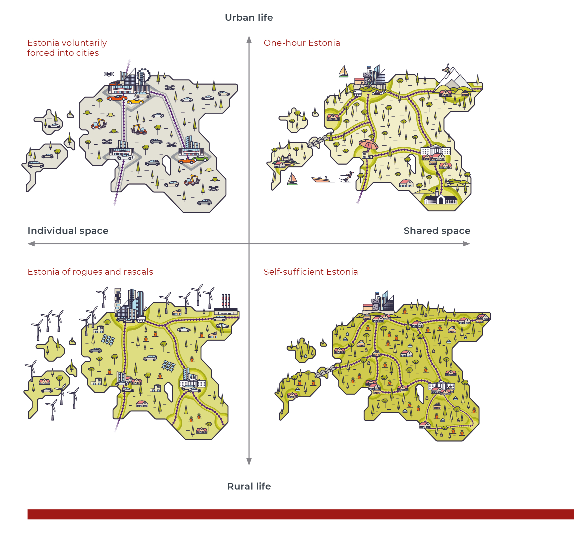

```

``` {block, type='imgsource'}
<span class="imgsource-source">Source:</span> Figure by the author.
```

<!--chapter:end:05.1-chapter.Rmd-->


## Estonia voluntarily forced into cities {-.chapter_section .chapter5_section .future_section}

<div class="map-icon">
```{r, out.width='100%', fig.align='center', echo=FALSE, message=FALSE}
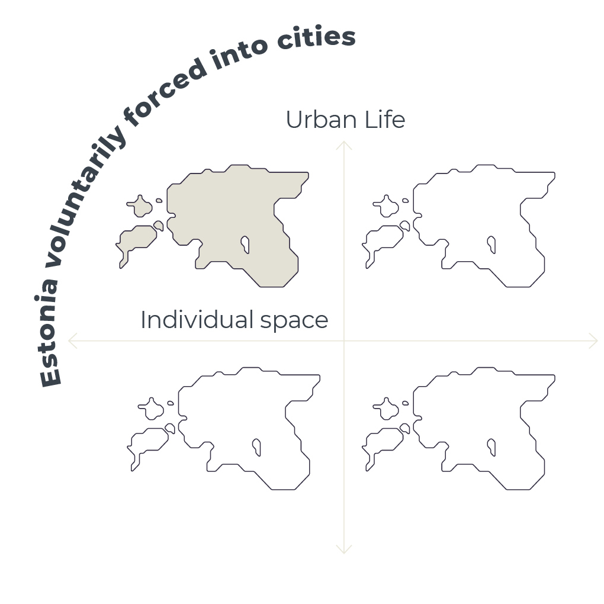
```
</div>


<div><a class="print-btn" href="../vabatahtlikult-linnadesse-sunnitud-eesti.html">EE</a></div>

```{r, out.width='100%', fig.align='center', echo=FALSE, message=FALSE}

knitr::include_graphics("../figures/5-chapter/kaart-1.png")

```

<table class="future-table">
<tbody>

<tr>
<td align="left" class="future-table-black">Urban population:</td>
<td align="right" class="future-table-red">80%</td>
</tr>

<tr>
<td align="left" class="future-table-black">Wealth disparity:</td>
<td align="right" class="future-table-red">high</td>
</tr>

<tr>
<td align="left" class="future-table-black">Spatial inequality:</td>
<td align="right" class="future-table-red">high</td>
</tr>

<tr>
<td align="left" class="future-table-black">Good public space:</td>
<td align="right" class="future-table-red">for the privileged</td>
</tr>

<tr>
<td align="left" class="future-table-black">Data:</td>
<td align="right" class="future-table-red">the ‘all-seeing eye’ of large corporations, unequal distribution of rights</td>
</tr>

<tr>
<td align="left" class="future-table-black">Society’s expenditure on basic infrastructure:</td>
<td align="right" class="future-table-red">high and growing</td>
</tr>

<tr>
<td align="left" class="future-table-black">Socio-economic efficiency:</td>
<td align="right" class="future-table-red">low</td>
</tr>

<tr>
<td align="left" class="future-table-black">Sustainable development goals:</td>
<td align="right" class="future-table-red">not achieved, although some areas are stronger than others</td>
</tr>
</tbody></table>


Driven by the ‘invisible hand’, Estonians and quite a number of New Estonians have gathered in the urban regions of Tallinn, Tartu and Pärnu – rapid housing development now covers the fields surrounding the city, while the historical cities centres themselves have not grown at the same pace. Instead of absent city centres, people meet in shopping and entertainment centres. Instead of city squares, people need car parks and wide roads, because the average Estonian does not want to see the poor or strangers. Besides, it is dangerous to be on the street. There is great economic inequality between regions: the more affluent people live in areas with good schools, tennis clubs and beautiful greenery surrounded by fences and guards. The cities are overwhelmingly segregated and dominated by the homes of the poor and new immigrants, suburban areas have poor schools and connections, and it is dangerous to go out in the evening. The rich live in separate exclusive areas. Tallinn and Pärnu are well connected to the world – the Helsinki Tunnel and Rail Baltica provide good connections for those who can pay for them. Tartu can also be quickly reached by train or private drone capsule. People have no significant sense of community; they tend to explain wealth in terms of merit and poverty in terms of laziness. The data on the ‘lazy’ is for sale to everyone, while the more affluent pay ransom to big companies for some degree of privacy. Society suffers from lifestyle diseases and as there is no supportive sense of community, most Estonians feel lonely. On the happiness index, which has replaced GDP as the main measure of society’s success, Estonia has been falling for several years in a row, and campaigns seeking greater cohesion are not slowing the decline.

<div class="future-illustration">
```{r, out.width='100%', fig.align='center', echo=FALSE, message=FALSE}

knitr::include_graphics("../figures/5-chapter/tulevik-1.png")

```
</div>

<!--chapter:end:05.11-scenario1.Rmd-->

## One-hour Estonia {-.chapter_section .chapter5_section .future_section}

<div class="map-icon">
```{r, out.width='100%', fig.align='center', echo=FALSE, message=FALSE}
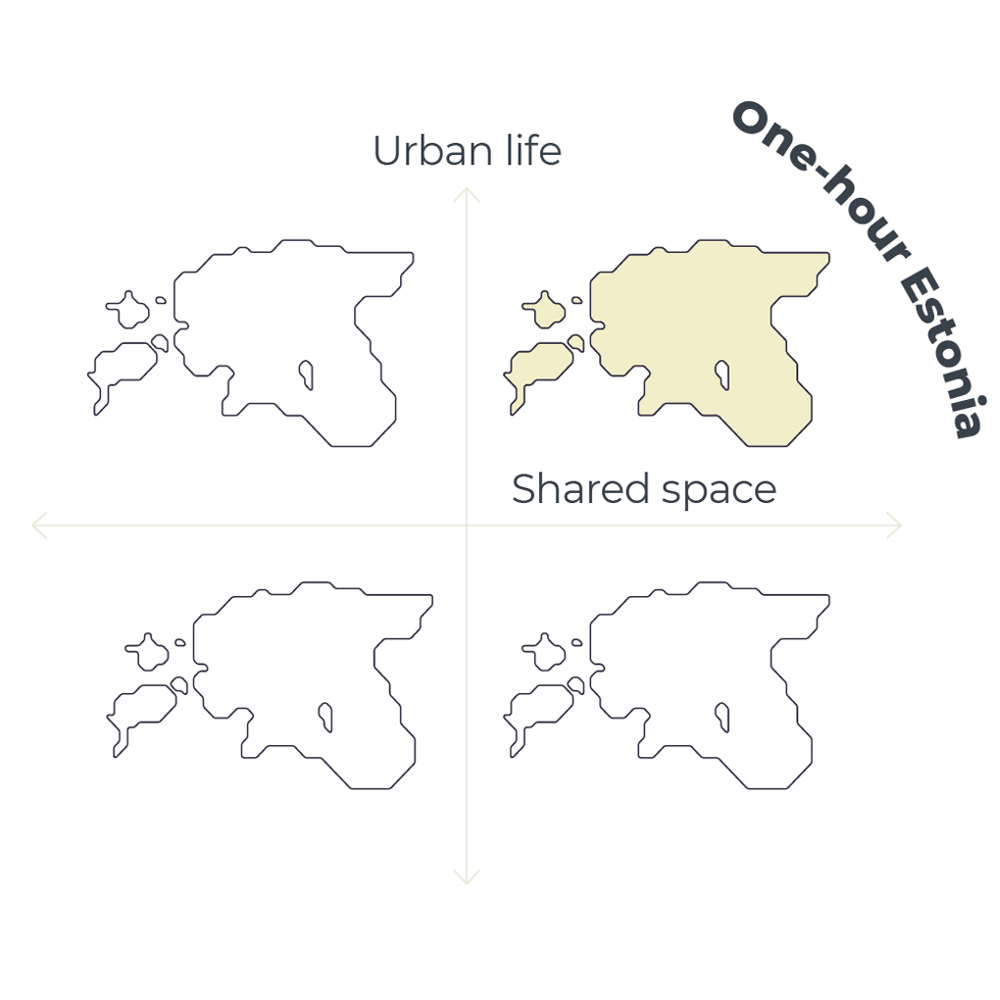
```
</div>

<div><a class="print-btn" href="../ühe-tunni-eesti.html">EE</a></div>

```{r, out.width='100%', fig.align='center', echo=FALSE, message=FALSE}

knitr::include_graphics("../figures/5-chapter/kaart-2.png")

```

<table class="future-table">
<tbody>

<tr>
<td align="left" class="future-table-black">Urban population:</td>
<td align="right" class="future-table-red">80%</td>
</tr>

<tr>
<td align="left" class="future-table-black">Wealth stratification:</td>
<td align="right" class="future-table-red">low</td>
</tr>

<tr>
<td align="left" class="future-table-black">Spatial inequality:</td>
<td align="right" class="future-table-red">low</td>
</tr>

<tr>
<td align="left" class="future-table-black">Good public space:</td>
<td align="right" class="future-table-red">shared and access guaranteed</td>
</tr>

<tr>
<td align="left" class="future-table-black">Data:</td>
<td align="right" class="future-table-red">owned by everyone, rights are protected</td>
</tr>

<tr>
<td align="left" class="future-table-black">Society’s expenditure on basic infrastructure:</td>
<td align="right" class="future-table-red">high, but distributed more equally</td>
</tr>

<tr>
<td align="left" class="future-table-black">Socio-economic efficiency:</td>
<td align="right" class="future-table-red">above average</td>
</tr>

<tr>
<td align="left" class="future-table-black">Sustainable development goals:</td>
<td align="right" class="future-table-red">we are a world leader</td>
</tr>
</tbody></table>

As a result of thorough regional planning, housing development and mobility services are interconnected throughout Estonia, which is why housing has primarily been built in places with train connections. At first, this seemed too restrictive for developers, but people are satisfied and do not long to rely on a personal vehicle. Each urban region has its own face and centres that work on the principle of the circular economy. After artists and then the startup sector moved to the once problematic Ida-Virumaa county, it has gone through a revival and is now one of the most attractive and cosmopolitan areas in Estonia, where artistic people from Russia (Saint Petersburg), Estonia and other countries have a second home. The people of Estonia like to spend time in parks and city squares, where they travel by their chosen means of transport – tram, self-driving capsule, hydrogen bicycle or a combination of these. Cities have a pleasant network of streets and uninterrupted green spaces to help adapt to the climate crisis, and there are many activities in the public sphere that attract passers-by. The 8-80 principle has been applied, which means that both 8- and 80-year-olds can move about in public without requiring assistance from others. There is a lot of talk about maintaining mental health and people are attentive to those close to them who may be going through a difficult period. Communities are committed to some of the tasks previously carried out by the public authorities, such as helping the youngest and oldest, building common gardens, designing streets and courtyards. In larger cities, new immigrants settle in quite smoothly, although in smaller towns they may still be shunned. In the happiness index, Estonia is relatively high and has even risen in the past few years.

<div class="future-illustration">
```{r, out.width='100%', fig.align='center', echo=FALSE, message=FALSE}

knitr::include_graphics("../figures/5-chapter/tulevik-2.png")

```
</div>

<!--chapter:end:05.12-scenario2.Rmd-->

## Estonia of rogues and rascals {-.chapter_section .chapter5_section .future_section}

<div class="map-icon">
```{r, out.width='100%', fig.align='center', echo=FALSE, message=FALSE}
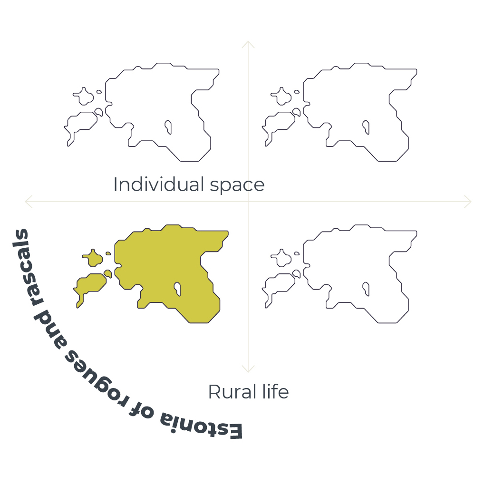
```
</div>

<div><a class="print-btn" href="../krattide-ja-marakrattide-eesti.html">EE</a></div>

```{r, out.width='100%', fig.align='center', echo=FALSE, message=FALSE}

knitr::include_graphics("../figures/5-chapter/kaart-3.png")

```

<table class="future-table">
<tbody>

<tr>
<td align="left" class="future-table-black">Urban population:</td>
<td align="right" class="future-table-red">70%</td>
</tr>

<tr>
<td align="left" class="future-table-black">Wealth disparity:</td>
<td align="right" class="future-table-red">high</td>
</tr>

<tr>
<td align="left" class="future-table-black">Spatial inequality:</td>
<td align="right" class="future-table-red">very high</td>
</tr>

<tr>
<td align="left" class="future-table-black">Good public space:</td>
<td align="right" class="future-table-red">privileged, shared or non-existent, according to the capacity of local governments</td>
</tr>

<tr>
<td align="left" class="future-table-black">Data:</td>
<td align="right" class="future-table-red">concentrated in the hands of large corporations; cybercrime is rampant</td>
</tr>

<tr>
<td align="left" class="future-table-black">Society’s expenditure on basic infrastructure:</td>
<td align="right" class="future-table-red">high and unequally distributed</td>
</tr>

<tr>
<td align="left" class="future-table-black">Socio-economic efficiency:</td>
<td align="right" class="future-table-red">very low</td>
</tr>

<tr>
<td align="left" class="future-table-black">Sustainable development goals:</td>
<td align="right" class="future-table-red">some of the smaller municipalities have met the goals; the overall picture is poor</td>
</tr>
</tbody></table>

There are various large and smaller centres in Estonia, the more capable of which are trying to find their own face – some attract attention by offering high-tech solutions, others attract more and more older people who are engaged in digitised agricultural production. At the same time, there are also quite a few backward areas where the main employer has gone bankrupt and help is nowhere to be found. Only wind turbines and solar panels owned by large corporations stand out in these areas, while the specialists that operate these are not from the local population. New immigrants are spread across the country, especially in smaller places that offer very low-paid jobs that locals themselves do not want or are unable to do, while ageing settlements especially need help from social workers. The situation with addiction disorders and HIV is very poor and these illnesses are considered to be the fault of those affected. Many wealthier people live scattered across the country, as the climate crisis has ruined their appetite for living in the cities: it is popular to say that a true Estonian still lives in a house with their own garden and field. The communal approach is practised by ‘hippies’, but a ‘decent’ person still strives to be better than their neighbour. Due to the scattered population, the quality of public space is fairly poor, and investments are more likely directed to roads. These are of varying quality, and it has been learned from the failure of ambitious infrastructure projects in the past that there is no point in trying too hard. There are various providers of self-driving cars and transport drones, so a good service is available for the more affluent, while the poorer people have to make do with whatever they can – and quite often they cannot. On the happiness index, Estonia is a mediocre laggard.

<div class="future-illustration">
```{r, out.width='100%', fig.align='center', echo=FALSE, message=FALSE}

knitr::include_graphics("../figures/5-chapter/tulevik-3.png")

```
</div>

<!--chapter:end:05.13-scenario3.Rmd-->

## Self-sufficient Estonia {-.chapter_section .chapter5_section .future_section}

<div class="map-icon">
```{r, out.width='100%', fig.align='center', echo=FALSE, message=FALSE}
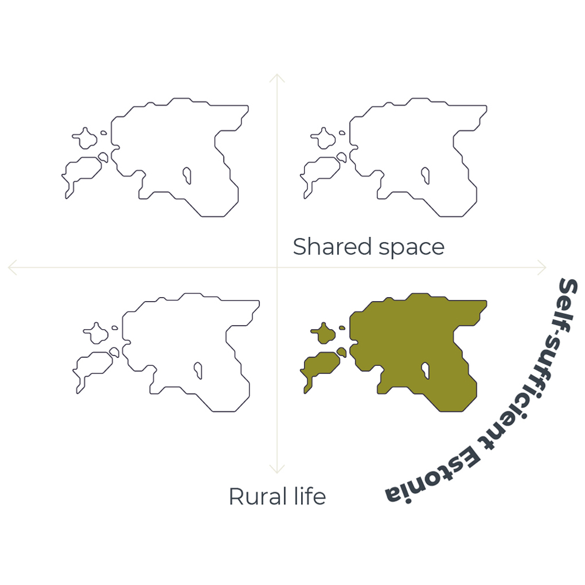
```
</div>

<div><a class="print-btn" href="../isemajandav-eesti.html">EE</a></div>

```{r, out.width='100%', fig.align='center', echo=FALSE, message=FALSE}

knitr::include_graphics("../figures/5-chapter/kaart-4.png")

```

<table class="future-table">
<tbody>

<tr>
<td align="left" class="future-table-black">Urban population:</td>
<td align="right" class="future-table-red">60%</td>
</tr>

<tr>
<td align="left" class="future-table-black">Wealth disparity</td>
<td align="right" class="future-table-red">low, but society is not very rich</td>
</tr>

<tr>
<td align="left" class="future-table-black">Spatial inequality:</td>
<td align="right" class="future-table-red">occurs in some areas</td>
</tr>

<tr>
<td align="left" class="future-table-black">Good public space:</td>
<td align="right" class="future-table-red">a powerful green network, but less of an urban environment</td>
</tr>

<tr>
<td align="left" class="future-table-black">Data:</td>
<td align="right" class="future-table-red">everyone’s own, strong cyber communities</td>
</tr>

<tr>
<td align="left" class="future-table-black">Society’s expenditure on basic infrastructure:</td>
<td align="right" class="future-table-red">high, but distributed more equally</td>
</tr>

<tr>
<td align="left" class="future-table-black">Socio-economic efficiency:</td>
<td align="right" class="future-table-red">above average, but equally distributed</td>
</tr>

<tr>
<td align="left" class="future-table-black">Sustainable development goals:</td>
<td align="right" class="future-table-red">we are slightly ahead of others</td>
</tr>
</tbody></table>

As a result of the climate catastrophe, remote working opportunities and the new community economy, a large share of Estonians have moved to the countryside, to the vicinity of smaller local commuting centres. The demand for services is met by digital solutions as well as a fairly strong campaign culture and the natural economy – people help each other constantly, albeit in a slightly forced way, because a small state cannot provide everything necessary for such a scattered population. Coping and the quality of services also depend on the capacity of the community: where there are good leaders, life progresses, but unfortunately the opposite also happens. Apart from the followers, there are also dissidents that consider other people corrupt. New immigrants are everywhere, especially in communities that have realised the benefits of newcomers. They are highly respected because they help where the natives lack strength. Socio-economically, there is a strong emphasis on home-grown food, home-3D-printed items and cooperative energy production. Just like on old-time farms, a lot is done by people themselves and their families. The whole of Estonia is connected by a rail network, which is also quite well connected with various ‘last kilometre’ solutions, from which everyone can choose a suitable and affordable mode of transport. Public space is largely constituted by the natural environment and active movement in nature has become an integral part of Estonian identity. Estonia is famous in Europe for its viable forests and clean beaches. Estonia ranks well on the happiness index, even recently rising several places, although now it seems to have come to a halt. But who cares about indices when life is good – Estonians think to themselves – and go off to heat their smoke saunas.

<div class="future-illustration">
```{r, out.width='100%', fig.align='center', echo=FALSE, message=FALSE}

knitr::include_graphics("../figures/5-chapter/tulevik-4.png")

```
</div>

<!--chapter:end:05.14-scenario4.Rmd-->

# Contributors and Editors {.chapter6 .chapter6_section .chapter_section}

<div><a class="print-btn" href="../autorid-ja-toimetajad.html">EE</a></div>


### Editor-in-chief {-.chapter6_section}

<div class="author-container" id="helen-sooväli-sepping">

<div class="author-img-container">
```{r, out.width='50%', fig.align='left'}
knitr::include_graphics('../figures/6-authors/HelenSoovali-Sepping.png')
```
</div>

<div>
#### Helen Sooväli-Sepping {-.head-editor-name}
is the Vice-Rector of Sustainable Development, Professor of Environmental Studies and Senior Researcher of Cultural Geography at Tallinn University. She is responsible for the master’s programmes in environmental studies and urban planning at the university. Her main research topics are spatial and landscape planning. Currently, she is most interested in cultural and community aspects, as well as sustainable development and resilience in urban and rural areas, environmental policy, and civic studies.

</div>
</div>

### Editors {-.chapter6_section}

<div class="author-container" id="kristi-grišakov">

<div class="author-img-container">
```{r, out.width='50%', fig.align='left'}
knitr::include_graphics('../figures/6-authors/KristiGrisakov.png')
```
</div>

<div>
#### Kristi Grišakov {-.editor-name}
is a Lecturer at the Academy of Architecture and Urban Studies and the Programme Director for landscape architecture programmes at the Tallinn University of Technology (TalTech). Her research focuses on the use of forecasts and scenarios in spatial analysis and visioning. She has studied cross-border cities (Tallinn-Helsinki), the spatial policy of the EU, including the impact of major infrastructure projects on the local environment and the impact of new technologies on the urban environment.

</div>
</div>


<div class="author-container" id="indrek-ibrus">
<div class="author-img-container">
```{r, out.width='50%', fig.align='left'}
knitr::include_graphics('../figures/6-authors/IndrekIbrus.png')
```
</div>

<div>
#### Indrek Ibrus {-.editor-name}
is a Professor of Media Innovation at the Baltic Film, Media, Arts and Communication School at Tallinn University (TLU), and Head of the TLU Centre of Excellence in Media Innovation and Digital Culture. He is also in charge of the doctoral programme in audiovisual arts and media studies at TLU. His main research topics are media innovation and digital culture, linked to economic innovation research and a variety of cultural research methods and approaches.

</div>
</div>


<div class="author-container" class="epp-lankots">
<div class="author-img-container">
```{r, out.width='50%', fig.align='left'}
knitr::include_graphics('../figures/6-authors/EppLankots.png')
```
</div>

<div>
#### Epp Lankots {-.editor-name}
is the Vice Rector of Research and Senior Researcher at the Institute of Art History and Visual Culture at the Estonian Academy of Arts. Her research topics include 20th-century architecture and living environment, Soviet studies, spatial and material culture theories, 20th-century architectural historiography and art historiography. In 2015, she received the Annual Award of the Cultural Endowment of Estonia for her research in architecture.

</div>
</div>


<div class="author-container" id="kadri-leetmaa">
<div class="author-img-container">
```{r, out.width='50%', fig.align='left'}
knitr::include_graphics('../figures/6-authors/KadriLeetmaa.png')
```
</div>

<div>
#### Kadri Leetmaa {-.editor-name}
is a Senior Researcher of human geography at the Institute of Ecology and Earth Sciences of the University of Tartu (UT), and Head of the UT Centre for Migration and Urban Studies. Her research topics include migration and inequality in space, people’s preferences for living in cities, inter-ethnic contacts in society and space, as well as urban and regional planning. Since 2017, she has been the Estonian representative of the EU cooperation programme URBACT.

</div>
</div>


<div class="author-container" id="asko-lõhmus">
<div class="author-img-container">
```{r, out.width='50%', fig.align='left'}
knitr::include_graphics('../figures/6-authors/AskoLohmus.png')
```
</div>

<div>
#### Asko Lõhmus {-.editor-name}
is an animal ecologist, Senior Researcher and Head of the Chair of Natural Resources at the University of Tartu. Over the past decades, his research has expanded to include a broad range of subjects in biodiversity conservation and sustainable development, especially the sustainable management of natural ecosystems. He has been involved as an expert in many national planning processes, and his interests include managing sustainable development, for example, through civil society.

</div>
</div>

### Contributors {-.chapter6_section}

<div class="author-container" id="dago-antov">
<div class="author-img-container">
```{r, out.width='50%', fig.align='left'}
knitr::include_graphics('../figures/6-authors/DagoAntov.png')
```
</div>

<div>
#### Dago Antov {-.author-name}
is a Professor of Transport Planning and the Head of the Research Centre of Logistics and Transportation at the Tallinn University of Technology (TalTech). His main research topics are mobility, integration of modes of transport, analysis of traffic networks, and the effects of traffic and traffic safety in particular. He has published more than 40 scientific articles and supervised nearly 50 doctoral and master’s theses. He has taught mobility-related courses at TalTech, the Estonian Academy of Arts, the Estonian Academy of Security Sciences, the University of Tartu and elsewhere.

</div>
</div>

<div class="author-container" id="mihkel-kaevats">
<div class="author-img-container">
```{r, out.width='50%', fig.align='left'}
knitr::include_graphics('../figures/6-authors/MihkelKaevats.png')
```
</div>

<div>
#### Mihkel Kaevats {-.author-name}
is a poet, critic, PhD student at Tallinn University and an activist, who is currently one of the authors of the Tallinn 2021+ strategy. He was one of the founders of the Prussakov Cycling Association (1997–2009) and the Uus Maailm Society (2006–2013). As a passionate cyclist and walker, he is constantly aware of space and the people who use it. The strategy being prepared for Tallinn with his involvement focuses on good public space and improved mobility.

</div>
</div>

<div class="author-container" id="veronika-kalmus">
<div class="author-img-container">
```{r, out.width='50%', fig.align='left'}
knitr::include_graphics('../figures/6-authors/VeronikaKalmus.png')
```
</div>

<div>
#### Veronika Kalmus {-.author-name}
is a Professor of Sociology at the University of Tartu. Her research interests are related to generations, socialisation, education, values, civic participation of young people, media and time use, and the acceleration of social changes, including social time. As an active member of the international research network EU Kids Online and head of the Estonian working group, she focuses on how children and youth use the internet and the social mediation of their internet use. In 2008, she received the Young Scientist Award from the Cultural Foundation of the President of Estonia.

</div>
</div>

<div class="author-container" id="raul-kalvo">
<div class="author-img-container">
```{r, out.width='50%', fig.align='left'}
knitr::include_graphics('../figures/6-authors/RaulKalvo.png')
```
</div>

<div>
#### Raul Kalvo {-.author-name}
is an architect, founder of the company inphysica technology, and Lecturer of Digital Geometry at the Estonian Academy of Arts. His main interest is decision-making related to spatial data, and the resulting software development. The most wide-spread of these is the Urban Network Analysis toolbox for Rhino. He is involved in several mobility research and strategy projects in Estonia and environmental health impact assessments in Finland. In addition to research, he is involved in projects ranging from interior architecture to urban development.

</div>
</div>

<div class="author-container" id="elo-kiivet">
<div class="author-img-container">
```{r, out.width='50%', fig.align='left'}
knitr::include_graphics('../figures/6-authors/EloKiivet.png')
```
</div>

<div>
#### Elo Kiivet {-.author-name}
is an architect and urbanist, a board member of the Urban Lab, city architect of Paide and, for the fourth year, curator of the outdoor areas and urban spaces section of the opinion festival Arvamusfestival in Paide. Her main interests are public space, place-making and spatial education. She has taught at the TTK University of Applied Sciences, Tallinn University and the Estonian Academy of Arts, as well as at the School of Architecture (Arhitektuurikool) and Tallinn Secondary School of Arts.

</div>
</div>

<div class="author-container" id="keiti-kljavin">
<div class="author-img-container">
```{r, out.width='50%', fig.align='left'}
knitr::include_graphics('../figures/6-authors/KeitiKljavin.png')
```
</div>

<div>
#### Keiti Kljavin {-.author-name}
is an urbanist, board member of the Urban Lab, and editor of the Estonian Urbanists Review U. She currently supervises master’s students in urban studies and interior architecture at the department of Architecture and Urban Design at the Estonian Academy of Arts with their theses and studio work.

</div>
</div>

<div class="author-container" id="kaija-luisa-kurik">
<div class="author-img-container">
```{r, out.width='50%', fig.align='left'}
knitr::include_graphics('../figures/6-authors/Kaija-LuisaKurik.png')
```
</div>

<div>
#### Kaija-Luisa Kurik {-.author-name}
is a PhD student at the Manchester School of Architecture and project manager for the Heritage Action Zone regeneration project in Rochdale. Her main research topics are urban regeneration, post-socialist urban space and changes in planning practice.

</div>
</div>

<div class="author-container" id="ragne-kõuts-klemm">
<div class="author-img-container">
```{r, out.width='50%', fig.align='left'}
knitr::include_graphics('../figures/6-authors/RagneKouts-Klemm.png')
```
</div>

<div>
#### Ragne Kõuts-Klemm {-.author-name}
is an Associate Professor of the Sociology of Journalism and Deputy Head of the Institute of Social Studies at the University of Tartu. Her research focuses on media use and societal change, and more broadly, the role of media with regard to social cohesion. Her current research topics also include the analysis and interpretation of changes in journalism.

</div>
</div>

<div class="author-container" id="anneli-kährik">
<div class="author-img-container">
```{r, out.width='50%', fig.align='left'}
knitr::include_graphics('../figures/6-authors/AnneliKahrik.png')
```
</div>

<div>
#### Anneli Kährik {-.author-name}
is a Senior Research Fellow in Urban Geography at the University of Tartu. Her main research topics are migration, segregation, urban and housing policy. Her research currently focuses on the links between segregation and integration in different spheres of life (family, place of residence, school, work), which she studies on the basis of large-scale national data (censuses, registers) from Estonia and Finland. Between 2013–2016, she was a fellow at Uppsala University, studying segregation in Sweden. She has published articles in high-level academic journals.

</div>
</div>

<div class="author-container" id="mait-lang">
<div class="author-img-container">
```{r, out.width='50%', fig.align='left'}
knitr::include_graphics('../figures/6-authors/MaitLang.png')
```
</div>

<div>
#### Mait Lang {-.author-name}
is a Senior Research Fellow at Tartu Observatory, University of Tartu, and an Associate Professor at the Institute of Forestry and Rural Engineering at the Estonian University of Life Sciences. His main research topics are related to the remote monitoring of nature, and processing spatial and remote monitoring data.

</div>
</div>

<div class="author-container" id="bradley-loewen">
<div class="author-img-container">
```{r, out.width='50%', fig.align='left'}
knitr::include_graphics('../figures/6-authors/BradleyLoewen.png')
```
</div>

<div>
#### Bradley Loewen {-.author-name}
has a PhD in economics from the University of Tartu and was a Marie Curie Early Stage Researcher in the Innovative Training Network RegPol2 based in the Czech Republic, Hungary and Estonia. He is a Researcher in Sustainable Built Environment at the Norwegian University of Science and Technology NTNU, and has held positions at the University of British Columbia and University of Toronto. His research interests span European urban and regional planning, policy, institutions, governance and innovation.

</div>
</div>

<div class="author-container" id="mari-liis-madisson">
<div class="author-img-container">
```{r, out.width='50%', fig.align='left'}
knitr::include_graphics('../figures/6-authors/Mari-LiisMadisson.png')
```
</div>

<div>
#### Mari-Liis Madisson {-.author-name}
is a Research Fellow in Semiotics at the University of Tartu. Her main research topics are identity constructions, strategic narratives and disinformation in online environments. She has collaborated with the Estonian Military Academy and participated in research projects involved with military communications deception. In 2019, she began a post-doctoral fellowship at Queen’s University Belfast, dedicated to the semiotic study of strategic conspiracy narratives.

</div>
</div>

<div class="author-container" id="tõnu-oja">
<div class="author-img-container">
```{r, out.width='50%', fig.align='left'}
knitr::include_graphics('../figures/6-authors/TonuOja.png')
```
</div>

<div>
#### Tõnu Oja {-.author-name}
is a Professor and the Chair of Geoinformatics and Cartography at the University of Tartu. His main research interests are landscape ecology and sustainable development.

</div>
</div>

<div class="author-container" id="arko-olesk">
<div class="author-img-container">
```{r, out.width='50%', fig.align='left'}
knitr::include_graphics('../figures/6-authors/ArkoOlesk.png')
```
</div>

<div>
#### Arko Olesk {-.author-name}
is a research journalist and Lecturer of Research Communication at the Baltic Film, Media, Arts and Communication School, Tallinn University. His main research topic is researcher interaction with the press; he is also interested in innovation communication and environmental communication. He hosts the popular science programme *Puust ja punaseks* on Raadio 2.

</div>
</div>

<div class="author-container" id="hans-orru">
<div class="author-img-container">
```{r, out.width='50%', fig.align='left'}
knitr::include_graphics('../figures/6-authors/HansOrru.png')
```
</div>

<div>
#### Hans Orru {-.author-name}
is an Associate Professor of Environmental Health at the University of Tartu and a Visiting Fellow at Umeå University. His main research area is the health impact of the external environment. Within his research, he has focused on air pollution and climate change, but more recently also on the oil shale sector, indoor air pollution and the health impact of noise. Over the past 15 years, he has been involved in more than 30 research or development projects which have had a significant effect in raising public awareness about the health effects of the environment.

</div>
</div>

<div class="author-container" id="kati-orru">
<div class="author-img-container">
```{r, out.width='50%', fig.align='left'}
knitr::include_graphics('../figures/6-authors/KatiOrru.png')
```
</div>

<div>
#### Kati Orru {-.author-name}
is a Senior Research Fellow in Sustainability Sociology at the University of Tartu Institute of Social Sciences and a Visiting Fellow at King’s College London. Her research topics include social and regional inequality in transport and energy consumption and its environmental impacts, the methodology for assessing the social impact of planning, and the sustainable development of socio-technical systems. She is in charge of the work package H2020 in the BuildERS project on the resilience of communities in emergency situations. She was a post-doctoral researcher in the Environmental and Health Psychology Research Group at Umeå University.

</div>
</div>

<div class="author-container" id="toomas-paaver">
<div class="author-img-container">
```{r, out.width='50%', fig.align='left'}
knitr::include_graphics('../figures/6-authors/ToomasPaaver.png')
```
</div>

<div>
#### Toomas Paaver {-.author-name}
is a doctoral student of architecture and urban planning at the Estonian Academy of Arts. His main research topic is the social role of the work of an architect. His varied practice in the field of spatial design includes work as a city and state official, a community activist, an architect and a teacher. His work has involved planning, construction documents for streets and buildings, terms of reference, legislation, and establishing connections in the processes of spatial design.

</div>
</div>

<div class="author-container" id="ingmar-pastak">
<div class="author-img-container">
```{r, out.width='50%', fig.align='left'}
knitr::include_graphics('../figures/6-authors/IngmarPastak.png')
```
</div>

<div>
#### Ingmar Pastak {-.author-name}
is a PhD candidate in geography and is working as a Junior Research Fellow of Human Geography at the University of Tartu. His main research topics are socio-spatial inequality, gentrification as a change in the demographic process and the business environment, and more broadly, urban planning from smart city innovations to participatory practices. He teaches courses related to urban geography and urban planning at the University of Tartu.

</div>
</div>

<div class="author-container" id="johanna-pirrus">
<div class="author-img-container">
```{r, out.width='50%', fig.align='left'}
knitr::include_graphics('../figures/6-authors/JohannaPirrus.png')
```
</div>

<div>
#### Johanna Pirrus {-.author-name}
is a PhD student of human geography at the Department of Geography, University of Tartu. Her main research topic is participatory urban planning and management. Her current research focuses on public and social space issues and good practices in Soviet-era mass housing districts. In addition to research, she also teaches and supervises theses at the Department of Geography.

</div>
</div>

<div class="author-container" id="bianka-plüschke-altof">
<div class="author-img-container">
```{r, out.width='50%', fig.align='left'}
knitr::include_graphics('../figures/6-authors/BiankaPluschke-Altof.png')
```
</div>

<div>
#### Bianka Plüschke-Altof {-.author-name}
is a Researcher in Environmental Sociology at Tallinn University. She has studied and worked at Humboldt-Universität zu Berlin, the University of Warsaw, the Slovak University of Technology and the University of Tartu. Her research focuses on socio-spatial inequality and the practices and discourses of space creation. Her doctoral thesis discussed territorial stigmatisation in Estonian rural areas. She is also a member of the Tallinn University research group 'Human-nature interactions in an urbanising world' investigating urban environment issues.

</div>
</div>

<div class="author-container" id="age-poom">
<div class="author-img-container">
```{r, out.width='50%', fig.align='left'}
knitr::include_graphics('../figures/6-authors/AgePoom.png')
```
</div>

<div>
#### Age Poom {-.author-name}
is a post-doctoral researcher at the University of Helsinki and Lecturer of Environmental Protection at the University of Tartu. She studies the interrelationship between human mobility, activity spaces and the environment, including exposure to green spaces and environmental risks. She is interested in sustainable mobility and consumption, as well as the smart and sustainable city. As a member of the Mobility Lab at the University of Tartu, she is involved with the development of the infrastructure for spatial research based on mobile positioning data, and external collaboration projects.

</div>
</div>

<div class="author-container" id="renee-puussepp">
<div class="author-img-container">
```{r, out.width='50%', fig.align='left'}
knitr::include_graphics('../figures/6-authors/ReneePuusepp.png')
```
</div>

<div>
#### Renee Puusepp {-.author-name}
is an architect, founder and CEO of Creatomus Solutions, and a Senior Researcher at the Estonian Academy of Arts (EAA). He holds the position of Research Director at the Faculty of Architecture, EAA. In his earlier research, he focused primarily on creating dynamic simulations and linking these to architectural and planning tools and methods. He is currently in charge of R&D for mass-customised prefabricated housing.

</div>
</div>

<div class="author-container" id="siim-raie">
<div class="author-img-container">
```{r, out.width='50%', fig.align='left'}
knitr::include_graphics('../figures/6-authors/SiimRaie.png')
```
</div>

<div>
#### Siim Raie {-.author-name}
is the Director General of the Estonian National Heritage Board. He has studied business administration at the Estonian Business School, and heritage protection and conservation/restoration at the Estonian Academy of Arts, where he is also a PhD student. His thesis focuses on the owners of cultural monuments, their identity and motivation. Previously, he has worked as the Director of the Office of the President of the Republic of Estonia, and the Director General of the Estonian Chamber of Commerce and Industry.

</div>
</div>

<div class="author-container" id="merlin-rehema">
<div class="author-img-container">
```{r, out.width='50%', fig.align='left'}
knitr::include_graphics('../figures/6-authors/MerlinRehema.png')
```
</div>

<div>
#### Merlin Rehema {-.author-name}
is a PhD student of cultural geography at the Tallinn University School of Humanities and a mobility specialist at Hendrikson & Ko. Her doctoral thesis examines the physical and social factors that influence walking for transportation and their possible mechanisms of influence. Her main research interests and areas of work are mobility studies at different levels, and sustainable transport planning through mobility plans and changes in the urban space.

</div>
</div>

<div class="author-container" id="liina-remm">
<div class="author-img-container">
```{r, out.width='50%', fig.align='left'}
knitr::include_graphics('../figures/6-authors/LiinaRemm.png')
```
</div>

<div>
#### Liina Remm {-.author-name}
is a Research Fellow in Conservation Biology at the University of Tartu. Her research deals with techniques for conserving biodiversity and rewilding. Her topics of interest have ranged from sustainable forest management and restoration of marshes to the mapping of natural goods or ecosystem services. She has contributed to more than 15 scientific articles and many popular science articles. She is an educator in the field of ecology as a supervisor of students, lecturer and a leader of the Estonian Fund for Nature.

</div>
</div>

<div class="author-container" id="antti-roose">
<div class="author-img-container">
```{r, out.width='50%', fig.align='left'}
knitr::include_graphics('../figures/6-authors/AnttiRoose.png')
```
</div>

<div>
#### Antti Roose {-.author-name}
is the Head of Climate and Energy Projects at the Tartu Regional Energy Agency. His research on urbanisation has focused on suburbs, energy use, planning and adaptation to climate change. He was an editor of the textbook *Peatükke planeerimisest* (*Chapters on Planning*, 2013). He has compiled spatial development documents both at the EU level and at the level of small municipalities. Roose is an expert on European Territorial Co-operation.

</div>
</div>

<div class="author-container" id="kalev-sepp">
<div class="author-img-container">
```{r, out.width='50%', fig.align='left'}
knitr::include_graphics('../figures/6-authors/KalevSepp.png')
```
</div>

<div>
#### Kalev Sepp {-.author-name}
is a Professor of Environmental Protection and Landscape Management at the Estonian University of Life Sciences, and the head of the chair of the same name. His broad research interests include changes in land use and their impact on biodiversity, landscape planning, the sustainability of protected areas, the impact of nature conservation on regional development, the assessment and mapping of natural assets, and landscape monitoring using remote sensing. He has been involved as an expert in the preparation of many national methodologies and strategy papers. He is an expert at the International Union for the Conservation of Nature and Natural Resources.

</div>
</div>

<div class="author-container" id="andra-siibak">
<div class="author-img-container">
```{r, out.width='50%', fig.align='left'}
knitr::include_graphics('../figures/6-authors/AndraSiibak.png')
```
</div>

<div>
#### Andra Siibak {-.author-name}
is a Professor of Media Studies in the Faculty of Social Sciences, and PhD Programme Director in Media and Communication at the University of Tartu. Her main research interests are related to how children and youths use the internet, the mediation of internet use, new media audiences, and privacy. In 2015, she received the Young Scientist Award from the Cultural Foundation of the President of the Republic of Estonia; she was the 2017 Honoree of the Ten Outstanding Young Persons (TOYP) programme in Estonia.

</div>
</div>

<div class="author-container" id="triin-talk">
<div class="author-img-container">
```{r, out.width='50%', fig.align='left'}
knitr::include_graphics('../figures/6-authors/TriinTalk.png')
```
</div>

<div>
#### Triin Talk {-.author-name}
is a restorer and heritage conservationist who has worked at Tallinn Culture Department as a specialist of built-up areas of cultural and environmental value, and as the chief inspector of immovable monuments at the National Heritage Board.

</div>
</div>

<div class="author-container" id="tauri-tuvikene">
<div class="author-img-container">
```{r, out.width='50%', fig.align='left'}
knitr::include_graphics('../figures/6-authors/TauriTuvikene.png')
```
</div>

<div>
#### Tauri Tuvikene {-.author-name}
is an urban geographer working as a Senior Researcher at the Centre for Landscape and Culture at the Tallinn University School of Humanities. His research interests include mobility cultures and post-socialist urban studies. He has published scientific articles on these topics in distinguished journals such as *Current Sociology* and *IJURR*. He was a co-editor of the book *Post-Socialist Urban Infrastructures* (Routledge, 2019). Since 2019, he has been in charge of an international project on public transport as public space, by the network Humanities in the European Research Area (HERA).

</div>
</div>

<div class="author-container" id="kärt-vaarmari">
<div class="author-img-container">
```{r, out.width='50%', fig.align='left'}
knitr::include_graphics('../figures/6-authors/KartVaarmari.png')
```
</div>

<div>
#### Kärt Vaarmari {-.author-name}
is the Development Manager and Member of the Executive Committee of the Estonian Fund for Nature. She has previously worked as an environmental lawyer and was a co-founder of the Estonian Environmental Law Center. In environmental law, she has focused on environmental rights, public participation in environmental decision-making, and the role of NGOs in representing the public interest in environmental issues. She was the editor and co-author of the executive summary of the General Part of the Environmental Code Act (2015) and has published articles in the *Journal for European Environmental and Planning Law*, *Juridica* and other journals.

</div>
</div>

<div class="author-container" id="siim-vahtrus">
<div class="author-img-container">
```{r, out.width='50%', fig.align='left'}
knitr::include_graphics('../figures/6-authors/SiimVahtrus.png')
```
</div>

<div>
#### Siim Vahtrus {-.author-name}
works at the Estonian Environmental Law Center. He has compiled guidelines for environmental impact assessment, public involvement and spatial planning. He was a co-author of the executive summary of the General Part of the Environmental Code Act (2015) and *Keskkonnamõju strateegilise hindamise käsiraamat* (*Handbook of Strategic Environmental Assessment*, 2017) He has published articles in international journals such as *Juridica International*, *European Energy*, the *Environmental Law Review*, and *Impact Assessment and Project Appraisal*.

</div>
</div>

<div class="author-container" id="andreas-ventsel">
<div class="author-img-container">
```{r, out.width='50%', fig.align='left'}
knitr::include_graphics('../figures/6-authors/AndreasVentsel.png')
```
</div>

<div>
#### Andreas Ventsel {-.author-name}
is a Senior Researcher of Semiotics at the University of Tartu. His main research topics are political semiotics, visual semiotics, strategic narratives in information warfare and influence activities in online environments. He has been involved in more than a dozen research projects. He has collaborated with the Estonian Military Academy and is currently in charge of a research project dedicated to military communications deception.

</div>
</div>

<div class="author-container" id="annika-väiko">
<div class="author-img-container">
```{r, out.width='50%', fig.align='left'}
knitr::include_graphics('../figures/6-authors/AnnikaVaiko.png')
```
</div>

<div>
#### Annika Väiko {-.author-name}
has been a research assistant at the Centre for Migration and Urban Studies at the University of Tartu since 2014. She holds a master’s degree in human geography and regional planning. Her main research topics are migration, urban segregation and residential mobility.

</div>
</div>

<!--chapter:end:06.0-authors.Rmd-->

# Info {.chapter7 .chapter7_section .chapter_section}

<div id="info-lang-btn"><a class="print-btn" href="../info.html">EE</a></div>

Editor-in-chief: Helen Sooväli-Sepping<br>
Reviewer: Mikko Lagerspetz<br>
Coordinator and assistant: Anni Müüripeal<br>
English translation: Refiner Translations and Juta Ristsoo (Ch. 4)<br>
English language editing: Refiner Translations (Margus Elings, Michael Haagensen)<br>
Design: Disainikorp<br>
Graphics: Karel Korp<br>
Photos: Annika Haas, Kaupo Kalda<br>

Digital report: Taavet Kutsar, Maarja-Leena Saar<br>
The source code for the digital version of the report is available at: https://github.com/Demokraatialabor/EIA_2019<br>


Media coverage (in Estonian):
https://www.kogu.ee/tegevus/olemus-ja-roll/eesti-inimarengu-aruanne/eesti-inimarengu-aruanne-2018-2019/

Publisher: Estonian Cooperation Assembly<br>
Copyright: authors and Estonian Cooperation Assembly, 2020<br>


<div class="kogu-logo"><a href="https://www.kogu.ee"></a></div>

<!--chapter:end:07.0-info.Rmd-->

